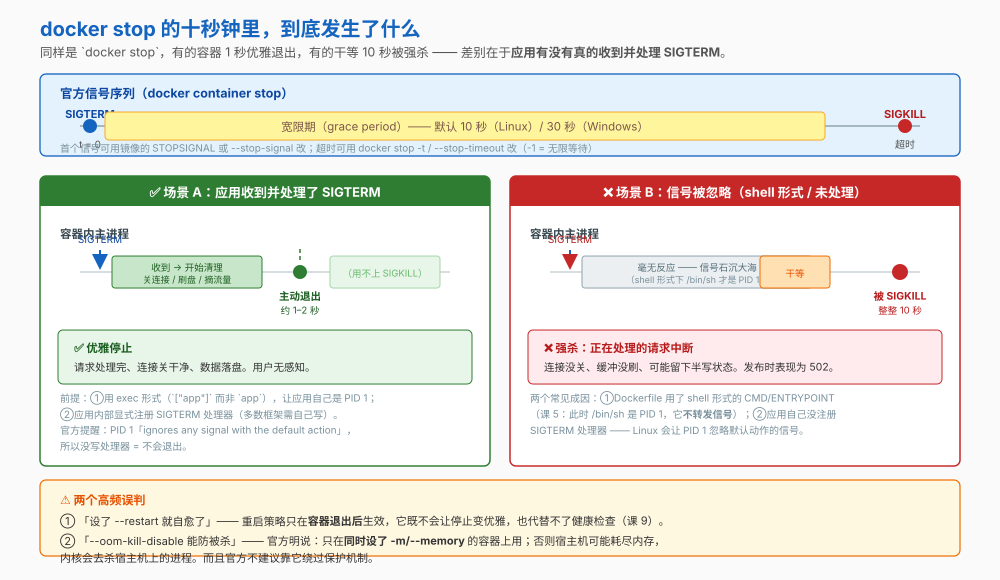
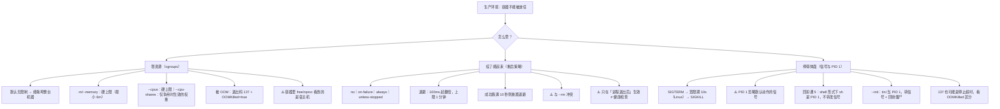

# 第 10 课：资源限制与进程管理

> 所属阶段：阶段 4《生产落地》｜ 水平：入门 ｜ 本课知识点：cgroups 资源限制、重启策略与自愈、优雅停止与 PID 1
> 故事情节：`order-service` 上线后被 OOM 杀掉，而且每次 `docker stop` 都收不到优雅退出

## 🎯 本课目标

- 正确设置内存与 CPU 限制，知道 OOM 的真正危害不止于"这个容器死了"
- 选对重启策略，并理解它不能替代健康检查
- 让容器能优雅停止，理解 PID 1 为什么会"收不到信号"

## 📌 知识点导航

| 知识点 | 关键点 | 状态 |
|--------|--------|------|
| cgroups 资源限制 | --memory / --cpus 的语义 / OOMKilled 与退出码 137 / 容器内 free、nproc 看到的是宿主机这个经典坑 | ✅ 已完成 |
| 重启策略与自愈 | no / on-failure / always / unless-stopped 的差别 / 退出码语义 / 重启策略不等于健康检查 | ✅ 已完成 |
| 优雅停止与 PID 1 | SIGTERM → 宽限期 → SIGKILL / 为什么 exec 形式才收得到信号（回扣阶段 2 课 5）/ PID 1 的僵尸进程回收责任 | ✅ 已完成 |

---

## 第一幕：起源与场景引入

课 9 结束时，环境变成了一份 `compose.yaml`。小杨把它搬到了生产服务器上，跑得很顺。

几天后的半夜，告警响了：`order-service` 没了。

他登上去查，日志里**什么错误都没有**——进程就像凭空消失。只有 `docker ps -a` 里留下一行线索：

```
CONTAINER ID   IMAGE            STATUS                        NAMES
a1b2c3d4e5f6   order-service    Exited (137) 3 minutes ago    order-service-1
```

**退出码 137**。他想起课 2 讲过：137 = 128 + 9 = **被 SIGKILL 杀掉**。谁杀的？**内核的 OOM killer**。

更糟的是：他发现**同一台机器上的 redis 也一起挂了**。因为内存耗尽时，内核 OOM killer 是**按自己的判断选进程杀**的，不一定杀真正吃内存那个。

他赶紧加了 `--restart always`，服务确实能自动起来。但每次发布又遇到新问题：

```bash
$ time docker stop order-service-1
order-service
real    0m10.28s
```

**每次都要等 10 秒**，而且总有用户请求在这一刻被打断。

> 🎬 **场景**：三个问题叠在一起——容器会拖垮整台机器、被杀后能起来但起得粗暴、停止时不能优雅退出。**生产环境的容器，到底该怎么"管"？**

---

## 第二幕：认知冲突

> ❓ **问题**：内存耗尽的危害为什么不止于一个容器？限制该设在哪一层？`docker stop` 为什么要等 10 秒，应用为什么"收不到"信号？

三层答案：

1. **内存与 CPU 怎么限制** → cgroups（知识点 1）——以及为什么"不限制"会危及整台机器
2. **挂了怎么自动起来** → 重启策略（知识点 2）
3. **怎么让它停得体面** → 信号与 PID 1（知识点 3）

---

## 第三幕：层层揭示

### 知识点 1：cgroups 资源限制

> 本知识点关键点：--memory / --cpus 的语义 / OOMKilled 与退出码 137 / 容器内 free、nproc 看到的是宿主机这个经典坑

#### 一句话定义

容器**默认没有任何资源限制**；用 `--memory` / `--cpus` 等参数给它设上限，底层是 Linux 的 **cgroups** 在记账和强制执行。

#### 直觉建立（类比）

**合租**：不装分表的话，有人开大功率空调，就是**全屋一起跳闸**——而且跳闸后电工（内核 OOM killer）会**随机拉掉几路电**，不一定拉那台空调。

给每个房间装**独立电表 + 空开**（资源限制），过载时只跳这一个房间（这个容器被杀），其他人不受影响。

> 💡 **类比的边界**：真实空开跳闸后要手动合闸；容器的 OOM 是**这个容器直接死**，需要外部（重启策略、编排系统）来决定要不要再拉起来——这正是知识点 2 要讲的。

#### 核心原理

**一、默认无限制（官方原话）**

> "By default, a container has **no resource constraints** and can use as much of a given resource as the host's kernel scheduler allows."

**二、OOM 的真实危害，比"这个容器死了"严重得多**

官方描述：

> "if the kernel detects that there isn't enough memory to perform important system functions, it throws an `OOME`... and starts killing processes to free up memory. **Any process is subject to killing, including Docker and other important applications. This can effectively bring the entire system down if the wrong process is killed.**"

**Docker 做了什么自保**（官方）：

- 调高 **Docker daemon 的 OOM 优先级**，让它比系统其他进程**更不容易**被杀
- 但**容器的 OOM 优先级不做调整** → 结果是：**单个容器比 daemon 和系统进程更容易被杀**

官方还明确不建议绕过这套保护：

> "You shouldn't try to circumvent these safeguards by manually setting `--oom-score-adj` to an extreme negative number... or by setting `--oom-kill-disable` on a container."

**三、内存限制**

| 参数 | 官方说明 |
|---|---|
| `-m` / `--memory` | 容器可用的**最大内存**。**最小值是 `6m`** |
| `--memory-swap` | 允许换出到磁盘的量。**只有同时设了 `--memory` 才有意义** |
| `--memory-reservation` | **软限制**，必须小于 `--memory` 才生效；不保证不超限 |
| `--memory-swappiness` | 0–100，默认**继承宿主机** |
| `--oom-kill-disable` | 禁用 OOM killer ⚠️ 见下 |

**`--memory-swap` 的五种取值**（最容易搞错的一组）：

| 设置 | 含义 |
|---|---|
| `--memory=300m --memory-swap=1g` | 总共 1g = **300m 内存 + 700m swap** |
| `--memory-swap=0` | 该设置被**忽略**，等同于未设置 |
| `--memory-swap` **等于** `--memory` | **容器完全不能用 swap** |
| `--memory=300m`，**不设** `--memory-swap` | 可再用与 memory 等量的 swap → **总共 600m** |
| `--memory-swap=-1` | swap **不限**（受宿主机可用量约束） |

> ⚠️ 官方对 `--oom-kill-disable` 的限制：**"Only disable the OOM killer on containers where you have also set the `-m/--memory` option. If the `-m` flag isn't set, the host can run out of memory and the kernel may need to kill the host system's processes to free memory."**

**四、CPU 限制：硬上限 vs 相对权重**

| 参数 | 性质 | 官方说明 |
|---|---|---|
| `--cpus=1.5` | **硬上限** | "the container is guaranteed at most one and a half of the CPUs"。等价于 `--cpu-period=100000 --cpu-quota=150000` |
| `--cpu-shares=512` | **软限制 / 相对权重** | 默认 1024。"This is only enforced **when CPU cycles are constrained**. When plenty of CPU cycles are available, all containers use as much CPU as they need." |
| `--cpuset-cpus=0-3` | 绑核 | 限定只能用哪些核，第一个核编号是 0 |

> **`--cpus` 和 `--cpu-shares` 不是一回事**：前者是天花板（再闲也不能超），后者是"忙的时候怎么分"（闲的时候随便用）。官方强调 shares "doesn't guarantee or reserve any specific CPU access"。

**五、OOMKilled 与退出码 137**

被 OOM 杀掉的容器：

- 退出码 **137**（= 128 + 9，SIGKILL）
- `docker inspect` 里 **`State.OOMKilled` 为 `true`** ← 这是**判定的铁证**，比退出码更可靠

**六、⚠️ 经典坑：容器里看到的不是容器的**

官方明确确认了其中一条：

> "Inside the container, tools like `free` report **the host's available swap**, not what's available inside the container. **Don't rely on the output of `free` or similar tools** to determine whether swap is present."

那该看什么？官方给的路径是：**应用去读 cgroup 文件**。

> "Linux sets this on the cgroup and applications in a container can query it at `/sys/fs/cgroup/memory/memory.limit_in_bytes`."

> ⏳ **置信度说明**：官方明确确认的是 `free` 报告的 **swap** 是宿主机的。而"容器里 `free` 的总内存、`nproc` 的核数看到的也是宿主机"是**领域通行认知**（源于 cgroup v1 时代 `/proc` 未做隔离），官方未在本文档集中逐条列出。讲义采纳但在此标注，请以你实际运行为准。实际上**新一代运行时（cgroup v2）在这方面的表现已经改善**。

**看实际用量用 `docker stats`**——它从 cgroup 读真实数据，比进容器里看靠谱。

> **🙋 那限制该设多大？** 官方给的思路是**先测再定**：
>
> 1. 先不设限制正常跑一段时间，用 `docker stats` 观察**实际用量**——看**峰值**，不是平均值
> 2. 在峰值上留 20%–50% 余量作为 `--memory`
> 3. ⚠️ **JVM 这类运行时要特别小心**：`-Xmx` 设的堆上限**只是它总占用的一部分**，还要算上堆外内存、线程栈、JIT 代码缓存、GC 开销。把 `--memory` 设成刚好等于 `Xmx`，几乎必然被 OOM
>
> 官方原话："Perform tests to understand the memory requirements of your application before placing it into production."

#### 示例演示

```bash
# 1) 对比「不设 -m」与「设了 -m」（兼容 cgroup v1 / v2 两种路径）
docker run --rm alpine sh -c \
  'cat /sys/fs/cgroup/memory.max 2>/dev/null || cat /sys/fs/cgroup/memory/memory.limit_in_bytes 2>/dev/null'
# 预期：一个非常大的数（或 "max"），说明没有有效限制

docker run --rm -m 512m alpine sh -c \
  'cat /sys/fs/cgroup/memory.max 2>/dev/null || cat /sys/fs/cgroup/memory/memory.limit_in_bytes 2>/dev/null'
# 预期：536870912（512m 对应的字节数）

# 2) 复现 OOM：用 tmpfs 撑爆内存限制（课 7 讲过：tmpfs 计入容器内存上限）
docker run --name oom-demo -m 50m --mount type=tmpfs,dst=/tmp alpine \
  sh -c 'dd if=/dev/zero of=/tmp/fill bs=1M count=200' ; echo "退出码: $?"
# 预期：退出码 137

docker inspect oom-demo --format '退出码={{.State.ExitCode}}  OOMKilled={{.State.OOMKilled}}'
# 预期：退出码=137  OOMKilled=true     ← OOMKilled 才是铁证
docker rm oom-demo

# 3) 设了限制之后，超过就用不了（而不是拖垮宿主机）
docker run --rm -m 100m --mount type=tmpfs,dst=/tmp alpine \
  sh -c 'dd if=/dev/zero of=/tmp/fill bs=1M count=50 && echo "50MB 写入成功"'
# 预期：50MB 写入成功

# 4) 验证 CPU 限制：别用 nproc（不可靠），读 cgroup 配额
docker run --rm --cpus=0.5 alpine sh -c '
  echo "cgroup v2 cpu.max: $(cat /sys/fs/cgroup/cpu.max 2>/dev/null)"
  echo "cgroup v1: quota=$(cat /sys/fs/cgroup/cpu/cpu.cfs_quota_us 2>/dev/null) period=$(cat /sys/fs/cgroup/cpu/cpu.cfs_period_us 2>/dev/null)"'
# 预期：看到 quota 约为 period 的一半 —— 也就是 0.5 核
# ⚠️ 用 nproc 验证是不可靠的：它常常仍显示宿主机的核数（见"经典坑"）

# 5) 看真实用量 —— 用 docker stats，别进容器里看
docker run -d --name stat-demo -m 100m --cpus=0.5 alpine sleep 300
docker stats stat-demo --no-stream
# 预期：MEM USAGE / LIMIT 显示 100MiB 的上限
docker rm -f stat-demo
```

#### 常见误区

1. **"容器最多用满自己那份，不会拖垮宿主机"** → 前提是你**设了限制**。默认是"能用多少用多少"。
2. **"`--cpu-shares=512` 限制容器用半个核"** → 不是。它是**相对权重**，只在 CPU 争用时才起作用；空闲时容器照样能吃满。要硬上限用 `--cpus`。
3. **"容器里 `free` 看到的就是它能用的"** → 官方明说：`free` 报告的 swap 是宿主机的，不要信；`nproc` 同理（置信度见上）。要看真实用量用 `docker stats`。
4. **"怕被 OOM 杀就加 `--oom-kill-disable`"** → 官方明确限制：**必须同时设 `-m`**，否则宿主机可能耗尽内存、内核去杀宿主机进程。而且官方不建议用它绕过保护。

#### 一句话记住

> **不设限制 = 全屋跳闸；`--cpus` 是天花板、`--cpu-shares` 只是分蛋糕的权重；被 OOM 杀的判定看 `OOMKilled=true`。**

#### 官方文档

- [Resource constraints（Docker 官方）](https://docs.docker.com/engine/containers/resource_constraints/)——OOM 危害、Docker 的 OOM 优先级调整、`--memory-swap` 五种取值、`--cpus` vs `--cpu-shares`

---

### 知识点 2：重启策略与自愈

> 本知识点关键点：no / on-failure / always / unless-stopped 的差别 / 退出码语义 / 重启策略不等于健康检查

#### 一句话定义

**重启策略**决定容器**退出之后** Docker daemon 要不要把它重新拉起来——它只管"起不起"，不管"起来后能不能干活"。

#### 直觉建立（类比）

- **重启策略** = 店门被撞开后，**自动重新开门**
- **健康检查**（课 9）= 判断**店员是不是真的在岗、能不能接待**

这两件事经常被混为一谈，但它们管的是完全不同的阶段：一个管"门开了没"，一个管"能不能干活"。

> 💡 **类比的边界**：现实里店员不在岗你会立刻发现；而容器"起来了但服务不可用"是**静默**的——重启策略看不到，只有健康检查能发现。

#### 核心原理

**一、四种策略（官方）**

| 策略 | 官方说明 | 适用场景 |
|---|---|---|
| `no` | 不自动重启。**默认值** | 一次性任务、批处理 |
| `on-failure[:max-retries]` | 仅当**非零退出码**时重启。⚠️ 官方：**"It doesn't restart the container if the daemon restarts."** | 希望"失败才重试"的批处理 |
| `always` | 只要停了就重启。⚠️ 官方：**"If it's manually stopped, it's restarted only when Docker daemon restarts or the container itself is manually restarted."** | 长期运行的服务 |
| `unless-stopped` | 类似 `always`，但**一旦被（手动或其他方式）停止，即使 daemon 重启也不再重启** | **生产服务最常用**——尊重人工停止的决定 |

> `always` 与 `unless-stopped` 的差别只在**daemon 重启**这个场景：
> - `always`：你手动停过，daemon 一重启它**又起来了**
> - `unless-stopped`：你手动停过，daemon 重启后它**保持停止**

这是很多人踩过的坑——**"我明明停掉了，怎么重启 Docker 之后它又跑了？"**

**二、退避算法（官方，很具体）**

> "An increasing delay (**double the previous delay, starting at 100 milliseconds**) is added before each restart to prevent flooding the server. This means the daemon waits for 100 ms, then 200 ms, 400, 800, 1600, and so on until either the `on-failure` limit, **the maximum delay of 1 minute** is hit..."

并且：

> "If a container is **successfully restarted (the container is started and runs for at least 10 seconds)**, the delay is reset to its default value of 100 ms."

> 所以"容器反复重启"看起来不是每秒狂重启，而是**指数退避**到最长 1 分钟一次。反过来，如果你看到重启间隔稳定在 1 分钟，说明它**每次都在 10 秒内又挂了**。

**三、怎么查**

```bash
docker inspect -f "{{ .RestartCount }}" <容器>     # 已尝试重启的次数
docker inspect -f "{{ .State.StartedAt }}" <容器>  # 上次启动时间
```

`docker ps` 里也会显示 `Up` 或 `Restarting` 状态。

**四、⚠️ 与 `--rm` 冲突**

官方明说：**"Combining `--restart` (restart policy) with the `--rm` (clean up) flag results in an error."**

**五、退出码语义**（回扣课 2）

| 退出码 | 含义 |
|---|---|
| `0` | 正常退出 |
| 非 0 | 应用自己定义的失败 |
| **137** | `128 + 9` = 被 **SIGKILL**——**OOM** 或 `docker stop` 超时强杀 |
| **143** | `128 + 15` = 被 **SIGTERM**——正常的 `docker stop` |

> ⚠️ 同样是 **137**，既可能是 OOM 也可能是停止超时。区分方法：`docker inspect` 看 `State.OOMKilled`——**`true` 才是 OOM**。

**六、重启策略 ≠ 健康检查**

| | 重启策略 | 健康检查（课 9） |
|---|---|---|
| 触发时机 | 容器**退出后** | 容器**运行中** |
| 能发现的问题 | 进程没了 | 进程在但服务不可用（死锁、连接池耗尽） |
| 能做什么 | 重新拉起来 | 标记 unhealthy，供 `depends_on` / 编排系统决策 |
| 会不会自动重启 | 会 | **不会**——健康检查只影响状态和依赖判断 |

> 一个进程活着但已经无法提供服务（比如线程池打满、数据库连不上）的容器，**`always` 策略是永远不会重启它的**。这正是健康检查存在的意义。

#### 示例演示

```bash
# 1) on-failure：只有非零退出才重启
docker run -d --name fail-demo --restart=on-failure:3 alpine sh -c 'exit 1'
sleep 3
docker inspect fail-demo --format 'RestartCount={{.RestartCount}}  ExitCode={{.State.ExitCode}}'
# 预期：RestartCount 在增长（最多到 3 后放弃）

docker rm -f fail-demo

# 2) exit 0 的容器，on-failure 不会重启
docker run -d --name ok-demo --restart=on-failure alpine sh -c 'exit 0'
sleep 2
docker inspect ok-demo --format 'RestartCount={{.RestartCount}}'
# 预期：0（正常退出不触发重启）
docker rm -f ok-demo

# 3) --restart 与 --rm 冲突
docker run --rm --restart=always alpine echo hi
# 预期：报错（官方：results in an error）

# 4) 区分 137 的两种成因
docker run --name oom2 -m 50m --mount type=tmpfs,dst=/tmp alpine \
  sh -c 'dd if=/dev/zero of=/tmp/fill bs=1M count=200' 2>/dev/null
docker inspect oom2 --format 'ExitCode={{.State.ExitCode}}  OOMKilled={{.State.OOMKilled}}'
# 预期：ExitCode=137  OOMKilled=true    ← 这个是 OOM

docker run -d --name slow alpine sh -c 'while true; do sleep 1; done'
docker stop -t 2 slow
docker inspect slow --format 'ExitCode={{.State.ExitCode}}  OOMKilled={{.State.OOMKilled}}'
# 预期：ExitCode=137  OOMKilled=false   ← 这个是被超时强杀，不是 OOM
docker rm -f slow oom2
```

#### 常见误区

1. **"设了 `--restart always` 服务就高可用了"** → 它只能处理"进程退出"。进程活着但服务不可用，它管不了。
2. **"`always` 和 `unless-stopped` 一样"** → 不一样。差别在 **daemon 重启**时：前者会把你手动停掉的容器又拉起来，后者不会。生产更常用 `unless-stopped`。
3. **"退出码 137 就是 OOM"** → 不一定，停止超时强杀也是 137。看 `State.OOMKilled` 才准。

#### 一句话记住

> **重启策略只在"进程退出后"生效；`unless-stopped` 尊重人工停止；137 不代表一定是 OOM，看 `OOMKilled` 字段。**

#### 官方文档

- [docker container run · Restart policies（Docker 官方）](https://docs.docker.com/reference/cli/docker/container/run/)——四策略语义、退避算法、与 `--rm` 冲突

---

### 知识点 3：优雅停止与 PID 1

> 本知识点关键点：SIGTERM → 宽限期 → SIGKILL / 为什么 exec 形式才收得到信号（回扣阶段 2 课 5）/ PID 1 的僵尸进程回收责任

#### 一句话定义

`docker stop` 会先给容器主进程发 **SIGTERM**，等一段**宽限期**（Linux 默认 10 秒），超时则发 **SIGKILL** 强杀；能否"优雅"退出，取决于**应用有没有真的收到并处理 SIGTERM**。

#### 直觉建立（类比）

下班流程：

- **SIGTERM** = 主管说"准备收工了"
- **宽限期** = 给你收拾东西、保存文件的时间
- **SIGKILL** = 到点**直接拉闸断电**，你人在哪儿算哪儿

> 💡 **类比的边界**：现实中主管说话你一定听得见。容器里不一定——**如果 PID 1 那位"听不见"（没写信号处理器），Linux 会直接忽略掉默认动作的信号**，主管得等到拉闸时间。

#### 核心原理



**一、官方的信号序列**

> "The main process inside the container will receive `SIGTERM`, and after a grace period, `SIGKILL`."

| 可调项 | 方式 | 默认值 |
|---|---|---|
| 首个信号 | 镜像的 `STOPSIGNAL` 指令，或 `--stop-signal` | `SIGTERM` |
| 宽限期 | `--stop-timeout`（创建时）或 `docker stop -t` | **Linux 10 秒 / Windows 30 秒** |
| 不等超时 | 设为 `-1` | "the daemon waits indefinitely" |

**二、⚠️ PID 1 的特殊性——这是"收不到信号"的根因**

官方原话，非常关键：

> "**A process running as PID 1 inside a container is treated specially by Linux: it ignores any signal with the default action.** So, the process doesn't terminate on `SIGINT` or `SIGTERM` **unless it's coded to do so**."

连起来就是：

1. 容器里 PID 1 的进程，**默认动作的信号会被 Linux 忽略**
2. `docker stop` 发的 SIGTERM，如果应用**没有显式注册处理器**，就**不会**被处理
3. 于是干等到 10 秒，被 SIGKILL

**三、回扣课 5：为什么 exec 形式才收得到信号**

课 5 讲过 CMD / ENTRYPOINT 的两种形式，官方对 shell 形式的说明是：

> "The shell form... starts your ENTRYPOINT as a subcommand of `/bin/sh -c`, which **does not pass signals**. This means that the executable will **not be the container's PID 1, and will not receive Unix signals**. In this case, your executable doesn't receive a `SIGTERM` from `docker stop`."

所以：

| 写法 | PID 1 是谁 | SIGTERM 命运 |
|---|---|---|
| `CMD ["app"]`（exec 形式） | **app 自己** | app 收到，能优雅退出（前提是 app 注册了处理器） |
| `CMD app`（shell 形式） | **`/bin/sh -c`** | sh 不转发 → app **收不到** → 干等 10 秒被强杀 |

> 课 5 还给了官方示例：shell 形式下 `docker stop` 会**等满超时再 SIGKILL**，而 exec 形式能立刻干净退出。

**四、`--init`：让容器里有个正经的 init 进程**

官方原话：

> "You can use the `--init` flag to indicate that an init process should be used as the PID 1 in the container. Specifying an init process ensures the usual responsibilities of an init system, such as **reaping zombie processes**, are performed inside the created container."
>
> "The default init process used is the first `docker-init` executable found in the system path of the Docker daemon process. This `docker-init` binary, included in the default installation, is backed by **tini**."

**PID 1 的两项责任**：

1. **转发信号**给子进程（让应用能优雅退出）
2. **回收僵尸进程**（子进程退出后，父进程必须 `wait()`；如果 PID 1 不回收，僵尸会越积越多）

> 普通应用通常只关心自己的业务逻辑，**不会去 `wait()` 别人的子进程**。容器里如果 PID 1 是应用本身，而它又 fork 了子进程（比如 Nginx 的 worker、应用起的 shell），这些子进程死后就会变成僵尸，直到容器被销毁。加 `--init` 就是让 tini 来承担这份责任。

#### 示例演示

```bash
# 1) 场景 A：应用显式处理 SIGTERM → 立刻优雅退出
docker run -d --name graceful alpine \
  sh -c 'trap "echo 收到 SIGTERM，开始清理; exit 0" TERM; while true; do sleep 1; done'
time docker stop graceful
# 预期：约 0–1 秒（远小于 10 秒）
docker logs graceful
# 预期：收到 SIGTERM，开始清理
docker rm graceful

# 2) 场景 B：不处理 SIGTERM → 干等 10 秒被强杀
docker run -d --name stubborn alpine sh -c 'while true; do sleep 1; done'
time docker stop stubborn
# 预期：约 10 秒（real 0m10.xx s）
docker inspect stubborn --format 'ExitCode={{.State.ExitCode}}  OOMKilled={{.State.OOMKilled}}'
# 预期：ExitCode=137  OOMKilled=false   ← 137 但不是 OOM
docker rm stubborn

# 3) 缩短宽限期（或不设上限）
docker run -d --name quick alpine sh -c 'while true; do sleep 1; done'
time docker stop -t 2 quick
# 预期：约 2 秒
docker rm quick

# 4) --init：让 docker-init(tini) 当 PID 1
docker run -d --init --name with-init alpine sh -c 'while true; do sleep 1; done'
docker exec with-init ps -o pid,comm
# 预期：PID 1 是 /sbin/docker-init（而不是 sh）
docker rm -f with-init

# 5) 换停止信号
docker run -d --name sig --stop-signal SIGINT alpine sh -c 'while true; do sleep 1; done'
docker inspect sig --format '{{.Config.StopSignal}}'
# 预期：SIGINT
docker rm -f sig
```

#### 常见误区

1. **"`docker stop` 慢是因为 Docker 慢"** → 不是。是**应用在宽限期内没退出**，Docker 在等它。多数情况是应用没收到或没处理 SIGTERM。
2. **"用了 exec 形式就一定能优雅退出"** → 只解决了一半。exec 形式让应用**成为 PID 1**，但应用还**必须自己注册 SIGTERM 处理器**——因为 Linux 让 PID 1 忽略默认动作的信号。
3. **"`--init` 是为了让容器能收信号"** → 它确实会转发信号，但官方描述里排在首位的作用是**回收僵尸进程**。若只是为了信号处理，先解决 exec 形式和应用的信号处理器。
4. **"退出码 137 就是 OOM"** → 不一定。停止超时强杀同样是 137。用 `State.OOMKilled` 区分。

#### 一句话记住

> **`SIGTERM` → 宽限期（10 秒）→ `SIGKILL`；要优雅退出，得让应用自己是 PID 1（exec 形式）并显式处理信号。**

#### 官方文档

- [docker container stop（Docker 官方）](https://docs.docker.com/reference/cli/docker/container/stop/)——信号序列、`-t` 与默认值
- [docker container run（Docker 官方）](https://docs.docker.com/reference/cli/docker/container/run/)——PID 1 忽略默认动作信号、`--init` 与 tini、`--stop-signal` / `--stop-timeout`
- [Dockerfile reference · ENTRYPOINT（Docker 官方）](https://docs.docker.com/reference/dockerfile/)——shell 形式不转发信号

---

## 第四幕：实操验证

把第一幕的事故逐个解决掉。

> ⚠️ 本讲义的命令与预期输出为**纸面预期**（写作时本机 Docker 守护进程未运行）。耗时、退出码等具体值与你实际运行会不同。

### 步骤 1：复现 OOM，确认 137 与 OOMKilled

```bash
# 用 tmpfs 撑爆内存限制（课 7 知识点：tmpfs 计入容器内存上限）
docker run --name oom-demo -m 50m --mount type=tmpfs,dst=/tmp alpine \
  sh -c 'dd if=/dev/zero of=/tmp/fill bs=1M count=200' ; echo "退出码: $?"
# 预期：退出码 137

docker inspect oom-demo --format '退出码={{.State.ExitCode}}  OOMKilled={{.State.OOMKilled}}'
# 预期：退出码=137  OOMKilled=true

docker rm oom-demo
```

> ✅ **回扣场景**：这就是第一幕那个"日志里什么都没有"的死法。**137 + `OOMKilled=true`** 是它唯一的指纹。

### 步骤 2：给服务加上资源限制

先用 `docker run` 直接验证参数：

```bash
docker run -d --name limited -m 512m --cpus=1.0 --restart=unless-stopped alpine sleep 3600

docker stats limited --no-stream
# 预期：MEM USAGE / LIMIT 那一行显示 512MiB 的上限

# 确认配置真的生效了（从 Docker 侧读，最可靠）
docker inspect limited --format 'Memory={{.HostConfig.Memory}}  NanoCpus={{.HostConfig.NanoCpus}}  Restart={{.HostConfig.RestartPolicy.Name}}'
# 预期：Memory=536870912  NanoCpus=1000000000  Restart=unless-stopped

# 应用里该读 cgroup 文件，而不是 free
docker exec limited sh -c 'cat /sys/fs/cgroup/memory.max 2>/dev/null || cat /sys/fs/cgroup/memory/memory.limit_in_bytes 2>/dev/null'
# 预期：536870912  ← 512m 对应的字节数（路径因 cgroup v1/v2 而异）

docker rm -f limited
```

在 compose 文件里（课 9 的成果继续演进）对应这样写——**两种写法挑一种，不要同时写**：

```yaml
services:
  app:
    image: alpine              # 真实场景换成你的镜像
    command: ["sleep", "3600"]

    # 写法一：Compose 传统字段，单机 docker compose 直接生效
    mem_limit: 512m
    cpus: 1.0
    restart: unless-stopped

    # 写法二：deploy.resources.limits —— 主要面向 Swarm
    #         compose 单机下对它的支持不完整，别和上面混用
    # deploy:
    #   resources:
    #     limits:
    #       memory: 512M
    #       cpus: "1.0"
```

### 步骤 3：验证重启策略的行为

```bash
# 制造一个"起来就失败"的容器
docker run -d --name crash --restart=on-failure:3 alpine sh -c 'exit 1'
sleep 5
docker inspect crash --format 'RestartCount={{.RestartCount}}  Status={{.State.Status}}'
# 预期：RestartCount 到 3 后停止重启，Status=exited

docker rm -f crash

# 正常退出的不触发 on-failure
docker run -d --name fine --restart=on-failure alpine sh -c 'exit 0'
sleep 2
docker inspect fine --format 'RestartCount={{.RestartCount}}'
# 预期：0
docker rm -f fine

# ⚠️ always 与 unless-stopped 的差别（daemon 重启时）
docker run -d --name svc-a --restart=always alpine sleep 3600
docker run -d --name svc-b --restart=unless-stopped alpine sleep 3600
docker stop svc-a svc-b
# 预期：两个都停了
# 此时重启 Docker daemon（此处不实际执行）：
#   svc-a 会自己起来（always）      ← 你明明停过它
#   svc-b 保持停止（unless-stopped）← 尊重你的决定
docker rm -f svc-a svc-b
```

### 步骤 4：让容器优雅停止

```bash
# 对照实验：同一个"应用"，两种写法
# A. 处理了 SIGTERM
docker run -d --name g1 alpine \
  sh -c 'trap "exit 0" TERM; while true; do sleep 1; done'
time docker stop g1
# 预期：约 0–1 秒

# B. 没处理 SIGTERM（PID 1 忽略默认动作的信号）
docker run -d --name g2 alpine sh -c 'while true; do sleep 1; done'
time docker stop g2
# 预期：约 10 秒

docker rm g1 g2
```

> ✅ **回扣场景**：第一幕那个"每次都在 10 秒上"的 `docker stop`，根因就在这里——**不是 Docker 慢，是应用没收到/没处理信号**。

### 步骤 5：收尾

```bash
docker compose down
docker ps -a --filter status=exited -q | xargs -r docker rm
```

---

## 第五幕：体系收束

> 📍 **全局定位**：阶段 4《生产落地》第一幕，你让容器**不拖垮别人、能被管理**。
>
> 阶段 4 四课的分工：
>
> | 课 | 让容器… | 本课成果 |
> |---|---|---|
> | **课 10** | **不拖垮别人、能被管理** | 资源限制 + 重启策略 + 优雅停止 |
> | 课 11 | 可观测 | 日志、监控、排障 |
> | 课 12 | 有安全边界 | 非 root、只读根文件系统、能力裁剪 |
> | 课 13 | 能被持续交付 | CI/CD 流水线 |
>
> 现在 `order-service` 有了：内存/CPU 上限（不拖垮邻居）、`unless-stopped`（挂了能自己起来、人工停了不再自作主张）、以及优雅停止（发布时不打断用户）。

> 🔗 **下一步**：课 11《日志与可观测性》。
>
> 但注意本课留下的一个**未解问题**：OOM 发生时，日志里**什么都没留下**——进程被 SIGKILL，应用根本没机会写日志。这类"静默死亡"要靠**容器外部的观测**（`docker stats`、`docker events`、以及 `OOMKilled` 字段）才能发现。
>
> 课 11 就来解决：**容器里的日志去哪了、怎么留住、以及出问题时该看什么**。

---

## 🐞 常见误区

1. **"容器最多用满自己那份，不会拖垮宿主机"** → 前提是你**设了限制**。官方原话：默认"no resource constraints"。而且 OOM 时内核可能杀掉**任何进程**，包括 Docker 本身。

2. **"`--cpu-shares=512` 限制容器用半个核"** → 不是。它是**相对权重**，只在 CPU 争用时生效；空闲时容器照样能吃满。硬上限用 `--cpus`。

3. **"容器里 `free` / `nproc` 看到的就是它能用的"** → 官方明确：`free` 报告的 swap 是宿主机的，**不要依赖它**。`nproc` 同理（置信度见知识点 1 的标注）。

4. **"`--restart always` = 高可用"** → 它只在**进程退出后**生效。进程活着但服务不可用，它发现不了——那是健康检查（课 9）的职责。

5. **"`always` 和 `unless-stopped` 一样"** → 不一样。差别在 **daemon 重启**时：前者会把你手动停掉的容器又拉起来。

6. **"退出码 137 就是 OOM"** → 不一定，**停止超时强杀也是 137**。用 `docker inspect` 的 `State.OOMKilled` 区分。

7. **"用了 exec 形式就能优雅退出"** → 只解决一半。官方原话：PID 1 "ignores any signal with the default action"，所以应用**还必须自己注册 SIGTERM 处理器**。

8. **"`--oom-kill-disable` 能防被杀"** → 官方限制：**必须同时设 `-m`**，否则宿主机可能耗尽内存、内核去杀宿主机进程；且官方不建议用它绕过保护机制。

---

## 一图总结



---

## 📋 命令速查卡

| 命令 | 作用 | 本课出现在哪 |
|------|------|------------|
| `docker run -m 512m ...` | 设内存硬上限（**最小 6m**） | 知识点 1 / 演示 |
| `docker run --cpus=1.5 ...` | 设 CPU **硬上限** | 知识点 1 |
| `docker run --cpu-shares=512 ...` | 设 CPU **相对权重**（仅争用时生效，默认 1024） | 知识点 1 |
| `docker stats [<容器>]` | 从 cgroup 读**真实**用量（比进容器看 `free` 靠谱） | 知识点 1 / 步骤 2 |
| `docker inspect -f '{{.State.OOMKilled}}' <容器>` | ⚠️ **判定是否 OOM 的铁证** | 知识点 1、2 / 步骤 1 |
| `docker inspect -f '{{.State.ExitCode}}' <容器>` | 看退出码（137=SIGKILL，143=SIGTERM） | 知识点 2 / 步骤 1 |
| `docker run --restart=unless-stopped ...` | 挂了自动重启，**但尊重人工停止**（生产常用） | 知识点 2 / 步骤 3 |
| `docker inspect -f '{{ .RestartCount }}' <容器>` | 看已尝试重启次数 | 知识点 2 / 步骤 3 |
| `docker stop [-t <秒>] <容器>` | 停止；`-t -1` 为无限等待（默认 Linux 10 秒） | 知识点 3 / 步骤 4 |
| `docker run --stop-signal SIGINT ...` | 改停止时发的首个信号 | 知识点 3 / 演示 |
| `docker run --init ...` | 用 **tini** 当 PID 1：转发信号 + **回收僵尸进程** | 知识点 3 / 演示 |

---

## 课后小测

**Q1**：容器退出码是 137，下面哪个判断正确？

- A. 一定是被 OOM 杀掉了
- B. 一定是磁盘满了
- C. 137 = 128 + 9 = 被 **SIGKILL** 杀掉；既可能是 OOM，也可能是 `docker stop` 超时强杀。用 `docker inspect` 的 `State.OOMKilled` 才能区分
- D. 137 是应用自己定义的错误码

<details><summary>答案与解析</summary>

**答案：C**。

- `137 = 128 + 9`，9 对应 **SIGKILL**
- `143 = 128 + 15`，15 对应 **SIGTERM**（正常的 `docker stop`）

造成 137 的**两种常见原因**：

1. **OOM**：内核 OOM killer 发 SIGKILL → 此时 `State.OOMKilled = true`
2. **停止超时**：`docker stop` 宽限期（Linux 默认 10 秒）内应用没退出 → Docker 发 SIGKILL → 此时 `State.OOMKilled = false`

所以**退出码只能告诉你"死于 SIGKILL"，不能告诉你为什么**。`docker inspect --format '{{.State.OOMKilled}}'` 才是区分两者的依据。

另外记住：OOM 时**日志里通常什么都没有**——进程被 SIGKILL，应用根本没机会写日志。

</details>

**Q2**：关于 `--cpus` 与 `--cpu-shares`，下列说法正确的是？

- A. 两者都是硬上限，只是写法不同
- B. `--cpu-shares` 是硬上限，`--cpus` 是权重
- C. `--cpus` 是**硬上限**；`--cpu-shares` 是**相对权重**，只在 CPU 争用时才起作用，空闲时容器照样能吃满
- D. 两者都只在容器超过限制时才会限流

<details><summary>答案与解析</summary>

**答案：C**。官方对 `--cpu-shares` 的说明：

> "This is only enforced **when CPU cycles are constrained**. **When plenty of CPU cycles are available, all containers use as much CPU as they need.** In that way, this is a soft limit... It doesn't guarantee or reserve any specific CPU access."

而 `--cpus` 是硬上限，官方例子：宿主机有两个 CPU 时设 `--cpus="1.5"`，容器**最多**用一个半核（等价于 `--cpu-period=100000 --cpu-quota=150000`）。

所以想"这个容器最多吃一核"要用 `--cpus`；想"忙的时候它分得少一点"才用 `--cpu-shares`。

</details>

**Q3**：`docker stop` 每次都要等满 10 秒，最可能的原因是？

- A. Docker 性能问题，应该升级版本
- B. 应用在宽限期内没有退出——**很可能它根本没收到或没处理 SIGTERM**。Docker 在等它，等到 10 秒才发 SIGKILL
- C. 容器挂载了卷，卸载需要时间
- D. 网络断开导致停止命令卡住

<details><summary>答案与解析</summary>

**答案：B**。这不是 Docker 慢，是 Docker 在按流程等待。

两个最常见的成因：

1. **Dockerfile 用了 shell 形式**（`CMD app` 而非 `CMD ["app"]`）——官方原话：此时 `/bin/sh -c` 是 PID 1，它 "**does not pass signals**"，应用"**will not receive a SIGTERM**"（课 5 的知识点）。
2. **应用没注册 SIGTERM 处理器**——官方原话：PID 1 "**ignores any signal with the default action**"，所以没有处理器就不会退出。

对应的两个解法：**改成 exec 形式**让应用自己当 PID 1；**在应用里显式注册 SIGTERM 处理器**去做清理（关连接、刷盘、摘流量）后主动退出。

如果需要更长的清理时间，可以 `--stop-timeout 30` 或 `docker stop -t 30`；设 `-1` 则无限等待。

</details>

---

## 🚀 下一批接力提示词

> 学完本课后，**复制下面这段文字发给 AI**，即可无缝进入下一批（无需重新描述上下文）：

```
继续学 Docker。我的学习档案在 docker/00-学习档案.md，
刚学完阶段 4《生产落地》的课《资源限制与进程管理》知识点 cgroups 资源限制、重启策略与自愈、优雅停止与 PID 1，
请按大纲继续讲解下一批知识点。
```

## 🧭 课程导航

⬅️ **上一课**：[课 9：Compose 编排多容器](../../3-数据与网络/lessons/lesson-09-Compose编排多容器.md)

➡️ **下一课**：[课 11：日志与可观测性](lesson-11-日志与可观测性.md)

📚 **返回目录**：[课程目录](../../../02-课程目录.md)
