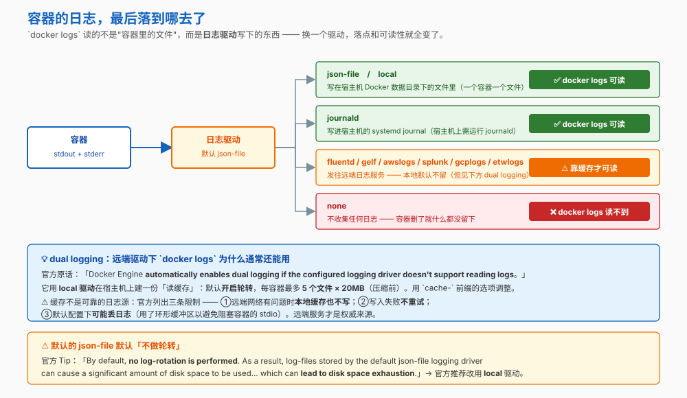
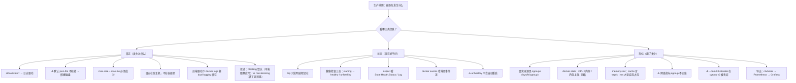

# 第 11 课：日志与可观测性

> 所属阶段：阶段 4《生产落地》｜ 水平：入门 ｜ 本课知识点：日志驱动与日志膨胀、健康检查与状态观测、容器指标与资源观测
> 故事情节：日志撑爆了磁盘，而编排器一直以为 `order-service` 是健康的

## 🎯 本课目标

- 管住日志体积，知道日志到底写在哪、`docker logs` 读的又是什么
- 用健康检查让外界知道服务"好不好"，而不只是"在不在"
- 会看容器的状态、事件与指标，并知道哪些数**不可信**

## 📌 知识点导航

| 知识点 | 关键点 | 状态 |
|--------|--------|------|
| 日志驱动与日志膨胀 | json-file 默认无限增长 / docker logs 读的是宿主机上的文件 / max-size 与 max-file / 日志驱动选型 | ✅ 已完成 |
| 健康检查与状态观测 | HEALTHCHECK 三态 starting / healthy / unhealthy / docker events / inspect 里该看哪些字段 | ✅ 已完成 |
| 容器指标与资源观测 | cgroups 才是指标的真实来源 / docker stats 各字段含义与局限 / 容器内 top、free 看到的是宿主机 / 导出到 Prometheus + cAdvisor 的路径 | ✅ 已完成 |

---

## 第一幕：起源与场景引入

课 10 之后，`order-service` 有了资源限制，不再 OOM 了。小杨松了口气。

两周后的早上，磁盘告警响了。他登上去一看：

```bash
$ df -h /var/lib/docker
Filesystem      Size  Used Avail Use%
/dev/sda1       100G   94G  6.0G  95%
```

顺着查下去，是一个**日志文件**——某个服务进入了异常循环，疯狂打印堆栈，两周下来写了几十 GB。

他清掉文件，服务恢复。但当晚复盘时他发现一件**更别扭的事**：

在那两周里，有相当长一段时间这个服务**其实已经无法正常响应了**（数据库连接池耗尽，请求全部超时）。可是：

```bash
$ docker ps
CONTAINER ID   IMAGE            STATUS         NAMES
a1b2c3d4e5f6   order-service    Up 3 weeks     order-service-1
```

**状态一直是 `Up`。** 编排器看着这个 `Up`，认为一切正常，什么都没做。

> 🎬 **场景**：两个问题——**日志没人管它涨**，以及 **`Up` 不等于"能用"**。生产环境到底该怎么"看"一个容器？

---

## 第二幕：认知冲突

> ❓ **问题**：容器的日志写到哪去了？为什么默认没人管它涨？`Up` 为什么不能说明服务是好的？到底该看什么？

三层答案：

1. **日志去哪了、怎么管住它** → 日志驱动与轮转（知识点 1）
2. **怎么表达"服务好不好"** → 健康检查与状态（知识点 2）
3. **数值该信谁** → 指标的真实来源是 cgroups（知识点 3）

---

## 第三幕：层层揭示

### 知识点 1：日志驱动与日志膨胀

> 本知识点关键点：json-file 默认无限增长 / docker logs 读的是宿主机上的文件 / max-size 与 max-file / 日志驱动选型

#### 一句话定义

容器的 stdout / stderr 由 **日志驱动**接管；驱动决定这些输出**写到哪**、**要不要轮转**。`docker logs` 读的是**驱动写在宿主机上的东西**，不是容器里的文件。

#### 直觉建立（类比）

容器的 stdout 是一根**出水的管子**，日志驱动决定这根管子接到哪：

| 接法 | 对应驱动 |
|---|---|
| 接到本地水桶 | `json-file` / `local` |
| 接到大楼的中控系统 | `journald` / `syslog` |
| 接到远端的处理厂 | `fluentd` / `awslogs` / `splunk` / `gcplogs` |
| 直接排到地上不要了 | `none` |

> 💡 **类比的边界**：真实的下水管有容量限制、满了会堵。而这根管子**默认是没有阀门的**——官方明说默认**不做轮转**，所以它可以一直写，直到把磁盘写满。

#### 核心原理



**一、默认驱动 `json-file` 的三个事实**

1. 它捕获**所有**容器的 stdout 与 stderr，写成 JSON；每行带 `stream`（stdout/stderr）和 `time` 两个字段。
2. **每个日志文件只包含一个容器的信息。**
3. ⚠️ 官方警告：这些文件"are designed to be **exclusively accessed by the Docker daemon**. Interacting with these files with external tools may interfere with Docker's logging system... **should be avoided**."

**二、⚠️ 磁盘耗尽的官方警告（原话）**

> "Use the `local` logging driver to prevent disk-exhaustion. **By default, no log-rotation is performed.** As a result, log-files stored by the default `json-file` logging driver can cause a significant amount of disk space to be used for containers that generate much output, **which can lead to disk space exhaustion**."

官方还解释了为什么明知如此还保留它当默认：

> "Docker keeps the `json-file` logging driver (without log-rotation) as a default to remain **backwards compatible** with older versions of Docker, and for situations where Docker is used as **runtime for Kubernetes**."
>
> "For other situations, the **`local`** logging driver is recommended as it **performs log-rotation by default**, and uses a more efficient file format."

**三、轮转参数：两个容易踩的细节**

| 选项 | 默认值 | 官方说明 |
|---|---|---|
| `max-size` | **`-1`（无限制）** | 正整数 + `k`/`m`/`g`。超过就轮转 |
| `max-file` | `1` | 最多保留几个文件。**⚠️ "Only effective when `max-size` is also set."** |
| `compress` | `false` | 轮转后的文件是否压缩 |

> ⚠️ **只写 `max-file=3` 而没写 `max-size`，轮转根本不会生效。** 这是最常见的配置错误——两个必须成对出现。

**四、配置的两个层级**

| 层级 | 方式 | 生效范围 |
|---|---|---|
| **daemon 级** | `daemon.json` 里的 `log-driver` + `log-opts` | 之后创建的容器 |
| **容器级** | `--log-driver <驱动>` + `--log-opt <名>=<值>` | 该容器 |

⚠️ 两个重要限制：

1. **改 daemon 配置只影响之后创建的容器**——官方原话："Existing containers **don't use the new logging configuration automatically**." 要改已有容器，必须**重建**。
2. **`daemon.json` 里的 `log-opts` 值必须都是字符串**——`"max-file": "3"` 要加引号，布尔值和数字也不例外。

查询方式：

```bash
docker info --format '{{.LoggingDriver}}'                    # 当前默认驱动
docker inspect -f '{{.HostConfig.LogConfig.Type}}' <容器>     # 某容器实际用的驱动
docker inspect -f '{{.LogPath}}' <容器>                       # 日志文件在宿主机的路径
```

**五、`docker logs` 的选项**

| 选项 | 作用 |
|---|---|
| `-f` / `--follow` | 持续跟踪新输出 |
| `-n` / `--tail` | 只看末尾 N 行（**默认 `all`**；传负数或非整数会被当成 `all`） |
| `--since` / `--until` | 按时间切片，支持 RFC3339、Unix 时间戳、Go duration（如 `1m30s`、`3h`） |
| `-t` / `--timestamps` | 每行加 RFC3339Nano 时间戳 |
| `--details` | 显示额外属性（如 `--log-opt` 里指定的 env / labels） |

**六、⚠️ 远端驱动下 `docker logs` 为什么通常还能用（dual logging）**

很多人以为用了 `fluentd` / `awslogs` 之后 `docker logs` 就废了。官方有专门一页说明：

> "You can use the `docker logs` command to read container logs **regardless of the configured logging driver or plugin**. Docker Engine uses the **`local`** logging driver to act as **cache** for reading the latest logs of your containers. This is called **dual logging**."
>
> "Docker Engine **automatically enables dual logging if the configured logging driver doesn't support reading logs.**"

缓存默认配置：**开启轮转，每容器最多 5 个文件 × 20MB（压缩前）**。选项用 `cache-` 前缀：`cache-disabled`、`cache-max-size`、`cache-max-file`、`cache-compress`。

> **支持直接读取的驱动是 `local` / `json-file` / `journald`**——对这三个，dual logging 不介入，禁用它也没有效果。

⚠️ 但官方列了三条限制，说明**缓存不是可靠的日志源**：

1. 远端网络有问题时，**本地缓存也不写**
2. 写入失败**不重试**（会记到 daemon 日志里）
3. 默认配置下**可能丢日志**（用了环形缓冲区，以避免在写盘慢时阻塞容器的 stdio）

**七、投递模式：阻塞 vs 非阻塞**

| 模式 | 官方说明 |
|---|---|
| `blocking`（默认） | 容器到驱动的直接阻塞式投递 |
| `non-blocking` | 先存进每容器一个的中间缓冲区，再由驱动消费 |

官方的理由很实在：

> "The `non-blocking` message delivery mode prevents applications from **blocking due to logging back pressure**. **Applications are likely to fail in unexpected ways when STDERR or STDOUT streams block.**"

⚠️ 代价是："When the buffer is full, **new messages will not be enqueued**. **Dropping messages is often preferred to blocking the log-writing process** of an application."（缓冲区默认 `max-buffer-size=1m`）

**八、🙋 那生产上到底该怎么配？给一份可以直接抄的起点**

**① daemon 级**（`/etc/docker/daemon.json`，改完重启 Docker）

```json
{
  "log-driver": "local",
  "log-opts": {
    "max-size": "10m",
    "max-file": "3"
  }
}
```

用官方推荐的 `local`。⚠️ `log-opts` 的值**必须都是字符串**（`"3"` 不能写成 `3`）。

**② 容器级**（个别特别吵闹的容器单独收紧）

```bash
docker run --log-opt max-size=5m --log-opt max-file=2 ...
```

**③ 输出量极大、且能容忍丢日志的服务**，加非阻塞模式避免背压

```bash
docker run --log-opt mode=non-blocking --log-opt max-buffer-size=4m ...
```

**三条必须记住的限制**：

1. 改 daemon 配置**只影响之后创建的容器**，已有的要**重建**
2. `max-file` **必须配合 `max-size`** 才生效
3. 以上**只管 Docker 收集的 stdout/stderr**——如果应用把日志直接写进文件而不是打到 stdout，那部分由应用自己或挂载的卷负责轮转

#### 示例演示

```bash
# 1) 看默认驱动与日志落在宿主机哪
docker info --format '{{.LoggingDriver}}'
# 预期：json-file

docker run -d --name logdemo alpine sh -c 'while true; do echo hello; sleep 1; done'
docker inspect logdemo --format '{{.LogPath}}'
# 预期：/var/lib/docker/containers/<长ID>/<长ID>-json.log

# ⚠️ 注意：这个路径在「宿主机」上，容器里是找不到的
docker exec logdemo ls -l "$(docker inspect logdemo --format '{{.LogPath}}')"
# 预期：No such file or directory

# 2) 在宿主机上看大小（不要在容器里找）
sudo du -sh /var/lib/docker/containers/*/*-json.log 2>/dev/null | sort -h | tail -5

# 3) docker logs 的常用切法
docker logs --tail 5 logdemo                 # 最后 5 行
docker logs -t --since 30s logdemo           # 近 30 秒，带时间戳
docker logs -f --until 5s logdemo            # 持续输出到 5 秒前为止

# 4) 给单个容器开轮转（成对设置才生效！）
docker rm -f logdemo2 2>/dev/null
docker run -d --name logdemo2 \
  --log-opt max-size=1m --log-opt max-file=3 \
  alpine sh -c 'while true; do echo hello; sleep 0.1; done'
docker inspect logdemo2 --format '{{json .HostConfig.LogConfig}}'
# 预期：Config 里能看到 max-size=1m 与 max-file=3

# 5) 不支持读取的驱动：docker logs 会直接报错（官方示例，无需外部服务）
docker run -d --log-driver=none --name nolog nginx:alpine
docker logs nolog
# 预期：Error response from daemon: configured logging driver does not support reading
docker rm -f nolog
# ↑ 这正是「远端驱动 + 关掉 dual logging 缓存」时会看到的报错；
#   开着 dual logging（默认）时，docker logs 读的是那份额外的本地缓存。
```

#### 常见误区

1. **"日志在容器里"** → 不在。它写在**宿主机** Docker 数据目录下，`docker inspect` 的 `LogPath` 才是真实路径。所以**容器删了日志还在**（直到容器被 `docker rm` 时一并清掉）。
2. **"设了 `max-file=3` 就限制了日志大小"** → 不够。官方明说 `max-file` "**Only effective when `max-size` is also set**"。两个必须成对。
3. **"改了 `daemon.json` 所有容器立刻生效"** → 不会。官方原话：已有容器不自动使用新配置，**必须重建**。
4. **"用了远端日志驱动，`docker logs` 就没用了"** → 通常还能用（dual logging 自动开启）。但缓存**可能丢日志**，权威来源仍是远端服务。
5. **"日志写不进去会拖慢应用"** → 默认是 `blocking` 模式，恰恰会。官方提醒应用"可能以意想不到的方式失败"，需要时用 `non-blocking`（代价是缓冲区满后丢消息）。

#### 一句话记住

> **默认 `json-file` 不轮转、能撑爆磁盘；`max-size` 与 `max-file` 必须成对；日志在宿主机不在容器里。**

#### 官方文档

- [Configure logging drivers（Docker 官方）](https://docs.docker.com/engine/logging/configure/)——默认驱动、磁盘耗尽警告、`local` 推荐、传递模式
- [JSON File logging driver（Docker 官方）](https://docs.docker.com/engine/logging/drivers/json-file/)——`max-size`/`max-file` 默认值与"仅在设置 max-size 时生效"
- [Use docker logs with remote logging drivers（Docker 官方）](https://docs.docker.com/engine/logging/dual-logging/)——dual logging 自动开启、缓存默认值、三条限制

---

### 知识点 2：健康检查与状态观测

> 本知识点关键点：HEALTHCHECK 三态 starting / healthy / unhealthy / docker events / inspect 里该看哪些字段

#### 一句话定义

容器的 `Up` 只说明**主进程还在**；**健康检查**（课 9 讲过怎么写）是唯一能让 Docker 表达"这个服务还能不能用"的机制，它有三个状态：

```
starting → healthy | unhealthy
```

#### 直觉建立（类比）

- **`Up`（running）** = 还有**脉搏**
- **`healthy`** = 还有**意识**，能回答问题

植物人有脉搏但没意识。第一幕那个连接池耗尽的服务就是"有脉搏没意识"——`Up` 了三周，其实早就不响应了。

> 💡 **类比的边界**：现实里医生查意识有标准流程；容器没有——**判定标准得你写在 `healthcheck` 里**（课 9 知识点 3）。不写，Docker 就永远只能报 `Up`。

#### 核心原理

**一、三态**

| 状态 | 含义 | 出现时机 |
|---|---|---|
| `starting` | 还没得出结论 | 容器刚启动、`start_period` 宽限期内 |
| `healthy` | 健康检查通过 | 连续成功 |
| `unhealthy` | 健康检查失败 | 连续失败达到 `retries` 次数 |

在 `docker ps` 的 STATUS 列里显示为 `(health: starting)` / `(healthy)` / `(unhealthy)`。

**二、`docker inspect` 该看哪些字段**

| 字段 | 看什么 |
|---|---|
| `State.Status` | 生命周期状态：`running` / `exited` / `restarting` / ...（课 2 的七种状态） |
| **`State.Health.Status`** | **健康状态**：`starting` / `healthy` / `unhealthy`（没配 healthcheck 则为空） |
| `State.Health.Log` | **最近几次检查的结果**，排障时最有价值 |
| `State.ExitCode` | 退出码（课 10：137 / 143 的区分） |
| `State.OOMKilled` | 是否死于 OOM（课 10） |
| `RestartCount` | 已重启次数（课 10） |
| `HostConfig.LogConfig.Type` | 实际用的日志驱动（知识点 1） |

**三、`docker events`：事件流**

`docker events` 能实时看到 Docker 发生的事件，是排查"某个容器什么时候死的、为什么"的利器：

```bash
docker events --filter 'type=container' --since 10m
docker events --filter 'container=<名字>'
docker events --filter 'event=die'
docker events --filter 'event=health_status'      # 健康状态变化
```

> 课 10 里那个"日志里什么都没有的 OOM"，靠 `docker events` 或 `State.OOMKilled` 才能发现——这是容器**外部**的观测视角。

**四、⚠️ 健康检查失败不会自动重启容器**

重申课 9 的结论，因为这里最容易误解：

| | 重启策略 | 健康检查 |
|---|---|---|
| 触发 | 进程退出后 | 运行中 |
| 能做什么 | 重新拉起来 | **只标记状态** |

一个 `unhealthy` 的容器会**一直 unhealthy 地跑着**，除非有编排系统（或 compose 的 `depends_on`）读这个状态并采取行动。

#### 示例演示

```bash
# 1) 带健康检查的容器，看三态演变
docker run -d --name hc-demo \
  --health-cmd 'wget -qO- http://localhost/ || exit 1' \
  --health-interval 3s --health-timeout 2s --health-retries 2 \
  --health-start-period 5s \
  nginx:alpine

docker ps --format '{{.Names}}  {{.Status}}'
# 预期：先 (health: starting)，几秒后变成 (healthy)

docker inspect hc-demo --format '{{.State.Status}} / {{.State.Health.Status}}'
# 预期：running / healthy

# 看最近几次检查的结果（排障时最有用）
docker inspect hc-demo --format '{{json .State.Health.Log}}'

# 2) 制造一个 unhealthy
docker run -d --name hc-bad \
  --health-cmd 'exit 1' --health-interval 3s --health-retries 2 \
  alpine sleep 3600
docker ps --format '{{.Names}}  {{.Status}}'
# 预期：(unhealthy)

# ⚠️ 注意：它不会被自动重启，只是被标记
docker inspect hc-bad --format 'Status={{.State.Status}}  Health={{.State.Health.Status}}  RestartCount={{.RestartCount}}'
# 预期：Status=running  Health=unhealthy  RestartCount=0
#       ↑  unhealthy 但仍然在运行

# 3) 事件流：容器外部视角（另开一个终端跑，观察期间操作容器）
docker events --filter 'type=container'
# 预期：实时打印 start / die / destroy / health_status 等事件（Ctrl+C 退出）

# 事后回溯更实用：看某容器最近发生过什么
docker events --filter 'container=hc-demo' --since 5m
# 预期：列出近 5 分钟内该容器的事件

# 4) 一次性把关键字段全看一遍
docker inspect hc-demo --format '
Status      = {{.State.Status}}
Health      = {{.State.Health.Status}}
ExitCode    = {{.State.ExitCode}}
OOMKilled   = {{.State.OOMKilled}}
RestartCount= {{.RestartCount}}
LogDriver   = {{.HostConfig.LogConfig.Type}}'

docker rm -f hc-demo
```

#### 常见误区

1. **"`Up` 等于服务正常"** → 只等于"主进程没退出"。进程活着但服务不可用，只有健康检查能发现。
2. **"健康检查失败会自动重启容器"** → 不会。它只标记状态，采取行动是编排系统的职责（课 9、课 13）。
3. **"没配 healthcheck，Health 字段就是 unhealthy"** → 不是，是**空**——Docker 没有判断依据。

#### 一句话记住

> **`Up` 是有脉搏，`healthy` 才是有意识；`unhealthy` 只会被标记，不会自动重启。**

#### 官方文档

- [docker container run（Docker 官方）](https://docs.docker.com/reference/cli/docker/container/run/)——`--health-cmd` / `--health-interval` / `--health-retries` / `--health-start-period` 等选项

---

### 知识点 3：容器指标与资源观测

> 本知识点关键点：cgroups 才是指标的真实来源 / docker stats 各字段含义与局限 / 容器内 top、free 看到的是宿主机 / 导出到 Prometheus + cAdvisor 的路径

#### 一句话定义

容器的 CPU、内存、块 I/O 指标**由 cgroups 记账**并暴露在 `/sys/fs/cgroup` 这个伪文件系统里——`docker stats` 读的就是它。容器**内部**看到的数字常常是宿主机的，不可信。

#### 直觉建立（类比）

想知道一个电器用了多少电，应该看**电表**，而不是看电器自己贴的标签——**电器（容器）自己报的数可能是整栋楼的总量**。

> 💡 **类比的边界**：电表也有盲区——**网络流量 cgroup 不记账**（理由见下）。所以"看电表"这条原则对网络指标不成立，得另找口径。

#### 核心原理

**一、cgroups 是指标的真实来源（官方原话）**

> "Linux Containers rely on **control groups** which not only track groups of processes, but also **expose metrics about CPU, memory, and block I/O usage**."

cgroup 通过一个**伪文件系统**暴露，现代发行版挂在 `/sys/fs/cgroup`。判断 v1 / v2：

```bash
# 存在这个文件就是 cgroup v2
ls /sys/fs/cgroup/cgroup.controllers
```

容器的 cgroup 目录按版本与驱动有四种路径（`<longid>` 是容器的长 ID）：

| 版本 / 驱动 | 路径 |
|---|---|
| cgroup v1 + `cgroupfs` | `/sys/fs/cgroup/memory/docker/<longid>/` |
| cgroup v1 + `systemd` | `/sys/fs/cgroup/memory/system.slice/docker-<longid>.scope/` |
| cgroup v2 + `cgroupfs` | `/sys/fs/cgroup/docker/<longid>/` |
| cgroup v2 + `systemd` | `/sys/fs/cgroup/system.slice/docker-<longid>.scope/` |

**二、`docker stats` 看什么**

官方说明它支持 **CPU、内存用量、内存上限、网络 IO** 指标。官方示例输出：

```
CONTAINER    CPU %    MEM USAGE / LIMIT    MEM %    NET I/O           BLOCK I/O
redis1       0.07%    796 KB / 64 MB       1.21%    788 B / 648 B     3.568 MB / 512 KB
```

**三、`memory.stat` 里最关键的两个字段**

| 字段 | 含义 | 官方给出的构成公式 |
|---|---|---|
| `cache` | 可与磁盘块关联的内存（文件缓存、**tmpfs**） | `cache = active_file + inactive_file + tmpfs` |
| `rss` | 与磁盘无关的内存（栈、堆、匿名映射） | `rss = active_anon + inactive_anon - tmpfs` |

> ⚠️ 官方在解释 `cache` 时特意提了一句："It also accounts for the memory used by **`tmpfs` mounts**"。
>
> 这就把课 7 和课 10 串起来了：课 7 说"tmpfs 的数据计入容器内存上限"，课 10 用 tmpfs 撑爆 `-m 50m` 复现 OOM——**因为 tmpfs 占用就记在这个 `cache` 里，属于容器内存账的一部分。**

**四、⚠️ 网络指标不由 cgroup 提供**

这是个反直觉但很重要的点。官方解释了原因：

> "**Network metrics aren't exposed directly by control groups**... network interfaces exist within the context of **network namespaces**... since processes in a single cgroup can belong to multiple network namespaces, those metrics would be harder to interpret... so this is why there is **no easy way to gather network metrics with control groups**."

所以网络指标得从别处来（官方给了两条路：`iptables` 计数器、或网卡级计数器配合 `ip netns exec`）。

**五、⚠️ 一条对课 10 的重要补充**

> "The `docker run` flag **`--oom-kill-disable` is discarded on v2**."

也就是说：**在 cgroup v2 的主机上，`--oom-kill-disable` 会被直接忽略**。这给课 10 那个"官方不建议用它"的结论又加了一条理由——在较新的系统上它根本不起作用。

**六、容器内部看到的数不可信**

课 10 已讲过并标注过置信度：`free` 报告的 swap 是宿主机的（官方明文确认），`nproc`、`top` 看到的也常是宿主机视角。原因就是这里——**`/proc` 的部分内容没有被 cgroup 隔离**（cgroup v2 下已改善）。

**七、导出到 Prometheus + cAdvisor 的路径**

> ⏳ **置信度：中** —— 以下是**领域通行实践**，非本课逐条核实的官方文档内容：
>
> 1. **cAdvisor**（Google 开源）读取 cgroup 与容器运行时的数据，暴露成 Prometheus 格式的指标
> 2. **Prometheus** 定期抓取 cAdvisor（以及 node-exporter 的宿主机指标）
> 3. **Grafana** 做可视化与告警
>
> 关键点：**采集端在容器外部**（宿主机上的 agent），依赖的正是本知识点说的"cgroup 才是真实来源"这一事实。

#### 示例演示

```bash
# 1) docker stats：从 cgroup 读真实数据
docker run -d --name metric-demo -m 256m --cpus=0.5 alpine sleep 3600
docker stats metric-demo --no-stream
# 预期：MEM USAGE / LIMIT 显示 256MiB 上限，CPU 上限 0.5 核

# 指定格式输出，便于脚本处理
docker stats metric-demo --no-stream --format '{{.Name}}\t{{.CPUPerc}}\t{{.MemUsage}}\t{{.MemPerc}}\t{{.NetIO}}'

# 2) 判断 cgroup 版本
docker run --rm alpine sh -c 'test -f /sys/fs/cgroup/cgroup.controllers && echo "cgroup v2" || echo "cgroup v1"'

# 3) 直接读 cgroup 的内存统计（对账用）
# ⚠️ cache / rss 是 cgroup v1 的字段名；cgroup v2 的 memory.stat 用了不同的名字
#    （anon / file / slab 等），需按实际环境调整
docker exec metric-demo sh -c 'head -8 /sys/fs/cgroup/memory.stat 2>/dev/null'

# 4) 对比：容器里"自报"的数 vs docker stats 看到的数
docker exec metric-demo sh -c 'free -m 2>/dev/null | head -2; echo "--- nproc ---"; nproc'
docker stats metric-demo --no-stream --format '{{.MemUsage}}'
# ⚠️ 两者常常对不上 —— 容器内的 free / nproc 多半显示的是宿主机的（置信度：中）

docker rm -f metric-demo
```

#### 常见误区

1. **"在容器里 `top` / `free` 看到的就是它的用量"** → 不可靠。真实数据在 cgroup 里，用 `docker stats` 读。
2. **"cgroup 能给出所有指标"** → 官方明说**网络指标不行**（网络接口属于 network namespace，不属于 cgroup）。
3. **"`docker stats` 的 MEM USAGE 就是应用实际占用的内存"** → 它包含 `cache`（文件缓存 + tmpfs）。判断"应用到底吃了多少"更该看 `rss`。
4. **"`--oom-kill-disable` 能兜底"** → 官方在 cgroup v2 说明里明确："**is discarded on v2**"——新系统上它根本不起作用。

#### 一句话记住

> **指标看 cgroup（`docker stats`），不看容器内；网络指标 cgroup 不管；`cache` 里含 tmpfs。**

#### 官方文档

- [Runtime metrics（Docker 官方）](https://docs.docker.com/engine/containers/runmetrics/)——cgroup 是指标来源、memory.stat 字段与公式、网络指标为何不在 cgroup、cgroup v2 下 `--oom-kill-disable` 被丢弃

---

## 第四幕：实操验证

把第一幕那两个问题逐个解决。

> ⚠️ 本讲义的命令与预期输出为**纸面预期**（写作时本机 Docker 守护进程未运行）。路径、大小、耗时等具体值与你实际运行会不同。

### 步骤 1：找到撑爆磁盘的日志

```bash
# 日志不在容器里 —— 它在宿主机上
docker info --format '默认日志驱动 = {{.LoggingDriver}}'
# 预期：默认日志驱动 = json-file

docker run -d --name noisy alpine sh -c 'while true; do echo "一行日志"; sleep 0.2; done'
docker inspect noisy --format '{{.LogPath}}'
# 预期：/var/lib/docker/containers/<长ID>/<长ID>-json.log

# 在宿主机上看它的大小（grow 一段时间后再看一次会更明显）
sudo ls -lh "$(docker inspect noisy --format '{{.LogPath}}')"

# 看看所有容器的日志占了多少
sudo du -sh /var/lib/docker/containers/*/*-json.log 2>/dev/null | sort -h | tail -5
# ⚠️ 在 Docker Desktop（macOS / Windows）上，/var/lib/docker 位于它创建的 Linux 虚拟机内部，
#    宿主机终端直接访问这个路径会找不到 —— 用上面的 docker inspect 看路径即可。
```

> ✅ **回扣场景**：这就是第一幕那几十 GB 的来源——**默认 `json-file`，默认不轮转**。

### 步骤 2：配上轮转，并验证"只影响新容器"

```bash
# 单个容器：max-size 与 max-file 必须成对
docker run -d --name noisy2 \
  --log-opt max-size=1m --log-opt max-file=3 \
  alpine sh -c 'while true; do echo "一行日志"; sleep 0.05; done'

docker inspect noisy2 --format '{{json .HostConfig.LogConfig}}'
# 预期：Config 里能看到 max-size=1m 与 max-file=3

# 反例：只写 max-file 不生效
docker run -d --name noisy3 --log-opt max-file=3 \
  alpine sh -c 'while true; do echo x; sleep 0.05; done'
docker inspect noisy3 --format '{{json .HostConfig.LogConfig}}'
# 预期：Config 里只有 max-file=3，没有 max-size → 轮转不生效（官方：Only effective when max-size is also set）

# ⚠️ 改 daemon 配置只影响「之后创建」的容器
# /etc/docker/daemon.json:
# {
#   "log-driver": "local",
#   "log-opts": { "max-size": "10m", "max-file": "3" }
# }
# 改完要重启 Docker，且已有容器保持创建时的配置 —— 想生效必须重建容器

docker rm -f noisy noisy2 noisy3
```

### 步骤 3：加上健康检查，观察三态

```bash
docker run -d --name web-hc \
  --health-cmd 'wget -qO- http://localhost/ || exit 1' \
  --health-interval 3s --health-timeout 2s --health-retries 2 \
  --health-start-period 5s \
  nginx:alpine

# 观察 starting → healthy
docker ps --format '{{.Names}}  {{.Status}}'
# 预期：先 (health: starting)，几秒后 (healthy)

# 再起一个必然 unhealthy 的，看它「被标记但不被重启」
docker run -d --name bad-hc --health-cmd 'exit 1' \
  --health-interval 3s --health-retries 2 alpine sleep 3600

docker inspect bad-hc --format \
  'Status={{.State.Status}}  Health={{.State.Health.Status}}  RestartCount={{.RestartCount}}'
# 预期：Status=running  Health=unhealthy  RestartCount=0
#       ↑ unhealthy 却仍在运行 —— 健康检查只标记，不重启

# 看检查历史
docker inspect web-hc --format '{{json .State.Health.Log}}'
```

> ✅ **回扣场景**：第一幕那个"一直 `Up` 但其实不能用"的服务，加上健康检查后就会变成 `unhealthy`——**编排器终于能看见问题了**。

### 步骤 4：用事件流和字段做外部观测

```bash
# 一次性看全关键字段
docker inspect bad-hc --format '
Status       = {{.State.Status}}
Health       = {{.State.Health.Status}}
ExitCode     = {{.State.ExitCode}}
OOMKilled    = {{.State.OOMKilled}}
RestartCount = {{.RestartCount}}
LogDriver    = {{.HostConfig.LogConfig.Type}}'

# 事件流：观测「外部视角」
docker events --filter 'type=container' --since 5m
# 预期：看到 start / die / health_status 等事件

docker rm -f web-hc bad-hc
```

### 步骤 5：指标从 cgroup 读

```bash
docker run -d --name met -m 256m --cpus=0.5 alpine sleep 3600

docker stats met --no-stream --format '{{.Name}}  CPU={{.CPUPerc}}  MEM={{.MemUsage}} ({{.MemPerc}})'
# 预期：met  CPU=0.00%  MEM=... / 256MiB

# 验证 cgroup 版本
docker run --rm alpine sh -c 'test -f /sys/fs/cgroup/cgroup.controllers && echo v2 || echo v1'

# 对账：容器里自报的数 vs docker stats
docker exec met sh -c 'nproc'
docker stats met --no-stream --format '{{.MemUsage}}'
# ⚠️ 两者常常对不上（置信度：中）

docker rm -f met
```

---

## 第五幕：体系收束

> 📍 **全局定位**：阶段 4《生产落地》第二幕，你让容器**可观测**。
>
> 阶段 4 四课的进展：
>
> | 课 | 成果 | 状态 |
> |---|---|---|
> | 课 10 | 不拖垮别人、能被管理 | ✅ |
> | **课 11** | **可观测：日志管住了、状态说得清、指标可信** | ✅ |
> | 课 12 | 有安全边界 | 下一课 |
> | 课 13 | 能被持续交付 | |
>
> 现在 `order-service` 有了三样东西：**日志轮转**（不再撑爆磁盘）、**健康检查**（外界能知道它好不好）、**可信指标**（从 cgroup 读，不靠容器自报）。
>
> 而课 10 留下的那个"静默死亡"问题也解决了：**OOM 时日志里没东西，但 `State.OOMKilled`、`docker events`、`docker stats` 会留下痕迹**——它们都在容器之外。

> 🔗 **下一步**：课 12《容器安全边界》——转向另一个维度。
>
> 本课反复出现一个视角：**容器里看到的东西未必可信**（`free`、`nproc`、`top` 看到宿主机；日志不在容器里）。课 12 会沿着这条线追下去一个更重要的问题：
>
> **容器里的 root，和宿主机的 root，是同一个 root 吗？**
>
> 答案会决定很多事——比如为什么 `docker run -v /:/host` 这种操作危险到离谱。

---

## 🐞 常见误区

1. **"日志在容器里，容器删了日志就没了"** → 日志写在**宿主机**上（`docker inspect` 的 `LogPath`），不在容器里。

2. **"设了 `max-file=3` 就限制了日志大小"** → 官方明说 `max-file` "**Only effective when `max-size` is also set**"。两个必须成对。

3. **"改了 `daemon.json` 所有容器立刻生效"** → 官方原话：已有容器不自动使用新配置，**必须重建**。另外 `log-opts` 的值必须都是**字符串**。

4. **"`Up` 等于服务正常"** → 只等于主进程没退出。进程活着但服务不可用，只有健康检查能发现。

5. **"健康检查失败会自动重启"** → 不会。它只标记 `unhealthy`，采取行动是编排系统的职责。

6. **"在容器里 `top` / `free` / `nproc` 看到的就是它的"** → 不可靠，常显示宿主机（置信度：中；cgroup v2 下已改善）。真实数据在 cgroup，用 `docker stats`。

7. **"cgroup 能提供所有指标"** → 官方明说**网络指标不行**——网络接口属于 network namespace，不属于 cgroup。

8. **"`--oom-kill-disable` 能兜底"** → 官方在 cgroup v2 说明里写得很直接："**is discarded on v2**"。

---

## 一图总结



---

## 📋 命令速查卡

| 命令 | 作用 | 本课出现在哪 |
|------|------|------------|
| `docker logs -f <容器>` | 持续跟踪日志 | 知识点 1 / 演示 |
| `docker logs --tail 100 <容器>` | 只看末尾 100 行（默认 `all`） | 知识点 1 |
| `docker logs --since 30s -t <容器>` | 近 30 秒，带时间戳（支持 `1m30s` / `3h` / RFC3339） | 知识点 1 / 演示 |
| `docker info --format '{{.LoggingDriver}}'` | 看**默认**日志驱动 | 知识点 1 / 步骤 1 |
| `docker inspect -f '{{.HostConfig.LogConfig.Type}}' <容器>` | 看**某容器**实际用的驱动 | 知识点 1 |
| `docker inspect -f '{{.LogPath}}' <容器>` | 看日志文件在**宿主机**上的路径 | 知识点 1 / 步骤 1 |
| `--log-opt max-size=10m --log-opt max-file=3` | 开日志轮转（**必须成对才生效**） | 知识点 1 / 步骤 2 |
| `--log-driver local` | 改用官方推荐的 local 驱动（默认就轮转） | 知识点 1 |
| `--log-opt mode=non-blocking --log-opt max-buffer-size=4m` | 避免日志背压阻塞应用（代价：满了丢消息） | 知识点 1 |
| `--health-cmd '<命令>' --health-interval 3s --health-retries 2` | 给容器加健康检查 | 知识点 2 / 步骤 3 |
| `docker inspect -f '{{.State.Health.Status}}' <容器>` | 看健康状态：`starting` / `healthy` / `unhealthy` | 知识点 2 / 步骤 3 |
| `docker inspect -f '{{json .State.Health.Log}}' <容器>` | 看**最近几次检查的结果**（排障最有用） | 知识点 2 / 步骤 3 |
| `docker events --filter 'type=container' --since 10m` | 容器外部的事件流 | 知识点 2 / 步骤 4 |
| `docker stats <容器> --no-stream` | 从 cgroup 读**真实**指标 | 知识点 3 / 步骤 5 |
| `docker top <容器>` | 从**容器外部**看它的进程（比进容器里跑 `top` 靠谱） | 知识点 3 |

---

## 课后小测

**Q1**：容器产生大量输出，几周后把宿主机磁盘撑爆了。最可能的原因是？

- A. Docker 有 bug，日志组件泄漏内存
- B. 用的是默认的 `json-file` 驱动，而它**默认不做日志轮转**；需要设置 `max-size`（并且 `max-file` 只有在同时设了 `max-size` 时才生效）
- C. 容器里的应用没写日志轮转配置
- D. 磁盘本来就太小

<details><summary>答案与解析</summary>

**答案：B**。官方 Tip 原话：

> "By default, **no log-rotation is performed**. As a result, log-files stored by the default `json-file` logging driver can cause a significant amount of disk space to be used for containers that generate much output, which can **lead to disk space exhaustion**."

两个必须记住的细节：

1. `max-size` 默认 **`-1`（无限制）**
2. `max-file` 默认 `1`，且官方明说 "**Only effective when `max-size` is also set**" —— **只写 `max-file` 轮转根本不会生效**

官方的推荐是改用 **`local`** 驱动（默认执行轮转、格式更高效）。保留 `json-file` 为默认只是为了向后兼容和 Kubernetes runtime 场景。

另外：**日志写在宿主机上**（看 `docker inspect` 的 `LogPath`），不在容器里，所以 C 的路子（在应用里配轮转）对 Docker 收集的 stdout/stderr 是无效的。

</details>

**Q2**：容器 `docker ps` 显示 `Up 3 weeks`，但实际上服务早就无法响应请求了。这说明了什么？

- A. Docker 的状态判定有 bug
- B. `Up` 只表示主进程还在；要表达"服务能不能用"必须配置**健康检查**，它才有 `starting` / `healthy` / `unhealthy` 三态
- C. 必须设置 `--restart always` 才能发现
- D. 容器其实已经停了，是显示错误

<details><summary>答案与解析</summary>

**答案：B**。`Up` 对应的是 `State.Status = running`，只说明**主进程没退出**——相当于"还有脉搏"。进程活着但服务不可用（连接池耗尽、死锁等），它完全看不出来。

要表达"能不能用"，唯一机制是**健康检查**（课 9 讲过怎么写），它产出 `starting` / `healthy` / `unhealthy` 三态，出现在 `docker ps` 的 STATUS 列和 `State.Health.Status` 字段里。

⚠️ 还有一条容易误解的：**健康检查失败不会自动重启容器**。一个 `unhealthy` 的容器会一直 unhealthy 地跑着——采取行动（重启、摘流量、回滚）是编排系统的职责。

</details>

**Q3**：关于容器指标，下列说法正确的是？

- A. 在容器里跑 `top` / `free` 看到的就是该容器的真实用量
- B. 真实指标来自 **cgroups**（`/sys/fs/cgroup`），用 `docker stats` 读取；但**网络指标 cgroup 不记账**
- C. cgroup 能提供包括网络在内的全部指标
- D. `docker stats` 的 MEM USAGE 就是应用进程实际占用的内存，不含缓存

<details><summary>答案与解析</summary>

**答案：B**。

- A 错：官方明确说容器里 `free` 报告的 swap 是**宿主机**的，"Don't rely on the output of `free` or similar tools"；`nproc` / `top` 同理（置信度：中，cgroup v2 下已改善）。
- C 错：官方原话 "**Network metrics aren't exposed directly by control groups**"，理由是网络接口属于 **network namespace** 而不属于 cgroup，一个 cgroup 的进程可能分属多个 netns，指标无法解释。
- D 错：`MEM USAGE` 包含的 `cache` 里有**文件缓存和 tmpfs**。官方给的公式是 `cache = active_file + inactive_file + tmpfs`、`rss = active_anon + inactive_anon - tmpfs`。判断"应用到底吃了多少"更该看 `rss`。

顺带一条对课 10 的补充：官方在 cgroup v2 的说明里写道 `--oom-kill-disable` "**is discarded on v2**"——在较新的系统上这个参数根本不起作用。

</details>

---

## 🚀 下一批接力提示词

> 学完本课后，**复制下面这段文字发给 AI**，即可无缝进入下一批（无需重新描述上下文）：

```
继续学 Docker。我的学习档案在 docker/00-学习档案.md，
刚学完阶段 4《生产落地》的课《日志与可观测性》知识点 日志驱动与日志膨胀、健康检查与状态观测、容器指标与资源观测，
请按大纲继续讲解下一批知识点。
```

## 🧭 课程导航

⬅️ **上一课**：[课 10：资源限制与进程管理](lesson-10-资源限制与进程管理.md)

➡️ **下一课**：[课 12：容器安全边界](lesson-12-容器安全边界.md)

📚 **返回目录**：[课程目录](../../../02-课程目录.md)
