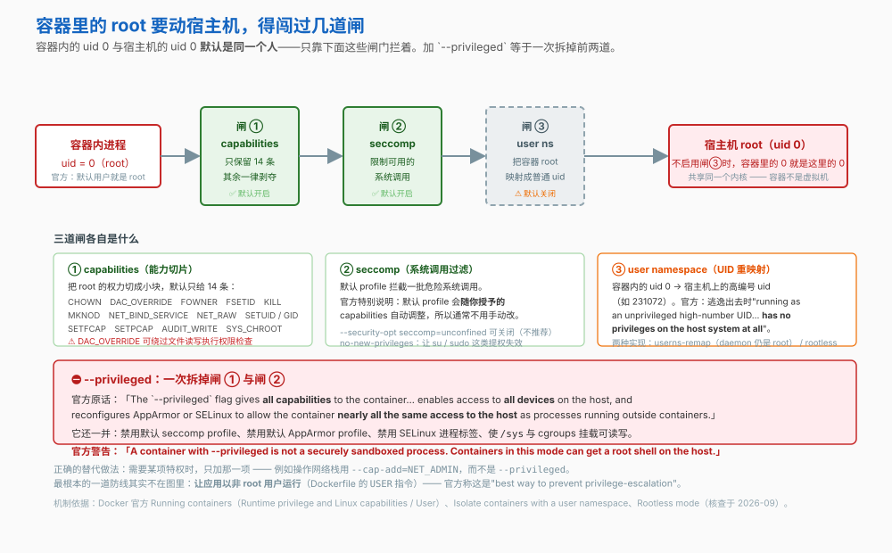
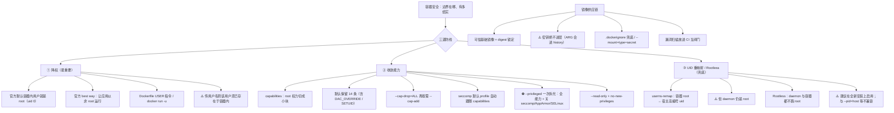

# 第 12 课：容器安全边界

> 所属阶段：阶段 4《生产落地》｜ 水平：入门 ｜ 本课知识点：容器里的 root 是谁、能力与系统调用收敛、镜像供应链与漏洞
> 故事情节：`order-service` 以 root 运行，而容器里的 root 并不是"假"的

## 🎯 本课目标

- 说清容器内 root 的真实风险，并会用 `USER` 降权
- 收敛 capabilities，知道 `--privileged` 到底拆掉了什么
- 管住镜像来源与密钥，不把秘密烤进镜像层

## 📌 知识点导航

| 知识点 | 关键点 | 状态 |
|--------|--------|------|
| 容器里的 root 是谁 | 共享内核意味着什么 / 容器内 root 不等于宿主机 root 但风险真实 / USER 指令 / rootless 模式 | ✅ 已完成 |
| 能力与系统调用收敛 | 默认 capability 集 / --cap-drop=ALL 再按需加回 / --privileged 等于拆掉所有围栏 / seccomp 默认 profile | ✅ 已完成 |
| 镜像供应链与漏洞 | 可信基础镜像 / 漏洞扫描 / 镜像来源核验 / 密钥绝不能进镜像层 | ✅ 已完成 |

---

## 第一幕：起源与场景引入

安全团队做例行扫描，甩给小杨一份报告。第一条就是：**`order-service` 容器以 root 运行。**

小杨不以为然——"容器里的 root 嘛，又不是宿主机的 root，能怎样？"

安全同学当场演示了三件事。

**第一件**：容器里敲 `id`：

```bash
$ docker exec order-service-1 id
uid=0(root) gid=0(root) groups=0(root),1(bin),2(daemon)...
```

**第二件**：容器里读本该只有 root 能读的文件，畅通无阻。

**第三件**——这条让小杨后背发凉：

```bash
docker run --rm -v /:/host alpine cat /host/etc/shadow
```

**宿主机的 `/etc/shadow`，在容器里被读出来了。**

"你平时图省事挂 `-v /:/host` 的时候，"安全同学说，"就等于把整个宿主机交给了容器里的那个 root。"

报告的第二条更尴尬：那个镜像里**打包进了一个 `.env` 文件**，里面有数据库密码。小杨辩解说"后面那层删掉了"——安全同学敲了一行：

```bash
$ docker history order-service --no-trunc | grep -i password
... ARG DB_PASSWORD=prod-xxxxxx ...
```

**课 6 讲过：`ARG` 会留在 `docker history` 里。**

> 🎬 **场景**：两件事都指向同一个根因——**容器不是"天然安全"的盒子**。它的边界到底在哪、有多结实？

---

## 第二幕：认知冲突

> ❓ **问题**：容器里的 root 和宿主机的 root 是同一个人吗？是什么在拦着它？镜像里的秘密又是从哪进去的？

三层答案：

1. **容器里的 root 是谁** → 共享内核 + UID 映射（知识点 1）
2. **什么在拦着它** → capabilities 与 seccomp（知识点 2）
3. **镜像本身干不干净** → 供应链与密钥（知识点 3）

---

## 第三幕：层层揭示

### 知识点 1：容器里的 root 是谁

> 本知识点关键点：共享内核意味着什么 / 容器内 root 不等于宿主机 root 但风险真实 / USER 指令 / rootless 模式

#### 一句话定义

**容器内的默认用户就是 `root`（uid = 0）**，而且在不启用 user namespace 时，**它就是宿主机的那个 uid 0**。拦着它的不是"另一个身份"，而是 capabilities、seccomp 这几道闸。

#### 直觉建立（类比）

容器不是"缩小版虚拟机"，而是**同一间办公室里带门禁卡的工位**：

- **虚拟机**：另一栋楼，有自己的地基（内核）。一栋楼塌了不影响另一栋。
- **容器**：同一栋楼里的工位，**共用地基（宿主机内核）**。区别只在于——你手里只有几张门禁卡（capabilities）。

> 💡 **类比的边界**：办公室门禁卡丢了可以补；但**内核是共用的**，一个内核漏洞可能让所有容器一起被突破。这是容器与虚拟机的本质差别，也是为什么"容器更安全"这个说法需要打折扣。

#### 核心原理

**一、官方：容器内默认就是 root**

> "The default user within a container is **`root` (uid = 0)**."

可以用 Dockerfile 的 `USER` 指令改默认，用 `docker run -u` 覆盖：

```bash
-u="", --user="": Sets the username or UID used and optionally the groupname or GID
```

支持 `--user=[ user | user:group | uid | uid:gid | user:gid | uid:group ]` 各种写法。

> ⚠️ 官方两条限制：
> - 传**用户名**时，**该用户必须已存在于容器内**
> - 传**数字 UID** 时，必须在 `0-2147483647` 范围内

**二、官方给出的"最佳做法"**

> "The **best way** to prevent privilege-escalation attacks from within a container is to configure your container's applications to **run as unprivileged users**."

注意这是**首选方案**——UID 重映射（下面两条）是在"进程必须在容器内以 root 运行"时的**退而求其次**的方案。

**三、UID 重映射：把容器 root 映射成宿主机上的普通人**

原理由 `/etc/subuid` 与 `/etc/subgid` 两个文件完成。官方例子：

```
testuser:231072:65536
```

意思是：UID `231072` 在命名空间内（容器里）被映射为 UID `0`（root），`231073` 映射为 `1`，以此类推。

官方描述它的效果：

> "If a process attempts to escalate privilege outside of the namespace, the process is running as an **unprivileged high-number UID** on the host, which does not even map to a real user. This means the process has **no privileges on the host system at all**."

**四、两种实现的差别，官方说得很清楚**

| | `userns-remap` | **Rootless mode** |
|---|---|---|
| 容器是否以 root 运行 | ❌ 被映射成高编号 UID | ❌ 同上 |
| **Docker daemon 本身** | ⚠️ **仍然以 root 运行** | ✅ **也不以 root 运行** |
| 官方定位 | "with `userns-remap` mode, **the daemon itself is running with root privileges**" | "both the daemon and the container are running **without root privileges**" |
| 配置方式 | `daemon.json` 的 `"userns-remap"` | `dockerd-rootless-setuptool.sh install` |

Rootless 的定义：

> "Rootless mode lets you run the Docker daemon and containers as a non-root user to **mitigate potential vulnerabilities in the daemon and the container runtime**."

**五、⚠️ `userns-remap` 的三个坑（官方列出）**

1. **会让已有的镜像与容器层"消失"**——官方原话："Enabling `userns-remap` effectively **masks existing image and container layers**... It is best to enable this feature on a **new Docker installation** rather than an existing one." 而且**禁用后，启用期间创建的资源也访问不到了**。
2. **与若干特性不兼容**（官方列出的已知限制）：
   - 与主机共享 PID 或 NET namespace（`--pid=host` / `--network=host`）
   - 不感知 daemon user mapping 的外部（卷/存储）驱动
   - 在 `docker run` 上用 `--privileged` 却不指定 `--userns=host`
3. **bind mount 的文件属主要提前安排好**——官方："if volumes are mounted from the host, **file ownership must be pre-arranged** if you need read or write access to the volume contents."

#### 示例演示

```bash
# 1) 容器里默认就是 root
docker run --rm alpine id
# 预期：uid=0(root) gid=0(root) groups=0(root),1(bin),2(daemon),...

# 2) 降权：以非 root 运行 —— 官方说的 "best way"
docker run --rm -u 1000 alpine id
# 预期：uid=1000 gid=1000

# 立刻看出差别：受限文件读不了了
docker run --rm -u 1000 alpine cat /etc/shadow
# 预期：cat: can't open '/etc/shadow': Permission denied

# 3) 用名字也可以 —— 但用户必须已存在于容器内
docker run --rm -u nobody alpine id
# 预期：uid=65534(nobody) gid=65534(nobody)
docker run --rm -u nosuchuser alpine id
# 预期：报错（该用户不存在于容器内）

# 4) 看镜像里默认用什么用户（USER 指令）
docker inspect nginx:alpine --format '镜像默认 USER = {{.Config.User}}'
# 预期：空（表示 root）—— 很多官方镜像默认仍是 root

# 5) 看 daemon 的 security options（是否 rootless / userns-remap）
docker info --format '{{json .SecurityOptions}}'
# 预期：看到 seccomp / apparmor / selinux；若启用了 rootless 会出现 "rootless"
```

#### 常见误区

1. **"容器里的 root 是假的"** → 不假。默认就是宿主机的 uid 0，只是被 capabilities、seccomp 限制着动作。
2. **"用了 `userns-remap` 就 rootless 了"** → 不是。官方明说 `userns-remap` 下 **daemon 本身仍以 root 运行**。要 daemon 也不以 root 跑，得用 Rootless mode。
3. **"随时可以开启 `userns-remap`"** → 官方建议**只在全新安装的 Docker 上启用**——它会遮蔽已有的镜像与容器层，禁用后又访问不回启用期间的资源。

#### 一句话记住

> **容器默认就是 root 且在共享内核上；官方说的最佳防线是「让应用以非 root 运行」，而不是靠 UID 映射兜底。**

#### 官方文档

- [Running containers · User（Docker 官方）](https://docs.docker.com/engine/containers/run/)——默认 root、`-u` 用法与两条限制
- [Isolate containers with a user namespace（Docker 官方）](https://docs.docker.com/engine/security/userns-remap/)——"best way" 原话、`/etc/subuid` 映射、daemon 仍是 root、已知限制
- [Rootless mode（Docker 官方）](https://docs.docker.com/engine/security/rootless/)——与 userns-remap 的关键差别

---

### 知识点 2：能力与系统调用收敛

> 本知识点关键点：默认 capability 集 / --cap-drop=ALL 再按需加回 / --privileged 等于拆掉所有围栏 / seccomp 默认 profile

#### 一句话定义

**capabilities** 把 root 的"万能权力"切成小块，容器默认只保留其中 **14 条**；**seccomp** 再过滤掉一批危险的系统调用。这两道闸是容器真正的围栏。

#### 直觉建立（类比）

root 的权力像一把**万能钥匙**。capabilities 做的事是把它**拆成一串单功能钥匙**——Docker 默认只发给你其中 14 把，其余全部没收。

> 💡 **类比的边界**：这 14 把里有一把叫 `DAC_OVERRIDE`，作用是"绕过文件的读/写/执行权限检查"——**它依然是一把相当危险的钥匙**。所以"默认 14 条"不等于"默认安全"，最小权限原则仍然适用。

#### 核心原理



**一、默认保留的 14 条 capability（官方清单）**

| Capability | 作用 |
|---|---|
| `AUDIT_WRITE` | 写内核审计日志 |
| `CHOWN` | 任意修改文件 UID/GID |
| **`DAC_OVERRIDE`** | ⚠️ **绕过文件的读、写、执行权限检查** |
| `FOWNER` | 绕过"进程 UID 必须匹配文件 UID"的检查 |
| `FSETID` | 文件被修改时不清除 setuid/setgid 位 |
| `KILL` | 绕过发送信号的权限检查 |
| `MKNOD` | 用 `mknod(2)` 创建特殊文件 |
| `NET_BIND_SERVICE` | 绑定特权端口（< 1024） |
| `NET_RAW` | 使用 RAW 与 PACKET socket |
| `SETFCAP` | 设置文件 capability |
| `SETGID` | 任意操纵进程 GID 与附加 GID 列表 |
| `SETPCAP` | 修改进程 capability |
| `SETUID` | 任意操纵进程 UID |
| `SYS_CHROOT` | 使用 `chroot(2)` |

**默认不授予、需要时可添加的**（官方列出 27 条），其中值得记住的几条：`NET_ADMIN`（网络操作）、`SYS_ADMIN`（一大堆系统管理操作）、`SYS_PTRACE`（`ptrace` 调试其他进程）、`SYS_MODULE`（加载/卸载内核模块）、`SYS_TIME`（改系统时钟）、`SYS_BOOT`（重启）。

**二、最小权限：`--cap-drop=ALL` 再按需加回**

```bash
# 先全部剥夺，再把需要的加回来
docker run --cap-drop=ALL --cap-add=NET_BIND_SERVICE ...
```

两个语法细节：

- `--cap-add` / `--cap-drop` 都支持 `ALL`
- **`CAP_` 前缀可选**：`--cap-add=SYS_ADMIN` 与 `--cap-add=CAP_SYS_ADMIN` 等价

**三、官方强调：用 `--cap-add` 代替 `--privileged`**

官方给的例子很直白：

```bash
$ docker run -it --rm ubuntu:24.04 ip link add dummy0 type dummy
RTNETLINK answers: Operation not permitted
$ docker run -it --rm --cap-add=NET_ADMIN ubuntu:24.04 ip link add dummy0 type dummy
```

> "For interacting with the network stack, instead of using `--privileged` they should use `--cap-add=NET_ADMIN`."

**四、⛔ `--privileged` 到底拆掉了什么**

官方列出它做的事：

1. 启用**所有** Linux kernel capabilities
2. 禁用默认 **seccomp** profile
3. 禁用默认 **AppArmor** profile
4. 禁用 **SELinux** 进程标签
5. 授权访问**所有**宿主机设备
6. 使 `/sys` 变为**可读写**
7. 使 cgroups 挂载变为**可读写**

官方的两段警告：

> "The `--privileged` flag gives all capabilities to the container... reconfigures AppArmor or SELinux to allow the container **nearly all the same access to the host** as processes running outside containers on the host."

> ⛔ "A container with `--privileged` is **not a securely sandboxed process**. Containers in this mode can **get a root shell on the host** and take control over the system."

**五、seccomp：默认 profile 会自己调整**

官方有一句很省心的说明：

> "The default seccomp profile will **adjust to the selected capabilities**, in order to allow use of facilities allowed by the capabilities, so you should not have to adjust this."

也就是说：你加了 capability，seccomp 会跟着放行对应的系统调用，**通常不需要手动改 seccomp 配置**。

相关选项（`--security-opt`）：

| 选项 | 作用 |
|---|---|
| `no-new-privileges=true` | 官方：`su` / `sudo` 这类提权命令失效 |
| `seccomp=builtin` / `seccomp=unconfined` | 用默认 profile / 关闭（**不推荐**） |
| `apparmor=<PROFILE>` | 指定 AppArmor profile |

**六、`--read-only`：让根文件系统不可写**

官方说明：`--read-only` 把容器根文件系统挂成只读，**只允许往挂上去的卷里写**：

```bash
docker run --read-only -v /icanwrite busybox touch /icanwrite/here
```

#### 示例演示

```bash
# 1) 默认没有 NET_ADMIN：操作网络接口被拒（官方示例）
docker run --rm ubuntu:24.04 ip link add dummy0 type dummy
# 预期：RTNETLINK answers: Operation not permitted

# 2) 只加这一项就够了 —— 官方强调不要为此用 --privileged
docker run --rm --cap-add=NET_ADMIN ubuntu:24.04 ip link add dummy0 type dummy && echo "成功"
# 预期：成功（无报错输出）

# 3) 看看默认给了哪些能力
docker run --rm alpine sh -c 'grep -E "^CapEff" /proc/self/status'
# 预期：一个位掩码（可用 capsh --decode 解码）

# 4) 极限收敛：先全 drop，再按需加回
docker run --rm --cap-drop=ALL alpine id
# 预期：仍能运行（uid=0，但已无任何 capability）

# 5) no-new-privileges：让提权失效
docker run --rm --security-opt no-new-privileges alpine sh -c 'echo 已启用 no-new-privileges'

# 6) 只读根文件系统 + 只放行需要写的目录
docker run --rm --read-only -v /tmp alpine sh -c 'touch /tmp/ok && echo "写入卷成功"'
docker run --rm --read-only alpine sh -c 'touch /etc/try && echo ok' || echo "根文件系统只读，写入被拒"
```

#### 常见误区

1. **"`--privileged` 只是多一点权限"** → 官方说得很难听：**不是安全沙箱**，能拿到宿主机的 root shell。它一次禁用 seccomp + AppArmor + SELinux 三道。
2. **"默认 14 条 capability 很安全"** → 里面包含 `DAC_OVERRIDE`（绕过文件权限检查）和 `SETUID`/`SETGID`。能用 `--cap-drop=ALL` 就别客气。
3. **"加了 capability 还要手动调 seccomp"** → 通常不用。官方说默认 profile 会自动跟随 capabilities 调整。

#### 一句话记住

> **默认只留 14 条能力 + seccomp 兜底；`--privileged` 一次拆光，能拿宿主机 root shell——需要什么就只加那一项。**

#### 官方文档

- [Running containers · Runtime privilege and Linux capabilities（Docker 官方）](https://docs.docker.com/engine/containers/run/)——默认 14 条清单、可添加清单、`--privileged` 行为与警告、`--cap-add` 替代方案、seccomp 自动调整
- [docker container run（Docker 官方）](https://docs.docker.com/reference/cli/docker/container/run/)——`--security-opt` 各选项、`--read-only`

---

### 知识点 3：镜像供应链与漏洞

> 本知识点关键点：可信基础镜像 / 漏洞扫描 / 镜像来源核验 / 密钥绝不能进镜像层

#### 一句话定义

容器跑的是**别人（或过去的你）做好的镜像**——镜像本身干不干净，决定了容器的安全下限。核心是三件事：**来源可信、内容可核查、秘密不进层**。

#### 直觉建立（类比）

镜像是**预制菜**：你没去过那个厨房，不知道里面发生过什么。所以：

- 选**有资质的供应商**（可信基础镜像）
- 看**配料表**（镜像内容与依赖）
- 能**溯源**（digest 而不是可变的 tag）

> 💡 **类比的边界**：预制菜的问题顶多是不好吃；镜像里若被植入恶意代码或塞了密钥，**删掉那一行 Dockerfile 是没用的**——层还在历史里（课 6）。

#### 核心原理

**一、可信基础镜像**（回扣课 6）

| 选择 | 特点 |
|---|---|
| **官方镜像**（`nginx`、`postgres` 等） | 有维护、有更新流程 |
| **最小化基础镜像**（`alpine`） | 攻击面小，但要注意 musl 兼容性（课 6 那条 ⏳ 中置信度的提醒） |
| **distroless / scratch** | 无 shell、无包管理器，攻击面最小，代价是难调试 |
| ❌ 来路不明的第三方镜像 | 你不知道里面有什么 |

**二、用 digest 而不是 tag 来锁定**

tag 是可变的——同一个 `alpine:3.19` 今天和明天可能指向不同的镜像。digest 是内容寻址的，官方说明：

> "Images using the v2 or later image format have a **content-addressable identifier** called a digest. **As long as the input used to generate the image is unchanged, the digest value is predictable**."

```bash
docker run alpine@sha256:9cacb71397b640eca97488cf08582ae4e4068513101088e9f96c9814bfda95e0 date
```

> 生产环境建议用 digest 锁定，避免"同一个 tag 悄悄换了内容"。

**三、⚠️ 密钥绝不能进镜像层（回扣课 5、课 6）**

三条铁律：

1. **不要用 `ARG` 传密钥**——课 6 已核实：`ARG` 会出现在 `docker history` 里，并且在 `max` 模式 provenance 中可能被附带到镜像上
2. **不要 `COPY` 含密钥的文件**（`.env`、配置文件、私钥）——即使后面删掉，层还在
3. **用 `RUN --mount=type=secret`**（课 5 已讲）——构建期可用，不落层

怎么自查：

```bash
docker history <镜像> --no-trunc | grep -i -E 'password|secret|token|api[_-]?key'
```

**四、`.dockerignore` 是第一道防线**（回扣课 4）

`COPY . .` 会把上下文里的一切都带进去。`.dockerignore` 没写全，`.env`、`.git`、本地密钥就会进层。

**五、漏洞扫描**

> ⏳ **置信度：中** —— 以下是**工具实践**，非本课逐条核实的官方文档内容：
>
> Docker 官方提供了 **`docker scout`** 用于镜像漏洞扫描（例如 `docker scout cves <镜像>`）。也有 Trivy、Grype 等第三方工具。
>
> 它们共同的原理是：读取镜像的**软件物料清单（SBOM）**，与公开漏洞库（CVE）比对。
>
> 关键做法：**把扫描放进 CI**（课 13），作为发布闸门，而不是事后想起来才扫。

#### 示例演示

```bash
# 1) 先看一个可复现的「泄露」示例：用 ARG 传密码（回扣课 6）
mkdir -p /tmp/leak-demo && cd /tmp/leak-demo
cat > Dockerfile <<'EOF'
FROM alpine
ARG DB_PASSWORD=placeholder
RUN echo "构建中用到密码，但没往镜像里写任何东西" >/dev/null
EOF
docker build --build-arg DB_PASSWORD=prod-super-secret -t leak-demo .

# 哪怕镜像里根本没有这个文件，history 里照样翻得出来
docker history leak-demo --no-trunc | grep -i password
# 预期：能看到 ARG DB_PASSWORD=prod-super-secret   ← 明文！

# 2) 用同样的方法自查你自己的镜像
docker history <你的镜像> --no-trunc | grep -i -E 'password|secret|token|api[_-]?key'
# 预期：理想情况为空；若出现明文，说明泄了 —— 必须轮换密钥
```

# 2) 看镜像的元数据：默认用户、暴露端口、环境变量
docker inspect <镜像> --format 'USER={{.Config.User}}  ENV={{json .Config.Env}}'

# 3) 用 digest 锁定，而不是可变的 tag
docker images --digests | head
docker pull alpine@sha256:9cacb71397b640eca97488cf08582ae4e4068513101088e9f96c9814bfda95e0
# 预期：按内容寻址拉取，同一个 digest 永远是同一份内容

# 4) 正确做法：构建期用 secret，不落层（课 5 的知识点）
# Dockerfile:
#   RUN --mount=type=secret,id=mytoken \
#       TOKEN=$(cat /run/secrets/mytoken) && ./fetch.sh
docker buildx build --secret id=mytoken,src=./token.txt .

# 5) .dockerignore 兜底（课 4）—— 别让 .env / .git 进上下文
cat .dockerignore
# 预期至少包含：.git、.env、*.pem、node_modules、__pycache__
```

#### 常见误区

1. **"后面的层删掉了就安全"** → 不安全。层还在镜像历史里，`docker history` 能翻出来。
2. **"`ARG` 只在构建期，不会进镜像"** → 会进 `docker history`（课 6 已核实），且官方警告它在 `max` 模式 provenance 中可能被附带。
3. **"用 `latest` / 固定 tag 就够了"** → tag 是可变的。要真正锁定，用 **digest**。
4. **"扫一次漏洞就完了"** → 漏洞库每天都在更新。应该放进 CI 作为持续闸门。

#### 一句话记住

> **来源要可信、引用用 digest、密钥绝不进层——删掉一行 Dockerfile 救不回已经烤进去的秘密。**

#### 官方文档

- [Running containers · Image digests（Docker 官方）](https://docs.docker.com/engine/containers/run/)——digest 是内容寻址且输入不变则可预测
- [Dockerfile reference · RUN --mount=type=secret（Docker 官方）](https://docs.docker.com/reference/dockerfile/)——构建期密钥不落层

---

## 第四幕：实操验证

把第一幕那两个问题逐个解决。

> ⚠️ 本讲义的命令与预期输出为**纸面预期**（写作时本机 Docker 守护进程未运行）。具体值与你实际运行会不同。

### 步骤 1：确认容器里的 root 是谁

```bash
# 默认就是 root
docker run --rm alpine id
# 预期：uid=0(root) gid=0(root) groups=0(root),1(bin),2(daemon),...

# 官方说的 "best way"：以非 root 运行
docker run --rm -u 1000 alpine id
# 预期：uid=1000 gid=1000

# 立刻看到效果
docker run --rm alpine cat /etc/shadow && echo "--- 以上是 root ---"
docker run --rm -u 1000 alpine cat /etc/shadow
# 预期：cat: can't open '/etc/shadow': Permission denied

# 看看常用镜像默认用什么用户（很多是 root）
docker inspect nginx:alpine --format 'nginx:alpine 默认 USER = [{{.Config.User}}]'
# 预期：[] —— 空表示 root
```

> ✅ **回扣场景**：第一幕那个 `uid=0(root)` 就是这么来的。**它默认就是宿主机的 uid 0。**

### 步骤 2：在 Dockerfile 里降权

```dockerfile
FROM alpine
# 建一个专用用户（官方：best way 就是让应用以非 root 运行）
RUN addgroup -S app && adduser -S app -G app
# 用一段最简脚本充当「应用」，让这个例子可以直接跑起来
RUN printf '#!/bin/sh\nid\n' > /app.sh && chmod +x /app.sh
USER app                 # ← 关键一行
ENTRYPOINT ["/app.sh"]
```

```bash
docker build -t nonroot-demo .
docker run --rm nonroot-demo
# 预期：uid=100(app) gid=101(app) groups=101(app)
```

> ⚠️ 常见坑：如果应用要写文件或绑 80 端口，降权后可能失败。写文件用**卷**（配合 `--chown` 或 `docker run -u` 时预先安排属主）；绑特权端口改用 8080 等，或按需加 `--cap-add=NET_BIND_SERVICE`。

### 步骤 3：收敛 capabilities

```bash
# 默认给的能力（用位掩码表示）
docker run --rm alpine sh -c 'grep CapEff /proc/self/status'

# 全剥夺，再按需加回 —— 最小权限
docker run --rm --cap-drop=ALL --cap-add=NET_BIND_SERVICE alpine id

# 需要操作网络栈时，只加那一项（官方示例，不要为此用 --privileged）
docker run --rm ubuntu:24.04 ip link add dummy0 type dummy
# 预期：Operation not permitted
docker run --rm --cap-add=NET_ADMIN ubuntu:24.04 ip link add dummy0 type dummy && echo "成功"
# 预期：成功

# 只读根文件系统
docker run --rm --read-only -v /tmp alpine sh -c 'touch /tmp/ok && echo "卷里能写"'
docker run --rm --read-only alpine sh -c 'touch /etc/try' || echo "根文件系统只读，写入被拒"
```

> ✅ **回扣场景**：`--privileged` 不是"多一点权限"，官方说它能拿到宿主机 root shell。需要什么加什么。

### 步骤 4：检查镜像里有没有秘密

```bash
# 用课 6 的 docker history 自查
docker history order-service --no-trunc | grep -i -E 'password|secret|token|api[_-]?key'
# 预期：理想为空；若出现明文，说明泄了 —— 必须轮换密钥并重建镜像

# 检查 .dockerignore 是否兜住了
cat .dockerignore
# 至少要有：.git、.env、*.pem、node_modules

# 用 digest 锁定生产引用
docker images --digests order-service
```

### 步骤 5：把加固写进 compose

```yaml
services:
  app:
    image: nonroot-demo                # 上一步 build 出来的、镜像内已 USER app
    entrypoint: ["sleep", "3600"]      # 仅为演示，让它一直跑着
    read_only: true                    # 根文件系统只读
    cap_drop:
      - ALL                            # 先全剥夺
    cap_add:
      - NET_BIND_SERVICE               # 再按需加回
    security_opt:
      - no-new-privileges:true         # 让 su / sudo 失效
    tmpfs:
      - /tmp                           # 需要临时可写的目录
    # ⚠️ 绝不要在这里出现 privileged: true
```

```bash
docker compose config > /dev/null && echo "配置合法"
docker compose up -d
docker compose exec app id
# 预期：uid=100(app) —— 不是 root

docker compose down
```

### 🎁 生产加固清单（可直接照着检查）

按顺序做，代价从低到高：

| 优先级 | 措施 | 怎么做 |
|---|---|---|
| 1 | **以非 root 运行** | Dockerfile 加 `USER`（**官方 best way**） |
| 2 | **`.dockerignore` 兜底** | 至少排除 `.git`、`.env`、`*.pem`、依赖目录 |
| 3 | **密钥不进层** | `RUN --mount=type=secret`；**已泄露的立即轮换** |
| 4 | **收敛 capabilities** | `--cap-drop=ALL`，再按需 `--cap-add` |
| 5 | **只读根文件系统** | `--read-only`，需要写的地方挂 `tmpfs` 或卷 |
| 6 | **禁止提权** | `--security-opt no-new-privileges:true` |
| 7 | **用 digest 锁定镜像** | `image@sha256:...` 而不是可变的 tag |
| 8 | **漏洞扫描进 CI** | 作为发布闸门，不是事后抽查 |
| 9 | **资源限制**（课 10） | `-m` / `--cpus`，防止拖垮宿主机 |
| 10 | **UID 重映射 / Rootless** | 兜底；注意 `userns-remap` 下 daemon 仍是 root |

⛔ **三件绝对不要做的事**：

1. **`--privileged`** —— 官方：这种容器"not a securely sandboxed process"，能拿到宿主机 root shell
2. **挂载宿主机根目录 `-v /:/host`** —— 第一幕那个演示：容器里的 root 直接读走了宿主机的 `/etc/shadow`
3. **把 Docker socket 挂进容器**（`-v /var/run/docker.sock:/var/run/docker.sock`）——官方原话：这会给容器"**full access to create and manipulate the host's Docker daemon**"，等同于交出宿主机控制权

---

## 第五幕：体系收束

> 📍 **全局定位**：阶段 4《生产落地》第三幕，你让容器**有安全边界**。
>
> 阶段 4 四课的进展：
>
> | 课 | 成果 | 状态 |
> |---|---|---|
> | 课 10 | 不拖垮别人、能被管理 | ✅ |
> | 课 11 | 可观测 | ✅ |
> | **课 12** | **有安全边界：降权、收敛能力、镜像干净** | ✅ |
> | 课 13 | 能被持续交付 | 下一课 |
>
> 三道防线，按重要性排序：
>
> 1. **让应用以非 root 运行**（官方说的 "best way"）
> 2. **收敛 capabilities**（`--cap-drop=ALL` 再按需加回）
> 3. **UID 重映射 / Rootless**（兜底，且要注意 `userns-remap` 下 daemon 仍是 root）
>
> 再加一条**前置条件**：镜像本身得干净——来源可信、用 digest 锁定、密钥不进层。

> 🔗 **下一步**：课 13《CI/CD 与交付流水线》——阶段 4 收官。
>
> 本课与课 13 是**强耦合**的，因为：
>
> - **镜像扫描**只有放进 CI 才有意义（作为发布闸门，而不是事后抽查）
> - **健康检查**在课 13 会被用作**发布闸门**——新容器 unhealthy 就回滚
> - **`docker history` 自查**应该成为流水线里的一步（防止密钥被推到仓库）
>
> 而课 13 之后就是**阶段 5《定位与决策》**：回头看"该不该用 Docker、用到哪一步"——本课的结论（容器不是安全沙箱）会是那场决策讨论的重要输入。

---

## 🐞 常见误区

1. **"容器里的 root 是假的"** → 默认就是宿主机的 uid 0，共享同一个内核。拦着它的只有 capabilities 与 seccomp。

2. **"`userns-remap` = rootless"** → 不是。官方明说 `userns-remap` 下 **daemon 本身仍以 root 运行**；要 daemon 也不跑 root 得用 Rootless mode。

3. **"`--privileged` 只是多给点权限"** → 官方原话：这种容器"**not a securely sandboxed process**"，能拿到宿主机 root shell。它一次禁用 seccomp + AppArmor + SELinux 三道。

4. **"后面那层把密钥删了就没事"** → 层还在，`docker history` 能翻出来。要用 `RUN --mount=type=secret`，并且**轮换已泄露的密钥**。

5. **"用 `latest` 或固定 tag 就锁定了"** → tag 是可变的。要真正锁定用 **digest**（官方：输入不变则 digest 可预测）。

6. **"随时可以开 `userns-remap`"** → 官方建议只在**全新安装的 Docker** 上启用——它会遮蔽已有的镜像与容器层。

7. **"加了 capability 要手动调 seccomp"** → 通常不用。官方说默认 profile 会自动跟随 capabilities 调整。

---

## 一图总结



---

## 📋 命令速查卡

| 命令 | 作用 | 本课出现在哪 |
|------|------|------------|
| `docker run -u 1000 <镜像> id` | 以非 root 运行（**官方 best way**） | 知识点 1 / 步骤 1 |
| `USER <用户>`（Dockerfile） | 让镜像默认以非 root 运行 | 知识点 1 / 步骤 2 |
| `docker inspect <镜像> --format '{{.Config.User}}'` | 看镜像默认用什么用户（空 = root） | 知识点 1 / 步骤 1 |
| `docker info --format '{{json .SecurityOptions}}'` | 看安全选项（seccomp / apparmor / rootless） | 知识点 1 / 演示 |
| `--cap-drop=ALL --cap-add=<需要的>` | **最小权限**：先全剥夺再按需加回 | 知识点 2 / 步骤 3 |
| `--cap-add=NET_ADMIN` | 需要操作网络栈时加这一项（**别用 `--privileged`**） | 知识点 2 / 步骤 3 |
| `--security-opt no-new-privileges:true` | 让 `su` / `sudo` 这类提权失效 | 知识点 2 / 演示 |
| `--read-only` | 根文件系统只读，只能往挂上去的卷写 | 知识点 2 / 步骤 3 |
| `docker history <镜像> --no-trunc \| grep -iE 'password\|secret\|token'` | ⚠️ **自查镜像里有没有烤进密钥** | 知识点 3 / 步骤 4 |
| `docker pull <镜像>@sha256:<digest>` | 按内容寻址拉取，真正锁定版本 | 知识点 3 / 演示 |
| `docker buildx build --secret id=<名>,src=<文件> .` | 构建期用密钥且不落层（课 5） | 知识点 3 / 演示 |

---

## 课后小测

**Q1**：关于容器里的 root，下列说法正确的是？

- A. 容器里的 root 是"假"的，和宿主机的 root 没关系
- B. 容器默认用户就是 `root`（uid 0），不启用 user namespace 时**它就是宿主机的 uid 0**；官方说防止提权攻击的 **best way 是让应用以非 root 用户运行**
- C. 只要用了 `userns-remap`，Docker daemon 也不再以 root 运行了
- D. 容器有独立内核，所以内核漏洞影响不到宿主机

<details><summary>答案与解析</summary>

**答案：B**。官方原话："The **default user within a container is `root` (uid = 0)**"，以及 "The **best way** to prevent privilege-escalation attacks from within a container is to configure your container's applications to **run as unprivileged users**."

C 错——官方明说 "with `userns-remap` mode, **the daemon itself is running with root privileges**"。要 daemon 也不跑 root，得用 **Rootless mode**。

D 错——容器**共享宿主机内核**，这正是它与虚拟机的本质差别（第一幕那个"同一栋楼共用地基"的类比）。

</details>

**Q2**：需要让容器操作网络接口（比如创建 dummy 网卡），正确做法是？

- A. 加 `--privileged`，简单省事
- B. 加 `--cap-add=NET_ADMIN`——官方明确指出这种情况应该用它，而不是 `--privileged`
- C. 关掉 seccomp：`--security-opt seccomp=unconfined`
- D. 以 root 运行就够了

<details><summary>答案与解析</summary>

**答案：B**。官方原话："For interacting with the network stack, **instead of using `--privileged` they should use `--cap-add=NET_ADMIN`**."

A 的代价被严重低估了。官方对 `--privileged` 的警告是：

> "A container with `--privileged` is **not a securely sandboxed process**. Containers in this mode can **get a root shell on the host** and take control over the system."

因为它一次做了七件事：启用**全部** capabilities、禁用默认 **seccomp** profile、禁用默认 **AppArmor** profile、禁用 **SELinux** 进程标签、授权访问**所有**宿主机设备、使 `/sys` 可读写、使 cgroups 挂载可读写。

顺带一提：官方说默认 seccomp profile "will **adjust to the selected capabilities**"，所以加了 `NET_ADMIN` 之后**通常不需要手动改 seccomp**。

</details>

**Q3**：构建时不小心把 `.env` 打进了镜像，后面又加了一层 `RUN rm .env`。这样安全吗？

- A. 安全，文件已经删了
- B. **不安全**——层还在镜像历史里，`docker history` 能翻出来；必须轮换密钥并重建镜像。正确做法是用 `RUN --mount=type=secret` 让密钥根本不进层
- C. 只要不推送到公开仓库就安全
- D. 只要用 `ARG` 传就不安全，但 `COPY` 文件没问题

<details><summary>答案与解析</summary>

**答案：B**。

镜像是分层的（课 3、课 6）：后面一层"删除"只是在最上层加了遮罩，**原始数据仍在下层**。这正是课 3 讲过"在容器里 `rm` 删不掉体积"的同一套机制。

自查命令：

```bash
docker history <镜像> --no-trunc | grep -i -E 'password|secret|token|api[_-]?key'
```

D 说反了——`ARG` **也会**留在 `docker history` 里（课 6 已核实，且官方警告它在 `max` 模式 provenance 中可能被附带到镜像上）。所以 `ARG` 和 `COPY` **两条路都不行**。

正确的做法是 `RUN --mount=type=secret`（课 5 已讲），密钥只在构建期以文件形式挂载，不写进任何层。

最后记住：**已经泄露的密钥必须轮换**——重建镜像并不能让那个已经泄露的密码变安全。

</details>

---

## 🚀 下一批接力提示词

> 学完本课后，**复制下面这段文字发给 AI**，即可无缝进入下一批（无需重新描述上下文）：

```
继续学 Docker。我的学习档案在 docker/00-学习档案.md，
刚学完阶段 4《生产落地》的课《容器安全边界》知识点 容器里的 root 是谁、能力与系统调用收敛、镜像供应链与漏洞，
请按大纲继续讲解下一批知识点。
```

## 🧭 课程导航

⬅️ **上一课**：[课 11：日志与可观测性](lesson-11-日志与可观测性.md)

➡️ **下一课**：[课 13：CI/CD与交付流水线](lesson-13-CI-CD与交付流水线.md)

📚 **返回目录**：[课程目录](../../../02-课程目录.md)
