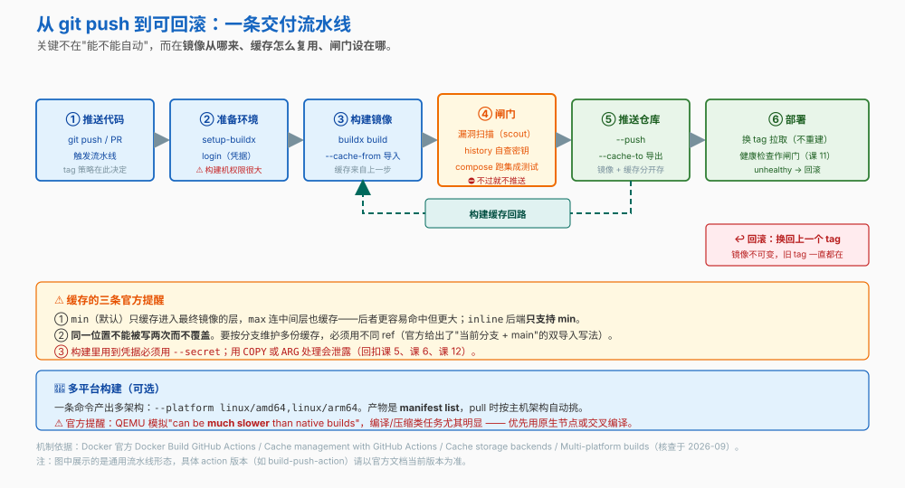

# 第 13 课：CI/CD与交付流水线

> 所属阶段：阶段 4《生产落地》｜ 水平：入门 ｜ 本课知识点：镜像仓库与推送流程、CI 中的构建与缓存、部署与回滚
> 故事情节：从"我本地构建推上去"变成"流水线构建、换 tag 即回滚"

## 🎯 本课目标

- 设计 tag 策略并安全地推送到仓库
- 在 CI 里复用构建缓存，让流水线构建和本地一样快
- 用不可变镜像实现"换 tag 即回滚"

## 📌 知识点导航

| 知识点 | 关键点 | 状态 |
|--------|--------|------|
| 镜像仓库与推送流程 | registry 选型 / tag 策略（语义化版本 + git sha）/ **`docker login` 的凭据存放位置**（默认 base64，官方说 less secure）/ `docker tag` 与 `docker push` 的先后 / 三大云 registry 的差异 / **Docker Hub 拉取限额与 CI 应对** | ✅ 已完成 |
| CI 中的构建与缓存 | BuildKit / 外部缓存必须显式 export + import / 四种缓存后端 / min 与 max 模式 / 一条最小 GitHub Actions 流水线 / 构建机的安全边界 | ✅ 已完成 |
| 部署与回滚 | 镜像不可变、换 tag 即回滚 / 健康检查作为发布闸门（回扣课 11）/ 滚动与蓝绿的取舍 | ✅ 已完成 |

---

## 第一幕：起源与场景引入

小杨的发布流程一直是这样的：

```bash
docker build -t order-service:v1.2.0 .     # 本地构建
docker push myrepo/order-service:v1.2.0    # 推上去
ssh prod "docker pull ... && docker compose up -d"
```

**构建发生在他自己的笔记本上。** 他觉得挺顺手，直到出了三次事。

**第一次**：他本地的构建缓存里混进了上次试验的残留，构建出来的镜像和同事构建的不一样。线上跑出了一个本地从未复现的行为——**"我这儿能跑"的变体**。

**第二次，比较严重**：他忘了切分支，把 `develop` 的代码打成镜像，推成了 `v1.2.0`。这个 tag 在仓库里**被覆盖了**，谁也说不清当时推上去的到底是什么。

**第三次**：线上出故障要回滚。他得**重新构建**上一个版本——十几分钟，而服务一直在报错。

> 🎬 **场景**：三次事故的病根是同一个——**构建产物是可变的、不可追溯的**。理想的流程应该是什么样？

---

## 第二幕：认知冲突

> ❓ **问题**：镜像该从哪来？怎么让 CI 构建和本地一样快？回滚为什么"换一个 tag"就够了？

三层答案：

1. **镜像该从哪来、怎么标识** → 仓库与 tag 策略（知识点 1）
2. **CI 里怎么构建得快** → 构建缓存（知识点 2）
3. **为什么换 tag 就能回滚** → 不可变镜像与部署闸门（知识点 3）

---

## 第三幕：层层揭示

### 知识点 1：镜像仓库与推送流程

> 本知识点关键点：registry 选型 / tag 策略 / `docker login` 的凭据存放 / `docker tag` 与 `docker push` 的先后

#### 一句话定义

**registry（镜像仓库）**是存放与分发镜像的服务。推送前**必须先用 `docker tag` 把镜像名改成 `<registry>/<namespace>/<image>:<tag>` 的形式**——Docker 是靠镜像名前缀判断该推到哪的。

#### 直觉建立（类比）

registry 就是**镜像的 Git 仓库**：`push` / `pull`、`tag` 对应版本标识。

> 💡 **类比的边界**：有一处关键不同——**Git 的 commit hash 不可变，而镜像的 tag 可以被覆盖**。今天 `v1.2.0` 和明天的 `v1.2.0` 可能是两个不同的镜像。真正不可变的是 **digest**（课 12）。

#### 核心原理

**一、registry 选型**

| 选择 | 特点 |
|---|---|
| **Docker Hub** | 公共镜像生态最大；免费额度有限制 |
| **云厂商 registry**（ECR / GCR(Arifact Registry) / ACR） | 与云上部署同区域，拉取快；权限用云的 IAM 管 |
| **自建**（registry:2 / Harbor） | 完全可控；但要自己维护高可用与存储 |

> 选型时最实际的一条：**registry 离部署目标越近越好**——镜像动辄几百 MB，跨区域拉取会显著拖慢发布。

**二、tag 策略：语义化版本 + git sha**

推荐同时打两个 tag：

```
myrepo/order-service:1.2.0          # 给人看：语义化版本
myrepo/order-service:1.2.0-a3f8c21  # 给机器追溯：版本 + git sha
```

⚠️ **`latest` 的陷阱**：它是**可变的**。你 pull `latest` 时不知道拿到的是什么。生产环境建议：
- 部署时**不要用 `latest`**
- 要真正锁定就用 **digest**（课 12）

**三、`docker tag` 必须在 `docker push` 之前**

Docker 靠镜像名前 Registry 部分决定推送目标。不改名直接 push，会推到默认的 Docker Hub：

```bash
docker build -t order-service:v1.2.0 .
docker push myrepo/order-service:v1.2.0    # ❌ 本地没有这个名字
# 正确做法：
docker tag order-service:v1.2.0 myrepo/order-service:v1.2.0
docker push myrepo/order-service:v1.2.0    # ✅
```

**四、⚠️ `docker login` 的凭据存在哪——官方说得很直接**

> "If you don't configure a credential store, Docker stores credentials in the `config.json` file in a **base64-encoded format**. **This method is less secure** than configuring and using a credential store."
>
> "Using an external store is **more secure** than storing credentials in the Docker configuration file."

配置文件的默认位置：`$HOME/.docker/config.json`（Linux）、`%USERPROFILE%/.docker/config.json`（Windows）。

**⚠️ base64 是编码，不是加密**——拿到这个文件就能还原凭据。

官方支持的 credential store / helper：

| 平台 | 默认尝试 |
|---|---|
| macOS | `osxkeychain` |
| Windows | `wincred` |
| Linux | `pass`；找不到则回退 `secretservice` |

**都找不到时，才会退回把 base64 写进 `config.json`。** Docker Desktop 会自动装好并配置。

配置方式（`~/.docker/config.json`）：

```json
{
  "credsStore": "osxkeychain"
}
```

或按 registry 指定：

```json
{
  "credHelpers": {
    "myregistry.example.com": "pass"
  }
}
```

> ⚠️ 官方提醒：改完要先 `docker logout` 清掉文件里的旧凭据，再 `docker login`。

**五、CI 里的登录方式**

官方给的理由很实在：

> "Using `STDIN` prevents the password from ending up in the shell's history, or log-files."

```bash
cat "$TOKEN_FILE" | docker login --username foo --password-stdin
```

> 进一步的做法是用**短期令牌 / OIDC 联邦身份**，避免长期凭据躺在 CI secrets 里（领域实践）。

#### 示例演示

```bash
# 1) 打 tag —— 必须带 registry 前缀，否则会推到 Docker Hub
docker build -t order-service:v1.2.0 .
docker tag order-service:v1.2.0 myrepo/order-service:1.2.0
docker tag order-service:v1.2.0 myrepo/order-service:1.2.0-$(git rev-parse --short HEAD)

docker images myrepo/order-service
# 预期：两个 tag 指向同一个 IMAGE ID

# 2) 看 digest —— 真正不可变的是它（课 12）
docker inspect myrepo/order-service:1.2.0 --format '{{index .RepoDigests 0}}'
# 预期：myrepo/order-service@sha256:...

# 3) 非交互式登录（避免密码进 shell history）
echo "$REGISTRY_TOKEN" | docker login myregistry.example.com --username ci --password-stdin

# 4) 推送（--all-tags 会把该仓库下所有 tag 都推上去）
docker push myrepo/order-service:1.2.0

# 5) 登出并确认凭据已移除
docker logout myregistry.example.com
```

#### 常见误区

1. **"`~/.docker/config.json` 里的凭据是加密的"** → 不是。官方原话是 **base64-encoded**，且明说 "**This method is less secure**"。配置 credential store 更安全。
2. **"tag 就像 Git 的 commit，不会变"** → 会变。tag 可以被覆盖，只有 **digest** 不可变。
3. **"build 完直接 push 就行"** → 要先 `docker tag` 成带 registry 前缀的名字，否则推到 Docker Hub。
4. **"CI 里用 `docker login -u user -p $TOKEN`"** → 密码会出现在命令历史与日志里。用 `--password-stdin`。

#### 一句话记住

> **tag 可变、digest 不可变；push 前先 tag；凭据默认 base64（官方说 less secure），CI 用 `--password-stdin`。**

#### 官方文档

- [docker login（Docker 官方）](https://docs.docker.com/reference/cli/docker/login/)——凭据存放位置、base64 vs credential store、官方"less secure"表述、`--password-stdin`、`credsStore` / `credHelpers` 配置
- [Pull usage and limits（Docker 官方）](https://docs.docker.com/docker-hub/usage/pulls/)——6 小时窗口的拉取限额、各订阅档位配额

##### 补充：推得出去，也得拉得回来——Docker Hub 拉取限额

上面讲的是**推送侧**。但生产事故里更常见的其实是**拉取侧**：CI 跑到一半突然报 `toomanyrequests: You have reached your pull rate limit`。

这个错误不是网络问题，是 Docker Hub 的**拉取限额**：

- 限额按 **6 小时滚动窗口**计算
- **未登录（匿名）用户**：每个 **IPv4 地址**（或 IPv6 /64 子网）**100 次 / 6 小时**
- **已登录的 Personal 用户**：**200 次 / 6 小时**
- **Pro / Team / Business**：**不限**（但仍受 fair use 约束）

**为什么 CI 最容易踩**：CI 跑在云上，出口 IP 往往是**整条流水线共用**的。匿名拉取时，100 次的配额是所有 job 分摊的——团队一大，上午就把配额用光了。

**一次 pull 怎么计数**（官方定义，容易算错）：

- 一次 `docker pull` 包含**版本检查 + 实际下载**；**版本检查不计入**配额
- 普通镜像：拉一次 = **1 次**（一个 manifest）
- **多架构镜像**：**每个不同架构各算 1 次**——这是很多人配额掉得快的隐藏原因

**四条应对办法**

```bash
# ① 最直接：CI 里先登录，配额从 100 提到 200
docker login -u "$DOCKERHUB_USER" --password-stdin <<< "$DOCKERHUB_TOKEN"

# ② 治本：把基础镜像同步到自己的 registry，之后从自己的仓库拉
docker pull alpine:3.20
docker tag  alpine:3.20 myregistry.internal/base/alpine:3.20
docker push myregistry.internal/base/alpine:3.20

# ③ 用 registry 作为 pull-through cache（镜像代理缓存）
#    配好之后，CI 拉 docker.io 的镜像走本地缓存，只miss时才回源

# ④ 减少无效拉取：Dockerfile 里锁死基础镜像 digest，别每次都 latest
FROM alpine:3.20@sha256:<digest>
```

**配额用在哪了，可以查**：登录后在 Docker Hub 的账户页能看到月度拉取用量与当前限额。

> ⚠️ **别把它当"Docker Hub 的坑"**：这是**公共 registry 的通行做法**（各大云厂商的公共镜像仓库也有限额）。真正要记住的是架构原则——**生产环境不该在运行时依赖公共 registry**。把基础镜像收进自己的仓库，既躲开限额，也躲开"上游镜像被删/被改"的风险。

---

### 知识点 2：CI 中的构建与缓存

> 本知识点关键点：BuildKit / 外部缓存必须显式 export + import / 四种缓存后端 / min 与 max 模式 / 构建机安全边界

#### 一句话定义

CI 环境**几乎不留状态**，所以构建缓存必须**显式导出到外部、再显式导入**——官方原话：

> "Unlike the local BuildKit cache (which is always enabled), all of the cache storage backends must be **explicitly exported to, and explicitly imported from**."

#### 直觉建立（类比）

本地构建像**在自己工位**干活：工具、半成品都在手边，第二天来还在。

CI 每次构建像**换一间全新的空房间**：什么都不留。所以下班前得把半成品**打包存到储物柜**（`--cache-to`），明天开工先从柜子里取出来（`--cache-from`）。

> 💡 **类比的边界**：储物柜有容量限制，而且**同一个柜子不能放两份东西**——后放的会盖掉先放的（这对应下面那条官方警告）。

#### 核心原理



**一、缓存层：BuildKit 的分层缓存（回扣课 4）**

课 4 讲过：Dockerfile 每条指令对应一层，**某层失效则其后所有层都要重跑**（官方叫 cache invalidation）。所以**把变化频繁的指令放后面**是加速的第一原则——在 CI 里这条同样成立，而且更重要（因为每次都是全新环境）。

**二、四种缓存后端**

| 后端 | 存哪 | 特点 |
|---|---|---|
| `inline` | 嵌进**镜像本身**，推到主输出同一位置 | 最省事；⚠️ **只支持 `min` 模式**，且只用于 `image` exporter |
| `registry` | 嵌进**单独的缓存镜像**，推到专门位置 | 可用 `max` 模式；最通用 |
| `local` | 写到**本地目录** | 需要配合 `actions/cache` 之类的机制搬运 |
| `gha` | 上传到 **GitHub Actions cache** | ⚠️ 官方标注为 Experimental |

> ⚠️ **一个很容易卡住的前提**（官方说明）：默认的 `docker` 驱动**只有在启用了 containerd image store 时**才支持上面这四种后端。若你的环境不满足，`--cache-to` 会直接失败。
>
> 解决办法是建一个自定义 builder：
>
> ```bash
> docker buildx create --name container-builder --driver docker-container --bootstrap --use
> ```
>
> ⚠️ 官方提醒：`docker-container` 驱动的构建结果**不会自动加载进本地 Engine 的镜像库**——需要 `--push` 推到 registry，或显式 `--load`。

语法（以 registry 为例）：

```bash
docker buildx build --push -t <registry>/<image> \
  --cache-to type=registry,ref=<registry>/<cache-image>,mode=max \
  --cache-from type=registry,ref=<registry>/<cache-image> .
```

**三、`min` vs `max` 模式**

| 模式 | 缓存什么 | 取舍 |
|---|---|---|
| `min`（默认） | 只缓存**进入最终镜像**的层 | 更小、导入导出更快、存储成本低 |
| `max` | 缓存**所有层**，包括中间步骤 | 更容易命中缓存（多阶段构建尤其明显） |

> 官方："While `min` cache is typically smaller... **`max` cache is more likely to get more cache hits**. Depending on the complexity and location of your build, you should experiment with both."
>
> ⚠️ 模式**只在 `--cache-to` 时设置**；`--cache-from` 时会自动检测。

**四、⚠️ 三条官方警告**

**① 同一位置不能被写两次**

> "As a general rule, each cache writes to some location. **No location can be written to twice, without overwriting the previously cached data.** If you want to maintain multiple scoped caches (for example, a cache per Git branch), then ensure that you use different locations."

想按分支维护缓存，用不同 ref；常见的做法是**同时导入当前分支与 main 的缓存**：

```bash
--cache-to type=registry,ref=<registry>/<cache-image>:<branch> \
--cache-from type=registry,ref=<registry>/<cache-image>:<branch> \
--cache-from type=registry,ref=<registry>/<cache-image>:main
```

**② 构建里的凭据必须用 `--secret`**

> "If you use secrets or credentials inside your build process, ensure you manipulate them using the dedicated **`--secret`** option. Manually managing secrets using **`COPY` or `ARG` could result in leaked credentials**."

（回扣课 5、课 6、课 12：这正是"密钥不进层"的第三种场景。）

**③ `gha` 后端的限制**

- 官方标注 **Experimental**
- ⚠️ **只能在 GitHub Actions workflow 里用**——因为 `url`（`$ACTIONS_RESULTS_URL`）与 `token`（`$ACTIONS_RUNTIME_TOKEN`）只在 workflow 上下文里才有
- ⚠️ **GitHub Cache service API v1 已于 2025-04-15 关停**，只支持 v2。若看到 "This legacy service is shutting down" 报错，最低版本要求是：
  - Docker Buildx ≥ v0.21.0
  - BuildKit ≥ v0.20.0
  - Docker Compose ≥ v2.33.1
  - Docker Engine ≥ v28.0.0（用 docker driver + containerd 时）
- ⚠️ **cache mounts（`RUN --mount=type=cache`）默认不会被 gha 保留**——官方提到需要 `buildkit-cache-dance` 这类 workaround

**④ `local` 后端的目录会一直变大**

> "Exporting to a directory that already holds a cache leaves the blobs of the previous export behind, so the directory grows with every run."

用 `reset=true`（需 Buildx ≥ 0.35.0）。

**五、一条最小 GitHub Actions 流水线**

Docker 官方提供了一组 actions，常用的四个：

| Action | 作用 |
|---|---|
| `docker/setup-buildx-action` | 创建并启动 BuildKit builder |
| `docker/login-action` | 登录 registry |
| `docker/build-push-action` | 构建并推送（BuildKit） |
| `docker/metadata-action` | 从 Git ref 自动生成 tag 与 label |

用 **registry 缓存**的最小示例（来自官方文档）：

```yaml
name: ci

on:
  push:

jobs:
  docker:
    runs-on: ubuntu-latest
    steps:
      - name: Login to Docker Hub
        uses: docker/login-action@v4
        with:
          username: ${{ vars.DOCKERHUB_USERNAME }}
          password: ${{ secrets.DOCKERHUB_TOKEN }}
      - name: Set up Docker Buildx
        uses: docker/setup-buildx-action@v4
      - name: Build and push
        uses: docker/build-push-action@v7
        with:
          push: true
          tags: user/app:latest
          cache-from: type=registry,ref=user/app:buildcache
          cache-to: type=registry,ref=user/app:buildcache,mode=max
```

用 **gha 缓存**时把最后两行换成：

```yaml
          cache-from: type=gha
          cache-to: type=gha,mode=max
```

> ⚠️ 以上为官方示例的**结构**；action 的具体版本请以官方文档当前版本为准。

**六、⚠️ 构建机的安全边界**

CI runner 上跑着 `docker build`，而 **`docker` 组权限 ≈ root**（能挂载宿主机目录、能起特权容器）。叠加课 12 那条：**把 `/var/run/docker.sock` 挂进容器 = 交出宿主机 Docker 的完整控制权**。

所以：
- **不要把 docker.sock 挂进不受信任的构建步骤**
- **PR 触发的构建不要给它写 registry 的权限**（只构建、不推送）
- 推送用的凭据用**最小权限的专用账号**

**七、🎁 一份可以照抄的完整流水线**

把上面的片段合起来（结构参考，action 版本请以官方文档当前版本为准）：

```yaml
name: ci

on:
  push:
    branches: [main]
  pull_request:

jobs:
  docker:
    runs-on: ubuntu-latest
    permissions:
      contents: read
    steps:
      - uses: actions/checkout@v5

      - name: Set up Docker Buildx
        uses: docker/setup-buildx-action@v4

      # ⚠️ PR 触发时不登录、不推送 —— PR 的代码不可信
      - name: Login to registry
        if: github.event_name != 'pull_request'
        uses: docker/login-action@v4
        with:
          username: ${{ vars.REGISTRY_USER }}
          password: ${{ secrets.REGISTRY_TOKEN }}

      - name: Build (load for testing)
        uses: docker/build-push-action@v7
        with:
          context: .
          load: true
          push: false
          tags: myrepo/app:ci-${{ github.sha }}
          cache-from: type=gha
          cache-to: type=gha,mode=max

      # 闸门①：镜像里有没有烤进密钥（课 12）
      - name: Check for baked secrets
        run: |
          if docker history myrepo/app:ci-${{ github.sha }} --no-trunc \
             | grep -iE 'password|secret|token|api[_-]?key'; then
            echo "⛔ 镜像里含有疑似密钥"; exit 1
          fi

      # 闸门②：集成测试（复用课 9 的 compose）
      - name: Integration test
        run: docker compose -f compose.test.yaml up --abort-on-container-exit --exit-code-from tests

      # 闸门③：漏洞扫描
      - name: Vulnerability scan
        uses: docker/scout-action@v1
        with:
          command: cves
          image: myrepo/app:ci-${{ github.sha }}

      # 三道闸门都过了才推送
      - name: Push
        if: github.event_name != 'pull_request'
        uses: docker/build-push-action@v7
        with:
          context: .
          push: true
          tags: |
            myrepo/app:${{ github.ref_name }}
            myrepo/app:${{ github.sha }}
          cache-from: type=gha
```

> 三个设计要点：
> 1. **PR 只构建、不推送**——PR 代码不可信，不该拿到写 registry 的凭据
> 2. **tag 带 git sha**——产物可追溯，且永不覆盖
> 3. **三道闸门都在推送之前**——脏镜像根本进不了仓库

#### 示例演示

```bash
# 1) 本地就能试：local 缓存后端（导出 → 导入）
mkdir -p /tmp/buildx-cache
docker buildx build -t cache-demo:v1 \
  --cache-to   type=local,dest=/tmp/buildx-cache,mode=max \
  . 2>/dev/null || docker build -t cache-demo:v1 .

# 2) 第二次构建：从同一目录导入缓存（观察是否命中）
docker buildx build -t cache-demo:v2 \
  --cache-from type=local,src=/tmp/buildx-cache \
  --cache-to   type=local,dest=/tmp/buildx-cache,mode=max,reset=true \
  . 2>/dev/null || echo "（本机不支持 buildx 时用 docker build 即可，分层缓存同样生效）"

# ⚠️ reset=true 用来清掉上一轮的残留 blob，否则目录会一直变大（需 Buildx ≥ 0.35.0）

# 3) 印证课 4 的缓存失效：改一行源码，看哪些层重跑
docker build -t cache-demo:v3 . --progress=plain 2>&1 | grep -E 'CACHED|RUN|COPY' | head -20
# 预期：改动点之前的层显示 CACHED，之后的层全部重跑

# 4) 推送前先打 registry 前缀的 tag（知识点 1）
docker tag cache-demo:v1 myrepo/cache-demo:1.0.0
docker images myrepo/cache-demo
```

#### 常见误区

1. **"CI 里 BuildKit 会自动复用缓存"** → 不会。官方原话：外部缓存**必须显式 export 和 import**。
2. **"缓存位置随便写，多分支共用没事"** → 官方警告：同一位置写两次会**覆盖**之前的数据。要按分支用不同 ref。
3. **"构建里用 `ARG` 传令牌没问题"** → 官方明确警告会导致凭据泄露，必须用 `--secret`。
4. **"`gha` 缓存能顺带保住 `RUN --mount=type=cache`"** → 官方说**默认不会**，需要额外 workaround。
5. **"PR 构建也给推送权限比较方便"** → 危险。PR 的代码是不可信的，不该拿到写 registry 的凭据。

#### 一句话记住

> **CI 缓存要显式 `--cache-to` / `--cache-from`；`max` 命中率高、`inline` 只支持 `min`；构建里的凭据只走 `--secret`。**

#### 官方文档

- [Cache storage backends（Docker 官方）](https://docs.docker.com/build/cache/backends/)——四种后端、"必须显式导入导出"、`min`/`max`、覆盖警告、`--secret` 警告、ECR 的 `image-manifest` 注意
- [Cache management with GitHub Actions（Docker 官方）](https://docs.docker.com/build/ci/github-actions/cache/)——inline / registry / gha / local 四种写法与各自限制
- [Docker Build GitHub Actions（Docker 官方）](https://docs.docker.com/build/ci/github-actions/)——官方 actions 清单

---

### 知识点 3：部署与回滚

> 本知识点关键点：镜像不可变、换 tag 即回滚 / 健康检查作为发布闸门 / 滚动与蓝绿的取舍

#### 一句话定义

**镜像一旦推送就不可变**——这让"回滚"从"重新构建旧版本"降级成"**把运行的 tag 换回上一个**"，几秒钟的事。

#### 直觉建立（类比）

以前的部署像是**每次现做一道菜**：回滚 = 照着记忆重做上一版（可能做不出一模一样的）。

不可变镜像像是**预制菜贴了批次号**：回滚 = 从冷柜里**拿回上一批**，一模一样，立刻可用。

> 💡 **类比的边界**：前提是**那一批还在冷柜里**——如果仓库里的 tag 被覆盖了、或镜像被清理策略删掉了，回滚就无从谈起。所以"永不覆盖 tag"和"保留历史镜像"是这条策略的前提。

#### 核心原理

**一、为什么换 tag 就能回滚**

三个前提叠加：

1. **镜像内容由 digest 唯一确定**（课 12）——同一个 digest 永远是同一份内容
2. **不覆盖已发布的 tag**——`1.2.0` 推上去就不再动
3. **部署时只引用 tag / digest，不重新构建**

于是：

```bash
# 发布
docker compose up -d          # 用的是 image: myrepo/app:1.2.0

# 回滚：只改 compose 里的 tag，不重建任何东西
sed -i 's/:1.2.0/:1.1.9/' compose.yaml
docker compose up -d
```

> ✅ **回扣场景**：第一幕第三次事故里"重新构建上一个版本要十几分钟"——用这个方式，回滚是**改一个字符串 + 重启**。

**二、健康检查作为发布闸门（回扣课 11）**

课 11 讲过：`Up` 只说明进程在，健康检查才说明服务能用。在部署里它变成**闸门**：

```
部署新版本 → 等健康检查变 healthy → 切流量
                    ↓ 超时仍 unhealthy
                 自动回滚到上一个 tag
```

> 这也是课 9 的 `depends_on: condition: service_healthy` 在发布场景的延伸用法——**同样依赖被部署方声明了 `healthcheck`**（课 9 知识点 3 那条"必须成对出现"在这里同样成立）。

**三、滚动 vs 蓝绿（取舍）**

> ⏳ **置信度：中** —— 以下是**领域通行实践**，非本课逐条核实的官方文档内容：

| | 滚动更新 | 蓝绿部署 |
|---|---|---|
| 做法 | 逐个替换实例 | 起一整套新版本，验证后整体切流量 |
| 资源 | 少（无需双倍） | 需要**双倍**资源 |
| 回滚 | 逐实例回退，较慢 | **切回即可，最快** |
| 复杂度 | 低 | 高（要处理流量切换、会话、数据迁移） |
| 适用 | 无状态服务、常规发布 | 关键业务、需要"发布即可验证"的场景 |

> 还有一个常见的中间方案：**金丝雀（灰度）**——先放一小部分流量到新版本，观察指标正常再全量。

**四、数据迁移的反向约束**

⚠️ 一个容易被忽略的点：**代码可以瞬间回滚，数据库 schema 不能**。

所以发布涉及 schema 变更时，通行做法是**拆成多步**：先发布"新旧版本都能兼容"的 schema（加列而非删列），等回滚窗口过去后再清理。（领域实践，置信度中。）

#### 示例演示

```bash
# 1) 用 compose 演示「换 tag 即回滚」
mkdir -p /tmp/rollback-demo && cd /tmp/rollback-demo
cat > compose.yaml <<'EOF'
services:
  app:
    image: alpine:3.19
    command: ["sh", "-c", "echo 当前版本=$(cat /etc/alpine-release); sleep 3600"]
EOF

docker compose up -d
docker compose logs app
# 预期：打印 3.19 的版本号

# 2) 「发布新版本」—— 只改 tag
#    （这里用重写文件代替 sed -i：macOS 的 sed -i 需要额外的备份后缀参数，
#     直接写 sed -i 's/.../' 在 macOS 上会报错，跨平台容易踩坑）
cat > compose.yaml <<'EOF'
services:
  app:
    image: alpine:3.20
    command: ["sh", "-c", "echo 当前版本=$(cat /etc/alpine-release); sleep 3600"]
EOF
docker compose up -d
docker compose logs app
# 预期：打印 3.20 的版本号

# 3) 「回滚」—— 把 tag 改回去，不重新构建任何东西
cat > compose.yaml <<'EOF'
services:
  app:
    image: alpine:3.19
    command: ["sh", "-c", "echo 当前版本=$(cat /etc/alpine-release); sleep 3600"]
EOF
docker compose up -d
docker compose logs app
# 预期：又变回 3.19 的版本号

# ⚠️ 注意：上面的 image 用的是可变的 tag。
#    生产环境应改用 digest 锁定：
#    image: alpine@sha256:<digest>

docker compose down
```

#### 常见误区

1. **"回滚要重新构建"** → 不需要。镜像不可变，换回旧 tag / 旧 digest 即可。
2. **"用 `latest` 部署很方便"** → 危险。`latest` 可变，你不知道部署的是哪个版本，也无法可靠回滚。
3. **"健康检查配置一次就完事"** → 它是**闸门**的一部分。没有它，编排系统无法判断新版本到底起没起来。
4. **"代码回滚了就万事大吉"** → 数据库 schema 不会跟着回滚。破坏性迁移要拆步做。

#### 一句话记住

> **镜像不可变 → 回滚就是换 tag；健康检查是发布闸门；schema 变更要拆成可回滚的多步。**

#### 官方文档

- [Docker Build GitHub Actions（Docker 官方）](https://docs.docker.com/build/ci/github-actions/)——官方 actions（含 scout 扫描 action，可用作发布闸门）

---

## 第四幕：实操验证

把第一幕那三次事故逐个消掉。

> ⚠️ 本讲义的命令与预期输出为**纸面预期**（写作时本机 Docker 守护进程未运行）。CI 相关的 YAML 为参考结构，需在你自己的仓库里运行。

### 步骤 1：消除"本地缓存残留"——tag 带上 git sha

```bash
# 构建时把 git sha 打进标签，让产物可追溯（需在 git 仓库内执行）
SHA=$(git rev-parse --short HEAD)   # 非 git 目录会报错，可先 git init 或直接用日期戳
docker build -t myrepo/order-service:1.2.0-$SHA .
docker images myrepo/order-service
# 预期：tag 里含有 git sha
```

> ✅ **回扣场景**：第一次事故"本地残留导致产物不一致"——只要构建只发生在干净的 CI 环境，且 tag 带 sha，这个问题就消失了。

### 步骤 2：消除"tag 被覆盖"——永不覆盖已发布 tag

```bash
# 推上去之前，检查这个 tag 是否已存在（存在就应当报错，而不是覆盖）
docker manifest inspect myrepo/order-service:1.2.0 >/dev/null 2>&1 \
  && echo "⛔ 该 tag 已存在，请换版本号" \
  || echo "✅ 可以推送"

# 用 digest 确认推上去的到底是什么（课 12）
docker inspect myrepo/order-service:1.2.0-$SHA --format '{{index .RepoDigests 0}}'
```

> ✅ **回扣场景**：第二次事故"develop 代码推成了 v1.2.0"——**永不覆盖** + **tag 带 sha** 让这类错误无法悄悄发生。

### 步骤 3：让 CI 构建和本地一样快

本地可用 `local` 后端验证缓存回路：

```bash
mkdir -p /tmp/buildx-cache

# 第一次：导出缓存
docker buildx build -t cache-demo:v1 \
  --cache-to type=local,dest=/tmp/buildx-cache,mode=max .

# 第二次：导入缓存（观察 CACHED 行数变化）
docker buildx build -t cache-demo:v2 \
  --cache-from type=local,src=/tmp/buildx-cache \
  --cache-to   type=local,dest=/tmp/buildx-cache,mode=max,reset=true .
```

在 CI 里对应的两种写法（结构参考）：

```yaml
# registry 缓存（通用，生产推荐）
cache-from: type=registry,ref=user/app:buildcache
cache-to:   type=registry,ref=user/app:buildcache,mode=max

# gha 缓存（GitHub 托管 runner 最省事）
cache-from: type=gha
cache-to:   type=gha,mode=max
```

> ⚠️ `gha` 是 Experimental、只能在 workflow 内使用，且 **cache mounts 默认不会被保留**。

### 步骤 4：把闸门设上

```yaml
# 推送前的两道闸门
      - name: Build (no push)
        uses: docker/build-push-action@v7
        with:
          push: false
          load: true
          tags: user/app:ci-test
          cache-from: type=gha

      # 闸门一：镜像里有没有烤进密钥（课 12 的自查）
      - name: Check for baked secrets
        run: |
          if docker history user/app:ci-test --no-trunc \
             | grep -iE 'password|secret|token|api[_-]?key'; then
            echo "⛔ 镜像里含有疑似密钥"; exit 1
          fi

      # 闸门二：用 compose 跑集成测试（课 9 的成果在这里复用）
      - name: Integration test
        run: docker compose -f compose.test.yaml up --abort-on-container-exit --exit-code-from tests

      # 闸门三：漏洞扫描（官方 scout action）
      - name: Scan
        uses: docker/scout-action@v1
        with:
          command: cves
          image: user/app:ci-test
```

> ✅ **回扣课 12**：扫描只有放进 CI 才有意义（作为闸门，不是事后抽查）；`docker history` 自查应成为流水线里的一步。

### 步骤 5：验证"换 tag 即回滚"

```bash
cd /tmp/rollback-demo
docker compose up -d && docker compose logs app     # 3.19
sed -i 's/alpine:3.19/alpine:3.20/' compose.yaml
docker compose up -d && docker compose logs app     # 3.20（发布）
sed -i 's/alpine:3.20/alpine:3.19/' compose.yaml
docker compose up -d && docker compose logs app     # 3.19（回滚，未重建任何东西）
docker compose down
```

> ✅ **回扣场景**：第三次事故"回滚要重建十几分钟"——现在是改一个字符串。

---

## 第五幕：体系收束

> 📍 **全局定位**：阶段 4《生产落地》收官。
>
> 四课成果合起来，`order-service` 从"能跑"走到了"能稳稳地交付"：
>
> | 课 | 成果 |
> |---|---|
> | 课 10 | 资源限制、重启策略、优雅停止 |
> | 课 11 | 日志轮转、健康检查、可信指标 |
> | 课 12 | 降权、能力收敛、镜像干净 |
> | **课 13** | **流水线构建、缓存复用、换 tag 即回滚** |
>
> 故事主线到这里完成了它的承诺：**课 1 的"我这儿能跑"，现在是"任何地方都能稳稳跑，且出事能在几秒内换回去"。**

> 🔗 **下一步**：进入**阶段 5《定位与决策》**（课 14–15），从"会用"走向"用对"。
>
> 阶段 5 要回答的不是"怎么做"，而是"**该不该做、做到哪一步**"：
>
> | 课 | 问题 |
> |---|---|
> | 课 14 | Docker 的边界在哪——哪些场景它并不合适 |
> | 课 15 | 一份可带走的决策清单与落地路线 |
>
> 而本阶段积累的几条**代价**，正是那场讨论的输入：
>
> - **容器不是安全沙箱**（课 12）——共享内核、默认 root
> - **可观测性要额外建设**（课 11）——日志会撑爆磁盘、`Up` 不等于健康
> - **交付链路要额外建设**（本课）——缓存、闸门、registry 都要人管
>
> 这些不是"用了 Docker 就会自动得到"的东西，而是**引入 Docker 时一并背上的成本**。阶段 5 会帮你在具体场景里权衡它们。

---

## 🐞 常见误区

1. **"镜像 tag 像 Git commit 一样不会变"** → 会变，可以被覆盖。只有 **digest** 不可变。

2. **"`~/.docker/config.json` 里的凭据是加密的"** → 官方原话是 **base64-encoded**，并明说 "**This method is less secure**"。应配置 credential store。

3. **"CI 里 BuildKit 会自动复用缓存"** → 不会。外部缓存必须**显式 `--cache-to` 导出、`--cache-from` 导入**。

4. **"缓存位置多分支共用没事"** → 官方警告：同一位置写两次会**覆盖**之前的数据。按分支用不同 ref。

5. **"构建里用 `ARG` 传令牌没问题"** → 官方明确警告"could result in **leaked credentials**"，必须用 `--secret`。

6. **"回滚要重新构建旧版本"** → 不需要。镜像不可变，换回旧 tag / digest 即可，几秒钟。

7. **"用 `latest` 部署很方便"** → 危险且无法可靠回滚。生产用**具体版本 tag 或 digest**。

8. **"代码回滚了就万事大吉"** → 数据库 schema 不会跟着回滚；破坏性迁移要拆成可回滚的多步。

---

## 一图总结

```mermaid
graph TD
    A["本地构建推送 → 三次事故"] --> B["改为流水线构建"]

    B --> C["① 仓库与 tag"]
    B --> D["② CI 构建与缓存"]
    B --> E["③ 部署与回滚"]

    C --> C1["tag 策略：语义化版本 + git sha"]
    C --> C2["⚠️ latest 可变；digest 才不可变"]
    C --> C3["push 前必须先 docker tag 加 registry 前缀"]
    C --> C4["⚠️ 凭据默认 base64（官方：less secure）"]
    C --> C5["CI 用 --password-stdin；优先短期令牌"]

    D --> D1["BuildKit 分层缓存（课 4）：改一层则其后全重跑"]
    D --> D2["⚠️ 外部缓存须显式 export + import"]
    D --> D3["后端：inline / registry / local / gha"]
    D --> D4["min（默认，仅最终层）vs max（含中间层）"]
    D --> D5["⚠️ inline 只支持 min"]
    D --> D6["⚠️ 同一位置写两次会覆盖 → 按分支用不同 ref"]
    D --> D7["⚠️ 构建凭据只走 --secret，别用 COPY / ARG"]
    D --> D8["⚠️ 构建机权限 ≈ root；PR 构建不给推送权"]

    E --> E1["镜像不可变 → 回滚 = 换 tag"]
    E --> E2["部署不重建，只换引用"]
    E --> E3["健康检查作发布闸门（课 11）"]
    E --> E4["滚动（省资源）vs 蓝绿（回滚快、要双倍）"]
    E --> E5["⚠️ schema 不会跟着回滚 → 迁移要拆步"]
```



---

## 📋 命令速查卡

| 命令 | 作用 | 本课出现在哪 |
|------|------|------------|
| `docker tag <本地镜像> <registry>/<ns>/<镜像>:<tag>` | **推送前必须**先改成带 registry 前缀的名字 | 知识点 1 / 演示 |
| `docker push <registry>/<ns>/<镜像>:<tag>` | 推送到 registry | 知识点 1 / 演示 |
| `docker inspect <镜像> --format '{{index .RepoDigests 0}}'` | 看 **digest**——真正不可变的标识 | 知识点 1 / 步骤 2 |
| `docker login --username <用户> --password-stdin` | 非交互登录（官方：避免密码进 history 与日志） | 知识点 1 / 演示 |
| `docker logout <registry>` | 登出并移除凭据（改 credential store 前先做） | 知识点 1 / 演示 |
| `--cache-to type=<后端>,ref=<位置>,mode=max` | **导出**构建缓存（`max` 命中率更高） | 知识点 2 / 步骤 3 |
| `--cache-from type=<后端>,ref=<位置>` | **导入**构建缓存；可重复指定多个源 | 知识点 2 / 步骤 3 |
| `--cache-to type=local,dest=<目录>,reset=true` | 本地缓存；`reset=true` 防止目录无限增长（Buildx ≥ 0.35） | 知识点 2 / 演示 |
| `docker buildx build --platform linux/amd64,linux/arm64` | 多平台构建（⚠️ QEMU 模拟可能很慢） | 知识点 2 / 说明 |
| `docker history <镜像> --no-trunc \| grep -iE 'password\|secret'` | ⚠️ **CI 里的密钥自查闸门**（课 12） | 步骤 4 |
| `docker compose up -d`（改 tag 后重跑） | **回滚**：换回旧 tag，不重建任何东西 | 知识点 3 / 步骤 5 |

---

## 课后小测

**Q1**：CI 里跑 `docker build`，希望复用上一次的构建缓存。正确做法是？

- A. 什么都不用做，BuildKit 会自动从 registry 拉取缓存
- B. 必须在上一次构建时用 `--cache-to` **显式导出**，这一次用 `--cache-from` **显式导入**；官方明说外部缓存"必须显式导入导出"
- C. 只要 Dockerfile 一样就会自动命中
- D. 把 `/var/lib/docker` 缓存起来即可

<details><summary>答案与解析</summary>

**答案：B**。官方原话：

> "Unlike the local BuildKit cache (which is always enabled), all of the cache storage backends must be **explicitly exported to, and explicitly imported from**."

两个配套的坑：

1. **同一位置不能被写两次**——官方警告 "No location can be written to twice, **without overwriting the previously cached data**"。要按分支维护缓存，必须用不同 ref；常见写法是同时导入"当前分支 + main"两份缓存。
2. **模式选择**：`min`（默认）只缓存进入最终镜像的层，`max` 连中间层也缓存。官方说 "`max` cache is **more likely to get more cache hits**"。而 `inline` 后端**只支持 `min`**。

</details>

**Q2**：关于 `docker login` 存放凭据，下列说法正确的是？

- A. 凭据被加密存放在 `~/.docker/config.json`，很安全
- B. 未配置 credential store 时，凭据以 **base64 编码**存在 `config.json` 里，官方明确说这种方式 "**less secure**"；应改用 credential store
- C. 凭据不存在本地，每次都问 registry
- D. 只有 Linux 上有这个问题，macOS / Windows 都安全

<details><summary>答案与解析</summary>

**答案：B**。官方原话：

> "If you don't configure a credential store, Docker stores credentials in the `config.json` file in a **base64-encoded format**. **This method is less secure** than configuring and using a credential store."
>
> "Using an external store is **more secure** than storing credentials in the Docker configuration file."

⚠️ **base64 是编码，不是加密**——拿到这个文件就能还原凭据。

D 有一定道理（Docker Desktop 会自动装好 credential store，macOS 用 `osxkeychain`、Windows 用 `wincred`），但**不是"都安全"**：Linux 上默认尝试 `pass`，找不到才回退 `secretservice`，**两者都没有时才会退回 base64 写进 `config.json`**。所以 Linux 服务器/CI 环境尤其要检查。

配置方式：`{"credsStore": "osxkeychain"}` 或按 registry 指定 `credHelpers`。⚠️ 官方提醒：改完要先 `docker logout` 再 `docker login`。

CI 里另有一条：用 `--password-stdin`，官方理由是 "prevents the password from ending up in the shell's history, or log-files"。

</details>

**Q3**：线上出新版本后出故障，需要回滚。最快的正确做法是？

- A. 在本地重新构建上一个版本再推送
- B. 找出上一个版本的 **tag / digest**，把部署引用换回去即可——**镜像不可变，不需要重新构建**
- C. 把 `latest` 重新指向旧版本
- D. 删掉新版本镜像，让编排系统自动用旧的

<details><summary>答案与解析</summary>

**答案：B**。镜像推送后**内容不可变**（由 digest 唯一确定），所以"回滚"不是"重新生产一个旧版本"，而是"**把引用换回旧的那个**"——改一个字符串 + 重启，几秒钟。

三个前提：
1. **不覆盖已发布的 tag**（`1.2.0` 推上去就不再动）
2. **旧的镜像在 registry 里还在**（注意别被清理策略删掉）
3. **部署只引用 tag / digest，不重新构建**

C 错——`latest` 本身就不该用于生产部署：它可变，你既不知道部署的是哪个版本，也无法可靠回滚。

另外提醒一条容易被忽略的：**代码可以瞬间回滚，数据库 schema 不能**。涉及 schema 变更的发布要拆成多步（先发布新旧版本都兼容的 schema，等回滚窗口过去再清理）。

</details>

---

## 🚀 下一批接力提示词

> 学完本课后，**复制下面这段文字发给 AI**，即可无缝进入下一批（无需重新描述上下文）：

```
继续学 Docker。我的学习档案在 docker/00-学习档案.md，
刚学完阶段 4《生产落地》的课《CI/CD与交付流水线》知识点 镜像仓库与推送流程、CI 中的构建与缓存、部署与回滚，
请按大纲继续讲解下一批知识点。
```

## 🧭 课程导航

⬅️ **上一课**：[课 12：容器安全边界](lesson-12-容器安全边界.md)

➡️ **下一课**：阶段 5 课 14（[课程目录](../../../02-课程目录.md)）

📚 **返回目录**：[课程目录](../../../02-课程目录.md)

🎉 **阶段 4《生产落地》已完成** —— 进入阶段 5《定位与决策》
