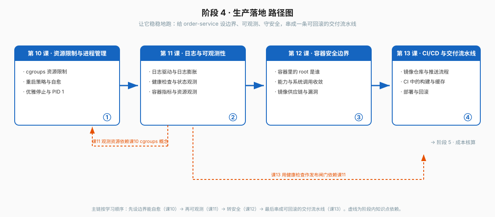

# 阶段 4：生产落地

> 所属课程：Docker 系统学习 ｜ 故事章节：让它稳稳地跑 ｜ 上一阶段：[阶段 3](../3-数据与网络/overview.md)

## 🎯 本阶段目标

- 给容器设好资源边界，让它不会拖垮宿主机
- 让日志可查、状态可观测、故障可恢复
- 收敛容器权限与镜像供应链风险
- 把构建、测试、推送、部署串成一条可回滚的流水线

## 📍 学习重点

- `--memory` / `--cpus` 的语义与 OOMKilled；容器内 `free` / `nproc` 看到的是宿主机
- 重启策略不等于健康检查；退出码语义；SIGTERM → 宽限期 → SIGKILL
- exec 形式才收得到信号；PID 1 要负责回收僵尸进程
- json-file 默认无限增长；`docker logs` 读的是宿主机上的文件
- 共享内核意味着容器内 root 风险真实；USER / capabilities / rootless
- 镜像不可变 + 换 tag 即回滚；健康检查作为发布闸门

## ✅ 必须掌握的知识点

| 知识点 | 所属课 | 学完应能 |
|--------|--------|----------|
| cgroups 资源限制 | 课 10 · 资源限制与进程管理 | 正确设置内存与 CPU 限制，看懂 OOMKilled 与退出码 137 |
| 重启策略与自愈 | 课 10 · 资源限制与进程管理 | 区分 no / on-failure / always / unless-stopped，并说清重启策略不等于健康检查 |
| 优雅停止与 PID 1 | 课 10 · 资源限制与进程管理 | 说清 SIGTERM → 宽限期 → SIGKILL，以及为什么 exec 形式才收得到信号 |
| 日志驱动与日志膨胀 | 课 11 · 日志与可观测性 | 用 max-size / max-file 管住体积，并说清 docker logs 读的是什么 |
| 健康检查与状态观测 | 课 11 · 日志与可观测性 | 用 HEALTHCHECK 表达就绪，用 stats / events / inspect 观测状态 |
| 容器指标与资源观测 | 课 11 · 日志与可观测性 | 说清 cgroups 是指标真实来源、stats 各字段含义、以及容器内 top 为何看到宿主机 |
| 容器里的 root 是谁 | 课 12 · 容器安全边界 | 说清共享内核下的真实风险，并用 USER 指令降权 |
| 能力与系统调用收敛 | 课 12 · 容器安全边界 | 用 --cap-drop=ALL 按需授权，说清 --privileged 的代价 |
| 镜像供应链与漏洞 | 课 12 · 容器安全边界 | 选可信基础镜像、做漏洞扫描、核验来源，并杜绝密钥进镜像层 |
| 镜像仓库与推送流程 | 课 13 · CI-CD与交付流水线 | 设计 tag 策略、安全存放凭据、完成 push |
| CI 中的构建与缓存 | 课 13 · CI-CD与交付流水线 | 用 BuildKit 与缓存挂载加速 CI 构建，并守住构建机安全边界 |
| 部署与回滚 | 课 13 · CI-CD与交付流水线 | 用不可变镜像实现"换 tag 即回滚"，并用健康检查做发布闸门 |

## 🗺️ 本阶段路径图

## 本阶段产出

- [x] `lessons/lesson-10-资源限制与进程管理.md`
- [x] `lessons/lesson-11-日志与可观测性.md`
- [x] `lessons/lesson-12-容器安全边界.md`
- [x] `lessons/lesson-13-CI-CD与交付流水线.md`
