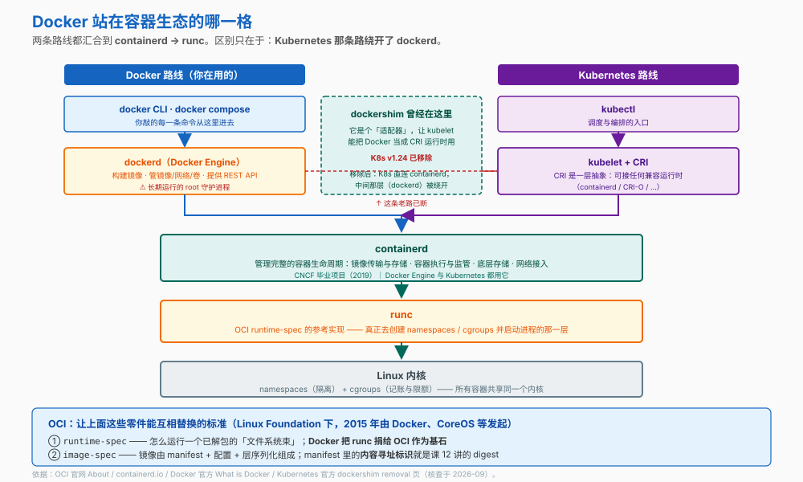
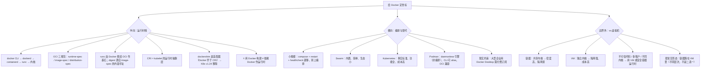

# 第 14 课：Docker在容器生态中的位置

> 所属阶段：阶段 5《定位与决策》｜ 水平：入门 ｜ 本课知识点：OCI 与运行时栈、编排与替代方案、容器 vs 虚拟机的选型
> 故事情节：船长视角 —— 把 `order-service` 这一整段旅程放回地图，看清 Docker 究竟站在哪一格

## 🎯 本课目标

- 说清 runc / containerd / dockerd 三层分工与 CRI 这层抽象的作用
- 在 Swarm / Kubernetes / Podman 等编排方案之间做出选择
- 在容器与虚拟机之间按三维度做出选型

## 📌 知识点导航

| 知识点 | 关键点 | 状态 |
|--------|--------|------|
| OCI 与运行时栈 | runc / containerd / dockerd 三层分工 / CRI 是什么 / 为什么 Kubernetes 不再需要 dockerd | ✅ 已完成 |
| 编排与替代方案 | Swarm / Kubernetes / Podman 的定位差异 / 什么时候根本不需要编排 | ✅ 已完成 |
| 容器 vs 虚拟机的选型 | 隔离强度 / 性能与密度 / 运维成本 / 两者混合使用的常见形态 | ✅ 已完成 |

---

## 第一幕：起源与场景引入

学完 13 课，小杨已经能独立搞定环境、镜像、网络、生产部署和流水线了。

某天他被拉进一个技术选型会，议题是"新项目要不要上 Kubernetes"。

有人抛出一个问题：**"Kubernetes 从 1.24 起就不用 Docker 了，我们还在用 Docker，是不是走错路了？"**

小杨一愣——这个说法他刷到过，但从来没搞清楚到底是什么意思。

紧接着又有两个问题：

- "我们的遗留系统跑在虚拟机上，要不要迁到容器？"
- "隔壁团队换成 Podman 了，说 Docker 有个 root 守护进程不安全，我们要不要跟着换？"

三问下来，小杨发现自己**会用 Docker，但说不清 Docker 到底是什么**。

> 🎬 **场景**：从"会用"到"用对"，缺的是一张**地图**——Docker 在整个容器生态里，究竟站在哪一格？

---

## 第二幕：认知冲突

> ❓ **问题**：`docker run` 这个动作背后到底有几层软件在协同？"K8s 不用 Docker"到底抛弃了哪一层？什么时候该用容器、什么时候该用虚拟机？

三层答案：

1. **分层拆解** → OCI 与运行时栈（知识点 1）
2. **横向比较** → 编排与替代方案（知识点 2）
3. **边界之外** → 容器 vs 虚拟机（知识点 3）

---

## 第三幕：层层揭示

### 知识点 1：OCI 与运行时栈

> 本知识点关键点：runc / containerd / dockerd 三层分工 / CRI 是什么 / 为什么 Kubernetes 不再需要 dockerd

#### 一句话定义

你敲的 `docker run`，实际是由**三层软件接力**完成的：`dockerd`（引擎与 API）→ `containerd`（容器生命周期）→ `runc`（真正启动进程）。而让这些零件能互相替换的，是 **OCI 标准**。

#### 直觉建立（类比）

把"开车"拆开看：

| 层 | 类比 | 对应 |
|---|---|---|
| 你 | 司机 | `docker` CLI |
| 车厂的服务体系 | 接单、调度、造车 | `dockerd` |
| 底盘 | 承载并管理整车生命周期 | `containerd` |
| 发动机 | 真正产生动力 | `runc` |
| 图纸标准 | 让任何厂都能用同一个发动机 | **OCI** |

> 💡 **类比的边界**：现实里"底盘"和"发动机"的分工不太会混淆；而 `containerd` 与 `runc` 的边界恰恰最容易搞混。记一句就够：**containerd 管"完整生命周期"，runc 只管"把进程跑起来"**。

#### 核心原理



**一、Docker Engine 是 client-server 架构（官方原话）**

> "Docker uses a **client-server architecture**. The Docker client talks to the Docker daemon, which does the heavy lifting of building, running, and distributing your Docker containers."
>
> "The Docker daemon (`dockerd`) **listens for Docker API requests and manages Docker objects** such as images, containers, networks, and volumes."

我们整门课敲的每一条 `docker` 命令，走的都是"CLI → REST API → dockerd"。

**二、containerd：管完整生命周期的那一层**

官方定义：

> "**containerd** is available as a daemon for Linux and Windows. It manages the **complete container lifecycle** of its host system, from image transfer and storage to container execution and supervision to low-level storage to network attachments and beyond."

它的官方特性列表里明确包含 **OCI Image Spec support** 与 **OCI Runtime Spec support (aka runC)**。

几个事实：
- 它是 **CNCF 毕业项目**（2019 年 2 月 28 日，继 Kubernetes、Prometheus、Envoy、CoreDNS 之后）
- 官方 adopters 列表里同时有 **Docker Engine** 与 Kubernetes 生态的多家产品

**三、runc：OCI runtime-spec 的参考实现**

OCI 官网明说：

> "**Docker is donating its container format and runtime, runC, to the OCI to serve as the cornerstone** of this new effort."

它做的事很窄也很关键：**创建 namespaces / cgroups 并把进程启动起来**。

**四、OCI：三个规范**

OCI（Open Container Initiative）是 Linux Foundation 下的开放治理结构，**2015 年 6 月 22 日由 Docker、CoreOS 等行业参与者发起**，目的就是"creating open industry standards around container formats and runtimes"。

| 规范 | 管什么 |
|---|---|
| **runtime-spec** | 怎么运行一个已解包的"文件系统束"（filesystem bundle） |
| **image-spec** | 镜像怎么构成：**manifest + configuration + 层序列化** |
| **distribution-spec** | 镜像分发的 API（**2020 年 5 月发布 v1.0**） |

> 🔗 **回扣课 12**：OCI 官方描述 image manifest 时说它包含"**content-addressable identity** of one or more filesystem serialization archives"。
>
> 这就是我们在课 12 讲的 **digest** 的源头——**digest 不是 Docker 的私有概念，而是 OCI 标准的一部分**。正因为如此，同一个 digest 在任何 OCI 兼容工具里都是同一份内容。

**五、CRI 与 dockershim：为什么 K8s 不再需要 dockerd**

官方的时间线讲得很清楚：

> "In its earliest releases, Kubernetes offered compatibility with **one container runtime: Docker**. Later... cluster operators wanted to adopt additional container runtimes. **The CRI was designed to allow this kind of flexibility**... However, **because Docker existed before the CRI specification was invented**, the Kubernetes project created an adapter component, `dockershim`."
>
> "Kubernetes' built-in `dockershim` component was **removed in release v1.24**."

**CRI（Container Runtime Interface）**是 kubelet 与运行时之间的**抽象层**——有了它，kubelet 可以接任何兼容的运行时。dockershim 只是一个"让 kubelet 能把 Docker 当成 CRI 运行时来用"的适配器。

官方对切换后果的描述：

> "Switching to Containerd as a container runtime **eliminates the middleman**. All the same containers can be run by container runtimes like Containerd as before. But now, since containers schedule directly with the container runtime, **they are not visible to Docker**."

**六、⭐ 最关键的一条澄清**

这是整门课最容易被误传的一点。官方原话：

> "If you are using Docker for **building** your application containers, **you can still run these containers on any container runtime. This use of Docker does not count as a dependency on Docker as a container runtime.**"

也就是说：

| 用途 | 是否受 dockershim 移除影响 |
|---|---|
| **用 Docker 构建镜像**（`docker build`） | ❌ **不受影响**——构建产物是标准 OCI 镜像，任何运行时都能跑 |
| **用 Docker 当作 K8s 的运行时** | ✅ 受影响——这条路由 dockershim 提供，已在 v1.24 移除 |

> 所以"K8s 不用 Docker"这句话的准确含义是：**K8s 不再把 Docker 当作节点上的容器运行时**；**不是**"Docker 构建的镜像不能用了"。课 13 那条流水线照旧成立。

**七、实际会遇到的两个副作用**

1. **容器对 Docker 不可见**：切到 containerd 后，`docker ps` / `docker inspect` / `docker exec` / `docker logs` 都拿不到 K8s 管理的容器
2. **本机构建的镜像要推到 registry**：官方原话——"images built or pulled by Docker would **not be visible** to container runtime and Kubernetes. They needed to be **pushed to some registry**"

另有官方列出的已知问题：指标格式会变（容器名从 `k8s_<容器名>_...` 变成 `<container-id>`），且**部分 `container_fs_*` 文件系统指标会缺失**。官方给的 workaround 是部署独立的 **cAdvisor** daemonset——正好是课 11 提过的那个组件。

#### 示例演示

```bash
# 1) 看 client 与 server 两侧
docker version

# 2) 看服务端信息（containerd / runc 的字段随版本而异，未必都显示）
docker info

# 3) 在宿主机上找运行时组件（路径因安装方式而异）
which dockerd containerd runc 2>/dev/null
ps aux | grep -E 'dockerd|containerd' | grep -v grep
# ⚠️ Docker Desktop 上这些进程跑在它创建的 Linux 虚拟机里，宿主机上直接找可能找不到

# 4) 验证 OCI 标准的可互换性：digest 与工具无关
docker pull alpine:3.20
docker inspect alpine:3.20 --format '{{index .RepoDigests 0}}'
# 预期：alpine@sha256:... —— 这个 digest 在任何 OCI 兼容工具里都指向同一份内容

# 5) 看镜像的 manifest（结构由 OCI image-spec 定义）
docker manifest inspect alpine:3.20 2>/dev/null | head -20
# ⚠️ 该命令在部分版本需开启实验特性；不支持时跳过即可
```

#### 常见误区

1. **"K8s 不用 Docker = Docker 白学了"** → 完全不是。官方明说**用 Docker 构建**的镜像可以在任何运行时上跑，那不算是"依赖 Docker 作为运行时"。
2. **"containerd 和 runc 是一回事"** → 不是。containerd 管完整生命周期（镜像传输/存储/执行/监管/存储/网络），runc 只负责按 OCI runtime-spec 把进程跑起来。
3. **"K8s 集群里也能用 `docker ps` 看容器"** → dockershim 移除后不行了。容器直接由 containerd 调度，对 Docker 不可见。

#### 一句话记住

> **dockerd → containerd → runc 三层接力；CRI 让 K8s 绕过 dockerd 直连 containerd；但「用 Docker 构建」这条路一直有效。**

#### 官方文档

- [What is Docker（Docker 官方）](https://docs.docker.com/get-started/docker-overview/)——client-server 架构、dockerd 职责
- [containerd 官网](https://containerd.io/)——完整生命周期定义、OCI 支持、CNCF 毕业、Docker 是 adopter
- [About the OCI](https://opencontainers.org/about/overview/)——三规范、runC 由 Docker 捐出、manifest 的内容寻址标识
- [Check whether dockershim removal affects you（Kubernetes 官方）](https://kubernetes.io/docs/tasks/administer-cluster/migrating-from-dockershim/check-if-dockershim-removal-affects-you/)——v1.24 移除、CRI 抽象、"用 Docker 构建不算依赖"、切换副作用

---

### 知识点 2：编排与替代方案

> 本知识点关键点：Swarm / Kubernetes / Podman 的定位差异 / 什么时候根本不需要编排

#### 一句话定义

**编排**解决的是"多机之上如何调度与自愈"的问题。**只有一两台机器时，你根本不需要它**——compose（课 9）加重启策略（课 10）就够了。

#### 直觉建立（类比）

容器是**集装箱**，编排是**港口调度系统**。

你院子里放两三个集装箱，自己记一下位置就行；**一旦有几千个箱子在多艘船之间流转，才需要整套调度系统**——还要配一整个团队来维护它。

> 💡 **类比的边界**：港口调度系统买来就能用；编排系统不是——Kubernetes 的学习曲线和运维成本，本身就是一项**需要立项的成本**（这会在课 15 详细算）。

#### 核心原理

**一、先回答：什么时候根本不需要编排**

符合下面这些特征时，**compose + `restart: unless-stopped`（课 10）+ 健康检查（课 11）** 就够了：

- 单机，或只有两三台机器
- 服务数量个位数
- 能接受分钟级的停机
- 没有跨机房的高可用要求

> 这是本课最重要的一条结论：**大多数团队一开始就上 K8s，是过度设计。**

**二、三个选项的定位**

| | Docker Swarm | Kubernetes | Podman |
|---|---|---|---|
| 是什么 | Docker 内置的编排 | 事实标准的容器编排平台 | **不是编排**，是 Docker 的替代引擎 |
| 学习成本 | 低（会 compose 就能上手） | 高 | 低（对 Docker 用户） |
| 生态与社区 | 小 | 最大 | 中 |
| 适合 | 小团队、想快速获得多机调度 | 规模化、需要声明式管理与自愈 | 单机/工作站、**不想要守护进程**的场景 |

> ⚠️ **一个高频混淆：Docker 和 Kubernetes 不是竞争关系。**
>
> - **Docker** 解决的是"**一个应用怎么打包、怎么在一台机器上跑起来**"——它是**容器引擎**（外加构建工具链）。
> - **Kubernetes** 解决的是"**很多容器在很多台机器上怎么调度、怎么自愈**"——它是**编排平台**。
>
> 所以两者通常**同时使用**：用 Docker 构建镜像（课 2–6），交给 K8s 去调度运行。所谓"K8s 不用 Docker"，准确含义见知识点 1——**K8s 不再把 Docker 当作节点上的容器运行时**，而不是"两者二选一"。

**三、Podman 的官方定义**（最容易和前两者混淆）

官方原话：

> "Podman is a **daemonless**, open source, **Linux native** tool designed to make it easy to find, run, build, share and deploy applications using Open Containers Initiative (OCI) Containers and Container Images."

四个要点：

1. **CLI 兼容**："Podman provides a command line interface (CLI) familiar to anyone who has used the Docker Container Engine. **Most users can simply alias Docker to Podman (`alias docker=podman`) without any problems.**"
2. **同样依赖 OCI 运行时**："Similar to other common Container Engines (Docker, CRI-O, containerd), **Podman relies on an OCI compliant Container Runtime (runc, crun, runv, etc)**... This makes the running containers created by Podman **nearly indistinguishable** from those created by any other common container engine."
3. **容器可由 root 或非特权用户运行**："Containers under the control of Podman can either be run by **root or by a non-privileged user**."（呼应课 12 的 rootless 话题）
4. **管理 pods**："Podman manages the entire container ecosystem which includes **pods**, containers, container images, and container volumes using the libpod library."

> ⚠️ 官方也说明：REST API 服务**仅在 Linux 上受支持**（客户端支持 Linux / Mac / Windows）。

**四、Podman 与 Docker 真正的差别**

| | Docker | Podman |
|---|---|---|
| 架构 | **有**长期运行的 `dockerd` 守护进程（默认 root） | **daemonless**，无中心守护进程 |
| 容器由谁启动 | CLI → dockerd → containerd → runc | 直接 → OCI 运行时（runc / crun 等） |
| 镜像格式 | OCI | OCI（**同一标准**） |
| 命令行 | `docker ...` | `podman ...`（**大部分可直接 alias**） |

> ⚠️ 因为少了 `dockerd` 这个"root 常驻进程"，Podman 常被宣传为更安全——这与课 12 讲的"Docker daemon 默认以 root 运行"是同一件事的两面。但要记住：**真正的隔离边界是由内核 namespaces / cgroups 与 capabilities 提供的，守护进程不是边界本身**。

**五、还有一条绕不开的现实：许可**

Docker 官方文档的 Licensing 段写明：

> "Commercial use of Docker Engine obtained via **Docker Desktop** within larger enterprises (**exceeding 250 employees OR with annual revenue surpassing $10 million USD**), requires a **paid subscription**. Apache License, Version 2.0."

也就是说：
- **Docker Engine（开源版）本身是 Apache 2.0**
- 但**大型企业用 Docker Desktop 需要付费订阅**

这是很多团队考虑 Podman / Rancher Desktop / Colima 等替代品的现实原因之一。

#### 示例演示

```bash
# 1) 先看清自己需不需要编排（看规模，而不是跟风）
docker ps --format '{{.Names}}' | wc -l          # 单机上一共几个容器
docker info --format '{{.ServerVersion}}'        # 引擎版本

# 2) Swarm：只看状态，不要顺手开启
docker info --format 'Swarm 状态 = {{.Swarm.LocalNodeState}}'
# 预期：inactive（未开启）

# ⚠️ 想亲身体验再执行下面这三条 —— `docker swarm init` 会把你的 Docker 引擎
#    **切到 Swarm 模式**，这是有副作用的状态变更，不是「查看」操作：
#      docker swarm init
#      docker info --format '{{.Swarm.LocalNodeState}}'    # → active
#      docker swarm leave --force                          # ← 用完务必退出

# 3) 验证 OCI 标准：镜像格式与工具无关（这是 Podman 能 alias docker 的根本原因）
docker inspect alpine:3.20 --format '{{index .RepoDigests 0}}'

# 4) 无编排时的「够用组合」——课 9 + 课 10 + 课 11 的成果
#    compose.yaml 里：restart: unless-stopped + healthcheck + 资源限制
docker compose config | grep -E 'restart:|healthcheck|mem_limit|cpus' || echo "（按你的 compose 文件实际输出为准）"
```

#### 常见误区

1. **"上了 K8s 才算现代化"** → 不一定。单机小规模用 compose + 重启策略 + 健康检查就够，K8s 会引入显著的学习与运维成本。
2. **"Podman 是编排工具"** → 不是。它是**容器引擎**（Docker 的替代品），官方定义里明确是 "daemonless... tool"，管理 pods / containers / images / volumes。
3. **"Podman 产生的容器和 Docker 不一样"** → 官方明说"**nearly indistinguishable**"——两者都依赖 OCI 兼容运行时，镜像格式都是 OCI。
4. **"换 Podman 就能解决所有安全问题"** → 只能解决"daemon 以 root 运行"这一项。真正的隔离边界在内核（namespaces / cgroups / capabilities），见课 12。

#### 一句话记住

> **小规模别上编排；Podman 不是编排而是无守护进程的 Docker 替代品；两者都用 OCI 镜像，因此可互换。**

#### 官方文档

- [What is Podman?（Podman 官方文档）](https://docs.podman.io/)——daemonless、OCI、CLI 可 alias、root 或非特权用户、依赖 OCI 运行时、管理 pods
- [Docker Engine（Docker 官方）](https://docs.docker.com/engine/)——Licensing 段：大型企业使用 Docker Desktop 需付费订阅

---

### 知识点 3：容器 vs 虚拟机的选型

> 本知识点关键点：隔离强度 / 性能与密度 / 运维成本 / 两者混合使用的常见形态

#### 一句话定义

**虚拟机**虚拟化的是**硬件**（每台有独立内核），**容器**虚拟化的是**操作系统视角**（共享宿主机内核）。这个差别决定了它们在隔离强度、性能密度、运维成本三个维度上的不同取舍。

#### 直觉建立（类比）

- **虚拟机 = 独栋别墅**：各有各的地基（内核），隔音好、私密性强，但占地大
- **容器 = 公寓**：共用一栋楼的地基，密度高、成本低，但隔音差一些

> 💡 **类比的边界**：现实中"公寓 vs 别墅"通常是二选一；而容器与虚拟机**最常见的形态是叠加**——容器跑在虚拟机里。下面会讲。

#### 核心原理

**一、三维度对比**

| 维度 | 容器 | 虚拟机 |
|---|---|---|
| **隔离强度** | 进程级隔离（namespaces + cgroups + capabilities） | 硬件级隔离（独立内核 / Hypervisor） |
| **共享内核？** | ⚠️ **共享宿主机内核** | ❌ 各自独立内核 |
| **启动速度** | 秒级甚至毫秒级 | 通常几十秒到分钟级 |
| **性能损耗** | 接近裸机 | 有 Hypervisor 开销（现代硬件上已较小） |
| **密度** | 高——同一台机器能跑更多实例 | 低——每个实例要带一整个操作系统 |
| **镜像体积** | 通常 MB 级 | 通常 GB 级 |
| **可运行不同 OS / 内核？** | ❌ 不行 | ✅ 可以 |
| **运维成本** | 需要建设镜像、日志、监控、编排链路 | 相对成熟，工具链统一 |

**二、官方怎么定位容器相对 VM 的优势**

> "Docker is **lightweight and fast**. It provides a viable, **cost-effective alternative to hypervisor-based virtual machines**, so you can use more of your server capacity..."
>
> "Docker is perfect for **high density environments** and for **small and medium deployments** where you need to do more with fewer resources."

**三、隔离强度：这是选型的硬约束**

课 12 讲过：**容器共享宿主机内核**，容器里的 root 在不启用 user namespace 时就是宿主机的 uid 0。

由此推出几条判断：

| 场景 | 建议 |
|---|---|
| 跑**自己团队的可信代码** | 容器完全够 |
| **多租户**平台、要跑**用户提交的不可信代码** | 需要更强隔离——VM，或 gVisor / Kata Containers 这类"安全容器"运行时 |
| 需要**不同的内核版本 / 不同操作系统** | 只能用 VM |
| 要**加载内核模块**、跑特定内核特性 | 只能用 VM |

> 📌 注意 `containerd` 官方 adopters 列表里就有 **Kata Containers** 与 **Firecracker**——它们走的正是"补足容器隔离强度"这条路。

**四、最常见的形态是叠加，不是二选一**

现实中最常见的是：**容器跑在虚拟机上**。

```
物理机 → Hypervisor → 虚拟机（云主机） → Docker/containerd → 容器
```

- **VM 负责"强隔离 + 资源切分"**（多租户、不同客户之间）
- **容器负责"高密度 + 快速交付"**（同一个应用内部）

所以"我们该用容器还是虚拟机"这个问题，很多时候问法本身就错了——**它们在不同的层次上工作**。

#### 示例演示

```bash
# 1) 容器共享宿主机内核 —— 直接验证
uname -r                                        # 宿主机内核
docker run --rm alpine uname -r                 # 容器里的内核
# 预期：两者输出相同 ← 这就是"共享内核"的直接证据

# 2) 但容器看不到宿主机的进程（PID namespace 隔离）
docker run --rm alpine ps aux
# 预期：只看到容器内的进程

# 3) 体积对比：容器镜像 vs 一个操作系统镜像
docker images alpine --format '{{.Repository}}:{{.Tag}}  {{.Size}}'
# 预期：几 MB 级别

# 4) 启动速度：容器是秒级
time docker run --rm alpine echo ok
# 预期：real 通常在 0.3–1 秒（首次需拉取镜像则更长）

# 5) 隔离边界来自内核机制（课 12 的三道闸）
docker run --rm alpine sh -c 'cat /proc/self/status | grep -E "^CapEff"'
# 预期：一个 capabilities 位掩码 —— 容器能做什么由它决定
```

#### 常见误区

1. **"容器比虚拟机安全"** → 恰恰相反。容器**共享内核**，隔离边界弱于 VM。课 12 的结论在这里再次成为选型依据。
2. **"容器和虚拟机二选一"** → 通常不是。云上最常见的形态是**容器跑在虚拟机里**，两者在不同层次各司其职。
3. **"容器能跑任何操作系统"** → 不能。容器**共享宿主机内核**，Linux 主机上跑不了 Windows 容器（反之亦然）。
4. **"容器性能好所以该全迁"** → 性能只是维度之一。需要强隔离、需要不同内核时，VM 仍是不可替代的。

#### 一句话记住

> **容器共享内核（密度高、隔离弱），虚拟机独立内核（隔离强、成本高）；云上最常见的是「容器跑在虚拟机里」。**

#### 官方文档

- [What is Docker（Docker 官方）](https://docs.docker.com/get-started/docker-overview/)——"cost-effective alternative to hypervisor-based virtual machines"、"high density environments"、namespaces 提供隔离
- [containerd 官网](https://containerd.io/)——adopters 含 Kata Containers、Firecracker（补足隔离强度的运行时）

---

## 第四幕：实操验证

把第一幕那三个问题逐个回答掉。

> ⚠️ 本讲义的命令与预期输出为**纸面预期**（写作时本机 Docker 守护进程未运行）。具体值与你实际运行会不同。

### 步骤 1：看清自己机器上的运行时栈

```bash
docker version
# 预期：Client 段 + Server（Engine）段 —— 印证 client-server 架构

docker info --format '服务端版本 = {{.ServerVersion}}'

which dockerd containerd runc 2>/dev/null
ps aux | grep -E 'dockerd|containerd' | grep -v grep
# ⚠️ Docker Desktop 上这些进程在其 Linux 虚拟机内，宿主机上可能看不到
```

> ✅ **回扣场景**："dockerd / containerd / runc 三层"不是抽象概念，它们是你机器上真实存在的进程。

### 步骤 2：验证"K8s 不用 Docker"到底抛弃了哪一层

```bash
# 构建出来的镜像走的是 OCI 标准 —— 这才是它到处都能跑的原因
docker pull alpine:3.20
docker inspect alpine:3.20 --format '{{index .RepoDigests 0}}'
# 预期：alpine@sha256:... —— digest 与工具无关

# 反过来印证：本机构建的镜像对别的运行时不可见，必须推到 registry
# （在一个空目录里执行，先建一个最小的 Dockerfile）
mkdir -p /tmp/oci-demo && cd /tmp/oci-demo
printf 'FROM alpine\n' > Dockerfile
docker build -t local-only:test .
docker images local-only
# ⚠️ 这张镜像只在本机的 Docker 里；要让 K8s 用，必须 docker push 到 registry
```

> ✅ **回扣场景**：官方那条澄清在这里得到验证——**用 Docker 构建的产物是标准 OCI 镜像**，任何运行时都能跑；受影响的只是"把 Docker 当作节点运行时"这条路。

### 步骤 3：验证容器共享宿主机内核

```bash
uname -r
docker run --rm alpine uname -r
# 预期：两者相同 ← 共享内核的直接证据

docker run --rm alpine ps aux
# 预期：只看到容器内进程（PID namespace 隔离）

docker run --rm alpine sh -c 'grep ^CapEff /proc/self/status'
# 预期：capabilities 位掩码 —— 隔离边界来自内核机制
```

> ✅ **回扣课 12 + 场景**：容器不是"小虚拟机"。共享内核这件事，既是它轻快的原因，也是它隔离弱于 VM 的原因。

### 步骤 4：先判断自己需不需要编排

```bash
# 看规模
docker ps --format '{{.Names}}' | wc -l
docker images | wc -l

# 看当前 swarm 状态
docker info --format 'Swarm 状态 = {{.Swarm.LocalNodeState}}'
# 预期：inactive（未开启）
```

判断口径（不靠命令，靠这三个问题）：

1. **几台机器？** 一两台 → 不需要编排
2. **服务有几个？** 个位数 → 不需要
3. **能接受多长的停机？** 分钟级 → 不需要

> ✅ **回扣场景**：选型会上"要不要上 K8s"，答案取决于这三个问题，而不是别人用什么。

### 步骤 5：把结论写成一句话

```
我们的情况：
- 3 台机器、6 个服务、能接受 5 分钟停机
→ 结论：compose + restart: unless-stopped + healthcheck 足够，先不上 K8s
- 用 Docker 构建镜像（OCI 标准产物），未来要上 K8s 也不用改构建链路
- 容器跑在云主机（VM）上：VM 管租户隔离，容器管交付密度
```

---

## 第五幕：体系收束

> 📍 **全局定位**：阶段 5《定位与决策》第一幕，你给 Docker **定好了坐标**。
>
> 三张坐标读完，能回答第一幕那三个问题了：
>
> | 问题 | 答案 |
> |---|---|
> | "K8s 不用 Docker，我们走错路了吗？" | 没走错。**K8s 抛弃的是「Docker 作为节点运行时」**，不是「Docker 构建的 OCI 镜像」 |
> | "要不要换成 Podman？" | 看你在不在意**守护进程**；它是 Docker 的引擎级替代品，**不是编排**。两者都用 OCI 镜像，可互换 |
> | "虚拟机要不要迁到容器？" | 看**隔离需求**。共享内核是容器的快之源，也是它的边界所在；云上最常见的是**容器跑在 VM 里** |
>
> 而 Docker 自身的定位也清晰了：
>
> ```
> 你在用的：docker CLI → dockerd → containerd → runc → 内核
> 标准：OCI（runtime-spec / image-spec / distribution-spec）
> K8s 的入口：kubectl → kubelet --CRI--> containerd → runc（绕开 dockerd）
> ```

> 🔗 **下一步**：课 15《决策清单与学习地图》——**本阶段收官，也是整门课的收官**。
>
> 本课给出的是"地图"（Docker 站在哪一格），课 15 要把它变成**可以直接拿去用的东西**：
>
> | 知识点 | 产出 |
> |---|---|
> | 引入决策树 | 该不该容器化、容器化到哪一步（单机 / 小团队 / 规模化三条路径） |
> | 成本与风险清单 | 容器化新增的运维负担、常见失败原因、团队能力前提 |
> | 下一步学习地图 | 后续深入方向及各自适用条件 |
>
> 课 15 结束，这门课就闭环了：从课 1 的"我这儿能跑"，走到"**我知道该不该用、用到哪一步、以及下一步学什么**"。

---

## 🐞 常见误区

1. **"K8s 不用 Docker = Docker 白学了"** → 官方明说：**用 Docker 构建**不算依赖 Docker 作为运行时，构建产物（OCI 镜像）在任何运行时上都能跑。

2. **"containerd 和 runc 是一回事"** → 不是。containerd 管**完整生命周期**（镜像传输存储、执行监管、存储、网络），runc 只按 OCI runtime-spec **把进程跑起来**。

3. **"上了 K8s 才算现代化"** → 单机、少量服务、能接受分钟级停机时，compose + 重启策略 + 健康检查就够。K8s 本身是一项需要立项的成本。

4. **"Podman 是编排工具"** → 不是。它是**无守护进程的容器引擎**，Docker 的替代品；官方说它管理 pods / containers / images / volumes，且 CLI 可直接 alias。

5. **"容器比虚拟机安全"** → 相反。**容器共享宿主机内核**，隔离边界弱于 VM；需要强隔离时用 VM 或 Kata / gVisor 这类安全容器运行时。

6. **"容器和虚拟机二选一"** → 通常不是。云上最常见形态是**容器跑在虚拟机里**：VM 负责租户隔离与资源切分，容器负责交付密度。

---

## 一图总结



---

## 📋 命令速查卡

| 命令 | 作用 | 本课出现在哪 |
|------|------|------------|
| `docker version` | 看 Client 与 Server 两侧——印证 client-server 架构 | 知识点 1 / 步骤 1 |
| `docker info` | 看引擎信息（containerd / runc 字段随版本而异） | 知识点 1 / 步骤 1 |
| `which dockerd containerd runc` | 在宿主机上定位运行时组件（⚠️ Docker Desktop 上跑在其 VM 内） | 知识点 1 / 步骤 1 |
| `docker inspect <镜像> --format '{{index .RepoDigests 0}}'` | 看 **OCI digest**——与工具无关的标准标识 | 知识点 1 / 步骤 2 |
| `docker manifest inspect <镜像>` | 看 OCI image manifest 结构（部分版本需实验特性） | 知识点 1 / 演示 |
| `docker info --format '{{.Swarm.LocalNodeState}}'` | 看 Swarm 状态（`active` / `inactive`） | 知识点 2 / 演示 |
| `docker swarm init` | 开启 Swarm 模式（退出用 `docker swarm leave --force`） | 知识点 2 / 演示 |
| `docker run --rm alpine uname -r` | ⚠️ 与宿主机 `uname -r` 对比，**证明共享内核** | 知识点 3 / 步骤 3 |
| `docker run --rm alpine sh -c 'grep ^CapEff /proc/self/status'` | 看 capabilities 位掩码——隔离边界来自内核机制 | 知识点 3 / 步骤 3 |

---

## 课后小测

**Q1**：听说"Kubernetes 从 1.24 起不再使用 Docker"，下面哪个理解正确？

- A. Docker 构建的镜像在 K8s 上不能用了，必须换构建工具
- B. K8s 抛弃的是**「Docker 作为节点上的容器运行时」**这层；**用 Docker 构建的 OCI 镜像照常可用**
- C. Docker 公司倒闭了
- D. 必须把 Dockerfile 全部重写成 K8s 的资源清单

<details><summary>答案与解析</summary>

**答案：B**。这条误解流传极广，官方专门澄清过：

> "If you are using Docker for **building** your application containers, **you can still run these containers on any container runtime. This use of Docker does not count as a dependency on Docker as a container runtime.**"

背景是：kubelet 通过 **CRI** 这层抽象来接运行时；而 **Docker 早于 CRI 规范出现**，所以当年需要一个适配器 `dockershim` 才能把 Docker 当 CRI 运行时用。**K8s v1.24 移除了 dockershim**，之后 kubelet 直连 containerd/CRI-O，"中间那层（dockerd）被绕开"。

因此课 13 那条构建流水线**完全不受影响**——它产出的就是标准 OCI 镜像。

不过有两个实际副作用要记住：①切到 containerd 后 K8s 管理的容器**对 Docker 不可见**（`docker ps` / `exec` / `logs` 都拿不到）；②本机 `docker build` 出来的镜像**必须推到 registry** 才能被 K8s 使用。

</details>

**Q2**：关于 Podman，下列说法正确的是？

- A. Podman 是一个比 Kubernetes 更轻量的编排工具
- B. Podman 是**无守护进程的容器引擎**（Docker 的替代品），不是编排工具；CLI 与 Docker 高度兼容，官方说多数用户可以 `alias docker=podman`
- C. Podman 用的是自己的私有镜像格式，和 Docker 镜像不兼容
- D. Podman 只能在 Linux 上运行，Mac / Windows 完全不能用

<details><summary>答案与解析</summary>

**答案：B**。官方定义：

> "Podman is a **daemonless**, open source, **Linux native** tool designed to make it easy to find, run, build, share and deploy applications using **OCI** Containers and Container Images."

并且：

> "Most users can simply **alias Docker to Podman** (`alias docker=podman`) without any problems."

C 错——官方明说 Podman"relies on an **OCI compliant Container Runtime**（runc, crun, runv, etc）"，所以产出的容器与 Docker 的 "**nearly indistinguishable**"。OCI 标准正是两者能互换的根本原因。

D 不准确——官方说**客户端**支持 Linux / Mac / Windows，只是 **REST 服务仅在 Linux 上受支持**（Mac / Windows 上通常跑在一个 Linux 虚拟机里）。

另外注意：Podman 常被宣传为"更安全"，但它解决的是"**没有 root 常驻守护进程**"这一项。真正的隔离边界在内核（namespaces / cgroups / capabilities），见课 12。

</details>

**Q3**：关于容器与虚拟机的选型，下列说法正确的是？

- A. 容器比虚拟机安全，应该把虚拟机全迁到容器
- B. **容器共享宿主机内核**（密度高、隔离弱），**虚拟机各有独立内核**（隔离强、成本高）；云上最常见的是容器跑在虚拟机里
- C. 容器可以运行任意操作系统，包括和宿主机不同的内核
- D. 容器和虚拟机只能选一个

<details><summary>答案与解析</summary>

**答案：B**。

A 错——**容器共享内核，隔离边界弱于虚拟机**。这不是"落后"，而是设计取舍：换来的是密度与启动速度。官方对容器的定位是 "a viable, **cost-effective alternative to hypervisor-based virtual machines**... perfect for **high density environments**"。

C 错——正因为共享内核，Linux 主机上跑不了 Windows 容器，反之亦然。要跑不同 OS / 不同内核版本，**只能用虚拟机**。

D 错——两者**在不同层次工作**，云上最常见的形态恰恰是叠加：

```
物理机 → Hypervisor → 虚拟机（云主机）→ Docker/containerd → 容器
```

VM 负责租户隔离与资源切分，容器负责交付密度与速度。

选型时的硬约束是**隔离需求**：跑可信代码用容器就够；**多租户、跑不可信代码**则需要 VM 或 Kata / gVisor 这类安全容器运行时。

</details>

---

## 🚀 下一批接力提示词

> 学完本课后，**复制下面这段文字发给 AI**，即可无缝进入下一批（无需重新描述上下文）：

```
继续学 Docker。我的学习档案在 docker/00-学习档案.md，
刚学完阶段 5《定位与决策》的课《Docker在容器生态中的位置》知识点 OCI 与运行时栈、编排与替代方案、容器 vs 虚拟机的选型，
请按大纲继续讲解下一批知识点。
```

## 🧭 课程导航

⬅️ **上一课**：[课 13：CI-CD与交付流水线](../../4-生产落地/lessons/lesson-13-CI-CD与交付流水线.md)

➡️ **下一课**：[课 15：决策清单与学习地图](lesson-15-决策清单与学习地图.md)

📚 **返回目录**：[课程目录](../../../02-课程目录.md)
