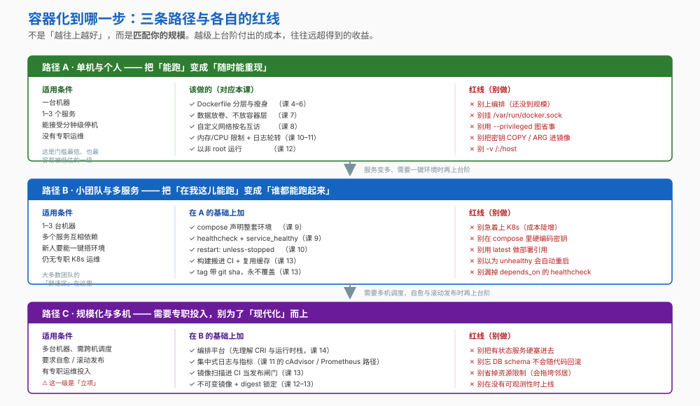
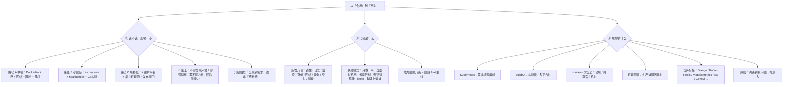

# 第 15 课：决策清单与学习地图

> 所属阶段：阶段 5《定位与决策》｜ 水平：入门 ｜ 本课知识点：引入决策树、成本与风险清单、下一步学习地图
> 故事情节：收束 —— 回望全程，把"会用 Docker"变成"用对 Docker"

## 🎯 本课目标

- 用决策树判断该不该容器化、容器化到哪一步
- 列全容器化引入的成本与风险、以及团队的能力前提
- 定出下一步深入方向，并说明各自的适用条件

## 📌 知识点导航

| 知识点 | 关键点 | 状态 |
|--------|--------|------|
| 引入决策树 | 单机 / 小团队 / 规模化三条路径 / 什么时候别上容器 | ✅ 已完成 |
| 成本与风险清单 | 容器化新增的运维负担 / 常见引入失败原因 / 团队能力前提 | ✅ 已完成 |
| 下一步学习地图 | Kubernetes / BuildKit 深入 / rootless 与安全加固 / 与本仓库其他课程（Kafka、Redis、VictoriaMetrics、Django 等）的连接 | ✅ 已完成 |

---

## 第一幕：起源与场景引入

课 14 那场选型会之后，部门让小杨给团队做一次分享，题目是：**"我们到底该怎么用 Docker？"**

准备的时候他意识到：会上那三个问题——"K8s 是不是不用 Docker 了"、"虚拟机要不要迁"、"要不要换 Podman"——本质上是**同一个问题**：

> **该不该用？用到哪一步？**

而这个问题他之前从来没认真想过。他会用 Docker，但从来没评估过：**为了用 Docker，我们付出了什么？**

他决定这次不讲"怎么做"，而是给团队一份**可以照着判断的清单**。

> 🎬 **场景**：整门课的最后一步——从"会做"走到"知道该不该做、做到哪一步"。

---

## 第二幕：认知冲突

> ❓ **问题**：什么时候**不该**容器化？容器化到底新增了哪些成本？学完之后往哪走？

三层答案：

1. **该不该、到哪一步** → 引入决策树（知识点 1）
2. **代价是什么** → 成本与风险清单（知识点 2）
3. **然后学什么** → 学习地图（知识点 3）

---

## 第三幕：层层揭示

### 知识点 1：引入决策树

> 本知识点关键点：单机 / 小团队 / 规模化三条路径 / 什么时候别上容器

#### 一句话定义

容器化不是"上"或"不上"的二选一，而是一个**分级的台阶**：**做多少，取决于你的规模**。越级上台阶要付出的成本，往往远超得到的收益。

#### 直觉建立（类比）

选交通工具：**去隔壁楼走过去就行，去隔壁城市才需要高铁，出国才需要飞机**。

不是"越快越高级越好"，而是**多远的路配什么工具**。开飞机去买菜，光安检就够你受的。

> 💡 **类比的边界**：交通工具的等级是客观的（距离摆在那儿）；而"我们到了哪一级"需要你自己判断——判断依据就是本知识点给的**适用条件**。

#### 核心原理



**三条路径一览**

| | 路径 A · 单机与个人 | 路径 B · 小团队与多服务 | 路径 C · 规模化与多机 |
|---|---|---|---|
| **规模** | 一台机器、1–3 个服务 | 1–3 台机器、多服务互相依赖 | 多机、需跨机调度 |
| **核心目标** | 随时能重现环境 | 谁都能一键跑起来 | 自愈 + 滚动发布 |
| **关键投入** | Dockerfile、卷、网络、限制、降权 | **+ compose、健康检查、CI 构建** | **+ 编排平台、集中可观测、发布闸门** |
| **红线** | 别上编排、别挂 docker.sock | 别急着上 K8s、别硬编码密钥 | 别硬塞有状态服务、别忘 schema 不能回滚 |

**升级的触发条件**（不是"想升级"，而是"出现了这些信号"）：

- A → B：**服务变多、需要一键环境**（新人入职要能 `docker compose up -d` 就跑起来）
- B → C：**需要多机调度、自愈、滚动发布**，且**有专职运维投入**

**⚠️ 什么时候根本别上容器**

| 情况 | 为什么 |
|---|---|
| **不需要复现环境** | 一次性脚本、纯本地小工具——打包成镜像是纯粹的额外负担 |
| **需要强隔离** | 多租户平台、要跑不可信代码 → 用**虚拟机**或安全容器运行时（课 14 知识点 3） |
| **需要不同的内核 / 操作系统** | 容器**共享宿主机内核**，做不到（课 14） |
| **团队没有能力维护** | 见知识点 2 的能力前提——这是最常见的失败原因 |
| **重型有状态服务要慎重** | 数据库这类不是不能容器化，但要在**卷、备份、恢复**上额外下功夫（课 7） |

#### 示例演示

```bash
# 判断自己在哪一级：先看规模
echo "容器数：$(docker ps -a --format '{{.Names}}' | wc -l)"
echo "镜像数：$(docker images | wc -l)"
echo "网络数：$(docker network ls | wc -l)"
echo "卷数：  $(docker volume ls | wc -l)"

# 再看是否已有 B 级的标志
docker info --format 'Swarm 状态 = {{.Swarm.LocalNodeState}}'
# 预期：inactive → 说明还没上编排（这通常是对的）

# 看是否有 C 级才需要的可观测性建设
docker info --format '{{json .SecurityOptions}}'
# 预期：看到 seccomp / apparmor 等，说明底层安全机制在位
```

> 判断口径**不靠命令，靠三个问题**：**几台机器？几个服务？能接受多长停机？**

#### 常见误区

1. **"上 K8s 才算现代化"** → 规模没到，K8s 的成本远大于收益。
2. **"容器化是免费的"** → 不是。见知识点 2——它替换掉一批工作，也新增一批工作。
3. **"有状态服务绝对不能容器化"** → 过于绝对。数据库**可以**在容器里跑，但要在卷、备份、恢复上额外投入（课 7）。
4. **"先把环境容器化，运维的事以后再说"** → 这正是知识点 2 要列的失败原因之一。

#### 一句话记住

> **做多少取决于规模；升级的触发条件是"出现了新需求"，不是"想升级"。**

#### 官方文档

- [What is Docker（Docker 官方）](https://docs.docker.com/get-started/docker-overview/)——容器的适用场景（高密度环境、中小型部署）

---

### 知识点 2：成本与风险清单

> 本知识点关键点：容器化新增的运维负担 / 常见引入失败原因 / 团队能力前提

#### 一句话定义

容器化**不是免费获得一致性**——它是**用一批新的运维工作，换来了环境一致性**。这笔账要提前算清楚。

#### 直觉建立（类比）

容器化像是**从"自己做饭"改成"开中央厨房"**：

- 换来的是：**每家门店味道一致**（环境一致）
- 新增的是：**冷链、仓储、保质期管理、品控**（镜像、存储、日志、安全……）

> 💡 **类比的边界**：饭店的中央厨房有成熟的行业配套；容器的这套配套设施**得你自己搭**——这正是成本所在。

#### 核心原理

**一、容器化新增的运维负担（八项）**

| # | 负担 | 对应本课 | 不做会怎样 |
|---|---|---|---|
| 1 | **镜像维护**——基础镜像更新、漏洞补丁、依赖升级 | 课 4–6 | 镜像越拖越旧，漏洞堆积（课 12） |
| 2 | **日志**——驱动选型、轮转、集中化 | 课 11 | **撑爆磁盘**（第一幕式的经典事故） |
| 3 | **监控**——要从容器外采集；cgroup 是指标源；**网络指标 cgroup 不管** | 课 11 | 出问题只能"日志里什么都没有" |
| 4 | **存储**——卷的备份、迁移、清理；`down -v` 会删数据 | 课 7 | 数据随容器一起没；或误删 |
| 5 | **网络**——端口管理、DNS、跨主机通信 | 课 8 | 服务互相找不到；IP 变了连不上 |
| 6 | **安全**——降权、能力收敛、镜像扫描、密钥管理 | 课 12 | 容器里是 root，且共享内核 |
| 7 | **交付链路**——registry、CI 缓存、发布闸门 | 课 13 | 构建慢、脏镜像进仓库、回滚要重建 |
| 8 | **磁盘**——镜像、卷、构建缓存、**日志**四类同时增长 | 课 3、11 | 磁盘告警，且四类都不好定位 |

> 第 8 项值得单独强调：`docker system df` 会把这四类**分项列出**——排查磁盘问题时先看它。

**二、常见的引入失败原因**

| 失败模式 | 表现 | 对策 |
|---|---|---|
| **只做了一半** | 容器化了，但日志/监控/备份没跟上 | 用上面的八项清单逐条打勾 |
| **把容器当虚拟机用** | 一个容器里跑一堆服务、SSH 进去改配置 | 保持"一个容器一个主进程"（课 5、课 10） |
| **省掉资源限制** | 一个容器吃光内存，连累同机所有服务 | 必设 `-m` / `--cpus`（课 10） |
| **密钥进镜像** | `ARG` / `COPY` 带进层，后续难清理 | 只走 `--secret`（课 5、课 12） |
| **无节制地用 latest** | 不知道部署的是哪个版本，也无法回滚 | 用带 sha 的 tag 或 digest（课 12–13） |
| **规模没到就上编排** | 复杂度暴涨，团队被运维拖垮 | 见知识点 1 的升级触发条件 |

**三、团队能力前提（上容器之前至少要具备）**

- [ ] 会写并维护 **Dockerfile**（分层、缓存、瘦身）——课 4–6
- [ ] 理解**数据不能放容器层**，会做卷的备份与恢复——课 7
- [ ] 会配**自定义网络**与端口发布——课 8
- [ ] 会设**资源限制**与**重启策略**——课 10
- [ ] 会配**日志轮转**与**健康检查**——课 11
- [ ] 会做**降权与能力收敛**，且**密钥不进镜像**——课 12
- [ ] 会把**构建搬进 CI**，产物可追溯——课 13
- [ ] 知道**出问题该看什么**（`OOMKilled`、`docker stats`、`docker events`）——课 10–11

> 这八条**正好是阶段 2–4 的主线**。把它们当作"容器化上岗清单"用。

#### 示例演示

```bash
# 盘点「容器化成本」：先看四类磁盘占用
docker system df
# 预期：Images / Containers / Local Volumes / Build Cache 四项分列

docker system df -v | head -30
# 预期：每一项的明细，排查"谁在占空间"

# 盘点资源数量（数量本身就是运维负担）
echo "容器：$(docker ps -a --format '{{.Names}}' | wc -l)"
echo "镜像：$(docker images | wc -l)"
echo "卷：  $(docker volume ls | wc -l)"
echo "网络：$(docker network ls | wc -l)"

# 安全检查：有没有把危险配置带进来
# （没有任何容器时下面的列表会是空的，属正常现象）
docker ps --format '{{.Names}}' | while read c; do
  printf "%-28s privileged=%s\n" "$c" \
    "$(docker inspect "$c" --format '{{.HostConfig.Privileged}}')"
done
# 预期：理想情况全部为 false；一项都没有则无输出

# 有没有用 latest（生产不该用）
docker images --format '{{.Repository}}:{{.Tag}}' | grep ':latest' || echo "（没有 latest 标签的镜像）"
```

#### 常见误区

1. **"容器化能省运维"** → 它**替换**掉一批运维工作（装机、配环境），也**新增**一批（镜像、日志、网络、安全、交付）。
2. **"磁盘满了先删容器"** → 可能删错了对象。先用 `docker system df` 看是**镜像、卷、构建缓存还是日志**在占。
3. **"用 latest 方便"** → 生产环境的隐患（无法追溯、无法可靠回滚）。

#### 一句话记住

> **容器化新增八项运维负担；常见的失败是"只做了一半"——容器化了，但日志、监控、备份没跟上。**

#### 官方文档

- [docker system df（Docker 官方）](https://docs.docker.com/reference/cli/docker/system/df/)——四类占用分项

---

### 知识点 3：下一步学习地图

> 本知识点关键点：Kubernetes / BuildKit 深入 / rootless 与安全加固 / 与本仓库其他课程的连接

#### 一句话定义

学完这 15 课，你已经具备**独立判断与落地**的能力。下一步往哪走，取决于**你接下来要解决的问题是什么**——而不是"哪个技术更热门"。

#### 直觉建立（类比）

学开车和学修车是两件事。你现在**会开车了**；接下来是"想跑长途"（学编排）、"想跑得快"（学构建优化）、还是"想跑得安全"（学安全加固）——**方向不同，路线就不同**。

> 💡 **类比的边界**：开车和修车可以分开学；容器这几条路却有**共同的地基**（就是这 15 课）。任何一条深入路线，都会反复用到分层、网络、卷、cgroup 这些基础。

#### 核心原理

**一、四个深入方向及各自的适用条件**

| 方向 | 什么时候需要 | 前置（本课已覆盖） |
|---|---|---|
| **Kubernetes** | 真正需要**多机调度、自愈、滚动发布**时 | 课 14 的 CRI 与运行时栈、课 8 的网络、课 11 的健康检查 |
| **BuildKit / 构建深入** | 构建**太慢**、需要**多平台镜像**、想深挖缓存与前端语法 | 课 4 的分层与缓存、课 6 的多阶段、课 13 的缓存后端 |
| **rootless 与安全加固** | 有**合规要求**、多人共享宿主机、想消除 root 守护进程 | 课 12 的降权与能力收敛、课 14 的 Podman/rootless |
| **可观测性栈** | 生产**排障困难**、需要指标与追踪 | 课 11 的 cgroup 指标、`docker stats` / `docker events` |

> 一个判断原则：**先遇到真问题，再深入**。没遇到"构建慢"就先啃 BuildKit，很容易学完就忘。

**二、与本仓库其他课程的连接**

这门课的方法论可以直接迁移到仓库里其他课程——下面按"**这门课的哪一课能接上**"来组织：

| 仓库课程 | 怎么接 | 复用本课的哪一课 |
|---|---|---|
| **Django / celery-django** | 把 Python 应用容器化：多阶段构建、配置注入、Gunicorn 优雅停止 | 课 5（配置注入）、课 6（瘦身）、课 10（PID 1 与信号） |
| **Kafka / Redis / RabbitMQ** | 这些中间件本身就常以容器运行；把它们的部署改成 compose 一键环境 | 课 7（卷）、课 9（compose）、课 10（资源限制） |
| **VictoriaMetrics / promql / OpenTelemetry** | 接上容器的指标与追踪——正是课 11 那条导出路径的下游 | 课 11（cgroup 指标、cAdvisor、网络指标的缺口） |
| **Elasticsearch / Doris / InfluxDB / SurrealDB** | 数据类服务容器化的取舍：**有状态**服务怎么放卷、怎么备份 | 课 7（卷的备份与迁移）、知识点 1（有状态服务要慎重） |
| **Consul / Zookeeper** | 服务发现与协调——与容器里的服务名解析、健康检查天然呼应 | 课 8（网络与 DNS）、课 9（healthcheck）、课 11 |
| **personal-finance / frontend / design-patterns** | 任何需要"统一开发环境"的项目，都可以从课 9 的 compose 起步 | 课 9（一键环境） |

> 最实用的一条迁移路径：**挑一个你正在做的项目，按课 9 写出 `compose.yaml`，再按课 10–13 补上限制、日志、安全与 CI**——这就是把这门课真正变成自己的过程。

#### 示例演示

```bash
# 1) 盘点你目前的「能力地图」——本课 + 阶段 2–4 的八条前提
#    （见知识点 2 的清单，逐条自评）

# 2) 挑一个正在做的项目，从 compose 起步
cd ~/your-project
cat > compose.yaml <<'EOF'
services:
  app:
    build: .
    restart: unless-stopped
    mem_limit: 512m
    cpus: 1.0
    healthcheck:
      test: ["CMD", "curl", "-f", "http://localhost/health"]
      interval: 10s
      timeout: 3s
      retries: 3
      start_period: 15s
    logging:
      driver: local
      options:
        max-size: "10m"
        max-file: "3"
EOF
docker compose config > /dev/null && echo "配置合法"

# 3) 验证关键项都到位了
docker compose config | grep -E 'mem_limit|cpus|restart|healthcheck|max-size'
```

#### 常见误区

1. **"下一步一定要学 Kubernetes"** → 只有真正需要多机调度时才需要。多数人更应该先把**构建、日志、安全**这几项补齐。
2. **"学得越深越好"** → 没遇到对应的问题就先深入，很容易学完就忘。**先遇到真问题，再深入**。
3. **"这门课学完就到头了"** → 这 15 课是**地基**（分层、网络、卷、cgroup、信号）。任何一条深入路线都会反复用到它们。

#### 一句话记住

> **下一步往哪走，取决于你要解决的问题；而这 15 课是所有深入路线的共同地基。**

---

## 第四幕：实操验证

把第一幕那三个问题变成可以带走的东西。

> ⚠️ 本讲义的命令与预期输出为**纸面预期**（写作时本机 Docker 守护进程未运行）。具体值与你实际运行会不同。

### 步骤 1：用决策树判断一个真实场景

拿你手头的项目，回答三个问题：

```bash
# 1. 几台机器？
#    （本机执行：只有一台就是路径 A/B）

# 2. 几个服务？
echo "当前容器数：$(docker ps -a --format '{{.Names}}' | wc -l)"

# 3. 能接受多长停机？
#    （这是业务问题，不是命令能回答的）
```

判断：

| 你的答案 | 该走的路径 |
|---|---|
| 1 台 + 1–3 服务 + 分钟级停机 | **路径 A** |
| 1–3 台 + 多服务 + 需要一键环境 | **路径 B** |
| 多机 + 需要自愈与滚动发布 + 有专职运维 | **路径 C** |

> ✅ **回扣场景**：选型会上那三个问题，现在有了明确的判断口径。

### 步骤 2：做一次"成本盘点"

```bash
# 四类磁盘占用分项 —— 排查"谁在占空间"的第一步
docker system df

# 明细
docker system df -v | head -30

# 资源数量 = 运维负担的量级
echo "容器：$(docker ps -a --format '{{.Names}}' | wc -l)"
echo "镜像：$(docker images | wc -l)"
echo "卷：  $(docker volume ls | wc -l)"
echo "网络：$(docker network ls | wc -l)"
```

> ✅ **回扣场景**："为了用 Docker，我们付出了什么"——现在有数了。

### 步骤 3：输出一份团队 checklist

```bash
# 检查有没有踩红线
echo "=== privileged 容器（应为空）==="
docker ps --format '{{.Names}}' | while read c; do
  [ "$(docker inspect "$c" --format '{{.HostConfig.Privileged}}')" = "true" ] && echo "  ⛔ $c"
done

echo "=== latest 标签的镜像（生产不该用）==="
docker images --format '{{.Repository}}:{{.Tag}}' | grep ':latest' || echo "  （无）"

echo "=== 以 root 运行的容器（应降权）==="
docker ps --format '{{.Names}}' | while read c; do
  u=$(docker inspect "$c" --format '{{.Config.User}}')
  [ -z "$u" ] && echo "  ⚠️ $c 未指定 USER"
done
```

把八条能力前提（知识点 2）抄进团队的 README，作为"容器化上岗清单"。

**一份可以直接复制进团队 README 的规范文本**：

````markdown
## 容器化规范（团队版）

### 必做
1. 每个服务一个 Dockerfile；**依赖先拷、代码后拷**（课 4）
2. 用多阶段构建，运行时镜像不放编译工具（课 6）
3. 数据一律放**卷**，不放容器层（课 7）
4. 服务之间走**自定义网络**，用服务名互访（课 8）
5. 本地与 CI 用**同一份 compose.yaml**（课 9）
6. 必设 `mem_limit` 与 `cpus`（课 10）
7. 必配 `restart: unless-stopped` 与 `healthcheck`（课 10–11）
8. 日志驱动设轮转，**`max-size` 与 `max-file` 必须成对**（课 11）
9. 以**非 root** 运行（Dockerfile 的 `USER`）（课 12）
10. 镜像 tag 带 git sha，**永不覆盖**；生产不用 `latest`（课 12–13）
11. 构建只发生在 CI；密钥只走 `--secret`（课 13）

### 禁止
- `--privileged`
- 挂载 `/var/run/docker.sock`
- `-v /:/host`
- 用 `COPY` / `ARG` 传入任何凭据（改用 `--secret`）
- 生产部署引用 `latest`
````

### 步骤 4：定自己的下一步

从四个方向里选一个，**条件是：你最近真的遇到了对应的问题**。

```
我最近遇到的问题：______________________

对应的方向：
  □ Kubernetes        —— 需要多机调度、自愈、滚动发布
  □ BuildKit / 构建   —— 构建太慢、需要多平台镜像
  □ rootless / 安全   —— 合规要求、共享宿主机、想去掉 root 守护进程
  □ 可观测性          —— 生产排障困难

我打算：挑一个正在做的项目，先按课 9 写 compose.yaml，
        再按课 10–13 补齐 限制 / 日志 / 安全 / CI。
```

---

## 第五幕：体系收束

> 📍 **全局定位**：这是 45 个知识点的**最后一课**。整门课到此闭环。
>
> 回望这 15 课，`order-service` 走过的路：
>
> | 阶段 | 解决的问题 | 关键手段 |
> |---|---|---|
> | 1 · 容器与镜像基础（课 1–3） | 什么是容器、为什么需要它 | 镜像分层、可写层、CoW |
> | 2 · 镜像工程（课 4–6） | 怎么把服务装进盒子 | Dockerfile、缓存、多阶段、瘦身 |
> | 3 · 数据与网络（课 7–9） | 数据怎么活、服务怎么找 | 卷、三种挂载、自定义网络、compose |
> | 4 · 生产落地（课 10–13） | 怎么稳稳地跑、怎么交付 | 资源限制、信号与 PID 1、日志与可观测、安全边界、CI/CD |
> | 5 · 定位与决策（课 14–15） | 该不该用、用到哪一步 | 运行时栈与 OCI、编排选型、容器 vs VM、决策清单 |
>
> 而课 1 那个问题"**我这儿能跑**"，现在的答案是：
>
> **任何地方都能稳稳跑，出事能几秒内换回去，而且你知道该不该这么做。**

> 🎉 **接下来还有什么**（不属于知识点，是收尾环节）：
>
> | 环节 | 内容 |
> |---|---|
> | **结课实战项目** | 跨阶段的综合工程——把阶段 2–4 的能力在一次交付里串起来 |
> | **实战经验 / 排障速查手册 / 场景解法库** | 三份可以长期查阅的参考资料 |
>
> 这两项都需要先过评审（见 `00-评审清单.md`）。想开始的话，直接说「开始结课实战项目」。

---

## 🐞 常见误区

1. **"上 K8s 才算现代化"** → 规模没到就是过度设计。升级的触发条件是"出现了新需求"，不是"想升级"。

2. **"容器化能省运维"** → 它**替换**掉一批工作（装机、配环境），也**新增**一批（镜像、日志、网络、安全、交付）。

3. **"容器化是免费的"** → 新增八项负担：镜像维护、日志、监控、存储、网络、安全、交付链路、磁盘（四类同时增长）。

4. **"磁盘满了先删容器"** → 先用 `docker system df` 看清是**镜像 / 卷 / 构建缓存 / 日志**哪一类在占。

5. **"有状态服务绝对不能容器化"** → 过于绝对。数据库可以容器化，但要在**卷、备份、恢复**上额外投入。

6. **"下一步一定要学 Kubernetes"** → 只有真需要多机调度时才需要。没遇到对应问题就先深入，很容易学完就忘。

7. **"用 latest 方便"** → 生产隐患：无法追溯部署了哪个版本，也无法可靠回滚。

---

## 一图总结



---

## 📋 命令速查卡

| 命令 | 作用 | 本课出现在哪 |
|------|------|------------|
| `docker system df` | ⭐ **四类磁盘占用分项**（镜像 / 容器 / 卷 / 构建缓存）——排查磁盘问题第一步 | 知识点 2 / 步骤 2 |
| `docker system df -v` | 上面那条的**明细**，定位具体是谁在占 | 知识点 2 / 步骤 2 |
| `docker ps -a --format '{{.Names}}' \| wc -l` | 数容器——**规模判断**的输入 | 知识点 1 / 步骤 1 |
| `docker images \| wc -l` / `docker volume ls \| wc -l` / `docker network ls \| wc -l` | 分别数镜像 / 卷 / 网络 | 知识点 1–2 / 步骤 1–2 |
| `docker inspect <容器> --format '{{.HostConfig.Privileged}}'` | 检查是否用了 `--privileged`（**应为 false**） | 步骤 3 |
| `docker inspect <容器> --format '{{.Config.User}}'` | 检查是否降权（**为空 = 仍是 root**） | 步骤 3 |
| `docker images --format '{{.Repository}}:{{.Tag}}' \| grep ':latest'` | 揪出 **latest 标签**（生产不该用） | 步骤 3 |
| `docker info --format '{{.Swarm.LocalNodeState}}'` | 只读看 Swarm 状态，判断是否已上编排 | 知识点 1 / 演示 |
| `docker compose config` | 校验 compose 文件合法性（不启动） | 知识点 3 / 演示 |

---

## 课后小测

**Q1**：团队有 2 台机器、5 个互相依赖的服务、新人入职需要一键搭环境，但没有专职 K8s 运维。该走哪条路径？

- A. 直接上 Kubernetes，一步到位
- B. **路径 B**：compose + 健康检查 + `restart: unless-stopped` + CI 构建；等真出现多机调度、自愈需求且有专职投入时再上编排
- C. 路径 A，单机就够了
- D. 先上 Swarm，因为它是 Docker 内置的

<details><summary>答案与解析</summary>

**答案：B**。

判断依据是三个问题——**几台机器？几个服务？能接受多长停机？**——再加上"有没有专职运维投入"。

- 2 台机器 + 5 个服务 + 需要一键环境 → 已经超出路径 A
- 没有专职 K8s 运维 + 没有"跨机调度、自愈、滚动发布"的硬需求 → 还不到路径 C

路径 B 的关键投入是：**compose 声明整套环境（课 9）+ healthcheck 与 `service_healthy`（课 9）+ `restart: unless-stopped`（课 10）+ 构建搬进 CI（课 13）**。

记住两条：
- **升级的触发条件是"出现了新需求"，不是"想升级"**。规模没到就上 K8s 是最典型的过度设计。
- Swarm 虽是 Docker 内置，但选型要看**生态与团队能力**，不只是"谁更方便装"。

</details>

**Q2**：关于容器化的成本，下列说法正确的是？

- A. 容器化能省掉运维，因为不用再管环境了
- B. **容器化替换掉一批运维工作（装机、配环境），也新增一批（镜像、日志、监控、存储、网络、安全、交付、磁盘）**；最常见的失败是"只做了一半"
- C. 只要把应用容器化了，日志和监控会自动跟上
- D. 磁盘满了先删容器准没错

<details><summary>答案与解析</summary>

**答案：B**。

新增的八项负担是：①镜像维护 ②日志 ③监控 ④存储 ⑤网络 ⑥安全 ⑦交付链路 ⑧磁盘（**镜像 / 卷 / 构建缓存 / 日志四类同时增长**）。

C 错——这正是"只做了一半"这个失败模式：容器化了，但日志、监控、备份没跟上。容器**不会**自动给你这些。

D 错——磁盘满时先 `docker system df` 看清**是哪一类**在占。四类里"日志"是最常被忽略的一项（课 11：默认 `json-file` **不做轮转**，能撑爆磁盘）；而"卷"是最不该随手删的一类（课 7：卷里是业务数据，`down -v` 会删掉）。

</details>

**Q3**：学完这 15 课，下一步应该怎么选？

- A. 一定要学 Kubernetes，否则跟不上
- B. **取决于你接下来要解决的问题**：需要多机调度→K8s；构建慢→BuildKit；合规/共享宿主机→rootless 与安全加固；排障困难→可观测性。**没遇到对应问题就先深入，很容易学完就忘**
- C. 已经到头了，不用再学
- D. 应该立刻把所有项目都容器化

<details><summary>答案与解析</summary>

**答案：B**。

四个方向各自的适用条件：

| 方向 | 什么时候需要 |
|---|---|
| **Kubernetes** | 真正需要多机调度、自愈、滚动发布 |
| **BuildKit / 构建深入** | 构建太慢、需要多平台镜像 |
| **rootless 与安全加固** | 有合规要求、多人共享宿主机、想消除 root 守护进程 |
| **可观测性栈** | 生产排障困难、需要指标与追踪 |

原则是：**先遇到真问题，再深入**。

A 错——K8s 只是四个方向之一，且成本最高。没有多机调度的需求就去啃，投入产出比很差。

C 错——这 15 课是**地基**（分层、网络、卷、cgroup、信号、PID 1），任何一条深入路线都会反复用到它们。

最实用的迁移方式：**挑一个你正在做的项目，按课 9 写出 `compose.yaml`，再按课 10–13 补上资源限制、日志轮转、安全降权与 CI**。

</details>

---

## 🚀 下一批接力提示词

> 本课是**知识点部分的最后一课**。若继续进入收尾环节，复制下面这段：

```
继续学 Docker。我的学习档案在 docker/00-学习档案.md，
刚学完阶段 5《定位与决策》的课《决策清单与学习地图》，
45 个知识点已全部完成。请按大纲进入收尾环节：结课实战项目（Phase 3）。
```

> 若暂时不做实战项目，也可以直接开始**收尾三件套**（实战经验 / 排障速查手册 / 场景解法库）：

```
继续学 Docker。我的学习档案在 docker/00-学习档案.md，
45 个知识点已全部完成。请按大纲进入收尾三件套（Phase 5）：
实战经验、排障速查手册、场景解法库。
```

## 🧭 课程导航

⬅️ **上一课**：[课 14：Docker在容器生态中的位置](lesson-14-Docker在容器生态中的位置.md)

➡️ **下一课**：无 —— **知识点部分已全部完成**。后续为两个收尾环节：**结课实战项目**（Phase 3），以及**实战经验 / 排障速查手册 / 场景解法库**（Phase 5）；二者均需先过评审，见 `00-评审清单.md`

📚 **返回目录**：[课程目录](../../../02-课程目录.md)

🎉 **45 个知识点全部完成** —— 从课 1 的"我这儿能跑"，走到"任何地方都能稳稳跑，且知道该不该这么做"
