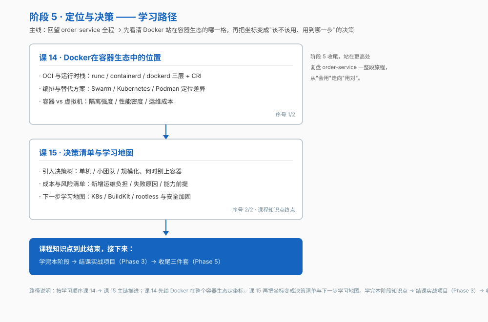

# 阶段 5：定位与决策

> 所属课程：Docker 系统学习 ｜ 故事章节：该不该用、用到哪一步 ｜ 上一阶段：[阶段 4](../4-生产落地/overview.md)

## 🎯 本阶段目标

- 说清 Docker 在整个容器生态中的位置（它是什么、不是什么）
- 能判断该不该容器化、容器化到哪一步
- 知道下一步往哪学

## 📍 学习重点

- runc / containerd / dockerd 三层分工，以及 CRI 这层抽象为什么让 Kubernetes 不再需要 dockerd
- Swarm / Kubernetes / Podman 的定位差异，以及"什么时候根本不需要编排"
- 容器与虚拟机的选型：隔离强度、性能密度、运维成本
- 引入决策树：单机 / 小团队 / 规模化三条路径
- 成本与风险：容器化新增的运维负担、常见引入失败原因

## ✅ 必须掌握的知识点

| 知识点 | 所属课 | 学完应能 |
|--------|--------|----------|
| OCI 与运行时栈 | 课 14 · Docker在容器生态中的位置 | 说清 runc / containerd / dockerd 三层分工，以及 CRI 的作用 |
| 编排与替代方案 | 课 14 · Docker在容器生态中的位置 | 在 Swarm / Kubernetes / Podman 之间做出选择，并说清何时不需要编排 |
| 容器 vs 虚拟机的选型 | 课 14 · Docker在容器生态中的位置 | 按隔离强度、性能密度、运维成本三维度做选型 |
| 引入决策树 | 课 15 · 决策清单与学习地图 | 用决策树判断该不该容器化、容器化到哪一步 |
| 成本与风险清单 | 课 15 · 决策清单与学习地图 | 列全容器化新增的运维负担、常见失败原因与团队能力前提 |
| 下一步学习地图 | 课 15 · 决策清单与学习地图 | 定出后续深入方向并说明各自的适用条件 |

## 🗺️ 本阶段路径图

## 本阶段产出

- [x] `lessons/lesson-14-Docker在容器生态中的位置.md`
- [x] `lessons/lesson-15-决策清单与学习地图.md`
