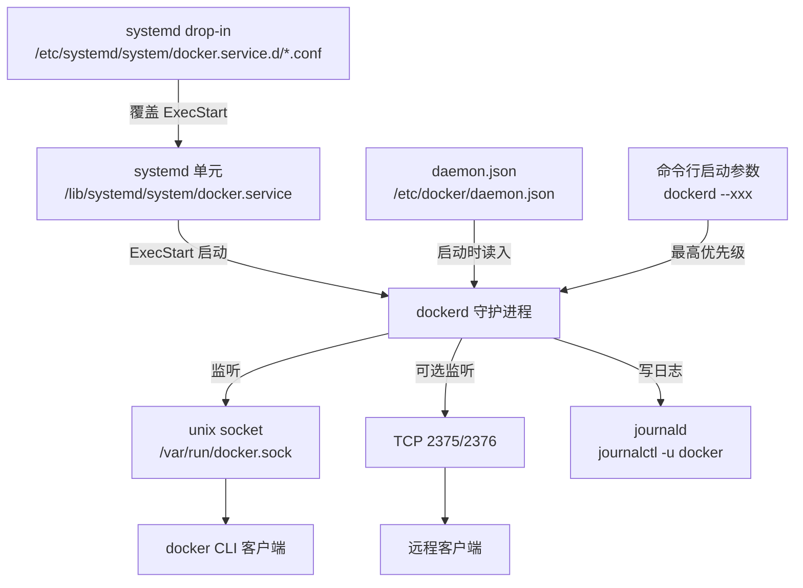
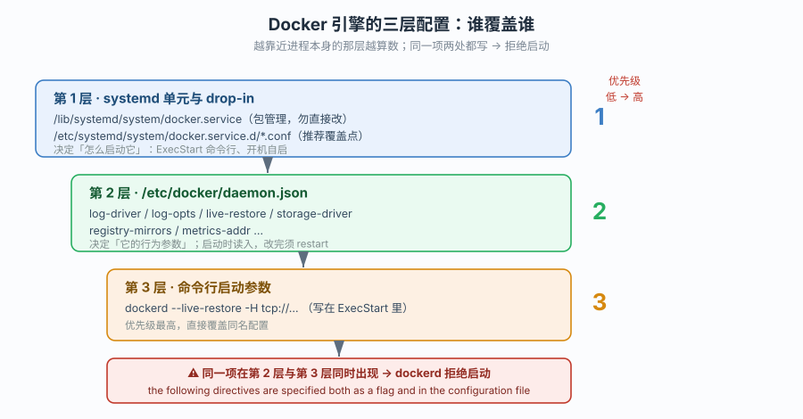
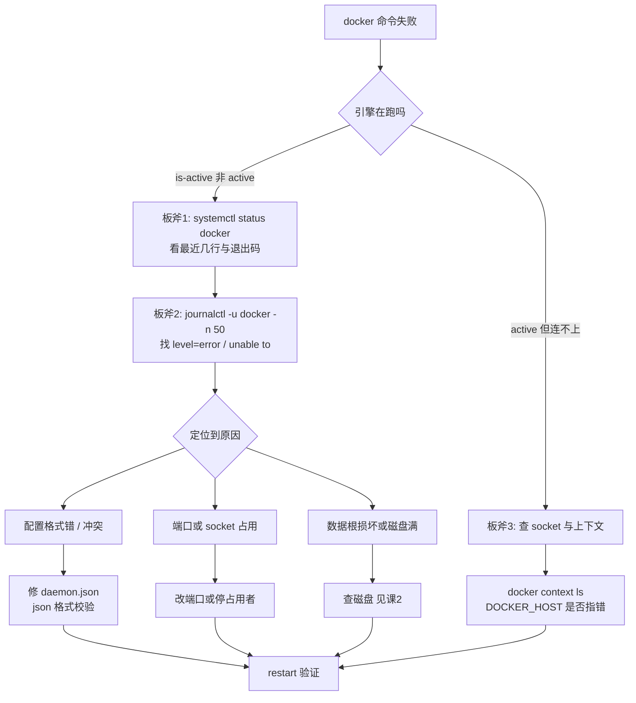
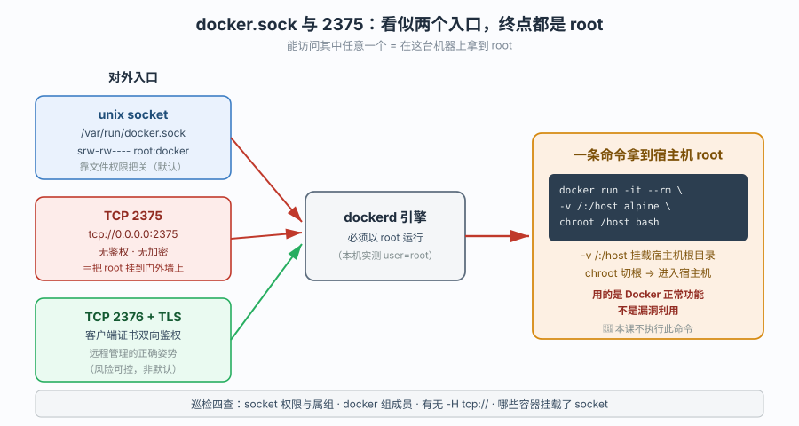
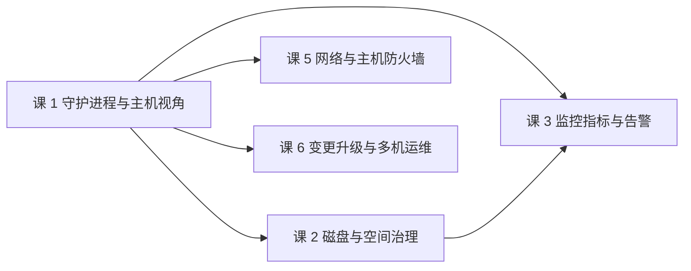
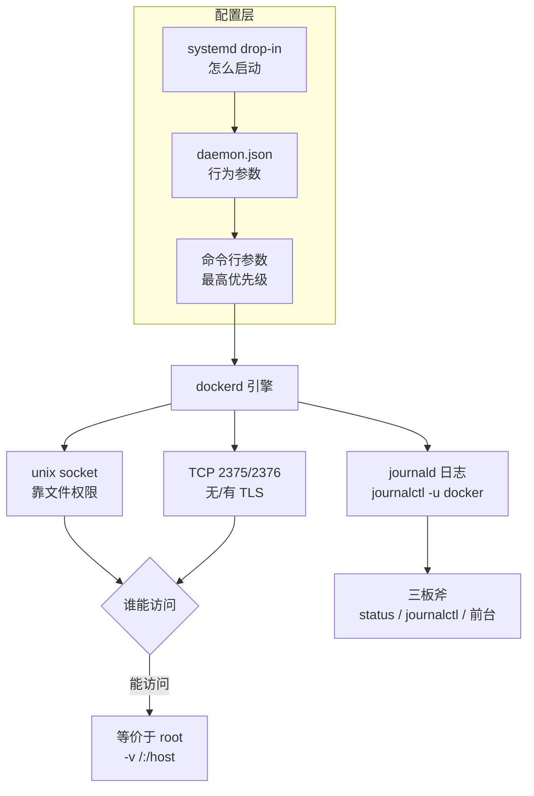

# 第 1 课：守护进程与主机视角

> 所属：子教程《运维专项》｜ 水平：入门（运维向） ｜ 本课知识点：引擎的三层配置与覆盖关系、守护进程日志与"起不来"的三板斧、`docker.sock` 与 2375 的暴露面
> 故事情节：小杨成了 `order-service` 的运维。`docker` 命令突然全挂了——而容器还在跑
> 📖 结论已按官方文档核对（核查于 2026-09-20 ｜ 来源：[Configure the daemon](https://docs.docker.com/config/daemon/) / [dockerd 参考](https://docs.docker.com/reference/cli/dockerd/) / [Troubleshoot the daemon](https://docs.docker.com/engine/daemon/troubleshoot/) / [Protect the daemon socket](https://docs.docker.com/engine/security/protect-access/)）
> 🟢 **本课结论均在本机实测**（WSL Ubuntu 24.04 / Docker Engine 29.4.1），实测输出原样保留

**前置提示**：需先懂主线阶段 4（课 10–13）的容器侧知识——本课只讲**引擎与主机**这一层。若还不清楚 `docker info` / `docker run` 的基本含义，请先回看主线[课 1](../../../stages/1-容器与镜像基础/lessons/lesson-01-为什么需要Docker.md)与[课 10](../../../stages/4-生产落地/lessons/lesson-10-资源限制与进程管理.md)。

## 🎯 本课目标

- 说清 Docker 引擎的配置从哪三层来、谁覆盖谁，**改错文件等于没改**这类问题能一次定位
- 守护进程起不来时，能按"三板斧"独立定位，而不是重装
- 认清 `docker.sock` 与 2375 的真实暴露面，知道"能连上 docker 命令 = 能拿 root"这句话为什么成立

## 📌 知识点导航

| 知识点 | 关键点 | 状态 |
|--------|--------|------|
| 引擎的三层配置与覆盖关系 | systemd drop-in / `daemon.json` / 启动参数谁覆盖谁 / 改完怎么生效（重载 vs 重启） / `daemon.json` 格式错的后果 | ✅ 已完成 |
| 守护进程日志与"起不来"三板斧 | 日志在哪（journald vs 文件） / `systemctl status` → `journalctl` → 前台 `dockerd` 三步 / 三类高频故障（配置格式错、端口占用、数据根损坏） | ✅ 已完成 |
| `docker.sock` 与 2375 的暴露面 | socket 权限与 docker 组等于 root 的原因 / 2375 未鉴权的危害 / 如何盘点暴露面 / 收敛做法 | ✅ 已完成 |

---

## 第一幕：起源与场景引入

主线课 13 结束时，交付流水线跑通了。`order-service` 上了生产，小杨的角色也从"写 Dockerfile 的人"变成了"这台机器上所有容器的人"。

第一个月相安无事。直到某天早上，他例行登上去执行：

```bash
$ docker ps
Cannot connect to the Docker daemon at unix:///var/run/docker.sock. Is the docker daemon running?
```

**连不上守护进程了。** 他心里一紧——但紧接着发现，**网站还活着**：用户请求正常，`order-service` 还在干活。

他这才意识到一件以前从没想过的事：**Docker 不是一个命令，而是两个东西**。

- `docker` —— 客户端，一个发请求的命令行工具，它自己**什么也不干**
- `dockerd` —— 守护进程，真正的引擎，容器是它养着的

客户端连不上，**只意味着他暂时指挥不了**，不代表容器死了。反过来说，如果他把 `dockerd` 重启，容器**可能**跟着一起没——取决于一个叫 live restore 的开关（主线课 10 提过一句，本课知识点 1 会把它放回配置体系里讲清楚）。

他先按老办法试了试：`systemctl restart docker`。

```bash
$ sudo systemctl restart docker
Job for docker.service failed because the control process exited with error code.
See "systemctl status docker.service" and "journalctl -xeu docker.service" for details.
```

**重启失败。** 这一下从"指挥不了"变成了"真实故障"：服务现在还能跑，但只要这台机器重启、或者 `dockerd` 再挂一次，容器就起不来了。

> 🎬 **场景**：运维视角下的第一个真问题——**引擎自己病了**。而要修它，得先知道它是怎么被启动、被配置、被记录日志的。

---

> 📌 **一句话本质**：守护进程是主机上的一个普通服务进程，它的一切行为都由「谁启动它、用什么参数、配置从哪读」决定。
>
> ⚖️ **处境对照**：开发者只需要它能响应命令；运维必须在它**不响应**时也能定位——所以视角要从"怎么用"换成"它是怎么跑起来的"。

## 第二幕：认知冲突

> ❓ **问题**：配置该写进哪个文件？为什么改了 `daemon.json` 有时不生效？`dockerd` 起不来时去哪看原因？`docker.sock` 到底有多危险？

三层答案：

1. **配置从哪来、谁覆盖谁** → 三层配置体系（知识点 1）
2. **起不来时怎么定位** → 日志位置与三板斧（知识点 2）
3. **这个引擎的口子开在哪、有多危险** → socket 与 2375 的暴露面（知识点 3）

---

## 第三幕：层层揭示

### 一眼全局图



> 看图：三层配置从"启动它的方式"（systemd）到"它读的文件"（`daemon.json`）再到"命令行参数"，逐层收紧，后者覆盖前者。右边是它对外暴露的两个口子——**socket 与 TCP**。

### 本课地图

| 知识点 | 回答什么问题 | 主线在哪提过 |
|--------|-------------|-------------|
| 1 · 三层配置 | 配置写哪、谁覆盖谁、改完怎么生效 | 课 1 `docker info`、课 10 live restore |
| 2 · 日志与三板斧 | 起不来时去哪看、怎么定位 | （主线未涉及——引擎自身故障） |
| 3 · 暴露面 | 谁能指挥这台机器的 docker、有多危险 | 课 12 提过 socket 风险（一句话） |

---

### 知识点 1：引擎的三层配置与覆盖关系

#### 🧩 图解



#### 一句话定义

Docker 引擎的配置分三层：`systemd` 决定**怎么启动它**，`daemon.json` 决定**它的行为参数**，命令行参数**优先级最高**——**同一项配置在多处出现时，越靠近进程本身的那层越算数，而三层之间还会互相冲突导致启动失败**。

#### 直觉建立（类比）

把它想成一台**咖啡机**：

- **systemd** 是电源与开关——决定这台机器**插不插电、按哪个按钮启动**
- **`daemon.json`** 是机器面板上的设置——浓度、水量、温度
- **命令行参数** 是有人**站在机器前用手拧**——他拧的那个值，现场最大

关键在第三点：如果你在面板上设了"浓度=3"，又在启动时拧到"浓度=5"，**机器会报错**，因为它不允许同一个旋钮被两个地方同时指定（这就是 Docker 的"配置冲突即启动失败"规则）。

#### 核心原理

**第 1 层：systemd 单元与 drop-in**

`dockerd` 在主流发行版上由 systemd 托管。单元文件通常在 `/lib/systemd/system/docker.service`（Debian/Ubuntu）或 `/usr/lib/systemd/system/docker.service`（RHEL 系）。

🟢 **本机实测**——先看单元文件里的启动命令：

```bash
$ grep -E '^(ExecStart|ExecReload)' /lib/systemd/system/docker.service
ExecStart=/usr/bin/dockerd -H fd:// --containerd=/run/containerd/containerd.sock
ExecReload=/bin/kill -s HUP $MAINPID
```

这行 `ExecStart` 就是引擎**真正的启动命令**。注意 `-H fd://`——它表示"由 systemd 传 socket 文件描述符进来"，**不是监听 TCP**（知识点 3 会回到这里）。

🟢 **本机实测**——确认进程实际参数与单元文件一致：

```bash
$ ps -eo pid,ppid,user,args | grep '[d]ockerd'
    266       1 root     /usr/bin/dockerd -H fd:// --containerd=/run/containerd/containerd.sock
```

`PPID=1` 说明它由 systemd 直接托管（systemd 的 PID 就是 1）；`user=root` 说明引擎**必须以 root 运行**——这一点是知识点 3 一切风险的根。

**drop-in 覆盖**：不要直接改 `/lib/systemd/system/docker.service`——包升级会覆盖它。正确做法是建 drop-in 目录：

```bash
$ sudo mkdir -p /etc/systemd/system/docker.service.d
$ sudo tee /etc/systemd/system/docker.service.d/override.conf <<'EOF'
[Service]
ExecStart=
ExecStart=/usr/bin/dockerd --containerd=/run/containerd/containerd.sock
EOF
$ sudo systemctl daemon-reload
$ sudo systemctl restart docker
```

> ⚠️ **两个易错点**：
> ① 必须先写一行**空的 `ExecStart=`** 再写新的。systemd 对 `ExecStart` 是**追加**语义，不清空直接加会导致"两个 ExecStart"而报错。
> ② 改完 drop-in 必须 `systemctl daemon-reload`，否则 systemd 还用旧配置。
>
> 🟢 **本机实测**：本机**尚未**建 drop-in 目录——
> ```bash
> $ ls -la /etc/systemd/system/docker.service.d/
> ls: cannot access '/etc/systemd/system/docker.service.d/': No such file or directory
> ```
> 这正是"默认状态"的样子，可以作为你动手前的基线。

**第 2 层：`daemon.json`**

🟢 **本机实测**——先确认它存不存在（这决定了你改的是"新建"还是"编辑"）：

```bash
$ ls -la /etc/docker/daemon.json
ls: cannot access '/etc/docker/daemon.json': No such file or directory
```

不存在，说明**当前全部走默认值**。`dockerd --help` 里能看到默认路径：

```bash
$ dockerd --help 2>&1 | grep -A1 'config-file'
      --config-file string                    Daemon configuration file
                                              "/etc/docker/daemon.json")
```

一个典型的生产配置（**本课不要求你执行**，仅展示结构与常用项）：

```json
{
  "log-driver": "json-file",
  "log-opts": {
    "max-size": "10m",
    "max-file": "3"
  },
  "live-restore": true,
  "storage-driver": "overlay2",
  "registry-mirrors": ["https://<your-mirror>"]
}
```

> 📌 **`log-opts` 呼应主线课 11**：主线讲的是"每个容器怎么配日志轮转"，这里是**引擎级默认值**——容器不单独指定时就用它。同一件事的两个视角，正是本子教程与主线的分工。
>
> 📌 **`live-restore` 呼应主线课 10**：主线说"daemon 重启不杀容器"，这里回答"它在哪个文件里开"。🟢 本机实测当前为**关闭**：
> ```bash
> $ docker info --format 'live-restore={{.LiveRestoreEnabled}}'
> live-restore=false
> ```
> **默认关闭**意味着：本机若重启 `dockerd`，**正在运行的容器会一起停**——这是第一幕那个"重启失败"场景里最该担心的事。

**第 3 层：命令行参数（优先级最高）**

`dockerd --live-restore` 这类直接写在 `ExecStart` 里的参数，优先级最高。

**⚠️ 冲突即失败（这条最要命）**：如果同一项**既**在 `daemon.json` 里配了、**又**在命令行参数里给了，`dockerd` **会拒绝启动**，日志里写：

```
unable to configure the Docker daemon with file /etc/docker/daemon.json:
the following directives are specified both as a flag and in the configuration file: live-restore
```

**记住这条**：引擎"起不来"的故障里，配置冲突是最常见的一类，而且报错信息非常直白——前提是**你知道去看日志**（知识点 2）。

**改完怎么生效**

| 改了什么 | 生效方式 | 容器会不会停 |
|----------|---------|-------------|
| `daemon.json` | `systemctl restart docker`（**不是 reload**——`ExecReload` 只是发 HUP，官方推荐重启） | 会（除非 `live-restore: true`） |
| systemd drop-in | `systemctl daemon-reload` **然后** `systemctl restart docker` | 会（同上） |
| 单个容器参数 | 重建容器（`docker run` 参数不可热改） | 该容器会重建 |

> ⚠️ **`daemon-reload` 与 `restart` 是两回事**：前者让 systemd 重新读单元文件，后者才重启引擎。只做前者，配置**不会**应用到已运行的进程。

#### 示例演示

🟢 **全部为本机真实输出**（只读命令，不改动任何配置）。

**1）一眼看清引擎全貌——运维巡检第一招**

```bash
$ docker info --format '{{.ServerVersion}} | {{.Driver}} | {{.DockerRootDir}} | {{.LoggingDriver}} | {{.CgroupDriver}} | {{.CgroupVersion}}'
29.4.1 | overlayfs | /var/lib/docker | json-file | systemd | 2
```

> 六个字段读法：`29.4.1` 引擎版本 / `overlayfs` 存储驱动 / `/var/lib/docker` 数据根目录（**磁盘治理的起点，课 2 的主战场**）/ `json-file` 默认日志驱动（**且未配轮转**——课 2 会算它多大）/ `systemd` cgroup 驱动 / `2` cgroup v2。

**2）确认它由谁启动、是否被托管**

```bash
$ systemctl is-active docker
active
$ systemctl is-enabled docker
enabled
```

> `is-active` 看现在跑没跑，`is-enabled` 看**开机自启**——生产机上 `enabled` 是硬性要求，否则机器重启后容器全不会回来（课 6 会把它纳入巡检清单）。

**3）确认命令行参数与单元文件是否一致**（不一致 = 有人手工改过，是配置漂移的信号）

```bash
$ ps -eo args | grep '[d]ockerd'
/usr/bin/dockerd -H fd:// --containerd=/run/containerd/containerd.sock
```

**4）确认配置源：有没有 `daemon.json`、有没有 drop-in**（本机两项均为"无"，即纯默认）

```bash
$ ls /etc/docker/daemon.json 2>&1
ls: cannot access '/etc/docker/daemon.json': No such file or directory
$ ls -d /etc/systemd/system/docker.service.d 2>&1
ls: cannot access '/etc/systemd/system/docker.service.d': No such file or directory
```

**5）看数据根的真实体量**（课 2 的前哨数据）

```bash
$ du -sh /var/lib/docker
118G    /var/lib/docker

$ df -h /var/lib/docker
Filesystem      Size  Used Avail Use% Mounted on
/dev/sdd       1007G  223G  733G  24% /var/lib/docker
```

> 118G 是 Docker **自己吃掉的**（`df` 的 223G 含该分区上其他数据）。本机是长期跑教程的实验机，镜像容器数量远超生产单机；**这个数字的意义不是"多少算正常"，而是"它确实会长到 100G 量级"**——所以课 2 的磁盘治理不是选修。

#### 常见误区

| ❌ 误区 | ✅ 正解 |
|---------|--------|
| 改了 `daemon.json` 就生效 | 必须 `systemctl restart docker`；`daemon-reload` 只重载 systemd 单元，不重启引擎 |
| 直接改 `/lib/systemd/system/docker.service` | 包升级会覆盖；应建 drop-in `/etc/systemd/system/docker.service.d/*.conf` |
| 同一项在 `daemon.json` 和命令行都写一遍"保险" | **会冲突导致启动失败**，不是"保险" |
| `systemctl reload docker` 能热加载所有配置 | 官方对多数配置要求**重启**；`ExecReload` 仅发 HUP |
| `dockerd` 不以 root 跑也行 | 必须以 root 运行（知识点 3 展开为何这决定了风险量级） |
| 容器参数（如 `--memory`）能热改 | 不能，需重建容器；主线课 10 已讲 |

#### 一句话记住

**`daemon.json` 管行为，systemd 管启动，命令行参数最大；同一项两处都写，引擎直接拒绝启动。**

#### 官方文档

- [Configure the daemon](https://docs.docker.com/config/daemon/) —— 三层配置与 `daemon.json` 全量字段
- [dockerd 参考](https://docs.docker.com/reference/cli/dockerd/) —— 每个命令行参数与 `--config-file` 默认值
- [Read the daemon logs](https://docs.docker.com/engine/daemon/logs/) —— 日志位置（知识点 2）

---

### 知识点 2：守护进程日志与"起不来"的三板斧

#### 🧩 图解



#### 一句话定义

`dockerd` 是 systemd 托管的服务，它的日志**默认进 journald**（`journalctl -u docker`），定位"起不来"只需三步：`systemctl status` 看现象 → `journalctl` 看原因 → 必要时**前台跑 `dockerd`** 看完整报错。

#### 直觉建立（类比)

医生看病的顺序：**先看病人还在不在**（`is-active`）→ **再翻病历看上次发生了什么**（`journalctl`）→ **还查不出就让病人当面复述**（前台跑 `dockerd`，所有日志直接打到屏幕）。

绝大多数人卡在第一步之后，因为**病历本找错地方**——去找 `/var/log/docker.log`，而官方默认并不写那里。

#### 核心原理

**日志在哪：取决于系统，不取决于 Docker**

| 系统 | 日志位置 | 查看命令 |
|------|---------|---------|
| systemd 系（Ubuntu 16.04+ / Debian 8+ / RHEL 7+） | **journald** | `journalctl -u docker` |
| 无 systemd（旧 Ubuntu 14.04 / 某些容器环境） | `/var/log/upstart/docker.log` | `tail -f` |
| macOS / Windows（Docker Desktop） | GUI 或 `~/Library/Containers/com.docker.docker/...` | Desktop 界面 |

🟢 **本机实测**——确认走 journald：

```bash
$ journalctl -u docker -n 3 --no-pager
Sep 20 10:49:55 VWYPGWU-PC5 dockerd[266]: time="2026-09-20T10:49:55.383474985+08:00" level=error msg="[resolver] failed to query external DNS server" client-addr="udp:10.255.255.254:41108" dns-server="udp:10.255.255.254:53" error="read udp 10.255.255.254:41108->10.255.255.254:53: i/o timeout" question=";l9-vm-single.\tIN\t AAAA"

$ ls -la /var/log/docker.log
ls: cannot access '/var/log/docker.log': No such file or directory
```

> 两点结论：① 日志确实在 journald，`/var/log/docker.log` **不存在**；② 日志格式是 `time=... level=error msg=...` 的 key-value 结构，**`level=error` 是你要抓的关键词**。
>
> 顺带一提：这几条 error 是**容器 DNS 解析超时**（`l9-vm-single` 是教程实验残留的容器名），属正常噪声，不是引擎故障——**学会区分"真故障"与"历史噪声"也是运维基本功**。

**三板斧**

**板斧 1：`systemctl status` —— 看现象与退出码**

```bash
$ sudo systemctl status docker
```

重点看三处：`Active:` 行（`active (running)` / `failed`）、`Main PID`、以及末尾几行日志摘要。若显示 `failed`，第二行通常就是原因的第一句。

**板斧 2：`journalctl` —— 看完整原因**

```bash
$ sudo journalctl -u docker -n 50 --no-pager      # 最近 50 行
$ sudo journalctl -u docker -f                    # 实时跟随（重启时另开窗口看它）
$ sudo journalctl -u docker --since "10 min ago"  # 只看最近 10 分钟
```

抓三类关键词：

| 关键词 | 含义 | 去向 |
|--------|------|------|
| `unable to configure the Docker daemon with file` | `daemon.json` 格式错或冲突 | 知识点 1 |
| `bind: address already in use` | 端口/socket 被占 | 本知识点 |
| `no space left on device` | 数据根所在分区满了 | 课 2 |

**板斧 3：前台跑 `dockerd` —— 看完整报错（前两招都不够时用）**

```bash
$ sudo systemctl stop docker
$ sudo dockerd        # 前台运行，日志直接打到屏幕，Ctrl+C 退出
```

> ⚠️ **生产环境慎用**：`systemctl stop docker` 会停掉所有容器（本机 `live-restore=false`）。这条更适合**测试机**或**已经确认容器可以停**的窗口期。
>
> 更安全的替代：用 `--validate` 之类的思路先验证配置，或先在临时目录试跑（不指定数据根会用到同一个 `/var/lib/docker`，需谨慎）。

**三类高频故障**

**① `daemon.json` 格式错/冲突** —— 最高频。一个多余的逗号、或某项与命令行参数重复，引擎直接起不来。

自检方法（**不用重启就能查**）：

```bash
$ sudo dockerd --validate --config-file=/etc/docker/daemon.json
# 或退一步，只验 JSON 语法：
$ python3 -m json.tool /etc/docker/daemon.json > /dev/null && echo "JSON 语法 OK"
```

> 官方 `dockerd` 支持 `--validate` 校验配置文件。若你的版本不支持，用 `python3 -m json.tool` 至少能排掉纯语法错（**注意：它查不出"字段重复"这类语义冲突**）。

**② 端口或 socket 被占** —— 多见于手工加 `-H tcp://0.0.0.0:2375` 后与已有监听冲突，或上次 `dockerd` 没退干净。

```bash
$ sudo ss -lntp | grep -E 'dockerd|2375'
$ sudo lsof /var/run/docker.sock
```

**③ 数据根损坏或磁盘满** —— 报错 `no space left on device` 或存储驱动初始化失败。这属于课 2 的主场，这里只给判据：`df -h /var/lib/docker` 看 Use%。

#### 示例演示

🟢 **本机实测**（只读）：

**1）定位日志位置与格式**

```bash
$ journalctl -u docker -n 1 --no-pager | head -2
Sep 20 10:49:55 VWYPGWU-PC5 dockerd[266]: time="2026-09-20T10:49:55.383474985+08:00" level=error msg="[resolver] failed to query external DNS server" ...
```

**2）按级别过滤，只看真错误**

```bash
$ journalctl -u docker --no-pager | grep -c 'level=error'
# （本机为教程实验机，历史 error 数量较多，此处不给出会过时的具体数值）
```

> ⚠️ **不编造数值的说明**：本机的 error 条数会随时间增长，写死一个数字明天就错了。课上要求你**自己跑一次**看当前值——**运维结论必须来自你此刻的机器，而不是教材里的数字**。

**3）确认服务托管状态（板斧 1 的信息源）**

```bash
$ systemctl is-active docker && systemctl is-enabled docker
active
enabled
```

**4）模拟"配置冲突"的判据（不实际执行，仅展示报错形态）**

> 若在 `daemon.json` 写了 `"live-restore": true`，同时 `ExecStart` 里又有 `--live-restore`，`journalctl` 里会看到：
> ```
> unable to configure the Docker daemon with file /etc/docker/daemon.json: the following directives are specified both as a flag and in the configuration file: live-restore
> ```
> **本课不执行该操作**——改 `daemon.json` 属改环境，按规矩须先向你请示。

#### 常见误区

| ❌ 误区 | ✅ 正解 |
|---------|--------|
| 去 `/var/log/docker.log` 找日志 | 默认**没有这个文件**；systemd 系统走 `journalctl -u docker` |
| `Cannot connect to the Docker daemon` = 容器挂了 | 只说明**客户端连不上引擎**；容器可能还在跑（第一幕场景） |
| 起不来就重装 Docker | 90% 是配置问题，重装**会丢镜像与卷数据**（数据根在 `/var/lib/docker`） |
| `journalctl -u docker` 一片 error 就是故障 | 可能是历史噪声；看 `--since` 限定时间窗 |
| 前台 `dockerd` 随便跑 | 它绑定同一个数据根与 socket，可能与 systemd 的实例打架 |

#### 一句话记住

**起不来先看 `systemctl status`，再看 `journalctl -u docker`；配置冲突的报错会明写"specified both as a flag and in the configuration file"。**

#### 官方文档

- [Troubleshoot the daemon](https://docs.docker.com/engine/daemon/troubleshoot/) —— 官方排障流程与前台调试
- [Read the daemon logs](https://docs.docker.com/engine/daemon/logs/) —— 各系统日志位置表
- [dockerd 参考](https://docs.docker.com/reference/cli/dockerd/) —— `--validate` 等参数

---

### 知识点 3：`docker.sock` 与 2375 的暴露面

#### 🧩 图解



#### 一句话定义

`/var/run/docker.sock` 是引擎的**本地控制入口**，2375 是它的**未鉴权 TCP 版本**——**能访问这两者中任意一个，等价于在这台机器上拿到 root**，因为你可以随意启动一个挂载宿主机根目录的特权容器。

#### 直觉建立（类比）

`docker.sock` 不是"一个命令行工具的接口"，它是**塞进 Unix 文件权限外壳里的 root 令牌**。

想象公司前台有一部"万能电梯卡"，凭它能进任何楼层包括机房。这张卡被锁在抽屉里（socket 文件权限 `srw-rw---- root:docker`）——**谁能打开抽屉，谁就能进机房**。而 2375 等于**把这张卡挂到了公司大门外墙上，谁都能摘**。

**把它加进 `docker` 组，就是把抽屉钥匙给了那个人**——而不是"给他运行 docker 命令的权限"。这两句话在现实中等价，但听起来完全不是一个危险量级，这正是它被长期低估的原因。

#### 核心原理

**socket 的真实权限**

🟢 **本机实测**：

```bash
$ ls -la /var/run/docker.sock
srw-rw---- 1 root docker 0 Aug 31 16:29 /var/run/docker.sock

$ getent group docker
docker:x:989:
```

读法：`s`（socket 类型）、`rw-rw----`（属主 root 可读写、属组 docker 可读写、**其他用户无任何权限**）、属主 `root`、属组 `docker`。

**关键发现：docker 组的成员列表是空的**（`docker:x:989:` 冒号后无用户名）——也就是说本机**没有任何非 root 用户**能直接用 docker 命令。

🟢 **实测验证**——让无权限用户试一次：

```bash
$ sudo -u nobody docker info --format '{{.ServerVersion}}'
Cannot connect to the Docker daemon at unix:///var/run/docker.sock. Is the docker daemon running?
```

> 注意这句报错**具有误导性**：它问"守护进程在跑吗"，但真实原因是**这个用户没权限访问 socket**。这是新手最常浪费时间的陷阱之一——**先确认权限，再怀疑服务**。

**为什么"能连 docker = root"**

因为拿到 socket 后，一条命令就能拿到宿主机 root shell：

```bash
$ docker run -it --rm -v /:/host alpine chroot /host /bin/bash
```

> 拆解：`-v /:/host` 把宿主机根目录挂进容器，`chroot /host` 把根切过去——**你就在宿主机里了，且是 root**。这条命令**没有任何漏洞利用**，它用的是 Docker 的**正常功能**。
>
> 🚫 **本课不执行该命令**（它会在宿主机上留下一个 root shell 通道，且会拉取镜像）。这里只作为**风险判据**说明。

**2375 与 2376**

| 端点 | 鉴权 | 加密 | 用途 |
|------|------|------|------|
| `unix:///var/run/docker.sock` | 靠**文件权限**（root / docker 组） | 不适用（本机内） | 默认、推荐 |
| `tcp://0.0.0.0:2375` | **无** | **无** | **官方明确不推荐**，等同把 root 挂在公网 |
| `tcp://0.0.0.0:2376` | TLS 客户端证书 | TLS | 远程管理的正确姿势 |

🟢 **本机实测**——确认两个 TCP 端口都没开：

```bash
$ timeout 5 bash -c 'cat < /dev/null > /dev/tcp/127.0.0.1/2375' && echo '2375 可连' || echo '2375 不可连（正常）'
2375 不可连（正常）

$ timeout 5 bash -c 'cat < /dev/null > /dev/tcp/127.0.0.1/2376' && echo '2376 可连' || echo '2376 不可连（正常）'
2376 不可连（正常）
```

这与知识点 1 看到的 `-H fd://` 一致：**`-H fd://` 就是"只听 systemd 给的 socket，不监听 TCP"**。

🟢 **再看一眼当前上下文**（这是"命令连错机器"的高频原因）：

```bash
$ docker context ls
NAME        DESCRIPTION                               DOCKER ENDPOINT               ERROR
default *   Current DOCKER_HOST based configuration   unix:///var/run/docker.sock   

$ echo "DOCKER_HOST=[${DOCKER_HOST:-未设置}]"
DOCKER_HOST=[未设置]
```

> `context` 与 `DOCKER_HOST` 是"客户端连到哪台引擎"的开关——课 6 会用它做多机批量。这里先记住：**"连不上"的故障，也可能是你连错了地方，而不是引擎挂了**。

**如何盘点暴露面（巡检动作）**

```bash
# 1. socket 归谁所有、权限多少
ls -la /var/run/docker.sock

# 2. 谁在 docker 组里（这些人 = 事实上的 root）
getent group docker

# 3. 引擎在监听哪些端点
ps -eo args | grep '[d]ockerd'      # 看有没有 -H tcp://
sudo ss -lntp | grep dockerd        # 看实际监听

# 4. 有没有容器把 socket 挂进去了（最隐蔽的暴露方式）
docker ps --format '{{.Names}}\t{{.Mounts}}' | grep docker.sock
```

> 第 4 条最容易被忽略：很多"管理类"容器（Portainer、某些 CI agent、监控 agent）**需要**挂 socket 才能工作。挂了，就等于**那个容器的任何漏洞 = 宿主机 root**。这不是禁止用，而是**要知道你在让渡什么**。

**收敛做法**

| 风险 | 做法 |
|------|------|
| 需要给某人用 docker | **优先用 sudo 授权具体命令**；必须加组时，明确告知"这等于给 root" |
| 需要远程管理 | 用 **2376 + TLS 证书**（[Protect the daemon socket](https://docs.docker.com/engine/security/protect-access/)），不要开 2375 |
| 必须开 2375（内网可信区） | 至少用防火墙限制来源 IP（课 5 讲 DOCKER-USER 与防火墙），并当作"临时方案"记录 |
| 管理类容器要挂 socket | 加 `:ro`（只读）能挡一部分，但**挡不住本质风险**；核心是限制该容器的网络暴露与镜像来源 |

#### 示例演示

🟢 **本机实测**（只读，不改动权限）：

**1）socket 权限与属组**

```bash
$ ls -la /var/run/docker.sock
srw-rw---- 1 root docker 0 Aug 31 16:29 /var/run/docker.sock
```

**2）docker 组成员（本机为空）**

```bash
$ getent group docker
docker:x:989:
```

**3）无权限用户的报错形态（记住它长这样）**

```bash
$ sudo -u nobody docker info --format '{{.ServerVersion}}'
Cannot connect to the Docker daemon at unix:///var/run/docker.sock. Is the docker daemon running?
```

**4）确认没有 TCP 监听**

```bash
$ ps -eo args | grep '[d]ockerd'
/usr/bin/dockerd -H fd:// --containerd=/run/containerd/containerd.sock
```

**5）确认当前连的是本机**

```bash
$ docker context ls
NAME        DESCRIPTION                               DOCKER ENDPOINT               ERROR
default *   Current DOCKER_HOST based configuration   unix:///var/run/docker.sock   
```

#### 常见误区

| ❌ 误区 | ✅ 正解 |
|---------|--------|
| 加入 `docker` 组只是"能用 docker 命令" | **等于给了 root**（`-v /:/host` 一条命令的事） |
| `Cannot connect to the Docker daemon` 一定是服务挂了 | 也可能是**权限不足**或**连错了机器**（`context` / `DOCKER_HOST`） |
| 内网开 2375 没事 | 内网不等于可信；且它**无鉴权无加密**，任何能到该端口的人都能拿 root |
| 把 socket 挂进管理容器是标准做法、没风险 | 让渡了 root；`:ro` 只是缓解不是解决 |
| Docker Desktop 环境同样适用 | Desktop 有 VM 隔离，风险模型**不同**，不要照搬本机结论 |

#### 一句话记住

**socket 是 root 令牌，2375 是把令牌挂到门外墙上；盘点暴露面就是查「谁能拿到这块令牌」。**

#### 官方文档

- [Protect the daemon socket](https://docs.docker.com/engine/security/protect-access/) —— TLS 配置与风险说明
- [Remote access](https://docs.docker.com/engine/daemon/remote-access/) —— 2375 / 2376 配置与警告
- [docker context](https://docs.docker.com/reference/cli/docker/context/) —— 客户端连向哪台引擎

---

## 第四幕：实操验证

> **本机环境**：WSL Ubuntu 24.04 / Docker Engine 29.4.1 / overlayfs / cgroup v2。Windows 侧无 docker CLI，命令经 `wsl -d Ubuntu -- bash -c "..."` 执行。
> **安全声明**：本课全部步骤**只读**，不改 `daemon.json`、不改权限、不开端口。涉及写操作的步骤已标注「**不执行**」并说明原因（改环境需先请示）。

### 步骤 1：画出你这台机器的配置现状

```bash
# 1) 引擎全貌（一次拿到六个关键字段）
docker info --format '{{.ServerVersion}} | {{.Driver}} | {{.DockerRootDir}} | {{.LoggingDriver}} | {{.CgroupDriver}} | {{.CgroupVersion}}'
# 预期（本机）：29.4.1 | overlayfs | /var/lib/docker | json-file | systemd | 2

# 2) 三个配置源各查一遍
grep -E '^ExecStart' /lib/systemd/system/docker.service
ls -la /etc/docker/daemon.json
ls -d /etc/systemd/system/docker.service.d
# 预期（本机）：ExecStart 走 -H fd://；daemon.json 不存在；drop-in 目录不存在
```

> **判据**：三个源都查过，你才能说"我知道这台机器的配置从哪来"。只查一个 = 还有未知改动。

### 步骤 2：确认引擎由 systemd 托管且开机自启

```bash
systemctl is-active docker     # 预期：active
systemctl is-enabled docker    # 预期：enabled（生产硬要求）
ps -eo pid,ppid,args | grep '[d]ockerd'
# 预期：PPID=1（systemd 直管），args 与 ExecStart 一致
```

> **判据**：`PPID=1` 且 args 与单元文件一致 = 无配置漂移。不一致说明有人手工起过。

### 步骤 3：定位日志并区分噪声

```bash
journalctl -u docker -n 5 --no-pager
# 预期：time=... level=error msg=... 结构的行

journalctl -u docker --since "10 min ago" --no-pager | grep level=error | head -5
# 预期：限定时间窗后的真实现状（本机多为容器 DNS 超时噪声）
ls -la /var/log/docker.log
# 预期：不存在 —— 印证"systemd 系统走 journald"
```

> **判据**：能说出"哪些 error 是真故障、哪些是历史噪声"。分不清 = 排障时会被噪声淹没。

### 步骤 4：盘点暴露面

```bash
ls -la /var/run/docker.sock              # 权限与属组
getent group docker                      # 谁在 docker 组（这些人 = 事实 root）
sudo -u nobody docker info --format '{{.ServerVersion}}' 2>&1   # 无权限用户的报错长相
ps -eo args | grep '[d]ockerd'           # 有没有 -H tcp://
docker context ls                        # 你连的是哪台
echo "DOCKER_HOST=[${DOCKER_HOST:-未设置}]"
```

> **判据**：能回答"这台机器上，除了 root 还有谁能指挥 docker"。答不上来 = 暴露面未知。

### 步骤 5：确认磁盘现状（课 2 的前哨）

```bash
du -sh /var/lib/docker     # 预期（本机）：118G
df -h /var/lib/docker      # 预期：看 Use% 是否逼近 100%
```

> **判据**：`Use%` 超过 80% 就该进课 2 做治理了。

### 步骤 6：不执行的部分（记录下来，等授权后再做）

```bash
# ⛔ 以下均属改环境，本课不执行，需先向用户请示：
#   1) 写 /etc/docker/daemon.json（开 live-restore / 日志轮转）
#   2) 建 systemd drop-in 改 ExecStart
#   3) docker run -v /:/host ... 提权演示
#   4) 开放 2375
```

> 📌 这一步**本身就是运维纪律**：**知道哪些操作不能随手做，和知道怎么做同样重要。**

---

## 第五幕：体系收束

### 本课在运维体系中的位置



课 1 是**入口**：不了解引擎怎么被启动配置，后面五课的动作（清盘、接监控、配防火墙、升版本）都没有落点。

### 三个知识点的收束

| 知识点 | 一句话 | 落到哪 |
|--------|--------|--------|
| 三层配置 | 配置有三层，越靠近进程越算数，重复即失败 | 改配置前的定位能力 |
| 三板斧 | status → journalctl → 前台 dockerd | 引擎起不来时的定位能力 |
| 暴露面 | socket 即 root，2375 是把 root 挂墙上 | 安全基线盘点能力 |

### 与主线、与排障手册的关系

- **与主线课 10 / 11 / 12**：主线说"要开 live restore""容器日志要轮转""socket 有风险"；本课回答**这些开关在哪个文件、改完怎么生效、风险到底多大**。
- **与 `09-排障速查手册`**：手册按**症状**倒查（"连不上 daemon"→ 直接给命令）；本课按**体系**正着学（为什么连不上、有哪些可能）。二者互补，急用查手册、系统学看这里。

---

## 🐞 常见误区（本课汇总）

| # | 误区 | 正解 |
|---|------|------|
| 1 | 改了 `daemon.json` 就生效 | 要 `systemctl restart docker`；`daemon-reload` 只重载单元 |
| 2 | 直接改 `/lib/systemd/system/docker.service` | 会被包升级覆盖；用 drop-in，且先写空 `ExecStart=` |
| 3 | 同一项配置两处都写"保险" | 冲突即**启动失败** |
| 4 | 日志在 `/var/log/docker.log` | systemd 系统走 `journalctl -u docker` |
| 5 | `Cannot connect` = 容器挂了 | 只说明客户端连不上；也可能是权限不足或连错机器 |
| 6 | 加入 docker 组只是"能跑命令" | 等于给了 root |
| 7 | 起不来就重装 | 会丢 `/var/lib/docker` 下的镜像与卷 |
| 8 | 内网开 2375 没事 | 无鉴权无加密，能到端口即 root |

## 一图总结



## 📋 命令速查卡

| 命令 | 用途 | 知识点 |
|------|------|--------|
| `docker info --format '{{.ServerVersion}} \| {{.Driver}} \| {{.DockerRootDir}} \| {{.LoggingDriver}} \| {{.CgroupDriver}} \| {{.CgroupVersion}}'` | 一次拿到引擎六个关键字段 | 1 |
| `grep -E '^ExecStart' /lib/systemd/system/docker.service` | 看真实启动命令 | 1 |
| `ls -la /etc/docker/daemon.json` | 确认配置文件存不存在 | 1 |
| `ls -d /etc/systemd/system/docker.service.d` | 确认有没有 drop-in 覆盖 | 1 |
| `systemctl daemon-reload && systemctl restart docker` | 改 systemd 配置后的生效组合拳 | 1 |
| `systemctl is-active docker` / `is-enabled docker` | 在不在跑 / 开不开机自启 | 1·2 |
| `dockerd --validate --config-file=/etc/docker/daemon.json` | 只校验配置不启动（免重启排错） | 1·2 |
| `journalctl -u docker -n 50 --no-pager` | 看守护进程日志（systemd 系统） | 2 |
| `journalctl -u docker -f` | 实时跟随日志 | 2 |
| `journalctl -u docker --since "10 min ago"` | 限定时间窗，避开历史噪声 | 2 |
| `sudo dockerd` | 前台运行，日志打到屏幕（**会停所有容器**） | 2 |
| `ss -lntp \| grep dockerd` | 看引擎实际监听哪些端口 | 2·3 |
| `ls -la /var/run/docker.sock` | 看 socket 权限与属组 | 3 |
| `getent group docker` | 看谁在 docker 组（= 事实 root 名单） | 3 |
| `docker context ls` / `echo $DOCKER_HOST` | 确认客户端连的是哪台引擎 | 3 |
| `docker ps --format '{{.Names}}\t{{.Mounts}}' \| grep docker.sock` | 找出挂载了 socket 的容器 | 3 |
| `du -sh /var/lib/docker` / `df -h /var/lib/docker` | 数据根体量与剩余空间 | 1（课 2 前哨） |

## 课后小测

**1.（单选）`daemon.json` 里写了 `"live-restore": true`，同时 systemd 的 `ExecStart` 里也有 `--live-restore`，会发生什么？**
A. 命令行参数生效，文件被忽略
B. 文件生效，命令行参数被忽略
C. `dockerd` 拒绝启动，日志提示配置重复
D. 随机采用其中一个

**2.（单选）`docker` 命令报 `Cannot connect to the Docker daemon`，以下哪项**不是**可能原因？**
A. `dockerd` 真的没在跑
B. 当前用户不在 `docker` 组且非 root
C. `DOCKER_HOST` 指向了另一台机器
D. 本机没有运行任何容器

**3.（多选）以下哪些操作等价于"把宿主机 root 交出去"？（选两项）**
A. 把用户加入 `docker` 组
B. 开放 `tcp://0.0.0.0:2375`
C. 给用户 `docker ps` 的 sudo 权限
D. 开放 `tcp://0.0.0.0:2376` 并配置 TLS 客户端证书

**4.（判断）在 systemd 系统上，Docker 守护进程日志默认写在 `/var/log/docker.log`。**
A. 正确
B. 错误

**5.（单选）改完 `/etc/systemd/system/docker.service.d/override.conf` 后，正确的生效步骤是？**
A. 直接生效，无需操作
B. `systemctl restart docker`
C. `systemctl daemon-reload` 然后 `systemctl restart docker`
D. `systemctl reload docker`

**6.（简答）为什么把 socket 挂载进"管理类容器"（如 Portainer）被称为让渡 root？请写出那条关键命令。**

<details>
<summary>答案</summary>

1. **C** —— 同一项在配置文件与命令行参数同时出现，`dockerd` **拒绝启动**，日志明确写 `specified both as a flag and in the configuration file`。（知识点 1）
2. **D** —— 没有容器运行**不影响**客户端连引擎；A/B/C 都是真实成因。（知识点 2·3）
3. **A、B** —— docker 组与 2375 都是无门槛 root；C 只给了单条命令；D 有 TLS 鉴权，是**正确做法**而非风险。（知识点 3）
4. **B** —— 默认进 journald，用 `journalctl -u docker` 看；`/var/log/docker.log` 通常不存在。（知识点 2）
5. **C** —— `daemon-reload` 让 systemd 重读单元，`restart` 才重启引擎，**两步都要**。（知识点 1）
6. 因为拿到 socket 后可运行 `docker run -it --rm -v /:/host alpine chroot /host /bin/bash`，把宿主机根目录挂进容器再 `chroot`，**直接获得宿主机 root shell**——这用的是 Docker 正常功能，不是漏洞。（知识点 3）

</details>

## 🚀 下一批接力提示词

```
继续子教程《运维专项》课 2《磁盘与空间治理》，要求：
- 沿用本课体例：五幕结构 + 知识点六要素（图解/定义/直觉/原理/示例/误区/一句话记住/官方文档）+ 第四幕实操 + 速查卡 + 小测 + 导航
- 承接本课实测基线：Docker 29.4.1 / overlayfs / 数据根 /var/lib/docker（118G）/ json-file 未配轮转
- 覆盖三个知识点：数据根目录与存储驱动、docker system df 四分法找真凶、prune 安全边界与容量告警
- 与主线课 3 的清理命令、课 11 的容器日志配置划清边界（主线讲怎么配，这里讲占多少盘谁来清）
- 全部结论本机实测，不得编造输出；涉及 prune 等破坏性操作须标注「不执行」并说明风险
```

## 🧭 课程导航

- ⬅️ **上一课**：（本子教程首课）｜ 回主线 [课 13 CI/CD 与交付流水线](../../../stages/4-生产落地/lessons/lesson-13-CI-CD与交付流水线.md)
- ➡️ **下一课**：课 2《磁盘与空间治理》（未编写）
- 🏠 **子教程大纲**：[运维专项 overview](../overview.md)
- 📖 **主线目录**：[02-课程目录.md](../../../02-课程目录.md)
- 🆘 **急救**：[09-排障速查手册](../../../09-排障速查手册.md)（按症状倒查）
