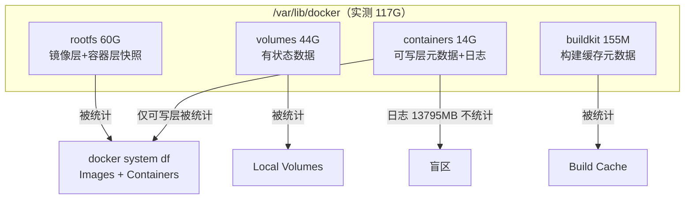
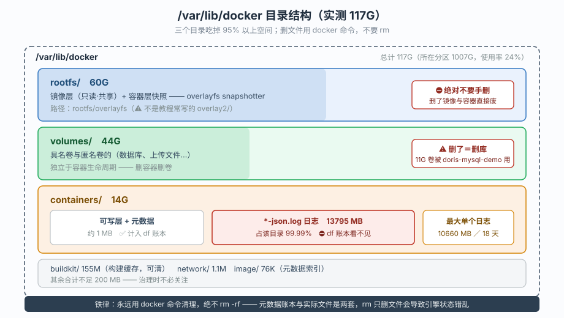
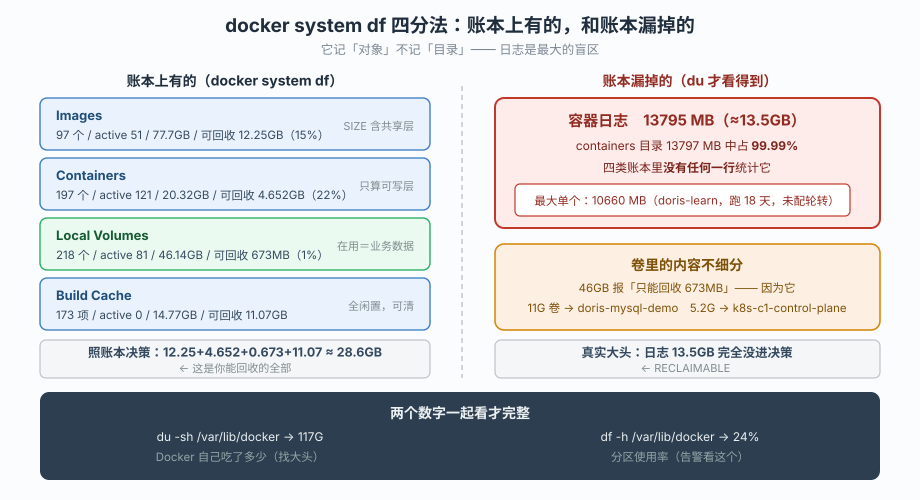
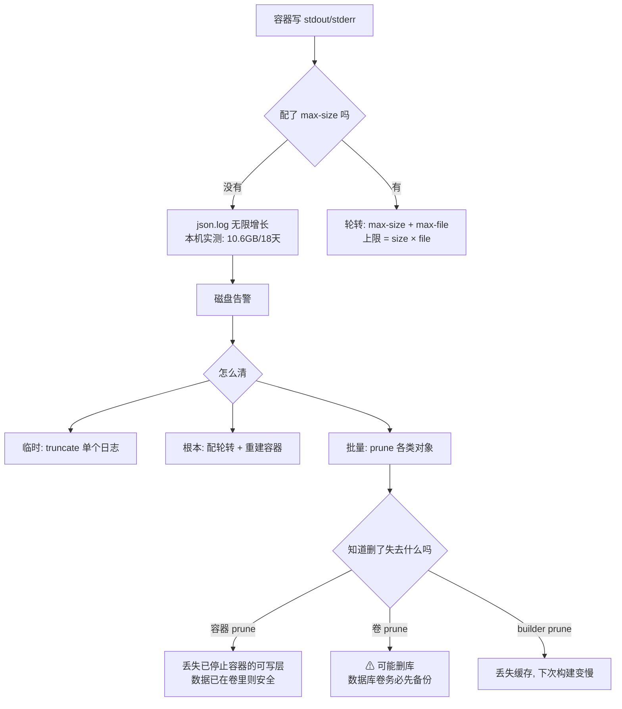
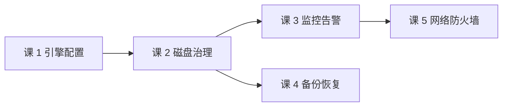
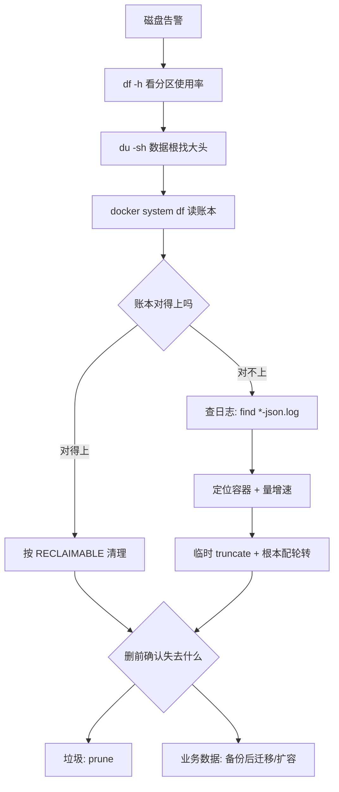

# 第 2 课：磁盘与空间治理

> 所属：子教程《运维专项》｜ 水平：入门（运维向） ｜ 本课知识点：数据根目录与存储驱动、`docker system df` 四分法与它的盲区、日志这台"碎纸机"与清理的安全边界
> 故事情节：磁盘告警 85%，`docker system df` 说只能回收 18GB——但 `du` 显示有个目录 14G，`df` 里根本没有
> 📖 结论已按官方文档核对（核查于 2026-09-20 ｜ 来源：[docker system df](https://docs.docker.com/reference/cli/docker/system/df/) / [docker system prune](https://docs.docker.com/reference/cli/docker/system/prune/) / [JSON File logging driver](https://docs.docker.com/engine/logging/drivers/json-file/) / [Storage drivers](https://docs.docker.com/engine/storage/drivers/) / [Volumes](https://docs.docker.com/engine/storage/volumes/)）
> 🟢 **本课结论均在本机实测**（WSL Ubuntu 24.04 / Docker Engine 29.4.1 / overlayfs snapshotter）

**前置提示**：本课需要课 1 的配置视角（知道 `daemon.json` 在哪、改完怎么生效）。若还没看过，请先回看[课 1：守护进程与主机视角](lesson-01-守护进程与主机视角.md)。

## 🎯 本课目标

- 看懂 `/var/lib/docker` 下每个目录装的是什么，**磁盘告警时知道去哪找**
- 掌握 `docker system df` 四分法，并**清楚它看不见什么**（这是本课最关键的一条）
- 能安全地做清理：知道每类对象删掉会失去什么，**在"能删"和"敢删"之间画出边界**

## 📌 知识点导航

| 知识点 | 关键点 | 状态 |
|--------|--------|------|
| 数据根目录与存储驱动 | 数据根下每个目录的职责 / overlayfs 快照与 shared-unique 账本 / 为什么 `du` 与 `df` 对不上 | ✅ 已完成 |
| `docker system df` 四分法与它的盲区 | 四类对象怎么读 / RECLAIMABLE 的真实含义 / **日志与卷数据不在账上** | ✅ 已完成 |
| 日志这台碎纸机与清理的安全边界 | 日志为何失控 / 轮转怎么配（容器级 vs 引擎级） / prune 会删什么、不能删什么 / 容量告警 | ✅ 已完成 |

---

## 第一幕：起源与场景引入

课 1 之后，小杨知道了引擎怎么被启动。现在他接到第一条告警：

```
[FIRING] DiskUsageHigh  /var/lib/docker 使用率 85%
```

他登上去，第一反应是用官方命令看看能回收多少：

```bash
$ docker system df
TYPE            TOTAL     ACTIVE    SIZE      RECLAIMABLE
Images          97        51        77.7GB    12.25GB (15%)
Containers      197       121       20.32GB   4.652GB (22%)
Local Volumes   218       81        46.14GB   673MB (1%)
Build Cache     173       0         14.77GB   11.07GB
```

他一算：12.25 + 4.652 + 0.673 + 11.07 ≈ **28.6GB** 可回收。可告警说的是要腾出上百 GB 的级别——**对不上**。

更让他困惑的是，他顺手 `du` 了一下数据根的子目录：

```bash
$ du -sh /var/lib/docker/* | sort -rh
60G     /var/lib/docker/rootfs
44G     /var/lib/docker/volumes
14G     /var/lib/docker/containers
155M    /var/lib/docker/buildkit
```

`containers` 目录 **14G**，可 `docker system df` 里 Containers 那行写着 20.32GB、可回收 4.652GB。这 14G 到底是什么？为什么 `df` 报的数跟它对不上？

他接着查：

```bash
$ du -ch /var/lib/docker/containers/*/*-json.log | tail -1
14G     total
```

**那 14G 全是日志文件。**

然后他发现了一件更让他后背发凉的事——**`docker system df` 的四行里，没有任何一行统计容器日志**。

> 🎬 **场景**：运维视角下的第二个真问题——**你手里的账本不完整**。而磁盘告警这种事，恰恰是按"账本上能回收多少"来决定动作的。

---

> 📌 **一句话本质**：`docker system df` 统计的是**对象**（镜像/容器/卷/构建缓存），不是**目录**；日志属于容器目录下的附属文件，**不在对象账本里**。
>
> ⚖️ **处境对照**：开发者只在本地磁盘爆了才想起清理；运维必须在**别人报告之前**知道空间去哪了——所以视角要从"满了再清"换成"它为什么会满"。

## 第二幕：认知冲突

> ❓ **问题**：空间到底被谁吃了？`df` 的数字为什么对不上 `du`？清理能删什么、删了会失去什么？

三层答案：

1. **数据根里每个目录装什么** → 目录职责与存储驱动（知识点 1）
2. **怎么读懂官方账本、它漏了什么** → 四分法与盲区（知识点 2）
3. **怎么安全地清、怎么防止再满** → 日志轮转与 prune 边界（知识点 3）

---

## 第三幕：层层揭示

### 一眼全局图



> 看图：`containers` 目录一分为二——**可写层进账本，日志不进**。这就是第一幕那个"对不上"的根源。

### 本课地图

| 知识点 | 回答什么问题 | 主线在哪提过 |
|--------|-------------|-------------|
| 1 · 数据根与存储驱动 | 空间被谁吃了、目录各自什么职责 | 课 3 镜像分层、课 5 卷 |
| 2 · 四分法与盲区 | 官方账本怎么读、漏了什么 | （主线未涉及——磁盘治理视角） |
| 3 · 日志与清理边界 | 怎么清、清了失去什么、怎么不再满 | 课 3 `prune`、课 11 日志驱动配置 |

---

### 知识点 1：数据根目录与存储驱动

#### 🧩 图解



#### 一句话定义

`/var/lib/docker` 是引擎的**全部家当**，其中 `rootfs`（镜像层与容器层）、`volumes`（有状态数据）、`containers`（可写层元数据与日志）三个目录吃掉 95% 以上空间；存储驱动负责把镜像的**只读层**与容器的**可写层**叠成一个文件系统。

#### 直觉建立（类比）

把数据根想成一个**仓库**：

- **`rootfs`** 是货架——码放着一层层标准化的"货物模板"（镜像层），**只读**，多个容器共享同一层
- **`containers`** 是每个订单的**工作单**——记录这个容器改了什么（可写层），以及**贴在单子后面的便签**（日志）
- **`volumes`** 是**保险柜**——需要长期保存的东西放这里，容器删了它还在

关键在货架的"共享"：100 个基于同一基础镜像的容器，**基础层只存一份**。所以 `df` 里镜像的 SIZE 会远大于实际占用的磁盘——这是知识点 2 要拆的账。

#### 核心原理

**数据根下每个目录的职责**

🟢 **本机实测**——数据根全貌（总计 117G）：

```bash
$ du -sh /var/lib/docker/* | sort -rh
60G     /var/lib/docker/rootfs
44G     /var/lib/docker/volumes
14G     /var/lib/docker/containers
155M    /var/lib/docker/buildkit
1.1M    /var/lib/docker/network
76K     /var/lib/docker/image
```

| 目录 | 职责 | 能否手删 |
|------|------|---------|
| `rootfs/` | **镜像层 + 容器层的实际内容**（overlayfs 快照） | ⛔ 绝对不要——删了镜像和容器直接废 |
| `volumes/` | 具名卷与匿名卷的**实际数据** | ⛔ 数据库数据在这，删了就是删库 |
| `containers/` | 容器元数据 + **可写层** + **json 日志** | ⚠️ 只可针对性清日志（知识点 3） |
| `buildkit/` | 构建缓存 | ✅ 可清（`docker builder prune`） |
| `image/` | 镜像元数据索引（很小） | ⛔ 删了镜像全乱 |
| `network/` | 网络配置 | ⛔ |

> ⚠️ **最重要的一条纪律**：**永远用 `docker` 命令清理，不要 `rm -rf /var/lib/docker/...`**。因为 Docker 的账本（元数据）与实际文件是两套，`rm` 只删了文件、账本还在，会导致引擎状态错乱。

**存储驱动：overlayfs**

🟢 **本机实测**：

```bash
$ docker info --format '{{.Driver}}'
overlayfs
$ docker info --format '{{range .DriverStatus}}{{println .}}{{end}}'
[driver-type io.containerd.snapshotter.v1]
```

注意这里有个**易混淆点**：老版本显示 `Storage Driver: overlay2`，本机显示 `overlayfs` 且标注 `driver-type io.containerd.snapshotter.v1`——这是 **Docker 29 起默认启用 containerd 快照器（containerd image store）**的结果。

```bash
$ ls /var/lib/docker/rootfs/
overlayfs
$ du -sh /var/lib/docker/rootfs/overlayfs
60G     /var/lib/docker/rootfs/overlayfs
```

> 📌 **这意味着什么**：目录结构与传统 `overlay2` **不完全相同**（`rootfs/overlayfs` 而非 `overlay2/`）。你在网上搜到的"清理 `/var/lib/docker/overlay2`"类教程，**在本机路径上不适用**。
>
> **这正是"照抄教程"的又一处代价**——和课 1 的 `/var/log/docker.log` 一样，**先看你自己的机器是什么，再决定命令怎么写**。

**shared / unique：为什么镜像 SIZE 加起来大于实际占用**

🟢 **本机实测**——`docker system df -v` 里每个镜像都有三列：

```
REPOSITORY        TAG       IMAGE ID       SIZE      SHARED SIZE   UNIQUE SIZE   CONTAINERS
grafana/grafana   13.2.1    f772d434e8fa   1.91GB    9.073MB       1.9GB         12
python            3.11-slim 9534e5a8e315   200MB     149.5MB       50.73MB       5
l11-app           latest    cea26ecd4d82   215MB     162.5MB       52.76MB       1
```

读法：
- **SIZE** = 该镜像"看起来"多大（所有层之和）
- **SHARED SIZE** = 与其他镜像**共享**的层（这些层磁盘上只存一份）
- **UNIQUE SIZE** = 只有这个镜像才有的层（**删掉它才能真正回收的空间**）

> 所以 `Images 77.7GB` 是**账面总和**，实际占用是 `rootfs` 的 60G（还含容器层）。**回收时看 UNIQUE SIZE，不看 SIZE**——这是账本的第一层"虚高"。

**为什么 `du` 和 `df` 对不上**

两个原因叠加：

1. **共享层重复计算** —— `df` 按对象算（每个镜像算自己的 SIZE），`du` 按文件算（共享层只算一次）
2. **有些东西两边算的口径不同** —— 如日志，`du` 算进 `containers`，`df` 不算

🟢 **本机实测**——数据根总计 vs 账本：

```bash
$ du -sh /var/lib/docker
117G    /var/lib/docker

$ df -h /var/lib/docker
Filesystem      Size  Used Avail Use% Mounted on
/dev/sdd       1007G  223G  734G  24% /var/lib/docker
```

> `du` 的 117G 是 Docker **自己吃的**；`df` 的 223G 是整个 `/dev/sdd` 分区（含其他数据）。**告警要看 `df` 的 Use%（分区级），治理要看 `du` 的明细（Docker 级）**——两个数字一起看才完整。

#### 示例演示

🟢 **全部为本机真实输出**（只读）。

**1）一次看清数据根结构**

```bash
$ du -sh /var/lib/docker/* 2>/dev/null | sort -rh | head -6
60G     /var/lib/docker/rootfs
44G     /var/lib/docker/volumes
14G     /var/lib/docker/containers
155M    /var/lib/docker/buildkit
1.1M    /var/lib/docker/network
76K     /var/lib/docker/image
```

**2）确认存储驱动与快照器类型**（决定你的路径是什么）

```bash
$ docker info --format '{{.Driver}}'
overlayfs
$ docker info --format '{{range .DriverStatus}}{{println .}}{{end}}'
[driver-type io.containerd.snapshotter.v1]
```

**3）看镜像的三列账（SIZE / SHARED / UNIQUE）**

```bash
$ docker system df -v 2>&1 | head -6
Images space usage:

REPOSITORY                TAG        IMAGE ID       CREATED       SIZE      SHARED SIZE   UNIQUE SIZE   CONTAINERS
hello-apiserver           latest     3c3becec2834   5 days ago    35.7MB    8.471MB       27.2MB        0
multi-cluster-monitoring-app-dev  latest  ed69b068c44a 12 days ago  215MB     162.5MB       52.74MB       0
```

> `CONTAINERS=0` 的镜像（如 `hello-apiserver`）是**回收候选**——没人用它的层。但注意 `docker image prune` 只删 **dangling**（`<none>` 标签），**有名字但没容器用的镜像它不删**（知识点 3 展开）。

**4）看容器的可写层大小**

```bash
$ docker ps -a --format '{{.Names}} | {{.Size}} | {{.Status}}' | head -3
k8s-c1-calico-worker | 191MB (virtual 1.2GB) | Up 3 days
k8s-c1-calico-control-plane | 194MB (virtual 1.2GB) | Up 3 days
l15-kafka-1 | 140MB (virtual 571MB) | Up 5 days
```

> `191MB` 是可写层（这个容器**自己改过**多少），`virtual 1.2GB` 是**可写层 + 底层镜像**的总视图。**可写层越大 = 这个容器往自己那层写得越多**——这是"容器里在偷偷写文件"的信号（课 3 讲监控时会再看这个）。

#### 常见误区

| ❌ 误区 | ✅ 正解 |
|---------|--------|
| `du -sh /var/lib/docker` = `docker system df` 之和 | 两者口径不同：共享层重复计算 + 日志不入账 |
| 直接 `rm -rf /var/lib/docker/overlay2` 清空间 | ⛔ 会毁掉引擎；且本机路径是 `rootfs/overlayfs`，**照抄教程会删错** |
| 镜像 SIZE 加起来 = 实际占用 | 共享层只存一份，看 **UNIQUE SIZE** 才知道能回收多少 |
| 容器删了数据就没了 | 卷（`volumes/`）**独立于容器生命周期**，删容器不删卷 |
| 存储驱动都是 `overlay2` | 本机是 `overlayfs` + containerd snapshotter（Docker 29 默认），路径不同 |
| 磁盘告警看 `du` 就行 | `du` 看 Docker 明细，`df` 看分区使用率——**两个都要看** |

#### 一句话记住

**`rootfs` 放层、`volumes` 放数据、`containers` 放可写层与日志；想回收看 UNIQUE SIZE，想清空间用 docker 命令而不是 `rm`。**

#### 官方文档

- [Storage drivers](https://docs.docker.com/engine/storage/drivers/) —— 各驱动原理与选择
- [containerd image store](https://docs.docker.com/engine/storage/containerd/) —— 新版快照器与目录变化
- [Volumes](https://docs.docker.com/engine/storage/volumes/) —— 卷的生命周期

---

### 知识点 2：`docker system df` 四分法与它的盲区

#### 🧩 图解



#### 一句话定义

`docker system df` 把空间分成**镜像 / 容器 / 卷 / 构建缓存**四类，每类给 TOTAL-ACTIVE-SIZE-RECLAIMABLE 四个数；但它统计的是**对象**而非**目录**——**容器日志、卷内的具体文件、以及数据根下未被纳管的文件，都不在这本账里**。

#### 直觉建立（类比）

`docker system df` 是**仓库的资产台账**，记的是"有多少个货架、多少个保险柜"。

但**贴在订单单子后面的便签纸（日志）**，台账里**根本没有这一栏**——它不在资产清单上，可它实实在在占着仓库的地方。

所以会出现这种情况：台账说"仓库里有 20GB 的订单"，可你实际一量，订单区占了 34GB——**多出来的 14GB 全是便签纸**。

#### 核心原理

**四分法怎么读**

🟢 **本机实测**：

```bash
$ docker system df
TYPE            TOTAL     ACTIVE    SIZE      RECLAIMABLE
Images          97        51        77.7GB    12.25GB (15%)
Containers      197       121       20.32GB   4.652GB (22%)
Local Volumes   218       81        46.14GB   673MB (1%)
Build Cache     173       0         14.77GB   11.07GB
```

| 列 | 含义 | 运维怎么用它 |
|----|------|-------------|
| **TOTAL** | 该类对象总数 | 数量异常增长 = 有东西在泄漏（如卷越建越多） |
| **ACTIVE** | **正在被使用**的数量 | 与 TOTAL 的差 = 闲置对象数 |
| **SIZE** | 账面总大小 | ⚠️ 含共享层重复计算，**不是实际占用** |
| **RECLAIMABLE** | 执行 `prune` 预计能回收的 | **这是你真正能腾出的空间** |

**ACTIVE 的含义要小心**：

- `Images`: 97 总数 / **51 active** —— 有 46 个镜像没有容器在跑，但**其中只有 dangling 的才被 `image prune` 删**
- `Local Volumes`: 218 总数 / **81 active** —— 137 个卷没被容器引用（dangling）
- `Build Cache`: **0 active** —— 构建缓存当前完全闲置，所以 11.07GB 基本可全清

**盲区：日志不在账上**

🟢 **本机实测**——把 `containers` 目录拆成"日志"与"非日志"：

```bash
containers 目录总计: 13797 MB
其中 *-json.log   : 13795 MB
非日志部分        : 1 MB
```

**13797 MB 里有 13795 MB 是日志，占 99.99%。**

而 `docker system df` 报 Containers `SIZE=20.32GB`、`RECLAIMABLE=4.652GB`。

> **这就是盲区的量级**：账本说容器占 20.32GB，实际 `containers` 目录占 13.5GB（13797 MB）几乎全是日志，而**这 13.5GB 一行都没出现在 `df` 输出里**。
>
> 换句话说：**你照着 `df` 的 RECLAIMABLE 做清理决策，会系统性低估真实可回收空间。**

**为什么日志不入账**：`docker system df` 统计的是 Docker **纳管的对象**（image/container/volume/build cache 及其层），而日志是容器目录下由**日志驱动**写入的**附属文件**，引擎不把它计入容器对象的 size。

**第二个盲区：卷的内容不细分**

`Local Volumes 46.14GB / RECLAIMABLE 673MB (1%)` —— 可回收比例只有 1%，看着"没得清"。

但看实际：

```bash
$ du -sh /var/lib/docker/volumes/*
11G     /var/lib/docker/volumes/6d119504ef8e...
5.2G    /var/lib/docker/volumes/8d10132ef40c...
3.5G    /var/lib/docker/volumes/070a26f78a7b...
```

🟢 **实测这三个大卷都被容器引用着**：

```
卷 6d119504ef8e  → 被容器 doris-mysql-demo 引用
卷 8d10132ef40c  → 被容器 k8s-c1-control-plane 引用
卷 070a26f78a7b  → 被容器 k8s-c1-calico-control-plane 引用
```

> **所以 46GB 里绝大部分是"在用数据"，不是垃圾**——`df` 说"只能回收 673MB"是**对的**。
>
> 这引出运维的一条重要判断：**空间大 ≠ 可回收**。数据库卷 11GB 是业务数据，你敢删吗？不敢。真正的治理动作是**评估它该不该继续留在这台机器上**（备份后迁移或扩容），而不是"清理"。

#### 示例演示

🟢 **本机实测**（只读）：

**1）读数：四类 + ACTIVE/RECLAIMABLE**

```bash
$ docker system df --format '{{.Type}}: SIZE={{.Size}} RECLAIMABLE={{.Reclaimable}}'
Images: SIZE=77.7GB RECLAIMABLE=12.25GB (15%)
Containers: SIZE=20.32GB RECLAIMABLE=4.652GB (22%)
Local Volumes: SIZE=46.15GB RECLAIMABLE=673MB (1%)
Build Cache: SIZE=14.77GB RECLAIMABLE=11.07GB
```

**2）暴露盲区：containers 目录的日志占比**

```bash
$ du -sb /var/lib/docker/containers | cut -f1
14469480448     # ≈ 13797 MB

$ find /var/lib/docker/containers -name '*-json.log' -type f -printf '%s\n' | awk '{s+=$1} END {print s}'
14467475456     # ≈ 13795 MB —— 占 99.99%
```

> 两个数字相差约 2 MB，**即 containers 目录除日志外几乎没有别的东西**。

**3）最大的 5 个日志文件**

```bash
$ find /var/lib/docker/containers -name '*-json.log' -type f -printf '%s\t%p\n' | sort -rn | head -5 | awk '{printf "%.1f MB  %s\n", $1/1048576, $2}'
10660.2 MB  /var/lib/docker/containers/5a10891e.../5a10891e...-json.log
1185.7 MB   /var/lib/docker/containers/e2e51100.../e2e51100...-json.log
451.6 MB    /var/lib/docker/containers/55976f2f.../55976f2f...-json.log
331.6 MB    /var/lib/docker/containers/f72b6108.../f72b6108...-json.log
198.4 MB    /var/lib/docker/containers/2b35c3ad.../2b35c3ad...-json.log
```

> **单个日志文件 10.6 GB**。它属于哪个容器？知识点 3 揭晓。

**4）分区视角（告警看的数）**

```bash
$ df -P /var/lib/docker | tail -1 | awk '{printf "分区=%s 总=%dGB 已用=%dGB 可用=%dGB 使用率=%s\n", $1, $2/1048576, $3/1048576, $4/1048576, $5}'
分区=/dev/sdd 总=1006GB 已用=222GB 可用=733GB 使用率=24%
```

> 本机 24%，**未触发告警**——但日志从 2026-09-02 长到 2026-09-20 已经 10.6GB，按这个速度总有到 85% 的一天。

#### 常见误区

| ❌ 误区 | ✅ 正解 |
|---------|--------|
| `df` 的 SIZE 加起来 = 数据根占用 | 共享层重复计算，且**日志不入账** |
| RECLAIMABLE 就是全部能腾出的空间 | 系统性低估——**日志这块最大的肥肉没算进去** |
| ACTIVE 少就是浪费严重 | 卷 ACTIVE 低但**在用数据不能删**（46GB 只能回收 673MB） |
| `df` 能看出哪个容器日志大 | 不能，日志不进账本，得用 `du` / `find` 自己找 |
| 空间占用大就该清理 | **空间大 ≠ 可回收**；先分清"垃圾"还是"业务数据" |

#### 一句话记住

**`df` 记对象不记目录——日志是它最大的盲区；RECLAIMABLE 会系统性低估真实可回收空间。**

#### 官方文档

- [docker system df](https://docs.docker.com/reference/cli/docker/system/df/) —— 各列含义与 `-v` 详细模式
- [docker system prune](https://docs.docker.com/reference/cli/docker/system/prune/) —— 各类 prune 的清理范围

---

### 知识点 3：日志这台碎纸机与清理的安全边界

#### 🧩 图解



#### 一句话定义

容器日志默认写入 `/var/lib/docker/containers/<id>/<id>-json.log` 且**默认不轮转**，会无限增长；治理要"**临时截断 + 根本配轮转**"两手，而批量清理必须先分清**每类 prune 到底会删掉什么**。

#### 直觉建立（类比）

容器日志是一台**没有装碎纸机的打印机**——它不停地往外吐纸，从不停，也不清理。

`max-size` 是给它装一个"每叠 10MB 就切一刀"的刀片，`max-file` 是规定"最多留 3 叠"——**两个一起配才有上限**（只配 `max-size` 不配 `max-file`，它会无限切分，磁盘还是满）。

#### 核心原理

**罪魁祸首是谁**

🟢 **本机实测**——10.6GB 那个日志属于哪个容器：

```bash
$ docker inspect --format 'Name={{.Name}} State={{.State.Status}} Image={{.Config.Image}}' 5a10891ece7e
Name=/doris-learn State=running Image=apache/doris:4.1.3

$ docker inspect --format 'LogConfig: {{json .HostConfig.LogConfig}}' 5a10891ece7e
LogConfig: {"Type":"json-file","Config":{}}

$ docker inspect --format 'StartedAt: {{.State.StartedAt}}' 5a10891ece7e
StartedAt: 2026-09-02T08:02:35.166482778Z
```

**三个信息合起来就是完整的故事**：
- `doris-learn`（Doris 数据库学习容器），**正在运行**
- 日志驱动 `json-file`，`Config` **为空**——**没配任何轮转**
- 从 2026-09-02 08:02 启动，到 2026-09-20，**跑了 18 天**

🟢 **实测它的增长速度**（字节精度，3 次采样 × 30 秒）：

```
第 1 次: 11179877065 字节 (10661 MB)
第 2 次: 11180343719 字节 (10662 MB)
```

> 60 秒增长 **366,654 字节 ≈ 358 KB ≈ 6 KB/s**。按这个速度：一天 ≈ 0.5GB，18 天 ≈ 9GB——**与实测的 10.6GB 吻合**（Doris 有周期性刷日志，故略高于线性估算）。
>
> 📌 **这是本课的"啊哈"时刻**：一个没人管的容器，**6 KB/s 的涓涓细流，18 天能攒出 10GB**。磁盘从来不是被"一个大文件"撑爆的，是被这种**你没注意的持续写入**撑爆的。

🟢 **本机 197 个容器，全部未配轮转**：

```bash
$ docker ps -aq | while read c; do docker inspect --format '{{.HostConfig.LogConfig.Type}}|{{json .HostConfig.LogConfig.Config}}' "$c"; done | sort | uniq -c
    197 json-file|{}
```

> 与课 1 的实测结论完全一致（`daemon.json` 不存在 → 引擎级也无轮转 → 全部走默认）。**这就是为什么本课把日志称为"碎纸机"——不是比喻，是 197 台同时在转。**

**怎么配轮转（两个层级）**

| 层级 | 配置位置 | 影响范围 | 呼应 |
|------|---------|---------|------|
| **引擎级** | `/etc/docker/daemon.json` 的 `log-opts` | **新建**容器默认继承 | 课 1 知识点 1 |
| **容器级** | `docker run --log-opt max-size=10m --log-opt max-file=3` | 单个容器 | 主线课 11 |

引擎级写法（**本课不执行**——写 `daemon.json` 属改环境，按规矩须先请示）：

```json
{
  "log-driver": "json-file",
  "log-opts": {
    "max-size": "10m",
    "max-file": "3"
  }
}
```

> ⚠️ **两个关键限制**：
> ① **只对之后新建的容器生效**——已运行的容器（包括那个 `doris-learn`）**不会**自动应用，必须**重建容器**。
> ② `max-size` 与 `max-file` **必须成对配**。只配 `max-size=10m` 不配 `max-file`，日志会切成无数个 10MB 文件，**总占用照样无限增长**。

**临时止血：截断单个日志**

磁盘已经告警、不能等重建容器时，可以**只清空日志内容而不删容器**：

```bash
# 安全做法：truncate 把文件截断为 0（不删除文件本身，引擎句柄不失效）
sudo truncate -s 0 /var/lib/docker/containers/<容器ID>/<容器ID>-json.log

# 或用 find 批量截断超过 100MB 的
sudo find /var/lib/docker/containers -name '*-json.log' -size +100M -exec truncate -s 0 {} \;
```

> ⚠️ **不要用 `rm` 删日志文件**：容器进程持有该文件的**打开句柄**，`rm` 后文件从目录消失但**磁盘空间不释放**（直到容器重启），而 `truncate` 是原地清零，**立即可见空间回收**。这是 Linux 文件系统的经典陷阱。
>
> ⛔ **本课不执行**——截断会丢失日志内容（排障证据），且本机磁盘 24% 并不紧急。**运维纪律：能不破坏证据就不破坏。**

**prune 会删什么、不能删什么**

🟢 **本机实测**——先看 `prune` 到底支持什么参数：

```bash
$ docker container prune --help
Usage:  docker container prune [OPTIONS]

Remove all stopped containers

Options:
      --filter filter   Provide filter values (e.g. "until=<timestamp>")
  -f, --force           Do not prompt for confirmation
```

> ⚠️ **重要发现：`prune` 没有 `--dry-run` 参数。**
>
> 🟢 实测三种 prune 全部报 `unknown flag: --dry-run`：
> ```bash
> $ docker container prune --dry-run
> unknown flag: --dry-run
> $ docker image prune --dry-run
> unknown flag: --dry-run
> $ docker volume prune --dry-run
> unknown flag: --dry-run
> ```
> **本课如实记录这一点**——网上有些教程会写 `prune --dry-run`，本机 29.4.1 **不支持**。**不要照抄。**
>
> **安全的替代预演**：先用查询命令看"会被删掉的是哪些"，确认无误后再真删。

**各类 prune 的安全边界**

| 命令 | 删什么 | 失去什么 | 危险度 |
|------|--------|---------|--------|
| `docker container prune` | 所有**已停止**的容器 | 这些容器的**可写层**（数据若在卷里则安全） | 🟡 中 |
| `docker image prune` | 仅 **dangling**（`<none>`）镜像 | 无标签的中间层，一般可重建 | 🟢 低 |
| `docker image prune -a` | **所有未被容器使用**的镜像 | ⚠️ 包括有名字的备用镜像，重建可能要重拉 | 🔴 高 |
| `docker volume prune` | 所有**未被引用**的卷 | ⚠️ **可能是数据库数据** | 🔴 很高 |
| `docker builder prune` | 构建缓存 | 下次构建变慢（不丢数据） | 🟢 低 |
| `docker system prune` | 以上前四类（**默认不含卷**） | 见上 | 🟡 中 |
| `docker system prune --volumes` | 以上**含卷** | ⚠️ **最危险** | 🔴 很高 |

> 📌 **`docker system prune` 默认不删卷**——这是 Docker 刻意的安全设计（卷里通常是有状态数据）。**`--volumes` 一旦加上，就不再有这层保护。**

🟢 **本机实测**——用查询命令做"预演"：

```bash
$ docker ps -aq -f status=exited | wc -l
73
$ docker ps -a -f status=exited --format '{{.Names}} | {{.Size}} | {{.Status}}' | head -3
l11-prom | 4.1kB (virtual 263MB) | Exited (2) 12 days ago
l11-app | 213kB (virtual 163MB) | Exited (1) 12 days ago
l9-vmselect | 12.3kB (virtual 31.5MB) | Exited (0) 6 days ago

$ docker images -f dangling=true --format '{{.ID}} | {{.Size}}'
37538aea4158 | 4.16GB
6dae098e061d | 356MB

$ docker volume ls -f dangling=true -q | wc -l
137
```

> 预演结论：**73 个已停止容器、2 个 dangling 镜像（4.5GB）、137 个 dangling 卷**——这些就是按下 `prune` 后会消失的东西。
>
> 注意 `doris-mysql-demo` 用的 11G 大卷**不在 dangling 列表里**（它被引用），所以 `volume prune` **不会**删它——这就是为什么 46GB 只能回收 673MB。

**容量告警怎么配**

告警应该看**分区使用率**（课 3 会接 Prometheus，这里先给判据）：

```bash
$ df -P /var/lib/docker | tail -1 | awk '{print $5}'
24%
```

建议的双层告警：

| 层级 | 指标 | 阈值建议 | 动作 |
|------|------|---------|------|
| 分区 | `/var/lib/docker` 使用率 | > 80% 警告 / > 90% 严重 | 开始治理 |
| 明细 | 单个 `*-json.log` 大小 | > 1GB | 查该容器为什么刷这么多 |

> 📌 **呼应既有铁律**：告警规则写进配置前，必须先**实测值域与语义**。这里的 `24%` 就是本机实测基线——**你的机器是多少，要自己跑一次**，不能抄教材。

#### 示例演示

🟢 **本机实测**（只读）：

**1）定位"谁在刷日志"的标准动作**

```bash
$ find /var/lib/docker/containers -name '*-json.log' -type f -printf '%s\t%p\n' \
    | sort -rn | head -3 | awk '{printf "%.1f MB  %s\n", $1/1048576, $2}'
10660.2 MB  /var/lib/docker/containers/5a10891e.../5a10891e...-json.log
1185.7 MB   /var/lib/docker/containers/e2e51100.../e2e51100...-json.log
451.6 MB    /var/lib/docker/containers/55976f2f.../55976f2f...-json.log
```

**2）从容器 ID 反查是哪个服务**

```bash
$ docker inspect --format 'Name={{.Name}} State={{.State.Status}} Image={{.Config.Image}}' 5a10891ece7e
Name=/doris-learn State=running Image=apache/doris:4.1.3
```

**3）确认它没配轮转（Config 为空）**

```bash
$ docker inspect --format 'LogConfig: {{json .HostConfig.LogConfig}}' 5a10891ece7e
LogConfig: {"Type":"json-file","Config":{}}
```

**4）量它的增长速度**（判断是否"正在失控"）

```bash
$ stat -c %s /var/lib/docker/containers/5a10891e.../5a10891e...-json.log
11179877065
$ sleep 60
$ stat -c %s /var/lib/docker/containers/5a10891e.../5a10891e...-json.log
11180343719
# 60 秒 +366654 字节 ≈ 6 KB/s
```

**5）确认全机有多少台"碎纸机"在转**

```bash
$ docker ps -aq | while read c; do docker inspect --format '{{.HostConfig.LogConfig.Type}}|{{json .HostConfig.LogConfig.Config}}' "$c"; done | sort | uniq -c
    197 json-file|{}
```

**6）清理前的预演（因为不支持 --dry-run）**

```bash
$ docker ps -aq -f status=exited | wc -l              # 73 → container prune 会删这些
$ docker images -f dangling=true -q | wc -l           # 2  → image prune 会删这些
$ docker volume ls -f dangling=true -q | wc -l        # 137 → volume prune 会删这些
```

#### 常见误区

| ❌ 误区 | ✅ 正解 |
|---------|--------|
| `prune --dry-run` 可以先预演 | ⛔ **本机 29.4.1 不支持**该参数（实测 `unknown flag`），改用查询命令预演 |
| `rm` 掉日志文件能释放空间 | 容器持有打开句柄，`rm` 后**空间不释放**；用 `truncate -s 0` |
| 配了 `max-size` 就有上限了 | 必须**同时配 `max-file`**，否则无限切分 |
| 配了引擎级 `log-opts` 全部容器生效 | 只对**之后新建**的容器生效，存量容器要**重建** |
| `system prune` 会清掉所有垃圾 | 默认**不含卷**；加了 `--volumes` 才含（且很危险） |
| 卷占 46GB 就该清掉 | **在用卷是业务数据**（实测 11G 卷被 `doris-mysql-demo` 使用），不能清 |
| `du` 出的空间都能回收 | 先分清"垃圾"与"在用数据" |

#### 一句话记住

**日志不轮转就是碎纸机——`max-size` 与 `max-file` 必须成对配，存量容器要重建；清理前先问"删了会失去什么"，卷尤其不能碰。**

#### 官方文档

- [JSON File logging driver](https://docs.docker.com/engine/logging/drivers/json-file/) —— `max-size` / `max-file` 选项
- [Configure logging drivers](https://docs.docker.com/engine/logging/configure/) —— 引擎级与容器级配置
- [docker system prune](https://docs.docker.com/reference/cli/docker/system/prune/) —— 各 prune 的清理范围与 `--volumes`

---

## 第四幕：实操验证

> **本机环境**：WSL Ubuntu 24.04 / Docker Engine 29.4.1 / 存储驱动 `overlayfs`（containerd snapshotter）。
> **安全声明**：本课全部步骤**只读**。所有 `prune`、`truncate`、写 `daemon.json` 均标注「**不执行**」并说明原因（破坏性操作需先请示）。

### 步骤 1：建立你这台机器的空间基线

```bash
du -sh /var/lib/docker                    # 预期（本机）：117G
du -sh /var/lib/docker/* | sort -rh | head -6
# 预期（本机）：rootfs 60G / volumes 44G / containers 14G / buildkit 155M
df -h /var/lib/docker                     # 预期（本机）：24%
```

> **判据**：能说出你这台机器上"空间被谁吃了"的前三名。

### 步骤 2：读官方账本

```bash
docker system df
# 预期（本机）：Images 97/51 77.7GB 12.25GB · Containers 197/121 20.32GB 4.652GB
#              Volumes 218/81 46.14GB 673MB · Build Cache 173/0 14.77GB 11.07GB
docker system df -v | head -8             # 看 SHARED / UNIQUE 三列
```

> **判据**：能解释 ACTIVE 与 TOTAL 的差、以及为什么 SIZE 不能当实际占用。

### 步骤 3：把盲区挖出来（本课核心动作）

```bash
find /var/lib/docker/containers -name '*-json.log' -type f -printf '%s\n' \
  | awk '{s+=$1} END {printf "日志总计: %.1f MB\n", s/1048576}'
# 预期（本机）：约 13795 MB

find /var/lib/docker/containers -name '*-json.log' -type f -printf '%s\t%p\n' \
  | sort -rn | head -3 | awk '{printf "%.1f MB  %s\n", $1/1048576, $2}'
# 预期（本机）：10660.2 MB 排第一
```

> **判据**：把日志总量与 `df` 报的 Containers SIZE 对比——**差值就是你的盲区**。

### 步骤 4：给最大的日志找主人

```bash
CID=<上一步拿到的容器 ID>
docker inspect --format 'Name={{.Name}} State={{.State.Status}}' $CID
# 预期（本机）：Name=/doris-learn State=running
docker inspect --format 'LogConfig: {{json .HostConfig.LogConfig}}' $CID
# 预期（本机）：{"Type":"json-file","Config":{}}  ← 未配轮转
```

> **判据**：能回答"哪个服务、跑了多久、有没有配轮转"。

### 步骤 5：量增长速度（判断紧急程度）

```bash
LOG=/var/lib/docker/containers/$CID/$CID-json.log
stat -c %s $LOG; sleep 60; stat -c %s $LOG
# 预期（本机）：60 秒增长约 366654 字节 ≈ 6 KB/s
```

> **判据**：能算出"照这个速度多久会撑爆分区"。

### 步骤 6：清理预演（因为 prune 不支持 --dry-run）

```bash
docker ps -aq -f status=exited | wc -l       # 预期（本机）：73
docker images -f dangling=true -q | wc -l    # 预期（本机）：2
docker volume ls -f dangling=true -q | wc -l # 预期（本机）：137
```

> **判据**：在按下任何 `prune` 之前，**先知道会消失什么**。

### 步骤 7：不执行的部分（等授权后再做）

```bash
# ⛔ 以下均属破坏性/改环境操作，本课不执行：
#   1) docker container/image/volume/builder prune   （删除对象）
#   2) truncate -s 0 <日志>                          （丢排障证据）
#   3) 写 daemon.json 配 log-opts                    （改环境）
#   4) 重建 doris-learn 使其应用轮转                  （停业务容器）
```

> 📌 **判断顺序**：先分清「垃圾」还是「业务数据」→ 再决定清不清 → 最后才选命令。**顺序反了就会出事故。**

---

## 第五幕：体系收束

### 本课在运维体系中的位置



课 2 是**第一个"会出事故"的课题**：课 1 改错配置顶多引擎起不来，课 2 一个 `volume prune` 可能就是删库。

### 三个知识点的收束

| 知识点 | 一句话 | 落到哪 |
|--------|--------|--------|
| 数据根与存储驱动 | rootfs 放层、volumes 放数据、containers 放可写层与日志 | 磁盘告警时的定位能力 |
| 四分法与盲区 | df 记对象不记目录，日志是最大盲区 | 不被账本误导的判断力 |
| 日志与清理边界 | max-size + max-file 成对配；删前先问失去什么 | 安全清理的执行力 |

### 与主线、与课 1 的关系

- **与主线课 3 / 课 11**：主线教"日志驱动怎么配""`prune` 怎么敲"；本课回答**配了之后磁盘会怎样、没配的后果有多严重、以及 `prune` 到底删什么**。
- **与课 1 的闭环**：课 1 实测 `daemon.json` 不存在 → `json-file` 无轮转 → 本课实测 197 个容器全部 `Config:{}` → **10.6GB 日志**。**一条完整的因果链，两课之间严丝合缝。**
- **与课 3 的分工**：本课给"现在该清什么"的判据；课 3 给"以后怎么自动发现"的告警。

---

## 🐞 常见误区（本课汇总）

| # | 误区 | 正解 |
|---|------|------|
| 1 | `df` 的 SIZE 加起来 = 实际占用 | 共享层重复计算，且**日志不入账** |
| 2 | RECLAIMABLE 是全部可回收空间 | 系统性低估——日志没算进去 |
| 3 | 直接 `rm -rf /var/lib/docker/overlay2` | ⛔ 毁引擎；本机路径是 `rootfs/overlayfs` |
| 4 | `prune --dry-run` 能预演 | ⛔ 29.4.1 不支持，实测 `unknown flag` |
| 5 | `rm` 日志能释放空间 | 句柄未释放，空间不回；用 `truncate -s 0` |
| 6 | 配 `max-size` 就有上限 | 必须**成对配 `max-file`** |
| 7 | 引擎级 log-opts 对存量容器生效 | 只对新容器；存量要**重建** |
| 8 | 卷占 46GB 就该清 | **在用卷是业务数据**（11G 卷被 doris-mysql-demo 用） |
| 9 | `system prune` 清所有垃圾 | 默认**不含卷**；`--volumes` 才含且极危险 |

## 一图总结



## 📋 命令速查卡

| 命令 | 用途 | 知识点 |
|------|------|--------|
| `du -sh /var/lib/docker` | 数据根总占用 | 1 |
| `du -sh /var/lib/docker/* \| sort -rh \| head -6` | 各子目录占用排名 | 1 |
| `df -h /var/lib/docker` | **分区使用率（告警看这个）** | 1·3 |
| `docker info --format '{{.Driver}}'` | 存储驱动（决定目录路径） | 1 |
| `docker system df` | 四类对象账本 | 2 |
| `docker system df -v \| head` | 镜像 SHARED / UNIQUE 三列账 | 1·2 |
| `find /var/lib/docker/containers -name '*-json.log' -printf '%s\n' \| awk '{s+=$1} END {print s}'` | **日志总量（盲区大小）** | 2·3 |
| `find ... -name '*-json.log' -printf '%s\t%p\n' \| sort -rn \| head -5` | 最大的几个日志 | 2·3 |
| `docker inspect --format '{{json .HostConfig.LogConfig}}' <CID>` | 该容器配没配轮转 | 3 |
| `stat -c %s <日志>; sleep 60; stat -c %s <日志>` | 日志增长速度 | 3 |
| `docker ps -aq -f status=exited \| wc -l` | **container prune 预演** | 3 |
| `docker images -f dangling=true -q \| wc -l` | **image prune 预演** | 3 |
| `docker volume ls -f dangling=true -q \| wc -l` | **volume prune 预演** | 3 |
| `docker ps -a --format '{{.Names}} \| {{.Size}} \| {{.Status}}'` | 容器可写层大小 | 1 |
| `sudo truncate -s 0 <日志>` | ⛔ 临时止血（丢证据，需授权） | 3 |
| `docker system prune` | ⛔ 清理（默认不含卷，需授权） | 3 |

## 课后小测

**1.（单选）`docker system df` 显示 `Local Volumes 46.14GB / RECLAIMABLE 673MB (1%)`，以下哪个判断正确？**
A. 卷里 46GB 都是垃圾，prune 能全清
B. 绝大部分是**在用数据**，不能清（实测 11G 卷被 `doris-mysql-demo` 使用）
C. `df` 统计错了
D. 只要加 `--volumes` 就能全部安全回收

**2.（多选）关于 `docker system df` 的盲区，以下说法正确的是？（选两项）**
A. 容器日志不计入四类账本中的任何一类
B. 镜像 SIZE 因共享层重复计算而虚高
C. `df` 会单独列出日志文件大小
D. RECLAIMABLE 已经包含了日志

**3.（单选）容器日志文件已经 10GB，最安全的**临时**止血方式是？**
A. `rm` 掉该日志文件
B. `truncate -s 0` 截断为 0
C. 重启 Docker 引擎
D. `docker system prune --volumes`

**4.（判断）在 `daemon.json` 里配了 `log-opts: {max-size: "10m", max-file: "3"}` 后，已运行的 `doris-learn` 容器会自动开始日志轮转。**
A. 正确
B. 错误

**5.（单选）以下哪条 prune 命令**最危险**？**
A. `docker image prune`
B. `docker builder prune`
C. `docker system prune --volumes`
D. `docker container prune`

**6.（简答）本课实测 `doris-learn` 容器 60 秒增长约 366654 字节（≈6 KB/s）。请估算：若不处理，它一个月（30 天）会产生多少日志？这说明了什么运维道理？**

<details>
<summary>答案</summary>

1. **B** —— 可回收只有 673MB 正说明 46GB 里绝大部分**被容器引用着**（实测 11G 卷被 `doris-mysql-demo` 使用）。空间大 ≠ 可回收，D 加了 `--volumes` 反而是最危险的操作。（知识点 2）
2. **A、B** —— 日志不入账（实测 containers 目录 13797MB 中 13795MB 是日志），共享层重复计算导致 SIZE 虚高；C/D 与实测相反。（知识点 2）
3. **B** —— `truncate -s 0` 原地清零，**立即释放空间**；`rm` 因容器持有打开句柄**空间不释放**；C 会停掉所有容器；D 危险且不对症。（知识点 3）
4. **B** —— 引擎级 `log-opts` **只对之后新建的容器生效**，存量容器（如 `doris-learn`）必须**重建**才应用。（知识点 3）
5. **C** —— `--volumes` 会删除未被引用的卷，**可能删掉数据库数据**；`system prune` 默认不含卷正是这层保护。（知识点 3）
6. 估算：6 KB/s × 86400 × 30 ≈ **15.5 GB/月**（实测 18 天 10.6GB，即约 0.59GB/天，30 天约 17.7GB，与估算同量级）。**道理**：磁盘很少被"一个大文件"瞬间撑爆，而是被这种**没人注意的持续写入**慢慢堆满——所以监控要看**增长趋势**而不只是当前值，且日志轮转是**部署时就要配**的基线项，不是出问题后的补救。（知识点 3）

</details>

## 🚀 下一批接力提示词

```
继续子教程《运维专项》课 3《监控指标与告警》，要求：
- 沿用本课体例：五幕结构 + 知识点六要素（图解/定义/直觉/原理/示例/误区/一句话记住/官方文档）+ 第四幕实操 + 速查卡 + 小测 + 导航
- 承接本课实测基线：Docker 29.4.1 / overlayfs / 数据根 117G（rootfs 60G / volumes 44G / containers 14G）
  日志盲区 13795MB / 分区使用率 24% / doris-learn 日志 6 KB/s
- 覆盖三个知识点：daemon Prometheus 指标与 cAdvisor 分工、指标语义三步核验、告警规则与阈值
- 必须落实「指标语义三步核验」：① curl 看实际值域 ② 读 HELP 行确认语义 ③ 连续采样 3~5 次判断计数还是瞬时值
- 与主线课 11 的容器级观测划清边界（主线讲容器怎么看，这里讲引擎与主机怎么监控）
- 全部结论本机实测；开启 metrics-addr 属改环境，须标注「不执行」并说明
```

## 🧭 课程导航

- ⬅️ **上一课**：[课 1：守护进程与主机视角](lesson-01-守护进程与主机视角.md)
- ➡️ **下一课**：课 3《监控指标与告警》（未编写）
- 🏠 **子教程大纲**：[运维专项 overview](../overview.md)
- 📖 **主线目录**：[02-课程目录.md](../../../02-课程目录.md)
- 🆘 **急救**：[09-排障速查手册](../../../09-排障速查手册.md)（按症状倒查）
