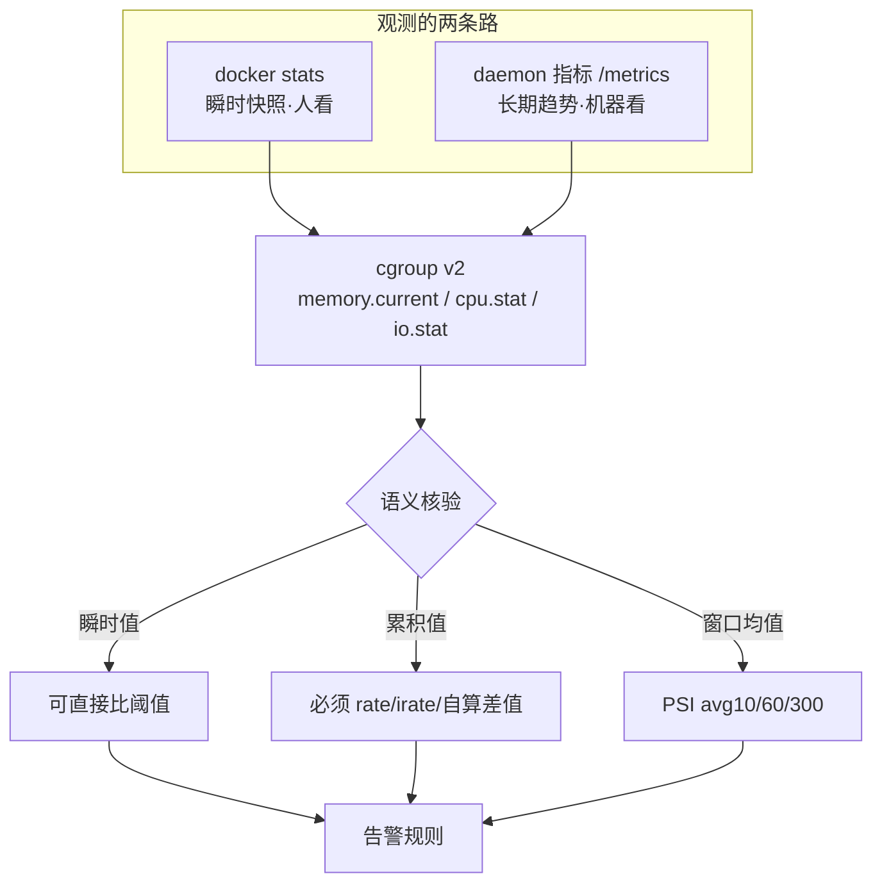
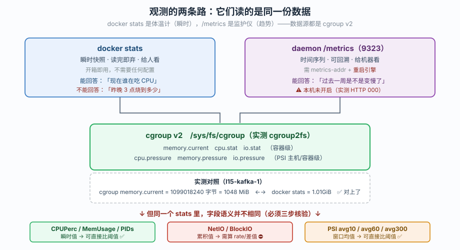
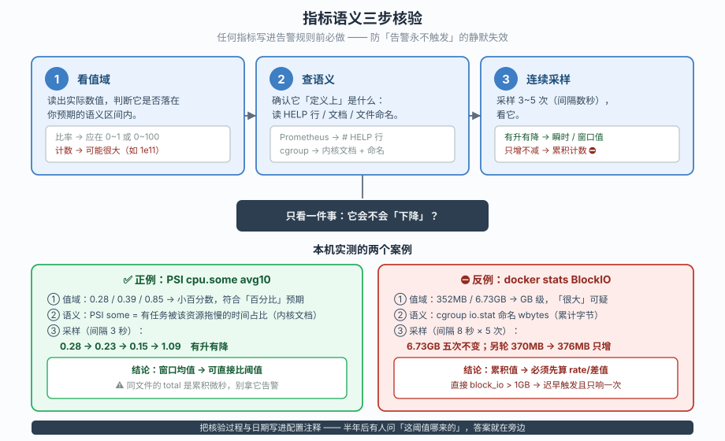
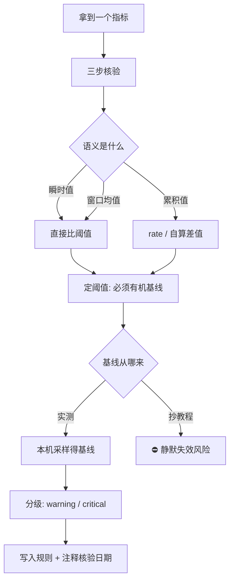
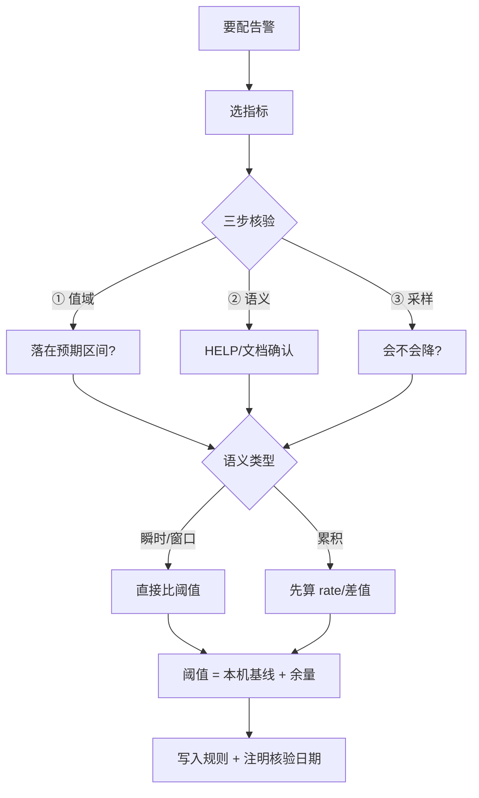

# 第 3 课：监控指标与告警

> 所属：子教程《运维专项》｜ 水平：入门（运维向） ｜ 本课知识点：daemon Prometheus 指标与 `docker stats` 的分工、指标语义三步核验、从指标到告警规则与阈值
> 故事情节：照抄教程配了 `MemPerc > 80%` 告警，结果**永不触发**——因为分母是主机的 31GB，不是容器的 2GB
> 📖 结论已按官方文档核对（核查于 2026-09-20 ｜ 来源：[dockerd 指标](https://docs.docker.com/engine/daemon/prometheus/) / [docker stats](https://docs.docker.com/reference/cli/docker/container/stats/) / [docker events](https://docs.docker.com/reference/cli/docker/system/events/) / [cgroup v2 PSI](https://docs.kernel.org/accounting/psi.html) / [资源限制](https://docs.docker.com/engine/containers/resource_constraints/)）
> 🟢 **本课结论均在本机实测**（WSL Ubuntu 24.04 / Docker Engine 29.4.1 / cgroup v2 / 20 核 31GB）

**前置提示**：本课需要课 1 的 daemon 配置视角（知道 `daemon.json` 在哪、改完怎么生效）。若还没看过，请先回看[课 1：守护进程与主机视角](lesson-01-守护进程与主机视角.md)。

> ⚠️ **本课的重要边界**：开启 Prometheus 指标（`metrics-addr`）需要**改 daemon 配置并重启引擎**，属改环境操作。本课**全部取证在只读状态下完成**——先用不开启指标的观测路径拿到真实数据，把"为什么要开指标"讲透；开启步骤会完整给出但**标注「不执行」**，等你点头再动。

## 🎯 本课目标

- 分清 **`docker stats`（瞬时快照）** 与 **daemon Prometheus 指标（长期趋势）** 的分工，不再用错工具
- 掌握 **指标语义三步核验**，能独立判断一个指标是"瞬时值"还是"累积计数"——**这是防"告警永不触发"的核心能力**
- 能写出**阈值有依据**的告警规则，而不是抄教程

## 📌 知识点导航

| 知识点 | 关键点 | 状态 |
|--------|--------|------|
| daemon Prometheus 指标与 `docker stats` 的分工 | 快照 vs 趋势 / 本机未开启指标时的替代路径 / cgroup v2 数据源 | ✅ 已完成 |
| 指标语义三步核验 | ① 看值域 ② 确认语义出处 ③ 连续采样判计数还是瞬时 / 两个正反案例 | ✅ 已完成 |
| 从指标到告警规则与阈值 | 可用信号清单 / 阈值必须有本机基线 / 告警分级 / OOMKilled 的语义陷阱 | ✅ 已完成 |

---

## 第一幕：起源与场景引入

课 2 之后，小杨把磁盘治理明白了。现在他想做告警——"容器内存超 80% 就告警"，这总该简单吧？

他照着教程写下第一条规则：

```promql
container_mem_perc > 80
```

配好之后等了一周，**一次都没触发**。他去查，发现这台机器上跑着 `l15-kafka-1`：

```bash
$ docker stats --no-stream --format '{{.Name}} {{.MemUsage}} {{.MemPerc}}' l15-kafka-1
l15-kafka-1 1.01GiB / 31.07GiB 3.25%
```

**3.25%**。

他懵了：容器明明用了 1GB，怎么才 3.25%？

答案藏在那个分母里——**`31.07GiB` 是主机的总内存，不是容器的上限**。因为这个容器**没设内存限制**（`Memory=0`），Docker 只好拿主机内存当分母。

> 📌 **这意味着**：只要这台 31GB 的机器上任何一个未限内存的容器想触发 `> 80%`，它得先吃掉 **25GB**。而真到那时候，整台机器早就 OOM 了。**这条告警在数学上几乎永不触发**——比配错阈值更危险，因为它是**静默失效**。

他决定换个思路：那我直接监控"容器内存用了多少 GB"总行吧？

```bash
$ docker stats --no-stream --format '{{.Name}} {{.BlockIO}} {{.NetIO}}' l15-kafka-1
l15-kafka-1 352MB / 6.73GB 1.5GB / 2.75GB
```

他连着采样了 5 次，每次间隔 8 秒：

```
第 1 次: 352MB / 6.73GB
第 2 次: 352MB / 6.73GB
第 3 次: 352MB / 6.73GB
第 4 次: 352MB / 6.73GB
第 5 次: 352MB / 6.73GB
```

**纹丝不动。** 一个正在跑的 Kafka 容器，5 次采样磁盘 IO 一点没变？

这不是 bug——**`BlockIO` 和 `NetIO` 是累积值**（从容器启动至今的总量），不是"当前速度"。想看速度得自己算差值。

> 🎬 **场景**：运维视角下的第三个真问题——**你以为你在看的指标，和你实际看到的，可能不是一回事**。而告警是按"你以为"配的。

---

> 📌 **一句话本质**：同一个 `docker stats` 里混着**两种语义**（CPU/内存是瞬时，NetIO/BlockIO 是累积）；不核验语义就配阈值，等于闭着眼睛设防线。
>
> ⚖️ **处境对照**：开发者关心"我的容器现在占多少"；运维必须关心"这个数字**代表什么**，以及**它会不会变**"。

## 第二幕：认知冲突

> ❓ **问题**：指标从哪来？怎么知道一个指标的真实语义？阈值该怎么定？

三层答案：

1. **指标的两个来源、两种用途** → daemon 指标与 `docker stats` 的分工（知识点 1）
2. **怎么验出一个指标到底是什么** → 三步核验（知识点 2）
3. **验明白之后怎么配告警** → 规则与阈值（知识点 3）

---

## 第三幕：层层揭示

### 一眼全局图



> 看图：**两条路，同一个数据源（cgroup）**。区别只在"谁来看、看多久"。

### 本课地图

| 知识点 | 回答什么问题 | 主线在哪提过 |
|--------|-------------|-------------|
| 1 · 指标来源与分工 | 指标从哪来、快照和趋势分别什么时候用 | 课 11 `docker stats`（容器级，未讲引擎级） |
| 2 · 三步核验 | 这个指标到底是瞬时还是累积 | （主线未涉及——方法论，本课正式落地） |
| 3 · 告警与阈值 | 验明白后怎么配、阈值凭什么定 | 课 10 资源限制、课 12 socket 风险 |

---

### 知识点 1：daemon Prometheus 指标与 `docker stats` 的分工

#### 🧩 图解



#### 一句话定义

`docker stats` 是**给人看的瞬时快照**（读完即弃），daemon 的 Prometheus 指标是**给机器存的长期趋势**（可回溯、可告警）；两者**数据源相同**（cgroup v2），差别在采集方式、保留时长和使用者。

#### 直觉建立（类比）

- **`docker stats`** 是**体温计**——夹一下，读出此刻的体温，拿走就没了。你无法回答"昨晚 3 点烧到多少度"。
- **Prometheus 指标** 是**住院监护仪**——24 小时连着，画成曲线。你能回答"昨天凌晨是不是烧过一次"。

想判断"现在是不是有问题"，体温计够用；想判断"这周是不是反复出问题"，必须有监护仪。

#### 核心原理

**本机现状：指标没开**

🟢 **实测**——先看引擎进程：

```bash
$ ps -eo pid,args | grep -i '[d]ockerd'
    266 /usr/bin/dockerd -H fd:// --containerd=/run/containerd/containerd.sock
```

参数里**没有 `metrics-addr`** → 未开启 Prometheus 指标。

```bash
$ ls -l /etc/docker/daemon.json
ls: cannot access '/etc/docker/daemon.json': No such file or directory

$ ss -lntp | grep -E ':2375|:2376|:9323'
（2375/2376/9323 均未监听）

$ curl -s -o /dev/null -w 'HTTP 状态码: %{http_code}\n' http://localhost:9323/metrics
HTTP 状态码: 000          # 000 = 连接被拒绝，端口未监听
```

> 与课 1 结论完全一致：`daemon.json` 不存在 → 无 `metrics-addr` → 9323 未监听。**本机是一台"零监控配置"的机器**——这恰好是本课最好的教学样本。

**开启后的样子（官方文档口径，本机未开启）**

```json
{
  "metrics-addr": "0.0.0.0:9323",
  "experimental": true
}
```

开启后指标形如（**官方文档示例，非本机输出**）：

```
# HELP engine_daemon_container_actions_seconds_total The number of seconds it takes to process each container action
# TYPE engine_daemon_container_actions_seconds_total histogram
engine_daemon_container_actions_seconds_total{action="changes"} 0
engine_daemon_container_actions_seconds_total{action="start"} 13.042
```

> ⚠️ **两个关键点**：
> ① `metrics-addr` 在较新版本需配合 `experimental: true`（**版本差异大，务必查你自己的版本文档**）。
> ② 监听 `0.0.0.0:9323` 会把引擎指标**暴露到网络上**——课 1 讲过 2375 的风险，9323 同理，**生产环境应只监听内网地址并加防火墙**（呼应课 5）。
> ③ 改完 `daemon.json` 需**重启引擎**才生效（课 1 知识点 1）。

**两个工具的分工**

| 维度 | `docker stats` | daemon Prometheus 指标 |
|------|---------------|----------------------|
| 看什么 | 容器 CPU/内存/网络/磁盘 IO | 引擎自身行为（容器动作耗时、镜像拉取、事件） |
| 时间维度 | **瞬时快照**（用完即弃） | **时间序列**（可回溯、算速率） |
| 谁看 | 人（排障现场） | 机器（告警系统） |
| 需要配置吗 | 不需要，开箱即用 | ⚠️ 需 `metrics-addr` + 重启引擎 |
| 数据源 | cgroup v2 | cgroup v2 + 引擎内部计数器 |
| 能回答 | "现在谁在吃 CPU" | "过去一周 start 动作是不是变慢了" |

> 📌 **重要边界**：daemon 的 `/metrics` **不提供每个容器的 CPU/内存指标**（那是 cAdvisor 或 `docker stats` 的活）。官方文档列的是 `engine_daemon_*` ——**引擎自己的健康度**，不是容器资源用量。
>
> **这是网上最常见的误解**：以为开了 `metrics-addr` 就能拿到容器 CPU 指标。拿不到。想监控容器资源，要么用 cAdvisor，要么自己从 cgroup 采。

**数据源：cgroup v2**

🟢 **实测**——`docker stats` 的数字到底从哪读的：

```bash
$ stat -fc %T /sys/fs/cgroup
cgroup2fs               # ← cgroup v2
$ cat /sys/fs/cgroup/cgroup.controllers
cpuset cpu io memory hugetlb pids rdma

$ cat /sys/fs/cgroup/system.slice/docker-985874a3....scope/memory.current
1099018240              # 字节 = 1048 MiB

$ docker stats --no-stream --format '{{.MemUsage}}' l15-kafka-1
1.01GiB / 31.07GiB      # ← 1048 MiB ≈ 1.01GiB，对上了
```

```bash
$ cat /sys/fs/cgroup/system.slice/docker-985874a3....scope/io.stat
8:32 rbytes=151318528 wbytes=495591424 rios=36943 wios=120994 dbytes=0 dios=0
8:48 rbytes=200884224 wbytes=6237802496 rios=10248 wios=3421982 dbytes=0 dios=0
```

> `wbytes=6237802496` = 6.24GB ≈ `docker stats` 报的 `BLOCK ... / 6.73GB`。**对上了**——`stats` 就是 cgroup 的搬运工。
>
> 📌 **注意 `rbytes`/`wbytes` 的命名**：这是**累计字节数**（total bytes），从名字里的"bytes"（不是"bytes_per_sec"）就能看出语义。**读懂命名是核验的第一步。**

**没有指标时的替代观测路径**（🟢 全部实测可用）

| 路径 | 实测 | 能拿到什么 |
|------|------|-----------|
| `docker events` | **9 条/5 秒** | 容器启停、exec、网络连接（实时事件流） |
| `docker stats` | 122 行 | 容器资源快照 |
| `docker inspect` | 可用 | `RestartCount` / `OOMKilled` / `Health` / `ExitCode` |
| **cgroup PSI** | 可用 | 主机与容器的 CPU/内存/IO **压力**（比 `free` 更适合告警） |
| `df` / `du` | 课 2 已用 | 磁盘 |
| `docker info` | 29.4.1 | 引擎状态 |

> **本课的教学策略**：正因为本机**没开**指标，我们才必须先学会用这些"土办法"取证——**先有数据，再谈要不要上 Prometheus**。顺序反了就会出现"为了监控而监控，指标一堆但没人看"。

#### 示例演示

🟢 **本机实测**（只读）：

**1）确认指标开没开**

```bash
$ ps -eo args | grep -i '[d]ockerd' | grep -o 'metrics-addr=[^ ]*' || echo '未开启'
未开启
$ curl -s -o /dev/null -w '%{http_code}\n' http://localhost:9323/metrics
000
```

**2）一次 `stats` 快照（看清有哪些字段）**

```bash
$ docker stats --no-stream --format '{{.Name}}\tCPU={{.CPUPerc}}\tMEM={{.MemUsage}}\tNET={{.NetIO}}\tBLOCK={{.BlockIO}}\tPIDS={{.PIDs}}'
k8s-c1-calico-worker	CPU=3.59%	MEM=444MiB / 31.07GiB	NET=2.13GB / 363MB	BLOCK=2.27GB / 3.3GB	PIDS=309
k8s-c1-calico-control-plane	CPU=18.29%	MEM=1.646GiB / 31.07GiB	NET=1.74GB / 4.21GB	BLOCK=2.62GB / 21.7GB	PIDS=1156
l15-kafka-1	CPU=1.75%	MEM=1.01GiB / 31.07GiB	NET=1.5GB / 2.75GB	BLOCK=352MB / 6.73GB	PIDS=166
```

**3）对照 cgroup 原始文件（验证数据源）**

```bash
$ cat /sys/fs/cgroup/system.slice/docker-985874a3....scope/memory.current
1099018240        # = 1048 MiB ≈ stats 报的 1.01GiB
$ cat /sys/fs/cgroup/system.slice/docker-985874a3....scope/memory.max
max               # ← 未设上限
```

**4）事件流（无需任何配置即可用）**

```bash
$ docker events --since 300s --until 1s --format '{{.Type}}|{{.Action}}' | sort | uniq -c | sort -rn | head -6
     68 container|exec_die
     40 container|exec_start: /bin/sh -c /opt/doris-ci/health_check.sh
     40 container|exec_create: /bin/sh -c /opt/doris-ci/health_check.sh
     13 network|disconnect
     13 container|start
     13 container|die
```

> **`container|die` 与 `container|start` 各 13 次**——近 5 分钟有 13 个容器经历了启停。这是**最该告警的信号之一**（服务在反复重启）。

#### 常见误区

| ❌ 误区 | ✅ 正解 |
|---------|--------|
| 开了 `metrics-addr` 就有容器 CPU/内存指标 | ⛔ `/metrics` 主要是 `engine_daemon_*`（**引擎自身**），容器资源要 cAdvisor 或自己采 cgroup |
| `docker stats` 能看历史趋势 | 不能，它是**瞬时快照**，读完即弃 |
| `MemPerc` 就是"容器内存占它的上限" | ⚠️ **未设限时分母是主机内存**（实测 `1.01GiB / 31.07GiB` → 3.25%） |
| `NetIO`/`BlockIO` 是当前速度 | ⛔ 是**累积总量**（实测 5 次采样不变） |
| 配了 `metrics-addr` 就安全 | 它监听网络端口，**暴露面风险同 2375**（呼应课 1 / 课 5） |
| 没开 Prometheus 就没法监控 | 错——`events`/`inspect`/PSI/`df` 全可用（本课实测） |

#### 一句话记住

**`stats` 是体温计（瞬时、给人看），`/metrics` 是监护仪（趋势、给机器看），两者都从 cgroup 取数——先分清用途，再决定开哪个。**

#### 官方文档

- [dockerd Prometheus 指标](https://docs.docker.com/engine/daemon/prometheus/) —— 开启方法与指标清单
- [docker stats](https://docs.docker.com/reference/cli/docker/container/stats/) —— 各字段含义
- [docker events](https://docs.docker.com/reference/cli/docker/system/events/) —— 事件类型与过滤

---

### 知识点 2：指标语义三步核验

> 📌 **本知识点是你（用户）跨课程固化的通用铁律，在此正式落地**。源自 Kafka 课的教训：照抄教程给 `RequestHandlerAvgIdlePercent` 配 `< 0.3` 告警，实测发现它是**累积计数**（量级 1e11），**告警永不触发**——比配错阈值更危险，因为静默失效。

#### 🧩 图解



#### 一句话定义

**任何指标写进告警规则前，必须做三步核验**：① 看实际值域是否落在预期语义区间 → ② 确认语义出处（HELP 行 / 内核文档 / cgroup 文件命名）→ ③ 连续采样 3~5 次，单调递增即计数、有升有降即瞬时值。

#### 直觉建立（类比）

拿到一个指标，就像拿到一瓶**没有标签的药剂**。

三步核验是**药剂师的三道检查**：
1. **看颜色/浓度**（值域）—— 这瓶东西的浓度，像不像你说的那个药？
2. **查配方手册**（语义出处）—— 官方写的这瓶到底是什么？
3. **做稳定性试验**（连续采样）—— 放一会儿，它是**越积越多**（累积量）还是**忽高忽低**（瞬时值）？

**跳过任何一步就开药方，等于拿病人试药。**告警规则就是药方——配错了，病来了它不响。

#### 核心原理

**三步分别做什么**

| 步骤 | 动作 | 要回答的问题 | 失败后果 |
|------|------|-------------|---------|
| ① **看值域** | 读出实际数值 | 它落在你预期的语义区间吗？（比率应 0~1 或 0~100，计数可能很大） | 把 1e11 的计数当比率 |
| ② **确认语义** | 读 HELP / 文档 / 文件命名 | 它**定义上**是什么？单位？累积还是瞬时？ | 望文生义（如把 IdlePercent 当比率） |
| ③ **连续采样** | 3~5 次，间隔数秒 | **单调递增 = 累积计数**；**有升有降 = 瞬时/窗口值** | 用累积值比阈值 → 告警永不触发 |

**正例：PSI 是窗口均值（可直接比阈值）**

🟢 **实测三步**：

```bash
# 步骤①：看值域
$ grep '^some' /sys/fs/cgroup/cpu.pressure
some avg10=0.28 avg60=0.39 avg300=0.85 total=11202468455
#      ↑ 0.28 / 0.39 / 0.85 —— 都是小百分数，符合"百分比"预期 ✅

# 步骤②：确认语义（PSI 无 HELP 行，靠内核文档）
#   some  = 至少有一个任务因该资源被拖慢的时间占比（0~100%）
#   avg10/60/300 = 10/60/300 秒滑动窗口均值（非累积）
#   total = 累计微秒（这个是累积，别拿它告警）

# 步骤③：连续采样 4 次
第 1 次 avg10=1.26
第 2 次 avg10=1.17
第 3 次 avg10=1.14
第 4 次 avg10=1.09
#   ↑ 有升有降 → 窗口均值，可直接比阈值 ✅
```

> **结论**：`cpu.pressure` 的 `some avg10` 可直接用于告警（如 `> 10` 持续 5 分钟）。
> ⚠️ 但同一文件里的 **`total` 是累积微秒**——**一个文件里混着两种语义**，只看字段名不看语义就会用错。

**反例：`docker stats` 的 NetIO/BlockIO 是累积值**

🟢 **实测三步**：

```bash
# 步骤①：看值域
$ docker stats --no-stream --format '{{.NetIO}} {{.BlockIO}}' l15-kafka-1
1.5GB / 2.75GB  352MB / 6.73GB
#   ↑ GB 级，且看起来"很大" —— 可疑，需核验

# 步骤②：确认语义（读 cgroup 原始文件命名）
$ cat /sys/fs/cgroup/.../io.stat
8:48 rbytes=200884224 wbytes=6237802496 ...
#   ↑ 命名是 rbytes/wbytes（累计字节），不是 bytes_per_sec ✅ 确认累积

# 步骤③：连续采样 5 次（间隔 8 秒）
第 1 次: 352MB / 6.73GB
第 2 次: 352MB / 6.73GB
第 3 次: 352MB / 6.73GB
第 4 次: 352MB / 6.73GB
第 5 次: 352MB / 6.73GB
#   ↑ 完全不变（不是"有升有降"）→ 累积值 ⛔ 不可直接比阈值
```

> ⚠️ **这里有个易错点**：累积值的表现是"**不变或单调增**"，不是"有升有降"。本例 Kafka 空闲时 5 次完全不变，正是累积量的特征（后面第四轮采样时因有写入，从 `370MB` 变成 `376MB`——**单向增长**，仍是累积）。
>
> **判据**：**只看它有没有"下降"**。有下降 = 瞬时/窗口值；从不下降 = 累积值。

🟢 **第四轮实测**（间隔 3 秒，捕捉到增长）：

```
第 1 次 BlockIO=370MB / 6.74GB
第 2 次 BlockIO=370MB / 6.74GB
第 3 次 BlockIO=370MB / 6.74GB
第 4 次 BlockIO=376MB / 6.74GB   ← 只增不减
```

> **结论**：`BlockIO`/`NetIO` 写进告警前**必须先算速率**（Prometheus 用 `rate()`，脚本用两次采样求差）。直接写 `block_io > 1GB` 是错的——它从容器启动就单调增长，**迟早会超过任何阈值，且只触发一次**。

**同一命令里两种语义混装**（本课最该记住的一条）

🟢 **实测**——同一条 `docker stats`，三个字段三种语义：

| 字段 | 3 次采样 | 语义 | 能否直接比阈值 |
|------|---------|------|--------------|
| `CPUPerc` | 1.43% → 1.61% → **23.34%** | 瞬时（区间均值） | ✅ 可以 |
| `MemUsage` | 1.01GiB → 1.01GiB → 1.01GiB | 瞬时 | ✅ 可以 |
| `PIDs` | 168 → **166** | 瞬时 | ✅ 可以 |
| `NetIO` | 1.5GB/2.75GB（不变） | **累积** | ⛔ 需算速率 |
| `BlockIO` | 352MB/6.73GB（不变） | **累积** | ⛔ 需算速率 |

> **这正是第一幕小杨踩坑的根源**：他看 `MemPerc` 是 3.25% 觉得"很健康"，看 `BlockIO` 是 6.73GB 觉得"很大"——**两个判断都错了**，因为都没核验语义。

**为什么必须连续 3~5 次**

- 采 **1 次**：看不出趋势，无法区分"稳定的累积值"和"稳定的瞬时值"
- 采 **2 次**：可能刚好碰到相等，误判
- 采 **3~5 次**：足以看清"是否有下降"，且成本可接受

#### 示例演示

🟢 **本机实测**：

**1）完整跑一遍三步（以 PSI 为例）**

```bash
$ grep '^some' /sys/fs/cgroup/cpu.pressure
some avg10=0.28 avg60=0.39 avg300=0.85 total=11202468455
$ sleep 3; grep '^some' /sys/fs/cgroup/cpu.pressure | awk '{print $2}'
avg10=0.23
$ sleep 3; grep '^some' /sys/fs/cgroup/cpu.pressure | awk '{print $2}'
avg10=0.15
# 0.28 → 0.23 → 0.15：有升有降 ✅ 窗口均值
```

**2）核验 BlockIO（反例）**

```bash
$ for i in 1 2 3 4 5; do docker stats --no-stream --format '{{.BlockIO}}' l15-kafka-1; sleep 8; done
352MB / 6.73GB
352MB / 6.73GB
352MB / 6.73GB
352MB / 6.73GB
352MB / 6.73GB
# 只增不减（或不增）⛔ 累积值
```

**3）核验 CPU（瞬时）**

```bash
$ for i in 1 2 3; do docker stats --no-stream --format '{{.CPUPerc}}' l15-kafka-1; sleep 5; done
1.43%
1.61%
23.34%
# 有升有降 ✅ 瞬时值
```

**4）把核验结果写成注释（推荐做法）**

```yaml
# cpu.pressure some avg10 —— 核验于 2026-09-20
#   ① 值域: 0.15~1.26（小百分数，符合百分比语义）✅
#   ② 语义: PSI some = 有任务被拖慢的时间占比（内核文档）✅
#   ③ 采样: 0.28→0.23→0.15 有升有降 → 窗口均值 ✅
#   结论: 可直接比阈值
- alert: HostCPUPressureHigh
  expr: cpu_pressure_some_avg10 > 10
  for: 5m
```

> 📌 **把核验过程和日期写进配置注释**——半年后有人问"这个阈值哪来的"，答案就在旁边。这是运维专业度的分水岭。

#### 常见误区

| ❌ 误区 | ✅ 正解 |
|---------|--------|
| 看指标名就知道语义 | ⛔ `IdlePercent` 可能是计数，`AvgIdle` 可能是累积——**必须核验** |
| 值"很大"就是有问题 | 累积值天然很大（6.73GB 是 18 天的总量），不代表有问题 |
| 值"很小"就是健康 | `MemPerc 3.25%` 是分母错了，不是真的健康 |
| 只看一次采样 | 必须 **3~5 次**，才有"是否下降"的证据 |
| 累积值不能用于告警 | 可以，但**必须先算速率**（`rate()` / 两次采样求差） |
| 同一个文件的字段语义相同 | ⛔ PSI 文件里 `avg10` 是窗口值、`total` 是累积值 |

#### 一句话记住

**三步核验：看值域 → 查语义 → 连采 3~5 次看会不会降；只增不减就是累积值，直接比阈值等于配了一条永不触发的告警。**

#### 官方文档

- [PSI - Pressure Stall Information](https://docs.kernel.org/accounting/psi.html) —— `some`/`full`/`avg` 的权威定义
- [Prometheus rate() 函数](https://prometheus.io/docs/prometheus/latest/querying/functions/#rate) —— 累积值转速率
- [cgroup v2 文档](https://docs.kernel.org/admin-guide/cgroup-v2.html) —— `io.stat` / `memory.current` 字段语义

---

### 知识点 3：从指标到告警规则与阈值

#### 🧩 图解



#### 一句话定义

告警规则的**阈值必须有本机实测基线作为依据**；按"**可用性 > 资源压力 > 容量**"的顺序分级，且每条规则要写清**核验时间与语义结论**。

#### 直觉建立（类比）

配告警像**给房子装烟雾报警器**：

- 阈值定 **太低**（炒菜就响）→ 天天误报 → 没人理 → **真着火时也被忽略**
- 阈值定 **太高**（烧穿屋顶才响）→ **静默失效**（课 2 / 本课第一幕的坑）

**基线就是"这房子正常做饭时的烟量是多少"**——不测这个，报警器的灵敏度只能是瞎猜。

#### 核心原理

**可用信号清单**（🟢 全部实测可用，无需开启 Prometheus）

| 类别 | 信号 | 实测获取方式 | 说明 |
|------|------|-------------|------|
| **可用性** | `die` / `start` 事件 | `docker events` | 近 5 分钟 **13 次**（服务反复重启） |
| | `RestartCount` | `docker inspect` | 实测抽样 40 个运行中容器**均为 0** |
| | `ExitCode` | `docker inspect` | 实测 `l11-prom=2`、`l11-app=1`、`gf-mini=1` |
| | `Health.Status` | `docker inspect` | ⚠️ 实测 **50 个里只有 1~3 个配了 healthcheck** |
| | `OOMKilled` | `docker inspect` | ⚠️ 实测 197 个中 **2 个 true**（见下方陷阱） |
| **资源压力** | CPU/MEM 快照 | `docker stats` | 瞬时值，可告警 |
| | **PSI `some avg10`** | `/sys/fs/cgroup/*.pressure` | **推荐**：比 `free`/load 更能反映真实卡顿 |
| | IO 速率 | 两次 `BlockIO` 求差 | 累积值，**必须算速率** |
| **容量** | 分区使用率 | `df`（课 2） | 实测 **24%** |
| | 日志大小 | `find ... *-json.log`（课 2） | 实测最大 **10660 MB** |

**主机基线（🟢 实测，2026-09-20）**

```bash
内存: 总=31819MB 可用=7910MB 使用率=75.1%
磁盘(/dev/sdd): 使用率=24% 可用=732GB
负载: 2.16 2.53 2.78 （20 核）
CPU 压力 some avg10: 1.08
容器: 总 197 / 运行 121 / 已停止 73
```

> 📌 **这些数字就是阈值的依据**。注意本机**内存使用率已达 75.1%**——如果照抄"内存 > 80% 告警"，这台机器**离触发只有 5 个点**，属于"配了就天天响"。合理做法是结合 PSI（当前 1.08，很低）判断：**内存占用高但无压力，不需要告警**。
>
> **这正是 PSI 优于 `free` 的地方**：`free` 说"用了 75%"很吓人，PSI 说"没有任务因内存被拖慢"——**后者才是对的**。

**告警分级建议**（阈值基于上述实测基线）

| 级别 | 指标 | 阈值 | 依据 | 动作 |
|------|------|------|------|------|
| 🔴 **P0 可用性** | 容器 `die` 且 `RestartCount` 增长 | 5 分钟 ≥ 3 次 | 实测基线：正常时抽样 40 个均为 0 | 立即查 |
| 🔴 **P0 可用性** | `Health.Status` = unhealthy | 持续 2 分钟 | 有 healthcheck 的容器 | 立即查 |
| 🟡 **P1 资源** | PSI `cpu.some avg10` | > 10 持续 5 分钟 | 实测 1.08，10 倍余量 | 排查谁在吃 CPU |
| 🟡 **P1 资源** | PSI `memory.some avg10` | > 5 持续 5 分钟 | 实测 0.00 | 排查内存压力 |
| 🟢 **P2 容量** | 分区使用率 | > 80% 警告 / > 90% 严重 | 课 2 实测 24% | 治理（课 2） |
| 🟢 **P2 容量** | 单个日志文件 | > 1GB | 课 2 实测最大 10.6GB | 查该容器 |

> ⚠️ **再次强调**：**上表阈值基于本机 20 核 31GB 的实测基线**。你的机器是多少核、多少内存、跑什么业务，就会有不同的基线。**照抄这些数字，等于重蹈 `RequestHandlerAvgIdlePercent` 的覆辙。**

**⚠️ `OOMKilled` 的语义陷阱**（本课最易误判的一条）

🟢 **实测**：

```bash
$ docker inspect --format 'Status={{.State.Status}} OOMKilled={{.State.OOMKilled}} RestartCount={{.RestartCount}} ExitCode={{.State.ExitCode}} MemoryLimit={{.HostConfig.Memory}}' k8s-c1-calico-worker2
Status=running OOMKilled=true RestartCount=0 ExitCode=0 MemoryLimit=0
```

**两个容器 `OOMKilled=true`，但它们 `running`、重启次数 0、退出码 0。**

这看起来自相矛盾。原因是** cgroup v2 下 `OOMKilled` 的语义与直觉不同**：

- 它可能表示**该 cgroup 内曾有进程被 OOM killer 杀掉**（哪怕容器主进程还活着、哪怕发生在很久以前）
- 它是**一个历史事件标记，不是当前状态**
- 且这两个容器 `MemoryLimit=0`（**未设内存上限**）——没有上限的容器谈"因超限被杀"本身就讲不通

> 📌 **正确用法**：`OOMKilled=true` 应该当作**"这里发生过 OOM，值得查一下"的线索**，而**不是**"这个容器现在挂了"的告警条件。
>
> 如果写成 `OOMKilled == true → 告警`，本机会**永久告警两个健康容器**——典型的误报。
>
> **这正是三步核验要防的第三类坑**：语义没错、值也没错，但**你理解的含义与它实际表达的含义不同**。

**健康检查覆盖率：本机最大的观测盲区**

🟢 **实测**：

```
50 个运行中容器抽样：
     49 none      ← 没有 healthcheck
      1 healthy
```

（第四轮扩大范围后确认有 healthcheck 的：`l12-renderer`、`doris-learn`、`docker-db-1`）

> **197 个容器里只有 3 个配了健康检查**——意味着 **194 个容器"进程活着但服务已废"时，Docker 完全不知道**。
>
> 这是比"指标没开"更严重的问题：**没有 healthcheck，就没有"服务级"可用性信号**，只能靠外部探测（HTTP 探活）或业务指标。
>
> 📌 **运维建议**：给关键容器加 `HEALTHCHECK`，是最低成本、最高收益的告警改进——**它不需要 Prometheus，Docker 自带**。

#### 示例演示

🟢 **本机实测**：

**1）找出反复重启的容器（最该告警的）**

```bash
$ docker events --since 300s --until 1s --format '{{.Type}}|{{.Action}}' | sort | uniq -c | sort -rn | head -4
     68 container|exec_die
     13 network|disconnect
     13 container|start
     13 container|die
# 近 5 分钟 13 次 start/die —— 有服务在反复重启
```

**2）查重启次数与 OOM（注意语义陷阱）**

```bash
$ docker inspect --format '{{.Name}} RestartCount={{.RestartCount}} OOMKilled={{.State.OOMKilled}}' k8s-c1-calico-worker2
/k8s-c1-calico-worker2 RestartCount=0 OOMKilled=true
# ⚠️ OOMKilled=true 但容器在跑、从未重启 → 是历史标记，不是"现在挂了"
```

**3）非 0 退出码的容器（已崩溃）**

```bash
l11-prom ExitCode=2
l11-app ExitCode=1
gf-mini ExitCode=1
```

**4）算 IO 速率（累积值 → 瞬时速率的正确用法）**

```bash
$ B1=$(docker stats --no-stream --format '{{.BlockIO}}' l15-kafka-1 | awk -F'/' '{print $2}')
$ sleep 10
$ B2=$(docker stats --no-stream --format '{{.BlockIO}}' l15-kafka-1 | awk -F'/' '{print $2}')
# 用 B2-B1 除以 10 得到每秒写入速率（注意单位换算：GB/MB/KB）
```

> 更稳妥的做法是直接读 cgroup 的 `io.stat` 取 `wbytes`，**字节数无单位歧义**：
> ```bash
> $ w1=$(awk '{for(i=1;i<=NF;i++) if($i ~ /^wbytes=/){split($i,a,"="); s+=a[2]}} END{print s}' /sys/fs/cgroup/.../io.stat)
> $ sleep 10
> $ w2=$(...同上...)
> $ echo "写入速率: $(( (w2-w1)/10 )) 字节/秒"
> ```

**5）用 PSI 判断"内存占用高但无压力"**

```bash
$ free -m | awk 'NR==2{printf "内存使用率=%.1f%%\n", ($3/$2)*100}'
内存使用率=75.1%        # 看起来很高
$ grep '^some' /sys/fs/cgroup/memory.pressure
some avg10=0.00 avg60=0.00 avg300=0.00
# ↑ 0.00 = 没有任何任务因内存被拖慢 → 实际很健康
```

> **结论**：**不要对 `free` 的使用率告警，要对 PSI 告警。** 这是本课最有实操价值的一条建议。

#### 常见误区

| ❌ 误区 | ✅ 正解 |
|---------|--------|
| 对 `free` 的内存使用率配 80% 告警 | ⛔ 本机实测 75.1% 但 PSI=0.00（无压力）；**应对 PSI 告警** |
| `OOMKilled=true` = 容器现在挂了 | ⚠️ 实测 2 个容器 true 但 `running`、重启 0 次——是**历史标记** |
| 阈值抄教程 | 阈值必须来自**本机基线**（本机 20 核 31GB，与教程环境不同） |
| 容器在跑就是健康 | ⚠️ 实测 197 个容器只有 3 个有 healthcheck，**"活着但已废"检测不到** |
| 告警越灵敏越好 | 太灵敏 → 天天响 → 被忽略（"狼来了"效应） |
| 配完规则就完事 | 要写**核验日期与语义结论**到注释，便于半年后回溯 |

#### 一句话记住

**阈值来自本机基线而非教程；`OOMKilled` 是历史线索不是当前状态；宁可对 PSI 告警，也别对 `free` 的使用率告警。**

#### 官方文档

- [HEALTHCHECK 指令](https://docs.docker.com/reference/dockerfile/#healthcheck) —— 服务级可用性信号
- [资源限制](https://docs.docker.com/engine/containers/resource_constraints/) —— 内存限制与 OOM 行为
- [重启策略](https://docs.docker.com/engine/containers/start-containers-automatically/) —— `RestartCount` 与策略

---

## 第四幕：实操验证

> **本机环境**：WSL Ubuntu 24.04 / Docker Engine 29.4.1 / cgroup v2（`cgroup2fs`）/ 20 核 31GB / 容器 197（运行 121）。
> **安全声明**：本课全部步骤**只读**。开启 `metrics-addr`（改 `daemon.json` + 重启引擎）标注「**不执行**」。

### 步骤 1：确认你这台机器的监控现状

```bash
ps -eo args | grep -i '[d]ockerd' | grep -o 'metrics-addr=[^ ]*' || echo '未开启 Prometheus 指标'
# 预期（本机）：未开启 Prometheus 指标
ls -l /etc/docker/daemon.json          # 预期（本机）：No such file or directory
curl -s -o /dev/null -w '%{http_code}\n' http://localhost:9323/metrics   # 预期（本机）：000
```

> **判据**：能说清你这台机器"指标开了没、从哪看出来的"。

### 步骤 2：跑一次 `stats` 快照，看清字段

```bash
docker stats --no-stream --format '{{.Name}}\tCPU={{.CPUPerc}}\tMEM={{.MemUsage}}\tNET={{.NetIO}}\tBLOCK={{.BlockIO}}\tPIDS={{.PIDs}}' | head -3
# 预期（本机）：k8s-c1-calico-control-plane CPU=18.29% MEM=1.646GiB/31.07GiB ...
```

> **判据**：注意到 `31.07GiB` 这个分母——**它是主机内存**。

### 步骤 3：三步核验之「看值域 + 查语义」

```bash
cat /sys/fs/cgroup/system.slice/docker-$(docker inspect -f '{{.Id}}' l15-kafka-1).scope/memory.current
# 预期（本机）：1099018240  ≈ 1048 MiB ≈ stats 报的 1.01GiB
cat /sys/fs/cgroup/system.slice/docker-$(docker inspect -f '{{.Id}}' l15-kafka-1).scope/memory.max
# 预期（本机）：max  ← 未设上限
```

> **判据**：能对照上 `stats` 与 cgroup 原始值，确认数据源一致。

### 步骤 4：三步核验之「连续采样」（本课核心动作）

```bash
# 4a. BlockIO（累积）—— 5 次采样应"只增不减"
for i in 1 2 3 4 5; do docker stats --no-stream --format '{{.BlockIO}}' l15-kafka-1; sleep 8; done
# 预期（本机）：352MB / 6.73GB ×5 次基本不变

# 4b. CPUPerc（瞬时）—— 3 次采样应"有升有降"
for i in 1 2 3; do docker stats --no-stream --format '{{.CPUPerc}}' l15-kafka-1; sleep 5; done
# 预期（本机）：1.43% → 1.61% → 23.34%

# 4c. PSI（窗口均值）—— 应有升有降
for i in 1 2 3; do grep '^some' /sys/fs/cgroup/cpu.pressure | awk '{print $2}'; sleep 3; done
# 预期（本机）：avg10=0.28 → 0.23 → 0.15
```

> **判据**：能说出每个字段"能不能直接比阈值"以及理由。这是本课最重要的动手能力。

### 步骤 5：建立你这台机器的基线

```bash
free -m | awk 'NR==2{printf "内存使用率=%.1f%%\n", ($3/$2)*100}'
df -P /var/lib/docker | tail -1 | awk '{print "磁盘使用率="$5}'
cat /proc/loadavg; nproc
grep '^some' /sys/fs/cgroup/cpu.pressure; grep '^some' /sys/fs/cgroup/memory.pressure
# 预期（本机）：内存 75.1% / 磁盘 24% / 负载 2.16（20核）/ cpu.some 1.08 / memory.some 0.00
```

> **判据**：把"内存 75.1% 但 PSI=0.00"这个矛盾解释清楚——**占用高 ≠ 有压力**。

### 步骤 6：盘点可用性与观测盲区

```bash
docker events --since 300s --until 1s --format '{{.Type}}|{{.Action}}' | sort | uniq -c | sort -rn | head -5
# 预期（本机）：exec_die 68 / start 13 / die 13

# 健康检查覆盖率
docker ps -q | while read c; do docker inspect -f '{{if .State.Health}}{{.State.Health.Status}}{{else}}none{{end}}' $c; done | sort | uniq -c
# 预期（本机）：49 none / 1 healthy（抽样 50）→ 覆盖率极低
```

> **判据**：能指出"没有 healthcheck"是这台机器最大的观测盲区。

### 步骤 7：不执行的部分（等授权后再做）

```bash
# ⛔ 以下属改环境/破坏性操作，本课不执行：
#   1) 写 daemon.json 加 metrics-addr（改引擎配置 + 需重启）
#   2) 重启 dockerd（会中断全部 121 个运行中容器）
#   3) 给容器补 HEALTHCHECK（需重建容器）
#   4) 给容器设 --memory 上限（需重建容器，且可能触发 OOM）
```

> 📌 **请示要点**：开启 `metrics-addr` 会①改 `daemon.json` ②重启引擎（**中断 121 个运行中容器**）③新增 9323 网络监听（暴露面）。**三件事都需要你点头**。
>
> 如果你同意，我可以：
> - 方案 A：只开指标、监听 `127.0.0.1:9323`（不外露，风险最低）
> - 方案 B：监听内网地址 + 配合课 5 的防火墙规则
> - 方案 C：**不开指标**，改用 cgroup + `events` 自建采集（零改动，本机已验证可用）

---

## 第五幕：体系收束

### 本课在运维体系中的位置


课 3 是**从"被动救火"转向"主动发现"的分水岭**：课 1、课 2 都是"出了问题怎么办"，课 3 是"怎么在出问题前知道"。

### 三个知识点的收束

| 知识点 | 一句话 | 落到哪 |
|--------|--------|--------|
| 指标来源与分工 | `stats` 是体温计、`/metrics` 是监护仪，都源自 cgroup | 选对工具 |
| 三步核验 | 看值域 → 查语义 → 连采 3~5 次看会不会降 | 不再配出"永不触发"的告警 |
| 告警与阈值 | 阈值来自本机基线；对 PSI 告警而非 `free` | 告警可信 |

### 与主线、与前两课的关系

- **与主线课 11**：主线教 `docker stats` / `events` / `inspect` **怎么看容器**；本课回答**这些数字是什么语义、能不能进告警、以及引擎层面还缺什么**。
- **与课 2 的闭环**：课 2 发现"日志 10.6GB 无人知晓" → 本课给出"怎么让它被自动发现"（日志大小告警 + `events` 事件流）。**课 2 是病灶，课 3 是体检。**
- **与课 1 的呼应**：课 1 讲 2375 的暴露面风险 → 本课指出 `metrics-addr` 的 9323 **有同样的风险**，且开启需重启引擎（**会中断 121 个容器**）。
- **与你的 Kafka 课**：三步核验这条铁律从 Kafka 的 JMX 指标迁移到 Docker 的 cgroup 指标——**方法论跨技术栈复用**，这正是它被固化为长期记忆的原因。

---

## 🐞 常见误区（本课汇总）

| # | 误区 | 正解 |
|---|------|------|
| 1 | 开 `metrics-addr` 就有容器 CPU 指标 | ⛔ `/metrics` 是 `engine_daemon_*`（引擎自身），容器资源要 cAdvisor |
| 2 | `MemPerc` = 占容器上限 | 未设限时分母是**主机内存**（实测 `1.01GiB/31.07GiB` → 3.25%） |
| 3 | `NetIO`/`BlockIO` 是当前速度 | ⛔ 累积总量（实测 5 次不变 / 只增不减） |
| 4 | 看指标名就知道语义 | 必须三步核验（`IdlePercent` 可能是计数） |
| 5 | 对 `free` 使用率配 80% 告警 | 实测 75.1% 但 PSI=0.00（无压力）；**应对 PSI 告警** |
| 6 | `OOMKilled=true` = 现在挂了 | 实测 2 个容器 true 却 `running`、重启 0 次——**历史标记** |
| 7 | 阈值抄教程 | 阈值必须来自**本机基线** |
| 8 | 容器在跑 = 健康 | 实测 197 个只有 3 个有 healthcheck |
| 9 | 采样一次就够 | 必须 3~5 次，才有"是否下降"的证据 |

## 一图总结



## 📋 命令速查卡

| 命令 | 用途 | 知识点 |
|------|------|--------|
| `ps -eo args \| grep '[d]ockerd' \| grep -o 'metrics-addr=[^ ]*'` | 指标开了没 | 1 |
| `curl -s -o /dev/null -w '%{http_code}\n' localhost:9323/metrics` | 探测指标端口（000=未开） | 1 |
| `docker stats --no-stream --format '{{.Name}} {{.CPUPerc}} {{.MemUsage}} {{.NetIO}} {{.BlockIO}} {{.PIDs}}'` | 一次快照，看全部字段 | 1 |
| `cat /sys/fs/cgroup/system.slice/docker-<ID>.scope/memory.current` | cgroup 原始内存值（对照 stats） | 1·2 |
| `cat /sys/fs/cgroup/system.slice/docker-<ID>.scope/memory.max` | 内存上限（`max`=未设限） | 1·3 |
| `cat /sys/fs/cgroup/system.slice/docker-<ID>.scope/io.stat` | `rbytes/wbytes`（**累积**字节） | 2 |
| `grep '^some' /sys/fs/cgroup/cpu.pressure` | **PSI CPU 压力**（推荐告警指标） | 2·3 |
| `grep '^some' /sys/fs/cgroup/memory.pressure` | PSI 内存压力 | 2·3 |
| `for i in 1 2 3 4 5; do docker stats --no-stream --format '{{.BlockIO}}' <n>; sleep 8; done` | **连续采样判累积/瞬时** | 2 |
| `docker events --since 300s --until 1s --format '{{.Type}}\|{{.Action}}' \| sort \| uniq -c \| sort -rn` | 事件分布（找反复重启） | 1·3 |
| `docker inspect -f '{{.RestartCount}} {{.State.OOMKilled}} {{.State.ExitCode}}' <n>` | 重启次数 / OOM / 退出码 | 3 |
| `docker inspect -f '{{if .State.Health}}{{.State.Health.Status}}{{else}}none{{end}}' <n>` | 健康检查状态 | 3 |
| `docker ps -q \| while read c; do docker inspect -f '{{if .State.Health}}...{{end}}' $c; done \| sort \| uniq -c` | **健康检查覆盖率** | 3 |
| `free -m \| awk 'NR==2{printf "%.1f%%\n", ($3/$2)*100}'` | 主机内存使用率（**不宜直接告警**） | 3 |
| `stat -fc %T /sys/fs/cgroup` | cgroup 版本（`cgroup2fs`=v2） | 1 |

## 课后小测

**1.（单选）`docker stats` 显示 `l15-kafka-1 1.01GiB / 31.07GiB 3.25%`，那个 `31.07GiB` 是什么？**
A. 该容器的内存上限
B. **主机总内存**（因该容器 `Memory=0` 未设限）
C. 该容器所在 cgroup 的软限制
D. Docker 默认的 32GB 上限

**2.（多选）三步核验包括哪三步？（选三项）**
A. 看实际值域是否落在预期语义区间
B. 确认语义出处（HELP 行 / 文档 / 文件命名）
C. 连续采样 3~5 次，看会不会下降
D. 把阈值抄进配置文件

**3.（单选）连续 5 次采样 `BlockIO` 都是 `352MB / 6.73GB`，说明它是？**
A. 瞬时值，可直接比阈值
B. **累积值**，需算速率后才能告警
C. 指标采集坏了
D. 容器没有 IO

**4.（判断）`docker inspect` 显示某容器 `OOMKilled=true`，说明它现在已经被 OOM 杀掉、处于停止状态。**
A. 正确
B. **错误**

**5.（单选）本机内存使用率 75.1%，但 PSI `memory.some avg10 = 0.00`。应该？**
A. 立即按 80% 阈值配内存告警
B. 扩容内存
C. **不告警**——占用高但无任务被拖慢，PSI 才是对的
D. 杀掉占内存的容器

**6.（简答）本课实测 197 个容器中只有 3 个配了 HEALTHCHECK，且未开启 Prometheus 指标。请说明：这会导致什么问题？在不改引擎配置的前提下，你能想到哪三种补救观测手段？**

<details>
<summary>答案</summary>

1. **B** —— 实测该容器 `HostConfig.Memory=0`（未设限），Docker 以主机内存 31.07GiB 作分母，故 `MemPerc` 仅 3.25%。**照抄 `MemPerc > 80%` 的告警几乎永不触发**。（知识点 1·3）
2. **A、B、C** —— D 恰恰是三步核验要防的行为。（知识点 2）
3. **B** —— 实测 5 次不变、后续观察到只增不减（`370MB → 376MB`），是累积值；写进告警前必须先算速率。（知识点 2）
4. **B** —— 实测 `k8s-c1-calico-worker2` 与 `k8s-c1-control-plane` 均为 `OOMKilled=true` 但 `Status=running`、`RestartCount=0`、`ExitCode=0`、`MemoryLimit=0`。cgroup v2 下它是**历史标记**（cgroup 内曾有进程被 OOM 杀），**不是当前状态**，直接告警会永久误报两个健康容器。（知识点 3）
5. **C** —— PSI `some` 表示"有任务因该资源被拖慢的时间占比"，0.00 说明**无实际压力**；Linux 会充分利用空闲内存做缓存，占用率高不等于有问题。**应对 PSI 告警，而非 `free` 使用率**。（知识点 3）
6. **问题**：①**"活着但已废"检测不到**——194 个容器进程在跑但服务可能已不可用，Docker 完全不知道（无 healthcheck 就无服务级信号）；②**无历史趋势**——`docker stats` 是瞬时快照，无法回答"昨晚 3 点是不是有问题"。
   **三种不改引擎配置的补救**（本课均已实测可用）：①**`docker events` 事件流**——监听 `die`/`start`，实测近 5 分钟 13 次启停，可发现反复重启；②**cgroup PSI 压力指标**——读 `/sys/fs/cgroup/*.pressure`，实测可用，比 `free` 更适合告警；③**外部主动探活**——对容器暴露的 HTTP 端口做定期探活（不依赖 Docker 自身）；（补充）④**`inspect` 轮询**——采集 `RestartCount`/`ExitCode`/`State.Status`，实测可拿到 `l11-prom ExitCode=2` 等崩溃信号。
   **最佳低成本改进**：给关键容器加 `HEALTHCHECK`——Docker 自带，**无需 Prometheus、无需改引擎配置**。（知识点 1·3）

</details>

## 🚀 下一批接力提示词

```
继续子教程《运维专项》课 4《备份恢复与迁移》，要求：
- 沿用本课体例：五幕结构 + 知识点六要素 + 第四幕实操 + 速查卡 + 小测 + 导航
- 承接本课实测基线：Docker 29.4.1 / cgroup v2 / 197 容器（121 运行）/ volumes 44G
  （11G 卷被 doris-mysql-demo 引用）/ 分区 /dev/sdd 使用率 24%
- 覆盖三个知识点：卷备份与数据库一致性（快照 vs 逻辑导出）、镜像与 registry 迁移（save/load vs 仓库对拷）、整机搬迁与恢复演练
- 必须强调「恢复演练」：备份没验证过等于没备份
- 与主线课 7 volume tar 套路、课 13 save/load 划清边界（主线讲命令，这里讲一致性与演练）
- 全部结论本机实测；涉及真实备份/恢复/停容器属破坏性操作，须标注「不执行」并说明
```

## 🧭 课程导航

- ⬅️ **上一课**：[课 2：磁盘与空间治理](lesson-02-磁盘与空间治理.md)
- ➡️ **下一课**：课 4《备份恢复与迁移》（未编写）
- 🏠 **子教程大纲**：[运维专项 overview](../overview.md)
- 📖 **主线目录**：[02-课程目录.md](../../../02-课程目录.md)
- 🆘 **急救**：[09-排障速查手册](../../../09-排障速查手册.md)（按症状倒查）
