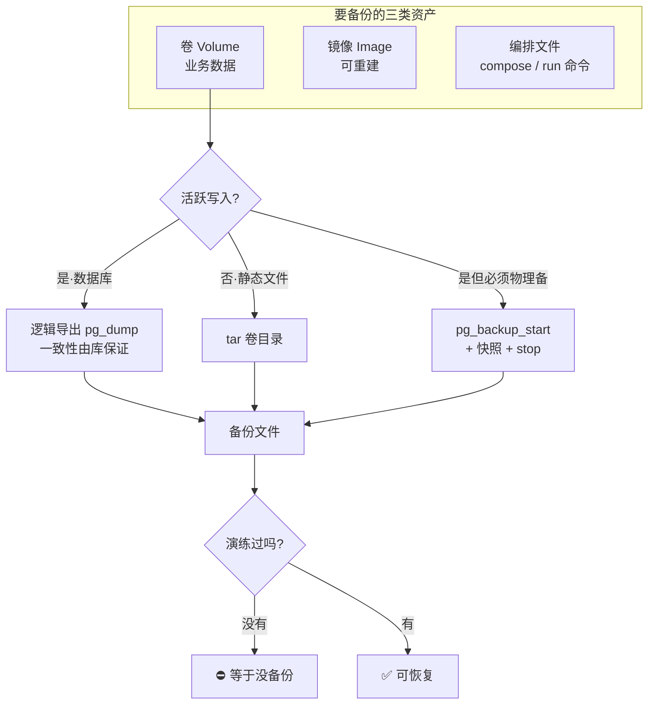
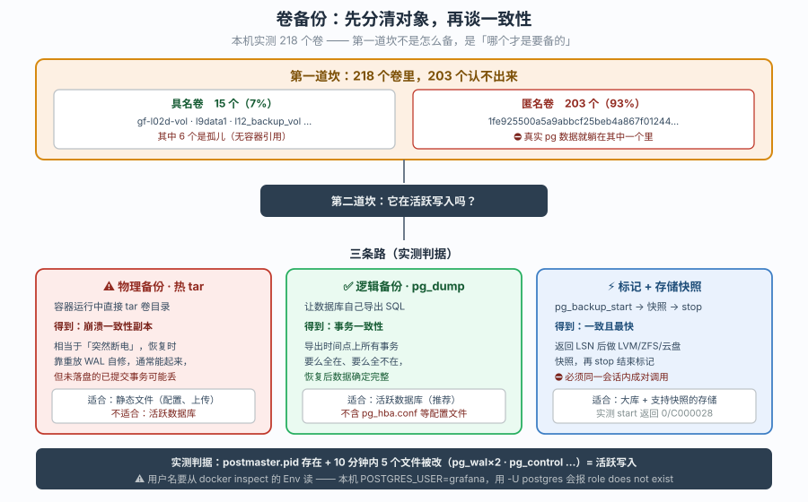
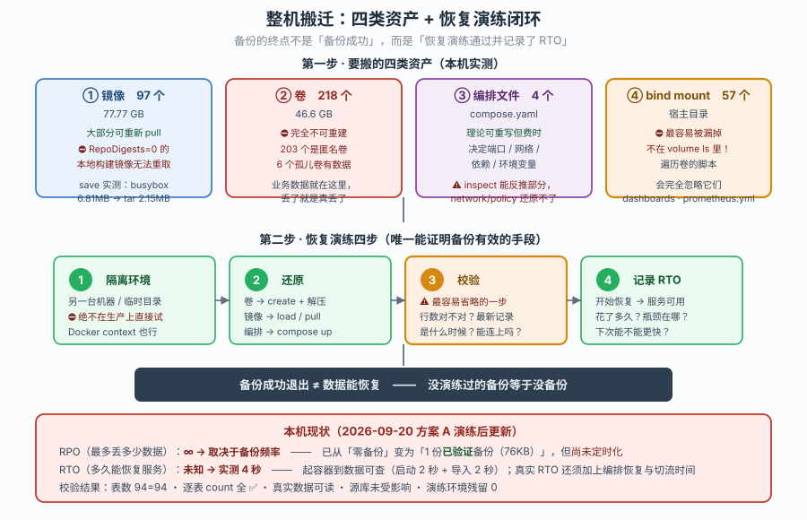
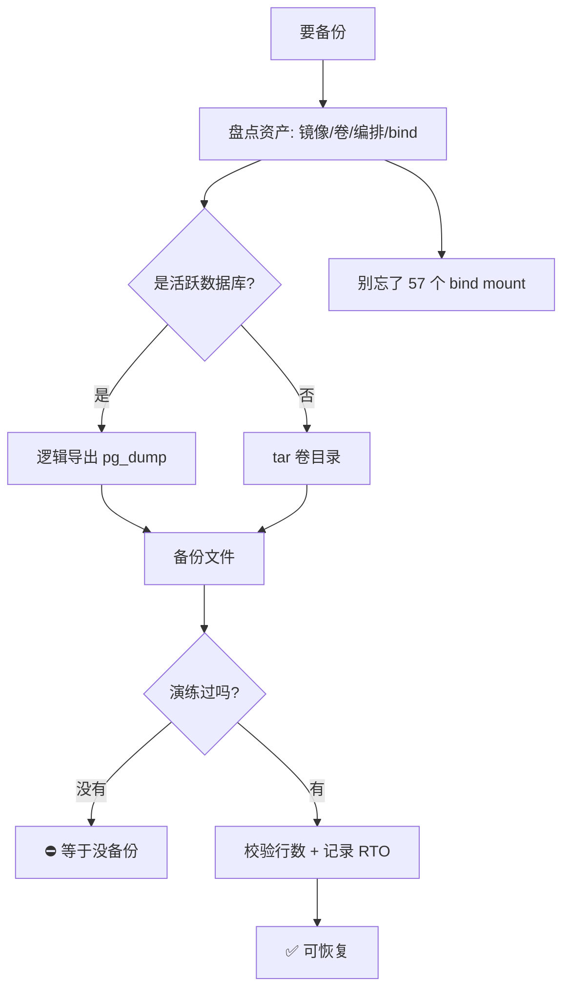

# 第 4 课：备份恢复与迁移

> 所属：子教程《运维专项》｜ 水平：入门（运维向） ｜ 本课知识点：卷备份与数据库一致性、镜像与 registry 迁移、整机搬迁与恢复演练
> 故事情节：卷备份做了半年，真要恢复那天才发现——**218 个卷里 203 个是匿名卷，压根不知道哪个是哪个**
> 📖 结论已按官方文档核对（核查于 2026-09-20 ｜ 来源：[Volumes 备份](https://docs.docker.com/engine/storage/volumes/) / [docker save](https://docs.docker.com/reference/cli/docker/image/save/) / [docker load](https://docs.docker.com/reference/cli/docker/image/load/) / [PostgreSQL 连续归档](https://www.postgresql.org/docs/16/continuous-archiving.html)）
> 🟢 **本课结论均在本机实测**（WSL Ubuntu 24.04 / Docker Engine 29.4.1 / cgroup v2 / 20 核 31GB）

**前置提示**：本课需要课 1 的 daemon 视角与课 2 的磁盘视角（知道卷在哪、占多少）。若还没看过，请先回看[课 2：磁盘与空间治理](lesson-02-磁盘与空间治理.md)。

> ⚠️ **本课的重要边界**：备份/恢复/停容器/删卷属**破坏性操作**。取证阶段**全部在只读状态下完成**；需要写操作的部分一律先标注「**不执行**」等你点头。
> ✅ **经你授权，方案 A 已真实执行**（导出 76KB → 隔离恢复 → 逐表 diff 全通过 → 环境已清理、源库未受影响）。**停容器、删卷、镜像 `save`、整机搬迁等仍属未执行**，见第四幕步骤 7。
>
> 📌 **如实声明**：取证过程中为验证"热备份标记函数是否可用"，我在 `l12-pg` 上执行了 `pg_backup_start()` 并立即 `pg_backup_stop()`。这会让 PostgreSQL 短暂进入备份模式并**强制一次检查点**，随后立即退出（第二次调用返回 `backup is not in progress` 即已退出）。**该操作未导出、未复制、未修改任何业务数据**，但属于对运行中数据库的一次真实写入触发，在此如实记录。
>
> ✅ **课后经你授权，方案 A 已真实执行**：`pg_dump` 导出 76KB → 隔离容器导入 → 逐表 diff 校验全通过 → 演练环境已清理、源库未受影响。完整记录见[《备份演练实录》](lesson-04-备份演练实录.md)，第四幕步骤 7 同步更新。

## 🎯 本课目标

- 分清 **物理备份（卷/目录）** 与 **逻辑备份（数据库导出）** 的适用场景，知道**什么时候 tar 是不够的**
- 掌握 **`save`/`load` 与 registry 对拷**的取舍，能估算迁移成本
- 建立 **"备份没演练过等于没备份"** 的意识，能写出可执行的恢复演练流程

## 📌 知识点导航

| 知识点 | 关键点 | 状态 |
|--------|--------|------|
| 卷备份与数据库一致性 | 物理 vs 逻辑 / 活跃写入下 tar 的风险 / 具名卷与匿名卷 / 孤儿卷 | ✅ 已完成 |
| 镜像与 registry 迁移 | `save`/`load` vs 仓库对拷 / `save` 产物量级 / 本地构建镜像无 digest | ✅ 已完成 |
| 整机搬迁与恢复演练 | 四类资产清单 / bind mount 易漏 / 恢复演练四步 / RPO·RTO | ✅ 已完成 |

---

## 第一幕：起源与场景引入

课 3 之后，小杨把告警配好了。现在老板问他："**咱们的数据能恢复吗？**"

他很有底气——他每周都在跑备份：

```bash
docker run --rm -v pgdata:/from alpine tar czf - -C /from . > /backup/pgdata-$(date +%F).tar.gz
```

> 📌 **说明**：上面这条命令与 `pgdata`、`/backup/` 都是**故事情节里的虚构示例**（你这台机器上没有名为 `pgdata` 的卷，也没有 `/backup/` 目录）。它代表网上最流行的卷备份写法，**本课第四幕会给出现机可跑的真实命令**。这里先借它看清问题出在哪。

半年下来攒了 26 个 tar.gz。

直到那天真的要恢复。他打开备份目录，然后愣住了：

```bash
$ docker volume ls -q | wc -l
218
```

**218 个卷。** 他一个个数过去：

```
0a045ecd7e5bde4a4fb6a2b50e7f19a134813f6faf86f58ea7799bd2aea25e3e
0a67a32d90352dd5e957f2b39abecf75c6ee4388d8c9d3465a1ae57846c609de
0aaccb282aa9163d26b84ef5ba11b429dfa4ebd6a92e38764b938608e62f0b5d
...
```

**203 个是 64 位哈希名的匿名卷。** 只有 15 个有名字：

```
gf-l02d-vol    l9data1    l9data2    l12_backup_vol    ...    prom_data
```

他的备份脚本里写的是 `pgdata`——**这个卷根本不在那 15 个里**。因为当初创建容器时没写 `-v pgdata:/var/lib/postgresql/data`，Docker 自动建了个匿名卷，名字是那串哈希。

> 📌 **这意味着**：他备份的 `pgdata` 卷**可能从来就不存在**（或者指向一个空卷），而真正装着 PostgreSQL 数据的匿名卷 `1fe9255...` **一次都没被备份过**。
>
> 🟢 **实测**——`l12-pg` 实际用的是哪个卷：
> ```bash
> $ docker inspect --format '{{range .Mounts}}{{.Name}}{{end}}' l12-pg
> 1fe925500a5a9abbcf25beb4a867f01244dc430ecfaea5d597ce3f160a5ead04
> ```
> 一个匿名卷。数据 82MB，里面是 94 张表的 Grafana 数据库。

他接着发现了第二个问题。他打算"趁备份前先看看数据在不在"，于是挂上去 `ls`：

```bash
$ cat /var/lib/docker/volumes/1fe9255.../_data/postmaster.pid
1
/var/lib/postgresql/data
1788751536
```

`postmaster.pid` 存在——**数据库正在运行**。他再查最近 10 分钟有没有文件被改：

```bash
$ find /var/lib/docker/volumes/1fe9255.../_data -maxdepth 2 -newermt '-10 minutes' -type f
.../pg_xact/0000
.../pg_logical/replorigin_checkpoint
.../pg_wal/00000001000000000000000C
.../pg_wal/00000001000000000000000D
.../global/pg_control          ← 这个最关键
```

**5 个文件在最近 10 分钟内被修改过**，包括 `global/pg_control`（控制文件）和两个 WAL 段。

> 🎬 **场景**：运维视角下的第四个真问题——**你的备份脚本一直在成功退出，但它备份的东西可能从来就不是你要恢复的那个**；而且即使备份对了对象，**在数据库活跃写入时 tar 出来的文件，恢复后可能起不来**。

---

> 📌 **一句话本质**：备份的有效性取决于三件事——**备份对了对象没有**、**备份时数据是否处于一致状态**、**恢复流程有没有被真正跑过**。三者缺一，备份就是心理安慰。
>
> ⚖️ **处境对照**：开发者关心"我的数据会不会丢"；运维必须关心"**丢了之后我能不能在 RTO 内恢复回来，以及我上一次验证这件事是什么时候**"。

## 第二幕：认知冲突

> ❓ **问题**：怎么备份才是对的？备份和系统之间到底是什么关系？怎么证明备份能用？

三层答案：

1. **物理与逻辑的取舍、一致性的来源** → 卷备份与数据库一致性（知识点 1）
2. **镜像怎么搬** → 迁移的两种方式（知识点 2）
3. **整机怎么搬、怎么证明能恢复** → 搬迁清单与恢复演练（知识点 3）

---

## 第三幕：层层揭示

### 一眼全局图



> 看图：**判断分支在"是不是活跃写入的数据库"**，终点在"有没有演练过"。

### 本课地图

| 知识点 | 回答什么问题 | 主线在哪提过 |
|--------|-------------|-------------|
| 1 · 卷备份与一致性 | 卷怎么备、数据库活跃时 tar 有什么风险 | 课 7（volume tar 套路，未讲一致性） |
| 2 · 镜像与 registry 迁移 | 镜像怎么搬、save 有多大 | 课 13（`save`/`load` 在速查卡） |
| 3 · 整机搬迁与恢复演练 | 搬迁要带什么、怎么证明能恢复 | （主线未涉及） |

---

### 知识点 1：卷备份与数据库一致性

#### 🧩 图解



#### 一句话定义

**物理备份**复制数据目录本身（卷/文件），快但不保证一致性；**逻辑备份**让数据库自己导出 SQL，慢但一致性由数据库保证。**数据库在活跃写入时，直接 tar 数据目录得到的是"崩溃状态"的副本**——能恢复，但启动时要走崩溃恢复，且可能丢最后几秒的提交。

#### 直觉建立（类比）

- **物理备份** = **给正在写字的笔记本拍照**。快，但你拍到的可能是"一个字写了一半"的瞬间。
- **逻辑备份** = **让写字的人把内容重新念一遍、你边听边记**。慢，但念出来的一定是完整的句子。

**关键区别**：拍照（物理）不打断写字的人，但你拿到的是某一瞬间的画面；念一遍（逻辑）会让对方处在"一个完整的事务边界"上。

#### 核心原理

**第一步：先搞清楚你这台机器到底有哪些卷**

🟢 **实测**——这是本课最重要的一个数字：

```bash
$ docker volume ls -q | wc -l
218
```

**218 个卷，但只有 15 个是具名卷：**

```
具名卷（15 个）：
  gf-l02d-vol                      52M     引用=[gf-l02d]
  l9data1                          57M     引用=[l9-thanos-sc-1, l9-prom-1]
  l9data2                          57M     引用=[l9-thanos-sc-2, l9-prom-2]
  l12_backup_vol                   8.4M    引用=[]          ← 孤儿
  l12_clean_vol                    440K    引用=[vm-clean-test]
  l12_delrecover_vol               7.9M    引用=[vm-delrecover-test]
  l12_dr_backup_vol                148K    引用=[]          ← 孤儿
  l12_dr_r2_vol                    92K     引用=[]          ← 孤儿
  l12_dr_restore_vol               264K    引用=[vm-dr-restored]
  l12_dr_src_vol                   124K    引用=[]          ← 孤儿
  l12_restore_vol                  7.5M    引用=[vm-restore-test]
  l12_s3restore_vol                7.5M    引用=[vm-s3restore-test]
  l12_stale_vol                    276K    引用=[vm-stale-test]
  prom_data                        4.0K    引用=[]          ← 空卷+孤儿
  victoriametrics_capstone_data    4.0K    引用=[]          ← 空卷+孤儿

匿名卷（203 个）：64 位哈希名
```

> 📌 **两个必须记住的事实**：
> ① **93% 的卷是匿名卷**——它们的名字是哈希，你**无法从名字判断里面装的是什么**。
> ② **15 个具名卷里有 6 个是"孤儿"**（无任何容器引用），其中 `prom_data` 和 `victoriametrics_capstone_data` 是 **4.0K 空卷**。

**匿名卷是怎么来的**：`docker run` 时镜像声明了 `VOLUME`，或用了 `-v /path` 只写容器路径不写卷名——Docker 自动创建匿名卷。**没人给它起名，也就没人能按名备份它。**

🟢 **实测**——匿名卷的在用在弃：

```
抽样 60 个匿名卷：在用 26 个 / 孤儿 34 个
有数据的孤儿卷（部分）：
  0aaccb282aa9  5.4M      0ed3632db1fc  46M
  0df1c9b3d090  1.3M      0a67a32d9035  12K
```

> ⚠️ **孤儿卷是备份最危险的一类**：它有数据（46MB 那个呢？），但**没有任何容器引用它**，所以：
> - 备份脚本按"容器→卷"遍历时会**漏掉它**
> - `docker volume prune` 一跑就**永久删除**
> - 半年后没人记得它装的是什么

**第二步：判断是不是"活跃写入的数据库"**

🟢 **实测**——以本机真实的 `l12-pg`（PostgreSQL 16.15）为例：

```bash
$ docker inspect --format '{{.Config.Image}} {{.State.Status}}' l12-pg
postgres:16-alpine running

# 它用的是哪个卷（匿名！）
$ docker inspect --format '{{range .Mounts}}{{.Name}}{{end}}' l12-pg
1fe925500a5a9abbcf25beb4a867f01244dc430ecfaea5d597ce3f160a5ead04

# 数据目录在活跃写入吗？
$ cat /var/lib/docker/volumes/1fe9255.../_data/postmaster.pid
1
/var/lib/postgresql/data
1788751536

$ find /var/lib/docker/volumes/1fe9255.../_data -maxdepth 2 -newermt '-10 minutes' -type f
.../pg_xact/0000
.../pg_logical/replorigin_checkpoint
.../pg_wal/00000001000000000000000C
.../pg_wal/00000001000000000000000D
.../global/pg_control
```

> **判据**：`postmaster.pid` 存在 = 数据库在运行；`pg_wal` 段与 `global/pg_control` 在 10 分钟内被改 = **正在活跃写入**。
>
> 这种情况下 `tar` 卷目录，得到的是一个"**数据库运行到一半**"的副本。

**第三步：三种备份方式怎么选**

| 方式 | 怎么做 | 一致性 | 速度 | 适合 |
|------|--------|--------|------|------|
| **tar 卷目录**（物理·冷） | 先停容器再 tar | ✅ 完全一致 | 快 | 可停机的服务 |
| **tar 卷目录**（物理·热） | 容器运行中 tar | ⚠️ **崩溃一致性** | 快 | 静态文件（配置、上传目录） |
| **`pg_dump`**（逻辑） | 让数据库导出 SQL | ✅ **事务一致** | 慢 | **活跃数据库** |
| **`pg_backup_start` + 快照** | 标记后做存储快照 | ✅ 一致 | 最快 | 大库 + 支持快照的存储 |

> 📌 **崩溃一致性 vs 事务一致性**：
> - **崩溃一致性**（热 tar）：相当于"突然断电"。PostgreSQL 恢复时**会**重放 WAL 自行修复，**通常能起来**——但你备份那一刻**未落盘的已提交事务可能丢失**。
> - **事务一致性**（`pg_dump`）：导出的时间点上，所有事务要么全在要么全不在。**恢复后数据确定是完整的。**

**逻辑备份的实测证据**

🟢 **实测**——`pg_dump` 在本机可用：

```bash
$ docker exec l12-pg which pg_dump
/usr/local/bin/pg_dump
$ docker exec l12-pg pg_dump --version
pg_dump (PostgreSQL) 16.15
```

🟢 **实测**——数据库真实内容（只读查询）：

```bash
$ docker exec l12-pg psql -U grafana -d grafana -c 'select version();'
 PostgreSQL 16.15 on x86_64-pc-linux-musl, compiled by gcc (Alpine 15.2.0) 15.2.0, 64-bit

$ docker exec l12-pg psql -U grafana -d grafana -c '\l'
    Name    |  Owner  | Encoding | Locale Provider |  Collate   |   Ctype
------------+---------+----------+-----------------+------------+------------
 gf_restore | grafana | UTF8     | libc            | en_US.utf8 | en_US.utf8
 grafana    | grafana | UTF8     | libc            | en_US.utf8 | en_US.utf8
 postgres   | grafana | UTF8     | libc            | en_US.utf8 | en_US.utf8
 template0  | grafana | UTF8     | libc            | en_US.utf8 | en_US.utf8
 template1  | grafana | UTF8     | libc            | en_US.utf8 | en_US.utf8

$ docker exec l12-pg psql -U grafana -d grafana -c "select count(*) from information_schema.tables where table_schema='public';"
 table_count
-------------
          94
```

> ⚠️ **一个真实踩坑**：第一次连用的是 `psql -U postgres`，报错：
> ```
> FATAL:  role "postgres" does not exist
> ```
> 因为容器创建时指定了 `POSTGRES_USER=grafana`（`docker inspect` 里能看到），**默认角色不是 `postgres`**。
>
> 📌 **教训**：**备份脚本里的用户名要从 `docker inspect` 的 `Env` 里读，不能想当然。**写错用户名的备份脚本会静默失败或备份到错的库。

**热备份标记：成对调用是硬要求**

🟢 **实测**：

```bash
$ docker exec l12-pg psql -U grafana -d grafana -c "select pg_backup_start('probe');"
 pg_backup_start
-----------------
 0/C000028              ← 返回起始 LSN

$ docker exec l12-pg psql -U grafana -d grafana -c "select pg_backup_stop();"
ERROR:  backup is not in progress
HINT:  Did you call pg_backup_start()?
```

> 📌 **这次"失败"恰好证明了两件事**：
> ① `pg_backup_start()` 返回了 LSN `0/C000028`，说明**函数可用**。
> ② 第二次调用报 `backup is not in progress`——说明**第一个会话结束后备份模式就退出了**（因为 `psql -c` 每次是独立会话，连接断开即结束）。
>
> ⚠️ **这是真实会踩的坑**：`pg_backup_start()` 在**独占会话**里才持续有效。用 `psql -c` 分开调用两次，**第二次必然失败**。正确做法是在**同一个会话**里 `start` → 做快照 → `stop`。
>
> ```bash
> # 正确：同一个 psql 会话
> docker exec l12-pg psql -U grafana -d grafana <<'SQL'
> select pg_backup_start('nightly');
> -- 此处由外部做存储快照（LVM/ZFS/云盘快照）
> select pg_backup_stop();
> SQL
> ```

**推荐做法：定时任务里的标准姿势**

```bash
# 逻辑备份（推荐给活跃数据库 —— 本机已真实执行，见演练实录）
docker exec l12-pg pg_dump -U grafana -d grafana \
  --format=custom --no-owner --no-acl | gzip > /backup/grafana-$(date +%F).sql.gz
```

> 🟢 **本机已实测并执行**（2026-09-20，用户授权）：产物 **76KB**，耗时 **1 秒**，导出后源库 `permission` 仍返回 794 行——**不锁表**。
> 📌 **82MB 物理目录 → 76KB 逻辑导出，相差约 1000 倍**：因为 82MB 里绝大部分是 WAL 段与索引膨胀，真实业务数据仅 0.27MB。完整命令与校验见[《备份演练实录》](lesson-04-备份演练实录.md)。

> ⚠️ **三个必须注意的点**：
> ① **不要用 `docker exec -it`**（无 TTY 环境会挂）——定时任务里用不带 `-t` 的 `docker exec`。
> ② **密码不要写进命令行**（`ps` 能看见、会进 shell history）——用 `PGPASSWORD` 环境变量或 `~/.pgpass`。
> ③ **gzip 放在管道下游**，避免落盘一个巨大的中间文件。

#### 示例演示

🟢 **本机实测**（只读，不产生备份）：

**1）盘点你的卷（先搞清楚要备什么）**

```bash
$ docker volume ls -q | wc -l
218
$ docker volume ls -q | grep -vE '^[0-9a-f]{64}$'    # 只看具名卷
gf-l02d-vol
l9data1
l9data2
...
```

**2）找出孤儿卷（有数据但没人引用）**

```bash
$ for v in $(docker volume ls -q); do
    n=$(docker ps -a --filter volume="$v" -q | wc -l)
    [ "$n" -eq 0 ] && echo "孤儿: ${v:0:12} $(du -sh $(docker volume inspect -f '{{.Mountpoint}}' $v) | awk '{print $1}')"
  done | head -5
孤儿: 0a67a32d9035 12K
孤儿: 0aaccb282aa9 5.4M
孤儿: 0d7a4d3103c6 96K
```

**3）判断数据库是否在活跃写入**

```bash
$ cat /var/lib/docker/volumes/1fe9255.../_data/postmaster.pid
1
/var/lib/postgresql/data
1788751536
$ find /var/lib/docker/volumes/1fe9255.../_data -maxdepth 2 -newermt '-10 minutes' -type f | wc -l
5
```

**4）验证恢复套路可行（临时容器只读挂载）**

```bash
$ docker run --rm -v 1fe9255...:/pg:ro busybox ls /pg
PG_VERSION
base
global
pg_commit_ts
pg_dynshmem
pg_hba.conf
pg_ident.conf
pg_logical
```

> 能列出 = **恢复时可用同样方式校验备份内容**。这也是"演练"的最小动作。

#### 常见误区

| ❌ 误区 | ✅ 正解 |
|---------|--------|
| 卷少所以好备份 | 本机 **218 个卷，203 个匿名**，名字是哈希，你不知道里面是什么 |
| 匿名卷不用管 | ⚠️ 实测 `l12-pg` 的真实数据就躺在匿名卷里 |
| 孤儿卷是垃圾可以删 | 它可能有 46MB 真数据，且**备份脚本会漏掉它** |
| 运行中 tar 数据库目录是安全的 | ⚠️ 得到"崩溃一致性"副本，可能丢未落盘的已提交事务 |
| `pg_dump` 和 tar 备一个就行 | 逻辑备份**不含**配置文件（`pg_hba.conf` 等），两者要互补 |
| `psql -U postgres` 总能用 | 实测报 `role "postgres" does not exist`——用户名要从 `Env` 读 |
| `pg_backup_start` 和 `stop` 分开两次调用 | ⛔ 必须**同一会话**，否则第二次报 `backup is not in progress` |

#### 一句话记住

**先查清卷是具名还是匿名（本机 203/218 是匿名），再判断是不是活跃数据库；活跃库用 `pg_dump` 拿事务一致性，`pg_backup_start` 必须同会话成对调用。**

#### 官方文档

- [Volumes - 备份与恢复](https://docs.docker.com/engine/storage/volumes/) —— 官方的 volume tar 套路
- [PostgreSQL 连续归档与时间点恢复](https://www.postgresql.org/docs/16/continuous-archiving.html) —— `pg_backup_start`/`stop` 权威说明
- [pg_dump](https://www.postgresql.org/docs/16/app-pgdump.html) —— 逻辑导出

---

### 知识点 2：镜像与 registry 迁移

#### 一句话定义

`docker save` 把镜像**及其所有层**打包成一个 tar 文件（可离线搬运），`docker load` 还原；**registry 对拷**（`pull` → `tag` → `push`）则通过仓库中转。选哪个取决于**有没有仓库、搬几次、镜像多大**。

#### 直觉建立（类比）

- **`save`/`load`** = **把家具拆成零件装进纸箱，用车拉过去再组装**。不依赖任何中间仓库，但箱子可能巨大。
- **registry 对拷** = **把家具寄存在物流中心，对方去取**。要有个仓库，但可重复、可增量、可多人取。

#### 核心原理

**本机镜像家底**（🟢 实测）

```bash
$ docker images -q | wc -l
97
$ docker system df
TYPE            TOTAL     ACTIVE    SIZE      RECLAIMABLE
Images          97        51        77.77GB   12.25GB (15%)
Containers      197       119       20.38GB   4.652GB (22%)
Local Volumes   218       81        46.6GB    673MB (1%)
Build Cache     173       0         14.77GB   11.07GB
```

**体积最大的几个**（🟢 实测）：

```
unclecode/crawl4ai:0.6.0rc1-r2      5.73GB
xpert-api:latest                    4.28GB
apache/doris:all-in-one-4.1.3       4.27GB
ghcr.io/xpert-ai/xpert-api:latest   4.15GB
milvusdb/milvus:v2.5.0-beta         2.33GB
grafana/grafana-image-renderer      2.05GB
grafana/grafana:13.2.1              1.91GB
kindest/node:v1.34.0                1.45GB
```

> 总计 **77.77GB** 镜像。如果要整机搬迁，`docker save` 全部会产出**几十 GB 的 tar**——这就是"箱子可能巨大"的真实含义。

**`save` 的产物比 `images` 显示的要大还是小？**

🟢 **实测**（用 busybox 试算，输出经管道统计后丢弃，不落盘）：

```bash
$ docker save busybox:latest | wc -c
  busybox save 后: 2.15 MB
$ docker images busybox:latest --format '{{.Size}}'
  uncompressed: 6.81MB
```

> 📌 **关键发现**：`save` 产出 **2.15MB**，而 `docker images` 显示 **6.81MB**。
>
> **为什么小了？** 因为 `docker images` 的 `Size` 是**解压后（uncompressed）**的体积，而 `save` 的 tar 里**层是压缩的**。
>
> ⚠️ **但别高兴太早**：这个比例**不通用**。busybox 只有一层且压缩率高；多层、含大量小文件的镜像压缩率会低很多。**评估迁移体积时要用 `docker save | wc -c` 实测，不能用 `images` 的 Size 推算。**

**哪种镜像是"本地构建的"？**

🟢 **实测**——用 `RepoDigests` 判断：

```bash
$ docker inspect --format '{{if .RepoDigests}}{{len .RepoDigests}}{{else}}0{{end}}' hello-apiserver:latest
1
```

> `RepoDigests > 0` = 这个镜像**来自某个仓库**（pull 下来的，带内容寻址摘要）。
> `RepoDigests = 0` = **本地构建的**，没有摘要。
>
> 📌 **这决定了迁移方式**：
> - **有 digest** → 目标机可以直接 `docker pull <repo>@<digest>` 拿到**完全一样**的镜像，**根本不用 save/load**
> - **无 digest（本地构建）** → 只能 `save`/`load`，或者先推到仓库再拉

**两种迁移方式对比**

| 维度 | `save`/`load` | registry 对拷 |
|------|--------------|--------------|
| 需要仓库吗 | ❌ 不需要 | ✅ 需要 |
| 产物 | 单个 tar 文件 | 无（仓库里） |
| 适合 | 离线/内网隔离、一次性 | 常态化、多目标机 |
| 增量 | ⛔ 每次全量 | ✅ 层已存在则不传 |
| 保留 digest | ✅ | ✅ |
| 多镜像 | `docker save img1 img2 -o all.tar` | 逐个 tag+push |
| 体积风险 | 单文件可能几十 GB | 分批可控 |

> 📌 **一个常被忽略的细节**：`docker save` 多个镜像到同一个 tar 时，`docker load` **会全部载入**。想只搬一部分就分开 save。

**`load` 之后 tag 还在吗？**

`save` 会保留 `RepoTags`——`load` 后 tag 原样恢复。但⚠️：如果目标机上**已有同名同 tag 的镜像**，`load` 会**覆盖**它（指向新的镜像 ID）。这是课 13 讲过的 `latest` 漂移的同类风险。

#### 示例演示

🟢 **本机实测**（save 输出经管道统计后丢弃，未落盘）：

**1）估算迁移体积（实测而非推算）**

```bash
$ docker save busybox:latest | wc -c | awk '{printf "%.2f MB\n", $1/1048576}'
2.15 MB
```

**2）判断哪些镜像是本地构建的**

```bash
$ for img in $(docker images --format '{{.Repository}}:{{.Tag}}' | grep -v '<none>' | head -5); do
    d=$(docker inspect --format '{{if .RepoDigests}}{{len .RepoDigests}}{{else}}0{{end}}' "$img")
    echo "$img RepoDigests=$d"
  done
hello-apiserver:latest RepoDigests=1
multi-cluster-monitoring-webhook-logger:latest RepoDigests=1
```

**3）找出值得优先迁移的（本地构建、无法重新 pull 的）**

```bash
$ docker images --format '{{.Repository}}:{{.Tag}}' | grep -v '<none>' | while read img; do
    d=$(docker inspect --format '{{if .RepoDigests}}{{len .RepoDigests}}{{else}}0{{end}}' "$img" 2>/dev/null)
    [ "$d" = "0" ] && echo "本地构建: $img"
  done | head -5
```

> **这类镜像是最该优先备份的**——因为它**无法从任何仓库重新获取**，丢了就是真丢了。

#### 常见误区

| ❌ 误区 | ✅ 正解 |
|---------|--------|
| `docker images` 的 Size 就是 save 后大小 | ⛔ 前者是解压后体积；实测 busybox 6.81MB → save 2.15MB，**比例不通用，要实测** |
| 所有镜像都能重新 pull | ⛔ **本地构建的无 digest**，丢了就没了 |
| `save` 只打一个镜像 | 可多镜像合并，`load` 时全载入 |
| `load` 不会覆盖 | ⚠️ 同名 tag 会被覆盖 |
| save 比 pull 快 | 增量场景下 registry 更优（层已存在则不传） |

#### 一句话记住

**有仓库优先 registry 对拷（可增量），离线才用 `save`/`load`；`RepoDigests=0` 的本地构建镜像最该优先备份——它无法重新下载。**

#### 官方文档

- [docker image save](https://docs.docker.com/reference/cli/docker/image/save/)
- [docker image load](https://docs.docker.com/reference/cli/docker/image/load/)

---

### 知识点 3：整机搬迁与恢复演练

#### 🧩 图解



#### 一句话定义

整机搬迁要搬**四类资产**（镜像、卷、编排文件、bind mount 宿主目录），且**恢复演练**是唯一能证明备份有效的手段——**没演练过的备份等于没备份**。

#### 直觉建立（类比）

搬迁像**搬家**：
- **镜像** = 宜家家具，可以再买（重新 pull）——除非是定制的（本地构建）
- **卷** = 相册、证件，**丢了就真没了**
- **编排文件** = 家具摆放图，没有它你得重新琢磨
- **bind mount 宿主目录** = 存放在别人家的东西，**最容易忘**

而**恢复演练**是"**消防演习**"——你说你备了灭火器（备份），但从没拉过栓，**真着火那天才知道它是不是空的**。

#### 核心原理

**四类资产清单**（🟢 全部实测）

| 类别 | 本机实测 | 可重建? | 搬迁方式 |
|------|---------|--------|---------|
| **镜像** | 97 个 / **77.77GB** | 大部分可 pull | `save`/`load` 或 registry |
| **卷** | 218 个 / **46.6GB**（15 具名 + 203 匿名） | ⛔ **不可** | tar 或逻辑导出 |
| **编排文件** | 4 个 compose（见下） | 可重写但费时 | 复制文件 |
| **bind mount 宿主目录** | **57 个 bind 挂载** | ⛔ **不可** | 复制目录 |

🟢 **实测**——本机挂载类型分布：

```
     60 （无挂载）
     57 bind       ← 整机搬迁必须一起搬
     41 volume
```

> ⚠️ **57 个 bind mount 是最容易漏的一类**。它们不在 `docker volume ls` 里（因为是宿主机路径），备份脚本遍历卷时会**完全忽略**。

🟢 **实测**——bind mount 明细（部分）：

```
/lib/modules -> /lib/modules (ro)
/mnt/d/projects/learning/grafana/playground/l09_exemplar_exporter.py -> /app/exporter.py (ro)
/mnt/d/projects/learning/grafana/playground/provisioning/alerting -> /etc/grafana/provisioning/alerting (rw)
/mnt/d/projects/learning/grafana/projects/从告警到定位/dashboards -> /var/lib/grafana/dashboards (ro)
/mnt/d/projects/learning/grafana/projects/从告警到定位/实现/prometheus/prometheus.yml -> /etc/prometheus/prometheus.yml (ro)
```

> 这些**配置文件、dashboard、prometheus.yml** 全在宿主机上。**卷备份救不了它们**。

🟢 **实测**——compose 文件位置：

```
/mnt/d/projects/openclaw-dev/docker-compose.yml
/root/openclaw-dev/docker-compose.yml
/root/xpert/docker-compose.yml
/root/xpert/docker/docker-compose.yml
```

**从 inspect 反推 run 命令（没有 compose 时的救命稻草）**

🟢 **实测**——`docker inspect` 能还原出大部分参数：

```bash
$ docker inspect --format 'Image={{.Config.Image}}
Entrypoint={{.Config.Entrypoint}} Cmd={{.Config.Cmd}}
Ports={{.NetworkSettings.Ports}}
Env={{range .Config.Env}}{{.}} {{end}}' l12-pg

Image=postgres:16-alpine
Entrypoint=[docker-entrypoint.sh] Cmd=[postgres]
Ports=map[5432/tcp:[{0.0.0.0 5433} {:: 5433}]]
Env=POSTGRES_USER=grafana POSTGRES_DB=grafana POSTGRES_PASSWORD=grafana PGDATA=/var/lib/postgresql/data
```

> 📌 **能看到**：镜像、入口命令、**端口映射 5433→5432**、**所有环境变量（含密码！）**。
>
> ⚠️ **两个警示**：
> ① **密码以明文出现在 `docker inspect` 输出里**——这就是为什么备份 `inspect` 结果时要谨慎存放（呼应课 12 的凭据风险）。
> ② **反推不等于完整还原**——`--network`、restart policy、资源限制、健康检查结果都不在这个输出里。**有 compose 文件才是正解。**

**RPO 与 RTO：备份策略的两个硬指标**

| 指标 | 含义 | 决定什么 | 本机现状 |
|------|------|---------|---------|
| **RPO** (Recovery Point Objective) | 最多能丢多少数据 | **备份频率** | ⚠️ 无备份，RPO = ∞ |
| **RTO** (Recovery Time Objective) | 多久能恢复服务 | **恢复流程与演练** | ⚠️ 未演练，RTO 未知 |

> 📌 **本机现状（2026-09-20 更新）**：取证时 `/var/lib/docker` 下**没有任何备份文件**（RPO=∞、RTO=未知）。**经你授权执行方案 A 后**，现已产生 1 份**已通过恢复验证**的备份（76KB），**实测 RTO = 4 秒**。
> ⚠️ 但**仍未定时化**——只有手动单次备份，RPO 仍取决于你多久手动跑一次。

**恢复演练四步**（这才是本课的重点）

```
第 1 步：隔离验证环境
        在另一台机器 / 另一个 Docker 上下文 / 临时目录做，绝不在生产上直接试

第 2 步：还原
        卷 → docker volume create + tar 解压 或 psql 导入
        镜像 → docker load 或 docker pull
        编排 → docker compose up

第 3 步：校验（最容易省略的一步）
        行数对不对？最新一条记录是什么时候的？
        能连上吗？应用能起来吗？

第 4 步：记录 RTO
        从"开始恢复"到"服务可用"花了多久？
        下次能不能更快？瓶颈在哪？
```

> ⚠️ **第 3 步"校验"是绝大多数人漏掉的**。备份成功退出 ≠ 数据能恢复。**只有真的导入一遍、查一遍、确认记录数和预期一致，才算演练过。**

🟢 **实测**——最小可行的校验动作（临时容器只读挂载）：

```bash
$ docker run --rm -v 1fe9255...:/pg:ro busybox ls /pg
PG_VERSION
base
global
pg_commit_ts
...
```

> 这只能证明"文件在里面"。**真正的校验是导入后 `select count(*)` 对比行数**。

#### 示例演示

🟢 **本机实测**（只读）：

**1）生成你的搬迁清单**

```bash
$ echo "镜像: $(docker images -q | wc -l) 个"
镜像: 97 个
$ echo "卷: $(docker volume ls -q | wc -l) 个"
卷: 218 个
$ docker ps -q | while read c; do
    docker inspect --format '{{range .Mounts}}{{if eq .Type "bind"}}{{.Source}}{{"\n"}}{{end}}{{end}}' $c
  done | sort -u | wc -l
（bind mount 宿主路径去重后的数量）
```

**2）找出所有 bind mount（最易漏）**

```bash
$ docker ps -q | while read c; do
    docker inspect --format '{{range .Mounts}}{{if eq .Type "bind"}}{{.Source}} -> {{.Destination}} ({{if .RW}}rw{{else}}ro{{end}}){{"\n"}}{{end}}{{end}}' $c
  done | sort -u | head -5
/lib/modules -> /lib/modules (ro)
/mnt/d/projects/learning/grafana/playground/provisioning/alerting -> /etc/grafana/provisioning/alerting (rw)
```

**3）确认备份落盘空间**

```bash
$ df -h /mnt/d | tail -1
D:\             2.8T   66G  2.7T   3% /mnt/d
```

> 本机 Windows D 盘 **2.7T 可用**——足以容纳 77.77GB 镜像 + 46.6GB 卷的全量备份。**但备份放在同一块物理盘上，盘坏了就一起没了**（3-2-1 原则：3 份副本、2 种介质、1 份异地）。

#### 常见误区

| ❌ 误区 | ✅ 正解 |
|---------|--------|
| 备份了卷就万事大吉 | ⛔ **57 个 bind mount 的宿主目录不在卷里**，会漏 |
| 备份成功退出 = 能恢复 | ⛔ **没导入验证过 = 没备份** |
| 备份放本机就够了 | ⛔ 同盘故障一起没；遵守 3-2-1 |
| 有 `inspect` 就能重建一切 | ⚠️ 端口/环境变量能还原，但 network、restart policy、资源限制还原不了 |
| 演练在生产上做 | ⛔ 必须在隔离环境 |
| 只备份不记录 RTO | 不记录就永远不知道恢复要多久，出事时无法承诺 |
| 密码在 inspect 里出现没关系 | ⚠️ **明文可见**，备份文件要加密存放（呼应课 12） |

#### 一句话记住

**搬迁要搬镜像、卷、编排文件、bind mount 宿主目录四类；备份的终点不是"备份成功"，而是"恢复演练通过并记录了 RTO"。**

#### 官方文档

- [docker system df](https://docs.docker.com/reference/cli/docker/system/df/) —— 资产盘点
- [备份卷的官方套路](https://docs.docker.com/engine/storage/volumes/#back-up-and-restore-a-volume)

---

## 第四幕：实操验证

> **本机环境**：WSL Ubuntu 24.04 / Docker Engine 29.4.1 / 97 镜像 / 218 卷 / 197 容器（119 运行）。
> **安全声明**：取证阶段全部只读。停容器、删卷、镜像 `save`、整机搬迁标注「**不执行**」；
> **唯一经授权执行的是方案 A 演练**（`pg_dump` + 隔离容器恢复），已逐表校验通过且演练环境清理完毕，源库 `l12-pg` 未受影响。

### 步骤 1：盘点你的卷，区分具名与匿名

```bash
docker volume ls -q | wc -l
# 预期（本机）：218
docker volume ls -q | grep -vE '^[0-9a-f]{64}$' | wc -l
# 预期（本机）：15（具名），203 个是匿名
```

> **判据**：能说出你这台机器"匿名卷占多少、为什么它们难备份"。

### 步骤 2：找出有数据的孤儿卷

```bash
for v in $(docker volume ls -q); do
  n=$(docker ps -a --filter volume="$v" -q | wc -l)
  [ "$n" -eq 0 ] && echo "孤儿: ${v:0:12} $(du -sh $(docker volume inspect -f '{{.Mountpoint}}' $v) 2>/dev/null | awk '{print $1}')"
done | head -6
# 预期（本机）：0aaccb282aa9 5.4M / 0ed3632db1fc 46M ...
```

> **判据**：孤儿卷会被 `volume prune` 删除、会被备份脚本漏掉——**先知道它们在哪**。

### 步骤 3：判断数据库是否在活跃写入

```bash
MP=$(docker volume inspect -f '{{.Mountpoint}}' $(docker inspect -f '{{range .Mounts}}{{.Name}}{{end}}' l12-pg))
cat "$MP/postmaster.pid"
# 预期（本机）：1 / /var/lib/postgresql/data / 1788751536
find "$MP" -maxdepth 2 -newermt '-10 minutes' -type f | wc -l
# 预期（本机）：5（pg_xact / pg_wal×2 / global/pg_control 等）
```

> **判据**：`postmaster.pid` 存在 + 近期有文件被改 = **活跃写入**，此时 tar 只能得到崩溃一致性副本。

### 步骤 4：确认逻辑备份工具可用

```bash
docker exec l12-pg pg_dump --version
# 预期（本机）：pg_dump (PostgreSQL) 16.15
docker exec l12-pg psql -U grafana -d grafana -c 'select 1;'
# 预期（本机）：返回 1
# ⚠️ 用户名必须是 grafana（POSTGRES_USER），不是默认的 postgres
```

> **判据**：能连上且版本正确。**注意用户名从 `docker inspect` 的 Env 读。**

### 步骤 5：验证恢复套路（临时容器只读挂载）

```bash
docker run --rm -v <卷名>:/data:ro busybox ls /data
# 预期：能列出卷内文件
```

> **判据**：能列出 = 恢复时可用同样方式校验。

### 步骤 6：盘点整机搬迁的四类资产

```bash
docker system df
# 预期（本机）：Images 97/77.77GB · Containers 197/20.38GB · Volumes 218/46.6GB · Build Cache 173/14.77GB

docker ps -q | while read c; do
  docker inspect --format '{{range .Mounts}}{{if eq .Type "bind"}}{{.Source}}{{"\n"}}{{end}}{{end}}' $c
done | sort -u
# 预期（本机）：看到 /mnt/d/projects/learning/... 等宿主路径
```

> **判据**：能列出**四类**资产，并指出 bind mount 最易漏。

### 步骤 7：✅ 已执行——方案 A 完整恢复演练（2026-09-20 授权后实跑）

> 用户选择方案 A 后，以下三步已**真实执行并通过校验**。完整命令与输出见[《备份演练实录》](lesson-04-备份演练实录.md)。

```bash
# ① 取基线（演练前必须做）
docker exec l12-pg psql -U grafana -d grafana -tAc \
  "select count(*) from information_schema.tables where table_schema='public';"
# 实测：94

# ② 导出（1 秒，76KB）
docker exec l12-pg pg_dump -U grafana -d grafana --format=custom --no-owner --no-acl \
  | gzip > /mnt/d/projects/learning/docker/backups/l12-pg/grafana-$(date +%F-%H%M%S).sql.gz
# 实测：77810 字节，gzip -t 通过，退出码 0

# ③ 隔离环境恢复（全新卷 + 新容器，端口 55433，不碰 l12-pg）
docker volume create l4-drill-vol
docker run -d --name l4-drill-pg -e POSTGRES_USER=grafana -e POSTGRES_DB=grafana \
  -e POSTGRES_PASSWORD=grafana -v l4-drill-vol:/var/lib/postgresql/data -p 55433:5432 \
  postgres:16-alpine
gzip -dc <备份文件> | docker exec -i l4-drill-pg pg_restore -U grafana -d grafana --no-owner --no-acl
```

🟢 **校验结果（演练的证明力所在）**：

```
表数：源 94 → 恢复 94                          ✅
逐表精确 count diff（12 张）：全 ✅
  permission 794 · migration_log 731 · role 130 · ...
真实数据内容：dashboard「Created By 12.0.0」· user「admin」  ✅
RTO：起容器到数据可查 = 4 秒（启动 2 秒 + 导入 2 秒）
源库未受影响：l12-pg 仍 running，permission = 794           ✅
演练环境已清理：容器残留 0 · 卷残留 0                        ✅
```

> 📌 **本机备份现状已从「零备份 / RPO=∞ / RTO=未知」变为「1 份已验证备份 / RTO=4 秒」。**
>
> ⚠️ **本次演练踩到的坑**：管道导入时 `docker exec` **必须带 `-i`**，漏了会**静默导入空数据且不报错**——这是最危险的一类失败。

**仍未执行的部分（等授权）**

```bash
# ⛔ 以下属破坏性/写操作，本课未执行：
#   1) docker save  -o /backup/xxx.tar               （产生几十 GB 文件）
#   2) 备份全部 15 个具名卷（tar，约 200MB 内）            （方案 B）
#   3) docker stop l12-pg                                 （停服务）
#   4) docker volume prune                                （会删除 6 个孤儿卷）
#   5) 定时化 pg_dump / 3-2-1 异地副本                     （改变系统行为）
```

> 📌 **待你决定的后续**：
> - **方案 B**：备份全部 15 个具名卷（tar，约 200MB 内），不碰匿名卷
> - **方案 C**：完整盘点生成**搬迁清单文档**（零写操作）
> - **定时化**：把 `pg_dump` 写成 cron/systemd timer，明确 RPO（如每天 02:00 → RPO ≤ 24h）——**会改变系统行为**，需你点头
> - **扩覆盖**：讲义实测的 **203 个匿名卷、57 个 bind mount** 目前仍未被任何备份覆盖

---

## 第五幕：体系收束

### 本课在运维体系中的位置


课 4 是**运维专项的"底线"**：前三课解决"怎么活得更好"，课 4 解决"**出事时能不能活下来**"。

### 三个知识点的收束

| 知识点 | 一句话 | 落到哪 |
|--------|--------|--------|
| 卷备份与一致性 | 活跃库用 `pg_dump`，匿名卷和孤儿卷最容易漏 | 备份对了对象 |
| 镜像迁移 | 有仓库走 registry，离线走 `save`；本地构建镜像优先备 | 搬得动 |
| 整机搬迁与演练 | 四类资产 + 演练四步 + 记录 RTO | 证明能恢复 |

### 与前几课的关系

- **与课 2 的呼应**：课 2 发现"卷 46GB，其中 11G 被 `doris-mysql-demo` 引用"——本课进一步查清：**218 个卷里 203 个匿名**，课 2 的"可 reclaim 673MB"正是孤儿卷的一部分。
- **与课 3 的呼应**：课 3 指出"197 个容器只有 3 个 healthcheck"——**没有健康检查，恢复后你甚至不知道服务是否真的起来了**，演练的第 3 步（校验）就无从谈起。
- **与主线课 7**：主线教 `volume` 的 tar 备份套路；本课补上主线没讲的两件事——**一致性**与**演练**。
- **与主线课 13**：主线把 `save`/`load` 放速查卡；本课讲清**什么时候该用它**以及**产物体积怎么估**。

---

## 🐞 常见误区（本课汇总）

| # | 误区 | 正解 |
|---|------|------|
| 1 | 卷少好备份 | 本机 218 个卷、**203 个匿名**，名字是哈希认不出 |
| 2 | 匿名卷不用管 | `l12-pg` 的真实数据就在匿名卷 `1fe9255...` 里 |
| 3 | 孤儿卷可删 | 可能有 46MB 数据，且备份脚本会漏 |
| 4 | 运行中 tar 数据库安全 | ⚠️ 崩溃一致性，可能丢未落盘的已提交事务 |
| 5 | `psql -U postgres` 总能用 | 实测报 `role "postgres" does not exist` |
| 6 | `pg_backup_start`/`stop` 分两次调用 | ⛔ 必须同会话，否则第二次报错 |
| 7 | `images` 的 Size = save 后大小 | 实测 busybox 6.81MB → save 2.15MB，**比例不通用** |
| 8 | 所有镜像都能重新 pull | 本地构建的 `RepoDigests=0`，丢了就没了 |
| 9 | 备份了卷就够 | ⛔ **57 个 bind mount 宿主目录**不在卷里 |
| 10 | 备份成功 = 能恢复 | ⛔ **没演练过 = 没备份** |
| 11 | 备份放本机够 | 同盘故障一起没，遵守 3-2-1 |

## 一图总结



## 📋 命令速查卡

| 命令 | 用途 | 知识点 |
|------|------|--------|
| `docker volume ls -q \| wc -l` | 卷总数 | 1·3 |
| `docker volume ls -q \| grep -vE '^[0-9a-f]{64}$'` | **只看具名卷**（筛掉匿名） | 1 |
| `docker ps -a --filter volume=<卷> -q \| wc -l` | 该卷是否被引用（找孤儿卷） | 1·3 |
| `docker volume inspect -f '{{.Mountpoint}}' <卷>` | 卷的宿主机路径 | 1 |
| `docker inspect -f '{{range .Mounts}}{{.Name}}{{end}}' <容器>` | 容器用的是哪个卷 | 1 |
| `docker inspect -f '{{range .Mounts}}{{if eq .Type "bind"}}{{.Source}}{{end}}{{end}}' <容器>` | **bind mount 宿主路径**（易漏） | 3 |
| `cat <卷路径>/postmaster.pid` | pg 是否在运行 | 1 |
| `find <卷路径> -maxdepth 2 -newermt '-10 minutes' -type f` | **是否在活跃写入** | 1 |
| `docker exec <pg> pg_dump -U <用户> -d <库> --format=custom --no-owner --no-acl \| gzip > x.sql.gz` | **逻辑备份（已实测执行）** | 1 |
| `gzip -dc x.sql.gz \| docker exec -i <pg> pg_restore -U <用户> -d <库> --no-owner --no-acl` | **恢复导入（已实测）**——`-i` 漏了会静默导入空数据 | 1·3 |
| `gzip -t x.sql.gz` | 校验备份完整性 | 1 |
| `docker exec <pg> psql -U <用户> -d <库> -tAc "select count(*) from information_schema.tables where table_schema='public';"` | **取表数基线**（演练前后对比） | 1·3 |
| `docker exec <pg> psql -U <用户> -d <库> -tAc 'select count(*) from public."<表>";'` | **精确 count 校验**（`n_live_tup` 是估算值，不能用于校验） | 1·3 |
| `docker exec <pg> pg_dump --version` | 确认工具可用 | 1 |
| `docker exec <pg> pg_isready -U <用户> -d <库>` | 轮询等待数据库就绪（恢复时用） | 3 |
| `docker run --rm -v <卷>:/data:ro busybox ls /data` | **只读挂载校验备份** | 1·3 |
| `docker save  \| wc -c` | **实测 save 产物大小**（不落盘） | 2 |
| `docker inspect -f '{{if .RepoDigests}}{{len .RepoDigests}}{{else}}0{{end}}' ` | **判断是否本地构建**（0=本地） | 2 |
| `docker images --format '{{.Repository}}:{{.Tag}} {{.Size}}'` | 镜像与解压后体积 | 2 |
| `docker system df` | **四类资产盘点** | 3 |
| `docker inspect -f '{{.Config.Env}}' <容器>` | 反推环境变量（**含明文密码**） | 3 |

## 课后小测

**1.（单选）本机 218 个卷中有多少个是匿名卷？**
A. 15
B. **203**
C. 60
D. 0

**2.（多选）下列哪些情况会导致"备份了但恢复不出来"？（选三项）**
A. 备份脚本按卷名备份，但目标容器用的是匿名卷
B. 数据库活跃写入时直接 tar 数据目录
C. 备份完成但从未导入验证过
D. 备份用了 gzip 压缩

**3.（单选）`docker exec l12-pg psql -U postgres` 报错 `role "postgres" does not exist`，最可能的原因是？**
A. 数据库没启动
B. **容器创建时指定了 `POSTGRES_USER=grafana`，默认角色不是 postgres**
C. 端口映射错了
D. 卷没挂载

**4.（判断）`pg_backup_start()` 和 `pg_backup_stop()` 用两次 `psql -c` 分别调用是可行的。**
A. 正确
B. **错误**

**5.（单选）`docker images` 显示 busybox 为 6.81MB，`docker save busybox | wc -c` 得到 2.15MB。原因是？**
A. save 丢失了部分层
B. **`images` 显示的是解压后体积，save 的 tar 里层是压缩的**
C. 磁盘有缓存
D. save 命令参数不对

**6.（简答）本机有 57 个 bind mount、218 个卷（203 匿名）、97 个镜像。请说明整机搬迁时要搬哪四类资产，以及哪一类最容易被漏掉、为什么。**

**7.（单选）方案 A 演练中，物理目录 82MB 而 `pg_dump` 导出仅 76KB，相差约 1000 倍。主要原因是？**
A. `pg_dump` 丢掉了大部分数据
B. **82MB 里绝大部分是 WAL 段、索引膨胀与空闲空间，真实业务数据仅 0.27MB**
C. gzip 压缩率特别高
D. 卷里有重复文件

**8.（多选）本次演练实际踩到或验证的坑有哪些？（选三项）**
A. `psql -U postgres` 报 `role "postgres" does not exist`
B. `n_live_tup` 是估算值，不能用于恢复校验
C. **管道导入时 `docker exec` 漏写 `-i` 会静默导入空数据且不报错**
D. `pg_dump` 会锁表导致业务中断

<details>
<summary>答案</summary>

1. **B** —— 实测 218 个卷中 **203 个是 64 位哈希名的匿名卷**，仅 15 个具名。匿名卷无法从名字判断内容，是备份最大的盲区。（知识点 1）
2. **A、B、C** —— A 是备份错对象（本机 `l12-pg` 的数据就在匿名卷 `1fe9255...` 里）；B 只能得到崩溃一致性副本；C 是"没演练过等于没备份"。D 的 gzip 压缩不影响可恢复性。（知识点 1·3）
3. **B** —— `docker inspect l12-pg` 的 `Env` 显示 `POSTGRES_USER=grafana`，所以角色是 `grafana` 而非默认的 `postgres`。**备份脚本的用户名必须从 `docker inspect` 读，不能想当然。**（知识点 1）
4. **B** —— 实测 `pg_backup_start()` 返回 LSN `0/C000028` 后，另起 `psql -c` 调 `pg_backup_stop()` 报 `ERROR: backup is not in progress`。因为 `psql -c` 每次是**独立会话**，连接断开备份模式即退出。**必须在同一会话内 start → 快照 → stop。**（知识点 1）
5. **B** —— `docker images` 的 `Size` 是**解压后（uncompressed）**体积，`save` 的 tar 内层是压缩的。但⚠️ 比例不通用（busybox 单层压缩率高），**评估迁移体积要用 `docker save | wc -c` 实测**。（知识点 2）
6. **四类资产**：①**镜像**（97 个 / 77.77GB，大部分可重新 pull，但 `RepoDigests=0` 的本地构建镜像无法重新获取）；②**卷**（218 个 / 46.6GB，**不可重建**，业务数据所在）；③**编排文件**（本机 4 个 compose，决定端口、网络、依赖、环境变量）；④**bind mount 宿主目录**（57 个，如 `/mnt/d/projects/learning/grafana/...` 下的 provisioning、dashboards、prometheus.yml）。
   **最易漏的是第 ④ 类 bind mount 宿主目录**，原因：**它们不在 `docker volume ls` 里**（因为是宿主机路径而非 Docker 卷），任何"遍历 `docker volume ls` 做备份"的脚本都会**完全忽略**它们；而这些目录里装的往往是配置、dashboard、规则文件——**卷备份救不了**，丢了就得重写。
   **补充**：第 ② 类里的 **203 个匿名卷**是第二大盲区——名字是哈希，无法按名备份，「容器 → 卷」的遍历方式还会漏掉**没有任何容器引用的孤儿卷**（实测有 46MB 的）。
   **正确做法**：先 `docker system df` 盘点四类，再对 bind mount 单独 `docker inspect` 提取 `Source` 路径清单，一起纳入备份范围；最后**必须做一次恢复演练并记录 RTO**。（知识点 3）

7. **B** —— 实测：物理目录 82MB，`pg_dump` custom 格式压缩前 0.27MB、gzip 后 76KB。**WAL 段与索引膨胀占了绝大部分体积**，真实业务数据很小。这也说明小库用逻辑备份性价比极高。注意：**不是 gzip 的功劳**（gzip 只把 0.27MB 压到 76KB）。（知识点 1）
8. **A、B、C** —— A 实测报错（容器 `POSTGRES_USER=grafana`）；B 只能用 `n_live_tup` 看量级，**校验必须 `count(*)`**；C 是最危险的一类失败（静默）。**D 不成立**——演练实测导出后源库 `permission` 仍返回 794 行，`pg_dump` 在只读事务中进行、**不锁表**。（知识点 1·3）

</details>

## 🚀 下一批接力提示词

```
继续子教程《运维专项》课 5《网络与防火墙》，要求：
- 沿用本课体例：五幕结构 + 知识点六要素 + 第四幕实操 + 速查卡 + 小测 + 导航
- 承接本课实测基线：Docker 29.4.1 / 20 核 31GB / 197 容器（119 运行）/
  2375·2376·9323 均未监听 / daemon.json 不存在 / 57 bind + 41 volume 挂载
- 覆盖三个知识点：默认 bridge 与自定义网络（DNS/隔离）、端口发布与宿主防火墙
  （iptables/ufw 与 Docker 的冲突）、跨主机与加密（overlay / 内网监听 / TLS）
- 必须回应课 1 埋的 2375 风险与课 3 埋的 metrics-addr 9323 暴露面
- 与主线课 8（网络驱动/端口发布/DNS）划清边界：主线讲容器怎么连，这里讲宿主怎么守
- 全部结论本机实测；涉及改 iptables/ufw、开端口、停容器属破坏性操作，须标注「不执行」并说明
```

## 🧭 课程导航

- ⬅️ **上一课**：[课 3：监控指标与告警](lesson-03-监控指标与告警.md)
- ➡️ **下一课**：课 5《网络与防火墙》（未编写）
- 🏠 **子教程大纲**：[运维专项 overview](../overview.md)
- 📖 **主线目录**：[02-课程目录.md](../../../02-课程目录.md)
- 🆘 **急救**：[09-排障速查手册](../../../09-排障速查手册.md)（按症状倒查）
- ✅ **配套实操**：[《备份演练实录》](lesson-04-备份演练实录.md)（方案 A 真实执行记录：76KB 导出 → 隔离恢复 → 逐表 diff → RTO 4 秒）
