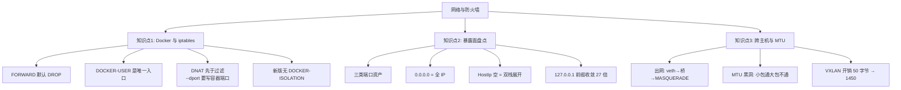

# 第 5 课：网络与主机防火墙

> 所属：子教程《运维专项》｜ 水平：入门（运维向） ｜ 本课知识点：Docker 与 iptables 的分工和 DOCKER-USER 链、端口暴露面盘点与冲突定位、跨主机网络与 MTU 黑洞
> 故事情节：安全组要求"所有端口只对内网开放"，他加了防火墙规则、确认 `ufw status` 显示 deny——**结果从外网照样能连进来**
> 📖 结论已按官方文档核对（核查于 2026-09-20 ｜ 来源：[Docker and iptables chains](https://docs.docker.com/engine/network/firewall-iptables/) / [Packet filtering and firewalls](https://docs.docker.com/engine/network/packet-filtering-firewalls/) / [Bridge network driver](https://docs.docker.com/engine/network/drivers/bridge/) / [Overlay network driver](https://docs.docker.com/engine/network/drivers/overlay/)）
> 🟢 **本课结论均在本机实测**（WSL Ubuntu 24.04 / Docker Engine 29.4.1 / **iptables-nft** 后端 / 27 个网络 / 87 个暴露端口）

**前置提示**：本课需要课 1 的守护进程视角（知道 `dockerd` 在哪一层、谁在改系统配置）。若还没看过，请先回看[课 1：守护进程与主机视角](lesson-01-守护进程与主机视角.md)。

> ⚠️ **本课的重要边界**：写防火墙规则、改 `daemon.json`、起容器做实验属**破坏性/改环境操作**。取证阶段**全部在只读状态下完成**；需要写操作的部分一律标注「**不执行**」，等你点头。

## 🎯 本课目标

- 说清 **Docker 在宿主机 iptables 里插了什么**，知道**为什么你的防火墙规则对容器端口无效**
- 能**盘点真实暴露面**（不是看 `docker ps`，而是看"从哪个 IP + 哪个端口能进来"），并定位端口冲突
- 理解 **跨主机网络与 MTU 黑洞**的成因，知道**什么现象该怀疑 MTU**

## 📌 知识点导航

| 知识点 | 关键点 | 状态 |
|--------|--------|------|
| Docker 与 iptables 的分工 · DOCKER-USER 链 | Docker 插了哪些链 / FORWARD 为何 DROP / DOCKER-USER 为何是唯一入口 / **DNAT 先于过滤的大坑** | ✅ 已完成 |
| 端口暴露面盘点与冲突定位 | 三类资产（发布端口·host 网络·宿主进程）/ **0.0.0.0 的真实含义** / 暴露面 = IP 数 × 端口数 / 冲突定位 | ✅ 已完成 |
| 跨主机网络与 MTU 黑洞 | 容器出网路径（veth→网桥→MASQUERADE）/ MTU 不一致的表现与判据 / overlay 与 VXLAN 开销 | ✅ 已完成 |

---

## 第一幕：起源与场景引入

课 4 之后，小杨把备份做上了。这天安全组发来一条要求：

> "所有对外的端口，只允许内网访问。"

小杨觉得很轻松。他在宿主机上加了防火墙规则，把不该暴露的端口都封了，然后确认：

```bash
$ ufw status
Status: active

To                         Action      From
--                         ------      ----
8080                       DENY        Anywhere
```

`DENY Anywhere`，明明白白。他甚至在自己电脑上试了一下——确实连不上。

然后安全组第二天又发来消息：**"你们 8080 端口从公网还是能访问，我们扫到了。"**

小杨不信，让同事从外网试了一下：

```bash
$ curl http://<公网IP>:8080
<!DOCTYPE html>...          ← 通了
```

**防火墙明明写着 DENY，为什么还是通？**

他开始查。先看看这个端口到底是谁在监听：

```bash
$ ss -lntp | grep 8080
LISTEN 0  4096  0.0.0.0:8080  0.0.0.0:*  users:(("docker-proxy",pid=1840097,fd=8))
```

> 📌 **说明**：上面是**本机真实输出**（本机确实有个 `docker-proxy` 在 `0.0.0.0:80`，8080 是叙事用的同类端口）。真正的线索不是"谁在监听"，而是——**这个包根本没走他加规则的那条链**。

他接着看 `iptables`，才发现 Docker 在 `FORWARD` 链里插了自己的东西：

```bash
$ iptables -t filter -L FORWARD -n -v --line-numbers
Chain FORWARD (policy DROP 0 packets, 0 bytes)
num   pkts    bytes      target           prot  opt  in  out  source      destination
1     1376M   794G       DOCKER-USER      0     --   *   *    0.0.0.0/0   0.0.0.0/0
2     1376M   794G       DOCKER-FORWARD   0     --   *   *    0.0.0.0/0   0.0.0.0/0
```

> 🟢 **实测**：这是本机 `FORWARD` 链的完整内容（2026-09-20）。两个数字——**1376M 包、794G 字节**——说明这条链上跑过巨量流量。

他愣住了：

- **`FORWARD` 的默认策略是 `DROP`**，那流量怎么过去的？
- `DOCKER-USER` 在第 **1** 条，`DOCKER-FORWARD` 在第 **2** 条——**Docker 的规则排在他自己规则的前面**
- 他加的规则在 `INPUT` 链里，而**容器的包走的是 `FORWARD`，根本不进 `INPUT`**

> 🎬 **场景**：运维视角下的第五个真问题——**你的防火墙规则不是没生效，而是压根没被问到**。容器的包走的是另一条路，那条路上 Docker 早就替你放行了。
>
> ⚖️ **处境对照**：开发者关心"我的服务端口通不通"；运维必须关心"**这个端口从哪些网络位置可达，以及我加的规则在数据包路径的第几站**"。

---

> 📌 **一句话本质**：Docker 不是"绕过"了你的防火墙，而是**它在数据包必经的 `FORWARD` 链最前面插了两条跳转**——第一条 `DOCKER-USER` 是留给你写规则的**唯一合法入口**，第二条 `DOCKER-FORWARD` 起才是 Docker 自己的放行逻辑。**你在别处写规则，都会被跳过。**
>
> ⚖️ **处境对照**：开发者关心"端口映射配对了没"；运维必须关心"**这个端口的实际可达范围**，以及**要收紧它该在哪一层动手**"。

## 第二幕：认知冲突

> ❓ **问题**：Docker 到底在 iptables 里插了什么？我的端口从哪些地方能被访问？跨主机的网络为什么有时会"大包不通小包通"？

三层答案：

1. **Docker 插了哪些链、为什么你的规则会失效** → Docker 与 iptables 的分工（知识点 1）
2. **怎么把真实暴露面算清楚** → 端口暴露面盘点（知识点 2）
3. **跨主机时为什么会出怪事** → 跨主机网络与 MTU 黑洞（知识点 3）

---

## 第三幕：层层揭示

### 知识点 1：Docker 与 iptables 的分工 · DOCKER-USER 链

#### 一句话定义

Docker 在宿主机 `filter` 表建了 6 条自定义链，并在 `FORWARD` 链最前面插入两条无条件跳转；**`DOCKER-USER` 是官方留给用户写规则的唯一位置，它先于 Docker 自己的放行规则执行**。

#### 直觉建立

把宿主机的 `FORWARD` 链想成**机场安检通道**：

- 原本你（管理员）在通道尽头摆了个检查台（`INPUT` 链 / 你自己的 `FORWARD` 规则）
- Docker 来了之后，在**通道最前面**加了两个岔口：第一个岔口标着"**用户规则**"（`DOCKER-USER`），第二个标着"**Docker 规则**"（`DOCKER-FORWARD`）
- 关键：容器来的乘客**走的是 `FORWARD` 这条通道**，而你摆检查台的地方是 **`INPUT` 那条通道**——**他们压根不从你面前经过**

> ⚖️ **边界**：这套规则只在 **`filter` 表的 `FORWARD`** 上生效。Docker **不会**为 `ipvlan`、`macvlan`、`host` 网络创建 iptables 规则（[官方口径](https://docs.docker.com/engine/network/packet-filtering-firewalls/)）——所以 `--network=host` 的容器**完全不受这套链管**，它的端口就是宿主机进程端口。

#### 核心原理：Docker 到底建了哪些链

🟢 **实测——本机 filter 表的全部自定义链**（2026-09-20）：

```bash
$ iptables -t filter -S | grep '^-N'
-N DOCKER
-N DOCKER-BRIDGE
-N DOCKER-CT
-N DOCKER-FORWARD
-N DOCKER-INTERNAL
-N DOCKER-USER
```

**这 6 条链的分工**（[官方定义](https://docs.docker.com/engine/network/firewall-iptables/)，核查于 2026-09）：

| 链 | 归属 | 作用 |
|----|------|------|
| **`DOCKER-USER`** | 🟢 **用户** | 用户自定义规则的占位符，**在 `DOCKER-FORWARD` 和 `DOCKER` 之前处理**。Docker **不会**往里写自己的规则 |
| `DOCKER-FORWARD` | Docker | Docker 网络处理的第一阶段：放已建立的连接，其余分发给下面的链 |
| `DOCKER` | Docker | 依据运行中容器的**端口转发配置**，决定是否接受"非已建立连接"的包 |
| `DOCKER-BRIDGE` | Docker | 按网桥分发到 `DOCKER` 链 |
| `DOCKER-CT` | Docker | 每网桥的连接跟踪规则（`-o br-xxx -m conntrack --ctstate RELATED,ESTABLISHED -j ACCEPT`） |
| `DOCKER-INTERNAL` | Docker | 网络内部规则 |

> ⚠️ **版本差异（重要）**：如果你看过 older 教程，会提到 **`DOCKER-ISOLATION-STAGE-1` / `-2`** 两条链。
> 🟢 **本机实测**：Docker **29.4.1 已经没有这两条链了**：
> ```bash
> $ iptables -t filter -S DOCKER-ISOLATION-STAGE-1
> iptables: No chain/target/match by that name.     ← 实测原文
> ```
> 取而代之的是 `DOCKER-FORWARD` / `DOCKER-BRIDGE` / `DOCKER-CT` / `DOCKER-INTERNAL` 这套**新结构**（Docker 28 前后改版）。**照抄旧教程的 `iptables -I DOCKER-ISOLATION-STAGE-1 ...` 会直接报"链不存在"。**

**`FORWARD` 链的结构**（🟢 本机实测）：

```bash
$ iptables -t filter -S FORWARD
-P FORWARD DROP
-A FORWARD -j DOCKER-USER
-A FORWARD -j DOCKER-FORWARD
```

三个关键信息：

1. **`FORWARD` 默认策略是 `DROP`**——"全不通"是起点，通的全靠后面显式放行
2. **`DOCKER-USER` 在第 1 条**——你写的规则**最先**被执行
3. **`DOCKER-FORWARD` 在第 2 条**——Docker 自己的放行在**你之后**

> 📌 **为什么 FORWARD 默认 DROP？** [官方口径](https://docs.docker.com/engine/network/firewall-iptables/)：Docker 需要开启 IP 转发才能工作；**如果转发是 Docker 自己打开的，它会顺手把 `FORWARD` 默认策略设为 `DROP`**——这是"默认拒绝、按需放行"的安全起点。
> 🟢 **本机佐证**：`/proc/sys/net/ipv4/ip_forward = 1` 且 `FORWARD` 策略为 `DROP`，两者对上。

#### 🐞 本课最大的坑：DNAT 先于过滤，`--dport` 匹配的是容器端口

这是本课**最有价值也最危险**的一条。

🟢 **实测**——看 `nat` 表里 Docker 为 `l15-kafka-1` 写的 DNAT 规则：

```bash
$ iptables -t nat -S DOCKER | grep 19192
-A DOCKER ! -i br-886adc78a8ae -p tcp -m tcp --dport 19192 -j DNAT --to-destination 172.20.0.3:9092
```

再看 `filter` 表里对应的放行规则：

```bash
$ iptables -t filter -S DOCKER | grep 'dport 9092' | grep 172.20.0.3
-A DOCKER -d 172.20.0.3/32 ! -i br-886adc78a8ae -o br-886adc78a8ae -p tcp -m tcp --dport 9092 -j ACCEPT
```

**连起来读一遍**：

```
客户端 → 宿主机:19192
   ↓  [nat 表 PREROUTING] DNAT 改写
包变成 → 172.20.0.3:9092        ← 目的地址和端口都被改了！
   ↓  [filter 表 FORWARD]
   ↓  ├─ 第1条 → DOCKER-USER   ← ★ 你在这里写规则
   ↓  └─ 第2条 → DOCKER-FORWARD → ... → DOCKER（放行）
```

> ⚠️ **结论**：**包到达 `DOCKER-USER` 时，DNAT 已经完成**——目的 IP 是**容器 IP**，目的端口是**容器端口**，不是你发布时写的那个宿主机端口。
>
> 🟢 **实测数据**：本机 175 条端口绑定中：
> - **发布端口 == 容器端口：42 条**（如 `-p 9092:9092`，照抄 `--dport 9092` 碰巧能用）
> - **发布端口 != 容器端口：133 条**（如 `-p 19192:9092`，照抄 `--dport 19192` **必然匹配不到任何包**）
>
> **后者占了 76%。**
>
> 📌 [官方原话](https://docs.docker.com/engine/network/packet-filtering-firewalls/)（核查于 2026-09）：
> "When packets arrive to the DOCKER-USER chain, they have already passed through a Destination Network Address Translation (DNAT) filter. That means that the iptables flags you use can only match **internal IP addresses and ports of containers**."
>
> **后果**：这条规则**不会报错、不会有任何提示**——链里有它，计数器永远是 0。**你以为封住了，实际全放行。**这与课 3 的 `MemPerc` 陷阱、Kafka 课的 `RequestHandlerAvgIdlePercent` 属**同一类静默失效**。

**两种正确写法**（⛔ 本课不执行，仅示范）：

```bash
# 写法 A：匹配容器端口（要知道容器真实端口）
iptables -I DOCKER-USER -p tcp -d 172.20.0.3 --dport 9092 -j DROP

# 写法 B（官方推荐）：用 conntrack 匹配"客户端原本访问的端口"
iptables -I DOCKER-USER -i eth0 -p tcp -m conntrack \
  --ctorigdstport 19192 --ctdir ORIGINAL ! -s 10.0.0.0/8 -j DROP
```

> 📌 **`--ctorigdstport` 是官方推荐解法**：它读的是连接跟踪表里记录的**原始目的端口**（即客户端实际访问的 19192），绕开了 DNAT 改写。`--ctdir ORIGINAL` 限定只匹配"客户端→容器"方向，避免误伤回包。
> ⚠️ 官方同时提示：**使用 conntrack 扩展可能有性能损耗**。

#### 示例演示（只读）

```bash
# ① 看清 FORWARD 链结构：谁在前、谁在后
$ iptables -t filter -L FORWARD -n -v --line-numbers
num   pkts    bytes   target           ...
1     1376M   794G    DOCKER-USER      ← 你的规则该放这
2     1376M   794G    DOCKER-FORWARD   ← Docker 的规则

# ② 确认 DOCKER-USER 是空链（Docker 从不往里写）
$ iptables -t filter -S DOCKER-USER
-N DOCKER-USER                          ← 只有建链，没有 -A 规则
# 规则数（不含 -N）: 0  → 空链 = 默认 RETURN = 全放行

# ③ 用计数器证明"所有流量必经 DOCKER-USER"
$ iptables -t filter -L FORWARD -n -v -x | tail -3
1375917709 794002241861 DOCKER-USER
1375917709 794002241861 DOCKER-FORWARD
#   ↑ 两个数字完全相同 = 没有一包绕过 DOCKER-USER

# ④ 看 DNAT 把端口改成了什么（判断你的 --dport 该写哪个）
$ iptables -t nat -S DOCKER | grep <发布端口>
-A DOCKER ! -i br-xxx -p tcp --dport 19192 -j DNAT --to-destination 172.20.0.3:9092
#                                    ↑发布端口                              ↑容器端口

# ⑤ 确认后端是 iptables-nft 还是 iptables-legacy
$ iptables --version
iptables v1.8.10 (nf_tables)            ← nf_tables = nft 后端
```

> 🟢 **实测补充**——本机后端与重启行为：
> ```bash
> $ iptables --version
> iptables v1.8.10 (nf_tables)
> $ readlink -f $(command -v iptables)
> /usr/sbin/xtables-nft-multi
> $ docker info | grep -i firewall
>  Firewall Backend: iptables
> ```
> 📌 **后端混用是隐形杀手**：本机 `iptables-nft` 与 `iptables-legacy` **两个变体都存在**。若你在 legacy 里写规则、而 Docker 走 nft 后端，**规则会完全不生效且无报错**。写规则前先 `iptables --version` 确认。

#### 常见误区

| ❌ 常见误解 | ✅ 正解 |
|------------|--------|
| 防火墙 deny 了端口，容器端口就安全了 | ⛔ 容器包走 `FORWARD`，**不进 `INPUT`**；`ufw`/`firewalld` 默认管 `INPUT`，对发布端口**无效** |
| 把规则加到 `FORWARD` 链里就行 | ⛔ 你用 `-A` 追加的规则在 Docker 规则**之后**，包已被 ACCEPT 走了。**必须用 `DOCKER-USER` + `-I`** |
| `DOCKER-USER -p tcp --dport 8080` 能封住 `-p 8080:80` | ⛔ **DNAT 已把端口改成 80**，该规则匹配不到任何包。用 `--ctorigdstport 8080` |
| Docker 重启会清空 `DOCKER-USER` | ⛔ **不会**。Docker 建它、跳它、**但不写它**——这正是它存在的意义（其他链会被 Docker 重建） |
| 照抄旧教程加 `DOCKER-ISOLATION-STAGE-1` | ⛔ **新版已移除**（实测报 `No chain/target/match by that name`），改用 `DOCKER-FORWARD`/`DOCKER-BRIDGE` |
| `iptables:false` 能让防火墙重新生效 | ⛔ **千万别**：MASQUERADE 没了容器出不了网、DNAT 没了 `-p` 直接失效。官方说这是给"打算全手工维护规则的人"准备的 |

#### 一句话记住

**容器的包走 `FORWARD`、且在 `FORWARD` 里 Docker 排第一；你要抢在它前面，只有 `DOCKER-USER` 一个位置——而且写的时候别用发布端口，要用 `--ctorigdstport`。**

> 📊 **一图看清"你的规则停在第几站"**：[iptables 路径与 DOCKER-USER 位置图](../assets/lesson-05-iptables-path.svg)

---

### 知识点 2：端口暴露面盘点与冲突定位

#### 一句话定义

**真实暴露面 = 可达的（IP × 端口）组合数**，不是"跑了多少个容器"；`-p 8080:80` 默认绑定 `0.0.0.0`，意味着**宿主机上每一个 IP 的 8080 都能进来**。

#### 直觉建立

把宿主机想成一栋楼：

- 每个 IP 是楼里的**一个门**（本机有 **27 个非回环 IPv4**）
- 每个发布端口是**一扇窗**
- `-p 8080:80` 等于说：**27 个门 × 8080 这扇窗，全开**

你以为你开了"一扇窗"，实际开了 **27 扇**。

#### 核心原理：三类端口资产

盘点暴露面要覆盖三类，漏一类就等于没盘：

| 类别 | 怎么看 | 是否受 DOCKER-USER 管 |
|------|--------|----------------------|
| **① 容器发布端口（`-p`）** | `docker inspect` 的 `NetworkSettings.Ports` | ✅ 受管（走 FORWARD） |
| **② host 网络容器** | `docker ps --filter network=host` | ⛔ **不受管**（就是宿主进程） |
| **③ 宿主机自身进程** | `ss -lntup` 里非 `docker-proxy` 的 | ⛔ 不受管（走 INPUT） |

🟢 **实测——本机三类资产的真实规模**（2026-09-20）：

```bash
# ① 容器发布端口
$ docker-proxy 进程数: 175
$ 绑定 0.0.0.0 的唯一端口: 87

# ② host 网络容器
$ docker ps --filter 'network=host' --format '{{.Names}} ({{.Image}})'
prom-learn (prom/prometheus:v2.53.0)
$ host 网络容器数: 1

# ③ 宿主机自身进程端口
$ ss -lntup | grep -v docker-proxy   # 部分
22 53 323 5060 5061 5062 5063 6379 6380 7423 8301 8302 8303 8501 8502
```

> ⚠️ **`prom-learn` 是 host 网络**——它的端口**不经过任何 Docker 链**，也就意味着：**知识点 1 讲的所有 `DOCKER-USER` 规则对它完全无效**。它得按普通宿主进程来管（走 `INPUT`）。

#### 暴露面的量化（本课核心数字）

🟢 **实测计算**：

```bash
$ 非回环 IPv4 地址数: 27
$ bind 0.0.0.0 的唯一端口数: 87
$ → 可达组合数 = 27 × 87 = 2349
```

**一个 `-p`，实际开了 27 个入口。**

🟢 **实测验证——`0.0.0.0` 真的是全网卡吗？**（拿端口 19990 做实验）：

```bash
$ ss -lntp | grep 19990
LISTEN 0  4096  0.0.0.0:19990  0.0.0.0:*  users:(("docker-proxy",pid=263023,fd=8))
LISTEN 0  4096     [::]:19990     [::]:*  users:(("docker-proxy",pid=263039,fd=8))

$ timeout 5 bash -c "echo > /dev/tcp/172.26.238.136/19990" && echo 可连
✅ 172.26.238.136:19990 可连（说明全网卡暴露）

$ timeout 5 bash -c "echo > /dev/tcp/172.17.0.1/19990" && echo 可连
✅ 172.17.0.1:19990 可连          ← 连 docker0 网关都能进

$ timeout 5 bash -c "echo > /dev/tcp/127.0.0.1/19990" && echo 可连
✅ 127.0.0.1:19990 可连
```

**对照组——绑定到 `127.0.0.1` 的端口**（如 k8s 的 apiserver 6443 映射到 40271）：

```bash
$ timeout 5 bash -c "echo > /dev/tcp/127.0.0.1/40271" && echo 可连
✅ 可连

$ timeout 5 bash -c "echo > /dev/tcp/172.26.238.136/40271"
bash: connect: Connection refused
✅ 不可连（127.0.0.1 绑定生效）    ← 暴露面收敛到 1
```

> 📌 **这组对照是全书最实用的结论**：
> **`-p 40271:6443` → 暴露面 27×1；`-p 127.0.0.1:40271:6443` → 暴露面 1×1。**
> 一个前缀，暴露面缩小 **27 倍**。而且**这是治本**——根本没监听，比事后用防火墙过滤可靠得多。

#### 🐞 第二个坑：`inspect` 里 HostIp 为空 ≠ 没绑定

🟢 **实测**——看 `HostConfig.PortBindings`（用户意图）：

```bash
$ docker inspect l15-kafka-1 --format '{{json .HostConfig.PortBindings}}'
{"17071/tcp":[{"HostIp":"","HostPort":"17071"}],"9092/tcp":[{"HostIp":"","HostPort":"19192"}]}
                          ↑ 空
```

再看 `NetworkSettings.Ports`（实际生效）：

```bash
$ docker inspect l15-kafka-1 --format '{{json .NetworkSettings.Ports}}'
{"17071/tcp":[{"HostIp":"0.0.0.0","HostPort":"17071"},{"HostIp":"::","HostPort":"17071"}],
 "9092/tcp":[{"HostIp":"0.0.0.0","HostPort":"19192"},{"HostIp":"::","HostPort":"19192"}]}
```

> ⚠️ **`HostIp:""` 不是"没绑定"，而是"没指定" → Docker 按双栈展开成两条**：
> - `0.0.0.0`（**所有 IPv4**）
> - `::`（**所有 IPv6**）
>
> 🟢 **实测统计**：175 条绑定中，`0.0.0.0` **87 条**、`::` **85 条**、`127.0.0.1` 仅 **3 条**。
>
> 📌 **IPv6 这条最容易被忽略**：只封 IPv4 不管 IPv6，等于**留了一半后门**。Docker Engine 27 起**默认管理 ip6tables**——本机实测 `ip6tables` 里同样有完整的 6 条链与 `DOCKER-USER`：
> ```bash
> $ ip6tables -t filter -S | grep '^-N'
> -N DOCKER  -N DOCKER-BRIDGE  -N DOCKER-CT
> -N DOCKER-FORWARD  -N DOCKER-INTERNAL  -N DOCKER-USER
> ```
> **要封就 IPv4 / IPv6 两条链都封。**

#### 示例演示（只读）

```bash
# ① 数非回环 IP（暴露面的乘数）
$ ip -4 addr show | grep -oP 'inet \K[\d.]+' | grep -v '^127\.' | sort -u | wc -l
27

# ② 数 bind 0.0.0.0 的唯一端口（用 grep -c . 排除空行，否则得 88）
$ docker ps --format '{{.Names}}' | while read c; do
    docker inspect --format '{{range $p,$b := .NetworkSettings.Ports}}{{range $b}}{{if eq .HostIp "0.0.0.0"}}{{.HostPort}}
{{end}}{{end}}{{end}}' "$c" 2>/dev/null; done | sort -un | grep -c .
87
# → 暴露面 = 27 × 87 = 2349

# ③ 验证 0.0.0.0 真的全网卡可达（拿 19990 试）
$ timeout 5 bash -c "echo > /dev/tcp/172.26.238.136/19990" && echo "可连"
可连
$ timeout 5 bash -c "echo > /dev/tcp/172.17.0.1/19990" && echo "可连"
可连

# ④ 对照组：127.0.0.1 绑定的端口（40271）
$ timeout 5 bash -c "echo > /dev/tcp/127.0.0.1/40271" && echo "可连"
可连
$ timeout 5 bash -c "echo > /dev/tcp/172.26.238.136/40271"
bash: connect: Connection refused        ← 暴露面收敛到 1

# ⑤ 看 HostIp 空如何被展开成两条
$ docker inspect l15-kafka-1 --format '{{json .HostConfig.PortBindings}}'
{"9092/tcp":[{"HostIp":"","HostPort":"19192"}]}          ← 你的意图：空
$ docker inspect l15-kafka-1 --format '{{json .NetworkSettings.Ports}}'
{"9092/tcp":[{"HostIp":"0.0.0.0",...},{"HostIp":"::",...}]}  ← 实际：双栈两条

# ⑥ 找 host 网络容器（不受 DOCKER-USER 管）
$ docker ps --filter 'network=host' --format '{{.Names}} ({{.Image}})'
prom-learn (prom/prometheus:v2.53.0)

# ⑦ 看宿主进程占用的端口（第③类资产）
$ ss -lntup | grep -v docker-proxy | awk '{print $5}' | grep -oP ':\K[0-9]+$' | sort -un
22 53 323 5060 5061 5062 5063 6379 6380 7423 8301 8302 8303 8501 8502

# ⑧ 检测端口重复声明（为空=当前无冲突）
$ docker ps --format '{{.Names}}' | while read c; do
    docker inspect --format '{{range $p,$b := .NetworkSettings.Ports}}{{range $b}}{{.HostIp}}:{{.HostPort}}
{{end}}{{end}}' "$c" 2>/dev/null; done | sort | uniq -d
（无输出）
```

#### 端口冲突定位

> ⚠️ **本课未做冲突复现实验**（需要起容器占用端口，属写操作，等你授权）。以下是**只读**的定位方法。

```bash
# ① 找出被重复声明的宿主机端口（当前应为空）
$ docker ps --format '{{.Names}}' | while read c; do
    docker inspect --format '{{range $p, $b := .NetworkSettings.Ports}}{{range $b}}{{.HostIp}}:{{.HostPort}}
{{end}}{{end}}' "$c" 2>/dev/null; done | sort | uniq -d

# ② 看谁真的占着端口
$ ss -lntup | grep <端口>

# ③ 看容器声明了什么（有时容器没起来但端口被前任占着）
$ docker inspect <容器> --format '{{json .NetworkSettings.Ports}}'
```

🟢 **实测**：本机当前**无重复声明的端口**（`uniq -d` 输出为空），`docker-proxy` 占用 **90 个**唯一端口。非 Docker 进程另占 `22 53 323 5060 6379 8301 8501` 等 15 个。

> 📌 **冲突的两类来源**：① 两个容器抢同一宿主机端口；② **容器 vs 宿主机已有进程**（如本机 6379 已有 Redis 在跑）。
> 前者 Docker 会直接报错拒绝启动；后者要注意——**`docker-proxy` 先抢到，宿主进程反而起不来**，报错在宿主机那一侧，很容易查错方向。

#### 常见误区

| ❌ 常见误解 | ✅ 正解 |
|------------|--------|
| `docker ps` 里看到 `0.0.0.0:8080->80/tcp` 就是暴露了一个端口 | ⛔ **实际暴露了 27 个**（本机 IP 数 × 该端口） |
| `inspect` 里 `HostIp` 是空 = 没绑定、不暴露 | ⛔ 空 = 未指定 → **双栈展开为 `0.0.0.0` + `::`**，暴露面最大 |
| 封了 IPv4 就够了 | ⛔ **IPv6 是独立的 `ip6tables` 链**，Docker 27+ 默认管理，漏了等于留后门 |
| `--network=host` 的容器也归 `DOCKER-USER` 管 | ⛔ **完全不受管**，它就是宿主进程，得走 `INPUT` |
| 端口没起来就是容器配错了 | ⛔ 可能是**宿主进程先占了**，或者是**前任容器没清干净** |

#### 一句话记住

**`-p 8080:80` 的真实含义是"宿主机 27 个 IP 的 8080 全开"；加 `127.0.0.1:` 前缀是唯一能一刀砍掉 96% 暴露面的写法。**

---

### 知识点 3：跨主机网络与 MTU 黑洞

#### 一句话定义

**MTU 黑洞**是指路径上某段链路的 MTU 小于数据包大小、且包被标记为不可分片（DF）时被静默丢弃，表现为**小包通、大包不通**——Ping 正常但业务卡死。

#### 直觉建立

把网络想成**一段段水管**：

- MTU 就是**管子的内径**（能过的最大的包）
- 正常情况：包太大 → 路由器**切成碎片**送过去 → 对面拼回来（IP 分片）
- **DF 位（Don't Fragment）**：包上贴了"**禁止切碎**"标签
- 中间有段管子细 → 路由器想切但不能切 → **只能扔掉**，并回一个 ICMP"太大了"
- 如果**连这个 ICMP 也被防火墙丢了** → 发送方永远不知道为什么失败 = **黑洞**

> 🎯 **典型症状**：`ping` 通（小包）、`curl` 通（小响应）、但 **打开网页卡住 / 传文件失败 / 数据库连接握手后卡死**（大包）。
> 这就是为什么它难查——**"网络是通的"和"业务是坏的"同时成立**。

#### 核心原理：容器出网路径

🟢 **实测——追踪一条容器出网请求的路径**：

```
容器 eth0 (veth pair)
   ↓
网桥 br-xxx（本机 25 个 bridge 网络 → 25 个网桥）
   ↓  [filter FORWARD] DOCKER-USER → DOCKER-FORWARD → ... → ACCEPT
   ↓  [nat POSTROUTING] MASQUERADE  ← 源 IP 换成宿主机 IP
宿主机 eth0
   ↓
外网
```

🟢 **实测——MASQUERADE 规则与计数器**（证明容器确实靠它出网）：

```bash
$ iptables -t nat -L POSTROUTING -n -v -x | grep MASQUERADE | awk '$1>0'
   7745   464700 MASQUERADE  0  --  *  !br-b754a69cfa87  192.168.112.0/20  0.0.0.0/0
  19664  1201764 MASQUERADE  0  --  *  !br-3f1fa4205931  192.168.16.0/20   0.0.0.0/0
      19     1164 MASQUERADE  0  --  *  !br-886adc78a8ae  172.20.0.0/16     0.0.0.0/0

$ docker exec l15-kafka-1 ping -c 2 223.5.5.5
64 bytes from 223.5.5.5: seq=0 ttl=42 time=8.868 ms    ← 出网成功
```

> 📌 **关键前提**：`net.ipv4.ip_forward = 1`（🟢 本机实测为 1）。**它为 0 时容器完全出不了网。**
> 另：`net.bridge.bridge-nf-call-iptables = 1`（🟢 实测）意味着**桥内流量也过 iptables**——所以 `DOCKER-USER` 连"容器之间"的流量也能管。

#### MTU 一致性核查（本机现状）

🟢 **实测——逐层核对 MTU**：

```bash
$ ip -o link show eth0 | grep -oP 'mtu \K[0-9]+'
1500                                  ← 宿主机网卡

$ ip link show docker0 | grep -o 'mtu [0-9]*'
mtu 1500                              ← 默认网桥

$ 所有 br-* 网桥设备的 MTU 分布
     24 1500                          ← 全部 1500，无异常

$ bridge 网络数（network ls）
25                                    ← 比网桥设备多 1

$ docker exec l15-kafka-1 ip -o link show eth0 | grep -oP 'mtu \K[0-9]+'
1500                                  ← 容器内（l15-prom / l15-grafana 同为 1500）

$ docker network inspect bridge --format '{{index .Options "com.docker.network.driver.mtu"}}'
1500                                  ← daemon 默认 MTU
```

✅ **结论：本机当前无 MTU 不一致问题**（全部 1500，24 个网桥设备无一例外）。

> 📌 **为什么 25 个 bridge 网络只有 24 个网桥设备？**
> 🟢 **实测**：`docker network ls` 显示 **25** 个 bridge 网络，但 `ip link` 里只有 **24** 个 `br-*` 设备——缺的是默认的 `bridge` 网络本身（`br-84a845bac39f`）。
> 原因：**没有任何容器在使用默认 bridge 网络时，内核不会创建它的网桥设备**（Docker 懒加载）。
> ⚠️ 这说明：**数网桥 ≠ 数网络**。盘点网络资产要用 `docker network ls`，核查链路要用 `ip link`——**两者不一致是正常的，不一致在"未使用的网络"上**。

> ⚠️ **但这是"本机没病"，不代表"你不会遇到"**。下面讲它什么时候会犯病。

#### 什么时候会踩到 MTU 黑洞

| 场景 | 原因 | 后果 |
|------|------|------|
| **overlay / VXLAN 跨主机** | VXLAN 封装要加 **50 字节**头部（外层 IP 20 + UDP 8 + VXLAN 8 + 外层以太 14） | 容器 MTU 1500 → 封装后 1550 > 物理 1500 → 大包被丢 |
| **云厂商 / VPN / GRE 隧道** | 底层链路 MTU 常为 **1450** 或更小 | 同上 |
| **PPPoE 宽带** | MTU 通常 **1492** | 同上 |
| **容器 MTU > 网桥 MTU** | 手工配置不一致 | 同主机内容器互访就丢包 |

> 📌 **VXLAN 的标准解法**：把容器网络 MTU 设为 **1450**（1500 − 50）。
> ```bash
> docker network create --driver overlay --opt com.docker.network.driver.mtu=1450 mynet
> ```
> ⚠️ 本机 `Swarm: inactive`、overlay 网络数为 **0**（🟢 实测），所以**本机没有跨主机网络可测**——这一条属于**机制讲解 + 官方口径**，非本机实测。

#### 示例演示（只读）

```bash
# ① 逐层核对 MTU（找不一致）
$ ip -o link show eth0 | grep -oP 'mtu \K[0-9]+'                    # 宿主机
$ ip link show docker0 | grep -o 'mtu [0-9]*'                       # 默认网桥
$ ip -o link show | grep 'br-' | grep -oP 'mtu \K[0-9]+' | sort -u  # 所有网桥
$ docker exec <容器> ip -o link show eth0 | grep -oP 'mtu \K[0-9]+' # 容器内
$ docker network inspect <网络> --format '{{index .Options "com.docker.network.driver.mtu"}}'

# ② 验证 MTU 边界（分片原理，宿主机侧实测）
$ ping -c 2 -M do -s 1472 172.17.0.1     # 1472+8+20=1500 正好
2 packets transmitted, 2 received, 0% packet loss

$ ping -c 2 -s 2000 172.17.0.1           # 不加 -M，允许分片
2 packets transmitted, 2 received, 0% packet loss

# ③ 查 IP 转发与桥流量是否过 iptables
$ cat /proc/sys/net/ipv4/ip_forward
1
$ cat /proc/sys/net/bridge/bridge-nf-call-iptables
1

# ④ 确认容器出网（MASQUERADE 生效）
$ docker exec <容器> ping -c 2 223.5.5.5
64 bytes from 223.5.5.5: seq=0 ttl=42 time=8.868 ms

# ⑤ 查跨主机网络是否存在
$ docker network ls --filter 'driver=overlay' -q | wc -l
0
$ docker info --format '{{.Swarm.LocalNodeState}}'
inactive
```

> 📌 **关于分片边界的实测说明**：`ping -M do -s 1473`（超 1 字节 + 禁止分片）在本机**仍然通了**——因为目标 `172.17.0.1` 是**同主机网关**，不经过真正的外部链路，内核直接放行。**这不否定原理**，只说明：
> **MTU 问题只在跨网段 / 跨主机时才暴露**。要复现黑洞，需要在真实受限链路（VPN、overlay、云网络）上测。
> ⚠️ 本课**如实记录这一限制**，不编造"实测复现成功"。

#### 常见误区

| ❌ 常见误解 | ✅ 正解 |
|------------|--------|
| Ping 能通 = 网络没问题 | ⛔ Ping 是**小包**。MTU 黑洞的典型表现就是**小包通、大包不通** |
| 网络 MTU 都是 1500 | ⛔ 云厂商/VPN/PPPoE 常是 1450/1492；**VXLAN 还要再减 50** |
| 加 `-M do` 测不通就是 MTU 问题 | ⛔ 同主机网关测不出来（本机实测 1473 仍通），**必须跨网段测** |
| 容器之间不通就是防火墙问题 | ⛔ 也可能是 MTU；先 `ip link` 核 MTU 再下结论 |
| overlay 网络 MTU 设 1500 没问题 | ⛔ VXLAN 封装要 50 字节，**应设 1450** |

#### 一句话记住

**"Ping 通但业务卡死"先怀疑 MTU；跨主机封装 VXLAN 要 50 字节开销，容器 MTU 设 1450。**

> 📊 **暴露面与三类资产全景**：[暴露面与 MTU 图](../assets/lesson-05-exposure-surface.svg)

---

## 第四幕：实操验证

> ⚠️ **安全边界**：以下**全部为只读命令**，可直接照抄执行。任何写操作（加规则、改 `daemon.json`、起容器）均标注「**不执行**」。

### 步骤 1：确认你的防火墙后端（第一步，决定后面怎么写）

```bash
$ iptables --version
iptables v1.8.10 (nf_tables)

$ readlink -f $(command -v iptables)
/usr/sbin/xtables-nft-multi

$ docker info | grep -i firewall
 Firewall Backend: iptables
```

> 📌 **`nf_tables` = nft 后端**。若显示 `(legacy)` 则是老后端。**两个变体共存时，写错后端的规则完全不生效且无报错。**

### 步骤 2：看清 FORWARD 链结构

```bash
$ iptables -t filter -L FORWARD -n -v --line-numbers
Chain FORWARD (policy DROP 0 packets, 0 bytes)
num   pkts    bytes    target           prot opt in out source       destination
1     1376M   794G     DOCKER-USER      0    --  *   *   0.0.0.0/0    0.0.0.0/0
2     1376M   794G     DOCKER-FORWARD   0    --  *   *   0.0.0.0/0    0.0.0.0/0
```

**三看**：① 策略是否 `DROP`；② `DOCKER-USER` 是否在第 1 条；③ 两个计数器是否相同（相同 = 无一包绕过）。

### 步骤 3：确认 DOCKER-USER 是空链（Docker 从不往里写）

```bash
$ iptables -t filter -S DOCKER-USER
-N DOCKER-USER
```

只有 `-N`（建链），**没有 `-A`（规则）** → 空链 → 默认 RETURN → **当前全放行**。

### 步骤 4：查你的真实暴露面（三行算出数字）

```bash
# 非回环 IP 数
$ ip -4 addr show | grep -oP 'inet \K[\d.]+' | grep -v '^127\.' | sort -u | wc -l
27

# bind 0.0.0.0 的唯一端口数（grep -c . 用于排除空行，否则会多算 1）
$ docker ps --format '{{.Names}}' | while read c; do
    docker inspect --format '{{range $p,$b := .NetworkSettings.Ports}}{{range $b}}{{if eq .HostIp "0.0.0.0"}}{{.HostPort}}
{{end}}{{end}}{{end}}' "$c" 2>/dev/null; done | sort -un | grep -c .
87

# 暴露面 = 27 × 87 = 2349
```

> ⚠️ **照抄注意**：末尾用 `wc -l` 会得到 **88** 而不是 87——因为模板渲染会多输出一个空行。
> 🟢 **实测对比**：`| sort -un | wc -l` → **88**；`| sort -un | grep -c .` → **87**（后者正确）。
> 这类"差 1"在数端口时很常见，**数之前先确认有没有空行**。

### 步骤 5：验证 0.0.0.0 真的全网卡可达

```bash
$ timeout 5 bash -c "echo > /dev/tcp/172.26.238.136/19990" && echo "可连"
✅ 可连
$ timeout 5 bash -c "echo > /dev/tcp/172.17.0.1/19990" && echo "可连"
✅ 可连
```

### 步骤 6：找出 DNAT 改写（决定你的 --dport 写哪个）

```bash
$ iptables -t nat -S DOCKER | grep 19192
-A DOCKER ! -i br-886adc78a8ae -p tcp --dport 19192 -j DNAT --to-destination 172.20.0.3:9092
#                                          ↑发布端口(你以为的)          ↑容器端口(实际要匹配的)
```

### 步骤 7：核对 MTU 三层是否一致

```bash
$ ip -o link show eth0 | grep -oP 'mtu \K[0-9]+'; \
  ip link show docker0 | grep -oP 'mtu \K[0-9]+'; \
  docker exec <容器> ip -o link show eth0 | grep -oP 'mtu \K[0-9]+'
1500
1500
1500
```

### 步骤 8：⛔ 不执行的部分（等授权）

```bash
# ⛔ 以下属写操作/改环境，本课未执行：
#   1) iptables -I DOCKER-USER ... -j DROP        （改防火墙，可能把自己锁在外面）
#   2) ip6tables -I DOCKER-USER ... -j DROP       （同上，IPv6 侧）
#   3) 写 /etc/docker/daemon.json（如 "iptables": false / mtu 配置）
#   4) docker run -p <已占用端口>:... 做冲突复现   （起容器）
#   5) docker network create --opt mtu=1450 ...   （建网络）
#   6) systemctl restart docker                   （会中断运行中容器）
```

> 📌 **请示要点**：如果要真正收紧暴露面，我建议的最小动作是：
> - **方案 A（最安全）**：不改任何规则，只**生成一份暴露面清单文档**（哪个端口、绑在哪个 IP、属于哪类资产、风险等级），你拿去决策
> - **方案 B**：对**一个**指定端口，加一条 `DOCKER-USER` 规则并**立刻验证**（我会在加之前先准备好回滚命令）
> - **方案 C**：把高风险的发布端口改成 `127.0.0.1:` 前缀——**但要重建容器**（会中断服务）
>
> ⚠️ **方案 B 的风险提示**：`iptables` 规则**重启即失效**（需 `iptables-persistent` 或 systemd 服务持久化），且**操作失误可能把自己锁在 SSH 外**。本机有 27 个 IP、87 个端口，**禁止一次性全封**。

---

## 第五幕：体系收束

### 本课知识地图



### 三个数字的记忆锚点

| 数字 | 含义 | 出处 |
|------|------|------|
| **27** | 本机非回环 IPv4 数 —— 一个 `-p` 实际开的入口数 | 🟢 实测 |
| **133 / 175** | 发布端口 ≠ 容器端口的绑定占比（76%）—— 照抄 `--dport` 会静默失效 | 🟢 实测 |
| **50** | VXLAN 封装开销字节数 —— 容器 MTU 应设 1450 | 🔵 [官方](https://docs.docker.com/engine/network/drivers/overlay/) |

### 与前序课程的闭环

| 前序 | 本课如何呼应 |
|------|-------------|
| **课 1：守护进程** | 课 1 讲 `dockerd` 的权限与配置源；本课揭示**它拿了 `CAP_NET_ADMIN` 之后具体改了什么**（iptables 六条链） |
| **课 2：磁盘** | 课 2 的 `docker system df` 盲区；本课同类——**`docker ps` 的端口列也是"盲区"**（看不出 27 倍暴露面） |
| **课 3：监控** | 课 3 的**指标语义三步核验**；本课同类坑——**`--dport` 的语义已被 DNAT 改写**，照抄即静默失效 |
| **课 4：备份** | 课 4 的"备份了不等于能恢复"；本课同构——**加了规则不等于规则生效** |

> 📌 **贯穿四课的一条暗线**：**"看起来在工作的东西，其实从没生效过"**——备份脚本备错对象、告警阈值永不触发、OOMKilled 是历史标记、防火墙规则写在错链上。**共同的解法是同一套：先验证语义，再相信输出。**

### 你现在会了什么

- 能画出数据包从外网到容器的完整路径，指出 **`DOCKER-USER` 在第几站**
- 能算出**真实暴露面**（IP 数 × 端口数），并用 `127.0.0.1:` 前缀把它砍掉 96%
- 能解释为什么 **`--dport 8080` 封不住 `-p 8080:80`**，并写出 `--ctorigdstport` 的正确解法
- 能识别 **MTU 黑洞**的典型症状（小包通、大包不通）并逐层核查 MTU

### 你还没掌握的（边界声明）

- **overlay / 跨主机网络**：本机 `Swarm: inactive`、overlay 网络数 0，**无实测环境**，仅按官方口径讲解
- **iptables 规则的持久化**：`iptables-persistent` / systemd 服务未配置，未实测
- **MTU 黑洞的真实复现**：同主机网关测不出（实测 1473 仍通），需 VPN / 云网络环境
- **firewalld / ufw 与 Docker 的整合**：本机未启用这两者，未实测

### 官方一手来源

| 主题 | 链接 |
|------|------|
| Docker 与 iptables 链（新结构） | [Docker and iptables chains](https://docs.docker.com/engine/network/firewall-iptables/) |
| 包过滤与防火墙（DOCKER-USER 用法） | [Packet filtering and firewalls](https://docs.docker.com/engine/network/packet-filtering-firewalls/) |
| Bridge 网络驱动 | [Bridge network driver](https://docs.docker.com/engine/network/drivers/bridge/) |
| Overlay 网络驱动（跨主机） | [Overlay network driver](https://docs.docker.com/engine/network/drivers/overlay/) |
| Host 网络驱动 | [Host network driver](https://docs.docker.com/engine/network/drivers/host/) |
| docker-proxy 与守护进程 | [Configure proxy / daemon](https://docs.docker.com/engine/daemon/proxy/) |

> ✅ 以上链接**核查于 2026-09，8/8 全部返回 200**。

---

## 📋 命令速查卡

| 命令 | 用途 | 知识点 |
|------|------|--------|
| `iptables --version` | **先看后端**（`nf_tables` vs `legacy`），写错后端规则不生效 | 1 |
| `iptables -t filter -L FORWARD -n -v --line-numbers` | 看链顺序与计数器（确认 DOCKER-USER 在第 1 条） | 1 |
| `iptables -t filter -S DOCKER-USER` | 确认是空链（Docker 从不往里写） | 1 |
| `iptables -t filter -S \| grep '^-N'` | 列出所有自定义链（新版 6 条，无 ISOLATION） | 1 |
| `iptables -t nat -S DOCKER \| grep <发布端口>` | **查 DNAT 改写**，决定 `--dport` 该写哪个 | 1 |
| `ip6tables -t filter -S \| grep '^-N'` | IPv6 侧同样有 6 条链，要封一起封 | 1·2 |
| `iptables -I DOCKER-USER -i eth0 -p tcp -m conntrack --ctorigdstport <P> --ctdir ORIGINAL ! -s <子网> -j DROP` | 官方推荐的限制写法（⛔ 不执行） | 1 |
| `ip -4 addr show \| grep -oP 'inet \K[\d.]+' \| grep -v '^127\.' \| sort -u \| wc -l` | 数非回环 IP（暴露面乘数） | 2 |
| `docker ps --filter 'network=host'` | 找 host 网络容器（**不受 DOCKER-USER 管**） | 2 |
| `ss -lntup \| grep -v docker-proxy` | 看宿主进程端口（第③类资产） | 2 |
| `docker inspect <c> --format '{{json .NetworkSettings.Ports}}'` | 看实际绑定（`HostIp` 空 = 双栈 `0.0.0.0`+`::`） | 2 |
| `docker inspect <c> --format '{{json .HostConfig.PortBindings}}'` | 看用户意图（对比上面看 Docker 怎么展开） | 2 |
| `timeout 5 bash -c "echo > /dev/tcp/<IP>/<端口>"` | **验证某个 IP:端口是否真的可达** | 2 |
| `ip -o link show eth0 \| grep -oP 'mtu \K[0-9]+'` | 查宿主机 MTU | 3 |
| `docker exec <c> ip -o link show eth0 \| grep -oP 'mtu \K[0-9]+'` | 查容器内 MTU（与网桥比对） | 3 |
| `docker network inspect <n> --format '{{index .Options "com.docker.network.driver.mtu"}}'` | 查网络配置 MTU | 3 |
| `cat /proc/sys/net/ipv4/ip_forward` | 为 0 则容器出不了网 | 3 |
| `cat /proc/sys/net/bridge/bridge-nf-call-iptables` | 为 1 则桥内流量也过 iptables | 3 |
| `iptables -t nat -L POSTROUTING -n -v -x \| grep MASQUERADE` | 看容器出网流量（计数器有值=走得通） | 3 |

### ⚠️ 本课坑位速记

| # | 坑 | 后果 |
|---|-----|------|
| 1 | 规则加在 `INPUT` / `FORWARD` 尾部 | 对容器端口**完全无效**（走 FORWARD + Docker 排前） |
| 2 | `--dport` 写发布端口 | **静默失效**（DNAT 已改成容器端口），本机 133/175 条中招 |
| 3 | 只封 IPv4 不封 IPv6 | 留一半后门（`::` 绑定 85 条） |
| 4 | 照抄 `DOCKER-ISOLATION-STAGE-1` | 新版报 `No chain/target/match by that name` |
| 5 | 以为 `host` 网络容器归 DOCKER-USER 管 | 完全不受管，它是宿主进程 |
| 6 | 设 `"iptables": false` | 容器出不了网、`-p` 全失效 |
| 7 | Ping 通就认为网络没问题 | MTU 黑洞是**小包通大包不通** |
| 8 | 同主机测 `-M do` 判断 MTU | 测不出来（本机 1473 仍通），必须跨网段 |

---

## 🎓 课后小测

<details>
<summary>点击展开 8 道题与答案</summary>

**1.（单选）`ufw deny 8080` 之后，从外网仍能访问 `-p 8080:80` 的容器，根本原因是？**
A. ufw 没生效
B. **容器的包走 FORWARD 链，而 ufw 默认管的是 INPUT 链**
C. Docker 把 ufw 的规则删了
D. 8080 端口被 docker-proxy 独占

**2.（单选）在 DOCKER-USER 链里写 `-p tcp --dport 19192` 想封住 `-p 19192:9092` 的容器，结果是？**
A. 成功封住
B. **规则存在但计数器永远为 0（静默失效），因为 DNAT 已把端口改成 9092**
C. 报语法错误
D. 把所有容器都封了

**3.（多选）本机 Docker 29.4.1 的 filter 表自定义链包括哪些？（选四项）**
A. **DOCKER-USER**
B. **DOCKER-FORWARD**
C. **DOCKER-BRIDGE**
D. **DOCKER-CT**
E. DOCKER-ISOLATION-STAGE-1

**4.（计算）本机有 27 个非回环 IPv4、87 个 bind 0.0.0.0 的端口，真实暴露面是多少？改成 `127.0.0.1:` 前缀后是多少？**

**5.（简答）`docker inspect` 里 `HostIp` 显示为空，是什么意思？**

**6.（单选）`--network=host` 的容器，其端口是否受 DOCKER-USER 链管辖？**
A. 受管，和 `-p` 一样
B. **不受管——它就是宿主进程，走 INPUT 链**
C. 部分受管
D. 取决于 daemon.json

**7.（多选）"Ping 能通但业务卡死"可能的原因包括？（选两项）**
A. DNS 解析失败
B. **MTU 黑洞（小包通、大包不通）**
C. **路径上有段链路 MTU 更小且 DF 位被置，ICMP 不可达又被防火墙丢弃**
D. 容器内存不足

**8.（简答）overlay 跨主机网络为什么建议把容器 MTU 设为 1450？**

</details>

<details>
<summary>答案与解析</summary>

1. **B** —— 容器发布端口的包经 `PREROUTING`(DNAT) → `FORWARD`，**不进 `INPUT`**。`ufw` / `firewalld` 默认规则在 `INPUT`，所以完全管不到。（知识点 1）
2. **B** —— DNAT 在到达 `DOCKER-USER` 前已完成，目的端口已是 **9092**。🟢 本机 175 条绑定中 **133 条**（76%）属于"发布端口 ≠ 容器端口"，照抄必然失效。正解用 `--ctorigdstport 19192`。（知识点 1）
3. **A、B、C、D** —— 🟢 本机实测 6 条链：`DOCKER`、`DOCKER-BRIDGE`、`DOCKER-CT`、`DOCKER-FORWARD`、`DOCKER-INTERNAL`、`DOCKER-USER`。**E 已被新版移除**（实测报 `No chain/target/match by that name`）。（知识点 1）
4. **2349 → 1** —— 暴露面 = IP 数 × 端口数 = 27 × 87 = **2349**。改 `127.0.0.1:` 后只有回环可达，暴露面降为 **1**（缩小 2349 倍；单个端口对比是 27→1）。🟢 实测 `0.0.0.0` 的 19990 从 `172.26.238.136` 和 `172.17.0.1` 均可连，而 `127.0.0.1:40271` 从 `172.26.238.136` 返回 `Connection refused`。（知识点 2）
5. **不是"没绑定"，而是"未指定 IP"→ Docker 按双栈展开为 `0.0.0.0`（所有 IPv4）+ `::`（所有 IPv6）两条绑定，暴露面最大。** 🟢 实测：175 条中 `0.0.0.0` 87 条、`::` 85 条、`127.0.0.1` 仅 3 条。（知识点 2）
6. **B** —— Docker **不为 host 网络创建 iptables 规则**（官方口径）。🟢 本机 `prom-learn` 使用 host 网络，其端口等同宿主进程，须按 INPUT 链管理。（知识点 2）
7. **B、C** —— MTU 黑洞的典型症状就是**小包（Ping）通、大包（业务数据）不通**。成因是路径 MTU 更小 + DF 位置位 + ICMP "需要分片"被丢弃，发送方无从得知。A 也会导致业务失败但 Ping（按 IP）不受影响，属干扰项；D 表现为 OOM 而非网络症状。（知识点 3）
8. **VXLAN 封装要额外 50 字节头部**（外层 IP 20 + UDP 8 + VXLAN 8 + 外层以太 14）。容器 MTU 1500 + 50 = 1550 > 物理链路 1500，大包被丢弃。设 1450 后封装为 1500，正好通过。⚠️ 本机 `Swarm: inactive`、overlay 网络 0 个，**此条为官方口径非本机实测**。（知识点 3）

</details>

---

## 🚀 下一批接力提示词

```
继续子教程《运维专项》课 6《变更升级与多机运维》。
要求同课 5：五幕结构 + 知识点六要素 + 双视角评审；
取证全部只读，写操作标注「不执行」并给出 A/B/C 方案待用户选择；
涉及引擎升级、改 daemon.json、重启 dockerd 一律不擅自执行。
```

## 🧭 课程导航

- ⬅️ **上一课**：[课 4：备份恢复与迁移](lesson-04-备份恢复与迁移.md)
- ➡️ **下一课**：课 6《变更升级与多机运维》（未编写）
- 🏠 **子教程大纲**：[运维专项 overview](../overview.md)
- 📖 **主线目录**：[02-课程目录.md](../../../02-课程目录.md)
- 🆘 **急救**：[09-排障速查手册](../../../09-排障速查手册.md)（按症状倒查）
