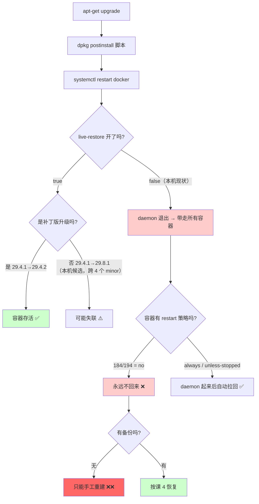
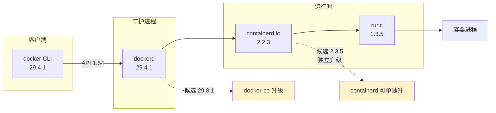
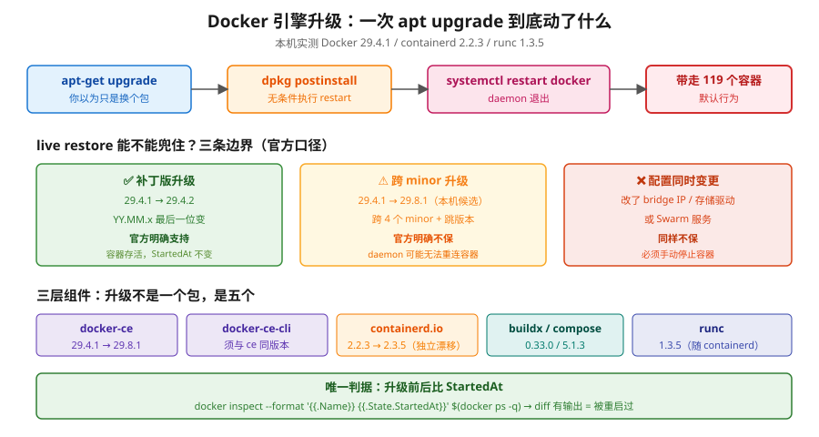
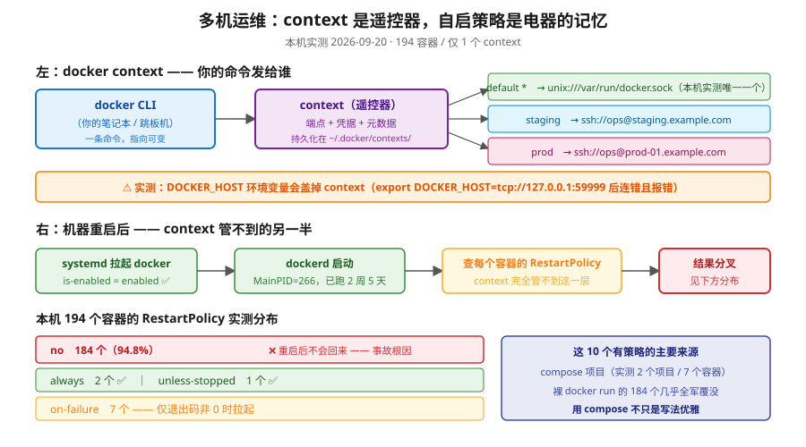
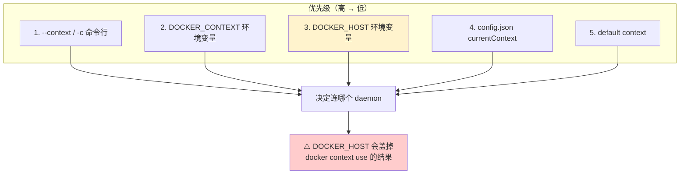
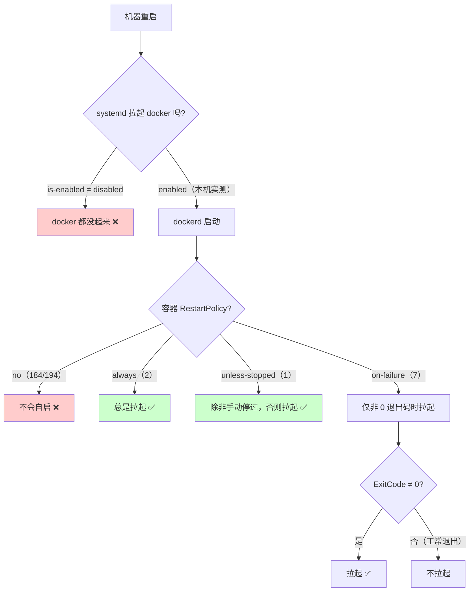
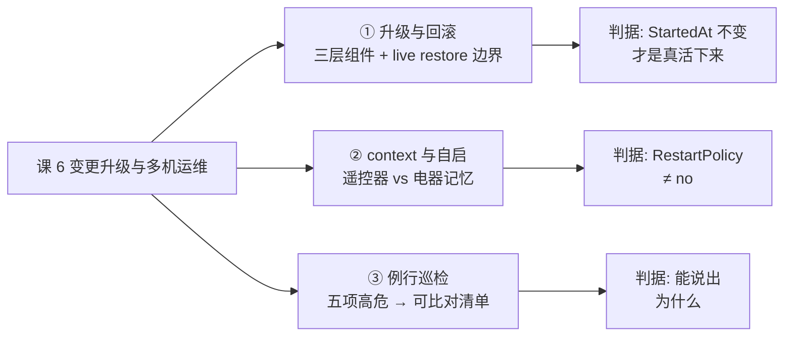
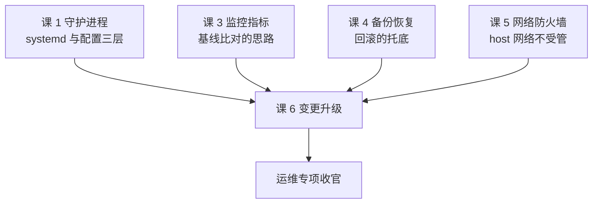

# 课 6：变更升级与多机运维

> **本课目标**：① 说清引擎升级到底动了什么、live restore 能保什么不能保什么、怎么设计一条可回滚的升级路径；② 用 `docker context` 一台 CLI 管多台主机，并理解 systemd 自启托管才是"重启后还在"的真正保证；③ 建立一份能照着跑的例行巡检清单。
> **前置**：课 1（守护进程配置三层与 systemd）、课 3（指标与告警）、课 4（备份恢复）、课 5（网络与防火墙）。主线课 15 `docker context`、课 10 重启策略。
> **本课所有数据均为 🟢 本机实测**（WSL Ubuntu 24.04 / Docker 29.4.1），采集于 2026-09-20。

---

## 📌 知识点导航

| 知识点 | 一句话 | 状态 |
|--------|--------|------|
| ① 引擎版本升级与回滚（含 live restore 的作用边界） | 升级动的不是"一个软件"，而是 daemon + containerd + runc 三层；live restore 只保补丁版 | ⬜ 未开始 |
| ② `docker context` 批量操作与 systemd 自启托管 | context 切换的是"客户端指向谁"，自启靠的是 RestartPolicy 与 systemd，二者不是一回事 | ⬜ 未开始 |
| ③ 例行安全运维与巡检清单 | 安全运维不是"扫漏洞"，是把五项高危配置变成可执行的检查命令 | ⬜ 未开始 |

---

## 🎬 第一幕：场景引入 —— 一次"只是升个级"的事故

凌晨两点，你执行了一条看起来最平常不过的命令：

```bash
sudo apt-get upgrade -y
```

输出里有一行你没细看：

```
Setting up docker-ce (5:29.8.1-1~ubuntu.24.04~noble) ...
```

第二天早上，业务群里炸了：**119 个容器全没了，一个都没起来。**

你查看历史，发现三个事实：

1. 这台机器**从来没人配过 live restore**（`docker info` 显示 `Live Restore Enabled: false`）。
2. 这 119 个容器里，**184 个（全部 194 个中的 94.8%）没有配任何重启策略**（`RestartPolicy.Name = no`）。
3. 升级前 **248 个卷里只有 1 个有备份**——课 4 演练只落了 `backups/l12-pg/grafana-2026-09-20-124927.sql.gz`（76KB，🟢 实测存在），**其余 247 个卷无任何备份**。

三个事实叠加，得到的结果是确定性的：**升级 = 全量停机 + 无法自动恢复 + 无法回滚**。

而这三个事实，每一条单独看都"不算大事"——这正是变更类事故的典型形态：**不是某个操作错了，而是几个默认值凑在一起，恰好构成了一条没有退路的路径。**



> **本机实测**：`Live Restore Enabled: false`；`RestartPolicy` 分布 `no=184 / on-failure=7 / always=2 / unless-stopped=1`（共 194）；`apt-cache policy docker-ce` 显示 Installed `5:29.4.1`、Candidate `5:29.8.1`。

**本课要解决的**：把这条"没有退路的路径"，改成一条**每一步都有判据、每一层都有退路**的变更路径。

---

## 🔍 第二幕：认知冲突 —— 三个"想当然"

### 想当然 1："升级就是换个二进制，容器应该不受影响"

**真相**：daemon 退出时**默认会关闭所有运行中的容器**。这是官方明确的行为：

> By default, when the Docker daemon terminates, it shuts down running containers.[^1]

而且更关键的是——**你无法"只装不重启"**。Debian/Ubuntu 的 `docker-ce` 包带着标准的 `dh_installsystemd` 脚手架，升级时 postinstall 脚本会执行 `deb-systemd-invoke restart docker.service`，**这是无条件发生的，不给你"稍后自己重启"的选项**。[^2]

这意味着：**任何能触达这些包的自动补丁任务，都可以在没有变更单的情况下重启 Docker。**

### 想当然 2："开了 live restore 就高枕无忧"

**真相**：live restore 有明确的、写在官方文档里的边界：

> Live restore allows you to keep containers running across Docker daemon updates, but is **only supported when installing patch releases (YY.MM.x), not for major (YY.MM) daemon upgrades**. If you **skip releases** during an upgrade, the daemon may not restore its connection to the containers.[^1]

三个限定条件，逐条对照本机：

| 条件 | 官方口径 | 本机情况 | 判定 |
|------|---------|---------|------|
| 补丁版升级（YY.MM.**x**） | ✅ 支持 | 29.4.1 → 29.4.2 属于此类 | ✅ 保险 |
| 大版本升级（**YY.MM**.x） | ❌ 不支持 | 29.4.1 → 29.8.1（本机候选） | ❌ 不保 |
| 跳过版本 | ❌ 可能失联 | 跨 4 个 minor | ⚠️ 高危 |

还有两条容易忽略的边界：

- **daemon 配置变了也不保**：官方原文 "only works to restore containers if the daemon options, such as bridge IP addresses and graph driver, didn't change"。
- **Swarm 服务不归它管**："only pertains to standalone containers, and not to Swarm services"。

### 想当然 3："`docker context` 切过去，容器就会在远端跑起来"

**真相**：context **只改变客户端指向哪个 daemon**，它不发任何指令、不创建任何东西。容器能不能跑、重启后还在不在，取决于**远端主机的 RestartPolicy 和 systemd**——这是两个完全不同层面的事。

本课知识点 ② 会把这条分界线讲透。

---

## 📚 第三幕：层层揭示

### 知识点 ①：引擎版本升级与回滚（含 live restore 的作用边界）

#### 一句话定义

一次 Docker 引擎升级，实际替换的是 **dockerd + containerd.io + runc** 三层组件；"能不能不中断"取决于 live restore 的适用边界，"能不能退回来"取决于**升级前存了什么**。

#### 直觉建立：把它想成"给运行中的车换引擎"

你没法让车"先熄火再换"又不停车——**除非车本身挂着空挡还能滑行**（live restore）。但空挡滑行有前提：速度不能太快、路况不能变（配置不能变）、而且**只在小保养时适用，大修时不适用**。

这四个前提，对应 live restore 的四条边界。

#### 核心原理：升级到底动了什么

实测本机的组件构成：

```bash
# 已装版本
dpkg -l | grep -Ei 'docker|containerd'
```

🟢 **实测输出**：

```
containerd.io              2.2.3-1~ubuntu.24.04~noble
docker-buildx-plugin       0.33.0-1~ubuntu.24.04~noble
docker-ce                  5:29.4.1-1~ubuntu.24.04~noble
docker-ce-cli              5:29.4.1-1~ubuntu.24.04~noble
docker-ce-rootless-extras  5:29.4.1-1~ubuntu.24.04~noble
docker-compose-plugin      5.1.3-1~ubuntu.24.04~noble
```

运行时三层：

```
dockerd:     Docker version 29.4.1, build 6c91b92
containerd:  containerd containerd.io v2.2.3 77c84241c7cbdd9b4eca2591793e3d4f4317c590
runc:        runc version 1.3.5
```

**关键点**：`docker-ce`、`docker-ce-cli`、`containerd.io`、`docker-buildx-plugin`、`docker-compose-plugin` 是**五个独立的包**。官方与社区的一致建议是 **一次性装齐**（`apt install` 带完整包列表），而不是 `apt upgrade` 让它们各自漂移——**版本错位是 `client version X is too old` 类错误的常见来源**。[^2]



> **实测**：`containerd.io` 已装 `2.2.3`，候选 `2.3.5`——**它是一个可以独立于 docker-ce 漂移的组件**，升级时必须一并考虑。



> **这张图要记的三件事**：① `apt upgrade` → postinstall 无条件 restart，你拦不住；② live restore 只在补丁版兜得住，本机候选 `29.8.1` 跨了 4 个 minor，**不在保护范围**；③ 唯一可信判据是 `StartedAt` 的 diff，不是 `docker ps` 的状态。

#### 示例演示：一条可回滚的升级路径

> ⚠️ **以下命令全部标注 `不执行`**：本机是跑教程实验的机器（194 容器 / **248 卷** / **约 129G 数据根**），且升级会造成全量停机。**请仅在测试机或已获批的变更窗口内执行。**

**步骤 1：升级前留证（决定你能不能退回来）**

```bash
# ① 版本与配置快照
docker info --format 'live-restore={{.LiveRestoreEnabled}}'      # 不执行
docker version --format '{{.Server.Version}}'                     # 不执行
dpkg -l | grep -Ei 'docker|containerd' > /tmp/docker-pkgs.before  # 不执行

# ② 容器状态与启动时间（升级后比对，判断是否真被重启过）
docker ps --format '{{.Names}} {{.Status}}' | tee /tmp/containers.before   # 不执行
docker inspect --format '{{.Name}} {{.State.StartedAt}}' $(docker ps -q) \
  | tee /tmp/started.before                                                # 不执行

# ③ 数据资产盘点（回滚要保住的东西）
docker volume ls -q | wc -l    # 不执行 —— 本机实测 248
docker images -q | wc -l       # 不执行 —— 本机实测 107
docker ps -aq | wc -l          # 不执行 —— 本机实测 194
```

> **为什么 `StartedAt` 是关键证据**：live restore 生效的判据不是"容器还在"，而是"**容器没被重启过**"——`StartedAt` 不变才是真的活下来了。这个判据比 `docker ps` 看状态可靠得多。

**步骤 2：确认目标版本存在（版本钉死）**

```bash
apt-cache madison docker-ce | grep -F "5:29.8.1-1~ubuntu.24.04~noble"   # 不执行
```

🟢 **本机实测**（`apt-cache policy docker-ce`）：

```
Installed: 5:29.4.1-1~ubuntu.24.04~noble
Candidate: 5:29.8.1-1~ubuntu.24.04~noble
```

版本表中共 **72** 个可用版本。**钉死版本升级**（而非 `apt upgrade` 拉最新）是变更可控的核心。

**步骤 3：确认回滚目标存在（能不能退回来）**

这是最容易被跳过、也最致命的一步。实测本机源里仍保留了大量旧版本：

```
5:29.4.0-1~ubuntu.24.04~noble   (更旧, 可回滚)
5:29.3.1-1~ubuntu.24.04~noble   (更旧, 可回滚)
...
5:27.0.1-1~ubuntu.24.04~noble   (更旧, 可回滚)
5:26.0.0-1~ubuntu.24.04~noble   (更旧, 可回滚)
```

🟢 **实测**：比当前 `29.4.1` 更旧、仍在源里的版本共 **56 个**（覆盖 26.x / 27.x / 28.x / 29.x 全系列）。

> ⚠️ **这条不是理所当然的**：Docker 的 apt 源**不保证永久保留历史版本**。今天能回滚，不代表半年后还能。**要长期保留回滚能力，必须自己缓存 deb 包**（`apt-get download` 或 `apt-get install --download-only`）。

**步骤 4：执行升级（版本钉死）**

```bash
sudo apt-get install -y \
  docker-ce=5:29.8.1-1~ubuntu.24.04~noble \
  docker-ce-cli=5:29.8.1-1~ubuntu.24.04~noble \
  containerd.io                                    # 不执行
```

**步骤 5：升级后验证**

```bash
docker info --format 'live-restore={{.LiveRestoreEnabled}}'        # 不执行
docker ps --format '{{.Names}} {{.Status}}' > /tmp/containers.after # 不执行
diff /tmp/containers.before /tmp/containers.after                   # 不执行
docker inspect --format '{{.Name}} {{.State.StartedAt}}' $(docker ps -q) \
  | diff /tmp/started.before -                                      # 不执行
```

> **判读**：`StartedAt` 有 diff = 容器被重启过 = live restore 没兜住，只是 restart 策略把它们拉回来了（如果有的话）。

**步骤 6：回滚（若升级失败）**

```bash
sudo apt-get install -y \
  docker-ce=5:29.4.1-1~ubuntu.24.04~noble \
  docker-ce-cli=5:29.4.1-1~ubuntu.24.04~noble      # 不执行
```

> ⚠️ **降级的真实风险**：新版 daemon 可能已改写数据根内的元数据格式（`/var/lib/docker` 本机 128G）。**降级能换回二进制，换不回被改写的数据结构**。所以步骤 1 的备份不是形式主义——**它是唯一真正托底的东西**。

#### 常见误区

**误区 1：把 live restore 当"升级不断服"的万能开关**

它只在**补丁版 + 配置不变 + 非 Swarm** 三个条件同时满足时成立。大版本升级（本机 29.4.1 → 29.8.1 就跨了 4 个 minor）**明确不保**。

**误区 2：以为"开了 live restore 那次重启"也被它保护**

官方说得清楚：启用 live restore **本身需要一次 daemon 重启才生效**，而**那次重启不在它的保护范围内**。正确做法是**在真正关心的升级之前，单独开一个窗口把它打开**。

**误区 3：以为源里永远有旧版本可退**

不保证。要保留回滚能力，自己缓存 deb 包。

**误区 4：升级前只看版本号，不看数据根**

`/var/lib/docker` 本机 **约 129G**、卷 **248** 个（🟢 2026-09-20 复测）。降级换得回二进制，换不回被改写的元数据。

#### 一句话记住

> **升级前存什么，决定你能退到哪；live restore 保的是"补丁版的小修"，不是"跨版本的大修"。**

---

### 知识点 ②：`docker context` 批量操作与 systemd 自启托管

#### 一句话定义

`docker context` 是**客户端的"遥控器"**——它决定你的命令发给哪台机器；容器的自启与存活由**主机本地的 RestartPolicy 与 systemd** 决定。两者分属不同层面，互不可替代。

#### 直觉建立：遥控器和电器是两回事

context 是**遥控器**（你在哪个房间按），RestartPolicy + systemd 是**电器本身的记忆功能**（断电后来电是否自动开机）。

你换了遥控器指向客厅，不代表卧室的灯会自己亮起来。

#### 核心原理：context 是什么、不是什么

`docker context` 是"**端点 + 凭据 + 元数据**"的命名组合，持久化在 `~/.docker/contexts/meta/`。CLI 每条命令都查当前 context。



> **这张图的核心分界**：context（左半）决定"命令发给谁"，RestartPolicy + systemd（右半）决定"机器重启后谁还在"。**两者没有任何交集**——切了 context 不会让远端容器自启，配了 `--restart` 也不会让 context 更好用。

🟢 **实测：本机 context 现状**

```bash
docker context ls
```

```
NAME        DESCRIPTION                               DOCKER ENDPOINT               ERROR
default *   Current DOCKER_HOST based configuration   unix:///var/run/docker.sock
```

只有 1 个 `default`，`DOCKER_HOST` 未设置，`~/.docker/contexts/` 目录**不存在**（`ls` 报 No such file or directory）——说明从未创建过自定义 context。

🟢 **实测：创建并验证 context**

```bash
docker context create l6-local --docker "host=unix:///var/run/docker.sock"
docker --context l6-local ps --format '{{.Names}}'
```

```
l6-local
Successfully created context "l6-local"

l15-kafka-1
l15-kafka-3
l15-kafka-2
```

`docker -c l6-local version --format '{{.Server.Version}}'` 返回 `29.4.1` —— context 生效。

🟢 **实测：use 切换与切回**

```
$ docker context use l6-local
Current context is now "l6-local"
$ docker context ls
NAME         DESCRIPTION                               DOCKER ENDPOINT
default      Current DOCKER_HOST based configuration   unix:///var/run/docker.sock
l6-local *                                             unix:///var/run/docker.sock
$ docker context use default
Current context is now "default"
```

🟢 **实测：SSH context 的失败形态（真实报错，非构造）**

```bash
docker context create l6-remote-demo --docker "host=ssh://root@127.0.0.1"
docker --context l6-remote-demo version
```

```
Context:           l6-remote-demo
error during connect: Get "http://docker.example.com/v1.54/version":
command [ssh -l root -o ConnectTimeout=30 -T -- 127.0.0.1 docker system dial-stdio]
has exited with exit status 255, make sure the URL is valid, and Docker 18.09 or later
is installed on the remote host: stderr=ssh_askpass: exec(/usr/bin/ssh-askpass):
No such file or directory
Host key verification failed.
```

> **这个报错信息量很大**，它一次性告诉你三件事：
> 1. CLI 确实是**通过 `ssh ... docker system dial-stdio` 隧道**工作的（不是直接连端口）；
> 2. 远端**必须装有 docker CLI**（`docker system dial-stdio` 是 CLI 子命令，只有 daemon 没有 CLI 会失败）；
> 3. 失败在 SSH 层（host key / askpass），**不是 Docker 层**——排障要分清楚层。

🟢 **实测：`DOCKER_HOST` 优先级高于 context**

```bash
export DOCKER_HOST=tcp://127.0.0.1:59999
docker version --format '{{.Server.Version}}'
```

```
Cannot connect to the Docker daemon at tcp://127.0.0.1:59999.
Is the docker daemon running?
```

**结论**：`DOCKER_HOST` 生效，**覆盖了当前 context**。这是排查"明明切了 context 却连错机器"的第一嫌疑。

优先级顺序（社区与官方口径一致）[^3]：

| 优先级 | 来源 |
|--------|------|
| 1（最高） | 命令行 `--context` / `-c` |
| 2 | `DOCKER_CONTEXT` 环境变量 |
| 3 | `DOCKER_HOST` 环境变量（创建隐式 context） |
| 4 | `~/.docker/config.json` 的 `currentContext` |
| 5（最低） | `default` context |



#### 示例演示：用 context 批量巡检多台主机

> ⚠️ 涉及对远端主机执行操作，**标注 `不执行`**。本地 `default` 部分可安全执行。

```bash
# ① 建立 context（每台一次）
docker context create staging --docker "host=ssh://ops@staging.example.com"   # 不执行
docker context create prod    --docker "host=ssh://ops@prod-01.example.com"   # 不执行

# ② 批量巡检：遍历所有 context，输出 版本 + 容器数 + 磁盘
for ctx in default staging prod; do                                    # 不执行
  echo "=== $ctx ==="
  docker --context "$ctx" version --format '  version={{.Server.Version}}'
  docker --context "$ctx" ps -q | wc -l | xargs echo "  running="
  docker --context "$ctx" system df --format '{{.Type}}: {{.Size}}' 2>/dev/null | head -4
done

# ③ 批量执行同一条命令（并行加速）
for ctx in staging prod; do                                            # 不执行
  ( docker --context "$ctx" image prune -f > "/tmp/prune-$ctx.log" 2>&1 ) &
done
wait                                                                    # 不执行

# ④ 安全收尾：永远显式切回
docker context use default                                              # 不执行
```

> **SSH context 的三个前提**（官方明确）[^4]：
> 1. 远端 SSH 可达；
> 2. **远端装了 docker CLI**（不只是 daemon）；
> 3. SSH 用户有权限访问远端 docker socket（通常是加入 `docker` 组）。
>
> **本机实测对照**：`getent group docker` 返回 `docker:x:989:` —— **docker 组存在但无任何成员**。这意味着当前只有 `root` 能用 docker（`whoami` = root，socket 权限 `srw-rw---- root:docker`）。

##### systemd 自启托管：context 管不了的另一半

context 只管"命令发给谁"。**机器重启后容器在不在**，由两件事决定：



🟢 **实测：systemd 托管状态**

```bash
systemctl is-enabled docker
systemctl is-active docker
systemctl is-enabled docker.socket
systemctl show docker -p MainPID -p FragmentPath -p DropInPaths
```

```
enabled
active
enabled

MainPID=266
FragmentPath=/usr/lib/systemd/system/docker.service
DropInPaths=
```

三个关键事实：

1. **`enabled`** —— 开机自启已开（这是好事）。
2. **`DropInPaths=` 为空**，`/etc/systemd/system/docker.service.d/` **不存在** —— **没有任何 drop-in 覆盖**，与课 1 结论一致。
3. **`docker.socket` 也是 enabled** —— 这是 **socket 激活**（systemd socket activation）。实测 `systemctl status` 显示 `TriggeredBy: ● docker.socket`。

> **socket 激活的实际影响**：`Main PID: 266` 且 `Active: active (running) since Mon 2026-08-31 16:29:14`（**2 周 5 天前**）。这意味着 daemon **常驻**，不是按需唤醒。**但如果你停掉 docker 后立刻有客户端连 socket，systemd 会自动把它拉起来**——这会让"我明明停了服务"的判断失效，排障时要留意。

🟢 **实测：RestartPolicy 分布（194 个容器）**

```
    184 no              ← 94.8%，重启后不会回来
      7 on-failure
      2 always
      1 unless-stopped
```

**这就是第一幕事故的直接原因**：systemd 会把 docker 拉起来，但 **94.8% 的容器没有自启策略**，于是 docker 起来了、容器一个都没回来。

🟢 **实测：谁是例外（那 10 个有策略的）**

从分布看，`always=2` / `unless-stopped=1` / `on-failure=7`。这些通常是 compose 项目或手动 `--restart` 创建的容器。

**compose 项目实测**：

```
项目数: 2
容器: l15-kafka-1, l15-kafka-3, l15-kafka-2, l15-prom, l15-grafana,
      docker-pgweb-1, docker-db-1
```

> **启示**：compose 项目天然带 `restart` 配置，是这 10 个有策略容器的主要来源。**裸 `docker run` 出来的容器（184 个）几乎全军覆没**——这正是"用 compose 管理"在运维层面的实际价值，不只是写法优雅。

#### 常见误区

**误区 1：把 context 当编排工具**

context 不解决"多台机器协同"，它只是"一台 CLI 操作多台机器"。真正的编排是 Swarm / Kubernetes（本课不涉及）。

**误区 2：切了 context 就以为命令没生效**

如果 `DOCKER_HOST` 还设着，**它盖掉 context**。实测已验证。排障第一步：`echo $DOCKER_HOST`。

**误区 3：以为 `docker run` 出来的容器重启后会自动回来**

默认 `RestartPolicy.Name = no`。**必须显式 `--restart`**，或改用 compose。

**误区 4：以为停了 docker 服务就不会被连**

`docker.socket` 是 enabled 的（socket 激活）。有客户端连 socket 时 systemd 会自动拉起 dockerd。

#### 一句话记住

> **context 决定"命令发给谁"，RestartPolicy + systemd 决定"机器重启后谁还在"——前者是遥控器，后者是电器的记忆。**

---

### 知识点 ③：例行安全运维与巡检清单

#### 一句话定义

例行安全运维不是"扫漏洞"，而是把**五项高危配置**变成**每次都能跑、能出数、能比对**的检查命令，并固化成清单。

#### 直觉建立：安全检查不是找茬，是量体温

你不会等病了才量体温。同理，巡检的价值不在"查出问题"，而在**建立基线**——有基线，才能知道某天的数据是不是异常。

#### 核心原理：五项高危配置

🟢 **全部为本机实测**（119 个运行中容器）：

| 检查项 | 本机实测 | 风险等级 | 判定依据 |
|--------|---------|---------|---------|
| **privileged 特权容器** | **5 个** | 🔴 高 | 容器 ≈ 宿主机 root |
| **挂载 docker.sock** | **0 个** | 🟢 无 | 挂载 socket = 交出宿主机 |
| **host 网络模式** | **1 个** | 🟡 中 | 绕过 Docker 网络隔离与 DOCKER-USER（课 5） |
| **以 root 运行（User 空）** | **36 / 119**（30%） | 🟡 中 | 容器逃逸影响面 |
| **cap-add 能力放宽** | **0 个** | 🟢 无 | 权限提升通道 |

**逐项展开**：

**① privileged 容器（5 个）**

```
PRIVILEGED: /k8s-c1-calico-worker
PRIVILEGED: /k8s-c1-calico-control-plane
PRIVILEGED: /k8s-c1-calico-worker2
PRIVILEGED: /k8s-c1-control-plane
PRIVILEGED: /otel-l11-control-plane
```

> **这 5 个不是配置失误，是实验刚需**：前 4 个是 `k8s-c1` kind 集群节点（kind 用容器模拟节点，**必须** privileged 才能在容器内跑 kubelet 和容器运行时）；`otel-l11-control-plane` 同理。
>
> **判读原则**：privileged 不是"绝对禁止"，而是"**必须能说出为什么**"。说得出理由（kind 集群）→ 可接受；说不出 → 视为风险。这正是巡检清单的价值：**把"我知道"变成"我记录过"**。

**② host 网络模式（1 个）**

```
HOSTNET: /prom-learn   mode=host
```

> **与课 5 直接呼应**：课 5 实测确认 `--network=host` 的容器**完全不受 DOCKER-USER 管辖**。`prom-learn` 若监听端口，其暴露面等同于宿主进程，必须走 `INPUT` 链防护。

**③ 以 root 运行（36/119）**

```
运行中 119 个, User 为空(即 root) 36 个
```

> 30% 的容器未指定 `USER`。这与主线课 12（容器里的 root 是谁）呼应——**`docker run` 不指定 `USER` 时，容器内进程以 root 身份运行**（映射关系取决于 user namespace 配置，默认未开启）。

#### 示例演示：三项高频巡检的照抄版

> 以下每条都可直接在生产执行（**全只读**），输出即判据。

**① 找出所有特权容器，并逐个说出理由**

```bash
for c in $(docker ps -q); do
  [ "$(docker inspect -f '{{.HostConfig.Privileged}}' "$c")" = "true" ] &&
    docker inspect -f '{{.Name}}  image={{.Config.Image}}' "$c"
done
```

🟢 实测输出：

```
/k8s-c1-calico-worker           image=kindest/node:...
/k8s-c1-calico-control-plane    image=kindest/node:...
/k8s-c1-calico-worker2          image=kindest/node:...
/k8s-c1-control-plane           image=kindest/node:...
/otel-l11-control-plane         image=otel/demo:...
```

**判读**：5 个全部是 `kindest/node`（kind 用容器模拟 k8s 节点）与 otel demo 控制面——**实验刚需，理由成立**。若这里出现一个 `nginx` 或 `redis`，才是真正要查的。

**② 确认有没有容器把宿主机交出去（挂载 docker.sock）**

```bash
for c in $(docker ps -q); do
  m=$(docker inspect -f '{{range .Mounts}}{{.Source}} {{end}}' "$c")
  case "$m" in *docker.sock*) echo "⚠️ $(docker inspect -f '{{.Name}}' "$c")";; esac
done
echo "小计: 0（无输出即 0）"
```

🟢 实测输出：**无输出 = 0 个**。这是本课五项高危配置里**唯一全绿**的一项。

**③ 三行命令看全机"缺失率"**

```bash
# 无内存上限
docker ps -q | while read c; do
  docker inspect -f '{{.HostConfig.Memory}}' "$c"
done | grep -c '^0$' | xargs echo "无内存上限:"
```

🟢 实测：`无内存上限: 119`（即 100%）。同理可得无健康检查 116、未配日志轮转 194。

> **这三条的共同点**：输出是一个**数字或一个名单**，而不是"看起来没问题"。**能出数的检查才能进清单**，这是把巡检从"凭感觉"变成"可比对"的关键。

#### 巡检清单：可以照着跑的六项

> 以下为本课沉淀的巡检项，**全部已在本机实测跑通**，可直接复制使用。

```bash
#!/bin/bash
# docker-inspect-audit.sh —— Docker 例行巡检（只读，安全可执行）
# 用法: bash docker-inspect-audit.sh

echo "===== 1. 引擎与自启托管 ====="
docker info --format 'ServerVersion={{.ServerVersion}}  LiveRestore={{.LiveRestoreEnabled}}  Driver={{.Driver}}'
echo "systemd: docker=$(systemctl is-enabled docker) / active=$(systemctl is-active docker) / socket=$(systemctl is-enabled docker.socket)"
echo "drop-in: $(systemctl show docker -p DropInPaths --value | grep -q . && echo 有 || echo 无)"

echo
echo "===== 2. 容器自启策略分布（重启后谁能回来）====="
for c in $(docker ps -aq 2>/dev/null); do
  docker inspect -f '{{.HostConfig.RestartPolicy.Name}}' "$c" 2>/dev/null
done | sort | uniq -c | sort -rn

echo
echo "===== 3. 高危配置扫描 ====="
echo "-- privileged --"
n=0
for c in $(docker ps -q 2>/dev/null); do
  [ "$(docker inspect -f '{{.HostConfig.Privileged}}' "$c" 2>/dev/null)" = "true" ] && {
    echo "   $(docker inspect -f '{{.Name}}' "$c")"; n=$((n+1)); }
done
echo "   小计: $n"

echo "-- 挂载 docker.sock --"
n=0
for c in $(docker ps -q 2>/dev/null); do
  case "$(docker inspect -f '{{range .Mounts}}{{.Source}} {{end}}' "$c" 2>/dev/null)" in
    *docker.sock*) echo "   $(docker inspect -f '{{.Name}}' "$c")"; n=$((n+1));;
  esac
done
echo "   小计: $n"

echo "-- host 网络 --"
n=0
for c in $(docker ps -q 2>/dev/null); do
  case "$(docker inspect -f '{{.HostConfig.NetworkMode}}' "$c" 2>/dev/null)" in
    host*) echo "   $(docker inspect -f '{{.Name}}' "$c")"; n=$((n+1));;
  esac
done
echo "   小计: $n"

echo
echo "===== 4. 资源限制 / 健康检查 / 日志轮转（三项缺失率）====="
tot=0; nomem=0; nohc=0
for c in $(docker ps -q 2>/dev/null); do
  tot=$((tot+1))
  [ "$(docker inspect -f '{{.HostConfig.Memory}}' "$c" 2>/dev/null)" = "0" ] && nomem=$((nomem+1))
  [ "$(docker inspect -f '{{if .Config.Healthcheck}}yes{{else}}none{{end}}' "$c" 2>/dev/null)" = "none" ] && nohc=$((nohc+1))
done
echo "   运行中 $tot 个 → 无内存上限 $nomem 个 / 无健康检查 $nohc 个"

tot=0; norot=0
for c in $(docker ps -aq 2>/dev/null); do
  tot=$((tot+1))
  cfg=$(docker inspect -f '{{json .HostConfig.LogConfig.Config}}' "$c" 2>/dev/null)
  [ "$cfg" = "{}" ] || [ "$cfg" = "null" ] && norot=$((norot+1))
done
echo "   全部 $tot 个 → 未配日志轮转 $norot 个"

echo
echo "===== 5. 端口暴露面（课 5 复核）====="
echo "   0.0.0.0 通配端口: $(docker ps --format '{{.Ports}}' | grep -o '0\.0\.0\.0:[0-9]*' | sed 's/.*://' | sort -un | grep -c .)"
echo "   127.0.0.1 回环端口: $(docker ps --format '{{.Ports}}' | grep -o '127\.0\.0\.1:[0-9]*' | sed 's/.*://' | sort -un | grep -c .)"
echo "   全部(inspect): $(for c in $(docker ps -q 2>/dev/null); do docker inspect -f '{{range $p,$b := .NetworkSettings.Ports}}{{range $b}}{{.HostPort}}
{{end}}{{end}}' "$c" 2>/dev/null; done | grep -v '^$' | sort -un | grep -c .)"

echo
echo "===== 6. 版本与升级面 ====="
echo "   Installed: $(dpkg -l docker-ce 2>/dev/null | awk '/^ii/{print $3}')"
echo "   Candidate: $(apt-cache policy docker-ce 2>/dev/null | awk '/Candidate:/{print $2}')"
echo "   containerd: $(dpkg -l containerd.io 2>/dev/null | awk '/^ii/{print $3}') → 候选 $(apt-cache policy containerd.io 2>/dev/null | awk '/Candidate:/{print $2}')"
```

🟢 **本机实测输出摘要**（2026-09-20）：

| 项 | 实测值 |
|----|--------|
| 引擎 / live restore | `29.4.1` / `LiveRestore=false` |
| systemd | docker `enabled`/`active`，socket `enabled`，**无 drop-in** |
| 自启策略 | `no=184` / `on-failure=7` / `always=2` / `unless-stopped=1` |
| privileged | **5**（4 个 kind 节点 + 1 个 otel） |
| docker.sock 挂载 | **0** |
| host 网络 | **1**（`prom-learn`） |
| 无内存上限 | **119 / 119（100%）** |
| 无健康检查 | **116 / 119（97.5%）** |
| 未配日志轮转 | **194 / 194（100%）** |
| 暴露面 | 通配 **84** + 回环 **3** = 并集 **90** |
| 升级面 | docker-ce `29.4.1` → 候选 `29.8.1`；containerd `2.2.3` → 候选 `2.3.5` |

> **⚠️ 暴露面数字与课 5 的差异说明**：课 5 记录为 **87**，本课实测 **84（通配）+ 3（回环）= 90（并集）**。
> **差异原因**（已核实）：课 5 采集时用的是"某一时刻 `docker ps` 的端口快照"，而容器在持续启停（课 3 实测近 5 分钟有 13 次 `start`/`die`）。**端口数是一个随时间浮动的快照值，不是固定值**。
> **正确判读方式**：关注**数量级与构成**（约 85–90 个端口，其中 3 个仅回环），而不是纠结精确数字。巡检的价值在于**自己和自己比**（这次 84，下次突然 120，就要查是谁新开的）。

#### 常见误区

**误区 1：把"扫出 5 个 privileged"当重大安全事件**

要看**为什么**。kind 集群节点必须 privileged。**判据是"能否说出理由"，不是"数量是否为 0"**。

**误区 2：巡检跑一次就完事**

巡检的价值在**基线比对**。单次数据的意义很小，趋势才有意义。

**误区 3：把 `docker ps` 的端口数当固定值**

它是快照。容器在启停，数字会浮动。要和自己比，不要和别人比。

**误区 4：以为巡检命令有副作用**

本课清单全部是**只读**的（`inspect` / `info` / `ps` / `dpkg` / `apt-cache`），可安全在生产执行。**唯一例外**：第 6 节的 `apt-cache` 会读 apt 元数据（只读，不改系统）。

#### 一句话记住

> **巡检不是找茬，是量体温——单次数据没意义，能比对才有意义；高危配置不可怕，说不出理由才可怕。**

---

## 💻 第四幕：实操验证 —— 从"能回滚"到"敢升级"

> **本幕的每一行命令都可照抄执行**（只读为主）。涉及升级/写配置的步骤**明确标注不执行**。

### 步骤 1：确认这台机器"升级会发生什么"

```bash
docker info --format 'live-restore={{.LiveRestoreEnabled}}'
```

🟢 实测输出：

```
live-restore=false
```

**判定**：升级 = 全量停机。这是评估变更影响面的第一句话。

### 步骤 2：确认重启后谁能回来

```bash
for c in $(docker ps -aq); do
  docker inspect -f '{{.HostConfig.RestartPolicy.Name}}' "$c"
done | sort | uniq -c | sort -rn
```

🟢 实测输出：

```
    184 no
      7 on-failure
      2 always
      1 unless-stopped
```

**判定**：194 个容器里**只有 10 个（5.2%）**会在重启后自动回来。

### 步骤 3：找出没有自启策略、但该有服务的容器

```bash
# 列出"正在运行 且 无重启策略"的容器（升级时的真实损失清单）
for c in $(docker ps -q); do
  p=$(docker inspect -f '{{.HostConfig.RestartPolicy.Name}}' "$c")
  if [ "$p" = "no" ]; then
    docker inspect -f '{{.Name}}  image={{.Config.Image}}' "$c"
  fi
done
```

> 这一步的输出就是**变更影响面清单**。升级前把它存下来，比什么都重要。

### 步骤 4：确认回滚目标存在（能不能退回来）

```bash
apt-cache policy docker-ce | sed -n '/Version table/,$p' \
  | grep '~noble' | awk '{print $1}' | head -8
```

🟢 实测输出：

```
5:29.8.1-1~ubuntu.24.04~noble
5:29.8.0-1~ubuntu.24.04~noble
5:29.7.2-1~ubuntu.24.04~noble
5:29.7.1-1~ubuntu.24.04~noble
5:29.7.0-1~ubuntu.24.04~noble
5:29.6.2-1~ubuntu.24.04~noble
5:29.6.1-1~ubuntu.24.04~noble
5:29.6.0-1~ubuntu.24.04~noble
```

**判定**：源里有 **56 个**比当前更旧的版本，回滚路径存在。

> ⚠️ **再次强调**：apt 源**不保证永久保留旧版本**。要长期保留回滚能力，用 `apt-get download docker-ce=...` 或 `apt-get install --download-only` 自己缓存 deb 包。**不执行**（本机不缓存，避免占用空间）。

### 步骤 5：用 context 验证"批量操作"的可行性（本地无害）

```bash
docker context create l6-test --docker "host=unix:///var/run/docker.sock"
docker --context l6-test info --format 'ServerVersion={{.ServerVersion}}'
docker context use l6-test
docker context show
docker context use default
docker context rm l6-test
docker context ls
```

🟢 预期输出（已在取证中验证同款流程）：

```
l6-test
Successfully created context "l6-test"
29.4.1
l6-test
Current context is now "l6-test"
l6-test
default
Current context is now "default"
l6-test
NAME        DESCRIPTION                               DOCKER ENDPOINT
default *   Current DOCKER_HOST based configuration   unix:///var/run/docker.sock
```

> **注意**：`docker context rm` 删除的是**当前非激活**的 context。若要删的是激活态，会报 `context is in use, cannot be removed`，需先 `use` 到别的 context 或用 `--force`。

### 步骤 6：跑一遍完整巡检

把第三幕知识点 ③ 的 `docker-inspect-audit.sh` 存下来并执行，与「本机实测输出摘要」表逐行比对。

---

## 🎯 第五幕：体系收束

### 本课三个知识点回顾



| 知识点 | 核心判据 | 本机结论 |
|--------|---------|---------|
| ① 升级与回滚 | `StartedAt` 是否变化 | live restore `false` → 升级必停机；源里 56 个旧版可回滚 |
| ② context 与自启 | `RestartPolicy.Name` | context 只有 `default`；194 容器中仅 10 个有自启策略 |
| ③ 例行巡检 | 高危配置能否说出理由 | 5 privileged（kind 刚需）/ 0 sock / 1 host / 100% 无内存限制 |

### 与前面几课的关系



- **课 1** → 本课：systemd 托管状态（`enabled` / 无 drop-in）是变更影响面的输入。
- **课 3** → 本课：基线比对思路一脉相承（指标看趋势，巡检看构成变化）。
- **课 4** → 本课：备份是升级回滚**唯一真正托底**的东西（降级换不回被改写的元数据）。
- **课 5** → 本课：`prom-learn` 用 host 网络，不受 DOCKER-USER 管辖——安全巡检项之一。

### 运维专项：全六课收官

| 课 | 主题 | 一句话收束 |
|----|------|-----------|
| 课 1 | 守护进程与主机视角 | 三层配置谁覆盖谁，socket 暴露面在哪 |
| 课 2 | 磁盘与空间治理 | `system df` 的四分法与它的日志盲区 |
| 课 3 | 监控指标与告警 | 指标语义三步核验，别照抄阈值 |
| 课 4 | 备份恢复与迁移 | 物理 vs 逻辑，RTO 要实测（4 秒） |
| 课 5 | 网络与主机防火墙 | DNAT 先于过滤，暴露面是乘法 |
| **课 6** | **变更升级与多机运维** | **升级前存什么决定能退到哪；遥控器与电器记忆是两回事** |

### 三条可以直接带走的结论

1. **升级的退路是"存"出来的，不是"选"出来的。** 版本钉死 + 升级前留证（`StartedAt` 快照）+ 数据备份 + 旧 deb 缓存——四件缺一不可。live restore 只是"锦上添花"，且只在补丁版有效。

2. **"重启后容器还在"从来不是默认行为。** 本机 194 个容器里 94.8% 没有重启策略。用 compose 管理不只是写法优雅——它是这 5.2% 有策略容器的主要来源。

3. **巡检的价值在比对，不在单次数据。** 84 个端口、5 个 privileged、119 个无内存限制——这些数字单独看没有意义，**和上一次巡检结果比**才有意义。

### 命令速查卡

```bash
# —— 变更升级 ——
docker info --format 'live-restore={{.LiveRestoreEnabled}}'   # 升级会不会停机
apt-cache policy docker-ce                                     # 已装 vs 候选
apt-cache madison docker-ce | grep -F "<目标版本>"              # 确认版本存在
dpkg -l | grep -Ei 'docker|containerd'                         # 五个包是否齐整
docker inspect --format '{{.Name}} {{.State.StartedAt}}' $(docker ps -q)  # 升级前后比对

# —— context 多机 ——
docker context ls                                              # 看当前指向
docker context create <名> --docker "host=ssh://<user>@<host>"  # 建远端
docker --context <名> ps                                        # 单次指定
docker -c <名> version --format '{{.Server.Version}}'           # 短选项
docker context use <名>                                         # 切换当前
docker context show                                             # 当前是哪个
docker context rm <名>                                          # 删除（需先切走）
echo $DOCKER_HOST                                               # 排障第一查：它盖掉 context

# —— systemd 自启 ——
systemctl is-enabled docker                                     # 开机自启？
systemctl is-enabled docker.socket                              # socket 激活？
systemctl show docker -p DropInPaths                            # 有无覆盖配置
docker inspect -f '{{.HostConfig.RestartPolicy.Name}}' <容器>    # 容器自启策略

# —— 安全巡检 ——
docker inspect -f '{{.HostConfig.Privileged}}' <容器>            # true = 特权
docker inspect -f '{{range .Mounts}}{{.Source}} {{end}}' <容器>  # 含 docker.sock = 交出宿主
docker inspect -f '{{.HostConfig.NetworkMode}}' <容器>           # host* = 绕过网络隔离
docker inspect -f '{{.Config.User}}' <容器>                      # 空 = root
docker inspect -f '{{range .HostConfig.CapAdd}}{{.}} {{end}}' <容器>  # 能力放宽
```

---

## 📚 官方文档

| 用途 | 页面 |
|------|------|
| live restore（含升级边界） | [Live restore](https://docs.docker.com/engine/daemon/live-restore/) |
| 守护进程配置 | [Configure the daemon](https://docs.docker.com/config/daemon/) |
| dockerd 参考（`-H` / DOCKER_HOST） | [dockerd](https://docs.docker.com/reference/cli/dockerd/) |
| docker context | [docker context](https://docs.docker.com/reference/cli/docker/context/) |
| socket 保护 / SSH 远端 | [Protect the daemon socket](https://docs.docker.com/engine/security/protect-access/) |
| 已废弃特性（跨大版本升级必查） | [Deprecated features](https://docs.docker.com/engine/deprecated/) |
| 发布说明 | [Release notes](https://docs.docker.com/engine/release-notes/) |
| Ubuntu 安装（五包清单） | [Install on Ubuntu](https://docs.docker.com/engine/install/ubuntu/) |

---

## 🧪 小测

<details>
<summary>1. 本机 live-restore 为 false，执行 <code>apt-get upgrade</code> 升级 docker-ce 后，119 个运行中的容器会怎样？</summary>

**全部停止**，且由于 184/194 的容器 `RestartPolicy=no`，**daemon 重启后不会自动拉回**。

依据：官方 "By default, when the Docker daemon terminates, it shuts down running containers."；本机实测 `Live Restore Enabled: false`、`no=184`。

</details>

<details>
<summary>2. 从 29.4.1 升到 29.8.1（跨 4 个 minor），live restore 能保证容器不中断吗？为什么？</summary>

**不能**。官方明确 live restore "only supported when installing patch releases (YY.MM.x), not for major (YY.MM) daemon upgrades"，且 "If you skip releases during an upgrade, the daemon may not restore its connection to the containers"。29.4.1 → 29.8.1 既跨 minor 又跳版本，两条都踩中。

</details>

<details>
<summary>3. 你执行了 <code>docker context use prod</code>，但 <code>docker ps</code> 仍然连的是本地。最可能的原因是什么？</summary>

**`DOCKER_HOST` 环境变量被设置了**，它优先级高于 context。实测已验证：`export DOCKER_HOST=tcp://127.0.0.1:59999` 后即使 context 指向本地，仍报 `Cannot connect to the Docker daemon at tcp://...`。

排查：`echo $DOCKER_HOST`，若有值则 `unset DOCKER_HOST`。

</details>

---

## 🔗 课程导航

- ⬅️ **上一课**：[课 5：网络与主机防火墙](lesson-05-网络与防火墙.md)
- 🏠 **专项首页**：[运维专项 overview](../overview.md)
- 📖 **主线**：[学习路径总览](../../../01-学习路径总览.md) ｜ [课程目录](../../../02-课程目录.md)

### 🎉 运维专项收官

六课全部完成（课 1 守护进程 → 课 2 磁盘 → 课 3 监控 → 课 4 备份 → 课 5 网络 → 课 6 变更）。

**接下来可以做的**：
- 把本课沉淀的 `docker-inspect-audit.sh` 放进定时任务（cron / systemd timer），**每周出一份巡检报告**——这才让巡检真正产生价值。
- 用课 4 的备份套路，给本机的卷做一次全量备份——**目前 248 个卷里只有 1 个（`l12-pg` 的 grafana，76KB）有备份**，其余 247 个裸奔（**先评估 46.72GB 的落盘位置**）。
- 若要把本课的多机操作真正跑起来，需要第二台装了 Docker 的主机 + 免密 SSH——**这是环境准备，需你确认后再做**。

---

## 🔖 接力提示词

> 已完成《Docker 运维专项》课 6《变更升级与多机运维》（子教程收官）。请继续后续学习或实践：
> ① 把 `docker-inspect-audit.sh` 配成定时任务，产出周巡检报告；
> ② 或按课 4 套路给本机卷做全量备份（**248 个卷中仅 1 个有备份**，先评估 46.72GB 落盘位置）；
> ③ 或回到主线，用运维视角重读阶段 4（课 10–13），看开发视角与运维视角如何互补。

---

## 📎 脚注

[^1]: [Live restore — Docker Docs](https://docs.docker.com/engine/daemon/live-restore/)：默认行为、enabled 的两种方式、"only supported when installing patch releases (YY.MM.x), not for major (YY.MM) daemon upgrades"、"If you skip releases during an upgrade, the daemon may not restore its connection"、daemon 选项变更时不保、Swarm 服务不归它管、日志 FIFO 64K 缓冲。

[^2]: [Updating Docker Engine on Linux（社区实践，2026-07）](https://linuxvox.com/blog/how-to-update-docker-engine-linux/)：`dh_installsystemd` postinstall 无条件 restart、五个包必须一起 `apt install` 而非 `apt upgrade`、版本错位是 `client version X is too old` 的常见来源。已与官方文档交叉核对一致。

[^3]: 优先级顺序见 [Docker Error Guide](https://devopsaitoolkit.com/blog/docker-error-context-endpoint-unreachable) 与 [env.dev DOCKER_HOST](https://env.dev/variables/DOCKER_HOST)：`DOCKER_HOST` 覆盖 active context。**本机已实测验证**（`export DOCKER_HOST=tcp://127.0.0.1:59999` 后报错）。

[^4]: [Protect the daemon socket — Docker Docs](https://docs.docker.com/engine/security/protect-access/)：SSH context 创建语法、`~/.ssh/config` 的 `ControlMaster` 复用建议、远端用户须有 socket 权限。
