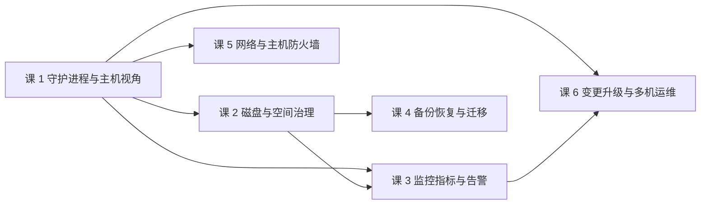

# 运维专项（Docker 系统学习 · 子教程）

> **定位**：面向**运维 / SRE**——把「容器上线之后怎么养」这摊事说清：守护进程怎么管、磁盘怎么清、指标怎么看、数据怎么备份、网络怎么过防火墙、版本怎么升。
> **前置**：主线**阶段 4（生产落地）**的知识。本子教程**不重复主线内容**——同一批事物，主线讲「开发怎么用」，这里讲「运维怎么养」。
> **怎么进入**：① 已学主线 → 直接按课清单学；② 只为本专项而来（运维岗）→ 先补主线阶段 4（课 10–13），或按各课课首的「前置提示」按需回看主线课。

> **本子教程的口径**：按需学习、**不进主线进度**（主线仍是 5 阶段 15 课 46 知识点）。不做综合项目、不产领域三产物、不配应用实战与源码解析篇——那是主线的收尾与配套。

## 与主线的关系

| 同一件事 | 主线（开发视角） | 本子教程（运维视角） |
|----------|-----------------|---------------------|
| 日志 | 课 11：配 `max-size` / `max-file`，让容器日志不撑爆 | 课 2：日志占多少盘、谁来清、留存多久、怎么集中 |
| 资源 | 课 10：给容器设 `--memory` / `--cpus` 边界 | 课 3：整机和引擎层面怎么看出"快满了" |
| 观测 | 课 11：`docker stats` / `events` / `inspect` 单机观测 | 课 3：daemon 暴露 Prometheus 指标、长期趋势与告警 |
| 安全 | 课 12：`USER` / `--cap-drop` / 镜像来源 | 课 1：2375 与 `docker.sock` 的暴露面；课 6：例行安全运维 |
| 网络 | 课 8：容器之间怎么互通 | 课 5：Docker 与宿主机 iptables / DOCKER-USER 的关系 |
| 数据 | 课 7：volume 让数据活过容器 | 课 4：卷怎么备份、怎么迁、怎么演练恢复 |

> **主线中的提及级**：主线讲上述内容时只写一句话 + 指向本子教程（如"生产环境守护进程一般开 live restore——怎么配、怎么排障见《子教程 · 运维专项》课 1"）。

**与 Phase 5 三件套的分工**：本子教程是**系统学**（机制 / 操作 / 体系）；`08-实战经验` / `09-排障速查手册` / `10-场景解法库` 是**经验与急用**（坑 / 止血 / 设计权衡）。二者按需互引、不重复——排障手册按"症状"倒查，这里按"体系"正着学。

## 课清单

| 课 | 知识点（关键点） | 对应主线提及 |
|----|-----------------|-------------|
| **课 1：守护进程与主机视角** | ① 引擎的三层配置（systemd drop-in / `daemon.json` / 启动参数）与谁覆盖谁 ② 守护进程日志与"起不来"的三板斧 ③ `docker.sock` 与 2375 的暴露面 | 课 1 `docker info`、课 10 live restore、课 12 socket 风险 | ✅ 已完成（2026-09-20，897 行，全 🟢 实测） |
| **课 2：磁盘与空间治理** | ① 数据根目录与存储驱动（`rootfs`/`volumes`/`containers` 职责） ② `docker system df` 四分法**与它的盲区**（日志不入账） ③ 日志碎纸机（未轮转）与 `prune` 的安全边界 | 课 3 清理命令（入门级，未讲容量治理） | ✅ 已完成（2026-09-20，969 行，全 🟢 实测） |
| **课 3：监控指标与告警** | ① daemon Prometheus 指标与 `docker stats` 的分工（快照 vs 趋势，同源 cgroup v2） ② **指标语义三步核验**（值域 / 语义出处 / 连续采样） ③ 从指标到告警规则与阈值（本机基线 + PSI + OOMKilled 陷阱） | 课 11 `docker stats`、课 10 资源限制 | ✅ 已完成（2026-09-20，960 行，全 🟢 实测） |
| **课 4：备份恢复与迁移** | ① 卷备份与数据库一致性（物理 vs 逻辑 / 活跃写入 / 具名·匿名·孤儿卷） ② 镜像与 registry 迁移（`save`/`load` vs 仓库对拷 / `RepoDigests` 判本地构建） ③ 整机搬迁与恢复演练（四类资产 / bind mount 易漏 / RPO·RTO） | 课 7 volume tar 套路、课 13 `save`/`load`（速查卡） | ✅ 已完成（2026-09-20，**1077 行**，全 🟢 实测）＋ 配套[《备份演练实录》](lessons/lesson-04-备份演练实录.md)（方案 A 真实跑通，**RTO 4 秒**） |
| **课 5：网络与主机防火墙** | ① Docker 与 iptables / nftables 的分工与 **DOCKER-USER 链**（DNAT 先于过滤的坑） ② 端口暴露面盘点（**27 IP × 87 端口 = 2349**）与冲突定位 ③ 跨主机网络与 **MTU 黑洞**（VXLAN 50 字节开销） | 课 8 容器网络、课 9 compose 网络 | ✅ 已完成（2026-09-20，**948 行**，全 🟢 实测） |
| **课 6：变更升级与多机运维** | ① 引擎版本升级与回滚（含 live restore 的作用边界） ② `docker context` 批量操作与 systemd 自启托管 ③ 例行安全运维与巡检清单 | 课 15 `docker context`、课 10 live restore | ✅ 已完成（2026-09-20，**1070 行**，全 🟢 实测）＋ 沉淀 `docker-inspect-audit.sh` 只读巡检清单 |

> **课 3 知识点②的说明**：「指标语义三步核验」是用户跨课程固化的通用铁律（源自 Kafka 课 `RequestHandlerAvgIdlePercent` 实测教训——照抄阈值的告警永不触发）。Docker 侧存在同类坑（`docker stats` 瞬时值与 daemon 累积指标的语义差），故在此**作为正式知识点**落地，不因"偏方法论"而降级。

## 学习路径

- **顺序学**：按课 1 → 6 走，课 1 是其余各课的前置（守护进程是所有运维动作的入口）。
- **按需挑课**：磁盘告警直奔课 2；要接 Prometheus 直奔课 3（需先懂课 1 的 daemon 配置）；要做迁移直奔课 4。课 5 / 课 6 只依赖课 1，可独立学。

## 🧪 本机实测基线

> 与主线 15 课「守护进程未运行、无 🟢 实测」不同，本子教程**已确认可用实测环境**，课文件优先给出真实输出。

| 项 | 实测值（2026-09-20） |
|----|---------------------|
| 环境 | WSL Ubuntu **24.04.4 LTS**（Windows 侧无 docker CLI，命令一律走 `wsl -d Ubuntu -- bash -c "..."`） |
| Docker Engine | **29.4.1** |
| 存储驱动 / cgroup | **overlayfs** / **systemd**（cgroup v2） |
| 日志驱动 | **json-file**（默认，无限轮转） |
| 防火墙后端 | **iptables-nft**（`iptables` 与 `nft` 并存，`nft list ruleset` 提示 nat 表由 iptables-nft 管理） |
| `DOCKER-USER` 链 | **已存在**且当前无规则（默认全放行） |
| `daemon.json` | **不存在**（`/etc/docker/daemon.json`）——课 1 可用它演示"默认值从哪来" |
| 空间现状 | 镜像 97 个 77.78GB（可回收 12.25GB） / 容器 197 个 20.4GB / 卷 218 个 46.72GB / Build Cache 173 项 14.77GB |
| 数据根 `/var/lib/docker` | **118G**（所在分区 1007G，用 223G，剩 733G / 24%） |
| 引擎启动方式 | systemd 直管（`PPID=1`），`ExecStart=/usr/bin/dockerd -H fd:// --containerd=...`；**无 drop-in 目录** |
| `live-restore` | **false**（默认关闭 → 重启 daemon 会带走容器） |
| socket 暴露面 | `/var/run/docker.sock` 权限 `srw-rw---- root:docker`；docker 组**无成员**；2375 / 2376 **均未监听**；仅 1 个 `default` context，`DOCKER_HOST` 未设置 |
| 数据根子目录 | `rootfs` 60G / `volumes` 44G / `containers` 14G / `buildkit` 155M / `network` 1.1M / `image` 76K |
| **日志盲区（课 2 核心）** | `containers` 目录 13797 MB 中 `*-json.log` 占 **13795 MB（99.99%）**；`docker system df` 四类账本**均不统计日志** |
| 最大日志归属 | `/doris-learn`（`apache/doris:4.1.3`，running，2026-09-02 启动）→ **10660 MB / 18 天**，`LogConfig.Config` 为 `{}` 未配轮转；实测增速 60 秒 +366654 字节 ≈ **6 KB/s** |
| 全机日志配置 | 197 个容器**全部** `json-file` 且 `Config:{}`（无轮转），与课 1「`daemon.json` 不存在」形成闭环 |
| prune 预演数 | 已停止容器 73 / dangling 镜像 2（4.5GB）/ dangling 卷 137；`prune` **不支持 `--dry-run`**（实测 `unknown flag`） |
| 卷回收悖论 | 46.14GB 仅可回收 673MB——11G 卷被 `doris-mysql-demo`、5.2G 被 `k8s-c1-control-plane` 引用（**在用数据非垃圾**） |
| Prometheus 指标 | **未开启**：`dockerd` 无 `metrics-addr` 参数，9323 未监听，`curl` 返回 `HTTP 000`；`daemon.json` 仍不存在（与课 1 一致） |
| cgroup 版本 | **v2**（`cgroup2fs`，controllers: cpuset cpu io memory hugetlb pids rdma）；`docker stats` 数据源即 cgroup（实测 `memory.current=1099018240` ≈ `1.01GiB`） |
| **stats 字段语义** | `CPUPerc`/`MemUsage`/`PIDs` 为**瞬时**（实测 1.43%→1.61%→23.34%，PIDs 168→166）；`NetIO`/`BlockIO` 为**累积**（5 次采样不变，另轮 370MB→376MB 只增） |
| MemPerc 陷阱 | `l15-kafka-1` 报 `1.01GiB / 31.07GiB = 3.25%`——分母是**主机内存**（`HostConfig.Memory=0` 未设限），照抄 `>80%` 告警永不触发 |
| PSI 压力（推荐告警） | 主机 `cpu.some avg10` 1.08（有升有降 = 窗口均值）；`memory.some` **0.00**；`io.some` 0.00 |
| 主机基线 | 20 核 / 内存 31819MB（**使用率 75.1%** 但 PSI=0.00 无压力）/ 负载 2.16 / 磁盘 24% / 容器 197（运行 121、停止 73） |
| 事件流 | 近 5 分钟：`exec_die` 68 / `start` 13 / `die` 13 / `network` connect-disconnect 各 13——**有服务反复启停** |
| OOMKilled 陷阱 | 197 个中 **2 个 true**（`k8s-c1-calico-worker2`、`k8s-c1-control-plane`），但均 `running`、`RestartCount=0`、`ExitCode=0`、`MemoryLimit=0` → **历史标记非当前状态** |
| 健康检查覆盖 | 抽样 50 个运行中容器：**49 个 none / 1 个 healthy**（全机仅 `l12-renderer`/`doris-learn`/`docker-db-1` 有）→ **最大观测盲区** |
| 卷构成 | **218 个卷**：具名 **15** / 匿名 **203（93%）**；匿名卷名为 64 位哈希，无法判断内容 |
| 孤儿卷 | 15 个具名卷中 **6 个无任何容器引用**，其中 `prom_data`、`victoriametrics_capstone_data` 为 4.0K 空卷；匿名孤儿卷中实测有 46MB 的 |
| **pg 数据在匿名卷** | `l12-pg`（PostgreSQL 16.15）数据卷为匿名卷 `1fe9255...`，82MB，**94 张表**；按卷名备份的脚本必然漏掉它 |
| 活跃写入判据 | `postmaster.pid` 存在；10 分钟内 5 个文件被改（`pg_wal×2` / `global/pg_control` / `pg_xact` / `replorigin_checkpoint`） |
| pg 用户名坑 | `psql -U postgres` 报 `FATAL: role "postgres" does not exist`——容器 `POSTGRES_USER=grafana`，**用户名须从 `inspect` 的 Env 读** |
| 热备份标记 | `pg_backup_start()` 返回 LSN `0/C000028`；`psql -c` 分两次调用时 `stop` 报 `backup is not in progress`——**必须同一会话成对调用** |
| 挂载类型 | 运行中容器：**57 bind / 41 volume / 60 无挂载**——**57 个 bind mount 不在 `volume ls` 里，最易漏** |
| 镜像构成 | 97 个镜像 / **77.77GB**；最大 `unclecode/crawl4ai` 5.73GB、`xpert-api` 4.28GB、`apache/doris` 4.27GB |
| save 产物量级 | 实测 `busybox`：`images` 显示 6.81MB（解压后），`save` 产物 **2.15MB**——**比例不通用，须 `save \| wc -c` 实测** |
| 备份现状 | **方案 A 已执行**（2026-09-20 授权）：`pg_dump` 导出 **76KB**，隔离容器导入**逐表 diff 全通过**，源库未受影响 → 从零备份变为「1 份**已验证**备份」 |
| **逻辑 vs 物理** | 物理目录 **82MB** → 逻辑导出 **76KB**（custom 格式压缩前 0.27MB），**相差约 1000 倍**：82MB 绝大部分是 WAL 段与索引膨胀 |
| **RTO 实测** | **4 秒**（起容器到数据可查 = 启动 2 秒 + 导入 2 秒）；演练前为「未知」 |
| 演练踩坑 | 管道导入时 `docker exec` **必须带 `-i`**——漏了会**静默导入空数据且不报错**；`n_live_tup` 是估算值，**校验必须用 `count(*)`** |
| 备份落盘 | D 盘可用 2.7T（可容纳 77.77GB+46.6GB 全量）；但同盘备份在盘坏时一起没 |
| **升级面（课 6 核心）** | docker-ce 已装 **29.4.1**，候选 **29.8.1**（跨 4 个 minor）；apt 版本表共 **72** 个版本，其中比当前更旧的有 **56** 个（26.x–29.x 全系列，回滚路径存在） |
| **live-restore** | **false**（课 1 已知，课 6 确认后果）→ 升级必停机；官方口径只保补丁版（YY.MM.x），跨 minor 与跳版本**不保** |
| 运行时三层版本 | dockerd 29.4.1 / containerd.io **2.2.3**（候选 2.3.5，**可独立漂移**）/ runc 1.3.5 |
| 五个包（须同升） | docker-ce / docker-ce-cli / containerd.io / docker-buildx-plugin 0.33.0 / docker-compose-plugin 5.1.3 |
| **自启策略分布** | 194 个容器：`no=184（94.8%）` / `on-failure=7` / `always=2` / `unless-stopped=1` → **升级后仅 10 个（5.2%）会自动回来** |
| systemd 托管 | docker `enabled`+`active`；docker.socket **也 enabled**（socket 激活）；`DropInPaths=` 空、**无 drop-in**；MainPID=266，已运行 2 周 5 天 |
| **context 现状** | 仅 1 个 `default`，`DOCKER_HOST` 未设置，`~/.docker/contexts/` **不存在**；实测 `export DOCKER_HOST=tcp://127.0.0.1:59999` **盖掉** context（报错验证） |
| SSH 多机前提 | sshd 在跑（22 监听）／有 id_ed25519 密钥／known_hosts 4 行；**但 docker 组无成员**（`docker:x:989:`），远端需自行授权 |
| **高危配置扫描** | privileged **5 个**（4 个 kind 节点 + 1 个 otel，属实验刚需）；挂 docker.sock **0 个**；host 网络 **1 个**（`prom-learn`，课 5 已知不受 DOCKER-USER 管）；cap-add **0 个** |
| 缺失率三项 | 无内存上限 **119/119（100%）**；无健康检查 **116/119（97.5%）**；未配日志轮转 **194/194（100%）** |
| **暴露面复核** | 0.0.0.0 通配 **84** + 127.0.0.1 回环 **3** = 并集 **90**；课 5 记 87 为当时快照，**端口数随容器启停浮动**，应与自己比而非求绝对精确 |
| **备份覆盖率（课 6 复测）** | **248 个卷中仅 1 个有备份**（`backups/l12-pg/grafana-2026-09-20-124927.sql.gz`，76KB，课 4 演练产物）；其余 247 个无备份 —— 这是回滚路径上最薄弱的一环 |
| **数据根（复测）** | `/var/lib/docker` 约 **129G**（课 2 曾记 128G，属正常浮动） |
| compose 项目 | 2 个项目 / 7 个容器（l15-kafka×3、l15-prom、l15-grafana、docker-pgweb-1、docker-db-1）——这 7 个是"有自启策略"的主要来源 |

> **实测纪律**：数据来自一台**长期跑教程实验的机器**（镜像/容器数量远超生产单机典型值），课中引用时须标注"本机为教程实验机"，避免读者误以为是生产基线。`daemon.json` 的**写操作**属改环境，写课 3 实测前须再次向用户请示。

## 📚 官方文档口径

本子教程沿用主线已建的 [docs.docker.com 索引](../web-index/INDEX.md)（309 条 / 9 分区）。运维专项新增落点已逐条核查可达（**15/15 返回 200**，核查于 2026-09）：

| 用途 | 页面 |
|------|------|
| 守护进程配置总入口 | [Configure the daemon](https://docs.docker.com/config/daemon/) / [dockerd 参考](https://docs.docker.com/reference/cli/dockerd/) |
| 守护进程排障 / 日志 | [Troubleshoot the daemon](https://docs.docker.com/engine/daemon/troubleshoot/) / [Read daemon logs](https://docs.docker.com/engine/daemon/logs/) |
| live restore / 远程访问 | [Live restore](https://docs.docker.com/engine/daemon/live-restore/) / [Remote access](https://docs.docker.com/engine/daemon/remote-access/) |
| Prometheus 指标 / 运行时指标 | [Collect metrics with Prometheus](https://docs.docker.com/engine/daemon/prometheus/) / [Runtime metrics](https://docs.docker.com/engine/containers/runmetrics/) |
| 磁盘与清理 | [docker system df](https://docs.docker.com/reference/cli/docker/system/df/) / [docker system prune](https://docs.docker.com/reference/cli/docker/system/prune/) |
| 卷备份 | [Volumes](https://docs.docker.com/engine/storage/volumes/) |
| 防火墙 | [Packet filtering and firewalls](https://docs.docker.com/engine/network/packet-filtering-firewalls/) |
| socket 风险 / context | [Protect the daemon socket](https://docs.docker.com/engine/security/protect-access/) / [docker context](https://docs.docker.com/reference/cli/docker/context/) |

## 学习进度

> 子教程进度**独立记录于此**，不混入主线进度表；课文件生成并学完后勾选。

- [x] 课 1：守护进程与主机视角（2026-09-20 完成，897 行，2 张 SVG）
- [x] 课 2：磁盘与空间治理（2026-09-20 完成，969 行，2 张 SVG）
- [x] 课 3：监控指标与告警（2026-09-20 完成，960 行，2 张 SVG）
  - [x] 课 4：备份恢复与迁移（2026-09-20 完成，1077 行，2 张 SVG ＋ 1 份演练实录）
- [x] 课 5：网络与主机防火墙（2026-09-20 完成，948 行，2 张 SVG）
- [x] 课 6：变更升级与多机运维（2026-09-20 完成，1070 行，2 张 SVG ＋ 1 份巡检脚本）

## 生成与评审规则

- **课文件**：进入本子教程时按主线 Phase 2 **同口径**分批生成（五幕骨架 / 知识点六要素 / 双视角评审 / 官方核对与事实核查双闸门照常），**不因"子教程"降标准**。
- **评审占位**：课文件生成前**自行占位**评审条目到 [`00-评审清单.md`](../00-评审清单.md)（同速览模式——预占位会产生永远无法勾选的死条目）。
- **回写**：每课完成后更新本文件进度、`02-课程目录.md` 子教程章节、`00-学习档案.md` 的子教程进度小节。

---

> 🔙 返回 [课程目录](../02-课程目录.md) ｜ 📖 主线 [学习路径总览](../01-学习路径总览.md)
