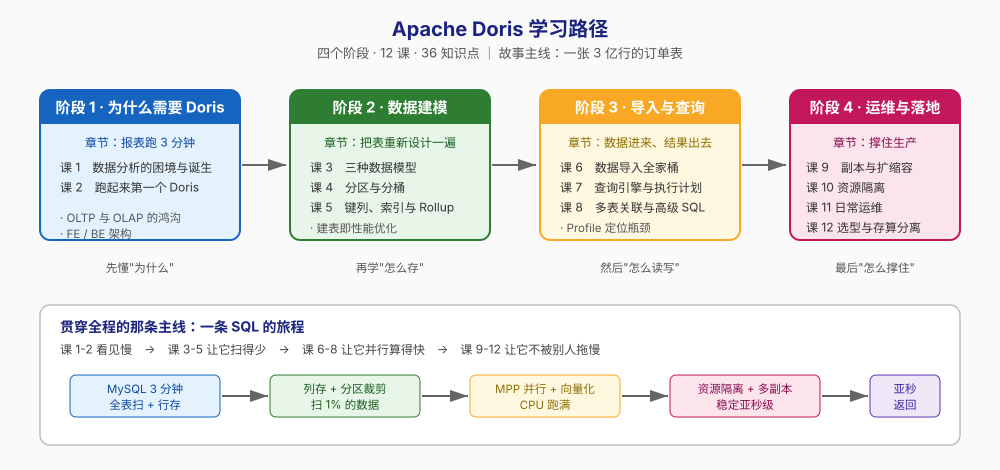

# Apache Doris 学习路径总览

> 本文件是活文档，随学习进度动态调整。

## 🎯 学习目标

- **目标类型**：理解概念 + 动手实操 + 应试认证 + 决策参考（四目标全要）
- **目标说明**：从零建立 Doris 的完整心智模型——既能自己动手部署集群、建表导数、调优查询，也能判断"这个场景该不该用 Doris、该选哪种机型与表模型"，并在需要时对照官方文档补齐认证所需的知识点。

> 沿用本仓库 Elasticsearch / Redis / RabbitMQ 课程的画像设定。若只需其中某一项（例如只想快速上手写 SQL），告知后调整此处并同步精简各课的实操比重。

## 故事主线

- **主角**：一家电商公司的数据团队，和他们的**一张订单明细表**
- **冲突**：MySQL 里 3 亿行订单数据，运营要跑"按省份按月的销售额 Top10"——加索引、上从库、搞分库分表全试过，报表还是要跑 3 分钟
- **收束**：学完全程你应能回答——*一条 SQL 从提交到返回，在 Doris 集群里究竟经历了什么？为了让它在亚秒级返回，我该在建模、索引、资源三个层面上分别做什么？*

> 四个阶段是这条故事线的四个章节：认清困境 → 学会建仓 → 掌握读写 → 撑住生产。

## 学习路径图

## 阶段总览

### 阶段 1：为什么需要 Doris（预计 1 周）

- **目标**：说清 OLAP 与 OLTP 的本质差异，理解 Doris 的架构设计，并能在本机跑起一个可用的 Doris 集群
- **学习重点**：
  - 行存 vs 列存如何决定"全表扫描"的成本
  - FE（大脑）与 BE（肌肉）的分工，为什么只有两个进程就够了
  - 分区分桶是 Doris 一切性能的起点
- **必须掌握**：能解释为什么"3 亿行订单按月汇总"在 MySQL 慢而在 Doris 快；能独立用 Docker 起集群并确认 FE/BE 存活
- **对应课**：课 1《数据分析的困境与 Doris 的诞生》、课 2《跑起来第一个 Doris》

### 阶段 2：数据建模（预计 2 周）

- **目标**：拿到一份业务需求，能选出正确的表模型、设计合理的分区分桶、配上合适的索引
- **学习重点**：
  - Duplicate / Aggregate / Unique 三种模型的取舍（这是 Doris 建模最核心的决策）
  - 分区（时间维度裁剪）与分桶（并行度 + 数据分布）的不同职责
  - 前缀索引、BloomFilter、倒排索引分别解决什么问题
- **必须掌握**：能为一个"用户行为日志"和一张"订单表"分别设计建表语句并说明理由
- **对应课**：课 3《三种数据模型》、课 4《分区与分桶》、课 5《键列、索引与同步物化视图》

### 阶段 3：数据导入与查询（预计 2 周）

- **目标**：把数据从各个源头接进来，并能看懂和优化一条慢查询
- **学习重点**：
  - Stream Load / Routine Load / Broker Load / INSERT INTO 的适用场景
  - MPP 分布式执行 + 向量化执行是怎么配合的
  - 用 EXPLAIN 和 Profile 定位瓶颈，而不是靠猜
- **必须掌握**：能搭一条从 Kafka 到 Doris 的实时导入链路；能对着 Profile 说出"时间花在哪个算子"
- **对应课**：课 6《数据导入全家桶》、课 7《查询引擎与执行计划》、课 8《多表关联与高级 SQL》

### 阶段 4：分布式运维与生产落地（预计 2 周）

- **目标**：让集群在生产环境稳定跑起来，并能做出架构选型决策
- **学习重点**：
  - 副本、FE 高可用、扩缩容——故障时数据怎么不丢
  - Workload Group 资源隔离：一个大查询不能拖垮整个集群
  - 存算一体 vs 存算分离怎么选；什么时候不该用 Doris
- **必须掌握**：能设计一套"报表查询"与"实时写入"互不干扰的资源隔离方案；能说出三个"不该用 Doris"的场景
- **对应课**：课 9《副本、高可用与扩缩容》、课 10《资源隔离与负载管理》、课 11《日常运维：Schema Change、备份与升级》、课 12《选型、存算分离与场景落地》

### 阶段 5：综合实战（Phase 3，2026-09-03 已完成）

- **目标**：把 12 课、36 个知识点串进一条能真跑的链路，从需求一路做到验收
- **项目**：[电商实时数仓](projects/1-电商实时数仓/README.md) —— MySQL 里 2150 万行订单表报表要跑 3 分钟，用 Doris 建 ODS → DWD → DWS → ADS 四层解决
- **学习重点**：
  - 四层建模的职责划分与表模型选型（ODS 贴源保脏 / DWD 去重 / DWS 预聚合 / ADS 面向报表）
  - 批量（parquet → MinIO → S3 TVF）与实时（Kafka → Routine Load）双链路，以及怎么对账
  - Rollup / 异步 MV / Colocate Join / Profile 四件加速武器各自的适用条件
  - 副本、资源隔离、Schema 变更、备份恢复——什么样的数仓才"能在生产上过夜"
  - **边界**：哪些需求不该接进 Doris（点查 / 高频单行改 / 事务 / 流计算）
- **必须掌握**：能独立完成一次全链路对账并解释每层行数差异；能说出五个"不该用 Doris"的场景及替代方案
- **五个 Task**：[需求与建模](projects/1-电商实时数仓/task-1-需求与建模.md) → [数据接入](projects/1-电商实时数仓/task-2-数据接入.md) → [查询加速与调优](projects/1-电商实时数仓/task-3-查询加速与调优.md) → [生产化](projects/1-电商实时数仓/task-4-生产化.md) → [验收与边界](projects/1-电商实时数仓/task-5-验收与边界.md)

## 当前进度

- [x] 阶段 1：为什么需要 Doris（✅ 已完成，2026-09-02）
- [x] 阶段 2：数据建模（✅ 已完成，2026-09-02）
- [x] 阶段 3：数据导入与查询（✅ 已完成，2026-09-02：课 6、课 7、课 8 全部交付）
- [x] 阶段 4：分布式运维与生产落地（已完成，2026-09-03：课 9、课 10、课 11、课 12 全部交付，4/4 课）
- [x] 阶段 5：综合实战 Phase 3（✅ 已完成，2026-09-03：5/5 Task 全部交付，五条验收标准逐条实测核对）
- [x] Phase 4：课程手册汇总（✅ 已完成，2026-09-03：[final-课程手册.md](final-课程手册.md)，索引型 720 行）

**总进度**：36 / 36 知识点已完成 + Phase 3 综合实战 5/5 Task 完成 + Phase 4 课程手册已汇总（2026-09-03）

**全课程收官状态**：12 课讲义 + 1 个贯穿全课程的实战项目 + [课程手册](final-课程手册.md) 全部交付。**剩余 Phase 5**：实战经验 / 排障速查手册 / 场景解法库（三份一次生成）。遗留未实测项（环境所限，已在各文档如实标注 🔴）：Workload Group 的 CPU 配额（cgroup 只读）、多副本抗宕机（2 BE 同 host 触发反亲和）、存算分离（需 cloud mode）、分区裁剪的性能收益（需数据量上亿）。
