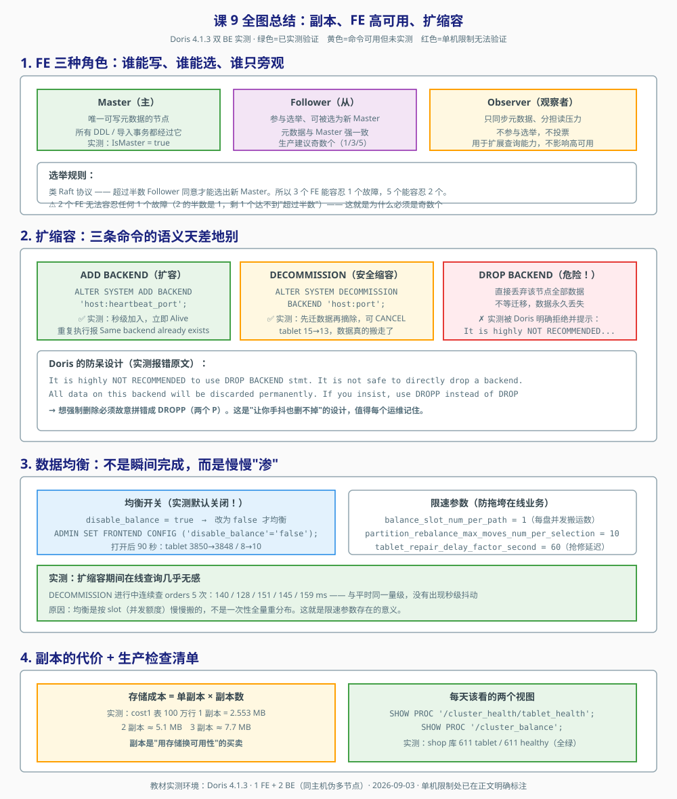

# Apache Doris 课程手册

> **本手册是索引，不是正文。**
> 它的作用是在你回望全局时快速定位——每课保留「一句话定位 + 核心结论 + 一图总结 + 关键数字」，
> 细节一律点回原课。**共 12 课、36 个知识点、4 个教学阶段 + 1 个实战阶段、1 个贯穿全课程的实战项目**，
> 全部结论均在本机（Doris 4.1.3-rc02、1 FE + 2 BE、WSL + Docker）实测得出。

> 📖 **怎么用这份手册**：
> - **忘了某课讲了什么** → 翻到对应阶段，看「一句话串起来」和「关键数字」
> - **想知道 Doris 该不该用** → 直接看末尾的 [决策清单](#决策清单)
> - **要复习应试** → 直接看末尾的 [考点速记](#考点速记)
> - **生产上出事了** → 这份手册不够用，去 [09-排障速查手册.md](09-排障速查手册.md)（按症状倒查，只给动作）
> - **想懂为什么会踩坑** → [08-实战经验.md](08-实战经验.md)（10 条故障模式 + 2 个真实事故复盘）
> - **要设计新方案** → [10-场景解法库.md](10-场景解法库.md)（7 道开放设计题，先想后看）

## 全课程一句话

**Doris 用「列存少读 + MPP 并行算 + 向量化吃满 CPU」三件事，把聚合型查询从分钟级压到亚秒级；
代价是它放弃了事务、点查和高频单行改——选型不是问「它快不快」，而是问「我的查询模式是不是它擅长的那种」。**

## 三句话方法论（贯穿 12 课，比任何单个知识点都值钱）

1. **「快」是有前提的**——先问查询模式，再谈性能。扫 1 列 0.13 秒、扫 13 列 0.51 秒，同一个表差 4 倍。
2. **测量方法比测量结果重要**——先剥离噪声，再下结论。课 12 差点把 130 ms 的点查延迟（实为连接开销）写进正文，
   做空连接对照后真实值是 5.7-6.6 ms。**这一条救了至少三课的数字。**
3. **静默失败比报错危险**——验证要看数据对不对，不只是看有没有报错。
   全课程抓到四个静默失败，[见文末汇总](#四个静默失败全课程最贵的收获)。

## 学习路径总览

| 阶段 | 主题 | 课 | 故事章节 | 学完你能回答 |
|------|------|-----|---------|-------------|
| 1 | 为什么需要 Doris | 课 1-2 | 报表跑 3 分钟 | 为什么 MySQL 加了索引还是慢，Doris 凭什么快 |
| 2 | 数据建模 | 课 3-5 | 把表重新设计一遍 | 同样的 3 亿行，换个建模方式能快多少 |
| 3 | 数据导入与查询 | 课 6-8 | 数据进来、结果出去 | 数据怎么进来，慢查询卡在哪一步 |
| 4 | 分布式运维与生产落地 | 课 9-12 | 撑住生产 | 机器挂了怎么办，什么场景不该用它 |
| 5 | 综合实战 | 5 个 Task | 从 MySQL 到四层数仓 | 能不能独立做一条能真跑的链路 |

**主线故事**：一家电商公司的数据团队，和他们的**一张订单明细表**。
MySQL 里 3 亿行订单，运营要跑「按省份按月的销售额 Top10」——加索引、上从库、搞分库分表全试过，报表还是要跑 3 分钟。
学完全程你应能回答：*一条 SQL 从提交到返回，在 Doris 集群里究竟经历了什么？为了让它在亚秒级返回，我该在建模、索引、资源三个层面上分别做什么？*

## 全课程知识点地图（36/36）

| # | 知识点 | 课 | # | 知识点 | 课 |
|---|--------|-----|---|--------|-----|
| 1 | OLTP 与 OLAP 的鸿沟 | 课 1 | 19 | MPP 执行流程 | 课 7 |
| 2 | Doris 是什么 | 课 1 | 20 | 向量化执行与列存 | 课 7 |
| 3 | Doris 的典型场景 | 课 1 | 21 | EXPLAIN 与 Profile | 课 7 |
| 4 | FE 与 BE 架构 | 课 2 | 22 | Join 与分布式 Join 策略 | 课 8 |
| 5 | 用 Docker 起集群 | 课 2 | 23 | 复杂类型与半结构化数据 | 课 8 |
| 6 | 第一张表与第一條查询 | 课 2 | 24 | 异步物化视图与查询改写 | 课 8 |
| 7 | Duplicate 明细模型 | 课 3 | 25 | 多副本与自动修复 | 课 9 |
| 8 | Aggregate 聚合模型 | 课 3 | 26 | FE 高可用 | 课 9 |
| 9 | Unique 主键模型 | 课 3 | 27 | 扩缩容与数据均衡 | 课 9 |
| 10 | 分区 | 课 4 | 28 | Workload Group 与资源隔离 | 课 10 |
| 11 | 分桶 | 课 4 | 29 | 内存管理与 Spill to Disk | 课 10 |
| 12 | 分区分桶裁剪 | 课 4 | 30 | 查询并发与队列控制 | 课 10 |
| 13 | Key 列排序与前缀索引 | 课 5 | 31 | Schema Change | 课 11 |
| 14 | 索引家族 | 课 5 | 32 | 备份与恢复 | 课 11 |
| 15 | 同步物化视图（Rollup） | 课 5 | 33 | 监控告警与集群升级 | 课 11 |
| 16 | Stream Load | 课 6 | 34 | Doris 与同类系统对比 | 课 12 |
| 17 | Routine Load | 课 6 | 35 | 存算分离架构 | 课 12 |
| 18 | Broker Load 与 INSERT INTO | 课 6 | 36 | 典型场景架构与反模式 | 课 12 |

## 阶段速查（各阶段重点一览）

| 阶段 | 必须掌握 | 最反直觉的一条 |
|------|---------|--------------|
| 1 | 行存/列存差异；FE/BE 分工；独立起集群 | 加了索引能快 3 倍，但换维度就失效，且写入慢 30 倍 |
| 2 | 三种模型选型；分区分桶设计；索引取舍 | 分区不是越细越好——按天查一月要扫 240 个 tablet，按月只要 8 个 |
| 3 | 四种导入方式；Profile 定位；Join 策略 | Join 慢在中间结果，不在策略——同为 Shuffle，24 万行 53 ms vs 156 亿行 4 分 44 秒 |
| 4 | 副本与自愈；资源隔离；Schema Change 与备份；选型 | `ROLLBACK` 不报错但什么都没撤；`COUNT(*)` 宕机了照样返回 |

---

## 阶段 1：为什么需要 Doris

> 故事章节：**报表跑 3 分钟**——运营同学在等一个数，数据库在苦熬

### 课 1《数据分析的困境与 Doris 的诞生》

📖 [打开完整讲义](stages/1-为什么需要Doris/lessons/lesson-01-数据分析的困境与Doris的诞生.md)

**一句话串起来**：行存让聚合查询白读 8 倍数据（实测 165 字节 vs 20 字节）→ 索引只能救特定维度，
换维度就失效且拖慢写入（2.75 秒 → 80 秒）→ Doris 用列存 + MPP + 向量化从根上解决，且兼容 MySQL 协议让迁移无痛 →
但它只管分析场景，事务和缓存请留给 MySQL 和 Redis。

**关键数字**（2000 万行 MySQL 实测）：

| 观测项 | 数值 | 说明 |
|--------|------|------|
| 行存读取放大 | **约 8 倍** | 每行 165 字节，聚合只需 20 字节 |
| 加索引（命中维度） | 7.62 s → 2.64 s | 快 2.9 倍 |
| 加索引（换维度） | 8.61 s | **打回原形** |
| 加索引的写入代价 | 2.75 s → 80.10 s | **慢 29 倍** |

**三个必须记住的判断**：
- OLTP 是「一次碰几条记录但要所有列」，OLAP 是「一次碰几千万行但只关心少数几列」——存储布局必须跟着变
- Doris 的解法不是加更多索引，而是**列存（少读）+ MPP（并行算）+ 向量化（吃满 CPU）**
- 协议兼容 ≠ 能力等价：Doris 兼容 MySQL 协议，但不是事务型数据库

### 课 2《跑起来第一个 Doris》

📖 [打开完整讲义](stages/1-为什么需要Doris/lessons/lesson-02-跑起来第一个Doris.md)

**一句话串起来**：Doris 只有 FE（想）和 BE（干）两类进程、不依赖任何外部服务，所以一条 `docker run` 就能起集群 →
9030 查询（MySQL 协议，报告自己是 5.7.99）、8030 看状态、8040 导数据 → 建表比 MySQL 多三样
（`DUPLICATE KEY` / `DISTRIBUTED BY HASH` / `PROPERTIES`，单机必须 `replication_num=1`）→
实测 2050 万行：查询快 24–75 倍、存储压缩 16 倍、21 秒灌完 → 但也踩到分桶倾斜的坑，8 个桶空了一半。

**关键数字**（2050 万行，MySQL vs Doris）：

| 观测项 | MySQL | Doris | 倍数 |
|--------|-------|-------|------|
| Q1 按月汇总 | 3.36 s | 0.14 s | **24 倍** |
| Q2 换维度 | 9.36 s | 0.13 s | **75 倍** |
| 存储占用 | 3472 MB | 215 MB | **16 倍** |
| 导入 2050 万行 | — | 21 秒 | 零过滤 |
| 单行点查 | 0.12 s | 0.13 s | **打平** |

**三个必须记住的判断**：
- FE 是大脑（接请求、解析 SQL、管元数据），BE 是肌肉（存数据、执行计划）；FE 间用内置类 Raft 自治，**不依赖任何外部协调服务**
- FE 三种角色：Master 唯一可写、Follower 有投票权、Observer 只读不投票
- **分桶键必须选高基数列**：`HASH(province) BUCKETS 8` 而数据只有 8 个省 → 8 个 tablet 空了一半，理论并行度 8 实际只有 4

> ⚠️ 点查打平这一行是课 1 就埋下的伏笔：Doris 不是万能的。课 12 会用 5.7-6.6 ms/次 把这个结论钉死。

---

## 阶段 2：数据建模

> 故事章节：**把表重新设计一遍**——同样的 3 亿行，换个建模方式快 10 倍

### 课 3《三种数据模型》

📖 [打开完整讲义](stages/2-数据建模/lessons/lesson-03-三种数据模型.md)

**一句话串起来**：三种模型是三种「存数据的态度」——Duplicate 原样留（安全牌、可回溯）、
Aggregate 边存边算（存储省 141 倍、并发快 4.8 倍，但明细烧掉）、
Unique 后写覆盖前写（等价于全 REPLACE 的 Aggregate，4.x 默认 MOW 导入即合并）；
选型的三个问题：要按主键更新吗？维度固定吗？都不是就选 Duplicate。

**关键数字**（2050 万行）：

| 观测项 | 数值 | 说明 |
|--------|------|------|
| 聚合表行数压缩 | 2050 万 → 18.8 万 | **108 倍** |
| 聚合表存储压缩 | 214 MB → 1.5 MB | **141 倍** |
| 单表单次查询提速 | 约 0.1 秒 | **几乎没用**（固定开销 0.13 秒吃掉了） |
| 8 并发查询 | 0.81 s vs 0.17 s | **4.8 倍**（真正的战场） |
| MOW 落盘（30 万行导入） | 14,659 行 | 导入即合并 |
| MOR 物理行（同数据） | 29,104 行 | 查询时才合并，`COUNT(*)` 虚高 |

**三个必须记住的判断**：
- Unique **等价于「所有 Value 列都 REPLACE 的 Aggregate」**，所以「既要 SUM 又要 REPLACE」的混用需求只能用 Aggregate
- 模型迁移是单向的：Duplicate → Aggregate/Unique 只是重建表，反过来不可能
- **聚合表的价值在并发，不在单次延迟**——这是本课最重要的方法论发现

> ⚠️ 「单机单 BE 测不出聚合表的查询收益」这一条在本课程反复出现（课 4、课 7 第三次印证）。
> 根因都是同一个：**查询固定开销约 0.13 秒**，把扫描优势吃掉了。后来统一改用 EXPLAIN 的确定性字段作证据。

### 课 4《分区与分桶》

📖 [打开完整讲义](stages/2-数据建模/lessons/lesson-04-分区与分桶.md)

**一句话串起来**：分区是按时间切大块（价值在整块跳过和管理，粒度要匹配查询模式——
实测按天查一月要扫 240 个 tablet 而按月只要 8 个）、分桶是按哈希切小块（价值在打散并行，键要选高基数常用的列——
实测 `user_id` 倾斜比 1.006 vs `province` 3.00 且 4 个空桶）、两者叠加触发裁剪
（实测 `partitions=1/45`，扫描量从 2050 万降到 84 万、减少 24.3 倍）；
⚠️ 记住动态分区会以「今天」为基准建范围，历史数据可能静默丢失。

**关键数字**：

| 观测项 | 数值 | 说明 |
|--------|------|------|
| 分区裁剪扫描量 | 2050 万 → 84 万 | **减少 24.3 倍** |
| `partitions` 标记 | 1/45 | 45 个分区只扫 1 个 |
| 分桶键 `province`（8 个值） | 倾斜比 **3.00**，4 个空桶 | 不可用 |
| 分桶键 `user_id`（183 万值） | 倾斜比 **1.006** | 正确选择 |
| 按天 vs 按月（查一个月） | 240 vs 8 个 tablet | **差 30 倍** |
| tablet 总数膨胀 | 2920 vs 360 | **8 倍** |
| 分桶数对耗时影响 | 1/4/8/16 桶均约 0.19 秒 | 无影响 |

**三个必须记住的判断**：
- **分区不是越细越好**——粒度必须匹配查询模式，否则 tablet 膨胀 8 倍、扫描单元反而更多
- 分桶键的选择方法是**看基数**，不是拍脑袋（结清了课 3 的欠账）
- 动态分区以「今天」为基准建范围，历史数据落在范围外会被 **strict mode 静默过滤**（实测 25 个月数据 0 行导入、0 报错）

### 课 5《键列、索引与同步物化视图》

📖 [打开完整讲义](stages/2-数据建模/lessons/lesson-05-键列索引与同步物化视图.md)

**一句话串起来**：Key 列顺序决定数据怎么排序、也就决定哪些查询能命中前缀索引
（**注意硬约束：Key 必须是建表语句前几列**），ZoneMap 和前缀索引是自动免费的要先吃透，
BloomFilter / 倒排索引 / NGram BF 按需添加（**实测 2 个索引让存储 ×3.9，且中文分词会把「广东」匹配到「山东」**），
Rollup 是最后手段（实测命中时 `avgRowSize` 从 33.57 降到 14.43，但存储 +43%）；
优化判断靠 EXPLAIN 的确定性字段，不要靠秒表。

**优化的判断顺序（从免费到昂贵）**：

1. 先把 Key 列顺序排对 —— 免费但最易忽略
2. 再用 ZoneMap 和前缀索引 —— 自动生效、零成本
3. 然后才考虑加索引
4. 最后考虑 Rollup

**关键数字**：

| 观测项 | 数值 | 说明 |
|--------|------|------|
| 索引存储代价 | 150 MB → 302 MB → 578 MB | 加 2 个索引**增长 3.9 倍** |
| 中文分词误匹配 | `MATCH_ANY '广东'` 返回 5,624,176 行 | 实际只有 2,817,491 行，**「山东」被误匹配** |
| Rollup 命中收益 | `avgRowSize` 33.57 → 14.43 | 少读 **57%** |
| Rollup 存储代价 | +43% | 是列裁剪，不是预聚合 |

**三个必须记住的判断**：
- **Key 列必须是建表语句最前面的几列**且顺序一致，否则报 `Key columns should be a ordered prefix of the schema`
- `ALTER TABLE ... ADD ROLLUP` 在 Duplicate 表上建的是**列裁剪**（行数不变），不是预聚合
- 本机耗时测不出差异时，**改用 EXPLAIN 的确定性字段判断**：`TABLE:`（走哪个索引）、`avgRowSize`（读多少）、
  `PREDICATES` 列编号（是否命中前缀）、`partitions=`（裁剪比例）、`SHOW DATA`（存储代价）

> ⚠️ **易混**：本课的**同步 Rollup** 与阶段 3 课 8 的**异步物化视图**不是一回事——
> 前者与基表强绑定、导入时同步更新；后者独立存储、定时刷新且支持查询自动改写。

---

## 阶段 3：数据导入与查询

> 故事章节：**数据进来、结果出去**——从 Kafka 到亚秒级报表

### 课 6《数据导入全家桶》

📖 [打开完整讲义](stages/3-数据导入与查询/lessons/lesson-06-数据导入全家桶.md)

**第一原则：攒批。** 导入事务是「按次付费」而非「按行付费」——每次事务都要走一遍
开启事务 → 规划分发 → 写盘 → 提交发布的固定开销。把 N 次小事务合并成 1 次大事务，省下的是 N-1 次固定开销。

**四种方式的定位**：

| 方式 | 动词 | 场景 | 实测数据 |
|------|------|------|----------|
| **Stream Load** | 推（同步） | 本地文件一次性导入 | 1 万行 / 0.17 秒 |
| **Routine Load** | 订阅（常驻） | Kafka 实时流 | Lag 300 → RESUME 后归 0 |
| **Broker Load** | 拉（异步） | 对象存储批量 | 目录 2 万行 / 0.18 秒 |
| **INSERT INTO** | SQL 写入 | 小数据 / 表间搬运 | 单行 ×1000 = **34.42 秒** |

**关键数字**（攒批的代价，同样 1000 行）：

| 方式 | 耗时 |
|------|------|
| 1000 次单行 INSERT | **34.42 秒** |
| 1 次批量 INSERT（1000 行） | 1.03 秒 |
| 1 次 Stream Load（**10000 行**，10 倍数据） | **0.17 秒** |

**三个必须记住的判断**：
- **选型两步问**：数据在哪（决定推还是拉）→ 一次还是常驻（决定要不要 Routine Load）
- **Stream Load 返回 JSON 看三个数**：`Status`（成没成）、`NumberLoadedRows`（进了几行）、
  `NumberFilteredRows`（脏了几行）；`TxnId = -1` = 被 Label 幂等拦了
- **最危险的默认值**：`strict_mode` 默认 `false`，脏数据**静默转 NULL** 且 `Status` 仍报
  `Success`、`FilteredRows=0`。生产请显式设 `strict_mode:true`

> ⚠️ **Routine Load 的默认值与 Stream Load 相反**：`max_filter_ratio` 默认 **1.0**（Stream Load 是 0），
> 且 `max_batch_rows` 有 **200000 硬下限**，ALTER 改小直接报错。
> Docker 环境 Kafka 连不上，九成是 `advertised.listeners` 配了 `localhost`——容器里的 localhost 是它自己。

> 💡 **导入即 UPSERT**：Unique 表上重复导入相同主键是覆盖而非追加（实测 order_id=1 的「广东/100.00」
> 被「北京/999.99」覆盖），这让 Kafka 重复投递天然幂等——是流式场景推荐 Unique 表的根本原因。

### 课 7《查询引擎与执行计划》

📖 [打开完整讲义](stages/3-数据导入与查询/lessons/lesson-07-查询引擎与执行计划.md)

**第一原则：看账单，不看计划。** EXPLAIN 是计划（打算怎么花钱），Profile 是账单（钱花在哪了）。
优化查询永远要看账单。判据只有一条：**`ExecTime` 大 = 它自己慢，`WaitForDependency` 大 = 它的上游慢**。
读反了就会去优化一个 `ExecTime` 只有 18 微秒、却等了 196 毫秒的聚合算子——那是南辕北辙。

**关键数字**（同一张表、同样 200 万行、同样 `COUNT+SUM`，只改 SELECT 的列）：

| 观测项 | 扫 1 个窄列 | 扫 3 个 500B 宽列 | 倍数 |
|--------|------------|------------------|------|
| `ScanBytes`（磁盘读） | 15.26 MB | 22.92 MB | **1.5×** |
| `OutputBlockBytes`（送出去） | 15.26 MB | **2.82 GB** | **185×** |
| Scan `ExecTime` | 3.1 ms | 163.7 ms | **52×** |
| `Total` | 15 ms | 192 ms | **13×** |

**这张表是全课程最重要的一张**：磁盘读只多 1.5 倍，耗时却多 52 倍。
瓶颈**不在磁盘 IO，在解压、内存拷贝、传递**。
它直接推翻「扫描慢就去买更快的 SSD」的直觉——钱应该花在**少扫几列**上。

**Profile 三层读法**：

| 层 | 看什么 | 回答什么问题 |
|----|--------|-------------|
| Execution Summary | Plan vs Exec 耗时 | 计划阶段慢还是执行阶段慢？ |
| Fragment / Pipeline | 各 Fragment 耗时与倾斜 | 哪个 Fragment 慢？数据倾斜吗？ |
| Operator | `ExecTime` vs `WaitForDependency` | 哪个算子慢？自己慢还是等上游？ |

**三个必须记住的判断**：
- 列存 + 向量化是天生一对：列存让同列数据连续（实测 200 万行、逻辑约 2.9 GB 的表磁盘只占 **5.17 MB**，
  压缩约 550 倍），向量化把它切成 Block 批量处理（约 7576 行/块，`batch_size` 上限 8160）
- **并行度不是万灵药**：调大 `parallel_pipeline_task_num`，Scan 单次 `ExecTime` 从 16.26 ms 降到 2.85 ms（5.7 倍），
  但查询 `Total` 192 ms → 191 ms 几乎没变——证据是 Scan 的 `RowsProduced` 里 `sum = max = 2.0M`，**扫描器只有 1 个**
- **三个「本机测不出」已诚实标注**：向量化开关无效（4.x 已全面向量化）、调大并行度不提速、MPP 横向扩展能力（只有 1 台 BE）

> ⚠️ **抓 Profile 的三板斧**：`SET enable_profile=true` → 跑查询 → 按 SQL 文本 grep 取 QueryID（避开 mysql 探针的
> `select @@version_comment`）→ `curl` 抓正文（`SHOW QUERY PROFILE '/<QID>'` 只列目录，抓不到正文）。

### 课 8《多表关联与高级 SQL》

📖 [打开完整讲义](stages/3-数据导入与查询/lessons/lesson-08-多表关联与高级SQL.md)

**第一原则：Join 慢，慢在中间结果，不慢在策略。**
`orders`（2150 万）自关联，按 `user_id`（高基数，几乎一对一）Join 产出 **24.5 万行**，耗时 **53/57/70 ms**；
按 `province`（低基数，多对多）Join 产出 **156 亿行**，耗时 **4 分 44 秒**。
**相差约 4000 倍，但两次用的都是同一种 Join 策略。** 策略决定「怎么搬数据」，中间结果规模决定「搬完要做多少次比较」。
**先问中间结果有多少行，再问用哪个策略。**

**四种策略的代价排序**（`join op` 是唯一确定性证据）：

| EXPLAIN 标记 | 搬什么 | 前提 | 实测复现 |
|---|---|---|---|
| `BROADCAST` | 右表 × 节点数 | 右表够小 | `fact_1m JOIN dim_region` |
| `BUCKET_SHUFFLE` | 只搬右表 | Join 键 = 左表分桶键 | `orders JOIN perf_wide` |
| `PARTITIONED` | 左右都搬（最贵） | 无路可走时 | `orders JOIN orders_dup`（user_id） |
| `COLOCATE[]` | **零** | 同组同桶同副本 + IsStable | `orders JOIN fact_prov` |

**关键数字 — VARIANT vs JSON**（同一份 5 万条日志）：

| | 过滤耗时 | 聚合耗时 | 磁盘 |
|---|---|---|---|
| VARIANT | 16–26 ms | 49–67 ms | **3.49 MB** |
| JSON | 129–156 ms | 237–287 ms | **7.37 MB** |
| 差距 | **6–9 倍** | **约 6 倍** | **2.1 倍** |

VARIANT 磁盘 3.49 MB 已接近结构化存储（3.46 MB）——**用 0.03 MB 的代价换来了动态 schema**。

**关键数字 — 异步 MV**：实测 475 ms → 18 ms（**10–25 倍**），MV 只有 23360 行而基表 2150 万行。

**三个必须记住的判断**：
- **MV 能回答汇总问题，不能回答明细问题**；改写的判据在 EXPLAIN 末尾的 `MATERIALIZATIONS` 段：
  `MaterializedViewRewriteSuccessAndChose`（命中并选用）/ `SuccessButNotChose`（改写成功但不如直查）/ `RewriteFail`（失败）
- **改写不稳定是正常现象**：同一条聚合 SQL 交替执行，有时 18 ms 有时 475 ms，取决于优化器基于代价的选择，**不是配置错误**
- **策略是算出来的，不是写出来的**：同一张 8 行右表 `dim_region`，左表换成 `orders`（分桶键也是 province）后，
  `BROADCAST` 变成了 `BUCKET_SHUFFLE`——两个条件同时成立时，优化器按代价估算二选一

> ⚠️ **VARIANT 两条铁律**（都是实测踩出来的）：
> ① `WHERE` 里可直接用，`GROUP BY` / `ORDER BY` 前必须 `CAST(payload['x'] AS VARCHAR(32))`，
> 否则报 `variant column must use with specific function`；
> ② **数组下标从 1 开始**，`tags[0]` **静默返回 NULL**（不报错），`tags[1]` 才是第一个元素。

> ⚠️ **三个最容易忘的 MV 操作坑**：
> ① `REFRESH` 是**异步提交**，返回成功 ≠ 刷完，要等几秒；
> ② **MV 分区名 ≠ 基表分区名**（基表 `p202501` → MV `p_20250101_20250201`），按分区刷新前必须 `SHOW PARTITIONS FROM <mv>` 查真实名字；
> ③ `SHOW MATERIALIZED VIEWS` 在本机**报语法错误**（五种写法全试过），只能用 `SHOW CREATE MATERIALIZED VIEW <name>` 或 `SHOW TABLES`。

---

## 阶段 4：分布式运维与生产落地

> 故事章节：**撑住生产**——报表、实时写入、大查询挤在一个集群里

### 课 9《副本、高可用与扩缩容》

📖 [打开完整讲义](stages/4-分布式运维与生产落地/lessons/lesson-09-副本高可用与扩缩容.md)

**第一原则：副本数是「请求」不是「保证」。** 声明 3 副本在只有 2 台 BE 时照样建表成功，
但只落地 6 个副本（= 分桶数）。判定集群有没有冗余不能看建表语句，
要看 `SHOW PROC '/statistic'` 的 `TabletNum` vs `ReplicaNum`——本机 shop 库 643/643，**零冗余**。

**关键数字**：

| 观测项 | 数值 | 说明 |
|--------|------|------|
| 副本成本（100 万行） | 2.553 MB → 5.1 MB → 7.7 MB | 1/2/3 副本线性增长 |
| 宕机判定 | 约 10–20 秒 | `heartbeat_interval_second = 10` |
| 自愈耗时 | **45 秒** | 全程无人工操作 |
| 均衡限速 | `balance_slot_num_per_path = 1` | 每块盘同时只搬 1 个 tablet |

**三个必须记住的判断**：
- **「查询没断」的真相**：查询能不能跑取决于**数据住在哪**，不取决于**有几个副本**。
  所有 tablet 都在宕机节点时，报 `RpcException UNAVAILABLE`（心跳窗口内）→ `tablet xxx has no queryable replicas`（超时后）
- **⚠️ 计数陷阱**（本课自主发现，前九课均未注意）：`SELECT COUNT(*)` 走元数据行数优化、根本不扫 BE，
  **宕机了照样返回值**。验证数据可查必须用 `LIMIT` 明细或 `SUM()` 全表聚合
- **反亲和是硬规则**：同一 Tablet 的多个副本不能落同一台物理机，
  `ALTER TABLE ... SET ('replication_num'='2')` 会直接报 `Failed to find enough backend ... or maybe all be on same host`

> ⚠️ **FE 必须奇数个**：选举要求「超过半数」，所以 **2 台的容错能力和 1 台一样是 0**。
> `ADD FOLLOWER` 后新 FE 要带 `--helper` 启动拉元数据，否则 `Join: false`。
> 缩容用 `DECOMMISSION`（先迁数据、可 `CANCEL`），别用 `DROP`——`DROP BACKEND` 会被拒绝并要求故意拼错成 `DROPP`。

### 课 10《资源隔离与负载管理》

📖 [打开完整讲义](stages/4-分布式运维与生产落地/lessons/lesson-10-资源隔离与负载管理.md)

**一句话总结：Workload Group 给查询划地盘，Spill 给内存兜底，排队让超额请求等着而不是把所有人拖死。**

**关键数字 — 隔离效果**（5 轮取范围，跑过两次）：

| 场景 | 耗时 | 说明 |
|------|------|------|
| 无干扰基线 | 153–186 ms | 参照系 |
| 无隔离（3 条大查询并发） | **1122–1642 ms** | 报表被拖垮 |
| 有隔离（大查询限并发 1） | **217–270 ms** | **快约 6 倍**，接近基线 |

**关键数字 — Spill to Disk**（`orders` 高基数聚合，限 384 MB）：

| 场景 | 耗时 | 结果 |
|------|------|------|
| 内存充足 | 0.30–0.33 秒 | ✅ |
| spill = OFF | 0.22–0.24 秒 | ❌ `MEM_LIMIT_EXCEEDED` |
| spill = ON | **5.24–11.85 秒** | ✅ 落盘 40 MB，慢 **17–39 倍** |

**三个必须记住的判断**：
- **隔离不是抢资源，是划地盘**：限制大查询靠的是 `max_concurrency`（**同时跑几条**），不是「给它更少的 CPU」。
  实测三条大查询从「一起跑」变成「排队跑」，**每条的单条耗时一点没变**，变的是中间让出了空隙
- **⚠️ `enable_spill` 出厂默认是 `false`**：不加这一条，内存超限的查询直接失败而非降级落盘。生产建议显式打开
- **两种报错别混淆**：`is full` = 不让进（调 `max_queue_size`）；`timeout` = 等不及（调 `queue_timeout` 或 `max_concurrency`）

> ⚠️ **spill 不是万能的**（代价高度非线性）：`orders` 自关联在 128 MB 直接报错（0.22 秒）、
> 256 MB **挣扎 88.63 秒后仍报错**、512 MB 成功但要 **480 秒**、1024 MB 成功只要 **1.06 秒**。

> ⚠️ **4.1.3 属性名陷阱**：`memory_limit` / `cpu_share` / `cpu_hard_limit` / `enable_memory_overcommit` / `tag`
> **已废弃**，用了直接报 `Property xxx is not supported, maybe it is deprecated`。
> 另有两条：`memory_high_watermark` 必须大于 `memory_low_watermark`（**低水位默认 75%**），
> 只设高水位 70% 会报错；一个 Compute Group 下最多 **15** 个组。

### 课 11《日常运维：Schema Change、备份与升级》

📖 [打开完整讲义](stages/4-分布式运维与生产落地/lessons/lesson-11-日常运维SchemaChange备份与升级.md)

**三件事，一句话记住**：

| 知识点 | 一句话 |
|--------|--------|
| Schema Change | `ALTER` 返回 ≠ 改完了，判据是 `SHOW ALTER TABLE COLUMN` 的 `State` |
| 备份与恢复 | 仓库是门、快照是货；`replication_num` 必须写；验证用 `SUM` 不用 `COUNT(*)` |
| 监控与升级 | 优先级：副本健康 > 磁盘水位 > 错误率；升级顺序 BE → Observer → Follower → Master |

**关键数字**：

| 观测项 | 数值 | 说明 |
|--------|------|------|
| light 路径加列（500 万行） | **< 100 ms** | 只改 FE 元数据，ALTER 返回即生效 |
| heavy 路径加列（500 万行） | 2–5 秒 | 重写数据，异步执行 |
| 监控指标数 | FE 1454 条 / BE 1227 条 | `:8030/metrics` / `:8040/metrics` |

**三个必须记住的判断**：
- **⚠️ `RESTORE` 的 `replication_num` 默认是 3，不沿用原表**——本课最隐蔽的坑：
  语句提交时**不报错**，失败信息藏在 `SHOW RESTORE` 的 Status 列。本机 2 台 BE，恢复 1 副本表必须显式写 `'replication_num'='1'`
- **支持矩阵的三条硬限制**：① `MODIFY COLUMN` 不能改带 DEFAULT 值的列（绕过办法是「加新列 → UPDATE 回填 → 删旧列 → 改名」）；
  ② 重排 Key 列用 `ORDER BY` 必须写**全所有列**；③ Key 列不能加到 Value 列之后
- **升级灰度顺序 BE → FE Observer → FE Follower → FE Master**：FE 兼容旧版 BE，所以先升 BE；
  Master 是唯一可写节点，最后动，把不可写窗口压到最短

> ⚠️ **四个语法级坑**：`CREATE REPOSITORY` 不支持 `IF NOT EXISTS`、`DROP REPOSITORY` 不支持 `IF EXISTS`
> （都报 `mismatched input 'IF' expecting {...}`）；**4.1.3 没有 `DROP SNAPSHOT` 语句**
> （清理快照只能「删仓库 + 物理清 S3 目录」）；一个库同一时刻只能跑一个 backup/restore 作业；
> MinIO 作 S3 备份目标必须加 `'use_path_style'='true'`。

### 课 12《选型、存算分离与场景落地》· 全课程收官

📖 [打开完整讲义](stages/4-分布式运维与生产落地/lessons/lesson-12-选型存算分离与场景落地.md)

**一句话收束**：

> **Doris 是吞吐型、聚合型、批量型的分析引擎。用对了，2150 万行的聚合查询 0.14 秒；
> 用错了，一次拿一行的点查 6 毫秒还嫌慢。选型不是问「它快不快」，而是问「我的查询模式是不是它擅长的那种」。**

**关键数字**：

| 观测项 | 数值 | 说明 |
|--------|------|------|
| 列存收益 | 扫 1 列 0.13-0.14 s vs 扫 13 列 0.51-0.60 s | **4 倍** |
| 高频点查 | 5.7-6.6 ms/次，约 148-176 QPS | Redis 的 0.1 ms 差 **50 倍** |
| 连接开销 | 200 次空连接 25.75-27.71 s | **测延迟必须先剥离** |
| 本地性代价（聚合） | 本地 0.16-0.20 s vs 共享存储 0.20-0.23 s | 1.2 倍，**几乎无差** |
| 本地性代价（明细） | 本地 0.13-0.15 s vs 共享存储 0.40-0.42 s | **3 倍** |
| 本机架构 | `RemoteUsedCapacity = 0.000` | 存算一体 |

**三个必须记住的判断**：
- **⚠️ `ROLLBACK` 静默无效**（本课最有冲击力的发现）：转账场景（A 扣 30、B 加 30）执行 `ROLLBACK` 后
  `SELECT` 出来是 `id=1 amount=70.00` 和 `id=2 amount=30.00`——钱扣了、账加了，什么都没撤，**且不报错**。
  准确表述：**每条 DML 自己原子，多条 DML 之间无原子性**
- **存算分离卖点是「弹性」不是「性能」**：计算组物理隔离、弹性伸缩、对象存储比 SSD 便宜一个数量级。
  代价是冷查询跨网络、依赖共享存储抖动
- **本地性代价有明确边界**：不是所有查询都变慢。聚合瓶颈在计算、列式 parquet 只需传少数列（1.2 倍）；
  明细过滤涉及的列都得读、且无本地 page cache 兜底（3 倍）

> ⚠️ **中文分词器不可用（实测）**：BE 上 `/opt/be2/dict/` 目录压根不存在，chinese parser 查询报
> `chinese tokenizer dict file not found: /opt/be2/dict/jieba.dict.utf8`，且**表里有数据才报错**、空表查询返回 0。
> 装 jieba 字典是运维动作，SQL 解决不了，all-in-one 镜像默认不带。

> ⚠️ **S3 TVF 的四个语法坑（报错原文照录）**：① 必须用 `'uri'` 属性（写 `s3.endpoint`+`s3.bucket` 报
> `Can not build s3(): props must contain uri`）；② MinIO 必须加 `'use_path_style'='true'`
> （不加报 `Property minio.endpoint is required.`）；③ `csv_schema` 不支持 `varchar(n)` 也不支持裸 `varchar`；
> ④ `CREATE EXTERNAL TABLE ... ENGINE=S3` 被拒。
> **其中两个报错信息与真实原因不对应**——遇到文不对题的报错，要回到「这个语法当前版本到底支不支持」这个根本问题上。

---

## 综合实战项目

📁 [电商实时数仓：从 MySQL 到四层 Doris 数仓](projects/1-电商实时数仓/README.md)

**需求**：MySQL 里 2150 万行订单表，运营报表要跑 3 分钟。用 Doris 建 ODS → DWD → DWS → ADS 四层数仓解决。

**覆盖知识点地图**（跨全部 4 个阶段，12 课）：

| Task | 内容 | 锚定课程 |
|------|------|---------|
| 1 | [需求与建模](projects/1-电商实时数仓/task-1-需求与建模.md) —— 四层职责划分、脏数据探查、分桶键选择 | 课 1、3、4、12 |
| 2 | [数据接入](projects/1-电商实时数仓/task-2-数据接入.md) —— 批量（MinIO + S3 TVF）与实时（Kafka + Routine Load）双链路 | 课 6、4 |
| 3 | [查询加速与调优](projects/1-电商实时数仓/task-3-查询加速与调优.md) —— Rollup / MV / Colocate / Profile 四件武器 | 课 5、7、8 |
| 4 | [生产化](projects/1-电商实时数仓/task-4-生产化.md) —— 副本 / 隔离 / 变更 / 备份 | 课 9、10、11 |
| 5 | [验收与边界](projects/1-电商实时数仓/task-5-验收与边界.md) —— 五类验收 + 五个反模式 | 全课程 + 课 12 |

**交付脚本**（`assets/`，须按序执行）：
`phase3-task1-setup.sh` → `phase3-task2-load.sh` → `phase3-task3-tune.sh` → `phase3-task4-prod.sh` → `phase3-task5-accept.sh`

**五条设计决策摘要**（完整论证见各 Task 文档）：

| 决策 | 选择 | 理由 |
|------|------|------|
| 四层建模 | ODS 贴源保脏 / DWD 去重 / DWS 预聚合 / ADS 面向报表 | 每层职责单一，可独立回溯；ODS 保留脏数据是**故意的**，便于重跑 |
| 代理主键 | `ROW_NUMBER() OVER (PARTITION BY order_date ...)` | Unique Key 首列已是 `order_date`，`order_id` 只需当天唯一，省掉全局发号器 |
| 加速武器选型 | Rollup 建在 Duplicate 表上，MV 用非分区 | Unique MoW 表上加 Rollup 撞墙；分区 MV 在本机刷不出数据 |
| 实时链路 | Kafka + Routine Load 直写 DWD | Unique 表导入即 UPSERT，Kafka 重复投递天然幂等 |
| 验收口径 | 逐月对账 + 金额对账，不用 `COUNT(*)` | `COUNT(*)` 走元数据优化，不能证明数据可查 |

**五个最贵的收获（全部实测复现）**：
维表值必须来自数据（否则 INNER JOIN 静默丢 4 个省）、
代理主键用 `ROW_NUMBER()` 而非业务列拼装（否则撞车丢 58%）、
`order_id` 只在当天唯一（「单行」DELETE 实测删 331 行）、
`RESTORE` 默认 3 副本不沿用原表（失败藏在 `SHOW RESTORE`）、
分区 MV 在本机刷不出数据（改用非分区版）。

---

## 四个静默失败（全课程最贵的收获）

> 这四个都不是命令写错，都是「命令对了，但你对系统的假设错了」。
> 全部只可能被 `SELECT` 抓到，不可能被返回码抓到。

| # | 现象 | 错误假设 | 实测数字 | 出处 |
|---|------|---------|---------|------|
| 1 | 用业务列拼 `order_id`，数据被唯一键吞掉 | 拼出来的组合键足够唯一 | **58% 数据丢失**（9999563 → 4163418），INSERT 返回成功 | Task 2 |
| 2 | 分区 MV 刷不出数据 | 建表 + REFRESH + SHOW PARTITIONS 全成功 = 有数据 | 6 组对照全 **0 行**，28 个分区状态全 NORMAL | Task 5 |
| 3 | `RESTORE` 恢复出空表 | `replication_num` 会沿用原表 | 默认 **3** 不沿用，失败藏在 `SHOW RESTORE` 的 Status 列 | 课 11 |
| 4 | 「单行」DELETE 删了一批 | `order_id` 是全局主键 | 实际删 **331 行**（按天 ROW_NUMBER 生成，`distinct_oid` 仅 52784 vs 9999563 行） | Task 5 |

**共同的应对规则**：**验证要看数据对不对，不只是看有没有报错。**
对 Unique 表做删改，WHERE 必须给全唯一键的所有列；对 MV，交付前逐分区验证有数据；
对备份，恢复后立刻用 `SUM()` 对账（不能用 `COUNT(*)`）。

---

## 决策清单

> 决策参考目标专用。该不该用 Doris、该选什么配置，按这份清单判断。

### 该不该用 Doris（五个反模式）

| 反模式 | 实测证据 | 替代方案 |
|--------|---------|---------|
| 拿 Doris 当 KV 点查用 | 5.7-6.6 ms/次，约 148-176 QPS；Redis 0.1 ms，**差 50 倍** | Redis |
| 拿 Doris 当 OLTP 用 | `ROLLBACK` **静默无效**，不提供跨语句原子性 | MySQL / PostgreSQL |
| 高频单行删改 | 标记删除堆积 + compaction 跟不上 | MySQL / PostgreSQL |
| 拿 Doris 当消息队列 / 流计算引擎 | 无订阅语义、无 exactly-once 投递保证 | Kafka / Flink |
| 滥用大宽表 | 列数翻 13 倍、耗时翻 4 倍，且让 Schema Change 变重 | 按查询模式拆表 |

**正面判断条件**（同时满足才该用）：查询以**聚合 / 扫描**为主、单次涉及**大量行**、
写入以**批量 / 流式**为主、能容忍**秒级**数据可见延迟。

### 建模决策

| 问题 | 选择 |
|------|------|
| 要按主键更新吗？ | 是 → Unique；否 → 下一步 |
| 维度固定、只要汇总值？ | 是 → Aggregate；否 → Duplicate |
| 拿不准？ | **选 Duplicate**（安全牌、可回溯、随时可重建为其他模型） |

### 关键配置决策

| 决策点 | 建议 | 理由 |
|--------|------|------|
| 分区粒度 | 匹配查询模式，不追求细 | 按天查一月要扫 240 个 tablet，按月只要 8 个 |
| 分桶键 | 高基数 + 常用过滤列 | `province`（8 值）倾斜比 3.00 且有 4 个空桶；`user_id` 1.006 |
| 副本数 | 生产 3，单机 1 | 副本是「请求」不是「保证」；成本线性增长 |
| `strict_mode` | 生产显式设 `true` | 默认 `false`，脏数据静默转 NULL 且报 Success |
| `enable_spill` | 显式打开 | 出厂默认 `false`，超限直接失败而非降级落盘 |
| `replication_num`（RESTORE） | **必须显式写** | 默认 3 不沿用原表，失败信息藏在 `SHOW RESTORE` |

### 存算一体 vs 存算分离

| 维度 | 存算一体 | 存算分离 |
|------|---------|---------|
| 数据可靠性 | `replication_num` 多副本 | **由共享存储层承担**，无副本 |
| BE 故障 | 补副本 | BE 无状态，直接换 |
| 扩缩容 | 搬 tablet | **秒级** |
| 本地性代价 | 无 | 聚合 1.2 倍，**明细 3 倍** |
| 运维关注点 | `ReplicaMissingNum` / `UnrecoverableNum` | **缓存命中率 + 共享存储可用性** |
| 卖点 | 性能 | **弹性**（不是性能） |

> ⚠️ 课 9 那套副本监控指标在存算分离下**不再是核心**——这是两套架构最容易混淆的地方。

---

## 考点速记

> 应试认证目标专用。只列高频考点与易混点，理解回看对应课文。

### 高频数字（按课归类，易出选择题）

| 课 | 数字 | 含义 |
|----|------|------|
| 课 1 | **8 倍** | 行存读取放大（165 字节 vs 20 字节） |
| 课 2 | **24–75 倍 / 16 倍** | 查询提速 / 存储压缩 |
| 课 3 | **108 倍 / 141 倍 / 4.8 倍** | 聚合表行数压缩 / 存储压缩 / 并发提速 |
| 课 4 | **24.3 倍 / 1.006 vs 3.00** | 分区裁剪减少扫描量 / 分桶键倾斜比 |
| 课 5 | **3.9 倍 / 57% / +43%** | 索引存储增长 / Rollup 少读比例 / Rollup 存储代价 |
| 课 6 | **34.42 秒 vs 0.17 秒** | 1000 次单行 INSERT vs 1 次 Stream Load（1 万行） |
| 课 7 | **13× / 185× / 1.5×** | 宽窄列耗时差 / OutputBlockBytes 差 / ScanBytes 差 |
| 课 8 | **4000 倍 / 6–9 倍 / 10–25 倍** | Join 中间结果影响 / VARIANT vs JSON / MV 提速 |
| 课 9 | **45 秒 / 10–20 秒** | 自愈耗时 / 宕机判定 |
| 课 10 | **6 倍 / 17–39 倍** | 隔离提速 / Spill 变慢 |
| 课 11 | **< 100 ms / 2–5 秒** | light 加列 / heavy 加列 |
| 课 12 | **5.7-6.6 ms / 50 倍 / 3 倍** | 点查延迟 / 与 Redis 差距 / 明细本地性代价 |

### 易混点对照

| 易混对 | 区别 |
|--------|------|
| **同步 Rollup**（课 5） vs **异步 MV**（课 8） | Rollup 与基表强绑定、导入时同步更新、行数不变（列裁剪）；MV 独立存储、定时刷新、支持查询自动改写、行数减少（预聚合） |
| **MOW** vs **MOR** | MOW 导入即合并（落盘 14,659 行）；MOR 查询时才合并（物理行 29,104 行，`COUNT(*)` 虚高）。**4.x 默认 MOW** |
| **分区** vs **分桶** | 分区按时间切大块（整块跳过 + 整块管理）；分桶按哈希切小块（打散并行） |
| **BROADCAST** vs **BUCKET_SHUFFLE** vs **COLOCATE** | 搬右表×节点数 / 只搬右表 / **零搬运** |
| **VARIANT** vs **JSON** | VARIANT 拆列存子列（快 6–9 倍、省 2.1 倍空间）；JSON 是大字符串 |
| **`is full`** vs **`timeout`** | 不让进（调 `max_queue_size`）vs 等不及（调 `queue_timeout` 或 `max_concurrency`） |
| **仓库** vs **快照** | Repository 是「网盘账号」（建一次长期复用）；Snapshot 是「一次备份内容」（带 timestamp） |
| **存算一体** vs **存算分离** | 副本保可靠 vs 共享存储保可靠；卖点是性能 vs 弹性 |
| **FE 三角色** | Master 唯一可写 / Follower 有投票权 / Observer 只读不投票 |

### 常考「唯一/第一/默认」

- Doris 只有 **FE + BE** 两类进程，**不依赖任何外部协调服务**
- FE 必须**奇数个**（2 台容错能力 = 1 台 = 0）
- Unique **等价于「所有 Value 列都 REPLACE 的 Aggregate」**
- 4.x 起 **Unique 默认 MOW**；`enable_spill` 出厂默认 **false**；`strict_mode` 默认 **false**
- Routine Load 的 `max_filter_ratio` 默认 **1.0**（与 Stream Load 的 **0** 相反）
- `RESTORE` 的 `replication_num` 默认 **3**，不沿用原表
- 一个 Compute Group 下最多 **15** 个 Workload Group
- 数组下标从 **1** 开始（`tags[0]` 静默返回 NULL）

### 常考「不能 / 不支持」

- `COUNT(*)` **不能**用来验证数据可查（走元数据优化，宕机了照样返回）
- `ROLLBACK` **不能**回滚（静默无效，不提供跨语句原子性）
- `MODIFY COLUMN` **不能**改带 DEFAULT 值的列
- Key 列**不能**加到 Value 列之后；Key 必须是建表语句最前面的几列
- `CREATE REPOSITORY` 不支持 `IF NOT EXISTS`；`DROP REPOSITORY` 不支持 `IF EXISTS`
- 4.1.3 **没有** `DROP SNAPSHOT` 语句
- `SHOW MATERIALIZED VIEWS` 在本机报语法错误（用 `SHOW CREATE MATERIALIZED VIEW <name>`）
- 中文分词器**不可用**（缺 jieba 字典，是运维动作不是 SQL 能解决的）

---

## 交付状态

| 项 | 状态 |
|----|------|
| 12 课讲义 | ✅ 全部交付（2026-09-02 至 2026-09-03） |
| 36 个知识点 | ✅ 36/36 |
| Phase 3 实战项目 | ✅ 5/5 Task（2026-09-03） |
| Phase 4 课程手册（本文件） | ✅ 已生成 |
| Phase 5 实战经验 / 排障速查手册 / 场景解法库 | ✅ 已生成（2026-09-03 一次生成三份） |

**环境**：Doris `4.1.3-rc02-7126cf65d96`，1 FE + 2 BE，`doris-learn` 容器；
配套 `doris-minio`（bucket doris-demo）、`doris-kafka`（topic doris_orders）。

**遗留未实测项**（环境所限，已在各文档如实标注 🔴，不要当成普遍规律）：
Workload Group 的 CPU 配额（cgroup 只读挂载）、多副本抗宕机（2 BE 同 host 触发反亲和）、
存算分离（需 cloud mode）、分区裁剪的性能收益（需数据量上亿）、ClickHouse / ES / Hive 横向对比（本机无这些容器）。

## 🧭 导航

📘 [实战经验](08-实战经验.md)（会踩什么坑、为什么） ｜ 📕 [排障速查手册](09-排障速查手册.md)（出事了怎么止血） ｜ 📗 [场景解法库](10-场景解法库.md)（新要求怎么设计）

📚 [返回课程目录](./02-课程目录.md) ｜ 🗺️ [学习路径总览](./01-学习路径总览.md) ｜ 📋 [评审清单](./00-评审清单.md) ｜ 📖 [学习档案](./00-学习档案.md)
