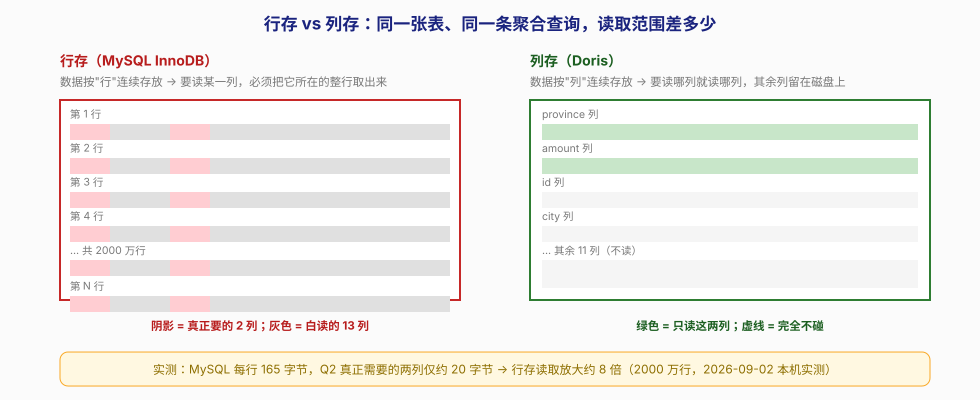
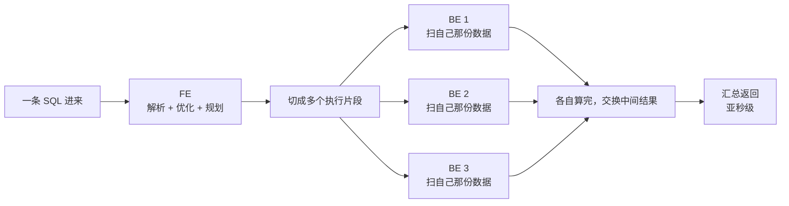
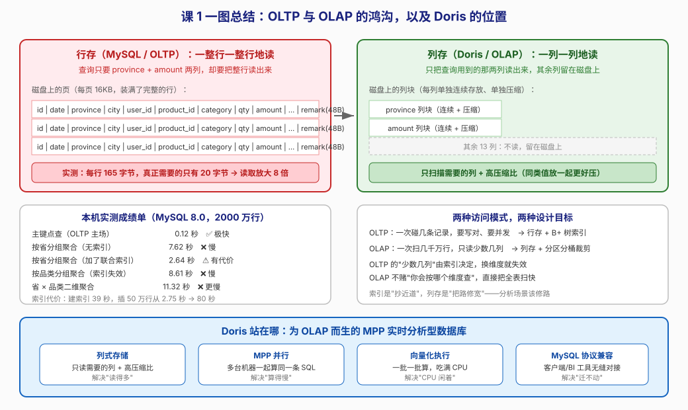

# 第 1 课：数据分析的困境与 Doris 的诞生

> 所属阶段：阶段 1《为什么需要 Doris》｜ 水平：零基础 ｜ 本课知识点：OLTP 与 OLAP 的鸿沟、Doris 是什么、Doris 的典型场景
> 故事情节：运营同学想看"上个月各省销售额 Top10"，SQL 提交了 3 分钟还没出结果——主角第一次直面"数据量大了以后，老办法不管用"

## 🎯 本课目标

- 说清 OLTP 与 OLAP 在访问模式上的本质差异，解释"为什么加了索引还是慢"
- 用一句话讲清 Doris 是什么、从哪来、解决什么问题
- 能列举 Doris 擅长的四类场景，并说出三个"不该用 Doris"的场景

---

## 第一幕：起源与场景引入

> 🏛️ **起源**：2008 年诞生于百度，最初就是为了给广告系统"凤巢"做实时报表——当时的痛点是报表跑得太慢，业务等不起。2012 年成长为百度首个公司级 OLAP 平台并改名 **PALO**（OLAP 四个字母的反写，意思就是"玩转 OLAP"），2013 年升级为 MPP 分布式架构。2017 年以 PALO 之名对外开源，2018 年 7 月百度把核心引擎捐赠给 Apache 基金会并改名 **Apache Doris** 进入孵化，2022 年 6 月正式毕业成为 Apache 顶级项目（TLP）。（核查于 2026-09）

起源讲完了，故事的主角不是百度，是你。

设想你是一家电商公司的数据工程师。公司做了五年，订单表 `orders` 攒到了 **3 亿行**，15 个字段，存在 MySQL 里。

某天上午，运营总监在会上问了一句：

> "上个月，哪个省的销售额最高？给我 Top10。"

你写下了这条再普通不过的 SQL：

```sql
SELECT province, COUNT(*) AS cnt, SUM(amount) AS total
FROM orders
WHERE order_date >= '2025-12-01' AND order_date < '2026-01-01'
GROUP BY province
ORDER BY total DESC
LIMIT 10;
```

回车。然后你开始等。

一分钟过去了，转圈。两分钟过去了，运营总监在会议室里盯着你。三分钟——终于出结果了，但会已经开完了。

> 🎬 **场景**：一条"看起来很简单"的分组聚合，在三亿行的 MySQL 上跑了三分钟，业务等不起。

---

## 第二幕：认知冲突

你的第一反应八成是：**加索引**。

这几乎是每个后端工程师的肌肉记忆——慢？加索引。于是你给 `order_date` 加了索引，又给 `province` 加了索引，甚至咬牙加了个联合索引 `(province, amount)`。

结果怎么样？我在本机上真跑了一遍（见下方第四幕），结论很扎心：

- 加了索引，某个特定查询确实快了——**从 7.62 秒降到 2.64 秒**
- 但换个维度查（按品类而不是按省），索引失效——**8.61 秒**
- 两个维度一起查——**11.32 秒，比不加还慢**
- 而加索引的代价是：建索引耗时 39 秒，插入 50 万行从 **2.75 秒暴涨到 80 秒**

> ❓ **问题**：索引是"抄近道"——它只对**某一条特定的路**有用。可分析型查询的特点恰恰是：**你根本不知道下一条 SQL 会按哪个维度查**。今天按省、明天按品类、后天按省 × 品类 × 时间，你不可能给所有组合都建索引（每加一个索引，写入就慢一分）。

那问题到底出在哪？

答案不在于"近道抄得不够多"，而在于**这条路本身就不适合走**。

---

## 第三幕：层层揭示

### 知识点 1：OLTP 与 OLAP 的鸿沟

> 本知识点关键点：行存 vs 列存的读取差异、访问模式差异（点查 vs 全表扫描）、为什么索引救不了聚合查询

#### 一句话定义

数据库有两类截然不同的活儿：**OLTP** 是"一笔一笔地处理业务"（下单、扣款、改状态），**OLAP** 是"一次看清几千万行"（汇总、对比、找趋势）。为前者设计的存储结构，干后者的活儿必然吃力。

#### 直觉建立（类比）

想象你要统计一本 500 页的账本里"餐饮"这个类别一共花了多少钱。

行存的读法，是把账本**一页一页翻**，每页上有日期、类别、金额、备注、经手人……你把每一页从头读到尾，只为找出"类别"和"金额"这两栏。翻完 500 页，你累瘫了，但其实你知道的只有两个数字。

列存的读法，是账本**按栏目拆开装订**——"类别"单独一叠，"金额"单独一叠，其他栏目各一叠。你抽出"类别"和"金额"这两叠，扫一遍，完事。其余十几叠你连碰都没碰。

这就是全部的区别。

> 💡 **类比的边界**：现实中的账本不会拆开装订，而且你"翻页"的速度和"翻一叠"的速度差不多。但在磁盘上，两者的差距会被放大——因为硬盘的最小读取单位是**页**（MySQL InnoDB 默认 16KB），你哪怕只要一行里的一个字节，也得把整个页读进来。所以行存的浪费不是"多读几个字"，而是"多读了十几个列的数据块"。

#### 核心原理

先看两种存储布局的物理差异：



关键在于**访问模式**的不同：

| 维度 | OLTP（联机事务处理） | OLAP（联机分析处理） |
|------|---------------------|---------------------|
| 典型操作 | 按主键查/改**一条**记录 | 一次扫描**几千万行** |
| 关心的列 | 通常是**所有列**（`SELECT *`） | 通常只有**少数几列** |
| 数据量 | 单次碰几条 | 单次碰全表的很大比例 |
| 核心诉求 | 写得对、并发高、延迟低 | 扫得快、算得快 |
| 写入特征 | 频繁的单条增删改 | 批量导入，很少改单条 |
| 代表系统 | MySQL、PostgreSQL | Doris、ClickHouse |

**行存**是为 OLTP 设计的：把一行的所有列紧挨着存放，这样"取一条完整记录"只需要一次 IO——对下单、扣款这种操作完美。

**列存**是为 OLAP 设计的：把每一列单独连续存放。好处有两个，一是**只读取用到的列**，二是**同类数据放一起压缩比极高**（一整列都是省份名，压缩率远超一堆混合类型的数据）。

所以鸿沟的本质是：

> OLTP 假设"你每次只要很少的**行**"，所以把行存紧；OLAP 面对的是"你每次要很多行、但很少的**列**"，所以必须把列存开。用行存去跑聚合，等于用一个为"点"优化的结构去干"面"的活儿。

#### 示例演示

这不是理论推演，是我在本机上真跑出来的数据。**2000 万行**订单表（3 亿行的等比样本，趋势一致），MySQL 8.0，Docker 容器，限制 buffer pool 为 256MB：

```bash
# 看一眼每行到底占多少字节
mysql> SELECT ROUND(data_length/table_rows) AS bytes_per_row,
              ROUND(data_length/1024/1024) AS data_mb,
              table_rows
       FROM information_schema.tables
       WHERE table_schema='shop' AND table_name='orders';

+---------------+---------+------------+
| bytes_per_row | data_mb | TABLE_ROWS |
+---------------+---------+------------+
|           165 |    3124 |   19796166 |
+---------------+---------+------------+

# 而这条聚合真正需要的两个字段，每行各占多少？
mysql> SELECT ROUND(AVG(LENGTH(province))) AS province_avg_bytes,
              ROUND(AVG(LENGTH(amount)))  AS amount_avg_bytes
       FROM orders;

+--------------------+------------------+
| province_avg_bytes | amount_avg_bytes |
+--------------------+------------------+
|                 13 |                7 |
+--------------------+------------------+
```

**每行存了 165 字节，聚合真正需要的只有 20 字节。** 剩下 145 字节——城市、用户 ID、商品 ID、备注、创建时间、更新时间——全都被无辜地读进了内存，然后又扔掉。

> 🧮 **算给你看**：查询要的是 `province`（平均 13 字节）+ `amount`（平均 7 字节）= **20 字节/行**。而行存实际每行占用 **165 字节**。165 ÷ 20 ≈ **8.25 倍**。
>
> 换个说法：2000 万行 × 165 字节 ≈ **3.1 GB** 要从磁盘读出来；而真正有用的数据只有 2000 万 × 20 字节 ≈ **0.4 GB**。**你读了 3.1 GB，只为了拿到其中 0.4 GB。**

> ⚠️ 这个 8 倍是本课这张表（15 列、含一个 48 字节的备注字段）的实测值，不是通用常数。列越多、不用的列越宽，放大倍数越夸张；反之如果你查的就是大部分列，行存反而不亏。**记住算法，别记数字。**

**读取放大约 8 倍。** 这就是"慢"的第一性原因。

再看查询耗时（同一台机器，同一个数据集）：

| 查询 | MySQL 耗时 | 说明 |
|------|-----------|------|
| `SELECT * WHERE id = 12345678`（主键点查） | **0.12 秒** | OLTP 的主场，快得理所当然 |
| `GROUP BY province`（无索引） | **7.62 秒** | OLAP 场景，慢 |
| `GROUP BY province`（有联合索引） | **2.64 秒** | 快了 2.9 倍，但有代价 |
| `GROUP BY category`（索引失效） | **8.61 秒** | 换维度就打回原形 |
| `GROUP BY province, category` | **11.32 秒** | 比不加索引还慢 |

#### 常见误区

1. **"慢就加索引"**：索引只对"命中索引的那一类查询"有效。分析型查询的维度组合是发散的，你无法穷举。而且索引的代价是真实的——实测插入 50 万行，无二级索引 2.75 秒，带两个二级索引 80.10 秒，慢了近 30 倍。
2. **"列存就是给每列建索引"**：不是。索引是额外的数据结构，列存是**数据本身的组织方式**。列存不需要为"只读某几列"额外维护任何东西，这是存储布局自带的性质。
3. **"那我把 MySQL 换成列存不就行了"**：不够。列存只解决"读得多"，还有"算得慢"的问题——一台机器的 CPU 是固定的，扫 2000 万行还是得一行行算。这是下一个知识点要说的 MPP 并行。

#### 一句话记住

**OLTP 是一次碰几条记录但要所有列，OLAP 是一次碰几千万行但只关心少数几列——存储布局必须跟着变，否则每次聚合都要白读 8 倍的数据。**

#### 官方文档

- [Apache Doris 简介](https://doris.apache.org/zh-CN/docs/2.1/gettingStarted/what-is-new/)（官方对 MPP、列存、亚秒级查询的定位说明）

---

### 知识点 2：Doris 是什么

> 本知识点关键点：MPP 架构、列式存储、MySQL 协议兼容、极简架构（FE + BE）

#### 一句话定义

**Apache Doris 是一款基于 MPP 架构的高性能实时分析型数据库**，用列式存储 + 并行计算 + 向量化执行，让海量数据的聚合查询在**亚秒级**返回。

#### 直觉建立（类比）

上一幕我们说，行存跑聚合的问题有两个：读得多（8 倍放大）、算得慢（一台机器单干）。

Doris 的解法对应两招：

- **列存**解决"读得多"：只把要用的列读出来。
- **MPP** 解决"算得慢"：MPP 是 Massively Parallel Processing（大规模并行处理）的缩写。一条 SQL 进来，不是一台机器从头算到尾，而是**切成很多份，分给几十台机器同时算，最后把结果汇总**。

类比一下：一个人搬 1000 块砖要 10 小时，100 个人同时搬只要 6 分钟——这就是 MPP。但前提是砖得能分开搬，而列存 + 分区分桶恰好保证了这一点。

> 💡 **类比的边界**：搬砖可以完全独立，但 SQL 不行。`GROUP BY province` 需要把相同省份的数据凑到一起才能求和，机器之间必须交换数据（这叫 Shuffle）。所以 MPP 不是"线性加速 100 倍"，数据交换是有成本的——这也是为什么后面要学 Join 策略和 Colocate Join。

#### 核心原理

Doris 的官方定位是"基于 MPP 架构的高性能、实时分析型数据库"，核心特性可以这样拆：



这张图里有三个关键设计：

**1. 极简架构——只有 FE 和 BE 两类进程**

- **FE（Frontend，前端节点）**：集群的"大脑"。负责接用户请求、解析 SQL、生成执行计划、管理元数据和集群节点。
- **BE（Backend，后端节点）**：集群的"肌肉"。负责存数据、执行具体的计算任务。

很多分布式系统要装一堆外部依赖（协调服务、元数据库、资源管理器），Doris **不依赖任何第三方服务**，FE 和 BE 各自横向扩展就行。这极大降低了运维负担——下一课你就会亲手体验到，一个容器就能把集群跑起来。

**2. 列式存储 + 丰富的索引**

列存解决基础问题，索引解决"在列内精确定位"的问题：前缀索引、BloomFilter 索引、倒排索引、ZoneMap 等。索引的具体选择和取舍在阶段 2 课 5 详讲。

**3. MySQL 协议兼容**

Doris 对外说的是 MySQL 协议、支持标准 SQL。这意味着：

- 你现有的 MySQL 客户端、BI 工具（Tableau、帆软、Superset）几乎不用改就能连上
- 你写 SQL 的习惯可以平移过来

这是 Doris 上手门槛低的重要原因——但也埋了一个坑，见知识点 3 的"不该用"部分。

**4. 向量化执行引擎**

传统数据库执行引擎是"一行一行"处理，每行都要走一遍函数调用。向量化是"一批一批"处理（Doris 里叫 Block），好处是大幅减少函数调用开销、提高 CPU 缓存命中率、能用上 SIMD 指令。官方数据：宽表聚合场景下向量化引擎的性能是非向量化引擎的 **5–10 倍**（核查于 2026-09）。这部分在阶段 3 课 7 深讲。

#### 示例演示

知识点 1 里那条在 MySQL 上跑 7.62 秒的 SQL，在 Doris 里长什么样？

```sql
-- 建表：注意多了 DUPLICATE KEY 和 DISTRIBUTED BY（阶段 2 详解，现在先眼熟）
CREATE TABLE orders_doris (
    order_date  DATE,
    province    VARCHAR(16),
    category    VARCHAR(32),
    amount      DECIMAL(10,2)
)
DUPLICATE KEY(order_date, province)
DISTRIBUTED BY HASH(province) BUCKETS 8
PROPERTIES ("replication_num" = "1");

-- 查询：语法和 MySQL 完全一样
SELECT province, COUNT(*) AS cnt, SUM(amount) AS total
FROM orders_doris
GROUP BY province
ORDER BY total DESC
LIMIT 10;
```

**SQL 语法不用改**，但底下发生的事完全不同：只扫 `province` 和 `amount` 两列，且多台 BE 各扫各的分片，最后汇总。

> ⚠️ 上面的建表语句**本课不要求你跑通**——它只是让你先感受 Doris 建表和 MySQL 的三个不同：多了一个 `DUPLICATE KEY`（表模型声明）、多了一个 `DISTRIBUTED BY HASH ... BUCKETS`（分桶声明）、多了 `PROPERTIES`（属性配置）。这三个东西分别是阶段 2 课 3、课 4 的主角。下一课我们会用官方镜像把集群真正跑起来，届时再写完整可执行的语句。

#### 常见误区

1. **"Doris 是 MySQL 的替代品"**：不是。Doris 只是**协议兼容** MySQL（方便你连接和迁移），它是为分析场景设计的，不能当业务主库用（见知识点 3）。
2. **"MPP 就是机器越多越快"**：数据要在机器间交换，网络开销是真实存在的。表模型、分区分桶、Join 策略没设计好，加机器收益有限——这正是阶段 2 和阶段 3 要解决的问题。
3. **"Doris 只有两个进程，所以很简单"**：架构简单是真的，但"简单"不等于"不需要调优"。建模（阶段 2）和资源管理（阶段 4）照样有深度。

#### 一句话记住

**Doris = 列存（少读 8 倍）+ MPP（多台一起算）+ 向量化（CPU 吃满）+ MySQL 协议（迁移无痛），目标是让海量数据聚合亚秒级返回。**

#### 官方文档

- [Apache Doris 官网](https://doris.apache.org/)
- [Apache Doris 简介（中文）](https://doris.apache.org/zh-CN/docs/2.1/gettingStarted/what-is-new/)

---

### 知识点 3：Doris 的典型场景

> 本知识点关键点：四类擅长场景；以及边界——不适合高频单行事务、不适合当缓存、不适合强一致 OLTP

#### 一句话定义

Doris 擅长"**大量数据、少数几列、聚合或检索、要求秒级甚至亚秒级返回**"的场景；不擅长"**单条记录的频繁增删改、强一致事务**"。

#### 直觉建立（类比）

把数据库想象成交通工具：

- **MySQL（OLTP）** 是出租车——随叫随走，一次拉一两个人，去哪都行，但你不能指望它拉 200 人去看球赛。
- **Doris（OLAP）** 是地铁——一次拉几千人，单位成本极低，准点、大运量，但你没法让它开到你家楼下接你一个人。

你要送一份紧急文件（下单、扣款），叫出租车；你要把体育场的人全疏散（出报表、做分析），开地铁。

> 💡 **类比的边界**：地铁有固定线路，Doris 的"线路"其实相当灵活——它支持标准 SQL，即席查询也没问题。真正限制它的是**写入模式**：地铁不适合"一个人随时上下"，Doris 也不适合高频单行更新。

#### 核心原理

**官方文档列出的典型场景（核查于 2026-09）**：

**① 报表分析**

企业内部报表、管理驾驶舱、面向客户的高并发报表。最典型的例子：京东在广告报表场景使用 Apache Doris，每天写入 100 亿行数据，查询并发 QPS 上万，99 分位延迟 150ms。（该数据出自 Doris 官方文档的公开案例，核查于 2026-09；文档未标注其采集年份，请将其理解为"该场景曾达到的量级"，而非当前的实时水位）

关键特征：**查询模式相对固定**（今天看省份、明天看品类，但都是那几张报表），可以通过预聚合进一步加速。

**② 即席查询（Ad-hoc Query）**

分析师自助探查，查询模式不固定，要求高吞吐。小米基于 Doris 构建增长分析平台，平均查询延时 10 秒，95 分位 30 秒以内，每天 SQL 查询量数万条。（出处同上，官方公开案例，核查于 2026-09；文档未标注采集年份）

> 注意这个数字的含义：即席查询的**吞吐要求是"几十秒也能接受"**，因为它面对的是分析师探索性查询，而不是给终端用户看的实时报表。别把它和报表场景的"亚秒级"混为一谈——场景不同，指标不同。

关键特征：**你事先不知道分析师会怎么查**，所以要的是"全表扫得快"，而不是"某条路抄近道"。

**③ 统一数仓构建**

一个平台替代多套系统。海底捞基于 Doris 构建统一数仓，替换了原来由 Spark、Hive、Kudu、HBase、Phoenix 组成的旧架构。（出处同上，官方公开案例，核查于 2026-09；文档未标注采集年份）

关键特征：**架构简化**——组件越少，运维成本越低，数据一致性越好维护。

**④ 数据湖联邦查询**

通过外表的方式直接分析 Hive、Iceberg、Hudi 中的数据，**不需要把数据搬进 Doris**。

关键特征：数据不用复制，省存储、省同步链路。

**⑤ 用户行为分析 / 日志检索分析 / 用户画像**

这类场景的共同点是：数据量大（千万到千亿级）、写入频繁、查询以聚合和多维过滤为主。Doris 4.x 进一步强化了日志与半结构化数据处理能力（如 VARIANT 类型），这部分在阶段 3 课 8 会讲。

**边界：什么时候不该用 Doris**

这部分比"怎么用"更值钱：

| 不该用的场景 | 原因 | 该用什么 |
|-------------|------|---------|
| **业务主库 / 订单交易** | Doris 不支持强一致事务，不适合高频单行增删改 | MySQL / PostgreSQL |
| **缓存** | 亚秒级 ≠ 毫秒级，且成本远高于缓存 | Redis / Memcached |
| **高频单条更新** | Doris 的更新是批量的、异步的，单条频繁更新会拖垮系统 | MySQL / HBase |
| **小数据量（百万行以内）** | 杀鸡用牛刀，运维成本不划算 | MySQL 就够了 |
| **强一致、需要行级锁的金融核心账务** | OLAP 系统的一致性模型不是为此设计的 | 关系型数据库 |

#### 示例演示

用一张表快速判断你手上的需求该不该上 Doris：

| 你的场景 | 判断 | 理由 |
|---------|------|------|
| 运营要看"各省销售额月报" | ✅ 适合 | 大数据量 + 聚合 + 固定报表 |
| 分析师临时想查"上周复购率异常的用户特征" | ✅ 适合 | 即席查询，要求全表扫得快 |
| 用户下单时扣库存、写订单 | ❌ 不适合 | OLTP 事务，需要强一致和行级锁 |
| 查单个用户最近 10 笔订单 | ❌ 不适合 | 单行点查，MySQL 0.12 秒就够快了 |
| 把 Elasticsearch 里的日志搬来分析 | ✅ 适合 | 日志检索 + 聚合分析，Doris 4.x 的强项 |
| 存用户 session，有效期 30 分钟 | ❌ 不适合 | 这是缓存的活儿 |

#### 常见误区

1. **"Doris 支持 MySQL 协议，那我把业务库迁过去，一个系统搞定"**：这是最常见的踩坑方式。协议兼容 ≠ 能力等价。Doris 不是事务型数据库，拿它当主库用会在并发更新、事务一致性上出问题（阶段 4 课 12 会专门讲反模式）。
2. **"数据量大就该用 Doris"**：数据量只是条件之一。如果你的查询全是"按用户 ID 查这一条记录"，那 3 亿行 MySQL 也能 0.12 秒返回，完全不需要 Doris。
3. **"Doris 能替代 Elasticsearch 做所有日志场景"**：Doris 4.x 在日志场景能力很强，但 ES 在全文检索相关性打分、复杂分词上仍有优势。选型要具体场景具体分析，详见阶段 4 课 12。

#### 一句话记住

**Doris 的主场是"大批量、少列、聚合、要快"的分析场景；高频单行事务、缓存、业务主库，请留给 MySQL 和 Redis。**

#### 官方文档

- [Apache Doris 使用场景](https://doris.apache.org/zh-CN/docs/2.1/gettingStarted/what-is-new/)

---

## 第四幕：实操验证

这一课不要求你启动 Doris（那是下一课的事），但**上面的每一个数字都是真跑出来的**。你可以自己复现，这是本课的"实验记录"。

### 环境

- WSL Ubuntu + Docker（本机 26G 可用内存）
- MySQL 8.0 官方镜像，容器限制 `innodb-buffer-pool-size=256M`（模拟真实压力）
- 订单表 2000 万行、15 个字段，物理大小 3124 MB

### 复现步骤

```bash
# 1. 起一个 MySQL 测试容器（端口 3307，避免和你本机已有的 MySQL 冲突）
docker run -d --name doris-mysql-demo \
  -e MYSQL_ROOT_PASSWORD=root123 \
  -e MYSQL_DATABASE=shop \
  -p 3307:3306 \
  mysql:8.0 \
  --innodb-buffer-pool-size=256M

# 2. 把造数脚本放进容器（脚本在 doris/assets/lesson01-lab-mysql.sql）
docker cp lesson01-lab-mysql.sql doris-mysql-demo:/tmp/lab.sql

# 3. 造 2000 万行数据（耗时较长，本机约 20 分钟）
docker exec doris-mysql-demo mysql -uroot -proot123 shop -e "source /tmp/lab.sql"
# 预期输出：total_rows = 20000000，data_mb = 3124

# 4. 跑那条"迟到的报表"
docker exec doris-mysql-demo mysql -uroot -proot123 shop -e "
  SELECT province, COUNT(*) c, ROUND(SUM(amount)) total
  FROM orders GROUP BY province ORDER BY total DESC;"
# 预期输出：约 7.6 秒，Using temporary; Using filesort

# 5. 加联合索引再试
docker exec doris-mysql-demo mysql -uroot -proot123 shop -e "
  ALTER TABLE orders ADD INDEX idx_prov_amount (province, amount);"
# 预期输出：建索引约 39 秒；重跑 Q2 降到约 2.6 秒

# 6. 换个维度查（索引失效）
docker exec doris-mysql-demo mysql -uroot -proot123 shop -e "
  SELECT category, COUNT(*) c, ROUND(SUM(amount)) total
  FROM orders GROUP BY category ORDER BY total DESC;"
# 预期输出：约 8.6 秒，EXPLAIN 显示 type=ALL（全表扫）
```

> 完整脚本已落盘：[lesson01-lab-mysql.sql](../../../assets/lesson01-lab-mysql.sql)（造数）、[lesson01-bench.sh](../../../assets/lesson01-bench.sh)（第一轮基准）、[lesson01-bench2.sh](../../../assets/lesson01-bench2.sh)（索引对比）、[lesson01-bench3.sh](../../../assets/lesson01-bench3.sh)（读取放大与写入代价）

### 关键结果汇总

| 指标 | 实测值 |
|------|--------|
| 每行实际占用 | 165 字节 |
| 聚合真正需要的两列 | 约 20 字节 |
| **读取放大倍数** | **约 8 倍** |
| 主键点查 | 0.12 秒 |
| 分组聚合（无索引） | 7.62 秒 |
| 分组聚合（有索引） | 2.64 秒 |
| 换维度聚合（索引失效） | 8.61 秒 |
| 二维聚合 | 11.32 秒 |
| 建索引耗时 | 39.28 秒 |
| 插 50 万行（无二级索引） | 2.75 秒 |
| 插 50 万行（带 2 个二级索引） | 80.10 秒 |

> ✅ **回扣场景**：回到第一幕——运营总监要的那张"各省销售额 Top10"，在 MySQL 上跑 7.62 秒（这还只是 2000 万行；按线性外推，3 亿行约 114 秒，接近开篇说的"三分钟"）。而这条查询真正需要的数据只有全表的 1/8。**问题不是 MySQL 不行，是它根本不是为这件事设计的**。Doris 的解法不是"把索引加得更多"，而是换一套存储布局（列存）+ 换一种计算方式（MPP 并行）。

---

## 第五幕：体系收束

> 📍 **全局定位**：本课是整门课的"地基"。后面 11 课讲的每一件事——三种数据模型、分区分桶、索引、导入方式、查询优化、资源隔离——本质上都是在回答同一个问题的不同层面：
>
> **"为了让一条聚合 SQL 在亚秒级返回，我该怎么做？"
> 本课给出的答案是第一层：先别让它读那么多数据（列存），也别让一台机器独自扛（MPP）。**
>
> 🔗 **下一步**：你现在知道 Doris"是什么"和"为什么需要它"了，但还没有正眼看过它长什么样。下一课《跑起来第一个 Doris》，我们会在本机用 Docker 拉起一个真实的 Doris 集群，看清 FE 和 BE 到底长什么样，然后亲手建第一张表、跑第一条查询——把今天 PPT 上的"亚秒级"变成你终端里真实打印出来的数字。

---

## 🐞 常见误区

1. **"OLAP 就是把 OLTP 的数据复制一份再查"**：复制数据只是手段，不是本质。本质差异是存储布局（行存 vs 列存）和执行模型（单机 vs MPP）。复制一份到从库，跑聚合照样慢。
2. **"列存一定比行存快"**：只在对大量行做少量列的聚合时成立。查单条完整记录，行存一次 IO 搞定，列存反而要去多个列块里拼。**没有银弹，只有适配**。
3. **"Doris 能完全替代 MySQL"**：协议兼容 ≠ 能力等价。Doris 不是事务型数据库。
4. **"索引越多越好"**：实测插入 50 万行从 2.75 秒涨到 80.10 秒。索引是拿写入性能换读取性能，分析场景下这个交换往往不划算。
5. **"MPP 加机器就线性提速"**：机器间要交换数据（Shuffle），网络有成本。建模和 Join 策略没做好，加机器收效甚微——这正是后面两个阶段要解决的核心问题。

## 一图总结



**一句话串起来**：行存让聚合查询白读 8 倍数据（实测 165 字节 vs 20 字节）→ 索引只能救特定维度，换维度就失效且拖慢写入（2.75 秒 → 80 秒）→ Doris 用列存 + MPP + 向量化从根上解决，且兼容 MySQL 协议让迁移无痛 → 但它只管分析场景，事务和缓存请留给 MySQL 和 Redis。

## 课后小测

**Q1**：一条 `SELECT province, SUM(amount) FROM orders GROUP BY province` 在 2000 万行的 MySQL 上跑得慢，最根本的原因是？

- A. MySQL 的 SQL 引擎太弱
- B. 没有给 province 建索引
- C. 行存必须把整行读出来，而聚合只用到其中两列
- D. 磁盘 IO 带宽不够

<details><summary>答案与解析</summary>

**答案：C**。这是存储布局问题，不是引擎强弱问题。实测每行 165 字节，聚合真正需要的只有约 20 字节，读取放大约 8 倍。B 是常见误解：加了索引确实能快（7.62s → 2.64s），但换个维度就失效（8.61s），且代价是写入慢近 30 倍——索引治标不治本。

</details>

**Q2**：以下关于 Doris 的说法，正确的是？

- A. Doris 兼容 MySQL 协议，所以可以当业务主库用
- B. Doris 只有 FE 和 BE 两类进程，不依赖第三方服务
- C. Doris 的列存意味着它查单条记录也比 MySQL 快
- D. Doris 的 MPP 架构意味着加机器一定线性提速

<details><summary>答案与解析</summary>

**答案：B**。极简架构（FE + BE、无外部依赖）是 Doris 的官方特性。A 错：协议兼容 ≠ 能力等价，Doris 不是事务型数据库；C 错：查单条完整记录行存更快（一次 IO 取完整行）；D 错：MPP 有数据交换开销，不是线性加速。

</details>

**Q3**：下列哪种场景**不适合**用 Doris？

- A. 运营每天看的"各省销售额月报"
- B. 分析师临时探查"上周复购率异常的用户特征"
- C. 用户下单时扣减库存并写入订单
- D. 把 Elasticsearch 中的日志搬来做聚合分析

<details><summary>答案与解析</summary>

**答案：C**。这是典型的 OLTP 事务场景，需要强一致性和行级锁，是 MySQL 的主场。A 是固定报表、B 是即席查询、D 是日志分析，都是 Doris 的擅长场景。

</details>

## 🚀 下一批接力提示词

> 学完本课后，**复制下面这段文字发给 AI**，即可无缝进入下一课（无需重新描述上下文）：

```
继续学 Apache Doris。我的学习档案在 doris/00-学习档案.md，
刚学完阶段 1《为什么需要 Doris》的课 1《数据分析的困境与 Doris 的诞生》
知识点（OLTP 与 OLAP 的鸿沟、Doris 是什么、Doris 的典型场景），
请按大纲继续讲解课 2《跑起来第一个 Doris》。
```

## 🧭 课程导航

➡️ **下一课**：[课 2：跑起来第一个 Doris](lesson-02-跑起来第一个Doris.md)

📚 **返回目录**：[课程目录](../../../02-课程目录.md)
