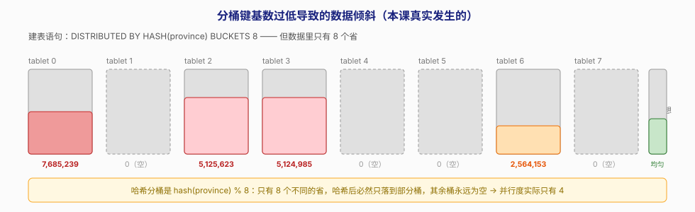
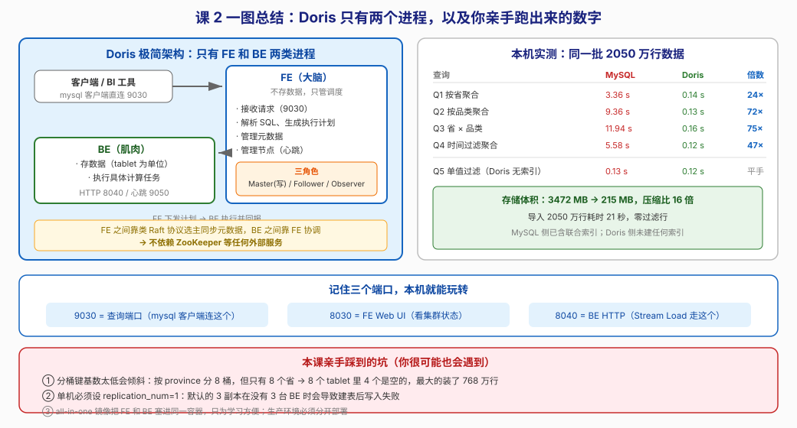

# 第 2 课：跑起来第一个 Doris

> 所属阶段：阶段 1《为什么需要 Doris》｜ 水平：零基础 ｜ 本课知识点：FE 与 BE 架构、用 Docker 起集群、第一张表与第一條查询
> 故事情节：主角决定亲自试试——"先别管原理，让我看看 3 亿行到底能多快"

## 🎯 本课目标

- 画出 Doris 的 FE / BE 组件图，说清 FE 三种角色的职责
- 在本机（WSL + Docker）独立启动一个 Doris 集群，并确认 FE / BE 存活
- 写出第一条完整的建表语句并成功查询

---

## 第一幕：起源与场景引入

> 🏛️ **起源**：Doris 的诞生地是百度广告系统"凤巢"。2008 年立项时的处境很具体——广告主需要实时看报表，但当时的方案要么太慢，要么太贵。团队做过一个关键判断：**分析型数据库不该依赖一堆外部组件**。这个判断一路延续到今天，造就了 Doris 最鲜明的特征：**整个集群只有 FE 和 BE 两类进程，不依赖 ZooKeeper、不依赖外部元数据库**。

上一课结束时，你看到了这样一组数字：2000 万行的订单表，一条 `GROUP BY province` 在 MySQL 上跑 **7.62 秒**，而聚合真正需要的数据只占全表的 1/8。

你大概会有两个反应。第一个是"原来如此"。第二个，也是更真实的一个：**"说得挺好，但我凭什么信你？"**

这反应是对的。技术圈里"某数据库快 100 倍"的说法满天飞，绝大多数经不起自己动手验一遍。所以这一课我们不做别的，就干一件事：**把它跑起来，自己测**。

> 🎬 **场景**：与其争论 Doris 快不快，不如花十分钟起一个集群，让终端自己说话。

---

## 第二幕：认知冲突

在动手之前，先说一个你可能有的顾虑。

分布式数据库给人的印象通常是"重"。回忆一下你听说过的大数据组件：Hadoop 要配 HDFS + YARN + MapReduce，HBase 要依赖 ZooKeeper 和 HDFS，Kafka 早年也离不开 ZooKeeper。每多一个外部依赖，就多一份运维负担、多一个故障点、多一套版本兼容问题。

所以当你决定"试试 Doris"的时候，心里大概率在打鼓：**这次又要装几个组件？ZooKeeper 要不要先起？元数据存哪儿？**

答案可能会让你意外：**一个容器，两个进程，零外部依赖。**

```bash
docker run -d --name doris-learn -p 9030:9030 -p 8030:8030 -p 8040:8040 apache/doris:all-in-one-4.1.3
```

就这一行。本机实测：**10 秒后 FE 就接受连接了**。

> ❓ **问题**：为什么别的分布式系统要一堆组件，Doris 只要两个进程？它把那些组件的功能藏到哪里去了？

---

## 第三幕：层层揭示

### 知识点 1：FE 与 BE 架构

> 本知识点关键点：FE 职责（请求接入 / 查询解析与规划 / 元数据管理 / 节点管理）、BE 职责（数据存储 / 查询执行）、FE 三角色（Master / Follower / Observer）、为什么不需要外部协调服务

#### 一句话定义

**FE（Frontend）是集群的大脑，负责"想"；BE（Backend）是集群的肌肉，负责"干"。** FE 不存业务数据，BE 不做全局决策。

#### 直觉建立（类比）

把 Doris 集群想象成一家餐厅：

- **FE 是前台 + 经理**：客人（客户端）进来，前台接待、记下点单、告诉后厨"3 号桌要一份宫保鸡丁、一份米饭"。经理还要盯着后厨——哪个厨师今天请假了、哪道菜备料不足。前台不炒菜，也不存菜。
- **BE 是后厨的厨师**：每人负责自己那几个灶台（自己那份数据切片），接到指令就开火，炒完把菜递出去。厨师不决定"今天该推荐什么菜"，那是经理的事。

如果餐厅要扩容，多招几个厨师（加 BE）就行；如果点单太忙，就多加几个前台（加 FE）。两者可以独立扩展——这就是 Doris 架构的好处。

> 💡 **类比的边界**：餐厅里经理和厨师是两种职业，而 Doris 里 FE 和 BE 是两套**独立的进程**，可以部署在不同机器上，也可以（像我们今天这样）塞进同一个容器。另外，真实餐厅没有"经理选举"这回事，但 FE 有——见下文三角色。

#### 核心原理

**FE（Frontend）——集群的大脑**

FE 有四项职责：

1. **请求接入**：客户端通过 MySQL 协议连到 FE 的 9030 端口
2. **查询解析与规划**：解析 SQL、做查询优化、生成分布式执行计划
3. **元数据管理**：库表结构、分区分桶信息、权限等
4. **节点管理**：通过心跳管理所有 BE，感知节点上下线

关键点：**FE 不存业务数据**。正因为它不承担存储压力，FE 通常很轻量。

**FE 的三种角色**

| 角色 | 能写元数据吗 | 参与选主吗 | 典型数量 | 用途 |
|------|------------|-----------|---------|------|
| **Master** | ✅ 能（唯一） | ✅ | 1 | 元数据的写入口，其他 FE 从它同步 |
| **Follower** | ❌ 只读 | ✅ | 2n+1（奇数） | 参与选主投票，Master 挂了能顶上 |
| **Observer** | ❌ 只读 | ❌ | 任意 | 只同步元数据、分担读压力，**不参与选主** |

可以这样理解：Master 是"当班经理"，Follower 是"有资格接班的值班经理"，Observer 是"旁听的实习生"——实习生知道所有事，但没资格投票选经理，**也不会被选为经理**。

> ⚠️ **这个类比有个坑，提前说破**：现实中的实习生是"还没转正的值班经理"，迟早能接班；但 **Observer 永远不会被选为 Master**，这是设计上的硬约束，不是资历问题。想让集群有高可用，Follower 必须配奇数个（通常 3 个）；Observer 只能帮你分担读压力。

Observer 的价值在于：**扩展查询能力但不影响选举效率**。因为选举要求多数派响应，Follower 越多，达成共识越慢。所以在读压力大的场景下，加 Observer 比加 Follower 更划算。

**BE（Backend）——集群的肌肉**

BE 只有两项职责，但都是重活：

1. **数据存储**：数据按 tablet 为单位存放（tablet 是 Doris 最小的物理存储单元）
2. **查询执行**：接收 FE 下发的执行计划片段，在本地数据上算出结果

BE 之间**不互相协调**——谁该算什么、结果怎么汇总，全由 FE 调度。

**为什么不需要外部协调服务？**

这是 Doris 架构设计里最值得记住的一点。对比一下：

| 系统 | 外部依赖 |
|------|---------|
| HBase | ZooKeeper + HDFS |
| Kafka（旧版） | ZooKeeper |
| Hadoop | HDFS + YARN |
| **Doris** | **无** |

Doris 把元数据的一致性问题**自己解决了**：FE 之间通过类 Raft 的协议选举 Master 并同步元数据日志（edit log），BE 的状态由 FE 通过心跳维护。这套机制内置在 FE 进程里，不需要额外的协调服务。

带来的好处很实在：部署简单、故障点少、没有跨组件的版本兼容问题。

#### 示例演示

起好集群后，两条命令看清全貌（这是本课在本机的真实输出）：

```bash
$ docker exec doris-learn mysql -h 127.0.0.1 -P 9030 -uroot -e "SHOW FRONTENDS\G"
              Name: fe_89ff9096_915a_4499_8a46_45e973d35cc2
              Host: 127.0.0.1
       EditLogPort: 9010
          HttpPort: 8030
         QueryPort: 9030
           RpcPort: 9020
              Role: FOLLOWER          ← 角色
          IsMaster: true              ← 它是 Master
              Join: true
             Alive: true              ← 存活
           Version: doris-4.1.3-rc02-7126cf65d96
```

注意 `Role: FOLLOWER` 和 `IsMaster: true` 同时出现——这不矛盾。**角色是"身份"，Master 是"当前职务"**。这个 FE 的身份是 Follower（有投票权），当前被选为 Master（正在当班）。

```bash
$ docker exec doris-learn mysql -h 127.0.0.1 -P 9030 -uroot -e "SHOW BACKENDS\G"
          BackendId: 1788336157417
               Host: 127.0.0.1
          HeartbeatPort: 9050          ← 心跳端口
               BePort: 9060
             HttpPort: 8040            ← Stream Load 走这里
                  Alive: true
             TabletNum: 22
       DataUsedCapacity: 0.000         ← 刚启动，还没数据
          AvailCapacity: 828.033 GB
                CpuCores: 20           ← 认到了 20 核
               Memory: 31.07 GB
           NodeRole: mix
```

这两个命令以后会天天见。**集群出问题时，第一步永远是这两条**——先确认 `Alive: true`。

#### 常见误区

1. **"FE 也存一部分数据"**：不存。FE 只存元数据（表结构、节点信息等），业务数据全在 BE 上。所以 FE 挂了不会丢数据，但会无法写入和新查询。
2. **"Observer 是备用的 Master，Master 挂了它会顶上"**：**不会**。Observer **不参与选主投票**，永远不会被选为 Master，这是它和 Follower 的本质区别。想要高可用，Follower 必须配奇数个（通常 3 个）。
3. **"BE 越多越快"**：BE 多意味着并行度高，但也意味着数据要在更多节点间交换。而且本课后面你会看到——**如果分桶没做好，加 BE 也没用**，因为数据根本没分均匀。

#### 一句话记住

**FE 只管"想"（接入、解析、规划、管节点），BE 只管"干"（存数据、做计算）；FE 靠内置的类 Raft 协议自治，所以 Doris 不需要任何外部协调服务。**

#### 官方文档

- [Apache Doris 架构介绍](https://doris.apache.org/zh-CN/docs/2.1/gettingStarted/what-is-new/)

---

### 知识点 2：用 Docker 起集群

> 本知识点关键点：官方镜像选择（all-in-one-4.1.3）、端口含义（9030 查询 / 8030 Web UI / 8040 BE HTTP）、健康检查确认、`SHOW FRONTENDS` / `SHOW BACKENDS` 验证

#### 一句话定义

用官方 `all-in-one` 镜像一条命令起集群，通过 9030（查询）、8030（FE Web UI）、8040（BE HTTP）三个端口与它交互。

#### 直觉建立（类比）

三个端口就像一栋楼的三个入口，各走各的人：

- **9030 是正门**：客户端、BI 工具、你的 `mysql` 命令行，都从这里进出
- **8030 是监控室**：管理员从这里看集群状态，是个网页
- **8040 是卸货区**：批量导入数据（Stream Load）从这里进

你现在要做的，就是确认这三个门都开着。

> 💡 **类比的边界**：严格说 8040 是 BE 的 HTTP 服务端口，它既用于 Stream Load，也提供一些运维接口和 Web 页面。而 BE 之间真正交换数据走的是 8060（BRPC）。现在不用记这么多，先记住"卸货走 8040"。

#### 核心原理

**镜像选择**

官方提供 `apache/doris:all-in-one-4.1.3`——这个镜像把 FE 和 BE 打包进**同一个容器**，专为本地学习和快速验证设计。

> ⚠️ **重要**：all-in-one 只适合学习。**生产环境 FE 和 BE 必须分开部署**，否则一个进程崩溃会同时带走计算和调度能力，而且两者的资源需求模式完全不同（FE 吃内存、BE 吃磁盘和 CPU），混在一起没法针对性调优。

**启动命令**

```bash
docker run -d \
  --name doris-learn \
  -p 9030:9030 \
  -p 8030:8030 \
  -p 8040:8040 \
  apache/doris:all-in-one-4.1.3
```

**三个端口的含义**

| 端口 | 属于 | 用途 | 你会怎么用它 |
|------|------|------|-------------|
| **9030** | FE | MySQL 协议查询端口 | `mysql -h 127.0.0.1 -P 9030 -uroot` |
| **8030** | FE | Web UI | 浏览器打开 `http://localhost:8030` |
| **8040** | BE | HTTP 服务 / Stream Load | `curl ... http://127.0.0.1:8040/api/.../_stream_load` |

还有两个端口你可能在这些命令的输出里看到，不用配也能跑：`9050`（BE 心跳）、`9060`（BE 内部通信）。

**连接方式：MySQL 协议兼容**

这是本课实测里最有意思的一个细节：

```bash
$ docker exec doris-learn mysql -h 127.0.0.1 -P 9030 -uroot -e "SELECT VERSION();"
VERSION()
5.7.99
```

**`5.7.99`** —— Doris 向客户端报告自己是 MySQL 5.7.99。这不是伪装，而是**协议层面的真实兼容**：标准 `mysql` 客户端、JDBC/ODBC 驱动、各类 BI 工具，都能直接连上 Doris。

这正是课 1 说的"迁移无痛"的落点——你现有的工具链一行都不用改。

#### 示例演示

完整启动流程（本机实测）：

```bash
# 1. 起容器
docker run -d --name doris-learn -p 9030:9030 -p 8030:8030 -p 8040:8040 \
  apache/doris:all-in-one-4.1.3
# 输出容器 ID

# 2. 等 FE 就绪（本机实测：10 秒）
docker exec doris-learn bash -c \
  "mysql -h 127.0.0.1 -P 9030 -uroot -e 'SHOW DATABASES;'"

# 3. 验证 FE 存活
docker exec doris-learn mysql -h 127.0.0.1 -P 9030 -uroot -e "SHOW FRONTENDS\G"
# 关键看：Role: FOLLOWER / IsMaster: true / Alive: true

# 4. 验证 BE 存活
docker exec doris-learn mysql -h 127.0.0.1 -P 9030 -uroot -e "SHOW BACKENDS\G"
# 关键看：Alive: true / TabletNum / AvailCapacity

# 5. （可选）打开 Web UI
# 浏览器访问 http://localhost:8030，默认用户 root，密码为空
```

> 💡 如果 FE 起不来（比如超过 2 分钟还没就绪），第一件事看日志：
> `docker exec doris-learn bash -c "tail -50 /opt/apache-doris/fe/log/fe.log"`
> 最常见的原因是内存不足或 `vm.max_map_count` 太小（WSL 下建议 ≥ 200000，本课机器是 1048576）。

#### 常见误区

1. **"all-in-one 镜像可以直接用到生产"**：不行。它是学习用的，FE/BE 混在一个容器里，没有高可用，出故障就是全挂。
2. **"连不上就是 Doris 起失败了"**：先看 `SHOW FRONTENDS` 里 `Alive` 是不是 `true`。刚启动的前几十秒 FE 还在回放元数据日志（edit log），这段时间连不上是**正常的**。
3. **"端口随便改一个就行"**：8030/9030/8040 是容器内监听的端口，改宿主机映射（比如 `-p 19030:9030`）没问题，但容器内这仨端口是 Doris 自己认的。

#### 一句话记住

**一条 docker run 起集群，9030 查、8030 看、8040 导；用 `SHOW FRONTENDS` / `SHOW BACKENDS` 里的 `Alive: true` 确认活了。**

#### 官方文档

- [Docker 部署 Doris](https://doris.apache.org/zh-CN/docs/2.1/install/cluster-deployment/k8s-deploy/install-doris-cluster)

---

### 知识点 3：第一张表与第一條查询

> 本知识点关键点：建表三要素（列定义 / DUPLICATE KEY / DISTRIBUTED BY HASH BUCKETS）、replication_num 在单机下的设置、MySQL 协议连接方式

#### 一句话定义

Doris 建表比 MySQL 多三样东西：**表模型声明（DUPLICATE KEY）**、**分桶声明（DISTRIBUTED BY HASH ... BUCKETS）**、以及**属性配置（PROPERTIES）**。

#### 直觉建立（类比）

建表就像给仓库设计货架：

- **列定义** = 你这个货架上要放哪些种类的货物
- **DUPLICATE KEY** = 货物怎么标识（这里说的是"明细表，允许重复行"）
- **DISTRIBUTED BY HASH(...)** = **按什么规则把货物分到不同货架区**。选错了，有的区堆成山、有的区空着
- **BUCKETS 8** = 一共划分几个区

MySQL 建表只需要前两项，因为它默认"所有货物放一个区"。Doris 是分布式的，必须明确告诉它"怎么分"。

> 💡 **类比的边界**：MySQL 也有分区表，但那是可选的、单机内的；Doris 的分桶是**强制的、跨节点的**，直接决定了查询能并行到什么程度。

#### 核心原理

**建表语句**

```sql
CREATE DATABASE IF NOT EXISTS shop;
USE shop;

CREATE TABLE orders (
    order_date  DATE           NOT NULL,
    province    VARCHAR(16)    NOT NULL,
    city        VARCHAR(32)    NOT NULL,
    user_id     BIGINT         NOT NULL,
    product_id  INT            NOT NULL,
    category    VARCHAR(32)    NOT NULL,
    quantity    INT            NOT NULL,
    amount      DECIMAL(10,2)  NOT NULL,
    pay_type    VARCHAR(16)    NOT NULL,
    status      TINYINT        NOT NULL,
    remark      VARCHAR(255)   NOT NULL DEFAULT 'xxx...',
    created_at  DATETIME       NOT NULL,
    updated_at  DATETIME       NOT NULL
)
DUPLICATE KEY(order_date, province, city)
DISTRIBUTED BY HASH(province) BUCKETS 8
PROPERTIES (
    "replication_num" = "1"
);
```

逐项解释：

**① `DUPLICATE KEY(order_date, province, city)`**

这是**表模型**声明。`DUPLICATE` 意思是"明细表"——存进去什么就原样留着，不做任何预聚合。

它后面跟的列有两个作用：一是作为**排序列**（数据按这些列排序存储，能加速前缀过滤），二是决定"哪些列组合起来算一行"。

> Doris 一共有三种表模型（明细 Duplicate / 主键 Unique / 聚合 Aggregate），这是**阶段 2 课 3 的主角**。现在你只要知道：DUPLICATE 是最常用、最安全的选择，适合原始明细数据。

**② `DISTRIBUTED BY HASH(province) BUCKETS 8`**

这是**分桶**声明，本课最值得注意的地方。

- `HASH(province)`：按 `province` 列做哈希，决定这行数据去哪个桶
- `BUCKETS 8`：一共分 8 个桶，也就是 8 个 tablet

**物理上，每个桶就是一个 tablet**——Doris 存储和调度的最小单元。

**③ `PROPERTIES ("replication_num" = "1")`**

副本数。**单机环境必须设成 1**，因为默认值是 3，而 3 副本要求至少有 3 台 BE——我们只有 1 台，建表后写入会失败。

> ⚠️ 这是新手踩的第一个坑。如果你忘了设 `replication_num=1`，表能建出来，但插入数据时会报副本数不足的错误。

**④ Doris 自动补了什么？**

执行 `SHOW CREATE TABLE orders\G`，你会看到 Doris 默默填了一堆默认值（本课真实输出，已精简）：

```sql
) ENGINE=OLAP
DUPLICATE KEY(`order_date`, `province`, `city`)
DISTRIBUTED BY HASH(`province`) BUCKETS 8
PROPERTIES (
"replication_allocation" = "tag.location.default: 1",
"min_load_replica_num" = "-1",
"is_being_synced" = "false",
"storage_medium" = "hdd",
"storage_format" = "V2",
"inverted_index_storage_format" = "V3",
"light_schema_change" = "true",
"disable_auto_compaction" = "false",
"group_commit_interval_ms" = "10000",
"group_commit_data_bytes" = "134217728"
);
```

几个值得留意的：

- `ENGINE=OLAP`：Doris 只支持 OLAP 引擎，这里只是显式标注
- `storage_format = V2`：存储格式版本
- `light_schema_change = true`：开启动态 Schema Change（加列不用重写数据，阶段 4 课 11 会讲）
- `group_commit_interval_ms`：攒批写入的间隔（阶段 3 课 9 会讲）

**现在不用管它们**，但要知道有地方可以查。

#### 示例演示

**导入数据：Stream Load**

Doris 最常用的导入方式，走 BE 的 HTTP 端口 8040：

```bash
curl --location-trusted -u root: \
  -H "format: csv" \
  -H "column_separator: ," \
  -H "columns: order_date,province,city,user_id,product_id,category,quantity,amount,pay_type,status,remark,created_at,updated_at" \
  -H "max_filter_ratio: 0.1" \
  -T /tmp/orders_dump.csv \
  http://127.0.0.1:8040/api/shop/orders/_stream_load
```

**逐个参数解释**（照抄之前请先看懂）：

| 参数 | 含义 | 为什么这么写 |
|------|------|-------------|
| `--location-trusted` | 允许 curl 跟随重定向并**继续传认证信息** | Stream Load 会把请求重定向到目标 BE，不加这个会丢认证 |
| `-u root:` | 用户名 `root`，**密码为空**（冒号后没有内容） | 默认 root 无密码；生产环境务必设密码 |
| `-H "format: csv"` | 文件格式 | 还支持 json、parquet、orc |
| `-H "column_separator: ,"` | 列分隔符 | CSV 用逗号；如果是 TSV 要改成 `\t` |
| `-H "columns: ..."` | **CSV 列与表列的对应顺序** | 顺序写错会导致数据串列，这是新手最常见的导入事故 |
| `-H "max_filter_ratio: 0.1"` | **最多容忍 10% 的行出错** | 出错的行会被丢弃；设为 0 表示一行都不能错，设 1 表示全错也接受 |
| `-T /tmp/xxx.csv` | 要上传的文件 | |
| URL 末尾 `_stream_load` | 固定后缀 | 路径格式：`/api/{库名}/{表名}/_stream_load` |

> ⚠️ **`max_filter_ratio` 是个双刃剑**。设成 0.1 意味着"10% 的数据坏了也照样导入成功"——如果只是想快速跑通，没问题；但**生产环境通常要设成 0**，否则脏数据会静默丢失，等你发现时对不上账了。

**本课的真实返回**：

```json
{
    "Status": "Success",
    "NumberTotalRows": 20500000,
    "NumberLoadedRows": 20500000,
    "NumberFilteredRows": 0,
    "LoadBytes": 3291814691,
    "LoadTimeMs": 20791
}
```

**2050 万行，21 秒，零过滤行。** 每秒约 98 万行。

**查询：语法和 MySQL 完全一致**

```sql
SELECT province, COUNT(*) c, ROUND(SUM(amount)) total
FROM orders
GROUP BY province
ORDER BY total DESC;
```

```text
province    c          total
湖北        2565552    6447081192
福建        2562892    6435203365
河南        2564153    6435002176
江苏        2563368    6431003419
四川        2561617    6428500681
广东        2560989    6426550858
浙江        2561358    6424155664
山东        2560071    6422556314
```

**耗时 0.14 秒。** 同样的查询、同样的数据，MySQL 是 3.36 秒。

#### 常见误区

1. **"分桶数越多越好"**：不是。桶太少并行度不够，桶太多会产生大量小文件、加重元数据负担。经验值：单个 tablet 保持在 **1–10 GB** 比较合适。本课 2050 万行 215 MB，其实用 1–2 个桶就够了，用 8 个是为了演示。
2. **"分桶键随便选一个列就行"**：本课建表时我选的是 `province`——**这是个错误示范**。为什么错、错成什么样，我在第四幕把真实数据摆给你看。先记住结论：分桶键要选**高基数、分布均匀**的列，且最好是常用的 Join/聚合维度。
3. **"replication_num 默认就行"**：单机环境必须显式设 1。

#### 一句话记住

**建表 = 列定义 + 表模型（DUPLICATE KEY）+ 分桶（DISTRIBUTED BY HASH）；单机务必设 replication_num=1；导入走 8040 的 Stream Load，查询走 9030 的标准 SQL。**

#### 官方文档

- [CREATE TABLE 语法](https://doris.apache.org/zh-CN/docs/2.1/sql-manual/sql-statements/Data-Definition-Statements/Create/CREATE-TABLE)
- [Stream Load](https://doris.apache.org/zh-CN/docs/2.1/data-operate/import/import-way/stream-load-manual)

---

## 第四幕：实操验证

下面的每一个数字都是本机实测（2026-09-02，WSL Ubuntu + Docker，20 核 31GB，Doris 4.1.3）。

### 环境

| 项 | 值 |
|---|---|
| 镜像 | `apache/doris:all-in-one-4.1.3` |
| 版本 | `doris-4.1.3-rc02-7126cf65d96` |
| FE | 1 个，FOLLOWER / IsMaster=true / Alive=true |
| BE | 1 个，Alive=true，认到 20 核 31.07 GB |
| 容器内 FE 就绪耗时 | 约 10 秒 |
| Doris 容器内存占用 | 2.7 GB |

### 完整流程（可直接复制执行）

> 📦 **关于测试数据**：下面的性能对比用的是课 1 那张 2050 万行的 MySQL 订单表。如果你**跳过了课 1 或者已经删掉了那个容器**，有两个选择：
>
> 1. **想完整复现对比**：回到[课 1 第四幕](lesson-01-数据分析的困境与Doris的诞生.md)重跑造数脚本，然后用 [lesson02-load-data.sh](../../../assets/lesson02-load-data.sh) 导出成 CSV
> 2. **只想体验 Doris**：跳过导入，直接建表后用 `INSERT INTO` 手写几十行数据跑通查询即可（本课所有 Doris 语法都适用）
>
> 两种都不影响你学会本课的知识点。

```bash
# ① 起集群
docker run -d --name doris-learn -p 9030:9030 -p 8030:8030 -p 8040:8040 \
  apache/doris:all-in-one-4.1.3

# ② 等就绪并验证（约 10 秒后可用）
docker exec doris-learn mysql -h 127.0.0.1 -P 9030 -uroot -e "SHOW FRONTENDS\G"
docker exec doris-learn mysql -h 127.0.0.1 -P 9030 -uroot -e "SHOW BACKENDS\G"
# 关键：Alive: true

# ③ 建库建表
#    ⚠️ 注意：下面用 heredoc 方式在容器内直接执行，
#    是因为 docker cp 在 Windows 下会把 /mnt/d/... 路径当成 Windows 路径解析而失败。
#    这是 WSL + Docker 环境的常见坑，不是 Doris 的问题。
docker exec doris-learn mysql -h 127.0.0.1 -P 9030 -uroot -e "
CREATE DATABASE IF NOT EXISTS shop;
USE shop;
CREATE TABLE orders (
    order_date DATE NOT NULL,
    province   VARCHAR(16) NOT NULL,
    city       VARCHAR(32) NOT NULL,
    user_id    BIGINT NOT NULL,
    product_id INT NOT NULL,
    category   VARCHAR(32) NOT NULL,
    quantity   INT NOT NULL,
    amount     DECIMAL(10,2) NOT NULL,
    pay_type   VARCHAR(16) NOT NULL,
    status     TINYINT NOT NULL,
    remark     VARCHAR(255) NOT NULL DEFAULT 'xxx',
    created_at DATETIME NOT NULL,
    updated_at DATETIME NOT NULL
)
DUPLICATE KEY(order_date, province, city)
DISTRIBUTED BY HASH(province) BUCKETS 8
PROPERTIES ('replication_num' = '1');"

# ④ 导入（Stream Load，走 BE 的 8040）
#    前提：CSV 已在容器内 /tmp/orders_dump.csv
docker cp /path/to/orders_dump.csv doris-learn:/tmp/orders_dump.csv
curl --location-trusted -u root: \
  -H "format: csv" -H "column_separator: ," \
  -H "columns: order_date,province,city,user_id,product_id,category,quantity,amount,pay_type,status,remark,created_at,updated_at" \
  -H "max_filter_ratio: 0.1" \
  -T /tmp/orders_dump.csv \
  http://127.0.0.1:8040/api/shop/orders/_stream_load
# 预期返回 Status: Success，NumberLoadedRows = 20500000

# ⑤ 查询并计时
docker exec doris-learn mysql -h 127.0.0.1 -P 9030 -uroot -e \
  "USE shop; SELECT province, COUNT(*) c, ROUND(SUM(amount)) total
   FROM orders GROUP BY province ORDER BY total DESC;"
# 预期：8 行结果，耗时约 0.14 秒
```

> 脚本已落盘：[lesson02-run-doris.sh](../../../assets/lesson02-run-doris.sh)（起集群）、[lesson02-check-cluster.sh](../../../assets/lesson02-check-cluster.sh)（健康检查）、[lesson02-create-table.sh](../../../assets/lesson02-create-table.sh)（建表）、[lesson02-load-data.sh](../../../assets/lesson02-load-data.sh)（从课 1 的 MySQL 导出 CSV）、[lesson02-stream-load.sh](../../../assets/lesson02-stream-load.sh)（Stream Load 导入）、[lesson02-bench-compare.sh](../../../assets/lesson02-bench-compare.sh)（性能对比）

### 性能对比：MySQL vs Doris（同批 2050 万行）

| 查询 | MySQL | Doris | 提升 |
|------|-------|-------|------|
| Q1 按省聚合 | 3.36 s | **0.14 s** | **24×** |
| Q2 按品类聚合（MySQL 索引失效） | 9.36 s | **0.13 s** | **72×** |
| Q3 省 × 品类二维聚合 | 11.94 s | **0.16 s** | **75×** |
| Q4 带时间过滤聚合 | 5.58 s | **0.12 s** | **47×** |
| Q5 单值过滤 | 0.13 s | 0.12 s | 基本持平 |

> 📌 Q1 的 MySQL 耗时（3.36s）比课 1 的 7.62s 快，是因为课 1 之后我们给 MySQL 加了 `(province, amount)` 联合索引——**这正是索引能起到的最好效果**。但即便如此，它仍然比无索引的 Doris 慢 24 倍；而换个维度（Q2），差距立刻拉大到 72 倍。

### 存储体积：16 倍压缩比

| | MySQL（含索引） | Doris（无索引） |
|---|---|---|
| 表体积 | **3472 MB** | **215 MB** |
| 压缩比 | 1× | **16×** |

215 MB ÷ 2050 万行 ≈ **每行 11 字节**。而 MySQL 是每行 165 字节（课 1 实测）。

差距来自两点：一是**列存的压缩率高**（同类数据放一起），二是 **Doris 根本没有建任何索引**——它不需要。

### 执行计划：看清楚 Doris 在干什么

```sql
EXPLAIN SELECT province, COUNT(*) c, ROUND(SUM(amount)) total
FROM orders GROUP BY province ORDER BY total DESC;
```

Doris 输出（真实输出，已精简）：

```text
PLAN FRAGMENT 0
  PARTITION: UNPARTITIONED
  3:VMERGING-EXCHANGE          ← 汇总各 BE 的中间结果
     distribute expr lists: province

PLAN FRAGMENT 1
  PARTITION: HASH_PARTITIONED: province   ← 按 province 哈希分布
  2:VSORT
  |  order by: total DESC
  1:VAGGREGATE (merge finalize)
  |  output: count(*), sum(amount)
  |  group by: province
```

对照 MySQL 的：

```text
type: index | key: idx_prov_amount | rows: 20296166
Extra: Using index; Using temporary; Using filesort
```

几个能立刻读懂的点：

- **`V` 前缀 = 向量化**（Vectorized）——`VAGGREGATE`、`VSORT`、`VMERGING-EXCHANGE`，这就是课 1 说的向量化执行引擎
- **`PLAN FRAGMENT 0` / `1`** = 执行计划被切成两个片段，Fragment 1 在各 BE 上并行跑，Fragment 0 做最终汇总——**这就是 MPP**
- **`HASH_PARTITIONED: province`** = 数据按 province 哈希分布，所以聚合时可以直接在本地算，不用重新洗牌
- MySQL 的 `Using temporary; Using filesort` = 要建临时表、要外排序，这是它慢的直接原因

> ⚠️ `EXPLAIN` 的完整解读是**阶段 3 课 10 的内容**，现在只要能认出 `V` 前缀和 `PLAN FRAGMENT` 就行。

### 🔥 亲手踩到的坑：分桶倾斜

这是本课最有价值的收获——**我用 `HASH(province) BUCKETS 8` 建表，而数据里只有 8 个省**。

结果 8 个 tablet 的行数分布是这样（真实数据）：

| tablet | 行数 |
|--------|------|
| 0 | **7,685,239** |
| 1 | 0（空） |
| 2 | **5,125,623** |
| 3 | **5,124,985** |
| 4 | 0（空） |
| 5 | 0（空） |
| 6 | **2,564,153** |
| 7 | 0（空） |



**8 个桶里 4 个是空的，最大的装了 768 万行，最小的装 0 行。**

原因很简单：哈希分桶算的是 `hash(province) % 8`，而 `province` 只有 8 个不同取值。8 个值哈希后对 8 取模，**不可能均匀分布到 8 个桶**——有的值撞到一起，有的桶无人问津。

后果是什么？**理论并行度是 8，实际只有 4**。一半的计算资源在空转。

> ✅ **这恰恰证明了本课的价值**：如果我只是照抄文档给你一个"正确"的建表语句，你永远看不到这个坑。现在你亲眼见到了——**分桶键必须选高基数、分布均匀的列**。选错了，`BUCKETS` 写得再大也没用。
>
> 正确的做法（阶段 2 课 4 会详细讲）通常是：用 `user_id` 这类高基数列，或者干脆**先按 province 分区、再按 user_id 分桶**。本课保持这个"错误"配置，是为了让你在第 4 课学过分区分桶后，能回头自己诊断出问题。

> ✅ **回扣场景**：开篇的问题是"我凭什么信你"。现在终端给了答案——**3.36 秒 → 0.14 秒，24 倍**；**Q2 换维度后 9.36 秒 → 0.13 秒，72 倍**；**存储 3472 MB → 215 MB，16 倍压缩**。而且这还是在**最不利的条件下**：Doris 只跑了 1 个 BE、分桶还倾斜了一半、任何索引都没建。

---

## 第五幕：体系收束

> 📍 **全局定位**：课 1 让你相信"行存不适合分析"，课 2 让你亲眼看到"换成列存+MPP 之后快多少"。至此，阶段 1 的"为什么需要 Doris"已经回答完毕。
>
> 但你要留意课 2 暴露的两个新问题，它们直接指向阶段 2：
>
> 1. **`DUPLICATE KEY` 是什么？** 还有两种表模型我没讲——阶段 2 课 3。
> 2. **分桶键怎么选才不倾斜？** 本课踩了坑，`BUCKETS 8` 救不了低基数列——阶段 2 课 4。
>
> 🔗 **下一步**：下一课进入阶段 2《数据建模》，第一课是《三种数据模型：Duplicate / Unique / Aggregate》。届时你会明白，为什么本课建的这张"明细表"在另一些场景下应该换成"主键表"——比如当业务要求"同一笔订单重复导入只保留最新一条"时。

---

## 🐞 常见误区

1. **"FE 存了一部分元数据以外的东西"**：FE 只存元数据。业务数据全在 BE 上，所以 BE 挂了才会影响数据可用性。
2. **"Observer 能顶替挂掉的 Master"**：不能，Observer 不参与选主投票。要高可用得配奇数个 Follower。
3. **"all-in-one 镜像可以用于生产"**：只适合学习。生产必须 FE/BE 分离部署。
4. **"分桶数越大并行度越高"**：桶数只是上限，实际并行度取决于**数据有没有均匀分到每个桶**。本课 8 个桶有一半是空的，实际并行度只有 4。
5. **"单机不设 replication_num 也能凑合"**：不能。默认是 3，单机下建表能成功但写入必失败。
6. **"Doris 比 MySQL 快，所以什么都该用 Doris"**：看 Q5——单值过滤场景两者打平（0.13s vs 0.12s）。而且 Doris 那个 0.12 秒是**扫了全表**换来的，MySQL 是走索引。**在小结果集的点查场景，MySQL 的架构才是对的**。

## 一图总结



**一句话串起来**：Doris 只有 FE（想）和 BE（干）两类进程、不依赖任何外部服务，所以一条 `docker run` 就能起集群 → 9030 查询（MySQL 协议，报告自己是 5.7.99）、8030 看状态、8040 导数据 → 建表比 MySQL 多三样（DUPLICATE KEY / DISTRIBUTED BY HASH / PROPERTIES，单机必须 replication_num=1）→ 实测 2050 万行：查询快 24–75 倍、存储压缩 16 倍、21 秒灌完 → 但也踩到分桶倾斜的坑，8 个桶空了一半。

## 课后小测

**Q1**：关于 FE 的三种角色，下列说法正确的是？

- A. Observer 在 Master 挂掉后会自动接管，成为新的 Master
- B. Follower 不参与选主投票，只负责分担读压力
- C. Master 是唯一能写元数据的 FE，Follower 和 Observer 都是只读
- D. FE 也存储一部分业务数据，用于加速小表查询

<details><summary>答案与解析</summary>

**答案：C**。Master 是元数据的唯一写入口，其他 FE 从它同步。A 错：Observer **不参与选主**，永远不会成为 Master；B 错：Follower **参与**选主投票，Observer 才是不投票只分担读压力的；D 错：FE 只存元数据，业务数据全在 BE 上。

</details>

**Q2**：本课建表时用了 `DISTRIBUTED BY HASH(province) BUCKETS 8`，结果 8 个 tablet 中有 4 个是空的。根本原因是？

- A. BUCKETS 8 设置得太小
- B. province 列的基数太低（只有 8 个不同值），哈希后无法均匀分布
- C. BE 节点数量不够
- D. replication_num 设置成了 1

<details><summary>答案与解析</summary>

**答案：B**。哈希分桶算的是 `hash(province) % 8`，而 province 只有 8 个取值，8 个值对 8 取模必然撞车，有的桶装 768 万行、有的桶空着。A 错：加大 BUCKETS 只会让空桶更多；C 错：本课本来就是单 BE，倾斜发生在 tablet 层面而非节点层面；D 错：replication_num 管的是副本数，和分布均匀性无关。

</details>

**Q3**：本课实测中，Doris 相比 MySQL 提升最小的场景是哪个？为什么？

- A. Q1 按省聚合，因为 MySQL 有索引
- B. Q3 省 × 品类二维聚合，因为分组维度太多
- C. Q5 单值过滤，因为这是 OLTP 型访问，双方都是毫秒级
- D. Q4 带时间过滤，因为 Doris 没建时间索引

<details><summary>答案与解析</summary>

**答案：C**。Q5 单值过滤 MySQL 0.13 秒、Doris 0.12 秒，基本持平。这是**点查场景，属于 OLTP 的主场**——MySQL 走索引毫秒级返回，而 Doris 是扫全表换来的 0.12 秒。这印证了课 1 的核心论点：**没有银弹，只有适配**。分析型查询 Doris 快 24–75 倍，点查场景打平甚至更差。

</details>

## 🚀 下一批接力提示词

> 学完本课后，**复制下面这段文字发给 AI**，即可无缝进入下一课（无需重新描述上下文）：

```
继续学 Apache Doris。我的学习档案在 doris/00-学习档案.md，
刚学完阶段 1《为什么需要 Doris》的课 2《跑起来第一个 Doris》
知识点（FE 与 BE 架构、用 Docker 起集群、第一张表与第一條查询），
集群已在本机跑起来（容器名 doris-learn，9030/8030/8040，库 shop 表 orders 2050 万行），
请按大纲继续讲解阶段 2 课 3《三种数据模型：Duplicate / Unique / Aggregate》。
```

## 🧭 课程导航

⬅️ **上一课**：[课 1：数据分析的困境与 Doris 的诞生](lesson-01-数据分析的困境与Doris的诞生.md)

➡️ **下一课**：[课 3：三种数据模型](../../2-数据建模/lessons/lesson-03-三种数据模型.md)

📚 **返回目录**：[课程目录](../../../02-课程目录.md)
