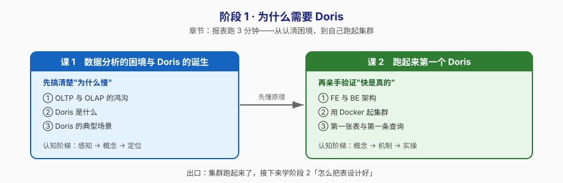

# 阶段 1：为什么需要 Doris

> 所属课程：Apache Doris ｜ 故事章节：**报表跑 3 分钟**——运营同学在等一个数，数据库在苦熬 ｜ 下一阶段：[阶段 2](../2-数据建模/overview.md)

## 🎯 本阶段目标

- 说清 OLTP 与 OLAP 的本质差异，能解释"为什么加了索引还是慢"
- 理解 Doris 只有 FE + BE 两类进程的极简架构，知道一条 SQL 进来后各自干什么
- 在本机（WSL + Docker）跑起一个可用的 Doris 集群，建表、导数、查出第一条结果

## 📍 学习重点

- **行存 vs 列存**：分析查询只关心少数几列，行存却要把整行读出来——这是"慢"的第一性原因
- **FE / BE 分工**：FE 是大脑（接请求、解析 SQL、管元数据），BE 是肌肉（存数据、执行计划）；只有两个进程，运维复杂度远低于需要外部协调服务的系统
- **分区分桶初印象**：Doris 一切性能的地基，本阶段先建立直觉，阶段 2 深入

## ✅ 必须掌握的知识点

| 知识点 | 所属课 | 学完应能 |
|--------|--------|----------|
| OLTP 与 OLAP 的鸿沟 | 课 1 | 说清为什么"3 亿行按月汇总"在 MySQL 慢，能画出行存/列存读取范围对比 |
| Doris 是什么 | 课 1 | 一句话讲清 Doris 的定位、起源（百度 Palo → Apache 孵化 → TLP）与核心特性 |
| Doris 的典型场景 | 课 1 | 能列举 Doris 擅长的 4 类场景，并说出 3 个不该用它的场景 |
| FE 与 BE 架构 | 课 2 | 画出 FE/BE 组件图，说清 FE 的 Master/Follower/Observer 三种角色 |
| 用 Docker 起集群 | 课 2 | 独立执行启动命令，用 `SHOW FRONTENDS` / `SHOW BACKENDS` 确认集群健康 |
| 第一张表与第一條查询 | 课 2 | 写出一条完整的 `CREATE TABLE`（含 DISTRIBUTED BY HASH BUCKETS）并成功查询 |

## 🗺️ 本阶段路径图

## 本阶段产出

- [x] `lessons/lesson-01-数据分析的困境与Doris的诞生.md`（2026-09-02 完成）
- [x] `lessons/lesson-02-跑起来第一个Doris.md`（2026-09-02 完成）

## 阶段状态

**✅ 已完成**（2/2 课完成，2026-09-02）

## 核心结论（随课交付追加）

- **课 1**（2026-09-02）：OLTP 是"一次碰几条记录但要所有列"，OLAP 是"一次碰几千万行但只关心少数几列"——存储布局必须跟着变。本机实测 2000 万行 MySQL：每行 165 字节而聚合只需 20 字节，**读取放大约 8 倍**；加索引能救特定维度（7.62s→2.64s）但换维度失效（8.61s），且插入代价从 2.75s 涨到 80.10s。Doris 的解法不是加更多索引，而是**列存（少读）+ MPP（并行算）+ 向量化（吃满 CPU）**。
- **课 2**（2026-09-02）：Doris 只有 FE（想：接入/解析/规划/管节点）和 BE（干：存数据/做计算）两类进程，FE 间用内置类 Raft 协议自治，**不依赖任何外部协调服务**，所以一条 `docker run` 10 秒起集群。实测同批 2050 万行：聚合查询 **快 24–75 倍**（Q1 3.36s→0.14s，Q2 换维度 9.36s→0.13s），存储 **3472MB→215MB（压缩 16 倍）**，Stream Load **21 秒导入 2050 万行零过滤**。但点查场景打平（0.13s vs 0.12s），印证"没有银弹"。**亲手踩坑**：`HASH(province) BUCKETS 8` 而数据只有 8 个省 → 8 个 tablet 空了一半、最大装 768 万行，理论并行度 8 实际只有 4——分桶键必须选高基数列。
