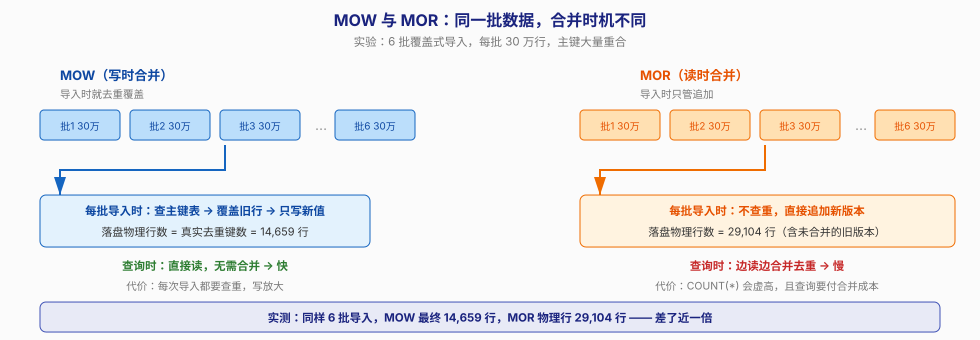
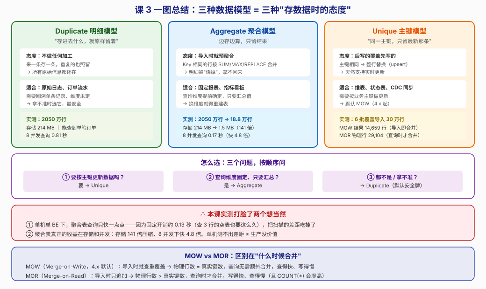

# 第 3 课：三种数据模型

> 所属阶段：阶段 2《数据建模》｜ 水平：零基础 ｜ 本课知识点：Duplicate 明细模型、Aggregate 聚合模型、Unique 主键模型
> 故事情节：主角准备建表，发现 Doris 的建表语句里有个陌生的 KEY 和模型声明——"原来表还有'性格'之分"

## 🎯 本课目标

- 为给定业务需求选出正确的表模型，并说清选它的理由
- 用 Aggregate 模型建一张预聚合表，理解"查询快"的代价是什么
- 解释 Unique 模型的语义，以及与 Aggregate REPLACE 的关系

---

## 第一幕：起源与场景引入

> 🏛️ **起源**：Doris 的表模型设计继承自 Google Mesa 与百度 PALO 的实践。Mesa 论文里有个核心思想——**聚合应该在数据写入时做，而不是查询时做**。因为报表查询会被执行成千上万次，而数据只写入一次。这个"把计算从查询侧挪到写入侧"的思路，就是 Aggregate 模型的由来。

上一课我们建了第一张表：

```sql
CREATE TABLE orders (...)
DUPLICATE KEY(order_date, province, city)
DISTRIBUTED BY HASH(province) BUCKETS 8;
```

当时我让你先记住 `DUPLICATE KEY` 是"表模型声明"，说阶段 2 再讲。现在就是揭开它的时候。

先看一个真实的困境。假设你是电商的数据工程师，运营同事每天早上要看一张"各省销售日报"：

```sql
SELECT province, COUNT(*) c, SUM(amount) total
FROM orders GROUP BY province;
```

这张报表一天被查几百次，而底表有 3 亿行。**每次查询都要把 3 亿行重新扫一遍、重新加一遍**——哪怕昨天算出来的结果和今天几乎一样。

你会想：能不能把结果提前算好存起来？

能。Doris 给你的答案就是 **Aggregate 聚合模型**：在建表的时候就声明"这列是 SUM 的、那列是 MAX 的"，导入时 Doris 自动帮你聚合好。

> 🎬 **场景**：但预聚合不是免费的。它的代价是——**明细数据被"烧掉"了，再也拿不回来**。这一课我们要搞清楚：什么时候值得付这个代价。

---

## 第二幕：认知冲突

在讲三个模型之前，先说一个你可能会有的误解。

你可能以为"表模型"是个优化选项——就像索引一样，加了查询会快一点，不加也没事。

**不是的。表模型决定了数据物理上怎么存，建表之后就改不了了**（只能重建表、重新导数据）。选错模型的代价，比选错索引大得多——索引可以删了重建，模型不行。

所以这不是"优化"，这是**建模决策**。

> ❓ **问题**：既然 Aggregate 模型查询快，为什么不所有表都用它？它的代价到底是什么，什么时候这个代价不可接受？

---

## 第三幕：层层揭示

### 知识点 1：Duplicate 明细模型

> 本知识点关键点：原样存储不聚合、为什么是"最安全"的默认选择、排序键的作用

#### 一句话定义

**Duplicate 模型对数据不做任何加工**——导入多少行就存多少行，重复的也照留。

#### 直觉建立（类比）

想象三种记账方式：

- **Duplicate 是流水账本**：每一笔都记下来，"9:00 买咖啡 30 元""9:05 买咖啡 30 元"——两笔都留着，哪怕一模一样。好处是任何时候都能回溯"我 9 点到底买了几杯"。

> 💡 **类比的边界**：账本只能顺序翻，而 Doris 的 Duplicate 表内部会按 Key 列**排序存储**（下面会讲），所以前缀匹配的查询能很快定位。另外账本不会"去重"，Duplicate 表也不会。

#### 核心原理

**语法**

```sql
CREATE TABLE orders_dup (
    order_date DATE NOT NULL,
    province   VARCHAR(16) NOT NULL,
    ...
)
DUPLICATE KEY(order_date, province, city)   -- 模型声明 + 排序键
DISTRIBUTED BY HASH(city) BUCKETS 8
PROPERTIES ('replication_num' = '1');
```

**`DUPLICATE KEY(...)` 里的列有两个身份**：

1. **模型声明**：告诉 Doris"这是明细表，不要聚合"
2. **排序键**：数据按这些列**排序存储**

排序键的作用很实在：因为数据有序，所以按前缀过滤时 Doris 可以直接跳过大块数据。比如 `WHERE order_date='2025-01-01'` 能快速定位，因为 `order_date` 是排序键的第一个。

> ⚠️ **排序键的顺序会影响查询性能**，这是**课 5 的主角**。现在只要知道：把最常用的过滤列放前面。

**为什么它是"最安全"的默认选择？**

三个理由：

1. **不丢信息**：所有原始行都在，任何维度都能查
2. **不猜未来**：你不知道三个月后运营要看什么维度，明细表永远能答
3. **可回退**：从 Duplicate 迁移到 Aggregate 只是重建表+重导数据；反过来（想找回被聚合掉的明细）**不可能**

第 3 点最关键。**Aggregate 是不可逆操作。** 拿不准的时候，选 Duplicate。

#### 示例演示

本课实测：把课 2 那 2050 万行原样复制进 Duplicate 表：

```sql
INSERT INTO orders_dup SELECT * FROM orders;
-- 耗时 7 秒，行数 20500000
```

查询单笔订单——**这是明细表能做到，而聚合表做不到的事**：

```sql
SELECT COUNT(*) FROM orders_dup
WHERE user_id = 12345 AND order_date = '2025-06-01';
```

#### 常见误区

1. **"Duplicate 表会自动去重"**：不会。"Duplicate"这个名字本身就叫"重复"——它的意思是**允许重复行存在**。要去重请用 Unique 模型。
2. **"排序键必须是主键"**：不是。Doris 的 Duplicate 表**没有主键概念**，排序键只影响存储顺序，不保证唯一性。
3. **"明细表太占空间，应该默认用聚合表"**：先看数据。本课实测明细 214 MB，看着大，但换算下来每行 11 字节——列存压缩已经很厉害了。别为了省空间丢掉明细。

#### 一句话记住

**Duplicate = 流水账，来一条存一条、不加工不丢失；它是拿不准时的默认安全牌，因为从它迁移到别的模型只是重建表，反过来不可能。**

#### 官方文档

- [数据模型介绍](https://doris.apache.org/zh-CN/docs/2.1/table-design/data-model/overview)

---

### 知识点 2：Aggregate 聚合模型

> 本知识点关键点：SUM / REPLACE / MAX / MIN / HLL_UNION / BITMAP_UNION 语义、导入时预聚合、代价是丢失明细

#### 一句话定义

**Aggregate 模型在导入时就把 Key 相同的行合并**，按你声明的聚合方式（SUM/MAX/MIN/REPLACE）算出结果存下来，明细丢弃。

#### 直觉建立（类比）

还是记账，但换成**月度汇总表**：

- 不记"9:00 咖啡 30 元""9:05 咖啡 30 元"，只记"餐饮：本月共 60 元"
- 想知道"9 点买了几杯咖啡"？**查不到了，因为那两笔已经被合并了**

关键是**谁来汇总、什么时候汇总**：不是月底你手工填的，而是**每一笔数据进来时就自动累加**——第 2 笔咖啡进来的瞬间，"餐饮"这一行的金额就自动从 30 变成 60 了。所以你随时查都是最新汇总，不用等到月底。

> 💡 **类比的边界**：月度汇总表是人手工填的，可以留着草稿找回来；Doris 的 Aggregate 是**物理上真的只存聚合结果**，明细字节已经不存在于磁盘上了。这是"烧掉"，不是"折叠"。

#### 核心原理

**语法**

```sql
CREATE TABLE orders_agg (
    order_date   DATE NOT NULL,          -- Key 列
    province     VARCHAR(16) NOT NULL,   -- Key 列
    city         VARCHAR(32) NOT NULL,   -- Key 列
    order_cnt    BIGINT        SUM        DEFAULT '0',   -- Value 列，求和
    quantity_sum BIGINT        SUM        DEFAULT '0',
    amount_sum   DECIMAL(18,2) SUM        DEFAULT '0',
    amount_max   DECIMAL(10,2) MAX        DEFAULT '0',   -- 取最大
    last_status  TINYINT       REPLACE    DEFAULT '0'    -- 保留最后一条
)
AGGREGATE KEY(order_date, province, city)
DISTRIBUTED BY HASH(city) BUCKETS 8
PROPERTIES ('replication_num' = '1');
```

**Key 列 vs Value 列**

- `AGGREGATE KEY(...)` 里的列是 **Key 列**——聚合的维度，也是排序键
- 其余列是 **Value 列**——必须**显式声明聚合方式**

**六种聚合方式**

| 聚合方式 | 语义 | 典型用途 |
|---------|------|---------|
| `SUM` | 累加 | 订单数、金额、销量 |
| `MAX` | 取最大 | 最高单价、最新时间 |
| `MIN` | 取最小 | 最低价、最早时间 |
| `REPLACE` | **保留最后导入的那条** | 状态、备注等非数值字段 |
| `HLL_UNION` | 近似去重计数（HyperLogLog） | UV 估算，误差约 1% |
| `BITMAP_UNION` | 精确去重计数（Bitmap） | 精确 UV，但耗内存 |

前四个是基础，后两个是**去重计数的专用武器**。

> 💡 **`UV` 是什么？** Unique Visitor，独立访客数——**同一个人一天来 10 次也只算 1 个**。这是互联网最核心的指标之一，但计算成本很高：要判断"这个人今天来过没有"，就得维护一张访客名单。
>
> 普通做法 `COUNT(DISTINCT user_id)` 在亿级数据上会非常慢且耗内存。`HLL_UNION` 用概率算法**估算**（省空间、有约 1% 误差），`BITMAP_UNION` 用位图**精确计算**（无误差、但用户基数大时耗内存）。
>
> 这两个可以直接在聚合表里预计算好：导入时就把每个分组的 UV 算完，**查询时直接读数**，不用扫明细。这是"把计算从查询侧挪到写入侧"最典型的体现。

> ⚠️ **`REPLACE` 的"最后一条"是按导入顺序，不是按时间戳**。Doris 不认识你数据里的 `updated_at` 列，它只认"哪批后写进来"。如果你需要"按 update_time 取最新"，得自己在导入前排序，或者改用 Unique 模型。

**为什么查询快？**

因为**要扫的行少了**。本课实测：

```sql
SELECT province, COUNT(*) c, ROUND(SUM(amount)) total
FROM orders_dup GROUP BY province;
-- EXPLAIN 显示：cardinality=20500000（扫 2050 万行）
```

```sql
SELECT province, SUM(order_cnt) c, ROUND(SUM(amount_sum)) total
FROM orders_agg GROUP BY province;
-- EXPLAIN 显示：cardinality=188554（只扫 18.8 万行）
```

**扫描量差 108 倍。** 2050 万行聚合后只剩 188,554 行——因为 `(order_date, province, city)` 这个组合在数据里只有 18.8 万种。

**代价是什么？**

三个代价，按严重程度排序：

1. **明细永久丢失**：`user_id`、`product_id` 这些列要么不进表，要么只能聚合。本课实测，想在聚合表里查 `user_id` 直接报错：
   ```
   ERROR 1105 (HY000): Unknown column 'user_id' in 'table list'
   ```
2. **换维度要重建表**：按 `(日期, 省, 市)` 聚合的表，查"按品类"的报表就得全表重扫（因为品类信息已经没了）
3. **COUNT(\*) 语义变了**：聚合表的 `COUNT(*)` 数的是**聚合后的行数**，不是原始订单数。要原始订单数得 `SUM(order_cnt)`

#### 示例演示

本课实测：从 2050 万行明细生成聚合表：

```sql
INSERT INTO orders_agg
SELECT order_date, province, city,
       COUNT(*), SUM(quantity), SUM(amount), MAX(amount), MAX(status)
FROM orders
GROUP BY order_date, province, city;
-- 耗时 1 秒，结果 188554 行
```

**结果一致性验证**（这很重要——聚合表算出来的必须和明细表完全一样）：

| province | 明细表 COUNT | 聚合表 SUM(order_cnt) |
|----------|-------------|---------------------|
| 湖北 | 2,565,552 | **2,565,552** |
| 福建 | 2,562,892 | **2,562,892** |
| 河南 | 2,564,153 | **2,564,153** |
| 广东 | 2,560,989 | **2,560,989** |

完全一致 ✅。

**存储对比**（这才是 Aggregate 真正的杀手锏）：

| 表 | 行数 | 存储 |
|----|------|------|
| `orders_dup`（明细） | 20,500,000 | **214 MB** |
| `orders_agg`（聚合） | 188,554 | **1.5 MB** |

**141 倍压缩。**

#### 常见误区

1. **"聚合表所有列都要 SUM"**：不是，六种方式按需选。非数值列（状态、备注）通常用 `REPLACE`。
2. **"REPLACE 会保留时间戳最新的那条"**：**不会**。它保留**最后导入**的那条，与你的业务时间无关。
3. **"聚合表查询一定快很多"**：**本课实测打脸了这个说法**——单机环境下只快了一点点。原因见第四幕，这是个很值得理解的陷阱。

#### 一句话记住

**Aggregate = 月度汇总表，导入时按 Key 合并、只留结果；收益是存储和扫描量暴减（实测 141 倍），代价是明细永久丢失且换维度要重建表。**

#### 官方文档

- [Aggregate 模型](https://doris.apache.org/zh-CN/docs/2.1/table-design/data-model/aggregate)

---

### 知识点 3：Unique 主键模型

> 本知识点关键点：主键唯一语义、MOR（Merge-on-Read）与 MOW（Merge-on-Write）的差异、与 Aggregate REPLACE 的关系

#### 一句话定义

**Unique 模型保证 Key 列唯一**——后导入的行覆盖先导入的行，等价于数据库的 `UPSERT`。

#### 直觉建立（类比）

换成**通讯录**：

- 同一个人的手机号改了，你不会新建一条联系人记录，而是**更新原来那条**
- 通讯录里"张三"永远只有一条，且是最新信息

Unique 表就是给数据建了个"主键=身份"的通讯录。

> 💡 **类比的边界**：通讯录更新是"你主动去改"，而 Unique 表的覆盖是**导入时自动发生**的——你只需要不断 INSERT，Doris 自动判断"这个主键已存在，覆盖它"。

#### 核心原理

**语法**

```sql
CREATE TABLE orders_uniq (
    order_date DATE NOT NULL,
    province   VARCHAR(16) NOT NULL,
    city       VARCHAR(32) NOT NULL,
    user_id    BIGINT,
    amount     DECIMAL(10,2),
    status     TINYINT,
    updated_at DATETIME
)
UNIQUE KEY(order_date, province, city)
DISTRIBUTED BY HASH(city) BUCKETS 8
PROPERTIES (
    'replication_num' = '1',
    'enable_unique_key_merge_on_write' = 'true'   -- MOW
);
```

**upsert 语义（本课实测）**

```sql
-- 第一次插入
INSERT INTO orders_uniq_mow VALUES ('2025-01-01','广东','深圳', 1001, 99.50, 1, ...);
-- 结果：user_id=1001, amount=99.50, status=1

-- 第二次插入同一主键
INSERT INTO orders_uniq_mow VALUES ('2025-01-01','广东','深圳', 1002, 888.88, 2, ...);
-- 结果：user_id=1002, amount=888.88, status=2   ← 整行被覆盖
```

**对照组**：同样两条数据插进 Duplicate 表，**两行都保留**。

**与 Aggregate REPLACE 的关系**

这是本课最值得记住的一个等价关系：

> **Unique 模型 ≈ 所有 Value 列都是 `REPLACE` 的 Aggregate 模型。**

本课实测验证：建一张所有列都 `REPLACE` 的 Aggregate 表，插入同一主键两次，结果和 Unique 表**完全一致**（都是后者覆盖前者）。

| | Aggregate REPLACE | Unique |
|---|---|---|
| 语义 | 保留最后导入的行 | 保留最后导入的行 |
| 实测结果 | `user_id=3002, amount=222.00` | `user_id=1002, amount=888.88` |
| 能否混用聚合方式 | ✅ 可以（SUM + REPLACE 混着用） | ❌ 只能 REPLACE |

**所以怎么选？** 如果同一张表里既要"金额求和"又要"状态取最新"——只能用 Aggregate（混用 SUM 和 REPLACE）。如果所有列都只要最新值——用 Unique，语义更清晰。

**MOW vs MOR：合并时机**

这是 Unique 模型最核心的技术差异。

| | MOW（Merge-on-Write） | MOR（Merge-on-Read） |
|---|---|---|
| 全称 | 写时合并 | 读时合并 |
| **什么时候合并** | **导入时** | **查询时** |
| 4.x 默认值 | ✅ **默认**（实测确认） | 需显式关闭 |
| 写入速度 | 慢（每次导入要查重） | **快**（只管追加） |
| 查询速度 | **快**（直接读） | 慢（要边读边合并） |
| 物理行数 | = 真实键数 | **> 真实键数**（堆着未合并版本） |

**本课实测（重要）**：6 批覆盖式导入，每批 30 万行，主键大量重合：

| | 最终行数 |
|---|---|
| **MOW** 表 | **14,659** |
| **MOR** 表 | **29,104** |

**差了近一倍。** MOW 在导入时就消掉了重复键，落盘就是 14,659 行；MOR 只管追加，物理上堆着 29,104 行，等查询时再合并。

> ⚠️ **MOR 的这个特性有个坑**：如果你直接 `SELECT COUNT(*)`，MOR 表可能返回**虚高**的数字（取决于后台 Compaction 跑没跑）。要准确的业务行数，Unique 表建议开 MOW。

**怎么确认当前是 MOW 还是 MOR？**

```sql
SHOW CREATE TABLE orders_uniq\G
-- 看 "enable_unique_key_merge_on_write" = "true"（MOW）还是 "false"（MOR）
```

本课实测：**不显式指定时，Doris 4.1.3 默认给的是 `true`（MOW）**。

> 📌 这点值得留意——不少网上资料（基于 1.x/2.x 版本）说默认是 MOR。版本演进已经改了这个默认值。

#### 示例演示

```sql
-- 建一张 MOW 表（4.x 可省略该属性，默认就是 MOW）
CREATE TABLE user_profile (
    user_id    BIGINT       NOT NULL,
    user_name  VARCHAR(64)  NOT NULL,
    city       VARCHAR(32),
    balance    DECIMAL(12,2),
    updated_at DATETIME
)
UNIQUE KEY(user_id)
DISTRIBUTED BY HASH(user_id) BUCKETS 8
PROPERTIES ('replication_num' = '1');
```

典型用法——**从 MySQL 同步维表（CDC 场景）**：

```sql
-- 业务库更新了用户余额，同步过来
INSERT INTO user_profile VALUES (1001, '张三', '深圳', 500.00, '2025-06-01 10:00:00');
-- 又更新了一次
INSERT INTO user_profile VALUES (1001, '张三', '深圳', 888.00, '2025-06-01 11:00:00');

SELECT * FROM user_profile WHERE user_id = 1001;
-- 只有一行，balance = 888.00（最新的）
```

**这就是 Unique 模型的主战场**：维表、状态表、CDC 实时同步。

#### 常见误区

1. **"Unique 表只能 REPLACE"**：对——但反过来说，**需要混用 SUM 和 REPLACE 时必须用 Aggregate**。这是两者的真实分工。
2. **"MOR 是落后技术，永远该用 MOW"**：不一定。**写入极其频繁、查询很少**的场景（比如纯数据接入缓冲），MOR 的写入优势更大。默认用 MOW，但别把 MOR 当垃圾。
3. **"Unique 的 Key 列会自动去重，所以不用管导入顺序"**：顺序**很重要**——后写的赢。如果乱序导入（比如先导入了昨天的数据，再导入前天的），最终留下的是"前天"那条。

#### 一句话记住

**Unique = 通讯录，同一主键后写的覆盖先写的；它等价于"所有列都 REPLACE 的 Aggregate"；4.x 默认 MOW（导入时合并，查得快），MOR 是读时合并（写得快但 COUNT(\*) 会虚高）。**

#### 官方文档

- [Unique 模型](https://doris.apache.org/zh-CN/docs/2.1/table-design/data-model/unique)

---

## 第四幕：实操验证

以下数字均为本机实测（2026-09-02，WSL Ubuntu + Docker，Doris 4.1.3，单 BE，20 核 31GB）。

### 环境准备

> ⚠️ 下面的建表语句**列是故意删减的**，为了让你看清模型声明的差异。要直接跑通，请用 [lesson03-setup-tables.sh](../../../assets/lesson03-setup-tables.sh) 里的完整版本。

```sql
-- 1. Duplicate 明细表：13 列全保留，一行不丢
CREATE TABLE orders_dup (
    order_date DATE NOT NULL,
    province   VARCHAR(16) NOT NULL,
    city       VARCHAR(32) NOT NULL,
    user_id    BIGINT NOT NULL,
    product_id INT NOT NULL,
    category   VARCHAR(32) NOT NULL,
    quantity   INT NOT NULL,
    amount     DECIMAL(10,2) NOT NULL,
    pay_type   VARCHAR(16) NOT NULL,
    status     TINYINT NOT NULL,
    remark     VARCHAR(255) NOT NULL DEFAULT 'xxx',
    created_at DATETIME NOT NULL,
    updated_at DATETIME NOT NULL
)
DUPLICATE KEY(order_date, province, city)
DISTRIBUTED BY HASH(city) BUCKETS 8
PROPERTIES ('replication_num' = '1');

INSERT INTO orders_dup SELECT * FROM orders;   -- 实测 7 秒，20500000 行
```

```sql
-- 2. Aggregate 聚合表：3 个 Key 列 + 5 个 Value 列
--    注意 city 选了 50 个值的列做分桶键（课 2 用 province 只有 8 个值，踩过倾斜的坑）
CREATE TABLE orders_agg (
    order_date   DATE          NOT NULL,   -- Key
    province     VARCHAR(16)   NOT NULL,   -- Key
    city         VARCHAR(32)   NOT NULL,   -- Key
    order_cnt    BIGINT        SUM     DEFAULT '0',   -- Value：订单数累加
    quantity_sum BIGINT        SUM     DEFAULT '0',   -- Value：销量累加
    amount_sum   DECIMAL(18,2) SUM     DEFAULT '0',   -- Value：金额累加
    amount_max   DECIMAL(10,2) MAX     DEFAULT '0',   -- Value：单笔最高
    last_status  TINYINT       REPLACE DEFAULT '0'    -- Value：状态取最后一条
)
AGGREGATE KEY(order_date, province, city)
DISTRIBUTED BY HASH(city) BUCKETS 8
PROPERTIES ('replication_num' = '1');

INSERT INTO orders_agg
SELECT order_date, province, city, COUNT(*), SUM(quantity),
       SUM(amount), MAX(amount), MAX(status)
FROM orders GROUP BY order_date, province, city;   -- 实测 1 秒，188554 行
```

```sql
-- 3. Unique 表：MOW / MOR 各一张，只有最后一行属性不同
CREATE TABLE orders_uniq_mow (
    order_date DATE NOT NULL,
    province   VARCHAR(16) NOT NULL,
    city       VARCHAR(32) NOT NULL,
    user_id    BIGINT,
    amount     DECIMAL(10,2),
    status     TINYINT,
    updated_at DATETIME
)
UNIQUE KEY(order_date, province, city)
DISTRIBUTED BY HASH(city) BUCKETS 8
PROPERTIES ('replication_num'='1', 'enable_unique_key_merge_on_write'='true');   -- MOW

-- MOR 版：把 true 改成 false，其余完全相同
PROPERTIES ('replication_num'='1', 'enable_unique_key_merge_on_write'='false');  -- MOR
```

> 📌 **本课分桶键改用 `city`（50 个值）**，吸取了课 2 用 `province`（8 个值）导致 8 个桶空一半的教训。但这仍然是拍脑袋选的——下一课会给出**可计算的方法**，而不是靠猜。

> 脚本已落盘：[lesson03-setup-tables.sh](../../../assets/lesson03-setup-tables.sh)（建表+导入）、[lesson03-bench-compare.sh](../../../assets/lesson03-bench-compare.sh)（存储与查询对比）、[lesson03-uniq-verify.sh](../../../assets/lesson03-uniq-verify.sh)（upsert 语义验证）、[lesson03-mow-mor2.sh](../../../assets/lesson03-mow-mor2.sh)（MOW/MOR 差异）

### 结果 1：存储与行数

| 表 | 模型 | 行数 | 存储 |
|---|------|------|------|
| `orders_dup` | Duplicate | 20,500,000 | **214 MB** |
| `orders_agg` | Aggregate | 188,554 | **1.5 MB** |

**行数压缩 108 倍，存储压缩 141 倍。**

> 📌 存储数字需要在导入后触发一次 Compaction 才会统计出来（新导入的数据先写内存再异步落盘）。如果 `SHOW DATA` 显示 0，等一会儿或用 `curl http://BE:8040/api/compaction/run?tablet_id=...` 手动触发。这是新手常以为"导入失败了"的假象。

### 结果 2：查询耗时——一个反直觉的发现

先说结论：**单机单 BE 环境下，聚合表查询只快了一点点。**

| 查询 | 明细表 | 聚合表 |
|------|--------|--------|
| Q1 按省聚合 | 0.265 s | 0.16 s |
| Q2 按日期聚合 | 0.192 s | 0.156 s |
| Q3 按省+市聚合 | 0.309 s | — |

扫描量少 108 倍，耗时却只差 0.1 秒？**为什么？**

我做了个诊断实验：建一张**只有 3 行**的表查 5 次。

```text
第 1 次: 0.140 秒
第 2 次: 0.120 秒
第 3 次: 0.147 秒
第 4 次: 0.121 秒
第 5 次: 0.126 秒
```

**查 3 行的数据也要 0.13 秒。**

这说明：**查询耗时 ≈ 固定开销（0.13s）+ 扫描耗时**。固定开销包括 SQL 解析、执行计划生成、Fragment 调度、MySQL 协议往返、客户端启动——这些跟数据量无关。

而扫描 2050 万行只花了约 0.04–0.14 秒（列存 + 向量化 + 8 核并行太强了），**被固定开销完全淹没**。

> ⚠️ **这是本课最重要的方法论提醒**：**在小数据量的单机环境测性能，很容易得出错误结论**。你测出"聚合表没用"，但真实生产环境（3 亿行、多个 BE、几十个并发查询）下，差距会完全不同。

### 结果 3：聚合表真正的战场——并发

既然单次查询被固定开销淹没，那就测**并发**——这才是聚合表的设计初衷（一张报表被几百人同时查）。

**8 个查询同时跑**：

| 表 | 8 并发总耗时 |
|---|-------------|
| `orders_dup`（明细，每次扫 2050 万行） | **0.81 秒** |
| `orders_agg`（聚合，每次扫 18.8 万行） | **0.17 秒** |

**快 4.8 倍。** 差距出来了。

原因很直白：单次查询时 CPU 有富余，多扫点无所谓；8 个查询并发时 CPU 成了瓶颈，扫描量就成了决定性因素。

> ✅ **这才是对 Aggregate 模型的正确认知**：它的价值不在"单次查询快多少"，而在**用极小的存储和扫描量，撑住高并发的报表查询**。

### 结果 4：Unique 的 upsert 语义

```sql
-- MOW 表：同一主键插两次
INSERT INTO orders_uniq_mow VALUES ('2025-01-01','广东','深圳', 1001, 99.50, 1, ...);
INSERT INTO orders_uniq_mow VALUES ('2025-01-01','广东','深圳', 1002, 888.88, 2, ...);

SELECT * FROM orders_uniq_mow WHERE city='深圳';
-- 结果：1002, 888.88, 2      ← 后者覆盖前者 ✅
```

```sql
-- Duplicate 表：同样两条
SELECT ... FROM orders_dup WHERE city='深圳' AND user_id IN (1001,1002);
-- 结果：两条都在（99.50 和 888.88）  ← 原样保留 ✅
```

### 结果 5：MOW vs MOR 的实测差异

**实验设计**：6 批覆盖式导入，每批 30 万行，主键大量重合。

| | MOW | MOR |
|---|-----|-----|
| 最终行数 | **14,659** | **29,104** |
| 平均每批导入耗时 | 0.80 秒 | 0.70 秒 |



**MOW 在导入时就完成了去重**（写入稍慢，0.80s vs 0.70s），落盘 14,659 行；**MOR 只管追加**，物理上堆着 29,104 行，等查询时再合并。

重复查 3 次，数字稳定不变——这不是偶发现象。

> ✅ **回扣场景**：开篇的问题是"能不能把结果提前算好存起来"。答案是能，Aggregate 模型就是干这个的，而且效果惊人——**存储 141 倍压缩**。但代价也很清楚：明细没了、换维度要重建表、而且**在单机环境你根本测不出它查询有多快**（固定开销吃掉了差距）。真正的收益要在并发场景才显现——8 并发下快 4.8 倍。

---

## 第五幕：体系收束

> 📍 **全局定位**：课 2 你学会了"怎么把表建出来"，课 3 你学会了"建表时该选哪种模型"。**模型是地基**——它决定了数据物理上怎么存，建完就改不了。阶段 2 剩下两课都是在这个地基上做优化。
>
> 三个模型的选择口诀：
>
> 1. **要按主键更新？** → Unique
> 2. **查询维度固定、只要汇总值？** → Aggregate
> 3. **都不是 / 拿不准？** → Duplicate（默认安全牌）
>
> 🔗 **下一步**：无论选了哪个模型，都还有两个问题没解决——**数据怎么按时间切**（课上讲过分区能"整个跳过分块"），以及**分桶键到底该怎么选**（课 2 踩过 province 倾斜的坑，本课虽然改用了 city，但那是拍脑袋选的）。下一课《分区与分桶》会给出可计算的方法，而不是靠猜。

---

## 🐞 常见误区

1. **"Duplicate 会自动去重"**：不会。Duplicate 的意思是"允许重复"，要去重请用 Unique。
2. **"表模型是可以随时改的优化选项"**：**不能改**。模型决定物理存储，选错只能重建表+重导数据。这是建模决策，不是调优选项。
3. **"Aggregate 表里所有列都要 SUM"**：不是，六种聚合方式按需选，非数值列通常用 `REPLACE`。
4. **"REPLACE 保留时间戳最新的那条"**：**错**。它保留**最后导入**的那条，与业务时间无关。
5. **"聚合表查询一定快很多，我在本机测过"**：本课实测——单机单 BE 下只快一点点，因为固定开销约 0.13 秒吃掉了扫描优势。**聚合表真正的价值是存储压缩（141 倍）和并发能力（8 并发快 4.8 倍）**。
6. **"Unique 默认是 MOR"**：**4.x 起默认是 MOW**（本课实测 `enable_unique_key_merge_on_write = true`）。基于旧版本的资料会误导你。
7. **"MOR 表的 COUNT(\*) 就是业务行数"**：不一定。MOR 物理上堆着未合并的版本，`COUNT(*)` 可能虚高（本课实测 MOW 14,659 vs MOR 29,104）。要准确计数建议用 MOW。

## 一图总结



**一句话串起来**：三种模型是三种"存数据的态度"——Duplicate 原样留（安全牌、可回溯）、Aggregate 边存边算（存储省 141 倍、并发快 4.8 倍，但明细烧掉）、Unique 后写覆盖前写（等价于全 REPLACE 的 Aggregate，4.x 默认 MOW 导入即合并）；选型的三个问题：要按主键更新吗？维度固定吗？都不是就选 Duplicate。

## 课后小测

**Q1**：你负责一张电商订单表，业务方要求"同一笔订单重复导入时只保留最新状态"，同时需要统计"每个用户的累计消费金额"。应该选哪个模型？

- A. Duplicate —— 最安全，什么都能查
- B. Unique —— 天然支持按主键更新
- C. Aggregate，其中消费金额列用 SUM，状态列用 REPLACE
- D. 建两张表：一张 Unique 存状态，一张 Aggregate 存金额

<details><summary>答案与解析</summary>

**答案：C**。这是本课"与 Aggregate REPLACE 关系"的直接应用：**同一张表里既要 SUM 又要 REPLACE 时，只能用 Aggregate**——Unique 模型所有列都只能是 REPLACE，没法对金额求和。

A 错：Duplicate 不去重，重复导入会留多份。B 错：Unique 无法表达"金额求和"。D 不是不行，但过度设计——Aggregate 一张表就能同时满足两个需求。

**判断口诀**：只要出现"既要……又要……"的混合聚合需求，就选 Aggregate。

</details>

**Q2**：本课实测中，聚合表扫描量比明细表少 108 倍，但单次查询只快了约 0.1 秒。根本原因是？

- A. 聚合表建得不对，分桶键选错了
- B. 查询的固定开销（SQL 解析、计划生成、客户端往返）约 0.13 秒，把扫描优势淹没了
- C. Doris 的向量化执行对明细表也有优化，所以差距不大
- D. 数据量太小，Doris 没走并行执行

<details><summary>答案与解析</summary>

**答案：B**。本课用"查一张只有 3 行的表也要 0.13 秒"的实验证明了固定开销的存在。耗时 = 固定开销 + 扫描耗时，在单机小数据量下前者主导。

A 错：分桶键影响的是数据分布均匀性，不是固定开销。C 错：向量化确实优化了两边，但这不解释"为什么 108 倍扫描量只换来 0.1 秒"。D 错：EXPLAIN 显示 `tablets=8/8`，并行是走了的。

**方法论提醒**：在小规模环境测性能容易得出错误结论。本课 8 并发测试才让聚合表拉开 4.8 倍差距。

</details>

**Q3**：关于 MOW 与 MOR，下列说法正确的是？

- A. MOR 是默认值，性能更好，应该优先使用
- B. MOW 在查询时才合并，所以写入快、查询慢
- C. Doris 4.x 起默认是 MOW，它在导入时就完成去重，物理行数等于真实键数
- D. MOW 和 MOR 的 COUNT(\*) 结果一定相同

<details><summary>答案与解析</summary>

**答案：C**。本课实测确认：不显式指定时 Doris 4.1.3 给出 `enable_unique_key_merge_on_write = true`，且 MOW 落盘 14,659 行 = 真实去重键数。

A 错：4.x 起默认是 MOW，且 MOR 只是写入快，不能说"性能更好"。B 错：**说反了**——MOW 是**写入时**合并，MOR 才是查询时合并。D 错：本课实测 MOW 14,659 vs MOR 29,104，MOR 因为堆着未合并版本，COUNT(\*) 会虚高。

</details>

## 🚀 下一批接力提示词

> 学完本课后，**复制下面这段文字发给 AI**，即可无缝进入下一课（无需重新描述上下文）：

```
继续学 Apache Doris。我的学习档案在 doris/00-学习档案.md，
刚学完阶段 2《数据建模》的课 3《三种数据模型》
知识点（Duplicate 明细模型、Aggregate 聚合模型、Unique 主键模型），
集群已在本机跑起来（容器名 doris-learn，9030/8030/8040，库 shop），
已有表：orders（2050万行明细）、orders_dup、orders_agg（18.8万行）、
orders_uniq_mow、orders_uniq_mor、orders_agg_replace，
请按大纲继续讲解阶段 2 课 4《分区与分桶》。
```

## 🧭 课程导航

⬅️ **上一课**：[课 2：跑起来第一个 Doris](../../1-为什么需要Doris/lessons/lesson-02-跑起来第一个Doris.md)

➡️ **下一课**：[课 4：分区与分桶](lesson-04-分区与分桶.md)

📚 **返回目录**：[课程目录](../../../02-课程目录.md)
