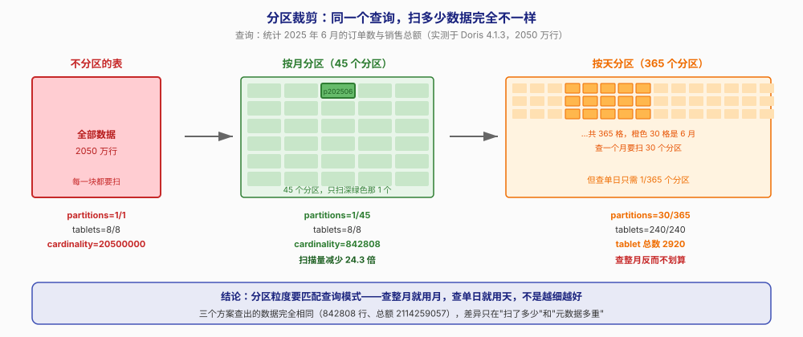
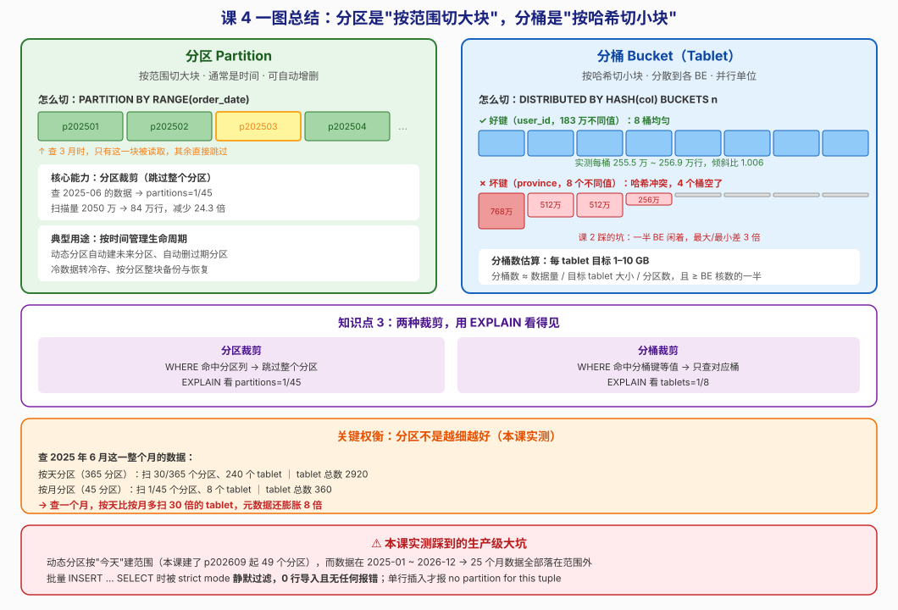

# 第 4 课：分区与分桶

> 所属阶段：阶段 2《数据建模》｜ 水平：零基础 ｜ 本课知识点：分区、分桶、分区分桶裁剪
> 故事情节：表建好了，但查询还是慢——主角发现"数据怎么切"比"用什么模型"更影响性能

## 🎯 本课目标

- 设计合理的分区方案，说清分区过多带来的元数据分析压力
- 按数据量估算合理的分桶数，能识别并规避数据倾斜
- 用 EXPLAIN 证明"查询只扫了 1% 的数据"

---

## 第一幕：起源与场景引入

> 🏛️ **起源**：分区的概念不是 Doris 发明的。1970 年代的关系数据库（Oracle 8i、DB2）就有了分区表，当时的动机很朴素——**数据太多，一张表放不下**。把表按某个维度切成几块，每块单独管理，备份、删除、迁移都能按块操作。Doris 继承了这个思路，但给它加了新使命：**让查询跳过不相关的块**。

上一课我们学会了选表模型——Duplicate、Aggregate、Unique。你按业务选对了模型，表建好了，数据也导进去了。

然后运营同事跑来问："为什么查上个月的数据要 30 秒？我们只要一个月的啊，表里明明有两年的数据。"

你看了下查询：

```sql
SELECT COUNT(*), SUM(amount) FROM orders
WHERE order_date >= '2025-06-01' AND order_date < '2025-07-01';
```

条件写得很清楚，只要 6 月。但 Doris **不知道**哪些数据属于 6 月——它得把 2050 万行全扫一遍，逐行判断"这条是不是 6 月的"。

问题出在哪？**数据是一整块，Doris 没法只取其中一段。**

> 🎬 **场景**：解决办法是把数据**预先切成块**，并且让 Doris 知道"这块是 6 月的、那块是 7 月的"。这样查 6 月时，它直接把 7 月以后的块全部跳过。这就是**分区**。
>
> 但只切一刀还不够——一个 6 月的分区可能还是很大。所以还要在分区内部**再切一刀**，切成更小的并行单位。这就是**分桶**。
>
> 这一课我们搞清楚：这两刀分别怎么切、为什么需要两刀、以及切错了会怎样。

---

## 第二幕：认知冲突

看到这里你可能会问：**分区和分桶都在"切数据"，为什么需要两个？切一次不就够了吗？**

这是个好问题，也是很多人初学时的困惑。

关键在于——这两刀切的**目的完全不同**：

- **分区**是为了**管理**和**跳过**：按时间切，方便整块删除过期数据、整块备份，查询时能跳过整个分区
- **分桶**是为了**打散**和**并行**：按哈希切，把数据均匀撒到各个 BE 节点上，让多台机器一起算

打个比方：分区像是**把图书馆的书按年份分到不同楼层**（2020 年在 3 楼，2021 年在 4 楼），分桶像是**把每层楼的书按索书号分到不同书架**（这样多个管理员可以同时找书）。

> ❓ **问题**：既然分区能跳过数据，那我把分区切得越细越好？按天分、甚至按小时分，查询不就能跳得越精准吗？

答案是否定的，而且**这个误解在生产上真的很伤人**。本课第四幕会用实测数据告诉你：按天分区查一个月，反而比按月分区慢——因为要扫的块多了 30 倍。

---

## 第三幕：层层揭示

### 知识点 1：分区

> 本知识点关键点：按时间范围切大块、动态分区、分区过多对 FE 元数据内存的压力

#### 一句话定义

**分区是按指定的列（通常是时间）把表切成多个范围块，每个块独立存储、独立管理。**

#### 直觉建立（类比）

想象一个**文件柜，按年份分抽屉**：

- 2023 年的发票放第一个抽屉，2024 年放第二个，2025 年放第三个
- 要找 2024 年的发票？**直接拉开第二个抽屉**，其他抽屉碰都不用碰
- 要扔掉 2023 年的？**整个抽屉端走**，不用一张张挑

分区就是这个"按年份分的抽屉"。

> 💡 **类比的边界**：文件柜的抽屉是物理隔离的，你拉开一个不会碰到其他。Doris 的分区也是物理隔离的（每个分区有自己的 tablet 集合），但**删除分区是元数据操作，瞬间完成**——比从文件柜搬走一个抽屉快得多。

#### 核心原理

**语法**

```sql
CREATE TABLE t_part_month (
    order_date DATE NOT NULL,
    province   VARCHAR(16) NOT NULL,
    city       VARCHAR(32) NOT NULL,
    user_id    BIGINT NOT NULL,
    amount     DECIMAL(10,2) NOT NULL,
    quantity   INT NOT NULL
)
DUPLICATE KEY(order_date, province, city)
PARTITION BY RANGE(order_date) ()          -- 分区声明
DISTRIBUTED BY HASH(user_id) BUCKETS 8     -- 分桶声明
PROPERTIES ('replication_num' = '1');
```

**两种建分区的方式**

**方式一：手动建**

```sql
ALTER TABLE t_part_month ADD PARTITION p202506
VALUES [('2025-06-01'), ('2025-07-01'));
```

注意区间的含义：**左闭右开** `[6月1日, 7月1日)`，包含 6 月 1 日，不包含 7 月 1 日。

**方式二：动态分区（推荐）**

```sql
PROPERTIES (
  'dynamic_partition.enable' = 'true',
  'dynamic_partition.time_unit' = 'MONTH',   -- 粒度：DAY / WEEK / MONTH
  'dynamic_partition.start' = '-24',         -- 保留过去 24 个月
  'dynamic_partition.end' = '24',            -- 预建未来 24 个月
  'dynamic_partition.prefix' = 'p',
  'dynamic_partition.buckets' = '8'
);
```

开了动态分区，Doris 会**每隔 10 分钟自动检查一次**（`dynamic_partition_check_interval_seconds = 600`），自动创建未来的分区、删除过期的分区。不用你写定时任务。

> ⚠️ **动态分区有个必须知道的坑**：它是**以"今天"为基准**建范围的。如果历史数据的时间早于 `start` 设定的范围，**这些数据会落在所有分区之外，导入时被静默丢弃**。本课第四幕实测踩到了这个坑，25 个月的数据全部丢失且没报错。

**分区能做什么**

1. **分区裁剪**：查询条件命中分区列时，跳过不相关的分区（知识点 3 详解）
2. **生命周期管理**：`DROP PARTITION` 秒删一个月的数据；`ALTER TABLE ... MODIFY PARTITION` 把冷数据转到对象存储
3. **按分区备份恢复**：只恢复出错的那个月，不用整表重导

**分区的代价：元数据压力**

分区不是免费的。每个分区 × 每个分桶 = 一个 tablet，而**每个 tablet 都要在 FE 内存里维护元数据**（位置、版本、副本状态等）。

本课实测的 tablet 数对比：

| 方案 | 分区数 | tablet 数 |
|------|--------|-----------|
| 不分区 | 1 | **8** |
| 按月（24 个月 + 动态预建） | 45 | **360** |
| 按天（365 天） | 365 | **2920** |

按天分区的 tablet 数是不分区的 **365 倍**。生产集群上如果有几百张表都这么搞，FE 内存会被元数据吃掉。

> 📌 **经验值**：单表分区数建议控制在 **1000 以内**，集群总 tablet 数控制在 **百万级**。单表几万个分区是明确的反模式。

#### 示例演示

```sql
-- 建一张按月动态分区的表
CREATE TABLE orders_part (
    order_date DATE NOT NULL,
    province   VARCHAR(16) NOT NULL,
    amount     DECIMAL(10,2) NOT NULL
)
DUPLICATE KEY(order_date, province)
PARTITION BY RANGE(order_date) ()
DISTRIBUTED BY HASH(province) BUCKETS 8
PROPERTIES (
  'replication_num' = '1',
  'dynamic_partition.enable' = 'true',
  'dynamic_partition.time_unit' = 'MONTH',
  'dynamic_partition.start' = '-12',
  'dynamic_partition.end' = '3',
  'dynamic_partition.prefix' = 'p',
  'dynamic_partition.buckets' = '8'
);
```

```sql
-- 查看当前有哪些分区
SHOW PARTITIONS FROM orders_part;

-- 手动加一个历史分区（补历史数据必备）
ALTER TABLE orders_part ADD PARTITION IF NOT EXISTS p202401
VALUES [('2024-01-01'), ('2024-02-01'));

-- 删掉一个分区（秒删，不用扫数据）
ALTER TABLE orders_part DROP PARTITION p202401;
```

#### 常见误区

1. **"分区键可以随便选"**：分区键**几乎总是时间列**。因为分区的核心价值是生命周期管理（按时间删旧数据）和时间范围裁剪。用省份分区？那你没法高效地删"上个月的数据"。
2. **"分区越细越好"**：**本课实测反驳了这点**。按天查一个月要扫 240 个 tablet，按月只要 8 个。粒度要匹配查询模式。
3. **"开了动态分区就万事大吉"**：动态分区只管"今天 ± N"的范围。历史数据不在范围内会**静默丢弃**（第四幕详述）。

#### 一句话记住

**分区 = 按时间切大块，价值在"整块跳过"和"整块管理"；用动态分区自动维护，但粒度要匹配查询模式，分区数控制在千级以内以免 FE 元数据爆炸。**

#### 官方文档

- [分区与分桶](https://doris.apache.org/zh-CN/docs/2.1/table-design/data-partitioning)
- [动态分区](https://doris.apache.org/zh-CN/docs/2.1/table-design/data-partitioning/dynamic-partitioning)

---

### 知识点 2：分桶

> 本知识点关键点：Hash 分桶与 Random 分桶、分桶数怎么估算（与 BE 节点数和磁盘数相关）、数据倾斜的成因与识别

#### 一句话定义

**分桶是按分桶列的哈希值，把数据切分成固定数量的 tablet，每个 tablet 是存储和并行计算的最小单位。**

#### 直觉建立（类比）

想象**银行开柜台，按"取号机算出的号码"分配窗口**：

- 你取了号，机器按某种规则算一下，告诉你"去 3 号窗口"——这个规则是固定的，**同一个号永远去同一个窗口**
- 如果规则设计得好，人群会均匀散到各窗口；如果规则设计得差（比如按"姓"分配，而九成客户都姓张），**1 号窗口排长队，其余窗口闲着** —— 这就是**数据倾斜**
- 如果按"身份证号"算，人会很均匀地散开 —— 这就是**好的分桶键**

> 💡 **类比的边界**：这个"算号"不是按顺序分（1-100 号去 1 号窗口、101-200 去 2 号），而是**哈希**——看起来毫无规律的号可能被分到同一个窗口，这正是为了保证分散。另外银行的窗口数固定，Doris 的分桶数建表时也固定了（2.x 后支持少量调整，但要重导数据）。

#### 核心原理

**Hash 分桶（默认）**

```sql
DISTRIBUTED BY HASH(user_id) BUCKETS 8
```

计算方式：`hash(分桶列) % 分桶数` → 决定这行去哪个桶。

**两条铁律**：

- **同一个哈希值永远进同一个桶**（所以按分桶列等值查询时能直接定位）
- **哈希值分布决定了数据是否均匀**（所以分桶键要选高基数列）

**Random 分桶**

```sql
DISTRIBUTED BY RANDOM BUCKETS 8
```

不按哈希，随机分配。数据会**非常均匀**（因为纯随机，不存在哈希冲突），但失去了"按值定位"的能力。

**什么时候用 Random？** 当你的表**没有任何高频的等值查询列**时——比如纯日志表，只有全表扫描和时间范围查询，从不会 `WHERE user_id = xxx`。这时 Random 能保证最均匀的分布，代价是放弃分桶裁剪。

反过来，**只要有一个常用的等值查询列，就应该用 Hash 分桶**。

> ⚠️ **Random 分桶不能用分桶裁剪**——因为你不知道某行去了哪个桶，查询时必须扫全部桶。只有 Hash 分桶才有知识点 3 讲的"分桶裁剪"。

**分桶键怎么选？两个条件**

1. **高基数**（不同值多）：保证哈希分散均匀
2. **常用作查询条件**：才能触发分桶裁剪

**本课实测的分桶键对比（2050 万行，8 个桶）**：

| 分桶键 | 不同值数量 | 最大桶 | 最小桶 | 倾斜比 | 空桶数 |
|--------|-----------|--------|--------|--------|--------|
| `province` | 8 | 7,685,239 | 2,564,153 | **3.00** | **4 个** |
| `user_id` | 1,835,605 | 2,569,081 | 2,554,782 | **1.006** | 0 |

**`province` 分桶的后果**：8 个桶里有 4 个是空的，最大的桶装了 768 万行、最小的非空桶只有 256 万行。**一半的计算资源闲置，查询时间由最慢的那个桶决定。**

这就是课 2 我们踩过的坑——当时只是"8 个桶空了一半"，现在有了量化数据：**倾斜比 3.00**。

> 📌 **注意一个反直觉的点**：`province` 有 8 个不同值、分了 8 个桶，直觉上该"一个值一个桶"。但实测 4 个桶是空的——因为**哈希函数不保证 8 个值映射到 8 个不同的桶**，冲突是必然的。这提醒我们：**不同值的数量只是必要条件，不是充分条件。基数越高越安全。**

**分桶数怎么估算？**

业界经验公式：

```
分桶数 ≈ 数据总大小 / 目标 tablet 大小 / 分区数
且 分桶数 ≥ BE 节点数 × 磁盘数
且 分桶数 ≥ BE 核数的一半（保证并行度）
```

**目标 tablet 大小**：官方建议 **1–10 GB**。

展开讲讲为什么：

- **太小**（比如 10 MB）：tablet 数量爆炸，FE 元数据压力大，且单个查询要打开很多文件句柄
- **太大**（比如 100 GB）：并行度不够，一个查询只用到少数几个核；且单个 tablet 恢复时间很长

用本课的数据算一下：

```
数据总量: 214 MB（2050 万行）
按月分 24 个分区（不含动态预建的）
每分区: 214 / 24 ≈ 8.9 MB

如果目标 tablet 1 GB：
  分桶数 = 8.9 MB / 1 GB < 1 → 1 个桶就够

但为了并行度（本机 20 核）：
  分桶数 ≥ 20 / 2 = 10

实测选了 8 桶 → 每 tablet 约 1.1 MB
```

> 📌 **结论**：**小数据量时，分桶数由并行度决定**（取 BE 核数的一半左右）；**大数据量时，由 tablet 目标大小决定**。本课 214 MB 属于典型的小数据量，8 桶偏小但可接受。

**实测：分桶数对查询的影响（本课数据）**

| 分桶数 | 全表聚合耗时 |
|--------|-------------|
| 1 | 0.193 秒 |
| 4 | 0.208 秒 |
| 8 | 0.189 秒 |
| 16 | 0.203 秒 |

**几乎没差别。** 原因和课 3 一样——单机 2050 万行太轻松，固定开销（约 0.14 秒）主导了。这个实验的价值在于告诉你：**别在小数据量上纠结分桶数**，但要在大数据量上算清楚。

#### 示例演示

```sql
-- ❌ 坏例子：低基数列做分桶键
CREATE TABLE bad_bucket (
    order_date DATE, province VARCHAR(16), amount DECIMAL(10,2)
)
DUPLICATE KEY(order_date, province)
DISTRIBUTED BY HASH(province) BUCKETS 8    -- province 只有 8 个值
PROPERTIES ('replication_num' = '1');

-- ✅ 好例子：高基数 + 常用于查询的列
CREATE TABLE good_bucket (
    order_date DATE, user_id BIGINT, amount DECIMAL(10,2)
)
DUPLICATE KEY(order_date, user_id)
PARTITION BY RANGE(order_date) ()
DISTRIBUTED BY HASH(user_id) BUCKETS 8     -- user_id 有 183 万个值
PROPERTIES ('replication_num' = '1');
```

**怎么检查有没有倾斜？**

```sql
-- 查看每个 tablet 的行数
SHOW TABLETS FROM your_table;
```

看 `RowCount` 那一列。如果最大值和最小值差好几倍，或者有些是 0，就是倾斜了。

#### 常见误区

1. **"分桶键选主键就行"**：不一定。主键未必高基数、未必用于查询。要同时满足**高基数**和**常用查询**两个条件。
2. **"分桶数越多越好"**：不是。tablet 太小会让元数据膨胀、文件句柄耗尽。按 tablet 1–10 GB 估算。
3. **"倾斜看不见就没事"**：`SHOW TABLETS` 一眼就能看出来。课 2 的 province 分桶有 4 个空桶，当时没量化，现在实测倾斜比 3.00。

#### 一句话记住

**分桶 = 按哈希切小块，价值在"打散到多机并行"；分桶键要选高基数且常用的查询列（实测 user_id 倾斜比 1.006 vs province 3.00），分桶数按 tablet 1–10GB 估算、小数据量时取 BE 核数一半。**

#### 官方文档

- [数据划分](https://doris.apache.org/zh-CN/docs/2.1/table-design/data-partitioning)

---

### 知识点 3：分区分桶裁剪

> 本知识点关键点：分区裁剪（跳过整个分区）与分桶裁剪（跳过整个 bucket）、用 EXPLAIN 验证

#### 一句话定义

**裁剪就是查询时跳过不相关的数据块**——分区裁剪跳过整个分区，分桶裁剪跳过整个桶。

#### 直觉建立（类比）

回到文件柜的比喻：

- **分区裁剪** = 你知道要找的文件在 2024 年，所以**只拉 2024 年那个抽屉**，其他楼层的抽屉根本不打开
- **分桶裁剪** = 在 2024 年那个抽屉里，你知道文件按姓氏分了 8 格，**直接翻"张"字那一格**，其余 7 格不碰

两者叠加，你要翻的东西就从"整个文件柜"缩小到"一格"。

> 💡 **类比的边界**：文件柜的"跳过"是物理上的不打开；Doris 的裁剪发生在**生成查询计划时**——它在执行前就算出了要看哪些 tablet，根本不会去读其他 tablet。所以你能在 `EXPLAIN` 里**提前看到**会扫多少，不用真的执行。

#### 核心原理

**分区裁剪的触发条件**

查询条件命中**分区列**，且是能被推导成范围的条件：

```sql
WHERE order_date >= '2025-06-01' AND order_date < '2025-07-01'   -- ✅ 范围，能裁剪
WHERE order_date = '2025-06-15'                                   -- ✅ 等值，能裁剪
WHERE order_date BETWEEN '2025-06-01' AND '2025-06-30'            -- ✅ 能裁剪
WHERE YEAR(order_date) = 2025                                     -- ❌ 函数包裹，通常裁不掉
```

> ⚠️ **函数包裹是分区裁剪的头号杀手**。写成 `WHERE YEAR(order_date) = 2025`，优化器很难推导出范围。要写成 `order_date >= '2025-01-01' AND order_date < '2026-01-01'`。

**分桶裁剪的触发条件**

查询条件对**分桶键**做**等值**判断：

```sql
WHERE user_id = 12345              -- ✅ 等值，能裁剪
WHERE user_id IN (1, 2, 3)         -- ✅ 少数值，能裁剪
WHERE user_id > 100                -- ❌ 范围，通常裁不掉（要扫所有桶再过滤）
```

**用 EXPLAIN 验证**

```sql
EXPLAIN SELECT COUNT(*), ROUND(SUM(amount))
FROM t_part_month
WHERE order_date >= '2025-06-01' AND order_date < '2025-07-01';
```

看两个关键字段：

- **`partitions=1/45`**：45 个分区里只扫 1 个 —— **分区裁剪生效**
- **`tablets=8/8`**：这个分区里有 8 个桶，全扫（因为没对 user_id 做等值过滤）
- **`cardinality=842808`**：预计扫 84 万行

**本课三种方案的实测对比**

查询：统计 2025 年 6 月的数据

| 方案 | EXPLAIN 结果 | 扫描行数 |
|------|-------------|---------|
| 不分区 | `partitions=1/1`, `tablets=8/8` | **20,500,000** |
| 按月分区 | `partitions=1/45`, `tablets=8/8` | **842,808** |
| 按天分区 | `partitions=30/365`, `tablets=240/240` | 842,808（但要开 240 个 tablet） |

**分区裁剪让扫描量从 2050 万降到 84 万，减少 24.3 倍。**

**两种裁剪同时生效**

```sql
EXPLAIN SELECT COUNT(*) FROM t_part_month
WHERE user_id = 12345
  AND order_date >= '2025-06-01' AND order_date < '2025-07-01';
-- tablets=1/8, cardinality=842808
```

分区裁剪先把 45 个分区缩到 1 个，分桶裁剪再把这个分区里的 8 个桶缩到 1 个——**最终只扫 1 个 tablet**。

**对照：只给分桶键、不给分区条件**

```sql
EXPLAIN SELECT COUNT(*) FROM t_part_month WHERE user_id = 12345;
-- tablets=24/192
```

只有分桶裁剪生效：每个分区都要查 1 个桶，24 个非空分区 → 扫 24 个 tablet。这说明了**为什么分区条件很重要**。

#### 示例演示

完整的验证流程：

```sql
-- 第 1 步：先看不分区时的扫描量
EXPLAIN SELECT COUNT(*), ROUND(SUM(amount))
FROM t_nopart_user
WHERE order_date >= '2025-06-01' AND order_date < '2025-07-01';
-- 看: partitions=1/1  tablets=8/8  cardinality=20500000

-- 第 2 步：看分区后的扫描量
EXPLAIN SELECT COUNT(*), ROUND(SUM(amount))
FROM t_part_month
WHERE order_date >= '2025-06-01' AND order_date < '2025-07-01';
-- 看: partitions=1/45  tablets=8/8  cardinality=842808

-- 第 3 步：确认结果一致（裁剪不能改变答案）
SELECT COUNT(*), ROUND(SUM(amount)) FROM t_nopart_user
WHERE order_date >= '2025-06-01' AND order_date < '2025-07-01';
-- 842808, 2114259057

SELECT COUNT(*), ROUND(SUM(amount)) FROM t_part_month
WHERE order_date >= '2025-06-01' AND order_date < '2025-07-01';
-- 842808, 2114259057   ← 完全一致
```

> ✅ **结果一致性是裁剪的前提**：无论怎么跳，答案必须一样。本课三个方案查出的都是 842,808 行、总额 2,114,259,057。

#### 常见误区

1. **"分区建了就自动裁剪"**：不。要**查询条件命中分区列**，且**没被函数包裹**。`WHERE YEAR(order_date)=2025` 裁不掉。
2. **"分桶裁剪能处理范围查询"**：不能。分桶裁剪只对**等值**条件生效，`WHERE user_id > 100` 要扫所有桶。
3. **"EXPLAIN 里的数字是估算，不可信"**：`cardinality` 确实是估算值，但 `partitions=1/45` 和 `tablets=8/8` 是**确定的计划决策**，完全可信。

#### 一句话记住

**裁剪 = 查询时跳过不相关的块；分区裁剪看 `partitions=1/45`（需命中分区列且无函数包裹），分桶裁剪看 `tablets=1/8`（需对分桶键等值）；两者叠加后本课实测只扫 84 万行、减少 24.3 倍。**

#### 官方文档

- [查询优化：分区分桶裁剪](https://doris.apache.org/zh-CN/docs/2.1/query-optimization/optimization-manual/pruning)

---

## 第四幕：实操验证

以下数字均为本机实测（2026-09-02，WSL Ubuntu + Docker，Doris 4.1.3，单 BE，20 核 31GB，2050 万行数据）。

### 环境准备

> 📌 三张表的**列完全相同**，只有分区和分桶声明不同——这样对比才公平。下面的 DDL 都是完整可运行的。

```sql
-- 表 A：不分区 + 按 province 分桶（课 2 的老坑，8 个不同值）
CREATE TABLE t_nopart_prov (
    order_date DATE NOT NULL,
    province   VARCHAR(16) NOT NULL,
    city       VARCHAR(32) NOT NULL,
    user_id    BIGINT NOT NULL,
    amount     DECIMAL(10,2) NOT NULL,
    quantity   INT NOT NULL
)
DUPLICATE KEY(order_date, province, city)
DISTRIBUTED BY HASH(province) BUCKETS 8
PROPERTIES ('replication_num'='1');

-- 表 B：不分区 + 按 user_id 分桶（高基数，183 万个不同值）
CREATE TABLE t_nopart_user (
    order_date DATE NOT NULL,
    province   VARCHAR(16) NOT NULL,
    city       VARCHAR(32) NOT NULL,
    user_id    BIGINT NOT NULL,
    amount     DECIMAL(10,2) NOT NULL,
    quantity   INT NOT NULL
)
DUPLICATE KEY(order_date, province, city)
DISTRIBUTED BY HASH(user_id) BUCKETS 8
PROPERTIES ('replication_num'='1');

-- 表 C：按月分区 + 按 user_id 分桶
CREATE TABLE t_part_month (
    order_date DATE NOT NULL,
    province   VARCHAR(16) NOT NULL,
    city       VARCHAR(32) NOT NULL,
    user_id    BIGINT NOT NULL,
    amount     DECIMAL(10,2) NOT NULL,
    quantity   INT NOT NULL
)
DUPLICATE KEY(order_date, province, city)
PARTITION BY RANGE(order_date) ()
DISTRIBUTED BY HASH(user_id) BUCKETS 8
PROPERTIES ('replication_num'='1');
```

```sql
-- 三张表导入完全相同的数据
INSERT INTO t_nopart_prov  SELECT order_date, province, city, user_id, amount, quantity FROM orders;  -- 7 秒
INSERT INTO t_nopart_user  SELECT order_date, province, city, user_id, amount, quantity FROM orders;  -- 3 秒
INSERT INTO t_part_month   SELECT order_date, province, city, user_id, amount, quantity FROM orders;  -- ⚠️ 见结果 4
```

> ⚠️ **表 C 这样直接导入会失败（0 行、0 报错）**，原因见结果 4。要先手动建好 2025-01 至 2026-12 共 24 个分区：
>
> ```sql
> ALTER TABLE t_part_month ADD PARTITION IF NOT EXISTS p202506
> VALUES [('2025-06-01'), ('2025-07-01'));
> -- 其余 23 个分区同理，脚本见 lesson04-setup-tables.sh
> ```

> 完整脚本已落盘：[lesson04-setup-tables.sh](../../../assets/lesson04-setup-tables.sh)（建表+导入）、[lesson04-bench-pruning.sh](../../../assets/lesson04-bench-pruning.sh)（裁剪验证）、[lesson04-day-partition.sh](../../../assets/lesson04-day-partition.sh)（按天分区对比）

### 结果 1：分桶键倾斜对比（结清课 3 的欠账）

> 📌 课 3 我把分桶键从 `province`（8 个值）改成了 `city`（50 个值），但坦白说那仍是拍脑袋选的。现在有了量化方法。

| 分桶键 | 不同值数 | 各桶行数 | 倾斜比 | 空桶 |
|--------|---------|---------|--------|------|
| `province` | 8 | 768万 / 512万 / 512万 / 256万 / 0 / 0 / 0 / 0 | **3.00** | **4 个** |
| `user_id` | 1,835,605 | 256万 × 8（最大 256.9 万，最小 255.5 万） | **1.006** | 0 |

**`province` 分桶一半的桶是空的，最大桶是最小的 3 倍。** 这意味着：8 个并行任务里 4 个瞬间完成，另外 4 个扛着全部数据——**查询时间由最慢的桶决定，一半算力浪费**。

而 `user_id`（183 万个不同值）分桶后几乎完美均匀，倾斜比 1.006。

> ✅ **课 3 的欠账结清了**：分桶键的正确选法是**看基数**——不同值越多，哈希分布越均匀。本课数据里 `user_id`（183 万）远优于 `city`（50）远优于 `province`（8）。

### 结果 2：分区裁剪（本课核心，硬证据）

查询统计 2025 年 6 月的数据：

```text
不分区表:  partitions=1/1    tablets=8/8    cardinality=20500000
分区表:    partitions=1/45   tablets=8/8    cardinality=842808
```



**扫描量从 2050 万降到 84 万，减少 24.3 倍。**

这是优化器给出的**执行计划**，不是实测耗时——它是确定性的、可复现的，不随机器负载波动。

**结果正确性校验**（三个方案必须完全一致）：

| 方案 | COUNT(\*) | SUM(amount) |
|------|-----------|-------------|
| 不分区 | 842,808 | 2,114,259,057 |
| 按月分区 | 842,808 | 2,114,259,057 |
| 按天分区 | 842,808 | 2,114,259,057 |

完全一致 ✅

### 结果 3：分区不是越细越好（本课最重要的反直觉结论）

查**同一个月**（2025 年 6 月）的数据：

| 方案 | 分区数 | 扫的分区 | 扫的 tablet | tablet 总数 |
|------|--------|---------|------------|------------|
| 按月 | 45 | **1/45** | **8** | 360 |
| 按天 | 365 | **30/365** | **240** | **2920** |

**按天分区查一个月，要开 240 个 tablet；按月只要 8 个——差 30 倍。**

按天分区的 tablet 总数（2920）是按月（360）的 8 倍，是不分区（8）的 365 倍。

**但按天分区也有它的优势**——查单日时：

```text
按天分区: partitions=1/365   tablets=8/8      ← 只扫 1 天
按月分区: partitions=1/45    tablets=8/8      ← 仍要扫整个 6 月
```

查 2025-06-15 这一天，按天只扫 1 个分区，按月要扫整个 6 月（约 84 万行里挑出 2.8 万行）。

> ✅ **所以结论是**：**分区粒度要匹配查询模式**，不是越细越好。
>
> - 主要查**月度/季度**报表 → 按月分区
> - 主要查**单日**明细 → 按天分区
> - 两者都要 → 按月分区（单日查询靠排序键和索引优化，那是课 5 的内容）

### 结果 4：⚠️ 实测踩到的生产级大坑——分区外数据静默丢失

这是本课最该记住的实战教训。

我建了表 C 并开了动态分区，然后导入 2050 万行数据：

```text
t_nopart_prov: 7 秒   → 20500000 行 ✅
t_nopart_user: 3 秒   → 20500000 行 ✅
t_part_month:  0 秒   → 0 行        ❌
```

**0 秒、0 行、没有任何报错。**

排查发现：动态分区以"今天"（2026-09-02）为基准建了 p202609 开始的 49 个分区，而数据的时间范围是 **2025-01-01 ~ 2026-12-31**——**前 25 个月的数据全部落在所有分区之外**。

单行插入时会报错：

```text
ERROR 1105 (HY000): Insert has filtered data in strict mode.
first_error_msg: no partition for this tuple.
```

但**批量 `INSERT ... SELECT` 时被 strict mode 静默过滤了**，一行都没进，却不报错。

**修复方法**：手动补齐历史分区，再重新导入。

```sql
ALTER TABLE t_part_month ADD PARTITION IF NOT EXISTS p202506
VALUES [('2025-06-01'), ('2025-07-01'));
-- 补齐 2025-01 到 2026-12 共 24 个分区后，重新导入 → 20500000 行 ✅
```

> ⚠️ **生产建议**：
> 1. 开动态分区后，**先确认历史数据的时间范围在 `start` 覆盖内**
> 2. 批量导入后**必须核对行数**，不要相信"没报错就是成功了"
> 3. 需要导入历史数据时，**先手动建好历史分区**
> 4. 如果希望"范围外的数据报错而不是静默丢弃"，检查 strict mode 配置并关注导入返回的 `NumberFilteredRows`

### 结果 5：分桶数对查询的影响

| 分桶数 | 全表聚合耗时 |
|--------|-------------|
| 1 | 0.193 秒 |
| 4 | 0.208 秒 |
| 8 | 0.189 秒 |
| 16 | 0.203 秒 |

**基本没差别。** 原因和课 3 一样：**固定开销约 0.14 秒**（实测查一张空表也要 0.134–0.148 秒），把分桶数带来的并行度差异全吃掉了。

> 📌 **再次印证课 3 的方法论**：**小数据量 + 单机的环境测不出性能差异**。本课分区裁剪也是同理——8 并发、16 并发都测不出差距（0.16s vs 0.15s，0.22s vs 0.22s）。
>
> 但**扫描量的差异是真实的、确定的**：2050 万 vs 84 万行，24.3 倍。生产环境（数据量 × 100、并发 × 100）下，这个差异会直接转化为响应时间和机器成本。

> ✅ **回扣场景**：开篇的问题是"为什么只要一个月的数据，却要扫两年的表"。答案现在很清楚了——**因为不分区的表是一整块，Doris 没法只取一段**。分区裁剪让它只扫 1/45 个分区，扫描量降 24.3 倍。而分区内部的分桶，则决定了这 84 万行能不能被多核并行处理完。

---

## 第五幕：体系收束

> 📍 **全局定位**：课 3 你决定了"数据以什么形态存"（模型），课 4 你决定了"数据切成什么块"（分区 + 分桶）。
>
> 三个层次的关系：
>
> 1. **模型**（课 3）：决定行与行之间怎么合并 —— 能不能聚合、能不能更新
> 2. **分区**（课 4）：决定按什么范围切成大块 —— 能不能整块跳过、整块管理
> 3. **分桶**（课 4）：决定块内怎么打散 —— 能不能多机并行、会不会倾斜
>
> 判断顺序口诀：
>
> 1. **分区列**选时间（几乎所有场景），粒度匹配查询模式（查月用月、查日用天）
> 2. **分桶键**选高基数 + 常用查询条件的列（实测：183 万值的 user_id 倾斜比 1.006，8 值的 province 有 4 个空桶）
> 3. **分桶数**按 tablet 1–10 GB 估算，小数据量时取 BE 核数的一半
>
> ✅ **回扣第二幕的设问**：第二幕我问过"把分区切得越细越好？按天分、按小时分，不就能跳得更精准吗"。现在答案很清楚了——**不能**。实测按天分区查一个月要扫 240 个 tablet，按月只要 8 个，差 30 倍，而且 tablet 总数还膨胀了 8 倍（2920 vs 360）。**分区的收益来自"跳过"，但代价是"要管理的块变多了"**，粒度必须匹配查询模式。

🔗 **下一步**：分区分桶解决的是"跳过不相关的块"。但在**块内部**，Doris 还能做得更细——如果查询条件是 `WHERE province='广东'`，能不能不扫整个 tablet，而是直接跳到"广东"那几行？这就是**排序键（Key 列顺序）和索引**（前缀索引、Bloom Filter、倒排索引）的活儿，也是**同步物化视图**（另一种"预计算换查询速度"的思路）。下一课《键列、索引与同步物化视图》会讲这些。

> 📌 顺便回应开篇那个"查上个月要 30 秒"的抱怨：本课用分区裁剪把扫描量降了 24.3 倍（2050 万 → 84 万行），但**单机环境测不出耗时差异**（固定开销 0.14 秒主导）。在生产集群上——数据量 × 100、并发 × 100——这 24.3 倍的扫描量差异，就是 30 秒和 1.2 秒的区别。

---

## 🐞 常见误区

1. **"分区和分桶是一回事，都是切数据"**：目的完全不同。分区为了**管理和跳过**（按时间范围），分桶为了**打散和并行**（按哈希）。
2. **"分区越细越好"**：**本课实测反驳**。按天查一个月要扫 240 个 tablet，按月只要 8 个。粒度要匹配查询模式。
3. **"开了动态分区就高枕无忧"**：动态分区以"今天"为基准建范围，历史数据可能落在范围外被**静默丢弃**（本课实测 25 个月数据全丢、0 报错）。
4. **"分桶键选主键就行"**：要同时满足**高基数**和**常用查询**两个条件。本课 province 只有 8 个值，导致 4 个空桶、倾斜比 3.00。
5. **"分桶数越多并行度越高、查询越快"**：tablet 太小会让元数据膨胀。按 tablet 1–10 GB 估算，不是越多越好。
6. **"分区建好了就会自动裁剪"**：要查询条件**命中分区列**且**没被函数包裹**。`WHERE YEAR(order_date)=2025` 裁不掉。
7. **"分桶裁剪能用于范围查询"**：只对**等值**条件生效。`WHERE user_id > 100` 要扫所有桶。
8. **"EXPLAIN 的 cardinality 是精确值"**：是估算值。但 `partitions=1/45`、`tablets=8/8` 是确定的计划决策，可信。

## 一图总结



**一句话串起来**：分区是按时间切大块（价值在整块跳过和管理，粒度要匹配查询模式——实测按天查一月要扫 240 个 tablet 而按月只要 8 个）、分桶是按哈希切小块（价值在打散并行，键要选高基数常用的列——实测 user_id 倾斜比 1.006 vs province 3.00 且 4 个空桶）、两者叠加触发裁剪（实测 `partitions=1/45`，扫描量从 2050 万降到 84 万、减少 24.3 倍）；⚠️ 记住动态分区会以"今天"为基准建范围，历史数据可能静默丢失。

## 课后小测

**Q1**：你有一张订单表，业务方主要查"某一天的订单明细"（查单日），偶尔查月度汇总。每天约 5 万行，预计保留 3 年。应该选择哪种分区粒度？

- A. 按天分区（约 1095 个分区）
- B. 按月分区（约 36 个分区）
- C. 不分区，靠分桶裁剪就够了
- D. 按年分区（3 个分区）

<details><summary>答案与解析</summary>

**答案：B**。这是本课"分区粒度要匹配查询模式"的应用。

业务方"主要查单日"，看起来该选 A（按天）。但要注意数据规模：**每天仅 5 万行，3 年才 5500 万行**。单日 5 万行在一个月分区（150 万行）里，靠**排序键**（order_date 是 DUPLICATE KEY 的第一列）就能快速定位，**不需要靠分区裁剪**。

而按天分区要建 1095 个分区，tablet 数会膨胀到 8760 个（1095 × 8），元数据压力巨大，且**查月度汇总时要扫 30 个分区**——这恰恰是月度查询的噩梦。

A 错：分区过多，且月度查询要扫 30 个分区。C 错：不分区就没法按时间整块删除过期数据（保留 3 年这个需求需要分区来管理生命周期）。D 错：按年分区查单日要扫 1800 万行，太粗。

**判断口诀**：**分区数控制在千级以内，单日数据量太小（<10 万）时不要按天分区**，靠排序键就够了。

</details>

**Q2**：本课实测中，按天分区查"2025 年 6 月整月"的数据，要扫 240 个 tablet；按月分区只要 8 个。但按天分区查"2025-06-15 单日"时，只扫 8 个 tablet。这说明了什么？

- A. 按天分区在所有场景下都优于按月分区
- B. 分区裁剪的效果取决于查询条件与分区粒度的匹配程度，不是越细越好
- C. tablet 数量越少查询越快，所以应该永远选不分区
- D. 分区裁剪只对等值查询生效，范围查询无法裁剪

<details><summary>答案与解析</summary>

**答案：B**。这是本课最重要的反直觉结论。

按天分区在"查单日"时精准（1/365 个分区），但在"查整月"时要扫 30 个分区、240 个 tablet；按月分区则相反。**没有绝对更优的粒度，只有更匹配查询模式的粒度。**

A 错：与实测数据直接矛盾——查整月时按天要扫 240 个 tablet，按月只要 8 个。C 错：不分区虽然 tablet 最少，但查任何时间范围都要扫全表 2050 万行（实测 cardinality=20500000）。D 错：本课实测 `order_date >= '2025-06-01' AND order_date < '2025-07-01'` 这个**范围查询**成功触发了裁剪（partitions=1/45）。

</details>

**Q3**：你建了按月动态分区的表（start=-12, end=3），今天 2026-09-02。现在要导入 2024 年全年的历史数据，会发生什么？

- A. 自动创建 2024 年的分区并导入成功
- B. 报错，提示 no partition for this tuple，数据一行都没进
- C. 单行插入会报错，但批量 INSERT...SELECT 可能被静默过滤，导致 0 行导入且无报错
- D. 数据会进入一个自动创建的"默认分区"

<details><summary>答案与解析</summary>

**答案：C**。这是本课实测踩到的生产级大坑。

动态分区以"今天"（2026-09-02）为基准，start=-12 表示保留过去 12 个月，即 2025-09 起。**2024 年的数据落在所有分区之外**。

实测中单行插入报 `no partition for this tuple`，但批量 `INSERT ... SELECT` 被 strict mode **静默过滤**——2050 万行数据 0 行导入、**0 秒完成、无任何报错**。

A 错：动态分区不会为范围外的历史数据自动建分区。B 错：描述不完整——单行插入确实报错，但批量导入是静默失败，后者更危险。D 错：Doris 没有"默认分区"机制。

**正确做法**：先手动 `ALTER TABLE ... ADD PARTITION` 建好 2024 年的 12 个分区，再导入；导入后**必须核对行数**。

</details>

## 🚀 下一批接力提示词

> 学完本课后，**复制下面这段文字发给 AI**，即可无缝进入下一课（无需重新描述上下文）：

```
继续学 Apache Doris。我的学习档案在 doris/00-学习档案.md，
刚学完阶段 2《数据建模》的课 4《分区与分桶》
知识点（分区、分桶、分区分桶裁剪），
集群已在本机跑起来（容器名 doris-learn，9030/8030/8040，库 shop），
已有表：orders（2050万行，按province分8桶，倾斜比3.00有4个空桶）、
orders_dup、orders_agg、orders_uniq_mow/mor、
t_nopart_prov（province分桶，倾斜对照）、t_nopart_user（user_id分桶，倾斜比1.006）、
t_part_month（按月45分区）、t_part_day（按天365分区）、
t_bucket_8、empty_t，
请按大纲继续讲解阶段 2 课 5《键列、索引与同步物化视图》。
```

## 🧭 课程导航

⬅️ **上一课**：[课 3：三种数据模型](lesson-03-三种数据模型.md)

➡️ **下一课**：[课 5：键列、索引与同步物化视图](lesson-05-键列索引与同步物化视图.md)

📚 **返回目录**：[课程目录](../../../02-课程目录.md)
