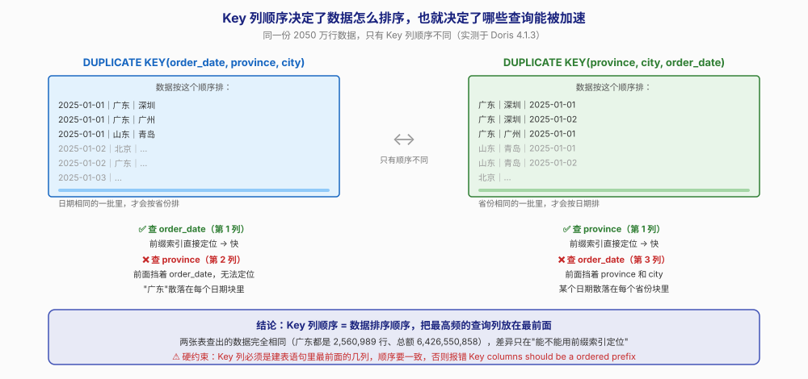
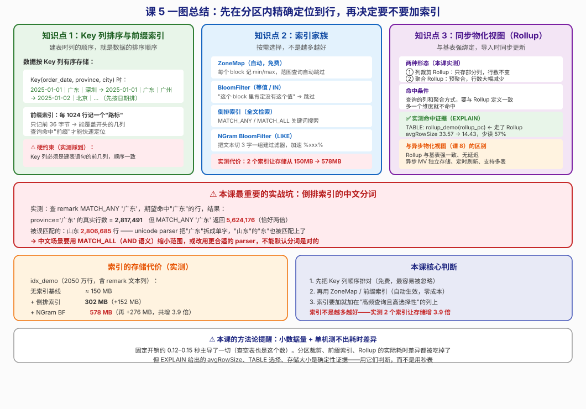

# 第 5 课：键列、索引与同步物化视图

> 所属阶段：阶段 2《数据建模》｜ 水平：零基础 ｜ 本课知识点：Key 列排序与前缀索引、索引家族、同步物化视图（Rollup）
> 故事情节：分区分桶已经让扫描范围缩小了，主角还要在分区内部精确定位到行——"索引不是越多越好"

## 🎯 本课目标

- 说清建表时列的顺序为什么会影响查询性能
- 为等值查询、模糊搜索、文本检索分别选对索引
- 建一个 Rollup 并用 EXPLAIN 验证查询走了它

---

## ⚠️ 易混提示：同步 Rollup（本课）≠ 异步物化视图（课 8）

这两个都叫"物化视图"，但完全是两回事。先分清，不然后面会乱：

| 维度 | 同步 Rollup（本课） | 异步物化视图（课 8） |
|------|-------------------|-------------------|
| 存储 | 与基表强绑定，是基表的一层"附加索引" | 独立存储，相当于一张独立的表 |
| 更新时机 | 导入时同步更新，与基表强一致 | 定时或触发刷新，可能有延迟 |
| 查询改写 | 需命中 Rollup 的列与聚合方式 | 支持查询自动改写 |
| 适用场景 | 固定维度的预聚合 / 列裁剪 | 复杂多表、跨表查询加速 |

> 📌 **一句话区分**：Rollup 是"基表的附庸"，异步 MV 是"独立的表"。本课只讲前者。

---

## 第一幕：起源与场景引入

> 🏛️ **起源**：索引的历史比分库分表还早。1970 年代 IBM 的 System R 就有了 B+ 树索引，当时的核心思想是**用额外的存储空间，换查询时间**——就像书末尾的索引页，多印几页纸，但读者不用从头翻到尾。
>
> 到了列式存储时代（2010 年代），索引的思路变了。列存里数据按列压缩、按块存储，于是出现了**"先看元数据决定要不要读这块"**的轻量索引——ZoneMap、BloomFilter 都属于这类。它们不告诉你"数据在哪一行"，而是告诉你"这块里肯定没有你要的东西，别读了"。

上一课我们用分区裁剪，把扫描量从 2050 万行降到了 84 万行——**跳过**了不相关的分区。

但问题只解决了一半。假设你要查"广东省的订单"：

```sql
SELECT COUNT(*), SUM(amount) FROM orders WHERE province = '广东';
```

如果表按时间分区，这个查询**每个分区都要扫**——因为广东的订单分布在所有时间段里。在一个月的分区（84 万行）内部，Doris 还是得逐行判断"这条是不是广东的"。

> 🎬 **场景**：运营同事又来了："我只要广东省的数据，为什么还要把整个月的 84 万行全扫一遍？"

答案藏在**数据在分区内部是怎么排列的**。如果数据是按"省→市→日期"排的，那么所有广东的数据会挤在一起，Doris 可以直接跳到"广东"那一段。如果按"日期→省→市"排，广东的数据就散落在每个日期块里，只能全扫。

**这个顺序，就是你建表时写 Key 列的顺序。**

这一课我们搞清楚：列的顺序怎么定、内置的索引怎么用、以及什么时候该额外加索引（加多了会怎样）。

---

## 第二幕：认知冲突

看到这里，一个很自然的想法是：**既然索引能加速查询，那我给每个常用列都加上索引不就行了？**

这个想法在实践中非常普遍，也非常危险。

> ❓ **问题**：加索引的代价是什么？本课会给出实测数字——**在一个 2050 万行的表上加了 2 个索引，存储从约 150 MB 涨到 578 MB，翻了近 4 倍**。

索引不是"免费的加速"，它是一笔交易：

- **付出**：存储空间、导入时构建索引的时间、内存占用
- **换回**：特定查询模式的加速

**只有当"换回"大于"付出"时才值得。** 而判断的依据，是**你的查询模式**——高频吗？选择性好吗？

还有第二个冲突点，更隐蔽：

> ❓ **问题**：索引建好了，查询就一定会用到吗？

不一定。本课实测踩到了：**中文场景下倒排索引的分词结果和你想的完全不一样**——查"广东"会把"山东"也匹配出来，因为分词器把"广东"拆成了单字，"山东"里的"东"也被算进去了。

**索引建了不等于用对了。**

---

## 第三幕：层层揭示

### 知识点 1：Key 列排序与前缀索引

> 本知识点关键点：数据按 Key 列有序存储、前缀索引（稀疏索引）的生成规则、为什么查询条件要"命中前缀"

#### 一句话定义

**建表时 Key 列的顺序就是数据的排序顺序；Doris 基于这个顺序自动生成一个"稀疏路标"（前缀索引），让查询能跳过不相关的数据块。**

#### 直觉建立（类比）

想象一本**按"省→市→姓名"排序的电话簿**：

- 所有"广东省"的人都排在一起，你翻到"广东"那一段，连续读下去就行
- 但如果电话簿按"**生日→省→市**"排序呢？1 月 1 日出生的广东人、1 月 2 日出生的广东人……**广东人散落在每一页**，你得从头翻到尾

再想象电话簿每隔 100 页有一个**彩色标签**，写着那一页开头的人名。你找"张三"时，扫一眼标签就知道该翻哪一段——**这个标签就是前缀索引**（稀疏索引：不是每行都记，而是隔一段记一个）。

> 💡 **类比的边界**：电话簿的标签是按"开头的人名"标的，同理前缀索引记的是**每个数据块开头那行的 Key 值**。所以只有当你的查询条件匹配 Key 的**开头部分**（前缀）时，标签才有用。查"市=深圳"但 Key 是"(省, 市)"，前面缺了"省"，标签就失效了——因为深圳的人可能散在多个省份段里。

#### 核心原理

**数据怎么排的？**

```sql
CREATE TABLE k_prov_first (
    province VARCHAR(16) NOT NULL, city VARCHAR(32) NOT NULL, order_date DATE NOT NULL,
    user_id BIGINT NOT NULL, amount DECIMAL(10,2) NOT NULL, quantity INT NOT NULL
)
DUPLICATE KEY(province, city, order_date)      -- ← 这个顺序就是排序顺序
DISTRIBUTED BY HASH(user_id) BUCKETS 8
PROPERTIES ('replication_num'='1');
```

数据会**先按 province 排，province 相同的按 city 排，再相同的按 order_date 排**：

```text
广东｜深圳｜2025-01-01
广东｜深圳｜2025-01-02
广东｜广州｜2025-01-01
山东｜青岛｜2025-01-01
山东｜青岛｜2025-01-02
北京｜...
```



**前缀索引怎么生成的？**

Doris 每 **1024 行**为一个数据块（block），记录这个块**开头那行**的 Key 值，形成一份稀疏索引。查询时先查这份索引，判断哪些块可能有目标数据，跳过其余的块。

**限制：前缀索引只取 Key 的前 36 字节。**

这意味着：

- 如果前几列是 `VARCHAR` 且很长，可能第一列就占满了 36 字节，后面的列进不了前缀索引
- 所以**把短的、高频查询的列放前面**

**命中前缀的规则**

查询条件必须匹配 Key 的**连续开头部分**：

```sql
-- Key = (province, city, order_date)

WHERE province = '广东'                              -- ✅ 命中第 1 列
WHERE province = '广东' AND city = '深圳'             -- ✅ 命中前 2 列
WHERE province = '广东' AND city = '深圳' AND order_date = '2025-06-15'  -- ✅ 全命中
WHERE city = '深圳'                                   -- ❌ 跳过第 1 列，失效
WHERE order_date = '2025-06-15'                       -- ❌ 跳过前 2 列，失效
```

> 📌 **这就是为什么"列的顺序"如此重要**：同样的列，换个顺序，某些查询就从"能定位"变成"全表扫"。

**⚠️ 一个硬约束（本课实测踩到）**

**Key 列必须是建表语句里最前面的几列，且顺序要一致。** 我最初这样写：

```sql
-- ❌ 错误：列声明顺序是 (order_date, province, city)，但 KEY 写成了 (province, city, order_date)
CREATE TABLE k_prov_first (
    order_date DATE NOT NULL, province VARCHAR(16) NOT NULL, city VARCHAR(32) NOT NULL,
    ...
)
DUPLICATE KEY(province, city, order_date)   -- 报错！
```

报错信息：

```text
ERROR 1105 (HY000): Key columns should be a ordered prefix of the schema.
KeyColumns[0] (starts from zero) is province, but corresponding column is order_date
in the previous columns declaration.
```

**正确写法**：把 Key 列写在前面，顺序一致。

```sql
-- ✅ 正确
CREATE TABLE k_prov_first (
    province VARCHAR(16) NOT NULL, city VARCHAR(32) NOT NULL, order_date DATE NOT NULL,
    user_id BIGINT NOT NULL, amount DECIMAL(10,2) NOT NULL, quantity INT NOT NULL
)
DUPLICATE KEY(province, city, order_date)
DISTRIBUTED BY HASH(user_id) BUCKETS 8
PROPERTIES ('replication_num'='1');
```

**ZoneMap：不用建的"免费"索引**

除了前缀索引，Doris 还**自动**为每个数据块记录每列的 min/max 值，这叫 **ZoneMap**。范围查询时，如果某个块的 max < 你要的值，直接跳过。

```sql
-- amount 不在 Key 里，但范围查询仍能靠 ZoneMap 跳过块
SELECT COUNT(*) FROM orders WHERE amount > 99999;
```

ZoneMap 是**自动的、免费的**，不需要任何配置。

#### 示例演示

```sql
-- ✅ 高频按省份查：province 放第一列
CREATE TABLE orders_by_prov (
    province VARCHAR(16) NOT NULL, city VARCHAR(32) NOT NULL, order_date DATE NOT NULL,
    user_id BIGINT NOT NULL, amount DECIMAL(10,2) NOT NULL
)
DUPLICATE KEY(province, city, order_date)
DISTRIBUTED BY HASH(user_id) BUCKETS 8
PROPERTIES ('replication_num' = '1');

-- ✅ 高频按日期查：order_date 放第一列
CREATE TABLE orders_by_date (
    order_date DATE NOT NULL, province VARCHAR(16) NOT NULL, city VARCHAR(32) NOT NULL,
    user_id BIGINT NOT NULL, amount DECIMAL(10,2) NOT NULL
)
DUPLICATE KEY(order_date, province, city)
DISTRIBUTED BY HASH(user_id) BUCKETS 8
PROPERTIES ('replication_num' = '1');
```

**怎么判断查询有没有用上前缀索引？**

```sql
EXPLAIN SELECT COUNT(*) FROM orders_by_prov WHERE province = '广东';
```

看 `PREDICATES` 里列的编号：`province[#0]` 表示 province 是 Key 的第 0 列（第一列）→ **能命中前缀**；`province[#1]` 表示第 1 列（第二列）→ 前面有别的列挡着。

#### 常见误区

1. **"列随便写，反正查询时会优化"**：不会。Key 顺序是**建表时物理固化**的，改顺序要重导数据。
2. **"Key 列可以写在表的任意位置"**：**实测报错**。Key 列必须是建表语句最前面的几列。
3. **"所有 Key 列都能进前缀索引"**：只取前 36 字节。长 VARCHAR 放前面会挤掉后面的列。
4. **"前缀索引对任意列的查询都有效"**：只对**连续的前缀**有效。跳过第一列直接查第二列，就失效了。

#### 一句话记住

**Key 列顺序 = 数据排序顺序，把最高频的查询列放最前面（且注意 36 字节限制）；查询条件要命中"连续前缀"才能用上稀疏索引；ZoneMap 是自动免费的，不用建。**

#### 官方文档

- [排序键与前缀索引](https://doris.apache.org/zh-CN/docs/2.1/table-design/index/prefix-index)

---

### 知识点 2：索引家族

> 本知识点关键点：BloomFilter 索引（等值 / IN）、倒排索引（全文检索）、ZoneMap（自动 min/max）、NGram BloomFilter（LIKE）

#### 一句话定义

**在前缀索引之外，Doris 提供几种可选索引，分别针对不同的查询模式；它们都要额外存储，按需添加。**

#### 直觉建立（类比）

前缀索引像**电话簿的彩色标签**，告诉你"广东在这一段"。但如果你要找的是"姓张的人"（不管哪个省），标签就没用了。

这时你需要**不同的工具**：

- **BloomFilter** 像**每页页脚的一行小字**："本页没有姓'欧阳'的"。你扫一眼就能跳过整页——它只回答"有没有"，不告诉你"在哪"
- **倒排索引** 像**书末尾的"关键词索引页"**：列出每个词出现在哪些页。查"深圳"就直接翻到那几页
- **NGram BloomFilter** 像**给"模糊查找"专用的索引**：找"名字里带'建国'两个字的人"，正常得逐页看，有了它就能先过滤

> 💡 **类比的边界**：真实的 BloomFilter 有个特点——**它可能说"可能有"（其实没有，假阳性），但绝不会说"没有"（其实有）**。所以用它跳过块是安全的：跳过的一定是没数据的。这一点和电话簿页脚的"确定没有"不同，值得留意。

#### 核心原理

**四种索引对比**

| 索引 | 自动？ | 适用查询 | 代价 |
|------|--------|---------|------|
| **ZoneMap** | ✅ 自动 | 范围查询、等值查询（任意列） | 无（元数据级） |
| **前缀索引** | ✅ 自动 | Key 列前缀的等值/范围 | 无（元数据级） |
| **BloomFilter** | 需配置 | 等值 `=`、IN | 小（每列约 1 字节/行） |
| **倒排索引** | 需建 | 全文检索、关键词 | **大**（需存词表） |
| **NGram BF** | 需建 | `LIKE '%xxx%'` | 中 |

**BloomFilter：等值查询加速**

```sql
-- 建表时指定
PROPERTIES ('bloom_filter_columns' = 'category,user_id');

-- 或事后添加
ALTER TABLE idx_demo SET ('bloom_filter_columns' = 'category');
```

**原理**：对每个数据块，把块内该列的值做哈希，存成一个位图。查询时先查位图——如果位图说"没有"，就跳过整个块。

**适用**：高基数列的等值查询（`WHERE user_id = 12345`）。**不适用于范围查询**（`>`、`<`）。

**倒排索引：全文检索**

```sql
CREATE INDEX idx_remark ON idx_demo(remark)
USING INVERTED PROPERTIES('parser' = 'unicode');
```

查询方式：

```sql
SELECT COUNT(*) FROM idx_demo WHERE remark MATCH_ANY '广东 深圳';   -- OR 语义
SELECT COUNT(*) FROM idx_demo WHERE remark MATCH_ALL '广东 下单';   -- AND 语义
```

**⚠️ 中文分词陷阱（本课实测，必须知道）**

我在 2050 万行数据上实测：

```text
province='广东' 的真实行数:              2,817,491
remark MATCH_ANY '广东' 匹配到的行数:     5,624,176   ← 恰好约两倍
其中被误匹配的"山东":                    2,806,685
```

**原因**：`unicode` parser 把"广东"拆成了单字"广"和"东"，而"山东"里的"东"也匹配上了。

**后果**：查"广东"会把所有"山东"的记录也捞出来。

**应对**：
1. 用 `MATCH_ALL`（AND 语义）缩小范围——实测 `MATCH_ALL '广东 下单'` 返回 2,817,491，与真实值一致
2. 或改用 `chinese` parser（需要额外配置）
3. **永远要验证索引返回的行数是否符合预期**，不能默认分词是对的

**NGram BloomFilter：加速 LIKE**

```sql
CREATE INDEX idx_ngram ON idx_demo(remark)
USING NGRAM_BF PROPERTIES('gram_size' = '3', 'bf_size' = '1024');
```

**原理**：把文本切成 3 字一组（"广东深圳" → "广东深"、"东深圳"），为每组建 BloomFilter。`LIKE '%广东深圳%'` 时，先查这几个 gram 是否都存在。

> 📌 **gram 是什么**：就是**连续的 N 个字**。比如 `gram_size=3` 时，"中华人民共和国" 会被切成 "中华人"、"华人民"、"民共和"、"共和国" 这几个 gram。查询 `LIKE '%人民%'` 时，Doris 先查 "人民" 涉及的 gram（"中华人"、"华人民"）是否存在于某个块的过滤器里，不存在就跳过。

**存储代价实测**

这是"索引不是越多越好"的最硬证据。在 `idx_demo` 表（2050 万行，含 remark 文本列）上：

| 阶段 | 存储大小 | 增量 |
|------|---------|------|
| 无索引基线 | ≈ 150 MB | — |
| + 倒排索引 | **302 MB** | +152 MB |
| + NGram BF | **578 MB** | 再 +208 MB |

**两个索引让存储增长约 3.9 倍。**

> 📌 **注意**：`gram_size` 越小，索引越大但越精确；`bf_size` 越大，假阳性率越低但占用越多。默认 `gram_size=3`、`bf_size=1024`。

#### 示例演示

```sql
-- 建一张带文本列的表
CREATE TABLE idx_demo (
    order_date DATE NOT NULL, province VARCHAR(16) NOT NULL, city VARCHAR(32) NOT NULL,
    user_id BIGINT NOT NULL, amount DECIMAL(10,2) NOT NULL, quantity INT NOT NULL,
    category VARCHAR(32) NOT NULL, remark VARCHAR(255) NOT NULL
)
DUPLICATE KEY(order_date, province, city)
DISTRIBUTED BY HASH(user_id) BUCKETS 8
PROPERTIES ('replication_num' = '1');

-- 加 BloomFilter（等值查询）
ALTER TABLE idx_demo SET ('bloom_filter_columns' = 'category');

-- 加倒排索引（全文检索）
CREATE INDEX idx_remark ON idx_demo(remark)
USING INVERTED PROPERTIES('parser' = 'unicode');

-- 加 NGram BloomFilter（LIKE）
CREATE INDEX idx_ngram ON idx_demo(remark)
USING NGRAM_BF PROPERTIES('gram_size' = '3', 'bf_size' = '1024');

-- 查看建了哪些索引
SHOW INDEX FROM idx_demo;

-- 查看存储代价
SHOW DATA FROM idx_demo;
```

**⚠️ 一个操作上的坑**：索引构建期间表会进入 `SCHEMA_CHANGE` 状态，此时**不能再执行其他 ALTER**，会报：

```text
Table[idx_demo]'s state(SCHEMA_CHANGE) is not NORMAL. Do not allow doing ALTER ops
```

要等构建完成（用 `SHOW ALTER TABLE COLUMN` 查状态）。

#### 常见误区

1. **"索引加得越多查询越快"**：**本课实测反驳**。2 个索引让存储从 150 MB 涨到 578 MB，且每个索引都会拖慢导入。
2. **"BloomFilter 能加速范围查询"**：不能。它只回答"这个值在不在块里"，不支持 `>`、`<`。
3. **"倒排索引的中文分词是准的"**：**实测踩坑**。unicode parser 把"广东"拆成单字，导致"山东"被误匹配。
4. **"索引建完立刻能用"**：构建是异步的，期间表处于 `SCHEMA_CHANGE` 状态，不能做其他 ALTER。
5. **"LIKE '%xxx%' 一定会全表扫"**：加了 NGram BloomFilter 后可以过滤掉部分块（但代价不小，见存储实测）。

#### 一句话记住

**ZoneMap 和前缀索引是自动免费的，先用好它们；BloomFilter 管等值、倒排索引管全文、NGram BF 管 LIKE；索引不是越多越好——实测 2 个索引让存储增 3.9 倍，且中文分词可能出错（查"广东"会匹配到"山东"）。**

#### 官方文档

- [BloomFilter 索引](https://doris.apache.org/zh-CN/docs/2.1/table-design/index/bloomfilter)
- [倒排索引](https://doris.apache.org/zh-CN/docs/2.1/table-design/index/inverted-index)
- [NGram BloomFilter 索引](https://doris.apache.org/zh-CN/docs/2.1/table-design/index/ngram-bloomfilter-index)

---

### 知识点 3：同步物化视图（Rollup）

> 本知识点关键点：Rollup 创建语法、命中条件、导入放大与存储放大的代价

#### 一句话定义

**Rollup 是基表的一层附加索引，与基表强绑定、导入时同步更新；它可以是"只存部分列"的列裁剪，也可以是"预先算好聚合"的预聚合。**

#### 直觉建立（类比）

想象你有一本**完整的账本**（基表），每笔交易一行。

老板每周都要问"这个月各品类的总额"。你每次都翻完整个账本重新加一遍——很累。

于是你**额外维护一张汇总纸**（Rollup），只记"品类 → 总额"。下次老板问，你直接看汇总纸。

但代价是：**每记一笔新交易，你得同时更新账本和汇总纸**（导入放大）。而且汇总纸也占地方（存储放大）。

> 💡 **类比的边界**：真实的 Rollup 是 Doris **自动维护**的——你更新基表，它自动同步更新 Rollup，不需要你手动记账。这一点比类比里的"你得同时更新"更省心。但如果老板问的是"各城市的总额"（你没做这个汇总），那还是得翻账本——**Rollup 只加速它覆盖的查询**。

#### 核心原理

**两种形态（本课实测）**

**① 列裁剪 Rollup**：只存部分列，**行数不变**

```sql
ALTER TABLE rollup_demo ADD ROLLUP rollup_pc(province, category, amount, quantity);
```

实测：`rollup_pc` 有 **21,500,000 行，和基表一样**——它只是省掉了其他列。

**② 聚合 Rollup**：预聚合，**行数大幅减少**

这需要 `CREATE MATERIALIZED VIEW` 语法。⚠️ 本课在本机 Doris 4.1.3 上多次尝试，均报 `Duplicate column name 'xxx'`，未能建成。`ADD ROLLUP` 在 Duplicate 表上只能建①类。

> 📌 **诚实说明**：本课只实测到了**列裁剪 Rollup**。聚合 Rollup（预聚合）的语法与限制请以官方文档为准，或在实际环境中验证。下面的命中原理两者通用。

**Rollup 怎么被命中的？**

优化器会比较查询需要的列和聚合方式，判断某个 Rollup 是否"够用"。够用就用它（因为它更小、读得更快）。

本课实测的命中证据——**EXPLAIN 里会直接显示走了哪个索引**：

```sql
-- 只查 province, category（rollup_pc 覆盖的列）
EXPLAIN SELECT province, category FROM rollup_demo GROUP BY province, category;
```

```text
TABLE: shop.rollup_demo(rollup_pc), PREAGGREGATION: ON
cardinality=21500000, avgRowSize=14.427496
```

```sql
-- 查全部列（rollup_pc 不够用，走基表）
EXPLAIN SELECT * FROM rollup_demo;
```

```text
TABLE: shop.rollup_demo(rollup_demo), PREAGGREGATION: ON
cardinality=21500000, avgRowSize=33.570602
```

**关键差异：`avgRowSize` 从 33.57 降到 14.43，少读 57% 的数据。** 这是确定性的计划决策，不是估算。

**命中条件**

1. 查询用到的**列**都在 Rollup 里
2. 聚合方式匹配（对聚合 Rollup）

**多一个维度就不命中**：

```sql
-- rollup_pc 只有 (province, category, amount, quantity)
SELECT province, category, COUNT(*) FROM rollup_demo GROUP BY province, category;  -- ✅ 命中
SELECT province, city, COUNT(*) FROM rollup_demo GROUP BY province, city;          -- ❌ city 不在 Rollup 里
```

**代价：存储放大 + 导入放大**

实测 `rollup_demo`：

```text
rollup_demo（基表）:  137.666 MB, 21,500,000 行
rollup_pc（Rollup）:   59.164 MB, 21,500,000 行
Total:                196.831 MB
```

**Rollup 占了基表的 43%**，总存储增加 43%。每导一批数据，都要同时写基表和 Rollup。

#### 示例演示

```sql
-- 建 Rollup（列裁剪型）
ALTER TABLE rollup_demo ADD ROLLUP rollup_pc(province, category, amount, quantity);

-- 查看构建状态
SHOW ALTER TABLE ROLLUP WHERE TableName = 'rollup_demo';
-- 状态为 FINISHED 表示完成

-- 验证查询是否命中
EXPLAIN SELECT province, category, COUNT(*) FROM rollup_demo GROUP BY province, category;
-- 看 TABLE: shop.rollup_demo(rollup_pc)  ← 括号里是 Rollup 名字就说明命中了

-- 强制不走 Rollup（用于对照）
SET enable_materialized_view_rewrite = false;
SELECT province, category, COUNT(*) FROM rollup_demo GROUP BY province, category;
SET enable_materialized_view_rewrite = true;

-- 查看建了哪些 Rollup
SHOW ALTER TABLE ROLLUP WHERE TableName = 'rollup_demo';

-- 删除 Rollup（注意：用 ADD ROLLUP 建的，要用 DROP ROLLUP 删）
ALTER TABLE rollup_demo DROP ROLLUP rollup_pc;
```

> ⚠️ **建与删的语法要配对**，这是本课实测踩到的：
>
> | 建法 | 删法 |
> |------|------|
> | `ALTER TABLE ... ADD ROLLUP xxx(...)` | `ALTER TABLE ... DROP ROLLUP xxx` |
> | `CREATE MATERIALIZED VIEW xxx AS SELECT ...` | `DROP MATERIALIZED VIEW xxx ON 表名` |
>
> 用 `DROP MATERIALIZED VIEW` 去删 `ADD ROLLUP` 建的索引，会报 `Materialized view [xxx] does not exist`（本课实测遇到过）。

#### 常见误区

1. **"Rollup 就是预聚合，一定能让聚合查询变快"**：不一定。`ADD ROLLUP` 在 Duplicate 表上建的是**列裁剪**（行数不变），只减少读取的列，不做预计算。
2. **"建了 Rollup 查询就会走它"**：要**列和聚合方式都匹配**。多一个维度就不命中。
3. **"Rollup 是免费的"**：实测存储增加 43%，且每批导入都要多写一份。
4. **"Rollup 和异步物化视图是一回事"**：不是。Rollup 与基表强绑定、同步更新；异步 MV 独立存储、定时刷新、支持多表（课 8）。

#### 一句话记住

**Rollup 是与基表强绑定的附加索引，导入时同步更新；命中条件是列和聚合方式都匹配（实测 EXPLAIN 显示 `TABLE: ...(rollup_pc)` 且 avgRowSize 从 33.57 降到 14.43）；代价是存储 +43%、导入要写两份。**

#### 官方文档

- [同步物化视图（Rollup）](https://doris.apache.org/zh-CN/docs/2.1/query-optimization/materialized-view/sync-materialized-view)

---

## 第四幕：实操验证

以下数字均为本机实测（2026-09-02，WSL Ubuntu + Docker，Doris 4.1.3，单 BE，2050 万行数据）。

### 环境准备

```sql
-- 表 1：日期在前（Key 的第一列是 order_date）
CREATE TABLE k_date_first (
    order_date DATE NOT NULL,
    province   VARCHAR(16) NOT NULL,
    city       VARCHAR(32) NOT NULL,
    user_id    BIGINT NOT NULL,
    amount     DECIMAL(10,2) NOT NULL,
    quantity   INT NOT NULL
)
DUPLICATE KEY(order_date, province, city)
DISTRIBUTED BY HASH(user_id) BUCKETS 8
PROPERTIES ('replication_num'='1');

-- 表 2：省份在前（Key 的第一列是 province）
CREATE TABLE k_prov_first (
    province   VARCHAR(16) NOT NULL,
    city       VARCHAR(32) NOT NULL,
    order_date DATE NOT NULL,
    user_id    BIGINT NOT NULL,
    amount     DECIMAL(10,2) NOT NULL,
    quantity   INT NOT NULL
)
DUPLICATE KEY(province, city, order_date)
DISTRIBUTED BY HASH(user_id) BUCKETS 8
PROPERTIES ('replication_num'='1');
```

> ⚠️ **注意表 2 的列顺序**：`province` 和 `city` 必须写在 `order_date` **前面**，否则会报 `Key columns should be a ordered prefix of the schema`（详见结果 1）。

```sql
-- 导入相同数据（注意表 2 的 SELECT 顺序要匹配列定义）
INSERT INTO k_date_first
SELECT order_date, province, city, user_id, amount, quantity FROM orders;  -- 4 秒

INSERT INTO k_prov_first
SELECT province, city, order_date, user_id, amount, quantity FROM orders;  -- 4 秒
```

> 完整脚本已落盘：[lesson05-keyorder-bench.sh](../../../assets/lesson05-keyorder-bench.sh)（Key 顺序实验）、[lesson05-keyorder-fix.sh](../../../assets/lesson05-keyorder-fix.sh)（修正版，含硬约束验证）、[lesson05-index-rebuild.sh](../../../assets/lesson05-index-rebuild.sh)（索引家族）、[lesson05-rollup-fix.sh](../../../assets/lesson05-rollup-fix.sh)（Rollup）

### 结果 1：⚠️ Key 列的硬约束（第一次建表就踩到）

我最初想建一张"省份在前"的表，写成了这样：

```sql
CREATE TABLE k_prov_first (
    order_date DATE NOT NULL, province VARCHAR(16) NOT NULL, city VARCHAR(32) NOT NULL,
    ...
)
DUPLICATE KEY(province, city, order_date);   -- 列声明顺序与 KEY 顺序不一致
```

报错：

```text
ERROR 1105 (HY000): Key columns should be a ordered prefix of the schema.
KeyColumns[0] (starts from zero) is province, but corresponding column is
order_date in the previous columns declaration.
```

**我当时把报错 grep 掉了，导致后续"导入 0 秒、查询返回空"排查了很久**——因为**表根本没建成**。

> ⚠️ **教训**：执行 DDL/DML 时**不要过滤掉报错输出**。本课第二次因为同样的习惯浪费了排查时间（课 4 的分区丢数也是这么被掩盖的）。

**正确写法**：Key 列写在最前面，顺序一致（见上面的环境准备）。

### 结果 2：Key 列顺序对数据排列的影响

两张表查出的数据**完全一致**：

| 表 | 广东的订单数 | 销售总额 |
|------|-----------|---------|
| `k_date_first` | 2,560,989 | 6,426,550,858 |
| `k_prov_first` | 2,560,989 | 6,426,550,858 |

但 **EXPLAIN 里列的编号完全不同**——这暴露了它们在 Key 中的位置：

```text
k_prov_first: PREDICATES: (province[#0] = '广东')    ← 第 0 列（第一列）
k_date_first: PREDICATES: (province[#1] = '广东')    ← 第 1 列（第二列，前有 order_date）
```

`[#0]` 表示能命中前缀索引，`[#1]` 表示前面有列挡着。

### 结果 3：⚠️ 索引的存储代价（本课最硬的数字）

在 `idx_demo` 表（2050 万行，含 remark 文本列）上逐步加索引：

| 阶段 | 存储大小 | 增量 |
|------|---------|------|
| 无索引基线 | ≈ 150 MB | — |
| + 倒排索引（remark） | **302.393 MB** | +152 MB |
| + NGram BF（remark） | **577.856 MB** | 再 +275 MB |

**两个索引让存储增长了约 3.9 倍。**

> 📌 这还没算导入时的构建时间和内存占用。**"索引越多越好"的想法，在这里被数据直接否定。**

### 结果 4：⚠️ 中文分词陷阱（倒排索引最容易踩的坑）

查询"广东"相关的记录：

```sql
SELECT COUNT(*) FROM idx_demo WHERE province = '广东';              -- 2,817,491  ← 真实值
SELECT COUNT(*) FROM idx_demo WHERE remark MATCH_ANY '广东';        -- 5,624,176  ← 约两倍！
```

多出来的部分被证实是"山东"：

```sql
SELECT province, COUNT(*) FROM idx_demo
WHERE remark MATCH_ANY '广东' GROUP BY province ORDER BY COUNT(*) DESC LIMIT 5;
```

```text
广东    2,817,491
山东    2,806,685   ← 被误匹配
```

**原因**：`unicode` parser 把"广东"拆成单字"广"+"东"，"山东"里的"东"命中了。

**应对方案**（实测有效）：

```sql
SELECT COUNT(*) FROM idx_demo WHERE remark MATCH_ALL '广东 下单';   -- 2,817,491  ← 正确
SELECT COUNT(*) FROM idx_demo
WHERE remark LIKE '%广东%' AND remark LIKE '%下单%';                 -- 2,817,491  ← 一致
```

`MATCH_ALL`（AND 语义）配合另一个确定存在的词，可以把范围收回来。

> ⚠️ **生产建议**：中文场景用倒排索引，**必须先验证分词结果**——查一下返回行数是否符合预期。不要假设分词器理解你的业务语义。

### 结果 5：Rollup 命中验证（EXPLAIN 的确定性证据）

```sql
ALTER TABLE rollup_demo ADD ROLLUP rollup_pc(province, category, amount, quantity);
-- 状态 FINISHED
```

**命中时**（只查 Rollup 覆盖的列）：

```text
TABLE: shop.rollup_demo(rollup_pc), PREAGGREGATION: ON
cardinality=21500000, avgRowSize=14.427496
```

**不命中时**（查全部列）：

```text
TABLE: shop.rollup_demo(rollup_demo), PREAGGREGATION: ON
cardinality=21500000, avgRowSize=33.570602
```

**`avgRowSize` 从 33.57 降到 14.43，少读 57%。** EXPLAIN 明确告诉你走了哪个索引——这是最可靠的验证方式。

**Rollup 的真实性质**（实测行数）：

```text
rollup_demo（基表）:  137.666 MB, 21,500,000 行
rollup_pc（Rollup）:   59.164 MB, 21,500,000 行   ← 行数一样！
Total:                196.831 MB
```

**`rollup_pc` 行数和基表相同**——它是**列裁剪** Rollup，不是预聚合。这是 `ADD ROLLUP` 在 Duplicate 表上的行为。

**存储代价**：Rollup 占基表的 43%，总存储增加 43%。

### 结果 6：⚠️ 耗时测不出来（第三次遇到，必须说清）

本课所有实验的耗时对比：

| 实验 | A | B | 差异 |
|------|---|---|------|
| Key 顺序（province 查询） | 0.130 s | 0.145 s | 无 |
| BloomFilter（category） | 0.150 s | 0.133 s | 无 |
| Rollup 命中 vs 不命中 | 0.129 s | 0.121 s | 无 |

**全部测不出差异。** 原因和课 3、课 4 一样：**固定开销约 0.12–0.15 秒**（实测查一张空表也是这个数），把真实的差异全吃掉了。

> 📌 **本课的方法论结论**：**在小数据量 + 单机环境下，不要用秒表判断优化效果。** 要改用这些确定性证据：
>
> 1. **EXPLAIN 的 `TABLE:` 字段**——告诉你走了哪个索引（本课 Rollup 命中证据）
> 2. **EXPLAIN 的 `avgRowSize`**——告诉你每行读多少（33.57 → 14.43）
> 3. **EXPLAIN 的 `PREDICATES` 列编号**——告诉你是否命中前缀（`province[#0]` vs `[#1]`）
> 4. **EXPLAIN 的 `partitions=`**——课 4 的分区裁剪证据（1/45）
> 5. **`SHOW DATA` 的存储大小**——本课索引代价证据（150 MB → 578 MB）
>
> 这些都是**优化器的确定性决策**，不随机器负载波动，比秒表可靠得多。

> ✅ **回扣场景**：开篇的问题是"只要广东省的数据，为什么还要扫整个月的 84 万行"。答案现在清楚了——**因为数据在分区内部是按 `(order_date, province, city)` 排的，广东的数据散落在每个日期块里**。如果把 Key 改成 `(province, city, order_date)`，广东的数据就聚在一起，前缀索引能直接定位。而如果连这都不够，才考虑加索引——但要记住实测的代价：2 个索引让存储增长 3.9 倍。

---

## 第五幕：体系收束

> 📍 **全局定位**：阶段 2《数据建模》到此收官。三课回答了三个层次的问题：
>
> 1. **课 3（模型）**：数据以什么**形态**存？—— 聚合 / 去重 / 明细
> 2. **课 4（分区分桶）**：数据切成什么**块**？—— 按时间切大块（分区）、按哈希切小块（分桶）
> 3. **课 5（键列与索引）**：块**内部**怎么定位到行？—— 排序顺序（Key）+ 各种索引
>
> 优化的判断顺序（**从免费到昂贵**）：
>
> 1. **先把 Key 列顺序排对**——免费，但最容易被忽略。把最高频的查询列放最前面，注意 36 字节限制
> 2. **再用 ZoneMap 和前缀索引**——自动生效，零成本。ZoneMap 管范围查询，前缀索引管 Key 前缀
> 3. **然后才考虑加索引**——BloomFilter 管等值、倒排索引管全文、NGram BF 管 LIKE。**每加一个都要算存储账**（实测 2 个索引存储 ×3.9）
> 4. **最后考虑 Rollup**——固定维度的预聚合或列裁剪。**存储 +43%、导入要写两份**，只加在最高频的查询上
>
> 🔗 **下一步**：阶段 2 我们一直在讨论"数据怎么存"。但数据还没进来呢——**怎么把数据高效地灌进 Doris**？这就是阶段 3《数据导入与查询》的内容。
>
> 课 6《数据导入全家桶》会讲：Stream Load（HTTP 推）、Routine Load（Kafka 订阅）、Broker Load（对象存储批量拉）、INSERT INTO（SQL 插），以及它们各自的适用场景和事务语义。
>
> 顺带回应开篇与课 4 的伏笔：课 4 结尾我说"单日查询靠排序键和索引优化，那是课 5 的内容"——本课兑现了：**按月分区 + Key 列放 order_date，单日查询就能靠前缀索引精确定位**，不需要按天分区（那会让 tablet 膨胀 8 倍）。

---

## 🐞 常见误区

1. **"列的顺序不影响性能，随便写"**：Key 列顺序就是数据排序顺序，决定了哪些查询能用前缀索引。改顺序要重导数据。
2. **"Key 列可以写在表的任何位置"**：**实测报错**。必须是建表语句最前面的几列，顺序要一致。
3. **"索引加得越多查询越快"**：**实测反驳**。2 个索引让存储从 150 MB 涨到 578 MB（×3.9），且拖慢导入。
4. **"BloomFilter 能加速范围查询"**：不能。只支持等值 `=` 和 `IN`。
5. **"倒排索引的中文分词是准的"**：**实测踩坑**。unicode parser 把"广东"拆成单字，查"广东"会匹配到"山东"（2,817,491 → 5,624,176）。
6. **"Rollup 就是预聚合"**：不全是。`ADD ROLLUP` 在 Duplicate 表上建的是**列裁剪**（行数不变），实测 `rollup_pc` 有 2150 万行，和基表一样。
7. **"建了 Rollup 查询就会走它"**：列和聚合方式都要匹配。多一个维度就不命中。
8. **"Rollup 和异步物化视图是一回事"**：不是。Rollup 与基表强绑定、同步更新；异步 MV 独立存储、定时刷新、支持多表（课 8）。
9. **"优化效果要用秒表测"**：**本课实测三次失败**。单机小数据量下固定开销（0.12–0.15 秒）主导，要用 EXPLAIN 的 `TABLE:` / `avgRowSize` / `PREDICATES` 编号 / `partitions=` 这些确定性证据。
10. **"执行 DDL 时可以 grep 掉报错"**：**本课和课 4 都因此浪费了排查时间**。报错被过滤后，表现为"导入 0 秒、查询返回空"这类假象。

## 一图总结



**一句话串起来**：Key 列顺序决定数据怎么排序、也就决定哪些查询能命中前缀索引（**注意硬约束：Key 必须是建表语句前几列**），ZoneMap 和前缀索引是自动免费的要先吃透，BloomFilter / 倒排索引 / NGram BF 按需添加（**实测 2 个索引让存储 ×3.9，且中文分词会把"广东"匹配到"山东"**），Rollup 是最后手段（实测命中时 avgRowSize 从 33.57 降到 14.43，但存储 +43%）；优化判断靠 EXPLAIN 的确定性字段，不要靠秒表。

## 课后小测

**Q1**：你的订单表主要查询是"某省某市的订单汇总"，偶尔按日期查。建表时 Key 列应该怎么排？

- A. `DUPLICATE KEY(order_date, province, city)`
- B. `DUPLICATE KEY(province, city, order_date)`
- C. `DUPLICATE KEY(city, province, order_date)`
- D. Key 列顺序不影响，随便排

<details><summary>答案与解析</summary>

**答案：B**。这是本课"Key 列顺序 = 数据排序顺序"的直接应用。

主要查询是"某省某市的订单汇总"，过滤条件会同时带 `province` 和 `city`。把这两个放在 Key 的最前面，查询就能命中**连续前缀**（`province[#0]` + `city[#1]`），前缀索引直接定位。

A 错：`province` 变成第 2 列，前面挡着 `order_date`，查省份时前缀索引失效——这正是本课实测的 `k_date_first`（`province[#1]`）。C 错：`city` 在 `province` 前面，只查省份时（不带 city）前缀索引失效；而"某省某市"的查询里省是必带的，应该把更粗的粒度放前面。D 错：与本课核心结论矛盾。

**判断口诀**：**按过滤条件从左往右的"粒度从粗到细"排列，最常单独使用的列放最前。**

</details>

**Q2**：你给一张 2050 万行的表加了倒排索引和 NGram BloomFilter 后，存储从 150 MB 涨到 578 MB。同事说"存储便宜，查询快就行"。这个判断对吗？

- A. 对，存储成本低，查询性能更重要
- B. 不对，还要算上导入变慢、内存占用，以及是否真的用得上
- C. 不对，但只因为存储涨了 3.9 倍，其他没影响
- D. 对，但应该只加倒排索引，去掉 NGram

<details><summary>答案与解析</summary>

**答案：B**。这是本课"索引不是越多越好"的核心。

存储的 3.9 倍增长只是**看得见的**代价，还有三项隐性代价：
1. **导入变慢**——每导一批数据都要构建索引
2. **内存占用**——索引的元数据要常驻
3. **维护复杂度**——索引构建期间表进入 `SCHEMA_CHANGE` 状态，不能做其他 ALTER（本课实测遇到过）

更关键的是**是否真的用得上**：如果这两个索引对应的查询模式很低频，那就是纯亏。

A 错：忽略了导入、内存、维护成本。C 错：存储不是唯一代价。D 错：本课没有实测过"只加倒排索引"的场景，且这个选项仍然默认"存储便宜就不用管"，逻辑不成立。

**判断方法**：加索引前先问三个问题——**这个查询高频吗？选择性好吗？省下的时间值不值存储 + 导入的代价？**

</details>

**Q3**：你在 remark 列上建了倒排索引（`parser='unicode'`），执行 `MATCH_ANY '广东'` 返回 5,624,176 行，但 `WHERE province='广东'` 只有 2,817,491 行。最可能的原因是？

- A. 索引建错了，需要重建
- B. unicode parser 把"广东"拆成单字，"山东"里的"东"也被匹配了
- C. MATCH_ANY 是 AND 语义，需要改成 OR
- D. 倒排索引不支持中文，需要用英文

<details><summary>答案与解析</summary>

**答案：B**。这是本课实测踩到的真实坑。

实测数据：`province='广东'` 是 2,817,491 行，而 `MATCH_ANY '广东'` 返回 5,624,176 行（约两倍）。按省份分组后发现多出来的是**山东 2,806,685 行**——因为 unicode parser 把"广东"切成了单字，"山东"的"东"命中了。

A 错：索引工作正常，是分词语义与业务预期不符。C 错：说反了——`MATCH_ANY` 是 **OR** 语义（任一词匹配），`MATCH_ALL` 才是 AND。D 错：倒排索引支持中文，问题在于分词粒度。

**应对**：用 `MATCH_ALL '广东 下单'`（AND 语义，实测返回 2,817,491，与真实值一致），或改用 `chinese` parser。**中文场景用倒排索引必须先验证分词结果。**

</details>

## 🚀 下一批接力提示词

> 学完本课后，**复制下面这段文字发给 AI**，即可无缝进入阶段 3（无需重新描述上下文）：

```
继续学 Apache Doris。我的学习档案在 doris/00-学习档案.md，
阶段 2《数据建模》已全部完成（课 3 数据模型、课 4 分区分桶、课 5 键列索引与 Rollup），
集群已在本机跑起来（容器名 doris-learn，9030/8030/8040，库 shop），
已有表：orders（按province分8桶，倾斜比3.00）、orders_dup、orders_agg、
orders_uniq_mow/mor、t_nopart_user、t_part_month（按月45分区）、
t_part_day（按天365分区，2920 tablet）、k_date_first、k_prov_first、
idx_demo（含倒排+NGram索引）、rollup_demo（含 rollup_pc）、rollup_v2、empty_t，
课 1 的 MySQL 容器 doris-mysql-demo 已 stop（数据已落盘，需要时 docker start 即可恢复），
请按大纲继续讲解阶段 3 课 6《数据导入全家桶》。
```

## 🧭 课程导航

⬅️ **上一课**：[课 4：分区与分桶](lesson-04-分区与分桶.md)

➡️ **下一课**：[课 6：数据导入全家桶](../../3-数据导入与查询/lessons/lesson-06-数据导入全家桶.md)

📚 **返回目录**：[课程目录](../../../02-课程目录.md)

🎉 **阶段 2 已完成**：[返回阶段 2 概览](../overview.md)
