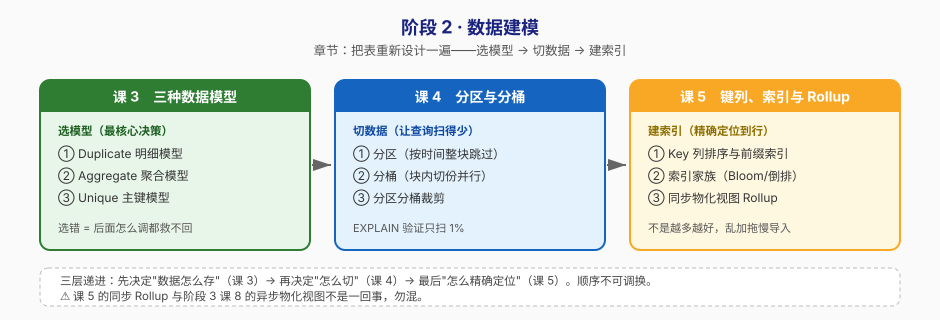

# 阶段 2：数据建模

> 所属课程：Apache Doris ｜ 故事章节：**把表重新设计一遍**——同样的 3 亿行，换个建模方式快 10 倍 ｜ 上一阶段：[阶段 1](../1-为什么需要Doris/overview.md) ｜ 下一阶段：[阶段 3](../3-数据导入与查询/overview.md)

## 🎯 本阶段目标

- 拿到业务需求能选出正确的表模型（Duplicate / Aggregate / Unique），并说清取舍
- 设计合理的分区（按时间裁剪）与分桶（并行度 + 数据分布），避免数据倾斜
- 为一个具体的慢查询配上正确的索引，并能判断该不该上物化视图

## 📍 学习重点

- **三种数据模型**：这是 Doris 建模最核心的决策——选错了后面怎么调优都救不回来
- **分区 vs 分桶**：分区是"按时间切大块，查询时整个跳过分块"；分桶是"块内再切成小份，让多台机器并行处理"。两者职责完全不同，新手最常混为一谈
- **索引不是越多越好**：前缀索引、BloomFilter、倒排索引各解决一类问题，乱加会拖慢导入、撑大内存

## ✅ 必须掌握的知识点

| 知识点 | 所属课 | 学完应能 |
|--------|--------|----------|
| Duplicate 明细模型 | 课 3 | 说清明细模型适合什么场景，为什么它是"最安全"的默认选择 |
| Aggregate 聚合模型 | 课 3 | 用 SUM/REPLACE/MAX 建一张预聚合表，并说清它为什么查询快、代价是什么 |
| Unique 主键模型 | 课 3 | 解释 Unique 模型的语义，能说清它与 Aggregate REPLACE 的关系 |
| 分区 | 课 4 | 设计按天/按月分区方案，说清分区过多会带来什么元数据分析压力 |
| 分桶 | 课 4 | 按数据量估算合理的分桶数，能识别并规避数据倾斜 |
| 分区分桶裁剪 | 课 4 | 用 EXPLAIN 证明"查询只扫了 1% 的数据" |
| Key 列排序与前缀索引 | 课 5 | 说清为什么建表时列的顺序会影响查询性能 |
| 索引家族 | 课 5 | 为等值查询、模糊搜索、文本检索分别选对索引 |
| 同步物化视图（Rollup） | 课 5 | 建一个 Rollup 并用 EXPLAIN 验证查询走了它 |

> ⚠️ **易混提示**：本阶段的**同步 Rollup** 与阶段 3 课 8 的**异步物化视图**不是一回事——前者与基表强绑定、导入时同步更新；后者独立存储、定时刷新且支持查询自动改写。学习时不要混为一谈。

## 🗺️ 本阶段路径图

## 本阶段产出

- [x] `lessons/lesson-03-三种数据模型.md`（2026-09-02 完成）
- [x] `lessons/lesson-04-分区与分桶.md`（2026-09-02 完成）
- [x] `lessons/lesson-05-键列索引与同步物化视图.md`（2026-09-02 完成）

## 阶段状态

**✅ 已完成**（3/3 课完成，2026-09-02 更新）

## 核心结论（随课交付追加）

- **课 3**（2026-09-02）：三种模型是三种"存数据的态度"——Duplicate 原样留（安全牌、可回溯、迁移到别的模型只是重建表，反过来不可能）、Aggregate 边存边算（Key 相同的行导入时按 SUM/MAX/REPLACE 合并）、Unique 后写覆盖前写（**等价于"所有 Value 列都 REPLACE 的 Aggregate"**，所以"既要 SUM 又要 REPLACE"的混用需求只能用 Aggregate）。实测 2050 万行：聚合表行数 2050 万→18.8 万（108 倍）、存储 214MB→1.5MB（**141 倍**）。**⚠️ 重要方法论发现**：单机单 BE 下聚合表单次查询只快约 0.1 秒——因为查询固定开销约 0.13 秒（实测查一张 3 行的表也要这么久），把 108 倍的扫描优势吃掉了；**聚合表真正的战场是并发**，8 并发实测 0.81s vs 0.17s，**快 4.8 倍**。MOW/MOR 实测（6 批覆盖导入 30 万行）：MOW 落盘 14,659 行（导入即合并）、MOR 物理行 29,104 行（查询时才合并，COUNT(\*) 会虚高）；**4.x 起 Unique 默认 MOW**。
- **课 4**（2026-09-02）：分区是按时间切大块（价值在**整块跳过 + 整块管理**），分桶是按哈希切小块（价值在**打散并行**），两者缺一不可。实测分区裁剪：`partitions=1/45`、`cardinality` 从 2050 万降到 84 万行，**扫描量减少 24.3 倍**（三个方案结果完全一致，均为 842808 行）。分桶键实测（2050 万行 / 8 桶）：`province`（8 个值）**4 个空桶、倾斜比 3.00**；`user_id`（183 万值）**倾斜比 1.006**——**结清了课 3"分桶键拍脑袋选"的欠账，正确方法是看基数**。⚠️ **两个重要反直觉结论**：① **分区不是越细越好**——按天分区查一个月要扫 240 个 tablet，按月只要 8 个（差 30 倍），且 tablet 总数膨胀 8 倍（2920 vs 360）；粒度必须匹配查询模式。② **动态分区以"今天"为基准建范围**，历史数据会落在范围外被 **strict mode 静默过滤**（实测 25 个月数据 0 行导入、0 报错），批量导入后必须核对行数。分桶数对耗时无影响（1/4/8/16 桶均约 0.19 秒）——再次印证课 3 的固定开销主导结论。
- **课 5**（2026-09-02）：**优化的判断顺序是从免费到昂贵**——① 先把 Key 列顺序排对（免费但最易忽略），② 再用 ZoneMap 和前缀索引（自动生效、零成本），③ 然后才考虑加索引，④ 最后考虑 Rollup。Key 列顺序 = 数据排序顺序，实测 `province[#0]`（第1列，命中前缀）vs `province[#1]`（第2列，前有 order_date 挡着）。⚠️ **一个硬约束**：Key 列必须是建表语句最前面的几列且顺序一致，否则报 `Key columns should be a ordered prefix of the schema`。⚠️ **索引的存储代价（最硬的反"越多越好"证据）**：2050 万行表无索引约 150MB → 加倒排索引 302MB → 再加 NGram BF **578MB**，**增长 3.9 倍**。⚠️ **中文分词陷阱**：`MATCH_ANY '广东'` 返回 5,624,176 行，而 `province='广东'` 只有 2,817,491 行——unicode parser 把"广东"拆成单字，**"山东"（2,806,685 行）被误匹配**；用 `MATCH_ALL` 可收回正确结果。**Rollup 实测**：`ALTER TABLE ... ADD ROLLUP` 在 Duplicate 表上建的是**列裁剪**（行数不变，仍 2150 万行），不是预聚合；命中时 EXPLAIN 显示 `TABLE: rollup_demo(rollup_pc)`、`avgRowSize` 33.57→14.43（少读 57%），代价是**存储 +43%**。⚠️ **方法论**：本课耗时全部测不出差异（固定开销 0.12–0.15 秒主导，第三次印证），**改用 EXPLAIN 的确定性字段判断**：`TABLE:`（走哪个索引）、`avgRowSize`（读多少）、`PREDICATES` 列编号（是否命中前缀）、`partitions=`（裁剪比例）、`SHOW DATA`（存储代价）。
