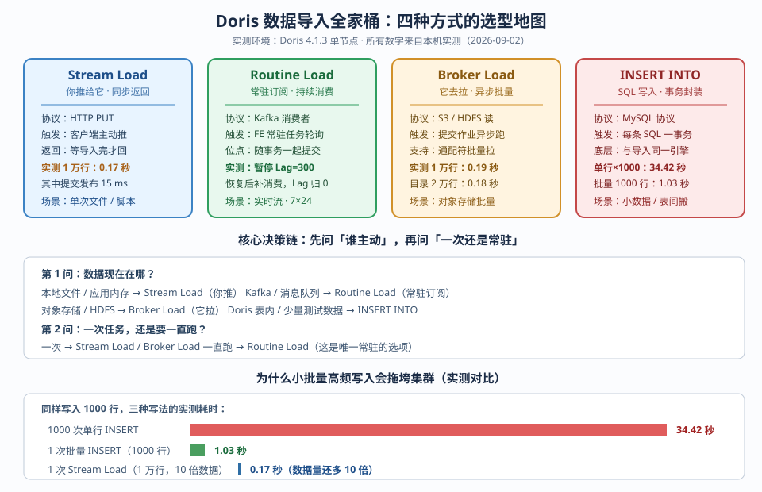

# 第 6 课：数据导入全家桶

> 所属阶段：阶段 3《数据导入与查询》｜ 水平：零基础 ｜ 本课知识点：Stream Load、Routine Load、Broker Load 与 INSERT INTO
> 故事情节：表建好了，接下来要让数据持续进来——"推还是拉？一次还是常驻？"

## 🎯 本课目标

- 用 curl 推一个 CSV / JSON 文件进 Doris，看懂返回结果里的导入状态
- 创建常驻 Kafka 导入任务，用 SHOW ROUTINE LOAD 监控 lag
- 说清 Stream Load / Routine Load / Broker Load / INSERT INTO 的适用边界

---

## 第一幕：起源与场景引入

前两节课我们一直在折腾"怎么建表"：三种数据模型（课 3）、分区分桶（课 4）、键列索引（课 5）。现在表建好了，一个更现实的问题摆在面前：

**数据怎么进去？**

设想你接手了一个电商订单系统，每天要往 Doris 里灌 2000 万条订单。数据有三个来源：

1. **业务数据库的历史存量**：MySQL 里有过去两年的订单，导出成 CSV 文件，大概 50 GB
2. **实时订单流**：新订单产生后进入 Kafka，要求 10 秒内能在报表里查到
3. **数据湖里的归档**：历史冷数据存在 S3 上，每月初要批量回灌一次做月度汇总

三个来源，三种完全不同的节奏。如果你只有一把锤子——比如只会用 `INSERT INTO`——会发生什么？

这就是本课要回答的问题。Doris 提供了四种导入方式，它们的区别不是"功能多少"，而是**谁主动、跑几次、什么时候算完成**。

先记住本课的总纲，后面三个知识点都是它的展开：

> **四种方式 = 两个维度的组合**：数据在哪（决定谁主动），以及一次还是常驻（决定要不要有"作业"这个概念）。

---

## 第二幕：认知冲突

在讲具体方式之前，先做一个思想实验，也是本课最反直觉的地方。

假设你要往 Doris 写 1000 行数据。最自然的写法是什么？大概是这样：

```sql
INSERT INTO orders VALUES (1, '广东', 99.9);
INSERT INTO orders VALUES (2, '山东', 88.8);
-- ... 重复 1000 次
```

语法完全正确，每行都成功返回。现在问题来了：**这样写 1000 行，和一次性写 1000 行，差别有多大？**

你的直觉可能是"慢一点，但同一个数量级"。

实测数据（本机 Doris 4.1.3，单 BE，31Gi 内存）：

| 写法 | 行数 | 实测耗时 |
|------|------|----------|
| 1000 次单行 `INSERT` | 1000 | **34.42 秒** |
| 1 次批量 `INSERT`（1000 行 VALUES） | 1000 | **1.03 秒** |
| 1 次 Stream Load | **10000**（10 倍数据） | **0.17 秒** |

最后一行请多看一眼：**Stream Load 写了 10 倍的数据，耗时却只有单行 INSERT 的 1/200。**

这不是"优化技巧"，这是**架构层面的差异**。为什么会差这么多？

答案藏在 Doris 的存储结构里。回想课 4 讲的分桶：数据被切成 tablet，每个 tablet 内部是一个个按版本管理的**数据文件（rowset）**。每次写入事务，都会在 tablet 上产生一个新版本。

- 单行 INSERT 1000 次 = 1000 个事务 = 至少 1000 个版本的元数据
- 批量 INSERT 一次 = 1 个事务 = 1 个版本
- Stream Load 一次 = 1 个事务 = 1 个版本

版本不是免费的。BE 后台有个叫 **Compaction（合并）** 的线程，负责把小版本合并成大版本。写入版本的速度超过合并速度时，版本就会堆积——表现为查询变慢（要读更多文件）、元数据膨胀、最终触发 `-235` 版本数超限错误，写入直接被拒绝。

所以第一课真正要记住的是：

> **在 Doris 里，"写进去"和"写对方式"是两件事。小批量高频写入不是慢一点，是在给后台 Compaction 制造债务。**

⚠️ 这里有个容易误解的点：这不意味着 `INSERT INTO` 是"坏东西"。它在**小数据量、低频、表间搬运**的场景下完全正确。问题只出在"用它做高频主链路"这个错误用法上。后面知识点 3 会给出精确的边界。

第四幕我们会亲手复现这个 34 秒 vs 1 秒的对比。在此之前，先把四种方式一个一个拆开看。

---

## 第三幕：层层揭示

### 知识点 1：Stream Load

> 本知识点关键点：HTTP 协议同步导入、事务与原子性、返回结果的字段含义、Label 去重机制

#### 一句话定义

Stream Load 是通过 HTTP 协议把**本地文件**推给 Doris 的同步导入方式——你发一个 HTTP 请求，Doris 导入完才返回，返回的 JSON 里告诉你成功与否、进了多少行、脏了几行。

#### 直觉建立（类比 + 边界）

把它想成**快递寄件**：

你（客户端）把包裹（数据文件）交给快递点（Doris FE），快递点当场处理完，给你一张回执（JSON 响应）。回执上写着：收了几件、拒收几件、拒收原因是什么。你站在柜台前等，处理完才走——这就是"同步"。

这个类比的边界要划清楚：

- **它不是"上传文件到服务器"**。文件不会被原样保存，而是在传输过程中就被解析、分发到各个 BE、写入 tablet。请求结束时，数据已经可查了。
- **它不是"查询"**。虽然用的是 HTTP，但它是写操作，会产生事务和版本。
- **"同步"只对你而言**。你发出请求后要等 Doris 处理完；但 Doris 内部仍然是分布式的，FE 会协调所有相关 BE 一起写。

#### 核心原理

Stream Load 的完整链路：

1. 客户端向 **FE** 的 HTTP 端口（默认 8030）发 `PUT` 请求，路径是 `/api/{库名}/{表名}/_stream_load`
2. 请求头里带 `label`（本次导入的唯一 ID）、`format`、`column_separator` 等参数
3. FE 做两件事：开启一个事务、选定一个 BE 作为**协调者（Coordinator）**，把请求转发给它
4. 协调者 BE 接收数据，按分桶规则把行分发给各个 BE，每个 BE 写入自己的 tablet
5. 所有 BE 写完后，FE **提交事务**，数据变为可见
6. FE 把结果 JSON 返回给客户端

关键点：**第 5 步之前，数据对查询不可见**。事务要么全提交，要么全回滚——这就是原子性。

**Label 机制**是 Stream Load 的灵魂。每个导入必须带一个 label，Doris 用它做幂等：

- 同一个 label 已经成功过 → 直接返回 `Label Already Exists`，不会重复导入
- label 的生命周期默认保留 3 天（由 FE 配置 `label_keep_max_second` 控制）

#### 示例演示

先建一张目标表（**完整可运行，不含任何省略**）：

```sql
CREATE TABLE load_demo (
    order_id    BIGINT,
    user_id     BIGINT,
    province    VARCHAR(32),
    city        VARCHAR(64),
    category    VARCHAR(32),
    amount      DECIMAL(10,2),
    pay_type    TINYINT,
    order_date  DATE
)
DUPLICATE KEY(order_id)
PARTITION BY RANGE(order_date) (
    PARTITION p202401 VALUES [('2024-01-01'), ('2024-02-01')),
    PARTITION p202402 VALUES [('2024-02-01'), ('2024-03-01')),
    PARTITION pother  VALUES [('2024-03-01'), ('2025-01-01'))
)
DISTRIBUTED BY HASH(order_id) BUCKETS 4
PROPERTIES ('replication_num' = '1');
```

准备一份 CSV 文件 `orders_10k.csv`（10000 行，无表头，逗号分隔）：

```text
1,211244,广东,南京,服饰,1041.33,2,2024-02-02
2,12462,北京,厦门,电脑,1834.96,4,2024-01-03
3,380336,江苏,深圳,手机,418.36,3,2024-02-04
```

发起 Stream Load：

```bash
curl --location-trusted -u root: \
  -H "label:sl_csv_10k" \
  -H "column_separator:," \
  -H "format:csv" \
  -T orders_10k.csv \
  http://127.0.0.1:8030/api/shop/load_demo/_stream_load
```

实测返回结果（本机 Doris 4.1.3）：

```json
{
    "TxnId": 165,
    "Label": "sl_csv_10k",
    "TwoPhaseCommit": "false",
    "Status": "Success",
    "Message": "OK",
    "NumberTotalRows": 10000,
    "NumberLoadedRows": 10000,
    "NumberFilteredRows": 0,
    "NumberUnselectedRows": 0,
    "LoadBytes": 534436,
    "LoadTimeMs": 40,
    "BeginTxnTimeMs": 0,
    "StreamLoadPutTimeMs": 2,
    "ReadDataTimeMs": 0,
    "WriteDataTimeMs": 19,
    "ReceiveDataTimeMs": 5,
    "CommitAndPublishTimeMs": 16
}
```

**这个 JSON 怎么读**，是本课最实用的技能。逐字段说明：

| 字段 | 含义 | 本次实测值 |
|------|------|-----------|
| `TxnId` | 事务 ID；`-1` 表示被 Label 幂等拦截，没开新事务 | 165 |
| `Status` | `Success` / `Fail` / `Label Already Exists` | Success |
| `NumberTotalRows` | 从文件里读到的总行数 | 10000 |
| `NumberLoadedRows` | 真正落库的行数 | 10000 |
| `NumberFilteredRows` | 被过滤的脏数据行数 | 0 |
| `NumberUnselectedRows` | 被 `where` 条件筛掉的行数 | 0 |
| `LoadBytes` | 导入的字节数 | 534436 |
| `LoadTimeMs` | 总耗时（毫秒） | 40 |
| `CommitAndPublishTimeMs` | 提交并让数据可见的耗时 | 16 |
| `ErrorURL` | 脏数据明细查询地址（有脏数据时才出现） | — |

耗时分解值得单独看一眼：`WriteDataTimeMs: 19` + `CommitAndPublishTimeMs: 16` = 35ms，占了 `LoadTimeMs: 40` 的绝大部分。**真正花时间的是"写盘 + 提交"，不是"收数据"**（`ReceiveDataTimeMs: 5`）。这也解释了为什么攒批比单条快——单条写入时，提交开销被重复支付了 N 次。

**Label 幂等实测**。用完全相同的 label 再发一次：

```json
{
    "TxnId": -1,
    "Label": "sl_csv_10k",
    "Status": "Label Already Exists",
    "ExistingJobStatus": "FINISHED",
    "Message": "Label [sl_csv_10k] has already been used, relate to txn [165], status [VISIBLE].",
    "NumberTotalRows": 0,
    "NumberLoadedRows": 0
}
```

注意 `TxnId: -1`——根本没开新事务。表里行数仍是 10000。

**但换一个 label 呢？**

```bash
curl --location-trusted -u root: \
  -H "label:sl_csv_10k_again" \
  -H "column_separator:," -H "format:csv" \
  -T orders_10k.csv \
  http://127.0.0.1:8030/api/shop/load_demo/_stream_load
```

返回 `Success` + `NumberLoadedRows: 10000`，表里变成 **20000 行**。

> ⚠️ **这是新手最常踩的坑**：Doris 的导入是 **APPEND（追加）语义**，不是"用相同主键覆盖"。在 Duplicate 表上重复导入同样的数据，数据就会真的重复。需要覆盖更新请用 Unique 表（见下文"导入即更新"一节）。

#### 常见误区

**误区 1：把 `max_filter_ratio` 当"容错开关"随便调大**

`max_filter_ratio` 控制"最多允许多少比例的行不合格，超过就整批失败"。默认 0（零容忍）。很多人遇到导入失败，第一反应是把它调成 1，让导入"成功"。

这是把报警器拆了。实测对比（1000 行文件，其中 50 行 `amount` 字段是字符串 `NOT_A_NUMBER`）：

| 配置 | Status | TotalRows | LoadedRows | FilteredRows | 表中最终行数 |
|------|--------|-----------|------------|--------------|-------------|
| `max_filter_ratio:0` | **Fail** | 1000 | 0 | 50 | 10000（没变，整批回滚） |
| `max_filter_ratio:0.1` | **Success** | 1000 | 950 | 50 | 10950 |

注意第一行的 `LoadedRows: 0`——**只要有一行超标，整批 1000 行一条都进不去**。这就是原子性。

正确的做法是先搞清楚脏在哪，再决定容忍多少。

**误区 2：以为 `Status: Success` 就代表数据是对的**

这是本课最危险的一个坑，也是我在实测中撞到的。

Doris 的 `strict_mode` **默认是 `false`**。在这个模式下，`amount` 字段收到字符串 `'NOT_A_NUMBER'` 会怎样？不是报错，而是**静默转成 NULL**，并且**不计入 `NumberFilteredRows`**。

实测（导入一行 `amount=123abc`）：

| 配置 | Status | TotalRows | LoadedRows | FilteredRows | 落库的 amount |
|------|--------|-----------|------------|--------------|--------------|
| 不设 `strict_mode`（默认 false） | Success | 1 | **1** | **0** | **NULL** |
| `strict_mode:true` | Success | 1 | **0** | **1** | 无此行 |

看清楚：默认配置下，那行数据"成功"了，但 amount 变成了 NULL。你的报表会把这笔订单的金额算成 NULL 而不是报错——**账目悄悄错了，而你毫不知情**。

生产环境的建议是显式设置 `strict_mode:true`，让脏数据变成可计数的 Filtered，而不是静默的 NULL。

**误区 3：脏数据不知道去哪找**

当 `NumberFilteredRows > 0` 时，返回结果里会出现 `ErrorURL` 字段。直接 curl 它：

```bash
curl "http://127.0.0.1:8040/api/_load_error_log?file=__shard_16/error_log_insert_stmt_4e4b3ea56dc34561-4d89ccdf8607e694_..."
```

实测拿到的内容：

```text
Reason: column(amount) value is incorrect while strict mode is true, src value is NOT_A_NUMBER. src line [20 20 广东 测试市 手机 NOT_A_NUMBER 1 2024-01-15];
Reason: column(amount) value is incorrect while strict mode is true, src value is NOT_A_NUMBER. src line [40 40 广东 测试市 手机 NOT_A_NUMBER 4 2024-01-15];
```

每一行都告诉你：**哪个字段、什么原始值、源文件的第几行**。这比"导入失败"四个字有用一百倍。

#### 一句话记住

> Stream Load 是"推"——你发 HTTP 请求把文件推出去，同步等一个 JSON 回执；回执里的 `NumberLoadedRows` 才是真相，`Status: Success` 只是必要条件而非充分条件。

#### 官方文档

- [Stream Load - Apache Doris](https://doris.apache.org/zh-CN/docs/data-operate/import/import-way/stream-load-manual)
- [导入总览 - Apache Doris](https://doris.apache.org/zh-CN/docs/data-operate/import/import-overview)

---

### 知识点 2：Routine Load

> 本知识点关键点：常驻任务订阅 Kafka、消费位点与 Exactly-Once 语义、SHOW ROUTINE LOAD 监控 lag、PAUSE / RESUME / ALTER

#### 一句话定义

Routine Load 是一个**常驻在 FE 里的导入作业**，它作为 Kafka 消费者持续订阅 topic，把消息分批写入 Doris，并**把消费位点和数据放在同一个事务里提交**。

#### 直觉建立（类比 + 边界）

把它想成**订阅报纸**：

Stream Load 是你去报摊买一份（一次性）；Routine Load 是你订了全年，邮递员每天早上自动把报纸塞进信箱（常驻）。你不用每天惦记，除非你想暂停几天。

但要说清这个类比的边界，有两点邮递员做不到：

- **位点和数据一起提交**。这是 Routine Load 最精妙的设计。普通 Kafka 消费者是"先处理数据，再提交 offset"，中间崩溃就会重复消费或丢数据。Doris 的做法是：把 offset 当作数据的一部分，写进同一个事务一起提交。要么数据和位点都生效，要么都不生效。
- **它是 FE 的常驻任务，不是独立的进程**。没有单独的"Routine Load 服务"需要部署。FE 会把作业拆成若干 Task 分发给 BE 执行，FE 自己负责调度和监控。这意味着 FE 挂了，作业就停了（这也引出课 9 的 FE 高可用）。

#### 核心原理

一个 Routine Load 作业的生命周期：

1. **创建**：`CREATE ROUTINE LOAD` 在 FE 里注册一个作业，记录 topic、broker 地址、目标表、列映射、消费起始位点
2. **拆分**：FE 按 Kafka 分区数把作业拆成多个 Task（默认一个 Task 消费一个或多个分区）
3. **调度**：FE 把 Task 分发给 BE 执行；BE 作为 Kafka 消费者拉取消息
4. **攒批**：BE 按三个条件之一触发写入——达到 `max_batch_rows` 行、达到 `max_batch_size` 字节、或等待超过 `max_batch_interval` 秒
5. **提交**：BE 把这一批数据连同 Kafka offset 一起提交事务
6. **循环**：回到第 3 步，永不停止，直到作业被停止

**Exactly-Once 是怎么做到的**：因为 offset 和数据在同一个事务里，所以：
- 事务成功 → 数据写入 + 位点前移，不丢不重
- 事务失败 → 数据回滚 + 位点不动，下一批重新消费这些消息，不丢
- 崩溃重启 → 从最后一个成功事务的位点继续，不重

注意这个"Exactly-Once"指的是**Doris 侧的写入语义**。如果 Kafka 本身重复投递（生产者重试），Doris 仍然会写入重复数据——这时候要靠 Unique 表的 UPSERT 来兜底。

#### 示例演示

**第一步：创建目标表（完整语句）**

```sql
CREATE TABLE kafka_orders (
    order_id    BIGINT,
    user_id     BIGINT,
    province    VARCHAR(32),
    amount      DECIMAL(10,2),
    order_time  DATETIME
)
DUPLICATE KEY(order_id)
DISTRIBUTED BY HASH(order_id) BUCKETS 4
PROPERTIES ('replication_num' = '1');
```

**第二步：创建 Routine Load 作业（完整语句）**

```sql
CREATE ROUTINE LOAD shop.kafka_rl_orders ON kafka_orders
COLUMNS(order_id, user_id, province, amount, order_time)
PROPERTIES
(
    'desired_concurrent_number' = '1',
    'max_batch_interval' = '10',
    'max_batch_rows' = '200000',
    'max_batch_size' = '104857600',
    'strict_mode' = 'false',
    'format' = 'json'
)
FROM KAFKA
(
    'kafka_broker_list' = 'kafka:9092',
    'kafka_topic' = 'doris_orders',
    'property.group.id' = 'doris_rl_group',
    'property.kafka_default_offsets' = 'OFFSET_BEGINNING'
);
```

几个关键参数：

| 参数 | 含义 | 说明 |
|------|------|------|
| `desired_concurrent_number` | 期望并发 Task 数 | 决定消费并行度，越大吞吐越高 |
| `max_batch_interval` | 最长攒批等待时间（秒） | 到点就算不够行数也提交，控延迟 |
| `max_batch_rows` | 攒够多少行提交 | 控吞吐，实测**下限 200000** |
| `max_batch_size` | 攒够多少字节提交 | 同上，单位是字节 |
| `kafka_default_offsets` | 起始消费位点 | `OFFSET_BEGINNING` 从头，`OFFSET_END` 从最新 |

**第三步：向 Kafka 发送测试消息**

```bash
# 生成 500 条 JSON 消息并发送
for i in $(seq 1 500); do
  echo "{\"order_id\":$i,\"user_id\":$((RANDOM % 100000)),\"province\":\"广东\",\"amount\":99.99,\"order_time\":\"2024-03-15 10:00:00\"}"
done > /tmp/kafka_msgs.json

kafka-console-producer.sh --bootstrap-server kafka:9092 --topic doris_orders < /tmp/kafka_msgs.json
```

**第四步：查看作业状态（这是最重要的运维动作）**

```sql
SHOW ROUTINE LOAD FOR shop.kafka_rl_orders\G
```

实测返回（本机，消费 500 条后）：

```text
                  Id: 1788336167697
                Name: kafka_rl_orders
               State: RUNNING
      DataSourceType: KAFKA
      CurrentTaskNum: 1
       JobProperties: {"max_batch_rows":"200000",...}
DataSourceProperties: {"topic":"doris_orders","currentKafkaPartitions":"0,1,2","brokerList":"kafka:9092"}
           Statistic: {"receivedBytes":51584,"errorRows":0,"committedTaskNum":1,
                       "loadedRows":500,"loadRowsRate":29,"totalRows":500,...}
            Progress: {"0":"OFFSET_ZERO","1":"OFFSET_ZERO","2":"499"}
                 Lag: {"0":0,"1":0,"2":0}
```

**这四个字段是监控的核心**，逐一说明：

| 字段 | 含义 | 健康信号 |
|------|------|----------|
| `State` | `RUNNING` / `PAUSED` / `STOPPED` / `CANCELLED` | 必须是 RUNNING |
| `Progress` | 每个 Kafka 分区的消费位点 | 位点应持续前移 |
| `Lag` | 每个分区的积压消息数 | **应接近 0**；持续增长=消费跟不上 |
| `Statistic` | 累计统计（行数、字节、错误行、速率） | `errorRows` 应为 0 |

`Progress` 里的 `"1":"OFFSET_ZERO"` 表示 1 号分区一条都没消费到（因为消息被路由到了其他分区），`"2":"499"` 表示 2 号分区消费到了第 499 条。这是正常的——Kafka 按 key 或轮询把消息分到不同分区。

**第五步：验证增量消费（断点续传）**

再发 200 条消息，等待后查询：

```sql
SELECT COUNT(*) FROM kafka_orders;
-- 700（500 + 200，作业自动消费了新消息，无需任何干预）
```

**关键实验：PAUSE / RESUME 会不会丢消息？**

这是运维最关心的问题。实测过程：

```sql
-- 1. 暂停前：700 行
SELECT COUNT(*) FROM kafka_orders;  -- 700

-- 2. 暂停作业
PAUSE ROUTINE LOAD FOR shop.kafka_rl_orders;

-- 3. 暂停期间向 Kafka 发 300 条消息
-- （作业不消费）

-- 4. 查看状态
SHOW ROUTINE LOAD FOR shop.kafka_rl_orders\G
```

实测结果：

```text
               State: PAUSED
            Progress: {"0":"199","1":"OFFSET_ZERO","2":"499"}
                 Lag: {"0":0,"1":0,"2":300}     ← 积压 300 条！
```

**`Lag` 字段在暂停时暴露了积压量 300**——这正是它存在的意义。表中行数仍是 700。

```sql
-- 5. 恢复作业
RESUME ROUTINE LOAD FOR shop.kafka_rl_orders;

-- 6. 等待后查询
SELECT COUNT(*) FROM kafka_orders;  -- 1000
```

恢复后行数变成 1000，`Lag` 全部归 0。**暂停期间的消息被完整补消费，一条没丢。**

> 这就是"位点随事务提交"的价值：暂停时位点不前进，恢复后从上次提交的位点继续。

#### 常见误区

**误区 1：以为 Routine Load 会自动校验数据质量**

实测：向 Kafka 发一条 `amount:"BAD_DATA"` 的消息（作业配置 `strict_mode:false`），结果是——

```sql
SELECT order_id, amount FROM kafka_orders WHERE order_id IN (2001,2002);
-- 2001   NULL     ← 脏数据被静默写成 NULL
-- 2002   66.66    ← 好数据正常进来
```

而作业的 `errorRows` 仍然是 **0**。脏数据既没有被拦截，也没有被计数。

**Routine Load 的默认 `max_filter_ratio` 是 1.0**（注意：与 Stream Load 的默认 0 不同！），意味着它默认容忍任意比例的脏数据。生产环境务必显式设置 `strict_mode:true` 并按需调整 `max_filter_ratio`。

**误区 2：以为所有属性都能 ALTER 修改**

实测尝试把 `max_batch_rows` 从 200000 改成 1000：

```sql
ALTER ROUTINE LOAD FOR shop.kafka_rl_orders
PROPERTIES ('max_batch_rows' = '1000');

-- ERROR 1105 (HY000): errCode = 2, detailMessage = max_batch_rows should > 200000
```

**`max_batch_rows` 有 200000 的硬下限**，改小会直接报错。这个限制的原因是：Routine Load 的定位就是高吞吐流式导入，批量太小就失去了意义。

能改的包括 `desired_concurrent_number`、`max_batch_interval`、`max_batch_size` 等；改不了或有限制的参数，报错信息会明确告诉你。

**误区 3：Docker 环境里 broker 地址配成 `localhost`**

这是我实测踩到的真实坑。第一次创建作业时用了 `127.0.0.1:9092`，作业直接 PAUSED 并报错：

```text
ReasonOfStateChanged: ErrorReason{code=errCode = 4, msg='Failed to get all partitions of kafka topic:
doris_orders error: failed to get info: [(127.0.0.1)[INTERNAL_ERROR]failed to get partition meta:
Local: Broker transport failure, may be Kafka properties set in job is error or no partition in this topic'}
```

原因：Doris 跑在容器里，它的 `127.0.0.1` 是**容器自己**，不是宿主机上的 Kafka。而且 Kafka 返回的 `advertised.listeners` 如果是 `localhost:9092`，Doris 拿着这个地址去连，连的还是自己。

**解法（两个都要做）**：

1. 让 Doris 和 Kafka 在同一个 Docker 网络里，用**容器主机名**互访
2. 确保 Kafka 的 `advertised.listeners` 是 **Doris 能解析的地址**（如 `kafka:9092`），而不是 `localhost:9092`

```bash
# 创建共享网络
docker network create doris-net
docker network connect doris-net doris-learn

# 启动 Kafka 时指定主机名与 advertised 地址
docker run -d --name doris-kafka --network doris-net --hostname kafka \
  -e KAFKA_ADVERTISED_LISTENERS=PLAINTEXT://kafka:9092 \
  ...
```

配好后作业正常 RUNNING。这个坑在容器化部署中极其常见。

#### 一句话记住

> Routine Load 是"常驻订阅"——FE 里的作业不停从 Kafka 拉数据，**位点和数据在同一事务提交**所以不丢不重；运维盯住 `State` 和 `Lag` 两个字段就够了。

#### 官方文档

- [Routine Load - Apache Doris](https://doris.apache.org/zh-CN/docs/data-operate/import/import-way/routine-load-manual)
- [SHOW ROUTINE LOAD - Apache Doris](https://doris.apache.org/zh-CN/docs/sql-manual/sql-statements/Show-Statements/SHOW-ROUTINE-LOAD)

---

### 知识点 3：Broker Load 与 INSERT INTO

> 本知识点关键点：Broker Load 从对象存储 / HDFS 批量拉、INSERT INTO 的内部写入路径与适用边界、四种方式的选型对比

#### 一句话定义

Broker Load 是 Doris **主动去对象存储 / HDFS 拉数据**的异步批量导入方式；`INSERT INTO` 则是通过 MySQL 协议提交 SQL 写入，每条语句被封装成一个内部导入事务。

#### 直觉建立（类比 + 边界）

**Broker Load 类比**：快递上门取件。

你不跑腿，只要在系统里下个单（提交作业），说明"东西在 S3 的哪个位置"，Doris 自己派车去拉，拉完通知你。你不用等在旁边——这就是"异步"。

**边界要说清**：

- **它不再需要独立的 Broker 进程**了。早期 Doris 需要部署一个叫 `broker` 的独立进程来读取远端存储，现在的版本通过 **S3 TVF（表函数）** 直接读，架构简化了。这也是为什么本课演示的是 `INSERT INTO ... SELECT FROM s3()` 这种写法。
- **"异步"意味着你需要主动查状态**。提交后返回的是 JobId，不是结果。要用 `SHOW LOAD` 查看进度。

**INSERT INTO 类比**：自己去柜台办业务。

你走 MySQL 协议，像操作普通数据库一样写 SQL。简单、熟悉、无需任何额外组件。

**边界**：

- **它底层和 Stream Load 走同一套导入引擎**。这是很多人不知道的：`INSERT INTO` 不是"另一条路"，它是 Stream Load 的 SQL 封装。所以 Stream Load 的那些参数（label、max_filter_ratio 等）在概念上同样适用。
- **它每次都是一个独立事务**。这是它快的优点（无需额外组件），也是它慢的根源（见第二幕）。

#### 核心原理

**Broker Load（现代 S3 TVF 写法）**

```sql
INSERT INTO 目标表
SELECT 列... FROM s3(
  'uri' = 'http://minio:9000/bucket/path/file.csv',
  'format' = 'csv',
  's3.access_key' = '...',
  's3.secret_key' = '...',
  'csv_schema' = '列定义'
);
```

`s3()` 是一个**表函数**：它把远端文件虚拟成一张表，你可以 `SELECT` 它，也可以 `INSERT INTO ... SELECT` 把它灌进本地表。因为是表函数，所以：

- 支持**通配符**，一次读整个目录：`'uri' = 'http://minio:9000/bucket/batch/*'`
- 支持 `WHERE` 过滤，只导入需要的数据
- 支持 `INSERT INTO ... SELECT` 里的所有表达式和转换

**INSERT INTO 的内部路径**

1. 客户端通过 MySQL 协议发送 SQL 给 FE
2. FE 解析、生成执行计划
3. FE 开启事务，把数据按分桶分发到各 BE
4. BE 写入 tablet
5. FE 提交事务，返回

注意第 3 步：**每条 `INSERT` 语句一个事务**。所以 1000 条单行 INSERT = 1000 次事务开销。

#### 示例演示

**Broker Load：从 MinIO（S3 兼容）拉 CSV**

先确认文件已在对象存储上：

```bash
mc ls local/doris-demo/
# [2026-09-02 10:15:44 UTC] 522KiB STANDARD orders_10k.csv
# [2026-09-02 10:15:44 UTC] 149KiB STANDARD orders_1k.json
```

直接用 S3 TVF 查询（不落库，先看数据对不对）：

```sql
SELECT order_id, province, amount, order_date
FROM s3(
  'uri' = 'http://minio:9000/doris-demo/orders_10k.csv',
  'format' = 'csv',
  's3.access_key' = 'minioadmin',
  's3.secret_key' = 'minioadmin',
  's3.region' = 'us-east-1',
  'minio.endpoint' = 'http://minio:9000',
  'use_path_style' = 'true',
  'column_separator' = ',',
  'csv_schema' = 'order_id:bigint;user_id:bigint;province:string;city:string;category:string;amount:decimal(10,2);pay_type:int;order_date:date'
) LIMIT 3;
```

实测返回：

```text
order_id   province   amount    order_date
1          广东        1041.33   2024-02-02
2          北京        1834.96   2024-01-03
3          江苏        418.36    2024-02-04
```

落库：

```sql
INSERT INTO s3_orders_ext
SELECT order_id, user_id, province, city, category, amount, pay_type, order_date
FROM s3(
  'uri' = 'http://minio:9000/doris-demo/orders_10k.csv',
  'format' = 'csv',
  's3.access_key' = 'minioadmin',
  's3.secret_key' = 'minioadmin',
  's3.region' = 'us-east-1',
  'minio.endpoint' = 'http://minio:9000',
  'use_path_style' = 'true',
  'column_separator' = ',',
  'csv_schema' = 'order_id:bigint;user_id:bigint;province:string;city:string;category:string;amount:decimal(10,2);pay_type:int;order_date:date'
);
```

实测：**1 万行，耗时 0.19 秒**，落库 10000 行。

**通配符一次拉整个目录**：

```sql
INSERT INTO s3_orders_ext
SELECT order_id, user_id, province, city, category, amount, pay_type, order_date
FROM s3(
  'uri' = 'http://minio:9000/doris-demo/batch/*',   -- 注意这里的 *
  ... 其余参数同上
);
```

实测：**2 万行（两个文件），耗时 0.18 秒**——和单文件 1 万行几乎一样快。这就是批量拉取的价值：文件数量增加，导入时间几乎不增加。

> ⚠️ **`csv_schema` 的格式很严格**，我实测踩了三次坑才写对：
> - 列之间用**分号 `;`** 分隔，不是逗号
> - 字符串类型是 **`string`**，不是 `varchar` / `text`（会报 `unsupported column type`）
> - 小数写作 `decimal(10,2)`
>
> 完整正确写法：`'csv_schema' = 'order_id:bigint;user_id:bigint;province:string;amount:decimal(10,2)'`

**INSERT INTO：三种用法**

```sql
-- 用法 1：单行插入（最慢，仅适合测试数据）
INSERT INTO load_demo VALUES (1, 100, '广东', '广州', '手机', 99.90, 1, '2024-01-15');

-- 用法 2：批量 VALUES（一个事务，快得多）
INSERT INTO load_demo VALUES
  (1, 100, '广东', '广州', '手机', 99.90, 1, '2024-01-15'),
  (2, 101, '山东', '青岛', '电脑', 88.80, 2, '2024-01-15'),
  (3, 102, '江苏', '南京', '家电', 77.70, 1, '2024-01-16');

-- 用法 3：INSERT INTO ... SELECT（库内表间搬运，也用于 S3 拉取）
INSERT INTO load_demo
SELECT order_id, user_id, province, city, category, amount, pay_type, order_date
FROM s3_orders_ext LIMIT 10000;
```

实测用法 3：**1 万行库内搬运，耗时 0.16 秒**。

**导入即更新：Unique 表的 UPSERT 语义**

这是 `INSERT INTO` 和所有导入方式在 Unique 表上的特殊行为。实测：

```sql
CREATE TABLE uniq_load_demo (
    order_id BIGINT,
    province VARCHAR(32),
    amount   DECIMAL(10,2)
) UNIQUE KEY(order_id) DISTRIBUTED BY HASH(order_id) BUCKETS 2
PROPERTIES ('replication_num' = '1');
```

第一次导入 3 行：

```text
1,广东,100.00
2,山东,200.00
3,江苏,300.00
```

结果：

```text
order_id   province   amount
1          广东        100.00
2          山东        200.00
3          江苏        300.00
```

第二次导入 2 行，其中 `order_id=1` 是新的值，`order_id=4` 是新增：

```text
1,北京,999.99
4,浙江,400.00
```

结果：

```text
order_id   province   amount
1          北京        999.99    ← 被覆盖了！
2          山东        200.00
3          江苏        300.00
4          浙江        400.00    ← 新增
```

**`order_id=1` 从「广东/100.00」变成了「北京/999.99」**。这就是 Unique 表的 UPSERT：相同主键的导入是覆盖，不是追加。这个特性让重复导入变得安全——也解释了为什么实时场景推荐用 Unique 表承接 Kafka 数据。

#### 四种方式选型对比

这是本课的收尾表格，也是日常最该记住的一张表：

| 维度 | Stream Load | Routine Load | Broker Load | INSERT INTO |
|------|-------------|--------------|-------------|-------------|
| **谁主动** | 客户端推 | Doris 拉（持续） | Doris 拉（一次） | 客户端推 |
| **协议** | HTTP | Kafka 消费者 | S3 / HDFS | MySQL |
| **同步性** | 同步等待返回 | 异步常驻 | 异步作业 | 同步等待返回 |
| **运行次数** | 一次 | **常驻** | 一次 | 一次 |
| **典型数据源** | 本地文件 | Kafka | 对象存储 / HDFS | SQL / 库内表 |
| **实测吞吐** | 1万行/0.17秒 | 持续消费 | 2万行/0.18秒 | 单行 34ms/条 |
| **事务粒度** | 每次请求 | 每个批次 | 每个作业 | 每条语句 |
| **监控方式** | 返回 JSON | `SHOW ROUTINE LOAD` | `SHOW LOAD` | 无（SQL 直接返回） |
| **绝不该用于** | 实时流 | 一次性导入 | 低频小数据 | **高频主链路** |

**选型决策链**（照着问自己就行）：

```text
第 1 问：数据现在在哪？
  本地文件 / 应用内存      → Stream Load
  Kafka / 消息队列         → Routine Load
  对象存储 / HDFS          → Broker Load
  Doris 表内 / 少量测试     → INSERT INTO

第 2 问：一次任务，还是要一直跑？
  一次     → Stream Load / Broker Load
  一直跑   → Routine Load（这是唯一常驻的选项）
```

#### 常见误区

**误区 1：用 `INSERT INTO` 做实时写入主链路**

这是第二幕那个 34 秒的来源。再强调一次数据：

- 单行 INSERT ×1000 = **34.42 秒**
- 批量 INSERT（1000 行）= **1.03 秒**
- Stream Load（10000 行）= **0.17 秒**

如果业务要求每秒写入几百条，单行 INSERT 会给后台 Compaction 制造持续的版本债务，最终触发写入拒绝。**高频写入请用 Stream Load 攒批，或 Routine Load。**

**误区 2：以为 Group Commit 能救单行 INSERT**

Group Commit 是 Doris 的一个优化：把多个小 INSERT 攒在一起提交（由 `group_commit_interval_ms` 控制攒批窗口）。听起来正好解决这个问题？

我做了对照实测（100 次单行 INSERT）：

| 配置 | 耗时 |
|------|------|
| `group_commit_interval_ms=100` | 15.17 秒 |
| `group_commit_interval_ms=10000` | 15.62 秒 |

**几乎没有差别**。原因：单行 INSERT 的瓶颈不在"提交"这一步，而在**每条 SQL 都要走一遍 连接 → 解析 → 规划 → 分发的固定开销**。Group Commit 优化的是提交，优化不了这个固定开销。

> 📏 **关于两个数字的口径**：第二幕是 1000 次单行 INSERT = 34.42 秒（约 34ms/条），
> 这里是 100 次 = 约 15 秒（约 152ms/条）。两者不是同一轮测量，绝对值和测量环境负载有关。
> **但结论一致且可复现**：无论窗口设 100ms 还是 10000ms，耗时都几乎不变——
> 说明 Group Commit 没有触及真正的瓶颈。

> 这是本课唯一一个"听起来该有效、实测无效"的结论。诚实记录在这里：**Group Commit 对高频单行 INSERT 帮助有限，真正的解法是攒批（用批量 VALUES 或 Stream Load）。**

**误区 3：以为异步作业提交完就完事了**

Broker Load 提交后返回 JobId，不代表数据已经进去。要查：

```sql
SHOW LOAD FROM shop ORDER BY CreateTime DESC LIMIT 5\G
```

实测返回：

```text
         JobId: 1788336167861
         Label: label_977f29ea66154d31_8f320312a332b99d
         State: FINISHED
          Type: INSERT
       ErrorMsg: NULL
    CreateTime: 2026-09-02 10:18:09
```

`State` 可能是 `PENDING`（排队）、`LOADING`（进行中）、`FINISHED`（成功）、`CANCELLED`（失败）。失败时 `ErrorMsg` 会给出原因。

#### 一句话记住

> Broker Load 是"拉"——下个单让 Doris 自己去对象存储取，支持通配符批量；`INSERT INTO` 是"SQL 写入"——方便但每条一个事务，**只能用于小数据**，高频主链路请交给 Stream Load 或 Routine Load。

#### 官方文档

- [Broker Load - Apache Doris](https://doris.apache.org/zh-CN/docs/data-operate/import/import-way/broker-load-manual)
- [INSERT INTO - Apache Doris](https://doris.apache.org/zh-CN/docs/data-operate/import/insert-into-manual)
- [S3 TVF - Apache Doris](https://doris.apache.org/zh-CN/docs/sql-manual/sql-functions/table-functions/s3)

---

## 第四幕：实操验证

> 📦 **关于实验环境**：本课需要 Doris + Kafka + MinIO 三个容器。以下命令在 WSL / Linux 下实测通过（Doris 4.1.3）。
> 完整脚本见：
> - [lesson06-kafka-fix.sh](../../../assets/lesson06-kafka-fix.sh)（Kafka 环境搭建）
> - [lesson06-stream-load-lab2.sh](../../../assets/lesson06-stream-load-lab2.sh)（Stream Load 实验）
> - [lesson06-routine-load2.sh](../../../assets/lesson06-routine-load2.sh)（Routine Load 实验）
> - [lesson06-broker-load5.sh](../../../assets/lesson06-broker-load5.sh)（Broker Load 实验）

### 步骤 1：搭建 Kafka 环境（Routine Load 前置）

> 💡 如果本机已有 `doris-kafka` 容器（比如你刚跑完本课的脚本），可跳过 1.1–1.4，
> 直接执行 1.3 验证连通性即可。

```bash
# 1.0 拉取 Kafka 镜像（首次执行需要，约 600MB）
docker pull apache/kafka:3.9.1

# 1.1 创建共享网络，让 Doris 和 Kafka 能互通
#     若网络已存在会报错，属正常，继续执行即可
docker network create doris-net
docker network connect doris-net doris-learn

# 1.2 启动 Kafka（注意 advertised.listeners 必须是 Doris 能解析的地址）
docker run -d --name doris-kafka \
  --network doris-net --hostname kafka -p 9092:9092 \
  -e KAFKA_NODE_ID=1 \
  -e KAFKA_PROCESS_ROLES=broker,controller \
  -e KAFKA_LISTENERS=PLAINTEXT://0.0.0.0:9092,CONTROLLER://0.0.0.0:9093 \
  -e KAFKA_ADVERTISED_LISTENERS=PLAINTEXT://kafka:9092 \
  -e KAFKA_CONTROLLER_QUORUM_VOTERS=1@kafka:9093 \
  -e KAFKA_CONTROLLER_LISTENER_NAMES=CONTROLLER \
  -e KAFKA_LISTENER_SECURITY_PROTOCOL_MAP=CONTROLLER:PLAINTEXT,PLAINTEXT:PLAINTEXT \
  -e KAFKA_OFFSETS_TOPIC_REPLICATION_FACTOR=1 \
  -e KAFKA_TRANSACTION_STATE_LOG_REPLICATION_FACTOR=1 \
  -e KAFKA_TRANSACTION_STATE_LOG_MIN_ISR=1 \
  -e KAFKA_GROUP_INITIAL_REBALANCE_DELAY_MS=0 \
  apache/kafka:3.9.1

# 1.3 等 30 秒后，验证 Doris 容器能连上 Kafka（必须输出 CONNECT_OK）
docker exec doris-learn bash -c "timeout 8 bash -c '</dev/tcp/kafka/9092' && echo 'CONNECT_OK' || echo 'CONNECT_FAIL'"

# 1.4 创建 topic
docker exec doris-kafka /opt/kafka/bin/kafka-topics.sh --bootstrap-server kafka:9092 \
  --create --topic doris_orders --partitions 3 --replication-factor 1
```

> ⚠️ 如果 `CONNECT_FAIL`，说明网络不通。常见原因：① Kafka 用了 host 网络而 Doris 在桥接网络；② `advertised.listeners` 是 `localhost:9092`。回到知识点 2 误区 3 看解法。

### 步骤 2：Stream Load 实验

```bash
# 2.1 在 Doris 容器内生成测试数据（10000 行 CSV）
docker exec doris-learn bash -c "
mkdir -p /tmp/loadlab
awk 'BEGIN{
  srand(42);
  split(\"广东,山东,江苏,浙江,四川,北京,上海,福建\",prov,\",\");
  split(\"广州,深圳,青岛,济南,南京,苏州,杭州,宁波,成都,绵阳,北京,上海,厦门,福州\",ct,\",\");
  split(\"手机,电脑,家电,服饰,食品\",cat,\",\");
  for(i=1;i<=10000;i++){
    p=prov[int(rand()*8)+1];
    c=ct[int(rand()*14)+1];
    k=cat[int(rand()*5)+1];
    d=(i%28)+1; m=(i%2)+1;
    printf \"%d,%d,%s,%s,%s,%.2f,%d,2024-%02d-%02d\n\", i, int(rand()*500000)+1, p, c, k, rand()*5000+10, int(rand()*4)+1, m, d;
  }
}' > /tmp/loadlab/orders_10k.csv
wc -l /tmp/loadlab/orders_10k.csv
"

# 2.2 建目标表
docker exec doris-learn mysql -h 127.0.0.1 -P 9030 -uroot shop -e "
CREATE TABLE load_demo (
    order_id    BIGINT,
    user_id     BIGINT,
    province    VARCHAR(32),
    city        VARCHAR(64),
    category    VARCHAR(32),
    amount      DECIMAL(10,2),
    pay_type    TINYINT,
    order_date  DATE
)
DUPLICATE KEY(order_id)
PARTITION BY RANGE(order_date) (
    PARTITION p202401 VALUES [('2024-01-01'), ('2024-02-01')),
    PARTITION p202402 VALUES [('2024-02-01'), ('2024-03-01')),
    PARTITION pother  VALUES [('2024-03-01'), ('2025-01-01'))
)
DISTRIBUTED BY HASH(order_id) BUCKETS 4
PROPERTIES ('replication_num' = '1');
"

# 2.3 发起 Stream Load
docker exec doris-learn curl -s --location-trusted -u root: \
  -H "label:sl_csv_10k" \
  -H "column_separator:," \
  -H "format:csv" \
  -T /tmp/loadlab/orders_10k.csv \
  "http://127.0.0.1:8030/api/shop/load_demo/_stream_load"

# 2.4 验证行数（应返回 10000）
docker exec doris-learn mysql -h 127.0.0.1 -P 9030 -uroot shop --batch \
  -e "SELECT COUNT(*) FROM load_demo"

# 2.5 Label 幂等：同 label 再发一次（应返回 Label Already Exists，行数不变）
docker exec doris-learn curl -s --location-trusted -u root: \
  -H "label:sl_csv_10k" \
  -H "column_separator:," -H "format:csv" \
  -T /tmp/loadlab/orders_10k.csv \
  "http://127.0.0.1:8030/api/shop/load_demo/_stream_load"

# 2.6 换 label 再发（应返回 Success，行数变 20000）
docker exec doris-learn curl -s --location-trusted -u root: \
  -H "label:sl_csv_10k_again" \
  -H "column_separator:," -H "format:csv" \
  -T /tmp/loadlab/orders_10k.csv \
  "http://127.0.0.1:8030/api/shop/load_demo/_stream_load"
```

### 步骤 3：strict_mode 与脏数据容错对比

> ⚠️ **开始前先把表重置到已知状态**。步骤 2.6 结束后表里有 20000 行，
> 而本步骤的预期行数（10950）基于「表内 10000 行基线」。必须先执行一次：

```bash
docker exec doris-learn mysql -h 127.0.0.1 -P 9030 -uroot shop --batch \
  -e "TRUNCATE TABLE load_demo"

# 重建 10000 行基线
docker exec doris-learn curl -s --location-trusted -u root: \
  -H "label:sl_base" -H "column_separator:," -H "format:csv" \
  -T /tmp/loadlab/orders_10k.csv \
  "http://127.0.0.1:8030/api/shop/load_demo/_stream_load" | grep -E '"(Status|NumberLoadedRows)"'

# 确认基线（应返回 10000）
docker exec doris-learn mysql -h 127.0.0.1 -P 9030 -uroot shop --batch \
  -e "SELECT COUNT(*) FROM load_demo"
```

```bash
# 3.1 生成含 5% 脏数据的文件（每 20 行有一个 amount=NOT_A_NUMBER）
docker exec doris-learn bash -c "
awk 'BEGIN{
  srand(11);
  split(\"广东,山东,江苏\",prov,\",\");
  for(i=1;i<=1000;i++){
    if(i%20==0){
      printf \"%d,%d,%s,%s,%s,NOT_A_NUMBER,%d,2024-01-15\n\", i, i, prov[1], \"测试市\", \"手机\", int(rand()*4)+1;
    } else {
      printf \"%d,%d,%s,%s,%s,%.2f,%d,2024-01-15\n\", i, int(rand()*100000)+1, prov[int(rand()*3)+1], \"测试市\", \"手机\", rand()*1000+10, int(rand()*4)+1;
    }
  }
}' > /tmp/loadlab/orders_dirty.csv
grep -c 'NOT_A_NUMBER' /tmp/loadlab/orders_dirty.csv   # 应为 50
"

# 3.2 严格模式：max_filter_ratio=0 → 整批失败
docker exec doris-learn curl -s --location-trusted -u root: \
  -H "label:sl_dirty_r0" -H "column_separator:," -H "format:csv" \
  -H "strict_mode:true" -H "max_filter_ratio:0" \
  -T /tmp/loadlab/orders_dirty.csv \
  "http://127.0.0.1:8030/api/shop/load_demo/_stream_load"
# 预期：Status=Fail, NumberLoadedRows=0, NumberFilteredRows=50

# 3.3 容错模式：max_filter_ratio=0.1 → 成功，导入 950 行
docker exec doris-learn curl -s --location-trusted -u root: \
  -H "label:sl_dirty_r01" -H "column_separator:," -H "format:csv" \
  -H "strict_mode:true" -H "max_filter_ratio:0.1" \
  -T /tmp/loadlab/orders_dirty.csv \
  "http://127.0.0.1:8030/api/shop/load_demo/_stream_load"
# 预期：Status=Success, NumberLoadedRows=950, NumberFilteredRows=50

# 3.4 strict_mode 默认值验证：不设 strict_mode 导入 amount=123abc
docker exec doris-learn bash -c "printf '700001,111,广东,测试市,手机,123abc,1,2024-01-15\n' > /tmp/loadlab/one_bad2.csv"
docker exec doris-learn curl -s --location-trusted -u root: \
  -H "label:sl_default_mode" -H "column_separator:," -H "format:csv" \
  -H "max_filter_ratio:1" \
  -T /tmp/loadlab/one_bad2.csv \
  "http://127.0.0.1:8030/api/shop/load_demo/_stream_load"
# 预期：Status=Success, NumberLoadedRows=1, NumberFilteredRows=0

# 3.5 查看落库值（应看到 amount = NULL）
docker exec doris-learn mysql -h 127.0.0.1 -P 9030 -uroot shop --batch \
  -e "SELECT order_id, amount FROM load_demo WHERE order_id=700001"
```

### 步骤 4：Routine Load 实验

```bash
# 4.1 建目标表
docker exec doris-learn mysql -h 127.0.0.1 -P 9030 -uroot shop -e "
CREATE TABLE kafka_orders (
    order_id    BIGINT,
    user_id     BIGINT,
    province    VARCHAR(32),
    amount      DECIMAL(10,2),
    order_time  DATETIME
)
DUPLICATE KEY(order_id)
DISTRIBUTED BY HASH(order_id) BUCKETS 4
PROPERTIES ('replication_num' = '1');
"

# 4.2 创建 Routine Load 作业
docker exec doris-learn mysql -h 127.0.0.1 -P 9030 -uroot shop -e "
CREATE ROUTINE LOAD shop.kafka_rl_orders ON kafka_orders
COLUMNS(order_id, user_id, province, amount, order_time)
PROPERTIES
(
    'desired_concurrent_number' = '1',
    'max_batch_interval' = '10',
    'max_batch_rows' = '200000',
    'max_batch_size' = '104857600',
    'strict_mode' = 'false',
    'format' = 'json'
)
FROM KAFKA
(
    'kafka_broker_list' = 'kafka:9092',
    'kafka_topic' = 'doris_orders',
    'property.group.id' = 'doris_rl_group',
    'property.kafka_default_offsets' = 'OFFSET_BEGINNING'
);
"

# 4.3 等 15 秒后查看状态（State 应为 RUNNING）
docker exec doris-learn mysql -h 127.0.0.1 -P 9030 -uroot shop --batch \
  -e "SHOW ROUTINE LOAD FOR shop.kafka_rl_orders\G" | grep -E "State|Lag|Progress"

# 4.4 向 Kafka 发 500 条消息
docker exec doris-kafka bash -c "
for i in \$(seq 1 500); do
  P=\$((RANDOM % 5))
  case \$P in
    0) PROV='广东';; 1) PROV='山东';; 2) PROV='江苏';; 3) PROV='浙江';; 4) PROV='四川';;
  esac
  echo \"{\\\"order_id\\\":\$i,\\\"user_id\\\":\$((RANDOM % 100000)),\\\"province\\\":\\\"\$PROV\\\",\\\"amount\\\":\$((RANDOM % 5000)).99,\\\"order_time\\\":\\\"2024-03-15 10:00:00\\\"}\"
done > /tmp/kafka_msgs.json
/opt/kafka/bin/kafka-console-producer.sh --bootstrap-server kafka:9092 --topic doris_orders < /tmp/kafka_msgs.json
"

# 4.5 等 20 秒后验证落库（应返回 500）
docker exec doris-learn mysql -h 127.0.0.1 -P 9030 -uroot shop --batch \
  -e "SELECT COUNT(*) FROM kafka_orders"

# 4.6 PAUSE / RESUME 实验
docker exec doris-learn mysql -h 127.0.0.1 -P 9030 -uroot shop -e "PAUSE ROUTINE LOAD FOR shop.kafka_rl_orders"
# 暂停期间发 300 条消息
docker exec doris-kafka bash -c "
for i in \$(seq 701 1000); do
  echo \"{\\\"order_id\\\":\$i,\\\"user_id\\\":777,\\\"province\\\":\\\"陕西\\\",\\\"amount\\\":55.55,\\\"order_time\\\":\\\"2024-03-15 12:00:00\\\"}\"
done > /tmp/kafka_msgs3.json
/opt/kafka/bin/kafka-console-producer.sh --bootstrap-server kafka:9092 --topic doris_orders < /tmp/kafka_msgs3.json
"
# 查看 Lag（应看到某分区 Lag=300）
docker exec doris-learn mysql -h 127.0.0.1 -P 9030 -uroot shop --batch \
  -e "SHOW ROUTINE LOAD FOR shop.kafka_rl_orders\G" | grep -E "State|Lag"
# 恢复
docker exec doris-learn mysql -h 127.0.0.1 -P 9030 -uroot shop -e "RESUME ROUTINE LOAD FOR shop.kafka_rl_orders"
# 等 25 秒后行数应变 1000，Lag 归 0
```

### 步骤 5：Broker Load（S3 拉取）实验

```bash
# 5.0 拉取 MinIO 镜像（首次执行需要）
docker pull minio/minio:RELEASE.2023-03-20T20-16-18Z

# 5.1 启动 MinIO
docker run -d --name doris-minio --network doris-net --hostname minio \
  -p 9000:9000 -p 9001:9001 \
  -e MINIO_ROOT_USER=minioadmin -e MINIO_ROOT_PASSWORD=minioadmin \
  minio/minio:RELEASE.2023-03-20T20-16-18Z server /data --console-address ":9001"

# 5.2 在 MinIO 内用 mc 客户端建 bucket 并上传文件
docker exec doris-minio bash -c "cd /opt/bin && gunzip -c mc.gz > /tmp/mc && chmod +x /tmp/mc"
docker exec doris-minio bash -c "/tmp/mc alias set local http://127.0.0.1:9000 minioadmin minioadmin"
docker exec doris-minio bash -c "/tmp/mc mb local/doris-demo --ignore-existing"
docker cp doris-learn:/tmp/loadlab/orders_10k.csv /tmp/orders_10k.csv
docker cp /tmp/orders_10k.csv doris-minio:/tmp/orders_10k.csv
docker exec doris-minio bash -c "/tmp/mc cp /tmp/orders_10k.csv local/doris-demo/orders_10k.csv"

# 5.3 建目标表
docker exec doris-learn mysql -h 127.0.0.1 -P 9030 -uroot shop -e "
CREATE TABLE s3_orders_ext (
    order_id    BIGINT,
    user_id     BIGINT,
    province    VARCHAR(32),
    city        VARCHAR(64),
    category    VARCHAR(32),
    amount      DECIMAL(10,2),
    pay_type    TINYINT,
    order_date  DATE
)
DUPLICATE KEY(order_id)
DISTRIBUTED BY HASH(order_id) BUCKETS 4
PROPERTIES ('replication_num' = '1');
"

# 5.4 用 S3 TVF 查询远端文件
docker exec doris-learn mysql -h 127.0.0.1 -P 9030 -uroot shop --batch -e "
SELECT count(*) FROM s3(
  'uri' = 'http://minio:9000/doris-demo/orders_10k.csv',
  'format' = 'csv',
  's3.access_key' = 'minioadmin',
  's3.secret_key' = 'minioadmin',
  's3.region' = 'us-east-1',
  'minio.endpoint' = 'http://minio:9000',
  'use_path_style' = 'true',
  'column_separator' = ',',
  'csv_schema' = 'order_id:bigint;user_id:bigint;province:string;city:string;category:string;amount:decimal(10,2);pay_type:int;order_date:date'
)
"
# 预期返回 10000

# 5.5 落库
docker exec doris-learn mysql -h 127.0.0.1 -P 9030 -uroot shop --batch -e "
INSERT INTO s3_orders_ext
SELECT order_id, user_id, province, city, category, amount, pay_type, order_date
FROM s3(
  'uri' = 'http://minio:9000/doris-demo/orders_10k.csv',
  'format' = 'csv',
  's3.access_key' = 'minioadmin',
  's3.secret_key' = 'minioadmin',
  's3.region' = 'us-east-1',
  'minio.endpoint' = 'http://minio:9000',
  'use_path_style' = 'true',
  'column_separator' = ',',
  'csv_schema' = 'order_id:bigint;user_id:bigint;province:string;city:string;category:string;amount:decimal(10,2);pay_type:int;order_date:date'
)
"
docker exec doris-learn mysql -h 127.0.0.1 -P 9030 -uroot shop --batch \
  -e "SELECT COUNT(*) FROM s3_orders_ext"   # 应为 10000
```

### 步骤 6：性能对比实验（复现第二幕）

> ⚠️ **三组实验都必须从空表开始**，否则行数会叠加导致耗时不可比。每组前先 TRUNCATE。

```bash
# 6.1 1000 次单行 INSERT（预期约 34 秒）
docker exec doris-learn mysql -h 127.0.0.1 -P 9030 -uroot shop --batch -e "TRUNCATE TABLE load_demo"
docker exec doris-learn bash -c "
for i in \$(seq 1 1000); do
  mysql -h 127.0.0.1 -P 9030 -uroot shop -e \"INSERT INTO load_demo VALUES (\$i, \$i, '广东', '广州', '手机', 99.90, 1, '2024-01-15');\" 2>/dev/null
done
"
# 预期：约 34 秒，落库 1000 行
```

# 6.2 1 次批量 INSERT 1000 行（预期约 1 秒）
docker exec doris-learn mysql -h 127.0.0.1 -P 9030 -uroot shop --batch -e "TRUNCATE TABLE load_demo"
docker exec doris-learn bash -c "
VALS=''
for i in \$(seq 1 1000); do
  if [ -n \"\$VALS\" ]; then VALS=\"\$VALS,\"; fi
  VALS=\"\$VALS(\$i,\$i,'广东','广州','手机',99.90,1,'2024-01-15')\"
done
mysql -h 127.0.0.1 -P 9030 -uroot shop -e \"INSERT INTO load_demo VALUES \$VALS;\"
"
# 预期：约 1 秒，落库 1000 行

# 6.3 1 次 Stream Load 10000 行（预期约 0.17 秒）
docker exec doris-learn mysql -h 127.0.0.1 -P 9030 -uroot shop --batch -e "TRUNCATE TABLE load_demo"
docker exec doris-learn curl -s --location-trusted -u root: \
  -H "label:sl_perf" -H "column_separator:," -H "format:csv" \
  -T /tmp/loadlab/orders_10k.csv \
  "http://127.0.0.1:8030/api/shop/load_demo/_stream_load"
# 预期：约 0.17 秒，落库 10000 行（数据量是前两组的 10 倍，却最快）
```

### 步骤 7：两阶段提交实验（可选，进阶）

> ⚠️ 本步骤要从空表开始，才能看出「prepare 后 0 行 → commit 后 10000 行」的对比。

```bash
# 7.0 重置表
docker exec doris-learn mysql -h 127.0.0.1 -P 9030 -uroot shop --batch -e "TRUNCATE TABLE load_demo"

# 7.1 发起两阶段提交（数据先不可见）
docker exec doris-learn curl -s --location-trusted -u root: \
  -H "label:sl_2pc_test" -H "column_separator:," -H "format:csv" \
  -H "two_phase_commit:true" \
  -T /tmp/loadlab/orders_10k.csv \
  "http://127.0.0.1:8030/api/shop/load_demo/_stream_load"
# 预期：TwoPhaseCommit=true, Status=Success，记下返回的 TxnId

# 7.2 此时查数据（应为 0 行 —— 还没提交）
docker exec doris-learn mysql -h 127.0.0.1 -P 9030 -uroot shop --batch \
  -e "SELECT COUNT(*) FROM load_demo"

# 7.3 提交事务（把 1759 换成你拿到的 TxnId）
docker exec doris-learn curl -s -X PUT --location-trusted -u root: \
  -H "txn_id:1759" -H "txn_operation:commit" \
  "http://127.0.0.1:8030/api/shop/load_demo/_stream_load_2pc"
# 预期：{"status": "Success","msg": "transaction [1759] commit successfully."}

# 7.4 再查数据（应变为 10000）
docker exec doris-learn mysql -h 127.0.0.1 -P 9030 -uroot shop --batch \
  -e "SELECT COUNT(*) FROM load_demo"
```

### 验证清单

跑完上述步骤，你应该得到这些确定性结果：

| 实验 | 预期结果 |
|------|----------|
| Stream Load 首次导入 | `Status: Success`，`NumberLoadedRows: 10000` |
| 同 Label 重复提交 | `Status: Label Already Exists`，`TxnId: -1`，行数不变 |
| 换 Label 重复导入 | `Status: Success`，行数翻倍（**不去重**） |
| `max_filter_ratio:0` + 脏数据 | `Status: Fail`，`NumberLoadedRows: 0`，整批回滚 |
| `max_filter_ratio:0.1` + 脏数据 | `Status: Success`，`LoadedRows: 950`，`FilteredRows: 50` |
| 默认 `strict_mode` + `amount=123abc` | `Status: Success`，落库 `amount=NULL`，**FilteredRows=0** |
| Routine Load 创建后 | `State: RUNNING`，`CurrentTaskNum: 1` |
| 发 500 条 Kafka 消息 | Doris 落库 500 行 |
| PAUSE 期间发 300 条 | `Lag` 显示 300，Doris 行数不变 |
| RESUME 之后 | 行数补到 1000，`Lag` 归 0 |
| S3 TVF 查询 | 返回 10000 行 |
| S3 通配符拉目录 | 2 万行耗时与 1 万行接近（约 0.18 秒） |
| 1000 次单行 INSERT | 约 **34 秒** |
| 1 次批量 INSERT 1000 行 | 约 **1 秒** |
| 1 次 Stream Load 10000 行 | 约 **0.17 秒** |
| Unique 表重复导入同主键 | 旧值被覆盖（UPSERT） |

---
# 第 6 课：数据导入全家桶（第五幕及后续）

## 第五幕：体系收束

### 回扣第二幕：那个 34 秒的谜底

第二幕我们留下一个问题：为什么 1000 次单行 INSERT 要 34 秒，而 Stream Load 写 10 倍数据只要 0.17 秒？

现在可以完整回答了：

**因为「事务」是按次付费的，而不是按行数付费的。**

每一次导入事务，无论里面是 1 行还是 10 万行，都要走一遍固定的流程：FE 开启事务 → 规划分发 → BE 写盘 → 提交并发布版本 → 元数据更新。Stream Load 那 40ms 的耗时分解已经证明了这点：

```text
LoadTimeMs: 40
  ├─ StreamLoadPutTimeMs: 2      （请求分发）
  ├─ ReceiveDataTimeMs: 5        （接收数据）
  ├─ WriteDataTimeMs: 19         （写盘）
  └─ CommitAndPublishTimeMs: 16  （提交发布）  ← 固定开销
```

`CommitAndPublishTimeMs: 16` 和 payload 大小基本无关。单行 INSERT 时，这 16ms 你为**每一行**支付一次；Stream Load 时，你为**一万行**只支付一次。

所以本课的核心结论可以压缩成一句话：

> **在 Doris 里，优化导入的第一性原则是「攒批」——把 N 次小事务合并成 1 次大事务，省下的是 N-1 次固定开销。**

### 与前两阶段的连接

把阶段 2 和本课串起来看，你会发现一条完整的因果链：

```text
课 3（数据模型）    → 决定数据以什么形态存：Duplicate / Aggregate / Unique
课 4（分区分桶）    → 决定数据切成什么块：分到哪个分区、哪个桶
课 5（键列索引）    → 决定块内怎么定位到行：Key 排序 + 索引
课 6（导入全家桶）  → 决定数据怎么进来、进来时触发几次事务   ← 本课
```

前三课关注的是"**静态的数据怎么组织**"，本课开始关注"**动态的数据怎么流动**"。而流动方式会反过来影响静态结构：

- 高频小批量写入 → 版本堆积 → 影响课 4 讲的 tablet 健康 → 最终拖慢课 5 讲的索引查询
- Unique 表承接 Kafka → UPSERT 语义天然幂等 → 重复投递不再产生脏数据（这是流式场景推荐 Unique 表的根本原因）

### 一图总结



### 本课四个最该记住的数字

| 数字 | 含义 | 出处 |
|------|------|------|
| **34.42 秒 vs 1.03 秒** | 1000 行：单行 INSERT vs 批量 INSERT | 第二幕实测 |
| **0.17 秒 / 10000 行** | Stream Load：数据量多 10 倍，耗时却只有单行 INSERT 的 1/200 | 第二幕实测 |
| **TxnId: -1** | Label 幂等拦截的标志（未开新事务） | 知识点 1 |
| **Lag: 300 → 0** | PAUSE 期间积压、RESUME 后补消费 | 知识点 2 |

### 三个"说出来都是坑"的发现

这几个都是我在实测中撞到、且**官方文档不会特别强调**的点：

1. **`strict_mode` 默认 false，脏数据静默变 NULL 且 Status=Success**
   这是最危险的一个。生产环境建议显式设 `strict_mode:true`。

2. **Routine Load 的默认 `max_filter_ratio` 是 1.0，与 Stream Load 的默认 0 相反**
   同样是"默认配置"，两种方式的严格程度完全不同。

3. **`max_batch_rows` 有 200000 的硬下限，改小会直接报错**
   `ALTER ROUTINE LOAD` 不是万能的。

### 下一课的引子

本课解决了"数据怎么进来"。但数据进来之后，一个新的问题浮现了：

假设你的表里有 2000 万行，一个 `SELECT` 查询跑了 3 秒。你会怎么排查？

- 是数据在错误的分区里，导致扫了不该扫的数据？（课 4 已解决）
- 是索引没命中？（课 5 已解决）
- 还是**执行计划本身选错了路**——比如该用广播的地方用了 shuffle，导致网络传输了几十 GB？

这就是课 7《查询引擎与执行计划》要回答的。我们会打开 Profile，看看一条 SQL 的时间到底花在哪个算子上。

---

## 🐞 常见误区

### 误区 1：把 `max_filter_ratio` 当"容错开关"随便调大

**为什么错**：遇到导入失败就调大这个参数，等于拆掉报警器。脏数据被静默吞掉，而不是被发现和修复。

**怎么发现**：`NumberFilteredRows > 0` 就是信号。

**正确做法**：先用 `max_filter_ratio:0` 跑一遍，看 `ErrorURL` 里的失败原因，判断是数据本身脏（该清洗）还是映射配置错（该改配置），再决定容忍比例。

### 误区 2：以为 `Status: Success` 就代表数据是对的

**为什么错**：默认 `strict_mode=false` 时，类型不匹配的值会被静默转成 NULL，且**不计入 `NumberFilteredRows`**。

**怎么发现**：导入后做数据校验，比如 `SELECT COUNT(*) WHERE amount IS NULL`。

**正确做法**：生产环境显式设 `strict_mode:true`。

### 误区 3：用 `INSERT INTO` 做实时写入主链路

**为什么错**：每条 SQL 一个事务，34 秒 vs 1 秒的差距就是代价。版本堆积会拖垮 Compaction，最终触发写入拒绝。

**怎么发现**：监控 tablet 版本数，或发现导入越来越慢。

**正确做法**：攒批。用批量 VALUES、Stream Load，或 Routine Load。

### 误区 4：以为换 Label 重复导入能"覆盖"数据

**为什么错**：Doris 的导入默认是 **APPEND 语义**。Duplicate 表上重复导入同样数据，数据就真的重复了（实测 10000 → 20000）。

**怎么发现**：导入前后对比 `COUNT(*)`。

**正确做法**：需要覆盖更新请用 **Unique 表**（实测：`order_id=1` 的「广东/100.00」被覆盖为「北京/999.99」）。

### 误区 5：以为 Routine Load 暂停期间的消息会丢

**为什么错**：位点和数据在同一事务提交，暂停时位点不前进。

**怎么验证**：实测 PAUSE 期间发 300 条 → `Lag` 显示 300 → RESUME 后行数补到 1000，`Lag` 归 0。

**注意**：这个保证依赖「位点随事务提交」。如果 Kafka 端消息过期被清理（Kafka 的 `retention` = 消息保留期，默认 7 天，超过后老消息会被删除），超出保留期的消息仍会丢失。

### 误区 6：Docker 环境里把 Kafka broker 配成 `localhost`

**为什么错**：Doris 容器里的 `localhost` 是它自己。而且 Kafka 返回的 `advertised.listeners` 如果是 `localhost:9092`，Doris 拿着这个地址连的还是自己。

**怎么发现**：作业直接 PAUSED，报错 `Broker transport failure`。

**正确做法**：① 两个容器放同一个 Docker 网络；② `KAFKA_ADVERTISED_LISTENERS` 设为 Doris 能解析的主机名。

### 误区 7：以为 Group Commit 能救单行 INSERT

**为什么错**：Group Commit 优化的是"提交"这一步，但单行 INSERT 的瓶颈是"连接 → 解析 → 规划 → 分发"的固定开销。

**实测证据**：`group_commit_interval_ms=100` 耗时 15.17 秒，`=10000` 耗时 15.62 秒，几乎无差别。

**正确做法**：真正的解法是攒批。

### 误区 8：以为 `csv_schema` 里字符串类型是 `varchar`

**为什么错**：S3 TVF 的 `csv_schema` 只认特定类型名，写 `varchar` 或 `text` 会报 `unsupported column type`。

**正确写法**：字符串用 `string`，列之间用**分号**分隔：
```
'csv_schema' = 'order_id:bigint;user_id:bigint;province:string;amount:decimal(10,2)'
```

---

## 📖 速览模式（5 分钟复习用）

> 只记这 8 行就够了。

| 方式 | 动词 | 场景 | 实测数据 |
|------|------|------|----------|
| **Stream Load** | 推（同步） | 本地文件一次性导入 | 1 万行 / 0.17 秒 |
| **Routine Load** | 订阅（常驻） | Kafka 实时流 | Lag 300 → RESUME 后归 0 |
| **Broker Load** | 拉（异步） | 对象存储批量 | 目录 2 万行 / 0.18 秒 |
| **INSERT INTO** | SQL 写入 | 小数据 / 表间搬运 | 单行 ×1000 = **34.42 秒** |

**选型两步问**：数据在哪（决定推还是拉）→ 一次还是常驻（决定要不要 Routine Load）。

**Stream Load 返回 JSON 看三个数**：`Status`（成没成）、`NumberLoadedRows`（进了几行）、`NumberFilteredRows`（脏了几行）。`TxnId = -1` = 被 Label 幂等拦了。

**本课第一原则**：**攒批**。N 次小事务 → 1 次大事务，省下 N-1 次固定开销。

**最危险的默认值**：`strict_mode` 默认 false，脏数据静默变 NULL 且报 Success。生产请设 `strict_mode:true`。

**重复导入默认是追加，不是覆盖**。要覆盖请用 Unique 表。

**Routine Load 盯两个字段**：`State`（必须 RUNNING）、`Lag`（应接近 0）。

**Docker 环境 Kafka 连不上**：九成是 `advertised.listeners` 配了 `localhost`。

---

## 🧠 课后小测

### 第 1 题（概念理解）

你用 Stream Load 导入一个文件，返回如下结果：

```json
{
    "TxnId": -1,
    "Label": "sl_orders_001",
    "Status": "Label Already Exists",
    "ExistingJobStatus": "FINISHED",
    "NumberTotalRows": 0,
    "NumberLoadedRows": 0
}
```

以下说法正确的是？（多选）

A. 导入失败了，需要重新导入
B. 这个 Label 之前已经成功导入过，本次被幂等拦截
C. 数据已经导入成功了，只是这次请求被拒绝
D. 换一个新 Label 就能重新导入，但会导致数据重复

<details>
<summary>点击查看答案</summary>

**答案：B、C、D**

- **A 错误**：这不是"失败"。`ExistingJobStatus: FINISHED` 说明之前那次已经成功了。
- **B 正确**：Label 幂等机制生效，同一 Label 不会重复导入。
- **C 正确**：数据在上一次同 Label 的导入中已经进去了。`TxnId: -1` 表示本次根本没开新事务。
- **D 正确**：换 Label 会重新导入（实测：行数从 10000 变 20000）。**这就是重复数据的来源**——如果目标表是 Duplicate 表，数据就真的重复了。

**延伸思考**：如果你的脚本因为超时重试而自动换 Label 重发，就会造成数据重复。正确做法是**保持 Label 不变重试**，让幂等机制保护你。
</details>

### 第 2 题（故障排查）

你的 Routine Load 作业运行了一周都很正常，今天早上发现表里没有新数据。你执行：

```sql
SHOW ROUTINE LOAD FOR shop.kafka_rl_orders\G
```

看到：

```text
State: PAUSED
Lag: {"0":0,"1":0,"2":15234}
Statistic: {"errorRows":0,"loadedRows":893450,...}
ReasonOfStateChanged: ErrorReason{code=errCode = 4, msg='...'}
```

表中最新数据停在昨天下午 3 点。请回答：

1. 数据丢了吗？为什么？
2. `Lag: 15234` 说明什么？
3. 你的下一步操作是什么？

<details>
<summary>点击查看答案</summary>

**1. 数据没丢。**

Routine Load 的消费位点和数据在**同一个事务里提交**。作业 PAUSED 意味着位点停止前进，所以 Kafka 里的消息还在（只要没超过 Kafka 的 retention 保留期）。这就是"位点随事务提交"设计的价值——实测中 PAUSE 期间发 300 条，RESUME 后完整补消费到 1000 行，Lag 归 0。

**2. `Lag: 15234` 说明 2 号分区积压了 15234 条消息。**

这是核心监控指标：Lag 表示"Kafka 里有多少消息还没被 Doris 消费"。健康状态应接近 0。持续增长意味着消费速度跟不上生产速度。

注意 `Lag` 是按分区显示的——`{"0":0,"1":0,"2":15234}` 表示 0 号和 1 号分区没有积压，只有 2 号分区积压。这可能暗示数据分布不均（课 4 分桶倾斜的同类问题）。

**3. 下一步操作分三步：**

```sql
-- 第一步：先看清楚为什么停了（ReasonOfStateChanged 给的是完整错误）
SHOW ROUTINE LOAD FOR shop.kafka_rl_orders\G

-- 第二步：根据原因修复（常见：目标表被删除、列映射不匹配、Kafka 分区变更）

-- 第三步：确认原因已排除后恢复
RESUME ROUTINE LOAD FOR shop.kafka_rl_orders;
```

恢复后观察 `Lag` 是否逐步下降到 0。如果 Lag 下降很慢，说明消费能力不足，考虑调大 `desired_concurrent_number`（注意 `max_batch_rows` 有 200000 的下限，改不小）。

**不要做的事**：不要直接删掉作业重建。重建会导致位点重置（若配 `OFFSET_BEGINNING` 则全量重放，产生海量重复数据）。
</details>

### 第 3 题（方案设计）

你的公司要搭建订单分析平台，需求如下：

- **存量数据**：MySQL 里有过去 3 年的订单，导出为 CSV 文件，共约 200 GB，放在 S3 上
- **实时数据**：新订单写入 Kafka，峰值每秒 8000 条，要求 30 秒内可查
- **数据修正**：业务系统会偶尔重发历史订单（相同订单号、更新后的金额），要求以最新为准

请设计导入方案，说明：
1. 三种场景分别用什么导入方式？
2. 表模型选哪种（Duplicate / Aggregate / Unique）？为什么？
3. 至少指出两个需要注意的坑。

<details>
<summary>点击查看答案</summary>

**1. 导入方式**

| 场景 | 方式 | 理由 |
|------|------|------|
| 200 GB 存量 CSV | **Broker Load**（S3 TVF） | 数据在对象存储上，让 Doris 自己拉；支持通配符一次读整个目录；异步不阻塞 |
| 实时 8000 条/秒 | **Routine Load** | 唯一常驻选项；位点随事务提交保证不丢；`max_batch_interval` 控延迟 |
| 数据修正重发 | 不需要额外方式 | 靠 Unique 表的 UPSERT 语义自动处理 |

**2. 表模型：Unique Key（按 order_id）**

理由有两个，缺一不可：

- **数据修正需求**要求"相同订单号以最新为准"——这正是 Unique 表的 UPSERT 语义。实测证据：`order_id=1` 的「广东/100.00」被后到的「北京/999.99」覆盖。如果用 Duplicate 表，重发的订单会变成两条记录，报表金额翻倍。
- **Kafka 重复投递**是常态（生产者重试、消费者重平衡）。Unique 表让重复投递天然幂等，这是流式场景推荐 Unique 表的根本原因。

**3. 需要注意的坑（答出任意两个即可）**

**坑一：默认 `strict_mode:false` 会让脏数据静默变 NULL**

实时链路尤其危险——一条金额格式错误的消息会被写成 `amount=NULL`，报表悄悄算错，而 `SHOW ROUTINE LOAD` 里 `errorRows` 仍是 0。

对策：Routine Load 显式设 `'strict_mode' = 'true'`，并监控 `errorRows`。

**坑二：Routine Load 的默认 `max_filter_ratio` 是 1.0**

注意这与 Stream Load 的默认 0 **相反**。1.0 意味着默认容忍任意比例的脏数据。生产环境需要显式收紧。

**坑三：200 GB 存量导入要分批，不要一个作业硬扛**

Broker Load 虽然支持通配符一次读整个目录，但 200 GB 单作业可能超时或内存压力过大。建议按月份分批提交，每批一个作业，用 `SHOW LOAD` 监控进度。

**坑四：存量导入期间，实时 Routine Load 也在写同一张表**

两者并发写入会产生大量版本堆积。可选方案：① 先导入存量、再启动实时作业；② 给表设置合理的 `group_commit_interval_ms` 缓解。

**加分项**：如果金额字段频繁更新，考虑用 **Aggregate 表 + REPLACE 聚合类型**，或 Unique 表的 **Merge-on-Write**（课 3 讲过 MOW 与 MOR 的区别）——MOW 在高频更新场景下查询性能更好。
</details>

---

## 🚀 下一批接力提示词

复制以下内容开始下一课：

```text
继续 Apache Doris 课程的第 7 课《查询引擎与执行计划》。

【当前进度】
阶段 3《数据导入与查询》课 6《数据导入全家桶》已完成并通过评审（2026-09-02）。
进度：15/36 知识点 → 完成课 6 后为 18/36。

【课 7 的三个知识点】（来自骨架）
1. MPP 执行流程：画一条 SQL 从 FE 解析到 BE 并行执行的完整流程
2. 向量化执行与列存：解释为什么列存 + 向量化能充分发挥 CPU 能力
3. EXPLAIN 与 Profile：对着 Profile 说出"时间花在哪个算子、为什么"

【情节主线】
"数据都进来了，为什么这条 SQL 还是慢？"——从猜到看（Profile）的转变。

【本课必须遵守的硬约束】（前六课踩坑总结）
1. **第四幕每条命令都要自问「读者照抄能跑通吗？」**
   连续四课（课 3/4/5/6）都因"命令写成省略形式或与建法不配对"被评审抓到 P0。
   禁止出现"（同上）""列定义同上"这类省略，每条 DDL/DML 都要完整可运行。
2. **绝不能 grep 掉 DDL/DML 的报错输出**——课 3/4/5 连续三课因此掩盖真相、浪费排查时间。
3. **单机单 BE 环境测不出查询耗时差异**，不要试图用秒表证明优化效果。
   改用 EXPLAIN 的确定性字段作为证据：`TABLE:`（走哪个索引）、`avgRowSize`（读多少）、
   `PREDICATES` 列编号、`partitions=`（裁剪比例）。这条经验在课 4/5 已验证有效。
4. 交付后必须回写四处档案：00-学习档案.md、00-评审清单.md、
   stages/3-数据导入与查询/overview.md、02-课程目录.md + 01-学习路径总览.md。
5. 交付前必须完成双视角评审（pedagogy + learner 内联），P0 清零才能勾选。

【本机环境状态】
- Doris 4.1.3 单节点（容器 doris-learn，9030/8030/8040，healthy）
- Kafka 容器 doris-kafka（桥接网络 doris-net，主机名 kafka，topic doris_orders）
- MinIO 容器 doris-minio（桥接网络 doris-net，主机名 minio，bucket doris-demo）
- 课 6 新增表：load_demo、s3_orders_ext、kafka_orders、uniq_load_demo、
  gc_on、gc_off、vt、version_demo（后四张是实验残留，课 7 开始时可 DROP）
- Routine Load 作业 kafka_rl_orders 仍在 RUNNING（如不需要可 STOP）
- 连 Doris：docker exec doris-learn mysql -h 127.0.0.1 -P 9030 -uroot shop
- 输出需 grep -vE "^Warning|Using a password"
- Windows 无 docker 命令，须 wsl -d Ubuntu -- bash -lc 'cp /mnt/d/... /tmp/x.sh && bash /tmp/x.sh'
- PowerShell 会展开 {{.Names}} 花括号，docker ps --format 必须写成 .sh 文件执行
- 容器内无 python3，解析 JSON 用 grep/sed 代替

【课 7 需要提前准备的 Profile 环境】
课 7 的核心是读 Profile，建议先确认：
- SET enable_profile = true;（会话级）或 SET GLOBAL enable_profile = true;
- 执行查询后 SHOW QUERY PROFILE "/"; 取 QueryID
- 注意：课 5 时抓 Profile 失败过（SHOW QUERY PROFILE '/' 返回空），课 7 需重新验证方法

【待办提醒】
- 00-评审清单.md 中阶段 1·课 2 条目仍未勾选（评审记录已有 P0=0 结论，疑似漏勾）
- 阶段 2 遗留三张占空间的表待清理：t_part_day（2920 tablet）、idx_demo（578MB）、rollup_v2
- CREATE MATERIALIZED VIEW ... AS SELECT 建聚合 Rollup 在本机一直报 Duplicate column name，
  课 8 讲异步物化视图时需重新验证语法
```

---

## 🧭 课程导航

⬅️ **上一课**：[课 5：键列、索引与同步物化视图](../../2-数据建模/lessons/lesson-05-键列索引与同步物化视图.md)

➡️ **下一课**：[课 7：查询引擎与执行计划](lesson-07-查询引擎与执行计划.md)

📚 **返回目录**：[课程目录](../../../02-课程目录.md)

🏠 **阶段首页**：[阶段 3：数据导入与查询](../overview.md)
