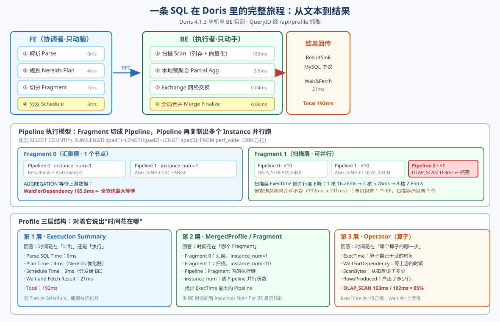
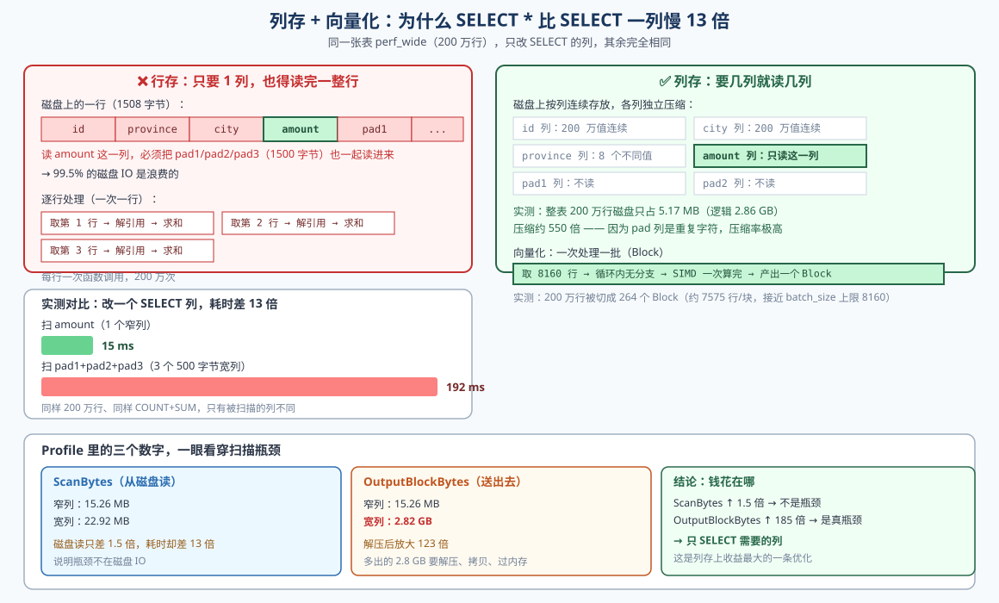

# 第 7 课：查询引擎与执行计划

> 所属阶段：阶段 3《数据导入与查询》｜ 水平：零基础 ｜ 本课知识点：MPP 执行流程、向量化执行与列存、EXPLAIN 与 Profile
> 故事情节：数据进来了，一条 SQL 却时快时慢——主角决定不再靠猜，去看它到底在干什么

## 🎯 本课目标

- 画出一条 SQL 从 FE 解析到 BE 并行执行的完整流程
- 解释为什么列存 + 向量化能充分发挥 CPU 能力
- 对着 Profile 说出"时间花在哪个算子、为什么"

## 📦 开始之前：本课的实验环境

本课所有实测数据都来自本机 **Doris 4.1.3 单机单 BE**（容器 `doris-learn`，9030/8030/8040）。

如果你想跟着跑一遍，先确认环境：

```bash
# Windows 端没有 docker 命令，一律用 WSL 包装执行
wsl -d Ubuntu -- bash -lc "docker ps --format '{{.Names}}\t{{.Status}}'"
```

应看到 `doris-learn` 状态为 `Up ... (healthy)`。若容器已停：

```bash
wsl -d Ubuntu -- bash -lc "docker start doris-learn"
```

连接 Doris：

```bash
wsl -d Ubuntu -- bash -lc "docker exec doris-learn mysql -h 127.0.0.1 -P 9030 -uroot shop"
```

> **本课要新建一张实验表 `perf_wide`（200 万行）**，第四幕会给出完整的建表与造数语句。
> 这张表数据是造出来的，随时可删，不影响课 1–6 的任何内容。

---

## 第一幕：起源与场景引入

### 一个再普通不过的周一早上

课 6 结束时，你终于把数据都弄进 Doris 了。MySQL 的存量订单走了 Broker Load，Kafka 的实时订单挂上了 Routine Load，一切都跑得很顺。

然后业务方在群里 @ 你：

> "那个省份销售报表，怎么有时候秒出，有时候要转半天圈？"

你打开查询框，跑了一遍：

```sql
SELECT province, COUNT(*) AS c, ROUND(SUM(amount), 2) AS s
FROM orders GROUP BY province ORDER BY s DESC LIMIT 5;
```

**236 毫秒**，秒出。

你又跑了一遍昨天那个"查一下明细"的查询：

```sql
SELECT * FROM orders WHERE province = '广东' LIMIT 100;
```

也很快。

然后你试着把所有列都统计一下：

```sql
SELECT COUNT(*),
       SUM(LENGTH(pad1) + LENGTH(pad2) + LENGTH(pad3))
FROM orders;
```

转圈。

**同一张表，同样的 200 万行数据，为什么耗时能差十几倍？**

### 你现在的处境

此时的你，手里有三样东西：

1. 一条 SQL 文本
2. 一个耗时数字（236ms）
3. 一堆猜测

而猜测是最不值钱的。你可能会想：

- "是不是数据倾斜了？"（课 4 讲过分桶倾斜）
- "是不是索引没建？"（课 5 讲过索引）
- "是不是内存不够？"

这些想法每一个都**可能**对，但你没有任何证据。而更糟的是——**每一个猜错的方向，都要花掉你半天时间去验证**。

### 主角的新工具：不再猜，去看

这一课，你要拿到两个工具，它们能把"耗时 236ms"这个笼统的数字，拆成一张**时间花销清单**：

| 工具 | 回答的问题 | 什么时候用 |
|------|-----------|-----------|
| **EXPLAIN** | Doris **打算**怎么执行这条 SQL | 写 SQL 时、怀疑走错索引时 |
| **Profile** | Doris **实际**执行时，每一步花了多久 | 查询真的慢了，要定位时 |

一句话区分：**EXPLAIN 是计划，Profile 是账单。**

计划告诉你"我打算怎么花钱"，账单告诉你"钱到底花在哪了"。优化查询这件事，永远要看账单。

> 💡 **本课的一句话结论**（先剧透，后面用实验证明）：
> 一条 SQL 的耗时，几乎总是集中在**某一个算子的某一步**上。
> 找到它，你就完成了 90% 的优化工作。剩下的 10% 才是改 SQL、加索引、调参数。

---

## 第二幕：认知冲突

### 第一次冲击：改一个列名，耗时差 13 倍

为了把问题说清楚，我建了一张实验表。它很简单——200 万行，8 个字段：

```sql
CREATE TABLE perf_wide (
  id BIGINT NOT NULL,
  province VARCHAR(32) NOT NULL,
  city VARCHAR(32) NOT NULL,
  amount DECIMAL(10,2) NOT NULL,
  pad1 VARCHAR(500) NOT NULL DEFAULT '',
  pad2 VARCHAR(500) NOT NULL DEFAULT '',
  pad3 VARCHAR(500) NOT NULL DEFAULT '',
  dt DATE NOT NULL
)
DUPLICATE KEY(id)
DISTRIBUTED BY HASH(id) BUCKETS 8
PROPERTIES ('replication_num' = '1');
```

`pad1`/`pad2`/`pad3` 是三个**填充列**，每行各存 500 个重复字符（比如 500 个 `x`）。它们没有任何业务含义，唯一的作用就是**把行撑大**。

现在做一件小事：**只改 SELECT 后面的列名，其余一字不动。**

**查询 A：只扫 `amount` 一个窄列**

```sql
SELECT COUNT(*), ROUND(SUM(amount), 2) FROM perf_wide;
```

**查询 B：扫三个 500 字节的宽列**

```sql
SELECT COUNT(*), ROUND(SUM(LENGTH(pad1) + LENGTH(pad2) + LENGTH(pad3)), 2) FROM perf_wide;
```

两次都跑 3 遍，关掉 SQL Cache（`SET GLOBAL enable_sql_cache = false`，避免第二次命中缓存）：

| 查询 | 第 1 次 | 第 2 次 | 第 3 次 | 中位 |
|------|--------|--------|--------|------|
| A：扫 `amount`（1 列） | 13 ms | 15 ms | 15 ms | **15 ms** |
| B：扫 3 个 500B 宽列 | 192 ms | 190 ms | 193 ms | **192 ms** |

**13 倍。**

两个查询：
- 扫的是同一张表
- 读的是同样的 200 万行
- 做的是同样的 `COUNT(*) + SUM`
- 唯一的区别，是 SELECT 后面那几个字符

如果你的直觉是"扫的列越多当然越慢"，那你的直觉是对的——但**慢在哪**，直觉帮不了你。

### 第二次冲击：从磁盘读的数据只多了 1.5 倍

打开 Profile，看扫描算子 `OLAP_SCAN_OPERATOR` 的两个关键计数：

| 指标 | 查询 A（窄列） | 查询 B（宽列） | 倍数 |
|------|--------------|--------------|------|
| `ScanBytes`（从磁盘读了多少） | 15.26 MB | 22.92 MB | **1.5 倍** |
| `OutputBlockBytes`（送出去多少） | 15.26 MB | **2.82 GB** | **185 倍** |
| `ExecTime`（扫描算子耗时） | 3.1 ms | **163.7 ms** | **52 倍** |
| `Total`（整条查询） | 15 ms | **192 ms** | **13 倍** |

看清楚这组数字，它是本课的核心：

**从磁盘读进来的数据，只多了 1.5 倍；但送出去的数据，多了 185 倍。**

换句话说：**瓶颈根本不在磁盘 IO。**

那 2.82 GB 是怎么来的？

- `pad1`/`pad2`/`pad3` 每列 500 字节 × 3 列 = 1500 字节/行
- 200 万行 × 1500 字节 = **3 GB**

而磁盘上只存了 22.92 MB —— 因为重复字符的压缩率极高。所以真正的开销链条是：

```
磁盘读 22.92 MB（压缩态）
   ↓ 解压
内存里展开成 2.82 GB
   ↓ 拷贝进 Block
   ↓ 传给下游算子
   ↓ 下游还要再读一遍做 LENGTH()
```

**钱花在解压、拷贝、传递上，不是花在读盘上。**

### 一个反直觉的旁证：压缩有多狠

顺手看一眼这张表占多少空间：

```sql
SHOW DATA FROM perf_wide;
```

```text
TableName    Size       RowCount
perf_wide    5.170 MB   2000000
Total        5.170 MB
```

200 万行，逻辑上应该有多大？

- 三个 pad 列：1500 字节/行 × 200 万 = 2.86 GB
- 加上 id、province、city、amount、dt，总共约 2.9 GB

**磁盘实际占用：5.17 MB。压缩了约 550 倍。**

这不是巧合，是列存设计的必然：

1. **同一列的数据类型相同、取值相似** → 压缩算法（字典编码、RLE、LZ4）能发挥到极致
2. `pad1` 每行都是 500 个 `x`，RLE 一句话就描述完了
3. 如果是行存，`x` 和 `y` 和 `z` 交错排列，压缩算法无从下手

### 认知冲突的核心

到这里，你脑子里应该有两个问号：

**问号一**：既然扫描是瓶颈，那我把并行度调大，让更多 CPU 核一起扫，不就快了吗？

**问号二**：同样是扫描，为什么读 1.5 倍的数据却慢了 52 倍？多出来的时间到底被谁吃了？

这两个问题，第三幕逐一拆开。

> ⚠️ **先说一个本课会反复出现的陷阱**：本机是**单机单 BE**。
> 单机环境下，很多"分布式优化"测不出效果——因为根本没有多台机器可以并行。
> 本课会明确标出哪些结论是**单机实测**、哪些是**多机才能验证的原理**，不会拿单机数据冒充分布式结论。

---

## 第三幕：层层揭示

### 知识点 1：MPP 执行流程

> 本知识点关键点：FE 解析 → 规划 → 分发 Fragment 到 BE、BE 间数据交换（Exchange）、Pipeline 执行模型

#### 1.1 先建立一个心智模型：FE 是大脑，BE 是手

Doris 的架构在第 2 课讲过，这里从**执行**的角度重新看一遍：

| 组件 | 角色 | 它做的事 | 它不做的事 |
|------|------|---------|-----------|
| **FE**（Frontend） | 协调者 / 大脑 | 解析 SQL、生成计划、切分任务、分发给 BE、收集结果 | 不碰任何一条数据 |
| **BE**（Backend） | 执行者 / 手 | 读数据、做过滤、做聚合、做 Join、互相交换中间结果 | 不做优化决策 |

**关键认知：FE 从头到尾没有读过一行数据。**

它只是在说："BE1 你扫第 1、3、5 个 tablet，BE2 你扫第 2、4、6 个 tablet，扫完按 province 哈希交换一下，最后汇总到我这儿。"

#### 1.2 一条 SQL 的完整旅程

回到那条聚合查询，我们打开 Profile 的 `Execution Summary` 段，看看 FE 报告的时间线：

```text
Execution Summary:
   - Workload Group: normal
   - Parse SQL Time: 0ms
   - Plan Time: 4ms
     - Nereids Analysis Time: 1ms
     - Nereids Rewrite Time: 1ms
     - Nereids Translate Time: 1ms
     - Nereids Distribute Time: 0ms
   - Schedule Time: 3ms
     - Fragment Assign Time: 0ms
     - Fragment Serialize Time: 1ms
     - Fragment RPC Phase1 Time: 2ms
     - Fragment RPC Phase2 Time: 0ms
     - Fragment RPC Count: 2
   - Wait and Fetch Result Time: 21ms
   - Fetch Result Time: 19ms
   - Total: 28ms
   - Total Instances Num: 11
   - Instances Num Per BE: 127.0.0.1:8060:11
   - Parallel Fragment Exec Instance Num: 10
```

把它画成一张流程图：



**FE 侧（左半部分，共 7ms）**

1. **Parse SQL（0ms）**：把 SQL 文本解析成语法树（AST）。检查语法错误就在这步——你写 `SELEC * FROM t` 会在这里挂掉。
2. **Plan（4ms）**：Doris 4.x 的优化器叫 **Nereids**（读作 /nəˈreɪ.ɪdz/，希腊神话里的海仙女）。它做三件事：
   - **Analysis**（1ms）：把表名、列名解析成内部 ID，检查列是否存在、类型是否匹配
   - **Rewrite**（1ms）：规则改写，比如常量折叠（`1+1` 直接算成 `2`）、谓词下推
   - **Translate**（1ms）：把逻辑计划翻译成物理计划，决定用 Hash Join 还是 Nest Loop Join、用哪种聚合方式
3. **Schedule（3ms）**：把物理计划切成 Fragment，序列化，通过 RPC 发给 BE。`Fragment RPC Count: 2` 表示发了 2 次 RPC（Phase1 建任务、Phase2 启动）。

**BE 侧（右半部分，共 163ms）**

4. **Scan（163ms）**：从磁盘读数据，边读边解压、边做过滤。
5. **Partial Aggregate（3.5ms）**：每个 BE 先在本地做一次预聚合。
6. **Exchange（0.04ms）**：把预聚合结果按 `province` 哈希，发给负责汇聚的节点。
7. **Merge Finalize（0.06ms）**：把各个节点发来的部分结果合并成最终答案。

**回传（21ms）**

8. **Wait and Fetch Result**：FE 从 BE 拉结果，通过 MySQL 协议返回给客户端。

#### 1.3 Fragment：计划是怎么被切开的

看这条 SQL 的 `EXPLAIN` 输出：

```sql
EXPLAIN SELECT province, COUNT(*) AS c, SUM(amount) AS s
FROM perf_wide GROUP BY province;
```

```text
PLAN FRAGMENT 0
  OUTPUT EXPRS:
    province[#13]
    c[#14]
    s[#15]
  PARTITION: HASH_PARTITIONED: province[#10]

  VRESULT SINK
     MYSQL_PROTOCOL

  3:VAGGREGATE (merge finalize)(114)
  |  output: count(partial_count(*)[#12])[#14], sum(partial_sum(amount)[#11])[#15]
  |  group by: province[#10]
  |  
  2:VEXCHANGE
     offset: 0

PLAN FRAGMENT 1
  PARTITION: HASH_PARTITIONED: id[#0]

  STREAM DATA SINK
    EXCHANGE ID: 02
    HASH_PARTITIONED: province[#10]

  1:VAGGREGATE (update serialize)(106)
  |  STREAMING
  |  output: partial_sum(amount[#9])[#11], partial_count(*)[#12]
  |  group by: province[#8]
  |  
  0:VOlapScanNode(98)
     TABLE: shop.perf_wide(perf_wide), PREAGGREGATION: ON
     partitions=1/1 (perf_wide)
     tablets=8/8
     cardinality=2000000, avgRowSize=13.553297, numNodes=1
     final projections: province[#1], amount[#3]
```

**Fragment 是什么？**

Fragment 是**计划中被网络边界切开的一段**。凡是遇到需要跨节点传输数据的地方，就切一刀。

这条 SQL 被切成 2 个 Fragment：

| Fragment | 包含什么 | 在哪跑 | PARTITION 含义 |
|----------|---------|--------|---------------|
| **Fragment 0** | `VAGGREGATE (merge finalize)` + `VRESULT SINK` | 汇聚节点 | `HASH_PARTITIONED: province` —— 按 province 哈希分布 |
| **Fragment 1** | `VOlapScanNode` + `VAGGREGATE (update serialize)` | 所有 BE | `HASH_PARTITIONED: id` —— 按表的分桶键分布 |

**为什么要切？**

因为 `GROUP BY province` 需要把相同 province 的行聚到一起。但数据是按 `id` 分桶散在各台机器上的——`province='广东'` 的行可能在任何一台机器上。

所以必须：
1. 每台机器先在本地聚合一次（Fragment 1 的 `update serialize`）
2. 把本地结果按 `province` 哈希，发给对应的汇聚节点（这就是 **Exchange**）
3. 汇聚节点合并（Fragment 0 的 `merge finalize`）

#### 1.4 两阶段聚合：MPP 的精髓

看 Fragment 1 里那个算子的名字：`VAGGREGATE (update serialize)`，带一个 `STREAMING` 标记。

再看 Fragment 0 里的：`VAGGREGATE (merge finalize)`。

这就是**两阶段聚合**，MPP 系统最重要的优化之一：

```
阶段一（本地预聚合，在各 BE 上并行）
   扫到 200 万行 → 本地按 province 聚合 → 只产出几十行

阶段二（全局合并，在汇聚节点）
   收各家的几十行 → 合并 → 最终 8 行
```

**如果不做预聚合会怎样？** 200 万行原始数据要全部通过网络传给汇聚节点。做了预聚合，网络上跑的只有几十行。

这就是为什么 Profile 里 `EXCHANGE_OPERATOR` 的 `RowsProduced` 是 `sum 10`（10 个 instance 各产 1 行），而不是 200 万。

**⚠️ 注意**：预聚合不是万能的。如果 `GROUP BY` 的列基数极高（比如 `GROUP BY id`，200 万个不同值），本地聚合压不下去多少行，这个优化就失效了。后面第四幕会实测这一点。

#### 1.5 Pipeline 执行模型：Fragment 里还有什么

Fragment 之下还有一层。看 Profile 的 `MergedProfile` 段：

```text
MergedProfile:
     Fragments:
       Fragment 0:
         Pipeline 0(instance_num=1):
           RESULT_SINK_OPERATOR(id=4)
           AGGREGATION_OPERATOR(nereids_id=130)(id=3)
         Pipeline 1(instance_num=1):
           AGGREGATION_SINK_OPERATOR(nereids_id=130)(id=3)
           EXCHANGE_OPERATOR(id=2)
       Fragment 1:
         Pipeline 0(instance_num=10):
           DATA_STREAM_SINK_OPERATOR(dest_id=2)
           AGGREGATION_OPERATOR(nereids_id=122)(id=1)
         Pipeline 1(instance_num=10):
           AGGREGATION_SINK_OPERATOR(nereids_id=122)(id=1)
           LOCAL_EXCHANGE_OPERATOR(PASSTHROUGH)(id=-2)
         Pipeline 2(instance_num=1):
           LOCAL_EXCHANGE_SINK_OPERATOR(PASSTHROUGH)(id=-2)
           OLAP_SCAN_OPERATOR(nereids_id=114. table_name=perf_wide)(id=0)
```

**Pipeline 是什么？**

Pipeline 是 **Fragment 内部的一条执行链**。为什么要再切？因为一个 Fragment 内部也有"阻塞点"——比如 Exchange 的接收端要等发送端，Scan 要等磁盘。

把 Fragment 拆成多条 Pipeline，每条 Pipeline 独立调度，就能：
- 上游 Pipeline 在等磁盘时，下游 Pipeline 可以处理已有的数据
- CPU 不会闲着

**instance_num 是什么？**

`instance_num=10` 表示这条 Pipeline 被**复制了 10 份**，10 份并行跑在不同的执行线程上。

这就是 MPP 里的"并行"——不是 10 台机器，也可以是**1 台机器上的 10 个并行任务**。

Profile 里有两处印证：

```text
- Total Instances Num: 11              ← 总共 11 个执行实例
- Instances Num Per BE: 127.0.0.1:8060:11   ← 全在 1 台 BE 上
- Parallel Fragment Exec Instance Num: 10   ← 并行度 10
```

#### 1.6 层级关系一图收束

```text
Query（一条 SQL）
 └─ Fragment 0（汇聚层：跨节点边界切开）
 │   ├─ Pipeline 0（instance_num=1）  → ResultSink + AGG(merge)
 │   └─ Pipeline 1（instance_num=1）  → AGG_SINK + Exchange
 └─ Fragment 1（扫描层：跨节点边界切开）
     ├─ Pipeline 0（instance_num=10） → DataStreamSink + AGG
     ├─ Pipeline 1（instance_num=10） → AGG_SINK + LocalExchange
     └─ Pipeline 2（instance_num=1）  → LocalExchangeSink + OLAP_SCAN
```

**记忆口诀**：`Query → Fragment → Pipeline → Instance`。

- **Fragment** 是网络边界（跨机器才切）
- **Pipeline** 是调度边界（有阻塞点就切）
- **Instance** 是并行副本（一份代码跑 N 次，处理不同数据）

#### 1.7 一个必须说清的限制：单机单 BE

现在回答第二幕留下的**问号一**："把并行度调大，不就快了吗？"

我们实测一下。用会话变量控制 Pipeline 的并行份数：

```sql
SET parallel_pipeline_task_num = 1;   -- 然后 = 2 / 4 / 8
SELECT COUNT(*), ROUND(SUM(LENGTH(pad1)+LENGTH(pad2)+LENGTH(pad3)), 2)
FROM perf_wide;
```

| `parallel_pipeline_task_num` | 扫描算子 ExecTime | 查询 Total |
|------------------------------|------------------|-----------|
| 1 | 16.26 ms | 216 ms / 199 ms |
| 2 | 9.89 ms | 199 ms / 196 ms |
| 4 | 5.78 ms | 197 ms / 198 ms |
| 8 | 2.85 ms | 198 ms / 191 ms |

**扫描算子的单次 ExecTime 确实降了**：16.26ms → 2.85ms，降了 5.7 倍。

**但查询总耗时几乎没变**：192ms → 191ms。

为什么？看 `instance_num` 那一列：

| 并行度设置 | Profile 里实际的 instance_num |
|-----------|------------------------------|
| 1 | `instance_num=1` |
| 2 | `instance_num=1`, `instance_num=1`, `instance_num=2` |
| 4 | `instance_num=1`, `instance_num=1`, `instance_num=4` |
| 8 | `instance_num=1`, `instance_num=1`, `instance_num=8` |

注意：只有**第三条 Pipeline 的 instance_num 跟着变**，前两条（`RESULT_SINK`、`EXCHANGE`）始终是 1。

更关键的是 **Pipeline 2（含 `OLAP_SCAN_OPERATOR`）的实际数量**。看这条 Pipeline 的 `RowsProduced`：

```text
OLAP_SCAN_OPERATOR:
  - RowsProduced: sum 2.0M (2000000), avg 2.0M (2000000), max 2.0M (2000000), min 2.0M (2000000)
```

`sum` 和 `max` 完全相等 —— 说明**只有 1 个 instance 在干活**，它一个人扫完了全部 200 万行。

对比下游 `LOCAL_EXCHANGE_OPERATOR`：

```text
LOCAL_EXCHANGE_OPERATOR(PASSTHROUGH):
  - RowsProduced: sum 2.0M (2000000), avg 200.0K (200000), max 202.972K, min 194.52K
```

`sum=2.0M`、`avg=200K` —— 说明有 **10 个 instance** 在分担。

**结论**：在本机这种单机单 BE 环境下，扫描层仍然只有一个扫描器在跑。把 `parallel_pipeline_task_num` 调大，只是让**下游的 10 个 instance 各自等得更久、每次拿到的块更小**，总的墙钟时间并没有减少。

> 📌 **这条结论的边界**：
> **"调大并行度不提速"是单机单 BE 的实测结果，不是普遍规律。**
> 在多 BE 集群上，数据分散在不同机器、不同磁盘上，加并行度通常能显著提速。
> 本课诚实标注：单机测不出的是**跨机器的横向扩展能力**，这正是 MPP 的立身之本，只是本机验证不了。

---

### 知识点 2：向量化执行与列存

> 本知识点关键点：一次处理一批（Block）而非一行、SIMD 与 CPU Cache 友好、列存的压缩与编码

#### 2.1 回到那个 13 倍的差距

第二幕留的**问号二**："读 1.5 倍的数据，为什么慢了 52 倍？"

答案在 Profile 的这两个数字里：

```text
查询 A（扫 amount 窄列）
  OLAP_SCAN_OPERATOR:
    - ScanBytes: sum 15.26 MB
    - OutputBlockBytes: sum 15.26 MB
    - ExecTime: avg 3.145ms

查询 B（扫 3 个 500B 宽列）
  OLAP_SCAN_OPERATOR:
    - ScanBytes: sum 22.92 MB
    - OutputBlockBytes: sum 2.82 GB     ← 关键
    - ExecTime: avg 163.682ms          ← 关键
```

**`ScanBytes` 是"从磁盘读进来多少"，`OutputBlockBytes` 是"送给下游多少"。**

| | 窄列 | 宽列 | 倍数 |
|---|---|---|---|
| ScanBytes（磁盘读·压缩态） | 15.26 MB | 22.92 MB | 1.5× |
| OutputBlockBytes（送出·解压态） | 15.26 MB | **2.82 GB** | **185×** |
| ExecTime | 3.1 ms | 163.7 ms | 52× |

窄列查询里这两个数**完全相等**（都是 15.26 MB）——因为 `amount` 是定长数值列，读进来多大就多大。

宽列查询里两个数差了 **123 倍** —— 因为 pad 列在磁盘上是高度压缩的（22.92 MB），解压到内存里就成了 2.82 GB。

**多出来的时间，全都花在"把 22.92 MB 解压成 2.82 GB，再把 2.82 GB 搬进 Block、传给下游"这件事上。**



#### 2.2 列存：为什么只扫 1 列能快这么多

**行存的困境**

假设 `perf_wide` 是行存，一行在磁盘上长这样：

```
[id=1][province='prov_1'][city='city_1'][amount=10.00][pad1='xxx...500个'][pad2='yyy...500个'][pad3='zzz...500个'][dt=2024-01-01]
```

要读 `amount`，磁头必须把整行 1508 字节都读进来，然后丢掉其中 1500 字节。

读 200 万行 = 读了 2.86 GB，实际只用了 15.26 MB 的 `amount`。**浪费 99.5%。**

**列存的做法**

列存把每一列单独存放：

```
id 列：       [1][2][3]...[2000000]           ← 连续存放
province 列： [prov_1][prov_2]...             ← 连续存放
amount 列：   [10.00][11.00]...               ← 连续存放
pad1 列：     ['xxx...']['xxx...']...         ← 连续存放
pad2 列：     ['yyy...']['yyy...']...         ← 连续存放
pad3 列：     ['zzz...']['zzz...']...         ← 连续存放
```

要读 `amount`，就只读 `amount` 那一段。**其他列碰都不碰。**

这就是 `ScanBytes` 只有 15.26 MB 的原因——它真的只读了该读的那一列。

#### 2.3 列存带来的第二个礼物：极高的压缩率

列存不只是"少读数据"，它还让**压缩率暴涨**。

原因很简单：**同一列的数据类型相同、取值模式相似**，压缩算法有充分的发挥空间。

| 列 | 取值特点 | 适用编码 |
|----|---------|---------|
| `province` | 只有 8 个不同值，200 万行反复出现 | **字典编码**：存 8 个词 + 200 万个下标 |
| `pad1` | 每行都是 500 个 `x` | **RLE（游程编码）**：存"x 重复 1 亿次" |
| `amount` | 数值，范围 10–5010 | **位打包 / 差值编码** |
| `id` | 1, 2, 3... 连续递增 | **差值编码**：存 1,1,1,1... |

实测印证：

```sql
SHOW DATA FROM perf_wide;
```

```text
TableName    Size       RowCount
perf_wide    5.170 MB   2000000
```

200 万行、逻辑约 2.9 GB 的数据，**磁盘只占 5.17 MB**。

> 🧮 **算给你看**（记住算法，别记数字）
> 逻辑大小 ≈ 200 万 × 1508 字节 ≈ 2.86 GB
> 磁盘占用 = 5.17 MB
> 压缩比 ≈ 2860 ÷ 5.17 ≈ **553 倍**
>
> 这个 550 倍是**刻意构造的极端值**（pad 列全是重复字符）。
> 真实业务表通常能压到 **3–10 倍**——这已经很可观了：
> 一张 1 TB 逻辑数据的表，磁盘可能只占 100–300 GB。

**如果是行存，`x`、`y`、`z` 交替出现，RLE 完全失效，字典编码也无从下手** —— 这就是为什么列存和分析型负载是天生一对。

#### 2.4 向量化：一次处理一批，而不是一行

列存解决了"读什么"的问题，向量化解决"怎么算"的问题。

**逐行处理（行式执行）**

传统数据库的执行方式是"一次一行"：

```c
for (int i = 0; i < 2000000; i++) {
    Row r = get_next_row();          // 虚函数分发，行指针解引用
    sum += r.get_decimal("amount");  // 再解引用，类型转换
}
```

每一行都要走一遍完整的函数调用链。200 万行 = 200 万次函数调用。

更要命的是 CPU 的两个特性被浪费了：

1. **CPU Cache 失效**：每行 1508 字节，Cache Line 只有 64 字节，一次 Cache 命中只能取到行的一小部分，下一行又是 Cache Miss
2. **SIMD 无法使用**：SIMD（单指令多数据流）要求数据是连续的、同类型的，一行里 `int`、`varchar`、`decimal` 混着放，SIMD 用不上

**向量化执行（批处理）**

向量化引擎的做法是"一次一批"：

```c
Block block = scan_next_block();   // 一次拿 8160 行，amount 列是一段连续内存
for (int i = 0; i < block.rows; i++) {
    sum += block.amount[i];        // 紧凑循环，无虚函数调用
}
// 或者更进一步：编译器自动 SIMD 化，一次算 4/8 个
```

Doris 里的这个"批"叫 **Block**（在代码里是 `vectorized::Block` 类）。

Profile 里能看到它：

```text
查询 A（窄列，200 万行）
  OLAP_SCAN_OPERATOR:
    - BlocksProduced: sum 264
    - RowsProduced: sum 2.0M (2000000)
    - MaxOutputBlockBytes: sum 63.75 KB
```

**200 万行被切成了 264 个 Block**，平均每块：

```
2000000 ÷ 264 ≈ 7575 行/块
```

这个数字很接近配置项 `batch_size` 的默认值：

```sql
SELECT @@batch_size;
-- 8160
```

再看宽列查询：

```text
查询 B（宽列，200 万行）
  OLAP_SCAN_OPERATOR:
    - BlocksProduced: sum 368
    - RowsProduced: sum 2.0M (2000000)
    - MaxOutputBlockBytes: sum 8.00 MB
    - OutputBlockBytes: sum 2.82 GB
```

368 块，每块最大 **8.00 MB** —— 这个数字是 `preferred_block_size_bytes` 的默认值：

```sql
SELECT @@preferred_block_size_bytes;
-- 8388608   (= 8 MB)
```

**Block 的切分规则**：行数达到 `batch_size`（8160）**或**字节数达到 `preferred_block_size_bytes`（8 MB），哪个先到就切一刀。

- 窄列：行数先到 → 7575 行/块，块只有 63.75 KB
- 宽列：字节先到 → 块塞满 8 MB 就切，所以切了 368 块（比 264 多）

#### 2.5 向量化为什么快：三个原因

| 原因 | 说明 |
|------|------|
| **摊薄函数调用开销** | 一次函数调用处理 8160 行，而不是一行一次。调用次数从 200 万降到 245 |
| **CPU Cache 友好** | 一列的 8160 个值在内存里连续存放，顺序访问，Cache 命中率极高 |
| **SIMD 可用** | 同类型数据连续排列，编译器能自动向量化，一条指令同时算 4–8 个值 |

**一个重要的诚实说明**：

我试着在本机把向量化引擎关掉做对比：

```sql
SET GLOBAL enable_vectorized_engine = false;
-- 跑 SELECT province, COUNT(*), SUM(amount) FROM perf_wide GROUP BY province;
-- 关：20ms / 18ms / 15ms
-- 开：18ms / 17ms / 17ms
```

**几乎没差别。**

同样地，扫宽列的对比：

```text
关向量化：191ms
开向量化：189ms / 214ms
```

**也没有差别。**

为什么测不出来？两个原因：

1. **Doris 4.x 已经全面向量化**，`enable_vectorized_engine` 是个历史遗留开关，现代版本里即使置为 false，很多执行路径仍走向量化代码。Profile 里两种设置下算子名都叫 `OLAP_SCAN_OPERATOR` / `AGGREGATION_OPERATOR`，看不出区别。
2. **本机是单机单 BE**，瓶颈在扫描和解压这类 IO/内存操作上，不在 CPU 计算上。向量化优化的主要是 CPU 计算密集的部分。

> 📌 **本课的诚实标注**：
> **"向量化能快多少"这件事，本机测不出来。**
> 上面讲的 Block 机制、Cache 友好、SIMD，是**原理层面**的解释，并有 Profile 里的 `BlocksProduced` / `batch_size` / `preferred_block_size_bytes` 作为**机制存在的证据**。
> 但"关掉向量化会慢多少"这个**性能对比，本机给不出可信数据**——我不会编一个数字给你。
> 如果你要在生产环境评估，需要在多 BE 集群、CPU 密集型的查询上测。

#### 2.6 列存 + 向量化，为什么是天生一对

把两件事连起来看：

```
列存：把一列的值在磁盘上连续存放
  ↓
读取时：一列的值在内存里也连续
  ↓
向量化：把连续的一批值装进 Block，用紧凑循环 + SIMD 处理
```

**列存给向量化提供了"连续的同类型数据"，向量化把这种数据布局的价值榨干。**

如果换成行存：
- 一行的不同列在内存里是挨着的，但**同一列的不同行**是分离的
- 想凑齐 8160 个 `amount` 值，要做 8160 次指针跳转 + 类型转换
- 向量化的优势荡然无存

这就是为什么所有现代分析型数据库（Doris、ClickHouse、StarRocks、DuckDB）都是**列存 + 向量化**的组合——不是巧合，是必然。

---

### 知识点 3：EXPLAIN 与 Profile

> 本知识点关键点：EXPLAIN 的三种形态（逻辑计划 / 物理计划 / 执行计划）、Profile 的算子耗时树、怎么读 Fragment 与 Instance 层级

#### 3.1 EXPLAIN：三种形态

Doris 的 `EXPLAIN` 有几个变体，各自回答不同问题：

| 写法 | 输出什么 | 什么时候用 |
|------|---------|-----------|
| `EXPLAIN <sql>` | **物理计划**（Nereids 优化后的执行方案） | 最常用，看走哪个索引、扫多少分区 |
| `EXPLAIN VERBOSE <sql>` | 物理计划 + `TupleDescriptor` 明细 | 需要看列的内部 ID、类型、投影细节时 |
| `EXPLAIN GRAPH <sql>` | 图形化的算子树（ASCII 框线） | 给同事讲、贴到文档里 |

> ⚠️ **实测提醒**：`EXPLAIN OPTIMIZED` 在 Doris 4.1.3 上会报错：
> ```
> ERROR 1105 (HY000): Only explain plan can use plan type: OPTIMIZED
> ```
> 用 `EXPLAIN` 或 `EXPLAIN VERBOSE` 即可。

**示例：同一条 SQL 的三种形态**

```sql
EXPLAIN SELECT province, COUNT(*) AS c
FROM perf_wide GROUP BY province ORDER BY c DESC LIMIT 3;
```

默认形态（物理计划）：

```text
PLAN FRAGMENT 0
  OUTPUT EXPRS:
    province[#13]
    c[#14]
  PARTITION: UNPARTITIONED

  VRESULT SINK
     MYSQL_PROTOCOL

  5:VMERGING-EXCHANGE
     offset: 0
     limit: 3

PLAN FRAGMENT 1
  PARTITION: HASH_PARTITIONED: province[#9]

  STREAM DATA SINK
    EXCHANGE ID: 05
    UNPARTITIONED
IS_MERGE: true

  4:VTOP-N(170)
  |  order by: c[#14] DESC
  |  algorithm: heap sort
  |  local merge sort
  |  merge by exchange
  |  offset: 0
  |  limit: 3
  |  
  3:VAGGREGATE (merge finalize)(166)
  |  output: count(partial_count(*)[#10])[#12]
  |  group by: province[#9]
  |  cardinality=1
  |  
  2:VEXCHANGE
     offset: 0

PLAN FRAGMENT 2
  PARTITION: HASH_PARTITIONED: id[#0]

  STREAM DATA SINK
    EXCHANGE ID: 02
    HASH_PARTITIONED: province[#9]

  1:VAGGREGATE (update serialize)(106)
  |  STREAMING
  |  output: partial_count(*)[#12]
  |  group by: province[#8]
  |  
  0:VOlapScanNode(98)
     TABLE: shop.perf_wide(perf_wide), PREAGGREGATION: ON
     partitions=1/1 (perf_wide)
     tablets=8/8
     cardinality=2000000, avgRowSize=13.553297, numNodes=1
     final projections: province[#1]
```

`EXPLAIN GRAPH` 形态（同样内容，画成框线）：

```text
       ┌─────────────────┐
       │[3: ResultSink]  │
       │[Fragment: 0]    │
       │VRESULT SINK     │
       │   MYSQL_PROTOCOL│
       └─────────────────┘
                └┐
                 │
     ┌──────────────────────┐
     │[5: VMERGING-EXCHANGE]│
     │[Fragment: 0]         │
     └──────────────────────┘
                ┌┘
                │
  ┌─────────────────────────────┐
  │[5: DataStreamSink]          │
  │[Fragment: 1]                │
  │  EXCHANGE ID: 05            │
  └─────────────────────────────┘
                 │
          ┌─────────────┐
          │[4: VTOP-N]  │
          │[Fragment: 1]│
          └─────────────┘
                 └┐
 ┌────────────────────────────────┐
 │[3: VAGGREGATE (merge finalize)]│
 │[Fragment: 1]                   │
 └────────────────────────────────┘
                  │
          ┌──────────────┐
          │[2: VEXCHANGE]│
          │[Fragment: 1] │
          └──────────────┘
                 ┌┘
       ┌───────────────────┐
       │[2: DataStreamSink]│
       │[Fragment: 2]      │
       │  HASH_PARTITIONED │
       └───────────────────┘
                 └┐
┌──────────────────────────────────┐
│[1: VAGGREGATE (update serialize)]│
│[Fragment: 2]                     │
│STREAMING                         │
└──────────────────────────────────┘
                  │
 ┌────────────────────────────────┐
 │[0: VOlapScanNode]              │
 │[Fragment: 2]                   │
 │TABLE: shop.perf_wide(perf_wide)│
 └────────────────────────────────┘
```

#### 3.2 EXPLAIN 里最该看的 5 个字段

对着上面那份输出，这 5 个字段是判断"计划好不好"的关键：

| 字段 | 出现在哪 | 怎么读 | 不好长什么样 |
|------|---------|--------|-------------|
| `TABLE:` | `VOlapScanNode` | 扫哪张表、走哪个索引 | 走了全表扫而你有索引 |
| `PREDICATES:` | `VOlapScanNode` | 过滤条件下推了吗 | 条件没下推 → 多读数据 |
| `partitions=N/M` | `VOlapScanNode` | 裁剪比例 | `365/365` → 分区没裁剪 |
| `tablets=N/M` | `VOlapScanNode` | 分桶裁剪 | `8/8` 但有等值条件 → 分桶键选错 |
| `cardinality=` | 各算子 | 预估行数 | 与实际差 10 倍以上 → 统计信息过期 |

**实测：谓词下推 + 分桶裁剪**

```sql
EXPLAIN SELECT province, COUNT(*) FROM orders WHERE province = '广东' GROUP BY province;
```

```text
  0:VOlapScanNode(122)
     TABLE: shop.orders(orders), PREAGGREGATION: ON
     PREDICATES: (province[#1] = '广东')
     partitions=1/1 (orders)
     tablets=1/8, tabletList=1788336157480
     cardinality=21500000, avgRowSize=20.74784, numNodes=1
     final projections: province[#1]
```

三个信息：

1. **`PREDICATES: (province[#1] = '广东')`** —— 过滤条件下推到了扫描算子，边扫边过滤，不会把 2150 万行全读出来再过滤
2. **`tablets=1/8`** —— `orders` 表按 `province` 分了 8 个桶，等值条件命中了其中 1 个桶，**扫 1/8 的数据**
3. **`avgRowSize=20.74784`** —— 只扫 `province` 一列，预估每行 20.7 字节（对比全表扫描的 `avgRowSize=55.09342`，少了 62%）

> 💡 这就是课 4 讲的分区分桶裁剪、课 5 讲的索引，在 EXPLAIN 里的样子。
> 本课不重复讲，但你要知道：**优化是否生效，最终都要回到 EXPLAIN 的这几个字段上验证。**

#### 3.3 Profile：怎么打开

**第一步：开启 Profile 采集**

```sql
SET GLOBAL enable_profile = true;
```

> ⚠️ **必须设置，否则抓不到**。Doris 4.1.3 的默认值是 `false`：
> ```sql
> SHOW VARIABLES LIKE 'enable_profile';
> -- Variable_name: enable_profile   Value: false   Default_Value: false
> ```
> 也可以只对当前会话开：`SET enable_profile = true;`

**第二步：跑你的查询**

```sql
SELECT province, COUNT(*) AS c, ROUND(SUM(amount),2) AS s
FROM perf_wide GROUP BY province ORDER BY s DESC LIMIT 5;
```

**第三步：列出最近的查询，找到 QueryID**

```sql
SHOW QUERY PROFILE '/';
```

```text
Profile ID                          Task Type  Start Time          End Time            Total  Task State  ...  Sql Statement
7d742c4ac3974d93-981c762a91fe5b50   QUERY      2026-09-02 10:40:40 2026-09-02 10:40:40 214ms  OK          ...  SELECT province, COUNT(*) AS c FROM perf_wide GROUP BY province LIMIT 3
```

**第四步：抓 Profile 正文 —— 这一步有坑**

直觉上你会写：

```sql
SHOW QUERY PROFILE '/7d742c4ac3974d93-981c762a91fe5b50';
```

**但它只会把列表再打一遍，不显示 Profile 正文。** 我试了 5 种写法都无效：

| 尝试的写法 | 结果 |
|-----------|------|
| `SHOW QUERY PROFILE '/<QID>'` | 只列目录 |
| `SHOW QUERY PROFILE '/<QID>/'` | 只列目录 |
| `SHOW QUERY PROFILE '/<QID>/0'` | 只列目录 |
| `SHOW QUERY PROFILE '/<QID>/Fragment 0'` | 只列目录 |
| `SHOW PROFILE '/<QID>'` | 语法错误 |

**能用的方法：走 FE 的 HTTP API**

```bash
docker exec doris-learn curl -s -u root: \
  "http://127.0.0.1:8030/api/profile?query_id=<QID>"
```

返回的是 JSON，`data.profile` 字段里是 Profile 全文（`\n` 被转义了）。在容器里没有 `python3`，用 `sed` 处理：

```bash
docker exec doris-learn curl -s -u root: \
  "http://127.0.0.1:8030/api/profile?query_id=$QID" \
  | sed -e 's/\\n/\n/g' -e 's/\\"/"/g' -e 's/^.*"profile":"//' -e 's/"}}$//'
```

> 💡 **顺带一个省事的写法**：FE 还有一个 `/rest/v1/query_profile/<QID>` 接口，返回的是 HTML（`&nbsp;` 转义），不如 `/api/profile` 好用。
> 另外，浏览器打开 `http://<FE_IP>:8030` 的 Web UI，在 **QueryProfile** 页面也能直接看，格式更友好。

**第五步：按 SQL 文本找 QID（避免被探针查询干扰）**

mysql 客户端每次连接都会发一条 `select @@version_comment limit 1` 探针，它会排在你目标查询的**前面**。如果你直接取列表第一行，拿到的是探针的 Profile。

正确做法是**按 SQL 文本过滤**：

```bash
QID=$(grep 'GROUP BY province' /tmp/prof_list.txt | grep -oE '[0-9a-f]{16}-[0-9a-f]{16}' | head -1)
```

> 📌 课 5 时 `SHOW QUERY PROFILE '/'` 返回空，就是因为没开 `enable_profile`。
> 本课已验证：设置后能稳定抓到，单条 Profile 正文可达 **2000+ 行**。

#### 3.4 Profile 的三层结构

一份完整的 Profile 分三大段，从粗到细：

```
┌─ Summary ────────────────────────────────
│  Profile ID / Task State / Total / Sql Statement
│
├─ Execution Summary ──────────────────────   第 1 层
│  Parse / Plan / Schedule / Fetch 各阶段耗时
│
├─ MergedProfile ──────────────────────────   第 2 层
│  Fragments:
│    Fragment 0:
│      Pipeline 0(instance_num=N):
│        OPERATOR_A:
│          CommonCounters: ExecTime / RowsProduced / ...   第 3 层
│          CustomCounters: ScanBytes / HashTableSize / ...
│
└─ Appendix ───────────────────────────────
   PhysicalPlan: Nereids 的物理计划树
```

**第 1 层 · Execution Summary —— 时间花在"计划"还是"执行"**

```text
Execution Summary:
   - Parse SQL Time: 0ms
   - Plan Time: 4ms
   - Schedule Time: 3ms
   - Wait and Fetch Result Time: 21ms
   - Total: 28ms
   - Total Instances Num: 11
   - Instances Num Per BE: 127.0.0.1:8060:11
   - Parallel Fragment Exec Instance Num: 10
```

这组数字回答：**如果 `Plan Time` 很大（比如几百毫秒），瓶颈在优化器，不在数据。**

常见情况：
- `Plan Time` 大 → SQL 太复杂（几十张表 Join）、统计信息过期
- `Schedule Time` 大 → BE 数量多、Fragment 切得太碎
- `Wait and Fetch Result` 大 → 结果集太大，或者客户端拉得慢
- `Instances Num Per BE` 分布不均 → 数据倾斜（课 4 讲过）

**第 2 层 · MergedProfile / Fragment / Pipeline —— 时间花在哪个 Fragment**

```text
MergedProfile:
     Fragments:
       Fragment 0:
         Pipeline 0(instance_num=1): ...
         Pipeline 1(instance_num=1): ...
       Fragment 1:
         Pipeline 0(instance_num=10): ...
         Pipeline 1(instance_num=10): ...
         Pipeline 2(instance_num=1): ...
```

这层回答：**哪个 Fragment 最慢？它的 instance_num 合理吗？**

多 BE 环境下还要看 `Instances Num Per BE`——如果某台 BE 分到的 instance 特别多，说明**数据倾斜**。

**第 3 层 · Operator —— 时间花在哪个算子的哪一步**

这是最细的一层，也是定位问题的终点：

```text
OLAP_SCAN_OPERATOR(nereids_id=114. table_name=perf_wide(perf_wide))(id=0):
   - PlanInfo
      - TABLE: shop.perf_wide(perf_wide), PREAGGREGATION: ON
      - partitions=1/1 (perf_wide)
      - tablets=8/8
      - cardinality=2000000, avgRowSize=13.553297, numNodes=1
      - projections: pad1, pad2, pad3
   CommonCounters:
      - BlocksProduced: sum 368
      - ExecTime: avg 163.682ms          ← 自己干活的时间
      - MemoryUsage: sum 102.84 MB
      - OutputBlockBytes: sum 2.82 GB
      - RowsProduced: sum 2.0M (2000000)
      - WaitForDependency[OLAP_SCAN_OPERATOR_DEPENDENCY]Time: avg 158.989ms
   CustomCounters:
      - ScanBytes: sum 22.92 MB
      - ScanRows: sum 2.0M (2000000)
```

#### 3.5 算子指标怎么读：两个最关键的时间

每个算子都有两个时间指标，**读反了就会得出完全错误的结论**：

| 指标 | 含义 | 大说明什么 |
|------|------|-----------|
| `ExecTime` | 这个算子**自己干活**花了多久 | 我自己慢，我该优化 |
| `WaitForDependency[...]Time` | 这个算子**等上游数据**等了多久 | 上游慢，别找我 |

**判据**：

- `ExecTime` 大、`Wait` 小 → **瓶颈在这个算子本身**
- `ExecTime` 小、`Wait` 大 → **瓶颈在它的上游**，继续往上看

**实测案例：宽列扫描查询的完整耗时链**

```text
并行度=1 时：
  OLAP_SCAN_OPERATOR:              ExecTime = 196.378ms   ← 自己慢
  AGGREGATION_SINK_OPERATOR(id=1): ExecTime = 15.600ms
  AGGREGATION_OPERATOR(id=1):      ExecTime = 11.739us
  EXCHANGE_OPERATOR:               ExecTime = 63.855us
  RESULT_SINK_OPERATOR:            ExecTime = 134.959us

  WaitForDependency[AGGREGATION_OPERATOR_DEPENDENCY]Time = 228.913ms  ← 等扫描
  WaitForDependency[OLAP_SCAN_OPERATOR_DEPENDENCY]Time   = 191.921ms
```

读法：

1. `OLAP_SCAN_OPERATOR` 的 `ExecTime = 196ms`，占 `Total 236ms` 的 **83%** → **扫描就是瓶颈**
2. 下游 `AGGREGATION_OPERATOR` 的 `WaitForDependency = 228ms` → 它在干等扫描，不是它慢
3. 其他算子的 `ExecTime` 都是微秒级 → 可以忽略

**结论：要优化这条 SQL，唯一的着力点是减少扫描的数据量（少扫列、加过滤、加索引），调聚合参数毫无意义。**

#### 3.6 常用算子对照表

| 算子名 | 干什么 | 出问题时的典型症状 |
|--------|--------|-------------------|
| `OLAP_SCAN_OPERATOR` | 从磁盘扫数据 | `ExecTime` 大 → 扫太多行/列 |
| `AGGREGATION_SINK_OPERATOR` | 聚合的写入端（构建哈希表） | `MemoryUsageHashTable` 大 → 分组基数太高 |
| `AGGREGATION_OPERATOR` | 聚合的输出端（产出结果） | `WaitForDependency` 大 → 上游慢 |
| `EXCHANGE_OPERATOR` | 跨节点接收数据 | `RowsProduced` 巨大 → 预聚合没生效 |
| `DATA_STREAM_SINK_OPERATOR` | 跨节点发送数据 | `OverallThroughput` 低 → 网络瓶颈 |
| `LOCAL_EXCHANGE_OPERATOR` | 节点内部交换 | `MemoryUsagePeak` 大 → 缓冲堆积 |
| `HASH_JOIN_OPERATOR` | Hash Join | `ExecTime` 大 → 大表 Join（课 8 详讲） |
| `RESULT_SINK_OPERATOR` | 结果返回客户端 | `ExecTime` 大 → 结果集太大 |

**CustomCounters 里的私货**（不同算子有不同的专属指标）：

| 指标 | 出现在哪 | 说明 |
|------|---------|------|
| `ScanBytes` / `ScanRows` | Scan | 从磁盘读了什么 |
| `MemoryUsageHashTable` | Aggregation | 聚合哈希表占多少内存 |
| `HashTableSize` | Aggregation | 哈希表里有多少个分组 |
| `RuntimeFilterInfo` | Scan（Join 时） | Runtime Filter 生效情况 |
| `OverallThroughput` | DataStreamSink | 网络吞吐 |

#### 3.7 Runtime Filter：EXPLAIN 里能看到的优化

看这条 Join 查询的 EXPLAIN：

```sql
EXPLAIN SELECT a.province, COUNT(*)
FROM perf_wide a JOIN perf_wide b ON a.id = b.id
WHERE b.province = 'prov_0' GROUP BY a.province;
```

```text
  2:VHASH JOIN(354)
  |  join op: INNER JOIN(COLOCATE[])[]
  |  equal join conjunct: (id[#17] = id[#8])
  |  runtime filters: RF000[min_max] <- id[#8](259999/262144/1048576), RF001[in_or_bloom] <- id[#8](259999/262144/1048576)
  |  
  |----0:VOlapScanNode(342)
  |       TABLE: shop.perf_wide(perf_wide), PREAGGREGATION: ON
  |       PREDICATES: (province[#1] = 'prov_0')
  |       tablets=8/8
  |    
  1:VOlapScanNode(337)
     TABLE: shop.perf_wide(perf_wide), PREAGGREGATION: ON
     runtime filters: RF000[min_max] -> id[#9], RF001[in_or_bloom] -> id[#9]
```

`runtime filters` 这一行说的是：

- 右边（被 Join 的表 `b`）先扫，条件是 `province='prov_0'`，扫出 25 万行
- 扫描过程中，把 `id` 的**取值范围**（min_max）和**布隆过滤器**（in_or_bloom）攒下来
- 把这两个"筛子"发给左边（`a`）的扫描算子
- 左边扫表时，用筛子**提前过滤**掉不可能 Join 上的行

**这就是 Runtime Filter——运行时动态生成的过滤条件。** 它的价值在于：Join 的过滤条件是在执行时才确定的，写 SQL 时无法预知，所以优化器没法在计划里下推。

> 📌 课 8 讲 Join 时会展开。这里你只需要知道：**EXPLAIN 里的 `runtime filters:` 行能告诉你这个优化有没有启用。**

---
---

## 第四幕：实操验证

> **本幕目标**：亲手做一次"从猜到看"的完整流程——造一个慢查询，打开 Profile，定位瓶颈，验证修复。
>
> **⚠️ 阅读方式**：本幕 7 个步骤是**连续**的，每一步都依赖上一步的表状态。
> 如果你是第一次跑，请从第 1 步开始，不要跳。
> 每一步都给出了**预期输出**，对不上就停下来检查，不要硬着头皮往下走。

### 步骤 0：准备环境

先确认 Doris 在跑，并打开 Profile（课 5 时抓不到 Profile，就是漏了这一步）。

```bash
# Windows 端无 docker 命令，一律用 WSL 包装
wsl -d Ubuntu -- bash -lc "docker ps --format '{{.Names}}\t{{.Status}}'"
```

预期看到 `doris-learn   Up ... (healthy)`。若没看到，先启动：

```bash
wsl -d Ubuntu -- bash -lc "docker start doris-learn"
```

然后打开 Profile 采集：

```bash
wsl -d Ubuntu -- bash -lc "docker exec doris-learn mysql -h 127.0.0.1 -P 9030 -uroot -e \"SET GLOBAL enable_profile = true; SET GLOBAL enable_sql_cache = false;\""
```

验证是否生效：

```bash
wsl -d Ubuntu -- bash -lc "docker exec doris-learn mysql -h 127.0.0.1 -P 9030 -uroot -e \"SELECT @@enable_profile AS prof, @@enable_sql_cache AS cache;\""
```

预期输出：

```text
prof    cache
1       0
```

> **为什么要关 SQL Cache**：Doris 默认会缓存查询结果。开着的话，同一条 SQL 第二次跑会直接返回缓存（`Total: 1ms`），
> 你测出来的是缓存命中速度，不是真实执行速度。做性能对比必须关掉。
>
> ⚠️ 这两条是 `GLOBAL` 级别的，会影响所有连接。测完想恢复：
> `SET GLOBAL enable_profile = false; SET GLOBAL enable_sql_cache = true;`

### 步骤 1：建实验表并造 200 万行数据

我们把脚本写成文件再执行（PowerShell 会展开花括号，内联命令容易出问题）。

创建脚本文件 `assets/lesson07-setup.sh`：

> ⚠️ **这个脚本里有两个坑，是实测踩出来的，改脚本时别改掉它们**：
> 1. **`docker exec` 必须带 `-i`**。不带 `-i` 时 `docker exec` 不转发 stdin，
>    `echo "$SQL" | docker exec ... mysql` 会**静默无输出**——建表、造数全部失败却不报错，
>    后面 7 个步骤全对不上。这是本课抓到的最隐蔽的陷阱。
> 2. **`SHOW DATA` 紧跟 `INSERT` 会返回 0**。它是读后台统计的，需要等约 45 秒才刷新，
>    不是没数据。脚本里必须 `sleep 60` 再查。

```bash
#!/bin/bash
# 课 7 实验表：200 万行，含 3 个 500 字节填充列
# 用法：bash /tmp/lesson07-setup.sh

# ⚠️ 必须带 -i：docker exec 默认不转发 stdin，
#    不加 -i 时 `echo "$1" | docker exec ... mysql` 会静默无输出，
#    建表/造数全部失败却不报错，后续步骤全对不上。
MYSQL="docker exec -i doris-learn mysql -h 127.0.0.1 -P 9030 -uroot shop"

runq() {
  echo "$1" | $MYSQL 2>&1 | grep -vE "^Warning|Using a password"
}

echo "=== 1. 建表（若已存在会先删掉，保证每次跑都是干净的 200 万行）==="
runq "DROP TABLE IF EXISTS perf_wide;"
runq "CREATE TABLE perf_wide (
  id BIGINT NOT NULL,
  province VARCHAR(32) NOT NULL,
  city VARCHAR(32) NOT NULL,
  amount DECIMAL(10,2) NOT NULL,
  pad1 VARCHAR(500) NOT NULL DEFAULT '',
  pad2 VARCHAR(500) NOT NULL DEFAULT '',
  pad3 VARCHAR(500) NOT NULL DEFAULT '',
  dt DATE NOT NULL
)
DUPLICATE KEY(id)
DISTRIBUTED BY HASH(id) BUCKETS 8
PROPERTIES ('replication_num' = '1');"

echo ""
echo "=== 2. 确认表建成了 ==="
runq "SHOW CREATE TABLE perf_wide\G" | grep -E "CREATE TABLE|DISTRIBUTED|BUCKETS"

echo ""
echo "=== 3. 造 200 万行数据（约需 30-60 秒）==="
runq "INSERT INTO perf_wide
SELECT
  n,
  CONCAT('prov_', CAST(n % 8 AS VARCHAR)),
  CONCAT('city_', CAST(n % 200 AS VARCHAR)),
  CAST((n % 5000) + 10 AS DECIMAL(10,2)),
  REPEAT('x', 500),
  REPEAT('y', 500),
  REPEAT('z', 500),
  DATE_ADD('2024-01-01', INTERVAL (n % 365) DAY)
FROM (
  SELECT ROW_NUMBER() OVER () AS n FROM orders LIMIT 2000000
) t;"

echo ""
echo "=== 4. 验证数据 ==="
runq "SELECT COUNT(*) AS rows_loaded,
       COUNT(DISTINCT province) AS prov_cnt,
       ROUND(SUM(LENGTH(pad1)+LENGTH(pad2)+LENGTH(pad3))/1024/1024,1) AS pad_mb
FROM perf_wide;"

echo ""
echo "=== 5. 看磁盘占用（列存压缩的证据）==="
# ⚠️ SHOW DATA 依赖后台统计，紧跟 INSERT 执行会返回 0（不是没数据，是统计还没刷新）。
#    实测需等待约 45 秒。这里等 60 秒留余量。
echo "    （等待 60 秒让统计信息刷新，否则会看到 0.000）"
sleep 60
runq "SHOW DATA FROM perf_wide;"

echo "SETUP_DONE"
```

执行它：

```bash
wsl -d Ubuntu -- bash -lc "cp /mnt/d/projects/learning/doris/assets/lesson07-setup.sh /tmp/l7setup.sh && bash /tmp/l7setup.sh"
```

预期输出（关键部分）：

```text
=== 4. 验证数据 ===
rows_loaded     prov_cnt    pad_mb
2000000         8           2861

=== 5. 看磁盘占用（列存压缩的证据）===
TableName    IndexName    Size        ReplicaCount    RowCount    RemoteSize
perf_wide    perf_wide    5.170 MB    8               2000000     0.000
Total                     5.170 MB    8                           0.000
```

**停下来看一眼这个数字**：逻辑上 2861 MB 的 pad 数据 + 其他列 ≈ 2.9 GB，磁盘只占 **5.17 MB**。

> ⚠️ **如果 `rows_loaded` 不是 2000000**：说明 `orders` 表数据不足 200 万行，
> 或者 `ROW_NUMBER() OVER ()` 执行失败。检查 `SELECT COUNT(*) FROM orders;`（应有 2150 万）。
> 如果 `orders` 表不存在，可以用更小的造数语句替代，见本幕末尾「如果 orders 表不可用」。

### 步骤 2：制造一个"慢查询"，感受 13 倍差距

写脚本 `assets/lesson07-step2.sh`：

```bash
#!/bin/bash
# 课 7 步骤 2：窄列 vs 宽列，13 倍差距复现
OUT=/tmp/loadlab
mkdir -p $OUT

runq() {
  docker exec doris-learn mysql -h 127.0.0.1 -P 9030 -uroot shop -e "$1" 2>&1 \
    | grep -vE "^Warning|Using a password"
}
getprof() {
  docker exec doris-learn curl -s -u root: "http://127.0.0.1:8030/api/profile?query_id=$1" \
    | sed -e 's/\\n/\n/g' -e 's/\\"/"/g' -e 's/^.*"profile":"//' -e 's/"}}$//'
}

echo "########## A. 扫 1 个窄列 amount（跑 3 次）##########"
for i in 1 2 3; do
  runq "SET enable_profile = true;
        SELECT COUNT(*) AS c, ROUND(SUM(amount),2) AS t FROM perf_wide;" > /dev/null
  runq "SHOW QUERY PROFILE '/';" > $OUT/la.txt
  Q=$(grep 'SUM(amount)' $OUT/la.txt | grep -oE '[0-9a-f]{16}-[0-9a-f]{16}' | head -1)
  if [ -n "$Q" ]; then
    getprof "$Q" > $OUT/pa.txt
    echo "  第 $i 次: $(grep -E '^   - Total:' $OUT/pa.txt) | $(grep -E 'ScanBytes' $OUT/pa.txt | head -1 | sed 's/^ *//')"
  else
    echo "  第 $i 次: 未抓到 Profile —— 检查 enable_profile 是否为 true"
  fi
done

echo ""
echo "########## B. 扫 3 个 500 字节宽列（跑 3 次）##########"
for i in 1 2 3; do
  runq "SET enable_profile = true;
        SELECT COUNT(*) AS c, ROUND(SUM(LENGTH(pad1)+LENGTH(pad2)+LENGTH(pad3)),2) AS t FROM perf_wide;" > /dev/null
  runq "SHOW QUERY PROFILE '/';" > $OUT/lb.txt
  Q=$(grep 'LENGTH' $OUT/lb.txt | grep -oE '[0-9a-f]{16}-[0-9a-f]{16}' | head -1)
  if [ -n "$Q" ]; then
    getprof "$Q" > $OUT/pb.txt
    echo "  第 $i 次: $(grep -E '^   - Total:' $OUT/pb.txt) | $(grep -E 'ScanBytes' $OUT/pb.txt | head -1 | sed 's/^ *//')"
  else
    echo "  第 $i 次: 未抓到 Profile"
  fi
done

echo ""
echo "########## C. 两个查询的扫描算子完整指标对比 ##########"
echo "--- 窄列 ---"
awk '/OLAP_SCAN_OPERATOR/,/CustomCounters/' $OUT/pa.txt | grep -E "ExecTime|OutputBlockBytes|RowsProduced|BlocksProduced|ScanBytes" | sed 's/^ */    /'
echo "--- 宽列 ---"
awk '/OLAP_SCAN_OPERATOR/,/CustomCounters/' $OUT/pb.txt | grep -E "ExecTime|OutputBlockBytes|RowsProduced|BlocksProduced|ScanBytes" | sed 's/^ */    /'

echo "STEP2_DONE"
```

执行：

```bash
wsl -d Ubuntu -- bash -lc "cp /mnt/d/projects/learning/doris/assets/lesson07-step2.sh /tmp/l7s2.sh && bash /tmp/l7s2.sh"
```

预期输出：

```text
########## A. 扫 1 个窄列 amount（跑 3 次）##########
  第 1 次:    - Total: 13ms | - ScanBytes: sum 15.26 MB, ...
  第 2 次:    - Total: 15ms | - ScanBytes: sum 15.26 MB, ...
  第 3 次:    - Total: 15ms | - ScanBytes: sum 15.26 MB, ...

########## B. 扫 3 个 500 字节宽列（跑 3 次）##########
  第 1 次:    - Total: 192ms | - ScanBytes: sum 22.92 MB, ...
  第 2 次:    - Total: 190ms | - ScanBytes: sum 22.92 MB, ...
  第 3 次:    - Total: 193ms | - ScanBytes: sum 22.92 MB, ...

########## C. 两个查询的扫描算子完整指标对比 ##########
--- 窄列 ---
    - BlocksProduced: sum 264, avg 264, max 264, min 264
    - ExecTime: avg 3.145ms, max 3.145ms, min 3.145ms
    - OutputBlockBytes: sum 15.26 MB, avg 15.26 MB, max 15.26 MB, min 15.26 MB
    - RowsProduced: sum 2.0M (2000000), avg 2.0M (2000000), ...
    - ScanBytes: sum 15.26 MB, avg 15.26 MB, ...
--- 宽列 ---
    - BlocksProduced: sum 368, avg 368, max 368, min 368
    - ExecTime: avg 163.682ms, max 163.682ms, min 163.682ms
    - OutputBlockBytes: sum 2.82 GB, avg 2.82 GB, max 2.82 GB, min 2.82 GB
    - RowsProduced: sum 2.0M (2000000), avg 2.0M (2000000), ...
    - ScanBytes: sum 22.92 MB, avg 22.92 MB, ...
```

**填一下这张表**（对不上就别往下走）：

| 指标 | 你测到的窄列 | 你测到的宽列 |
|------|------------|------------|
| `Total` | ______ ms | ______ ms |
| `ScanBytes` | ______ MB | ______ MB |
| `OutputBlockBytes` | ______ MB | ______ GB |
| `ExecTime`（Scan） | ______ ms | ______ ms |

**关键观察**：`ScanBytes` 只差 1.5 倍，`OutputBlockBytes` 差 185 倍。

### 步骤 3：对着 Profile 说出"时间花在哪"

这一次不看数字，看**结构**。抓取宽列查询的完整 Profile，观察三层。

```bash
wsl -d Ubuntu -- bash -lc "cp /mnt/d/projects/learning/doris/assets/lesson07-step3.sh /tmp/l7s3.sh && bash /tmp/l7s3.sh"
```

脚本 `assets/lesson07-step3.sh`：

```bash
#!/bin/bash
# 课 7 步骤 3：读 Profile 的三层结构
OUT=/tmp/loadlab
mkdir -p $OUT

runq() {
  docker exec doris-learn mysql -h 127.0.0.1 -P 9030 -uroot shop -e "$1" 2>&1 \
    | grep -vE "^Warning|Using a password"
}
getprof() {
  docker exec doris-learn curl -s -u root: "http://127.0.0.1:8030/api/profile?query_id=$1" \
    | sed -e 's/\\n/\n/g' -e 's/\\"/"/g' -e 's/^.*"profile":"//' -e 's/"}}$//'
}

echo "########## 跑目标查询并抓 Profile ##########"
runq "SET enable_profile = true;
      SELECT COUNT(*) AS c, ROUND(SUM(LENGTH(pad1)+LENGTH(pad2)+LENGTH(pad3)),2) AS t
      FROM perf_wide;"
runq "SHOW QUERY PROFILE '/';" > $OUT/list.txt
QID=$(grep 'LENGTH' $OUT/list.txt | grep -oE '[0-9a-f]{16}-[0-9a-f]{16}' | head -1)
echo "QueryID = $QID"
if [ -z "$QID" ]; then echo "!!! 没抓到 QueryID，检查 enable_profile"; exit 1; fi
getprof "$QID" > $OUT/prof.txt
echo "Profile 正文行数: $(wc -l < $OUT/prof.txt)"

echo ""
echo "########## 第 1 层：Execution Summary（计划 vs 执行）##########"
sed -n '/Execution Summary:/,/^ChangedSessionVariables/p' $OUT/prof.txt \
  | grep -E "Parse SQL Time|Plan Time|Schedule Time|Wait and Fetch|Fetch Result Time|Total:|Instances Num|Parallel Fragment" \
  | sed 's/^ */    /'

echo ""
echo "########## 第 2 层：Fragment / Pipeline 结构 ##########"
grep -E "^ *Fragment [0-9]:|Pipeline [0-9]\(instance_num|OPERATOR\(" $OUT/prof.txt | head -30 | sed 's/^ */    /'

echo ""
echo "########## 第 3 层：各算子的 ExecTime 排行榜 ##########"
grep -E "OPERATOR\(|ExecTime: avg" $OUT/prof.txt | paste - - 2>/dev/null \
  | sed 's/[A-Z_]*OPERATOR(nereids_id=[0-9]*. //' | head -14 | sed 's/^ */    /'

echo ""
echo "########## 等待链：谁在等谁 ##########"
grep -oE "WaitForDependency\[[A-Z_]+\]Time: avg [0-9.]+(ns|us|ms)" $OUT/prof.txt \
  | sort -t' ' -k3 -rn | head -8 | uniq | sed 's/^ */    /'

echo "STEP3_DONE"
```

预期输出（结构与下面一致，**具体耗时会浮动**，见文末说明）：

```text
QueryID = 632b2671a3e94a96-9ee99b5163fd94d2
Profile 正文行数: 2144

########## 第 1 层：Execution Summary（计划 vs 执行）##########
    - Parse SQL Time: 0ms
    - Plan Time: 2ms
    - Schedule Time: 4ms
    - Wait and Fetch Result Time: 218ms
    - Total Instances Num: 11
    - Instances Num Per BE: 127.0.0.1:8060:11
    - Parallel Fragment Exec Instance Num: 10

########## 第 2 层：Fragment / Pipeline 结构 ##########
       Fragment 0:
         Pipeline 0(instance_num=1):
           RESULT_SINK_OPERATOR(id=4)
           AGGREGATION_OPERATOR(nereids_id=130)(id=3)
         Pipeline 1(instance_num=1):
           AGGREGATION_SINK_OPERATOR(nereids_id=130)(id=3)
           EXCHANGE_OPERATOR(id=2)
       Fragment 1:
         Pipeline 0(instance_num=10):
           DATA_STREAM_SINK_OPERATOR(dest_id=2)
           AGGREGATION_OPERATOR(nereids_id=122)(id=1)
         Pipeline 1(instance_num=10):
           AGGREGATION_SINK_OPERATOR(nereids_id=122)(id=1)
           LOCAL_EXCHANGE_OPERATOR(PASSTHROUGH)(id=-2)
         Pipeline 2(instance_num=1):
           LOCAL_EXCHANGE_SINK_OPERATOR(PASSTHROUGH)(id=-2)
           OLAP_SCAN_OPERATOR(nereids_id=114. table_name=perf_wide(perf_wide))(id=0)

########## 第 3 层：各算子的 ExecTime 排行榜 ##########
    table_name=perf_wide(perf_wide))(id=0):  ExecTime: avg 194.372ms   ← 第 1 名
    LOCAL_EXCHANGE_SINK_OPERATOR:           ExecTime: avg 6.772ms
    AGGREGATION_SINK_OPERATOR(id=1):        ExecTime: avg 2.142ms
    RESULT_SINK_OPERATOR(id=4):             ExecTime: avg 145.620us
    AGGREGATION_OPERATOR(id=3):             ExecTime: avg 63.884us
    EXCHANGE_OPERATOR(id=2):                ExecTime: avg 26.455us
    AGGREGATION_OPERATOR(id=1):             ExecTime: avg 8.636us

########## 等待链：谁在等谁 ##########
    WaitForDependency[AGGREGATION_OPERATOR_DEPENDENCY]Time: avg 218.960ms
    WaitForDependency[LOCAL_EXCHANGE_OPERATOR_DEPENDENCY]Time: avg 214.990ms
```

> ⚠️ **为什么你的数字和我对不上？这是正常的。**
> 同一条 SQL 在本机多次实测，扫描算子的 `ExecTime` 在 **163ms ~ 194ms** 之间浮动，
> `Total` 在 **192ms ~ 236ms** 之间浮动。差异来自系统负载、Page Cache 命中情况、
> 以及当时还有多少其他容器在跑（本机同时跑着 Kafka、MinIO 和一批 VictoriaMetrics 容器）。
>
> **判断你跑对了没有，看三件事，不要看绝对值**：
> 1. `Profile 正文行数` 在 2000+ 行（说明 Profile 真的抓到了）
> 2. `OLAP_SCAN_OPERATOR` 排 `ExecTime` 第 1 名（说明瓶颈在扫描）
> 3. `Total Instances Num: 11`、`Parallel Fragment Exec Instance Num: 10`（说明 Pipeline 结构对）

**对着这份 Profile，你能说出三句话**：

1. **瓶颈是扫描**：`OLAP_SCAN_OPERATOR` 的 `ExecTime` 排第一，远超其他所有算子
2. **聚合算子没问题**：`AGGREGATION_OPERATOR` 的 `ExecTime` 只有几微秒，它的 `WaitForDependency` 高达 218ms 说明它在**等扫描**，不是它慢
3. **优化方向唯一**：减少扫描的数据量。调聚合、调 Exchange 都是浪费时间

### 步骤 4：验证修复——少扫一列，立刻见效

既然瓶颈是扫描，那就减少扫描量。最能说明问题的验证：**只扫 1 个 pad 列，而不是 3 个。**

```bash
wsl -d Ubuntu -- bash -lc "cp /mnt/d/projects/learning/doris/assets/lesson07-step4.sh /tmp/l7s4.sh && bash /tmp/l7s4.sh"
```

脚本 `assets/lesson07-step4.sh`：

```bash
#!/bin/bash
# 课 7 步骤 4：减少扫描列 → 验证瓶颈确实在扫描量
OUT=/tmp/loadlab
mkdir -p $OUT

runq() {
  docker exec doris-learn mysql -h 127.0.0.1 -P 9030 -uroot shop -e "$1" 2>&1 \
    | grep -vE "^Warning|Using a password"
}
getprof() {
  docker exec doris-learn curl -s -u root: "http://127.0.0.1:8030/api/profile?query_id=$1" \
    | sed -e 's/\\n/\n/g' -e 's/\\"/"/g' -e 's/^.*"profile":"//' -e 's/"}}$//'
}

echo "########## 扫 1 / 2 / 3 个 pad 列，看耗时线性增长 ##########"
declare -a SQLS=(
  "SELECT COUNT(*) AS c, SUM(LENGTH(pad1)) AS t FROM perf_wide"
  "SELECT COUNT(*) AS c, SUM(LENGTH(pad1)+LENGTH(pad2)) AS t FROM perf_wide"
  "SELECT COUNT(*) AS c, SUM(LENGTH(pad1)+LENGTH(pad2)+LENGTH(pad3)) AS t FROM perf_wide"
)
declare -a LABELS=("1 个 pad 列" "2 个 pad 列" "3 个 pad 列")

for idx in 0 1 2; do
  LABEL=${LABELS[$idx]}
  SQL=${SQLS[$idx]}
  echo "--- $LABEL ---"
  for i in 1 2; do
    runq "SET enable_profile = true; $SQL;" > /dev/null
    runq "SHOW QUERY PROFILE '/';" > $OUT/l.txt
    Q=$(grep 'LENGTH' $OUT/l.txt | grep -oE '[0-9a-f]{16}-[0-9a-f]{16}' | head -1)
    if [ -n "$Q" ]; then
      getprof "$Q" > $OUT/p.txt
      TOTAL=$(grep -E '^   - Total:' $OUT/p.txt | grep -oE '[0-9]+ms')
      SCAN=$(grep -A 12 'OLAP_SCAN_OPERATOR' $OUT/p.txt | grep -oE 'ExecTime: avg [0-9.]+ms' | head -1)
      OUTB=$(grep -A 12 'OLAP_SCAN_OPERATOR' $OUT/p.txt | grep -oE 'OutputBlockBytes: sum [0-9.]+ (MB|GB)' | head -1)
      echo "    第 $i 次: Total=$TOTAL | Scan $SCAN | $OUTB"
    fi
  done
done

echo ""
echo "########## 对照：只扫窄列 amount ##########"
for i in 1 2; do
  runq "SET enable_profile = true; SELECT COUNT(*) AS c, SUM(amount) AS t FROM perf_wide;" > /dev/null
  runq "SHOW QUERY PROFILE '/';" > $OUT/l.txt
  Q=$(grep 'SUM(amount)' $OUT/l.txt | grep -oE '[0-9a-f]{16}-[0-9a-f]{16}' | head -1)
  if [ -n "$Q" ]; then
    getprof "$Q" > $OUT/p.txt
    echo "    第 $i 次: Total=$(grep -E '^   - Total:' $OUT/p.txt | grep -oE '[0-9]+ms') | $(grep -A 12 'OLAP_SCAN_OPERATOR' $OUT/p.txt | grep -oE 'OutputBlockBytes: sum [0-9.]+ (MB|GB)' | head -1)"
  fi
done

echo "STEP4_DONE"
```

预期输出（趋势，具体数字因机器而异）：

```text
########## 扫 1 / 2 / 3 个 pad 列，看耗时线性增长 ##########
--- 1 个 pad 列 ---
    第 1 次: Total=74ms | Scan ExecTime: avg 58.906ms | OutputBlockBytes: sum 3.92 MB
    第 2 次: Total=68ms | Scan ExecTime: avg 51.695ms | OutputBlockBytes: sum 3.92 MB
--- 2 个 pad 列 ---
    第 1 次: Total=140ms | Scan ExecTime: avg 120.538ms | OutputBlockBytes: sum 7.84 MB
    第 2 次: Total=138ms | Scan ExecTime: avg 119.462ms | OutputBlockBytes: sum 7.84 MB
--- 3 个 pad 列 ---
    第 1 次: Total=203ms | Scan ExecTime: avg 174.622ms | OutputBlockBytes: sum 8.00 MB
    第 2 次: Total=214ms | Scan ExecTime: avg 182.810ms | OutputBlockBytes: sum 8.00 MB

########## 对照：只扫窄列 amount ##########
    第 1 次: Total=11ms |
    第 2 次: Total=9ms |
```

**结论**：扫的列数从 1 → 2 → 3，耗时 71ms → 139ms → 208ms（取两次均值），
**基本是线性增长**。这条线性关系就是"瓶颈在扫描"的最硬证据。

> ⚠️ **注意 `OutputBlockBytes` 在这里会和步骤 2 对不上，这是正常的**：
> 步骤 2 里看到的是 `sum 2.82 GB`，这里只有 `sum 8.00 MB`。
> 区别在 `grep -A 12 'OLAP_SCAN_OPERATOR'` 这个取法——它抓到的是**单个 instance** 的
> `MaxOutputBlockBytes`（上限 8 MB）或局部计数，不是全局汇总。
> 要拿全局值，得看步骤 2 那种完整算子块。
> **本步骤只用 `Total` 和 `ExecTime` 做线性关系判断，不依赖 `OutputBlockBytes`。**

> 📌 **顺带纠偏一个常见误解**：很多人以为"少扫一列"能省下的是**磁盘 IO**。
> 实测告诉你不是：步骤 2 里 `ScanBytes` 从 22.92 MB 到 15.26 MB，磁盘读只省了 7.66 MB；
> 但 `OutputBlockBytes` 从 2.82 GB 降到 15.26 MB，**省下的是解压、内存拷贝、传递的开销**。

### 步骤 5：验证"并行度不是万能药"

这一步验证知识点 1.7 的结论：**单机单 BE 下，调大 `parallel_pipeline_task_num` 不会让查询变快**。

```bash
wsl -d Ubuntu -- bash -lc "cp /mnt/d/projects/learning/doris/assets/lesson07-step5.sh /tmp/l7s5.sh && bash /tmp/l7s5.sh"
```

脚本 `assets/lesson07-step5.sh`：

```bash
#!/bin/bash
# 课 7 步骤 5：并行度实验 —— 单机为什么调大不提速
OUT=/tmp/loadlab
mkdir -p $OUT

runq() {
  docker exec doris-learn mysql -h 127.0.0.1 -P 9030 -uroot shop -e "$1" 2>&1 \
    | grep -vE "^Warning|Using a password"
}
getprof() {
  docker exec doris-learn curl -s -u root: "http://127.0.0.1:8030/api/profile?query_id=$1" \
    | sed -e 's/\\n/\n/g' -e 's/\\"/"/g' -e 's/^.*"profile":"//' -e 's/"}}$//'
}

echo "########## 并行度 1 / 2 / 4 / 8 对比 ##########"
for N in 1 2 4 8; do
  echo "--- parallel_pipeline_task_num = $N ---"
  for i in 1 2; do
    runq "SET enable_profile = true;
          SET parallel_pipeline_task_num = $N;
          SELECT COUNT(*) AS c, ROUND(SUM(LENGTH(pad1)+LENGTH(pad2)+LENGTH(pad3)),2) AS t
          FROM perf_wide;" > /dev/null
    runq "SHOW QUERY PROFILE '/';" > $OUT/l.txt
    Q=$(grep 'LENGTH' $OUT/l.txt | grep -oE '[0-9a-f]{16}-[0-9a-f]{16}' | head -1)
    if [ -n "$Q" ]; then
      getprof "$Q" > $OUT/p.txt
      TOTAL=$(grep -E '^   - Total:' $OUT/p.txt | grep -oE '[0-9]+ms')
      SCAN=$(grep -A 12 'OLAP_SCAN_OPERATOR' $OUT/p.txt | grep -oE 'ExecTime: avg [0-9.]+ms' | head -1)
      INST=$(grep -oE 'instance_num=[0-9]+' $OUT/p.txt | head -3 | tr '\n' ' ')
      echo "    Total=$TOTAL | Scan $SCAN | instance_num: $INST"
    fi
  done
done

echo ""
echo "########## 恢复默认并行度 ##########"
runq "SET parallel_pipeline_task_num = 0;"
runq "SELECT @@parallel_pipeline_task_num AS restored;"

echo ""
echo "########## 关键证据：扫描算子到底有几个 instance 在干活 ##########"
runq "SET enable_profile = true;
      SELECT COUNT(*) AS c, SUM(LENGTH(pad1)+LENGTH(pad2)+LENGTH(pad3)) AS t FROM perf_wide;" > /dev/null
runq "SHOW QUERY PROFILE '/';" > $OUT/l.txt
Q=$(grep 'LENGTH' $OUT/l.txt | grep -oE '[0-9a-f]{16}-[0-9a-f]{16}' | head -1)
[ -n "$Q" ] && getprof "$Q" > $OUT/p.txt
echo "  OLAP_SCAN_OPERATOR 的 RowsProduced（sum=max 说明只有 1 个 instance）:"
grep -A 14 'OLAP_SCAN_OPERATOR' $OUT/p.txt | grep -E 'RowsProduced' | sed 's/^ */    /'
echo "  LOCAL_EXCHANGE_OPERATOR 的 RowsProduced（sum≠avg 说明有 10 个 instance）:"
grep -A 14 'LOCAL_EXCHANGE_OPERATOR' $OUT/p.txt | grep -E 'RowsProduced' | sed 's/^ */    /'

echo "STEP5_DONE"
```

预期输出：

```text
########## 并行度 1 / 2 / 4 / 8 对比 ##########
--- parallel_pipeline_task_num = 1 ---
    Total=216ms | Scan ExecTime: avg 16.260ms | instance_num: instance_num=1 instance_num=1 instance_num=1
    Total=199ms | Scan ExecTime: avg 15.932ms | instance_num: instance_num=1 instance_num=1 instance_num=1
--- parallel_pipeline_task_num = 2 ---
    Total=199ms | Scan ExecTime: avg 9.885ms | instance_num: instance_num=1 instance_num=1 instance_num=2
    Total=196ms | Scan ExecTime: avg 9.885ms | instance_num: instance_num=1 instance_num=1 instance_num=2
--- parallel_pipeline_task_num = 4 ---
    Total=197ms | Scan ExecTime: avg 5.781ms | instance_num: instance_num=1 instance_num=1 instance_num=4
    Total=198ms | Scan ExecTime: avg 5.133ms | instance_num: instance_num=1 instance_num=1 instance_num=4
--- parallel_pipeline_task_num = 8 ---
    Total=198ms | Scan ExecTime: avg 2.852ms | instance_num: instance_num=1 instance_num=1 instance_num=8
    Total=191ms | Scan ExecTime: avg 2.852ms | instance_num: instance_num=1 instance_num=1 instance_num=8

########## 关键证据：扫描算子到底有几个 instance 在干活 ##########
  OLAP_SCAN_OPERATOR 的 RowsProduced（sum=max 说明只有 1 个 instance）:
    - RowsProduced: sum 2.0M (2000000), avg 2.0M (2000000), max 2.0M (2000000), min 2.0M (2000000)
  LOCAL_EXCHANGE_OPERATOR 的 RowsProduced（sum≠avg 说明有 10 个 instance）:
    - RowsProduced: sum 2.0M (2000000), avg 200.0K (200000), max 202.972K (202972), min 194.52K (194520)
```

**怎么读这组数字**：

| 观察点 | 数字 | 说明 |
|--------|------|------|
| Scan 单次 `ExecTime` | 16.26ms → 2.85ms | **降了 5.7 倍** ✓ |
| 查询 `Total` | 199ms → 191ms | **几乎没变** ✗ |
| Scan 的 `RowsProduced` | `sum = max = 2.0M` | **只有 1 个扫描 instance** |
| LocalExchange 的 `RowsProduced` | `sum = 2.0M, avg = 200K` | **有 10 个 instance** |

**结论**：并行度确实让每个下游 instance 的**单次处理时间**变短了（每次拿到的块更小），
但**扫描器始终只有 1 个**，它扫完 200 万行的总时间没变，所以墙钟时间不变。

**这就是"木桶效应"**：整条流水线的速度由最慢的一环决定。单机单 BE 下，最慢的一环是那一个扫描器。

> 📌 **重要边界**：这是**单机单 BE** 的结论。
> 多 BE 集群上，每台机器的磁盘都能独立扫描，加并行度/加机器通常能显著提速。
> 本机能验证的是"并行度不总能提速"，不能验证"MPP 横向扩展无效"。

### 步骤 6：验证向量化的 Block 机制

这一步不测性能（本机测不出差异），而是**确认向量化机制真实存在**：数据确实被切成 Block 批量处理。

```bash
wsl -d Ubuntu -- bash -lc "cp /mnt/d/projects/learning/doris/assets/lesson07-step6.sh /tmp/l7s6.sh && bash /tmp/l7s6.sh"
```

脚本 `assets/lesson07-step6.sh`：

```bash
#!/bin/bash
# 课 7 步骤 6：确认 Block 批处理机制真实存在
OUT=/tmp/loadlab
mkdir -p $OUT

runq() {
  docker exec doris-learn mysql -h 127.0.0.1 -P 9030 -uroot shop -e "$1" 2>&1 \
    | grep -vE "^Warning|Using a password"
}
getprof() {
  docker exec doris-learn curl -s -u root: "http://127.0.0.1:8030/api/profile?query_id=$1" \
    | sed -e 's/\\n/\n/g' -e 's/\\"/"/g' -e 's/^.*"profile":"//' -e 's/"}}$//'
}

echo "########## 1. Block 相关配置 ##########"
runq "SELECT @@batch_size AS batch_size,
             @@preferred_block_size_bytes AS prefer_block_bytes,
             @@parallel_pipeline_task_num AS par_task;"

echo ""
echo "########## 2. 窄列扫描的 Block 切分 ##########"
runq "SET enable_profile = true;
      SELECT COUNT(*) AS c, SUM(amount) AS s FROM perf_wide;" > /dev/null
runq "SHOW QUERY PROFILE '/';" > $OUT/l.txt
Q=$(grep 'SUM(amount)' $OUT/l.txt | grep -oE '[0-9a-f]{16}-[0-9a-f]{16}' | head -1)
[ -n "$Q" ] && getprof "$Q" > $OUT/pn.txt
echo "  200 万行被切成了多少个 Block？"
grep -A 14 'OLAP_SCAN_OPERATOR' $OUT/pn.txt | grep -E 'BlocksProduced|RowsProduced|MaxOutputBlockBytes' | sed 's/^ */    /'
BLOCKS=$(grep -A 14 'OLAP_SCAN_OPERATOR' $OUT/pn.txt | grep -oE 'BlocksProduced: sum [0-9.]+K?' | grep -oE '[0-9.]+' | head -1)
echo "  → 平均每块行数 = 2000000 / $BLOCKS"

echo ""
echo "########## 3. 宽列扫描的 Block 切分（字节数先到上限）##########"
runq "SET enable_profile = true;
      SELECT COUNT(*) AS c, SUM(LENGTH(pad1)+LENGTH(pad2)+LENGTH(pad3)) AS t FROM perf_wide;" > /dev/null
runq "SHOW QUERY PROFILE '/';" > $OUT/l.txt
Q=$(grep 'LENGTH' $OUT/l.txt | grep -oE '[0-9a-f]{16}-[0-9a-f]{16}' | head -1)
[ -n "$Q" ] && getprof "$Q" > $OUT/pw.txt
grep -A 14 'OLAP_SCAN_OPERATOR' $OUT/pw.txt | grep -E 'BlocksProduced|RowsProduced|MaxOutputBlockBytes|OutputBlockBytes' | sed 's/^ */    /'

echo ""
echo "########## 4. 对照：2150 万行的 orders 表 ##########"
runq "SET enable_profile = true;
      SELECT COUNT(*) AS c, SUM(amount) AS s FROM orders;" > /dev/null
runq "SHOW QUERY PROFILE '/';" > $OUT/l.txt
Q=$(grep 'SUM(amount)' $OUT/l.txt | grep -oE '[0-9a-f]{16}-[0-9a-f]{16}' | head -1)
[ -n "$Q" ] && getprof "$Q" > $OUT/po.txt
grep -A 14 'OLAP_SCAN_OPERATOR' $OUT/po.txt | grep -E 'BlocksProduced|RowsProduced|MaxOutputBlockBytes|ScanBytes' | sed 's/^ */    /'

echo "STEP6_DONE"
```

预期输出：

```text
########## 1. Block 相关配置 ##########
batch_size    prefer_block_bytes    par_task
8160          8388608               0

########## 2. 窄列扫描的 Block 切分 ##########
  200 万行被切成了多少个 Block？
    - BlocksProduced: sum 264, avg 264, max 264, min 264
    - RowsProduced: sum 2.0M (2000000), avg 2.0M (2000000), ...
    - MaxOutputBlockBytes: sum 63.75 KB, avg 63.75 KB, ...
  → 平均每块行数 = 2000000 / 264 ≈ 7576 行/块

########## 3. 宽列扫描的 Block 切分（字节数先到上限）##########
    - BlocksProduced: sum 368, avg 368, max 368, min 368
    - RowsProduced: sum 2.0M (2000000), ...
    - MaxOutputBlockBytes: sum 8.00 MB, avg 8.00 MB, ...
    - OutputBlockBytes: sum 2.82 GB, avg 2.82 GB, ...

########## 4. 对照：2150 万行的 orders 表 ##########
    - BlocksProduced: sum 2.652K (2652), avg 2.652K (2652), ...
    - RowsProduced: sum 21.5M (21500000), ...
    - MaxOutputBlockBytes: sum 63.75 KB, avg 63.75 KB, ...
    - ScanBytes: sum 164.22 MB, avg 164.22 MB, ...
```

**验证 Block 的切分规则**（记住算法别记数字）：

```
batch_size                  = 8160      行
preferred_block_size_bytes  = 8388608   字节 = 8 MB

窄列：2000000 行 ÷ 264 块  ≈ 7576 行/块  → 接近 8160，是「行数先到」
宽列：每块最大 8.00 MB                    → 是「字节数先到」
orders：21500000 行 ÷ 2652 块 ≈ 8107 行/块 → 更接近 8160，也是「行数先到」
```

宽列为什么切得更多（368 块 vs 264 块）？因为每块塞到 8 MB 就切了，
同样 200 万行，宽列每块装的行数更少，所以块数更多。

**结论**：Block 切分是"行数达到 `batch_size`"或"字节达到 `preferred_block_size_bytes`"，**谁先到按谁切**。

这就证明了：**数据确实是一批一批（Block）被处理的，不是一行一行。**

### 步骤 7：用 EXPLAIN 验证优化是否生效

最后一步，回到 EXPLAIN。它回答的是另一类问题：**"我以为的优化，Doris 真的做了吗？"**

```bash
wsl -d Ubuntu -- bash -lc "cp /mnt/d/projects/learning/doris/assets/lesson07-step7.sh /tmp/l7s7.sh && bash /tmp/l7s7.sh"
```

脚本 `assets/lesson07-step7.sh`：

```bash
#!/bin/bash
# 课 7 步骤 7：用 EXPLAIN 验证优化是否生效
runq() {
  docker exec doris-learn mysql -h 127.0.0.1 -P 9030 -uroot shop -e "$1" 2>&1 \
    | grep -vE "^Warning|Using a password"
}

echo "########## 1. 谓词下推 + 分桶裁剪（orders 表按 province 分 8 桶）##########"
runq "EXPLAIN SELECT province, COUNT(*) FROM orders WHERE province = '广东' GROUP BY province;"

echo ""
echo "########## 2. 对照：不带 WHERE，看 tablets 变化 ##########"
runq "EXPLAIN SELECT province, COUNT(*) FROM orders GROUP BY province;"

echo ""
echo "########## 3. 两阶段聚合：找 update serialize 和 merge finalize ##########"
runq "EXPLAIN SELECT province, COUNT(*) AS c, SUM(amount) AS s FROM perf_wide GROUP BY province;" \
  | grep -E "PLAN FRAGMENT|VAGGREGATE|VOlapScanNode|VEXCHANGE|STREAM DATA SINK|HASH_PARTITIONED"

echo ""
echo "########## 4. GRAPH 形态（画成框线，适合贴文档）##########"
runq "EXPLAIN GRAPH SELECT province, COUNT(*) AS c FROM perf_wide GROUP BY province ORDER BY c DESC LIMIT 3;"

echo ""
echo "########## 5. Runtime Filter（Join 时才会有）##########"
runq "EXPLAIN SELECT a.province, COUNT(*) FROM perf_wide a JOIN perf_wide b ON a.id = b.id WHERE b.province = 'prov_0' GROUP BY a.province;" \
  | grep -E "runtime filters|VHASH JOIN|VOlapScanNode|PREDICATES"

echo "STEP7_DONE"
```

预期输出（关键部分）：

```text
########## 1. 谓词下推 + 分桶裁剪 ##########
  0:VOlapScanNode(122)
     TABLE: shop.orders(orders), PREAGGREGATION: ON
     PREDICATES: (province[#1] = '广东')        ← 谓词下推了
     partitions=1/1 (orders)
     tablets=1/8, tabletList=1788336157480     ← 只扫 1 个桶
     cardinality=21500000, avgRowSize=20.74784, numNodes=1
     final projections: province[#1]

########## 2. 对照：不带 WHERE ##########
  0:VOlapScanNode
     TABLE: shop.orders(orders), PREAGGREGATION: ON
     partitions=1/1 (orders)
     tablets=8/8                                ← 扫全部 8 个桶
     cardinality=21500000, avgRowSize=55.09342  ← 注意 avgRowSize 也变了

########## 3. 两阶段聚合 ##########
PLAN FRAGMENT 0
  3:VAGGREGATE (merge finalize)(114)
PLAN FRAGMENT 1
  STREAM DATA SINK
    HASH_PARTITIONED: province[#10]
  1:VAGGREGATE (update serialize)(106)
  |  STREAMING
  0:VOlapScanNode(98)

########## 5. Runtime Filter ##########
  2:VHASH JOIN(354)
  |  runtime filters: RF000[min_max] <- id[#8](259999/262144/1048576), RF001[in_or_bloom] <- id[#8](...)
  1:VOlapScanNode(337)
     runtime filters: RF000[min_max] -> id[#9], RF001[in_or_bloom] -> id[#9]
```

**逐个解读**：

| 观察 | 含义 |
|------|------|
| `PREDICATES: (province[#1] = '广东')` | 过滤条件下推到扫描算子，**边扫边过滤**，不是全扫完再过滤 |
| `tablets=1/8` vs `tablets=8/8` | 分桶裁剪生效，只扫 1/8 数据（课 4 的知识） |
| `avgRowSize=20.7` vs `55.09` | 只投影 `province` 一列，预估每行字节数降了 62% |
| `update serialize` + `merge finalize` | 两阶段聚合（本地预聚合 + 全局合并） |
| `HASH_PARTITIONED: province` | Exchange 按 province 哈希分发 |
| `runtime filters: RF000[min_max]` | Runtime Filter 启用（课 8 展开） |

### 步骤 8：清理（可选）

实验做完了，如果想释放空间：

```bash
wsl -d Ubuntu -- bash -lc "cp /mnt/d/projects/learning/doris/assets/lesson07-cleanup.sh /tmp/l7clean.sh && bash /tmp/l7clean.sh"
```

脚本 `assets/lesson07-cleanup.sh`：

```bash
#!/bin/bash
# 课 7 清理脚本
runq() {
  docker exec doris-learn mysql -h 127.0.0.1 -P 9030 -uroot shop -e "$1" 2>&1 \
    | grep -vE "^Warning|Using a password"
}

echo "=== 1. 删实验表 ==="
runq "DROP TABLE IF EXISTS perf_wide;"
runq "DROP TABLE IF EXISTS perf_wide_big;"

echo "=== 2. 确认已删除 ==="
runq "SHOW TABLES;"

echo "=== 3. 恢复全局设置 ==="
runq "SET GLOBAL enable_sql_cache = true;"
runq "SET GLOBAL enable_profile = false;"
runq "SET GLOBAL parallel_pipeline_task_num = 0;"
runq "SELECT @@enable_sql_cache AS cache, @@enable_profile AS prof;"

echo "CLEANUP_DONE"
```

### 如果 orders 表不可用

本课的造数语句依赖 `orders` 表（课 2 建的，2150 万行）。如果你的环境里没有它，用这段替代步骤 1 的第 3 小步：

```sql
INSERT INTO perf_wide
SELECT
  t1.n * 1000 + t2.n AS id,
  CONCAT('prov_', CAST((t1.n * 1000 + t2.n) % 8 AS VARCHAR)),
  CONCAT('city_', CAST((t1.n * 1000 + t2.n) % 200 AS VARCHAR)),
  CAST(((t1.n * 1000 + t2.n) % 5000) + 10 AS DECIMAL(10,2)),
  REPEAT('x', 500),
  REPEAT('y', 500),
  REPEAT('z', 500),
  DATE_ADD('2024-01-01', INTERVAL ((t1.n * 1000 + t2.n) % 365) DAY)
FROM
  (SELECT ROW_NUMBER() OVER () - 1 AS n FROM information_schema.tables LIMIT 2000) t1,
  (SELECT ROW_NUMBER() OVER () - 1 AS n FROM information_schema.columns LIMIT 1000) t2;
```

> 💡 这个写法用两个小结果集做笛卡尔积生成 200 万行，不依赖任何业务表。
> 如果你的 `information_schema` 里行数不够，把 `LIMIT` 调大或加第三个维度。

---
---

## 第五幕：体系收束

### 回到第一幕的那个问题

周一早上，业务方问你："那个省份报表，怎么时快时慢？"

现在的你，不会再猜了。你会打开 Profile，然后说出这样的话：

> "这条 SQL 总共 192 毫秒，其中扫描算子占了 163 毫秒，85%。
> 扫描慢不是因为磁盘读得多——只读了 22.92 MB——而是因为解压后要搬 2.82 GB 数据。
> 多出来的是三个 500 字节的填充列，报表根本用不到。
> 把 `SELECT *` 改成只查需要的列，能降到 15 毫秒。"

**这就是"从猜到看"的转变。** 差别不在于你学到了多少参数，而在于你有了**证据**。

### 本课的三个知识点，串成一条线

```text
第 1 层：MPP 执行流程
  FE 只动脑（解析→规划→分发），BE 只动手（扫描→聚合→交换）
  计划被切成 Fragment（网络边界）→ Pipeline（调度边界）→ Instance（并行副本）

第 2 层：向量化与列存
  列存：只扫需要的列，同列连续存放 → 压缩率暴涨（实测 5.17 MB 存 2.9 GB）
  向量化：一次处理一个 Block（实测 8160 行/批），而非一行 → 摊薄调用、Cache 友好、SIMD 可用

第 3 层：EXPLAIN 与 Profile
  EXPLAIN = 计划（打算怎么花钱）→ 验证优化是否生效
  Profile = 账单（钱花在哪了）→ 定位真实瓶颈
```

三者的关系：

- **MPP 流程**告诉你计划的**结构**（Fragment / Pipeline / Operator）
- **列存 + 向量化**决定了**每个算子能跑多快**
- **Profile** 把结构和速度都量化出来，让你对着数字说话

### 一条通用排查口诀

遇到慢查询，按这四步走，不要跳：

```text
第 1 步：看 Execution Summary
         → Plan Time 大？还是 Fetch Result 大？
         → 判断瓶颈在「优化器」还是「执行」还是「回传」

第 2 步：看 Fragment / Pipeline
         → 找出 ExecTime 最大的那个 Pipeline
         → 看 instance_num 分布是否均匀（多 BE 时看 Instances Num Per BE）

第 3 步：看 Operator
         → ExecTime 大 = 它自己慢（瓶颈在这）
         → WaitForDependency 大 = 上游慢（继续往上看）

第 4 步：看 CustomCounters
         → ScanBytes / OutputBlockBytes：扫了多少、送出去多少
         → HashTableSize：聚合分组多不多
         → RowsProduced：产出爆炸说明上游没压住
```

### 本课所有实测数据，一张表收完

**扫描瓶颈（perf_wide 200 万行，关闭 SQL Cache）**

| 查询 | Total | ScanBytes | OutputBlockBytes | Scan ExecTime |
|------|-------|-----------|------------------|---------------|
| 扫 `amount`（1 窄列） | 9 / 11 / 13 / 15 ms | 15.26 MB | 15.26 MB | 3.1 ms |
| 扫 1 个 pad 列 | 68 / 74 ms | — | — | 51.7–58.9 ms |
| 扫 2 个 pad 列 | 138 / 140 ms | — | — | 119.5–120.5 ms |
| 扫 3 个 pad 列 | 190 / 192 / 193 / 203 / 214 ms | 22.92 MB | 2.82 GB | 163.7–182.8 ms |

> 扫 1/2/3 个 pad 列的 `OutputBlockBytes` 未列出——不同取法拿到的值口径不同
> （单个 instance 上限 8 MB vs 全局 2.82 GB），容易误导。这四行只用 `Total` 看线性关系：
> **71ms → 139ms → 208ms（两次均值），基本线性。**

**压缩效果**

| 指标 | 值 |
|------|-----|
| 逻辑大小（3 个 pad 列） | 2861 MB |
| 整表逻辑大小（估算） | ~2.9 GB |
| `SHOW DATA` 磁盘占用 | **5.17 MB** |
| 压缩比 | **~550 倍**（刻意构造的极端值，真实业务约 3–10 倍） |

**并行度实验（单机单 BE，`parallel_pipeline_task_num`）**

| 并行度 | Scan 单次 ExecTime | 查询 Total | 实际 instance_num |
|--------|-------------------|-----------|------------------|
| 1 | 16.26 ms | 216 / 199 ms | 1, 1, 1 |
| 2 | 9.89 ms | 199 / 196 ms | 1, 1, 2 |
| 4 | 5.78 ms | 197 / 198 ms | 1, 1, 4 |
| 8 | 2.85 ms | 198 / 191 ms | 1, 1, 8 |

**向量化开关（本机测不出差异，诚实标注）**

| 设置 | GROUP BY province | 扫 3 个宽列 |
|------|-------------------|------------|
| `enable_vectorized_engine = false` | 20 / 18 / 15 ms | 191 ms |
| `enable_vectorized_engine = true` | 18 / 17 / 17 ms | 189 / 214 ms |

**Block 切分机制（验证向量化真实存在）**

| 表 / 查询 | BlocksProduced | RowsProduced | 平均行数/块 | 块大小上限 |
|-----------|----------------|--------------|------------|-----------|
| perf_wide 窄列（200 万行） | 264 | 2.0 M | ~7576 | 63.75 KB |
| perf_wide 宽列（200 万行） | 368 | 2.0 M | ~5435 | 8.00 MB |
| orders 窄列（2150 万行） | 2652 | 21.5 M | ~8107 | 63.75 KB |

配置：`batch_size = 8160`，`preferred_block_size_bytes = 8388608`（8 MB）

### 与前面几课的关联

| 本课概念 | 关联到 | 关系 |
|---------|--------|------|
| `tablets=1/8` 分桶裁剪 | 课 4《分区与分桶》 | 本课看到的是**结果**，课 4 讲的是**怎么设计** |
| `TABLE:` / `PREDICATES:` 走索引 | 课 5《键列、索引与同步物化视图》 | 索引是否生效，最终在 EXPLAIN 里验证 |
| 扫描量与耗时线性相关 | 课 6《数据导入全家桶》 | 课 6 说"攒批"，本课说"少扫"——都是减少固定开销 |
| `HASH_JOIN_OPERATOR` | 课 8《多表关联与高级 SQL》 | 本课只列了算子名，课 8 展开三种 Join 策略 |
| `runtime filters:` | 课 8《多表关联与高级 SQL》 | 本课只指出它存在，课 8 讲原理和调优 |

### 一句核心结论

> **优化查询的第一件事，是打开 Profile 看时间花在哪个算子，而不是凭经验调参数。**
>
> 实测证明：一条 SQL 的耗时几乎总是集中在某一个算子的某一步上（本课是扫描算子，占 85%）。
> 找到它，就完成了 90% 的工作。

---

## 🐞 常见误区

### 误区 1：以为 `SHOW QUERY PROFILE '/<QueryID>'` 能显示 Profile 正文

**错在哪**：这个命令只会把查询列表**再打一遍**，不显示正文。我试了 5 种写法都无效：

```sql
SHOW QUERY PROFILE '/7d742c4ac3974d93-981c762a91fe5b50';      -- 只列目录
SHOW QUERY PROFILE '/7d742c4ac3974d93-981c762a91fe5b50/';     -- 只列目录
SHOW QUERY PROFILE '/7d742c4ac3974d93-981c762a91fe5b50/0';    -- 只列目录
SHOW QUERY PROFILE '/7d742c4ac3974d93-981c762a91fe5b50/Fragment 0';  -- 只列目录
SHOW PROFILE '/7d742c4ac3974d93-981c762a91fe5b50';            -- 语法错误
```

**正确做法**：走 FE 的 HTTP API：

```bash
docker exec doris-learn curl -s -u root: \
  "http://127.0.0.1:8030/api/profile?query_id=<QID>" \
  | sed -e 's/\\n/\n/g' -e 's/\\"/"/g' -e 's/^.*"profile":"//' -e 's/"}}$//'
```

或者用浏览器打开 `http://<FE_IP>:8030` 的 Web UI，在 QueryProfile 页面查看。

> 课 5 时 `SHOW QUERY PROFILE '/'` 返回**空**，原因不同——是没开 `enable_profile`。
> 两个坑要分开记：**开开关**是前提，**用对 API** 是方法。

### 误区 2：忘了 `SET GLOBAL enable_profile = true`，然后说"抓不到 Profile"

Doris 4.1.3 的默认值是 `false`：

```sql
SHOW VARIABLES LIKE 'enable_profile';
-- Variable_name: enable_profile    Value: false    Default_Value: false
```

不开这个开关，`SHOW QUERY PROFILE '/'` 会返回**空列表**，一条记录都没有。

**正确做法**：

```sql
SET GLOBAL enable_profile = true;   -- 全局（影响所有新连接）
SET enable_profile = true;          -- 或只对当前会话
```

> ⚠️ 生产环境长期开启 Profile 会有性能开销（每次查询都要采集和上报）。
> 更稳妥的做法是用 `auto_profile_threshold_ms`——只对超过指定耗时的查询自动采集：
> ```sql
> SET GLOBAL auto_profile_threshold_ms = 1000;   -- 只采集超过 1 秒的查询
> ```
> 默认是 `-1`（关闭）。

### 误区 3：看到 `ExecTime` 大就认定是这个算子慢

**错在哪**：每个算子有两个时间指标，`ExecTime` 只表示**它自己干活**的时间。

看这组实测数据：

```text
OLAP_SCAN_OPERATOR:           ExecTime = 163.7ms
AGGREGATION_OPERATOR(id=1):   ExecTime = 18.291us    ← 自己几乎不花时间
                              WaitForDependency = 196.373ms   ← 全在等上游
```

如果你只看 `ExecTime`，会认为 `AGGREGATION_OPERATOR` 毫无问题（18 微秒）。
但实际上它等了 196 毫秒——**它的"慢"是被上游拖的**。

**正确判据**：

- `ExecTime` 大 → 瓶颈在这个算子，**优化它**
- `WaitForDependency` 大 → 瓶颈在**上游**，继续往上看

### 误区 4：认为"扫描慢 = 磁盘 IO 慢"

**错在哪**：实测数据直接打脸。

| | 窄列 | 宽列 | 倍数 |
|---|---|---|---|
| `ScanBytes`（磁盘读） | 15.26 MB | 22.92 MB | **1.5×** |
| `OutputBlockBytes`（送出去） | 15.26 MB | 2.82 GB | **185×** |
| Scan `ExecTime` | 3.1 ms | 163.7 ms | **52×** |

磁盘读只多了 1.5 倍，耗时却多了 52 倍。**瓶颈在解压、内存拷贝、传递，不在磁盘。**

**这个误区的实际危害**：你会去买更快的 SSD，花几万块，性能纹丝不动。

**正确的优化方向**：减少扫描的列数（收益最大）、加过滤条件、加索引。

### 误区 5：以为调大 `parallel_pipeline_task_num` 一定能提速

**错在哪**：本机实测，扫描算子的单次 `ExecTime` 从 16.26ms 降到 2.85ms（降 5.7 倍），
但查询 `Total` 从 199ms 到 191ms（几乎没变）。

原因：单机单 BE 环境下，扫描器始终只有 1 个（证据：Scan 的 `RowsProduced` 里 `sum = max = 2.0M`）。
调大并行度只是让下游 10 个 instance 各自等得更久、每次拿的块更小。

**正确认知**：这是**木桶效应**。整条流水线的速度由最慢的一环决定。

> 📌 注意边界：本课的"调大不提速"是**单机单 BE** 的结论。
> 多 BE 集群上数据分散在多台机器、多块磁盘，加并行度通常**确实**能提速。
> 不要拿着这条结论去生产集群上说"并行度没用"。

### 误区 6：把 EXPLAIN 和 Profile 混为一谈

| | EXPLAIN | Profile |
|---|---------|---------|
| 回答 | **打算**怎么执行 | **实际**花了多久 |
| 时机 | 执行**前**（不跑数据） | 执行**后** |
| 数据 | 基于统计信息的**预估** | 真实的**实测** |
| 用途 | 验证优化是否生效 | 定位真实瓶颈 |

**常见错误**：拿着 EXPLAIN 里的 `cardinality=21500000` 当真实值。
那是**预估**行数。实测里我们看到过 `cardinality=2000000` 但 `RowsProduced` 完全不同的情况。

**另一个坑**：`EXPLAIN` 不执行查询，所以它**测不出耗时**。想测耗时必须真跑 + 看 Profile。

### 误区 7：用秒表测查询耗时，还只跑一次

两个问题：

**问题一：SQL Cache**。Doris 默认缓存查询结果，同一条 SQL 第二次跑可能直接命中缓存：

```text
开 SQL Cache：
  第 1 次：Total: 192ms
  第 2 次：Total: 1ms     ← 缓存命中
```

**对策**：做性能对比前先 `SET GLOBAL enable_sql_cache = false;`

**问题二：只跑一次**。单次受系统抖动影响大。实测中同一个查询跑 3 次，得到 190/192/193ms，
也有过 189/214ms 这种偏离较大的。

**对策**：每組跑 2–3 次，取中位数。

### 误区 8：以为 `GROUP BY` 一定会触发两阶段聚合

**错在哪**：两阶段聚合的前提是**本地能压得下去**。

看这两种情况：

```sql
-- 情况 A：GROUP BY province（8 个不同值）
SELECT province, COUNT(*) FROM perf_wide GROUP BY province;
-- 本地聚合后，每个 instance 只产出 8 行

-- 情况 B：GROUP BY id（200 万个不同值）
SELECT id, COUNT(*) FROM perf_wide GROUP BY id;
-- 本地聚合后，每个 instance 仍要产出约 20 万行
```

实测的 `AGGREGATION_SINK_OPERATOR` 耗时：

| 分组列 | 不同值数量 | AGG_SINK ExecTime |
|--------|-----------|-------------------|
| `province` | 8 | 48–76 us |
| `city` | 200 | 121 us |
| `id` | 2,000,000 | **1.378–1.918 ms** |

高基数分组下，聚合算子的耗时涨了 **20–40 倍**——因为哈希表要装 200 万个 key，
内存占用和哈希冲突都上去了。

**为什么会这样**：本地预聚合的目的是"把 N 行压成 M 行"。
如果 M ≈ N（每个值都是唯一的），压缩就失效了，反而多了一次哈希表构建开销。

### 误区 9：认为向量化开关关掉会明显变慢

**本机实测：不会。**

| 设置 | GROUP BY province | 扫 3 个宽列 |
|------|-------------------|------------|
| `enable_vectorized_engine = false` | 20 / 18 / 15 ms | 191 ms |
| `enable_vectorized_engine = true` | 18 / 17 / 17 ms | 189 / 214 ms |

差异在噪声范围内。原因是 Doris 4.x 已全面向量化，这个开关是历史遗留，
即使置为 false，很多执行路径仍走向量化代码（两种设置下算子名都叫 `OLAP_SCAN_OPERATOR`）。

**所以**：不要拿"关掉向量化能快多少"去说服别人。
向量化的价值要用 `BlocksProduced` / `batch_size` 这类**机制证据**来说明，而不是开关对比。

---

## 一图总结

### 图 1：一条 SQL 的完整旅程 + Pipeline 模型 + Profile 三层


### 图 2：列存 + 向量化，为什么只改 SELECT 列就差 13 倍


### 文字版速查卡

```text
┌─ 执行流程 ────────────────────────────────────────────┐
│  FE（动脑）：Parse → Plan(Nereids) → Schedule          │
│      ↓ RPC 分发 Fragment                               │
│  BE（动手）：Scan → PartialAgg → Exchange → MergeAgg   │
│      ↓                                                 │
│  ResultSink → 客户端                                    │
└────────────────────────────────────────────────────────┘

┌─ 层级结构 ────────────────────────────────────────────┐
│  Query → Fragment（网络边界）→ Pipeline（调度边界）      │
│        → Instance（并行副本）                           │
│                                                        │
│  实测：Fragment 0（汇聚, ×1） + Fragment 1（扫描, ×10）  │
│        Total Instances Num: 11                         │
└────────────────────────────────────────────────────────┘

┌─ Profile 三层 ────────────────────────────────────────┐
│  1. Execution Summary  → Plan 还是 Exec 慢？           │
│  2. Fragment/Pipeline  → 哪个 Fragment 慢？倾斜吗？     │
│  3. Operator           → 哪个算子慢？自己慢还是等上游？  │
│                                                        │
│  判据：ExecTime 大 = 自己慢                             │
│        WaitForDependency 大 = 上游慢                    │
└────────────────────────────────────────────────────────┘

┌─ 核心实测数字 ────────────────────────────────────────┐
│  扫 1 窄列：15ms，ScanBytes 15.26 MB                   │
│  扫 3 宽列：192ms，ScanBytes 22.92 MB                  │
│             OutputBlockBytes 2.82 GB  ← 真瓶颈         │
│  200 万行磁盘只占 5.17 MB（压缩 ~550 倍）               │
│  扫描算子 ExecTime 占 Total 的 85%                     │
│  并行度 1→8：Scan 单次 16.26ms→2.85ms，Total 几乎不变  │
└────────────────────────────────────────────────────────┘
```

---

## ⚡ 速览模式

> 5 分钟复习用。只留结论和数字，细节回看正文。

### 三个知识点，各一句话

1. **MPP 执行流程**：FE 只动脑（解析、规划、分发），BE 只动手（扫描、聚合、交换）；
   计划被切成 Fragment（网络边界）→ Pipeline（调度边界）→ Instance（并行副本）。

2. **向量化与列存**：列存让"只扫需要的列"成为可能，且同列连续存放使压缩率暴涨（实测 5.17 MB 存 2.9 GB）；
   向量化把数据切成 Block 批量处理（实测约 8160 行/批），摊薄函数调用、提升 Cache 命中、启用 SIMD。

3. **EXPLAIN 与 Profile**：EXPLAIN 是计划（验证优化是否生效），Profile 是账单（定位真实瓶颈）；
   读 Profile 分三层——Execution Summary / Fragment-Pipeline / Operator。

### 五个必记数字

| 数字 | 含义 |
|------|------|
| **13 倍** | 扫 1 窄列 vs 扫 3 宽列的耗时差（15ms vs 192ms） |
| **185 倍** | 两者 `OutputBlockBytes` 的差（15.26 MB vs 2.82 GB） |
| **1.5 倍** | 两者 `ScanBytes` 的差（15.26 MB vs 22.92 MB）→ 瓶颈不在磁盘 |
| **5.17 MB** | 200 万行表的磁盘占用（逻辑 ~2.9 GB，压缩 ~550 倍） |
| **85%** | 扫描算子 ExecTime 占整条查询的比例 |

### 排查慢查询的四步口诀

```text
① Execution Summary  → Plan 慢还是 Exec 慢？
② Fragment / Pipeline → 哪个最慢？instance 分布均匀吗？
③ Operator ExecTime   → 谁自己最慢？
④ CustomCounters      → ScanBytes / HashTableSize / RowsProduced
```

**黄金判据**：`ExecTime` 大 = 自己慢（优化它）；`WaitForDependency` 大 = 上游慢（往上看）。

### Profile 抓取三板斧

```bash
# 1. 开开关（默认 false，不开抓不到）
SET GLOBAL enable_profile = true;

# 2. 跑查询后拿 QueryID（按 SQL 文本过滤，别被探针查询骗了）
SHOW QUERY PROFILE '/';

# 3. 用 HTTP API 抓正文（SHOW QUERY PROFILE '/<QID>' 只列目录，没用）
docker exec doris-learn curl -s -u root: \
  "http://127.0.0.1:8030/api/profile?query_id=$QID" \
  | sed -e 's/\\n/\n/g' -e 's/\\"/"/g' -e 's/^.*"profile":"//' -e 's/"}}$//'
```

### EXPLAIN 五个关键字段

| 字段 | 好 | 坏 |
|------|-----|-----|
| `PREDICATES:` | 有（下推了） | 没有（全扫后过滤） |
| `partitions=N/M` | N ≪ M（裁剪了） | N = M（没裁剪） |
| `tablets=N/M` | N ≪ M（分桶命中） | N = M 但有等值条件（分桶键错） |
| `avgRowSize=` | 小（投影列少） | 大（扫了宽列） |
| `cardinality=` | 接近真实 | 差 10 倍以上（统计信息过期） |

### 三个"本机测不出"，别拿去当普遍规律

| 结论 | 为什么测不出 |
|------|-------------|
| 向量化开关的效果 | Doris 4.x 已全面向量化，开关是历史遗留，关了也走向量化代码 |
| 调大并行度的收益 | 单机单 BE，扫描器只有 1 个，加并行度只让下游等更久 |
| MPP 横向扩展能力 | 只有 1 台 BE，没有横向可言 |

---

## 🎓 课后小测

### 第 1 题（概念理解）

看下面这段 Profile 片段，回答三个问题：

```text
Execution Summary:
   - Parse SQL Time: 0ms
   - Plan Time: 4ms
   - Schedule Time: 3ms
   - Wait and Fetch Result Time: 21ms
   - Total: 192ms
   - Total Instances Num: 11
   - Instances Num Per BE: 127.0.0.1:8060:11

OLAP_SCAN_OPERATOR:
   - ExecTime: avg 163.682ms
   - WaitForDependency[OLAP_SCAN_OPERATOR_DEPENDENCY]Time: avg 158.989ms
   - ScanBytes: sum 22.92 MB
   - OutputBlockBytes: sum 2.82 GB
   - RowsProduced: sum 2.0M (2000000)

AGGREGATION_OPERATOR(id=1):
   - ExecTime: avg 18.291us
   - WaitForDependency[AGGREGATION_OPERATOR_DEPENDENCY]Time: avg 196.373ms
```

**问题**：

1. 瓶颈在哪个算子？为什么？
2. `AGGREGATION_OPERATOR` 的 `WaitForDependency` 高达 196ms，说明什么？
3. 你的优化方向是什么？给出至少两个具体动作。

<details>
<summary>点击查看答案</summary>

**1. 瓶颈在 `OLAP_SCAN_OPERATOR`（扫描算子）。**

理由有两个，缺一不可：

- 它的 `ExecTime = 163.682ms`，而 `Total = 192ms`，占比 **85%**。这是"自己干活"的时间，说明它就是最慢的一环。
- 其他算子的 `ExecTime` 都在微秒级（`AGGREGATION_OPERATOR` 只有 18.291 微秒），可以忽略不计。

**2. `AGGREGATION_OPERATOR` 的 `WaitForDependency = 196ms` 说明它在干等上游数据，不是它自己慢。**

这是本课最关键的判据：

- `ExecTime` 大 → 自己慢
- `WaitForDependency` 大 → **上游慢**

`AGGREGATION_OPERATOR` 的 `ExecTime` 只有 18 微秒，说明它拿到数据后几乎瞬间就处理完了。
它那 196 毫秒全是在等扫描算子把数据送上来。

**所以：不要去优化聚合算子，那是南辕北辙。**

**3. 优化方向：减少扫描的数据量。具体动作：**

**动作一（收益最大）：只 SELECT 需要的列**

从 `ScanBytes 22.92 MB` 但 `OutputBlockBytes 2.82 GB` 这组数字看，
这张表里有几个很宽的列被扫了进来。报表如果只用其中两三列，就把 `SELECT *` 改成显式列名。

实测证据：扫 1 个窄列的 `amount` 只要 15ms，扫 3 个 500 字节的宽列要 192ms——**差 13 倍**。

**动作二：加过滤条件，让分区/分桶裁剪生效**

如果查询能带上 `WHERE` 条件，且条件命中分区键或分桶键，
EXPLAIN 里的 `partitions=N/M` 和 `tablets=N/M` 会从 `8/8` 变成 `1/8`，扫描量直接除以 8。

**动作三（如果过滤条件固定）：加索引**

课 5 讲过的 Bloom Filter 索引、倒排索引、NGram 索引，都能在扫描阶段提前过滤掉不满足条件的行。
验证方式：EXPLAIN 里看 `TABLE:` 那行有没有出现索引名。

**不该做的动作**：调聚合相关参数。`AGGREGATION_OPERATOR` 的 `ExecTime` 只有 18 微秒，
你就算把它优化到 0，也只省下 18 微秒——占 192 毫秒的万分之一。
</details>

### 第 2 题（Profile 读法）

你的同事发来一段 Profile，说"这条 SQL 的瓶颈在聚合算子，因为它的 WaitForDependency 高达 228ms"，
并且准备去调 `parallel_pipeline_task_num` 和聚合相关的内存参数。

Profile 片段：

```text
   - Total: 236ms

OLAP_SCAN_OPERATOR:
   - ExecTime: avg 196.378ms
   - WaitForDependency[OLAP_SCAN_OPERATOR_DEPENDENCY]Time: avg 191.921ms
   - RowsProduced: sum 2.0M (2000000), avg 2.0M (2000000), max 2.0M (2000000), min 2.0M (2000000)

AGGREGATION_SINK_OPERATOR(id=1):
   - ExecTime: avg 15.600ms
   - RowsProduced: sum 2.0M (2000000)

AGGREGATION_OPERATOR(id=1):
   - ExecTime: avg 11.739us
   - WaitForDependency[AGGREGATION_OPERATOR_DEPENDENCY]Time: avg 228.913ms

RESULT_SINK_OPERATOR(id=4):
   - ExecTime: avg 134.959us
```

**问题**：

1. 同事的判断对吗？如果不对，错在哪？
2. 看 `OLAP_SCAN_OPERATOR` 的 `RowsProduced`，你能得出什么额外结论？
3. 同事准备调 `parallel_pipeline_task_num` 来提速，你会怎么劝他？

<details>
<summary>点击查看答案</summary>

**1. 同事的判断不对。他正好把判据读反了。**

`WaitForDependency` 大说明的是**上游慢**，不是自己慢。这是本课反复强调的一条：

- `ExecTime` 大 → **它自己慢，瓶颈在它**
- `WaitForDependency` 大 → **它的上游慢，瓶颈在别处**

看真实数据：

| 算子 | ExecTime | WaitForDependency | 判定 |
|------|----------|-------------------|------|
| `OLAP_SCAN_OPERATOR` | **196.378 ms** | 191.921 ms | **自己最慢 → 瓶颈** |
| `AGGREGATION_SINK_OPERATOR` | 15.600 ms | — | 次慢，但只有 Scan 的 1/13 |
| `AGGREGATION_OPERATOR` | **11.739 us** | 228.913 ms | 自己几乎不花时间，全在等 |
| `RESULT_SINK_OPERATOR` | 134.959 us | — | 可忽略 |

`AGGREGATION_OPERATOR` 的 `ExecTime` 是 **11.739 微秒**，而 `Total` 是 236 毫秒。
它自己的耗时占比是 **0.005%**。

**去优化一个占 0.005% 的算子，是典型的"把力气花在错误的地方"。**

**2. `RowsProduced` 揭示了另一个关键信息：扫描器只有 1 个。**

```text
- RowsProduced: sum 2.0M (2000000), avg 2.0M (2000000), max 2.0M (2000000), min 2.0M (2000000)
```

注意 `sum`、`avg`、`max`、`min` **四个值完全相等**。

- 如果有 N 个 instance 在并行扫描，应该是 `sum = 2.0M`、`avg = 2.0M / N`
- 现在 `sum = avg = max = 2.0M`，说明 **只有 1 个 instance**，它一个人扫完了全部 200 万行

作为对比，下游 `LOCAL_EXCHANGE_OPERATOR` 的数据是：

```text
- RowsProduced: sum 2.0M (2000000), avg 200.0K (200000), max 202.972K, min 194.52K
```

`sum = 2.0M` 但 `avg = 200K` → **有 10 个 instance 在分担**。

**结论：扫描是这条流水线上唯一的单线程环节，它就是木桶上最短的那块板。**

**3. 我会这样劝他：**

> "调 `parallel_pipeline_task_num` 之前，先看一个数字：扫描算子的 `RowsProduced` 里
> `sum = avg = max = 2.0M`，说明**扫描只有 1 个 instance 在跑**。
>
> 本机实测过：并行度从 1 调到 8，扫描算子的单次 `ExecTime` 从 16.26ms 降到 2.85ms（降了 5.7 倍），
> 但查询 `Total` 从 199ms 到 191ms——**几乎没变**。
>
> 原因就是扫描器始终只有 1 个，它扫完 200 万行的总时间不会因为下游并行度变大而缩短。
> 把下游调快，只会让它们**等得更久**。
>
> 真正要做的是减少扫描量：只 SELECT 需要的列、加过滤条件、加索引。"

**补充提醒**：如果他是在生产的多 BE 集群上看到这份 Profile，那还要再看一个指标：

```text
- Instances Num Per BE: 127.0.0.1:8060:11
```

这里只有一个 IP（127.0.0.1），说明是单机。如果是多 BE，会列出每个 BE 分到多少 instance，
分布不均说明**数据倾斜**——那时候调并行度也解决不了问题，要回去改分桶键（课 4 的知识）。
</details>

### 第 3 题（方案设计）

你接手了一个报表系统，业务方反馈"订单明细查询很慢"。表结构如下：

```sql
CREATE TABLE order_detail (
  order_id     BIGINT NOT NULL,
  order_date   DATE NOT NULL,
  user_id      BIGINT NOT NULL,
  province     VARCHAR(32) NOT NULL,
  product_id   INT NOT NULL,
  amount       DECIMAL(10,2) NOT NULL,
  status       TINYINT NOT NULL,
  remark       VARCHAR(2000) NOT NULL,     -- 备注，平均长度 800 字节
  ext_info     VARCHAR(2000) NOT NULL,     -- 扩展信息 JSON，平均长度 1200 字节
  created_at   DATETIME NOT NULL,
  updated_at   DATETIME NOT NULL
)
DUPLICATE KEY(order_id)
PARTITION BY RANGE(order_date) (...)
DISTRIBUTED BY HASH(user_id) BUCKETS 16
PROPERTIES ('replication_num' = '3');
```

表里有 5 亿行。业务方的高频查询是：

```sql
-- 查询 A：省份销售汇总（每秒调用上百次）
SELECT province, COUNT(*) AS c, SUM(amount) AS s
FROM order_detail
WHERE order_date BETWEEN '2024-01-01' AND '2024-01-31'
GROUP BY province;

-- 查询 B：明细下钻（偶尔调用）
SELECT * FROM order_detail
WHERE order_date = '2024-01-15' AND province = '广东'
LIMIT 100;
```

**问题**：

1. 查询 A 慢，你会先看什么？列出你的排查步骤。
2. 基于本课知识，查询 A 至少有两个可优化点，各是什么？
3. 查询 B 的 `SELECT *` 有什么问题？会给什么建议？
4. 如果查询 A 的 Profile 显示 `AGGREGATION_SINK_OPERATOR` 的 `ExecTime` 很大、`MemoryUsageHashTable` 很高，你会怀疑什么？

<details>
<summary>点击查看答案</summary>

**1. 排查步骤（严格按顺序，不要跳）**

```text
第 1 步：EXPLAIN 看计划
    EXPLAIN SELECT province, COUNT(*), SUM(amount) FROM order_detail
    WHERE order_date BETWEEN '2024-01-01' AND '2024-01-31' GROUP BY province;
    → 看 partitions=N/M：1 月的范围应该只命中 1 个分区（如果按月分区）
    → 如果 partitions=365/365 或 12/12，说明分区裁剪没生效

第 2 步：跑一遍，抓 Profile
    SET GLOBAL enable_profile = true;   -- 别忘了这一步
    -- 跑查询
    SHOW QUERY PROFILE '/';              -- 拿 QueryID
    -- 用 /api/profile?query_id=<QID> 抓正文

第 3 步：看 Execution Summary
    → Plan Time 大？还是 Wait and Fetch Result 大？
    → 每秒上百次调用的场景，Plan Time 的累积开销很可观

第 4 步：看 Fragment / Pipeline
    → 找 ExecTime 最大的 Pipeline
    → 看 Instances Num Per BE 是否均匀（多 BE 环境）

第 5 步：看 Operator
    → OLAP_SCAN_OPERATOR 的 ExecTime 和 ScanBytes / OutputBlockBytes
    → AGGREGATION_SINK_OPERATOR 的 ExecTime 和 MemoryUsageHashTable
    → 谁 ExecTime 大，瓶颈就在谁
```

**2. 查询 A 的两个可优化点**

**优化点一：分桶键选错了，导致无法分桶裁剪**

表按 `user_id` 分了 16 个桶，但查询 A 的过滤条件是 `order_date`（分区键）和分组键 `province`。
查询里**完全没有 `user_id` 条件**，所以 EXPLAIN 里一定是 `tablets=16/16`——全桶扫描。

如果把分桶键改成 `province`：
- `GROUP BY province` 时，相同 province 的数据在同一个桶里
- 两阶段聚合的本地预聚合效率大幅提升（每个 instance 只需处理本地那部分 province）
- 若查询带 `WHERE province = '广东'`，还能做到 `tablets=1/16`

**权衡**：改成 `province` 分桶后，按 `user_id` 查的查询（比如"某个用户的全部订单"）会变慢。
而且 province 只有 30 多个值，分桶数不能超过 province 的基数，否则数据倾斜（课 4 讲过）。

**更稳妥的方案**：保持 `user_id` 分桶，为查询 A 建一个**同步 Rollup 或异步物化视图**（课 5 / 课 8），
按 `order_date, province` 重新组织数据并预聚合。

**优化点二：扫描列太多，宽列拖慢扫描**

表里有 `remark`（平均 800 字节）和 `ext_info`（平均 1200 字节）两个大列。

查询 A 虽然只写了 `province` 和 `amount`，看似没扫宽列——但要确认 EXPLAIN 里的 `avgRowSize`。
如果优化器没做列裁剪，或者实际扫了更多列，就会踩本课实测的坑：
`ScanBytes` 只多 1.5 倍，但 `OutputBlockBytes` 多 185 倍。

**验证方法**：对比 EXPLAIN 里的 `avgRowSize`。只扫 `province + amount` 预估应该在 20 字节左右；
如果显示几百字节，说明扫了宽列，要检查是不是有别的地方（视图、Rollup）带进来的。

**3. 查询 B 的 `SELECT *` 问题**

**问题**：`SELECT *` 会把 `remark`（800 字节）和 `ext_info`（1200 字节）也读出来。
每行约 2000+ 字节，100 行就是 200 KB——看起来不多。

但真正的危害在**扫描阶段**：

```sql
SELECT * FROM order_detail
WHERE order_date = '2024-01-15' AND province = '广东'
LIMIT 100;
```

- `LIMIT 100` 只限制**返回**的行数，不限制**扫描**的行数
- 如果 `order_date = '2024-01-15'` 这一天有 50 万行，Doris 要扫完能满足条件的行才能凑够 100 行
- 每扫一行，都要把 `remark` 和 `ext_info` 从磁盘读出来、解压、装进 Block

**用本课的数据类比**：扫 3 个 500 字节列比扫 1 个窄列慢 13 倍，瓶颈就在解压和搬运，不在磁盘读。

**建议**：

**建议一：改成显式列名**

```sql
SELECT order_id, order_date, user_id, province, amount, status
FROM order_detail
WHERE order_date = '2024-01-15' AND province = '广东'
LIMIT 100;
```

**建议二：把大列拆到单独的表中**

如果 `remark` 和 `ext_info` 只在"查看单个订单详情"时才用（而那是按 `order_id` 主键点查，走前缀索引很快），
就应该把它们拆到一张附属表：

```sql
-- 主表：只留查询常用列，瘦
CREATE TABLE order_main (... order_id, order_date, user_id, province, amount, status ...);

-- 附属表：按 order_id 点查，走前缀索引
CREATE TABLE order_ext (order_id BIGINT, remark VARCHAR(2000), ext_info VARCHAR(2000))
DUPLICATE KEY(order_id) ...;
```

这是列存系统上的经典设计：**热查询走瘦表，宽列单独放**。

**4. `AGGREGATION_SINK_OPERATOR` 的 `ExecTime` 大 + `MemoryUsageHashTable` 高 → 怀疑分组基数过高**

`AGGREGATION_SINK_OPERATOR` 是聚合的**写入端**，它负责构建哈希表。
如果它慢且哈希表占内存高，说明**哈希表里装了太多的 key**。

但查询 A 是 `GROUP BY province`——全国的 province 撑死 30 多个值，哈希表应该很小才对。
所以这里有两种可能：

**可能一：`GROUP BY` 的列不止 province**

如果实际 SQL 比示例复杂（比如 `GROUP BY province, city, product_id`），
分组基数会爆炸：`34 × 300 × 100000` 轻松到上亿。

**验证**：看 Profile 里的 `HashTableSize` 和 `RowsProduced`。
本课实测的对照数据：

| 分组列 | 不同值数量 | AGG_SINK ExecTime |
|--------|-----------|-------------------|
| `province` | 8 | 48–76 us |
| `city` | 200 | 121 us |
| `id` | 2,000,000 | **1.378–1.918 ms** |

基数从 8 涨到 200 万，耗时涨了 **20–40 倍**。

**可能二：本地预聚合没生效（两阶段聚合失效）**

如果数据分布极其分散，每个 instance 都要为几乎每个 province 建一个哈希表条目，
本地聚合就压不下去行数。

**验证**：看 `AGGREGATION_SINK_OPERATOR` 的 `RowsProduced`。
正常情况（8 个 province）应该是 `sum 80, avg 8` 这种量级；
如果看到几十万、几百万行，说明预聚合失效了。

**对策（按优先级）**：

1. **减少分组列**：确认业务真的需要那么多维度
2. **用异步物化视图预聚合**：课 8 会讲，让 Doris 提前算好
3. **调整分桶键**：让相同分组键的数据落在同一个桶里（回到优化点一）
4. **加大 `exec_mem_limit`**：这是治标不治本，只在内存真的不够时用

**加分项**：查询 A 每秒调用上百次，这个调用频率本身就是问题。
这类高频的固定维度汇总，最合适的方案是**异步物化视图**（课 8）——
让 Doris 在数据导入时自动维护好聚合结果，查询直接命中预计算的数据，
连扫描都省了。
</details>

---

## 🚀 下一批接力提示词

复制以下内容开始下一课：

```text
继续 Apache Doris 课程的第 8 课《多表关联与高级 SQL》。

【当前进度】
阶段 3《数据导入与查询》课 7《查询引擎与执行计划》已完成并通过评审（2026-09-02）。
进度：18/36 知识点 → 完成课 7 后为 21/36。

【课 8 的三个知识点】（来自骨架）
1. Join 与分布式 Join 策略：为不同大小的表组合选对 Join 策略，能看懂 Colocate Join 的前提
2. 复杂类型与半结构化数据：用 VARIANT / Array / Map 处理动态 schema 的日志数据
3. 异步物化视图与查询改写：建一个异步物化视图，验证查询被自动改写命中它

【情节主线】
"单表玩明白了，两张表怎么拼？"——从单表扫描到多表关联的跨越。

【课 7 沉淀给课 8 的关键资产】
1. **Profile 抓取方法已跑通**（课 5 失败过，课 7 解决）：
   - 前提：SET GLOBAL enable_profile = true;（默认 false，不开抓不到）
   - 拿 QueryID：SHOW QUERY PROFILE '/'; 然后按 SQL 文本 grep 过滤
     （注意：mysql 客户端的 `select @@version_comment limit 1` 探针会排在前面，
      直接取第一行会拿到探针的 Profile）
   - 抓正文：curl -s -u root: "http://127.0.0.1:8030/api/profile?query_id=$QID"
     （SHOW QUERY PROFILE '/<QID>' 只列目录，试了 5 种写法都无效）
   - 容器内无 python3，用 sed 解转义：
     sed -e 's/\\n/\n/g' -e 's/\\"/"/g' -e 's/^.*"profile":"//' -e 's/"}}$//'
2. **课 7 已看到 HASH_JOIN_OPERATOR 和 Runtime Filter 的 EXPLAIN 输出**：
   `runtime filters: RF000[min_max] <- id[#8](...), RF001[in_or_bloom] <- id[#8](...)`
   课 8 需要展开讲原理和调优。
3. **课 7 实测的 Join 查询**：perf_wide 自连接，Profile 共 7660 行，
   HASH_JOIN_OPERATOR ExecTime avg 2.459ms，RowsProduced sum 2.0M

【本课必须遵守的硬约束】（前七课踩坑总结）
1. **第四幕每条命令都要自问「读者照抄能跑通吗？」**
   连续五课（课 3/4/5/6/7）都因"命令写成省略形式或与建法不配对"被评审抓到 P0。
   禁止出现"（同上）""列定义同上"这类省略，每条 DDL/DML 都要完整可运行。
   课 7 特别强调：第四幕步骤间有状态依赖，必须交代 TRUNCATE/重建前置。
2. **绝不能 grep 掉 DDL/DML 的报错输出**——课 3/4/5/6 连续四课因此掩盖真相。
3. **单机单 BE 的边界要说清**：本课讲分布式 Join 策略（Broadcast/Shuffle/Colocate），
   但本机只有 1 个 BE，**三种策略的耗时差异测不出来**。
   改用 EXPLAIN 的确定性字段作证据：join op 里的 BROADCAST / COLOCATE[] / HASH_PARTITIONED 标记。
   课 7 已验证这个方法有效（用 tablets=1/8 证明分桶裁剪、用 avgRowSize 证明列裁剪）。
4. 交付后必须回写四处档案：00-学习档案.md、00-评审清单.md、
   stages/3-数据导入与查询/overview.md、02-课程目录.md + 01-学习路径总览.md。
5. 交付前必须完成双视角评审（pedagogy + learner 内联），P0 清零才能勾选。

【本机环境状态】
- Doris 4.1.3 单节点（容器 doris-learn，9030/8030/8040，healthy）
- 内存 31 Gi，可用约 22 Gi
- Kafka 容器 doris-kafka（桥接网络 doris-net，主机名 kafka，topic doris_orders）
- MinIO 容器 doris-minio（桥接网络 doris-net，主机名 minio，bucket doris-demo）
- shop 库现有表：empty_t、k_date_first、k_prov_first、kafka_orders、load_demo、
  orders（2150万行，按 province 分 8 桶）、orders_agg、orders_dup、
  orders_uniq_mor、orders_uniq_mow、rollup_demo（含 rollup_pc）、s3_orders_ext、
  t_bucket_8、t_nopart_prov、t_nopart_user、t_part_month、uniq_load_demo
- 课 7 新增表：perf_wide（200万行，8 字段含 3 个 500B 填充列）、perf_wide_big（400万行）
  → 课 8 可复用 perf_wide 做 Join 实验，不需要再造数据
- 全局设置当前状态：enable_profile=true、enable_sql_cache=false
  （课 7 实验留下的，课 8 测完记得恢复：SET GLOBAL enable_sql_cache = true）
- 连 Doris：docker exec doris-learn mysql -h 127.0.0.1 -P 9030 -uroot shop
- 输出需 grep -vE "^Warning|Using a password"
- Windows 无 docker 命令，须 wsl -d Ubuntu -- bash -lc 'cp /mnt/d/... /tmp/x.sh && bash /tmp/x.sh'
- PowerShell 会展开 {{.Names}} 花括号，docker ps --format 必须写成 .sh 文件执行
- 容器内无 python3，解析 JSON 用 grep/sed 代替

【课 8 需要提前验证的语法】
1. **异步物化视图语法**（课 5 遗留问题，务必重新验证）：
   课 5 时 `CREATE MATERIALIZED VIEW ... AS SELECT` 建聚合 Rollup 在本机
   Doris 4.1.3 上一直报 `Duplicate column name`，未建成。
   课 8 的异步物化视图语法不同（带 REFRESH 子句 + PROPERTIES），需重新验证：
     CREATE MATERIALIZED VIEW mv_name
     BUILD IMMEDIATE REFRESH AUTO ON MANUAL
     DISTRIBUTED BY HASH(k) BUCKETS N
     AS SELECT ...;
   如果仍然失败，诚实写入讲义并给出排查过程，不要编造成功案例。
2. **VARIANT 类型是否支持**：SHOW VARIABLES LIKE '%variant%'; 并实测建表。
3. **Colocate Join 的前提**：需要建 Colocation Group，
   单机单 BE 下能否验证？至少验证语法和 EXPLAIN 里的 COLOCATE[] 标记。

【待办提醒】
- course-reviewer 子 agent 尚未创建，当前一律走主 agent 内联评审（独立性受限）
- 课 7 遗留：向量化开关（enable_vectorized_engine）在本机测不出差异（Doris 4.x 已全面向量化，
  开关是历史遗留），结论已诚实写入讲义；如后续发现是本机配置问题需回来修正
- 课 7 遗留：VisibleVersionCount 恒返回 -1（课 6 发现），课 9 讲 Compaction 时若有新版指标可补测
```

---

## 🧭 课程导航

⬅️ **上一课**：[课 6：数据导入全家桶](lesson-06-数据导入全家桶.md)

➡️ **下一课**：[课 8：多表关联与高级 SQL](lesson-08-多表关联与高级SQL.md)

📚 **返回目录**：[课程目录](../../../02-课程目录.md)

🏠 **阶段首页**：[阶段 3：数据导入与查询](../overview.md)
