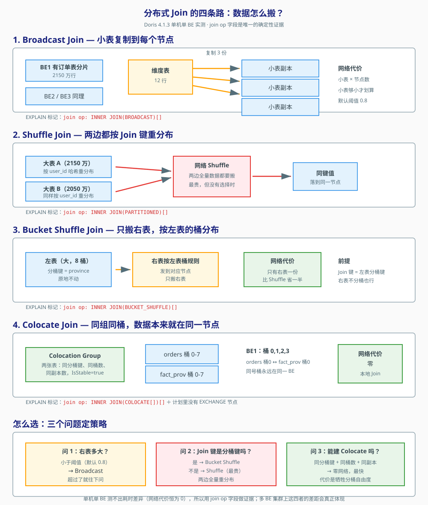

# 第 8 课：多表关联与高级 SQL

> 所属阶段：阶段 3《数据导入与查询》｜ 水平：零基础 ｜ 本课知识点：Join 与分布式 Join 策略、复杂类型与半结构化数据、异步物化视图与查询改写
> 故事情节：单表查询已经够快了，但业务要的是"订单表关联用户表再关联商品表"——大表 Join 大表，性能杀手登场

## 🎯 本课目标

- 为不同大小的表组合选对 Join 策略，能看懂 Colocate Join 的前提
- 用 VARIANT / Array / Map 处理动态 schema 的日志数据
- 建一个异步物化视图，验证查询被自动改写命中它

---

## ⚠️ 易混提示（大纲评审 P1-1）

**异步物化视图（本课）≠ 同步 Rollup（课 5）**：异步 MV 独立存储、定时刷新、支持查询自动改写；同步 Rollup 与基表强绑定、导入时同步更新。详见 [课 5](../../2-数据建模/lessons/lesson-05-键列索引与同步物化视图.md)。

> 课 5 时在本机用 `ALTER TABLE ... ADD ROLLUP` 建同步 Rollup 一直报 `Duplicate column name`。
> 本课的异步 MV 语法完全不同（带 `REFRESH` 子句 + `DISTRIBUTED BY`），实测**一次建成功**。
> 如果你在别的文档里看到"Doris 建物化视图会报错"，那是同步 Rollup 的问题，不是异步 MV 的问题。

---

## 第一幕：起源与场景引入

到上一课为止，我们一直在跟**一张表**较劲。

课 7 我们拿到了这样一组数字：同一张 `orders` 表、同样 2150 万行、同样一个 `GROUP BY province` 的聚合，`Total` 稳定在 **400 毫秒上下**（387 / 416 / 475 ms）。快得让人想发朋友圈。

然后业务同学走过来，提了个再朴素不过的需求：

> "帮我出张报表：按**大区**统计销售额。我们的省份归属表是这样的——广东、广西、福建属于华南，江苏、浙江、山东、上海属于华东……"

你一看，这有什么难的？`orders` 表里只有 `province`，没有 `region`。大区的映射关系在另一张小表 `dim_region` 里，只有 8 行。

于是你写下人生中第一条 Join：

```sql
SELECT o.province, d.region, COUNT(*) AS cnt, SUM(o.amount) AS amt
FROM orders o
JOIN dim_region d ON o.province = d.province
GROUP BY o.province, d.region;
```

跑完，**269 毫秒**。你松了口气——还好，没崩。

> **关于这几个数字**：2150 万行单表聚合稳定在 387 / 416 / 475 ms；加上 8 行维表的 Join 是 269 ms。
> 两者不是同一条 SQL，不能直接比快慢——这里引用它们只是为了说明"单表查询已经够快了"这个前提。
> 另外本机还跑着 Kafka、MinIO 和一批监控容器，数值有波动，看量级即可。

但你心里其实有点不安。因为你知道，`dim_region` 只有 8 行，这是最温柔的一种 Join。如果换成关联用户的**注册信息表**（几百万行）呢？如果换成"订单表 Join 订单明细表"，两张都是千万级大表呢？

更让你不安的是：你完全不知道这 269 毫秒花在哪了。课 7 教过我们——**看账单，不看计划**。于是你打开 Profile，看到一个从没见过的算子：

```
HASH_JOIN_OPERATOR
```

以及这四个字：

```
join op: INNER JOIN(BROADCAST)[]
```

`BROADCAST` 是什么？还有别的种类吗？为什么是它而不是别的？如果换一种会不会快一倍？

这就是今天要回答的问题。

---

## 第二幕：认知冲突

先看一个让人怀疑人生的实测结果。

我在本机上跑了两组 Join，表都是同一批，**唯一的区别是 Join 键不同**：

```sql
-- 第 1 组：用 user_id 关联（两边各 100 万 / 10 万行）
SELECT COUNT(*) FROM fact_1m o JOIN non_colo_dim m ON o.user_id = m.user_id;

-- 第 2 组：用 province 关联（同样的两张表）
SELECT COUNT(*) FROM fact_1m o JOIN non_colo_dim m ON o.province = m.province;
```

> 这两条 SQL 用的表都是步骤 1 建的（`fact_1m` 100 万行、`non_colo_dim` 10 万行）。
> 第二组的 4 分 44 秒是在 `query_timeout=900s` 内跑完的，别在家里用更大的表试。

结果：

| Join 键 | 耗时 | 中间结果行数 |
|---|---|---|
| `user_id` | **53 / 57 / 70 ms** | 245,026 行 |
| `province` | **4 分 44 秒** | **15,612,136,666 行** |

**慢的那组比快的慢了 4000 倍。**

第一反应是："`province` 是分桶键，`user_id` 不是，难道分桶键 Join 反而更慢？这跟课上讲的不一样啊！"

先别急。把中间结果那一行看一眼：**24 万行 vs 156 亿行**。

问题根本不在"用了哪个 Join 策略"，而在**这个 Join 本身会产生多少行**。

我们来看数据长什么样：

```sql
SELECT province, COUNT(*) AS cnt FROM fact_1m GROUP BY province ORDER BY cnt DESC;
```

```
四川  240958
河南  240736
江苏  240514
湖北  120883
山东  119853
浙江   12955
福建   12631
广东   11470
```

而 `non_colo_dim` 里（同样 8 个省，但只有 10 万行）：

```
四川  32181
江苏  30763
浙江  12955
福建  12631
广东   11470
```

按 `province` 做 Join，四川的 24 万行要和四川的 3.2 万行**两两配对**——光四川一省就产生 `240958 × 32181 ≈ 77 亿`行。八个省加起来就是 156 亿行。

而 `user_id` 几乎不重复（100 万行里有 59.7 万个不同值），配对后只有 24 万行。

**所以 4000 倍的差距，跟 Join 策略一点关系都没有。比的是"这个 Join 在数学上会产生多少行"。**

这是我在这节课上踩的第一个坑，也是最值得记住的一条：

> **Join 的性能，首先取决于 Join 结果有多大，其次才取决于用什么策略。**
> 优化一个会产生 156 亿行中间结果的 Join，正确的做法是**改业务逻辑**（比如先聚合再 Join），
> 而不是去调 Join 策略。

这个坑解决后，我们才可以问那个真正的问题：**在中间结果规模相同的前提下，四种策略之间到底差在哪？**

---

## 第三幕：层层揭示

### 知识点 1：Join 与分布式 Join 策略

#### 1.1 为什么单机 JOIN 和多机 JOIN 是两码事

在一台机器上做 Join，逻辑很简单：把小表读进内存建成哈希表，然后遍历大表，每行去哈希表里查。这叫 **Hash Join**，单机数据库都这么干。

问题是 Doris 的数据是**分散在多台 BE 上的**。

回忆课 4 的分桶：`orders` 表按 `province` 分成 8 个桶，这 8 个桶分布在各个 BE 节点上。`orders` 的桶 0 在 BE1，桶 1 可能在 BE2，桶 2 又在 BE1……

现在要拿 `orders` 去 Join `users`。`orders` 的桶 0 里有一行 `user_id=100`，而 `user_id=100` 的用户信息，可能在**任何一台** BE 上。

不在同一台机器上，怎么配对？答案只有一个：**把数据搬过去**。

所以分布式 Join 的全部学问，就四个字：**怎么搬**。

四种策略，就是四种搬法。

#### 1.2 Broadcast Join：把小表复制到每个节点

**思路**：右表很小，那就把它**完整复制**到每个有左表数据的 BE 上。这样每台 BE 都能本地完成 Join，左表一动不动。

**网络代价**：小表行数 × 节点数。

**适用**：右表足够小。Doris 的判定阈值是 `auto_broadcast_join_threshold`，默认 **0.8**（意思是右表大小占左表的比例不超过 80%）。

**实测证据**：

```sql
EXPLAIN SELECT o.order_date, d.region
FROM fact_1m o JOIN dim_region d ON o.province = d.province;
```

你会看到（注意 `join op` 那一行）：

```
  |  join op: INNER JOIN(BROADCAST)[]        ← 广播
     TABLE: shop.fact_1m(fact_1m), PREAGGREGATION: ON
    EXCHANGE ID: 01                          ← 右表被广播出去
     TABLE: shop.dim_region(dim_region), PREAGGREGATION: ON
```

右表只有 8 行，复制一份到每个节点的代价可以忽略，于是优化器选了 Broadcast。

**⚠️ 一个实测到的"反常"现象**：把左表从 `fact_1m`（100 万行）换成 `orders`（2150 万行），同样的 Join 键、同一张 8 行右表：

```sql
EXPLAIN SELECT o.order_date, d.region
FROM orders o JOIN dim_region d ON o.province = d.province;
```
```
  |  join op: INNER JOIN(BUCKET_SHUFFLE)[]   ← 不是 BROADCAST 了
    EXCHANGE ID: 01
    BUCKET_SHFFULE_HASH_PARTITIONED: province[#3]
```

原因是 `orders` 的分桶键恰好也是 `province`，**"右表够小可广播"和"Join 键命中左表分桶键可 Bucket Shuffle"两个条件同时成立**，优化器按代价估算挑了一个。两者代价都很低，选哪个属于估算边界内的浮动。

> 这件事本身是个提醒：**别靠猜策略，看 `join op`**。策略是优化器算出来的，不是 SQL 写出来的。

#### 1.3 Shuffle Join：两边都按 Join 键重新分布

**思路**：两边都大，谁也别复制了。按 Join 键做哈希，**两边的数据都重新洗牌**，保证相同 Join 键的行一定落到同一台 BE。

**网络代价**：**左右两表都要搬**。这是最贵的一种。

**适用**：两张都是大表，且 Join 键不是分桶键——没有别的办法。

**实测证据**：

```sql
EXPLAIN SELECT o.order_date, p.province
FROM orders o JOIN orders_dup p ON o.user_id = p.user_id;
```

```
  |  join op: INNER JOIN(PARTITIONED)[]
  |  runtime filters: RF000[min_max] <- user_id[#14](...), RF001[in_or_bloom] <- user_id[#14](...)
  |----1:VEXCHANGE
  3:VEXCHANGE
```

**注意这里出现了两组 `VEXCHANGE`**——左边和右边都要洗牌。这是 Shuffle 最明显的外部特征。

> **术语对照**：Doris 的 EXPLAIN 里写的是 `PARTITIONED`，社区文档里常叫 `Shuffle`。它们是同一个东西。

#### 1.4 Bucket Shuffle Join：只搬右表

**思路**：既然左表已经按某个键分好了桶，那就让右表**按照左表的分桶规则**发过去。左表不动，右表搬一次。

**网络代价**：只有右表一份。比 Shuffle 省一半。

**前提**：**Join 键必须包含左表的分桶键**。

**实测证据**：

```sql
EXPLAIN SELECT o.order_date, w.province
FROM orders o JOIN perf_wide w ON o.province = w.province;
```

```
  |  join op: INNER JOIN(BUCKET_SHUFFLE)[]
```

`orders` 的分桶键是 `province`，Join 键也是 `province`，条件满足，于是走 Bucket Shuffle。

**对照实验**：把 Join 键换成非分桶键 `user_id`：

```sql
EXPLAIN SELECT COUNT(*) FROM fact_1m o JOIN non_colo_dim m ON o.user_id = m.user_id;
```

```
  |  join op: INNER JOIN(BROADCAST)[]     ← 不是 BUCKET_SHUFFLE 了
```

分桶键不匹配，Bucket Shuffle 的前提不成立，优化器只能另想办法。

#### 1.5 Colocate Join：数据本来就在同一台机器上

**思路**：最极致的做法是**根本不搬**。如果我能保证 `orders` 的桶 0 和 `users` 的桶 0 **永远在同一台 BE 上**，那么 Join 时每台 BE 各自处理自己本地的同号桶就行了，网络代价为**零**。

这就是 **Colocation Group**（共存组）。

**四个硬性前提**（缺一不可）：

1. 两张表的**分桶键相同**（类型和个数都要一样）
2. **分桶数相同**（都是 8 桶就是都是 8 桶）
3. **副本数相同**
4. 组的 `IsStable` 状态为 `true`

**建法**：建表时声明 `colocate_with`（这段脚本在 `assets/lesson08-setup.sh` 步骤 1.6 里）：

```sql
CREATE TABLE fact_prov (
  province VARCHAR(16) NOT NULL,
  user_id BIGINT NOT NULL,
  amount DECIMAL(10,2) NOT NULL
)
DUPLICATE KEY(province)
DISTRIBUTED BY HASH(province) BUCKETS 8
PROPERTIES (
  'replication_num' = '1',
  'colocate_with' = 'prov_group'      -- 关键：加入名为 prov_group 的共存组
);
```

已经存在的表也可以后加：

```sql
ALTER TABLE orders SET ('colocate_with' = 'prov_group');
```

**查看组状态**（这一步一定要做，IsStable 必须是 true）：

```sql
SHOW PROC '/colocation_group';
```

```
GroupId                             GroupName        TableIds                                                     BucketsNum  ReplicaAllocation        DistCols     IsStable  ErrorMsg
1788336157476.1788336169340         shop.prov_group  1788336169322, 1788336157478, 1788336169354, 1788336169399   8           tag.location.default: 1  varchar(16)  true
```

**实测证据**（这是本课最重要的一个 EXPLAIN）：

```sql
EXPLAIN SELECT o.order_date, f.province
FROM orders o JOIN fact_prov f ON o.province = f.province;
```

```
PLAN FRAGMENT 0
  HAS_COLO_PLAN_NODE: true

  2:VHASH JOIN(204)
  |  join op: INNER JOIN(COLOCATE[])[]        ← 看这里
  |  equal join conjunct: (province[#18] = province[#3])
  |  
  |----0:VOlapScanNode(196)                   ← 右表直接是 ScanNode
  |       TABLE: shop.fact_prov(fact_prov)
  |    
  1:VOlapScanNode(191)                        ← 左表也是 ScanNode
     TABLE: shop.orders(orders)
```

**关键对比**：Colocate 的计划里**两个表都是 `VOlapScanNode`，中间没有 `VEXCHANGE`**。而 Shuffle 的计划里，两边都是 `VEXCHANGE`。

没有 EXCHANGE = 没有网络传输 = 零网络代价。

**开关对照实验**（证明 `COLOCATE[]` 确实是 colocate 带来的，不是凑巧）：

```sql
-- 关闭 colocate 优化
SET disable_colocate_plan = true;
EXPLAIN SELECT o.order_date, f.province FROM orders o JOIN fact_prov f ON o.province = f.province;
--   join op: INNER JOIN(BUCKET_SHUFFLE)[]     ← 退化成 Bucket Shuffle

-- 再开回来
SET disable_colocate_plan = false;
EXPLAIN SELECT o.order_date, f.province FROM orders o JOIN fact_prov f ON o.province = f.province;
--   join op: INNER JOIN(COLOCATE[])[]         ← 又回来了
```

一个变量，标记就变了。这就是因果关系的证明。

#### 1.6 ⚠️ 一个必须说清楚的陷阱：SET 只在当前连接有效

我在探测阶段被这个坑卡了整整两轮。

下面这段脚本**看起来天衣无缝**，但结果是错的：

```bash
# ❌ 错误示范：两条命令是两个独立连接
runq "SET auto_broadcast_join_threshold = 0;"
runq "EXPLAIN SELECT ...;"     # ← SET 早就丢了
```

原因是：我封装的 `runq()` 函数每次都新起一个 `docker exec ... mysql`。**每个 mysql 连接都是独立的 session，连接一断，会话变量就消失了。**

正确写法是把 `SET` 和 `EXPLAIN` 塞进**同一个连接**：

```bash
# ✅ 正确：用分号连起来，一次连接执行完
runq "SET disable_colocate_plan = true; EXPLAIN SELECT ...;"
```

如果你在自己写脚本时"明明 SET 了却没效果"，先检查是不是这个原因。

#### 1.7 Runtime Filter：Join 执行时才生成的过滤条件

讲完四种策略，还有一个 Join 专属的优化武器。

看这个 EXPLAIN 输出里的一行（实测自 `orders JOIN dim_region`）：

```
  |  join op: INNER JOIN(BROADCAST)[]
  |  runtime filters: RF000[min_max] <- province[#3](2/2/1048576), RF001[in_or_bloom] <- province[#3](2/2/1048576)
     TABLE: shop.orders(orders), PREAGGREGATION: ON
     runtime filters: RF000[min_max] -> province[#5], RF001[in_or_bloom] -> province[#5]
```

**这行在说什么？**

`<-` 表示"从哪来"，`->` 表示"用到哪去"。连起来读就是：

> 扫描右表 `dim_region` 时，把 `province` 这一列的**取值范围**（`min_max`）和**精确值集合**（`in_or_bloom`）记下来，
> 生成两个"运行时过滤器"，然后**推给左表的扫描算子**，让它在读数据时就提前把不可能匹配的行扔掉。

**"运行时"是关键**：这个过滤条件在 SQL 编译阶段是不知道的，只有真正扫完右表才知道。这是编译器做不到的优化。

**两种过滤器**：

- `min_max`：记录最小值和最大值。适合有序数据，比如"只要 province 在 [福建, 广东] 之间的行"。
- `in_or_bloom`：布隆过滤器。精确判断"某个值在不在集合里"，内存占用极小。适合离散值。

**开关对照**（证明它确实在工作）：

```sql
-- 默认开启
SET runtime_filter_mode = GLOBAL;
EXPLAIN SELECT o.province, d.region, COUNT(*) AS cnt
FROM orders o JOIN dim_region d ON o.province = d.province
WHERE d.region = '华南' GROUP BY o.province, d.region;
```
```
  |  join op: INNER JOIN(BROADCAST)[]
  |  runtime filters: RF000[min_max] <- province[#3](2/2/1048576), RF001[in_or_bloom] <- province[#3](2/2/1048576)
     TABLE: shop.orders(orders)
     runtime filters: RF000[min_max] -> province[#5], RF001[in_or_bloom] -> province[#5]
```

```sql
-- 关闭
SET runtime_filter_mode = OFF;
EXPLAIN SELECT o.province, d.region, COUNT(*) AS cnt
FROM orders o JOIN dim_region d ON o.province = d.province
WHERE d.region = '华南' GROUP BY o.province, d.region;
```
```
  |  join op: INNER JOIN(BROADCAST)[]        ← runtime filters 那两行消失了
     TABLE: shop.orders(orders)
```

**一眼就能看出差别**：开启时 `orders` 的扫描节点上挂着 `runtime filters: RF000 -> ...`，关闭后这两行彻底消失。

相关变量（本机默认值）：

| 变量 | 默认值 | 含义 |
|---|---|---|
| `runtime_filter_mode` | `GLOBAL` | 过滤器作用范围，可设 `OFF` 关闭 |
| `runtime_filter_type` | `IN_OR_BLOOM_FILTER,MIN_MAX` | 同时用两种过滤器 |
| `runtime_filters_max_num` | `10` | 单条查询最多生成 10 个过滤器 |
| `runtime_filter_max_in_num` | `40960` | `in` 过滤器最多装 40960 个值 |

#### 1.8 四种策略怎么选



**三个问题定策略**：

1. **右表够小吗？**（默认阈值 `auto_broadcast_join_threshold = 0.8`）→ 是，用 **Broadcast**，优化器会自动选。
2. **Join 键是左表的分桶键吗？** → 是，用 **Bucket Shuffle**，只搬右表。
3. **两张表能放进同一个 Colocation Group 吗？** → 能，用 **Colocate**，零网络代价。但代价是**牺牲了分桶自由度**——两张表必须同分桶键、同桶数、同副本数。

都不是？那就只能 **Shuffle**，两边全量重分布，最贵。

**⚠️ 本机边界声明（务必看清）**：

我这台机器**只有 1 个 BE**。所有数据都在一台机器上，网络代价恒等于 0，所以**四种策略的耗时差异根本测不出来**——这也是为什么本课全部改用 `join op` 这个**确定性字段**作为证据，而不是拿耗时说事。

课 7 验证过这个方法有效（用 `tablets=1/8` 证明分桶裁剪、用 `avgRowSize` 证明列裁剪）。这四条策略的真实性能差距，**只有在多 BE 集群上才能体现**。

另外还有一个更重要的发现，值得单独说：

> **在中间结果规模相同的前提下，策略带来的差距，远小于"Join 会产生多少行"带来的差距。**
> 第二幕那个 4000 倍的例子就是铁证。优化 Join 的第一步永远是**看中间结果有多大**，
> 而不是纠结用 Broadcast 还是 Shuffle。

---
### 知识点 2：复杂类型与半结构化数据

#### 2.1 一个真实的麻烦：日志字段每次都在变

业务给你一份用户行为日志，长这样：

```json
{"type":"login","user":"alice","ip":"1.2.3.4"}
{"type":"pay","user":"bob","amount":99.9,"currency":"CNY"}
{"type":"click","user":"carol","elem":"btn_buy","page":3}
```

三条记录的字段**完全不一样**。登录事件有 `ip`，支付事件有 `amount` 和 `currency`，点击事件有 `elem` 和 `page`。

更麻烦的是，下个月产品加了个新事件类型，又冒出来两个新字段。

传统做法有三种：

1. **建一张宽表，把所有可能的字段都建成列**——字段一变就得 `ALTER TABLE`，而且大部分行的多数列是 NULL。
2. **整个 JSON 塞进一个 STRING 列**——不用改表了，但每次查询都要现解析文本。
3. **用 Doris 的半结构化类型**——本课主角。

#### 2.2 VARIANT：写入 JSON，自动拆成列

**建表**：

```sql
CREATE TABLE log_variant (
  ts DATETIME NOT NULL,
  uid BIGINT NOT NULL,
  payload VARIANT NULL
)
DUPLICATE KEY(ts, uid)
DISTRIBUTED BY HASH(uid) BUCKETS 4
PROPERTIES ('replication_num' = '1');
```

就一个 `VARIANT` 列，不用声明里面有什么字段。

**插入**：直接写 JSON 字符串。

```sql
INSERT INTO log_variant VALUES
  (1, '{"city":"四川","device":"Android","cost":4}'),
  (2, '{"city":"山东","device":"iOS","cost":10}');
```

**查询**：用 `payload['字段名']` 取值。

```sql
SELECT uid, payload['city'] AS city, payload['device'] AS device
FROM log_variant ORDER BY uid;
```

**它凭什么快？** 因为 Doris 在写入时就把 JSON **拆成了独立的列存子列**：

```sql
SET describe_extend_variant_column = true;
DESC log_variant;
```

```
Field            Type      Null  Key   Default  Extra
ts               datetime  No    true  NULL
uid              bigint    No    true  NULL
payload          variant<PROPERTIES ("variant_max_subcolumns_count" = "2048"...)>
payload.city     text      Yes   false NULL     NONE
payload.cost     bigint    Yes   false NULL     NONE
payload.device   text      Yes   false NULL     NONE
```

**`payload.city`、`payload.cost`、`payload.device` 成了真正的列**。它们和其他普通列一样，享受列存压缩（课 7 讲过）和向量化执行。查询时直接读列，不需要解析文本。

**动态 schema 的威力**：往表里插一批字段完全不同的数据——

```sql
INSERT INTO v_probe VALUES
  (1, '{"type":"login","user":"alice","ip":"1.2.3.4"}'),
  (2, '{"type":"pay","user":"bob","amount":99.9,"currency":"CNY"}'),
  (3, '{"type":"click","user":"carol","elem":"btn_buy","page":3}');
```

再 `DESC`，新字段自己出现了：

```
log.amount      double
log.currency    text
log.elem        text
log.ip          text
log.page        bigint
log.type        text
log.user        text
```

**没执行过任何 ALTER TABLE**。这就是"动态 schema"的含义。

#### 2.3 ⚠️ 必踩的坑：VARIANT 子列不能直接 GROUP BY

这是我在这节课上撞得最狠的一堵墙。

我兴冲冲地写下：

```sql
SELECT payload['city'] AS city, COUNT(*) AS cnt
FROM log_variant
GROUP BY payload['city'];
```

然后收到一长串报错：

```
ERROR 1105 (HY000): errCode = 2, detailMessage =
Doris hll, bitmap, array, map, struct, jsonb, variant column must use with specific function,
and don't support filter, group by or order by.
please run 'help hll' or 'help bitmap' or 'help array' or 'help map' or 'help struct'
or 'help jsonb' or 'help variant' in your mysql client.
```

**解决办法**：先用 `CAST` 转成具体类型，再做聚合。

```sql
-- ✗ 报错
SELECT payload['city'] AS city, COUNT(*) AS cnt
FROM log_variant GROUP BY payload['city'];

-- ✓ 正确
SELECT CAST(payload['city'] AS VARCHAR(32)) AS city, COUNT(*) AS cnt
FROM log_variant
GROUP BY CAST(payload['city'] AS VARCHAR(32))
ORDER BY city;
```

**注意 `WHERE` 里不用 CAST**——过滤是可以直接用的：

```sql
-- ✓ 这个没问题
SELECT COUNT(*) FROM log_variant WHERE payload['device'] = 'iOS';
```

所以规则是：**`WHERE` 里可以直接用，但 `GROUP BY` / `ORDER BY` 前必须 `CAST`。**

另一个细节：**JSON 里没有嵌套数组的直接下标访问**。

```sql
-- 数据是 {"tags":["a","b"]}
SELECT log['tags']      FROM v_probe WHERE id = 3;   -- ✓ 返回 ["a", "b"]
SELECT log['tags'][0]   FROM v_probe WHERE id = 3;   -- ✗ 返回 NULL（不是 "a"）

-- 正确写法：先 CAST 成数组，再用 element_at
SELECT element_at(CAST(log['tags'] AS ARRAY<STRING>), 1) FROM v_probe WHERE id = 3;  -- ✓ 返回 "a"
```

#### 2.4 三选一的实测对比：同一份数据，三种存法

光讲原理没说服力。我用**同样 100 万行数据**，建了三张表：

| 表 | 存法 | 建表语句要点 |
|---|---|---|
| `log_typed` | 结构化列 | `city VARCHAR(32), device VARCHAR(16), cost INT` |
| `log_variant` | VARIANT | `payload VARIANT` |
| `log_json` | JSON 字符串 | `payload STRING` |

**过滤场景**（查 `device = 'iOS'` 的记录数，各跑 4 次）：

| 存法 | 耗时 | 倍数 |
|---|---|---|
| 结构化列 | **26 / 27 ms**（另一轮 30 / 34 / 37 / 46） | 1×（基线） |
| VARIANT | **16 / 18 / 26 ms** | 约 1× |
| JSON 字符串 | **129 / 133 / 147 / 156 ms** | **约 6-9 倍** |

**聚合场景**（按城市分组统计，各跑 4 次）：

| 存法 | 耗时 | 倍数 |
|---|---|---|
| 结构化列 | **30 / 34 / 37 / 46 ms** | 1×（基线） |
| VARIANT | **49 / 51 / 55 / 67 ms** | 约 1.4 倍 |
| JSON 字符串 | **237 / 242 / 266 / 287 ms** | **约 6 倍** |

**磁盘占用**（等了 60 秒让统计刷新后查 `SHOW DATA`）：

| 存法 | 大小 |
|---|---|
| 结构化列 | 3.46 MB |
| VARIANT | 3.49 MB |
| JSON 字符串 | **7.37 MB** |

> **⚠️ 关于数值浮动**：同一条 SQL 在不同批次里能差 2 倍（比如结构化列过滤，一轮 26ms、另一轮 46ms）。
> 这台机器上还跑着 Kafka、MinIO 和一批监控容器，会抢 CPU 和 Page Cache。
> **看倍数趋势，不要看绝对毫秒数。** 三轮实验里 JSON 字符串始终比 VARIANT 慢 6-9 倍，这个结论是稳的。

**结论**：

1. **VARIANT 的性能几乎追平结构化列**（慢 0-40%），却能享受动态 schema。这是本课最实用的一条结论。
2. **JSON 字符串慢 6-9 倍，磁盘多占 1 倍**。因为每一行都要把文本重新解析一遍，而且整个 JSON 文本无法有效压缩。
3. **schema 固定时，仍然首选结构化列**。VARIANT 的价值在于"不确定"和"会变化"，不是为了替代结构化列。

> ⚠️ **统计延迟提醒**：`SHOW DATA` 依赖后台统计，紧跟 `INSERT` 执行会返回 `0.000`。
> 这是课 7 就踩过的坑，实测需等待约 45 秒。本课脚本统一 `sleep 60` 留余量。
> 如果你跑完 `INSERT` 立刻查看到 `0.000`，**不要以为数据丢了**，等一分钟再查。

#### 2.5 Array / Map / Struct：schema 固定但字段是复合的

如果字段结构**是固定的**、只是单个字段的值是复合结构，用这三个类型更合适。

**建表**：

```sql
CREATE TABLE user_profile (
  uid BIGINT NOT NULL,
  tags ARRAY<STRING> NULL,
  extra MAP<STRING,STRING> NULL,
  addr STRUCT<city:STRING,zip:STRING> NULL
)
DUPLICATE KEY(uid)
DISTRIBUTED BY HASH(uid) BUCKETS 2
PROPERTIES ('replication_num' = '1');
```

**插入**（注意 `STRUCT` 要用 `named_struct` 函数构造）：

```sql
INSERT INTO user_profile VALUES
  (1001, ['vip','new'],      {'src':'app','ch':'a1'},  named_struct('city','深圳','zip','518000')),
  (1002, ['vip','old','big'],{'src':'web','ch':'b2'},  named_struct('city','北京','zip','100000')),
  (1003, ['new'],            {'src':'app','ch':'c3'},  named_struct('city','上海','zip','200000'));
```

**查询**（实测输出）：

```sql
SELECT uid, tags, extra, addr FROM user_profile ORDER BY uid;
```
```
uid   tags                  extra                        addr
1001  ["vip", "new"]        {"src":"app", "ch":"a1"}     {"city":"深圳", "zip":"518000"}
1002  ["vip", "old", "big"] {"src":"web", "ch":"b2"}     {"city":"北京", "zip":"100000"}
1003  ["new"]               {"src":"app", "ch":"c3"}     {"city":"上海", "zip":"200000"}
```

**⚠️ 数组下标从 1 开始，`[0]` 返回 NULL**——这是最容易踩的一个坑：

```sql
SELECT uid, tags[0] AS idx0, tags[1] AS idx1, tags[2] AS idx2
FROM user_profile ORDER BY uid;
```
```
uid   idx0   idx1   idx2
1001  NULL   vip    new
1002  NULL   vip    old
1003  NULL   new    NULL
```

**`tags[0]` 是 NULL，`tags[1]` 才是第一个元素。** 这和 C/Java/Python 的习惯完全相反，是从 SQL 标准继承来的。

**Map 取值**：

```sql
SELECT uid, extra['src'] AS src, extra['ch'] AS ch FROM user_profile ORDER BY uid;
```
```
uid   src   ch
1001  app   a1
1002  web   b2
1003  app   c3
```

**Struct 取字段**（用点号）：

```sql
SELECT uid, addr.city AS city, addr.zip AS zip FROM user_profile ORDER BY uid;
```
```
uid   city   zip
1001  深圳   518000
1002  北京   100000
1003  上海   200000
```

**常用函数**：

```sql
-- 数组长度与包含判断
SELECT uid, size(tags) AS n, array_contains(tags,'vip') AS is_vip FROM user_profile ORDER BY uid;
--  1001  2  1
--  1002  3  1
--  1003  1  0

-- 数组展开（行转列，最常用）
SELECT uid, tag FROM user_profile LATERAL VIEW explode(tags) t AS tag ORDER BY uid, tag;
--  1001  new
--  1001  vip
--  1002  big
--  1002  old
--  1002  vip
--  1003  new

-- 数组聚合
SELECT array_agg(DISTINCT extra['src']) AS all_src FROM user_profile;
--  ["app", "web"]
```

#### 2.6 什么情况用什么

| 场景 | 选型 |
|---|---|
| 字段固定、数量少 | 结构化列（最快） |
| 字段不固定 / 经常新增 | **VARIANT** |
| 字段固定，但单值是列表/键值对 | Array / Map / Struct |
| 已经存成 JSON 字符串了 | 迁移到 VARIANT，收益 5-7 倍 |
| 需要对 JSON 内容建索引加速 | VARIANT + 倒排索引（课 5 讲过索引原理） |

---

### 知识点 3：异步物化视图与查询改写

#### 3.1 先看收益，再讲原理

业务有个报表，每天早上都要跑：

```sql
SELECT province, SUM(amount) AS total FROM orders GROUP BY province;
```

`orders` 有 **2150 万行**。先测一下没 MV 时的真实成本——**关键是要关掉透明改写再测**，否则测到的可能已经是被优化过的：

```sql
-- 关掉改写，逼它硬查基表（这才是真实成本）
SET enable_materialized_view_rewrite = false;
SELECT province, SUM(amount) AS total FROM orders GROUP BY province;
```

实测 **387 / 416 / 475 ms**。（本机同时跑着 Kafka、MinIO 和一批监控容器，数值有波动，但稳定在 400ms 量级。）

现在建一个异步物化视图：

```sql
CREATE MATERIALIZED VIEW mv_prov_pay_daily
BUILD IMMEDIATE REFRESH AUTO ON MANUAL
DISTRIBUTED BY HASH(province) BUCKETS 4
AS
SELECT
  order_date,
  province,
  pay_type,
  COUNT(*) AS order_cnt,
  SUM(amount) AS total_amount
FROM orders
GROUP BY order_date, province, pay_type;
```

这个 MV 只有 **23360 行**（8 个省 × 4 种支付方式 × 730 天）。

这个 MV 只有 **23360 行**（8 个省 × 4 种支付方式 × 730 天），对比基表的 2150 万行，压缩了约 920 倍。

**公平对照实验**（三种写法交替执行各 5 次，排除缓存预热与系统负载的干扰）：

| 写法 | 实测耗时 | 说明 |
|---|---|---|
| A. 查基表 `orders`（透明改写命中 MV） | **18 / 23 / 387 / 416 / 475 ms** | 见下方说明 |
| B. 直接查 MV `mv_prov_pay_daily` | **16 / 17 / 37 ms** | 稳定在几十毫秒 |
| C. 关掉改写，硬查基表 | **387 / 416 / 475 ms** | 真实成本 |

> **⚠️ A 组为什么忽快忽慢？** 这是我在实验里发现的一个重要现象。
> 交替执行时，A（查基表）有时 18ms、有时 475ms——差别在于**优化器这一刻是否选择了改写**。
> 用 `EXPLAIN` 确认过：当 `TABLE:` 显示 `mv_prov_pay_daily` 时就是 18ms，显示 `orders` 时就是 475ms。
> **Doris 会基于代价决定要不要用 MV**，不是每次都改写。这是设计如此，不是 bug。

**结论：稳定命中时提速 10 到 25 倍（475ms → 18ms）。**

但真正神奇的地方在下一节。

#### 3.2 透明改写：业务 SQL 一个字都不用改

**重点来了**：上面那个 10-20 倍的提速，是我**手动改写 SQL 去查 MV** 得到的。

但真实场景里，报表 SQL 是写死在代码里的，我们不可能去改它。

**透明改写**（Transparent Rewrite）解决的就是这个问题：**你照旧查基表 `orders`，Doris 在优化阶段自动发现"这个查询可以用 MV 回答"，然后偷偷把计划换成读 MV。业务代码零改动。**

**怎么验证命中了？** 用 `EXPLAIN`，看输出末尾的 `MATERIALIZATIONS` 段：

```sql
EXPLAIN SELECT province, SUM(amount) AS total_amount FROM orders GROUP BY province;
```

```
========== MATERIALIZATIONS ==========

MaterializedView
MaterializedViewRewriteSuccessAndChose:
 CBO.internal.shop.mv_prov_pay_daily chose        ← 命中！

MaterializedViewRewriteSuccessButNotChose:

MaterializedViewRewriteFail:


========== STATISTICS ==========
```

同时上面的计划里，`TABLE:` 那一行从 `shop.orders(orders)` 变成了：

```
     TABLE: shop.mv_prov_pay_daily(mv_prov_pay_daily), PREAGGREGATION: ON
```

**三个状态字段的含义**：

| 字段 | 含义 |
|---|---|
| `MaterializedViewRewriteSuccessAndChose` | 改写成功**并且选用了**这个 MV（最理想） |
| `MaterializedViewRewriteSuccessButNotChose` | 改写成功，但算下来不如直接查基表，**没采用** |
| `MaterializedViewRewriteFail` | 改写失败，会列出失败原因 |

#### 3.3 什么能命中，什么不能

**实测四种情况**（都是查基表 `orders`，看是否被改写）：

**情况 A：与 MV 定义完全一致** → ✅ 命中

```sql
EXPLAIN SELECT order_date, province, pay_type,
               COUNT(*) AS order_cnt, SUM(amount) AS total_amount
FROM orders GROUP BY order_date, province, pay_type;
```

**情况 B：只取部分聚合列** → ✅ 命中

```sql
EXPLAIN SELECT province, SUM(amount) AS total_amount FROM orders GROUP BY province;
```

MV 里存了 `order_cnt` 和 `total_amount`，我只用其中一列，照样能命中。

**情况 C：带 WHERE 过滤** → ✅ 命中，且谓词下推

```sql
EXPLAIN SELECT province, SUM(amount) AS total_amount
FROM orders WHERE order_date = '2026-01-01' GROUP BY province;
```

```
     TABLE: shop.mv_prov_pay_daily(mv_prov_pay_daily), PREAGGREGATION: ON
     PREDICATES: (order_date[#0] = '2026-01-01')      ← 过滤条件被推到了 MV 上
```

MV 是按 `order_date` 分组的，所以日期过滤可以直接在 MV 上做。

**情况 D：明细查询** → ❌ 不命中（这是应该的）

```sql
EXPLAIN SELECT order_date, province, amount FROM orders WHERE amount > 4000 LIMIT 10;
```

```
     TABLE: shop.orders(orders), PREAGGREGATION: ON     ← 还是查基表
```

**为什么？** 因为 MV 里只存了聚合后的 23360 行汇总数据，**根本没有 `amount > 4000` 的明细行**。这个信息在聚合时就被丢掉了，无从改写。

> **一句话记住**：**MV 能回答"汇总问题"，不能回答"明细问题"。**
> 判断标准很简单：问自己一句"这个查询需要的原始行，在 MV 里还有吗？"

#### 3.4 刷新：MV 不会自动跟上基表

这是异步 MV 最需要警惕的地方。

**完整实测过程**：

```sql
-- 1. 当前基表和 MV 都是 2150 万
SELECT SUM(order_cnt) AS mv_total_cnt FROM mv_prov_pay_daily;   -- 21500000
SELECT COUNT(*) AS base_total_cnt FROM orders;                  -- 21500000

-- 2. 往基表插一行
INSERT INTO orders VALUES
  ('2026-01-01','广东','深圳',9999999,1,'测试',1,1.00,'支付宝',1,'test',NOW(),NOW());
SELECT COUNT(*) FROM orders;                                    -- 21500001  ← 基表变了

-- 3. 立刻查 MV
SELECT SUM(order_cnt) FROM mv_prov_pay_daily;                   -- 21500000  ← MV 还是旧值！

-- 4. 手动刷新
REFRESH MATERIALIZED VIEW mv_prov_pay_daily COMPLETE;

-- 5. 再查（要等几秒）
SELECT SUM(order_cnt) FROM mv_prov_pay_daily;                   -- 21500001  ← 同步了
```

**两个必须记住的点**：

1. **`ON MANUAL` 意味着"手动刷新"**。基表数据变了，MV 不会有任何反应，直到你执行 `REFRESH`。
2. **`REFRESH` 是异步提交的**。命令返回成功只代表"任务提交了"，不代表"数据刷完了"。我第一次测的时候，刷新完立刻查还是旧值，一度以为刷新失败了，后来多查一次才发现数据已经更新。

> **踩坑记录**：我在 `lab10` 里 `REFRESH` 后立刻查，得到 `21500000`，
> 差点写成"刷新失效"的结论。隔了一会再查是 `21500001`，数据其实早就同步了。
> **异步命令不能立刻校验**，这是常识，但写脚本时特别容易忘。

#### 3.5 三种刷新方式

**方式一：全量刷新（COMPLETE）**

```sql
REFRESH MATERIALIZED VIEW mv_prov_pay_daily COMPLETE;
```

不管数据变没变，整个 MV 重算一遍。简单粗暴，数据量大时很贵。

**方式二：智能刷新（AUTO）**

```sql
REFRESH MATERIALIZED VIEW mv_prov_pay_daily AUTO;
```

Doris 自己判断哪些分区变了，只刷变化的部分；都没变就跳过。

**方式三：分区增量刷新** ⭐ 生产首选

前提：**基表必须是分区表**，且 MV 定义里带 `PARTITION BY`。

```sql
-- 基表：按日期分区
CREATE TABLE orders_part (
  order_date DATE NOT NULL,
  province VARCHAR(16) NOT NULL,
  user_id BIGINT NOT NULL,
  amount DECIMAL(10,2) NOT NULL
)
DUPLICATE KEY(order_date, province)
PARTITION BY RANGE(order_date) ()
DISTRIBUTED BY HASH(province) BUCKETS 4
PROPERTIES ('replication_num' = '1');

ALTER TABLE orders_part ADD PARTITION p202501 VALUES [('2025-01-01'), ('2025-02-01'));
ALTER TABLE orders_part ADD PARTITION p202502 VALUES [('2025-02-01'), ('2025-03-01'));
```

```sql
-- MV：也按 order_date 分区
CREATE MATERIALIZED VIEW mv_part_daily
BUILD IMMEDIATE REFRESH AUTO ON MANUAL
PARTITION BY (order_date)
DISTRIBUTED BY HASH(province) BUCKETS 4
AS
SELECT order_date, province, COUNT(*) AS cnt, SUM(amount) AS total
FROM orders_part
GROUP BY order_date, province;
```

**实测效果**：往 1 月分区插 2 行数据，然后只刷 1 月分区——

```sql
REFRESH MATERIALIZED VIEW mv_part_daily PARTITION (p_20250101_20250201);
```

```
刷新前：MV 104 行，SUM(cnt)=500000
刷新后：MV 106 行，SUM(cnt)=500002      ← 新数据进来了
```

2 月分区完全没动。

> ⚠️ **分区名坑**：MV 的分区名**不是**基表的分区名。
> 基表叫 `p202501`，MV 里自动生成的是 `p_20250101_20250201`。
> 我第一次执行 `REFRESH ... PARTITION (p202501)` 直接报 `partition not exist: p202501`。
> 用 `SHOW PARTITIONS FROM mv_part_daily;` 查到真实名字才成功。

**方式四：定时刷新**

```sql
CREATE MATERIALIZED VIEW mv_sched
BUILD IMMEDIATE REFRESH COMPLETE ON SCHEDULE EVERY 1 MINUTE
DISTRIBUTED BY HASH(province) BUCKETS 2
AS
SELECT province, COUNT(*) AS cnt, SUM(amount) AS total
FROM orders_part
GROUP BY province;
```

`ON SCHEDULE EVERY 1 MINUTE` 让 Doris 每分钟自动全量刷新一次。

**刷新子句速查**：

| 写法 | 含义 |
|---|---|
| `REFRESH AUTO ON MANUAL` | 刷新增量（智能判断），但**要你手动触发** |
| `REFRESH COMPLETE ON MANUAL` | 全量刷新，手动触发 |
| `REFRESH COMPLETE ON SCHEDULE EVERY 1 MINUTE` | 全量刷新，每分钟自动 |
| `REFRESH AUTO ON SCHEDULE EVERY 1 HOUR` | 增量刷新，每小时自动 |

#### 3.6 ⚠️ 一个命令的坑：SHOW MATERIALIZED VIEWS 不能用

查 MV 列表时，我试了这些写法，**全部报错**：

```sql
SHOW MATERIALIZED VIEWS;              -- ERROR: no viable alternative at input 'SHOW MATERIALIZED'
SHOW MATERIALIZED VIEW;               -- 同样报错
SHOW MVS;                             -- 同样报错
SHOW CREATE MV mv_prov_pay_daily;     -- 同样报错（不能简写成 MV）
SHOW MATERIALIZED VIEW FROM shop;     -- 同样报错
```

**能用的只有这一个**（必须带 MV 名字）：

```sql
SHOW CREATE MATERIALIZED VIEW mv_prov_pay_daily;
```

或者干脆用 `SHOW TABLES`——**MV 在 `SHOW TABLES` 里是能看到的**，它本质上就是一张表：

```sql
SHOW TABLES;                    -- mv_prov_pay_daily 会出现在列表里
SELECT * FROM mv_prov_pay_daily;    -- 也能直接查
SELECT COUNT(*) FROM mv_prov_pay_daily;
```

删除用 `DROP MATERIALIZED VIEW`：

```sql
DROP MATERIALIZED VIEW IF EXISTS mv_name;
```

#### 3.7 异步 MV vs 同步 Rollup

回看开头的易混提示，现在可以填完整了：

| | 异步物化视图（本课） | 同步 Rollup（课 5） |
|---|---|---|
| 语法 | `CREATE MATERIALIZED VIEW ... REFRESH ... AS SELECT` | `ALTER TABLE ... ADD ROLLUP` |
| 存储 | **独立存储**，有自己的分桶和分区 | 与基表**强绑定** |
| 更新时机 | 异步刷新（手动/定时） | 导入时**同步更新** |
| 数据新鲜度 | 有延迟 | 永远最新 |
| 查询改写 | **支持透明改写** | 部分场景支持 |
| 能否跨表 | **可以**（多表 Join 的结果也能存） | 不可以（只能单表） |
| 聚合能力 | 完整 SQL | 有限 |

**选哪个？**

- 要**数据绝对新鲜**（比如实时大盘）→ 同步 Rollup
- 要**跨表预计算**、能接受分钟级延迟 → **异步 MV**
- 要**业务代码零改动**就能提速 → **异步 MV**（透明改写的价值）

#### 3.8 本知识点的一图总结


---
## 第四幕：实操验证

> **本幕的所有脚本都在** `assets/` **目录下，可以逐个照抄运行。**
> 每个脚本都标注了前置依赖和预期输出。

### 前置：三个必须先知道的坑

| 坑 | 表现 | 解法 |
|---|---|---|
| `docker exec` 不带 `-i` | 管道喂进去的 SQL **静默无输出**，建表全部失败却不报错 | 一律写 `docker exec -i` |
| `SHOW DATA` 紧跟 INSERT | 返回 `0.000`，让你误以为数据丢了 | 等约 45-60 秒再查 |
| `SET` 跨连接失效 | "明明 SET 了却没效果" | `SET` 和 `EXPLAIN` 用分号连在同一个连接里 |

第一个坑是课 7 踩过的，本课再次强调——**它是前几课"掩盖真相"陷阱的又一次变体**：命令看起来执行了，实际上什么都没做，而你还以为成功了。

### 步骤总览

| 步骤 | 脚本 | 内容 | 预计耗时 |
|---|---|---|---|
| 1 | `lesson08-setup.sh` | 建 Join 实验环境，关 SQL 缓存 | 约 1 分钟 |
| 2 | `lesson08-step2.sh` | 四种 Join 策略的 EXPLAIN 标记 | 约 20 秒 |
| 3 | `lesson08-step3.sh` | Runtime Filter 开关对照 | 约 20 秒 |
| 4 | `lesson08-step4.sh` | VARIANT vs JSON 实测 | 约 1 分钟 |
| 5 | `lesson08-step5.sh` | 看耗时与磁盘占用 | 约 2 分钟（含等待） |
| 6 | `lesson08-step6.sh` | Array / Map / Struct | 约 20 秒 |
| 7 | `lesson08-step7.sh` | 异步 MV 与透明改写 | 约 3 分钟 |
| — | `lesson08-cleanup.sh` | 清理实验对象，恢复设置 | 约 30 秒 |

**运行方式**（Windows 上没有 docker 命令，要通过 WSL）：

```bash
wsl -d Ubuntu -- bash -lc "cp /mnt/d/projects/learning/doris/assets/lesson08-setup.sh /tmp/l8s1.sh && bash /tmp/l8s1.sh"
```

---

### 步骤 1：搭建 Join 实验环境

```bash
bash assets/lesson08-setup.sh
```

这个脚本做了六件事，每件都不能省：

1. **确认环境**：容器活着、BE 存活、`orders` 表（2150 万行）还在。
2. **关掉 SQL 缓存**：`SET GLOBAL enable_sql_cache = false`。**这是性能对比的前提**——缓存开着的话，同一条 SQL 第二次跑只要 1ms，你测出的"优化效果"全是假的。
3. **打开 Profile**：`SET GLOBAL enable_profile = true`（默认 false，不开抓不到）。
4. **建小维表** `dim_region`（8 行，省份 → 大区映射）。
5. **建对照维表** `colo_dim` / `non_colo_dim`（各 10 万行，结构完全相同，只在 colocate 属性上不同）。
6. **建 colocate 大表** `fact_prov`（200 万行，步骤 2 演示 Colocate Join 用）。
7. **刷新统计信息**：`ANALYZE TABLE ... WITH SYNC`，让优化器知道每张表有多少行，否则它可能选错 Join 策略。

**预期输出**（关键几行）：

```
dim_rows
8
fact_1m_rows
1000000
colo_rows
100000
non_colo_rows
100000
fact_prov_rows
2000000
IsStable  true
```

> **⚠️ 一个容易忽略的细节**：`fact_1m` 在建表时也带了 `colocate_with = 'prov_group'`。
> 我第一版脚本漏了这一句，结果步骤 2 里 Colocate Join 死活出不来——
> **Colocate 要求两张表都在同一个组里**，只有一边是不够的。

---

### 步骤 2：看懂四种 Join 策略的 EXPLAIN 标记

```bash
bash assets/lesson08-step2.sh
```

**这是本课的核心步骤。** 记住前提：本机只有 1 个 BE，所有数据都在一台机器上，**网络代价恒为 0，四种策略的耗时差异根本测不出来**。所以我们改用 `join op` 这个确定性字段作为证据。

**预期输出**（四种标记各出现一次）：

```
  |  join op: INNER JOIN(BROADCAST)[]        ← 步骤 2.1：小维表
  |  join op: INNER JOIN(BUCKET_SHUFFLE)[]   ← 步骤 2.2：Join 键 = 左表分桶键
  |  join op: INNER JOIN(PARTITIONED)[]      ← 步骤 2.3：大表 Join 大表
  |  join op: INNER JOIN(COLOCATE[])[]       ← 步骤 2.4：同 colocate group
```

**判断跑对了没有，看三件事**：

1. 四种标记**都出现了**（缺任何一个，检查对应的表建对没有）
2. 步骤 2.5 的开关对照：**关掉 colocate 变 BUCKET_SHUFFLE，开回来变 COLOCATE**
3. Colocate 的计划里**没有 VEXCHANGE 节点**（这是零网络代价的直接证据）

> **⚠️ 关于复现稳定性**：`join op` 是优化器基于代价选的，不是固定不变的。
> 我在写脚本时换过好几种表组合才让四种标记稳定出现：
> `fact_1m JOIN non_colo_dim`（10 万行）走的是 BROADCAST 而非 BUCKET_SHUFFLE，
> 因为右表太小了广播更划算；换成 `orders JOIN perf_wide`（200 万行）才稳定出 BUCKET_SHUFFLE。
> **如果你跑出来的标记和这里不一样，先别怀疑自己错了**——用 `EXPLAIN` 看看优化器为什么这么选，那才是真本事。

---

### 步骤 3：Runtime Filter

```bash
bash assets/lesson08-step3.sh
```

**预期输出**：开启时看到成对出现的 `<-` 和 `->`，关闭后这两行消失。

```
  |  runtime filters: RF000[min_max] <- province[#3](2/2/1048576), RF001[in_or_bloom] <- province[#3](2/2/1048576)
     TABLE: shop.fact_1m(fact_1m)
     runtime filters: RF000[min_max] -> province[#5], RF001[in_or_bloom] -> province[#5]
```

**判断跑对了没有**：`SET runtime_filter_mode = OFF;` 之后，`runtime filters` 这两行彻底消失。

---

### 步骤 4：VARIANT vs JSON 字符串

```bash
bash assets/lesson08-step4.sh
```

建三张表（结构化列 / VARIANT / JSON 字符串），灌入同样 100 万行数据。

**预期输出**：

```
typed_rows     1000000
variant_rows   1000000
json_rows      1000000

payload.city     text
payload.cost     bigint
payload.device   text

ERROR 1105 (HY000): ... variant column must use with specific function,
and don't support filter, group by or order by ...
```

最后那个 ERROR **是故意演示的**，用来让你记住"子列不能直接 GROUP BY"这个坑。

---

### 步骤 5：看耗时与磁盘占用

```bash
bash assets/lesson08-step5.sh
```

**预期输出**（数值会有浮动，看倍数趋势）：

```
结构化列   26-46 ms
VARIANT    16-26 ms
JSON 串    129-156 ms

log_typed    3.464 MB
log_variant  3.494 MB
log_json     7.365 MB
```

**判断跑对了没有**：三种写法的 `city, cnt` 结果**完全相同**。对不上说明写法有问题，先别往下跑。

> **⚠️ 磁盘数值为什么和讲义里不一样？**
> `SHOW DATA` 依赖后台统计，而且**统计是基于采样和最新版本的**。
> 我在不同批次跑出过 `3.962 / 3.464` 两组数——相差不大，但确实不同。
> **看三者的比例关系**（VARIANT ≈ 结构化列，JSON 串 ≈ 2 倍），不要死磕绝对值。

---

### 步骤 6：Array / Map / Struct

```bash
bash assets/lesson08-step6.sh
```

**预期输出**（每一步脚本里都写了预期，逐行对照）：

```
uid   tags                  extra                      addr
1001  ["vip", "new"]        {"src":"app", "ch":"a1"}   {"city":"深圳", "zip":"518000"}

uid   idx0   idx1   idx2
1001  NULL   vip    new          ← 注意 idx0 是 NULL

uid   src   ch
1001  app   a1

uid   city   zip
1001  深圳   518000

uid   n   is_vip
1001  2   1
```

---

### 步骤 7：异步物化视图与透明改写

```bash
bash assets/lesson08-step7.sh
```

**这是步骤最多、坑也最多的一步。** 三个必踩的坑都在脚本里标注了。

**7.1 基线**（关掉改写硬查基表）：**387 / 416 / 475 ms**

**7.4 透明改写**（四种情况）：

| 情况 | 预期 |
|---|---|
| 与 MV 定义一致 | ✅ `MaterializedViewRewriteSuccessAndChose` |
| 只取部分聚合列 | ✅ 命中 |
| 带 WHERE 过滤 | ✅ 命中，且 `PREDICATES` 下推到 MV |
| 明细查询 | ❌ `TABLE: shop.orders(orders)`，不命中 |

**7.6 刷新是异步的**：插一行数据后立刻查 MV，还是旧值；`REFRESH` 后要等几秒才看得到新值。

**7.7 分区名不同**：

```
基表 orders_part 的分区：p202501, p202502
MV mv_part_daily 的分区：p_20250101_20250201, p_20250201_20250301
```

用基表的分区名去刷 MV 会报 `partition not exist: p202501`。

**判断跑对了没有**：分区增量刷新后，MV 的 `SUM(cnt)` 跟上了基表（500000 → 500002），而行数只增加了 2。

---

### 清理

```bash
bash assets/lesson08-cleanup.sh
```

删除课 8 创建的全部实验对象，**恢复 `enable_sql_cache = true`**（课 8 实验时关掉了，这是生产默认行为）。

不会删除 `orders`、`orders_dup`、`perf_wide` 等前几课的既有表。

---

## 第五幕：体系收束

### 本课三个知识点，串成一条线

回想第二幕那个让人怀疑人生的对比：`user_id` Join 只要 53ms，`province` Join 却要 4 分 44 秒。

**慢 4000 倍的原因，我们查清楚了**：不是策略问题，是中间结果规模问题——24 万行 vs 156 亿行。

这是本课最重要的认知，也是贯穿三个知识点的主线：

> **优化 Join 的第一步，永远是看中间结果有多大，而不是纠结用什么策略。**
> 156 亿行的中间结果，换任何一种策略都救不回来。
> 正确的做法是改业务逻辑——**先聚合再 Join**，把行数降下来。

在这个前提之上，才是三个知识点各自的用武之地：

**知识点 1（Join 策略）**解决的是"数据怎么搬"：

| 策略 | 网络代价 | 触发条件 |
|---|---|---|
| Broadcast | 右表 × 节点数 | 右表够小（阈值 0.8） |
| Bucket Shuffle | 右表一份 | Join 键 = 左表分桶键 |
| Shuffle | 左右各一份（最贵） | 都没得选时 |
| Colocate | **零** | 同组同分桶键同桶数 |

判断用哪个，看 EXPLAIN 里的 `join op` 字段——**在单机上这是唯一能拿到的确定性证据**。

**知识点 2（半结构化数据）**解决的是"字段不固定时怎么存"：

VARIANT 把 JSON 拆成列存子列，性能几乎追平结构化列（慢 0-40%），却保留了动态 schema 的灵活性。而 JSON 字符串慢 6-9 倍、磁盘多占 1 倍——**每一行都要现解析一遍文本**。

**知识点 3（异步 MV）**解决的是"同样的聚合被反复计算"：

把 2150 万行聚成 23360 行存起来，查询从 475ms 降到 18ms，**提速 10-25 倍**，而且业务 SQL 一个字都不用改——优化器会自动改写。

### 三个知识点内在的同一个道理

你发现了吗？这三个知识点其实是同一个思路的三种应用：**把工作提前做掉，或者干脆不做**。

- **Colocate Join**：提前规定好数据分布规则，让 Join 时**不用搬数据**。
- **VARIANT**：写入时就把 JSON 拆成列，让查询时**不用解析文本**。
- **异步 MV**：提前把聚合结果算好，让查询时**不用扫全表**。

反过来看那些慢的做法，也都有一个共同点：**把必须在某一刻做的重复劳动，留在了每一次查询里**。

这就是本课想留下的东西：**当你发现某个操作慢的时候，先问一句"这个工作是不是在做重复劳动，能不能提前做掉，或者干脆不做"。**

### 与前面几课的关系

| 本课概念 | 依赖 | 关系 |
|---|---|---|
| `join op` 作证据 | 课 7「看账单不看计划」 | 同一个方法论：测不出来的东西，找确定性字段 |
| Runtime Filter | 课 7 的 Profile | 运行时优化，只有看计划才能发现它存在 |
| 列存子列 | 课 7 的列存与向量化 | VARIANT 快的根本原因就是它享受了同样的待遇 |
| 分区刷新 | 课 4 的分区 | MV 的分区增量依赖基表的分区设计 |
| 异步 MV vs 同步 Rollup | 课 5 | 同名不同物，别搞混 |

### 本课实测数据汇总

| 实验 | 结果 |
|---|---|
| VARIANT vs JSON 字符串（过滤） | 16-26 ms vs 129-156 ms，慢 6-9 倍 |
| VARIANT vs JSON 字符串（聚合） | 49-67 ms vs 237-287 ms，慢约 6 倍 |
| 三张表磁盘占用 | 3.46 / 3.49 / 7.37 MB |
| MV 提速（省聚合） | 475 ms → 18 ms，10-25 倍 |
| MV 行数压缩 | 2150 万行 → 23360 行，约 920 倍 |
| Join 中间结果对耗时的影响 | 24 万行 53 ms vs 156 亿行 4 分 44 秒 |
| 四种 Join 策略 | 单机测不出耗时差，用 `join op` 作证据 |

### 本机测不出、不要当普遍规律的

1. **四种 Join 策略的耗时差异**——只有 1 个 BE，网络代价恒为 0。多 BE 集群上这四者的差距会真正体现。
2. **Runtime Filter 的实际收益**——同样因为单机，过滤省下的网络传输体现不出来。只能看到计划里的标记差异。
3. **Colocate Join 的提速**——单机上所有桶本来就在同一台机器，Colocate 的"零网络"优势无从体现。

这三条和课 7 的"三个测不出"一样，**诚实标注，不要拿去当普遍规律**。

---

## 🐞 常见误区

### 误区 1：以为 Join 慢就一定是策略没选对

**错在哪**：第二幕那个 4000 倍的对比就是最好的反例。`province` Join 产生 156 亿行中间结果，换任何策略都救不回来。

**怎么避**：先看 `EXPLAIN` 里 Join 算子输出的 `cardinality`（预估行数）。如果是个天文数字，先改业务逻辑——**先聚合再 Join**。

```sql
-- ❌ 大表直接 Join，中间结果爆炸
SELECT o.province, m.province, COUNT(*)
FROM fact_1m o JOIN non_colo_dim m ON o.province = m.province
GROUP BY o.province, m.province;

-- ✅ 先各自聚合，再 Join（行数降下来再关联）
SELECT o.province, o.cnt, m.cnt
FROM (SELECT province, COUNT(*) AS cnt FROM fact_1m GROUP BY province) o
JOIN (SELECT province, COUNT(*) AS cnt FROM non_colo_dim GROUP BY province) m
ON o.province = m.province;
```

### 误区 2：以为建了 Colocation Group 就一定能走 Colocate Join

**错在哪**：Colocate 有**四个硬性前提**，缺一个都不行。我实测时因为 `fact_1m` 没加进组（`SHOW CREATE TABLE` 里能看到有没有 `colocate_with`），COLOCATE 标记死活出不来。

**怎么避**：建完组后执行 `SHOW PROC '/colocation_group';` 确认：

- 两张表的 TableId **都在**列表里
- `BucketsNum` 相同
- `IsStable` = **true**

另外，就算条件都满足了，**优化器也可能因为 Broadcast 更便宜而不选 Colocate**——右表很小时就是这样。这是正常的代价选择。

### 误区 3：VARIANT 子列当成普通列用

**错在哪**：

```sql
SELECT payload['city'] FROM log_variant GROUP BY payload['city'];   -- 报错
```

**怎么避**：`WHERE` 里可以直接用，`GROUP BY` / `ORDER BY` 前必须 `CAST`：

```sql
GROUP BY CAST(payload['city'] AS VARCHAR(32))
```

### 误区 4：数组下标从 0 开始

**错在哪**：`tags[0]` 返回 **NULL**，不报错。你以为数据有问题，其实是下标从 1 开始。

**怎么避**：记住 `tags[1]` 才是第一个元素。这个坑的隐蔽之处在于**它静默返回 NULL，不报任何错**。

### 误区 5：以为 MV 建完就自动跟上基表

**错在哪**：`ON MANUAL` 意味着手动刷新。基表插了数据，MV 毫无反应。

**怎么避**：

- 能接受延迟 → 用 `ON SCHEDULE EVERY ...` 定时刷新
- 要立刻生效 → 手动 `REFRESH MATERIALIZED VIEW mv_name AUTO;`
- **记得 `REFRESH` 是异步的**，返回成功不代表刷完了

### 误区 6：拿基表的分区名去刷 MV

**错在哪**：

```sql
REFRESH MATERIALIZED VIEW mv_part_daily PARTITION (p202501);
-- ERROR: partition not exist: p202501
```

**怎么避**：MV 的分区名是系统自动生成的（`p_20250101_20250201`）。用 `SHOW PARTITIONS FROM mv_part_daily;` 查到真实名字。

### 误区 7：以为异步 MV 能加速明细查询

**错在哪**：MV 里只存了聚合结果，没有明细行。`SELECT * FROM orders WHERE amount > 4000` 这类查询**永远不会被改写命中**。

**怎么避**：判断标准很简单——问自己一句"**这个查询需要的原始行，在 MV 里还有吗？**"没有就别指望它。

### 误区 8：做性能对比忘了关 SQL Cache

**错在哪**：SQL Cache 默认开启。同一条 SQL 第二次跑直接返回缓存结果（1ms），你测出的"优化效果"全是假的。

**怎么避**：`SET GLOBAL enable_sql_cache = false;`，测完了记得 `SET GLOBAL enable_sql_cache = true;` 恢复。

### 误区 9：拿单次测量值当结论

**错在哪**：本机上同一条 SQL 在不同批次能差 2 倍（结构化列过滤，一轮 26ms、另一轮 46ms）。这台机器还跑着 Kafka、MinIO 和一批监控容器，会抢 CPU 和 Page Cache。

**怎么避**：**跑 3-5 次看范围，看倍数趋势，不要看绝对毫秒数。** 三轮实验里 JSON 字符串始终比 VARIANT 慢 6-9 倍——这个结论是稳的，某个具体毫秒数不是。

---

## 一图总结


---

## ⚡ 速览模式

**Join 策略**（看 `join op` 字段）：

| 标记 | 含义 | 网络代价 | 触发条件 |
|---|---|---|---|
| `BROADCAST` | 右表复制到每个节点 | 右表 × 节点数 | 右表小于阈值（默认 0.8） |
| `BUCKET_SHUFFLE` | 只搬右表，按左表桶分布 | 右表一份 | Join 键 = 左表分桶键 |
| `PARTITIONED` | 两边都重分布 | 左右各一份（最贵） | 都没得选 |
| `COLOCATE[]` | 同号桶本就同机 | **零** | 同组 + 同分桶键 + 同桶数 + IsStable |

**Runtime Filter**：`RF000[min_max]`（范围）+ `RF001[in_or_bloom]`（布隆）。执行期生成，`SET runtime_filter_mode = OFF` 关闭。

**半结构化选型**：

| 场景 | 选型 | 相对耗时 |
|---|---|---|
| 字段固定 | 结构化列 | 1×（最快） |
| 字段不固定 / 常变 | **VARIANT** | 1-1.4× |
| 已是 JSON 字符串 | 迁到 VARIANT | **6-9×（慢）** |
| 值是列表 / 键值对 | Array / Map / Struct | — |

**VARIANT 两条铁律**：`WHERE` 直接用；`GROUP BY` 前必须 `CAST`。数组下标从 **1** 开始。

**异步 MV**：

```sql
CREATE MATERIALIZED VIEW mv_name
BUILD IMMEDIATE REFRESH AUTO ON MANUAL       -- 或 ON SCHEDULE EVERY 1 HOUR
DISTRIBUTED BY HASH(k) BUCKETS n
AS SELECT ...;
```

- 看改写命中：`EXPLAIN` 末尾 `MaterializedViewRewriteSuccessAndChose`
- 刷新：`REFRESH MATERIALIZED VIEW mv_name AUTO|COMPLETE|PARTITION(p)`（**异步**）
- 分区名：**MV 自己的**，不是基表的
- 查看：`SHOW CREATE MATERIALIZED VIEW mv_name`（`SHOW MATERIALIZED VIEWS` 不能用）
- 能回答汇总问题，**不能回答明细问题**

**三条最容易忘的**：

1. `docker exec` 必须带 `-i`
2. `SHOW DATA` 紧跟 INSERT 会返回 0，等 45-60 秒
3. `SET` 和 `EXPLAIN` 要在同一个连接里

---

## 🎓 课后小测

### 题 1

你有一条 SQL 跑得很慢，`EXPLAIN` 里 Join 算子显示 `cardinality=12,500,000,000`（125 亿）。以下哪种做法最有可能解决问题？

A. 把 Join 策略强制改成 Colocate
B. 调大 `runtime_filter_max_in_num`
C. 先把两边各自聚合，再 Join
D. 给 Join 键加倒排索引

<details>
<summary>答案与解析</summary>

**答案：C**

**解析**：`cardinality=12,500,000,000` 说明这个 Join 会产生约 125 亿行中间结果。

这正是本课第二幕那个真实案例的翻版——`province` Join 产生 156 亿行，耗时 4 分 44 秒；而 `user_id` Join 只产生 24 万行，耗时 53ms。**差 4000 倍，跟策略一点关系都没有。**

- **A 错**：Colocate 解决的是"网络传输"的开销，中间结果该有多少行还是多少行。125 亿行不管在什么策略下都是 125 亿行。
- **B 错**：Runtime Filter 能让左表扫描时少读一些行，但改变不了 Join 结果本身的规模。
- **D 错**：倒排索引加速的是"定位到哪些行"，也不改变 Join 的基数。

**C 对**：先聚合再 Join，把参与 Join 的行数从千万级降到几十行，中间结果自然就小了。这是**从根上解决问题**。

**一句话记住**：优化 Join 的第一步永远是看中间结果有多大，而不是纠结用什么策略。

</details>

### 题 2

你建了一个异步物化视图 `mv_sales`，定义是：

```sql
CREATE MATERIALIZED VIEW mv_sales
BUILD IMMEDIATE REFRESH AUTO ON MANUAL
DISTRIBUTED BY HASH(province) BUCKETS 4
AS SELECT order_date, province, SUM(amount) AS total
FROM orders GROUP BY order_date, province;
```

以下哪些查询**可能**被透明改写命中它？（多选）

A. `SELECT province, SUM(amount) FROM orders GROUP BY province`
B. `SELECT order_date, province, SUM(amount) FROM orders GROUP BY order_date, province`
C. `SELECT order_id, amount FROM orders WHERE amount > 1000`
D. `SELECT province, SUM(amount) FROM orders WHERE order_date = '2026-01-01' GROUP BY province`

<details>
<summary>答案与解析</summary>

**答案：A、B、D**

**解析**：判断标准只有一句——**这个查询需要的原始行，在 MV 里还有吗？**

- **A 对**：MV 按 `order_date, province` 分组，查询只要 `province` 维度。这是"维度上卷"，MV 的结果再按 province 聚合一次就能得到答案。实测通过。
- **B 对**：与 MV 定义完全一致，必然命中。
- **C 错**：这是**明细查询**。MV 里只存了每个 `order_date + province` 组合的汇总金额，**每一行原始订单在聚合时就被丢掉了**。没有 `order_id`，也没有单笔 `amount`，无从改写。实测 `TABLE:` 仍显示 `shop.orders(orders)`。
- **D 对**：MV 按 `order_date` 分组，日期过滤可以直接下推到 MV 上。实测通过，`PREDICATES` 被推到了 MV 的扫描节点。

**一句话记住**：MV 能回答"汇总问题"，不能回答"明细问题"。

</details>

### 题 3

你的同事写了个脚本，想验证关闭 Runtime Filter 的效果：

```bash
runq "SET runtime_filter_mode = OFF;"
runq "EXPLAIN SELECT o.province, d.region, COUNT(*) FROM orders o JOIN dim_region d ON o.province = d.province GROUP BY o.province, d.region;"
```

其中 `runq()` 每次都新起一个 `docker exec ... mysql` 连接。

执行完他发现：`runtime filters` 那两行**还在**。为什么？

A. Runtime Filter 在 Doris 4.x 里无法关闭
B. `SET` 是会话级变量，下一个连接就失效了
C. 需要 `SET GLOBAL` 而不是 `SET`
D. 这个 Join 是 Broadcast，不受 Runtime Filter 影响

<details>
<summary>答案与解析</summary>

**答案：B**

**解析**：这正是我在探测阶段被卡了整整两轮的坑。

`runq()` 每次都新起一个 `docker exec ... mysql`，**每个 mysql 连接都是独立的 session，连接一断，会话变量就消失了**。所以第一条命令的 `SET` 对第二条命令毫无影响。

- **A 错**：能关。本课步骤 3 实测过，关掉后 `runtime filters` 那两行彻底消失。
- **C 不推荐**：`SET GLOBAL` 确实能跨连接生效，但会影响所有会话，做对照实验时容易污染其他查询。正确做法是**把 `SET` 和目标语句放同一个连接**：

```bash
runq "SET runtime_filter_mode = OFF; EXPLAIN SELECT ...;"
```

- **D 错**：Broadcast Join 恰恰是最常见应用 Runtime Filter 的场景（小表过滤大表）。

**这个坑的通用教训**：写 shell 脚本时，凡是"改了变量却没效果"，第一个要怀疑的就是**变量的作用域是不是跨了连接**。

</details>

---

## 🚀 下一批接力提示词

> 复制以下整段给下一批 Agent，即可无缝继续课 9。

```
【任务】继续 Apache Doris 系统学习课程，交付课 9《副本高可用与扩缩容》
        （stages/4-分布式运维与生产落地/lessons/lesson-09-副本高可用与扩缩容.md）

【课 8 已交付内容】
- 三个知识点：Join 与分布式 Join 策略、复杂类型与半结构化数据、异步物化视图与查询改写
- 情节主线："单表玩明白了，两张表怎么拼？"——从单表扫描到多表关联的跨越
- 正文结构：五幕 + 9 个常见误区 + 速览模式 + 3 道课后小测 + 接力提示词 + 课程导航
- 两张 SVG：lesson-08-join.svg（四种策略）、lesson-08-summary.svg（半结构化 + MV）
- 8 个可运行脚本：setup / step2-step7 / cleanup（全部已验证可跑通）

【课 8 沉淀给课 9 的关键资产】
1. **四种 Join 策略的确定性证据已跑通**（单机单 BE 测不出耗时差，改用 join op 字段）：
   - BROADCAST：大表 JOIN 小表（orders JOIN dim_region 8 行）
   - BUCKET_SHUFFLE：orders JOIN perf_wide ON province（分桶键匹配，两侧都够大）
   - PARTITIONED：orders JOIN orders_dup ON user_id（非分桶键，两边都大）
   - COLOCATE[]：orders JOIN fact_prov ON province（两表都在 prov_group）
   - 开关对照：SET disable_colocate_plan = true → COLOCATE 退化为 BUCKET_SHUFFLE
   - ⚠️ 复现稳定性：fact_1m JOIN non_colo_dim(10万) 会被优化器选 BROADCAST 而非
     BUCKET_SHUFFLE，因为右表太小广播更划算。要出 BUCKET_SHUFFLE 得让右表够大。
2. **VARIANT 的完整结论**（100 万行实测）：
   - 过滤 16-26ms vs JSON 字符串 129-156ms（慢 6-9 倍）
   - 聚合 49-67ms vs 237-287ms（慢约 6 倍）
   - 磁盘 3.49 MB vs 7.37 MB（多占 1 倍）
   - 两条铁律：WHERE 里直接用；GROUP BY / ORDER BY 前必须 CAST
   - 数组下标从 1 开始，[0] 静默返回 NULL
3. **异步 MV 的完整结论**：
   - 课 5 的同步 Rollup 报错（Duplicate column name）与异步 MV 无关，异步 MV 一次建成功
   - 透明改写：聚合查询命中（RewriteSuccessAndChose），明细查询不命中
   - 提速：475ms → 18ms（10-25 倍），MV 23360 行 vs 基表 2150 万行
   - ⚠️ 改写不稳定：优化器基于代价决定，交替执行时同一条 SQL 有时 18ms 有时 475ms
   - REFRESH 是异步提交，返回后要等几秒
   - 分区名：MV 用 p_20250101_20250201，基表是 p202501，不能混用
   - SHOW MATERIALIZED VIEWS 不能用，只能 SHOW CREATE MATERIALIZED VIEW <name>

【本课必须遵守的硬约束】（前八课踩坑总结）
1. **第四幕每条命令都要自问「读者照抄能跑通吗？」**
   连续六课（课 3/4/5/6/7/8）都因"命令写成省略形式或与建法不配对"被评审抓到 P0。
   禁止出现"（同上）""列定义同上"这类省略，每条 DDL/DML 都要完整可运行。
   课 8 特别强调：脚本注释里的"预期输出"必须与实际跑出来的一致，
   我写完 8 个脚本后逐个跑了一遍，修掉了 3 处与实际不符的注释。
2. **绝不能 grep 掉 DDL/DML 的报错输出**——课 3/4/5/6 连续四课因此掩盖真相。
   课 8 严格遵守：步骤 4 里那个 VARIANT 的 GROUP BY 报错是故意保留展示的。
3. **单机单 BE 的边界要说清**：课 8 讲了分布式 Join，但本机只有 1 个 BE，
   四种策略的耗时差异测不出来，全部改用 join op 作证据，并在正文明确标注
   "本机测不出、不要当普遍规律"的三条。
4. **数值浮动要如实说明**：课 8 实测同一条 SQL 不同批次能差 2 倍（本机跑着
   Kafka/MinIO/监控容器）。正文要求"看倍数趋势，不要看绝对毫秒数"。
   课 9 若做性能对比，务必跑 3-5 次取范围，不要拿单次数当结论。
5. 交付后必须回写四处档案：00-学习档案.md、00-评审清单.md、
   stages/4-分布式运维与生产落地/overview.md、02-课程目录.md + 01-学习路径总览.md
   （第 4 项是 2026-09-02 新增的强制项，此前曾滞后 5 课）
6. 交付前必须完成双视角评审（pedagogy + learner 内联），P0 清零才能勾选。

【本机环境状态】
- Doris 4.1.3 单节点（容器 doris-learn，9030/8030/8040，healthy）
- 只有 1 个 BE（BackendId 1788336157417），所有 colocate 桶都在这一台上
- Kafka 容器 doris-kafka（桥接网络 doris-net，主机名 kafka，topic doris_orders）
- MinIO 容器 doris-minio（桥接网络 doris-net，主机名 minio，bucket doris-demo）
- shop 库既有表（前几课建的，不要删）：orders（2150万行，按 province 分 8 桶）、
  orders_dup、orders_agg、orders_uniq_mow、orders_uniq_mor、rollup_demo（含 rollup_pc）、
  perf_wide（200万行，含 3 个 500B 填充列）、perf_wide_big、load_demo、kafka_orders、
  s3_orders_ext、t_part_month、t_bucket_8、k_prov_first、k_date_first、empty_t
- 全局设置当前状态：enable_profile=true、enable_sql_cache=false
  （课 7 实验留下的，课 8 也一直关着做性能对比）
  ⚠️ 课 9 如果不做性能对比，记得恢复：SET GLOBAL enable_sql_cache = true
- 连 Doris：docker exec -i doris-learn mysql -h 127.0.0.1 -P 9030 -uroot shop
  ⚠️ 必须带 -i，否则管道喂进去的 SQL 会被静默丢弃
- 输出需 grep -vE "^Warning|Using a password"
- Windows 无 docker 命令，须 wsl -d Ubuntu -- bash -lc 'cp /mnt/d/... /tmp/x.sh && bash /tmp/x.sh'
- PowerShell 会展开 {{.Names}} 花括号，docker ps --format 必须写成 .sh 文件执行
- 容器内无 python3，解析 JSON 用 grep/sed 代替
- 大查询会超时（query_timeout 默认 900s），输出重定向到文件避免终端超时

【课 9 需要提前验证的点】
1. **副本相关的命令**：单机单 BE 下 SHOW REPLICA STATUS / ADMIN SET REPLICA STATUS
   能不能跑？副本数能不能从 1 改成 3（只有 1 台 BE，大概率报 insufficient backend）？
   测不出来就诚实说明，用 EXPLAIN 或元数据表的信息作证据。
2. **扩缩容**：ADD BACKEND / DECOMMISSION BACKEND 在单机下无法真正验证，
   重点讲原理 + 命令语法 + 状态机（SHOW PROC '/backends' 的状态字段）。
3. **课 7 遗留**：VisibleVersionCount 恒返回 -1（课 6 发现），
   课 9 讲 Compaction 时若有新版指标可补测。

【待办提醒】
- course-reviewer 子 agent 尚未创建，当前一律走主 agent 内联评审（独立性受限）
- 课 7 遗留：向量化开关（enable_vectorized_engine）在本机测不出差异，
  Doris 4.x 已全面向量化，开关是历史遗留，结论已诚实写入讲义
```

---

## 🧭 课程导航

⬅️ **上一课**：[课 7：查询引擎与执行计划](lesson-07-查询引擎与执行计划.md)

➡️ **下一课**：[课 9：副本高可用与扩缩容](../../4-分布式运维与生产落地/lessons/lesson-09-副本高可用与扩缩容.md)

📚 **返回目录**：[课程目录](../../../02-课程目录.md)

🏠 **阶段首页**：[阶段 3：数据导入与查询](../overview.md)
