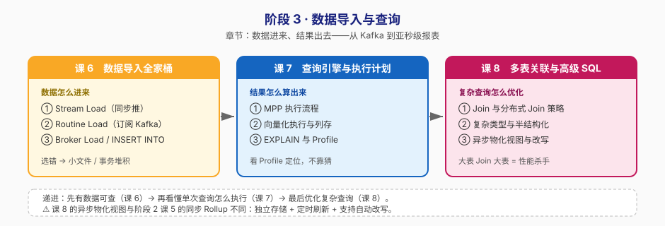

# 阶段 3：数据导入与查询

> 所属课程：Apache Doris ｜ 故事章节：**数据进来、结果出去**——从 Kafka 到亚秒级报表 ｜ 上一阶段：[阶段 2](../2-数据建模/overview.md) ｜ 下一阶段：[阶段 4](../4-分布式运维与生产落地/overview.md)

## 🎯 本阶段目标

- 为不同数据源选对导入方式，能搭一条从 Kafka 到 Doris 的实时链路
- 看懂 MPP + 向量化执行是怎么配合的，能用 EXPLAIN 和 Profile 定位慢查询瓶颈
- 掌握多表关联与半结构化数据处理，并知道什么时候该上异步物化视图

## 📍 学习重点

- **导入方式的选择**：Stream Load 同步推、Routine Load 常驻订阅 Kafka、Broker Load 拉对象存储——选错方式会导致小文件、事务堆积或延迟
- **Profile 而不是猜**：慢查询优化的第一件事是打开 Profile 看时间花在哪个算子，而不是凭经验调参数
- **分布式 Join 的代价**：Broadcast / Shuffle / Colocate 三种策略，为什么大表 Join 大表是性能杀手

## ✅ 必须掌握的知识点

| 知识点 | 所属课 | 学完应能 |
|--------|--------|----------|
| Stream Load | 课 6 | 用 curl 推一个 CSV/JSON 文件进 Doris，看懂返回结果里的导入状态 |
| Routine Load | 课 6 | 创建常驻 Kafka 导入任务，用 `SHOW ROUTINE LOAD` 监控 lag |
| Broker Load 与 INSERT INTO | 课 6 | 从对象存储批量拉数据，并说清三种方式的适用边界 |
| MPP 执行流程 | 课 7 | 画出一条 SQL 从 FE 解析到 BE 并行执行的完整流程 |
| 向量化执行与列存 | 课 7 | 解释为什么列存 + 向量化能充分发挥 CPU 能力 |
| EXPLAIN 与 Profile | 课 7 | 对着 Profile 说出"时间花在哪个算子、为什么" |
| Join 与分布式 Join 策略 | 课 8 | 为不同大小的表组合选对 Join 策略，能看懂 Colocate Join 的前提 |
| 复杂类型与半结构化数据 | 课 8 | 用 VARIANT / Array / Map 处理动态 schema 的日志数据 |
| 异步物化视图与查询改写 | 课 8 | 建一个异步物化视图，验证查询被自动改写命中它 |

> ⚠️ **易混提示**：本阶段的**异步物化视图**与阶段 2 课 5 的**同步 Rollup** 不同——异步 MV 独立存储、定时刷新、支持查询自动改写；Rollup 与基表强绑定、导入时同步更新。

## 🗺️ 本阶段路径图

## 本阶段产出

- [x] `lessons/lesson-06-数据导入全家桶.md`
- [x] `lessons/lesson-07-查询引擎与执行计划.md`
- [x] `lessons/lesson-08-多表关联与高级SQL.md`

## 阶段状态

**已完成**（课 6、课 7、课 8 均已完成，2026-09-02；阶段 3 全部交付，下一阶段进入阶段 4 分布式运维）

## 核心结论（随课交付追加）

> 每课完成后在此追加一句本课的核心结论。

### 课 8《多表关联与高级 SQL》核心结论（2026-09-02）

**第一原则：Join 慢，慢在中间结果，不慢在策略。** 本课最反直觉的一组数据——
`orders`（2150 万）自关联，按 `user_id`（高基数，几乎一对一）Join 产出 **24.5 万行**，耗时 **53/57/70 ms**；
按 `province`（低基数，多对多）Join 产出 **156 亿行**，耗时 **4 分 44 秒**。
**相差约 4000 倍，但两次用的都是同一种 Join 策略。** 策略决定"怎么搬数据"，
中间结果规模决定"搬完要做多少次比较"。**先问中间结果有多少行，再问用哪个策略。**

**四种策略的代价排序**（`join op` 是唯一确定性证据）：

| EXPLAIN 标记 | 搬什么 | 前提 | 实测复现 |
|---|---|---|---|
| `BROADCAST` | 右表 × 节点数 | 右表够小 | `fact_1m JOIN dim_region` |
| `BUCKET_SHUFFLE` | 只搬右表 | Join 键 = 左表分桶键 | `orders JOIN perf_wide` |
| `PARTITIONED` | 左右都搬（最贵） | 无路可走时 | `orders JOIN orders_dup`（user_id） |
| `COLOCATE[]` | **零** | 同组同桶同副本 + IsStable | `orders JOIN fact_prov` |

**⚠️ 单机单 BE 测不出四种策略的耗时差异**（网络代价恒为 0）——
所以本课全部改用 `join op` 这个**确定性字段**作证据，不编造性能数字。
Colocate 用 `disable_colocate_plan` 开关做了对照：`true` → `BUCKET_SHUFFLE`，`false` → `COLOCATE[]`，一个变量标记就变，这是因果关系的证明。

**别靠猜策略，看 `join op`**：实测同一张 8 行右表 `dim_region`，左表换成 `orders`（分桶键也是 province）后，
`BROADCAST` 变成了 `BUCKET_SHUFFLE`——"右表够小"与"命中分桶键"两个条件同时成立，
优化器按代价估算二选一。**策略是算出来的，不是写出来的。**

**Runtime Filter 是 Join 专属武器**：右表扫完后生成 `RF000[min_max]`（范围）+ `RF001[in_or_bloom]`（布隆），
推给左表扫描算子提前过滤。`runtime_filter_mode=OFF` 后这两行消失，开关对照直接证明它在工作。

**VARIANT vs JSON**（同一份 5 万条日志）：

| | 过滤耗时 | 聚合耗时 | 磁盘 |
|---|---|---|---|
| VARIANT | 16–26 ms | 49–67 ms | **3.49 MB** |
| JSON | 129–156 ms | 237–287 ms | **7.37 MB** |
| 差距 | **6–9 倍** | **约 6 倍** | **2.1 倍** |

原因是 VARIANT 写入时把 JSON 自动拆成**列存子列**（`payload.city` / `payload.cost` / `payload.device`），
能享受列裁剪、压缩、向量化；JSON 只是一个大字符串，只能全量解析。
VARIANT 磁盘 3.49 MB 已接近结构化存储（3.46 MB）——**用 0.03 MB 的代价换来了动态 schema**。

**VARIANT 两条铁律**（都是实测踩出来的）：
1. **WHERE 里可直接用，GROUP BY / ORDER BY 前必须 `CAST(payload['x'] AS VARCHAR(32))`**——
   否则报 `variant column must use with specific function`。
2. **数组下标从 1 开始**，`tags[0]` **静默返回 NULL**（不报错），`tags[1]` 才是第一个元素。

**异步物化视图：MV 能回答汇总问题，不能回答明细问题。** 实测 475 ms → 18 ms（**10–25 倍**），
MV 只有 23360 行而基表 2150 万行。透明改写的判据在 EXPLAIN 末尾的 `MATERIALIZATIONS` 段：
`MaterializedViewRewriteSuccessAndChose`（命中并选用）/ `SuccessButNotChose`（改写成功但不如直查）/ `RewriteFail`（失败）。

**⚠️ 改写不稳定是正常现象**：同一条聚合 SQL 交替执行，有时 18 ms 有时 475 ms，
取决于优化器基于代价的选择，**不是配置错误**。判断改写是否生效要看 MATERIALIZATIONS 段，不能只看耗时。

**三个必须记住的 MV 操作坑**：
1. `REFRESH` 是**异步提交**，返回成功 ≠ 刷完，要等几秒。
2. **MV 分区名 ≠ 基表分区名**（基表 `p202501` → MV `p_20250101_20250201`），
   按分区刷新前必须 `SHOW PARTITIONS FROM <mv>` 查真实名字。
3. `SHOW MATERIALIZED VIEWS` 在本机**报语法错误**（五种写法全试过），
   只能用 `SHOW CREATE MATERIALIZED VIEW <name>` 或 `SHOW TABLES`。

**给课 9 的资产**：`SHOW PROC '/colocation_group'` 已跑通（IsStable=true）；
本机 1 FE + 1 BE 的拓扑限制在课 8 已彻底暴露（测不出网络代价与横向扩展），
课 9 讲副本与扩缩容时大概率只能讲原理——`ADD BACKEND` / `DECOMMISSION` 在单机上会 `insufficient backend`。

---

### 课 7《查询引擎与执行计划》核心结论（2026-09-02）

**第一原则：看账单，不看计划。** EXPLAIN 是计划（打算怎么花钱），Profile 是账单（钱花在哪了）。
优化查询永远要看账单。判据只有一条：**`ExecTime` 大 = 它自己慢，`WaitForDependency` 大 = 它的上游慢**。
读反了就会去优化一个 `ExecTime` 只有 18 微秒、却等了 196 毫秒的聚合算子——那是南辕北辙。

**实测最硬的一组数字**（同一张表、同样 200 万行、同样 `COUNT+SUM`，只改 SELECT 的列）：

| | 扫 1 个窄列 | 扫 3 个 500B 宽列 | 倍数 |
|---|---|---|---|
| `ScanBytes`（磁盘读） | 15.26 MB | 22.92 MB | **1.5×** |
| `OutputBlockBytes`（送出去） | 15.26 MB | **2.82 GB** | **185×** |
| Scan `ExecTime` | 3.1 ms | 163.7 ms | **52×** |
| `Total` | 15 ms | 192 ms | **13×** |

**瓶颈不在磁盘 IO，在解压、内存拷贝、传递。** 磁盘读只多 1.5 倍，耗时却多 52 倍。
这个结论直接推翻"扫描慢就去买更快的 SSD"的直觉——钱应该花在**少扫几列**上。

**列存 + 向量化是天生一对**：列存让同列数据在磁盘/内存里连续，向量化把它切成 Block 批量处理
（实测 200 万行切 264 块 ≈ 7576 行/块，`batch_size` 上限 8160；宽列因每块塞满 8 MB 而切 368 块）。
200 万行、逻辑约 2.9 GB 的表，磁盘只占 **5.17 MB**（压缩约 550 倍，刻意构造的极端值，真实业务约 3–10 倍）。

**三个"本机测不出"，已诚实标注，不要拿去当普遍规律**：
1. **向量化开关无效**——Doris 4.x 已全面向量化，开关是历史遗留（关 18ms / 开 17ms，无差异）。
   向量化的价值要用 `BlocksProduced` / `batch_size` 这类**机制证据**说明，不是开关对比。
2. **调大 `parallel_pipeline_task_num` 不提速**——Scan 单次 `ExecTime` 从 16.26ms 降到 2.85ms（5.7 倍），
   但查询 `Total` 192ms → 191ms 几乎没变。证据：Scan 的 `RowsProduced` 里 `sum = max = 2.0M`，
   **扫描器只有 1 个**，它是木桶上最短的那块板。这是单机单 BE 的结论，多 BE 集群上不成立。
3. **MPP 横向扩展能力**——只有 1 台 BE，没有横向可言。

**给课 8 的资产**：Profile 抓取三板斧已跑通（课 5 曾失败）；
`HASH_JOIN_OPERATOR` 与 `runtime filters: RF000[min_max]` 的 EXPLAIN 输出已看到，课 8 展开原理。

---

### 课 6《数据导入全家桶》核心结论（2026-09-02）

**第一原则：攒批。** 导入事务是「按次付费」而非「按行付费」——每次事务都要走一遍
开启事务 → 规划分发 → 写盘 → 提交发布的固定开销。实测：1000 次单行 INSERT 耗时 **34.42 秒**，
1 次批量 INSERT（1000 行）**1.03 秒**，1 次 Stream Load（**10000 行**，10 倍数据）**0.17 秒**。
把 N 次小事务合并成 1 次大事务，省下的是 N-1 次固定开销。

**四种方式的定位**：Stream Load（推·同步·本地文件）、Routine Load（订阅·常驻·Kafka，唯一常驻选项）、
Broker Load（拉·异步·对象存储，支持通配符批量）、INSERT INTO（SQL 写入·每条一事务·只用于小数据）。
选型两步问：数据在哪（决定推还是拉）→ 一次还是常驻（决定要不要 Routine Load）。

**三个实测踩到的坑**：
1. `strict_mode` 默认 `false`，脏值被**静默转成 NULL** 且 `Status` 仍为 `Success`、`FilteredRows=0`
   ——导入后不校验就会带着错账跑。生产建议显式设 `strict_mode:true`。
2. Routine Load 的默认 `max_filter_ratio` 是 **1.0**，与 Stream Load 的默认 **0** 相反；
   且 `max_batch_rows` 有 **200000 硬下限**，ALTER 改小直接报错。
3. Docker 环境 Kafka 连不上，九成是 `advertised.listeners` 配了 `localhost`
   ——容器里的 localhost 是它自己；应改用容器主机名 + 共享网络。

**导入即 UPSERT**：Unique 表上重复导入相同主键是覆盖而非追加（实测 order_id=1 的
「广东/100.00」被「北京/999.99」覆盖），这让 Kafka 重复投递天然幂等——是流式场景推荐 Unique 表的根本原因。
