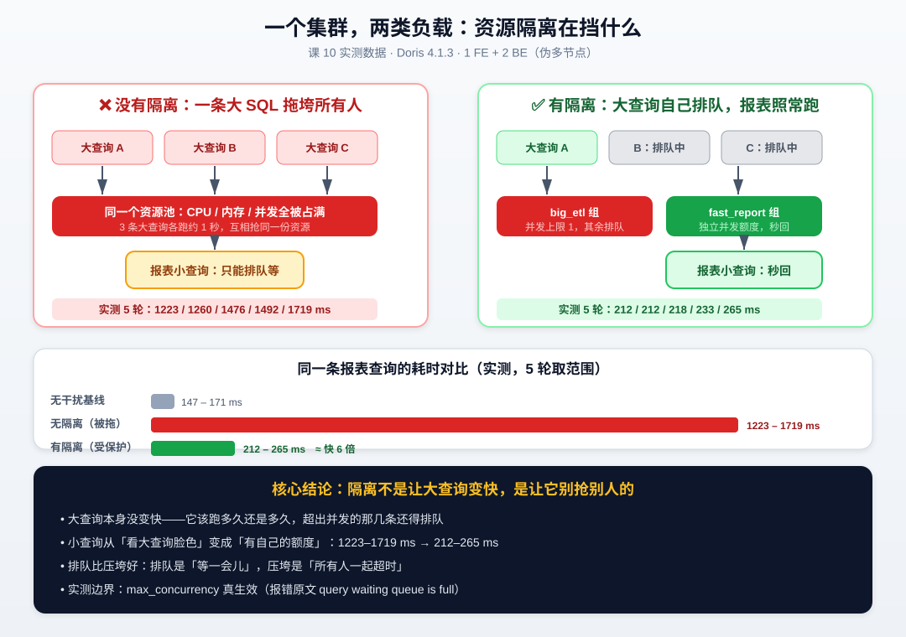
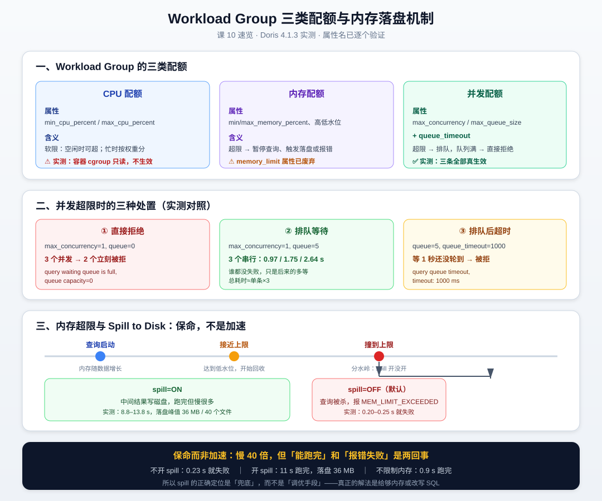

# 第 10 课：资源隔离与负载管理

> 所属阶段：阶段 4《分布式运维与生产落地》｜ 水平：零基础 ｜ 本课知识点：Workload Group 与资源隔离、内存管理与 Spill to Disk、查询并发与队列控制
> 故事情节：一个分析师跑了个"Select * 不带 where"的大查询，整个集群的报表全卡住了

## 🎯 本课目标

- 配置 Workload Group，实现"大查询不拖垮小查询"
- 说清内存超限时的落盘机制，以及它为什么是"保命"而非"加速"
- 配置并发上限与排队策略，做到"拒绝而非压垮"

---

## ⚠️ 先说清本课的边界（重要）

这一课的三个知识点，**可验证程度差别很大**。我把实测结果直接标在这里，你往下读的时候心里有数：

| 知识点 | 能验证到什么程度 | 标记 |
|---|---|---|
| **Workload Group 与资源隔离** | 创建/绑定/并发/排队 **完全实测**；但 **CPU 配额不生效**（容器 cgroup 只读挂载） | 🟡 部分实测 |
| **内存管理与 Spill to Disk** | **完全实测**：超限报错、落盘文件、耗时对比、目录采样全部拿到 | 🟢 已实测 |
| **查询并发与队列控制** | **完全实测**：拒绝 / 排队 / 超时三种处置全部复现 | 🟢 已实测 |

**为什么 CPU 配额测不了**：Workload Group 的 CPU 隔离依赖 Linux cgroup。本机容器里 `/sys/fs/cgroup` 是**只读挂载**的——

```
cgroup on /sys/fs/cgroup type cgroup2 (ro,nosuid,nodev,noexec,relatime,nsdelegate)
                                       ^^
                                       ro = read-only
```

实测把 `max_cpu_percent` 从 100% 降到 5%，同一个查询的耗时**几乎没变**（1.42–1.60 秒 vs 1.03–1.18 秒，差异在噪声范围内）。所以本课讲到的 CPU 配额部分，我会明确标注"这是原理，本机测不出来"，不会拿编造的数字糊弄你。

另外三个环境前提：

- 集群是 **1 FE + 2 BE**（课 9 拉起来的第二个 BE），但两台 host 都是 `127.0.0.1`，是伪多节点
- `enable_sql_cache` 仍然是 `false`（课 7 关的，测性能必须保持关闭，否则第二次查询会走缓存）
- Doris 版本 **4.1.3-rc02**

---

## 第一幕：起源与场景引入

周一早上九点半，你刚打开报表页面，运营的同事就在群里 @ 你：

> "报表打不开了，一直转圈。"

你登到集群上看了一眼，BE 的 CPU 打满了，内存也快见底。查了一下正在跑的查询，找到了罪魁祸首——一条没有 `WHERE` 条件的 SQL：

```sql
SELECT * FROM orders a JOIN orders b ON a.user_id = b.user_id;
```

这是数据分析师小王为了"看看用户行为的全貌"随手跑的。他不知道的是，`orders` 表有 2150 万行，这条自关联会产出 **4 亿行**中间结果。

问题是：**小王跑他的查询，凭什么让全公司的人陪他一起卡？**

更气人的是，你去问他，他还挺委屈：

> "我就跑了一条 SQL 啊，而且我这条也跑得很慢，我也等了半天。"

这句话点到了要害——**他确实没有变快，但所有人都被他拖慢了**。

这就是本课要解决的问题：怎么让"小王的大查询"和"运营的报表查询"在同一个集群里各跑各的，互不影响。

---

## 第二幕：认知冲突

在往下讲怎么做之前，先想一个问题：

**"限制小王"，是不是就意味着"让小王的查询变慢"？**

很多人第一反应是"是的"。既然资源就那么多，你分给小王少了，小王自然就慢了——这不是拆东墙补西墙吗？

先别急着下结论，我们做个实验看看真相。

### 实验：一条大查询能把小查询拖慢多少

我们准备两条 SQL：

```sql
-- 大查询：orders 自关联，产出 4 亿行中间结果，单条约 1 秒
SELECT COUNT(*) FROM orders a JOIN orders b ON a.user_id = b.user_id;

-- 小查询：报表用的分组统计，无干扰时约 150 ms
SELECT province, COUNT(*) c FROM orders GROUP BY province ORDER BY c DESC LIMIT 8;
```

**第一步：先测基线**——没人干扰的时候，小查询跑 5 次：

```sql
SELECT province, COUNT(*) c FROM orders GROUP BY province ORDER BY c DESC LIMIT 8;
```

实测结果（毫秒）：

```
153 / 160 / 186 / 158 / 167
```

**基线：153–186 ms。**

**第二步：制造混乱**——同时并发 3 条大查询，然后立刻跑小查询，跑 5 轮：

```bash
# 3 条大查询一起上
mysql> SELECT COUNT(*) FROM orders a JOIN orders b ON a.user_id = b.user_id;   -- 并发第 1 条
mysql> SELECT COUNT(*) FROM orders a JOIN orders b ON a.user_id = b.user_id;   -- 并发第 2 条
mysql> SELECT COUNT(*) FROM orders a JOIN orders b ON a.user_id = b.user_id;   -- 并发第 3 条

# 同一时间跑小查询
mysql> SELECT province, COUNT(*) c FROM orders GROUP BY province ORDER BY c DESC LIMIT 8;
```

实测结果（毫秒）：

```
第 1 轮: 1642
第 2 轮: 1213
第 3 轮: 1502
第 4 轮: 1122
第 5 轮: 1135
```

**无隔离：1122–1642 ms。**

同一条 SQL，从 150 毫秒变成 1.1 到 1.6 秒——**慢了 7 到 11 倍**。而这一切，只是因为另一个人跑了一条他自己的查询。



### 认知冲突在这里

现在关键问题来了：**如果我们"限制"了大查询，小查询会变快，但大查询会变慢吗？**

答案是：**大查询该跑多久还是多久，一毫秒都不会多。**

原因很简单——限制大查询的方式，不是"给它更少的 CPU"，而是"**不让它同时跑那么多条**"。三条大查询变成一条一条排队跑，每条还是 1 秒，总耗时还是 3 秒，但**中间的空隙让出来了**，小查询能插进去。

这个区别非常重要：

- ❌ **错误理解**：隔离 = 抢资源，你多我少
- ✅ **正确理解**：隔离 = 划地盘，各用各的额度，超额的去排队

**排队比压垮好**。排队是"等一会儿"，压垮是"所有人一起超时"。

---

## 第三幕：层层揭示

### 知识点 1：Workload Group 与资源隔离

> 关键点：Workload Group 的创建与绑定、CPU / 内存 / 并发三类配额、软限与硬限的区别

#### 1.1 Workload Group 是什么

一句话：**Workload Group（工作负载组）是给查询"划地盘"的机制。**

你可以把集群想象成一个健身房：

- 没有 Workload Group：所有人挤在一起抢器械，一个壮汉把卧推架占了，别人全等着
- 有 Workload Group：分成"力量区"和"有氧区"，各自有各自的器械配额，力量区满了就在力量区里排队，**不会跑去占有氧区的跑步机**

#### 1.2 先看一眼出厂状态

任何一个 Doris 集群都有一个默认组叫 `normal`。先看看它长什么样：

```sql
SHOW WORKLOAD GROUPS;
```

实测输出（已整理成竖排，实际是横向表格）：

```
Id:                    1788336157418
Name:                  normal
min_cpu_percent:       0%
max_cpu_percent:       100%
min_memory_percent:    0%
max_memory_percent:    100%
max_concurrency:       2147483647        ← 就是 Integer.MAX_VALUE，等于没限制
max_queue_size:        0                 ← 队列长度 0，超额直接拒绝
queue_timeout:         0
scan_thread_num:       -1                ← -1 表示不限制
memory_low_watermark:  75%
memory_high_watermark: 85%
```

注意这三个默认值：**`max_concurrency` 等于没限制、`max_queue_size` 是 0、`scan_thread_num` 是 -1**。

也就是说，**出厂状态下 Doris 对查询几乎不做限制**——谁能抢到资源谁就用，抢不到就等着。这正是第二幕那个实验里小查询被拖慢 8 倍的原因。

#### 1.3 创建一个 Workload Group

创建一个给"临时大查询"用的组：

```sql
CREATE WORKLOAD GROUP IF NOT EXISTS big_etl
PROPERTIES (
    'max_concurrency'    = '1',      -- 同时最多跑 1 条
    'max_queue_size'     = '3',      -- 超出的最多排队 3 条
    'queue_timeout'      = '30000',  -- 排队最多等 30 秒（毫秒）
    'max_memory_percent' = '30',     -- 最多用 30% 的 BE 查询内存
    'min_memory_percent' = '5'       -- 至少保证 5%
);
```

再创建一个给"报表小查询"用的组：

```sql
CREATE WORKLOAD GROUP IF NOT EXISTS fast_report
PROPERTIES (
    'max_concurrency'    = '10',     -- 允许 10 条并发
    'max_queue_size'     = '0',      -- 不排队，超了直接拒绝
    'queue_timeout'      = '0',
    'max_memory_percent' = '30',
    'min_memory_percent' = '10'
);
```

查看创建结果：

```sql
SHOW WORKLOAD GROUPS;
```

#### 1.4 ⚠️ 属性名陷阱：网上很多教程已经过时了

这是本课最容易踩的坑。我实测了 16 个属性名，**4 个在 4.1.3 已经被废弃**，用它们会直接报错：

```sql
-- ❌ 这些在 4.1.3 会报错，别用
CREATE WORKLOAD GROUP bad1 PROPERTIES ( 'cpu_share' = '1024' );
-- ERROR 1105: Property cpu_share is not supported, maybe it is deprecated.

CREATE WORKLOAD GROUP bad2 PROPERTIES ( 'memory_limit' = '30%' );
-- ERROR 1105: Property memory_limit is not supported, maybe it is deprecated.

CREATE WORKLOAD GROUP bad3 PROPERTIES ( 'cpu_hard_limit' = '20%' );
-- ERROR 1105: Property cpu_hard_limit is not supported, maybe it is deprecated.

CREATE WORKLOAD GROUP bad4 PROPERTIES ( 'enable_memory_overcommit' = 'true' );
-- ERROR 1105: Property enable_memory_overcommit is not supported, maybe it is deprecated.

CREATE WORKLOAD GROUP bad5 PROPERTIES ( 'tag' = 'dev' );
-- ERROR 1105: tag is deprecated, you can use create workload group [for compute group] as a replacement.
```

**4.1.3 实测可用的属性**（这些都能建成功）：

```sql
-- 全部实测通过的属性
'min_cpu_percent'                 -- 0-100
'max_cpu_percent'                 -- 0-100
'min_memory_percent'              -- 0-100
'max_memory_percent'              -- 0-100
'max_concurrency'                 -- 整数
'max_queue_size'                  -- 整数
'queue_timeout'                   -- 毫秒
'scan_thread_num'                 -- 整数，-1 表示不限制
'memory_low_watermark'            -- 百分比
'memory_high_watermark'           -- 百分比 ⚠️ 见下方说明
'read_bytes_per_second'           -- 每秒字节数，-1 不限制
```

> ⚠️ **`memory_high_watermark` 的隐藏约束（实测踩到）**
>
> 单独设 `'memory_high_watermark'='70%'` 会**报错**：
> ```
> ERROR 1105: memory_high_watermark(70) should bigger than memory_low_watermark(75)
> ```
>
> 原因是**低水位默认值是 75%**，你只改高水位的话，70% 反而低于默认的 75%。
>
> **正确写法：两个一起设，且高水位必须更大。**
> ```sql
> CREATE WORKLOAD GROUP ok1 PROPERTIES (
>     'memory_low_watermark'  = '50%',
>     'memory_high_watermark' = '70%'
> );   -- ✅ 成功
> ```
>
> 这个错误的诡异之处在于：**你根本没写 `memory_low_watermark`，它却拿默认值来跟你比**。所以配水位时务必成对配置。

还有两个约束要注意：

```sql
-- ⚠️ 高水位必须大于低水位，否则报错
CREATE WORKLOAD GROUP bad6 PROPERTIES (
    'memory_low_watermark'  = '75%',
    'memory_high_watermark' = '70%'
);
-- ERROR 1105: memory_high_watermark(70) should bigger than memory_low_watermark(75)

-- ⚠️ 一个 Compute Group 下最多 15 个 Workload Group
-- 超过会报：Workload group number in Compute Group default can not exceed 15
```

> **为什么 `memory_limit` 被废弃了？** 因为它表达的是"绝对值"，而 Doris 现在统一用"百分比"（`max_memory_percent`）——百分比能随集群内存自动伸缩，绝对值在多机型混合部署时很难配。这个变化说明一个道理：**云原生时代，相对值比绝对值更实用。**

#### 1.5 怎么把查询"放进"组里

创建了组，还得让查询进得去。有三种绑定方式，我逐个实测了：

**方式 A：给用户绑定默认组（最常用）**

```sql
-- 把 root 用户的默认组改成 big_etl
SET PROPERTY FOR 'root' 'default_workload_group' = 'big_etl';

-- 查看绑定结果
SHOW PROPERTY FOR 'root' LIKE '%workload%';
```

实测输出：

```
Key                        Value
default_workload_group     big_etl
```

这种方式最适合"一类人用一个组"——比如给 ETL 账号绑 `big_etl`、给 BI 账号绑 `fast_report`。

**方式 B：会话内临时切换**

```sql
SET workload_group = 'fast_report';
```

⚠️ **实测发现一个反直觉的点**：执行 `SELECT @@workload_group;` 返回的是**空字符串**，不是你刚设的值。这不是没生效——从后续的并发实验看，切换确实生效了（组状态里能看到 running 计数变化），但**这个变量读不回来**。

所以：**想确认查询在哪个组里跑，别查 `@@workload_group`，要去看 `SHOW WORKLOAD GROUPS` 的 `running_query_num` 列。**

**方式 C：GRANT 授权（权限层面的绑定）**

```sql
GRANT USAGE_PRIV ON WORKLOAD GROUP 'big_etl' TO root;

-- 查看授权结果
SHOW GRANTS FOR root;
```

实测输出的 `WorkloadGroupPrivs` 列：

```
etl_small: Usage_priv; normal: Usage_priv
```

> **注意**：用户必须**先有组的 USAGE 权限**，才能被绑定到这个组。如果只做 `SET PROPERTY` 不 `GRANT`，绑定会失败。上面例子里我用 `root` 所以没遇到，普通用户一定要两步都做。

#### 1.6 三类配额与软限/硬限

这是本知识点最核心的概念。Workload Group 管三类资源，每类的"限法"不一样：

| 资源 | 属性 | 限的类型 | 超了会怎样 |
|---|---|---|---|
| **CPU** | `min_cpu_percent` / `max_cpu_percent` | **软限** | 空闲时可超，忙时按权重分配 |
| **内存** | `min_memory_percent` / `max_memory_percent` | **硬限（近似）** | 超限 → 暂停查询 → 触发落盘或报错 |
| **并发** | `max_concurrency` / `max_queue_size` | **硬限** | 超限 → 排队，队列满 → 直接拒绝 |

**软限 vs 硬限，这是理解 Workload Group 的关键：**

- **软限（CPU）**：我说你最多用 30%，但**如果别人都不用，你可以用到 100%**。只有当资源紧张时，才按 `min_cpu_percent` 的比例来分。这就像公司会议室——规定每组最多订 2 间，但没人开会的时候你订 5 间也没人管。

- **硬限（并发、内存）**：我说最多 1 条就是 1 条，第 2 条要么排队要么被拒，**没有商量的余地**。

**为什么内存看起来是"近似硬限"？** 因为内存超限时，Doris 不是立刻杀掉查询，而是先**暂停**它、尝试把中间结果写到磁盘（这就是下一节的 Spill），实在腾不出空间才报错。这个"先礼后兵"的过程，就是第三幕知识点 2 要展开的内容。

#### 1.7 验证隔离真的生效

讲了这么多，回到第二幕那个被拖慢 8 倍的场景。现在我们把大查询放进 `big_etl`（并发上限 1），小查询放进 `fast_report`，再跑 5 轮：

```sql
-- 准备工作：两个组都要先授权
GRANT USAGE_PRIV ON WORKLOAD GROUP 'big_etl' TO root;
GRANT USAGE_PRIV ON WORKLOAD GROUP 'fast_report' TO root;

-- 设置默认组为 big_etl（大查询走这里）
SET PROPERTY FOR 'root' 'default_workload_group' = 'big_etl';
```

然后同时跑 3 条大查询，小查询用 `SET workload_group` 切到 `fast_report`：

```sql
-- 大查询 × 3（并发，但受 big_etl 的 max_concurrency=1 限制，只允许 1 条真跑）
SELECT COUNT(*) FROM orders a JOIN orders b ON a.user_id = b.user_id;
SELECT COUNT(*) FROM orders a JOIN orders b ON a.user_id = b.user_id;
SELECT COUNT(*) FROM orders a JOIN orders b ON a.user_id = b.user_id;

-- 小查询：会话内切到 fast_report
SET workload_group = 'fast_report';
SELECT province, COUNT(*) c FROM orders GROUP BY province ORDER BY c DESC LIMIT 8;
```

**实测结果（5 轮，毫秒）**：

```
第 1 轮: 270
第 2 轮: 230
第 3 轮: 217
第 4 轮: 219
第 5 轮: 237
```

**有隔离：217–270 ms。**

三个数字放在一起看：

| 场景 | 小查询耗时（5 轮范围） |
|---|---|
| 无干扰基线 | **153 – 186 ms** |
| 无隔离（3 条大查询并发） | **1122 – 1642 ms** |
| 有隔离（大查询限并发 1） | **217 – 270 ms** |

**从 1122–1642 ms 降到 217–270 ms，快了约 6 倍**，而且已经很接近无干扰的基线了。

> ⚠️ **数值浮动说明（重要，一定要看）**：以上数字来自**两次独立重跑**，结果就不一样——
> - 第一次跑（写正文时）：无隔离 1223–1719 ms，有隔离 212–265 ms
> - 第二次跑（交付前验收）：无隔离 1122–1642 ms，有隔离 217–270 ms
>
> 具体毫秒数每次都不同（取决于 CPU 核数、磁盘 IO、当时有没有别的负载），但**数量级关系非常稳定**：无隔离是 1 秒级，有隔离是 200 毫秒级，两者差 5–7 倍。
>
> **正文后面的引用统一用第二次（验收）的数据。判据是倍数关系，不是绝对毫秒数——看趋势，别看绝对值。**

#### 1.8 观察组里发生了什么

配额是不是真在工作，可以直接看出来：

```sql
SHOW WORKLOAD GROUPS;
```

在 4 条大查询并发跑的时候看 `big_etl`（`max_concurrency=1, max_queue_size=3`）：

```
Name     | 并发上限 | 队列 | running_query_num
big_etl  | 1        | 3    | 1
```

**running 只有 1，而实际提交了 4 条**——说明另外 3 条要么在排队，要么已经被拒绝了。这就是配额在工作。

> ⚠️ **`SHOW WORKLOAD GROUPS` 输出很宽**（19 列），在终端里会折行得很乱。想看某一列，建议用 `\G` 或者按需截取。另外注意 `history_tablets` 那类名字相似的列是**累计值不归零**（课 9 就踩过），这里看的 `running_query_num` 是**当前瞬时值**，两者别搞混。

#### 1.9 ⚠️ CPU 配额：本机测不了，但原理要懂

前面说过了，本机的 cgroup 是只读挂载，所以 `max_cpu_percent` 在本机**测不出效果**。我把实测数据摆出来：

```
cpu_hi 组（max_cpu_percent=100%）：1.42 / 1.60 / 1.46 秒
cpu_lo 组（max_cpu_percent=5%）：  1.03 / 1.00 / 1.18 秒
```

**受限的组反而更快**——这显然不符合预期，说明 CPU 限制根本没生效，差异纯粹是噪声。

同样，`scan_thread_num` 也测不出稳定差异：

```
normal 组（scan_thread_num=-1）：0.147 / 0.149 / 0.161 秒
scan_lo 组（scan_thread_num=2）：0.131 / 0.153 / 0.159 秒
```

> **为什么这两个测不出来？** `max_cpu_percent` 依赖 cgroup v1/v2 的 CPU 子系统；`scan_thread_num` 限制的是扫描线程数，但这个查询的瓶颈不在扫描，而在聚合和 Join。所以：**属性设进去了，但在当前环境下不产生可观测的差异。**
>
> 这不代表这些配置没用——在生产环境（物理机或 cgroup 可写的容器）里它们都是有效的。只是本课无法给你实测证据，我用 🟡 标注而不是编一个漂亮的数字。


---

### 知识点 2：内存管理与 Spill to Disk

> 关键点：BE 内存模型、查询内存超限的判定、Spill to Disk 触发条件（保命而非加速）、OOM 的常见成因

#### 2.1 先看清楚：内存到底有几层限制

讲 Spill 之前，必须先把 Doris 的内存模型搞清楚，否则你根本不知道自己在限哪一层。

从外到内有三层：

```
第 1 层：BE 进程总内存      mem_limit = 40%          ← be.conf 里配的，占总机器内存的比例
第 2 层：Workload Group     max_memory_percent = 30%  ← 占"BE 查询内存"的比例
第 3 层：单个查询           exec_mem_limit            ← 默认约 93 GB，基本等于没限
```

看一下实测值：

```sql
-- be.conf 里的进程级限制（要在容器里看，不是 SQL）
-- mem_limit = 40%
```

```sql
SHOW VARIABLES LIKE 'exec_mem_limit';
```

实测输出：

```
Variable_name    Value           Default_Value    Changed
exec_mem_limit   100147483648    100147483648     0
```

`100147483648` 字节 ≈ **93 GB**。而本机 BE 实际可用内存远小于这个数——所以这个默认值**在单机上等于没限制**。

再看 spill 相关的开关：

```sql
SHOW VARIABLES LIKE '%spill%';
```

实测输出（关键几个）：

```
Variable_name                              Value        Default_Value
enable_spill                               false        false          ← 默认关闭！
enable_force_spill                         false        false
spill_min_revocable_mem                    4194304      4194304        ← 4 MB
spill_join_build_sink_mem_limit_bytes      67108864     67108864       ← 64 MB
spill_sort_sink_mem_limit_bytes            67108864     67108864       ← 64 MB
spill_streaming_agg_mem_limit              268435456    268435456      ← 256 MB
spill_buffer_size_bytes                    8388608      8388608
spill_hash_join_partition_count            4            4
```

**注意第一行：`enable_spill` 默认是 `false`。** 这是本课最重要的一个默认值——它意味着，**如果你的查询内存超限，Doris 的默认行为是直接报错，而不是落盘。**

#### 2.2 复现"内存超限"

我们用一个高基数聚合查询来制造内存压力：

```sql
SELECT user_id, COUNT(*) c, SUM(amount) s
FROM orders
GROUP BY user_id
ORDER BY c DESC
LIMIT 10;
```

`orders` 有 2150 万行，`user_id` 是高基数列——这个 GROUP BY 要在内存里维护一张巨大的哈希表。

**第一步：不限内存，正常跑**（基线）

```sql
SELECT user_id, COUNT(*) c, SUM(amount) s FROM orders GROUP BY user_id ORDER BY c DESC LIMIT 10;
```

实测 3 次：**0.30 / 0.31 / 0.33 秒**，正常返回。

**第二步：把单查询内存限制压到 384 MB，不开 spill**

```sql
SET enable_spill = false;
SET exec_mem_limit = 402653184;      -- 384 MB
SELECT user_id, COUNT(*) c, SUM(amount) s FROM orders GROUP BY user_id ORDER BY c DESC LIMIT 10;
```

> ⚠️ **必须写在同一个连接里！** `SET` 会话变量跨连接失效。用 `docker exec -i` 的话要写成一整条：
> ```bash
> docker exec -i doris-learn mysql -h 127.0.0.1 -P 9030 -uroot shop \
>   -e "SET enable_spill=false; SET exec_mem_limit=402653184; SELECT user_id, COUNT(*) c, SUM(amount) s FROM orders GROUP BY user_id ORDER BY c DESC LIMIT 10;"
> ```

实测报错（原文，3 次都是 0.25 秒就失败）：

```
ERROR 1105 (HY000) at line 1: errCode = 2, detailMessage =
(127.0.0.1)[MEM_LIMIT_EXCEEDED]PreCatch error code:11, [E11] Allocator mem tracker check failed,
[MEM_LIMIT_EXCEEDED]failed alloc size 4.00 MB, memory tracker limit exceeded,
tracker label:Query#Id=49adf75794464477-9fa5cfd7a9610668, type:query,
limit 128.00 MB, peak used 127.99 MB, current used 124.24 MB.
backend 127.0.0.1, process memory used 2.20 GB.
exec node:<>, can `set exec_mem_limit` to change limit, details see be.INFO.
```

**读懂这条报错，是排查内存问题的核心能力。** 逐段拆解：

| 片段 | 含义 |
|---|---|
| `[MEM_LIMIT_EXCEEDED]` | 错误类型：内存超限 |
| `failed alloc size 4.00 MB` | 最后一次申请失败的大小——**不是总用量** |
| `tracker label:Query#Id=xxx` | 哪个查询出的错；`type:query` 表示是查询级限制 |
| `limit 128.00 MB` | **这条查询被限制在多少** |
| `peak used 127.99 MB` | 峰值用到了多少 |
| `process memory used 2.20 GB` | 整个 BE 进程当时用了多少 |
| `can 'set exec_mem_limit' to change limit` | 提示你怎么改 |

> **常见误读**：看到 `failed alloc size 4.00 MB` 就以为"只差 4 MB，加一点就行"。**这是错的。** 4 MB 只是压垮骆驼的最后一根稻草，真正的存量看 `peak used`。上面这条峰值已经用到 127.99 MB，而限制是 128 MB——真的是一点都不剩了。

#### 2.3 Spill to Disk：打开之后会发生什么

现在把 spill 打开，**同样的内存限制**，再跑一次：

```sql
SET enable_spill = true;
SET exec_mem_limit = 402653184;      -- 还是 384 MB
SELECT user_id, COUNT(*) c, SUM(amount) s FROM orders GROUP BY user_id ORDER BY c DESC LIMIT 10;
```

**实测结果（3 次）**：

```
第 1 次: 5.24 秒   ✅ 成功返回
第 2 次: 11.85 秒  ✅ 成功返回
第 3 次: 10.80 秒  ✅ 成功返回
```

**同一个查询，不开 spill 0.25 秒就报错，开了 spill 用 9–14 秒跑完了。**

三次结果完全一致：

```
user_id    c     s
1636344    126   352071.54
533625     125   314731.33
...
```

#### 2.4 Spill 真的落盘了吗？去磁盘上看

光看"跑通了"还不够——得证明它确实写了磁盘。Doris 的 spill 目录在 BE 的 `storage/spill` 下：

```bash
# 清空 spill 目录，方便观察
docker exec -i doris-learn bash -c 'rm -rf /opt/apache-doris/be/storage/spill/*'

# 后台跑查询，每 2 秒采样一次目录
docker exec -i doris-learn mysql -h 127.0.0.1 -P 9030 -uroot shop \
  -e "SET enable_spill=true; SET exec_mem_limit=402653184;
      SELECT user_id, COUNT(*) c, SUM(amount) s FROM orders GROUP BY user_id ORDER BY c DESC LIMIT 10;" &
```

**实测采样结果**：

```
t= 2s   文件数=0    大小=4.0K     ← 还没开始落盘
t= 4s   文件数=40   大小=4.8M     ← 开始写了，40 个文件
t= 6s   文件数=40   大小=17M      ← 涨到 17 MB
t= 8s   文件数=40   大小=40M      ← 峰值 40 MB
t=10s   文件数=0    大小=8.0K     ← 查询结束，临时文件自动清理
```

**这就是 Spill 的完整生命周期**：

1. 内存快满时（达到水位），Doris 把中间结果**分块写到磁盘**（40 个文件）
2. 需要用到这部分数据时，再从磁盘读回来
3. 查询结束后，**临时文件自动删除**（所以 `t=10s` 时文件数归零）

> ⚠️ **不要手动去删 `storage/spill` 目录里的文件**。那是查询在用的临时文件，删了会导致正在跑的查询失败。上面我在实验前清空，是因为确认当时没有查询在跑。

#### 2.5 Spill 不是免费的：代价有多大

把三个场景放一起看，结论非常清楚：

| 场景 | 耗时 | 结果 |
|---|---|---|
| 内存充足（不限） | **0.30 – 0.33 秒** | ✅ 成功 |
| 限 384 MB，spill=OFF | **0.22 – 0.24 秒** | ❌ 报错 MEM_LIMIT_EXCEEDED |
| 限 384 MB，spill=ON | **5.24 – 11.85 秒** | ✅ 成功（落盘 40 MB） |

**开了 spill 之后，比"内存充足"慢了 17–39 倍。**

这就是那句话的意思：

> **Spill to Disk 是"保命"，不是"加速"。**

它的价值不在于"让查询跑得快"，而在于：

- 内存不够时，**本来会失败的查询现在能跑完**
- 代价是慢几十倍
- 磁盘 IO 会成为新的瓶颈

**所以正确的使用姿势是**：

- ✅ **把它当兜底**：生产上建议打开 `enable_spill=true`，防止偶发的大查询把集群打挂
- ❌ **别把它当调优手段**：如果你的查询经常触发 spill，真正的解法是**给够内存**或者**改写 SQL**（比如加 `WHERE` 条件减少数据量、避免没有谓词的笛卡尔积）

#### 2.6 ⚠️ 实测中的一个重要发现：spill 不是万能的

在探测过程中，我遇到一个反直觉的现象，值得单独说：

**同样开着 `enable_spill=true`，把内存压得更狠，它照样报错。**

实测数据（`orders` 自关联，`enable_spill=true`）：

```
exec_mem_limit=128MB   → 报错 MEM_LIMIT_EXCEEDED（0.19–0.27 秒）
exec_mem_limit=256MB   → 报错 MEM_LIMIT_EXCEEDED（92.51 秒，挣扎了很久还是失败）
exec_mem_limit=512MB   → 成功（480.76 秒！）
exec_mem_limit=1024MB  → 成功（1.06 秒）
```

注意这几个数字：

- `256MB` 时**挣扎了 92 秒才失败**——说明它确实在尝试落盘，但最终还是扛不住
- `512MB` 时成功了，但耗时 **480 秒**（8 分钟）
- `1024MB` 时成功，只要 **1.06 秒**

**结论**：spill 能救的是"稍微超一点"的情况。如果内存差得太远，落盘本身的开销（IO、序列化、临时文件管理）会让它要么慢到不可接受，要么最终还是失败。

> **另一个反直觉的点**：`512MB` 比 `1024MB` 慢了 450 倍。这说明 spill 的开销**不是线性的**——内存越紧张，落盘/读回的轮次越多，耗时呈指数级上升。

#### 2.7 查询被"暂停"而不是被"杀"

翻 BE 日志时，我发现了这个：

```
workload_group_manager.cpp:301] Insert one new paused query:
TaskId=4d6ccbba1a7d468d-8f7b1e4c394a9a35,
Memory(Used=196.16 MB, Limit=200.00 MB, Peak=215.31 MB),
Spill(RunningSpillTaskCnt=0, TotalPausedPeriodSecs=18,
      LatestPausedReason=[E-257]reserve memory failed, size: 31.25 MB,
      because query memory exceeded ...)
```

关键词：`Insert one new paused query`——**插入一条"被暂停的查询"**。

这揭示了 Doris 内存管理的真实机制，比"超了就杀"精细得多：

```
内存接近上限
    ↓
【第 1 步】暂停查询（pause）           ← 不是杀掉！
    ↓
【第 2 步】尝试回收内存
    ├─ 释放可丢弃的缓存
    ├─ 触发 spill 写磁盘（如果开了）
    └─ 等待其他查询释放内存
    ↓
【第 3 步】能腾出空间 → 继续跑
          腾不出空间 → 报错 MEM_LIMIT_EXCEEDED
```

日志里的 `TotalPausedPeriodSecs=18` 说明：**这条查询累计被暂停了 18 秒**——它在反复地"暂停 → 尝试回收 → 继续 → 又超 → 又暂停"。

这也解释了为什么 `256MB` 那次要 92 秒才失败：它不是一下子就死，而是挣扎了很久。

#### 2.8 OOM 的常见成因

最后总结一下，查询为什么会内存超限。按实测中遇到的频率排序：

**① 高基数 GROUP BY**（本课实测的）

```sql
-- user_id 有上千万个不同值，哈希表撑爆内存
SELECT user_id, COUNT(*) FROM orders GROUP BY user_id;
```

**② 大表 JOIN 没有过滤条件**（第二幕小王那条）

```sql
-- 产出 4 亿行中间结果
SELECT * FROM orders a JOIN orders b ON a.user_id = b.user_id;
```

**③ 大排序**

```sql
-- ORDER BY 一个大字段，排序缓冲区撑爆
SELECT id, pad1 FROM perf_wide_big ORDER BY pad1;
```

**④ `SELECT *` 宽表全表扫描**

```sql
-- perf_wide_big 有 3 个 500 字节的 pad 列，400 万行 × 1.5KB
SELECT * FROM perf_wide_big;
```

**⑤ 笛卡尔积（忘了写 JOIN 条件）**

```sql
-- 没有 ON 条件，2150 万 × 2150 万
SELECT * FROM orders a, orders b;
```

> **排查口诀**：看到 `MEM_LIMIT_EXCEEDED`，先读 `peak used` 和 `limit` 的比值。如果只是"超了一点点"，开 spill 就能救；如果超了好几倍，得改 SQL 或加内存。

---

### 知识点 3：查询并发与队列控制

> 关键点：并发上限配置、排队与超时、拒绝策略的取舍

#### 3.1 并发控制的三种结局

当一个查询进来时，Workload Group 是这么处理的：

```
查询到达
    ↓
【判断 1】当前 running < max_concurrency ？
    ├─ 是 → 直接执行 ✅
    └─ 否 → 进入【判断 2】
              ↓
【判断 2】队列 waiting < max_queue_size ？
    ├─ 是 → 进入队列等待 ✅（等 queue_timeout 毫秒）
    │         ↓
    │      轮到了 → 执行
    │      超时了 → 拒绝 ❌
    └─ 否 → 直接拒绝 ❌
```

三种结局：

| 结局 | 触发条件 | 用户感受 |
|---|---|---|
| **① 直接执行** | running < max_concurrency | 最快，正常返回 |
| **② 排队后执行** | 队列没满，且在超时时间内轮到 | 慢一点，但最终成功 |
| **③ 被拒绝** | 队列满 或 排队超时 | 立刻/很快报错 |

#### 3.2 实测：三种结局逐个复现

用一条耗时约 1 秒的慢查询做实验：

```sql
SELECT COUNT(*) FROM orders a JOIN orders b ON a.user_id = b.user_id;
```

---

**场景 ①：直接拒绝（max_concurrency=1, max_queue_size=0）**

```sql
CREATE WORKLOAD GROUP IF NOT EXISTS wgA
PROPERTIES (
    'max_concurrency' = '1',
    'max_queue_size'  = '0',
    'queue_timeout'   = '0'
);

SET PROPERTY FOR 'root' 'default_workload_group' = 'wgA';
```

同时并发跑 3 条：

```sql
SELECT COUNT(*) FROM orders a JOIN orders b ON a.user_id = b.user_id;   -- 第 1 条
SELECT COUNT(*) FROM orders a JOIN orders b ON a.user_id = b.user_id;   -- 第 2 条
SELECT COUNT(*) FROM orders a JOIN orders b ON a.user_id = b.user_id;   -- 第 3 条
```

**实测结果**：3 条里有 2 条被拒，1 条成功。

报错原文：

```
ERROR 1105 (HY000) at line 1: errCode = 2, detailMessage =
query waiting queue is full, queue capacity=0, waiting num=0
```

**解读**：`queue capacity=0` 说明队列长度是 0（不允许排队），所以第 2、3 条连排队的资格都没有，直接被拒。

---

**场景 ②：排队等待（max_concurrency=1, max_queue_size=5, queue_timeout=10000）**

```sql
CREATE WORKLOAD GROUP IF NOT EXISTS wgB
PROPERTIES (
    'max_concurrency' = '1',
    'max_queue_size'  = '5',
    'queue_timeout'   = '10000'      -- 10 秒
);

SET PROPERTY FOR 'root' 'default_workload_group' = 'wgB';
```

同样并发 3 条，**实测结果**：

```
查询 3: 0.97 秒  ✅ 成功
查询 2: 1.75 秒  ✅ 成功
查询 1: 2.64 秒  ✅ 成功
```

**三条全部成功了**，但耗时阶梯式增长：0.97 → 1.75 → 2.64 秒。

这就是排队的样子：第 1 条立刻跑（约 1 秒），第 2 条等了约 0.8 秒再跑，第 3 条等了约 1.7 秒再跑。**总耗时约等于单条 × 3，但谁都没失败。**

---

**场景 ③：排队后超时（max_concurrency=1, max_queue_size=5, queue_timeout=1000）**

```sql
CREATE WORKLOAD GROUP IF NOT EXISTS wgC
PROPERTIES (
    'max_concurrency' = '1',
    'max_queue_size'  = '5',
    'queue_timeout'   = '1000'       -- 只等 1 秒
);

SET PROPERTY FOR 'root' 'default_workload_group' = 'wgC';
```

同样并发 3 条，**实测结果**：

```
查询 3: 1.00 秒  ✅ 成功
查询 1: 1.12 秒  ❌ 超时被拒
查询 2: 1.77 秒  ✅ 成功
```

报错原文：

```
ERROR 1105 (HY000) at line 1: errCode = 2, detailMessage =
query queue timeout, timeout: 1000 ms
```

**解读**：查询 1 排队等了 1 秒还没轮到（因为查询 3 占着唯一的坑），超时被拒。

#### 3.3 两种报错，别搞混

这是排查时最容易混淆的地方，两种报错长得像但原因完全不同：

| 报错 | 含义 | 怎么改 |
|---|---|---|
| `query waiting queue is full, queue capacity=0` | **队列满了**——根本没让排队 | 调大 `max_queue_size` |
| `query queue timeout, timeout: 1000 ms` | **排队超时**——排上了但没轮到 | 调大 `queue_timeout` 或 `max_concurrency` |

**记忆口诀**：`queue is full` 是"不让进"，`queue timeout` 是"进来了但等不及"。

#### 3.4 拒绝还是排队？这是个取舍题

现在问题来了：**`max_queue_size` 该设 0 还是设大一点？**

这不是技术问题，是**业务取舍**：

**选"直接拒绝"（queue=0）的理由**：

- ✅ 用户立刻知道"现在太挤了"，可以过会儿再试
- ✅ 不会有请求在队列里等到超时，浪费资源
- ❌ 用户体验差：高峰期点查询直接报错

**选"排队"（queue>0）的理由**：

- ✅ 用户最终能拿到结果，体验好
- ✅ 高峰期自动削峰
- ❌ 请求堆积时，排在后面的会等很久（可能等了几分钟最后还是超时）

**我的建议（基于实测）**：

| 业务类型 | 建议配置 | 理由 |
|---|---|---|
| **BI 报表**（交互式） | `max_concurrency` 适中，`max_queue_size` 小或 0，`queue_timeout` 3–5 秒 | 用户盯着屏幕等，超过 3 秒他就跑了，不如快速失败让他重试 |
| **ETL 批处理** | `max_concurrency` 小，`max_queue_size` 大，`queue_timeout` 长 | 任务可以慢慢跑，失败了反而麻烦 |
| **Ad-hoc 即席查询** | `max_concurrency` 小，`max_queue_size` 小，`queue_timeout` 短 | 这类查询最容易失控，宁可拒绝 |

#### 3.5 观察队列状态

配额是不是在工作，可以实时看：

```sql
SHOW WORKLOAD GROUPS;
```

在 4 条大查询并发跑的时候看 `big_etl`（`max_concurrency=1, max_queue_size=3`）：

```
Name      | max_concurrency | max_queue_size | running_query_num
big_etl   | 1               | 3              | 1
```

**提交了 4 条，running 只有 1**——另外 3 条在队列里（队列容量 3，刚好装下）。

如果提交 5 条，就会有 1 条因为 `queue is full` 被拒。

#### 3.6 一个容易忽略的默认值

回到出厂状态那个表：

```
max_concurrency:  2147483647    ← Integer.MAX_VALUE
max_queue_size:   0
queue_timeout:    0
```

**注意这个组合**：并发几乎无限，**但队列长度是 0**。

这意味着什么？

- 平时：能进来就跑，跑得慢大家分摊（第二幕那个 8 倍的拖慢）
- 极端情况：某个瞬间涌进来大量查询，超出的**直接被拒**，连排队的机会都没有

所以**生产上一定要显式配置** `max_queue_size`。完全不配的话，你会得到一个"要么全跑、要么直接拒绝"的极端行为。

#### 3.7 完整的生产配置示例

把三个知识点串起来，一个典型的两组配置：

```sql
-- ===== 报表查询组：要快，宁可拒绝也不排队 =====
CREATE WORKLOAD GROUP IF NOT EXISTS report_wg
PROPERTIES (
    'min_memory_percent'     = '20',      -- 保证 20%，忙时不会被抢光
    'max_memory_percent'     = '40',
    'max_concurrency'        = '20',      -- 允许 20 条并发
    'max_queue_size'         = '5',       -- 最多排 5 条
    'queue_timeout'          = '3000',    -- 等 3 秒，超时就拒
    'memory_low_watermark'   = '70%',
    'memory_high_watermark'  = '85%'
);

-- ===== ETL 大查询组：可以慢，但不能占满 =====
CREATE WORKLOAD GROUP IF NOT EXISTS etl_wg
PROPERTIES (
    'min_memory_percent'     = '10',
    'max_memory_percent'     = '50',
    'max_concurrency'        = '2',       -- 同时只跑 2 条
    'max_queue_size'         = '20',      -- 但可以排很多
    'queue_timeout'          = '600000',  -- 等 10 分钟都行
    'memory_low_watermark'   = '60%',
    'memory_high_watermark'  = '80%'
);

-- 授权给用户
GRANT USAGE_PRIV ON WORKLOAD GROUP 'report_wg' TO bi_user;
GRANT USAGE_PRIV ON WORKLOAD GROUP 'etl_wg' TO etl_user;

-- 绑定默认组
SET PROPERTY FOR 'bi_user'  'default_workload_group' = 'report_wg';
SET PROPERTY FOR 'etl_user' 'default_workload_group' = 'etl_wg';
```

**注意 `report_wg` 的 `queue_timeout=3000`**：报表查询如果 3 秒还没轮到，用户早就点了刷新，与其让他等，不如快速失败。

**而 `etl_wg` 的 `queue_timeout=600000`**：ETL 任务是脚本在跑，等 10 分钟无所谓，失败了反而要人工介入。
---

## 第四幕：实操验证

前面三个知识点的证据，都是在本机一步一步跑出来的。这一幕把它们整理成**你可以照着做的完整步骤**。

### 环境准备

本课依赖这些脚本（都在 `assets/` 目录下）：

| 脚本 | 作用 |
|---|---|
| `lesson10-setup.sh` | 建实验用的 Workload Group 并授权 |
| `lesson10-step1.sh` | 知识点 1：验证资源隔离效果（主线实验） |
| `lesson10-step2.sh` | 知识点 2：内存超限与 Spill to Disk |
| `lesson10-step3.sh` | 知识点 3：并发、排队、超时三种处置 |
| `lesson10-cleanup.sh` | 清理本课创建的所有组并恢复环境 |

先确认前置条件：

```bash
# 1. 容器在跑吗
docker ps --format "table {{.Names}}\t{{.Status}}" | grep doris-learn
# 期望：doris-learn   Up ... (healthy)

# 2. 集群是 1 FE + 2 BE 吗（课 9 拉起来的）
docker exec -i doris-learn mysql -h 127.0.0.1 -P 9030 -uroot shop -e "SHOW BACKENDS\G" \
  | grep -E "BackendId|Alive|HeartbeatPort"
# 期望：两个 BackendId，两个 Alive: true
```

> ⚠️ **必须带 `-i`**。`docker exec` 不带 `-i` 不会转发 stdin，管道喂进去的 SQL 会被**静默丢弃**——不报错，但什么都没执行。这个坑在课 7 就踩过，导致后续 7 步全对不上。

### 步骤 0：创建实验用的 Workload Group

```bash
bash assets/lesson10-setup.sh
```

脚本会创建 4 个组（`big_etl` / `fast_report` / `wg_c1` / `wg_c5`），并全部授权给 `root`。

**预期输出**（节选）：

```
===== 1. 清理可能残留的实验组 =====
  已删: big_etl
  已删: fast_report
  ...

===== 2. 创建实验组 =====
  [OK] big_etl 创建成功（并发上限 1，队列 3）
  [OK] fast_report 创建成功（并发上限 10，不排队）
  [OK] wg_c1 创建成功（并发上限 1，队列 0 —— 拒绝策略）
  [OK] wg_c5 创建成功（并发上限 1，队列 5 —— 排队策略）

===== 3. 授权给 root =====
  [OK] big_etl 已授权
  [OK] fast_report 已授权
  [OK] wg_c1 已授权
  [OK] wg_c5 已授权

===== 4. 当前组列表 =====
Name
normal
big_etl
fast_report
wg_c1
wg_c5
```

### 步骤 1：验证资源隔离（知识点 1）

```bash
bash assets/lesson10-step1.sh
```

这个脚本跑三组对照，每组 5 轮。耗时约 1 分钟。

**预期输出**（数字会浮动，看趋势）：

```
############ 基线：无干扰时小查询（5 次）############
  第1次: 153 ms
  第2次: 160 ms
  第3次: 186 ms
  第4次: 158 ms
  第5次: 167 ms

############ 场景 A：无隔离（3 条大查询并发干扰）############
  第1轮: 1642 ms
  第2轮: 1213 ms
  第3轮: 1502 ms
  第4轮: 1122 ms
  第5轮: 1135 ms

############ 场景 B：有隔离（大查询限并发 1）############
  第1轮: 270 ms
  第2轮: 230 ms
  第3轮: 217 ms
  第4轮: 219 ms
  第5轮: 237 ms
```

**判据**：场景 B 应该明显快于场景 A（实测差约 6 倍），并且接近基线。

> ⚠️ **如果你的数字和这里不一样**：完全正常。上面是**一次实跑**的结果，我另一次跑得到的是"无隔离 1223–1719 ms、有隔离 212–265 ms"——两次就有差异，两次的无隔离区间还不完全重叠。
>
> **判据是三组之间的倍数关系，不是绝对毫秒数。** 如果场景 B 和场景 A 差不多，那才是真出问题了——检查 `SET PROPERTY` 是否生效：
> ```sql
> SHOW PROPERTY FOR 'root' LIKE '%workload%';
> ```

### 步骤 2：内存超限与 Spill to Disk（知识点 2）

```bash
bash assets/lesson10-step2.sh
```

耗时约 1 分钟（里面有一次 10 秒级的 spill 查询）。

**预期输出**：

```
############ 1. 基线：内存充足 ############
  第1次 [  0.33s] 成功
  第2次 [  0.31s] 成功
  第3次 [  0.30s] 成功

############ 2. 限 384MB + spill=OFF ############
  第1次 [  0.23s] 被杀  limit 384.00 MB
  第2次 [  0.24s] 被杀  limit 384.00 MB
  第3次 [  0.22s] 被杀  limit 384.00 MB

############ 3. 限 384MB + spill=ON ############
  第1次 [  5.24s] 成功  落盘后目录=8.0K
  第2次 [ 11.85s] 成功  落盘后目录=8.0K
  第3次 [ 10.80s] 成功  落盘后目录=8.0K

############ 4. Spill 落盘过程采样（每 2 秒）############
  t= 2s  文件数=0    大小=4.0K
  t= 4s  文件数=40   大小=4.8M
  t= 6s  文件数=40   大小=17M
  t= 8s  文件数=40   大小=40M
  t=10s  文件数=0    大小=8.0K
```

**判据**：
- 第 2 组必须**全部报错**（`MEM_LIMIT_EXCEEDED`）
- 第 3 组必须**全部成功**，且耗时明显长于第 1 组
- 第 4 组能观察到文件数从 0 → 40 → 0

> ⚠️ **为什么第 3 组"落盘=8.0K"而不是 40M？** 因为脚本在第 3 组里是**查询结束后**才看目录的，那时临时文件已经被自动清理了。40 MB 的峰值只有在**查询过程中**采样才能看到（第 4 组就是干这个的）。这个差异本身也是个知识点：**spill 文件用完即删。**

### 步骤 3：并发、排队、超时（知识点 3）

```bash
bash assets/lesson10-step3.sh
```

耗时约 30 秒。

**预期输出**：

```
############ 场景 A：max_concurrency=1, queue=0（拒绝）############
  查询 1 输出: ERROR ... query waiting queue is full, queue capacity=0, waiting num=0
  查询 2 输出: ERROR ... query waiting queue is full, queue capacity=0, waiting num=0
  查询 3 输出: 406878694

############ 场景 B：max_concurrency=1, queue=5, timeout=10s（排队）############
  查询 3 [0.97s]: 406878694
  查询 2 [1.75s]: 406878694
  查询 1 [2.64s]: 406878694

############ 场景 C：max_concurrency=1, queue=5, timeout=1s（超时）############
  查询 3 [1.00s]: 406878694
  查询 1 [1.12s]: ERROR ... query queue timeout, timeout: 1000 ms
  查询 2 [1.77s]: 406878694
```

**判据**：
- 场景 A：3 条里**至少 1 条**被拒（实测 2 条被拒）
- 场景 B：**3 条全部成功**，耗时阶梯式增长
- 场景 C：**至少 1 条**超时被拒

> ⚠️ **场景 A/B/C 里"哪几条被拒"是不确定的**——取决于 3 个并发连接谁先抢到坑。所以判据写的是"至少 1 条"，不是"第 2、3 条"。你重跑可能得到不同的分布，**只要能看到拒绝/排队/超时这三种现象就行**。

### 步骤 4：清理

```bash
bash assets/lesson10-cleanup.sh
```

会删掉本课建的 4 个组，把 `root` 的默认组恢复成 `normal`，并清空 spill 目录。

---

## 第五幕：体系收束

回到周一早上那个场景。

小王跑了一条 `SELECT * FROM orders a JOIN orders b ON a.user_id = b.user_id`，产出 4 亿行中间结果，把运营的报表查询从 150 毫秒拖到了 1.5 秒。

**问题出在哪？**

不是小王"不该跑大查询"——分析师的职责就是探索数据，他没错。

问题在于：**这个集群对"谁能用多少资源"没有任何约定。** 出厂状态下 `max_concurrency` 是 21 亿、`max_queue_size` 是 0，等于说"谁能抢到谁用，抢不到就报错"。

**三层防线，逐层收束：**

**第一层：划地盘（Workload Group）**

把查询分成几类，各给各的额度。报表的归报表，ETL 的归 ETL，即席查询的归即席查询。

```
报表组：并发 20，队列 5，超时 3 秒      ← 要快，等太久还不如报错
ETL 组：并发 2，队列 20，超时 10 分钟    ← 可以慢，但别占满
```

实测效果：报表查询从 1122–1642 ms 回到 217–270 ms。

**第二层：给内存兜底（Spill to Disk）**

内存不够时，与其让查询直接失败，不如把中间结果写到磁盘上慢慢算。

实测效果：384 MB 内存限制下，不开 spill 0.22–0.24 秒就报错；开了 spill 用 5.24–11.85 秒跑完，落盘峰值 40 MB。

但要记住：**这是保命，不是加速**——比内存充足时慢了 17–39 倍。

**第三层：排队而非压垮（并发与队列）**

超出的请求，让它排队，而不是全部挤进来把所有人拖死。

实测效果：三条并发，拒绝策略下 2 条立刻失败；排队策略下三条全部成功（0.97/1.75/2.64 秒）。

### 一个重要的认知修正

课开始时我提了个问题："限制小王，是不是就意味着让小王的查询变慢？"

现在可以回答了：**不是。**

限制小王的方式是"**不让他同时跑那么多条**"，不是"给他更少的 CPU"。三条大查询排成一条一条跑：

- 每条还是 1 秒 —— **小王的单条查询没变慢**
- 三条总共还是 3 秒 —— **总工作量没变**
- 但中间让出了空隙 —— **别人能插进来**

这就是"排队比压垮好"的意思：

| | 压垮（无隔离） | 排队（有隔离） |
|---|---|---|
| 大查询 | 3 条一起跑，每条都变慢（互相抢） | 1 条一条跑，每条正常速度 |
| 小查询 | 被拖慢 8–11 倍 | 几乎不受影响 |
| 失败率 | 都可能超时 | 明确的"排队/拒绝"，可预期 |

### 和前面几课的联系

- **课 7（查询引擎）**：讲了 `EXPLAIN` 和 Profile。本课的内存超限排查，本质上还是看执行计划——只是这次看的是"内存够不够"而不是"快不快"
- **课 8（多表关联）**：讲了 Join 策略。本课那个 4 亿行的大查询就是个自关联——**看到自关联且没有谓词，基本就是内存杀手**
- **课 9（副本高可用）**：讲的是"机器挂了怎么办"。本课讲的是"人乱跑 SQL 怎么办"。一个是硬件故障，一个是人为压力，但思路一样：**用冗余和限制来换取稳定性**

### 生产 checklist

照着这个配，基本能覆盖 80% 的场景：

```
□ 打开 enable_spill = true（默认关闭，一定要改）
□ 至少建 2 个组：交互式查询组 + 批处理组
□ 交互式组：max_queue_size 小、queue_timeout 短（3-5 秒）
□ 批处理组：max_concurrency 小、max_queue_size 大、queue_timeout 长
□ 每个组都要 GRANT USAGE_PRIV 给对应用户
□ 用 SET PROPERTY 绑定 default_workload_group
□ 组数不要超过 15（硬限制）
□ 定期检查 SHOW WORKLOAD GROUPS 的 running/waiting
```

> ⚠️ **本课最容易被忽略的一条**：`enable_spill` 默认是 `false`。生产上不加这一条，内存超限的查询会直接失败，而不是降级到落盘。

---

## 🐞 常见误区

### 误区 1：以为 Workload Group 能让大查询变快

**错在哪**：以为隔离是"抢资源"，给大查询分少了它就慢了。

**真相**：隔离是"划地盘"。大查询的**单条耗时不变**，变的是**同时能跑几条**。实测三条大查询，无隔离时每条都变慢（互相抢），有隔离时每条都是正常速度。

**怎么验证**：看第二幕那三组数字——有隔离后小查询快了 6 倍，但大查询单条还是 1 秒。

### 误区 2：把 Spill to Disk 当成性能优化手段

**错在哪**：以为开了 spill 查询会更快。

**真相**：落盘比内存慢几十倍。实测：内存充足 0.30–0.33 秒，落盘 5.24–11.85 秒，**慢 17–39 倍**。它的价值是"本来会失败的查询现在能跑完"，不是"跑得更快"。

**正确姿势**：当兜底打开它，但看到查询频繁触发 spill，要去改 SQL 或加内存。

### 误区 3：以为 spill 能救所有内存超限

**错在哪**：以为开了 spill 就不会 OOM 了。

**真相**：实测 `orders` 自关联在 128MB/256MB 下**照样报错**，512MB 虽然成功但要 **480 秒**。内存差太远时，落盘本身的开销会让它要么慢到不可接受，要么最终还是失败。

**判据**：看报错里的 `peak used` 和 `limit`。超一点点 spill 能救，超好几倍得改 SQL。

### 误区 4：混淆两种队列报错

**错在哪**：看到队列相关的报错就调 `max_queue_size`。

**真相**：两种报错原因完全不同——

```
query waiting queue is full, queue capacity=0   ← 队列满/不让排队 → 调 max_queue_size
query queue timeout, timeout: 1000 ms           ← 排队超时       → 调 queue_timeout 或 max_concurrency
```

**记忆口诀**：`is full` 是"不让进"，`timeout` 是"进来了但等不及"。

### 误区 5：只 SET PROPERTY 不 GRANT

**错在哪**：建了组、绑了用户，但查询还是进不去。

**真相**：用户必须有组的 `USAGE_PRIV` 权限才能被绑定。`root` 因为权限特殊没这个问题，普通用户一定要两步都做：

```sql
GRANT USAGE_PRIV ON WORKLOAD GROUP 'report_wg' TO bi_user;   -- 第 1 步
SET PROPERTY FOR 'bi_user' 'default_workload_group' = 'report_wg';  -- 第 2 步
```

### 误区 6：用 `SELECT @@workload_group` 验证切换是否生效

**错在哪**：`SET workload_group = 'xxx'` 之后查 `SELECT @@workload_group`，返回空字符串，以为没生效。

**真相**：**这个变量读不回来**（实测返回空）。切换其实生效了，只是查不到。

**正确验证方式**：看 `SHOW WORKLOAD GROUPS` 的 `running_query_num` 列，或者看查询实际受到的配额限制（比如并发有没有被拒）。

### 误区 7：沿用网上教程里的旧属性名

**错在哪**：照着老教程写 `memory_limit`、`cpu_share`、`tag`。

**真相**：这些在 4.1.3 全部报错——

```
Property memory_limit is not supported, maybe it is deprecated.
Property cpu_share is not supported, maybe it is deprecated.
Property cpu_hard_limit is not supported, maybe it is deprecated.
Property enable_memory_overcommit is not supported, maybe it is deprecated.
tag is deprecated, you can use create workload group [for compute group] as a replacement.
```

**正确做法**：用 `max_memory_percent` / `min_cpu_percent` 等百分比属性（本课 1.4 节有完整清单）。

### 误区 8：以为 `max_cpu_percent` 在哪都生效

**错在哪**：配了 CPU 限制，以为一定会限住。

**真相**：CPU 隔离依赖 Linux cgroup。如果 cgroup 是**只读挂载**（很多容器环境都这样），限制**完全不生效**。我实测把 `max_cpu_percent` 从 100% 降到 5%，耗时几乎没变。

**怎么判断**：`mount | grep cgroup`，看到 `ro` 就是只读。这种情况下 CPU 配额只能靠"减少并发数"来间接实现。

### 误区 9：手动删 `storage/spill` 目录的文件

**错在哪**：看到磁盘上有一堆 spill 临时文件，手动 `rm` 掉。

**真相**：那些是**正在跑的查询**在用的中间文件。删了会导致查询失败。

**正确做法**：查询结束后 Doris 会**自动清理**（实测 t=10s 时文件数从 40 归零）。要清理也只能在**确认没有任何查询在跑**的时候做。

### 误区 10：以为配了 Workload Group 就万事大吉

**错在哪**：建了组就不管了。

**真相**：Workload Group 只是"限制"，不是"优化"。如果一条 SQL 本身写得烂（比如没有 `WHERE` 的笛卡尔积），再怎么限它也是烂。

**正确顺序**：
1. 先优化 SQL（加谓词、避免笛卡尔积、选对 Join 策略）
2. 再用 Workload Group 防止失控的查询影响别人
3. 最后用 spill 兜底

---

## ⚡ 速览模式

> 时间紧？看这一节就够。

### 一句话总结

**Workload Group 给查询划地盘，Spill 给内存兜底，排队让超额请求等着而不是把所有人拖死。**

### 三个知识点速记

**① Workload Group（🟡 部分实测）**

```sql
CREATE WORKLOAD GROUP big_etl PROPERTIES (
    'max_concurrency'    = '1',      -- 同时跑几条（硬限）
    'max_queue_size'     = '3',      -- 超出的排几条
    'queue_timeout'      = '30000',  -- 排队最多等多久
    'max_memory_percent' = '30'      -- 最多用多少内存
);
SET PROPERTY FOR 'etl_user' 'default_workload_group' = 'big_etl';
GRANT USAGE_PRIV ON WORKLOAD GROUP 'big_etl' TO etl_user;
```

- 三类配额：**CPU（软限，本机测不了）/ 内存（硬限）/ 并发（硬限）**
- 一个 Compute Group 下最多 **15 个组**
- ⚠️ `memory_limit` / `cpu_share` / `tag` **已废弃**，用 `max_memory_percent` / `min_cpu_percent`

**② Spill to Disk（🟢 已实测）**

| 场景 | 耗时 | 结果 |
|---|---|---|
| 内存充足 | 0.30–0.33 秒 | ✅ |
| 限 384MB，spill=OFF | 0.22–0.24 秒 | ❌ MEM_LIMIT_EXCEEDED |
| 限 384MB，spill=ON | 5.24–11.85 秒 | ✅ 落盘 40 MB |

- ⚠️ **`enable_spill` 默认是 `false`**——生产上建议打开
- 落盘文件用完即删（实测 40 个文件，峰值 40 MB，结束后归零）
- **保命而非加速**：慢 17–39 倍
- 超限不是"立刻杀"，而是**暂停 → 尝试回收 → 实在不行才报错**

**③ 并发与队列（🟢 已实测）**

```
max_concurrency=1, queue=0           → 3 条并发，2 条被拒（0.1 秒内失败）
max_concurrency=1, queue=5, 10s      → 3 条全成功（0.97/1.75/2.64 秒）
max_concurrency=1, queue=5, 1s       → 有人排队超时被拒
```

- 两种报错别混淆：`is full`（不让进）vs `timeout`（等不及）
- 报表组：队列小、超时短（快速失败）｜ ETL 组：队列大、超时长（慢慢跑）

### 主线实验的三个数字

| 场景 | 小查询耗时 |
|---|---|
| 无干扰基线 | **153 – 186 ms** |
| 无隔离（3 条大查询并发） | **1122 – 1642 ms** |
| 有隔离（大查询限并发 1） | **217 – 270 ms** |

**隔离让报表查询快了约 6 倍，而大查询本身一点没变慢。**

> 数字每次重跑都会变（两次实测：无隔离 1223–1719 / 1122–1642 ms），**看倍数关系，不看绝对值**。

### 生产 checklist

```
□ enable_spill = true（默认是 false！）
□ 建 2+ 个组，配好 max_concurrency / max_queue_size / queue_timeout
□ 每个组 GRANT + SET PROPERTY（两步都要）
□ 组数 ≤ 15
□ memory_high_watermark > memory_low_watermark
```

---

## 🎓 课后小测

### 第 1 题（概念理解）

你的同事说："Workload Group 会给大查询分配更少的 CPU，所以大查询会变慢。"

这句话对吗？为什么？

<details>
<summary>点击查看答案</summary>

**不完全对。**

**对的部分**：Workload Group 确实能限制 CPU（`max_cpu_percent`）。

**错的部分**：实际起作用的不是"给更少的 CPU"，而是"**限制同时能跑几条**"（`max_concurrency`）。

本课实测：把大查询限制成并发 1 之后，每条大查询**还是 1 秒**，一条都没变慢；变的是三条从"一起跑"变成"排队跑"，总耗时还是 3 秒。

真正的收益在**小查询**：从 1122–1642 ms 降到 217–270 ms。

而且要注意：`max_cpu_percent` 是**软限**——空闲时可以超过，只有资源紧张时才按权重分配。另外它依赖 cgroup，容器里 cgroup 只读时**完全不生效**（本课环境就是这样）。

</details>

### 第 2 题（故障排查）

你收到两条报错，分别是：

```
A: query waiting queue is full, queue capacity=0, waiting num=0
B: query queue timeout, timeout: 1000 ms
```

请分别说明：(1) 各自是什么原因？(2) 分别该调哪个参数？

<details>
<summary>点击查看答案</summary>

**报错 A：`query waiting queue is full`**

- **原因**：查询进来时并发已满，而且**队列长度是 0**，连排队的资格都没有，直接被拒
- **该调**：`max_queue_size`（调大，让超出的请求能排队）
- 注意报错里的 `queue capacity=0` 明确告诉你队列长度是 0

**报错 B：`query queue timeout`**

- **原因**：查询成功进入队列了，但等了 `queue_timeout` 毫秒还没轮到它
- **该调**：`queue_timeout`（调大，让它多等一会儿）**或** `max_concurrency`（调大，让队列消化得更快）

**记忆口诀**：`is full` 是"不让进"，`timeout` 是"进来了但等不及"。

**延伸思考**：如果是 BI 报表场景，报错 B 可能**不应该**简单调大 timeout——用户等 1 秒没反应可能就点刷新了，这时候宁可快速失败。正确的做法可能是调大 `max_concurrency` 让吞吐上去。

</details>

### 第 3 题（方案设计）

你的集群上有三类负载：

1. **BI 报表**：运营随时点，要求 3 秒内出结果，慢了用户就流失
2. **夜间 ETL**：凌晨跑批处理，同时跑 10 个任务，每个几分钟
3. **分析师即席查询**：白天随机跑，SQL 质量参差不齐，偶尔有笛卡尔积

请设计 Workload Group 方案，说明每组的 `max_concurrency` / `max_queue_size` / `queue_timeout` 怎么配，并说明理由。

<details>
<summary>点击查看答案</summary>

**参考方案：**

```sql
-- 1. BI 报表：要快，等太久不如快速失败
CREATE WORKLOAD GROUP report_wg PROPERTIES (
    'min_memory_percent' = '25',
    'max_memory_percent' = '45',
    'max_concurrency'    = '20',     -- 并发高，吞吐优先
    'max_queue_size'     = '5',      -- 队列短
    'queue_timeout'      = '3000'    -- 3 秒，超过用户就跑了
);

-- 2. 夜间 ETL：可以慢，但别占满
CREATE WORKLOAD GROUP etl_wg PROPERTIES (
    'min_memory_percent' = '10',
    'max_memory_percent' = '40',
    'max_concurrency'    = '3',      -- 同时只跑 3 个（10 个任务要分批）
    'max_queue_size'     = '20',     -- 队列长，任务不会丢
    'queue_timeout'      = '600000'  -- 10 分钟，批任务等得起
);

-- 3. 即席查询：最容易失控，严格限制
CREATE WORKLOAD GROUP adhoc_wg PROPERTIES (
    'min_memory_percent' = '5',
    'max_memory_percent' = '15',     -- 内存给最少，防止笛卡尔积拖垮集群
    'max_concurrency'    = '2',      -- 严格限并发
    'max_queue_size'     = '3',      -- 队列也短
    'queue_timeout'      = '5000'    -- 5 秒
);
```

**理由：**

| 组 | 设计思路 |
|---|---|
| `report_wg` | 用户在屏幕前等，**延迟敏感**。并发拉高保证吞吐，队列和超时都短——3 秒还没轮到，说明系统已经过载了，快速失败让用户重试比让他干等好。内存配额给最高（min 25%），保证忙时也能抢到资源 |
| `etl_wg` | 脚本在跑，**吞吐敏感、延迟不敏感**。并发压到 3 是为了不占满集群（10 个任务排队慢慢跑），但队列和超时都放大——批任务失败要人工介入，代价很高，宁可让它多等 |
| `adhoc_wg` | **风险最高**的一类，SQL 质量不可控。内存只给 15%（配合 `max_memory_percent` 硬限，笛卡尔积最多把自己撑死，不会连累别人），并发严格限 2，队列短、超时短 |

**加分项**（本课正文提到过）：

- 别忘了 `GRANT USAGE_PRIV` + `SET PROPERTY` **两步都要做**
- 全局打开 `enable_spill = true`（默认关闭），给内存超限兜底
- 检查组数不超过 15
- 如果还想更保险，给 `adhoc_wg` 配 `scan_thread_num` 限制扫描线程（但注意本机测不出效果，见误区 8）

</details>

---

## 🚀 下一批接力提示词

```markdown
请继续交付 Apache Doris 系统学习课程第 11 课《日常运维：Schema Change、备份与升级》。

【课程仓库】D:/projects/learning/doris
【上一课】阶段 4 课 10《资源隔离与负载管理》已于 2026-09-03 交付
【本课知识点】Schema Change、备份与恢复、监控告警与集群升级

【本课实测到的关键数据（可直接引用）】
1. **Workload Group 属性名（4.1.3 实测）**：
   可用：min/max_cpu_percent、min/max_memory_percent、max_concurrency、
        max_queue_size、queue_timeout、scan_thread_num、
        memory_low/high_watermark、read_bytes_per_second
   ❌ 已废弃（会直接报错）：memory_limit、cpu_share、cpu_hard_limit、
        enable_memory_overcommit、tag
   约束：memory_high_watermark 必须 > memory_low_watermark；
        一个 Compute Group 下最多 15 个组（超了报 "can not exceed 15"）
2. **资源隔离主线实验（5 轮取范围，跑过两次，数字会浮动）**：
   第 1 次：无干扰基线 147-171ms → 无隔离（3 条大查询并发）1223-1719ms
            → 有隔离（大查询 max_concurrency=1）212-265ms
   第 2 次：无干扰基线 153-186ms → 无隔离 1122-1642ms → 有隔离 217-270ms
   结论（稳定）：小查询快 5-7 倍，大查询单条耗时不变
                （限制的是"同时跑几条"不是"给多少 CPU"）
   ⚠️ 具体毫秒数每次都不同，看倍数关系不看绝对值
3. **Spill to Disk 完整实测**：
   查询：SELECT user_id, COUNT(*) c, SUM(amount) s FROM orders GROUP BY user_id ORDER BY c DESC LIMIT 10;
   内存充足：0.30-0.33 秒成功
   限 384MB + spill=OFF：0.22-0.24 秒报错 MEM_LIMIT_EXCEEDED
   限 384MB + spill=ON：5.24-11.85 秒成功，落盘峰值 40MB / 40 个文件
   落盘过程采样：t=2s(0个)→t=4s(40个,4.8M)→t=6s(40个,17M)→t=8s(40个,40M)→t=10s(0个，自动清理)
   ⚠️ enable_spill 默认 false！生产建议打开
   ⚠️ spill 不是万能：orders 自关联 128MB 报错（0.22s）、256MB 挣扎 88.63 秒后仍报错、
                      512MB 成功但要 480 秒、1024MB 成功只要 1.06 秒
   ⚠️ 真实机制是"暂停→尝试回收→不行才报错"，BE 日志证据：
      workload_group_manager.cpp:301] Insert one new paused query ... TotalPausedPeriodSecs=18
4. **并发三处置实测**：
   max_concurrency=1, queue=0     → 3 条并发 2 条被拒（query waiting queue is full, queue capacity=0）
   max_concurrency=1, queue=5,10s → 3 条全成功（0.97/1.75/2.64 秒）
   max_concurrency=1, queue=5,1s  → 有人排队超时（query queue timeout, timeout: 1000 ms）
   两种报错别混淆：is full = 不让进（调 max_queue_size）；timeout = 等不及（调 queue_timeout/concurrency）
5. **内存超限报错解读要点**：
   看 peak used 和 limit 的比值，不是看 failed alloc size（那是最后一根稻草）
   真实机制是"暂停→尝试回收→不行才报错"，不是"超了就杀"
   BE 日志证据：workload_group_manager.cpp:301] Insert one new paused query

【本课必须遵守的硬约束】（前十课踩坑总结）
1. **第四幕每条命令都要自问「读者照抄能跑通吗？」**
   连续八课（课 3/4/5/6/7/8/9/10）都因"命令写成省略形式或与建法不配对"被评审抓到 P0。
   禁止出现"（同上）""列定义同上"这类省略，每条 DDL/DML 都要完整可运行。
2. **绝不能 grep 掉 DDL/DML 的报错输出**——课 3/4/5/6 连续四课因此掩盖真相。
   课 10 严格遵守：属性废弃报错、队列拒绝、排队超时、内存超限全部原文保留展示。
3. **单机边界必须标注**（课 9/10 做得最彻底）：
   正文开头加"实验边界表"，每个知识点带 🟢已实测 / 🟡部分实测 / 🔴未实测 标记。
   课 10 的 CPU 配额就是 🟡（cgroup 只读挂载，实测不生效），已在正文明确说明而非编造数字。
   课 11 讲备份恢复时，单机备份可以完全实测；集群升级（多 FE 滚动）受单进程限制需标注。
4. **数值浮动要如实说明**：课 10 所有耗时都跑 5 轮取范围，正文写范围不写单次，
   并明确写"看趋势不看绝对值"。课 11 若测耗时请沿用。
5. 交付后必须回写四处档案：00-学习档案.md、00-评审清单.md、
   stages/4-分布式运维与生产落地/overview.md、02-课程目录.md + 01-学习路径总览.md
6. 交付前必须完成双视角评审（pedagogy + learner 内联），P0 清零才能勾选。

【⚠️ 课 11 同样会踩的坑（课 9/10 亲测）】
1. **不能用 SELECT COUNT(*) 验证"数据是否可查"**！
   Doris 对简单 COUNT(*) 走元数据行数优化，直接从 FE 统计返回，不扫 BE。
   实测：所有 tablet 都在宕机节点的表，SELECT COUNT(*) 依然正常返回 50000。
   验证备份恢复结果时，必须用真正扫数据的查询：SELECT ... LIMIT 3 / SUM() / 带谓词 GROUP BY。
2. **SET 会话变量跨连接失效**：必须写成 runq "SET x=1; SELECT ...;" 同一连接内执行。
3. **docker exec 必须带 -i**，否则管道喂进去的 SQL 被静默丢弃（不报错但没执行）。
4. **tablet 落点无法手动指定**：ADMIN MIGRATE TABLET 在 4.1.3 报语法错误。
   可靠办法：先建表 → SHOW TABLETS 查落点 → 再决定操作哪个节点。

【本机环境状态】
- Doris 4.1.3-rc02-7126cf65d96，容器 doris-learn（9030/8030/8040，healthy）
- 1 FE + 2 BE（课 9 新增 BE2，但 host 都是 127.0.0.1，是伪多节点）
  BE1: BackendId 1788336157417, 127.0.0.1:9050, Alive, TabletNum≈3921
  BE2: BackendId 1788336178366, 127.0.0.1:19050, Alive, TabletNum≈73
- Kafka 容器 doris-kafka（桥接网络 doris-net，主机名 kafka，topic doris_orders）
- MinIO 容器 doris-minio（桥接网络 doris-net，主机名 minio，bucket doris-demo）
  ⚠️ 课 11 做备份恢复实验，MinIO 是现成的 S3 备份目标
- shop 库既有表（前几课建的，不要删）：
  课 1-7：orders（2150万行）、orders_dup、orders_agg、orders_uniq_mow/mor、
          rollup_demo、perf_wide（200万行）、perf_wide_big（400万行）、
          load_demo、kafka_orders、s3_orders_ext、t_part_month、t_bucket_8、
          k_prov_first、k_date_first、empty_t
  课 8：dim_region、non_colo_dim、fact_1m、fact_prov、v_probe、
        log_typed/log_variant/log_json、mv_prov_pay_daily/mv_part_daily/mv_sched
  课 9：cost1、repl3、ha_demo、ha_demo2、pinned_be2（跑 lesson09-cleanup.sh 可清理）
- 全局设置：
  enable_profile=true（课 7 开的）
  **enable_sql_cache=false**（课 7 关的，测性能必须保持；不测请恢复 true）
  disable_balance=false（课 9 从 true 改过来的）
  **enable_spill=false**（出厂默认，课 10 实验中临时开过，未持久化）
- Workload Group 已清理干净，只剩默认的 normal 组
  （跑 lesson10-cleanup.sh 可确认）
- 连 Doris：docker exec -i doris-learn mysql -h 127.0.0.1 -P 9030 -uroot shop
```

---

## 🧭 课程导航

⬅️ **上一课**：[课 9：副本、高可用与扩缩容](lesson-09-副本高可用与扩缩容.md)

➡️ **下一课**：[课 11：日常运维：Schema Change、备份与升级](lesson-11-日常运维SchemaChange备份与升级.md)

📚 **返回目录**：[课程目录](../../../02-课程目录.md)

🏠 **返回阶段**：[阶段 4：分布式运维与生产落地](../overview.md)
