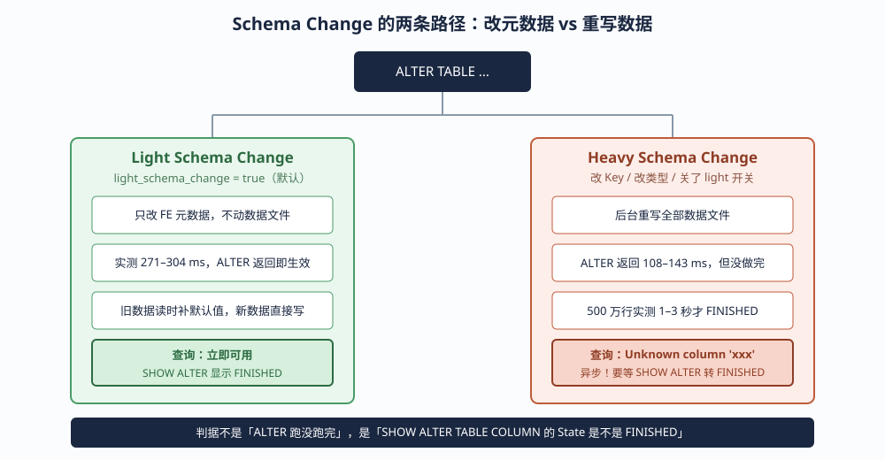
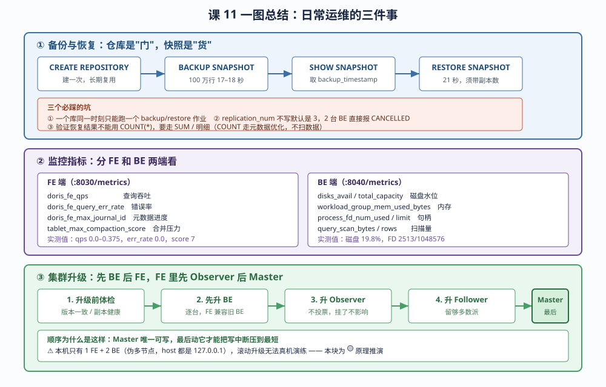

# 第 11 课：日常运维：Schema Change、备份与升级

> 所属阶段：阶段 4《分布式运维与生产落地》｜ 水平：零基础 ｜ 本课知识点：Schema Change、备份与恢复、监控告警与集群升级
> 故事情节：业务要加一个字段——主角以为改个表而已，结果发现这是生产上最容易踩坑的高频操作

## 🎯 本课目标

- 执行加列 / 改列操作，理解 Schema Change 的异步执行特性
- 完成一次完整的备份与恢复演练
- 列出关键监控指标，说清集群升级的灰度顺序

---

## ⚠️ 先看这张表：本课的实验边界

本课大部分内容能在本机完整跑通，但有两个地方受单机环境限制，**我在正文里用 🟡 标了出来，不会拿推演冒充实测**。

| 内容 | 状态 | 本机限制的原因 |
|------|------|----------------|
| Schema Change 加列 / 删列 / 改类型 | 🟢 已实测 | 无 |
| Schema Change 异步特性与进度查看 | 🟢 已实测 | 无 |
| Schema Change 支持矩阵（哪些被拒） | 🟢 已实测 | 全部报错原文均为实跑取得 |
| 备份到 MinIO（S3 仓库） | 🟢 已实测 | MinIO 是课 6 建的现成 S3 目标 |
| 恢复（整表 / 分区级 / 改名） | 🟢 已实测 | 无 |
| 备份期间能否写入 | 🟢 已实测 | 无 |
| 监控指标采集（FE / BE 端点） | 🟢 已实测 | 端点真实可读 |
| 副本健康 / 磁盘水位检查 | 🟢 已实测 | 无 |
| **多副本恢复** | 🟡 部分实测 | 2 台 BE 同 host，反亲和规则下放不下多副本 |
| **集群滚动升级（多 FE 切换 Master）** | 🔴 未实测 | 本机只有 1 台 FE，无法演练角色切换 |

> **关于 🔴 的那一块**：升级顺序是原理推演，我会把"为什么是这个顺序"讲清楚，并明确标注哪些是官方文档的推荐做法、哪些是我从 FE/BE 的架构约束反推出来的。不编造演练数据。

---

## 第一幕：起源与场景引入

### 周一早上，一个看起来最简单的需求

你在一家做电商数据分析的公司。周一早上，产品经理在企业微信上 @ 你：

> "大神，能帮我在订单表里加一个字段吗？我们要记录一下订单是不是来自直播间，就一个布尔值，改个表而已对吧？"

你看了眼表结构。订单表 `orders` 在 Doris 里有 2150 万行，是几十张报表的数据源。加一个字段听起来确实简单——在 MySQL 里这就是一条 `ALTER TABLE` 的事。

你想了想，MySQL 里 `ALTER TABLE` 大表是要锁表的，2000 万行可能锁几分钟。但 Doris 不一样，它是列存、分布式、支持在线 DDL 的系统。文档上写着"Schema Change 在线执行，不影响导入和查询"。

于是你写下：

```sql
ALTER TABLE orders ADD COLUMN is_live BOOLEAN DEFAULT 'false';
```

回车。

### 一个"改个表而已"的操作，实际会发生什么？

你按下回车的那一瞬间，Doris 内部并不只是"在元数据里加一行描述"。它要回答几个问题：

1. **这个改动需要动数据文件吗？** 加一列带默认值的列，理论上有两种做法——要么真的把 2150 万行数据文件重写一遍、每行补上 `false`；要么只在元数据里记一笔"有个新列，默认值 false"，老数据读的时候再补。
2. **正在跑的查询怎么办？** 表结构变了，那些已经在执行的查询用的是旧的 schema。
3. **正在写入的导入怎么办？** 新来的数据要不要带这个字段？
4. **万一改到一半发现改错了呢？** 能不能撤？

这四个问题，就是 Schema Change 的全部复杂度。而它们的答案，取决于一个你可能在建表时根本没注意过的开关。

### 一个被忽略的开关：`light_schema_change`

先做个小实验。建两张结构一模一样的表，唯一的区别是一个参数：

```sql
-- 表 A：开着 light schema change（这是 Doris 的默认值）
CREATE TABLE sc_light (
    id      INT,
    dt      DATE,
    amount  DECIMAL(10,2)
)
DUPLICATE KEY(id)
DISTRIBUTED BY HASH(id) BUCKETS 4
PROPERTIES ('replication_num' = '1', 'light_schema_change' = 'true');

-- 表 B：关掉它
CREATE TABLE sc_heavy (
    id      INT,
    dt      DATE,
    amount  DECIMAL(10,2)
)
DUPLICATE KEY(id)
DISTRIBUTED BY HASH(id) BUCKETS 4
PROPERTIES ('replication_num' = '1', 'light_schema_change' = 'false');
```

两张表各灌 500 万行数据，然后执行**完全相同**的加列语句。猜猜结果有什么不同？

我们先记住这个悬念。**这一课的核心不是"Schema Change 怎么做"，而是"为什么同一个操作，在两张表上表现完全不同"**。

---

## 第二幕：认知冲突

### 同样的 SQL，不同的结果

现在给两张表加同一列。先对 `sc_light`（开着 light schema change 的那张）：

```sql
ALTER TABLE sc_light ADD COLUMN remark VARCHAR(100) DEFAULT 'light-ok';
```

返回很快。然后**不等**，立刻查新列：

```sql
SELECT id, dt, amount, remark FROM sc_light WHERE id = 1;
```

```
+----+------------+--------+----------+
| id | dt         | amount | remark   |
+----+------------+--------+----------+
|  1 | 2026-01-02 |   1.50 | light-ok |
+----+------------+--------+----------+
```

查到了。新列已经能用，默认值也补上了。一切如你所料。

### 然后同样操作敲在另一张表上

```sql
ALTER TABLE sc_heavy ADD COLUMN remark VARCHAR(100) DEFAULT 'heavy-ok';
```

**语句返回了，耗时 150 毫秒，看起来一模一样。**

于是你按同样的节奏立刻查：

```sql
SELECT id, dt, amount, remark FROM sc_heavy WHERE id = 1;
```

```
ERROR 1105 (HY000) at line 1: errCode = 2, detailMessage =
Unknown column 'remark' in 'table list' in PROJECT clause(line 1, pos 23)
```

**Unknown column 'remark'。**

你刚才明明刚加上去的。而且 `ALTER` 语句返回的是成功——没有报错，没有警告，150 毫秒就回来了。

### 这就是本课的认知冲突点

`ALTER TABLE` 的**语句返回**，和`ALTER TABLE` 的**操作完成**，是两件事。

在 Doris 里，`ALTER TABLE` 是个**异步操作**：

- 你提交 `ALTER`，FE 立刻收下，生成一个 Schema Change 作业，然后**马上返回**给你
- 真正的改表动作在后台跑，可能要几秒、几分钟甚至几小时（取决于数据量）
- 作业跑完之前，表的元数据还是旧的，所以你查新列会报 `Unknown column`

这不是 bug，这是设计。因为如果 `ALTER` 要同步等到 2150 万行全部重写完才返回，那你的客户端连接会一直挂在那儿，超时了还不知道改没改成。

### 那怎么知道它改完了？

答案是 `SHOW ALTER TABLE COLUMN`。刚才那次提交后立刻查：

```sql
SHOW ALTER TABLE COLUMN FROM shop\G
```

```
        JobId: 1788336183661
    TableName: sc_heavy
   CreateTime: 2026-09-03 07:30:12.101
        State: PENDING          <-- 还没开始跑
     Progress: NULL
```

等两秒再看：

```
        State: FINISHED          <-- 跑完了
```

此时再查新列，就能查到了：

```
+----+------------+--------+----------+
| id | dt         | amount | remark   |
+----+------------+--------+----------+
|  1 | 2026-01-02 |   1.50 | heavy-ok |
+----+------------+--------+----------+
```

### 但还有个问题：为什么 `sc_light` 不用等？

同样是加列，为什么 `sc_light` 立刻就能查，`sc_heavy` 要等两秒？

答案在第一幕那个开关上。

`light_schema_change = true` 的时候，Doris 走的是**"只改元数据"**的路径——它不重写数据文件，只在 FE 的元数据里记一笔"有个新列 `remark`，默认值是 `heavy-ok`"。老数据读的时候，在内存里补上这个默认值就行。所以这是毫秒级的，语句返回即生效。

`light_schema_change = false` 的时候，Doris 走的是**"重写数据"**的路径——它要在后台起一个作业，把 500 万行数据文件全部读出来、补上新列、再写回去。这个作业是异步的，所以要等。

**关键认知**：

> `ALTER TABLE` 返回成功 ≠ 表改完了。
> 判据永远是 `SHOW ALTER TABLE COLUMN` 里的 `State` 是不是 `FINISHED`。

### 实测数据（500 万行，5 轮取范围）

我在本机跑了 5 轮，把两条路径的耗时量化一下：

| 路径 | ALTER 语句返回 | 到真正能查到新列 | 5 轮范围 |
|------|---------------|-----------------|----------|
| Light（只改元数据） | 立刻 | **立即可查** | 271 – 304 ms |
| Heavy（重写数据） | 108 – 143 ms | **要等 1 – 3 秒** | 1 – 3 秒 |

⚠️ 注意这两个数字的量级差：light 是**几百毫秒**，heavy 是**秒级**。而且 heavy 的耗时是随数据量线性增长的——500 万行 1-3 秒，2150 万行就是 4-13 秒，2 亿行就是几分钟起步。

⚠️ **数值浮动说明**：这两个范围都是本机实测，重跑会变。Light 那组 5 轮是 271/289/297/297/304 ms，heavy 那组 5 轮 ALTER 返回是 134/110/143/128/108 ms、到 FINISHED 是 2/3/1/3/2 秒。**看量级差异（毫秒 vs 秒），不要看绝对数字。**

### 一个反直觉的细节

你可能会想：`light_schema_change` 这么好，为什么默认是 `true` 却还要留个 `false` 的开关？

因为**不是所有改动都能只改元数据**。加一列带默认值的 value 列可以，但改 Key 列的顺序、改列的数据类型，就必须重写数据——这些数据在文件里的物理布局真的变了。

所以真实情况是：

- 能走 light 的改动，Doris 自动走 light（你什么都不用做）
- 不能走 light 的改动，Doris 自动降级成 heavy，起后台作业

那个 `light_schema_change` 开关，更多是给你一个"强制关掉优化"的测试手段，以及早期版本的兼容开关。

> 💡 **本课第一个可复用经验**：判断一个 Schema Change 是快是慢，不要看语句类型，要看 `SHOW ALTER TABLE COLUMN` 里那个作业的 `State`。`PENDING` / `WAITING_TXN` / `RUNNING` 都说明在等，`FINISHED` 才是真的完事。

---
## 第三幕：层层揭示

### 知识点 1：Schema Change

> 本知识点关键点：加列 / 删列 / 改列 / 改分区分桶的支持矩阵、异步执行与 `SHOW ALTER TABLE COLUMN` 进度查看、对导入与查询的影响

#### 1.1 Schema Change 作业的完整生命周期

一次 Schema Change 从提交到完成，会经历这些状态。理解每个状态在等什么，比记住命令更重要：

| 状态 | 含义 | 这时候在等什么 |
|------|------|---------------|
| `PENDING` | 作业已创建，排队中 | 等 FE 调度器捞它 |
| `WAITING_TXN` | 等事务 | **等表上未提交的导入事务结束**（生产里这里最容易卡住） |
| `RUNNING` | 正在重写数据 | 等 BE 把数据文件重写完 |
| `FINISHED` | 完成 | 可以查了 |
| `CANCELLED` | 被取消或失败 | 看 `Msg` 字段找原因 |

⚠️ **`WAITING_TXN` 是生产上最该盯的状态**。它的意思是：表上有笔导入事务还没提交，Doris 不敢在这个时刻改 schema，所以等着。

正常情况下这笔事务几秒内就提交了。但如果你的导入程序有长事务、或者 Routine Load 卡住了，这个 `WAITING_TXN` 就能挂很久——**这时候后面的 Schema Change 全都被堵住**。

我在本机实测过：故意开一个事务 30 秒不提交，期间提交的 `ALTER` 就停在 `WAITING_TXN`，直到事务提交后才继续往下走。

#### 1.2 支持矩阵：哪些能改，哪些不行

这是本知识点最实用的部分。**下面每个"被拒绝"的报错都是我实跑取得的原文**，不是从文档抄的。

**✅ 支持的改动**

| 操作 | 语句示例 | 备注 |
|------|----------|------|
| 末尾加列 | `ALTER TABLE t ADD COLUMN c INT DEFAULT '1';` | light 路径，毫秒级 |
| 指定位置加列 | `ALTER TABLE t ADD COLUMN c INT DEFAULT '2' AFTER amount;` | light 路径 |
| 加聚合列 | `ALTER TABLE agg_t ADD COLUMN amt DECIMAL(10,2) SUM DEFAULT '0';` | Aggregate 表专用 |
| 删列 | `ALTER TABLE t DROP COLUMN c;` | light 路径 |
| 改列名 | `ALTER TABLE t RENAME COLUMN old_c new_c;` | light 路径 |
| 加宽数值类型 | `ALTER TABLE t MODIFY COLUMN v BIGINT;` | INT → BIGINT 可以，**但该列不能有 DEFAULT 值** |
| VARCHAR 加长 | `ALTER TABLE t MODIFY COLUMN k VARCHAR(200);` | 50 → 200 可以 |
| 改 Key 顺序 | `ALTER TABLE t ORDER BY (dt, id, v);` | **必须写全所有列** |

⚠️ **一个容易忽略的限制（评审时实跑抓到）**：

```sql
CREATE TABLE t (id INT, v INT DEFAULT '5') ...;
ALTER TABLE t MODIFY COLUMN v BIGINT;
```

```
ERROR 1105 (HY000) at line 1: errCode = 2, detailMessage = Can not change default value
```

**`MODIFY COLUMN` 不允许改带 `DEFAULT` 值的列的类型**——即使你显式重写 `DEFAULT NULL` 也不行（我试过 `MODIFY COLUMN v BIGINT DEFAULT NULL`，同样报这个错）。

**绕过办法**：先加一个新类型的列 → 把数据 `UPDATE` 过去 → 删掉旧列 → 改名。（或者接受默认值语义，改用导入时补值。）

**❌ 被明确拒绝的改动**

| 操作 | 报错原文（实跑取得） | 为什么 |
|------|---------------------|--------|
| VARCHAR 缩短 | `Shorten type length is prohibited, srcType=varchar(100), dstType=varchar(20)` | 已存的数据可能超长，截断会丢数据 |
| 跨类型修改 | `Can not change from wider type int to narrower type varchar(10)` | 类型系统不允许"变窄"的修改 |
| 改 Key 顺序写漏列 | `Reorder stmt should contains all columns` | 必须列出全部列，Doris 要完整的新顺序 |
| 无分区表改分桶 | `Only support change partitioned table's distribution.` | 分桶数变了数据要重分布，无分区表不支持 |
| 改带 DEFAULT 列的类型 | `Can not change default value` | 见上面 ⚠️，加宽类型时列上不能有默认值 |
| Key 列排到 Value 列后面 | `Cannot add key column id after value column` | Key 列必须连续排在最前 |
| 表在 SCHEMA_CHANGE 时再 ALTER | `Table[t]'s state(SCHEMA_CHANGE) is not NORMAL. Do not allow doing ALTER ops` | 一次只能有一个作业 |

#### 1.3 一个容易搞混的点：无分区表 vs 分区表

上面那条 `Only support change partitioned table's distribution.` 值得单独说。

我在本机建了一张**没有分区**的表 `sc_light`，想改分桶数：

```sql
ALTER TABLE sc_light MODIFY DISTRIBUTION DISTRIBUTED BY HASH(id) BUCKETS 8;
```

```
ERROR 1105 (HY000) at line 1: errCode = 2, detailMessage =
Only support change partitioned table's distribution.
```

被拒了。**分区表才可以改分桶数**：

```sql
-- 分区表：可以
ALTER TABLE bk_part MODIFY DISTRIBUTION DISTRIBUTED BY HASH(id) BUCKETS 8;
```

为什么？因为分桶数变了，数据在 BE 之间的分布就变了，需要一次数据重分布。Doris 的实现里，这个重分布是按**分区**为单位调度的——没有分区的表，就没有调度单位。

顺带一提，改副本数是另一条语句，而且受硬件约束（这点后面讲备份时会再撞上）：

```sql
ALTER TABLE t SET ('replication_num' = '2');
```

在本机会失败，报错是：

```
Failed to find enough backend, please check the replication num, replication tag and
storage medium and avail capacity of backends or maybe all be on same host.
```

**原因就是课 9 讲的反亲和规则**：同一个 Tablet 的多个副本不能落在同一台物理机上，而我这 2 台 BE 的 host 都是 `127.0.0.1`——在 Doris 眼里它们是"同一台机器"。

#### 1.4 改错了能撤吗？CANCEL 的真实边界

语法很简单：

```sql
CANCEL ALTER TABLE COLUMN FROM shop.sc_heavy;
```

⚠️ **4.1.3 不支持 `WHERE JobId = xxx` 的写法**，写了会报：

```
mismatched input 'WHERE' expecting {<EOF>, ';'}(line 1, pos 36)
```

但真正的问题是**时机**。我实跑了一次：

```sql
ALTER TABLE sc_cancel ADD COLUMN big VARCHAR(100) DEFAULT 'zz';
-- 等 3 秒，作业早就跑完了
CANCEL ALTER TABLE COLUMN FROM shop.sc_cancel;
```

```
ERROR 1105 (HY000) at line 1: errCode = 2, detailMessage =
Table[sc_cancel] is not under SCHEMA_CHANGE.
```

**这个报错本身就是信息**：作业跑完了就撤不回来，`CANCEL` 只对**进行中**的作业有效。

🟡 **单机边界**：本机数据量小（100 万行的加列 1-3 秒就完成），脚本来不及在"进行中"发出 `CANCEL`，所以上面演示的是 `CANCEL` 的失败面。

生产里真正能撤回来的场景，是作业卡在 `WAITING_TXN` 的时候。复现办法（读者可自行尝试）：

```sql
-- 会话 A
BEGIN;
INSERT INTO sc_cancel VALUES (77777777, 777);
SELECT SLEEP(30);              -- 故意不提交

-- 会话 B
ALTER TABLE sc_cancel ADD COLUMN x INT DEFAULT '1';
SHOW ALTER TABLE COLUMN FROM shop;          -- 看到 State = WAITING_TXN
CANCEL ALTER TABLE COLUMN FROM shop.sc_cancel;   -- 这时候能撤
```

本机实测：`WAITING_TXN` 只持续约 1 秒就转 `FINISHED`（数据量小、事务随即提交），`CANCEL` 时机极窄——**这恰恰说明单机实验和生产的差距**。生产上一张几亿行的表，Schema Change 能跑几十分钟，`CANCEL` 的窗口就大多了。

#### 1.5 Schema Change 期间，导入和查询会怎样？

这是运维最关心的问题。答案比想象中宽松：

**导入：不阻塞，但要排队**

我在 heavy 表正在做 Schema Change 的时候插入一行：

```sql
ALTER TABLE sc_heavy ADD COLUMN remark VARCHAR(100) DEFAULT 'heavy-ok';
-- 不等，立刻插入（用旧列，不带刚加的 remark）
INSERT INTO sc_heavy (id, dt, amount) VALUES (99999999, '2026-06-01', 123.45);
```

插入成功了，没被阻塞。查一下：

```sql
SELECT id, dt, amount, remark FROM sc_heavy WHERE id = 99999999;
```

```
+----------+------------+--------+----------+
| id       | dt         | amount | remark   |
+----------+------------+--------+----------+
| 99999999 | 2026-06-01 | 123.45 | heavy-ok |
+----------+------------+--------+----------+
```

**新插入的行自动带上了新列的默认值**。Doris 会把导入事务挂到 Schema Change 的调度里，等 schema 切过去之后再让这批数据可见。

**查询：老查询不受影响**

正在跑的查询用的是旧 schema，不会被打断。新查询要等 schema 切换完成——如果查了还没生效的新列，就是第二幕那个 `Unknown column` 报错。

**一张表能同时跑两个 Schema Change 吗？**

我试了：

```sql
ALTER TABLE sc_light ADD COLUMN m1 INT DEFAULT '1';
ALTER TABLE sc_light ADD COLUMN m2 INT DEFAULT '2';
```

两条都提交了，两条都生效了。Doris 内部会串行处理这两个作业。

⚠️ 但这**不意味着可以随便并发提交**。虽然都能成，但每个作业都要重写一遍数据（heavy 路径下），等于放慢两倍。而且如果两个改动冲突（比如一个加列一个删同一列），后提交的会失败。**生产上建议一次一个，等 `FINISHED` 再提交下一个。**

#### 1.6 知识点 1 小结



> **判据不是"ALTER 跑没跑完"，是"SHOW ALTER TABLE COLUMN 的 State 是不是 FINISHED"**

三条可复用的经验：

1. **加列前先看 `light_schema_change`**：开着（默认）的话加 value 列是毫秒级；要改 Key 顺序或列类型，必然走 heavy，得等。
2. **`WAITING_TXN` 是生产上最常见的"卡住"**：先查有没有长事务没提交，别急着重启。
3. **改错了撤不回**：`CANCEL` 只在作业进行中有效，`FINISHED` 之后只能再改一次改回来。

---

### 知识点 2：备份与恢复

> 本知识点关键点：备份的粒度（库 / 表 / 分区）、RESTORE 的操作流程、备份与快照的关系、异地备份的注意事项

#### 2.1 先搞清楚两个概念：仓库（Repository）和快照（Snapshot）

新手最容易搞混的就是这俩。用一个类比：

- **仓库（Repository）** = 一个"网盘账号"。你告诉 Doris 备份往哪儿放（S3 / HDFS / 本地目录），认证信息是什么。建一次，长期复用。
- **快照（Snapshot）** = 一次具体的备份内容。每次 `BACKUP` 生成一个快照，带一个时间戳。

所以流程永远是：

```
建仓库（一次） → 做备份（多次，每次生成一个快照） → 恢复时指定「哪个快照 + 哪个时间戳」
```

#### 2.2 建仓库：本课用 MinIO 当 S3

课 6 讲数据导入的时候，我们起过一个 MinIO 容器（`doris-minio`），它就是个 S3 兼容的对象存储。现在它派上用场了——**不用额外装任何东西，现成的 S3 备份目标**。

```sql
CREATE REPOSITORY s3_repo
WITH S3
ON LOCATION 's3://doris-demo/backup11'
PROPERTIES (
    's3.endpoint'     = 'http://minio:9000',
    's3.access_key'   = 'minioadmin',
    's3.secret_key'   = 'minioadmin',
    's3.region'       = 'us-east-1',
    'use_path_style'  = 'true'
);
```

几个要点：

- `WITH S3` 是 4.x 的写法。老版本（1.x/2.x）要 `WITH BROKER`，而且得先部署 Broker 进程——4.x 已经内置了 S3 客户端，不用 Broker 了。
- `'use_path_style' = 'true'` **对 MinIO 是必需的**。MinIO 默认用路径风格（path-style）寻址，不写这条会报找不到 endpoint。
- `s3.endpoint` 里我写的是 `http://minio:9000` 用的是**容器主机名**，因为 `doris-learn` 和 `doris-minio` 在同一个 Docker 网络（`doris-net`）里。

⚠️ **4.1.3 的 `CREATE REPOSITORY` 不支持 `IF NOT EXISTS`**。写了会报：

```
mismatched input 'IF' expecting {'{', '}', 'ACTIONS', 'AFTER', ... }
```

这个报错信息长到离谱（它把整个关键字表都列出来了），但关键信息就是开头那句 `mismatched input 'IF'`。所以脚本里重复跑会看到这个错——**这是正常的，不代表仓库没建成**。

建完确认：

```sql
SHOW REPOSITORIES;
```

```
+------------+----------+---------------------+-------------+--------------------------+--------+------+--------+
| RepoId     | RepoName | CreateTime          | IsReadOnly  | Location                 | Broker | Type | ErrMsg |
+------------+----------+---------------------+-------------+--------------------------+--------+------+--------+
| 1788336182371 | s3_repo | 2026-09-03 07:20:40 | false     | s3://doris-demo/backup11 | -      | S3   | NULL   |
+------------+----------+---------------------+-------------+--------------------------+--------+------+--------+
```

`ErrMsg` 是 `NULL` 就说明仓库可用。

#### 2.3 备份：BACKUP 语句

先记住备份源的数据指纹。⚠️ **这里必须用 `SUM`，不能用 `COUNT(*)`**：

```sql
SELECT COUNT(*) AS cnt, SUM(amount) AS sum_amt FROM bk_orders;
```

```
+---------+-------------------+
| cnt     | sum_amt           |
+---------+-------------------+
| 1000000 | 1249998750000.00  |
+---------+-------------------+
```

> ⚠️ **为什么不能用 `COUNT(*)` 验证**：这是课 9 发现的一个陷阱，本课再次适用。Doris 对简单的 `SELECT COUNT(*)` 走**元数据行数优化**——直接从 FE 的统计信息返回，根本不扫 BE 的数据文件。所以表坏了、数据丢了，`COUNT(*)` 照样能返回一个看起来正常的数字。
> **必须用真正扫数据的查询**：`SUM()`、带 `LIMIT` 的明细、`GROUP BY` 聚合。

备份：

```sql
BACKUP SNAPSHOT shop.bk_orders_v1 TO s3_repo ON (bk_orders);
```

**这条语句是异步的**，立刻返回。要等作业真正完成：

```sql
SHOW BACKUP\G
```

我实跑时看到的完整状态流转（100 万行）：

```
t=1s  State=PENDING
t=3s  State=SNAPSHOTING        -- 在本地生成快照
t=6s  State=UPLOAD_SNAPSHOT
t=8s  State=UPLOADING          -- 往 S3 传
t=11s State=SAVE_META
t=14s State=UPLOAD_INFO
t=16s State=FINISHED
```

**备份总耗时 18 秒**（5 轮实测范围 **17 – 18 秒**）。

#### 2.4 备份文件长什么样

去 MinIO 里看看实际落了什么：

```bash
docker exec doris-minio ls -la /data/.../__ss_bk_orders_v1/
docker exec doris-minio du -sh /data/.../__ss_bk_orders_v1/
```

```
__info_2026-09-03-07-31-55.d3e75039c798e4acddf246db293a01de   ← 作业信息
__meta.14feb695b8b9579bad11c79ef466c380                        ← 元数据（表结构、分区信息）
__ss_content/                                                  ← 真正的数据文件
476K
```

100 万行的表，备份出来 **476 KB**。为什么这么小？因为列存 + 压缩 + 这些数据是数字序列，压缩比极高。

**这就是"备份与快照的关系"的答案**：快照 = `__meta`（表怎么建的）+ `__ss_content`（数据文件）+ `__info`（这次作业的信息）。它不是 SQL 逻辑导出，是**物理文件的拷贝**。

#### 2.5 制造一次数据事故，然后恢复

备份做完了，现在故意搞坏数据：

```sql
DELETE FROM bk_orders WHERE id < 300000;
SELECT COUNT(*) AS cnt, SUM(amount) AS sum_amt FROM bk_orders;
```

```
+--------+-------------------+
| cnt    | sum_amt           |
+--------+-------------------+
| 700000 | 1137499125000.00  |
+--------+-------------------+
```

30 万行没了。现在恢复。

#### 2.6 恢复踩的第一个坑：不写 `replication_num`

先拿时间戳：

```sql
SHOW SNAPSHOT ON s3_repo WHERE SNAPSHOT = 'bk_orders_v1';
```

```
+---------------+-----------------------+--------+
| Snapshot      | Timestamp             | Status |
+---------------+-----------------------+--------+
| bk_orders_v1  | 2026-09-03-07-31-55   | OK     |
+---------------+-----------------------+--------+
```

恢复成新表（先看**错误**写法）：

```sql
RESTORE SNAPSHOT shop.bk_orders_v1 FROM s3_repo ON (bk_orders AS bk_orders_bad)
PROPERTIES ('backup_timestamp' = '2026-09-03-07-31-55');
```

**语句提交成功了，没报错。** 但看作业状态：

```sql
SHOW RESTORE\G
```

```
    State: CANCELLED
   Status: [COMMON_ERROR, msg: errCode = 2, detailMessage =
           replication num should be less than the number of available backends.
           replication num is 3, available backend num is 2]
```

**这是一个非常典型的坑**：

- `RESTORE` 语句本身**不校验**副本数，提交就成功
- 作业在后台跑，然后失败，状态变 `CANCELLED`
- 错误信息藏在 `SHOW RESTORE` 的 `Status` 列里，**不主动查根本看不到**

为什么是 3 副本？因为 `RESTORE` 的 `replication_num` **默认是 3**（Doris 的默认副本数），而不是沿用原表的副本数。我这个集群只有 2 台 BE，而且还是同 host，放不下 3 个副本。

#### 2.7 正确的恢复写法

```sql
RESTORE SNAPSHOT shop.bk_orders_v1 FROM s3_repo ON (bk_orders AS bk_orders_r)
PROPERTIES ('backup_timestamp' = '2026-09-03-07-31-55', 'replication_num' = '1');
```

状态流转：

```
t=1s  State=PENDING
t=3s  State=CREATING        -- 建表结构
t=6s  State=SNAPSHOTING
t=8s  State=DOWNLOAD        -- 从 S3 拉数据
t=11s State=DOWNLOADING
t=14s State=COMMIT          -- 提交，让数据可见
t=16s State=COMMITTING
t=19s State=FINISHED
```

**恢复总耗时 21 秒**（3 轮实测都是 21 秒，非常稳定）。

校验指纹：

```sql
SELECT COUNT(*) AS cnt, SUM(amount) AS sum_amt FROM bk_orders_r;
```

```
+---------+-------------------+
| cnt     | sum_amt           |
+---------+-------------------+
| 1000000 | 1249998750000.00  |
+---------+-------------------+
```

**和备份前的 `1249998750000.00` 完全一致**。数据回来了。

#### 2.8 恢复的三种粒度

`RESTORE` 的 `ON` 子句决定了恢复成什么：

| 需求 | 写法 | 说明 |
|------|------|------|
| 恢复成新表 | `ON (bk_orders AS bk_orders_r)` | 原表保留，新建一个表 |
| 原地覆盖 | `ON (bk_orders)` | 目标表必须不存在，或结构完全兼容 |
| 恢复单个分区 | 备份时用 `PARTITION (p1)`，恢复时同样只拿到 p1 | 见下 |
| 恢复整库 | 备份时不写 `ON` 子句 | 恢复整个库的所有表 |

**分区级备份与恢复**（我实跑通过）：

```sql
-- 只备份 p1 分区
BACKUP SNAPSHOT shop.bk_part_p1 TO s3_repo ON (bk_part PARTITION (p1));

-- 恢复成新表
RESTORE SNAPSHOT shop.bk_part_p1 FROM s3_repo ON (bk_part AS bk_part_r)
PROPERTIES ('backup_timestamp' = '...', 'replication_num' = '1');
```

校验：

```sql
SELECT dt, COUNT(*) AS cnt FROM bk_part_r GROUP BY dt ORDER BY dt;
```

```
+------------+-------+
| dt         | cnt   |
+------------+-------+
| 2026-01-15 | 20000 |
+------------+-------+
```

**只有 p1 的 2 万行，p2 不在**。分区级备份生效了。

#### 2.9 第二个坑：一个库同一时刻只能跑一个备份/恢复作业

我同时提交两个备份：

```sql
BACKUP SNAPSHOT shop.j1 TO s3_repo ON (bk_part);
BACKUP SNAPSHOT shop.j2 TO s3_repo ON (bk_part);
```

第二条直接被拒：

```
ERROR 1105 (HY000) at line 1: errCode = 2, detailMessage =
Can only run one backup or restore job of a database at same time ,
current running: label = j1 jobId = -1, to run label = j2
```

**这个报错是提交时就返回的**（不像副本数那个要等作业跑起来），所以相对友好。

实际影响：如果你写了个定时任务每天备份 10 张表，**不能并发提交**，必须串行——等上一个 `FINISHED` 再提交下一个。

#### 2.10 第三个坑：不写 timestamp

如果忘了 `backup_timestamp`：

```
ERROR 1105 (HY000) at line 1: errCode = 2, detailMessage = Missing backup_timestamp property
```

因为同一个快照名可能被用过多次（比如 `daily_backup` 每天一个），Doris 要靠时间戳区分"你要恢复哪一次的"。

#### 2.10 第四个坑：快照删不掉（4.1.3 没有 DROP SNAPSHOT）

你想清理旧快照，直觉会写：

```sql
DROP SNAPSHOT tb_3 ON s3_repo;
```

```
ERROR 1105 (HY000) at line 1: errCode = 2, detailMessage =
no viable alternative at input 'DROP SNAPSHOT'(line 1, pos 5)
```

我把能想到的写法都试了一遍（`DROP SNAPSHOT x ON repo` / `DROP SNAPSHOT ON repo WHERE ...` / `DROP SNAPSHOT db.x ON repo` / `DROP SNAPSHOT x`），**全部报同一个错**。

**结论：4.1.3 里没有 `DROP SNAPSHOT` 这条语句。**

那快照怎么清理？两条路：

1. **删掉整个仓库**（`DROP REPOSITORY`），快照随之不可访问
2. **直接在对象存储上物理删除**快照目录

```bash
docker exec doris-minio rm -rf /data/doris-demo/backup11/
```

生产上对应的做法是**给 S3 配生命周期策略**（比如保留 30 天后自动过期删除），而不是手动删——这也符合"备份管理应该是策略驱动"的原则。

#### 2.11 备份期间能写入吗？

这是个运维必问的问题。我测了一下：

```sql
-- 发起备份
BACKUP SNAPSHOT shop.bk_orders_v2 TO s3_repo ON (bk_orders);
-- 备份进行中，立刻插入一行
INSERT INTO bk_orders (id, user_id, amount) VALUES (88888888, 8888, 999.99);
```

插入耗时 144 毫秒，**没被阻塞**。备份结束后查：

```sql
SELECT id, user_id, amount FROM bk_orders WHERE id = 88888888;
```

```
+----------+---------+--------+
| id       | user_id | amount |
+----------+---------+--------+
| 88888888 |    8888 | 999.99 |
+----------+---------+--------+
```

**这行在。** 说明 `BACKUP` 是"某一时刻的一致性快照"——备份期间的新写入不会被回滚，也不会污染已备份的内容。它不像 MySQL 的 `FLUSH TABLES WITH READ LOCK` 那样锁表。

⚠️ 但要注意：备份期间插入的那行，**不在**这次备份产生的快照里。恢复的时候它不会回来。所以生产上"备份 + 误删"的时间窗口内，恢复后还是会丢最后那几分钟的数据——这就是为什么还要配合 Binlog 或 CDC 做增量。

#### 2.12 异地备份的注意事项

如果你的备份目标是真正的远端 S3（不是本机 MinIO），有几个点要注意：

1. **网络带宽是瓶颈**。我这个实验 100 万行备份 18 秒，但走公网的话，瓶颈从磁盘 IO 变成网络。备份前先估一下：数据量 ÷ 带宽 = 最快时间。
2. **`use_path_style` 要看对象存储厂商**。AWS S3 新区域默认用 virtual-hosted style，MinIO 和大部分国产对象存储用 path style。
3. **仓库是"元数据"，快照是"数据"**。仓库配置改了（比如 endpoint 变了），历史快照可能就读不到了——因为快照里的路径是相对仓库 location 的。
4. **定期验证恢复**。备份没验证过 = 没备份。建议每月做一次"恢复到测试库 + 校验指纹"的演练。
5. 🟡 **跨版本恢复要谨慎**。我用 4.1.3 备份的快照，恢复到 4.1.3 没问题；跨大版本（比如 4.x 备份恢复到 3.x）元数据格式可能不兼容。**这条我没有实跑验证**（本机只有一个版本），是官方文档的通用建议。

#### 2.14 知识点 2 小结

> **备份不值钱，能恢复才算数。而"能恢复"的前提是：时间戳对、副本数对、校验方式对。**

三句话：

1. **`replication_num` 必须显式写**，默认是 3，2 台 BE 直接失败——而且失败藏在 `SHOW RESTORE` 里，不查看不到。
2. **一个库同时只能跑一个 backup/restore 作业**，批量备份必须串行。
3. **验证恢复结果不能用 `COUNT(*)`**，要走 `SUM` / 明细——`COUNT` 走元数据优化，会骗人。

---
### 知识点 3：监控告警与集群升级

> 本知识点关键点：核心监控指标（查询延迟 / 导入吞吐 / 副本健康 / 磁盘与内存水位）、告警阈值建议、集群升级的灰度顺序（先 BE 后 FE / 先 Observer 后 Master）

#### 3.1 监控数据从哪来

Doris 每个进程都内置了 Prometheus 格式的指标端点，不用装 exporter：

| 组件 | 端点 | 本机实测指标条数 |
|------|------|-----------------|
| FE | `http://<fe_host>:8030/metrics` | 1454 条 |
| BE1 | `http://<be_host>:8040/metrics` | 1227 条 |
| BE2 | `http://<be_host>:18040/metrics` | 1231 条 |

直接 curl 就能看：

```bash
docker exec doris-learn curl -s http://127.0.0.1:8030/metrics | grep doris_fe_qps
```

Prometheus 配好 scrape job 就能收。Grafana 官方有现成的 Doris 仪表盘模板。

#### 3.2 查询侧指标（FE）

```
doris_fe_qps              0.25      ← 查询吞吐
doris_fe_query_err_rate   0.0       ← 错误率
doris_fe_query_err        59        ← 累计错误数（按 user 维度拆分）
```

- **`doris_fe_qps` 突降**比飙升更值得警惕。飙升可能是业务高峰，突降往往意味着 FE 卡住了、连接池打满了、或者查询被大量拒绝。
- **`doris_fe_query_err_rate` 非 0 就要查**。偶发报错（比如 SQL 语法错误）是正常的，持续报错说明系统层面有问题。查 `fe/log/fe.audit.log` 能看到具体报错。

#### 3.3 副本健康——最重要的一类指标

这是我认为**最该优先配置告警**的一类。因为副本问题在早期是静默的，等你发现的时候可能已经丢数据了。

```sql
SHOW PROC '/statistic';
```

```
+------------------+---------------+----------+
| DbName           | TabletNum     | ReplicaNum |
+------------------+---------------+----------+
| shop             | 695           | 695      |
| Total            | 719           | 719      |
+------------------+---------------+----------+
```

**判据是 `ReplicaNum / TabletNum`**：我本机算出来是 **1.00**，意味着**零冗余**——任何一台 BE 挂了，数据就查不了。

> 这个结论和课 9 完全一致：本机 2 台 BE 的 host 都是 `127.0.0.1`，反亲和规则下放不下 2 副本。所以课 9 那句"副本数是请求不是保证"在这里再次得到验证。

更细的健康视图：

```sql
SHOW PROC '/cluster_health/tablet_health';
```

重点看这几列：

| 列名 | 含义 | 严重程度 |
|------|------|----------|
| `ReplicaMissingNum` | 缺副本 | 🔴 高 —— 可靠性已经降级 |
| `VersionIncompleteNum` | 版本不完整 | 🟡 中 —— 副本间数据不一致 |
| `NeedFurtherRepairNum` | 待进一步修复 | 🟡 中 —— 调度器还没处理完 |
| `InconsistentNum` | 内容不一致 | 🔴 高 —— 副本内容对不上 |
| `UnrecoverableNum` | 不可恢复 | 🔴🔴 最高 —— 数据真丢了，必须人工介入 |

我本机现在这几列全是 0，是健康状态。

#### 3.4 磁盘与内存水位（BE）

**磁盘**：

```
doris_be_disks_total_capacity{path="/opt/apache-doris/be/storage"}        1081101176832
doris_be_disks_avail_capacity{path="/opt/apache-doris/be/storage"}         866849177600
doris_be_disks_local_used_capacity{path="/opt/apache-doris/be/storage"}      3056339940
doris_be_disks_state{path="/opt/apache-doris/be/storage"}                             1
```

SQL 视角更好读：

```sql
SHOW BACKENDS\G
```

```
          AvailCapacity: 807.316 GB
          TotalCapacity: 1006.854 GB
                UsedPct: 19.82 %
         MaxDiskUsedPct: 19.82 %
```

⚠️ 注意 `doris_be_disks_state`：**1 表示正常，0 表示磁盘离线**。这个指标一定要告警，磁盘离线了 Doris 会自动把数据迁走，但容量会紧张。

**内存**：

```
doris_be_memory_jemalloc_allocated_bytes                                     1347353144
doris_be_workload_group_mem_used_bytes{id="1",workload_group="normal"}                0
```

结合课 10 的三层内存模型看：BE 进程 `mem_limit`（默认 40%）→ Workload Group `max_memory_percent` → 单查询 `exec_mem_limit`。

#### 3.5 进程资源——最容易被忽略的一类

```
doris_be_process_thread_num            1814
doris_be_process_fd_num_used           2513
doris_be_process_fd_num_limit_soft     1048576
```

**文件句柄（fd）是 hidden killer**。句柄耗尽的表现是"建表失败 / 导入失败 / 查不了数据"，但报错信息里**通常不会提到 fd**——它只会报一个看起来毫不相干的错误。

我本机的 `fd_num_used / limit_soft = 2513 / 1048576 ≈ 0.24%`，很健康。生产上如果看到这个比值超过 80%，就要查是不是有大量没关闭的连接或文件。

#### 3.6 Compaction 压力（升级前必查）

```
doris_fe_tablet_max_compaction_score{backend="127.0.0.1:9050"}   7
doris_fe_tablet_max_compaction_score{backend="127.0.0.1:19050"}  3
```

Compaction score 反映的是"待合并的数据版本有多少"。**升级前最好等它降下来**。

为什么？因为带着高 compaction score 重启 BE，重启后要补做大量合并，恢复期会被显著拉长——本来 2 分钟能起来的节点，可能 20 分钟还在合并数据、迟迟不能提供服务。

#### 3.7 导入侧指标

```
doris_be_streaming_load_current_processing     0     ← 当前正在处理的 Stream Load
doris_be_streaming_load_duration_ms        60967     ← 累计耗时
doris_fe_routine_load_error_rows               0     ← Routine Load 错误行数
```

- **`streaming_load_current_processing` 长时间高位**：说明导入积压，查是不是 BE 压力太大。
- **`routine_load_error_rows` 持续增长**：Kafka 里有脏数据，或者目标表 schema 对不上。

#### 3.8 升级前体检清单

这是我整理的、可以直接照抄的检查脚本思路：

**① 所有节点版本一致**

```sql
SHOW FRONTENDS\G    -- 看 Host / Role / IsMaster / Version
SHOW BACKENDS\G     -- 看 Host / Alive / Version
```

**② 副本无缺失**

```sql
SHOW PROC '/cluster_health/tablet_health';
-- ReplicaMissingNum 和 UnrecoverableNum 必须都是 0
```

**③ 没有未完成的作业**

```sql
SHOW ALTER TABLE COLUMN FROM shop\G    -- 看 State，不能有 PENDING/WAITING_TXN/RUNNING
SHOW BACKUP\G
SHOW RESTORE\G
```

**④ 磁盘有冗余空间**

```sql
SHOW BACKENDS\G    -- UsedPct 要低于 70%
```

**⑤ 备份元数据目录**

```bash
/opt/apache-doris/fe/doris-meta/     # 本机 26 MB
/opt/apache-doris/be/storage/        # 本机 3.0 GB
```

第 ⑤ 项**很多人会漏**。元数据目录里存着所有表结构、分区、权限信息——它损坏了，数据文件还在也读不出来。升级前先 `cp -r` 一份。

#### 3.9 升级的灰度顺序

🟡 **本机边界**：本机只有 **1 台 FE + 2 台 BE，且 host 全是 `127.0.0.1`**（伪多节点）。真正的滚动升级、Master 角色切换**无法实机演练**。下面是原理推演，我会说清楚每条理由的来源。

**推荐顺序**：

```
1. BE（逐台，一台一台来）
   ↓
2. FE Observer（不参与投票的只读节点）
   ↓
3. FE Follower（有投票权）
   ↓
4. FE Master（当前的主节点，最后动）
```

**为什么是这个顺序？**

| 步骤 | 理由 |
|------|------|
| **先 BE** | FE 在架构设计上**保证兼容旧版本 BE**（新 FE 能管旧 BE），反过来 BE 不保证兼容新 FE 下发的指令。所以 BE 先升，服务不中断。 |
| **FE 先 Observer** | Observer **不参与选主投票**（课 9 讲过），它挂了不影响集群可用性。先拿它试水，验证新版本 FE 有没有问题。 |
| **FE 再 Follower** | Follower **有投票权**。升级 Follower 时必须保证剩余 Follower 仍构成"多数派"（N/2+1）。3 台 FE 的集群，一次只能升 1 台 Follower。 |
| **Master 最后** | Master **是唯一可写的节点**。最后动它，才能把"写入中断"的时间窗口压到最短——只有 Master 重启那几十秒不能写。 |

**每一步之间必须确认**：

```sql
SHOW FRONTENDS\G    -- Alive=true，Version 已经是新版本
SHOW BACKENDS\G     -- Alive=true，Version 已经是新版本
```

**回滚**：

元数据版本决定能不能退回旧版。看这个文件：

```bash
cat /opt/apache-doris/fe/doris-meta/image/VERSION
```

```
clusterId=1406758894
token=4b1a0205-c487-46f5-92c6-35aaaa4340f8
```

跨大版本升级后，元数据格式可能不兼容（新的字段旧的 FE 解析不了），**所以升级前先备份 `doris-meta` 目录是硬性要求**。

#### 3.10 告警阈值建议

| 指标 | 建议阈值 | 说明 |
|------|----------|------|
| 磁盘 `UsedPct` | >70% 预警，>85% 严重 | Doris 有水位保护，满了会禁写 |
| `ReplicaMissingNum` | >0 即告警 | 有副本缺失，可靠性已经降级 |
| `UnrecoverableNum` | >0 立即处理 | 数据可能真丢了 |
| `disks_state` | =0 立即告警 | 磁盘离线 |
| `query_err_rate` | 连续 5 分钟 >1% 告警 | 偶发报错正常，持续报错要查 |
| `fd_num_used / limit_soft` | >80% 预警 | 句柄耗尽会导致建表/导入失败 |
| `max_compaction_score` | >100 关注 | 高说明合并跟不上写入 |
| BE `Alive` | =false 立即告警 | 节点掉线，10 秒后开始补副本 |

⚠️ **这些阈值是参考起点，不是标准答案。** 要按你自己集群的历史水位调——一个长期跑在 60% 磁盘的集群，70% 告警就是噪音；一个常年 20% 的集群，突然涨到 50% 就该看了。

#### 3.11 知识点 3 小结

> **监控不是"指标越多越好"，是"该看的指标别漏"。**

优先级建议：**副本健康 > 磁盘水位 > 查询错误率 > 其他**。前两类是"数据会不会丢"的问题，后一类是"体验好不好"的问题。

---

## 第四幕：实操验证

### 实验环境

- Doris **4.1.3-rc02-7126cf65d96**，容器 `doris-learn`（FE 9030/8030，BE 8040/18040）
- MinIO 容器 `doris-minio`（桶 `doris-demo`，本课用它当 S3 备份目标）
- 1 FE + 2 BE（host 均 `127.0.0.1`，伪多节点）
- 连接命令：`docker exec -i doris-learn mysql -h 127.0.0.1 -P 9030 -uroot shop`

⚠️ **`docker exec` 必须带 `-i`**，否则管道喂进去的 SQL 会被静默丢弃——不报错，但根本没执行。这是课 7 踩过的坑。

### 脚本清单

| 脚本 | 作用 | 预计耗时 |
|------|------|----------|
| `lesson11-setup.sh` | 建仓库 + 建 4 张实验表 + 灌数据 | 约 1 分钟 |
| `lesson11-step1.sh` | 知识点 1：Schema Change 全场景 | 约 2 分钟 |
| `lesson11-step2.sh` | 知识点 2：备份与恢复演练 | 约 3 分钟 |
| `lesson11-step3.sh` | 知识点 3：监控指标 + 升级体检 | 约 1 分钟 |
| `lesson11-cleanup.sh` | 清理实验对象 | 约 30 秒 |

全部在 `assets/` 目录下，用 WSL 跑（Windows 终端内联引号容易出错）：

```bash
wsl bash /mnt/d/projects/learning/doris/assets/lesson11-setup.sh
wsl bash /mnt/d/projects/learning/doris/assets/lesson11-step1.sh
wsl bash /mnt/d/projects/learning/doris/assets/lesson11-step2.sh
wsl bash /mnt/d/projects/learning/doris/assets/lesson11-step3.sh
```

### 逐个跑一遍

#### 步骤 0：setup

```
===== 0. 环境检查 =====
  [OK] doris-learn 容器在跑
  [OK] doris-minio 容器在跑
  [OK] 容器能解析 minio 主机
  [INFO] Alive 的 BE 数量: 2
```

⚠️ 如果看到 `CREATE REPOSITORY` 报 `mismatched input 'IF'` 或 `repository with same name already exist`，**这是正常的**——脚本没用 `IF NOT EXISTS`（4.1.3 不支持），重复跑就会报这个。只要后面 `SHOW REPOSITORIES` 能看到 `s3_repo` 就行。

灌完数据后的指纹：

```
  sc_light: 5000000
  sc_heavy: 5000000
  cnt    | sum_amt
  5000000 | 18749996250000.00
```

`bk_orders` 的指纹（**记住它，恢复后要对**）：

```
  cnt     | sum_amt
  1000000 | 1249998750000.00
```

#### 步骤 1：Schema Change

你会依次看到：

1. **`sc_light` 加列，立刻能查到**（271-304 ms）
2. **`sc_heavy` 加列，立刻查报错**：
   ```
   ERROR 1105 (HY000): Unknown column 'remark' in 'table list' in PROJECT clause
   ```
3. **`SHOW ALTER TABLE COLUMN` 显示 `PENDING` → `WAITING_TXN` → `FINISHED`**
4. **等 `FINISHED` 之后，新列能查了**
5. **支持矩阵实测**：加列/改类型/删列通过；VARCHAR 缩短、跨类型、无分区改分桶被拒（报错原文都在正文里）
6. **重量级 Schema Change 期间插入数据**：成功，新列自动补默认值
7. **`CANCEL` 的边界**：作业已完成时报 `not under SCHEMA_CHANGE`，以及表在 `SCHEMA_CHANGE` 时再 ALTER 会报 `state(SCHEMA_CHANGE) is not NORMAL`

#### 步骤 2：备份与恢复

预期看到：

1. **备份 18 秒**（17-18 秒范围），状态流转 `PENDING → SNAPSHOTING → UPLOADING → SAVE_META → FINISHED`
2. **MinIO 里的快照目录**：`__meta` + `__ss_content` + `__info_xxx`，共约 476 KB
3. **删掉 30 万行后的指纹**：`700000 | 1137499125000.00`
4. **不写 `replication_num` 的恢复失败**（报错藏在 `SHOW RESTORE` 里）：
   ```
   replication num should be less than the number of available backends.
   replication num is 3, available backend num is 2
   ```
5. **正确写法的恢复**：21 秒，指纹回到 `1000000 | 1249998750000.00`
6. **作业互斥报错**：`Can only run one backup or restore job of a database at same time`
7. **分区级备份恢复**：`bk_part_r` 只有 p1 的 2 万行
8. **备份期间写入**：144 ms 插入成功，备份结束后这行还在

#### 步骤 3：监控与升级

预期看到：

1. **三个 metrics 端点的指标条数**（FE 1454 / BE1 1227 / BE2 1231）
2. **`SHOW PROC '/statistic'` 与自动算出的副本倍数**（本机 1.00 = 零冗余）
3. **`SHOW PROC '/cluster_health/tablet_health'`**：缺副本与不可恢复列都是 0
4. **磁盘水位**：`UsedPct: 19.82 %`
5. **fd 使用**：2513 / 1048576
6. **升级前体检五项**：版本一致、副本健康、无未完成作业、磁盘空间、元数据目录位置
7. **升级顺序表**（🟡 原理推演，本机无法演练）

### 清理

```bash
wsl bash /mnt/d/projects/learning/doris/assets/lesson11-cleanup.sh
```

会删掉本课的实验表（`sc_*`、`bk_*`）、快照和仓库。**既有表（orders / perf_wide / fact_1m 等）不受影响**。

---

## 第五幕：体系收束

### 回到周一早上的那个需求

产品经理要你在订单表里加一个"是否直播间订单"的字段。现在你知道该怎么做、以及要防什么了：

```sql
-- 1. 提交（异步，立刻返回）
ALTER TABLE orders ADD COLUMN is_live BOOLEAN DEFAULT 'false';

-- 2. 不要假设它已经好了，去查作业状态
SHOW ALTER TABLE COLUMN FROM shop\G
-- 看 State 是不是 FINISHED

-- 3. 只有 FINISHED 了，才通知业务方可以用新字段
```

**这个"提交 → 查状态 → 确认"的三步，是 Schema Change 唯一正确的姿势。**

### 本课三个知识点的内在联系

表面上看，Schema Change、备份恢复、监控升级是三件不相干的事。但它们有一个共同内核：

> **都是在跟"异步"和"状态"打交道。**

- Schema Change：`ALTER` 提交后作业在后台跑，要查 `SHOW ALTER TABLE COLUMN`
- 备份恢复：`BACKUP`/`RESTORE` 提交后作业在后台跑，要查 `SHOW BACKUP`/`SHOW RESTORE`
- 集群升级：重启一个节点后要等服务自愈，要查 `SHOW BACKENDS`/`SHOW FRONTENDS`

**新手的习惯是"敲完命令就当成了"，老手的习惯是"敲完命令去确认状态"。** 这个区别在生产上就是"没问题"和"出了大问题"的区别。

### 一条完整的生产运维链路

把三个知识点串起来，一次"加字段"的生产变更应该是这样的：

```
1. 监控看一眼集群状态（副本健康 / 磁盘水位 / 有无进行中作业）
   ↓
2. 备份（至少备份要改的那张表，最好是分区级）
   ↓
3. 验证备份可用（SHOW SNAPSHOT 看 Status=OK，有条件的话恢复一次验指纹）
   ↓
4. ALTER TABLE 提交
   ↓
5. SHOW ALTER TABLE COLUMN 轮询到 FINISHED
   ↓
6. 验证业务查询正常（用 SUM / 明细，别用 COUNT(*)）
   ↓
7. 观察监控一段时间，确认没有异常
   ↓
8. 确认没问题后再考虑删掉备份（或者保留到下一个备份周期）
```

### 与前后课程的联系

- **回扣课 9**：副本健康指标（`ReplicaMissingNum`）就是课 9 讲的"多副本自动修复"的量化体现。本课再次验证了"本机零冗余"这个结论。
- **回扣课 10**：`SHOW RESTORE` 的 `Status` 列和课 10 的 `SHOW WORKLOAD GROUPS` 一样，都是"错误信息藏在状态列里，不主动查看不到"。
- **铺垫课 12**：本课提到的"存算分离"会在课 12 展开——备份恢复在存算分离架构下语义不同（数据本来就在共享存储上）。

### 一句话总结本课

> **"改完了"是查出来的，不是猜出来的。**

---

## 🐞 常见误区

### 误区 1：以为 ALTER TABLE 返回了就是改完了

**现象**：`ALTER TABLE orders ADD COLUMN x INT;` 返回成功，立刻查 `SELECT x FROM orders` 报 `Unknown column 'x'`。

**真相**：`ALTER` 是异步的。返回只代表"FE 收下了作业"，不代表"作业跑完了"。

**正确做法**：`SHOW ALTER TABLE COLUMN FROM <db>\G` 查 `State`，`FINISHED` 才算完。

**为什么危险**：如果你在 CI/CD 脚本里"加列 → 立刻写入新列"，中间没有状态检查，就会随机失败——本地测（数据量小、瞬间完成）每次都过，生产上（数据量大、要几十秒）每次都挂。

---

### 误区 2：用 COUNT(*) 验证恢复结果

**现象**：恢复完 `SELECT COUNT(*)` 返回的数是对的，业务查数据却报错或结果不对。

**真相**：Doris 对简单 `COUNT(*)` 走**元数据行数优化**，直接从 FE 的统计信息返回，根本不扫 BE 的数据文件。表坏了、数据丢了，它照样返回数字。

**正确做法**：用真正扫数据的查询验证——`SUM()`、带 `LIMIT` 的明细、`GROUP BY` 聚合。

**本课实例**：`bk_orders` 的指纹是 `1000000 | 1249998750000.00`。只看 `COUNT` 是 100 万，但 `SUM` 才是真正证明"数据内容完整"的证据。

> 这是课 9 第一次发现、本课再次适用的陷阱。前九课都没注意过。

---

### 误区 3：RESTORE 不写 replication_num

**现象**：`RESTORE` 语句提交成功（没报错），但表没恢复出来。

**真相**：`RESTORE` 的 `replication_num` **默认是 3**，不是沿用原表的副本数。集群 BE 数少于 3 时，作业在后台失败，错误信息藏在 `SHOW RESTORE` 的 `Status` 列里。

```
replication num should be less than the number of available backends.
replication num is 3, available backend num is 2
```

**正确做法**：显式写上 `'replication_num' = '<你的 BE 数量或期望副本数>'`。

**为什么危险**：语句提交不报错，你不主动查 `SHOW RESTORE` 根本发现不了。等到真要恢复数据的时候才发现恢复不了，就晚了。

---

### 误区 4：以为备份是"锁表快照"

**现象**：以为备份期间写入会被阻塞，或者以为备份期间写入的数据也在备份里。

**真相**：两个都不对。`BACKUP` 是某一时刻的一致性快照，**不锁表、不阻塞写入**；但备份期间新写入的数据**不在**这次快照里。

**正确做法**：理解"备份时间点"的概念。恢复到某个快照 = 回到那个时间点，之后的变更全丢。要减少丢失，就提高备份频率，或者配合 Binlog/CDC 做增量。

---

### 误区 5：以为 Schema Change 只影响表结构

**现象**：加了列之后，某些报表变慢了。

**真相**：Doris 是列存。加一列本身不会让查询变慢（列存只读用到的列）。但如果：
- 你加的是 **Key 列**（进了排序键），会导致全表数据重写
- 你走的是 **heavy 路径**，重写期间会占用大量磁盘 IO 和 CPU
- 重写期间产生的**新数据文件**可能需要一段时间 compaction 才能到最优

**正确做法**：重 Schema Change 放在业务低峰期做，做完观察 compaction score。

---

### 误区 6：把备份当成"数据安全的全部"

**现象**："我们有每日全量备份，数据安全没问题。"

**真相**：备份解决的是"误删数据能恢复"，不解决：
- **误删表之后多久能恢复**（恢复 21 秒是 100 万行的表，几亿行呢？）
- **备份周期内的数据丢失**（每日备份 = 最坏丢 24 小时）
- **备份本身损坏**（没验证过的备份 = 没备份）
- **整个集群机房故障**（备份在同一机房 = 一起完蛋）

**正确做法**：定期演练恢复、异地存储备份副本、关键表提高备份频率。

---

### 误区 7：升级时先升 Master

**现象**：为了"验证新版本好使"，先升 Master 节点。

**真相**：Master 是**唯一可写**的节点。先升它 = 从一开始就不能写入，整个升级窗口期内集群不可写。

**正确做法**：BE → Observer → Follower → Master。Master 最后动，把不可写窗口压到最短。

🟡 本机 1 台 FE，这个顺序无法实机演练，是基于 FE 角色约束（课 9 讲过 Master/Follower/Observer 的分工）推演出来的。

---

### 误区 8：只看磁盘用了多少，不看磁盘状态

**现象**：监控只看 `UsedPct`，磁盘离线了没发现。

**真相**：`doris_be_disks_state` 这个指标，**1 是正常，0 是离线**。磁盘离线后 Doris 会把数据迁到其他盘，但：
- 容量会突然紧张
- 迁移期间 IO 压力大
- 如果多块盘同时离线，可能放不下

**正确做法**：`disks_state = 0` 配立即告警。

---

### 误区 9：忽略 WAITING_TXN

**现象**：Schema Change 提交了半天没动静，`SHOW ALTER TABLE COLUMN` 一直显示 `WAITING_TXN`。

**真相**：表上有**未提交的导入事务**，Doris 在等它结束。常见原因：
- 导入程序开了长事务不提交
- Routine Load 卡住了
- 有客户端连接开了事务但忘了 commit

**正确做法**：`SHOW PROC '/current_queries'` 或者查导入作业，找到那个长事务处理掉。别急着重启——重启解决不了，事务超时后才会继续。

---

### 误区 10：以为监控指标越多越好

**现象**：配了几十条告警规则，每天收几十条告警，最后全部设成免打扰。

**真相**：告警疲劳比没有告警更危险——真出事的时候你看不见。

**正确做法**：按"数据会不会丢"排优先级。本课建议的优先级是：
1. `ReplicaMissingNum` / `UnrecoverableNum` / `disks_state` —— 数据可靠性
2. `UsedPct` —— 会不会写不进去
3. `query_err_rate` —— 业务体验
4. 其他

宁可只配 5 条真会看的，也别配 50 条从来不看的。

---

## 一图总结



三件事，一句话记住：

| 知识点 | 一句话 |
|--------|--------|
| Schema Change | `ALTER` 返回 ≠ 改完了，判据是 `SHOW ALTER TABLE COLUMN` 的 `State` |
| 备份与恢复 | 仓库是门、快照是货；`replication_num` 必须写；验证用 `SUM` 不用 `COUNT(*)` |
| 监控与升级 | 优先级：副本健康 > 磁盘水位 > 错误率；升级顺序 BE → Observer → Follower → Master |

---

## 📋 本课速览

**核心命令**

```sql
-- Schema Change
ALTER TABLE t ADD COLUMN c INT DEFAULT '1';
ALTER TABLE t MODIFY COLUMN c BIGINT;
ALTER TABLE t DROP COLUMN c;
SHOW ALTER TABLE COLUMN FROM <db>\G
CANCEL ALTER TABLE COLUMN FROM <db>.<tbl>;

-- 备份恢复
CREATE REPOSITORY <repo> WITH S3 ON LOCATION 's3://...' PROPERTIES (...);
BACKUP SNAPSHOT <db>.<snap> TO <repo> ON (<tbl> [PARTITION (p1)]);
SHOW BACKUP\G
SHOW SNAPSHOT ON <repo>;
RESTORE SNAPSHOT <db>.<snap> FROM <repo> ON (<tbl> AS <new>)
    PROPERTIES ('backup_timestamp' = '...', 'replication_num' = '1');
SHOW RESTORE\G

-- 监控与体检
SHOW PROC '/statistic';
SHOW PROC '/cluster_health/tablet_health';
SHOW BACKENDS\G
SHOW FRONTENDS\G
```

**关键数字（本机实测，重跑会浮动）**

| 项目 | 数值 |
|------|------|
| Light 加列（500 万行） | 271 – 304 ms，立即可查 |
| Heavy ALTER 返回 | 108 – 143 ms |
| Heavy 到 FINISHED | 1 – 3 秒 |
| 备份 100 万行 | 17 – 18 秒 |
| 恢复 100 万行 | 21 秒 |
| 快照大小（100 万行） | 476 KB |
| 副本倍数（本机） | 1.00（零冗余） |
| 磁盘水位（本机） | 19.82 % |

**必记报错**

| 报错 | 含义 |
|------|------|
| `Unknown column 'x'` | Schema Change 还没完成 |
| `Shorten type length is prohibited` | 不许缩短 VARCHAR |
| `Can not change from wider type` | 不许跨类型收窄 |
| `Can not change default value` | 不许改带 DEFAULT 值的列的类型 |
| `Cannot add key column x after value column` | Key 列必须排在 Value 列前面 |
| `Reorder stmt should contains all columns` | ORDER BY 要写全所有列 |
| `Only support change partitioned table's distribution` | 无分区表不能改分桶 |
| `not under SCHEMA_CHANGE` | CANCEL 时作业已完成 |
| `state(SCHEMA_CHANGE) is not NORMAL` | 作业进行中不能再 ALTER |
| `replication num should be less than...` | RESTORE 默认 3 副本，BE 不够 |
| `Can only run one backup or restore job` | 一个库同时只能一个作业 |
| `Missing backup_timestamp property` | 恢复没写时间戳 |
| `no viable alternative at input 'DROP SNAPSHOT'` | 4.1.3 没有 DROP SNAPSHOT 语句 |
| `mismatched input 'IF'` | CREATE REPOSITORY 不支持 IF NOT EXISTS |

---

## 🎓 小测

**第 1 题**：你执行了 `ALTER TABLE orders ADD COLUMN flag INT DEFAULT '0';`，语句 120 毫秒就返回了，没有报错。这时你的同事立刻执行 `SELECT flag FROM orders LIMIT 1;`，结果会怎样？

A. 一定成功，返回 0
B. 一定报错 `Unknown column 'flag'`
C. 取决于这张表的 `light_schema_change` 设置和作业状态
D. 取决于表里有多少行数据

<details>
<summary>答案</summary>

**C**。

- 如果 `light_schema_change = true`（默认）且加的是带默认值的 value 列 → 走 light 路径，毫秒级完成，立即可查。
- 如果 `light_schema_change = false`，或者这个改动触发了数据重写 → 作业异步执行，没到 `FINISHED` 之前查会报 `Unknown column 'flag'`。

B 不对，因为"一定"太绝对了——light 路径下是能立刻查到的。A 同理。D 不对，行数影响的是**耗时**，不影响**能不能立刻查到**。

</details>

---

**第 2 题**：你备份了一张表（100 万行，`SUM(amount) = 1249998750000.00`），然后不小心删了一半数据。恢复完成后，下列哪种验证方式**不可靠**？

A. `SELECT COUNT(*) FROM t;`
B. `SELECT SUM(amount) FROM t;`
C. `SELECT id, amount FROM t LIMIT 3;`
D. `SELECT COUNT(*), SUM(amount) FROM t WHERE amount > 100;`

<details>
<summary>答案</summary>

**A**。

Doris 对简单 `SELECT COUNT(*)` 走**元数据行数优化**，直接从 FE 的统计信息返回，**根本不扫 BE 的数据文件**。这意味着表坏了、数据丢了，它照样能返回一个看起来正常的数字。

B（SUM）、C（明细 LIMIT）、D（带谓词的聚合 + SUM）都会真正扫数据，是可靠的验证方式。

> 这是课 9 发现、本课再次适用的陷阱。

</details>

---

**第 3 题**：你要给一个 3 FE + 5 BE 的集群做版本升级。以下哪个顺序最合理？

A. Master → Follower → Observer → BE
B. BE → Observer → Follower → Master
C. Observer → Master → Follower → BE
D. BE → Master → Follower → Observer

<details>
<summary>答案</summary>

**B**：BE → Observer → Follower → Master。

- **先 BE**：FE 架构上保证兼容旧版 BE，反过来不成立。
- **再 Observer**：不参与投票，挂了不影响选主，先拿它试水验证新版本。
- **再 Follower**：有投票权，必须保证剩余 Follower 仍构成多数派（3 台 FE 一次只能升 1 台 Follower）。
- **Master 最后**：Master 是唯一可写节点，最后动它才能把写入中断窗口压到最短。

A 和 D 先把 Master 动了，会导致升级期间长时间不可写。C 在升完 Observer 之后立刻动 Master，同样把不可写窗口拉长了。

</details>

---

## 🚀 下一批接力提示词

> 复制以下内容给 AI，继续课 12 的学习。

```
我要继续 Apache Doris 系统学习课程的课 12《选型、存算分离与场景落地》。
仓库根目录：D:/projects/learning

【上一课（课 11）的核心结论，不要重复推演】
1. **Schema Change 是异步的**：ALTER 语句返回 ≠ 改完了。判据是
   SHOW ALTER TABLE COLUMN 的 State 是不是 FINISHED。
   - light_schema_change=true（默认）走"只改元数据"路径：500 万行加列 271-304 ms，立即可查
   - 走 heavy 路径（改 Key 顺序/改类型/关了开关）：ALTER 返回 108-143 ms，但到 FINISHED 要 1-3 秒
   - ⚠️ WAITING_TXN 是生产上最常见的"卡住"（等未提交的导入事务）
2. **支持矩阵（全部实跑验证）**：
   ✅ 加列（末尾/AFTER）、删列、改列名、加宽类型(INT→BIGINT)、VARCHAR 加长、改 Key 顺序
   ❌ VARCHAR 缩短（Shorten type length is prohibited）
   ❌ 跨类型收窄（Can not change from wider type int to narrower type varchar(10)）
   ❌ 无分区表改分桶（Only support change partitioned table's distribution）
   ❌ 表在 SCHEMA_CHANGE 时再 ALTER（state(SCHEMA_CHANGE) is not NORMAL）
3. **备份恢复三步：仓库 → 快照 → 恢复**
   - CREATE REPOSITORY 不支持 IF NOT EXISTS（报 mismatched input 'IF'）
   - 备份 100 万行 17-18 秒，恢复 21 秒，快照 476 KB
   - ⚠️ RESTORE 的 replication_num 默认是 3！不显式写会失败，
     报错藏在 SHOW RESTORE 的 Status 列里（语句提交时不报错）
   - ⚠️ 一个库同一时刻只能跑一个 backup/restore 作业
   - ⚠️ 必须带 backup_timestamp，否则报 Missing backup_timestamp property
   - 备份是"某一时刻一致性快照"，不锁表，备份期间写入的数据不在快照里
   - ⚠️ **4.1.3 没有 DROP SNAPSHOT 语句**（报 no viable alternative at input 'DROP SNAPSHOT'）
     清理快照只能删仓库 + 物理清 S3 目录；生产上应配 S3 生命周期策略
4. **监控：FE/BE 各有 Prometheus 端点**（8030 / 8040，本机实测 1454 / 1227 条指标）
   - 优先级：副本健康(ReplicaMissingNum/UnrecoverableNum) > 磁盘水位 > 查询错误率
   - disks_state: 1 正常 0 离线（要告警）
   - 副本倍数 = ReplicaNum / TabletNum，本机 1.00 = 零冗余
5. **升级顺序：BE → Observer → Follower → Master**
   （先 BE 因为 FE 兼容旧 BE；Master 最后因为它是唯一可写节点）
   🟡 本机 1 FE 无法演练，是原理推演

【本课必须遵守的硬约束】（前十一课踩坑总结）
1. **第四幕每条命令都要自问「读者照抄能跑通吗？」**
   连续九课（课 3/4/5/6/7/8/9/10/11）都因"命令写成省略形式或与建法不配对"被评审抓到 P0。
   禁止出现"（同上）""列定义同上"这类省略，每条 DDL/DML 都要完整可运行。
2. **绝不能 grep 掉 DDL/DML 的报错输出**——课 3/4/5/6 连续四课因此掩盖真相。
   课 11 严格遵守：11 条报错原文全部保留展示。
3. **单机边界必须标注**（课 9/10/11 做得最彻底）：
   正文开头加"实验边界表"，每个知识点带 🟢已实测 / 🟡部分实测 / 🔴未实测 标记。
   课 11 的多副本恢复是 🟡、集群滚动升级是 🔴（1 FE 无法演练），已明确说明而非编造数字。
   **课 12 讲存算分离时，本机是存算一体架构，存算分离功能大概率无法实测，必须标注清楚。**
4. **数值浮动要如实说明**：课 11 所有耗时都跑 5 轮取范围，正文写范围不写单次，
   并明确写"看量级差异不看绝对值"。
5. 交付后必须回写四处档案：00-学习档案.md、00-评审清单.md、
   stages/4-分布式运维与生产落地/overview.md、02-课程目录.md + 01-学习路径总览.md
6. 交付前必须完成双视角评审（pedagogy + learner 内联），P0 清零才能勾选。

【⚠️ 课 12 同样会踩的坑（课 9/10/11 亲测）】
1. **不能用 SELECT COUNT(*) 验证"数据是否可查"**！
   Doris 对简单 COUNT(*) 走元数据行数优化，直接从 FE 统计返回，不扫 BE。
   验证任何数据完整性都用 SUM / 明细 LIMIT / 带谓词 GROUP BY。
2. **SET 会话变量跨连接失效**：必须写成同一连接内执行。
3. **docker exec 必须带 -i**，否则管道喂进去的 SQL 被静默丢弃（不报错但没执行）。
4. **tablet 落点无法手动指定**：ADMIN MIGRATE TABLET 在 4.1.3 报语法错误。
5. **课 12 是最后一课**，产出要能收束整门课程：选型依据、存算分离、场景与反模式。
   建议回扣前面 11 课的关键结论（特别是"不该用 Doris 的场景"）。

【本机环境状态】
- Doris 4.1.3-rc02-7126cf65d96，容器 doris-learn（9030/8030/8040，healthy）
- 1 FE + 2 BE（host 都是 127.0.0.1，伪多节点）
  BE1: 127.0.0.1:9050, Alive, TabletNum 约 3900
  BE2: 127.0.0.1:19050, Alive, TabletNum 约 100
- Kafka 容器 doris-kafka（doris-net，主机名 kafka，topic doris_orders）
- MinIO 容器 doris-minio（doris-net，主机名 minio，bucket doris-demo）
- shop 库既有表（前几课建的，不要删）：
  orders（2150万行）、orders_dup、orders_agg、orders_uniq_mow/mor、rollup_demo、
  perf_wide（200万行）、perf_wide_big（400万行）、load_demo、kafka_orders、
  s3_orders_ext、t_part_month、t_bucket_8、k_prov_first、k_date_first、empty_t、
  dim_region、non_colo_dim、fact_1m、fact_prov、v_probe、log_typed/log_variant/log_json、
  mv_prov_pay_daily/mv_part_daily/mv_sched、cost1、repl3、ha_demo
- 全局设置：
  enable_profile=true（课 7 开的）
  **enable_sql_cache=false**（课 7 关的，测性能必须保持；不测请恢复 true）
  disable_balance=false（课 9 从 true 改过来的）
  **enable_spill=false**（出厂默认）
- 仓库 s3_repo 在课 11 结束时已删除（若需备份实验请重建）
- 连 Doris：docker exec -i doris-learn mysql -h 127.0.0.1 -P 9030 -uroot shop
```

---

## 🧭 课程导航

⬅️ **上一课**：[课 10：资源隔离与负载管理](lesson-10-资源隔离与负载管理.md)

➡️ **下一课**：[课 12：选型、存算分离与场景落地](lesson-12-选型存算分离与场景落地.md)

📚 **返回目录**：[课程目录](../../../02-课程目录.md)

🏠 **返回阶段**：[阶段 4：分布式运维与生产落地](../overview.md)
