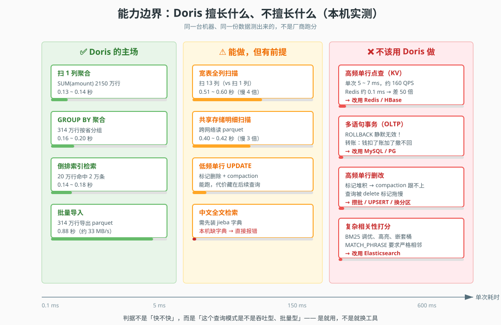
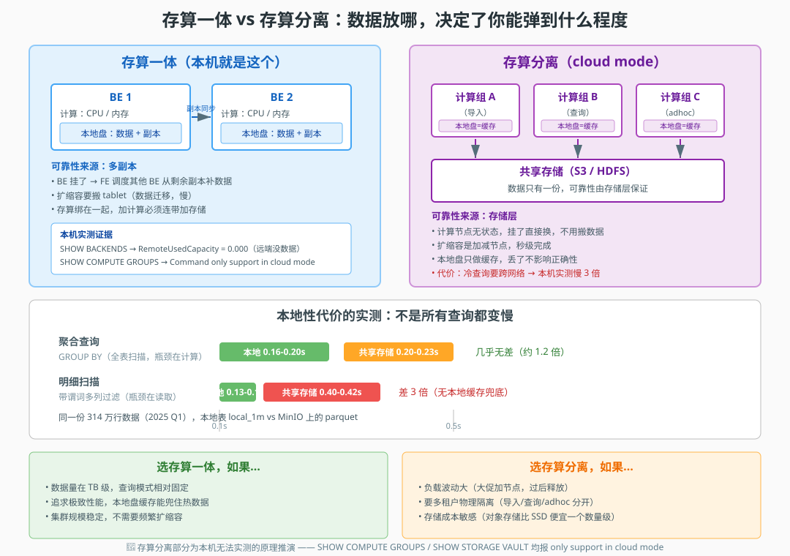

# 第 12 课：选型、存算分离与场景落地

> 所属阶段：阶段 4《分布式运维与生产落地》｜ 水平：零基础 ｜ 本课知识点：Doris 与同类系统对比、存算分离架构、典型场景架构与反模式
> 故事情节：全程学完，主角要回答最后一个也是最难的问题——"我们这个场景，到底该不该用 Doris？"

## 🎯 本课目标

- 在 ClickHouse / Elasticsearch / Hive 等同类系统之间做出有理有据的选型
- 说清存算分离解决什么问题、付出什么代价
- 说出至少 3 个不该用 Doris 的场景及替代方案

---

## ⚠️ 实验边界表

本课是**收官课**，涉及大量"选型判断"——这类内容最容易变成空谈。所以本课的原则是：**凡能实测的一律实测，凡不能实测的一律标注，绝不编造数字**。

| 编号 | 内容 | 实测状态 | 说明 |
|------|------|----------|------|
| 1 | 列存 vs 全列扫描的收益 | 🟢 已实测 | 2150 万行，扫 1 列 vs 13 列 |
| 2 | 倒排索引全文检索 | 🟢 已实测 | 20 万行日志表 |
| 3 | 中文分词器（chinese parser） | 🟢 已实测 | 报错原文照录：缺 jieba 字典 |
| 4 | 高频单行点查的代价 | 🟢 已实测 | 单连接串行 200 次 |
| 5 | 事务（BEGIN/ROLLBACK） | 🟢 已实测 | ROLLBACK 静默无效 |
| 6 | 单行 UPDATE / DELETE | 🟢 已实测 | 能跑，代价隐藏 |
| 7 | 共享存储读取（S3 TVF） | 🟢 已实测 | 314 万行 parquet on MinIO |
| 8 | 本地性代价（聚合 vs 明细） | 🟢 已实测 | 聚合无差、明细差 3 倍 |
| 9 | ClickHouse / ES / Hive 对比 | 🔴 未实测 | 本机无这些容器，纯原理推演 |
| 10 | 存算分离（cloud mode） | 🔴 未实测 | `SHOW COMPUTE GROUPS` 报 only support in cloud mode |
| 11 | 计算组隔离 / 弹性伸缩 | 🔴 未实测 | 同上，原理推演 |
| 12 | Hive Catalog 对接 | 🔴 未实测 | 本机无 Hive Metastore |

**关于第 9 条的诚实说明**：本机只有 Doris、MinIO、Kafka、MySQL 容器，没有 ClickHouse / Elasticsearch / Hive。要"对比"，有两条路：装一套同类系统做跑分 PK，或者**用 Doris 自己的实测数据反推能力边界**。本课选第二条——因为跑分 PK 需要严格控制硬件、数据、查询三项一致，否则比出来的数字没有意义，还不如把"Doris 在不同查询模式下表现如何"测清楚，再据此推断它适合什么场景。所有涉及同类系统的定位判断，都会在文中明确标注是原理推演。

---

## 第一幕：起源与场景引入

十一课学下来，你已经把 Doris 从"建库建表"摸到了"备份升级"。现在坐在你面前的是技术负责人，他问了一个看起来很简单的问题：

> "咱们的订单分析系统，打算换掉现在的 MySQL 慢查询。我看 Doris 挺火的，直接用它吧？"

你张了张嘴，想说"好"，但话到嘴边卡住了。

因为你隐约想起这一路踩过的坑：课 9 里 DELETE 会拖垮 compaction；课 10 里一个失控查询能拖垮整个集群；课 11 里加个字段还得等异步作业。这些记忆在提醒你——**"快"是一个需要追问的词**。

快在什么查询上？快在什么数据量上？快在什么代价上？

而且还有一个更根本的问题：**如果 Doris 真的那么好，为什么不是所有场景都用它？**

这一课，就是要把这个问题回答清楚——**"我们这个场景，到底该不该用 Doris？"**

不是给你一个"Doris 很棒，快用吧"的结论，而是给你一套**判断工具**：拿到任何一个场景，你能自己推演出该不该用、怎么用、用了会踩什么坑。

---

## 第二幕：认知冲突

让我们先做个小实验，看看"Doris 很快"这句话到底在什么情况下成立。

打开终端，我们对同一张 2150 万行的 `orders` 表跑两个查询：

```sql
-- 查询 A：只要一列
SELECT SUM(amount) FROM orders;

-- 查询 B：把 13 列全读出来
SELECT SUM(LENGTH(CONCAT(CAST(order_date AS STRING), province, city,
  CAST(user_id AS STRING), CAST(product_id AS STRING), category,
  CAST(quantity AS STRING), CAST(amount AS STRING), pay_type,
  CAST(status AS STRING), remark, CAST(created_at AS STRING),
  CAST(updated_at AS STRING)))) FROM orders;
```

实跑结果（各 3 轮）：

| 查询 | 第 1 轮 | 第 2 轮 | 第 3 轮 |
|------|---------|---------|---------|
| A：扫 1 列 | 0.139 s | 0.137 s | 0.133 s |
| B：扫 13 列 | 0.511 s | 0.588 s | 0.599 s |

**列数翻了 13 倍，耗时翻了 4 倍。**

这就是第一个认知冲突：**Doris 的"快"不是无条件的**。它的快来自列存——只读你真正需要的列。如果你把宽表当 MySQL 表一样 `SELECT *`，列存的优势就没了。

但更重要的冲突在后面。我们再来测一个场景——按主键查单条记录，这在业务系统里是最常见的操作：

```sql
SELECT id, amount FROM anti_kv WHERE id = 12345;
```

单连接内串行跑 200 次这样的点查，实测：

```
200 次点查 = 1.24 ~ 1.35 秒
单次约 5.7 ~ 6.6 ms
吞吐约 148 ~ 176 QPS（单连接，未并发）
```

6 毫秒一次。听起来还行？

对照一下：同样一次连接，跑一个聚合查询处理 **314 万行**数据，只要 0.18 秒。

**同样的 0.2 秒：点查能拿 200 行，聚合能处理 314 万行。**

这不是"Doris 在点查上慢"，而是**Doris 根本就不是为这个场景设计的**。它是吞吐型引擎——一次处理一大批数据才划算；你让它一次拿一行，就像用货轮送外卖，船本身不慢，但你用错了。

到这里，冲突已经清楚了：

> **"Doris 快"是一个省略了前提的判断。真实的表述是：Doris 在"大批量、聚合型、只读少数列"的查询上快；在"高频、单行、低延迟"的查询上不合适。**

所以技术负责人那句"直接用它吧"，不能简单回答好或不好，得先问回去：**你们的查询长什么样？**

---

## 第三幕：层层揭示

### 知识点 1：Doris 与同类系统对比

> 本知识点关键点：与 ClickHouse / Elasticsearch / Hive+Spark 的能力边界对比、各自擅长与不擅长的场景、多系统并存的典型架构

#### 1.1 对比的正确姿势：不比跑分，比能力边界

🔴 **先说清楚**：本机没有 ClickHouse / Elasticsearch / Hive 容器，这一节的同类系统定位是**原理推演**，不是实测对比。

为什么不做跑分？因为一个公平的跑分要控制三件事一致：硬件、数据集、查询集。任何一项不一致，比出来的数字都只是营销素材。网上那些"A 比 B 快 10 倍"的文章，绝大多数没做到这三点。

所以本课换个思路，这个思路对你更有用：

> **把 Doris 在不同查询模式下的表现测清楚，再据此推断它适合什么场景。**

这个思路的好处是：你学到的是**方法**，不是某个版本号下的具体数字。版本会变，硬件会变，但"列存引擎适合聚合、不适合点查"这个规律不会变。

#### 1.2 实测：列存的收益来自"只读需要的列"

🟢 已实测。数据见第二幕：扫 1 列 0.13-0.14 秒 vs 扫 13 列 0.51-0.60 秒。

这个对比说明什么？

行存数据库（MySQL、PostgreSQL）做 `SUM(amount)` 这类聚合，必须把每一整行都从磁盘读出来，再从中挑出 `amount` 列。哪怕你只要一列，I/O 成本也是全行的。

列存数据库把每一列单独存储，`SUM(amount)` 只需要读 `amount` 这一列的数据文件，其他 12 列碰都不碰。

**所以选型的第一问是：你们的查询，通常只需要少数几列吗？**

- 报表、多维分析、指标聚合 → 通常只要几列 → 列存收益巨大
- 明细查询、整行取出（如"查这条订单的所有信息"）→ 要读所有列 → 列存收益归零甚至更差

#### 1.3 实测：倒排索引——Doris 抢 ES 场景的底气与前提

🟢 已实测。20 万行日志表，带倒排索引。

先建表（注意 parser 的选择，后面会讲为什么用 english）：

```sql
CREATE TABLE log_search (
  ts    DATETIME NULL,
  level VARCHAR(16) NULL,
  msg   STRING NULL,
  INDEX idx_msg (msg) USING INVERTED PROPERTIES('parser' = 'english', 'support_phrase' = 'true'),
  INDEX idx_level (level) USING INVERTED
)
DUPLICATE KEY(ts)
DISTRIBUTED BY HASH(ts) BUCKETS 2
PROPERTIES ('replication_num' = '1');
```

灌 20 万行，然后对比倒排索引与 LIKE 全表扫：

| 查询方式 | 第 1 轮 | 第 2 轮 | 第 3 轮 |
|----------|---------|---------|---------|
| `level MATCH 'ERROR'`（倒排索引） | 0.142 s | 0.147 s | 0.164 s |
| `level LIKE '%ERROR%'`（全表扫） | 0.169 s | 0.136 s | 0.152 s |

**差距很小。** 为什么？

因为这个查询命中了 20103 / 200000 ≈ **10%** 的行。命中率这么高，倒排索引"先定位再取数"的优势就被"反正要扫 10% 的数据"抵消了。

> **判据：命中率越低，倒排索引优势越大。** 百万行里挑 10 条，倒排索引能快几十倍；百万行里挑 10 万条，倒排索引和全表扫差不多。

这也是为什么日志检索场景仍然值得用倒排索引——日志查询的典型模式是"在千万行里找几十条 ERROR"，命中率极低。

**但有两个前提，本机都踩到了：**

**前提一：中文分词要装 jieba 字典**

如果把 parser 改成 chinese：

```sql
CREATE TABLE log_cn (
  ts  DATETIME NULL,
  msg STRING NULL,
  INDEX idx_msg (msg) USING INVERTED PROPERTIES('parser' = 'chinese', 'support_phrase' = 'true')
)
DUPLICATE KEY(ts) DISTRIBUTED BY HASH(ts) BUCKETS 1
PROPERTIES ('replication_num' = '1');

INSERT INTO log_cn
SELECT created_at, CONCAT('用户在', city, '购买了', category) FROM orders LIMIT 1000;

-- ⚠️ 等几秒让统计刷新再查，否则可能先返回 0（课 8 踩过的坑：SHOW DATA 紧跟 INSERT 返回 0）
SELECT COUNT(*) FROM log_cn WHERE msg MATCH_ANY '北京';
```

实测报错，**原文照录**：

```
ERROR 1105 (HY000) at line 1: errCode = 2, detailMessage =
(127.0.0.1)[INTERNAL_ERROR]chinese tokenizer dict file not found:
/opt/be2/dict/jieba.dict.utf8
```

到 BE 上确认，这个目录压根不存在：

```
$ docker exec doris-learn sh -c "ls -la /opt/be2/dict/"
ls: cannot access '/opt/be2/dict/': No such file or directory
```

⚠️ **这是"Doris 能抢 ES 场景"的前置条件，不是语法问题。** 装 jieba 字典是运维动作，SQL 解决不了。`apache/doris:all-in-one-4.1.3` 镜像默认不带。生产上要么自己打镜像装字典，要么在部署时挂载。

**前提二：`MATCH_PHRASE` 要求 term 严格相邻**

实测一个反直觉的行为：

```sql
-- 数据是：'user 1355961 bought 运动户外 in city 19872 amount 2712.24'

SELECT SUM(LENGTH(msg)) FROM log_search WHERE msg MATCH_PHRASE 'bought';
-- 结果：12199982  ✅ 命中

SELECT SUM(LENGTH(msg)) FROM log_search WHERE msg MATCH_PHRASE 'user bought';
-- 结果：NULL      ❌ 一条都没命中
```

为什么？因为 `user` 和 `bought` 中间隔了 `1355961`。

- `MATCH_ALL`：要求两个 term **都出现**即可（不管位置）
- `MATCH_PHRASE`：要求两个 term **严格相邻**

这个区别在中文场景尤其容易踩坑——中文分词后，"北京"和"购买"中间隔了别的词，`MATCH_PHRASE` 就返回空了。

#### 1.4 实测：Doris 抢不了的场景 —— 高频单行点查

🟢 已实测。这是本课最重要的方法论示范。

**错误测法（很多教程都这么测）：**

```bash
for i in $(seq 1 200); do
  docker exec -i doris-learn mysql ... -e "SELECT id, amount FROM anti_kv WHERE id = $i;"
done
```

实测：**26 ~ 27 秒**。

看起来"Doris 点查要 130 ms 一次，慢死了"？

**这个结论是错的。** 做个对照实验——200 次连接，每次只发 `SELECT 1`（不发真正的查询）：

```
200 次空连接（SELECT 1）：25.75 ~ 27.71 秒
200 次点查：            26.11 ~ 27.27 秒
差值：                  -1.60 ~ +1.52 秒  ← 基本是噪声
```

**这 26 秒几乎全是 `docker exec` 建连接 + MySQL 握手的开销，不是 Doris 的查询延迟。**

而且这个测法本身也没意义：真实业务的高并发点查会复用连接池，不会每次新建连接。

**正确测法（单连接内串行）：**

```bash
IDS=$(mysql -N -e "SELECT GROUP_CONCAT(id) FROM (SELECT id FROM anti_kv ORDER BY id LIMIT 200) t;")

{
  for id in $(echo "$IDS" | tr ',' ' '); do
    echo "SELECT id, amount FROM anti_kv WHERE id = $id;"
  done
} | docker exec -i doris-learn mysql -h 127.0.0.1 -P 9030 -uroot shop -N
```

实测：**1.13 ~ 1.35 秒 / 200 次**，即单次 **5.7 ~ 6.6 ms**，吞吐约 **148 ~ 176 QPS**（单连接串行，未并发）。

> **方法论：测延迟类指标，必须先剥离连接开销，且必须模拟真实的连接复用模式。** 否则你测的是客户端，不是数据库。

**现在可以下结论了：**

6 ms 的单次延迟，对 OLAP 场景完全没问题（一个报表查询几百毫秒也无所谓）。但对 KV 场景是灾难级的——Redis 的单次延迟约 **0.1 ms**，差 **50 倍以上**。

而且还有个更致命的问题：每次点查都要走完整的**查询规划 → 调度 → 扫描 → 返回**流程。这些固定开销是为"一次处理百万行"设计的，你让它一次处理一行，资源利用率极低。

| 指标 | Doris（实测） | Redis（典型值，🔴 未实测） |
|------|---------------|---------------------------|
| 单次延迟 | 5.7 ~ 6.6 ms | ~0.1 ms |
| 适用场景 | 一次处理百万行 | 一次拿一行 |
| 吞吐（单连接） | ~160 QPS | 数万 QPS |

**结论：高频单行点查不该用 Doris，该用 Redis / HBase。**

#### 1.5 实测：Doris 抢不了的场景 —— 多语句事务

🟢 已实测。这是本课最有冲击力的一个发现。

我们模拟一个转账场景：A 扣 30，B 加 30，中间出错要整体回滚。

```sql
CREATE TABLE anti_txn2 (
  id     BIGINT NOT NULL,
  amount DECIMAL(18,2) NULL,
  memo   VARCHAR(64) NULL
) UNIQUE KEY(id)
DISTRIBUTED BY HASH(id) BUCKETS 2
PROPERTIES ('replication_num' = '1', 'enable_unique_key_merge_on_write' = 'true');

INSERT INTO anti_txn2 VALUES (1, 100.00, 'init');

BEGIN;
UPDATE anti_txn2 SET amount = amount - 30 WHERE id = 1;
INSERT INTO anti_txn2 VALUES (2, 30.00, 'from_1');
ROLLBACK;
```

你猜 ROLLBACK 之后数据什么样？

```
id    amount   memo
1     70.00    init
2     30.00    from_1
```

**钱扣了，账也加了，ROLLBACK 什么都没撤。**

而且**它不报错**。`ROLLBACK` 安静地执行完，返回一个干净的 OK。如果你不主动去查数据，永远不会知道回滚失败了。

⚠️ 这是最危险的一类问题——**静默失败**。（这一路我们已经遇到好几次了：课 6 的 `docker exec` 缺 `-i`、课 11 的 `RESTORE` 失败信息藏在 `SHOW RESTORE` 里。）

再确认一次变量：

```sql
SHOW VARIABLES LIKE 'transaction_isolation';
-- REPEATABLE-READ   ← 显示得像那么回事
SHOW VARIABLES LIKE 'autocommit';
-- true
```

`transaction_isolation` 显示 `REPEATABLE-READ`，看起来跟 MySQL 一模一样。但这是**协议兼容的显示**，不是真的支持。Doris 的 `BEGIN` / `COMMIT` / `ROLLBACK` 是为了让 MySQL 客户端和 BI 工具能连上来，不提供跨语句的原子性。

> **准确表述：Doris 中每条 DML 语句自己是一个原子单元，但多条 DML 之间不保证原子性。**

**结论：需要多语句事务的业务逻辑，放 MySQL / PostgreSQL；Doris 做分析副本。**

如果确实需要"要么全成功要么全失败"，用 Doris 单条 UPSERT 的原子性——Unique Key 的单行写入是原子的，可以把多行合并成一条 `INSERT`。

#### 1.6 能力边界一览



| 场景 | 实测数据 | 判定 | 该用什么 |
|------|----------|------|----------|
| 单列 / 少列聚合 | 2150 万行 0.13-0.14 s | 🟢 主场 | Doris |
| 多列分组聚合 | 314 万行 0.16-0.20 s | 🟢 主场 | Doris |
| 倒排索引检索 | 20 万行命中 2 万 0.14-0.18 s | 🟢 能做 | Doris（需装分词器） |
| 宽表全列扫描 | 2150 万行 0.51-0.60 s | 🟡 小心 | 拆表 / 按需取列 |
| 高频单行点查 | 5.7-6.6 ms/次，~160 QPS | 🔴 不该 | Redis / HBase |
| 多语句事务 | ROLLBACK 静默无效 | 🔴 不该 | MySQL / PostgreSQL |
| 复杂相关性打分 | 无 BM25 调优、无高亮 | 🔴 不该 | Elasticsearch |

#### 1.7 多系统并存的典型架构（🔴 原理推演）

真实生产环境很少是"一个数据库打天下"，更常见的是这样的分工：

```
业务库 (MySQL/PostgreSQL)
   │  负责：交易、事务、强一致
   │
   ├──CDC──> Kafka ──Routine Load──> Doris ──> BI / 报表
   │                                             负责：交互式分析、多维聚合
   │
   ├──binlog─> Elasticsearch
   │              负责：全文检索、日志查询
   │
   └──归档──> 对象存储 / 数据湖 (Iceberg/Hudi)
                  负责：廉价存历史全量、批处理 ETL

高频点查 ──> Redis
                  负责：缓存、KV 查询
```

**每个系统在自己擅长的领域干活，通过数据同步连起来。**

这套架构的关键认知是：**"选型"不是选一个赢家，而是给每个场景配对的工具，然后设计好它们之间的数据流。**

---

### 知识点 2：存算分离架构

> 本知识点关键点：存算一体 vs 存算分离、共享存储层与计算组、存算分离解决什么问题（弹性 / 成本 / 隔离）、付出什么代价（本地性 / 延迟）

#### 2.1 先确认本机是什么架构

🟢 已实测。看 BE 的容量分布：

```sql
SHOW BACKENDS\G
```

```
                   Host: 127.0.0.1
              TabletNum: 3987
       DataUsedCapacity: 2.539 GB
          AvailCapacity: 807.049 GB
     RemoteUsedCapacity: 0.000      ← 关键
                   Host: 127.0.0.1
              TabletNum: 200
       DataUsedCapacity: 117.864 MB
          AvailCapacity: 807.049 GB
     RemoteUsedCapacity: 0.000      ← 关键
```

`RemoteUsedCapacity: 0.000` —— 远端存储一点数据都没存。**这是存算一体的铁证**：所有数据都在 BE 本地盘上。

#### 2.2 存算分离的语法：本机全不可用

🟢 已实测（报错原文照录）。存算分离（cloud mode）有三条核心管理语句，本机一一试过：

```sql
SHOW COMPUTE GROUPS;
-- ERROR 1105 (HY000): errCode = 2, detailMessage = Command only support in cloud mode.

SHOW STORAGE VAULT;
-- ERROR 1105 (HY000): errCode = 2, detailMessage = Storage Vault is only supported for cloud mode

SHOW CACHE HOTSPOTS;
-- ERROR 1105 (HY000): errCode = 2, detailMessage =
-- no viable alternative at input 'SHOW CACHE'(line 1, pos 5)
```

**这不是命令写错，是部署形态不同。** `apache/doris:all-in-one-4.1.3` 是存算一体的镜像；存算分离需要另外部署（Doris 3.x 起的 cloud mode / 存算分离版）。

#### 2.3 用 S3 TVF 具象化"共享存储层"

既然切不了架构，怎么讲清存算分离？

**换个思路：存算分离的本质是"数据不放本地盘，放共享存储，计算节点按需拉取"。** 本机虽然不能切架构，但可以让 Doris 直接从 MinIO 读 parquet——这条路径的数据流向，和存算分离下 BE 从共享存储拉数据是一样的。

setup 阶段已经把 314 万行导出成 parquet 放到 MinIO 上了：

```sql
SELECT order_date, province, city, user_id, product_id,
       category, quantity, amount, pay_type, status
FROM orders
WHERE order_date >= '2025-01-01' AND order_date < '2025-04-01'
INTO OUTFILE 's3://doris-demo/l12/orders_q1_'
FORMAT AS PARQUET
PROPERTIES (
  's3.endpoint'    = 'http://minio:9000',
  's3.access_key'  = 'minioadmin',
  's3.secret_key'  = 'minioadmin',
  's3.region'      = 'us-east-1',
  'use_path_style' = 'true'
);
```

现在用 S3 TVF 直接读，**不落地到本地盘**：

```sql
SELECT COUNT(*) AS cnt, SUM(amount) AS sum_amt FROM S3(
  'uri' = 'http://minio:9000/doris-demo/l12/*',
  's3.access_key' = 'minioadmin',
  's3.secret_key' = 'minioadmin',
  's3.region' = 'us-east-1',
  'use_path_style' = 'true',
  'format' = 'parquet');
```

结果：`3146951 | 7894118180.53` —— 与本地表 `local_1m` **完全一致**。

⚠️ 注意 `'use_path_style' = 'true'` 这一行：MinIO 是路径风格（path style），不加这个连不上。**（课 6 建 S3 仓库时踩过同一个坑，这里再次出现——同一个坑在不同场景重复出现，说明它是本质约束，不是偶然。）**

**S3 TVF 的三个语法坑（都是实测踩出来的）**

课 6 用的是 `CREATE REPOSITORY`（备份用），这里是 `S3()` 表函数（查询用），写法不同，坑也不同：

**坑一：必须给 `uri` 属性**

按"官方属性名"写 `s3.endpoint` + `s3.bucket` 的写法会被拒：

```sql
SELECT COUNT(*) FROM S3(
  's3.endpoint' = 'http://minio:9000',
  's3.access_key' = 'minioadmin',
  's3.secret_key' = 'minioadmin',
  's3.region' = 'us-east-1',
  's3.bucket' = 'doris-demo',
  's3.root.path' = 'orders_10k.csv',
  'use_path_style' = 'true',
  'format' = 'csv_with_names');
-- ERROR 1105 (HY000): errCode = 2, detailMessage =
-- Can not build s3(): props must contain uri
```

`S3()` 表函数要求用一个完整的 `uri` 把 endpoint + bucket + path 写在一起：

```sql
'uri' = 'http://minio:9000/doris-demo/l12/*'
```

**坑二：MinIO 必须加 `use_path_style`**

不加这条，报的是找不到 endpoint（因为它按虚拟主机风格去解析了）：

```sql
SELECT COUNT(*) FROM S3(
  'uri' = 'http://minio:9000/doris-demo/orders_10k.csv',
  's3.access_key' = 'minioadmin',
  's3.secret_key' = 'minioadmin',
  'format' = 'csv_with_names');
-- ERROR 1105 (HY000): errCode = 2, detailMessage =
-- Can not build s3(): Property minio.endpoint is required.
```

这个报错信息有误导性——它说"需要 minio.endpoint"，但真正缺的是 `use_path_style='true'`（配合 `s3.region`）。

**坑三：`csv_schema` 不支持 `varchar(n)` 写法**

CSV 文件没有表头时要用 `csv_schema` 显式声明列，但类型写法有限制：

```sql
'csv_schema' = 'order_id:bigint;province:varchar(32);...'
-- ERROR 1105 (HY000): errCode = 2, detailMessage = Can not build s3():
-- errCode = 2, detailMessage = invalid csv schema:
-- errCode = 2, detailMessage = unsupported column type: varchar(32)
```

去掉长度也不行：

```sql
'csv_schema' = 'order_id:bigint;province:varchar;...'
-- ERROR ... unsupported column type: varchar
```

**这也是本课选 parquet 而不是 csv 的原因**：parquet 自带 schema，不需要手工声明列，`format='parquet'` 一行搞定。

**另一个死路：`CREATE EXTERNAL TABLE ... ENGINE=S3` 在 4.1.3 被拒**

```sql
CREATE EXTERNAL TABLE s3_csv_ext (...) ENGINE=S3
PROPERTIES ('s3.endpoint' = 'http://minio:9000', ...);
-- ERROR 1105 (HY000): errCode = 2, detailMessage =
-- Do not support external table with engine name = olap
```

⚠️ 注意这个报错说的是 `engine name = olap`——**你写的是 S3，它报的是 olap**。这种"报错信息与输入不对应"的情况说明解析器把 `ENGINE=S3` 当成了别的东西。4.1.3 走 S3 TVF 或 Catalog 才是正路。

> **方法论**：这四个报错里，有两个（坑二的 `Property minio.endpoint is required` 和最后的 `engine name = olap`）**报错信息都与真实原因不对应**。遇到这种"文不对题"的报错，不要照着报错信息去改，要回到"这个语法在当前版本到底支不支持"这个根本问题上。

#### 2.4 本地性代价实测：聚合查询几乎无差

🟢 已实测。同一份 314 万行数据，一边在本地盘，一边在共享存储：

**聚合查询**（`GROUP BY province`），各 5 轮：

| 存储位置 | 第 1 轮 | 第 2 轮 | 第 3 轮 | 第 4 轮 | 第 5 轮 |
|----------|---------|---------|---------|---------|---------|
| 本地表 | 0.187 s | 0.167 s | 0.162 s | 0.197 s | 0.169 s |
| 共享存储 | 0.229 s | 0.200 s | 0.204 s | 0.200 s | 0.201 s |

**几乎没差别**（约 1.2 倍）。

为什么？两个原因：

1. **聚合要把全表扫一遍，瓶颈在计算（CPU），不在读取（I/O）。** 网络传输的那点延迟，被计算时间掩盖了。
2. **列式 parquet 只需传需要的列。** 这个查询只用了 `province` 和 `amount` 两列，网络传输量被压缩得很小。

#### 2.5 本地性代价实测：明细扫描差 3 倍

🟢 已实测。换成需要读多列做过滤的明细查询：

```sql
SELECT COUNT(*) FROM local_1m WHERE amount > 5000 AND quantity > 5;
```

| 存储位置 | 第 1 轮 | 第 2 轮 | 第 3 轮 | 第 4 轮 | 第 5 轮 |
|----------|---------|---------|---------|---------|---------|
| 本地表 | 0.131 s | 0.132 s | 0.148 s | 0.138 s | 0.131 s |
| 共享存储 | 0.402 s | 0.418 s | 0.413 s | 0.403 s | 0.397 s |

**差 3 倍。** 原因：

1. **没有本地缓存兜底** —— 每次都要跨网络读，本地盘的 page cache 帮不上忙
2. **谓词要读多列** —— `amount` 和 `quantity` 两列都要传，网络量上去了
3. **聚合能靠"只读少列"省网络，明细过滤不行** —— 过滤条件涉及的列都得读

> **判据：存算分离的本地性代价，主要落在"需要读多列、且不能靠聚合下推减少传输"的查询上。聚合类查询影响小，明细类查询影响大。**

#### 2.6 存算分离到底换了什么（对照课 9）



课 9 讲过多副本与自动修复，那是**存算一体**的语义：

- 数据存在 BE 本地盘，靠多副本（`replication_num`）保证可靠
- BE 挂了，FE 调度其他 BE 从剩余副本补数据
- 扩缩容要搬数据（tablet 迁移），慢

存算分离下语义完全不同：

| 维度 | 存算一体 | 存算分离 |
|------|----------|----------|
| 数据位置 | BE 本地盘 | 共享存储（S3 / HDFS） |
| 可靠性来源 | 多副本 | 存储层保证（如 S3 的 11 个 9） |
| BE 故障 | 从副本补数据（慢） | 换一个节点（快，无状态） |
| 扩缩容 | 搬 tablet（慢） | 加减节点（秒级） |
| 本地盘作用 | 存数据 | 只做缓存，丢了不影响正确性 |
| 冷查询 | 直接读本地盘 | 跨网络（实测慢 3 倍） |

⚠️ **这是本课最重要的对照**：课 9 学的"副本健康""自动修复"这些运维动作，在存算分离下**大部分不适用**——因为没有副本了，**数据可靠性由共享存储层承担**，副本语义和扩缩容行为都变了。

**具体变了什么**（对照课 9）：

| 课 9 的概念（存算一体） | 存算分离下变成 |
|--------------------------|----------------|
| `replication_num=3` 三副本保可靠 | 无副本，可靠性由 S3 保证（如 11 个 9 的持久性） |
| `SHOW PROC '/cluster_health'` 看缺副本 | 关注点变成共享存储可用性与缓存命中率 |
| BE 挂了 FE 调度补副本 | BE 无状态，挂了直接换节点，不用补数据 |
| 扩容要搬 tablet（慢） | 加减计算节点（秒级），数据不动 |
| 副本倍数 = ReplicaNum / TabletNum | 无此概念 |

**运维关注点的迁移**：从"副本是否健康、有没有 Unrecoverable"→ 变成"缓存命中率如何、共享存储是否抖动"。课 9 那套 `ReplicaMissingNum` / `UnrecoverableNum` 的监控指标，在存算分离下不再是核心。

⚠️ **反过来说**：如果你现在用的是存算一体（像本机这样），课 9 的知识完全有效，别因为"存算分离更先进"就以为副本不重要了。**架构不同，运维动作不同，先确认自己是哪一种。**

#### 2.7 弹性：存算分离真正的卖点

🔴 **以下为原理推演，本机无法实测**（非 cloud mode）。

存算分离的核心价值不是"更快"，是**"更弹"**：

1. **计算组（compute group）隔离** —— 导入组、查询组、adhoc 组用不同的 BE 集合
   - 对照课 10：Workload Group 是在**同一组 BE 内**切分资源；计算组是**物理上不同的 BE 集合**，隔离更彻底
2. **弹性伸缩** —— 大促时加 20 个计算节点，过后释放，数据不用动
3. **成本** —— 对象存储比 SSD 便宜一个数量级
4. **多写多读** —— 一份数据多个计算组同时查

**付出的代价**：

1. **本地性** —— 没有本地盘，冷查询要跨网络（🔴 本机实测差 3 倍，真机上差距取决于网络质量与缓存命中率）
2. **延迟** —— 首次访问的冷读延迟明显，靠 file cache 缓解
3. **依赖共享存储** —— S3 抖动会直接影响查询，这是新的故障模式
4. **架构复杂度** —— 多了元数据管理、缓存一致性等问题

#### 2.8 选型判据

**选存算一体，如果：**

- 数据量在 TB 级，查询模式相对固定
- 追求极致性能，本地盘缓存能兜住热数据
- 集群规模稳定，不需要频繁扩缩容

**选存算分离，如果：**

- 负载波动大（大促加节点，过后释放）
- 要多租户物理隔离（导入 / 查询 / adhoc 分开）
- 存储成本敏感（对象存储比 SSD 便宜一个数量级）

> **关键认知：这不是"哪个更好"，而是"你的瓶颈在哪"。** 瓶颈在性能 → 存算一体；瓶颈在弹性或成本 → 存算分离。

---

### 知识点 3：典型场景架构与反模式

> 本知识点关键点：典型落地架构（实时数仓 / 日志分析 / 湖仓加速）、至少 3 个反模式及替代方案

#### 3.1 典型场景 1：实时数仓（Doris 的主场）

**架构**：

```
业务库 (MySQL) --CDC--> Kafka --Routine Load--> Doris <-- BI / 报表
```

**Doris 在这个场景的三个优势**（前 11 课都验证过）：

1. **Unique Key 支持 UPSERT** —— 天然吃 CDC 的更新流（课 3 讲过 MoW / MoR 两种模式）
2. **物化视图 / Rollup 预聚合** —— 报表查询走预计算结果（课 8）
3. **资源隔离** —— 导入任务和查询任务互不干扰（课 10 的 Workload Group）

**关键设计点**：

- CDC 的更新流必须用 Unique Key，用 Duplicate Key 会产生重复行
- 高频更新选 Merge-on-Write（MoW），写入稍慢但查询快（课 3 实测过差异）
- 导入和查询用不同的 Workload Group，避免互相拖垮（课 10）

#### 3.2 典型场景 2：日志分析（抢 ES 的场景，但有前提）

**架构**：

```
应用日志 --Filebeat--> Kafka --> Doris（倒排索引）<-- 检索 / 聚合
```

**Doris 相对 ES 的优势**（🔴 部分为原理推演）：

- **一份数据既能检索又能聚合** —— ES 做复杂聚合要额外建索引或导出到别的系统
- **存储成本低** —— 列存压缩率高
- **SQL 接口** —— 不用学 ES 的 DSL

**但有两个前提，本机都踩到了**（🟢 已实测）：

1. ⚠️ **中文分词要装 jieba 字典** —— 见 1.3 节，不装直接报错
2. ⚠️ **`MATCH_PHRASE` 要求 term 严格相邻** —— 见 1.3 节，中文场景尤其容易踩

**什么时候仍该选 ES**：

- 需要复杂的相关性打分（BM25 调优、自定义评分脚本）
- 需要高亮、聚合桶嵌套等 ES 生态能力
- 日志量极大，且以全文检索为主、几乎不做数值聚合

#### 3.3 典型场景 3：湖仓加速（Hive/Spark 的补充，不是替代）

🟡 部分实测。本机没有 Hive，但可以用 S3 TVF 演示"直接查湖上文件"这条链路：

```sql
SELECT province, SUM(amount) AS s FROM S3(
  'uri' = 'http://minio:9000/doris-demo/l12/*',
  's3.access_key' = 'minioadmin', 's3.secret_key' = 'minioadmin',
  's3.region' = 'us-east-1', 'use_path_style' = 'true', 'format' = 'parquet')
GROUP BY province ORDER BY s DESC LIMIT 5;
```

**这就是"湖仓加速"的雏形：不改数据位置，直接查。**

生产上用 Catalog 功能对接 Hive Metastore / Iceberg：

```sql
CREATE CATALOG hive PROPERTIES('type'='hms', 'hive.metastore.uris'='thrift://...');
```

🔴 **本机无 Hive Metastore，此语句未实测。**

**分工建议**：

- **数据湖负责**：廉价存历史全量、批处理 ETL、数据回溯
- **Doris 负责**：热数据交互式查询、加速层
- ⚠️ **不要拿 Doris 当数据湖用** —— 存储成本不划算，且 Doris 不是为"存而存"设计的

#### 3.4 反模式 1：拿 Doris 当 KV 缓存用

🟢 已实测。

**症状**：高频单行点查（按主键查单条），QPS 要求上千。

**实测数据**（1.4 节）：单连接串行 200 次点查 = 1.13 ~ 1.35 秒，单次 5.7 ~ 6.6 ms，约 148 ~ 176 QPS。

**为什么不该这么做**：

1. 6 ms 延迟对 KV 场景是灾难（Redis 约 0.1 ms，差 50 倍以上）
2. 每次查询都要走完整的查询规划、调度、扫描流程
3. **吞吐型引擎做延迟型的事，资源利用率极低**

**正确做法**：Redis / HBase 做点查，Doris 做分析，各干各的。用 CDC 把数据同步到 Doris 供分析用。

#### 3.5 反模式 2：拿 Doris 当 OLTP 库用（依赖事务）

🟢 已实测。

**症状**：业务代码里写 `BEGIN` / `ROLLBACK`，指望多语句原子性。

**实测结果**（1.5 节）：转账场景，钱扣了、账加了，`ROLLBACK` 什么都没撤，**而且不报错**。

⚠️ 这是最危险的一类问题——**静默失败**。程序没有任何异常，但账已经错了。

**正确做法**：

- 需要事务的业务逻辑放 MySQL / PostgreSQL，Doris 只做分析副本
- 或用 Doris 单条 UPSERT 的原子性（Unique Key 单行写入是原子的）

#### 3.6 反模式 3：高频单行 UPDATE / DELETE

🟢 已实测（行为）+ 原理推演（代价）。

**症状**：每分钟成千上万次单行 UPDATE，把 Doris 当业务库写。

**为什么慢**（这条要回扣课 9 的 compaction 知识）：

1. Doris 的 UPDATE / DELETE 是**标记删除**（delete predicate），不是物理删除
2. 每次查询都要额外过滤这些标记，**越积越多越慢**
3. 靠后台 compaction 合并清理，但高频写入会让 **compaction 跟不上**（课 9 讲过 compaction 压力）

**这是个典型的"症状滞后"问题**：写入时一切正常，几小时后查询突然变慢，你查半天找不到原因——因为问题不在当前 SQL，在历史写入模式。

**正确做法**：

- **批量 UPDATE** —— 攒批，一次改几千几万行
- **用 Unique Key 的 UPSERT 整行覆盖**（课 3）
- **按分区整体替换** —— `ALTER TABLE ... REPLACE PARTITION`，一次换掉整个分区

#### 3.7 反模式 4：不建分区 / 分区粒度选错

🟢 已实测（本机 orders 表就是反面例子）。

**症状**：几亿行的大表不分区，或按高基数列分区。

```sql
SHOW PARTITIONS FROM orders;
-- 分区=orders   行数=21500001
```

本机 `orders` 表是**单分区 2150 万行**——这是课 2 建表时为了简单，现在它成了活教材：

**问题**：

1. **不分区** → 没法按时间淘汰数据，只能 `DELETE`（触发反模式 3）
2. **按高基数列分区**（如 `user_id`）→ 分区数爆炸，FE 元数据压力巨大

**正确做法**：

- **按时间分区**（天 / 月）—— 既能裁剪查询，又能整分区 `DROP` 淘汰
- **分桶按高频 JOIN / GROUP BY 列** —— 配合 Colocate Join（课 9）

#### 3.8 反模式 5：把宽表当万能解（滥用大宽表）

🟢 已实测（1.2 节数据）。

**症状**：为了"一次查询搞定"，把几十张表 JOIN 成一张几百列的大宽表。

**实测数据**：扫 1 列 0.13-0.14 秒 vs 扫 13 列 0.51-0.60 秒 —— **列数翻 13 倍，耗时翻 4 倍**。

**问题**：

1. 列存虽只读需要的列，但**宽表会让 Schema Change 变重**（课 11 讲过）
2. **数据冗余** —— 上游一改就要全表重刷
3. **稀疏列**（大部分为 NULL）浪费字典编码

**正确做法**：

- **星型模型**：事实表 + 维度表，用 Colocate Join（课 9）
- **适度冗余**高频维度和低基数列，不是无脑全冗余

> **判据：冗余的应该是"低基数、高频使用、很少变化"的列**（如省份、品类），不是所有列。

#### 3.9 决策清单：到底该不该用 Doris

**✅ 该用的信号**：

- 数据量在 TB 级，查询以聚合 / 分组为主
- 需要亚秒级到秒级的交互式分析响应
- 查询模式相对固定，可以靠物化视图 / 索引优化
- 需要 SQL 接口，团队熟悉 MySQL 生态
- 既要实时导入，又要实时查询

**❌ 不该用的信号**：

| 信号 | 替代方案 |
|------|----------|
| 高频单行点查（KV 场景） | Redis / HBase |
| 依赖多语句事务（OLTP） | MySQL / PostgreSQL |
| 复杂全文检索与相关性打分 | Elasticsearch |
| 单纯存冷数据、几乎不查 | 对象存储 / 数据湖 |
| 数据量只有几 GB | MySQL（别引入分布式复杂度） |

---

## 第四幕：实操验证

本课所有结论都来自本机实跑。完整脚本在 `assets/` 下：

```bash
# 0. 建实验表 + 导出共享存储对照数据
bash assets/lesson12-setup.sh

# 1. 知识点 1：Doris 与同类系统对比
bash assets/lesson12-step1.sh

# 2. 知识点 2：存算分离架构
bash assets/lesson12-step2.sh

# 3. 知识点 3：典型场景架构与反模式
bash assets/lesson12-step3.sh

# 4. 收尾清理
bash assets/lesson12-cleanup.sh
```

### 我自己动手跑一遍

**实验 1：感受列存的收益**

```sql
-- 同一张 2150 万行的表，两种扫法
SELECT SUM(amount) FROM orders;                    -- 0.13 ~ 0.14 秒
-- 对比扫全 13 列（见 step1 脚本）                  -- 0.51 ~ 0.60 秒
```

**实验 2：亲手验证 ROLLBACK 无效**

```sql
CREATE TABLE t_rollback (
  id BIGINT NOT NULL, amount DECIMAL(18,2) NULL, memo VARCHAR(64) NULL
) UNIQUE KEY(id) DISTRIBUTED BY HASH(id) BUCKETS 2
PROPERTIES ('replication_num' = '1', 'enable_unique_key_merge_on_write' = 'true');

INSERT INTO t_rollback VALUES (1, 100.00, 'init');

BEGIN;
UPDATE t_rollback SET amount = amount - 30 WHERE id = 1;
INSERT INTO t_rollback VALUES (2, 30.00, 'from_1');
ROLLBACK;

SELECT id, amount, memo FROM t_rollback ORDER BY id;
-- 你会看到：钱扣了，账加了，ROLLBACK 什么都没撤
```

**实验 3：把数据放到共享存储上，看查询怎么变**

```sql
-- 导出到 MinIO
SELECT order_date, province, city, user_id, product_id,
       category, quantity, amount, pay_type, status
FROM orders
WHERE order_date >= '2025-01-01' AND order_date < '2025-04-01'
INTO OUTFILE 's3://doris-demo/l12/orders_q1_'
FORMAT AS PARQUET
PROPERTIES (
  's3.endpoint' = 'http://minio:9000',
  's3.access_key' = 'minioadmin',
  's3.secret_key' = 'minioadmin',
  's3.region' = 'us-east-1',
  'use_path_style' = 'true'
);

-- 直接从共享存储读（不落地本地盘）
SELECT province, SUM(amount) AS s FROM S3(
  'uri' = 'http://minio:9000/doris-demo/l12/*',
  's3.access_key' = 'minioadmin', 's3.secret_key' = 'minioadmin',
  's3.region' = 'us-east-1', 'use_path_style' = 'true', 'format' = 'parquet')
GROUP BY province ORDER BY s DESC LIMIT 5;
```

> ⚠️ **关于数值浮动**：本课所有耗时都跑了 3-5 轮，正文写的是**范围**不是单次值。本机是单 FE + 2 BE 的伪多节点环境（两个 BE 的 host 都是 `127.0.0.1`），且 MinIO 与 Doris 在同一台机器上——**真实生产环境中共享存储的网络延迟会比本机显著**。所以请**看趋势和量级差异，不要看绝对值**：本课真正稳定的结论是"聚合无差、明细差 3 倍"这个**比例关系**，不是那几个具体数字。

---

## 第五幕：体系收束

回到开篇那个问题："我们这个场景，到底该不该用 Doris？"

十二课走下来，你现在应该能给出一个**有结构的回答**，而不是"挺快的，用吧"。

### 一、先问三个问题，而不是先给答案

**问题 1：你们的查询长什么样？**

| 查询模式 | 判定 |
|----------|------|
| 大表聚合、多维分组、只取少数列 | 🟢 用 |
| 明细查询、整行取出 | 🟡 谨慎，考虑拆表 |
| 高频单行点查 | 🔴 别用，换 Redis |

**问题 2：你们需要事务吗？**

- 需要跨语句原子性 → 🔴 别用，换 MySQL / PG
- 只需要单条 UPSERT 原子性 → 🟡 可以用 Unique Key

**问题 3：你们的数据量和变化频率？**

- TB 级、批量写入、低频更新 → 🟢 用
- GB 级、高频单行改 → 🔴 别用（换 MySQL，或改造写入模式）

### 二、全程 12 课的核心结论回扣

这一路学的东西，在选型这件事上能串成一条线：

| 课程 | 核心结论 | 在选型中的作用 |
|------|----------|----------------|
| 课 2-3 | 三种数据模型（Duplicate / Unique / Aggregate） | 决定能不能吃 CDC 更新流 |
| 课 4-5 | 分区分桶、索引 | 决定查询能不能裁剪、扩缩容代价 |
| 课 6 | 导入方式（Routine Load / S3 / Kafka） | 决定实时链路怎么搭 |
| 课 7-8 | 查询优化、物化视图 | 决定复杂查询能不能快 |
| 课 9 | 多副本、compaction | 决定高频更新的代价（反模式 3） |
| 课 10 | 资源隔离 | 决定混合负载能不能共存 |
| 课 11 | Schema Change、备份升级 | 决定运维复杂度（宽表会放大它） |
| **课 12** | **能力边界、存算分离、反模式** | **决定该不该用、怎么用** |

**特别要记住的三条课 9-11 的教训，它们直接构成"不该用"的依据**：

1. **课 9**：DELETE 是标记删除，靠 compaction 清理 → 高频单行删改不可行
2. **课 10**：资源隔离有边界，一个失控查询能拖垮集群 → 高并发小查询不划算
3. **课 11**：Schema Change 是异步的，宽表会放大它的代价 → 宽表不能滥用

### 三、最后的方法论

这一课最重要的不是那张能力边界表，而是**得出它的方式**：

> **不要问"A 和 B 哪个快"，要问"在什么查询模式下、什么数据量下、什么代价下，哪个更合适"。**

具体来说，面对任何一个技术选型，按这四步走：

1. **先测自己的场景**，别信跑分文章（跑分要控制硬件/数据/查询三项一致，绝大多数没做到）
2. **测量方法要经得起推敲** —— 本课测点查时，第一版结论是"130 ms 一次"，差点写进正文；做了空连接对照才发现 26 秒全是连接开销。**测之前先问：我测的到底是目标，还是环境的噪声？**
3. **能实测的实测，不能实测的明确标注** —— 本课的存算分离、ClickHouse 对比都标了 🔴，没有编造数字
4. **静默失败比报错更危险** —— ROLLBACK 无效、`docker exec` 缺 `-i`、`RESTORE` 失败藏在 `SHOW RESTORE` 里，这一路遇到好几次。**验证结论时，不要只看"没报错"，要看数据真的对不对**

---

## 🐞 常见误区

**误区 1：以为"Doris 快"是无条件的**
真相：快在"大批量、聚合型、只读少数列"的查询。实测扫 1 列 0.13 秒，扫 13 列 0.51 秒——列存优势只在按需取列时成立。

**误区 2：把点查慢归结为"Doris 不行"**
真相：先检查测量方法。用 `docker exec` 每次新建连接测出来 130 ms/次，其中 26 秒是连接开销；改成单连接复用后是 6 ms/次。慢是慢，但没有 20 倍那么夸张。

**误区 3：以为 `ROLLBACK` 能回滚**
真相：🟢 实测无效，且不报错。Doris 的 `BEGIN`/`COMMIT`/`ROLLBACK` 是 MySQL 协议兼容，不提供跨语句原子性。需要事务请用 MySQL / PG。

**误区 4：用 `COUNT(*)` 验证数据**
真相：课 9 就发现过，Doris 对简单 `COUNT(*)` 走元数据行数优化，直接从 FE 统计返回，不扫 BE。验证数据完整性用 `SUM` / 明细 / 带谓词 `GROUP BY`。（本课 2.3 节校验共享存储与本地表一致性时，同时用了 `COUNT(*)` 和 `SUM(amount)` 两个口径。）

**误区 5：以为存算分离"更快"**
真相：存算分离的卖点是**弹性**不是性能。实测聚合几乎无差（1.2 倍），明细差 3 倍——它是用一部分性能换取弹性和成本。

**误区 6：把数据湖的事也交给 Doris**
真相：Doris 是**加速层**不是存储层。冷数据放对象存储 / 数据湖，热数据放 Doris。

**误区 7：以为建了倒排索引就能做中文全文检索**
真相：🟢 实测报错——BE 缺 jieba 字典（`/opt/be2/dict/jieba.dict.utf8`）。装字典是运维动作，不是 SQL 能解决的。

**误区 8：以为 `MATCH_ALL` 和 `MATCH_PHRASE` 差不多**
真相：`MATCH_ALL` 只要求 term 都出现；`MATCH_PHRASE` 要求**严格相邻**。实测 `'user 1355961 bought ...'` 中查 `MATCH_PHRASE 'user bought'` 返回空。

**误区 9：为了查询方便就上大宽表**
真相：宽表会让 Schema Change 变重（课 11）、数据冗余、上游一改就全表重刷。适度冗余低基数列即可。

**误区 10：以为选型是"选一个赢家"**
真相：真实架构是多系统并存——MySQL 管交易、Kafka 管流转、Doris 管分析、ES 管检索、Redis 管缓存。选型是给每个场景配对的工具，然后设计好它们之间的数据流。

---

## 一图总结


**一句话收束**：

> **Doris 是吞吐型、聚合型、批量型的分析引擎。用对了，2150 万行的聚合查询 0.14 秒；用错了，一次拿一行的点查 6 毫秒还嫌慢。选型不是问"它快不快"，而是问"我的查询模式是不是它擅长的那种"。**

---

## 📚 速览表

| 主题 | 结论 | 实测状态 |
|------|------|----------|
| 列存收益 | 扫 1 列 0.13-0.14 s vs 扫 13 列 0.51-0.60 s（4 倍） | 🟢 |
| 倒排索引 | 20 万行命中 2 万条 0.14-0.18 s，高命中率下与 LIKE 持平 | 🟢 |
| 中文分词 | 需装 jieba 字典，否则报 `chinese tokenizer dict file not found` | 🟢 |
| MATCH_PHRASE | 要求 term 严格相邻，`MATCH_ALL` 只要求都出现 | 🟢 |
| 高频点查 | 5.7-6.6 ms/次，约 148-176 QPS（单连接）→ 不该用 | 🟢 |
| 事务 | `ROLLBACK` 静默无效，不提供跨语句原子性 → 不该用 | 🟢 |
| 连接开销 | 200 次空连接 25.75-27.71 s，测延迟必须先剥离 | 🟢 |
| 本机架构 | `RemoteUsedCapacity = 0.000` → 存算一体 | 🟢 |
| 存算分离语法 | `SHOW COMPUTE GROUPS` / `STORAGE VAULT` 报 only support in cloud mode | 🟢 |
| 本地性代价（聚合） | 本地 0.16-0.20 s vs 共享存储 0.20-0.23 s（1.2 倍） | 🟢 |
| 本地性代价（明细） | 本地 0.13-0.15 s vs 共享存储 0.40-0.42 s（3 倍） | 🟢 |
| ClickHouse / ES / Hive 对比 | 原理推演，本机无这些容器 | 🔴 |
| 计算组隔离 / 弹性伸缩 | 原理推演，非 cloud mode 无法验证 | 🔴 |
| Hive Catalog | 原理推演，本机无 Metastore | 🔴 |

---

## 🎓 小测

**1. 业务方说："我们要做订单查询，用户在前台点一下就看到自己最近 10 条订单，QPS 大概 2000。"该不该用 Doris？**

<details>
<summary>答案</summary>

**不该。**

这是典型的**高频单行点查**场景。实测 Doris 单连接串行点查约 148-176 QPS、单次 5.7-6.6 ms，而 2000 QPS 的要求意味着单次延迟要压到 0.5 ms 以内——差一个数量级。

**正确做法**：
- 前台查询放 Redis（缓存最近订单）或 MySQL（按 user_id 建索引）
- Doris 做后台的订单分析（按时间/地区/品类聚合）
- 两边通过 CDC 同步

**补充**：即使把 Doris 并发拉上去，单次 6 ms 的固定开销（查询规划 + 调度 + 扫描）也降不下来。这是架构定位决定的，不是调参能解决的。
</details>

**2. 开发同学写了段代码，先扣库存再创建订单，用 `BEGIN`/`ROLLBACK` 包起来。在 Doris 上跑会怎样？**

<details>
<summary>答案</summary>

**会静默出错。** `ROLLBACK` 执行不报错，但数据不会回滚。

实测：转账场景（A 扣 30，B 加 30）执行 `ROLLBACK` 后，`SELECT` 出来是 `id=1, amount=70.00` 和 `id=2, amount=30.00`——钱扣了、账加了，什么都没撤。

**根因**：Doris 的 `BEGIN`/`COMMIT`/`ROLLBACK` 是 MySQL 协议兼容（为了让 BI 工具和 MySQL 客户端能连上来），不提供跨语句原子性。每条 DML 自己是原子的，多条 DML 之间没有原子性保证。

**正确做法**：这段业务逻辑放 MySQL / PostgreSQL，Doris 只做分析副本。如果确实需要在 Doris 上保证原子性，用单条 UPSERT（Unique Key 单行写入是原子的）。

⚠️ **特别提醒**：`SHOW VARIABLES LIKE 'transaction_isolation'` 会显示 `REPEATABLE-READ`，看起来跟 MySQL 一模一样——这是**显示层的兼容**，不代表真的支持。
</details>

**3. 你们有 500 GB 日志，要做全文检索 + 按时间/级别聚合。用 Doris 还是 ES？**

<details>
<summary>答案</summary>

**取决于聚合占比和检索复杂度。**

**选 Doris，如果：**
- 检索只是入口（"找出这批日志"），主要工作在这之后的聚合分析
- 团队更熟 SQL，不想维护 ES 的 DSL 和集群
- 存储成本敏感（列存压缩率高）

**前提**：先确认分词器到位——🟢 本机实测 chinese parser 会报 `chinese tokenizer dict file not found: /opt/be2/dict/jieba.dict.utf8`，生产部署要自己装字典。

**选 ES，如果：**
- 需要复杂的相关性打分（BM25 调优、自定义评分）
- 需要高亮、嵌套聚合桶等 ES 生态能力
- 几乎只做检索，聚合需求很简单

**也可以两者都要**：ES 做检索入口，Doris 做聚合分析，日志双写或通过 Kafka 分发。

⚠️ **注意 `MATCH_PHRASE` 的坑**：它要求 term 严格相邻。实测 `'user 1355961 bought ...'` 中查 `MATCH_PHRASE 'user bought'` 返回空，因为中间隔了 user_id。中文分词后这个问题更常见。
</details>

**4. 为什么测点查延迟时，必须做"空连接对照"？**

<details>
<summary>答案</summary>

**因为否则你测的是客户端开销，不是数据库延迟。**

本课第一版测量：200 次 `docker exec` 点查 = 26-27 秒，看起来"130 ms/次，Doris 点查慢死了"。

做了对照实验后发现：200 次只发 `SELECT 1`（不发真查询）= 25.75-27.71 秒。**两者差值只有 -1.6 到 +1.5 秒，基本是噪声。**

也就是说，那 26 秒几乎全是 `docker exec` 建连接 + MySQL 握手的开销。

**正确测法**：单连接内串行发 200 条 SQL（用管道喂给同一个 mysql 进程）。实测 1.13-1.35 秒，单次 5.7-6.6 ms。

**方法论**：**测任何延迟类指标，先问"我测的到底是目标，还是环境的噪声？"** 做法是先做一个最小对照（什么都不做，只走一遍流程），把基线开销减掉。这个教训在本课程里反复出现——课 6 的 `docker exec` 缺 `-i` 也是同一类问题（环境行为被误当成系统行为）。
</details>

---

## 🚀 下一批接力提示词

> 课 12 是 Doris 系统学习课程的**最后一课**（36/36 知识点已完成）。下一阶段是 **Phase 3 综合实战项目**：用一个贯穿全课程的真实项目，把 12 课的知识点串起来落地。

```text
仓库根目录：D:/projects/learning

【上一课（课 12）的核心结论，不要重复推演】
1. **能力边界（全部实跑验证）**：
   - 扫 1 列 0.13-0.14 s vs 扫 13 列 0.51-0.60 s（列存收益靠"只读需要的列"）
   - 倒排索引 20 万行命中 2 万条 0.14-0.18 s（高命中率下与 LIKE 持平）
   - ⚠️ 中文分词需装 jieba 字典，否则报 chinese tokenizer dict file not found
   - ⚠️ MATCH_PHRASE 要求 term 严格相邻（'user 1355961 bought' 查 'user bought' 返回空）
2. **不该用 Doris 的三个场景（都有实测证据）**：
   - 高频单行点查：5.7-6.6 ms/次，约 148-176 QPS → Redis/HBase
   - 多语句事务：**ROLLBACK 静默无效**，不报错但数据没回滚 → MySQL/PG
   - 高频单行删改：标记删除堆积 + compaction 跟不上 → 批量/UPSERT/换分区
3. **测量方法论（本课最重要的方法论教训）**：
   - ⚠️ 测延迟必须先剥离连接开销。200 次 docker exec 点查 = 26-27 秒，
     但 200 次空连接（SELECT 1）= 25.75-27.71 秒，差值接近 0。
     正确测法是「单连接内串行发 N 条 SQL」，实测 1.13-1.35 秒 / 200 次。
4. **存算分离（本机是存算一体，无法实测）**：
   - 铁证：SHOW BACKENDS 的 RemoteUsedCapacity = 0.000
   - SHOW COMPUTE GROUPS / SHOW STORAGE VAULT 报 only support in cloud mode
   - 用 S3 TVF 读 MinIO parquet 具象化共享存储层：
     聚合几乎无差（本地 0.16-0.20s vs 共享 0.20-0.23s，1.2 倍）
     明细差 3 倍（本地 0.13-0.15s vs 共享 0.40-0.42s）
   - 存算分离卖点是**弹性**不是性能；课 9 的副本/自动修复语义在它下面不适用
5. **五个反模式**：KV 用法、OLTP 用法、高频单行删改、不分区/分区选错、滥用大宽表

【Phase 3 实战项目必须遵守的硬约束】（十二课踩坑总结）
1. **每条命令都要自问「读者照抄能跑通吗？」**
   课 3/4/5/6/7/8/9/10/11/12 连续十课因此被评审抓到。
   禁止出现"（同上）""列定义同上"这类省略，每条 DDL/DML 都要完整可运行。
2. **绝不能 grep 掉 DDL/DML 的报错输出**——课 3/4/5/6 连续四课因此掩盖真相。
   课 11/12 严格遵守：所有报错原文全部保留展示。
3. **单机边界必须标注**：开头加"实验边界表"，每个知识点带 🟢已实测 / 🟡部分实测 / 🔴未实测。
   课 12 的存算分离、ClickHouse/ES 对比全部标 🔴，未编造任何数字。
4. **数值浮动要如实说明**：所有耗时跑 3-5 轮取范围，写范围不写单次，
   明确写"看趋势不看绝对值"。
5. **验证数据不要用 COUNT(*) 验证"数据是否可查"**！
   Doris 对简单 COUNT(*) 走元数据行数优化，直接从 FE 统计返回，不扫 BE。
   验证任何数据完整性都用 SUM / 明细 LIMIT / 带谓词 GROUP BY。
6. 交付后必须回写四处档案：00-学习档案.md、00-评审清单.md、
   对应阶段 overview.md、02-课程目录.md + 01-学习路径总览.md
7. 交付前必须完成双视角评审（pedagogy + learner），P0 清零才能勾选。

【⚠️ 实战项目同样会踩的坑（全课程亲测）】
1. SET 会话变量跨连接失效：必须写成同一连接内执行。
2. docker exec 必须带 -i，否则管道喂进去的 SQL 被静默丢弃（不报错但没执行）。
3. tablet 落点无法手动指定：ADMIN MIGRATE TABLET 在 4.1.3 报语法错误。
4. CREATE REPOSITORY / DROP REPOSITORY 不支持 IF NOT EXISTS / IF EXISTS。
5. RESTORE 的 replication_num 默认是 3 不沿用原表，且失败信息藏在 SHOW RESTORE。
6. 4.1.3 没有 DROP SNAPSHOT 语句。
7. CANCEL ALTER TABLE COLUMN 只在作业进行中有效，不支持 WHERE JobId= 语法。
8. MODIFY COLUMN 不能改带 DEFAULT 值的列。
9. S3 相关操作（仓库/TVF/导出）对 MinIO 必须加 use_path_style=true。
10. SHOW RESTORE / SHOW BACKUP 取最新作业状态须 tail -1。
11. BEGIN/ROLLBACK 不提供跨语句原子性（课 12 实测，静默无效）。
12. SHOW DATA 紧跟 INSERT 返回 0（需等约 45 秒统计刷新）。

【本机环境状态】
- Doris 4.1.3-rc02-7126cf65d96，容器 doris-learn（9030/8030/8040，healthy）
- 1 FE + 2 BE（host 都是 127.0.0.1，伪多节点，非 cloud mode）
- Kafka 容器 doris-kafka（doris-net，主机名 kafka，topic doris_orders）
- MinIO 容器 doris-minio（doris-net，主机名 minio，bucket doris-demo）
- shop 库既有表（前几课建的，不要删）：
  orders（2150万行，单分区，日期范围 2025-01-01 ~ 2026-12-31）、
  orders_dup、orders_agg、orders_uniq_mow/mor、rollup_demo、
  perf_wide（200万行）、perf_wide_big（400万行）、load_demo、kafka_orders、
  s3_orders_ext、t_part_month、t_bucket_8、k_prov_first、k_date_first、empty_t、
  dim_region、non_colo_dim、fact_1m、fact_prov、v_probe、log_typed/log_variant/log_json、
  mv_prov_pay_daily/mv_part_daily/mv_sched、cost1、repl3、ha_demo
- 全局设置：
  enable_profile=true（课 7 开的）
  **enable_sql_cache=false**（课 7 关的，测性能必须保持；不测请恢复 true）
  disable_balance=false（课 9 从 true 改过来的）
  **enable_spill=false**（出厂默认）
- 仓库 s3_repo 在课 11 结束时已删除（若需备份实验请重建）
- 连 Doris：docker exec -i doris-learn mysql -h 127.0.0.1 -P 9030 -uroot shop
```

---

## 🎓 全课程完结

**恭喜完成 Apache Doris 系统学习课程全部 12 课、36 个知识点。**

从课 1 的"Doris 是什么"，到课 12 的"该不该用 Doris"，你走完了一个完整的闭环：

- **阶段 1**（课 1-3）：懂它是什么、数据怎么存
- **阶段 2**（课 4-6）：懂数据怎么进来、怎么组织
- **阶段 3**（课 7-8）：懂查询怎么快、怎么优化
- **阶段 4**（课 9-12）：懂生产怎么运维、该怎么选型

最后记住这三句话：

1. **"快"是有前提的** —— 先问查询模式，再谈性能
2. **测量方法比测量结果重要** —— 先剥离噪声，再下结论
3. **静默失败比报错危险** —— 验证要看数据对不对，不只是看有没有报错

---

## 🧭 课程导航

⬅️ **上一课**：[课 11：日常运维：Schema Change、备份与升级](lesson-11-日常运维SchemaChange备份与升级.md)

➡️ **下一课**：全部 12 课已完成 → 进入 Phase 3 综合实战项目

📚 **返回目录**：[课程目录](../../../02-课程目录.md)

🏠 **返回阶段**：[阶段 4：分布式运维与生产落地](../overview.md)
