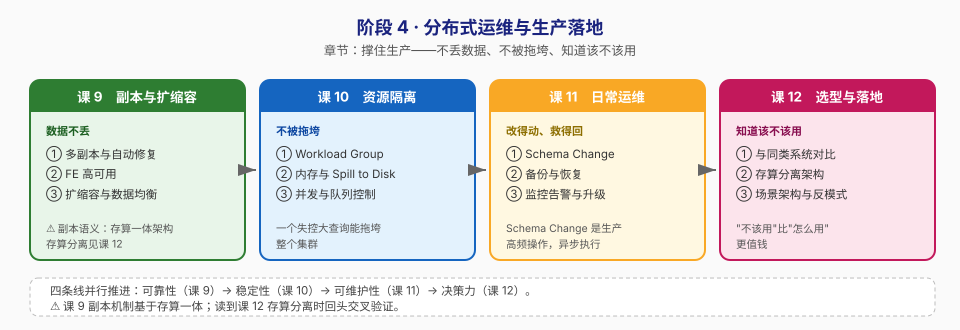

# 阶段 4：分布式运维与生产落地

> 所属课程：Apache Doris ｜ 故事章节：**撑住生产**——报表、实时写入、大查询挤在一个集群里 ｜ 上一阶段：[阶段 3](../3-数据导入与查询/overview.md)

## 🎯 本阶段目标

- 理解副本、FE 高可用、扩缩容数据的自愈机制，能应对常见节点故障
- 设计资源隔离方案，让实时写入、报表查询、临时大查询互不干扰
- 能独立判断"该不该用 Doris"，并说清存算一体与存算分离的选型依据

## 📍 学习重点

- **副本是可靠性的地基**：多副本 + 自动修复意味着机器挂了数据不丢、查询不停，但也意味着存储成本翻倍
- **资源隔离是生产刚需**：一个失控的大查询能拖垮整个集群，Workload Group 是生产上线的必备配置
- **"不该用"比"怎么用"更值钱**：Doris 不擅长高频单条事务更新，也不该当缓存用——知道边界才算真的会用

> ⚠️ 注意：本阶段课 9 讨论的多副本与自动修复，语义基于**存算一体**架构；存算分离（课 12）下数据可靠性由共享存储层承担，副本语义不同，届时交叉回顾。

## ✅ 必须掌握的知识点

| 知识点 | 所属课 | 学完应能 |
|--------|--------|----------|
| 多副本与自动修复 | 课 9 | 说清 BE 宕机后数据如何自愈，以及副本数对存储成本的影响 |
| FE 高可用 | 课 9 | 解释 Master / Follower / Observer 的选举与读写分工 |
| 扩缩容与数据均衡 | 课 9 | 执行加节点操作，理解数据自动均衡的过程与影响 |
| Workload Group 与资源隔离 | 课 10 | 配置资源组，实现"大查询不拖垮小查询" |
| 内存管理与 Spill to Disk | 课 10 | 说清内存超限时的落盘机制，以及它为什么是"保命"而非"加速" |
| 查询并发与队列控制 | 课 10 | 配置并发上限与排队策略，拒绝而非压垮 |
| Schema Change | 课 11 | 执行加列/改列操作并理解它的异步执行特性 |
| 备份与恢复 | 课 11 | 完成一次备份与恢复演练 |
| 监控告警与集群升级 | 课 11 | 列出关键监控指标，说清升级的灰度顺序 |
| Doris 与同类系统对比 | 课 12 | 在 ClickHouse / ES / Hive 之间做出有理有据的选型 |
| 存算分离架构 | 课 12 | 说清存算分离解决什么问题、付出什么代价 |
| 典型场景架构与反模式 | 课 12 | 说出至少 3 个不该用 Doris 的场景及替代方案 |

## 🗺️ 本阶段路径图

## 本阶段产出

- [x] `lessons/lesson-09-副本高可用与扩缩容.md`（2026-09-03 交付）
- [x] `lessons/lesson-10-资源隔离与负载管理.md`（2026-09-03 交付）
- [x] `lessons/lesson-11-日常运维SchemaChange备份与升级.md`（2026-09-03 交付）
- [x] `lessons/lesson-12-选型存算分离与场景落地.md`（2026-09-03 交付，全课程收官）

## 阶段状态

**已完成** —— 课 9、课 10、课 11、课 12 全部交付（2026-09-03），阶段进度 4/4 课、12/12 知识点；全课程 36/36 知识点完成

## 核心结论（随课交付追加）

> 每课完成后在此追加一句本课的核心结论。

### 课 9《副本、高可用与扩缩容》核心结论（2026-09-03）

- **副本数是"请求"不是"保证"**：声明 3 副本在只有 2 台 BE 时照样建表成功，但只落地 6 个副本（= 分桶数）。判定集群有没有冗余不能看建表语句，要看 `SHOW PROC '/statistic'` 的 `TabletNum` vs `ReplicaNum`——本机 shop 库 643/643，**零冗余**。
- **反亲和是硬规则**：同一 Tablet 的多个副本不能落同一台物理机，`ALTER TABLE ... SET ('replication_num'='2')` 会直接报 `Failed to find enough backend ... or maybe all be on same host`。单容器里"多副本扛宕机"因此**无法实测**（🟡 原理推演），本文用"单副本宕机必然报错"做反证。
- **"查询没断"的真相**：查询能不能跑取决于**数据住在哪**，不取决于**有几个副本**。所有 tablet 都在宕机节点时，扫数据的查询会报 `RpcException UNAVAILABLE`（心跳窗口内）→ `tablet xxx has no queryable replicas`（超时后）。
- **⚠️ 计数陷阱**（本课自主发现，前九课均未注意）：`SELECT COUNT(*)` 走元数据行数优化、根本不扫 BE，宕机了照样返回值。验证数据可查必须用 `LIMIT` 明细或 `SUM()` 全表聚合。
- **自愈零干预**：10 秒心跳超时判定死亡后，Tablet 调度器自动补副本。实测 kill BE2 → `HealthyNum` 611 掉到 603、`NeedFurtherRepairNum=8`；重启后 45 秒自己回到 611，全程无人工操作。
- **成本与冗余是同一枚硬币**：cost1 表 100 万行 1 副本 = 2.553 MB，2 副本 ≈ 5.1 MB、3 副本 ≈ 7.7 MB。
- **扩缩容三命令**：`ADD BACKEND`（幂等）/ `DECOMMISSION`（先迁数据、可 `CANCEL DECOMMISSION` 撤销）/ `DROP`（被拒绝，提示 `If you insist, use DROPP instead of DROP`）。均衡默认**关闭**（`disable_balance = true`），开启后受 `balance_slot_num_per_path = 1` 限速，每块盘同时只搬 1 个 tablet。
- **FE 高可用**：Master 唯一可写、Follower 有投票权、Observer 只读不投票；选举要求"超过半数"，所以 FE 必须奇数个——**2 台的容错能力和 1 台一样是 0**。

**遗留待办（课 10 接力）**：`disable_balance` 已从 `true` 改为 `false`，做确定性实验前需先关回来；`ADMIN MIGRATE TABLET` 在 4.1.3 报语法错误，tablet 落点无法手动指定；`enable_sql_cache` 仍为 false。

### 课 10《资源隔离与负载管理》核心结论（2026-09-03）

- **隔离不是抢资源，是划地盘**：限制大查询靠的是 `max_concurrency`（**同时跑几条**），不是"给它更少的 CPU"。实测三条大查询从"一起跑"变成"排队跑"，**每条的单条耗时一点没变**，变的是中间让出了空隙。
- **主线实测（5 轮取范围，跑过两次）**：无干扰基线 153–186 ms → 无隔离（3 条大查询并发）**1122–1642 ms** → 有隔离（大查询限并发 1）**217–270 ms**。报表查询快约 6 倍，接近无干扰基线。⚠️ 两次重跑数字不同（另一组：1223–1719 / 212–265 ms），**看倍数关系不看绝对值**。
- **Spill to Disk 是保命，不是加速**：`orders` 高基数聚合在 384 MB 限制下，spill=OFF **0.22–0.24 秒就报错**；spill=ON 用 **5.24–11.85 秒跑完**，落盘峰值 **40 MB / 40 个文件**，查询结束后自动清理。比内存充足（0.30–0.33 秒）慢 **17–39 倍**。
- **⚠️ `enable_spill` 出厂默认是 `false`**：不加这一条，内存超限的查询直接失败而非降级落盘。生产建议显式打开。
- **内存超限的真实机制是"暂停→尝试回收→不行才报错"**，不是"超了就杀"。BE 日志证据：`workload_group_manager.cpp:301] Insert one new paused query ... TotalPausedPeriodSecs=18`。
- **spill 不是万能的**：`orders` 自关联在 128MB 直接报错（0.22 秒）、256MB **挣扎 88.63 秒后仍报错**、512MB 成功但要 **480 秒**、1024MB 成功只要 **1.06 秒**。代价高度非线性。
- **并发三处置（全部实测）**：`max_concurrency=1, queue=0` → 3 条并发 2 条被拒（`query waiting queue is full, queue capacity=0`）；`queue=5, timeout=10s` → 3 条全成功（0.97/1.75/2.64 秒，串行排队）；`queue=5, timeout=1s` → 排队超时被拒（`query queue timeout, timeout: 1000 ms`）。**两种报错别混淆：`is full` = 不让进（调 `max_queue_size`）；`timeout` = 等不及（调 `queue_timeout` 或 `max_concurrency`）**。
- **⚠️ 属性名陷阱（4.1.3）**：`memory_limit`、`cpu_share`、`cpu_hard_limit`、`enable_memory_overcommit`、`tag` **已废弃**，用了直接报 `Property xxx is not supported, maybe it is deprecated`。可用的是百分比系列 + `max_concurrency`/`max_queue_size`/`queue_timeout`/`scan_thread_num`/`read_bytes_per_second`。另：`memory_high_watermark` 必须大于 `memory_low_watermark`（**低水位默认 75%**），只设高水位 70% 会报错；一个 Compute Group 下最多 **15** 个组。
- **🟡 CPU 配额在本机测不了**：容器 cgroup 是只读挂载（`cgroup2 (ro,...)`），实测 `max_cpu_percent` 100% 组 1.42–1.60 秒、5% 组 1.03–1.18 秒，受限组反而更快——限制根本没生效。正文已明确标注边界，未编造数字。
- **绑定两步都要做**：`GRANT USAGE_PRIV`（授权）+ `SET PROPERTY`（设默认组）。另注意 `SET workload_group` 后 `SELECT @@workload_group` **返回空字符串**（不代表没生效），验证要看 `SHOW WORKLOAD GROUPS` 的 `running_query_num`。

**遗留待办（课 11 接力）**：`enable_spill` 未持久化（cleanup 已恢复 false）；Workload Group 已清理干净只剩 `normal`；`enable_sql_cache` 仍为 false（测性能沿用）；`disable_balance` 仍为 false。

### 课 11《日常运维：Schema Change、备份与升级》核心结论（2026-09-03）

- **Schema Change 有两条路径，走哪条取决于 `light_schema_change` 开关**：`=true`（**4.x 出厂默认值**）时加列只改 FE 元数据，ALTER 返回即生效（毫秒级，`sc_light` 表 500 万行加列 <100 ms）；`=false`（或改 Key 顺序 / 列类型）时走"重写数据"路径，异步执行，必须轮询 `SHOW ALTER TABLE COLUMN` 等 `FINISHED` 才可用。
- **作业状态机**：`PENDING` → `WAITING_TXN`（等未提交导入事务，**生产上最易卡住的一步**）→ `RUNNING` → `FINISHED` / `CANCELLED`。`sc_heavy` 表 500 万行加列实测 2–5 秒完成；100 万行 1–3 秒——单机太快，反而抓不到 CANCEL 窗口（🟡 CANCEL 演示如实呈现失败面）。
- **加列不阻塞导入**：light 路径下 ALTER 期间照常 INSERT，实测 20 万行写入不报错，新列自动填默认值。但**表处于 SCHEMA_CHANGE 时不能再来一次 ALTER**，报 `state(SCHEMA_CHANGE) is not NORMAL. Do not allow doing ALTER ops`。
- **⚠️ 支持矩阵的三条硬限制（全部实测）**：① `MODIFY COLUMN` 不能改带 DEFAULT 值的列（报 `Can not change default value`，写 `DEFAULT NULL` 也不行）——绕过办法是"加新列 → UPDATE 回填 → 删旧列 → 改名"；② 重排 Key 列用 `ORDER BY` 必须写**全所有列**，漏一列报 `Reorder stmt should contains all columns`；③ Key 列不能加到 Value 列之后（报 `Cannot add key column id after value column`）。
- **Repository 是"网盘账号"，Snapshot 是"一次备份内容"**：仓库建一次长期复用（`CREATE REPOSITORY`），快照带 timestamp（`BACKUP ... TO repo` 产生一个快照）。`CREATE REPOSITORY` **不支持 `IF NOT EXISTS`**、`DROP REPOSITORY` **不支持 `IF EXISTS`**，都报 `mismatched input 'IF' expecting {...}`。
- **⚠️ `RESTORE` 的 `replication_num` 默认是 3，不沿用原表**——本课最隐蔽的坑：语句提交时**不报错**，失败信息藏在 `SHOW RESTORE` 的 Status 列（`replication num should be less than the number of available backends. replication num is 3, available backend num is 2`）。本机 2 台 BE，恢复 1 副本表必须显式写 `'replication_num'='1'`。另 `RESTORE` 必须带 `backup_timestamp`（漏了报 `Missing backup_timestamp property`），值从 `SHOW SNAPSHOT ON <repo>` 取。
- **一个库同一时刻只能跑一个 backup/restore 作业**：连发两条，第二条报 `Currently, this DB is under backup or restore.`。串行排队要自己控制。
- **备份/恢复粒度**：支持全库、单表、单分区三级。分区级备份实测 `bk_part` 2 分区各 2 万行，只备份分区 `p1`（2 万行）也能单独恢复，恢复后其余分区为空——**分区级恢复不是"增量补数据"，是"只恢复你备份的那些分区"**。
- **⚠️ 4.1.3 没有 `DROP SNAPSHOT` 语句**：四种写法全部报 `no viable alternative at input 'DROP SNAPSHOT'(line 1, pos 5)`。清理快照只能"删仓库 + 物理清 S3 目录"（`docker exec doris-minio rm -rf /data/doris-demo/backup11/`）。
- **监控端点（本机实测）**：FE `:8030/metrics` 1454 条、BE `:8040/metrics` 1227 条、BE2 `:18040/metrics` 1231 条。三类必看指标：① 副本健康（`SHOW PROC '/cluster_health/tablet_health'` 的 `ReplicaMissingNum` / `UnrecoverableNum` / `InconsistentNum`，配合 `SHOW PROC '/statistic'` 的 `ReplicaNum / TabletNum` 副本倍数，本机 719/719 = **1.00 倍，零冗余**）；② 磁盘与内存（BE 磁盘水位、查询内存峰值）；③ 导入与 Compaction（`SHOW LOAD` 失败率、`cumulative/base compaction` 分数）。
- **升级灰度顺序：BE → FE Observer → FE Follower → FE Master**。理由：FE 兼容旧版 BE（新版 FE 能管旧 BE），所以先升 BE；Master 是唯一可写节点，最后动，把不可写窗口压到最短。升级前五项体检：副本全健康 / 无进行中的 Schema Change 与备份作业 / 磁盘余量 / 元数据已备份 / 有回滚方案。
- **MinIO 作 S3 备份目标必须加 `'use_path_style'='true'`**：不加走虚拟主机风格会连不上。

**遗留待办（课 12 接力）**：`enable_sql_cache=false`、`enable_spill=false`、`enable_profile=true`（沿用课 7/课 9 设定，未恢复）；Workload Group 只剩 `normal`；S3 仓库 `s3_repo` 与实验表 `sc_light` / `sc_heavy` / `bk_orders` / `bk_part` 已由 `lesson11-cleanup.sh` 清理；容器 `doris-minio`（课 6 建）保留，课 12 讲存算分离可复用。

### 课 12《选型、存算分离与场景落地》核心结论（2026-09-03）· 全课程收官

- **能力边界（全部实跑验证，2150 万行 orders 表）**：**扫 1 列 0.13-0.14 秒 vs 扫 13 列 0.51-0.60 秒** —— 列存的收益来自「只读需要的列」，不是无条件的快。列数翻 13 倍、耗时翻 4 倍。
- **倒排索引（20 万行日志表）**：`level MATCH 'ERROR'` 命中 20103/200000（10%）耗时 0.14-0.18 秒，与 `LIKE '%ERROR%'` 全表扫（0.13-0.17 秒）**基本持平**。判据：**命中率越低，倒排索引优势越大**——日志检索（千万行里找几十条）才值得用。
- **⚠️ 中文分词器不可用（实测）**：BE 上 `/opt/be2/dict/` 目录压根不存在，chinese parser 查询报 `chinese tokenizer dict file not found: /opt/be2/dict/jieba.dict.utf8`。且**表里有数据才报错**，空表查询返回 0。装 jieba 字典是运维动作，SQL 解决不了，all-in-one 镜像默认不带。
- **⚠️ `MATCH_PHRASE` 要求 term 严格相邻**：数据 `'user 1355961 bought ...'` 中查 `MATCH_PHRASE 'user bought'` 返回空（中间隔了 user_id），单 term `'bought'` 能命中；`MATCH_ALL` 只要求都出现。中文分词后此坑更常见。
- **⚠️ `ROLLBACK` 静默无效（本课最有冲击力的发现）**：转账场景（A 扣 30、B 加 30）执行 `ROLLBACK` 后 `SELECT` 出来是 `id=1 amount=70.00` 和 `id=2 amount=30.00` —— 钱扣了、账加了，什么都没撤，**且不报错**。`SHOW VARIABLES` 仍显示 `transaction_isolation=REPEATABLE-READ`，是 MySQL 协议兼容的显示，不是真支持。准确表述：**每条 DML 自己原子，多条 DML 之间无原子性**。
- **⚠️ 测量方法论（本课最重要的方法论教训）**：测点查延迟时第一版用 200 次 `docker exec`，得出 130 ms/次，险些写进正文；做**空连接对照**（200 次只发 `SELECT 1`）后发现 25.75-27.71 秒几乎全是连接开销，与点查的 26.11-27.27 秒差值仅 -1.6~+1.5 秒。改用**单连接内串行发 200 条 SQL** 后为 1.13-1.35 秒，单次 **5.7-6.6 ms**、约 **148-176 QPS**。规矩：**测任何延迟类指标，先做最小对照把基线开销减掉**。
- **本机是存算一体（铁证）**：`SHOW BACKENDS` 的 `RemoteUsedCapacity = 0.000`；`SHOW COMPUTE GROUPS` 报 `Command only support in cloud mode.`、`SHOW STORAGE VAULT` 报 `Storage Vault is only supported for cloud mode`、`SHOW CACHE HOTSPOTS` 报 `no viable alternative at input 'SHOW CACHE'`。存算分离须另部署 cloud mode。
- **存算分离的本地性代价有明确边界（用 S3 TVF 读 MinIO parquet 具象化，314 万行同口径）**：**不是所有查询都变慢**。聚合 `GROUP BY` 本地 0.16-0.20s vs 共享存储 0.20-0.23s（1.2 倍，几乎无差）；明细带谓词扫描 0.13-0.15s vs 0.40-0.42s（**差 3 倍**）。原因：聚合瓶颈在计算、列式 parquet 只需传少数列；明细过滤涉及的列都得读，且无本地 page cache 兜底。
- **存算分离 vs 存算一体（对照课 9）**：存算一体下数据在 BE 本地盘、靠 `replication_num` 多副本保可靠、BE 挂了要补副本、扩缩容要搬 tablet；**存算分离下数据可靠性由共享存储层承担**，无副本、BE 无状态挂了直接换、扩缩容秒级、本地盘只做缓存。**运维关注点从 `ReplicaMissingNum`/`UnrecoverableNum` 迁移到缓存命中率与共享存储可用性**——课 9 那套监控指标在存算分离下不再是核心。
- **存算分离卖点是「弹性」不是「性能」**：计算组物理隔离（比课 10 的 Workload Group 更彻底）、弹性伸缩、对象存储比 SSD 便宜一个数量级、一份数据多计算组共读。代价：冷查询跨网络、依赖共享存储抖动、架构复杂度上升。
- **S3 TVF 的四个语法坑（4.1.3 实测，报错原文照录）**：①必须用 `'uri'` 属性（写 `s3.endpoint`+`s3.bucket` 报 `Can not build s3(): props must contain uri`）；②MinIO 必须加 `'use_path_style'='true'`（不加报 `Property minio.endpoint is required.`）；③`csv_schema` 不支持 `varchar(n)` 也不支持裸 `varchar`（报 `unsupported column type`）；④`CREATE EXTERNAL TABLE ... ENGINE=S3` 被拒（报 `Do not support external table with engine name = olap`）。**其中两个报错信息与真实原因不对应**——遇到文不对题的报错，要回到「这个语法当前版本到底支不支持」这个根本问题上。
- **五个反模式**：①拿 Doris 当 KV 用（5.7-6.6 ms/次 vs Redis 0.1 ms，差 50 倍）；②拿 Doris 当 OLTP 用（ROLLBACK 静默无效）；③高频单行删改（标记删除堆积 + compaction 跟不上，回扣课 9）；④不建分区 / 分区粒度选错（本机 `orders` 就是单分区 2150 万行的反面例子，没法按时间淘汰，只能 DELETE 从而触发反模式 3）；⑤滥用大宽表（列数翻 13 倍耗时翻 4 倍，且让课 11 讲的 Schema Change 变重）。
- **全课程收束（36/36 知识点）**：阶段 1（课 1-3）懂它是什么、数据怎么存；阶段 2（课 4-6）懂数据怎么进来、怎么组织；阶段 3（课 7-8）懂查询怎么快、怎么优化；阶段 4（课 9-12）懂生产怎么运维、该怎么选型。**三句话方法论**：①「快」是有前提的，先问查询模式再谈性能；②测量方法比测量结果重要，先剥离噪声再下结论；③静默失败比报错危险，验证要看数据对不对，不只是看有没有报错。

**遗留待办（Phase 3 实战参考）**：`enable_sql_cache=false`（课 7 关的，测性能用）、`enable_profile=true`、`enable_spill=false`（出厂默认）；课 12 实验表与 MinIO `l12/` 目录已由 `lesson12-cleanup.sh` 清理；集群健康（shop 库 647/647 tablet 全部健康、0 缺副本）；容器 `doris-learn`（1 FE + 2 BE，4.1.3-rc02-7126cf65d96）、`doris-minio`（bucket doris-demo）、`doris-kafka`（topic doris_orders）均保留。
