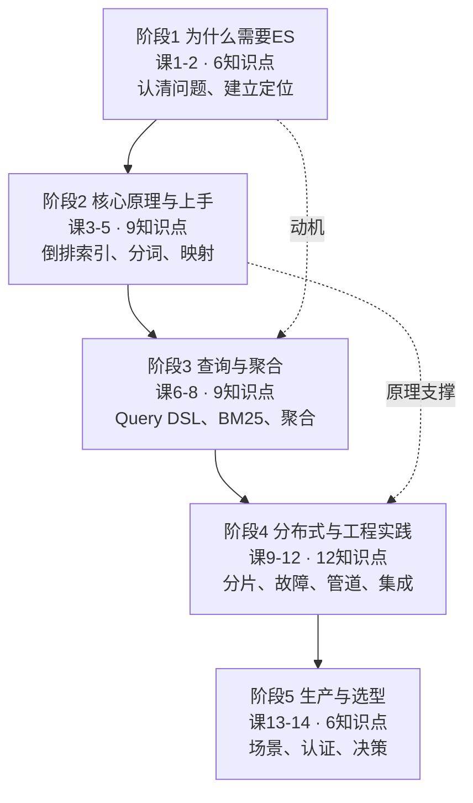

# Elasticsearch 系统学习 · 学习路径总览

> 水平：零基础 ｜ 模式：课程制 ｜ 规模：5 阶段 / 14 课 / 42 知识点
> 四大目标全覆盖：① 理解概念 ② 动手实操 ③ 应试认证 ④ 决策参考
> 📑 按课查阅请走 [02-课程目录.md](02-课程目录.md)（书本式目录，已编写 = 链接）

## 🎬 故事主线

一个"搜索框"的自我修养。

想象你负责一个电商网站。老板提了个朴素的需求："加个搜索框，用户输'苹果手机'要能搜到 iPhone。"

你第一反应是 SQL `LIKE '%苹果手机%'`。上线后发现：慢、搜不准、排不好、还没有高亮。

**这门课，就是你从"写 SQL 的人"成长为"懂搜索的人"的完整旅程。** 五个阶段，正好对应你能力增长的五个台阶：

- **阶段 1**：认清"数据库干不了搜索"这件事，明白搜索到底要解决什么问题
- **阶段 2**：搞懂 ES 凭什么能搜得这么快（倒排索引 + 分词），并亲手把它跑起来
- **阶段 3**：学会"问问题"的语言（Query DSL）和"做统计"的语言（聚合）
- **阶段 4**：从单机玩具走向生产级分布式系统，能做数据管道、能排故障
- **阶段 5**：站高一层——知道 ES 在哪些场景是王者、哪些场景是坑，以及怎么把它写进简历

## 📊 阶段地图

## 📚 阶段明细

### 阶段 1：为什么需要 Elasticsearch（课 1-2 · 6 知识点）

**本阶段回答**：数据库为什么搞不定搜索？ES 是什么、能干什么、跟别的有啥不一样？

| 课 | 标题 | 知识点 | 状态 |
|----|------|--------|------|
| 课1 | [为什么数据库搞不定搜索](stages/1-为什么需要ES/lessons/lesson-01-为什么数据库搞不定搜索.md) | 数据库模糊查询的痛点 / 搜索引擎是什么 / ES 能干什么 | ✅ 已完成 |
| 课2 | [ES 是谁、凭什么](stages/1-为什么需要ES/lessons/lesson-02-ES是谁凭什么.md) | ES 起源与定位 / 核心概念全景 / ES vs 其他方案 | ✅ 已完成 |

[进入阶段 1 概览](stages/1-为什么需要ES/overview.md)

### 阶段 2：核心原理与上手 ✅（课 3-5 · 9 知识点 · 已完成 9）

**本阶段回答**：ES 凭什么这么快？怎么把它跑起来并正确存数据？

| 课 | 标题 | 知识点 | 状态 |
|----|------|--------|------|
| 课3 | [把 ES 跑起来](stages/2-核心原理与上手/lessons/lesson-03-把ES跑起来.md) | 本机安装与首次启动 / 索引文档 CRUD / _cat API 观察集群 | ✅ 已完成 |
| 课4 | [倒排索引——快到离谱的秘密](stages/2-核心原理与上手/lessons/lesson-04-倒排索引的秘密.md) | 倒排索引原理 / 分词与分析器 / 中文分词与 IK | ✅ 已完成 |
| 课5 | [映射：给数据定规矩](stages/2-核心原理与上手/lessons/lesson-05-映射给数据定规矩.md) | 映射 Mapping 设计 / 动态映射与模板 / 多字段 | ✅ 已完成 |

[进入阶段 2 概览](stages/2-核心原理与上手/overview.md)

### 阶段 3：查询与聚合 ✅（课 6-8 · 9 知识点 · 已完成 9）

**本阶段回答**：怎么"问"ES？结果凭什么这么排？怎么做统计分析？

| 课 | 标题 | 知识点 | 状态 |
|----|------|--------|------|
| 课6 | [Query DSL：问问题的语言](stages/3-查询与聚合/lessons/lesson-06-QueryDSL问问题的语言.md) | DSL 结构 / 全文 vs 词项查询 / 布尔组合与过滤 | ✅ 已完成 |
| 课7 | [为什么这条排在前面](stages/3-查询与聚合/lessons/lesson-07-为什么这条排在前面.md) | BM25 相关性 / 排序 · 分页 · 高亮 / 相关性调优 | ✅ 已完成 |
| 课8 | [聚合：不做搜索，做统计](stages/3-查询与聚合/lessons/lesson-08-聚合不做搜索做统计.md) | 桶与指标聚合 / 子聚合与管道 / ES\|QL 入门 | ✅ 已完成 |

[进入阶段 3 概览](stages/3-查询与聚合/overview.md)

### 阶段 4：分布式与工程实践（课 9-12 · 12 知识点）

**本阶段回答**：数据怎么分布？挂了怎么办？怎么接入真实项目？

| 课 | 标题 | 知识点 | 状态 |
|----|------|--------|------|
| 课9 | [分片：ES 分布式的基石](stages/4-分布式与工程实践/lessons/lesson-09-分片分布式的基石.md) | 分片与副本 / 分布式写 / 分布式读 | ✅ 已完成 |
| 课10 | 集群健康与排障 | 故障转移 / 分片设计容量规划 / 诊断与修片 | ⬜ |
| 课11 | 数据管道与备份 | Ingest Pipeline / Reindex 与 Update By Query / 快照恢复 | ⬜ |
| 课12 | 接入真实项目 | 客户端选型与集成 / 数据同步模式 / 搜索应用架构 | ⬜ |

[进入阶段 4 概览](stages/4-分布式与工程实践/overview.md)

### 阶段 5：生产与选型（课 13-14 · 6 知识点）

**本阶段回答**：ES 在我的场景里到底该不该用？怎么证明我会？

| 课 | 标题 | 知识点 | 状态 |
|----|------|--------|------|
| 课13 | 三大主战场 | 日志/可观测 / 向量检索与 RAG / 安全与权限 | ⬜ |
| 课14 | 该不该用 ES | 选型决策清单 / 认证备考指南 / 知识体系收束 | ⬜ |

[进入阶段 5 概览](stages/5-生产与选型/overview.md)

## 🎯 四大目标如何落地

| 目标 | 落地方式 |
|------|----------|
| ① 理解概念 | 每课"层层揭示"三幕 + 直觉类比；原理课（课4、课9）配结构图 |
| ② 动手实操 | 课 3 起每课含可运行命令（Windows PowerShell 适配）；基于本机原生 ES 9.5.1，非 Docker |
| ③ 应试认证 | 每知识点在档案标注认证域映射；课 14 专设"认证备考指南"；考纲 2026-09-01 升级至 9.3，本课基于 9.5.x 同代 |
| ④ 决策参考 | 课 2 做横向对比；课 13 讲场景；课 14 给"该不该用 ES"决策清单 |

## 🔧 实操环境（本机实测）

| 项 | 值 |
|----|-----|
| 安装方式 | ES 原生 `windows-x86_64.zip`（**不用 Docker**，本机未安装） |
| 版本 | 9.5.1 |
| 启动 | `bin\elasticsearch.bat` 前台启动，首次启动自动开安全 |
| 认证 | 自动生成的 `elastic` 密码（记下来！） |
| 访问 | https://localhost:9200 （TLS 默认开启，用 `--cacert` 或 `-k`） |
| 请求工具 | **`curl.exe`**（Windows 自带）。⚠️ 实测本机 PowerShell 5.1 的 `Invoke-RestMethod` 连不上 ES 9.5.1 HTTPS 端点（无 `-SkipCertificateCheck`，根因未定位），**不要用它** |
| 内存 | 63 GB，充足 |

完整环境结论见 [00-学习档案.md](00-学习档案.md)。
