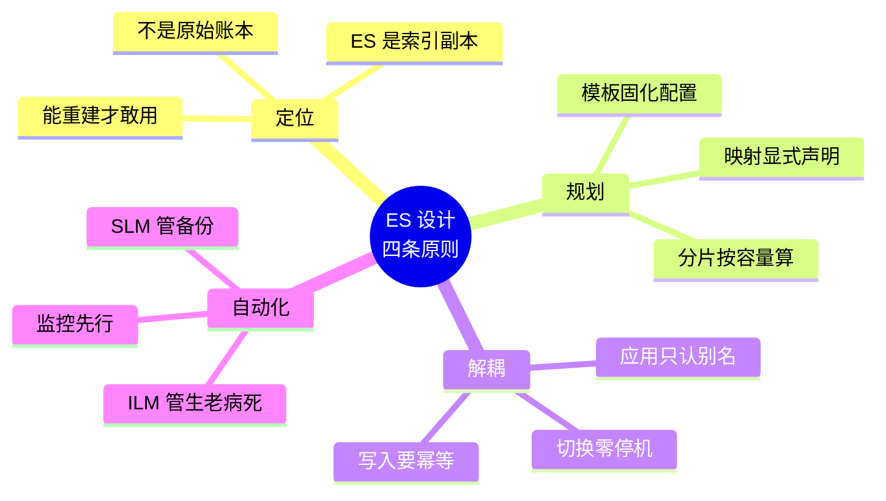

# 10 · 场景解法库

> **认知状态**：设计态。**"新要求来了，我该怎么设计？"**
> 出事来翻答案 → [09-排障速查手册.md](09-排障速查手册.md)；想搞懂原理 → [08-实战经验.md](08-实战经验.md)。
>
> ⚠️ **本库不给可执行命令**——它讲的是"有几条路、各自什么代价、先走哪条"。要抄命令去 [09-排障速查手册.md](09-排障速查手册.md)。

---

## 怎么用这份解法库

每个场景都是一道**开放设计题**，结构固定为：

1. **场景描述** —— 具体、可观测（不是"流量变大了"，而是"QPS 从 500 涨到 5000"）
2. **🔒 先自己想** —— **在看解法之前，先停下来想 30 秒**
3. **💡 提示**（折叠）—— 卡住了再看，只给思考方向不给答案
4. **📖 展开解法**（折叠）—— 多解法对比 + 推荐路径 + 知识点挂钩 + 不适用边界

> ⚠️ **折叠区是给你偷看用的，不是给你抄答案用的。**
> 设计能力来自"自己想过一遍，再看到差距在哪"。直接展开看，这份文档就退化成普通教程了。

**适用版本**：Elasticsearch 9.5.1（本机实测，2026-09-01）

---

## 场景 1：搜索要支持"纠错"——用户打错字也要能搜到

**场景**：电商搜索上线后，客服反馈大量："搜不到东西"。排查发现用户常打错字：`iphon`、`耐克鞋`（打成`耐客鞋`）、`adida`。
现在的要求是：**用户输入有错别字时，也要能搜到正确的商品。**

**可观测指标**：搜索无结果率（zero-result rate）> 15%，其中约 60% 是拼写错误导致。

### 🔒 先自己想

你的第一反应是什么？在 ES 里，"相似词匹配"有哪些现成的能力？直接上模糊查询会有什么代价？

<details>
<summary>💡 提示（卡住了再看）</summary>

从三个角度想：
- **查询层**：有没有一种查询能容忍"编辑距离"？它的代价是什么？
- **索引层**：能不能在索引时就准备好"长得很像的词"？
- **产品层**：ES 搜不到的时候，产品上还有什么兜底？

想清楚"每种做法在什么输入下会失效"，比记住命令重要。
</details>

<details>
<summary>📖 展开解法</summary>

### 解法一览

| 解法 | 怎么做 | 代价 | 适用边界 |
|------|--------|------|----------|
| **A. fuzzy 查询** | `match` 加 `fuzziness: "AUTO"` | **性能差**（需遍历大量词项）；长词效果好，短词容易误召回 | 词长 ≥ 5、数据量小；**别用在主搜索框** |
| **B. ngram 分词** | 索引时用 `ngram` tokenizer 切碎 | 索引膨胀明显；召回率高但精度差 | 短文本、补全场景；**不适合长文本** |
| **C. 同义词/错词词典** | `synonym_graph` filter 配词表 | 需要**持续维护词表**；冷启动没有数据 | 有明确的高频错词清单时 |
| **D. 多路召回 + 兜底** | 主查询无结果时，降级到 fuzzy 或 "did you mean" | 实现复杂度高，要写降级逻辑 | **生产首选** |

### 推荐路径（递进，不是一次全上）

```
第 1 步：先把"无结果率"监控起来
         → 不知道有多少错词，就没法定策略

第 2 步：收集 Top 100 高频错词，做成同义词/错词表（解法 C）
         → 成本最低、效果最确定、性能零损失

第 3 步：主查询无结果时，降级跑一次 fuzzy（解法 D）
         → 只对"搜不到"的请求付出性能代价，正常请求不受影响

第 4 步：真要做"智能纠错"，上 suggester 的 term/phrase 建议
         → 给用户"您是不是要找：iphone"的交互
```

> 💡 **关键设计点**：**模糊查询的代价不该由所有请求承担**。正常请求走精确路径，只有无结果时才降级到模糊——这是性能与体验的平衡点。

### 知识点挂钩

| 用到的知识 | 在哪 |
|-----------|------|
| 分词与分析器 | 课 4 |
| match / match_phrase 查询 | 课 6 |
| 相关性调优、多字段权重 | 课 7 |
| IK 中文分词与自定义词库 | 课 4（本机实测 IK 9.5.1） |

### 不适用边界

- **别指望 ES 解决"语义纠错"**（搜"手机"想出"智能手机壳"）——那是向量检索的范畴（课 13）
- **中文纠错比英文难得多**：英文有空格分词，错词是完整 token；中文错字会破坏分词结果，fuzzy 在中文上效果很有限
- **解法 A 单独用在生产主搜索是大坑**：fuzzy 在大数据量上的性能开销足以拖垮集群

</details>

---

## 场景 2：数据量翻 100 倍——从 500 万条涨到 5 亿条

**场景**：日志系统上线时每天 10 万条，半年后每天 1000 万条。索引从 5 GB 涨到 500 GB。
现在：**查询越来越慢，磁盘眼看要满，运维每天手工删旧索引。**

**可观测指标**：单索引 500 GB / 1 分片；查询 P95 从 200ms 涨到 8s；磁盘使用率 78%。

### 🔒 先自己想

三个问题同时出现，**该先解决哪个**？分片数要不要加？加多少？手工删索引这件事该怎么自动化？

<details>
<summary>💡 提示（卡住了再看）</summary>

分层次想：
- **单索引体积**：一个索引该多大？超过多少就该拆？
- **时间维度**：日志数据的访问模式有什么特点？（老数据还查吗？）
- **自动化**：谁来负责"到期了换个新的"和"到期了删掉"？

注意：**分片数不是越多越好**——课 14 有实测数据，想清楚再调。
</details>

<details>
<summary>📖 展开解法</summary>

### 解法一览

| 解法 | 怎么做 | 代价 | 适用边界 |
|------|--------|------|----------|
| **A. Data Stream + ILM** | 索引按时间滚动，老的自动降冷、自动删 | 需要重新设计索引结构；**只追加** | **时序数据首选**（课 13 实测） |
| **B. 别名 + rollover** | 自己管索引名，ILM 负责滚动与删除 | 比 A 灵活（可改单条文档），但要多写配置 | 需要更新/删除单条文档的场景（课 15 实测） |
| **C. 加分片数** | 把 1 分片改成 N 分片 | **课 14 实测：50 分片存储多 4.7 倍、p95 慢 2.2 倍、聚合失真** | **几乎不是正解** |
| **D. 加节点横向扩展** | 加数据节点 | 成本最高 | 确实到了集群容量上限时 |

### 推荐路径

```
第 1 步（止血）：立刻给索引配上删除策略，把磁盘降到安全线
         → 磁盘满会触发只读块，那是 🔴 级事故（排障手册 E1）

第 2 步（治本）：迁移到 Data Stream + ILM（解法 A）
         → rollover 条件：单分片 30~50 GB 或 1 天，谁先到按谁来
         → ILM：hot(0d) → warm(1d, forcemerge) → delete(保留期)

第 3 步（调优）：warm 阶段做 forcemerge + shrink
         → 课 15 实测：forcemerge 段数 8 → 1

第 4 步（容量）：看单节点分片数与磁盘，决定是否加节点（解法 D）
```

> ⚠️ **最常见的错误就是直接选 C**。课 14 的实测数据摆在那：同样 3000 条数据，50 分片的主分片存储是 1 分片的 **4.7 倍**（77.3 kb vs 361.9 kb），p95 慢 **2.2 倍**，而且 **50 分片的聚合误差上界是 82**（1 分片是 0，完全精确）。
> **分片是"拆数据"的手段，不是"提性能"的手段。**

### 知识点挂钩

| 用到的知识 | 在哪 |
|-----------|------|
| Data Stream 与 ILM | 课 13（rollover 实测） |
| ILM 五阶段与 poll_interval | 课 15（秒级策略实测阶段流转） |
| 分片设计与容量规划 | 课 9 / 课 10（含分片大小建议 30~50 GB） |
| forcemerge / shrink | 课 15（实测段数 8→1、shrink 三条件） |
| 快照与 SLM | 课 11（跨集群恢复实测） |

### 不适用边界

- **ILM 不是实时的**：轮询间隔默认 10 分钟（课 15 实测）。别指望配完立刻生效
- **ILM 的 delete 阶段不打招呼**：确认快照在跑，再启用 delete
- **Data Stream 是只追加的**：改单条日志要先定位到具体后备索引（课 13 实测）

</details>

---

## 场景 3：查询 QPS 从 500 涨到 5000，集群扛不住了

**场景**：搜索接口 QPS 从 500 涨到 5000，P99 从 50ms 涨到 2s，CPU 打满，开始出现线程池拒绝。

**可观测指标**：`GET /_cat/thread_pool/search` 的 `rejected` 持续增长；CPU > 90%；P99 2s。

### 🔒 先自己想

"加机器"是最容易想到的答案，但**它是最优解吗**？在加机器之前，有哪些"不花钱"的优化？

<details>
<summary>💡 提示（卡住了再看）</summary>

从"一个查询要付出多少成本"倒推：
- 查询本身能更省吗？（有没有走 filter？有没有不必要的打分？）
- 结果能复用吗？（缓存）
- 读压力能分摊吗？（副本）
- 数据能少扫吗？（路由、时间范围）

想清楚：**加机器是"用钱换时间"，先把不花钱的优化做完再加。**
</details>

<details>
<summary>📖 展开解法</summary>

### 解法一览

| 解法 | 怎么做 | 代价 | 适用边界 |
|------|--------|------|----------|
| **A. 查询优化**（filter 上下文） | 把不参与打分的条件从 `must` 移到 `filter` | 需改查询；**效果是数量级的** | **第一步必做** |
| **B. 加副本** | `number_of_replicas` 从 1 加到 2、3 | 存储与写入成本上升 | 读多写少；最直接有效 |
| **C. 加数据节点** | 横向扩容 | 成本最高 | 确实到了容量上限 |
| **D. 路由优化** | 按业务键 routing，只查相关分片 | 需要改写入逻辑；可能造成数据倾斜 | 有明确租户/业务分区时 |
| **E. 应用层缓存** | 热门查询结果缓存到 Redis | 数据实时性下降 | 热点查询集中时 |
| **F. 降规模** | 减分片数、forcemerge 老索引 | forcemerge 耗 I/O | 分片过剩时（课 10 / 15） |

### 推荐路径

```
第 1 步（不花钱）：查询优化（解法 A）
         → must → filter 是 ES 性能优化的第一要义：
           filter 不打分、可缓存，代价天差地别

第 2 步（不花钱）：检查分片数是否合理（解法 F）
         → 分片过多时，一次查询要 scatter 到几十个分片，
           gather 阶段的开销可能比查询本身还大

第 3 步（小钱）：加副本（解法 B）
         → 读多写少场景下，加副本的性价比高于加节点

第 4 步（花钱）：加节点（解法 C）

第 5 步（架构）：热点查询上缓存（解法 E）或按业务键路由（解法 D）
```

> 💡 **为什么 A 排第一**：`must` 会计算相关性得分（BM25），`filter` 只做"是/否"判断且结果可缓存。课 6 讲过这个区别，但在真实流量下，这个差异会被放大成数量级。
>
> ⚠️ **缓存的实测提醒**（课 6 记录）：在**小数据量**下 `query_cache.hit_count` 可能恒为 0，测不出收益。别在小数据集上得出"filter 没用"的错误结论——生产数据量的行为完全不同。

### 知识点挂钩

| 用到的知识 | 在哪 |
|-----------|------|
| Query DSL：must vs filter | 课 6（filter 上下文与缓存） |
| 分片与分布式读流程 | 课 9（scatter-gather） |
| routing 机制 | 课 9 |
| 线程池拒绝 | [排障手册 E3/通用诊断](#通用诊断命令不知道从哪下手时按顺序敲) |

### 不适用边界

- **加副本会增加写入成本**：写多读少的场景，加副本会让写入更慢
- **路由会造成数据倾斜**：如果某个业务键的数据量远大于其他，那个分片会变成热点
- **缓存要设过期**：ES 是近实时的，缓存太久会让用户看不到刚更新的数据

</details>

---

## 场景 4：要重新设计索引结构，但服务不能停

**场景**：商品索引的 `price` 字段是 `integer`，现在要支持小数（财务对账错了两年）。索引 800 GB，应用代码里写死了索引名。

**要求**：改映射 + 迁移数据 + **服务不能中断**，也不能改应用代码。

### 🔒 先自己想

这个场景是课 15 第一幕的原案。核心矛盾在哪？**"不能停服"和"必须重建索引"如何共存？**

<details>
<summary>💡 提示（卡住了再看）</summary>

关键问题只有一个：**应用认什么？**
- 如果应用认索引名 → 索引名变了，应用就得改 → 得发版 → 就停服了
- 如果应用认的是**某个不变的东西**，而那个东西背后指向谁可以随时换……

想清楚这个，"零停机"就不是魔法了。
</details>

<details>
<summary>📖 展开解法</summary>

### 解法一览

| 解法 | 怎么做 | 代价 | 适用边界 |
|------|--------|------|----------|
| **A. 停机维护窗口** | 半夜停服，reindex，改代码，上线 | **业务中断**；回滚困难 | 数据量小、能接受停服 |
| **B. reindex + 别名原子切换** | 建 v2 → reindex → 一次请求里 remove+add 别名 | 需要双倍存储（过渡期） | **生产标准做法** |
| **C. 双写 + 灰度切读** | 新旧索引同时写，读逐步切到新索引 | 实现最复杂 | 超大索引、切换风险极高时 |
| **D. 就地在原索引上加子字段** | 新增一个正确类型字段，查询改用新字段 | 老数据要回填；应用要改查询 | 只是新增字段、不是改类型时 |

### 推荐路径

```
前置（现在就做）：让应用只认别名，不认索引名
         → 这一步没做，后面所有方案都要改应用代码

第 1 步：建 v2 索引，用正确的映射（scaled_float, scaling_factor: 100）
         → 课 15 实测：整数截断成 5，scaled_float 保住 5.5

第 2 步：reindex 数据（课 11）
         → 大索引用 slice 并行 + requests_per_second 限速

第 3 步：校验（条数、抽样、关键字段值）

第 4 步：一次请求原子切换别名（课 15 实测零停机）

第 5 步：观察无异常后，删除 v1
```

```json
// 一次请求完成切换（原子的，不存在中间态）
{ "actions": [
    { "remove": { "index": "shop_v1", "alias": "shop" } },
    { "add":    { "index": "shop_v2", "alias": "shop" } } ]}
```

> 💡 **为什么是原子的**：`_aliases` API 在一个请求里完成 remove + add，**要么全成功要么全失败**。不存在"应用查到一半，别名指向空了"的窗口。这是零停机的技术基础（课 15 实测验证）。

### 知识点挂钩

| 用到的知识 | 在哪 |
|-----------|------|
| 别名与原子切换 | 课 15（实测：切换前后 `_index` 变了，请求一个字没改） |
| reindex | 课 11（含 slice 并行、限速、跨集群） |
| 映射不可变 | 课 5（婚前协议） |
| 索引模板固化配置 | 课 15（防止下次再犯） |

### 不适用边界

- **过渡期需要双倍存储**：800 GB 的索引要准备 1.6 TB
- **reindex 期间的新写入会丢**：生产要用别名 + 双写，或在低峰期切换并接受短暂不一致
- **别名的删除要用 `_aliases` remove**：`DELETE /别名` 会被拒绝（课 15 实测）

</details>

---

## 场景 5：多租户——一个集群给 50 个业务方用

**场景**：公司想让 50 个业务线共用一个 ES 集群。要求：
- 各业务方**不能看到别人的数据**
- 某个业务方把集群打爆时，**不能影响其他人**
- 各业务方的数据增长节奏不同

### 🔒 先自己想

"看不到别人的数据"——你想到了什么方案？一个业务方一个索引？还是靠过滤？**前者和后者在安全性上等价吗？**

<details>
<summary>💡 提示（卡住了再看）</summary>

关键区分：**"看不到"和"查不到"是两回事**。

- 让某个用户"查不到"别人的数据 → 加个过滤条件就行
- 让某个用户"没有权限看"别人的数据 → 这是安全机制

如果用过滤来实现安全，用户绕过过滤直接查索引会怎样？想清楚这层，方案就清楚了。
（课 15 里"过滤别名"那一节明确警告过这一点。）

另外想想：隔离的粒度有几种？集群级、索引级、文档级、字段级，各要什么代价？
</details>

<details>
<summary>📖 展开解法</summary>

### 解法一览

| 解法 | 怎么做 | 代价 | 适用边界 |
|------|--------|------|----------|
| **A. 一个业务方一个集群** | 物理隔离 | 成本极高，运维复杂 | 合规要求强隔离时 |
| **B. 一个业务方一个索引 + RBAC** | 索引级权限（课 13） | 索引数膨胀；需要权限体系 | **多数场景的正解** |
| **C. 共享索引 + 文档级安全（DLS）** | 按租户字段过滤 | 需要**付费 license**；查询有性能开销 | 有 license 且租户极多时 |
| **D. 共享索引 + 过滤别名** | 每个租户一个带 filter 的别名 | **不是安全机制**（见下） | **只用于视图，不用于隔离** |
| **E. 共享索引 + 应用层过滤** | 应用查询时自动加租户条件 | 依赖应用不写错 | 兜底，不能单独用 |

### 推荐路径

```
第 1 步：一个业务方一个索引（解法 B 的基础）
         → 索引名带租户前缀，配合索引模板自动套配置（课 15）

第 2 步：配 RBAC，每个业务方只能访问自己的索引前缀（解法 B）
         → 课 13 实测：越权访问返回 403，且报错会列出所需权限名

第 3 步：防止"一个业务方打爆集群"
         → 索引级限流、分片数上限、查询超时
         → 监控各索引的 QPS 与资源占用

第 4 步：数据增长节奏不同 → 各索引独立的 ILM 策略（课 15）
```

> ⚠️ **最关键的警告**：**过滤别名不是安全机制**。
> 课 15 实测：过滤别名能让"便宜商品"只返回 2 条，但**用户只要有索引的读权限，绕过别名直接查索引就能看到全部 3 条**。
> 用过滤做隔离 = 用窗帘当防盗门。

**课 13 实测的 RBAC 效果**（这才是真隔离）：
```
读自己有权限的索引 → 24 条 ✅
写入无权限的索引   → 403（报错列出所需权限名）
删除无权限的索引   → 403
访问越权索引       → 403
无凭据 / 错密码    → 401
```

### 知识点挂钩

| 用到的知识 | 在哪 |
|-----------|------|
| RBAC 角色与用户 | 课 13（实测 401/403 全套） |
| 过滤别名及其局限 | 课 15（实测：能做视图，不能做隔离） |
| 索引模板批量预置 | 课 15 |
| ILM 按索引独立配置 | 课 15 |

### 不适用边界

- **文档级/字段级安全需要付费 license**：本机两集群均为 **basic**（课 13 实测确认），DLS/FLS 不可用
- **索引数会膨胀**：50 个业务方 × 多个索引，要提前规划分片总数
- **单点故障影响所有人**：共用集群意味着集群挂了全部业务都挂——评估能否接受

</details>

---

## 场景 6：要给搜索加"语义理解"——搜意思而不是搜关键词

**场景**：知识库搜索，用户搜"怎么重置密码"，但文档里写的是"密码找回流程"，**一个关键词都不重合**，搜不出来。
要求：**能按"意思"搜，而不是按字面匹配。**

### 🔒 先自己想

关键词匹配失效了，怎么办？你大概听过"向量检索"——但它是**唯一**的解法吗？在它之前，有没有更便宜的办法先解决问题？

<details>
<summary>💡 提示（卡住了再看）</summary>

从"便宜到贵"排个序：
- 最便宜：能不能让关键词匹配得更全？（同义词？）
- 中等：能不能**同时**用关键词和向量，两条路都走？
- 最贵：纯向量检索

还有一个关键问题：**向量从哪来？** ES 能自己生成向量吗，还是要外部模型？这直接决定方案可行性。

（课 13 有本机实测的 license 限制，别忘了。）
</details>

<details>
<summary>📖 展开解法</summary>

### 解法一览

| 解法 | 怎么做 | 代价 | 适用边界 |
|------|--------|------|----------|
| **A. 同义词扩展** | `synonym_graph` 配同义词表（"重置密码" = "密码找回"） | 要维护词表；覆盖面有限 | **第一步，成本最低** |
| **B. 纯关键词 + 多路召回** | 关键词 + 同义词 + 分类加权 | 仍有语义盲区 | 预算有限时的务实选择 |
| **C. 混合检索（关键词 + 向量）** | `dense_vector` + kNN + 关键词，用 RRF 融合 | 需要外部模型生成向量；索引变大 | **生产主流** |
| **D. `semantic_text` 字段** | ES 自动调用推理端点生成向量 | **本机 basic license 下不可用** | 有 license 时的最省事方案 |
| **E. 纯向量检索** | 只用 kNN | 丢失精确匹配能力（搜型号、专有名词会变差） | **不推荐单独用** |

### 推荐路径

```
第 1 步：先做同义词（解法 A）
         → 高频"说法不一致"的场景，同义词表能解决 80% 问题，零性能代价

第 2 步：上混合检索（解法 C）
         → 外部模型生成 embedding，存进 dense_vector
         → 查询时关键词与 kNN 各召回一路，用 RRF（倒数排序融合）合并
         → 课 13 实测：搜「宠物」关键词仅 1 条，向量 kNN 3 条，
           且「狗」0.9992 排在「猫」0.9985 前 —— 语义相似度真的在工作

第 3 步：评估是否需要 semantic_text（解法 D）
         → 需要 license，本机 basic 不可用（见下）
```

> ⚠️ **本机 license 限制（课 13 实测，重要）**：
> 两集群 license 均为 **basic**。`semantic_text` 字段**能建索引，但写入即报错**：
> ```
> non-compliant for [inference]
> ```
> **建的时候不报错，写的时候才炸**——这是最容易踩的坑（课 13 已记录）。
> 所以本机方案只能走**外部生成向量 → 存 `dense_vector`**。

### 知识点挂钩

| 用到的知识 | 在哪 |
|-----------|------|
| kNN 向量检索 | 课 13（实测：dims=3、int8_hnsw、cosine） |
| RAG 知识库问答 | 课 13 |
| 同义词与分析器 | 课 4 |
| 相关性调优、多路召回融合 | 课 7 |
| license 限制 | 课 13（basic 下 `semantic_text` 不可用） |

> 🐞 **实测坑（课 14 记录）**：kNN 查询**字段名写错会静默返回 0 条，不报错**。
> 我探测时用了 `my_vector`，真实字段是 `embedding`，结果一直返回 0 条且没有任何错误提示。
> **kNN 查不到东西时，第一件事是核对字段名。**

### 不适用边界

- **纯向量不是万能的**：搜产品型号、错误码、专有名词时，精确匹配（BM25）远好于向量。**混合检索是主流正解**
- **向量维度必须一致**：课 13 实测维度不匹配报错 `different number of dimensions [2] than [3]`
- **向量检索的 `hits.total.value` 不可靠**：要看 `hits.hits.length`（课 13 实测记录）

</details>

---

## 场景 7：要接一个新数据源，怎么设计同步链路

**场景**：订单数据存在 MySQL，现在要进 ES 做搜索。每天 100 万单，还有更新（状态流转）和少量删除。
**要求**：ES 与 MySQL 最终一致；ES 挂了能重建；延迟控制在秒级。

### 🔒 先自己想

"怎么把数据同步过去"——听起来是个技术问题，但真正的设计决策在别处：
**如果 ES 里的数据全丢了，你能重建吗？** 这个问题的答案会决定整条链路怎么设计。

<details>
<summary>💡 提示（卡住了再看）</summary>

想清楚这几件事：
- **谁是先写还是后写？** 先写 MySQL 再同步 ES，还是双写？
- **同步失败了怎么办？** 重试？丢弃？告警？
- **ES 里的顺序能和 MySQL 一致吗？** 如果一个订单先更新成"已发货"再更新成"已完成"，但同步时顺序反了，会怎样？
- **重建**：能不能从 MySQL 全量重跑一遍？

课 12 讲过三种同步模式，回忆一下它们的适用条件。
</details>

<details>
<summary>📖 展开解法</summary>

### 解法一览

| 解法 | 怎么做 | 代价 | 适用边界 |
|------|--------|------|----------|
| **A. 双写** | 应用同时写 MySQL 和 ES | 一致性难保证（一边成功一边失败）；耦合 | 简单场景，能接受少量不一致 |
| **B. 定时轮询 CDC** | 按 `updated_at` 定期增量拉 | 有延迟；删了的数据抓不到（需软删除） | 延迟容忍度高（分钟级） |
| **C. 消息队列（CDC + MQ）** | 监听 binlog → MQ → 消费写 ES | 架构最复杂；需要 MQ 与 CDC 组件 | **生产正解** |
| **D. 全量重建** | 定期全量 reindex | 有窗口期数据不一致 | 兜底 / 小数据量 |

### 推荐路径

```
第 1 步（地基）：确认 MySQL 是唯一真相来源
         → ES 是索引副本，不是原始账本（课 14 核心结论）
         → 这个定位决定了：ES 挂了可以从 MySQL 重建

第 2 步：选同步模式（解法 C 为主）
         → binlog → MQ（保序）→ 消费者批量写 ES
         → 保序是关键：同一文档的状态流转必须按顺序到 ES

第 3 步：写入侧三件事
         → 用业务主键做 _id（幂等，重跑不产生重复 —— 课 12 实测 _version 递增但总数不变）
         → bulk 批量写，判 errors（排障手册 E6）
         → 失败进死信队列，不静默丢弃

第 4 步：一致性兜底（解法 B 或 D）
         → 定期对账：比对 MySQL 与 ES 的条数与关键字段
         → 不一致时用全量重建（解法 D）修正

第 5 步：监控
         → 同步延迟、失败率、堆积量
```

> 💡 **幂等是这套设计的核心**：用业务主键做 `_id`，重复写入是**覆盖**而不是**新增**。课 12 实测：同一 `_id` 反复写入，`_version` 从 2→3→4 递增，但**文档总数恒为 3**。这让"重跑"变成安全操作。

### 知识点挂钩

| 用到的知识 | 在哪 |
|-----------|------|
| 三种数据同步模式 | 课 12（含各模式的适用条件） |
| bulk 幂等与部分失败 | 课 12（实测 `errors=true` 但成功项已落库） |
| Ingest Pipeline 加工 | 课 11 |
| ES 作为索引副本的定位 | 课 14（核心结论） |
| reindex 做重建 | 课 11 |

### 不适用边界

- **ES 不能做"事务回滚"**：ES 的乐观锁只到单文档（课 14 实测 409），没有跨文档事务
- **顺序很重要**：MQ 要保证同一业务的消息有序，否则旧状态可能覆盖新状态
- **本机环境限制**：本机无 MySQL，课 12 明确说明了哪些模式**不可实操**、哪些机制**可练**

</details>

---

## 场景 8：索引越用越慢，分片设计可能有问题

**场景**：一个 200 GB 的索引，分了 100 个主分片，1 副本。查询 P95 2s，聚合结果偶尔对不上。
**怀疑分片设计有问题，但不敢随便改（改分片数要重建索引）。**

### 🔒 先自己想

先别急着改。**"分片可能有问题"是个假设，怎么证实它？**
而且——如果真要改，改多少？依据是什么？

<details>
<summary>💡 提示（卡住了再看）</summary>

两个关键数字：
- **单个分片多大合适？**（课 10 有建议值，回忆一下）
- **聚合结果"对不上"** —— 这个现象和多分片有什么关系？（课 14 有实测数据）

另外：改分片数**必须重建索引**，那有没有不用重建的补救手段？（课 15 讲过一个操作）
</details>

<details>
<summary>📖 展开解法</summary>

### 解法一览

| 解法 | 怎么做 | 代价 | 适用边界 |
|------|--------|------|----------|
| **A. 重建索引，减少分片数** | 按容量重算分片数，reindex | 需重建；过渡期双倍存储 | **根治** |
| **B. `shrink` 缩分片** | 不用重建，直接缩 | 三条件：同节点 + 只读 + 因数（课 15 实测） | 分片数是目标值的整数倍时 |
| **C. `forcemerge` 减少段数** | 合并段 | 耗 I/O；只能在停止写入后做 | 治"段碎"，不治"分片多" |
| **D. 加节点摊薄** | 扩容 | 成本 | 分片总量确实需要那么多时 |

### 推荐路径

```
第 1 步（先证实假设，别猜）：
         → 算单分片大小：200 GB / 100 = 2 GB/分片
         → 对照建议值（30~50 GB/分片，日志类）
         → 结论：**分片过小、过多** —— 假设成立

第 2 步：验证聚合失真是分片导致的
         → 查 doc_count_error_upper_bound
         → 课 14 实测：1 分片误差 0、50 分片误差 82

第 3 步：算目标分片数
         → 200 GB / 40 GB ≈ 5 个主分片（留增长余量取 6~8）

第 4 步：选实施手段
         → 能停写 → shrink（解法 B，课 15 实测 4→1 成功）
         → 不能停写 → 新建索引 + reindex + 别名切换（解法 A）

第 5 步：用索引模板把正确分片数固化（课 15），防止下次再犯
```

> ⚠️ **shrink 的三个硬条件（课 15 实测）**：
> 1. 源索引全部分片必须在**同一个节点**（否则报 `must have all shards allocated on the same node`）
> 2. 源索引必须**只读**
> 3. 目标分片数必须是源分片数的**因数**（4→3 报 `must be a multiple of [3]`）
>
> **规划分片数时尽量用 2 的幂**，给未来的 shrink 留余地。

### 知识点挂钩

| 用到的知识 | 在哪 |
|-----------|------|
| 分片设计与容量规划 | 课 9 / 课 10（30~50 GB 建议值） |
| 多分片的代价（实测） | 课 14（存储 4.7 倍、p95 2.2 倍、聚合误差 82） |
| shrink / forcemerge | 课 15（实测段数 8→1、shrink 三条件） |
| 索引模板固化配置 | 课 15 |
| 聚合精度与误差上界 | 课 8 / 课 14 |

### 不适用边界

- **`shrink` 不能解决"分片太少"**：那是 `split` 或重建的事
- **减少分片数会降低并行度**：如果查询确实需要高并发扫描，分片太少反而慢。**分片设计是平衡，不是越少越好**
- **段和分片是两回事**：forcemerge 治段碎（一个分片内），shrink 治分片多。别混

</details>

---

## 总结：八个场景背后的四条设计原则

把这八个场景放在一起看，会发现它们反复回到同四条原则：



| 原则 | 违反它的后果 | 支撑场景 |
|------|-------------|---------|
| **ES 是索引副本，不是原始账本** | 数据丢了无法重建 | 场景 2、7 |
| **规划先于救火** | 迟早要为拍脑袋的分片数/映射买单 | 场景 2、8 |
| **解耦（别名 + 幂等）** | 改任何东西都要停服发版 | 场景 4、7 |
| **自动化（ILM + SLM + 监控）** | 靠人半夜手工删索引 | 场景 2、5 |

---

## 与另两份产物的分工

| 你想干什么 | 去哪 |
|-----------|------|
| 新需求来了，怎么设计 | **本文（设计态）** |
| 设计完了，会踩什么坑 | [08-实战经验.md](08-实战经验.md)（学习态） |
| 上线后出事了 | [09-排障速查手册.md](09-排障速查手册.md)（使用态） |

> 💡 **三份的素材源是同一批"典型失败模式 + 常见高难度场景"**，但**姿态完全不同**：
> 本文给你**多个选项和权衡**，经验层给你**原理**，手册给你**动作**。
> 混在一起会同时毁掉三个——学习时读不到原理、紧急时读不完、设计时看不到选项。
