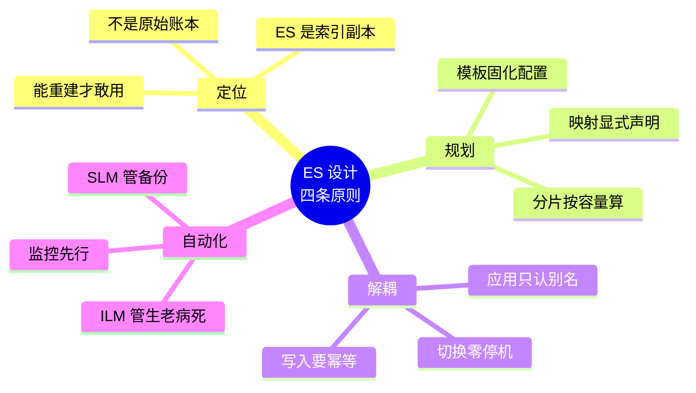

# Elasticsearch 场景解法库

> **怎么用**：每个场景是一道**开放设计题**。先自己想 30 秒，再展开看解法——**先想后看，能力才长出来**。
> **怎么读**：每个场景 4–6 个解法，**每个解法都配一张机制图 + 关键代码**，图上的**红框就是该解法最可能失效的地方**。建议顺序：先看「解法一览」的效果对比列挑方向，再逐个展开详解，最后对照「做错会踩的坑」自查。
> 配套：[08-实战经验.md](../08-实战经验.md)（为什么会崩，学习态）｜ [09-排障速查手册.md](../09-排障速查手册.md)（出错了怎么办，使用态）｜本库（新要求来了怎么设计，设计态）。
> **版本口径**：Elasticsearch **9.5.1**（本机 3 节点集群 `l9-cluster`，`http://localhost:9201`，license = basic）。涉及付费能力（DLS/FLS、`semantic_text`、searchable snapshot）的位置均已标注 license 限制。

## 场景清单

| # | 场景 | 类型 | 覆盖知识点 | 链接 |
|---|------|------|-----------|------|
| 1 | 搜索要支持"纠错"——打错字也要搜到 | 经典设计题 | 分析器 · fuzzy · ngram · suggester | [场景 1](场景-01-搜索纠错.md) |
| 2 | 数据量翻 100 倍 | 规模压力题 | Data Stream · ILM · rollover · 分片容量 | [场景 2](场景-02-数据量翻百倍.md) |
| 3 | QPS 从 500 涨到 5000 | 规模压力题 | filter 上下文 · 副本 · routing · 缓存 | [场景 3](场景-03-QPS涨10倍.md) |
| 4 | 零停机重建索引结构 | 经典设计题 | 别名原子切换 · reindex · 索引模板 | [场景 4](场景-04-零停机重建索引.md) |
| 5 | 多租户隔离 | 经典设计题 | RBAC · 过滤别名 · DLS | [场景 5](场景-05-多租户隔离.md) |
| 6 | 要"语义理解"而不是关键词匹配 | 经典设计题 | kNN · RRF · 同义词 · semantic_text | [场景 6](场景-06-语义搜索.md) |
| 7 | MySQL 数据怎么进 ES | 经典设计题 | 同步模式 · bulk 幂等 · CDC | [场景 7](场景-07-数据同步.md) |
| 8 | 索引越用越慢，分片设计有问题 | 经典设计题 | shrink · forcemerge · 聚合误差 | [场景 8](场景-08-分片设计.md) |
| 9 | 商品多规格错配（object / nested / flattened） | 经典设计题 | 复杂结构映射 · inner_hits | [场景 9](场景-09-复杂结构选型.md) |
| 10 | 搜索框要自动补全 | 经典设计题 | completion · search_as_you_type | [场景 10](场景-10-自动补全.md) |
| 11 | 跨机房容灾与数据恢复 | 规模压力题 | 快照 · 跨集群恢复 · CCR | [场景 11](场景-11-容灾与恢复.md) |

> **类型分布**：经典设计题 8 个、规模压力题 3 个（场景 2、3、11），合计 **11 个场景**。
> **本轮升级说明**（2026-09-20）：原单文件 `10-场景解法库.md`（701 行 / 8 场景 / 43 个解法，零张图）升级为目录形态——**解法内容全部保留并扩写至 47 个**，逐解法补齐详解、机制图与关键代码；新增场景 9、10、11 填补课 16（复杂结构 / 补全）与课 11（容灾恢复）的真实缺口。
> **规模**（脚本实测）：11 个场景文件 / **47 个解法** / **28 张机制图** / 每个场景均含"先想 30 秒"折叠块 + 解法一览 + 各解法详解 + 知识点挂钩 + 不适用边界 + 做错会踩的坑。

---

## 🧭 遇到没见过的场景？六问思考框架

上面 11 个场景会过时，框架不会。新要求来了，按这六个维度依次过一遍：

| # | 维度 | 要问的问题 | 回指场景 |
|---|------|-----------|---------|
| 1 | **召回** | 用户想找的和我索引里存的，是不是"同一批词"？错字/同义/语义差在哪一层补？ | [场景 1](场景-01-搜索纠错.md)、6 |
| 2 | **量** | 数据总量多少？单分片多大？增长靠时间还是靠业务？ | [场景 2](场景-02-数据量翻百倍.md)、8 |
| 3 | **并发** | 读多写少？一次查询扫多少分片？能不能缓存、能不能路由？ | 场景 3 |
| 4 | **结构** | 数据是平的、嵌套的、还是对象数组？配对语义要不要保？ | 场景 9 |
| 5 | **变更** | 映射/结构/集群变了怎么切？能不能回滚？过渡期多少存储？ | 场景 4、11 |
| 6 | **边界** | 这个事 ES 到底该不该管？真相源在哪？挂了怎么重建？ | 场景 7、5 |

> 定位问题（ES 是索引副本，不是原始账本）贯穿全部六问——每个方案都要问一句"它挂了我从哪重建"。

---

## 📚 官方文档

- [Elasticsearch 9.5 Reference](https://www.elastic.co/docs/reference/elasticsearch)
- [Fuzziness / fuzzy query](https://www.elastic.co/docs/reference/query-languages/query-dsl/query-dsl-fuzzy-query)
- [N-gram tokenizer](https://www.elastic.co/docs/reference/text-analysis/analysis-ngram-tokenizer)
- [Synonym graph token filter](https://www.elastic.co/docs/reference/text-analysis/analysis-synonym-graph-tokenfilter)
- [Data streams](https://www.elastic.co/docs/manage-data/data-store/data-streams) ｜ [ILM](https://www.elastic.co/docs/manage-data/lifecycle/index-lifecycle-management)
- [Rollover API](https://www.elastic.co/docs/reference/elasticsearch/rest-apis/rollover-index) ｜ [Index aliases](https://www.elastic.co/docs/manage-data/data-store/aliases)
- [Nested field type](https://www.elastic.co/docs/reference/elasticsearch/mapping-reference/nested) ｜ [Flattened](https://www.elastic.co/docs/reference/elasticsearch/mapping-reference/flattened)
- [Completion suggester](https://www.elastic.co/docs/reference/elasticsearch/rest-apis/search-suggesters) ｜ [Search-as-you-type](https://www.elastic.co/docs/reference/elasticsearch/mapping-reference/search-as-you-type)
- [Snapshot and restore](https://www.elastic.co/docs/manage-data/backup-and-restore)

---

## 总结：11 个场景背后的四条设计原则

把这 11 个场景放在一起看，会发现它们反复回到同四条原则：

| 原则 | 违反它的后果 | 支撑场景 |
|------|-------------|---------|
| **ES 是索引副本，不是原始账本** | 数据丢了无法重建 | [场景 2](场景-02-数据量翻百倍.md)、[7](场景-07-数据同步.md)、[11](场景-11-容灾与恢复.md) |
| **规划先于救火** | 迟早要为拍脑袋的分片数/映射买单 | [场景 2](场景-02-数据量翻百倍.md)、[8](场景-08-分片设计.md)、[9](场景-09-复杂结构选型.md) |
| **解耦（别名 + 幂等）** | 改任何东西都要停服发版 | [场景 4](场景-04-零停机重建索引.md)、[7](场景-07-数据同步.md) |
| **自动化（ILM + SLM + 监控）** | 靠人半夜手工删索引 | [场景 2](场景-02-数据量翻百倍.md)、[5](场景-05-多租户隔离.md) |

> 新增的三个场景把这四条撑得更满：场景 9 是**规划**（映射类型选错无法原地改），场景 11 是**定位**（能重建才敢用）。

---

## 与另两份产物的分工

| 你想干什么 | 去哪 |
|-----------|------|
| 新需求来了，怎么设计 | **本库（设计态）** |
| 设计完了，会踩什么坑 | [08-实战经验.md](../08-实战经验.md)（学习态） |
| 上线后出事了 | [09-排障速查手册.md](../09-排障速查手册.md)（使用态） |

> 💡 **三份的素材源是同一批"典型失败模式 + 常见高难度场景"**，但**姿态完全不同**：
> 本库给你**多个选项和权衡**，经验层给你**原理**，手册给你**动作**。
> 混在一起会同时毁掉三个——学习时读不到原理、紧急时读不完、设计时看不到选项。

---

## 🚀 接下来可以做什么

- **检验设计能力**：复制"考我一下 Elasticsearch，重点考分片设计、映射变更与召回策略"——进入知识点对齐（Phase 6）。
- **把设计落地**：对照 [projects/商品搜索服务](../projects/商品搜索服务/README.md)，试着用本库场景改造它（如：加纠错降级 / 加 nested 规格搜索 / 加 ILM）。
- **查漏补缺**：回看 [08-实战经验.md](../08-实战经验.md) 的上线 Checklist，确认你的设计在投产前每一条都答得上。
