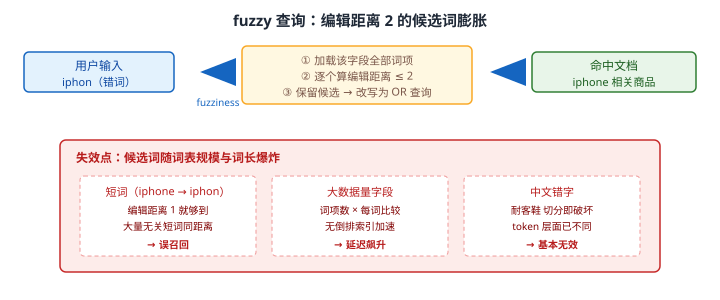
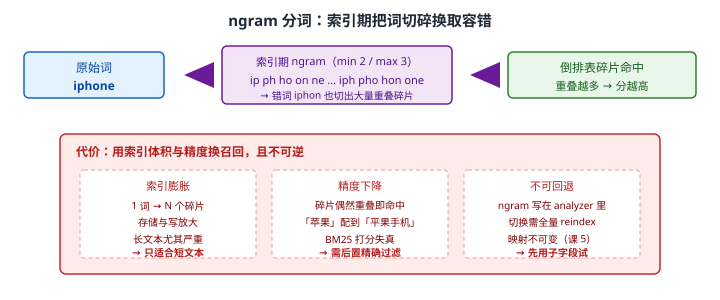
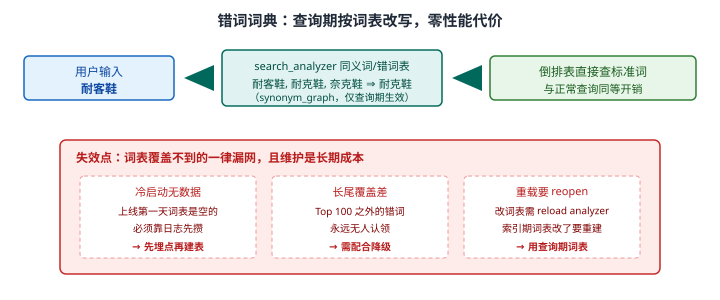
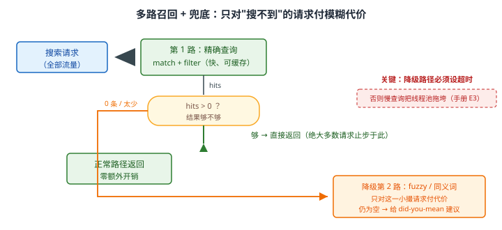

# 场景 1：搜索要支持"纠错"——用户打错字也要能搜到（经典设计题）

**场景描述**：电商搜索上线后，客服反馈大量"搜不到东西"。排查发现用户常打错字：`iphon`、`耐克鞋`（打成 `耐客鞋`）、`adida`。搜索无结果率（zero-result rate）**> 15%**，其中约 **60% 是拼写错误**导致。现在的要求是：**用户输入有错别字时，也要能搜到正确的商品。**

**🔒 先自己想 30 秒**：你的第一反应是什么？在 ES 里"相似词匹配"有哪些现成能力？直接上模糊查询，**代价由谁承担**——是所有请求，还是只有打错字的那部分？

<details><summary>💡 提示（分层 / 分维度想）</summary>

- **查询层**：有没有一种查询能容忍"编辑距离"？它的代价由谁付？
- **索引层**：能不能在索引时就准备好"长得很像的词"？代价又落在哪？
- **产品层**：ES 搜不到的时候，产品上还有什么兜底（交互 / 降级）？
- **语言层**：英文错词和中文错字，是同一个问题吗？

想清楚"每种做法在什么输入下会失效"，比记住命令重要。

</details>

<details><summary>📖 展开解法</summary>

### 解法一览（效果按题定制：召回增益 / 查询延迟影响）

| 解法 | 召回增益 / 延迟影响 | 代价 | 适用边界 |
|------|-------------------|------|---------|
| **A · fuzzy 查询** | 召回增益：中（长词好、短词差）；延迟：**高**（需遍历词项） | 词项遍历开销随词表规模上升；短词误召回；**中文基本无效** | 词长 ≥ 5、数据量小；**别用在主搜索框** |
| **B · ngram 分词** | 召回增益：高（容错内建）；延迟：低（查询走倒排） | **索引膨胀明显**；精度下降；切换需全量 reindex | 短文本 / 补全场景；**不适合长文本** |
| **C · 同义词/错词词典** | 召回增益：覆盖内 100%；延迟：**零额外**（查标准词） | 需**持续维护词表**；冷启动无数据；长尾永远漏 | 有明确高频错词清单时，**成本最低效果最确定** |
| **D · 多路召回 + 兜底** | 召回增益：高（组合前三者）；延迟：**只对搜不到的请求有影响** | 实现复杂度高，要写降级逻辑与超时 | **生产首选** |

### 各解法详解

#### 解法 A · fuzzy 查询

**思路**：`match` 加 `fuzziness`，让 ES 容忍一定数量的字符编辑（增 / 删 / 替换 / 换位）。它是**查询期**的容错——索引里存的还是正确词，查询时把用户输入"放宽"去找近似词。



读图：用户输入进来后，ES 要**把该字段的全部词项加载出来逐个算编辑距离**，再把候选词改写成一串 OR 去查倒排表。红框标出三处失效点——短词（编辑距离 1 就够到大量无关词 → 误召回）、大数据量字段（词项数 × 每词比较，无倒排加速 → 延迟飙升）、中文错字（切分即破坏，token 层面已经不同 → 基本无效）。

```json
// 查询期容错：fuzziness AUTO = 词长 ≤2 不允许模糊，3-5 允许 1，>5 允许 2
GET /shop/_search
{
  "query": {
    "match": {
      "title": {
        "query": "iphon",
        "fuzziness": "AUTO",
        "prefix_length": 1,          // 首字符必须精确，砍掉大量无关候选
        "max_expansions": 50         // 候选词上限，防止词项爆炸
      }
    }
  }
}
```

> ⚠️ **两个参数不是可选的**：`prefix_length`（默认 0）不设，首字符就能变，候选词数量翻几倍；`max_expansions`（默认 50）调太大会让单次查询退化成全词表扫描。这两个值是"fuzzy 能不能用在生产"的分水岭。
> **适用判断**：`fuzziness: "AUTO"` 意味着 **2 个字符的词完全不允许模糊**——正是短词最需要纠错的场景它不管，而长词（如 `smartphone`）又很少拼错。这是 fuzzy 的固有矛盾。

#### 解法 B · ngram 分词

**思路**：把容错**提前到索引期**。用 `ngram` tokenizer 把每个词切成一串碎片（`iphone` → `ip`/`ph`/`ho`/`on`/`ne`/`iph`/`pho`…），错词 `iphon` 也会切出大量**重叠碎片**，查询时碎片重叠越多分越高——容错是"切碎"的副产品，查询本身只是普通倒排查找。



读图：从左往右看代价的转移——原本一次模糊匹配的开销，被挪到索引期变成"一个词存 N 个碎片"。红框标出三处代价：索引膨胀（1 词变 N 碎片，长文本尤其严重）、精度下降（碎片偶然重叠就命中，`苹果` 可能配到 `平果手机`）、不可回退（ngram 写在 analyzer 里，切换需全量 reindex）。

```json
// 只在子字段上开 ngram，主字段保持标准分词——保留"精确匹配"这条退路
PUT /shop
{
  "settings": {
    "analysis": {
      "tokenizer": {
        "my_ngram": { "type": "ngram", "min_gram": 2, "max_gram": 3 }
      },
      "analyzer": {
        "ngram_analyzer": { "type": "custom", "tokenizer": "my_ngram", "filter": ["lowercase"] }
      }
    }
  },
  "mappings": {
    "properties": {
      "title": {
        "type": "text",
        "analyzer": "ik_max_word",                        // 主字段：正常中文分词
        "fields": {
          "ngram": { "type": "text", "analyzer": "ngram_analyzer" }  // 子字段：容错专用
        }
      }
    }
  }
}
```

```json
// 查询时两路并用，主字段权重更高（课 7 的多字段权重）
GET /shop/_search
{
  "query": {
    "multi_match": {
      "query": "耐客鞋",
      "fields": ["title^3", "title.ngram"]     // 精确匹配权重 3，ngram 只作补充召回
    }
  }
}
```

> ⚠️ **不要在主字段上直接开 ngram**：一旦开了，正常查询的精度也会被拉低，而且**没有退路**（映射不可变，改回来要全量 reindex）。**用 multi-fields 保留两条路**是这里的关键设计（课 5 的多字段）。
> **中文的额外提醒**：ngram 对中文是"按字机械滑动"，`耐客鞋` 与 `耐克鞋` 只差一个字，仍能靠重叠碎片命中——**这恰恰是 fuzzy 做不到的**。所以中文短词纠错，ngram 比 fuzzy 更靠谱。

#### 解法 C · 同义词/错词词典

**思路**：最笨也最有效——**把高频错词直接列出来**。查询期用 `synonym_graph` filter 把错词改写成标准词，之后就是一次完全普通的倒排查找，**零额外性能开销**。



读图：`耐客鞋` 进到 search_analyzer，被词表改写成标准词 `耐克鞋`，后续查倒排表与正常查询**完全等价**。红框标出三处失效点——冷启动（上线第一天词表是空的）、长尾（Top 100 之外的错词永远无人认领）、重载（词表更新要 reopen，索引期词表改了还得重建）。

```json
// 只在查询期生效的错词表：改词表不影响已索引数据
PUT /shop
{
  "settings": {
    "analysis": {
      "filter": {
        "my_typo": {
          "type": "synonym_graph",
          "lenient": false,
          "synonyms": [
            "耐客鞋, 奈克鞋, naike => 耐克鞋",     // => 单向映射：错词 → 正确词
            "iphon, ipohne, iphonee => iphone",
            "adida, addidas => adidas"
          ]
        }
      },
      "analyzer": {
        "search_typo": {                          // 只做 search_analyzer
          "type": "custom",
          "tokenizer": "ik_smart",
          "filter": ["lowercase", "my_typo"]
        }
      }
    }
  },
  "mappings": {
    "properties": {
      "title": {
        "type": "text",
        "analyzer": "ik_max_word",
        "search_analyzer": "search_typo"          // 索引期不变，查询期纠错
      }
    }
  }
}
```

> ⚠️ **必须用 `=>` 单向映射，不要用双向逗号**：写成 `耐客鞋, 耐克鞋`（双向）会让正确词也被改写成"两个词都查"，污染正常查询；`错词 => 正确词` 才是纠错语义。
> ⚠️ **词表要放在查询期（`search_analyzer`）**：放在索引期意味着每次改词表都要全量 reindex——800 GB 的索引为改一个错词重建一遍，不可接受。
> 💡 **词表从哪来**：不要把这件事当"人工维护"。标准做法是**把 zero-result 的查询词打进日志**，每周跑一次 Top N，人工确认后入库。课 12 的搜索应用架构里，查询日志是必备埋点。

#### 解法 D · 多路召回 + 兜底（生产首选）

**思路**：模糊查询的代价**不该由所有请求承担**。正常请求走精确路径，只有"搜不到"时才降级到模糊——把性能代价精确地加到那一小撮请求上。



读图：全部流量先进第 1 路精确查询（快、可缓存），**绝大多数请求在这里就返回了**；只有命中数为 0 或太少时，才沿橙色路径降级到第 2 路 fuzzy / 同义词。红框标出这条路的真正风险——**降级路径必须设超时**，否则一个 fuzzy 慢查询会占住搜索线程池，把正常请求也拖垮（对应 [09-排障速查手册](../09-排障速查手册.md) 的线程池拒绝条目）。

```json
// 第 1 路：精确查询（正常路径，filter 不打分且可缓存 —— 课 6）
GET /shop/_search
{
  "query": {
    "bool": {
      "must":     [{ "match": { "title": "耐客鞋" } }],
      "filter":   [{ "term":  { "status": "on_sale" } }]
    }
  }
}
// → hits.total.value == 0 时，才走第 2 路
```

```json
// 第 2 路：降级查询（只在第 1 路为空时发）
GET /shop/_search
{
  "timeout": "800ms",                    // 🔴 必须设超时：降级路径的兜底
  "query": {
    "bool": {
      "should": [
        { "match": { "title":       { "query": "耐客鞋", "fuzziness": "AUTO", "prefix_length": 1 } } },
        { "match": { "title.ngram": { "query": "耐客鞋" } } }
      ],
      "minimum_should_match": 1,
      "filter": [{ "term": { "status": "on_sale" } }]
    }
  }
}
```

```json
// 第 3 路：仍然为空 → 给"您是不是要找"建议（term suggester，课 16 有 completion 对照）
GET /shop/_search
{
  "suggest": {
    "title_suggest": {
      "text": "耐客鞋",
      "term": { "field": "title", "suggest_mode": "popular" }
    }
  }
}
```

> 💡 **为什么 D 是生产首选**：它把 A/B/C 从"三选一"变成"三个可插拔的降级档位"——C（零成本）永远在线，B（子字段）随时可用，A（最贵）只在必要时才付钱。**设计的核心不是选哪个技术，而是给代价排序**。
> ⚠️ **降级不能无限套娃**：第 2 路再为空就直接给建议，不要再降第 3 次。每一次降级都在累加延迟，而用户能感知的搜索上限大约 1 秒。

### 替代路线（非 ES 技术栈）

| 替代方案 | 思路 | 与本课程解法的差异 |
|---------|------|------------------|
| **专用搜索服务（Algolia / Meilisearch / Typesense）** | 容错与 typo-tolerance 内建为默认行为，无需配 analyzer | 开箱即用、省掉 mapping 设计；但要接受数据托管、功能边界受产品限制（课 2 有轻量方案对比） |
| **查询改写中间件（应用侧）** | 在应用里维护错词表 / 调外部纠错 API，ES 只收标准词 | 词表改起来不碰 ES、可跨引擎复用；但多一跳延迟，且失去 ES 侧的分词一致性保证 |
| **向量召回（语义层容错）** | 用 embedding 把"意思相近"的词拉到一起 | 能解决同义 / 语义泛化，但**不解决拼写错误**——错词与正确词的向量未必相近，见[场景 6](场景-06-语义搜索.md) |

### 推荐路径（递进，不是一次全上）

1. **先把 zero-result 率监控起来**——不知道有多少错词，就没法定策略。查询日志埋点是这一步的产出。
2. **收集 Top 100 高频错词，做成查询期错词表**（解法 C）——成本最低、效果最确定、性能零损失。
3. **主查询无结果时，降级跑 fuzzy / ngram 子字段**（解法 D）——只对"搜不到"的请求付性能代价。
4. **真要做"智能纠错"，上 `term` / `phrase` suggester** 给用户"您是不是要找：耐克鞋"的交互（课 16 的 completion 解决的是另一件事：**补全**而非**纠错**，别混用）。
5. **中文为主时，ngram 子字段（B）优先于 fuzzy（A）**——fuzzy 在中文上效果有限，这是本场景最容易选反的一处。

### 知识点挂钩

- 分词与分析器、IK 中文分词 → 阶段 2 · [课 4 倒排索引的秘密](../stages/2-核心原理与上手/lessons/lesson-04-倒排索引的秘密.md)
- 映射不可变、multi-fields 多字段 → 阶段 2 · [课 5 映射给数据定规矩](../stages/2-核心原理与上手/lessons/lesson-05-映射给数据定规矩.md)
- `match` / `match_phrase`、filter 上下文与缓存 → 阶段 3 · [课 6 Query DSL](../stages/3-查询与聚合/lessons/lesson-06-QueryDSL问问题的语言.md)
- 多字段权重、相关性调优 → 阶段 3 · [课 7 为什么这条排在前面](../stages/3-查询与聚合/lessons/lesson-07-为什么这条排在前面.md)
- 搜索应用架构与查询日志 → 阶段 4 · [课 12 接入真实项目](../stages/4-分布式与工程实践/lessons/lesson-12-接入真实项目.md)
- completion / suggester 的边界 → 阶段 4 · [课 16 复杂结构与搜索建议](../stages/4-分布式与工程实践/lessons/lesson-16-复杂结构与搜索建议.md)

### 什么情况下此方案不适用

- **别指望 ES 解决"语义纠错"**（搜 `手机` 想出 `智能手机壳`）——那是向量检索的范畴，见[场景 6](场景-06-语义搜索.md)。
- **解法 A 单独用在生产主搜索是大坑**：fuzzy 在大数据量上的开销足以拖垮集群。
- **错词率本身很高（> 40%）时**：说明问题不在搜索，而在输入方式（如手写 / OCR），应从源头改产品。
- **严格零误召回的场景**（如医疗、法律条文检索）：宁可搜不到，也不要给错结果——此时只上解法 C（白名单式），不上 B/D。

### 做错会踩的坑

- 把 fuzzy 用在主搜索框且不加 `prefix_length` / `max_expansions` → 查询延迟飙升、线程池拒绝（[09-排障速查手册](../09-排障速查手册.md) 线程池条目）。
- 在主字段直接开 ngram → 精度永久下降且不可回退，只能全量 reindex（[故障模式 4](../08-实战经验.md)）。
- 错词表用双向逗号而非 `=>` → 正常查询被污染（本场景解法 C）。
- 降级路径不设 `timeout` → 慢查询占满搜索线程池，正常请求一起挂（本场景解法 D）。

</details>

---

➡️ **返回**：[场景解法库索引](INDEX.md) ｜ **下一场景**：[场景 2 数据量翻 100 倍](场景-02-数据量翻百倍.md)
