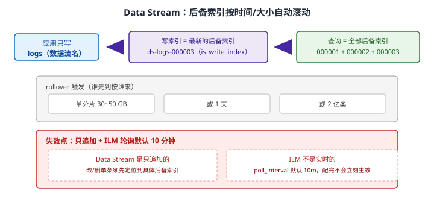
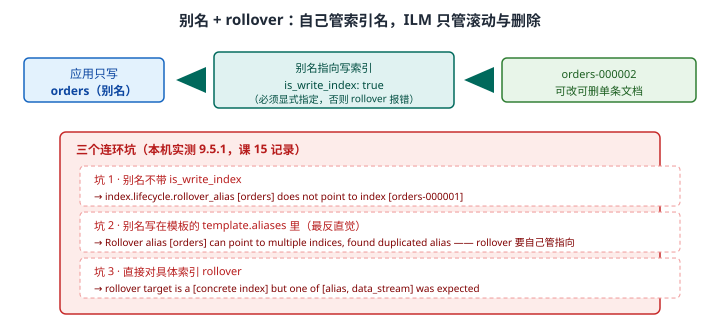
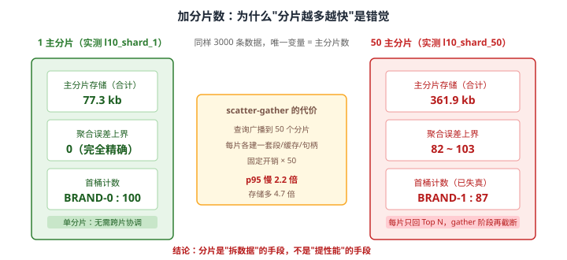
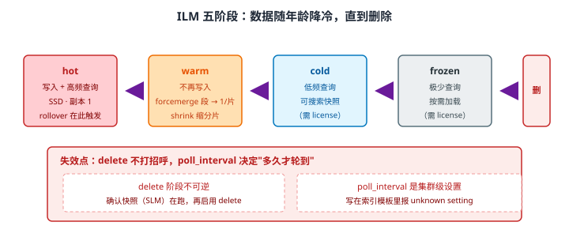

# 场景 2：数据量翻 100 倍——从 500 万条涨到 5 亿条（规模压力题）

**场景描述**：日志系统上线时每天 10 万条，半年后每天 1000 万条。索引从 5 GB 涨到 500 GB，查询 P95 从 200ms 涨到 **8s**，磁盘使用率 **78%**，运维每天手工删旧索引。三个问题同时出现：**查询慢、磁盘要满、人工删索引**。

**🔒 先自己想 30 秒**：三个问题同时出现，**该先解决哪个**？分片数要不要加、加多少？"手工删索引"这件事该怎么自动化？——如果你的第一反应是"加分片"，先想想分片解决的是这三条里的哪一条。

<details><summary>💡 提示（分层 / 分维度想）</summary>

- **单索引体积**：一个索引该多大？超过多少就该拆？
- **时间维度**：日志数据的访问模式有什么特点？（三个月前的数据还查吗？）
- **自动化**：谁来负责"到期了换个新的"和"到期了删掉"？
- **反直觉提醒**：**分片数不是越多越好**——课 10 / 课 14 有本机实测数据，想清楚再调。

</details>

<details><summary>📖 展开解法</summary>

### 解法一览（效果按题定制：查询 P95 / 磁盘可控性）

| 解法 | 查询 P95 / 磁盘可控 | 代价 | 适用边界 |
|------|-------------------|------|---------|
| **A · Data Stream + ILM** | P95：降到时间范围内（只扫命中的后备索引）；磁盘：**全自动** | 需重新设计索引结构；**只追加**，改单条麻烦 | **时序数据首选** |
| **B · 别名 + rollover** | P95：同上；磁盘：全自动 | 比 A 灵活（可改单条），但配置有三个连环坑 | 需要更新 / 删除单条文档的场景 |
| **C · 加分片数** | P95：**反而更慢**；磁盘：无帮助 | 本机实测：50 分片存储多 **4.7 倍**、p95 慢 **2.2 倍**、聚合失真 | **几乎不是正解** |
| **D · ILM 降冷 + 加节点** | P95：靠降冷腾出热层资源；磁盘：靠扩容硬扛 | 冷/冻结阶段的 searchable snapshot 需 license；加节点成本最高 | 确到了集群容量上限时 |

### 各解法详解

#### 解法 A · Data Stream + ILM（时序数据首选）

**思路**：把一个"无限增长的索引"换成**一串按时间滚动的小索引**。应用永远只写数据流名 `logs`，ES 自动把写入路由到最新的后备索引；rollover 条件（单分片 30~50 GB / 1 天 / 2 亿条，谁先到按谁来）满足时自动开新的；ILM 负责把老的后备索引降冷、最终删除。



读图：应用只认数据流名 `logs`，写入自动落到最新后备索引 `.ds-logs-000003`，查询则横跨全部后备索引。红框标出两处失效点——Data Stream **只追加**（改/删单条要先定位到具体后备索引）、ILM **不是实时的**（`poll_interval` 默认 10 分钟，配完不会立刻生效）。

```json
// 1. ILM 策略：热 0 天转温，温 1 天后 forcemerge，30 天删除
PUT _ilm/policy/logs-policy
{
  "policy": {
    "phases": {
      "hot":  { "actions": { "rollover": { "max_primary_shard_size": "50gb", "max_age": "1d" } } },
      "warm": { "min_age": "1d",  "actions": { "forcemerge": { "max_num_segments": 1 }, "shrink": { "number_of_shards": 1 } } },
      "delete": { "min_age": "30d", "actions": { "delete": {} } }
    }
  }
}
```

```json
// 2. 索引模板：只写 rollover_alias，不要写 template.aliases（见解法 B 坑 2）
PUT _index_template/logs-template
{
  "index_patterns": ["logs-*"],
  "data_stream": {},
  "template": {
    "settings": {
      "number_of_shards": 2,
      "index.lifecycle.name": "logs-policy"
    }
  }
}
```

```bash
# 3. 应用侧只写数据流名，无需关心后备索引编号
curl -X POST "localhost:9201/logs/_doc?refresh=false" -H 'Content-Type: application/json' -d '
{ "@timestamp": "2026-09-20T10:00:00Z", "level": "ERROR", "msg": "timeout" }'
# → 返回 _index: .ds-logs-000003，应用完全无感
```

> ⚠️ **`data_stream` 一旦启用就是只追加**：更新 / 删除单条文档必须先 `GET /.ds-logs-*/_search` 定位到具体后备索引，再对那个索引操作。**有更新需求的业务数据（订单、商品）不要放 Data Stream**，走解法 B。
> 💡 **为什么查询会变快**：不是因为"数据变少了"，而是因为**时间范围过滤能让 ES 直接跳过不相关的后备索引**（每个后备索引都知道自己的 `@timestamp` 范围）。所以 Data Stream 的收益有个前提——**查询必须带时间范围**。没有时间范围的 `match_all` 照样扫全部。

#### 解法 B · 别名 + rollover（需要更新/删除单条时）

**思路**：与 A 同样的滚动机制，但索引名自己管、别名做入口。好处是**可以改单条文档**（Data Stream 不行），代价是配置有三个连环坑——它们都源于同一个误解："我声明了别名，ES 就该自动管好指向"。



读图：应用只写别名 `orders`，别名上标 `is_write_index: true` 指向当前写索引，rollover 时 ES 自动开 `orders-000002` 并把写标记移过去。红框标出本机实测的三个连环坑：别名不带 `is_write_index`、别名写在模板的 `template.aliases` 里（**最反直觉——你声明了别名，ES 反说别名重复**，因为 rollover 要自己管指向）、直接对具体索引 rollover。

```json
// ✅ 正确配法：三条件同时满足
// 条件 1：模板里只写 index.lifecycle.rollover_alias，不写 template.aliases
PUT _index_template/orders-template
{
  "index_patterns": ["orders-*"],
  "template": {
    "settings": {
      "number_of_shards": 2,
      "index.lifecycle.name": "orders-policy",
      "index.lifecycle.rollover_alias": "orders"      // 只声明，不创建
    }
  }
}
```

```json
// 条件 2：建第一个索引时显式指定别名 + is_write_index
PUT orders-000001
{
  "aliases": { "orders": { "is_write_index": true } }
}
```

```bash
# 条件 3：应用只写别名，不写具体索引名
curl -X POST "localhost:9201/orders/_doc" -H 'Content-Type: application/json' -d '{"id":1}'
# rollover 成功后：old_index=orders-000001 new_index=orders-000002 rolled_over=true
```

> ⚠️ **三个报错原文（本机实测，课 15 记录）**：
> 1. 别名不带 `is_write_index` → `index.lifecycle.rollover_alias [orders] does not point to index [orders-000001]`
> 2. 别名写在 `template.aliases` → `Rollover alias [orders] can point to multiple indices, found duplicated alias [[orders]] in index template [orders_tpl]`
> 3. 直接对具体索引 rollover → `rollover target is a [concrete index] but one of [alias,data_stream] was expected`
>
> ⚠️ **`indices.lifecycle.poll_interval` 是集群级设置**：写在索引模板里报 `unknown setting`。默认 10 分钟，**配完不会立刻生效**——要立刻看到阶段流转，得走 `_cluster/settings` 的 transient（属集群级改动，生产上请先确认再改）。
> ⚠️ **`_ilm/explain` 刚建好时没有 `phase` 字段**：只有 `managed: true` + `time_since_index_creation`。**看到没有 phase 别以为配错了**，等 ILM 第一次轮询跑过才出现。排查看 `step_info.reason`。

#### 解法 C · 加分片数（几乎不是正解）

**思路**：这是最常见的第一反应，也是**最常犯的错**。分片能提升的是"单次查询的最大并行度"，但它同时带来三笔固定开销：每个分片的段文件、缓存、文件句柄，以及 scatter-gather 的协调成本。



读图：左右是本机两个实测索引（`l10_shard_1` / `l10_shard_50`，同样 3000 条数据，唯一变量是主分片数）。**主分片存储合计 77.3 kb → 361.9 kb（4.7 倍）**，聚合误差上界从 0 变成 **82~103**，p95 慢 **2.2 倍**——性能与准确性双输。中间标出根因：查询要广播到 50 个分片，每片各建一套段/缓存/句柄，gather 阶段还要再截断一次。

```bash
# 加分片数之前，先算这笔账：
# 1. 当前单分片多大？
curl -s "localhost:9201/_cat/indices/logs?v&h=index,pri,store.size,docs.count"
# 2. 对照建议值：日志类 30~50 GB/分片
#    → 500 GB / 50 GB ≈ 10 个分片就够，而不是 100 个
# 3. 分片总数是不可轻易回退的开关（减少需 shrink 或重建）
```

> ⚠️ **分片是"拆数据"的手段，不是"提性能"的手段**。真正让查询变快的是"少扫数据"——时间范围、filter 缓存、路由、降冷——而不是"多开几个并行通道"。
> ⚠️ **聚合失真是最隐蔽的代价**：多分片下每个分片只回自己的 Top N，协调节点再合并截断，于是 `doc_count_error_upper_bound` 从 0 变成 82。**你的报表从"准确"变成"大概准确"，而且没人报错**。课 8 / 课 14 有完整推导。

#### 解法 D · ILM 降冷 + 加节点（容量上限时）

**思路**：当数据确实都要留着、也确实到了容量上限，就走"让老数据变便宜 + 加机器"两条路。ILM 的五个阶段本质是**按访问频率给数据定价**。



读图：数据从 hot（写入 + 高频查询）→ warm（不再写，做 forcemerge / shrink）→ cold（低频，可搜索快照）→ frozen（极少，按需加载）→ delete。红框标出两处失效点：**delete 不可逆**（必须确认 SLM 快照在跑再启用）、**`poll_interval` 是集群级设置**（写在索引模板里报 `unknown setting`）。

```json
// warm 阶段做 forcemerge：本机实测 8 段 → 每分片 1 段（课 15）
PUT _ilm/policy/logs-policy
{
  "policy": {
    "phases": {
      "warm": {
        "min_age": "1d",
        "actions": {
          "forcemerge": { "max_num_segments": 1 },   // 注意：是"每分片"上限，不是总数
          "set_priority": { "priority": 50 }
        }
      }
    }
  }
}
```

```bash
# 观察阶段流转：没有 phase 字段是正常的（ILM 还没轮询到）
curl -s "localhost:9201/logs-000001/_ilm/explain"
# 正常流程：check-rollover-ready → attempt-rollover → complete
# 卡住时看 step_info.reason
```

> ⚠️ **`forcemerge` 的 `max_num_segments` 是"每分片"上限**：本机 2 主分片 + `max_num_segments: 1` → 合计 2 段（不是 1 段）。**别看到"合并后仍有 2 段"就判定失效**——这是我实测时犯过的误判。
> ⚠️ **cold / frozen 的可搜索快照需要 license**：本机两集群均为 **basic**，用不了。此时降冷只能靠 `set_priority` + 节点分层（`node.roles`），不能靠 searchable snapshot。
> ⚠️ **加节点前先确认瓶颈真是容量**：磁盘满、CPU 满、JVM 压力、线程池拒绝是四种不同的病，加节点只对第一种最快见效。

### 替代路线（非 ES 技术栈）

| 替代方案 | 思路 | 与本课程解法的差异 |
|---------|------|------------------|
| **对象存储 + 查询引擎（S3 + Athena / Clickhouse）** | 老数据沉降为 Parquet，用 OLAP 引擎查 | 存储成本远低于 ES；但失去近实时与全文检索，且是"两套系统" |
| **日志托管服务（云厂商日志服务）** | 由平台承担容量、滚动与冷热处理 | 省掉 ILM 设计与容量运维；但查询语法、成本模型与数据出口受平台约束 |
| **采样 + 摘要** | 全量只留 7 天，长期只留聚合结果 | 磁盘可控到极致；代价是"三个月前那条具体日志"永远回不来——**要先确认业务真不需要** |

### 推荐路径（递进，不是一次全上）

1. **止血（立刻）**：给索引配上删除策略，把磁盘降到安全线。**磁盘满会触发只读块**，那是 🔴 级事故（[09-排障速查手册](../09-排障速查手册.md) 磁盘水位条目）。
2. **治本**：迁移到 Data Stream + ILM（解法 A）；**需要改单条文档的走别名 + rollover**（解法 B）。rollover 条件：单分片 30~50 GB 或 1 天，谁先到按谁来。
3. **调优**：warm 阶段做 `forcemerge`；分片数是目标值整数倍时可 `shrink`（课 15 实测三条件）。
4. **容量**：确认瓶颈真是容量后，再加节点（解法 D）。
5. **别做的事**：**不要靠加分片数解决慢查询**（解法 C）。这是本场景最容易选错的一条。

### 知识点挂钩

- Data Stream 与 ILM、rollover 实测 → 阶段 5 · [课 13 三大主战场](../stages/5-生产与选型/lessons/lesson-13-三大主战场.md)
- ILM 五阶段、`poll_interval`、`_ilm/explain` → 阶段 4 · [课 15 索引管理与生命周期策略](../stages/4-分布式与工程实践/lessons/lesson-15-索引管理与生命周期策略.md)
- 分片设计与容量规划（30~50 GB 建议值）→ 阶段 4 · [课 10 集群健康与排障](../stages/4-分布式与工程实践/lessons/lesson-10-集群健康与排障.md)
- scatter-gather 与分布式读 → 阶段 4 · [课 9 分片：ES 分布式的基石](../stages/4-分布式与工程实践/lessons/lesson-09-分片分布式的基石.md)
- 聚合误差上界 → 阶段 3 · [课 8 聚合：不做搜索，做统计](../stages/3-查询与聚合/lessons/lesson-08-聚合不做搜索做统计.md)
- 快照与 SLM → 阶段 4 · [课 11 数据管道与备份](../stages/4-分布式与工程实践/lessons/lesson-11-数据管道与备份.md)

### 什么情况下此方案不适用

- **ILM 不是实时的**：轮询默认 10 分钟，别指望配完立刻生效。
- **Data Stream 是只追加的**：改单条日志要先定位到具体后备索引，改/删频繁的业务数据走解法 B。
- **delete 阶段不打招呼**：确认 SLM 快照在跑，再启用 delete。
- **规模其实很小（< 50 GB）时**：上 Data Stream + ILM 是过度设计，单索引 + 定时清理足够。

### 做错会踩的坑

- 靠加分片数救慢查询 → 存储涨 4.7 倍、聚合失真、p95 反升（本场景解法 C，[故障模式 5](../08-实战经验.md) 分片未分配也常由此引发）。
- rollover 别名没带 `is_write_index` 或写进了 `template.aliases` → 三个连环报错（本场景解法 B）。
- 把 `indices.lifecycle.poll_interval` 写进索引模板 → `unknown setting`（它是集群级设置）。
- 磁盘满了才想起删数据 → 触发只读块，写入全部被拒（[故障模式 6](../08-实战经验.md)）。

</details>

---

➡️ **返回**：[场景解法库索引](INDEX.md) ｜ **上一场景**：[场景 1 搜索纠错](场景-01-搜索纠错.md) ｜ **下一场景**：场景 3 QPS 从 500 涨到 5000
