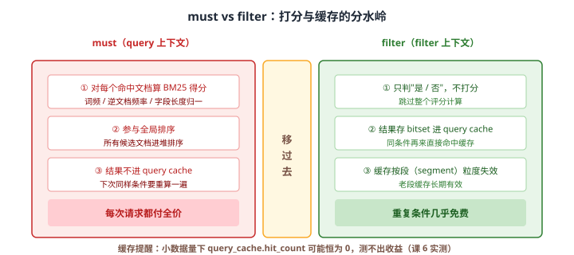
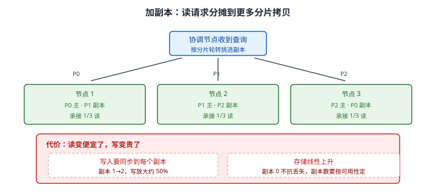
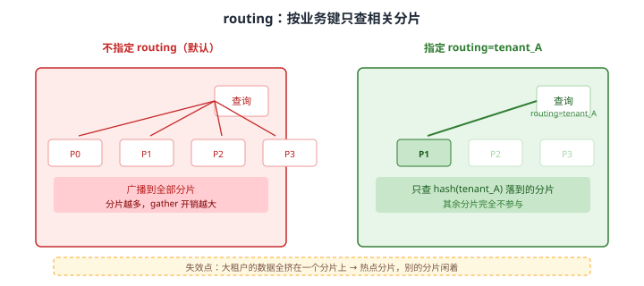
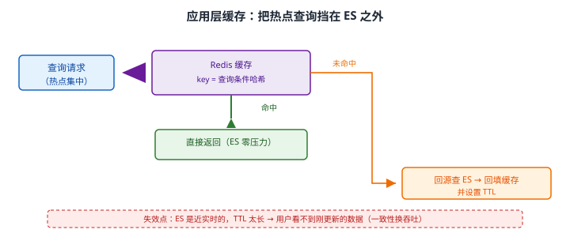

# 场景 3：查询 QPS 从 500 涨到 5000，集群扛不住了（规模压力题）

**场景描述**：搜索接口 QPS 从 500 涨到 5000，P99 从 50ms 涨到 **2s**，CPU > 90%，开始出现线程池拒绝。`GET /_cat/thread_pool/search` 的 `rejected` 持续增长。

**🔒 先自己想 30 秒**："加机器"是最容易想到的答案，但**它是最优解吗**？在加机器之前，有哪些"不花钱"的优化？——如果答案是"filter 缓存"，先想清楚：**为什么把 `must` 改成 `filter` 能差出一个数量级**？

<details><summary>💡 提示（分层 / 分维度想）</summary>

从"一个查询要付出多少成本"倒推：

- **查询本身能更省吗**？有没有走 filter？有没有不必要的打分？
- **结果能复用吗**？（缓存）
- **读压力能分摊吗**？（副本）
- **数据能少扫吗**？（路由、时间范围）

想清楚：**加机器是"用钱换时间"，先把不花钱的优化做完再加。**

</details>

<details><summary>📖 展开解法</summary>

### 解法一览（效果按题定制：P99 改善 / 实施成本）

| 解法 | P99 改善 / 实施成本 | 代价 | 适用边界 |
|------|-------------------|------|---------|
| **A · 查询优化（filter 上下文）** | P99：数量级改善；成本：**零**（只改查询） | 需改查询 DSL；对小数据集可能"测不出收益" | **第一步必做** |
| **B · 加副本** | P99：线性下降；成本：低（改一个设置） | 存储与写入成本上升 | 读多写少；最直接有效 |
| **C · 加数据节点** | P99：线性下降；成本：**最高** | 硬件与运维成本 | 确到了容量 / CPU 上限 |
| **D · 路由优化** | P99：分片数越多收益越大；成本：中（改写入逻辑） | 需改写入；**可能造成数据倾斜** | 有明确租户 / 业务分区时 |
| **E · 应用层缓存** | P99：热点查询趋近于 0；成本：中（引入 Redis） | 数据实时性下降；需设计失效 | 热点查询集中时 |

### 各解法详解

#### 解法 A · 查询优化：must → filter（第一步必做）

**思路**：`bool` 查询里，`must` 走 **query 上下文**（算分、参与排序、结果不缓存），`filter` 走 **filter 上下文**（只判是否匹配、不打分、结果进 query cache）。状态过滤、时间范围、租户 ID 这类"不关心匹配程度、只关心是否成立"的条件，**全部属于 filter**。



读图：左侧 `must` 要对每个命中文档算 BM25（词频 / 逆文档频率 / 字段长度归一）并参与全局排序，结果不进缓存；右侧 `filter` 只判是否匹配、跳过评分、结果以 bitset 形式进 query cache 且**按段粒度失效**（老段的缓存长期有效）。

```json
// ❌ 改前：状态条件放在 must，白付打分成本
GET /shop/_search
{
  "query": {
    "bool": {
      "must": [
        { "match": { "title": "手机" } },
        { "term":  { "status": "on_sale" } },     // 不关心匹配程度，却要打分
        { "range": { "price": { "gte": 100 } } }  // 同上
      ]
    }
  }
}
```

```json
// ✅ 改后：只有"需要影响排序"的留在 must，其余全部下沉到 filter
GET /shop/_search
{
  "query": {
    "bool": {
      "must":   [{ "match": { "title": "手机" } }],          // 需要打分 → 留在 query 上下文
      "filter": [
        { "term":  { "status": "on_sale" } },                // 只判是否 → filter
        { "range": { "price": { "gte": 100 } } }             // 只判是否 → filter
      ]
    }
  }
}
```

> ⚠️ **小数据集上测不出收益，别因此下错误结论**：课 6 实测记录——在**小数据量**下 `query_cache.hit_count` 可能恒为 0，因为段太少、缓存命中窗口太短。**别在小数据集上得出"filter 没用"的结论**，生产数据量的行为完全不同。
> 💡 **判定口诀**：*这个条件会影响"谁排在前面"吗？* 会 → `must`；不会 → `filter`。价格区间、状态、类目、时间范围几乎永远是后者。

#### 解法 B · 加副本

**思路**：副本是主分片的完整拷贝，**既能容灾也能扛读**。协调节点在多个可用拷贝间轮转分发查询，副本越多，每个节点分摊到的读请求越少。



读图：3 节点各持有一个主分片 + 一个副本，协调节点按分片轮转挑选拷贝，读压力自然摊到三台机器。红框标出代价：**写入要同步到每个副本**（副本 1→2 写放大约 50%），**存储线性上升**。

```json
// 副本数可在线调整（无需重建索引，与分片数不同）
PUT /shop/_settings
{ "number_of_replicas": 2 }
```

```bash
# 调完确认副本分配完成（shards 列应等于 主分片数 × (1+副本数)）
curl -s "localhost:9201/_cat/indices/shop?v&h=index,pri,rep,status,health"
# 读多写少时优先级：加副本 > 加节点 —— 副本是"用已有数据的拷贝换吞吐"
```

> ⚠️ **写多读少时加副本会适得其反**：每个副本都要同步写入，副本越多写越慢。**先确认读写比**再决定。
> ⚠️ **副本数 0 意味着任何节点故障都会丢数据**：副本数的下限由可用性决定，不是由性能决定。

#### 解法 C · 加数据节点

**思路**：横向扩容——加机器。这是最"标准"的答案，也是**最贵**的答案。它的正当性建立在前面几步都做完之后：查询已经最省、副本已经够用、分片设计合理，**瓶颈确实是 CPU / 内存 / 磁盘 IO 的绝对容量**。

```bash
# 加节点前先确认瓶颈真的是资源，而不是查询写法
curl -s "localhost:9201/_cat/nodes?v&h=name,cpu,heap.percent,ram.percent,load"
curl -s "localhost:9201/_cat/thread_pool/search?v&h=name,active,queue,rejected"
# rejected 持续增长 = 线程池拒绝，此时加节点或限流二选一
```

> ⚠️ **`rejected` 不等于"该加机器"**：它也可能是某几条慢查询长期占着线程（先查 `_tasks` 找出慢查询）。**先止血（限流 / 停掉慢查询），再谈扩容。**
> 💡 加节点真正的隐藏成本是**分片重平衡**：新节点加入后 ES 会自动迁移分片，期间磁盘与网络 IO 会升高。生产要配 `cluster.routing.rebalance.enable` 与限流（`indices.recovery.max_bytes_per_sec`）。

#### 解法 D · 路由优化

**思路**：默认查询会**广播到索引的全部分片**。如果每次查询其实只关心某个租户 / 某类业务的数据，就可以按业务键 `routing`，让写入时同类数据落到同一分片，查询时只查那一个。



读图：左侧不指定 routing 时查询广播到 P0–P3 全部分片；右侧指定 `routing=tenant_A` 后，请求只发到 `hash(tenant_A)` 落到的那一个分片，其余分片完全不参与。红框标出失效点：**大租户的数据全挤在一个分片上 → 热点分片**，别的分片闲着，隔离变成了新的瓶颈。

```bash
# 写入时指定 routing
curl -X POST "localhost:9201/orders/_doc?routing=tenant_A" -H 'Content-Type: application/json' -d '
{ "tenant": "tenant_A", "amount": 100 }'

# 查询时带同样的 routing —— 只查一个分片
curl -s "localhost:9201/orders/_search?routing=tenant_A" -H 'Content-Type: application/json' -d '
{ "query": { "term": { "tenant": "tenant_A" } } }'
```

> ⚠️ **路由会造成数据倾斜**：某个业务键的数据量远大于其他时，那个分片会变成热点，且**无法通过加分片自动缓解**（相同 routing 永远落到同一分片）。数据分布不均时先做容量估算。
> ⚠️ **routing 是写入侧的长期决策**：上线后想去掉路由，等于全量重建索引。

#### 解法 E · 应用层缓存

**思路**：把热点查询结果缓存到 Redis。ES 的近实时特性意味着"同样的条件在一秒内查一百次，结果基本一样"——那这一百次里九十九次可以不进 ES。



读图：请求先到缓存，命中直接返回（ES 零压力），未命中才回源查 ES 并回填。红框标出核心权衡：**ES 是近实时的，TTL 太长用户就看不到刚更新的数据**——这是用一致性换吞吐。

```javascript
// Node.js 侧：先查缓存，未命中再回源（@elastic/elasticsearch 9.5.1）
const key = 'es:search:' + crypto.createHash('md5').update(JSON.stringify(body)).digest('hex');

const cached = await redis.get(key);
if (cached) return JSON.parse(cached);                  // 命中：ES 完全不参与

const { body: res } = await es.search({ index: 'shop', body });
await redis.setex(key, 10, JSON.stringify(res));        // TTL 10s：与近实时节奏匹配
return res;
```

> ⚠️ **TTL 要贴着业务的"可接受陈旧度"设**：商品列表 10~30s 可接受；库存、价格这类强实时字段**不要缓存**（或者把它们从缓存结果里剔除，单独回源）。
> ⚠️ **缓存 key 必须含完整查询条件**：漏了分页偏移或排序字段，会导致**返回别人的结果**。这是缓存类 bug 里最尴尬的一类。

### 替代路线（非 ES 技术栈）

| 替代方案 | 思路 | 与本课程解法的差异 |
|---------|------|------------------|
| **加一层 CDN / 网关缓存** | 把整段 HTTP 响应缓在边缘 | 不改应用代码；但只对完全相同的 URL 有效，个性化查询命中率低 |
| **换更轻量的搜索引擎（Meilisearch / Typesense）** | 单机性能高、内存占用小 | 小数据量下延迟优势明显；但失去分布式与生态（课 2 有对比） |
| **读写分离：查从库（DB）** | 简单查询直接走数据库从库 | 省掉一次网络跳；但全文检索与聚合能力远不及 ES |

### 推荐路径（递进，不是一次全上）

1. **不花钱 · 查询优化**（解法 A）：`must` → `filter` 是 ES 性能优化的第一要义。先做这一步，再谈其他。
2. **不花钱 · 检查分片数是否合理**：分片过多时一次查询要 scatter 到几十个分片，gather 阶段的开销可能比查询本身还大（见[场景 2](场景-02-数据量翻百倍.md) 解法 C 的实测数据）。
3. **小钱 · 加副本**（解法 B）：读多写少场景下性价比高于加节点，**且可在线调整、无需重建**。
4. **花钱 · 加节点**（解法 C）：确认瓶颈真是 CPU / 内存 / IO 容量。
5. **架构层 · 缓存或路由**（解法 E / D）：热点查询上缓存，有明确业务分区上路由。

### 知识点挂钩

- `must` vs `filter`、query cache → 阶段 3 · [课 6 Query DSL](../stages/3-查询与聚合/lessons/lesson-06-QueryDSL问问题的语言.md)
- BM25 打分与排序开销 → 阶段 3 · [课 7 为什么这条排在前面](../stages/3-查询与聚合/lessons/lesson-07-为什么这条排在前面.md)
- scatter-gather 分布式读流程 → 阶段 4 · [课 9 分片：ES 分布式的基石](../stages/4-分布式与工程实践/lessons/lesson-09-分片分布式的基石.md)
- 分片与容量规划、集群健康 → 阶段 4 · [课 10 集群健康与排障](../stages/4-分布式与工程实践/lessons/lesson-10-集群健康与排障.md)
- 缓存与近实时的定位 → 阶段 5 · [课 14 该不该用 ES](../stages/5-生产与选型/lessons/lesson-14-该不该用ES.md)

### 什么情况下此方案不适用

- **加副本会增加写入成本**：写多读少的场景，加副本会让写入更慢。
- **路由会造成数据倾斜**：大租户独占一个分片，隔离反成瓶颈。
- **缓存需设过期**：ES 是近实时的，缓存太久会让用户看不到刚更新的数据。
- **`rejected` 是结果不是原因**：先看是慢查询占线程还是真的容量不足，别直接加机器。

### 做错会踩的坑

- 在小数据集上测 filter 收益、得出"filter 没用" → 生产行为完全不同（本场景解法 A）。
- 见 `rejected` 就加机器 → 真凶可能是几条慢查询长期占线程。
- 缓存 key 漏掉排序 / 分页字段 → 返回别人的结果。
- 给强实时字段（库存 / 价格）设长 TTL → 用户看到过期数据。

</details>

---

➡️ **返回**：[场景解法库索引](INDEX.md) ｜ **上一场景**：[场景 2 数据量翻 100 倍](场景-02-数据量翻百倍.md) ｜ **下一场景**：场景 4 零停机重建索引结构
