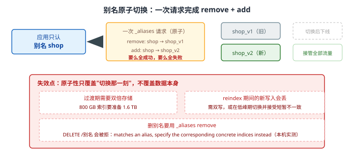
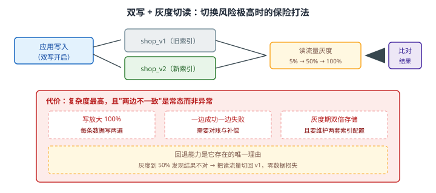

# 场景 4：要重新设计索引结构，但服务不能停（经典设计题）

**场景描述**：商品索引的 `price` 字段是 `integer`，现在要支持小数（财务对账错了两年）。索引 **800 GB**，应用代码里写死了索引名。
**要求**：改映射 + 迁移数据 + **服务不能中断，也不能改应用代码**。

**🔒 先自己想 30 秒**：核心矛盾只有一个——**"不能停服"和"必须重建索引"如何共存**？想清楚一件事：**应用认的是什么？** 如果它认的是索引名，索引名一变就得发版；如果它认的是某个**不变的东西**，而那个东西背后指向谁可以随时换……

<details><summary>💡 提示（分层 / 分维度想）</summary>

- **入口**：应用认索引名还是认别名？这一步决定了后面所有方案要不要改代码。
- **切换**：怎么让"指向改变"这件事**没有中间态**？
- **数据**：reindex 期间**新写入的增量**怎么办？
- **回退**：切过去发现有问题，能切回来吗？切回来会丢什么？

</details>

<details><summary>📖 展开解法</summary>

### 解法一览（效果按题定制：停机时长 / 可回退性）

| 解法 | 停机时长 / 可回退 | 代价 | 适用边界 |
|------|-----------------|------|---------|
| **A · 停机维护窗口** | 停机：小时级；可回退：差（回滚也难） | 业务中断；回滚困难 | 数据量小、能接受停服 |
| **B · reindex + 别名原子切换** | 停机：**零**；可回退：中（切回旧索引，但丢增量） | 需双倍存储；增量写入要单独处理 | **生产标准做法** |
| **C · 双写 + 灰度切读** | 停机：零；可回退：**强**（随时切回） | 写放大 100%；实现最复杂 | 超大索引、切换风险极高时 |
| **D · 原地加子字段** | 停机：零；可回退：强（新旧字段并存） | 老数据要回填；应用要改查询 | **只是新增字段、不是改类型时** |

### 各解法详解

#### 解法 A · 停机维护窗口

**思路**：最低技术含量的方案——半夜停服，reindex，改代码，上线。它的价值在于**作为对照组**：当你无法评估 B/C 的风险时，A 是确定的"坏但可控"。

```bash
# 1. 停写（应用侧停服或关闭写入入口）
# 2. 建新索引 + reindex
curl -X POST "localhost:9201/_reindex?wait_for_completion=false" -H 'Content-Type: application/json' -d '
{ "source": { "index": "shop_v1" }, "dest": { "index": "shop_v2" } }'
# 3. 改应用代码里的索引名 → 发版 → 恢复服务
```

> ⚠️ **它真正的代价不是"停服"，而是"回滚也难"**：一旦 v2 上线后发现问题，回滚意味着再停一次服、再发一次版。**停机窗口内的每一步都是单向的**。
> 适用判断：数据量 < 几十 GB、reindex 能在 30 分钟内跑完、业务能接受深夜中断——A 完全合理，不必硬上 C。

#### 解法 B · reindex + 别名原子切换（生产标准做法）

**思路**：**应用只认别名，不认索引名**。别名 `shop` 一直指向 v1；建好 v2 并 reindex 完成后，用**一个请求**把别名从 v1 摘下、挂到 v2——`_aliases` API 保证这个操作**要么全成功要么全失败**，不存在"应用查到一半，别名指向空了"的窗口。



读图：应用始终只认别名 `shop`，一次 `_aliases` 请求里同时完成 remove（解绑 v1）与 add（绑定 v2）。红框标出三处代价：过渡期需双倍存储、reindex 期间的增量写入会丢（需双写或低峰期切换）、**删别名必须走 `_aliases` remove**（`DELETE /别名` 会被拒）。

```json
// 1. 建 v2：price 用 scaled_float，避免浮点精度丢失（课 5 / 课 15 实测）
PUT /shop_v2
{
  "mappings": {
    "properties": {
      "price": { "type": "scaled_float", "scaling_factor": 100 }   // 88+3.25+5.5 → 96.75，不再被截断成 96.0
    }
  }
}
```

```json
// 2. reindex：大索引用 slice 并行 + 限速，避免压垮集群（课 11）
POST _reindex?slices=auto&wait_for_completion=false
{
  "source": { "index": "shop_v1", "size": 2000 },
  "dest":   { "index": "shop_v2" },
  "conflicts": "proceed"
}
// 限速：POST /_reindex/{task_id}/_rethrottle?requests_per_second=2000
```

```json
// 3. 校验：条数 + 抽样 + 关键字段值（本机实测 created=3，两边金额均 2100.0）
GET /shop_v2/_count
GET /shop_v2/_search
{ "aggs": { "total": { "sum": { "field": "price" } } }, "size": 0 }
```

```json
// 4. 原子切换：一个请求里 remove + add（课 15 实测零停机）
POST _aliases
{
  "actions": [
    { "remove": { "index": "shop_v1", "alias": "shop" } },
    { "add":    { "index": "shop_v2", "alias": "shop" } }
  ]
}
```

```json
// 5. 观察无异常后删除 v1（注意：删别名要用 remove，不能 DELETE /别名）
DELETE /shop_v1
```

> 💡 **为什么是原子的**：`_aliases` 在**一个请求**里完成 remove + add，集群状态一次变更。不存在"别名短暂指向空"的窗口——这是零停机的技术基础（课 15 实测：切换前后 `_index` 变了，请求一个字没改）。
> ⚠️ **过渡期需要双倍存储**：800 GB 的索引要准备 1.6 TB。这是最容易在方案评审时被漏算的一条。
> ⚠️ **reindex 期间的新写入会丢**：生产要么双写，要么在极低峰期切换并接受短暂不一致。**不要假装这个问题不存在**。

#### 解法 C · 双写 + 灰度切读

**思路**：当索引大到"切错了代价无法承受"时，把切换从"一个瞬间"拉长成"一个过程"——新旧索引同时写，读流量按 5% → 50% → 100% 逐步迁移，每个阶段都能**切回来**。



读图：写入同时打到 v1 与 v2，读流量按灰度比例在两边分配并**比对结果**。红框标出代价：写放大 100%、一边成功一边失败需对账、灰度期双倍存储。黄框标出它存在的唯一理由——**回退能力**：灰度到一半发现结果不对，读流量切回 v1 即可，零数据损失。

```javascript
// 写入侧双写：v2 写失败不能影响主流程（先保 v1，v2 失败进补偿队列）
async function indexDoc(doc) {
  await es.index({ index: 'shop_v1', id: doc.id, document: doc });      // 主写
  try {
    await es.index({ index: 'shop_v2', id: doc.id, document: doc });    // 影子写
  } catch (e) {
    await dlq.push({ doc, error: e.message });                          // 失败进死信，不静默丢
  }
}
```

```javascript
// 读侧灰度：按请求哈希决定走哪边，并对两边结果做比对（仅比对阶段）
const useV2 = hash(userId) % 100 < grayPercent;
const res = await es.search({ index: useV2 ? 'shop_v2' : 'shop_v1', body });
if (grayPercent < 100) compareAndLog(res, await es.search({ index: 'shop_v1', body }));
```

> ⚠️ **"两边不一致"是常态而非异常**：双写期间一定会有短暂不一致，需要**对账任务**（比对条数与关键字段）而不是靠人工发现。
> ⚠️ **复杂度是最高的**：双写、灰度开关、比对、对账、补偿——五套逻辑。只有在"切错了真的会出大事"时才值得。

#### 解法 D · 原地加子字段（只是新增字段时）

**思路**：**映射不可变的是"已有字段"，不是"索引"**。新增一个字段永远是允许的。如果只是加字段、不改类型，完全不必重建索引。

```json
// 1. 直接加一个新字段（正确类型）
PUT /shop/_mapping
{ "properties": { "price_exact": { "type": "scaled_float", "scaling_factor": 100 } } }
```

```json
// 2. 回填老数据：update_by_query（课 11）
POST /shop/_update_by_query?conflicts=proceed
{
  "script": { "source": "ctx._source.price_exact = ctx._source.price" }
}
```

```json
// 3. 应用查询改用新字段；老字段保留一段时间做对照
GET /shop/_search
{ "query": { "range": { "price_exact": { "gte": 100 } } } }
```

> ⚠️ **改类型不能走这条路**：`price` 已经是 `integer`，你**不能**把它改成 `scaled_float`（报 `illegal_argument_exception`，[故障模式 4](../08-实战经验.md)）。D 只适用于**新增**字段。
> 💡 **回填用 `update_by_query` 而不是重建**：800 GB 索引原地加字段 + 回填，比 reindex 便宜一个数量级。

### 替代路线（非 ES 技术栈）

| 替代方案 | 思路 | 与本课程解法的差异 |
|---------|------|------------------|
| **建全新索引 + 上游重灌** | 从真相源（MySQL）重新灌一遍，不做索引到索引的 reindex | 数据更干净（不继承脏数据）；但要求真相源完整可重放，见[场景 7](场景-07-数据同步.md) |
| **用视图层遮蔽（应用侧）** | 应用读 v1 + v2 合并结果，逐步淘汰 v1 | 无需别名切换；但应用要写合并逻辑，且分页/排序会变复杂 |
| **换引擎时双跑** | 迁移到别的搜索引擎期间两边同时查 | 跨引擎迁移可用；但失去 ES 侧的一致性语义，比对成本更高 |

### 推荐路径（递进，不是一次全上）

1. **前置（现在就做）：让应用只认别名，不认索引名**——这一步没做，后面所有方案都要改应用代码。**这是本场景真正的"第一类决策"**。
2. **先判是不是"只是加字段"**：是 → 走解法 D（原地加子字段 + 回填），不必重建。
3. **要改类型 → 建 v2 + reindex + 别名原子切换**（解法 B）：大索引用 slice 并行 + 限速，切换前校验条数与关键字段。
4. **索引极大 / 切换风险极高 → 加双写灰度**（解法 C），保留随时回退的能力。
5. **用索引模板把正确映射固化**（课 15），防止下次再犯同一个错。

### 知识点挂钩

- 别名原子切换、`is_write_index`、删除别名的正确姿势 → 阶段 4 · [课 15 索引管理与生命周期策略](../stages/4-分布式与工程实践/lessons/lesson-15-索引管理与生命周期策略.md)
- reindex / update_by_query / slice 并行 → 阶段 4 · [课 11 数据管道与备份](../stages/4-分布式与工程实践/lessons/lesson-11-数据管道与备份.md)
- 映射不可变、`scaled_float` 与精度 → 阶段 2 · [课 5 映射给数据定规矩](../stages/2-核心原理与上手/lessons/lesson-05-映射给数据定规矩.md)
- 索引模板固化配置 → 阶段 4 · [课 15 索引管理与生命周期策略](../stages/4-分布式与工程实践/lessons/lesson-15-索引管理与生命周期策略.md)

### 什么情况下此方案不适用

- **过渡期需要双倍存储**：800 GB 要准备 1.6 TB，资源不足时只能走 D 或分批。
- **reindex 期间的新写入会丢**：生产必须双写，或在极低峰期切换并接受短暂不一致。
- **改类型无法原地完成**：只能新建索引，走 B 或 C。
- **别名的删除要用 `_aliases` remove**：`DELETE /别名` 被拒（`matches an alias, specify the corresponding concrete indices instead`，本机实测）。

### 做错会踩的坑

- 应用写死索引名 → 每次结构变更都要发版（本场景前置步骤）。
- reindex 后没校验就切 → 条数对不上才发现，回退还丢增量。
- 用 `DELETE /别名` 删别名 → 报 `illegal_argument_exception`。
- 试图原地改字段类型 → `illegal_argument_exception`（[故障模式 4](../08-实战经验.md)），只能新建索引。

</details>

---

➡️ **返回**：[场景解法库索引](INDEX.md) ｜ **上一场景**：[场景 3 QPS 涨 10 倍](场景-03-QPS涨10倍.md) ｜ **下一场景**：场景 5 多租户隔离
