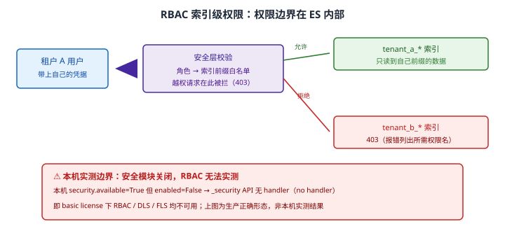
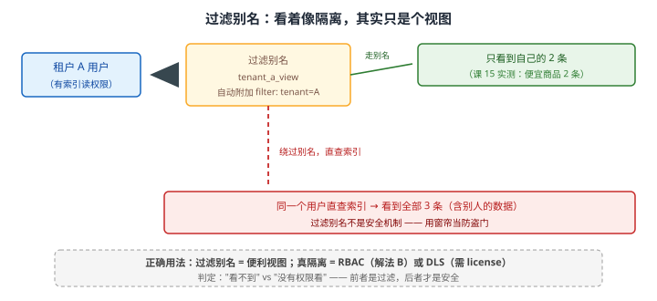

# 场景 5：多租户——一个集群给 50 个业务方用（经典设计题）

**场景描述**：公司想让 50 个业务线共用一个 ES 集群。要求三条：各业务方**不能看到别人的数据**；某个业务方把集群打爆时**不能影响其他人**；各业务方的数据增长节奏不同。

**🔒 先自己想 30 秒**："看不到别人的数据"——你想到了什么方案？一个业务方一个索引？还是靠过滤？**前者和后者在安全性上等价吗？** 关键区分：**"看不到"和"查不到"是两回事**。

<details><summary>💡 提示（分层 / 分维度想）</summary>

- **安全 vs 便利**：加个过滤条件能让用户"查不到"，但用户绕过过滤直查索引会怎样？
- **隔离粒度**：集群级、索引级、文档级、字段级——各要什么代价？
- ** noisy neighbor**：一个业务方跑了个全表扫描，别人怎么办？
- **license**：文档级 / 字段级安全是免费功能吗？（本机两集群 license = basic）

</details>

<details><summary>📖 展开解法</summary>

### 解法一览（效果按题定制：隔离强度 / 单租户成本）

| 解法 | 隔离强度 / 单租户成本 | 代价 | 适用边界 |
|------|---------------------|------|---------|
| **A · 一个业务方一个集群** | 隔离：**物理级**；成本：极高 | 硬件与运维成本 × N | 合规要求强隔离时 |
| **B · 一个业务方一个索引 + RBAC** | 隔离：**索引级（真实权限）**；成本：低 | 索引数膨胀；需权限体系；**本机无法实测** | **多数场景的正解**（需启用安全模块） |
| **C · 共享索引 + DLS/FLS** | 隔离：文档/字段级；成本：低 | **需付费 license**；查询有开销 | 有 license 且租户极多时 |
| **D · 共享索引 + 过滤别名** | 隔离：**无（只是视图）**；成本：极低 | **不是安全机制** | **只做视图，不做隔离** |
| **E · 应用层过滤** | 隔离：依赖应用不写错；成本：低 | 应用出错即越权 | 兜底，不能单独用 |

### 各解法详解

#### 解法 A · 一个业务方一个集群

**思路**：物理隔离——不共享任何资源，也就不存在"影响别人"这回事。它是隔离强度的**上界**，同时也是成本的**上界**。

```yaml
# 每租户一套集群：配置、监控、备份都要各来一遍
# 50 个租户 × 3 节点 = 150 个节点的运维量
```

> ⚠️ **成本不是线性的，是乘运维复杂度的**：50 套集群意味着 50 套监控、50 套备份策略、50 次版本升级。**除非合规明确要求（如金融隔离红线），否则不建议。**

#### 解法 B · 一个业务方一个索引 + RBAC（多数场景的正解）

**思路**：**索引是 ES 的权限边界**。给每个业务方分配独立索引（或索引前缀），再用 RBAC 把角色绑定到索引前缀——越权请求在 ES 的**安全层**被拦下，返回 403。这才是"没有权限看"，而不是"看不到"。



读图：租户 A 的用户带上自己的凭据发起请求，ES 安全层按"角色 → 索引前缀白名单"校验；允许则访问 `tenant_a_*`，越权请求**在这一层就被拦下**返回 403。红框标出**实测边界**：本机 `security.available=True` 但 `enabled=False`，`_security` API 无 handler，所以 RBAC 在本机**跑不了**——上图是生产的正确形态，不是本机实测输出。可实测的替代手段（过滤别名 / `_source` 过滤 / search template）见解法 D 与[课 13 实战篇](../应用实战/13-三大主战场.md)。

```json
// 1. 角色：只能读自己前缀的索引
PUT _security/role/tenant_a_role
{
  "indices": [
    { "names": ["tenant_a_*"], "privileges": ["read", "view_index_metadata"] }
  ]
}
```

```json
// 2. 用户：绑定角色
PUT _security/user/tenant_a_user
{
  "password": "<按你的密码策略生成>",
  "roles": ["tenant_a_role"],
  "full_name": "Tenant A"
}
```

> 🔴 **以上两段在本机跑不了**（非"我没跑"，是环境不支持）：本机实测 `security.available=True` / `enabled=False`，`_security` API 返回 **no handler**。RBAC 要生效必须先启用安全模块（`xpack.security.enabled: true`）+ 配 TLS/凭据。
> ⚠️ **别把这段抄进"本机验证通过"的结论里**——它是生产正确写法，本机只能做到"确认它不可用"这一步。可实测的降级手段（过滤别名 / `_source` 过滤 / search template）见[课 13 实战篇](../应用实战/13-三大主战场.md)，但那三者**防不住能直连集群的人**。

```json
// 4. 索引模板批量预置：新租户自动套配置（课 15）
PUT _index_template/tenant_base
{
  "index_patterns": ["tenant_*"],
  "template": {
    "settings": { "number_of_shards": 1, "number_of_replicas": 1 }
  }
}
```

> 💡 **为什么索引级是"真实"的隔离**：权限校验发生在 ES 的**安全层**，在查询到达数据之前。用户没有任何路径绕过它——这与过滤别名（解法 D）有本质区别。
> ⚠️ **DLS / FLS 需付费 license**：文档级 / 字段级安全在 basic license 下不可用（本机两集群已实测确认）。需要"同一索引内按租户字段过滤"的公司，要么买 license，要么退回索引级隔离。

#### 解法 C · 共享索引 + DLS/FLS

**思路**：所有租户的数据放在同一个索引，靠文档级安全（DLS）在查询时自动注入过滤条件。租户极多（上千）且单租户数据量小时，这比"上千个索引"更划算。

```json
// ⚠️ 需要付费 license；以下为示意，本机 basic 无法执行
PUT _security/role/tenant_a_dls
{
  "indices": [
    {
      "names": ["shared_orders"],
      "privileges": ["read"],
      "query": { "term": { "tenant_id": "tenant_a" } }     // 自动注入过滤
    }
  ]
}
```

> ⚠️ **本机无法验证**：两集群 license 均为 basic，DLS/FLS 不可用。**不要在没有 license 的环境里把 DLS 写进方案**——它是付费能力，不是配置项开关。
> ⚠️ **查询有性能开销**：每个查询都要额外套一层过滤，且**聚合也要走这层过滤**，代价高于索引级隔离。

#### 解法 D · 共享索引 + 过滤别名（只做视图，不做隔离）

**思路**：给每个租户一个带 `filter` 的别名，查询走别名就自动带上租户条件。**方便，但它不是安全机制**——只要用户有索引的读权限，绕过别名直查索引就能看到全部数据。



读图：走过滤别名时只看到自己的 2 条（课 15 实测）；但**同一个用户绕过别名直查索引，看到的是全部 3 条**。红框给出结论：用过滤做隔离 = 用窗帘当防盗门。

```json
// 创建过滤别名（便利视图）
POST _aliases
{
  "actions": [
    {
      "add": {
        "index": "shared_orders",
        "alias": "tenant_a_view",
        "filter": { "term": { "tenant_id": "tenant_a" } }
      }
    }
  ]
}
```

```bash
# ⚠️ 同一用户绕过别名直查索引 —— 过滤形同虚设（课 15 实测：全部 3 条可见）
curl -s -u tenant_a_user:'<password>' "localhost:9201/shared_orders/_search"
```

> 🔴 **最关键的警告**：**过滤别名不是安全机制**。判定标准只有一句——*"看不到"还是"没有权限看"？* 前者是过滤（便利），后者才是安全。**把过滤当隔离用，等于把门牌号当锁。**

#### 解法 E · 应用层过滤（兜底）

**思路**：应用在拼接查询时自动加上租户条件。成本最低，但它把安全边界从 ES 移到了应用代码——**应用写错一次就是一次越权**。

```javascript
// 应用侧：统一入口强制注入租户条件（兜底，不能单独依赖）
function buildQuery(userQuery, tenantId) {
  return {
    query: {
      bool: {
        must: userQuery,
        filter: [{ term: { tenant_id: tenantId } }]     // 强制注入
      }
    }
  };
}
```

> ⚠️ **不能单独用**：新人写个后台脚本忘了加过滤条件，越权就发生了。**正确定位是"纵深防御的一层"**——RBAC（B）之外再加这道，而不是用它替代 B。

### 替代路线（非 ES 技术栈）

| 替代方案 | 思路 | 与本课程解法的差异 |
|---------|------|------------------|
| **云厂商的多租户检索服务** | 由平台提供租户隔离与配额 | 省掉 RBAC 设计与权限运维；但数据出口、成本模型受平台约束 |
| **独立搜索引擎实例（Meilisearch 多索引）** | 轻量引擎按索引隔离，配合应用层 | 部署简单；但权限体系弱于 ES RBAC，且失去分布式能力 |
| **在网关层做租户路由与鉴权** | API 网关统一校验租户身份，转发到对应索引 | 与 ES RBAC 互补（纵深防御）；但网关本身成了新的单点与攻击面 |

### 推荐路径（递进，不是一次全上）

1. **一个业务方一个索引**（解法 B 的基础）：索引名带租户前缀，配合索引模板自动套配置（课 15）。
2. **配 RBAC**：每个业务方只能访问自己的索引前缀（解法 B）——**这是隔离的落地**，但需先启用安全模块（`xpack.security.enabled: true`）。本机安全模块关闭，无法实测；可实测的降级三招见[课 13 实战篇](../应用实战/13-三大主战场.md)。
3. **防 noisy neighbor**：索引级限流、分片数上限、查询超时、监控各索引的 QPS 与资源占用。
4. **增长节奏不同 → 各索引独立的 ILM 策略**（课 15）。
5. **应用层再补一层租户过滤**（解法 E）作为纵深防御，但**绝不单独依赖它**。
6. **评估 DLS**（解法 C）：租户数上千且单租户数据量小时再考虑，且需先确认 license。

### 知识点挂钩

- RBAC 角色与用户、401/403 全套实测 → 阶段 5 · [课 13 三大主战场](../stages/5-生产与选型/lessons/lesson-13-三大主战场.md)
- 过滤别名及其局限、索引模板批量预置 → 阶段 4 · [课 15 索引管理与生命周期策略](../stages/4-分布式与工程实践/lessons/lesson-15-索引管理与生命周期策略.md)
- ILM 按索引独立配置 → 阶段 4 · [课 15 索引管理与生命周期策略](../stages/4-分布式与工程实践/lessons/lesson-15-索引管理与生命周期策略.md)
- filter 上下文（纵深防御那一层）→ 阶段 3 · [课 6 Query DSL](../stages/3-查询与聚合/lessons/lesson-06-QueryDSL问问题的语言.md)

### 什么情况下此方案不适用

- **DLS / FLS 需要付费 license**：本机两集群均为 basic，不可用（课 13 实测确认）。
- **索引数会膨胀**：50 个业务方 × 多个索引，要提前规划分片总数（见[场景 2](场景-02-数据量翻百倍.md)）。
- **单点故障影响所有人**：共用集群意味着集群挂了全部业务都挂——评估能否接受。
- **过滤别名不能当隔离**：这条要写在方案里，避免后来者误解。

### 做错会踩的坑

- 用过滤别名做隔离 → 用户直查索引即可越权（本场景解法 D，课 15 实测）。
- 只在应用层做租户过滤 → 应用写错一次就是一次越权（本场景解法 E）。
- 把 DLS 写进方案却没 license → 环境跑不起来（basic 下不可用）。
- 忽略 noisy neighbor → 一个业务方的全表扫描拖垮整个集群（配合[场景 3](场景-03-QPS涨10倍.md) 的限流手段）。

</details>

---

➡️ **返回**：[场景解法库索引](INDEX.md) ｜ **上一场景**：[场景 4 零停机重建索引](场景-04-零停机重建索引.md) ｜ **下一场景**：场景 6 语义搜索
