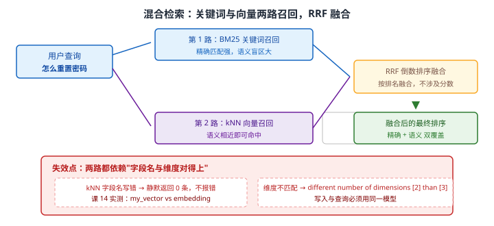
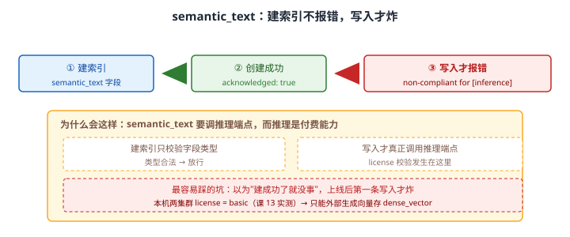

# 场景 6：要给搜索加"语义理解"——搜意思而不是搜关键词（经典设计题）

**场景描述**：知识库搜索，用户搜"怎么重置密码"，但文档里写的是"密码找回流程"，**一个关键词都不重合**，搜不出来。
要求：**能按"意思"搜，而不是按字面匹配。**

**🔒 先自己想 30 秒**：关键词匹配失效了，怎么办？你大概听过"向量检索"——但它是**唯一**的解法吗？在它之前，有没有更便宜的办法先解决问题？
还有一个关键问题：**向量从哪来？** ES 能自己生成向量吗，还是要外部模型？——这两个问题的答案决定方案可行性。

<details><summary>💡 提示（分层 / 分维度想）</summary>

从"便宜到贵"排个序：

- **最便宜**：能不能让关键词匹配得更全？（同义词？）
- **中等**：能不能**同时**用关键词和向量，两条路都走？
- **最贵**：纯向量检索

另外三个现实问题：**向量从哪来**（ES 自己生成要 license）、**维度必须一致**（写和查要用同一模型）、**纯向量会丢什么**（搜型号、错误码）。

</details>

<details><summary>📖 展开解法</summary>

### 解法一览（效果按题定制：语义覆盖 / 精确匹配保持）

| 解法 | 语义覆盖 / 精确匹配 | 代价 | 适用边界 |
|------|-------------------|------|---------|
| **A · 同义词扩展** | 语义覆盖：仅限词表内；精确匹配：**完整保持** | 要维护词表；覆盖面有限 | **第一步，成本最低** |
| **B · 纯关键词 + 多路召回** | 语义覆盖：弱；精确匹配：完整保持 | 仍有语义盲区 | 预算有限时的务实选择 |
| **C · 混合检索（BM25 + kNN + RRF）** | 语义覆盖：**高**；精确匹配：**完整保持** | 需外部模型生成向量；索引变大 | **生产主流** |
| **D · `semantic_text` 字段** | 语义覆盖：高；精确匹配：保持 | **本机 basic license 下不可用** | 有 license 时的最省事方案 |
| **E · 纯向量检索** | 语义覆盖：高；精确匹配：**丢失** | 搜型号 / 错误码 / 专有名词会变差 | **不推荐单独用** |

### 各解法详解

#### 解法 A · 同义词扩展

**思路**：最朴素的语义桥接——把"说法不一致"显式列出来。`synonym_graph` 在查询期把 `重置密码` 扩展成 `重置密码 / 密码找回 / 找回密码`，之后仍是**普通的关键词匹配**，零性能代价、零架构变化。

```json
// 查询期同义词：改词表不需要重建索引
PUT /kb
{
  "settings": {
    "analysis": {
      "filter": {
        "my_synonym": {
          "type": "synonym_graph",
          "synonyms": [
            "重置密码, 密码找回, 找回密码, 修改密码",
            "报销, 费用申请, 报账"
          ]
        }
      },
      "analyzer": {
        "search_syn": { "type": "custom", "tokenizer": "ik_smart", "filter": ["lowercase", "my_synonym"] }
      }
    }
  },
  "mappings": {
    "properties": {
      "content": { "type": "text", "analyzer": "ik_max_word", "search_analyzer": "search_syn" }
    }
  }
}
```

> ⚠️ **同义词是"单向扩展"还是"双向等价"要想清楚**：这里用双向逗号（几个说法等价），因为**查询任何 one of 都应该命中**；而在[场景 1](场景-01-搜索纠错.md) 的错词表必须用 `=>` 单向映射（错词 → 正确词）。**同一个 filter，两种语义，别写反。**
> ⚠️ **覆盖面的天花板很低**：词表能解决"高频说法不一致"，解决不了"用户压根用了另一个词"。当词表超过几百条还在涨，就该考虑向量了。

#### 解法 B · 纯关键词 + 多路召回

**思路**：不上向量，把关键词这条路走到极致——同义词 + 多字段权重 + 分类加权 + 拼音/别名字段。**在没有模型能力或预算时的务实选择**。

```json
// 多字段 + 权重：标题权重最高，同义词字段补充召回，拼音字段兜底
GET /kb/_search
{
  "query": {
    "multi_match": {
      "query": "怎么重置密码",
      "type": "best_fields",
      "fields": ["title^5", "title.pinyin^2", "content^1", "tags^3"],
      "tie_breaker": 0.3
    }
  }
}
```

> ⚠️ **它仍然有语义盲区**：用户说"登不进去了"，文档说"密码找回流程"——词表再全也接不上。**这一步的价值是"确认便宜的办法确实不够"，为下一步提供决策依据。**

#### 解法 C · 混合检索（BM25 + kNN + RRF，生产主流）

**思路**：关键词与向量**各召回一路**，用 RRF（倒数排序融合）合并。RRF 只看**排名**不看原始分数，天然规避了"BM25 分数与余弦相似度不可比"的问题。



读图：查询同时进入第 1 路 BM25（精确匹配强、语义盲区大）与第 2 路 kNN（需先把查询文本交给外部模型生成 embedding），两路结果用 RRF 按排名融合。红框标出两处静默失效点：**kNN 字段名写错会静默返回 0 条且不报错**、**向量维度不匹配**报 `different number of dimensions [2] than [3]`。

```json
// 1. 索引：dense_vector 存外部模型生成的向量（课 13 实测 dims=3, int8_hnsw, cosine）
PUT /kb
{
  "mappings": {
    "properties": {
      "content":  { "type": "text", "analyzer": "ik_max_word" },
      "embedding": {
        "type": "dense_vector",
        "dims": 3,                          // ⚠️ 必须与模型输出维度一致
        "index": true,
        "index_options": { "type": "int8_hnsw", "similarity": "cosine" }
      }
    }
  }
}
```

```json
// 2. 混合查询：keyword 一路 + knn 一路，用 rrf 融合
GET /kb/_search
{
  "retriever": {
    "rrf": {
      "retrievers": [
        { "standard": { "query": { "match": { "content": "怎么重置密码" } } } },
        { "knn": { "field": "embedding", "query_vector": [0.12, -0.44, 0.87], "k": 10, "num_candidates": 100 } }
      ],
      "rank_window_size": 50,
      "rank_constant": 20
    }
  }
}
```

```bash
# 3. 课 13 实测数据（向量确实在工作）：
#    搜「宠物」→ 关键词仅 1 条；kNN 3 条，且「狗」0.9992 排在「猫」0.9985 之前
#    ⚠️ kNN 的 hits.total.value 不可靠，要看 hits.hits.length
```

> 🔴 **kNN 查不到东西时，第一件事是核对字段名**：课 14 实测——探测时用了 `my_vector`，真实字段是 `embedding`，结果**一直返回 0 条且没有任何错误提示**。这是本场景最耗时的一类坑。
> ⚠️ **维度必须一致，且写入与查询必须用同一模型**：换模型 = 全量重建向量。

#### 解法 D · `semantic_text` 字段（有 license 时的最省事方案）

**思路**：让 ES 自己调用推理端点生成向量——不用自己接模型、不用自己存向量。**前提是 license 够**。



读图：`semantic_text` 字段**建索引能成功**（只校验字段类型），**写入才报错** `non-compliant for [inference]`——因为推理是付费能力，license 校验发生在真正调用推理端点的那一刻。**"建成功了就没事"是这里最大的错觉**。

```json
// ⚠️ 本机 basic license 下：建索引成功，写入报 non-compliant for [inference]
PUT /kb_semantic
{
  "mappings": {
    "properties": {
      "content": { "type": "semantic_text" }     // ES 自动生成并索引向量
    }
  }
}
```

> ⚠️ **本机两集群 license 均为 basic**（课 13 实测确认）。所以本机方案只能走**外部生成向量 → 存 `dense_vector`**（解法 C）。
> ⚠️ **写方案前先确认 license**：把 `semantic_text` 写进方案却没 license，环境里跑不起来——这类"纸面可行"的方案在评审时最常见。

#### 解法 E · 纯向量检索（不推荐单独用）

**思路**：只用 kNN 召回。它在语义泛化上最强，但**丢掉了精确匹配**——搜产品型号、错误码、专有名词时，BM25 远好于向量。

```json
// ⚠️ 不推荐单独使用：搜 "ERR_5021" 这类精确串，向量会返回一堆"看起来像"的文档
GET /kb/_search
{
  "knn": { "field": "embedding", "query_vector": [0.12, -0.44, 0.87], "k": 10, "num_candidates": 100 }
}
```

> ⚠️ **纯向量的典型失败**：用户搜 `iPhone 15 Pro Max 256G`，向量可能召回 `iPhone 14 Pro 256G`——**型号差一代，语义几乎相同**。BM25 能精确匹配 `15 Pro Max`，向量不能。
> 💡 **正解是混合（C）**：让 BM25 保住"精确"，让 kNN 补上"语义"。

### 替代路线（非 ES 技术栈）

| 替代方案 | 思路 | 与本课程解法的差异 |
|---------|------|------------------|
| **专用向量数据库（Milvus / Qdrant / pgvector）** | 向量检索与过滤由专用引擎承担 | 大规模向量场景性能与成本更优；但要额外维护一套系统，且失去与关键词检索的原生融合 |
| **重排（rerank）模型** | 先关键词粗召回 Top 100，再用交叉编码器精排 | 精度提升明显；但增加一次模型调用延迟，且粗召回漏掉的永远找不回来 |
| **商业搜索 API（Algolia / 云厂商 AI 搜索）** | 语义能力由平台提供 | 省掉模型与向量管理；但数据需托管，且定制空间受限 |

### 推荐路径（递进，不是一次全上）

1. **先做同义词**（解法 A）：高频"说法不一致"场景，同义词表能解决大部分问题，**零性能代价**。
2. **上混合检索**（解法 C）：外部模型生成 embedding 存 `dense_vector`，关键词与 kNN 各召回一路，用 RRF 融合。**这是生产主流**。
3. **评估 `semantic_text`**（解法 D）：有 license 就用（省事），没有就老实走 C。
4. **效果仍不够时加重排**：先粗召回 Top 100，再用 rerank 模型精排——**注意它救不了粗召回就漏掉的结果**。
5. **别走纯向量**（解法 E）：除非你的场景真的只有语义、完全没有精确匹配需求（极罕见）。

### 知识点挂钩

- kNN 向量检索、RAG 知识库问答、license 限制 → 阶段 5 · [课 13 三大主战场](../stages/5-生产与选型/lessons/lesson-13-三大主战场.md)
- 同义词与分析器 → 阶段 2 · [课 4 倒排索引的秘密](../stages/2-核心原理与上手/lessons/lesson-04-倒排索引的秘密.md)
- 多字段权重、相关性调优、多路召回融合 → 阶段 3 · [课 7 为什么这条排在前面](../stages/3-查询与聚合/lessons/lesson-07-为什么这条排在前面.md)
- 选型清单（该不该上向量）→ 阶段 5 · [课 14 该不该用 ES](../stages/5-生产与选型/lessons/lesson-14-该不该用ES.md)

### 什么情况下此方案不适用

- **纯向量不是万能的**：搜型号、错误码、专有名词时精确匹配（BM25）远好于向量，**混合检索是主流正解**。
- **向量维度必须一致**：课 13 实测维度不匹配报 `different number of dimensions [2] than [3]`。
- **kNN 的 `hits.total.value` 不可靠**：要看 `hits.hits.length`（课 13 实测记录）。
- **basic license 下 `semantic_text` 不可用**：别把它写进没 license 的方案。

### 做错会踩的坑

- kNN 字段名写错 → **静默返回 0 条，不报错**（课 14 实测，本场景解法 C）。
- 写入与查询用不同模型 → 维度不匹配报 `different number of dimensions`。
- 以为 `semantic_text` 建成功就能用 → 写入才炸 `non-compliant for [inference]`（本场景解法 D）。
- 上纯向量丢掉精确匹配 → 搜型号/错误码变差（本场景解法 E）。

</details>

---

➡️ **返回**：[场景解法库索引](INDEX.md) ｜ **上一场景**：[场景 5 多租户隔离](场景-05-多租户隔离.md) ｜ **下一场景**：场景 7 MySQL 数据怎么进 ES
