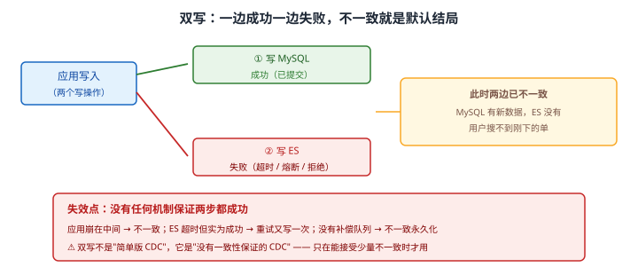
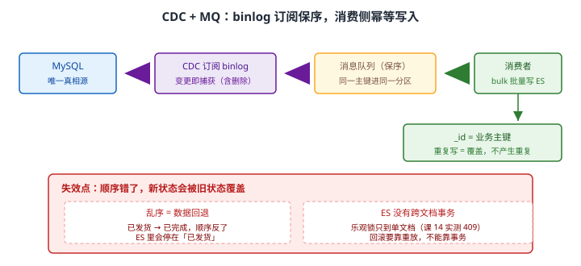

# 场景 7：要接一个新数据源，怎么设计同步链路（经典设计题）

**场景描述**：订单数据存在 MySQL，现在要进 ES 做搜索。每天 100 万单，**还有更新（状态流转）和少量删除**。
**要求**：ES 与 MySQL 最终一致；ES 挂了能重建；延迟控制在秒级。

**🔒 先自己想 30 秒**："怎么把数据同步过去"听起来是个技术问题，但真正的设计决策在别处——**如果 ES 里的数据全丢了，你能重建吗？** 这个问题的答案会决定整条链路怎么设计。

<details><summary>💡 提示（分层 / 分维度想）</summary>

- **谁先谁后**：先写 MySQL 再同步 ES，还是双写？双写时一边成功一边失败怎么办？
- **顺序**：一个订单先"已发货"再"已完成"，同步时顺序反了会怎样？
- **删除**：硬删除的数据，增量同步抓得到吗？
- **重建**：能不能从 MySQL 全量重跑一遍？——**这个问题的答案决定前面所有设计**。

课 12 讲过三种同步模式，回忆一下它们的适用条件。

</details>

<details><summary>📖 展开解法</summary>

### 解法一览（效果按题定制：一致性强度 / 同步延迟）

| 解法 | 一致性 / 延迟 | 代价 | 适用边界 |
|------|-------------|------|---------|
| **A · 双写** | 一致性：**无保证**；延迟：最低 | 一边成功一边失败即不一致；耦合 | 简单场景，能接受少量不一致 |
| **B · 定时轮询增量** | 一致性：分钟级最终一致；延迟：**分钟级** | 有延迟；**删了的数据抓不到**（需软删除） | 延迟容忍度高时 |
| **C · CDC + MQ** | 一致性：**强（保序 + 可重放）**；延迟：秒级 | 架构最复杂；需 MQ 与 CDC 组件 | **生产正解** |
| **D · 全量重建** | 一致性：重建完成时一致；延迟：小时级 | 有窗口期数据不一致 | **兜底 / 小数据量**，也是 C 的灾备 |

### 各解法详解

#### 解法 A · 双写

**思路**：应用同时写 MySQL 和 ES。实现最简单、延迟最低——但**没有任何机制保证两步都成功**。



读图：应用先写 MySQL（成功），再写 ES（失败/超时）——**此时两边已经不一致**。红框点出本质：应用崩在中间、ES 超时但实际成功导致重试重复写、没有补偿队列让不一致永久化。双写不是"简单版 CDC"，它是**没有一致性保证的 CDC**。

```javascript
// ❌ 朴素双写：任何一步失败都会留下不一致
await mysql.query('UPDATE orders SET status=? WHERE id=?', [status, id]);
await es.index({ index: 'orders', id, document: { status } });   // 这一步失败了怎么办？
```

```javascript
// 稍好的写法：ES 失败进补偿队列（但 MySQL 已提交，不一致窗口仍在）
await mysql.query('UPDATE orders SET status=? WHERE id=?', [status, id]);
try {
  await es.index({ index: 'orders', id, document: { status } });
} catch (e) {
  await retryQueue.push({ id, status });        // 至少不一致是"暂时的"
}
```

> ⚠️ **"ES 超时但实际成功"是最阴险的一种**：重试会再写一次。用业务主键做 `_id` 可让重复写变成覆盖（幂等），但**顺序错了仍会覆盖成旧值**。
> ⚠️ **适用判断**：只有"偶尔搜不到刚下的单，业务能接受"时才用双写。**订单、库存、账务都不该用。**

#### 解法 B · 定时轮询增量

**思路**：按 `updated_at`（或自增 ID）定期拉增量。实现简单、对源库侵入小，代价是**延迟**和**抓不到硬删除**。

```sql
-- 每次同步：拉取上次水位之后的变更
SELECT id, status, amount, updated_at
FROM orders
WHERE updated_at > ?          -- 上次同步的水位
ORDER BY updated_at ASC
LIMIT 5000;
```

```javascript
// 写入侧：用业务主键做 _id（幂等），bulk 批量提交
const body = rows.flatMap(r => [
  { index: { _index: 'orders', _id: r.id } },      // _id = 主键 → 重复同步不产生重复
  { id: r.id, status: r.status, amount: r.amount }
]);
const { body: res } = await es.bulk({ body, refresh: false });
if (res.errors) { /* 必须逐条判 errors，不能只看 HTTP 200 */ }
```

> ⚠️ **硬删除抓不到**：数据从 MySQL 删了，`updated_at` 查询再也查不到它，ES 里就留了孤儿。**必须用软删除（`is_deleted` 标记）**，否则要额外的删除对账。
> ⚠️ **水位边界要用闭开区间且按主键去重**：`updated_at` 同一毫秒多条时，只取 `>` 会漏、只取 `>=` 会重。稳妥做法是**水位回退一小段时间 + 靠 `_id` 幂等兜底**。

#### 解法 C · CDC + MQ（生产正解）

**思路**：订阅 MySQL binlog，把变更事件发到消息队列，消费者批量写 ES。**保序**由 MQ 的分区键（同一业务主键进同一分区）保证，**可重建**由 binlog 的重放能力保证。



读图：MySQL 作为唯一真相源，CDC 订阅 binlog（**含删除**），事件进 MQ（按主键分区保序），消费者 bulk 批量写 ES 且 `_id` 用业务主键（重复写即覆盖）。红框标出两处失效点：**乱序会让新状态被旧状态覆盖**（已发货 → 已完成顺序反了，ES 停在"已发货"）、**ES 没有跨文档事务**（乐观锁只到单文档，回滚要靠重放）。

```javascript
// 消费者：批量写 + 幂等 _id + 逐条判错
async function consume(events) {
  const body = events.flatMap(e => {
    if (e.op === 'd') return [{ delete: { _index: 'orders', _id: e.id } }];   // binlog 能抓到删除
    return [{ index: { _index: 'orders', _id: e.id } }, e.after];
  });
  const { body: res } = await es.bulk({ body, refresh: false });

  // 🔴 必须逐条判 errors：HTTP 200 不代表全部成功（课 12 实测 errors=true 但成功项已落库）
  const failed = res.items.filter(i => i.index && i.index.error);
  if (failed.length) await dlq.push(failed);          // 失败进死信，绝不静默丢弃
}
```

```javascript
// 保序：发送时按业务主键做分区键（Kafka 示例，见 Kafka 场景 2）
await producer.send({
  topic: 'orders-cdc',
  messages: [{ key: String(order.id), value: JSON.stringify(event) }]
});
// 同一 order.id 永远进同一分区 → 同一分区内顺序即变更顺序
```

> 💡 **幂等是这套设计的核心**：用业务主键做 `_id`，重复写入是**覆盖**而不是**新增**。课 12 实测：同一 `_id` 反复写入，`_version` 从 2→3→4 递增，但**文档总数恒为 3**。这让"重跑"变成安全操作。
> 🔴 **bulk 返回的 HTTP 200 不代表全部成功**：必须遍历 `items` 判 `error`。这是课 12 反复强调的一条（[故障模式 3](../08-实战经验.md)）。

#### 解法 D · 全量重建（兜底 + C 的灾备）

**思路**：定期（或在数据可疑时）从 MySQL 全量重灌。它既是小数据量场景的主方案，也是解法 C **必备的灾备路径**——没有它，"ES 挂了能重建"就是一句空话。

```json
// 1. 建新索引 + 全量灌（从真相源，而不是从旧 ES 索引 reindex）
POST _reindex?slices=auto&wait_for_completion=false
{
  "source": { "index": "orders_tmp" },
  "dest":   { "index": "orders_v2" }
}
```

```bash
# 2. 校验：条数 + 抽样 + 关键字段汇总值（金额合计是最敏感的一项）
curl -s "localhost:9201/orders_v2/_count"
curl -s "localhost:9201/orders_v2/_search" -H 'Content-Type: application/json' -d '
{ "size": 0, "aggs": { "total": { "sum": { "field": "amount" } } } }'
```

```json
// 3. 别名原子切换（见场景 4 解法 B）
POST _aliases
{ "actions": [
  { "remove": { "index": "orders_v1", "alias": "orders" } },
  { "add":    { "index": "orders_v2", "alias": "orders" } } ]}
```

> ⚠️ **重建的数据源必须是真相源（MySQL），不是旧 ES 索引**：从旧 ES 索引 reindex 会把已存在的不一致**继承下来**——这是"重建"最大的认知误区。
> 💡 **对账是日常，不是灾时才做**：定期比对 MySQL 与 ES 的条数与关键字段汇总值，不一致就触发重建。**没有对账，"最终一致"永远只是假设。**

### 替代路线（非 ES 技术栈）

| 替代方案 | 思路 | 与本课程解法的差异 |
|---------|------|------------------|
| **Logstash JDBC input** | 官方插件定时轮询并写入 ES | 无需自写同步程序；但延迟与删除处理有同样限制，且大表全量压力大 |
| **云厂商数据传输服务（DTS）** | 托管 CDC → 目标端 | 省掉 CDC 组件运维；但目标端支持与费用受平台约束 |
| **应用层事件（Outbox 模式）** | 业务库内建 outbox 表，事务提交后由轮询器发布 | 不依赖 binlog 解析，跨库更通用；但要在业务库加表、改写入逻辑（Kafka 场景 3 有对照） |

### 推荐路径（递进，不是一次全上）

1. **地基：确认 MySQL 是唯一真相源**——ES 是索引副本，不是原始账本（课 14 核心结论）。这个定位决定了：ES 挂了**必须**能从 MySQL 重建。
2. **选同步模式**：生产走 CDC + MQ（解法 C）；延迟容忍分钟级且能软删除时，轮询（解法 B）也够用且便宜得多。
3. **写入侧三件事**：业务主键做 `_id`（幂等）→ bulk 批量写 → **逐条判 `errors`**，失败进死信队列。
4. **一致性兜底**：定期对账（条数 + 关键字段汇总值），不一致用全量重建（解法 D）修正。
5. **监控**：同步延迟、失败率、堆积量——**这三项没有监控，等于同步链路不可观测**。
6. **别把双写当"简单版 CDC"**（解法 A）：它没有一致性保证，只在能接受不一致时用。

### 知识点挂钩

- 三种数据同步模式、bulk 幂等与部分失败 → 阶段 4 · [课 12 接入真实项目](../stages/4-分布式与工程实践/lessons/lesson-12-接入真实项目.md)
- Ingest Pipeline 加工、reindex → 阶段 4 · [课 11 数据管道与备份](../stages/4-分布式与工程实践/lessons/lesson-11-数据管道与备份.md)
- ES 作为索引副本的定位、无跨文档事务 → 阶段 5 · [课 14 该不该用 ES](../stages/5-生产与选型/lessons/lesson-14-该不该用ES.md)
- 幂等与 `_version` 实测 → 阶段 4 · [课 12 接入真实项目](../stages/4-分布式与工程实践/lessons/lesson-12-接入真实项目.md)

### 什么情况下此方案不适用

- **ES 不能做"事务回滚"**：乐观锁只到单文档（课 14 实测 409），没有跨文档事务。回滚只能靠重放。
- **顺序很重要**：MQ 必须保证同一业务的消息有序，否则旧状态会覆盖新状态。
- **硬删除在轮询模式下抓不到**：必须软删除，或走 CDC。
- **本机环境限制**：本机无 MySQL，课 12 已明确哪些模式**不可实操**、哪些机制**可练**（`_id` 幂等、bulk 判错这些能在本机完整验证）。

### 做错会踩的坑

- bulk 只看 HTTP 200、不判 `items[].error` → 部分失败被静默吞掉（[故障模式 3](../08-实战经验.md)）。
- 不用业务主键做 `_id` → 重跑一次产生一批重复文档。
- 重建时从旧 ES 索引 reindex → 把不一致继承下来（本场景解法 D）。
- 轮询模式没做软删除 → ES 里留一堆孤儿文档（本场景解法 B）。

</details>

---

➡️ **返回**：[场景解法库索引](INDEX.md) ｜ **上一场景**：[场景 6 语义搜索](场景-06-语义搜索.md) ｜ **下一场景**：场景 8 分片设计有问题
