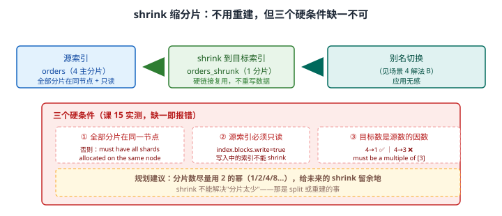
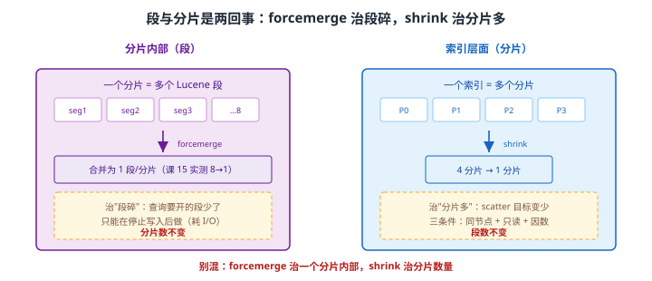

# 场景 8：索引越用越慢，分片设计可能有问题（经典设计题）

**场景描述**：一个 200 GB 的索引，分了 **100 个主分片**、1 副本。查询 P95 2s，**聚合结果偶尔对不上**。
怀疑分片设计有问题，但不敢随便改（改分片数要重建索引）。

**🔒 先自己想 30 秒**：先别急着改。**"分片可能有问题"是个假设，怎么证实它？** 如果真要改，改多少、依据是什么？——还有一件事：改分片数**必须重建索引**，那有没有**不用重建**的补救手段？

<details><summary>💡 提示（分层 / 分维度想）</summary>

- **两个关键数字**：单个分片多大合适？（课 10 有建议值）分片数与聚合误差的关系？（课 14 有实测数据）
- **两个不同维度**：**段**和**分片**是两回事——一个在分片内部，一个在索引层面，别混。
- **不用重建的手段**：课 15 讲过一个能把 4 分片变 1 分片的操作，代价是什么？

</details>

<details><summary>📖 展开解法</summary>

### 解法一览（效果按题定制：是否需重建 / P95 改善）

| 解法 | 是否需重建 / P95 改善 | 代价 | 适用边界 |
|------|---------------------|------|---------|
| **A · 重建索引，减少分片数** | 需重建；P95：**根治** | 过渡期双倍存储 | 分片数明确不合理时 |
| **B · `shrink` 缩分片** | **不需重建**；P95：显著改善 | 三条件：同节点 + 只读 + 因数 | 目标分片数是源分片数的因数时 |
| **C · `forcemerge` 减段数** | 不需重建；P95：改善有限（治段不治分片） | 耗 I/O；只能在停止写入后做 | 段数过多时 |
| **D · 加节点摊薄** | 不需重建；P95：改善 | 硬件成本 | 分片总量确实需要那么多时 |

### 各解法详解

#### 先证实假设：别猜，先算

在动手之前，用两个数字把"怀疑"变成"结论"：

```bash
# ① 算单分片大小：200 GB / 100 = 2 GB/分片
#    对照建议值（日志类 30~50 GB/分片，课 10）→ 远小于建议值 = 分片过小、过多
curl -s "localhost:9201/_cat/indices/orders?v&h=index,pri,rep,store.size"

# ② 验证聚合失真是分片导致的：看误差上界
curl -s "localhost:9201/orders/_search" -H 'Content-Type: application/json' -d '
{ "size": 0, "aggs": { "by_brand": { "terms": { "field": "brand", "size": 10 } } } }'
# → doc_count_error_upper_bound > 0 即证实（课 14 实测：1 分片=0，50 分片=82）
```

#### 解法 A · 重建索引，减少分片数（根治）

**思路**：按容量重算分片数，新建索引 + reindex + 别名切换。这是唯一能**任意设定**分片数的手段（shrink 受因数限制）。

```json
// 目标分片数 = 总量 / 单分片建议值，留增长余量
// 200 GB / 40 GB ≈ 5 → 取 6~8（留余量，且尽量取 2 的幂给 shrink 留余地）
PUT /orders_v2
{
  "settings": {
    "number_of_shards": 8,
    "number_of_replicas": 1
  },
  "mappings": { /* 与 v1 一致，或趁机修正（见场景 4） */ }
}
```

```json
// reindex + 别名原子切换（详细步骤见场景 4 解法 B）
POST _reindex?slices=auto&wait_for_completion=false
{ "source": { "index": "orders_v1" }, "dest": { "index": "orders_v2" } }
```

> ⚠️ **减少分片数会降低并行度**：如果查询确实需要高并发扫描，分片太少反而慢。**分片设计是平衡，不是越少越好**。
> 💡 **用索引模板把正确分片数固化**（课 15），防止下次再犯同一个错。

#### 解法 B · `shrink` 缩分片（不用重建）

**思路**：`shrink` 把多个分片合并成更少的分片，**底层用硬链接复用原有段文件，不重写数据**——所以比 reindex 快得多。代价是三个硬条件。



读图：源索引（4 主分片）在满足"全部分片在同一节点 + 只读 + 目标数是因数"三个条件后，shrink 成 1 分片的新索引，再靠别名切换让应用无感。红框标出三个条件的**报错原文**。

```json
// 1. 把源索引全部分片挪到同一节点
PUT /orders/_settings
{ "index.routing.allocation.require._name": "node-1", "index.blocks.write": true }
```

```json
// 2. shrink：目标数必须是源数的因数（4 → 1 ✅，4 → 3 ❌）
POST /orders/_shrink/orders_shrunk
{
  "settings": {
    "index.number_of_shards": 1,
    "index.number_of_replicas": 1,
    "index.routing.allocation.require._name": null,     // 记得解除节点约束
    "index.blocks.write": null                           // 记得解除只读
  }
}
```

```bash
# 3. 校验条数与聚合精度
curl -s "localhost:9201/orders_shrunk/_count"
# 课 15 实测：shrink 4 → 1 成功，文档数不变
```

> 🔴 **三个硬条件（课 15 实测，缺一即报错）**：
> 1. 源索引全部分片必须在**同一个节点** → 否则 `must have all shards allocated on the same node`
> 2. 源索引必须**只读**（`index.blocks.write=true`）
> 3. 目标分片数必须是源分片数的**因数** → 4→3 报 `must be a multiple of [3]`
>
> ⚠️ **shrink 完别忘了解除节点约束与只读**：`require._name` 与 `blocks.write` 都会被新索引继承，不解会导致后续无法写入、分片无法再平衡。
> 💡 **规划分片数时用 2 的幂**（1/2/4/8…），给未来的 shrink 留余地——这是"现在多想 10 秒，将来省一次重建"的典型。

#### 解法 C · `forcemerge` 减少段数

**思路**：一个分片内部由多个 Lucene 段组成，每次写入/刷新都可能产生新段。段越多，查询要打开的文件越多。`forcemerge` 把它们合并——**但它不改变分片数**。



读图：左侧是**分片内部**——一个分片含多个段，forcemerge 把 8 段合并成 1 段（课 15 实测），**分片数不变**；右侧是**索引层面**——shrink 把 4 个分片合成 1 个，**段数不变**。两者治的是完全不同的病。

```json
// forcemerge：max_num_segments 是"每分片"上限，不是总数
POST /orders/_forcemerge?max_num_segments=1
```

```bash
# 课 15 实测：2 主分片 + max_num_segments=1 → 合计 2 段（每分片 1 段），条数 8 不丢
curl -s "localhost:9201/_cat/segments/orders?v&h=index,shard,segment,docs.count"
```

> ⚠️ **`max_num_segments` 是"每分片"上限**：本机 2 主分片 + `max_num_segments=1` → 合计 2 段。**别看到"合并后仍有 2 段"就判定失效**——这是我实测时犯过的误判（课 15 已记录）。
> ⚠️ **只能在停止写入后做**：forcemerge 耗大量 I/O，写入中的索引合并会反复产生新段，白费力气。
> ⚠️ **治"段碎"不治"分片多"**：如果问题是 100 个分片，forcemerge 帮不上忙。

#### 解法 D · 加节点摊薄

**思路**：100 个分片摊到更多节点上，单节点的段/缓存/句柄压力下降。它**不改变分片数**，只是让每个节点少背一些。

```bash
# 先看单节点背了多少分片（官方经验值：每 GB 堆内存 ≤ 20 个分片）
curl -s "localhost:9201/_cat/allocation?v"
curl -s "localhost:9201/_cat/nodes?v&h=name,heap.percent,ram.percent,cpu"
```

> ⚠️ **这是"扛住现状"而不是"修好设计"**：分片总数没变，scatter-gather 的协调开销也没变。加节点适合"分片数合理但节点太少"，不适合"分片数本身离谱"。
> ⚠️ **加节点会触发分片重平衡**：迁移期间磁盘与网络 IO 升高，生产要配限流（`indices.recovery.max_bytes_per_sec`）。

### 替代路线（非 ES 技术栈）

| 替代方案 | 思路 | 与本课程解法的差异 |
|---------|------|------------------|
| **按时间拆索引（Data Stream / 别名 rollover）** | 用"多个小索引"替代"一个大索引"，单索引分片数自然可控 | 治本且顺带解决生命周期（见[场景 2](场景-02-数据量翻百倍.md)）；但要改写入路径 |
| **换到按主键分库分表的存储** | 分片由存储层自动管理 | 省掉人工分片规划；但失去 ES 的全文检索与聚合能力 |
| **降冷 + 归档** | 老数据移出热层，减少在线分片总量 | 不改分片设计就让热层变轻；但老数据查询变慢（见场景 2 解法 D） |

### 推荐路径（递进，不是一次全上）

1. **先证实假设，别猜**：算单分片大小（200 GB / 100 = 2 GB，远小于 30~50 GB 建议值）+ 查 `doc_count_error_upper_bound`。
2. **验证聚合失真确实来自分片**：对照课 14 实测（1 分片误差 0、50 分片误差 82）。
3. **算目标分片数**：200 GB / 40 GB ≈ 5，留增长余量取 6~8，**尽量取 2 的幂**。
4. **选实施手段**：能停写且满足三条件 → `shrink`（解法 B，不用重建）；不能停写或目标数不是因数 → 新建索引 + reindex + 别名切换（解法 A）。
5. **段数过多再叠 `forcemerge`**（解法 C）：它治的是另一层，不冲突。
6. **用索引模板固化正确分片数**，防止下次再犯。

### 知识点挂钩

- 分片设计与容量规划（30~50 GB 建议值）→ 阶段 4 · [课 10 集群健康与排障](../stages/4-分布式与工程实践/lessons/lesson-10-集群健康与排障.md)
- 分片与副本机制、分布式读 → 阶段 4 · [课 9 分片：ES 分布式的基石](../stages/4-分布式与工程实践/lessons/lesson-09-分片分布式的基石.md)
- 多分片代价实测（存储 4.7 倍 / p95 2.2 倍 / 聚合误差）→ 阶段 5 · [课 14 该不该用 ES](../stages/5-生产与选型/lessons/lesson-14-该不该用ES.md)（数据亦见[场景 2](场景-02-数据量翻百倍.md) 解法 C）
- shrink / forcemerge 三条件与实测 → 阶段 4 · [课 15 索引管理与生命周期策略](../stages/4-分布式与工程实践/lessons/lesson-15-索引管理与生命周期策略.md)
- 聚合精度与误差上界 → 阶段 3 · [课 8 聚合：不做搜索，做统计](../stages/3-查询与聚合/lessons/lesson-08-聚合不做搜索做统计.md)

### 什么情况下此方案不适用

- **`shrink` 不能解决"分片太少"**：那是 `split` 或重建的事。
- **减少分片数会降低并行度**：查询确实需要高并发扫描时，分片太少反而慢。
- **段和分片是两回事**：forcemerge 治段碎（一个分片内），shrink 治分片多（索引层面）。**别混**。
- **分片数不是性能万能药**：真正让查询变快的是少扫数据（时间范围 / filter / 路由），见[场景 3](场景-03-QPS涨10倍.md)。

### 做错会踩的坑

- 凭"感觉分片多了"就改 → 先算单分片大小、先查误差上界（本场景开头）。
- 见"合并后仍有 2 段"就判 forcemerge 失效 → `max_num_segments` 是每分片上限（本场景解法 C）。
- shrink 后忘了解除 `require._name` 与 `blocks.write` → 新索引无法写入、无法再平衡。
- 目标分片数取 3 之类非因数 → `must be a multiple of [3]`（本场景解法 B）。

</details>

---

➡️ **返回**：[场景解法库索引](INDEX.md) ｜ **上一场景**：[场景 7 数据同步](场景-07-数据同步.md) ｜ **下一场景**：场景 9 商品多规格错配
