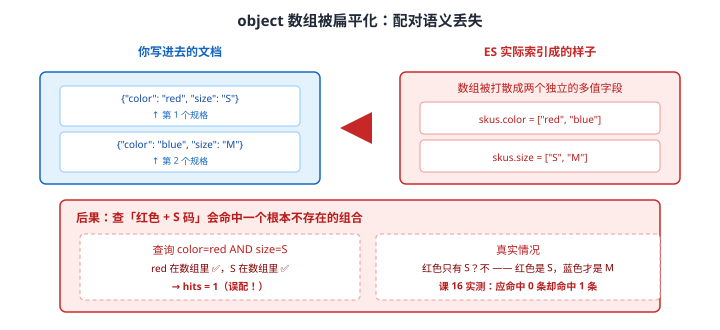
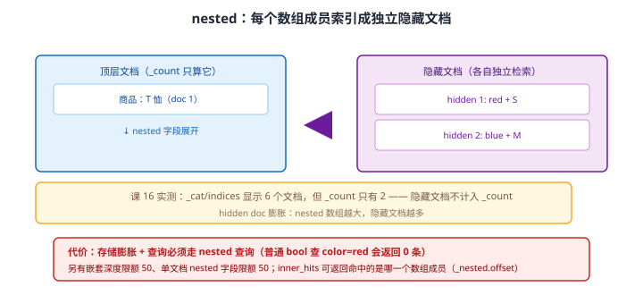

# 场景 9：商品多规格搜索总是错配——object / nested / flattened 怎么选（经典设计题）

**场景描述**：一件 T 恤有两个规格：红色 S 码、蓝色 M 码。用户筛选"红色 + S 码"，**搜出来的却是这件商品本身没问题、但筛"红色 + M 码"也照样命中的怪事**——更糟的是，运营反馈：**搜"红色 M 码"也能搜到这件 T 恤**，而它根本没有红色 M 码。
排查发现映射是 `object`，`skus` 是对象数组。

**🔒 先自己想 30 秒**：为什么"红色 + M 码"会命中一件只有"红色 S / 蓝色 M"的商品？——想清楚 ES 把对象数组**存成了什么形状**，答案就出来了。然后想：换成 `nested` 能解决，代价是什么？有没有更便宜的？

<details><summary>💡 提示（分层 / 分维度想）</summary>

- **存储形状**：`object` 数组在倒排索引里是"两个独立的多值字段"还是"两个绑定在一起的对象"？
- **nested 的代价**：它能保配对，但文档数为什么会变多？`_count` 和 `_cat/indices` 的数字为什么对不上？
- **更便宜的选项**：`flattened` 能压字段数，它保配对吗？
- **查询侧的坑**：换成 nested 后，普通 `bool` 查询还能查到吗？

</details>

<details><summary>📖 展开解法</summary>

### 解法一览（效果按题定制：配对语义 / 存储与查询开销）

| 解法 | 配对语义 / 存储开销 | 代价 | 适用边界 |
|------|-------------------|------|---------|
| **A · object（默认）** | 配对：**丢失**（跨对象误配）；存储：最省 | 误配无法在查询侧修 | 只做展示、不按组合筛选时 |
| **B · `nested`** | 配对：**完整保留**；存储：膨胀（隐藏文档） | 隐藏文档膨胀；查询必须走 nested；有深度限额 | **需要按组合精确筛选时的正解** |
| **C · `flattened`** | 配对：**不保**；存储：压字段数 | 无法按字段类型查询（全是 keyword）；不支持 nested 查询 | 字段极多、只做存在性/精确匹配时 |
| **D · 拆字段 / 反规范化** | 配对：**用设计保证**；存储：可控 | 要改写入与应用逻辑 | 组合维度固定且少时 |

### 各解法详解

#### 解法 A · object（默认，也是陷阱所在）

**思路**：`object` 是 ES 的默认行为——对象数组会被**扁平化**成多个独立的多值字段，同一对象内部的字段关联**在索引时就丢了**。



读图：你写进去的是两个绑定在一起的对象（`{red, S}` 与 `{blue, M}`），ES 实际索引成的是两个**独立的多值字段** `skus.color=["red","blue"]` 与 `skus.size=["S","M"]`。于是查 `color=red AND size=S` 时两个值各自存在 → **误配命中**（课 16 实测 hits=1，而该组合并不存在）。

```json
// 当前（有问题的）映射
PUT /products
{
  "mappings": {
    "properties": {
      "title": { "type": "text" },
      "skus": {                                    // 默认 object → 扁平化
        "properties": {
          "color": { "type": "keyword" },
          "size":  { "type": "keyword" }
        }
      }
    }
  }
}
```

```json
// ❌ 这个查询会误配：红色 M 码并不存在，但它照样命中
GET /products/_search
{
  "query": {
    "bool": {
      "must": [
        { "term": { "skus.color": "red" } },
        { "term": { "skus.size":  "M"  } }
      ]
    }
  }
}
```

> 🔴 **这是无法在查询侧修的**：信息在索引时就已经丢了，任何查询技巧都还原不出"哪个 color 配哪个 size"。
> ⚠️ **适用判断**：如果规格只用于**展示**（详情页列出来），从不做组合筛选，object 完全够用、且最省。**误配只在"按组合筛选"时才成为 bug**。

#### 解法 B · `nested`（需要按组合精确筛选时的正解）

**思路**：`nested` 把数组的**每个成员索引成一个独立的隐藏文档**，配对关系因此被保住。代价是存储膨胀与查询方式改变。



读图：顶层文档（商品 T 恤）之下的 `nested` 数组展开成多个**隐藏文档**，各自独立检索，配对因此保住。黄框标出课 16 实测的**反直觉现象**：`_cat/indices` 显示 6 个文档，但 `_count` 只有 2——**隐藏文档不计入 `_count`**。红框标出代价：存储膨胀、查询必须走 nested、有深度与字段数限额。

```json
// 1. 改映射：skus 声明为 nested（必须重建索引，映射不可变 —— 见场景 4）
PUT /products_v2
{
  "mappings": {
    "properties": {
      "title": { "type": "text" },
      "skus": {
        "type": "nested",                          // ← 关键
        "properties": {
          "color": { "type": "keyword" },
          "size":  { "type": "keyword" }
        }
      }
    }
  }
}
```

```json
// 2. 查询必须用 nested 查询（普通 bool 查不到，课 16 实测 0 条）
GET /products_v2/_search
{
  "query": {
    "nested": {
      "path": "skus",
      "query": {
        "bool": {
          "must": [
            { "term": { "skus.color": "red" } },
            { "term": { "skus.size":  "M"  } }
          ]
        }
      },
      "inner_hits": {}                             // 返回命中的是哪一个规格
    }
  }
}
// → 红色 M 码：hits = 0 ✅（不再误配）
//   红色 S 码：hits = 1，inner_hits 里带 _nested.offset = 0
```

> 🔴 **换成 nested 后，普通 `bool` 查询会返回 0 条**：课 16 实测——即使只查 `skus.color=red`（不查 size），用普通 bool 也查不到。**必须用 `nested` 查询**，这是最容易踩的迁移坑。
> ⚠️ **嵌套深度限额 50、单文档 nested 字段限额 50**：超限写入会失败。设计时要控制层级。
> ⚠️ **隐藏文档膨胀**：数组越大，隐藏文档越多，存储与查询开销都上升。**nested 数组适合"少量、需要精确配对"的场景**（如商品的 2~10 个规格），不适合"成百上千条"的子对象（那种该拆成子索引或父子文档）。

#### 解法 C · `flattened`

**思路**：`flattened` 把整个对象当作**一组扁平的 key-value** 索引，字段数不膨胀（解决 mapping 爆炸）。但它**不保配对**，而且值全部按 keyword 处理。

```json
// flattened：压字段数，不保配对
PUT /products_v3
{
  "mappings": {
    "properties": {
      "title":    { "type": "text" },
      "skus":     { "type": "flattened" },        // 整个对象变一组 KV
      "metadata": { "type": "flattened" }         // 典型用途：不确定的扩展属性
    }
  }
}
```

```json
// 能查（按 KV 精确匹配）
GET /products_v3/_search
{ "query": { "term": { "skus": "red" } } }        // 注意：值作为整体匹配
```

> 🔴 **别用 flattened 取代 nested**：课 16 实测——flattened 在对象数组下查询 hits=1（**仍会误配**），且**对它跑 nested 查询会直接报 `search_phase_execution_exception`**。它的定位是"压字段数 + 存在性/精确匹配"，不是"保配对"。
> ⚠️ **值全部是 keyword**：不能范围查、不能全文检索、不能聚合数值。

#### 解法 D · 拆字段 / 反规范化（用设计规避）

**思路**：组合维度固定且很少时，**不用嵌套结构**——把组合拍平成独立字段，用设计保证配对。

```json
// 方案：每个"有货的组合"拍成一个独立字段值
PUT /products_v4
{
  "mappings": {
    "properties": {
      "title": { "type": "text" },
      "sku_combos": { "type": "keyword" }          // ["red|S", "blue|M"]
    }
  }
}
```

```json
// 查询：按组合串精确匹配（配对由写入时拼串保证）
GET /products_v4/_search
{ "query": { "term": { "sku_combos": "red|M" } } }
// → 0 条 ✅（这个组合不存在）
```

> 💡 **最便宜且最可控**：没有隐藏文档、没有 nested 查询的复杂性、存储最省。代价是**组合维度必须固定**——加一个维度（如"版型"）就要改拼串规则与历史数据。
> ⚠️ **只在维度少且稳定时用**：维度会变就别用，否则每次变更都是全量数据迁移。

### 替代路线（非 ES 技术栈）

| 替代方案 | 思路 | 与本课程解法的差异 |
|---------|------|------------------|
| **关系型数据库的关联表 + 查询时 JOIN** | 规格单独存表，查询时联结过滤 | 配对语义天然成立（关系模型）；但全文检索与高并发聚合远不及 ES |
| **父子文档（join 字段）** | ES 的父子关联，子文档独立更新 | 子文档可单独更新（nested 只能整篇替换）；但查询更慢、内存开销更大 |
| **宽表冗余（每个组合一行）** | 一个 SKU 一行，商品信息冗余 | 查询最简单最快；但数据冗余大、商品信息更新要批量改 |

### 推荐路径（递进，不是一次全上）

1. **先确认是否真的需要"按组合筛选"**：只做展示 → object（解法 A）足够，别过度设计。
2. **需要精确配对 → `nested`**（解法 B）：重建索引改映射，查询改用 `nested` 查询 + `inner_hits`。
3. **维度少且稳定 → 考虑拍平组合串**（解法 D）：比 nested 便宜得多，但变更成本高。
4. **扩展属性字段爆炸 → `flattened`**（解法 C）：只用于压字段数，**别拿来保配对**。
5. **迁移后必测三件事**：`_count` 与 `_cat/indices` 数字对不上（隐藏文档）、普通 bool 查 nested 返回 0 条、`inner_hits` 能带出 `_nested.offset`。

### 知识点挂钩

- object / nested / flattened 三种类型与实测 → 阶段 4 · [课 16 复杂结构与搜索建议](../stages/4-分布式与工程实践/lessons/lesson-16-复杂结构与搜索建议.md)
- 映射不可变、重建索引路径 → 阶段 2 · [课 5 映射给数据定规矩](../stages/2-核心原理与上手/lessons/lesson-05-映射给数据定规矩.md)（重建步骤见[场景 4](场景-04-零停机重建索引.md)）
- nested 查询与 inner_hits → 阶段 3 · [课 6 Query DSL](../stages/3-查询与聚合/lessons/lesson-06-QueryDSL问问题的语言.md)
- `_count` 与 `_cat/indices` 的差异 → 阶段 4 · [课 10 集群健康与排障](../stages/4-分布式与工程实践/lessons/lesson-10-集群健康与排障.md)

### 什么情况下此方案不适用

- **nested 数组很大（成百上千）时**：隐藏文档膨胀严重，该拆子索引或父子文档。
- **`flattened` 不能取代 `nested`**：实测它会误配，且不支持 nested 查询。
- **维度会变时别用拍平串**（解法 D）：每次加维度都是全量迁移。
- **嵌套深度 / 字段数有硬限**：深度 50、nested 字段数 50，超限写入失败。

### 做错会踩的坑

- 用 object 存对象数组还指望按组合筛选 → 跨对象误配（本场景解法 A，课 16 实测 hits=1）。
- 换成 nested 后仍用普通 `bool` 查询 → **返回 0 条**（本场景解法 B，课 16 实测）。
- 用 flattened 保配对 → 仍误配 + 跑 nested 查询报错（本场景解法 C）。
- 见 `_cat/indices` 与 `_count` 数字不一致就以为数据错了 → 那是隐藏文档，符合预期。

</details>

---

➡️ **返回**：[场景解法库索引](INDEX.md) ｜ **上一场景**：[场景 8 分片设计](场景-08-分片设计.md) ｜ **下一场景**：场景 10 搜索框自动补全
