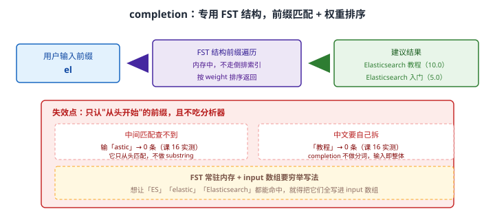
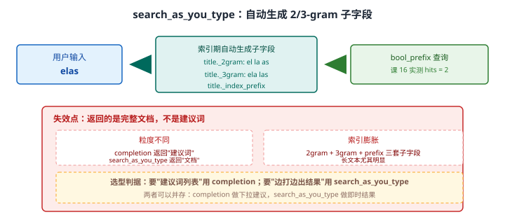

# 场景 10：搜索框要自动补全——下拉建议怎么做（经典设计题）

**场景描述**：搜索框要加自动补全：用户输入前几个字，**下拉框实时显示候选词**（"elastic" → "Elasticsearch 教程"、"Elasticsearch 入门"）。
要求：响应 < 50ms，**热门词优先**。

**🔒 先自己想 30 秒**：ES 里有两个都能做"补全"的能力——`completion` 和 `search_as_you_type`。它们看起来像，**但返回的不是同一种东西**。先想清楚：下拉框里要显示的是**"建议词"**还是**"匹配到的文档"**？——这个区别决定选型。

<details><summary>💡 提示（分层 / 分维度想）</summary>

- **粒度**：建议词 vs 文档，是两种不同产物。
- **匹配位置**：用户输入"astic"（词中间），能匹配到"Elasticsearch"吗？**前缀匹配器默认不行**。
- **中文**：`completion` 会分词吗？测过就知道（课 16 有实测）。
- **排序**：热门优先靠什么实现？权重从哪来？

</details>

<details><summary>📖 展开解法</summary>

### 解法一览（效果按题定制：响应延迟 / 返回粒度）

| 解法 | 延迟 / 返回粒度 | 代价 | 适用边界 |
|------|--------------|------|---------|
| **A · `completion` suggester** | 延迟：**极低（FST 内存）**；粒度：**建议词** | 只认前缀；中文要自己拆；input 要穷举 | **下拉建议首选** |
| **B · `search_as_you_type`** | 延迟：低；粒度：**完整文档** | 索引膨胀（2/3-gram 子字段） | 边打边出结果列表时 |
| **C · `edge_ngram` + match** | 延迟：低；粒度：文档 | 索引膨胀；需自己控权重 | 要自定义排序/过滤时 |
| **D · 应用侧缓存 / 词库** | 延迟：**最低**；粒度：建议词 | 数据更新不及时 | 热点极集中时（叠加层） |

### 各解法详解

#### 解法 A · `completion` suggester（下拉建议首选）

**思路**：`completion` 是**专用**的补全类型——它把输入构建一个 **FST**（有限状态转换器）常驻内存，**不走倒排索引**，所以延迟极低。它还支持 `weight`，天然满足"热门优先"。



读图：输入前缀进入 FST 做前缀遍历（内存中完成），结果按 `weight` 排序返回。红框标出两处**课 16 实测**的失效点：输「astic」（词中间）→ **0 条**，因为它只从头匹配、不做 substring；输「教程」（中文）→ **0 条**，因为 completion **不做分词**，输入被当作整体。黄框提醒：FST 常驻内存，且 `input` 数组要**穷举**你希望命中的各种写法。

```json
// 1. 映射：completion 类型
PUT /articles
{
  "mappings": {
    "properties": {
      "title": { "type": "text" },
      "suggest": { "type": "completion" }          // 专用补全字段
    }
  }
}
```

```json
// 2. 写入：input 数组穷举希望命中的写法，weight 控制热门排序
POST /articles/_doc/1
{
  "title": "Elasticsearch 教程",
  "suggest": {
    "input": ["Elasticsearch", "ES", "elastic", "Elasticsearch 教程"],
    "weight": 10                                   // 权重 = _score（课 16 实测 10.0）
  }
}
```

```json
// 3. 查询：prefix 前缀匹配
POST /articles/_search
{
  "suggest": {
    "title_suggest": {
      "prefix": "el",
      "completion": { "field": "suggest", "size": 10, "skip_duplicates": true }
    }
  }
}
// 课 16 实测：前缀 el → 2 条，_score 分别 10.0 / 5.0（= weight）
```

> 🔴 **只认从头开始的前缀**：课 16 实测输「astic」返回 0 条。**用户搜词中间的习惯很常见**，这是 completion 最大的产品级缺陷——需要在产品设计上引导（或叠加解法 B）。
> 🔴 **中文要自己拆**：completion **不做分词**，输「教程」返回 0 条（课 16 实测）。中文场景下 `input` 数组必须包含你希望命中的每一个中文词/短语。
> ⚠️ **FST 常驻内存**：补全数据量极大时要评估堆内存开销。
> ⚠️ **`input` 要穷举**：想让「ES」「elastic」「Elasticsearch」都能命中，三个都得写进去。

#### 解法 B · `search_as_you_type`

**思路**：一个"省心"的字段类型——ES 自动为你生成 `_2gram`、`_3gram`、`_index_prefix` 子字段，查询时用 `bool_prefix` 就能实现"边打边匹配"。它**返回的是完整文档**，不是建议词。



读图：索引期自动生成 2gram / 3gram / index_prefix 三套子字段，`bool_prefix` 查询命中它们（课 16 实测 hits=2）。红框标出关键差异：**它返回的是完整文档，不是建议词**；以及三套子字段带来的**索引膨胀**。

```json
// 1. 映射：search_as_you_type（子字段自动生成，无需手写 analyzer）
PUT /articles_v2
{
  "mappings": {
    "properties": {
      "title": { "type": "search_as_you_type" }
    }
  }
}
```

```json
// 2. 查询：multi_match + bool_prefix
GET /articles_v2/_search
{
  "query": {
    "multi_match": {
      "query": "elas",
      "type": "bool_prefix",
      "fields": ["title", "title._2gram", "title._3gram"]
    }
  }
}
// 课 16 实测：elas → hits = 2，返回完整文档
```

> ⚠️ **返回的是文档，不是建议词**：下拉框要显示"Elasticsearch 教程"这个词——用 `completion` 直接就有；用 `search_as_you_type` 你得从命中的文档里**自己提取标题**，多一步且结果可能重复。
> ⚠️ **索引膨胀**：三套子字段（2gram / 3gram / index_prefix），长文本尤其明显。
> 💡 **它与 A 是互补而非替代**：常见组合是 **completion 做下拉建议 + search_as_you_type 做即时结果列表**。

#### 解法 C · `edge_ngram` + match

**思路**：自己掌控分词——用 `edge_ngram` 只从**词首**切分（`elastic` → `e`/`el`/`ela`/…），比 ngram 省空间，且能与普通 `match` 查询、filter、自定义排序自由组合。

```json
// 索引期只切前缀（edge_ngram），比 ngram 省空间
PUT /articles_v3
{
  "settings": {
    "analysis": {
      "filter": {
        "edge_ngram": { "type": "edge_ngram", "min_gram": 1, "max_gram": 20 }
      },
      "analyzer": {
        "autocomplete": { "type": "custom", "tokenizer": "standard", "filter": ["lowercase", "edge_ngram"] }
      }
    }
  },
  "mappings": {
    "properties": {
      "title": {
        "type": "text",
        "analyzer": "autocomplete",                 // 索引期切前缀
        "search_analyzer": "standard"               // 查询期不切，避免碎片噪声
      }
    }
  }
}
```

```json
// 查询就是普通 match，可与 filter / 自定义排序自由组合
GET /articles_v3/_search
{
  "query": {
    "bool": {
      "must":   [{ "match": { "title": "elas" } }],
      "filter": [{ "term":  { "status": "published" } }]     // 这是它相对 completion 的优势
    }
  }
}
```

> 💡 **`search_analyzer: standard` 是关键**：查询期不切分，避免用户输入被切成碎片导致大量误匹配。
> ⚠️ **热门排序要自己做**：completion 的 `weight` 是内建的，这里得自己加 `hot_score` 字段参与排序。
> ⚠️ **索引膨胀仍在**：只是比 ngram 轻。

#### 解法 D · 应用侧缓存 / 词库（叠加层）

**思路**：补全请求高度集中（Top 100 前缀贡献大部分流量），把结果缓存起来，ES 只承担长尾。

```javascript
// Node.js：前缀 → 建议列表，短 TTL 缓存
const key = `sug:${prefix}`;
const hit = await redis.get(key);
if (hit) return JSON.parse(hit);                  // 热点前缀不走 ES

const { body } = await es.search({
  index: 'articles',
  body: { suggest: { s: { prefix, completion: { field: 'suggest', size: 10 } } } }
});
const list = body.suggest.s[0].options.map(o => o.text);
await redis.setex(key, 60, JSON.stringify(list));  // 60s：补全对实时性不敏感
return list;
```

> 💡 **它是叠加层不是替代**：底下仍要有 A/B/C 之一支撑。缓存的价值是**削峰**——让 50ms 的 SLA 在流量高峰时也能保住。
> ⚠️ **新词上线会延迟可见**（TTL 内）。热门运营词要支持手动失效。

### 替代路线（非 ES 技术栈）

| 替代方案 | 思路 | 与本课程解法的差异 |
|---------|------|------------------|
| **专用搜索服务（Algolia / Meilisearch）** | 补全（typo-tolerance + 前缀）内建为默认行为 | 开箱即用、无需调 analyzer；但数据需托管，定制空间受限 |
| **前端本地词库** | 词库打包到前端，本地过滤 | 零延迟、零服务端压力；但词库大了首屏加载变慢，且更新要靠发版 |
| **Redis ZSET 前缀查询** | 用有序集合存词 + 权重，ZRANGEBYLEX 取前缀 | 极快且热门排序天然；但要自己维护词库与权重，且中文分词要另做 |

### 推荐路径（递进，不是一次全上）

1. **先定粒度**：要"下拉建议词" → `completion`（解法 A）；要"边打边出结果" → `search_as_you_type`（解法 B）。**这是选型第一问。**
2. **`completion` 落地三件事**：`input` 数组穷举各种写法、用 `weight` 做热门排序、**中文必须自己拆词写进 input**。
3. **想保留查询灵活性（filter / 自定义排序）→ `edge_ngram`**（解法 C）。
4. **流量大 → 加应用层缓存**（解法 D）削峰。
5. **产品侧预案**：completion 不支持词中间匹配，UI 上要么引导从头输入，要么叠加 B 兜底。

### 知识点挂钩

- completion / search_as_you_type 实测（权重、中文、中间匹配）→ 阶段 4 · [课 16 复杂结构与搜索建议](../stages/4-分布式与工程实践/lessons/lesson-16-复杂结构与搜索建议.md)
- 分析器与 edge_ngram → 阶段 2 · [课 4 倒排索引的秘密](../stages/2-核心原理与上手/lessons/lesson-04-倒排索引的秘密.md)
- multi-fields 子字段设计 → 阶段 2 · [课 5 映射给数据定规矩](../stages/2-核心原理与上手/lessons/lesson-05-映射给数据定规矩.md)
- 纠错（term suggester）与补全的区别 → [场景 1](场景-01-搜索纠错.md)、阶段 5 · [课 13 三大主战场](../stages/5-生产与选型/lessons/lesson-13-三大主战场.md)

### 什么情况下此方案不适用

- **`completion` 只匹配前缀**：输「astic」→ 0 条（课 16 实测）。
- **`completion` 不做分词**：中文必须自己拆（课 16 实测「教程」→ 0 条）。
- **`search_as_you_type` 返回文档不是建议词**：下拉框显示建议词时它不合适。
- **FST 常驻内存**：补全数据量极大时评估堆内存。

### 做错会踩的坑

- 用 `completion` 却指望匹配词中间 → 0 条（本场景解法 A）。
- 中文直接塞进 completion 指望分词 → 0 条（本场景解法 A）。
- 用 `search_as_you_type` 做下拉建议词 → 拿到的是文档，还要自己提取标题去重。
- `edge_ngram` 忘了设 `search_analyzer` → 查询词也被切成碎片，噪声暴增。

</details>

---

➡️ **返回**：[场景解法库索引](INDEX.md) ｜ **上一场景**：[场景 9 复杂结构选型](场景-09-复杂结构选型.md) ｜ **下一场景**：场景 11 跨机房容灾与恢复
