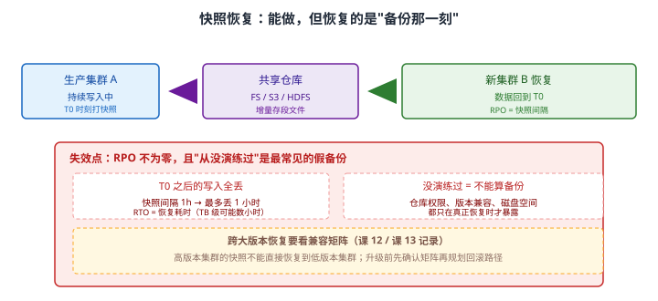
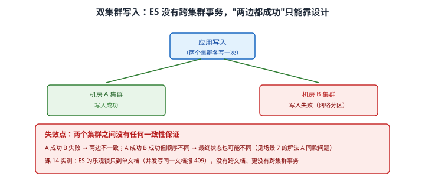

# 场景 11：跨机房容灾与数据恢复——机房挂了怎么办（规模压力题）

**场景描述**：ES 集群部署在单机房，要求跨机房容灾：**机房 A 整体故障时，机房 B 能顶上**。
还有个现实要求：**误删了索引，能不能找回来？**

**🔒 先自己想 30 秒**：先区分两件事——**"机房挂了要能顶上"**和**"误删了要能找回"**是同一个方案吗？它们对 RPO（最多丢多少数据）的要求一样吗？
再想一个更尖锐的问题：**你配了快照，就等于你有备份吗？** ——如果没有做过恢复演练，答案是什么？

<details><summary>💡 提示（分层 / 分维度想）</summary>

- **RPO / RTO**：机房切换允许丢多少数据？允许停多久？这两个数字决定方案档次。
- **"双写两个集群"听起来很美**：但 ES **有跨集群事务吗**？（课 14 实测过乐观锁的边界）
- **快照恢复的是"哪一刻"的数据**：T0 打的快照，T0 之后的写入还在吗？
- **演练**：仓库权限、版本兼容、磁盘空间——这些问题什么时候暴露？

</details>

<details><summary>📖 展开解法</summary>

### 解法一览（效果按题定制：RPO / 实施成本）

| 解法 | RPO（最多丢多少） / 成本 | 代价 | 适用边界 |
|------|----------------------|------|---------|
| **A · 单集群 + 副本 + 快照** | RPO：快照间隔（小时级）；成本：低 | 机房整体故障不可恢复 | 机房级风险可接受时 |
| **B · 跨机房快照恢复** | RPO：快照间隔；成本：中 | RTO 长（TB 级数小时）；需演练 | 能容忍小时级中断 |
| **C · 双集群双写** | RPO：**理论 0**；成本：高 | **ES 无跨集群事务**，一致性靠设计 | 要求极低 RTO 时 |
| **D · CCR 跨集群复制** | RPO：秒级；成本：高 | **需付费 license** | 有 license 时的标准方案 |

### 各解法详解

#### 解法 A · 单集群 + 副本 + 快照（基线）

**思路**：副本解决**节点级**故障，快照解决**误删除**与**数据损坏**。它解决不了机房级故障——这是它的边界，先说清楚。

```json
// 1. 注册快照仓库（需要先在 elasticsearch.yml 配 path.repo，并重启节点）
PUT _snapshot/my_backup
{
  "type": "fs",
  "settings": {
    "location": "D:/es-backup",
    "compress": true
  }
}
```

```json
// 2. 创建快照（默认增量：只存新增/变化的段文件）
PUT _snapshot/my_backup/snap_2026_09_20?wait_for_completion=true
{
  "indices": "orders,products",
  "ignore_unavailable": true,
  "include_global_state": false
}
```

```bash
# 3. 验证快照真的存在、真的可用（这一步常被跳过）
curl -s "localhost:9201/_snapshot/my_backup/snap_2026_09_20?verbose=false"
# → state: SUCCESS ｜ 看 indices / shards.successful / stats
```

> ⚠️ **`path.repo` 必须写在配置文件里并重启节点**：它不是动态设置，改配置属集群级变更，生产上请先确认再动。
> ⚠️ **副本数 0 不算容灾**：副本是节点级冗余，机房没了副本一起没。

#### 解法 B · 跨机房快照恢复

**思路**：把快照仓库放在**两边都能访问**的共享存储（S3 / HDFS / NAS），机房 A 挂了就在机房 B 的新集群上恢复。成本可控，代价是 **RTO 长**。



读图：生产集群在 T0 打快照 → 存入共享仓库 → 新集群从仓库恢复，**数据回到 T0，T0 之后的写入全丢**。红框标出两处失效点：RPO = 快照间隔（1 小时间隔就最多丢 1 小时）、**没演练过不能算备份**（仓库权限、版本兼容、磁盘空间只在真正恢复时才暴露）。黄框提醒跨大版本恢复要看兼容矩阵。

```json
// 1. 在机房 B 的新集群注册同一个仓库（location 指向同一份共享存储）
PUT _snapshot/my_backup
{ "type": "fs", "settings": { "location": "D:/es-backup" } }
```

```json
// 2. 恢复：注意 rename_pattern 避免覆盖现有索引
POST _snapshot/my_backup/snap_2026_09_20/_restore
{
  "indices": "orders",
  "rename_pattern": "orders",
  "rename_replacement": "orders_restored",
  "include_global_state": false
}
```

```bash
# 3. 恢复后必做的三件事：等分片分配完成 → 校验条数 → 校验关键字段汇总
curl -s "localhost:9201/_cat/health?v"                      # 等 green
curl -s "localhost:9201/orders_restored/_count"             # 条数对得上吗
curl -s "localhost:9201/orders_restored/_search" -H 'Content-Type: application/json' -d '
{ "size": 0, "aggs": { "total": { "sum": { "field": "amount" } } } }'
```

> 🔴 **没演练过的快照不能叫备份**：这是本场景最重要的一条。仓库权限、版本兼容、磁盘空间、**恢复后分片能否分配**——全都只在真正恢复时才暴露。**至少每季度做一次恢复演练，并把演练结果记下来。**
> ⚠️ **跨大版本恢复要看兼容矩阵**：高版本集群的快照**不能**直接恢复到低版本集群（课 12 / 课 13 记录）。**升级前先确认矩阵，再规划回滚路径**——否则升级就变成单向操作。
> ⚠️ **TB 级恢复可能数小时**：RTO 要按实测估，不能拍脑袋。

#### 解法 C · 双集群双写

**思路**：应用同时写两个机房的集群，机房 A 挂了直接切到 B。RPO 理论为 0、RTO 极短——**但 ES 不保证两边一致**。



读图：应用写两个集群，A 成功、B 失败（网络分区）→ 两边不一致。红框点出本质：**两个集群之间没有任何一致性保证**，且课 14 实测 ES 的乐观锁只到单文档（并发写同一文档报 409），没有跨文档、更没有跨集群事务。

```javascript
// 双写：B 失败进补偿队列（至少不一致是"暂时的"）
async function indexToBoth(doc) {
  await esA.index({ index: 'orders', id: doc.id, document: doc });
  try {
    await esB.index({ index: 'orders', id: doc.id, document: doc });
  } catch (e) {
    await retryQueue.push({ doc, target: 'B', error: e.message });   // 必须补偿
  }
}
```

> 🔴 **"双写 = 两边一致"是错觉**：它与[场景 7](场景-07-数据同步.md) 解法 A 的双写是**同款问题**——一边成功一边失败即不一致，且 ES 没有跨集群事务来兜底。
> ⚠️ **必须有补偿队列 + 定期对账**：否则不一致会永久化，且没人知道。
> ⚠️ **成本是真双倍**：两套集群、两套监控、双份写入开销。

#### 解法 D · CCR 跨集群复制

**思路**：ES 官方的跨集群复制——follower 索引主动从 leader 拉取变更，RPO 秒级，且顺序由 ES 保证（避免了双写的一致性问题）。**前提是 license 够**。

```json
// 1. 在 follower 集群配置远程集群（leader 的地址）
PUT _cluster/settings
{
  "persistent": {
    "cluster.remote.leader_cluster.seeds": ["leader-host:9300"]
  }
}
```

```json
// 2. 创建 follower 索引（⚠️ 需付费 license，本机 basic 无法执行）
PUT /orders_follower/_ccr/follow?wait_for_active_shards=1
{
  "remote_cluster": "leader_cluster",
  "leader_index": "orders"
}
```

> ⚠️ **CCR 需付费 license**：本机两集群均为 basic（课 13 实测确认），**无法实测**。写方案前先确认 license，否则是纸面方案。
> ⚠️ **follower 索引默认只读**：切换时要先暂停复制并提升为可写索引，这一步要写进切换 runbook。

### 替代路线（非 ES 技术栈）

| 替代方案 | 思路 | 与本课程解法的差异 |
|---------|------|------------------|
| **从真相源重建（MySQL / MQ 重放）** | 机房 B 是空集群，切过去后从数据源重灌 | 与本课定位一致（ES 是索引副本，课 14）；但重建耗时长，RTO 不如 CCR |
| **云厂商托管集群的多可用区** | 由平台承担跨 AZ 复制与故障切换 | 省掉 CCR 配置与运维；但成本与数据出口受平台约束 |
| **搜索引擎无关的双活（网关层切换）** | 网关按健康探测切换流量到备用集群 | 与解法 C 互补（C 解决数据，网关解决流量）；但网关自身要高可用 |

### 推荐路径（递进，不是一次全上）

1. **先把 RPO / RTO 写下来**：这两个数字决定方案档次——**没有数字就没有方案**。
2. **基线必做（解法 A）**：副本 ≥ 1 + 定期快照 + **每次快照后验证 state**。
3. **做一次恢复演练**（解法 B）：在测试集群恢复一次，记录耗时与踩坑。**没演练过不算有备份。**
4. **RTO 要求高 → CCR**（解法 D）：先确认 license，配置远程集群与 follower 索引，写切换 runbook。
5. **没 license 又要低 RTO → 双写 + 补偿 + 对账**（解法 C），并接受"可能短暂不一致"。
6. **别忘了误删除这条线**：快照是唯一手段，且**恢复后要校验条数与关键字段汇总值**。

### 知识点挂钩

- 快照与恢复、`path.repo`、SLM → 阶段 4 · [课 11 数据管道与备份](../stages/4-分布式与工程实践/lessons/lesson-11-数据管道与备份.md)
- 副本与集群健康、分片分配 → 阶段 4 · [课 10 集群健康与排障](../stages/4-分布式与工程实践/lessons/lesson-10-集群健康与排障.md)
- 无跨文档事务、乐观锁 409、ES 作为索引副本 → 阶段 5 · [课 14 该不该用 ES](../stages/5-生产与选型/lessons/lesson-14-该不该用ES.md)
- license 限制（CCR / DLS / semantic_text 同样受限）→ 阶段 5 · [课 13 三大主战场](../stages/5-生产与选型/lessons/lesson-13-三大主战场.md)
- 同步链路的一致性设计 → [场景 7](场景-07-数据同步.md)

### 什么情况下此方案不适用

- **副本解决不了机房级故障**：副本是节点级冗余，机房没了副本一起没。
- **快照恢复的是"备份那一刻"**：T0 之后的写入全丢，RPO = 快照间隔。
- **CCR 需付费 license**：本机两集群 basic，只能外部生成向量存 `dense_vector`（课 13 实测）。
- **跨大版本恢复要看兼容矩阵**：高版本快照不能直接恢复到低版本（课 12 / 课 13 记录）。

### 做错会踩的坑

- 配了快照就从没恢复过 → 真出事时才发现仓库权限/版本/空间有问题（本场景解法 B）。
- 以为双写两个集群就一致了 → ES 没有跨集群事务（本场景解法 C）。
- 把 CCR 写进方案却没 license → 环境跑不起来（本场景解法 D）。
- 升级前没查兼容矩阵 → 回滚路径实际不存在（本场景解法 B）。

</details>

---

➡️ **返回**：[场景解法库索引](INDEX.md) ｜ **上一场景**：[场景 10 自动补全](场景-10-自动补全.md)
