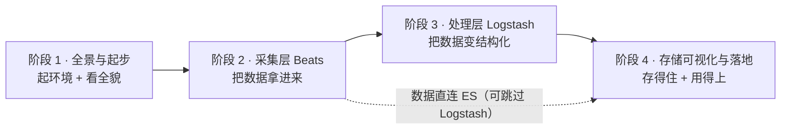

# ELK 系统学习 · 学习路径总览

> 本文件回答：这门课学什么、分几段、每段学完能干什么、段与段之间什么关系。
> 知识点级进度见 [00-学习档案.md](00-学习档案.md) ｜ 课程目录见 [02-课程目录.md](02-课程目录.md) ｜ 评审状态见 [00-评审清单.md](00-评审清单.md)

**规模**：4 阶段 / 12 课 / 36 知识点 ｜ 进度：**36 / 36 ✅ 全部完成**（+ 结课综合实战项目）｜ 版本基线 **Elastic Stack 9.5.3**

## 🎯 学习目标（四项全要）

| 目标 | 学完这条你能做到 |
|------|------------------|
| ① 理解原理 | 能从头到尾讲清一条日志怎么从应用 stdout 变成 Kibana 上的告警，说清每个组件在链路里干什么、不干什么 |
| ② 动手实操 | 能用 Docker Compose 从零起一套 ELK，配通采集、解析、存储、可视化，并亲手验证每一个环节 |
| ③ 生产落地与运维 | 能做容量估算、配置生命周期与冷热分层、设置告警、处理背压与重复投递，知道这套东西上线后哪里会先出问题 |
| ④ 决策参考 | 能回答"该不该上 ELK"，能在 Beats / Logstash / Fluent Bit / OTel 之间选型，知道什么时候该换方案、上到哪一步就够 |

## 📖 故事主线：一条日志的四幕旅程

| 要素 | 内容 |
|------|------|
| **主角** | 一条日志（从应用 stdout 一路走到 Kibana 告警） |
| **冲突** | 线上报警、5 台机器，工程师逐台 ssh 上去 `grep` —— **找不到、留不住、看不懂** |
| **转折** | 每个阶段解决一个"卡住"：看得见全貌 → 拿得到 → 看得懂 → 留得住、用得上 |
| **收束** | 一条从"日志产生"到"告警触发"的完整链路 + 一份「该不该上 ELK、上到哪一步」的决策清单 |

## 🗺️ 学习路径图

## 📊 阶段一览

| 阶段 | 故事章节 | 课次 | 知识点 | 本阶段回答的核心问题 | 状态 |
|------|---------|------|--------|---------------------|------|
| [1 · 全景与起步](stages/1-全景与起步/overview.md) | **看得见全貌** | 课 1-3 | 9 | 这套东西由什么组成？我怎么先让它跑起来，再亲眼看见数据流过去？ | ✅ 已完成（9/9 · 2026-09-06） |
| [2 · 采集层 Beats](stages/2-采集层Beats/overview.md) | **拿得到** | 课 4-6 | 9 | 日志凭什么能自动、不丢地搬进管道？多行堆栈为什么会被切碎？采集端该选谁？ | ✅ 已完成（9/9 · 2026-09-06） |
| [3 · 处理层 Logstash](stages/3-处理层Logstash/overview.md) | **看得懂** | 课 7-9 | 9 | 一坨原始文本怎么变成结构化字段？丢了怎么办？解析到底该放在哪一层做？ | ✅ 已完成（9/9 · 2026-09-07） |
| [4 · 存储可视化与落地](stages/4-存储可视化与落地/overview.md) | **留得住、用得上** | 课 10-12 | 9 | 日志怎么存才不撑爆磁盘？怎么在 Kibana 里变成图与告警？生产上这套东西值不值？ | ✅ 已完成（9/9 · 2026-09-10） |

## 🔗 阶段依赖关系

**依赖说明**：

- 阶段 1 是全部前置——环境不起来，后面所有实操都没地方跑
- 阶段 2 → 3 → 4 是数据流的自然顺序：**先采到，再解析，最后存与看**
- **虚线是一条真实存在的捷径**：Filebeat 可以绕过 Logstash 直连 ES。阶段 1 课 3 走的就是这条捷径（先跑通再谈复杂），阶段 3 再引入 Logstash 并回答"什么时候才真的需要它"

## 🧩 与 ES 主课的关系（重要）

本教程是 `elasticsearch/` 下的**子教程**。ES 主课（5 阶段 / 15 课 / 46 知识点）已讲过 **Ingest Pipeline / grok / Data Stream / ILM / 索引模板 / 别名 / RBAC / 快照** 等，本教程**不重复讲基础**：

| 重叠内容 | ES 主课出处 | 本教程的处理 |
|----------|-------------|--------------|
| Ingest Pipeline、grok | [课 11 数据管道与备份](../stages/4-分布式与工程实践/lessons/lesson-11-数据管道与备份.md) | 回指 + 只讲**日志场景的配法**与"该不该放这里"（课 7、课 9） |
| Data Stream、ILM、索引模板 | [课 13 三大主战场](../stages/5-生产与选型/lessons/lesson-13-三大主战场.md)、[课 15 索引管理与生命周期策略](../stages/4-分布式与工程实践/lessons/lesson-15-索引管理与生命周期策略.md) | 回指 + 只讲**日志场景的具体配法**与冷热分层（课 10） |
| 快照备份、RBAC | [课 11](../stages/4-分布式与工程实践/lessons/lesson-11-数据管道与备份.md)、[课 13](../stages/5-生产与选型/lessons/lesson-13-三大主战场.md) | 回指 + 只讲 ELK 视角增量（课 12） |
| 该不该用 ES（选型） | [课 14 该不该用 ES](../stages/5-生产与选型/lessons/lesson-14-该不该用ES.md) | 不重复；课 12 聚焦**"该不该上 ELK 这套栈"**（ES 之外的三个组件值不值） |

一句话：**ES 主课教你怎么用好 ES，本教程教你怎么把数据喂进 ES 并让人看得见。**

## 🔧 实操环境

| 项目 | 值 |
|------|-----|
| 操作系统 | macOS（arm64 / Apple 芯片） |
| 运行方式 | **Docker Compose 起全套容器**（ES + Kibana + Logstash + Filebeat + 按需 Metricbeat） |
| 版本基线 | Elastic Stack **9.5.3** |
| 前置动作 | **必须先启动 Docker Desktop**（本机 Docker 29.4.1，守护进程默认未运行） |
| 命令风格 | `docker compose ...` + zsh + 标准 `curl` + `grep` |

> ⚠️ **ES 主课档案里的全部 Windows 约束在本教程作废**：不用 `curl.exe`、不用 PowerShell 写法、不用 CMD 续行符 `^`。ES 主课那台机器上的索引与密码也**不在本机**，一律不可引用。

## 📚 官方文档

- [Elastic Stack 产品文档](https://www.elastic.co/docs) — 全组件文档入口
- [Filebeat 文档](https://www.elastic.co/docs/reference/beats/filebeat) — 采集端配置与模块
- [Logstash 文档](https://www.elastic.co/docs/reference/logstash) — 管道、插件、队列与调优
- [Kibana 文档](https://www.elastic.co/docs/explore-analyze/visualize) — Discover、Dashboard、告警
- [ECS（Elastic Common Schema）参考](https://www.elastic.co/docs/reference/ecs) — 字段命名规范
- [Elastic 版本发布说明](https://www.elastic.co/docs/release-notes) — 版本基线与变更
