# ELK 系统学习 · 课程手册

> **一句话定位**：这是 ELK 子教程的**汇总手册**——把 12 课 + 结课实战项目的骨架、结论、图和命令速查压到一处，供**通读一遍**或**干活时翻**。
> 正文（五幕叙事、逐条实测输出、类比推导）仍在各课原文里；本手册做的是**索引 + 结论 + 可执行动作**，不重复讲原理推导。

**规模**：4 阶段 / 12 课 / 36 知识点 + 结课综合实战项目 ｜ **版本基线**：Elastic Stack **9.5.3** ｜ **环境**：macOS arm64 + Docker Compose
**导航**：[学习路径总览](01-学习路径总览.md) ｜ [学习档案](00-学习档案.md) ｜ [课程目录](02-课程目录.md) ｜ [评审清单](00-评审清单.md)

---

## 📖 怎么用这本手册

| 你的状态 | 怎么读 |
|---------|--------|
| **第一次通读** | 从「一、学习目标」往下顺读「三～六」的阶段与课。每课先看图（一图收束），再看「三句话记住」，最后按需展开原文 |
| **干活时查命令** | 直接跳到对应课的「📋 命令速查卡」。**注意**：速查卡里的坑比命令本身值钱，别只看左列 |
| **出问题了要排查** | 本手册不管排障 → 去 [`09-排障速查手册.md`](09-排障速查手册.md)（按症状倒查，**先止血后定位**）✅ |
| **要设计新方案** | 本手册不管设计权衡 → 去 [`10-场景解法库.md`](10-场景解法库.md)（多解法 + 代价 + 递进路径）✅ |
| **想懂"为什么会踩坑"** | → 去 [`08-实战经验.md`](08-实战经验.md)（故障模式五段式 + 上线 Checklist）✅ |
| **想知道评审怎么过的** | → 去 [`收尾产物评审记录.md`](收尾产物评审记录.md)（B1-B8 + C1-C7 + 双视角）✅ |

> 📌 上面四份**均已交付**（Phase 5，2026-09-13）——本手册负责把「出问题该去哪、要设计该去哪」说清楚，具体动作与原理在那四份里。
> ⚠️ 手册里所有**数字**都来自真实运行，但**造数据脚本带随机性**（主机分布、日志级别、JSON/文本比例随机），你重跑时**具体数字会变、量级和结论不会变**。

---

## 一、学习目标（四项全要）

| 目标 | 学完这条你能做到 |
|------|------------------|
| ① **理解原理** | 能从头到尾讲清一条日志怎么从应用 stdout 变成 Kibana 上的告警，说清每个组件在链路里干什么、不干什么 |
| ② **动手实操** | 能用 Docker Compose 从零起一套 ELK，配通采集、解析、存储、可视化，并亲手验证每一个环节 |
| ③ **生产落地与运维** | 能做容量估算、配置生命周期与冷热分层、设置告警、处理背压与重复投递，知道这套东西上线后哪里会先出问题 |
| ④ **决策参考** | 能回答"该不该上 ELK"，能在 Beats / Logstash / Fluent Bit / OTel 之间选型，知道什么时候该换方案、上到哪一步就够 |

## 二、故事主线：一条日志的四幕旅程

| 要素 | 内容 |
|------|------|
| **主角** | 一条日志（从应用 stdout 一路走到 Kibana 告警） |
| **冲突** | 线上报警、5 台机器，工程师逐台 ssh 上去 `grep` —— **找不到、留不住、看不懂** |
| **转折** | 每个阶段解决一个"卡住"：看得见全貌 → 拿得到 → 看得懂 → 留得住、用得上 |
| **收束** | 一条从"日志产生"到"告警触发"的完整链路 + 一份「该不该上 ELK、上到哪一步」的决策清单 |

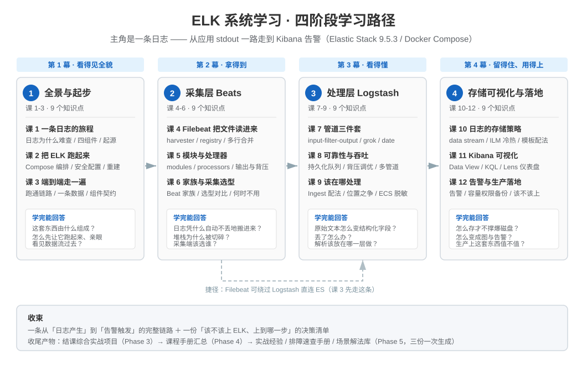

## 三、阶段总览（一页看全）

| 阶段 | 故事章节 | 课次 | 知识点 | 本阶段回答的核心问题 | 状态 |
|------|---------|------|--------|---------------------|------|
| [1 · 全景与起步](stages/1-全景与起步/overview.md) | **看得见全貌** | 课 1-3 | 9 | 这套东西由什么组成？我怎么先让它跑起来，再亲眼看见数据流过去？ | ✅ 已完成（2026-09-06） |
| [2 · 采集层 Beats](stages/2-采集层Beats/overview.md) | **拿得到** | 课 4-6 | 9 | 日志凭什么能自动、不丢地搬进管道？多行堆栈为什么会被切碎？采集端该选谁？ | ✅ 已完成（2026-09-06） |
| [3 · 处理层 Logstash](stages/3-处理层Logstash/overview.md) | **看得懂** | 课 7-9 | 9 | 一坨原始文本怎么变成结构化字段？丢了怎么办？解析到底该放在哪一层做？ | ✅ 已完成（2026-09-07） |
| [4 · 存储可视化与落地](stages/4-存储可视化与落地/overview.md) | **留得住、用得上** | 课 10-12 | 9 | 日志怎么存才不撑爆磁盘？怎么在 Kibana 里变成图与告警？生产上这套东西值不值？ | ✅ 已完成（2026-09-10） |
| [🎓 结课综合实战](projects/日志平台生产化/README.md) | **合奏** | 跨 4 阶段 | 36 个全覆盖 | 把散装知识点焊成一个能跑的真实系统 | ✅ 已完成（2026-09-10） |

**阶段依赖**：

- 阶段 1 是全部前置——环境不起来，后面所有实操都没地方跑
- 阶段 2 → 3 → 4 是数据流的自然顺序：**先采到，再解析，最后存与看**
- **虚线是一条真实存在的捷径**：Filebeat 可以绕过 Logstash 直连 ES。阶段 1 课 3 走的正是这条捷径（先跑通再谈复杂），阶段 3 再引入 Logstash 并回答"什么时候才真的需要它"

---

# 四、阶段 1：全景与起步 —— 看得见全貌

> **阶段目标**：在动手采集任何日志之前，先把四件事看明白——日志为什么难查、ELK 四件套各管什么、这套栈怎么在 mac 上起来、一条日志从产生到被搜到经历了什么。
> **本阶段只求"跑通 + 看得见全貌"**，不做解析、不做告警（那是阶段 2-4 的事）。
> 📄 [阶段概览](stages/1-全景与起步/overview.md) ｜ 🗺️ 阶段路径图 [stage-1-path.svg](stages/1-全景与起步/assets/stage-1-path.svg)

| 课 | 知识点 | 一句话掌握什么 |
|----|--------|----------------|
| 课1 | 1.1 日志为什么难查 | 分散 / 无统一格式 / 留存短 / 大文件全文检索慢 |
| 课1 | 1.2 ELK 四个组件各管什么 | Beats 采 · Logstash 可选地处理 · ES 存与搜 · Kibana 看 |
| 课1 | 1.3 ELK 的起源与生态位 | Logstash(2009)→Kibana(2013)→Beats(2015)→Elastic Stack；与 Splunk / 自研 / Loki 的站位 |
| 课2 | 2.1 Compose 编排四件套 | image / ports / volumes / environment + depends_on 与健康检查 + 服务名互访 |
| 课2 | 2.2 首次启动的安全配置 | elastic 超管密码 · kibana_system 密码 / enrollment token · 组件间 HTTPS 与证书 |
| 课2 | 2.3 容器环境怎么观测与重建 | `logs -f` / `exec` / `ps` / `down -v`；macOS 内存不足等启动失败怎么看 |
| 课3 | 3.1 最小链路亲手跑通 | 写日志文件 → Filebeat → 直连 ES → Data View → Discover 看到 |
| 课3 | 3.2 一条数据长什么样 | event 与 document · `@timestamp` / `message` / `host.*` / `agent.*` / `_source` |
| 课3 | 3.3 组件间的契约 | 索引名与索引模板 · 时间字段是命脉 · 字段类型冲突的后果 |

## 课 1：一条日志的旅程

> 📄 [原文](stages/1-全景与起步/lessons/lesson-01-一条日志的旅程.md) ｜ 本课**不起容器**，用本机真实日志做实测

**一图收束：四条硬伤 → 四个工位**

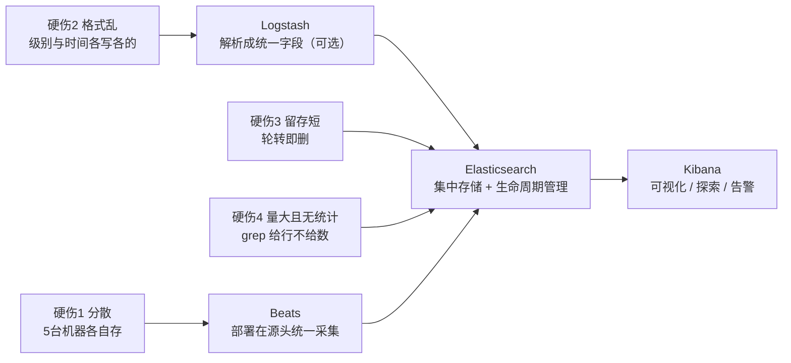

**三句话记住**

1. 日志的四条硬伤是**散、乱、短、多**——它们**同时成立**，所以任何只解决一条的办法都不够
2. ELK 是一条流水线：**Beats 拿进来 → Logstash 变好看（可选）→ ES 存起来还能秒查 → Kibana 让人看得见**
3. **Logstash 是可选的重活**，Filebeat 直连 ES 才是最常见的最小可用链路

**📊 实测数字（最有说服力的开场）**：本机近 1 小时系统日志 **2,766,622 条**，其中 error 级别 **138,249 条**；grep 一个词命中 **1,520,807 条、耗时 12.9 秒**——**给的是 152 万行，不是一个答案**。5 台 × 30 天外推约 **99.6 亿条**。

**🐞 常见误区**

1. **"ELK 必须四件套全上"** —— Logstash 可选。最小链路是 Filebeat → ES → Kibana
2. **"Beats 和 Logstash 是重复劳动"** —— 一个在源头轻采（CPU 花在业务机上），一个集中重处理（CPU 花在专用机器上）。**位置不同，代价就不同**
3. **"日志集中起来 = 挂个共享盘 / NFS 就行了"** —— 只解决了"分散"，格式、留存、检索、统计四条一条没解决
4. **"Kibana 负责搜索，ES 负责展示"** —— 说反了。ES 是检索引擎，Kibana 只是界面；**关掉 Kibana，数据一条不少**
5. **"日志量小就不用 ELK"** —— 量的增长是乘法：机器数 × 时间跨度 × 字段数一起涨。等"量大了"再上，往往已错过低成本迁移的窗口
6. **"grep 慢是磁盘不行，换 SSD 就好"** —— 瓶颈是"逐行扫全文"这个算法本身

**📋 命令速查卡**

| 命令 | 作用 | 坑 |
|------|------|-----|
| `find ~/Library/Logs -type f -name "*.log" \| wc -l` | 数本机有多少日志文件 | `find` 的权限报错属正常，加 `2>/dev/null` 静音 |
| `du -sh ~/Library/Logs /var/log` | 看两个日志目录各占多大 | macOS 的 `du` 默认不跨文件系统，别拿它当全盘统计 |
| `/usr/bin/log show --last 1h --style compact \| wc -l` | 看近 1 小时系统日志条数 | ⚠️ **必须写 `/usr/bin/log`**。直接写 `log` 会撞上 zsh 内置命令报 `too many arguments` |
| `/usr/bin/log show --last 1h --style compact --predicate 'messageType == "error"'` | 只看 error 级别 | `--predicate` 用的是 NSPredicate 语法，不是 SQL |
| `time (命令 \| grep -c "关键词")` | 测一次全文检索耗时 | zsh 里 `time` 对管道计时要用 `time ( ... )` 包起来 |
| `echo "2 * 3" \| bc` | 算数（本课用于量级外推） | macOS 自带 `bc`；Shell 里 `*` 必须被引号包住或转义 |

**📚 官方文档**：[Elastic Stack 产品文档](https://www.elastic.co/docs) ｜ [Filebeat](https://www.elastic.co/docs/reference/beats/filebeat) ｜ [Logstash](https://www.elastic.co/docs/reference/logstash) ｜ [Kibana](https://www.elastic.co/docs/reference/kibana) ｜ [Elastic 发布说明](https://www.elastic.co/docs/release-notes)

## 课 2：把 ELK 跑起来

> 📄 [原文](stages/1-全景与起步/lessons/lesson-02-把ELK跑起来.md) ｜ 配套工程：[`playground/01-minimal-stack/`](playground/01-minimal-stack/)

**一图收束：从一条命令到一个能用的栈**

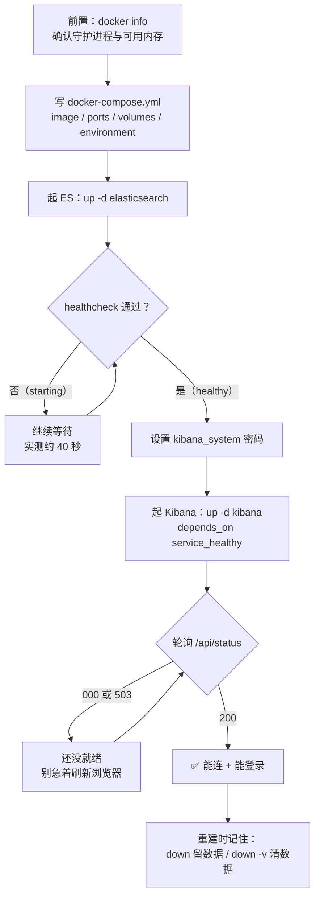

**三句话记住**

1. **`depends_on` 只保证"先启动"，`condition: service_healthy` 才保证"能用"** —— 而后者要靠 `healthcheck` 支撑
2. 9.x 的安全**默认开着**：`elastic` 是超管入口，Kibana 该用 `kibana_system` 专用账号，**TLS 学习环境可关、生产必须开**
3. **`down` 只删容器，`down -v` 连卷带数据一起删**（密码也会没，重建后要重设）

**拿到的"底图"**：ES `http://localhost:9200`（`elastic` / `ELKlearn2026`）｜ Kibana `http://localhost:5601` ｜ 数据卷 `01-minimal-stack_es-data`

**🐞 常见误区**

1. **"起个容器不就 `up -d` 一下"** —— 9.x 默认开安全，没配凭据就是 401；且"启动了"不等于"能用"（Kibana 要 20-30 秒才就绪）
2. **用 `latest` 标签** —— 某次重启后版本悄悄变了，四件套还可能版本不兼容。**版本钉死**
3. **以为 `depends_on` 能保证依赖就绪** —— 短语法只保证"先启动"
4. **在容器里用 `localhost` 访问其他服务** —— 容器的 localhost 是它自己，要用**服务名**
5. **`docker compose down` 后以为数据清了** —— 卷还在。真要清数据用 `down -v`
6. **`down -v` 重建后 Kibana 连不上，以为是网络故障** —— 其实是 `kibana_system` 密码被一起删了，重设即可
7. **让 Kibana 用 `elastic` 超管账号连 ES** —— 违反最小权限原则，应该用 `kibana_system`
8. **关了 `http.ssl` 就以为"安全关了"** —— 认证与授权都还在，只是传输不加密。本机无所谓，**跨网络必须开回来**

**📚 官方文档**：[Elasticsearch Docker 部署](https://www.elastic.co/docs/deploy-manage/deploy/self-managed/install-elasticsearch-with-docker) ｜ [Kibana Docker 部署](https://www.elastic.co/docs/deploy-manage/deploy/self-managed/install-kibana-with-docker)

## 课 3：端到端走一遍（阶段 1 收官）

> 📄 [原文](stages/1-全景与起步/lessons/lesson-03-端到端走一遍.md) ｜ 配套工程：[`playground/02-end-to-end/`](playground/02-end-to-end/)

**一图收束：阶段 1 全景**

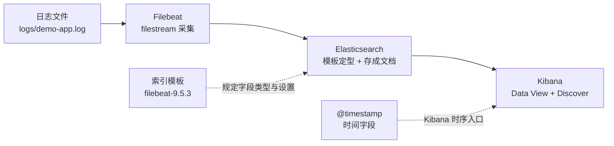

**三句话记住阶段 1**

1. **日志难在"散、乱、短、多"**，而 ELK 用一条流水线逐个击破：Beats 拿进来、Logstash 变好看（可选）、ES 存起来能秒查、Kibana 让人看见
2. **`@timestamp` 默认记的是采集时间，不是事件时间**——这个偏差会在回溯历史日志时咬你一口（实测差 **1 小时 6 分**）
3. 组件之间靠**索引名 → 索引模板 → 时间字段**这套契约衔接；**先跑通最短链路，再加复杂度**

**✅ 阶段 1 完成度自检**

| 课 | 你现在应该能做到 | ✅ |
|----|-----------------|-----|
| 课 1 | 说清日志为什么难查、ELK 四件套各管什么、它从哪来 | ☐ |
| 课 2 | 用 Compose 起起 ES + Kibana、搞定安全配置、会观测与重建 | ☐ |
| 课 3 | 跑通 Filebeat → ES → Kibana，读懂一条文档，说清组件契约 | ☐ |

**🐞 常见误区**

1. **"不上 Logstash 跑不通"** —— Filebeat 直连 ES 就是最小可用链路
2. **"我先自定义个好记的索引名"** —— 9.5.3 下会触发 data stream 创建，模板对不上就 `no matching index template found for data stream [xxx]`，整条链路起不来
3. **"Kibana 搜不到就是采集坏了"** —— 八成是 **Data View / 时间字段 / 索引模板**没对上，先查这三项
4. **把 `@timestamp` 当成事件发生时间** —— 它默认是**采集时间**
5. **以为 `message` 已经解析好了** —— 它还是完整一行文本，解析是阶段 3 的活
6. **以为类型冲突会"自动兼容"** —— 要么整条拒收（400），要么**静默算错**（更危险）
7. **看到 yellow 就慌** —— 单节点 + 1 副本必然 yellow，**数据一条不少**，只是没有冗余

**📋 命令速查卡**

| 命令 | 作用 | 坑 |
|------|------|-----|
| `docker compose up -d elasticsearch` | 只起 ES（分步起便于观察依赖） | 新目录 = 新卷 = 空 ES，**kibana_system 密码要重设** |
| `docker compose logs --tail=30 filebeat` | 看 Filebeat 日志（排障第一现场） | 输出是 JSON，用 `grep -o '"message":"[^"]*'` 抽 message 更好读 |
| `curl -u elastic:<密码> "_cat/indices?v"` | 看索引是否生成、文档数 | `docs.count` 是**查询时刻的快照**，不是实时值 |
| `curl -u elastic:<密码> "<data-stream>/_count"` | 数文档 | data stream 名（`filebeat-9.5.3`）≠ 后备索引名（`.ds-filebeat-9.5.3-...`），两者都能查 |
| `curl -u elastic:<密码> "_index_template/filebeat-9.5.3?pretty"` | 看 Filebeat 装的模板 | 模板是**启动时**加载的，改配置要重启 Filebeat |
| `curl ... -X POST "localhost:5601/api/data_views/data_view" -H 'kbn-xsrf: true' -d '...'` | 建 Data View | **`kbn-xsrf: true` 写操作必须带**；`title` 填 data stream 名 |
| `echo '...' >> logs/demo-app.log` | 追加日志（验证实时采集） | 用 `>>` 追加，别用 `>` 覆盖 |

**📚 官方文档**：[Filebeat 参考](https://www.elastic.co/docs/reference/beats/filebeat) ｜ [Filebeat 导出字段](https://www.elastic.co/docs/reference/beats/filebeat/exported-fields) ｜ 回指 ES 主课 5《映射》与 15《索引管理与生命周期策略》

---

# 五、阶段 2：采集层 Beats —— 拿得到

> **阶段目标**：用 Beats 家族（主力 Filebeat）把散落在各台机器、各条文件里的日志，**自动、断点续传地搬进统一管道**，从此告别手工翻日志。
> 📄 [阶段概览](stages/2-采集层Beats/overview.md) ｜ 🗺️ 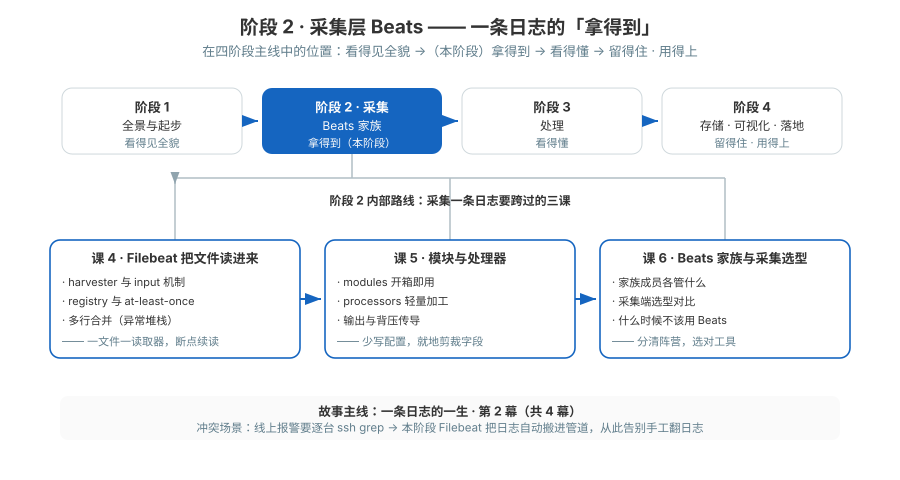

| 课 | 知识点 | 一句话 |
|----|--------|--------|
| 课4 | harvester 与 input 机制 | 一个文件一个读取器，新版用 `filestream` 替代老 `log` |
| 课4 | registry 与 at-least-once | 记下读到哪，重启续读，可能重复、极少漏 |
| 课4 | 多行合并 | 用 `pattern`/`negate`/`match` 把异常堆栈拼回一条 |
| 课5 | modules 开箱即用 | nginx/mysql/system 一键采集，自带解析与看板 |
| 课5 | processors 轻量加工 | 就地增删字段、dissect 拆分、rename，带 `when` 条件 |
| 课5 | 输出与背压 | 直连 ES 还是走 Logstash，bulk 批量与失败重试、背压传导 |
| 课6 | 家族成员各管什么 | Metricbeat/Packetbeat/Heartbeat/Auditbeat/Winlogbeat |
| 课6 | 采集端选型对比 | Beats vs Logstash vs Fluentd vs OTel Collector |
| 课6 | 什么时候不该用 Beats | 容器/K8s、应用直连 SDK、海量日志的取舍 |

## 课 4：Filebeat 把文件读进来

> 📄 [原文](stages/2-采集层Beats/lessons/lesson-04-Filebeat把文件读进来.md) ｜ 配套工程：[`playground/03-filebeat-internals/`](playground/03-filebeat-internals/)

**一图收束：Filebeat 读文件的完整机制**

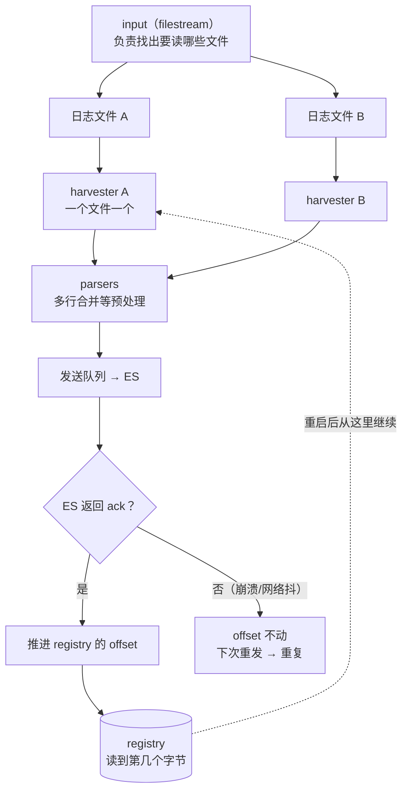

**三句话记住**

1. **input 找文件、harvester 读文件**（一个文件一个）；9.x 用 `filestream`，靠 **fingerprint** 认文件
2. **registry 记 offset，ack 之后才推进** → 所以是 **at-least-once：可能重复，绝不丢失**
3. 多行合并一句话：**"不是以时间戳开头的行，拼到上一条后面"**（`negate: true` + `match: after`）

**📊 实测数字**：registry 实测 offset **303** / **588**，key 形如 `filestream::demo-app::fingerprint::<hash>`（**证明 9.x 用指纹而非 inode 标识文件**）；多行合并决定性对照——同结构 9 行堆栈，**未配 = 9 条、配了 = 1 条**。

**🐞 常见误区**

1. **以为 Filebeat 一启动就把整份旧日志全灌进来** —— 有 registry 就只从上次的位置继续；**新文件**才会从头读
2. **混用 `log` 与 `filestream` 的配置写法** —— 多行配置位置完全不同，照抄老教程必错
3. **把"可能重复"当成丢数据，反过来追求 exactly-once** —— 日志场景下"至少一次 + 下游幂等"远比 exactly-once 划算
4. **`negate` / `match` 配反** —— 记住 `negate: true` + `match: after`
5. **把 registry 当临时文件** —— 它是**状态**，容器删了就没了；生产上必须挂卷持久化（⚠️ 这条在结课实战里真的咬人了，见「十、综合实战项目」的坑 4）
6. **用 `close.reader.on_eof: true` 省资源** —— 正在写入时读到末尾就关，容易出问题

**📚 官方文档**：[Filebeat filestream input](https://www.elastic.co/docs/reference/beats/filebeat/filebeat-input-filestream) ｜ [Filebeat 如何保证 at-least-once](https://www.elastic.co/docs/reference/beats/filebeat/how-filebeat-works) ｜ [Filebeat 多行消息处理](https://www.elastic.co/docs/reference/beats/filebeat/multiline-examples)

## 课 5：模块与处理器

> 📄 [原文](stages/2-采集层Beats/lessons/lesson-05-模块与处理器.md) ｜ 配套工程：[`playground/04-modules-processors/`](playground/04-modules-processors/)

**一图收束：采集端的三个抓手**

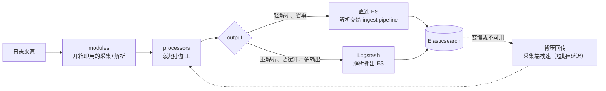

**三句话记住**

1. **modules 是"采集 + 解析管道 + 看板"的打包**，启用就是改文件名；它连**事件时间**都帮你从日志里解析出来
2. **processors 是采集端的就地小加工**，顺序敏感、条件依赖字段是否存在，**别在采集端干重活**
3. **背压是压力反向传回采集端让它减速**——短期表现为延迟，**长期故障 + 文件轮转**才会真丢数据

**📊 实测数字**：启用 nginx 模块后 ES 自动出现 `filebeat-9.5.3-nginx-access-pipeline`（30 个处理器）；`@timestamp` 被模块解析为**事件真实时间**（`08:30:01Z` = 北京 `16:30:01`），**正面解决课 3 遗留的偏差**；ES 停机期间写入的 orderId=30011 恢复后完整送达，**文档 10 → 13 一条不丢**。

**🐞 常见误区**

1. **把 modules 当成"只能整开整关"** —— 它就是普通 YAML，`var.paths`、单个 fileset 的 `enabled` 都能改
2. **processors 与 ingest pipeline 混为一谈** —— 一个在采集端（Filebeat 进程里），一个在 ES 端（写入前）；**CPU 开销归属不同**
3. **processor 顺序乱写 / `when` 条件依赖了不存在的字段** —— 静默失效，最难查的一类问题（**模块解析后 `message` 会消失、改存 `event.original`**，就是典型触发场景）
4. **直连 ES 与走 Logstash 选错** —— 不是"能不能解析"的问题，而是"**解析的开销算在谁头上**"
5. **不配 `filebeat.config.modules.path` 就用 modules 命令** —— 直接报 `modules management requires ...`
6. **以为背压会丢数据** —— 短期是延迟；真正会丢的是长期故障遇上文件轮转清理
7. **ES 恢复后立刻查不到数据就以为丢了** —— 队列还在排空，给它一点时间

**📋 命令速查卡**

| 命令 | 作用 | 坑 |
|------|------|-----|
| `docker compose exec filebeat filebeat modules list` | 看已启用/禁用模块 | ⚠️ 必须先配 `filebeat.config.modules.path`，否则报错 |
| `docker compose exec filebeat filebeat modules enable nginx` | 启用模块（改文件名） | 需要 `modules.d` 目录**可写**，只读挂载会失败 |
| `docker compose exec filebeat filebeat test config` | 校验配置（含 processors） | 只查语法，查不出"顺序错"这类逻辑问题 |

**📚 官方文档**：[Filebeat modules](https://www.elastic.co/docs/reference/beats/filebeat/filebeat-modules) ｜ [定义 processors](https://www.elastic.co/docs/reference/beats/filebeat/defining-processors) ｜ [Elasticsearch output](https://www.elastic.co/docs/reference/beats/filebeat/elasticsearch-output)

## 课 6：Beats 家族与采集选型（阶段 2 收官）

> 📄 [原文](stages/2-采集层Beats/lessons/lesson-06-Beats家族与采集选型.md) ｜ 配套工程：[`playground/05-beats-family/`](playground/05-beats-family/)

**一图收束：阶段 2 全貌**

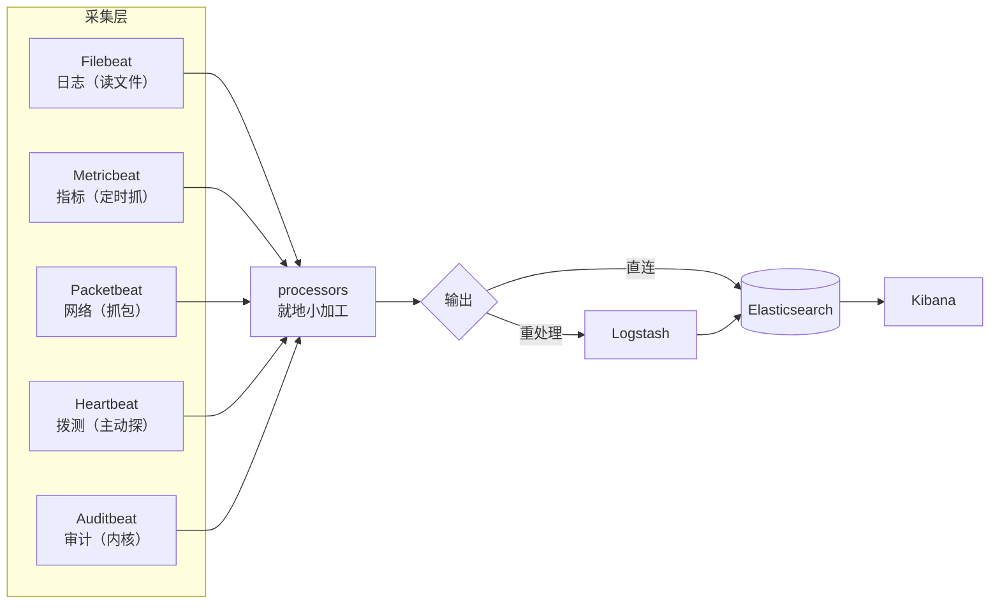

**阶段 2 三句话总结（"拿得到"这一幕）**

1. **Filebeat 负责把文件读出来**：input 找文件、harvester 读文件、registry 记位置，语义是 **at-least-once（可能重复、绝不丢失）**
2. **modules 开箱即用、processors 就地小加工**：模块替你写好解析管道（连事件时间都帮你解析），processors 负责打标记、丢字段、加条件
3. **家族各司其职、选型看场景**：一个 Beat 管一类数据；**离开"本机 + 常驻 + 单一数据类型"这三个前提，就该考虑别家**

**✅ 阶段 2 完成度自检**

| 课 | 你现在应该能做到 | ✅ |
|----|-----------------|-----|
| 课 4 | 说清 input/harvester、registry 与 at-least-once、多行合并 | ☐ |
| 课 5 | 用 modules 接入常见来源、用 processors 加工、理解背压 | ☐ |
| 课 6 | 分清家族成员分工、能在四条路线间选型、知道何时不该用 Beats | ☐ |

**🐞 常见误区**

1. **以为 Filebeat 能采 CPU/内存** —— 它是读文件的；指标归 Metricbeat
2. **把 `system.cpu.total.pct` 当 CPU 使用率** —— 多核机器上是**按核累加**，要用 `norm.pct` 或除以 `cores`（实测 `cores=11` × `norm 0.0166` = `pct 0.1827`，验算吻合）
3. **以为指标数据量稳定** —— 它是**周期驱动**，没业务也会持续写入
4. **以为 Beats 各装各的、配置完全不同** —— 共享 libbeat，输出与模块机制基本一致
5. **以为"选一个采集端就要全部替换"** —— 按数据类型分工是常态，禁忌是**同一份数据被两套工具重复采集**
6. **明知场景不合适还硬套 Beats** —— 容器/K8s、应用内链路、已有 OTel、极端轻量、一次性搬运，这五类优先考虑别家
7. **看到索引 yellow 就以为数据有问题** —— 只反映副本能否放下；单节点 + 副本 1 必然 yellow

**📚 官方文档**：[Metricbeat 参考](https://www.elastic.co/docs/reference/beats/metricbeat) ｜ [Beats 总览](https://www.elastic.co/docs/reference/beats)

---

# 六、阶段 3：处理层 Logstash —— 看得懂

> **阶段目标**：主角已被 Beats 从源头"拿得到"（阶段 2），但它还只是**一串没结构的文本**。本阶段做第三件事：**让它"看得懂"**。
> 📄 [阶段概览](stages/3-处理层Logstash/overview.md) ｜ 🗺️ 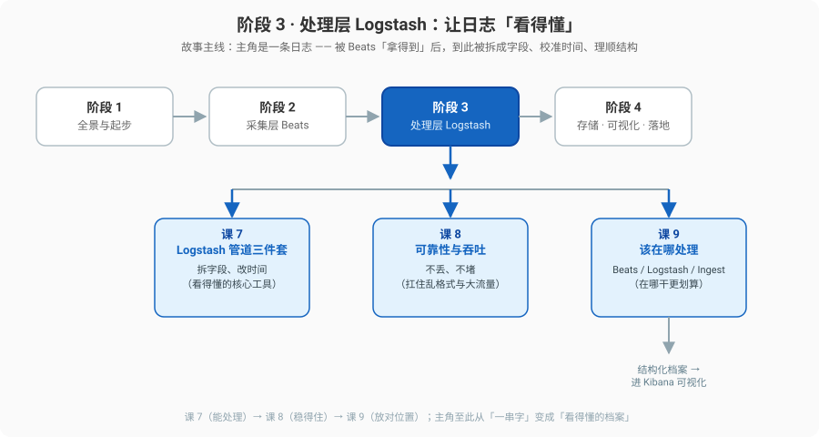

| 课 | 知识点 | 一句话 | 回指/增量 |
|----|--------|--------|-----------|
| 课7 | 7.1 管道结构与事件模型 | input / filter / output 三段 + event 是什么 | 全新 |
| 课7 | 7.2 grok 解析 | 把日志行拆字段、失败打 `_grokparsefailure` | ⚠️ 增量（grok 基础见 ES 主课 11） |
| 课7 | 7.3 date 与 mutate | 用日志时间覆盖 `@timestamp`、类型转换与改名删字段 | 全新 |
| 课8 | 8.1 持久化队列与 at-least-once | `queue.type: persisted` 让日志落地不丢 | 全新 |
| 课8 | 8.2 背压与吞吐调优 | 批次大小 / workers / JVM 堆怎么配 | 全新 |
| 课8 | 8.3 多管道与隔离 | `pipelines.yml` 拆管道、队列隔离 | 全新 |
| 课9 | 9.1 Ingest Pipeline 日志场景配法 | 复用 Filebeat 自带 pipeline、`_simulate` 调试 | ⚠️ 增量（基础见 ES 主课 11） |
| 课9 | 9.2 位置之争决策表 | Beats / Logstash / ES Ingest 三处取舍一张表 | 全新（决策） |
| 课9 | 9.3 ECS 字段规范与脱敏 | 字段为什么要叫 `host.name`、敏感字段怎么处理 | 全新 |

**💡 本阶段的核心认知（先种下，正文展开）**

- **Logstash 的 event 是一个"口袋里装满了字段"的信封**，filter 只是不断往信封里塞拆好的字段、或抽走不要的字段
- **grok 是"正则 + 现成词典"**：基础语法 ES 主课 11 讲过，这里增量在"一整条日志管道怎么配 + 失败怎么兜底"
- **日志时间 ≠ 接收时间**：`@timestamp` 必须被日志里的真实时间覆盖，否则按时间聚合全错位
- **持久化队列是"落地担保"**：它让 Logstash 在崩溃/重启后能续传，代价是多一次磁盘写
- **处理是 CPU 重活，放哪都行，但代价不同**：Beats 不占资源但能力弱、Logstash 强但吃 JVM、Ingest 在 ES 内部但挤占检索资源——课 9 给决策表
- **ECS 是一套"字段命名公共协议"**：大家都叫 `host.name` 而不是 `ip_addr`，日志才能真正跨组件、跨产品联动，也才好统一脱敏

## 课 7：Logstash 管道三件套

> 📄 [原文](stages/3-处理层Logstash/lessons/lesson-07-Logstash管道三件套.md) ｜ 配套工程：[`playground/06-logstash-pipeline/`](playground/06-logstash-pipeline/)

**一图收束：完整管道**

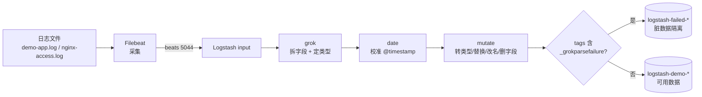

**三句话记住**

1. **input 进、filter 加工、output 出**，event 在中间流；**改配置前先 `--config.test_and_exit`**
2. **grok 是填空题模板**：内置模式给标准格式、多模式依次尝试给自家格式；**`:int`/`:float` 才有正确类型**；失败打 `_grokparsefailure` 供你分流
3. **`date` 校准时间、`mutate` 加工字段**；⚠️ **9.x 的 ECS 模式会重命名内置模式的字段**（`clientip` → `source.address`），引用旧名静默失效

**📊 实测数字**：`_grokparsefailure` 分流实证（`logstash-demo` 8 条 / `logstash-failed` 1 条）；date 校准 `17:45:01+0800` → `09:45:01Z`。**本课最重大发现**：`%{COMMONAPACHELOG}` 在 ECS 模式下输出的**不是**老教程里的字段名——`clientip`→`source.address`、`verb`→`http.request.method`、`request`→`url.original`、`httpversion`→`http.version`、`response`→`http.response.status_code`、`bytes`→`http.response.body.bytes`。作者的 `convert => { "bytes" => "integer" }` 因此成了**空操作**（不报错也不生效）。

**🐞 常见误区**

| # | 误区 | 正确认知 |
|---|------|---------|
| 1 | 三段都以为是"改数据的" | **只有 filter 是加工主力**，input 管进、output 管出 |
| 2 | `@timestamp` 就是事件发生时间 | 默认是 **Logstash 接收时间**，必须用 `date` 覆盖 |
| 3 | 拿 ES Ingest 的 `on_failure` 思维硬套 Logstash | Logstash 靠 **`_grokparsefailure` 标签 + 条件分支分流** |
| 4 | 改完配置直接重启 | 先 **`--config.test_and_exit`**（Logstash 启动要 1–2 分钟） |
| 5 | **照抄老教程的 grok 字段名** | 9.x ECS 模式下字段被改名，**引用旧名静默失效** |
| 6 | grok 捕获不加类型 | 全变字符串，后面的数值聚合直接失败 |
| 7 | 以为 grok 匹配不上会报错 | 只打标签不报错，得自己检查 `tags` |
| 8 | 时区随便填 | `timezone` 是"**日志里那个时间的时区**"，不是服务器时区 |

**📋 命令速查卡**

| 命令 | 作用 | 坑 |
|------|------|-----|
| `docker compose run --rm --no-deps logstash logstash -f <配置> --config.test_and_exit` | 校验配置语法 | `--no-deps` 避免拉起依赖；看到 `Configuration OK` 才算过 |
| `docker compose logs logstash \| grep "Pipeline started"` | 确认管道起来了 | Logstash 启动慢（JVM），别以为卡住了 |
| `docker compose logs logstash \| grep -A 25 "<关键字>"` | 看某条日志的**完整 event**（rubydebug） | 需要 output 里有 `stdout { codec => rubydebug }` |
| `docker compose restart logstash` | 改完配置后重启 | 重启要 1–2 分钟；旧数据不会重发（Filebeat registry 记着位置） |
| `curl -u elastic:<密码> "_cat/indices?v"` | 看分流出了哪些索引 | 本课会看到 `logstash-demo-*` 与 `logstash-failed-*` |
| `curl ... '{"query":{"exists":{"field":"source.address"}}}'` | 验证某字段是否存在 | ⚠️ 查不到先怀疑**字段名被 ECS 重命名了** |

**📚 官方文档**：[Logstash 参考](https://www.elastic.co/docs/reference/logstash) ｜ [Beats input 插件](https://www.elastic.co/docs/reference/logstash/plugins/plugins-inputs-beats) ｜ [Grok filter](https://www.elastic.co/docs/reference/logstash/plugins/plugins-filters-grok) ｜ [Date filter](https://www.elastic.co/docs/reference/logstash/plugins/plugins-filters-date) ｜ [Mutate filter](https://www.elastic.co/docs/reference/logstash/plugins/plugins-filters-mutate)

## 课 8：可靠性与吞吐

> 📄 [原文](stages/3-处理层Logstash/lessons/lesson-08-可靠性与吞吐.md) ｜ 配套工程：[`playground/07-reliability/`](playground/07-reliability/)

**一图收束：一条"可靠的管道"**

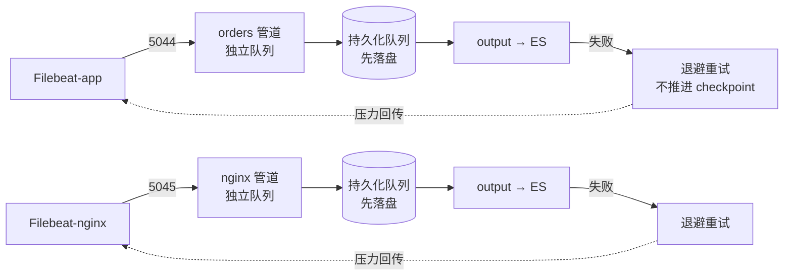

**三句话记住**

1. **`queue.type: persisted` 让事件先落盘**，ack 之后才推进 checkpoint → 至少一次、可能重复、绝不丢失
2. **背压是压力反向传导**：ES 慢了 → Logstash 队列积压 → Filebeat 减速，症状是"延迟变大"而非"报错"
3. **多管道 = 各自独立的队列**，拆的动机是故障隔离，不是提速

**📊 决定性实验**：停 ES + 写 2 条新日志 + **重启 Logstash**（内存队列到这里就丢了）+ 恢复 ES → `orderId=60010`/`60011` 均 `count:1`、订单索引 **3 → 5 一条不丢**。

**🐞 常见误区**

| # | 误区 | 正确认知 |
|---|------|---------|
| 1 | 持久化队列 = exactly-once | 仍是 at-least-once，可能重复不会丢 |
| 2 | 默认内存队列重启后还在 | 默认 `memory`，进程崩了事件即丢 |
| 3 | output 慢就猛加 batch.size / workers | 可能徒增内存与 GC，先判断瓶颈在哪 |
| 4 | 一个 Logstash 只能跑一条管道 | `pipelines.yml` 可拆多条并隔离队列 |
| 5 | 把 `queue.type` 写进 pipeline 的 `.conf` | 它是全局设置，只能写 logstash.yml 或环境变量 |
| 6 | 只读挂载 `logstash.yml` | Logstash 启动会写回，直接 `Read-only file system` |
| 7 | 以为背压会立刻丢数据 | 短期是延迟；**长期故障 + 队列写满磁盘**才真丢 |

**📋 命令速查卡**

| 命令 | 作用 | 坑 |
|------|------|-----|
| `docker compose up -d logstash` | 起 Logstash | ⚠️ 不要只读挂载 `logstash.yml`，全局参数用环境变量 |
| `curl -s "localhost:9600/_node/stats"` | 看队列类型 / 事件计数 / 吞吐 | 字段是 JSON，用 `python3 -c` 解析更清晰 |
| `docker compose logs --tail=20 logstash` | 看 output 重试日志 | 失败重试里 `will_retry_in_seconds` 是**指数退避**的信号 |
| `docker compose stop elasticsearch` | 模拟下游故障 | 观察 Logstash 退避重试 + 队列积压 |
| `docker compose restart logstash` | 重启 Logstash | **验证持久化队列的关键步骤**；内存队列这一步就丢了 |
| `curl -u elastic:<密码> ".../ls-orders-*/_count" -d '{"query":{...}}'` | 核查某条数据是否送达 | 恢复后要**等一会儿**，事件在队列里排队刷出 |

**📚 官方文档**：[持久化队列](https://www.elastic.co/docs/reference/logstash/persistent-queues) ｜ [Logstash 性能调优](https://www.elastic.co/docs/reference/logstash/tuning-logstash) ｜ [监控 Logstash](https://www.elastic.co/docs/reference/logstash/monitoring-logstash) ｜ [多管道](https://www.elastic.co/docs/reference/logstash/multiple-pipelines)

## 课 9：该在哪处理（阶段 3 收官）

> 📄 [原文](stages/3-处理层Logstash/lessons/lesson-09-该在哪处理.md) ｜ 配套工程：[`playground/08-where-to-process/`](playground/08-where-to-process/)
> ⚠️ 本课含**脱敏实操**（银行卡号 / 密码 / IP 的掩码与指纹），故手册不复制其「常见误区」与「命令速查卡」全文——**请直接查原课**（该两节位于原文末尾）。

**阶段 3 在整条链路中的位置**

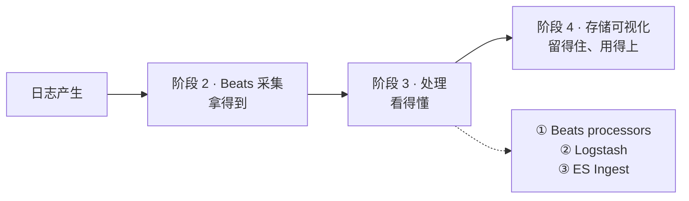

**阶段 3 全貌：主角现在是什么样**

| 课 | 主角的变化 |
|----|-----------|
| 课 7 | 在 Logstash 里被 grok/date/mutate **拆成结构化档案** |
| 课 8 | 有了持久化队列和独立管道，**断电不丢、高峰不堵、互不拖累** |
| **课 9** | **字段名符合 ECS 公共协议、敏感信息被拦下**，并知道"这段加工放哪最划算" |

> **阶段 3 的一句话总结**：处理层的全部工作，就是回答三个问题——**怎么拆（课 7）、怎么保证不丢不堵（课 8）、在哪拆最划算（课 9）。**

**📊 实测数字（决策表的硬证据）**：`GET _nodes/stats/ingest` → `filebeat-9.5.3-nginx-access-pipeline: count=4, time_in_millis=98`，其中 **date 31ms + geoip 21ms 是大头**——4 条日志吃掉 ES 节点 98ms，约 **25ms/条**。另有决定性对照：common 格式 grok **失败**（19 字段）vs combined 格式**成功**（39 字段，且 `@timestamp` 由入库时间变为事件时间）。

**⚠️ 三个真实踩坑（重要）**

1. **ES Ingest 没有 `hash` 处理器** —— 报 `No processor type exists with name [hash]`；正确做法是用 **`fingerprint`** 处理器（脱敏场景实测用它做稳定指纹，同一 IP 得到相同 hash、不同 IP 不同）
2. **也没有 `comment` 处理器** —— pipeline 里不能写注释
3. **grok `%{DATA}` 非贪婪**导致行尾字段解析为空 → 改 `%{NOTSPACE}` 修复

**📚 官方文档**：[Ingest pipelines](https://www.elastic.co/guide/en/elasticsearch/reference/current/ingest.html) ｜ [Simulate pipeline API](https://www.elastic.co/guide/en/elasticsearch/reference/current/simulate-pipeline-api.html) ｜ [Filebeat modules](https://www.elastic.co/guide/en/beats/filebeat/current/filebeat-modules.html) ｜ [Configure Filebeat ingest node](https://www.elastic.co/guide/en/beats/filebeat/current/configuring-ingest-node.html) ｜ [Elastic Common Schema (ECS) Reference](https://www.elastic.co/guide/en/ecs/current/index.html) ｜ [Fingerprint processor](https://www.elastic.co/guide/en/elasticsearch/reference/current/fingerprint-processor.html)

---

# 七、阶段 4：存储 · 可视化 · 落地 —— 留得住 · 用得上

> **阶段目标**：采到手、读得懂的日志，怎么才「留得住、用得上」，并在出事时主动叫醒你？这是整条故事线的最后一幕，也是整个 ELK 教程的**收束**。
> 📄 [阶段概览](stages/4-存储可视化与落地/overview.md) ｜ 🗺️ 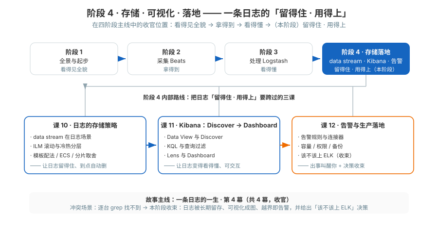

| 课 | 知识点 | 一句话掌握什么 | 回指 / 增量 |
|----|--------|----------------|------------|
| 课10 | 10.1 data stream 在日志场景 | Filebeat 默认就写 data stream；命名 `logs-<dataset>-<namespace>`；后备索引与写入别名自动管理 | ⚠️ 增量（基础见 ES 主课 13/15） |
| 课10 | 10.2 ILM 滚动与冷热 | rollover 触发条件（容量 / 年龄）；hot→warm→cold→frozen→delete；data tier 与 tier_preference | ⚠️ 增量（基础见 ES 主课 15） |
| 课10 | 10.3 模板在日志场景的配法 | component template 拆 settings/mappings；ECS 字段映射；日志场景分片与副本取舍 | ⚠️ 增量（基础见 ES 主课 15） |
| 课11 | 11.1 Data View 与 Discover | 建 data view（索引模式 + 时间字段）；时间选择器；字段列与 `_source`；文档展开；直方图 | 全新（Kibana） |
| 课11 | 11.2 KQL 与查询过滤 | KQL vs Lucene；常用操作符；过滤器钉住与排除；保存的查询 | 全新（Kibana） |
| 课11 | 11.3 Lens 与 Dashboard | 可视化类型怎么选；拆分维度与下钻；仪表盘拼装与分享 | 全新（Kibana） |
| 课12 | 12.1 告警规则与连接器 | 规则类型（ES query / 阈值）；Connector（webhook/邮件/Slack）；静默与恢复；避免告警风暴 | 全新 |
| 课12 | 12.2 容量、权限与备份 | 容量估算（日均 × 保留 × 副本 × 膨胀）；Kibana Space 与 RBAC；快照备份 | ⚠️ 增量（RBAC 见 ES 主课 13，快照见 ES 主课 11） |
| 课12 | 12.3 该不该上 ELK | 替代方案对比（Loki/ClickHouse/Splunk/云日志/自研）；决策清单；全课知识体系收束 | 决策 + 收束 |

## 课 10：日志的存储策略

> 📄 [原文](stages/4-存储可视化与落地/lessons/lesson-10-日志的存储策略.md) ｜ 配套工程：[`playground/09-storage-strategy/`](playground/09-storage-strategy/)

**一图收束：一条日志的"住房一生"**

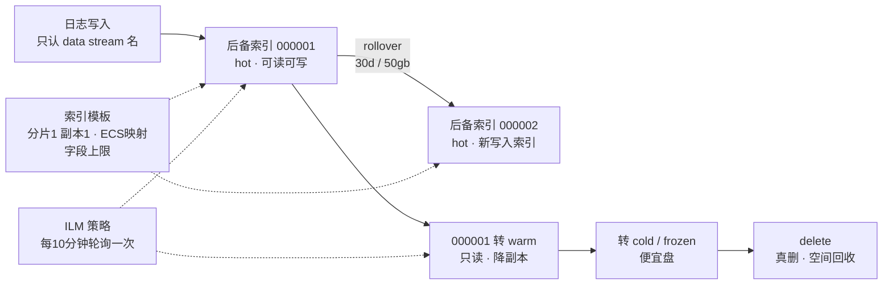

三个组件各管一段，缺一不可：

| 组件 | 回答的问题 | 缺了会怎样 |
|------|-----------|-----------|
| **data stream** | 写哪儿？ | 写进一个无限膨胀的单体索引 |
| **ILM** | 存多久、什么时候扔？ | 只增不减，直到磁盘满 |
| **索引模板** | 新索引长什么样？ | 每批索引配置不一致 + 字段爆炸 |

**🐞 常见误区**

| # | 误区 | 正确认知（本课实测） |
|---|------|---------------------|
| 1 | Filebeat 默认 ILM 会自动删旧日志 | ❌ 默认 `filebeat` 策略**只有 hot 阶段，永不删除**（实测 phases 只有 hot） |
| 2 | 自定义索引名也能享受默认 ILM | ❌ 课 9 的 `fb-proc-*` 模板没挂 ILM，**永不滚动** |
| 3 | 配好 ILM 立刻生效 | ❌ 默认 **10 分钟**轮询一次；用 `_ilm/explain` 看状态 |
| 4 | rollover 会删数据 | ❌ 旧索引变只读继续可查；删除是 delete 阶段 |
| 5 | `min_age` 是"在上个阶段停留多久" | ❌ 是从**索引创建/上次 rollover 算起的绝对年龄** |
| 6 | 改模板会影响已存在的索引 | ❌ 只影响**之后新建**的后备索引 |
| 7 | 字段数没有上限 | 默认 12500（Filebeat）；超了**拒绝写入整条日志** |
| 8 | `ignore_dynamic_beyond_limit` = 不限制 | ❌ 是"**不建索引**"：能存（`_source`）但**查不到**（实测 0 命中） |
| 9 | 副本越多越安全 | 日志可重采，通常 **1 主 1 副** 足够 |
| 10 | 单节点能演示冷热迁移 | ❌ 单节点同时具备所有 data 角色，迁移只是改标记，物理上没动 |
| 11 | 磁盘满了只是"写慢一点" | ❌ 到 **flood stage** 时 ES 会给该节点上所有含分片的索引加只读块，**写入直接被阻塞**。官方默认水位线：low **85%** / high **90%** / flood_stage **95%**；磁盘降回 **90% 以下会**自动解除（核查于 2026-09） |

**📋 命令速查卡**

| 目的 | 命令 | 坑 |
|------|------|-----|
| 列出 data stream | `GET /_data_stream` | 看 `ilm_policy` 字段确认有没有挂 ILM |
| 看某个 data stream | `GET /_data_stream/<name>` | 关注 `generation` 与 `indices[]` |
| 手动滚动 | `POST /<ds>/_rollover` | 立即生效，不等 ILM 轮询 |
| 看 ILM 策略 | `GET /_ilm/policy/<name>` | Filebeat 默认只有 hot |
| 看执行到哪了 | `GET /<ds>/_ilm/explain` | `hot/rollover/check-rollover-ready` = 正常等待中 |
| 缩短轮询 | `PUT /_cluster/settings` `{"transient":{"indices.lifecycle.poll_interval":"10s"}}` | **默认 10m**；用完记得改回 null |
| 看分层偏好 | `GET /<idx>/_settings?include_defaults=true&filter_path=*.settings.index.routing.allocation.include._tier_preference` | 不加 `include_defaults` 可能查不到 |
| 看索引模板 | `GET /_index_template/<name>` | 看 `composed_of` 判断是否用了 component template |
| 看组件模板 | `GET /_component_template/<name>` | 如 `logs@settings`、`ecs@mappings` |
| 查字段爆炸 | `GET /<idx>/_search` 试搜某字段 | 0 命中 + `_source` 里有值 = 被 `ignore_dynamic_beyond_limit` 丢弃了 |
| 看节点磁盘余量 | `GET _cat/allocation?v` | 看 `disk.percent`；逼近 **85%（low 水位线）** 就该处理，别等 flood stage |
| 看水位线默认值 | `GET /_cluster/settings?include_defaults=true&filter_path=*.cluster.routing.allocation.disk.watermark.*` | 官方默认 low **85%** / high **90%** / flood_stage **95%**；flood stage 会给索引加 `index.blocks.read_only_allow_delete`（核查于 2026-09） |
| 查分片为什么不分配 | `GET /_cluster/allocation/explain` | 磁盘满、副本无处安放都会在这里给原因 |

**📚 官方文档**：[Data streams](https://www.elastic.co/guide/en/elasticsearch/reference/current/data-streams.html) ｜ [Rollover API](https://www.elastic.co/guide/en/elasticsearch/reference/current/indices-rollover-index.html) ｜ [ILM overview](https://www.elastic.co/guide/en/elasticsearch/reference/current/overview-index-lifecycle-management.html) ｜ [ILM rollover](https://www.elastic.co/guide/en/elasticsearch/reference/current/ilm-rollover.html) ｜ [Data tiers](https://www.elastic.co/guide/en/elasticsearch/reference/current/data-tiers.html) ｜ [Index templates](https://www.elastic.co/guide/en/elasticsearch/reference/current/index-templates.html) ｜ [Dynamic templates](https://www.elastic.co/guide/en/elasticsearch/reference/current/dynamic-templates.html) ｜ [Mapping limit settings](https://www.elastic.co/guide/en/elasticsearch/reference/current/mapping-settings-limit.html)

## 课 11：Kibana —— 从 Discover 到 Dashboard

> 📄 [原文](stages/4-存储可视化与落地/lessons/lesson-11-Kibana从Discover到Dashboard.md) ｜ 配套工程：[`playground/10-kibana-visual/`](playground/10-kibana-visual/)（含 12 张实拍截图）
> 本课「体系收束」为**文字版**（未配独立收束图，因其主线是 UI 操作路径而非机制链路）。

**体系收束**：Kibana 是可观测闭环的"**眼睛**"，告警是"**神经**"。

- **数据流**：课 8、9 → Logstash/Beats/Ingest 处理 → 课 10 → 写入 data stream
- **可视化（本课）**：Data View + Discover + KQL + Lens + Dashboard
- **行动化（课 12）**：在 Lens/Metric 上配阈值 → 触发 Action → 通知到飞书/钉钉/邮件 → 排障

回到主角（一条日志）：它从 stdout 一路到 ES 已经被存下来；现在它终于被人**看见**（Discover）、**筛得出**（KQL）、**看得懂**（Lens + Dashboard）——**ELK 这套系统的"展示"部分正式闭环**。

**📊 实测数字**：10 条 KQL 全部实测（`log.level: ERROR` → 40 / `host.name: web-03` → 23 / `url.path: /api/pay*` → 148 / `message: *timeout*` → 11 …）；4 个 metric Lens 实测值 39 / 39 / 63 / 516。
**⚠️ 最有价值的一撞**：默认时间窗 15 分钟 + 数据是 2 天前的 → **真实 0 命中**。生产里 dashboard 默认时间窗应设 **Last 24 hours / 7 days**，在 panel 上做 narrow filter 切粒度。

**🐞 常见误区（汇总）**

1. **Discover 默认是"所有日志"，不是新建的 Data View** —— 9.5.3 行为，**记得顶部下拉切到你建的**
2. **默认时间窗是 Last 15 minutes** —— **进 Discover 第一件事就是调时间**
3. **Data View 缓存了字段元数据** —— 加 runtime field 后**要刷新**字段列
4. **`message` 不可聚合** —— match_only_text 字段，**KQL 能搜但 Lens 不能拖**
5. **KQL 不写 `==`** —— 写 `:`
6. **KQL 不写 5xx/4xx 数字别名** —— 必须 `>= 500` / `>= 400`
7. **object 字段不能直接用** —— `log` / `http` 是 object，**要写 `log.level` / `http.response.status_code`**
8. **拖字段到 Lens 不响应** —— 多半是 message 类 match_only_text 字段，改用 keyword 字段
9. **复杂 Lens API 复刻容易"无法加载页面"** —— 9.5.3 schema 严，**生产用 UI 拖**
10. **Dashboard 的时间窗是 dashboard 级** —— 单个 panel 不能独立设时间窗（除非 panel 自带 time shift）
11. **Saved object 顶层 `references` 不能嵌进 `attributes`** —— 9.5.3 schema，嵌了就 400
12. **删 Data View 不删数据** —— 删的是 saved object，不是 ES 索引。删数据用 `DELETE /logs-appdemo-default`
13. **Kibana 内所有配置（Data View/Lens/Dashboard）都在 `.kibana` 索引里** —— **重启不丢**；但 Kibana 自身没起就别问为什么 502

**📚 官方文档**：[Data Views](https://www.elastic.co/guide/en/kibana/current/data-views.html) ｜ [Discover](https://www.elastic.co/guide/en/kibana/current/discover.html) ｜ [KQL 语法参考](https://www.elastic.co/guide/en/kibana/current/kuery-query.html) ｜ [Lens](https://www.elastic.co/guide/en/kibana/current/lens.html) ｜ [Dashboard](https://www.elastic.co/guide/en/kibana/current/dashboard.html)

## 课 12：告警与生产落地（全课收官）

> 📄 [原文](stages/4-存储可视化与落地/lessons/lesson-12-告警与生产落地.md) ｜ 配套工程：[`playground/11-alerting/`](playground/11-alerting/)（含 6 张实拍截图）

**一图收束：一条日志的一生（全课合龙）**

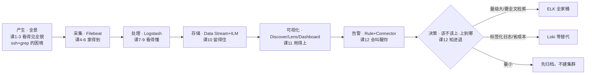

回望阶段 1 的那个傍晚：你逐台 ssh 上服务器 `grep` 一个 ERROR，找不到、留不住、看不懂。而现在——

| 阶段 | 能力 | 一句话 |
|---|---|---|
| 1 · 全景与起步 | 架构地图 + 起容器 | 看得见全貌 |
| 2 · 采集层 Beats | Filebeat 四种配法 | 拿得到 |
| 3 · 处理层 Logstash | grok / 条件 / 多管道 | 看得懂 |
| 4 · 存储可视化与落地 | data stream / Dashboard / 告警 / 决策 | 留得住 · 用得上 · 会叫醒你 · 知进退 |

> 当初那个傍晚的三个困境，如今都有了答案：**找不到 → 全文秒级检索；留不住 → data stream + ILM 管保留；看不懂 → 结构化解析 + 看板 + 告警。**

**✅ 全课能力自检（能不看讲义独立完成几件？）**

1. 起一套 ES + Kibana，把一份 json 日志采进来并存成 data stream（课 1-6、10）
2. 把一段不认识的日志格式用 grok 解析成结构化字段（课 7-9）
3. 从 Discover 到一条 KQL，再到一块 4 面板 Dashboard（课 11）
4. 配一条"ERROR 尖峰就通知"的告警，并说清它的防抖、静默、恢复分别怎么配（课 12）
5. 说出你为什么（不）选 ELK，以及选了之后容量怎么估、权限怎么分、备份怎么备（课 12）

**🐞 常见误区（速查）**

- **阈值拍脑袋**：">0 就报" + 1 分钟轮询 = 告警风暴。改用"持续 N 分钟超 M" + `alert_delay`
- **恢复通知没配**：修好了没人说，值班一直 P0。`recovered` 动作组永远要配
- **PUT 规则漏 `actions`**：动作被静默清空（实测坑），改规则 = GET 全量 → 改 → PUT 全量
- **驼峰 `notifyWhen` / PUT 带 `mute_all`**：双双 400；静默走 `_mute_all` 端点
- **实例静默用文档 `_id`**：404；用 `kibana.alert.instance.id`
- **Connector 走 HTTPS/localhost**：端口不通或地址错；容器到宿主用 `host.docker.internal`
- **容量漏算**：副本、膨胀系数、系统索引、event log（本机实测它是业务数据的 **600 倍体积**）
- **Space 当安全边界**：越权拦截靠 RBAC，Space 只管功能隔离
- **没配加密 key**：连接器/规则创建 500（`XPACK_ENCRYPTEDSAVEDOBJECTS_ENCRYPTIONKEY`）
- **`path.repo` 想热改**：静态设置，写配置 + 重启
- **导入规则后没启用**：导入的 alert 默认 `enabled: false`，记得 `_enable`
- **备份只备日志不备 `.kibana`**：看板/规则/连接器才是不可再生的资产

**📋 命令速查卡（约定与要点）**

> 约定：`xxx` = 你的 `ELASTIC_PASSWORD`（本教程 `ELKlearn2026`）；**写 Kibana 的非 GET 请求必带 `kbn-xsrf` 头**。
> `$RULE` = `curl -u elastic:xxx 'localhost:5601/api/alerting/rules/_find?page=1&per_page=10' -H 'kbn-xsrf: true' | jq -r '.data[0].id'`
> `$INSTANCE` = 告警文档字段 `kibana.alert.instance.id`（`groupBy:all` 时即动作组名，如 `query matched`）

| 目的 | 要点 |
|------|------|
| 环境 | macOS + Docker Compose；ES `:9200` / Kibana `:5601` |
| license 与规则 | basic 许可下 `.webhook` 等连接器 403，需 `start_trial` 解锁 |
| 实例级静默 | instance id 取自 `kibana.alert.instance.id`（**不是 `_id`**） |
| 告警实例的底细 | 就是普通 ES 索引，可直接 `_search` 查 |
| 容量三查 | 索引数 / primary shard 数 / 系统索引与 event log 体积 |
| 权限最小化 | `log-reader` 角色 + 独立用户，验证白名单 200 / 他人索引 403 / 写 403 |
| 备份 | 快照（`path.repo` 静态 + 重启；宿主目录 `chmod 777`）+ SLM 策略 + **Saved Objects 导出** |

**📚 官方文档**：[Alerting 入门](https://www.elastic.co/guide/en/kibana/current/alerting-getting-started.html) ｜ [创建与管理规则](https://www.elastic.co/guide/en/kibana/current/create-and-manage-rules.html) ｜ [ES query 规则类型](https://www.elastic.co/guide/en/kibana/current/rule-type-es-query.html) ｜ [动作类型（含 license 要求）](https://www.elastic.co/guide/en/kibana/current/action-types.html) ｜ [维护窗口](https://www.elastic.co/guide/en/kibana/current/maintenance-windows.html) ｜ [告警生产环境注意事项](https://www.elastic.co/guide/en/kibana/current/alerting-production-considerations.html) ｜ [快照与恢复](https://www.elastic.co/guide/en/elasticsearch/reference/current/snapshot-restore.html) ｜ [SLM 策略 API](https://www.elastic.co/guide/en/elasticsearch/reference/current/slm-api-put-policy.html) ｜ [Data stream lifecycle](https://www.elastic.co/guide/en/elasticsearch/reference/current/data-stream-lifecycle.html) ｜ [ILM 与索引生命周期](https://www.elastic.co/guide/en/elasticsearch/reference/current/ilm-index-lifecycle.html) ｜ [创建/更新角色 API](https://www.elastic.co/guide/en/elasticsearch/reference/current/security-api-put-role.html) ｜ [Saved Objects 导出 API](https://www.elastic.co/guide/en/kibana/current/saved-objects-api-export.html) ／ [导入 API](https://www.elastic.co/guide/en/kibana/current/saved-objects-api-import.html) ｜ [shard 规模规划](https://www.elastic.co/guide/en/elasticsearch/reference/current/size-your-shards.html) ｜ [Grafana Loki 概览](https://grafana.com/docs/loki/latest/get-started/overview/)

---

# 八、状态与方法的沉淀

## 8.1 与 ES 主课的重叠处理原则

ES 主课已覆盖 **Ingest Pipeline / grok / Data Stream / ILM / 索引模板 / 别名 / RBAC / 快照**。本教程一律：

1. **回指链接**（相对路径指向 ES 主课对应课时），不重复讲基础
2. **只讲 ELK 视角的增量**（日志场景怎么配、什么时候该换位置）
3. 在课内显式标注"ES 主课已讲，详见链接"

## 8.2 跨课方法论（比单个知识点更值钱）

| 方法 | 出处 | 一句话 |
|------|------|--------|
| **先跑通最短链路，再加复杂度** | 课 3 | Filebeat 直连 ES 先跑通，Logstash 留到真的需要时 |
| **改配置前先校验** | 课 7 | Logstash `--config.test_and_exit`、Filebeat `test config`；启动要 1-2 分钟，别用重启试错 |
| **用"对照实验"证伪，而不是"看起来对"** | 课 4/8/10 | 9 行 vs 1 条 / 停 ES 重启 Logstash / 严格 vs 宽松模式——**一次对照胜过十句解释** |
| **决策要看"代价算在谁头上"** | 课 5/9 | 解析放采集端吃业务机 CPU、放 ES Ingest 挤检索资源、放 Logstash 吃 JVM |
| **版本钉死** | 课 2 | 不用 `latest`；本教程全程 9.5.3 |
| **数字要能验算** | 课 6 | `cores=11` × `norm 0.0166` = `pct 0.1827`——验算吻合才敢写进讲义 |
| **"能存"不等于"能查"** | 课 10 | `ignore_dynamic_beyond_limit` 下 `_source` 有值但搜不到 |

---

# 九、决策清单（学习目标④「决策参考」）

> 用法：遇到决策问题先定位行，再跳到对应课的决策表看完整对比。**表里只放判据，不放结论**——结论依赖你的量级、团队与预算。

## 9.1 该不该上 ELK、上到哪一步

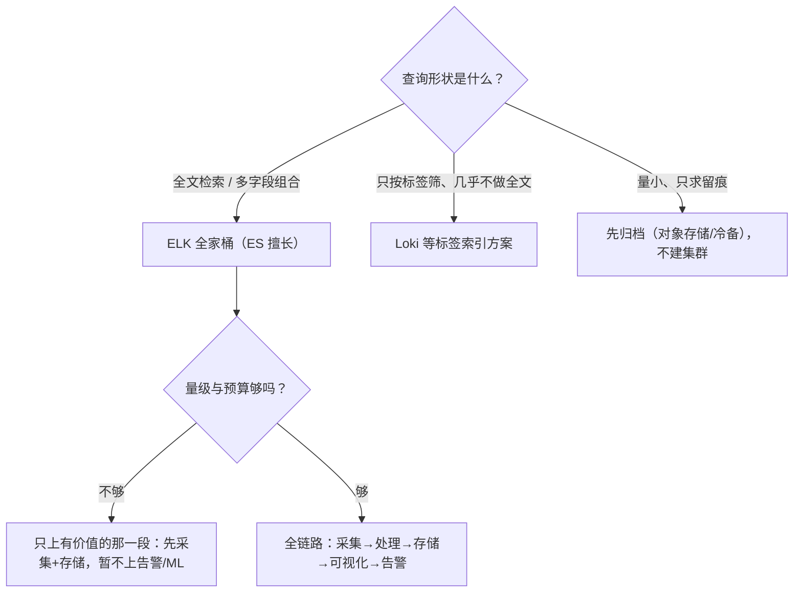

> 一句话记住（课 12）：**查询形状决定方案，量级决定成本，团队能力决定上下限——清单逐条打钩，别按"最热门"抄作业。**
> 📄 完整决策清单与替代方案对比：见 [课 12 知识点 3](stages/4-存储可视化与落地/lessons/lesson-12-告警与生产落地.md) ｜ 选型方法论回指 ES 主课 14《该不该用 ES》

## 9.2 采集端选谁（Beats / Logstash / Fluentd / OTel Collector）

| 判据 | 结论 |
|------|------|
| **本机 + 常驻 + 单一数据类型** | ✅ Beats 的主场 |
| 离开上面三个前提 | 就该考虑别家 |
| **容器 / K8s** | 优先考虑别家（DaemonSet 式采集器 / OTel） |
| **应用内链路追踪** | 优先考虑别的（应用侧 SDK / OTel） |
| **已有 OTel 体系** | 跟体系走，别引入第二套 |
| **极端轻量资源约束** | 考虑更轻的采集器 |
| **一次性搬运历史日志** | 别上常驻采集器，用批量导入 |
| ⚠️ **禁忌** | **同一份数据被两套工具重复采集** |

> 📄 完整四条路线对比：见 [课 6 知识点 2](stages/2-采集层Beats/lessons/lesson-06-Beats家族与采集选型.md)

## 9.3 解析放在哪一层（Beats processors / Logstash / ES Ingest）

| 维度 | Beats processors | Logstash | ES Ingest |
|------|------------------|----------|-----------|
| CPU 花在谁头上 | 业务机（源头） | 专用 Logstash 机（JVM） | **ES 数据节点（挤占检索资源）** |
| 能力上限 | 弱（只做轻加工） | **强**（grok/多管道/多输出/缓冲） | 中（贴数据，但无缓冲） |
| 适合 | 打标记、丢字段、加条件 | 重解析、要缓冲、多输出 | 轻解析、省事、已有模块 pipeline |
| 决策表 | 见 [课 9 知识点 2](stages/3-处理层Logstash/lessons/lesson-09-该在哪处理.md) | 同左 | 同左 |

> ⚠️ 实测提醒：ES Ingest **没有 `hash` 处理器**（用 `fingerprint`）、**没有 `comment` 处理器**；Ingest 的 CPU 归属可以直接从 `GET _nodes/stats/ingest` 查出来（实测 4 条日志 98ms）。

## 9.4 存储策略怎么定

| 判据 | 做法 |
|------|------|
| 命名 | `logs-<dataset>-<namespace>` 三段式（或 Filebeat 默认单 data stream，靠 `event.dataset` 区分） |
| 滚动条件 | `max_age` / `max_primary_shard_size`（**默认策略只有 hot、没有 delete**） |
| 保留 | 显式加 delete 阶段——否则日志**永不自动删除** |
| 分片/副本 | 日志可重采，通常 **1 主 1 副**足够 |
| ⚠️ 最大陷阱 | **模板必须声明 `composed_of`**，否则会顶掉内置 `logs` 模板、ECS 映射全失效（见第十章坑 3） |

> 📄 见 [课 10 知识点 2/3](stages/4-存储可视化与落地/lessons/lesson-10-日志的存储策略.md)

## 9.5 告警往哪落、怎么不扰民

| 判据 | 做法 |
|------|------|
| 落点 | `.index` 连接器（basic 许可下可用）/ webhook / 邮件 / Slack（部分需 trial） |
| 防抖 | "持续 N 分钟超 M" + `alert_delay`，而不是">0 就报" |
| 恢复 | `recovered` 动作组**永远要配** |
| 静默 | 规则级 / 实例级；实例 id 用 `kibana.alert.instance.id` |
| 计划维护 | **维护窗口**：照常检测、不打扰人（实测零投递） |
| 风暴治理 | 阈值 + 防抖 + 维护窗口 + 静默，四道闸门 |

> 📄 见 [课 12 知识点 1](stages/4-存储可视化与落地/lessons/lesson-12-告警与生产落地.md)

---

# 十、综合实战项目

> 全部课时完成后，用一个**跨阶段整合**的项目把散装知识点焊成整体能力。项目要求写成一个**真实要求**（R1-R6），不是"把命令再敲一遍"。

## 10.1 项目需求：日志平台生产化

**入口**：[`projects/日志平台生产化/README.md`](projects/日志平台生产化/README.md)

一句话需求（R1-R6）：

1. 采集**两个真实来源**：应用日志（JSON 与文本混排）与 nginx 访问日志
2. 解析**不能丢**：JSON 走结构化提取、文本走 grok、nginx 走标准 combined 格式，**失败标签必须为 0**
3. 补齐**真实主机名**，供按主机聚合排障
4. 存储用 **data stream + 自定义 ILM**，能自动滚动、并说明保留边界
5. 提供一个**能用的看板 + 一条能落盘的告警**
6. **全部配置代码化**，能一键重放（不靠"手点出来的"）

## 10.2 覆盖知识点地图（跨 4 阶段 · 36 个全覆盖）

| 阶段 | 覆盖的知识点 | 落点 |
|------|-------------|------|
| 1 · 全景与起步 | 日志为什么难查 / 四组件分工 / 最小链路 / 一条数据长什么样 / 组件契约 / Compose 编排 / 安全配置 / 容器观测重建 | `实现/docker-compose.yml`、`实现/filebeat.yml`、README 的"运行方式" |
| 2 · 采集层 Beats | input 与 harvester / registry 与 at-least-once / 多行合并 / processors / 输出与背压 / 采集选型 | `实现/filebeat.yml`（两个 filestream input + multiline + processors） |
| 3 · 处理层 Logstash | 管道三件套 / grok 解析 / date 与 mutate / 持久化队列 / 吞吐 / 多管道 / ECS 规范 | `实现/logstash/pipeline/shop-api.conf`、`实现/logstash/config/pipelines.yml` |
| 4 · 存储可视化与落地 | data stream / ILM 与冷热 / 模板配法 / Data View 与 KQL / Lens 与 Dashboard / 告警与连接器 / 容量权限备份 | `实现/scripts/bootstrap.py`（ILM+模板+Data View+连接器+规则全代码化） |

> 完整逐条映射见 [项目 README 的「覆盖知识点地图」](projects/日志平台生产化/README.md)。

## 10.3 真的做了 4 个决策（每个都有代价）

📄 全文：[`projects/日志平台生产化/设计决策.md`](projects/日志平台生产化/设计决策.md)

| # | 决策点 | 选择 | 代价 / 何时改选 |
|---|--------|------|----------------|
| 1 | 解析放哪层（Filebeat processor / Logstash / ES Ingest） | **Logstash** | 多一个进程与一跳网络；量极小或链路要极简时改 Filebeat 直连 |
| 2 | `host.name` 保留 Filebeat 的容器名，还是覆盖成真实业务机？ | **先 `remove_field` 再写真实主机名** | 丢失"哪个采集器送的"信息（需另存字段）；多采集器共写同一索引时需重新设计 |
| 3 | ILM 策略怎么绑到 data stream 上？ | **自定义模板 + 声明 `composed_of`** | 模板复杂度上升、要维护组件模板引用；不用自定义即可省掉（但就拿不到自定义保留期） |
| 4 | 告警结果往哪落？ | **`.index` 连接器** | 告警不进人看的通道（只看索引）；需要即时通知时改 webhook/邮件 |

## 10.4 反例对照（"能跑但很糟"）

📄 全文（8 条）：[`projects/日志平台生产化/反例对照.md`](projects/日志平台生产化/反例对照.md)

典型几条：`grok` 不加类型（全变字符串、聚合失败）｜ 模板不写 `composed_of`（ECS 映射失效）｜ registry 不落卷（重建后数据翻倍）｜ 用 `latest` 标签 ｜ 多行 pattern 只认一种开头（吞 JSON 行）｜ 阈值拍脑袋 + 1 分钟轮询（告警风暴）。

## 10.5 端到端实测结果（1000 条基线）

📄 全文（18 项 + 5 项进阶）：[`projects/日志平台生产化/验收清单.md`](projects/日志平台生产化/验收清单.md)

| 环节 | 实测结果 |
|------|---------|
| 采集 | 600 应用（JSON 与文本约 7:3，单次实测 427 + 173）+ 400 nginx = **1000 条，与文件行数一致** |
| 解析 | **失败标签 0**（`tags` 只剩 `beats_input_codec_plain_applied`） |
| 主机 | web-01 374 / web-02 339 / web-03 287 —— **无容器 ID 混入** |
| 存储 | gen1 1000 → rollover → gen2 90；**两代 backing index 映射完全一致**（`log.level=keyword`） |
| 告警 | 规则 `enabled`，`.index` 连接器落盘 `shopapi-alerts`，mustache 渲染出真实 `hit_count`/`hit_host`/`hit_level`/`hit_path` |
| 备份 | 快照 `snap-final` **SUCCESS 32/32**；Saved Objects 误删复生（导入 3 → **规则回来但 `enabled=false`**） |

## 10.6 实战暴露的 4 个生产级坑（本项目最有价值的部分）

| # | 坑 | 症状 | 根因 | 修复 |
|---|----|------|------|------|
| 1 | **`add_field` 是追加不是覆盖** | `host.name` 变数组 `["09d21480270c","web-01"]`，聚合出假主机 | ECS 的 `[host][name]` 已由 Filebeat 写入容器 ID，`add_field` 追加而非覆盖；且它是 mutate 的**通用选项、最后执行** | 先 `remove_field => ["[host][name]"]` 再写 |
| 2 | **multiline pattern 只认日期开头** | JSON 格式的日志行被当"续行"吞掉，与其他行粘成一条 | pattern 语义是"**不匹配的行 = 上一行续行**" | pattern 改为 `'^([0-9]{4}-[0-9]{2}-[0-9]{2}\|\{)'`，同时认 `{` |
| 3 | **索引模板缺 `composed_of`（最凶险）** | **告警永远 0 条、全程不报错** | 自定义模板 priority=200 **顶掉**内置 `logs` 模板（priority=100）；不声明 `composed_of` 则 ECS 映射全失效 → `log.level` 退化为动态映射 `text` → `term` 精确查询永 0 命中 | 模板里显式声明 `composed_of`（引用 `ecs@mappings` 等组件模板） |
| 4 | **Filebeat registry 未落命名卷** | 容器 `recreate` 后**整文件重读，1000 条变 2420 条**（数据没丢、查询不报错，只是每个数字翻倍） | registry 默认只在容器可写层 | 把 registry 落到命名卷（`filebeat-registry:/usr/share/filebeat/data`） |

另有两个环境坑：**`kibana_system` 密码只由官方 `setup` 容器设置**（否则 Kibana 容器 `Up` 但 `/api/status` = `unavailable`、所有 API 400）；**中文目录名须用 `.env` 指定 `COMPOSE_PROJECT_NAME`**。

> 💡 坑 3 的完整失效链（`composed_of` 缺失 → 告警静默）已配图说明，见 [项目 README](projects/日志平台生产化/README.md)。这条链是"**配置看起来都对了，但结果永远是 0**"这类问题的教科书案例。

---

# 十一、下一步

**本手册 = Phase 4 交付**。它把 12 课 + 结课实战项目压成一册可通读、可当字典查的汇总；但**它不负责排障、不负责设计权衡、不讲故障原理**——那三件事在 Phase 5 的三份里：

| 你想干什么 | 去哪 | 状态 |
|-----------|------|------|
| 出问题了要按症状倒查 | [09-排障速查手册.md](09-排障速查手册.md)（使用态 · 机长 QRH 式，只给动作不给原理） | ✅ 已交付（2026-09-13 · **10 条症状** · 🔴4 / 🟡6 / ⚪1 入口） |
| 想懂"为什么会踩这些坑" | [08-实战经验.md](08-实战经验.md)（学习态 · 故障模式五段式 + 上线 Checklist） | ✅ 已交付（2026-09-13 · **10 条故障模式** + **33 项 Checklist** + 2 个真实事故） |
| 新要求来了怎么设计 | [10-场景解法库.md](10-场景解法库.md)（设计态 · 多解法 + 代价 + 递进路径） | ✅ 已交付（2026-09-13 · **8 个场景 / 43 个解法**） |
| 想知道评审怎么过的 | [收尾产物评审记录.md](收尾产物评审记录.md)（B1-B8 + C1-C7 + 双视角） | ✅ 已交付（2026-09-13） |
| 考一考自己 | `07-知识点对齐.md`（可选，说一声"考我一下"即可） | ⏳ 可选（Phase 6） |

> 三份收尾材料（08/09/10）的素材源是同一批「典型失败模式 + 常见高难度场景」，**一次生成三份**，素材优先取本章 10.6 的 4 个生产级坑。
> **口径一致性已核验**：4 个生产级坑（`host.name` 数组 / multiline 吞 JSON / `composed_of` 缺失致告警静默 / registry 不落卷 1000→2420）、1000 条基线、9.5.3、磁盘水位线 85-90-95% 在四份产物中**同源**；`08`↔`09` 的故障模式编号**双向一一对应（1-10 全覆盖）**。
>
> **课程到此完整闭环**：4 阶段 / 12 课 / 36 知识点 + 结课实战 + 汇总手册 + 三态三件套。

---

## 🚀 结课后的三条深入方向

> 主课程链路已完整闭环。往下走有三种走法：

| 方向 | 怎么做 | 适合什么状态 |
|------|--------|-------------|
| **A. 知识点对齐（Phase 6）** | 说一句"考我一下 ELK，针对 <你想考的模块>"，会按 12 课逐课出题、错题巩固、指纹去重 | 想检验自己到底记住了多少 |
| **B. 真环境迁移** | 把结课项目从单机 Compose 搬到真实多节点集群：加节点、做角色分工、配快照仓库、**跑恢复演练** | 准备上生产 |
| **C. 打通可观测三支柱** | 日志（本课程）→ 指标（仓库里有 `prometheus/` `grafana/`）→ 链路（仓库里有 `opentelemetry/`），把三者串成一套 | 想从"日志平台"走向"可观测平台" |

> 「真环境迁移」的**改造顺序与每一项的代价**，已在 [10-场景解法库.md](10-场景解法库.md) **场景 7** 给全：安全基线 → 多节点 + 副本 → 快照 + **恢复演练** → 备份 `.kibana` → ILM 保留期 → 角色分工。
> 「为什么顺序不能反」在 [08-实战经验.md](08-实战经验.md) 的两个真实事故里有答案（Meow 攻击 / GitLab 五套备份全失效）。

**🧭 课程导航**：[← 学习路径总览](01-学习路径总览.md) ｜ [学习档案](00-学习档案.md) ｜ [课程目录](02-课程目录.md) ｜ [评审清单](00-评审清单.md) ｜ [实战经验](08-实战经验.md) ｜ [排障速查手册](09-排障速查手册.md) ｜ [场景解法库](10-场景解法库.md) ｜ [收尾产物评审记录](收尾产物评审记录.md)
