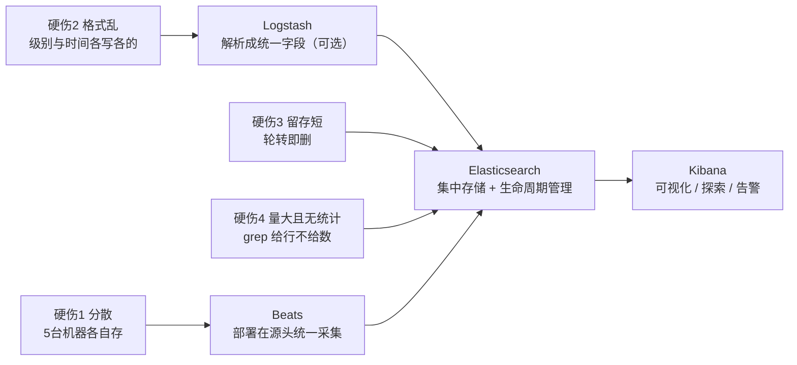

# 课 1：一条日志的旅程

> 一句话：在动手搭任何东西之前，先搞清"日志到底难在哪、ELK 四件套各管什么、这套东西从哪来"。
> 阶段 1 · 第 1 课 ｜ 知识点：日志为什么难查 / ELK 四个组件各管什么 / ELK 的起源与生态位
> 状态：✅ 已交付（2026-09-06）｜ 版本基线：Elastic Stack **9.5.3** ｜ 环境：macOS arm64 + Docker Compose

---

## 🎯 本课目标

学完本课，你应该能：

1. 对着一个真实报警场景，说清"逐台 `ssh` + `grep` 为什么不行"的四条硬伤
2. 给 ELK 四件套（Beats / Logstash / Elasticsearch / Kibana）各贴一个"人话"职责标签，并能指出**谁可选、谁必需**
3. 讲出 ELK → Elastic Stack 的改名脉络与"Logstash / Kibana / Beats 各自诞生年份"这条时间线
4. 用一张图说清 ELK 在"专业商业软件（Splunk）/ 自研 / 轻量替代（Loki）"这几条路线里站在哪

## 📌 知识点导航

| # | 知识点 | 关键点 | 状态 |
|---|--------|--------|------|
| 1 | 1.1 日志为什么难查 | 分散在多台机器（逐台 grep）/ 格式不统一（时间戳五花八门）/ 留存短（被轮转删）/ 大文件全文检索慢且无统计 | ✅ 已完成 |
| 2 | 1.2 ELK 四个组件各管什么 | Beats 采集（轻量、部署在源头）/ Logstash 处理（解析转换、**可选**）/ ES 存储检索 / Kibana 可视化；职责边界；**Logstash 不是必需组件**（Filebeat 可直连 ES） | ✅ 已完成 |
| 3 | 1.3 ELK 的起源与生态位 | Logstash 2009（Jordan Sissel）/ Kibana 2013（Rashid Khan）/ Beats 2015 / ELK → Elastic Stack 改名；生态位（vs Splunk / 自研 / Loki） | ✅ 已完成 |

## 📖 本课在故事主线中的情节定位

主线第一幕正式开场：主角（一条日志）登场前，先把"反派"讲透——5 台机器、一次线上报警、工程师逐台 `ssh` 上去 `grep`，为什么**找不到、留不住、看不懂**。本课是**认知课**，不起容器（课 2 才开始跑起来），但第四幕会**在你自己的机器上真跑几条命令**，让你亲眼看到"日志难查"不是抽象说教。

---

# 正文

## 🏛️ 第一幕 · 起源与场景引入

### 这套东西是怎么来的

ELK 不是一个公司一次性设计出来的产品，而是**三个独立项目被时间撮合到一起**的结果。

最早登场的是 **Logstash**。2009 年 8 月 2 日，运维工程师 **Jordan Sissel** 创建了它——当时他是虚拟主机商 DreamHost 的员工（他另一个广为人知的作品是打包工具 `fpm`）。他的痛点很朴素：手上几十种格式的日志，想有一个东西能统一读进来、切成字段、再送到别的地方去。（核查于 2026-09）

四年后，Elasticsearch 公司（Elastic 前身）在 **2013 年把 Logstash 收归旗下**；同一年，运维工程师 **Rashid Khan** 写的 **Kibana** 也加入了进来——它最早就是为了给 ES 里的数据一个"能看的界面"。三个首字母拼在一起，**ELK** 这个名字就这么诞生了。（核查于 2026-09）

到 **2015 年**，一批更轻量的采集器 **Beats** 加入阵营（Filebeat 管日志、Metricbeat 管指标……）。三个字母装不下四个组件了，于是改名 **Elastic Stack**。（核查于 2026-09）

> ⏳ **置信度说明**：Logstash 与 Kibana 的创建者、年份由多个中英文来源交叉确认（百度百科、Wikiwand、Grokipedia、ELKstack 中文指南、Earthly Blog）。**改名节点各来源表述不一**——有资料记为"2015 年 Beats 加入后即形成 Elastic Stack 这一称呼"，也有资料把正式更名放在之后的年份，因此这里采用稳妥表述"2015 年 Beats 加入后逐渐改称"。ES 部分的年份（2004 Compass / 2010-02-08 首个版本 / 2012 公司成立 / 2018-10-05 上市）在 ES 主课已核实（2026-08-28）。

### 现在，把镜头切到你身上

凌晨两点，监控告警：**订单服务错误率飙升**。你有 5 台机器。你要干什么？

大概率是这个动作，重复 5 次：

```bash
ssh web-01 'grep -n "ERROR" /var/log/order-service/app.log'
# 然后 web-02、web-03、web-04、web-05……
```

运气好的话，你在其中一台上看到了一堆红字。然后呢？你要知道的是"**过去一小时哪个接口报了多少次错、比昨天涨了多少**"，而你手上只有 5 个终端窗口里各自滚动的几万行文本。

**有没有一种东西，能把散落在 5 台机器、格式不一、随时被删的日志——攒到一起、统一格式、留得久、查得快、还能直接给你统计？**

这就是 ELK 要解决的问题。

## ❓ 第二幕 · 认知冲突

你可能会想：**"日志不就是文本文件吗？grep 一下不就完了？"**

单台机器上一个 10MB 的文件，`grep` 确实秒回，我完全同意。但把三个变量加进来——**多台机器 × 长时间跨度 × 格式不统一**——这个动作就崩了。

而且有一个更根本的问题，比"慢"更致命：

> **你 grep 出来之后呢？**

你想问的其实从来不是"哪些行包含 ERROR"，而是"**过去一小时，哪个服务、哪个接口、报了多少次、比昨天涨了多少**"。这是**统计问题**，不是**查找问题**。`grep` 只会给你行，不会给你数。

先把一个真实数字摆在这儿，作为这一幕的悬念：

> 我写这课的时候，在我这台 macOS 上实测了一下——**近 1 小时产生了 2,766,622 条系统日志，其中 error 级别 138,249 条**。
> 一条机器、一小时、十三万条错误。面对 13.8 万行文本，"看得完"这件事本身就已经不可能了，更别说统计。

**冲突就在这里**：我们以为问题出在"找不到那个文件"，实际上问题出在**散、乱、短、多**四件事同时成立，而 `grep` 天生只为"在一个文件里找字符串"这一件事设计。

## 🔍 第三幕 · 层层揭示

> 每个知识点按「六要素」展开：**一句话定义 / 直觉建立（类比 + 类比失效边界）/ 核心原理 / 示例演示 / 常见误区 / 一句话记住 / 📚 官方文档**。

---

### 知识点 1.1 · 日志为什么难查

**一句话定义**
日志难查，不是因为"文件不好读"，而是因为**日志天然是分散产生、格式各异、随时间过期、且体量巨大**的一种数据——而 `grep` 是面向"单个文件"设计的工具。

**直觉建立（类比）**
把日志想成**一个班 40 个同学各自记的课堂笔记**：

| 笔记的麻烦 | 对应日志的麻烦 |
|-----------|---------------|
| 40 个人 40 本笔记，要知道"第 3 节课谁提到了鲁迅"得一本本翻 | **分散**：每台机器各自写自己的文件 |
| 有人用日期开头、有人用章节号、有人只写关键词 | **格式不统一**：级别、时间戳、字段各写各的 |
| 笔记本用完了就把前面的撕了 | **留存短**：轮转（rotate）与自动清理 |
| 想统计"鲁迅被提到多少次"只能一页页数 | **量大且无统计**：全文扫描 + 只给行不给数 |

**类比失效的边界**：笔记是**静态**的——写完了不会再长；日志是**持续写入的流**，你查的时候它还在变多。而且笔记"撕掉旧页"是人决定的，日志的删除是**自动发生**的（轮转策略 + 保留天数），你常常不知道自己想查的那段已经被删了。

**核心原理 · 四条硬伤**

| # | 硬伤 | 为什么 `grep` 扛不住 | 本机实测证据（2026-09-06） |
|---|------|---------------------|--------------------------|
| 1 | **分散** | `grep` 是"单文件"工具。5 台机器 = 5 次 ssh + 5 次 grep，结果还要人肉合并、人肉去重 | `~/Library/Logs` 下散着 **161 个 `.log` 文件**，`/var/log` 另有独立一套（15M + 31M） |
| 2 | **格式不统一** | `grep` 只能按**字符串**匹配，没法按**字段**查询。同一个"级别"字段在两家日志里写法完全不同 | 同一台机器上两种时间戳与级别写法（下方对比） |
| 3 | **留存短** | 日志被轮转切分并按保留策略清理，查上周的得先确认"那个文件还在不在" | HealthMonitor 目录下 **7 个文件**，文件名自带轮转时间戳 |
| 4 | **量大 · 检索慢 · 无统计** | `grep` 是**逐行扫全文**，数据越大越慢；且它只会给你行，不会给你数 | 276 万条里找一个关键词：**耗时 12.9 秒**，命中 **1,520,807 条** |

**格式不统一长什么样**（同一台 macOS，两个不同来源的真实日志）：

```text
# 来源 A：macOS 统一日志（/usr/bin/log show 输出）
2026-09-06 13:19:47.654 E  bluetoothd[403:164a] [com.apple.bluetooth:Stack.LE] Connection Update Completed with error  STATUS 730

# 来源 B：某个第三方应用的自有日志
2026-01-15 14:03:36.846000+0800 [Info] core-detection: archive-container will close container dynamic path /var/folders/2c/...
```

对着这两行看仔细点：

- **级别字段**：一个写成 `E`，另一个写成 `[Info]`
- **时间字段**：一个是 `2026-09-06 13:19:47.654`（毫秒），另一个是 `2026-01-15 14:03:36.846000+0800`（微秒 + 时区）
- **进程字段**：一个写成 `bluetoothd[403:164a]`，另一个干脆没有

你想写一条正则同时解析这两行，就已经开始痛苦了——**而这只是两个来源**。真实系统里，一个订单服务背后可能有 Nginx、应用自身、JVM GC、数据库慢查询、容器运行时……每家一种写法。

**体量的账**（从本机实测外推）：

| 口径 | 条数 |
|------|------|
| 我这台机器 · 近 1 小时 | 2,766,622 |
| 5 台机器 · 1 天 | 331,994,640（约 3.3 亿） |
| 5 台机器 · 30 天 | 9,959,839,200（约 99.6 亿） |

**示例演示**：见第四幕（4 步真机实测）。

**常见误区**

- ❌ **"日志少的时候 grep 挺快，所以不用 ELK"** —— 量的增长是**乘法**不是加法：机器数 × 时间跨度 × 单条字段数一起涨。今天"够快"的方案，往往在下一次扩容时失效
- ❌ **"我写个脚本把日志 rsync 到一台机器上集中起来就行"** —— 只解决了"分散"一条，格式、留存、检索、统计三条一条没动（自检三问第 1 题会展开）
- ❌ **"换个快点的硬盘就好了"** —— 瓶颈是"逐行扫全文"这个**算法**，不是磁盘 IO

**一句话记住**
日志的难题不是"找不到那个文件"，而是**散、乱、短、多**四个字同时成立；`grep` 只解决"在一个文件里找字符串"这一件事。

📚 官方文档：[Elastic Stack 产品文档](https://www.elastic.co/docs)

---

### 知识点 1.2 · ELK 四个组件各管什么

**一句话定义**
ELK 是一条**流水线**上的四个工位——**Beats** 在源头采集、**Logstash** 集中处理（**可选**）、**Elasticsearch** 存储并检索、**Kibana** 展示与告警。

**直觉建立（类比）**
把它想成**快递系统**：

| 角色 | 对应组件 | 干什么 |
|------|---------|--------|
| 小区收件员 | **Beats**（主力 Filebeat） | 骑个小电动贴着你住，只负责"把包裹从你手上取走"。**人轻量大** |
| 区域分拣中心 | **Logstash** | 拆包、重新贴单、把不认识的挑出来。干的是**重活**，但不是每个包裹都必经 |
| 仓库 + 检索台 | **Elasticsearch** | 包裹按规矩上架，你要找什么它毫秒级翻出来，还能告诉你"这周一共到了多少件" |
| 展厅大屏 | **Kibana** | 把仓库里的数字变成人看得懂的图、表、告警 |

**类比失效的边界**：

1. 快递包裹送完就结束了；日志要**留 30 天、90 天甚至更久**，还要能按任意维度回看——所以 ES 这一层不只是"仓库"，还是"**档案馆 + 统计处**"
2. 快递是**精确一次**（同一个包裹不能送两遍）；日志链路是**至少一次**（at-least-once，宁可重复也不能丢）。这个差异会在阶段 2 课 4、阶段 3 课 8 反复回来找你

**核心原理 · 四件套职责表**

| 组件 | 一句话职责 | 部署在哪 | 必需吗 | 与 ES 主课的关系 |
|------|-----------|---------|--------|-----------------|
| **Beats**（主力 Filebeat） | **采集**：从文件 / 指标 / 网络里把数据读出来，轻量转发 | **数据源所在的那台机器上**（你家门口） | ✅ 必需 | 本教程新内容 |
| **Logstash** | **处理**：解析、转换、富化、路由 | 独立服务，可集中部署 | ⚠️ **可选** | 本教程新内容 |
| **Elasticsearch** | **存储 + 检索 + 聚合** | 集群 | ✅ 必需 | **已学**（ES 主课 46 知识点） |
| **Kibana** | **可视化、探索、告警、管理界面** | 独立服务 | ✅ 必需（人要用） | 本教程新内容 |

**最关键的一条认知 —— Logstash 不是必经之路**

Filebeat **可以**直接把数据写进 Elasticsearch，完全不经过 Logstash：


**那什么时候才需要 Logstash？** 简单说四种情况：需要复杂正则解析（比如 Grok）、需要跨源关联或富化、需要缓冲削峰、以及**解析的 CPU 开销不该压在业务机器上**。

这个判断我们不在本课下结论——阶段 3 课 9《该在哪处理》会用一张决策表专门解决。这里你只需要先记住结论：

> **Logstash 是"重活才上"的可选项，不是默认组件。** 最小可用链路是 Filebeat → ES → Kibana。

**示例演示**：见第四幕第 4 步。

**常见误区**

- ❌ **"ELK 必须四个都装"** —— Logstash 可选，小规模 Filebeat 直连 ES 完全够用
- ❌ **"Beats 和 Logstash 是重复劳动"** —— 一个在**源头轻采**（CPU 花在业务机上），一个**集中重处理**（CPU 花在专用机器上）。位置不同，代价就不同
- ❌ **"Kibana 负责搜索，ES 负责展示"** —— 说反了。ES 是检索引擎，Kibana 只是界面。**把 Kibana 关掉，数据一条不少，只是没人看得见**

**一句话记住**
Beats 把数据**拿进来**，Logstash 把数据**变好看**（可选），ES 把数据**存起来还能秒查**，Kibana 让**人看得见**。

📚 官方文档：[Filebeat](https://www.elastic.co/docs/reference/beats/filebeat) ｜ [Logstash](https://www.elastic.co/docs/reference/logstash) ｜ [Kibana](https://www.elastic.co/docs/reference/kibana)

---

### 知识点 1.3 · ELK 的起源与生态位

**一句话定义**
ELK 是三个独立开源项目被 Elastic 公司收拢后形成的一套**日志与可观测数据的端到端方案**；加入 Beats 后官方改称 **Elastic Stack**。

**直觉建立（类比）**
它像**宜家的一整套厨房**：灶台、水槽、橱柜来自不同年代、不同设计，但因为都是宜家的，拼在一起尺寸严丝合缝。你可以只单买一个水槽（只用 ES），但买整套时"**开箱即用**"的价值最大。

**类比失效的边界**：

1. 宜家厨房缺个抽屉照样能做菜；**ELK 少了 ES 就完全不成立**——ES 是地基，其他三个是地基上的房子
2. 宜家的部件是固定搭配；**ELK 的每个组件都可以被替换**（比如把 Beats 换成 Fluent Bit）。这个"可替换性"在阶段 2 课 6 会专门讲

**核心原理 · 时间线**

| 年份 | 事件 |
|------|------|
| 2004 | Shay Banon 开始做 **Compass**（ES 前身）—— ES 主课已核实 |
| 2009-08-02 | **Logstash** 由 **Jordan Sissel** 创建（当时他是 DreamHost 的运维工程师，也是打包工具 `fpm` 的作者） |
| 2010-02-08 | **Elasticsearch** 第一个版本发布 |
| 2012 | **Elastic 公司成立** |
| 2013 | **Logstash 被 Elasticsearch 公司收购**；同年 **Kibana**（作者 **Rashid Khan**）加入。**ELK** 这个名字成型 |
| 2015 | **Beats** 家族加入（轻量采集器），三个字母装不下四个组件，逐渐改称 **Elastic Stack** |
| 2018-10-05 | Elastic 在纽交所上市 |

（核查于 2026-09）⏳ **置信度**：Logstash / Kibana 的创建者与年份由多来源交叉确认；**改名节点**各来源表述不一，采用"2015 年 Beats 加入后逐渐改称"的稳妥表述（详见第一幕置信度说明）。ES 部分年份在 ES 主课已核实。

> 💡 **一个容易被忽略的细节**：ELK 的诞生顺序是 **L（2009）→ K（2013）→ B（2015）**，而中间的 **E（Elasticsearch，2010）** 是最年轻的核心却最早成为地基。所以严格说，ELK 不是"先设计后实现"的产品，而是**社区用脚投票拼出来的栈**——这也解释了为什么它的组件之间既能严丝合缝，又保留着各自独立演进的痕迹。

**核心原理 · 生态位（它站在哪）**

| 路线 | 代表 | 强项 | 代价 | 什么时候选它 |
|------|------|------|------|-------------|
| **商业全家桶** | Splunk | 成熟度、厂商支持、合规审计，开箱即用程度最高 | 按数据量计费，**贵**；能力与扩展受厂商约束 | 预算充足、要厂商兜底、合规要求高 |
| **开源全家桶** | **Elastic Stack** | **生态最全**（搜索 + 日志 + 指标 + APM + 安全），社区最大，自建可控 | **运维复杂度自担**：容量、调优、升级、故障全在自己手上 | 有工程能力、希望一套栈覆盖多种可观测场景 |
| **轻量日志专用** | Grafana Loki | 只为日志设计，**按标签索引而不索引全文**，存储成本显著更低 | 全文检索能力弱于 ES，不适合"搜索日志内容"的场景 | 只做日志、能接受按标签查、成本敏感 |
| **自研** | 脚本 + 数据库 | 完全可控 | ❌ **隐性成本最高**：采集可靠性、解析规则、留存策略、检索性能……每一条都要自己踩一遍 | 极特殊场景，或作为理解原理的学习项目 |

> ✅ 上表中 Loki 的"只索引标签、不索引全文"为官方 GitHub README 原文表述（*"does not do full text indexing on logs. By storing compressed, unstructured logs and only indexing metadata..."*）（核查于 2026-09）。这条也正是它与 ELK 最本质的分野：**你要"搜内容"就别选它，你要"按维度筛且成本敏感"它很合适**。

**一句话生态位**：ELK 是"**自建可观测平台里，功能最全、社区最大、但需要你养得起**"的那一个。

**注意 ES 与 ELK 的边界**（回指 ES 主课）：

- ES 主课课 14《该不该用 ES》回答的是：**"搜索这个需求该不该用 ES？"**
- 本教程课 12 要回答的是另一个问题：**"我该不该为了日志，把 ES + Logstash + Kibana + Beats 这一整套都背上？"**

后者多出来的三个组件，才是成本与复杂度的真正来源——**ES 你已经会了，难的是它旁边那三样**。

**常见误区**

- ❌ **"ELK 是日志方案，ES 是搜索方案，两者不相关"** —— 中间那个 E 就是 ES，同一套内核，同一家公司
- ❌ **"Elastic Stack 和 ELK 是两个不同的东西"** —— 同一套，ELK 是三组件时期的旧称
- ❌ **"上了 ELK 就不用写解析规则了"** —— ELK 解决的是"**管道与存储**"，不是"替你理解业务"。grok 正则、字段映射、留存策略，一样要你写

**一句话记住**
ELK 是三个开源项目被时间撮合成的栈，2015 年 Beats 加入后改名 Elastic Stack；它站在"商业全家桶（贵而全）"与"轻量专用（省而窄）"之间，用**运维复杂度**换**功能广度**。

📚 官方文档：[Elastic 发布说明](https://www.elastic.co/docs/release-notes) ｜ [历史版本下载](https://www.elastic.co/downloads/past-releases)

---

## 🛠️ 第四幕 · 实操验证（本机实测，不起容器）

本课是认知课，但"日志难查"这件事**你现在就能在自己机器上亲眼看到**。下面 4 步我在 macOS 上真跑过，输出是**真实结果**（你的数字会不同，量级一致就行）。

> 💡 **先说清楚：为什么拿"系统日志"举例子？**
> 你真正想管的是**应用日志**（订单服务、接口日志那些），而不是 macOS 自己的系统日志。这里借系统日志来演示，只因为它有一个独一无二的好处——**它是你机器上唯一一条 24 小时不停在写入、且不用你做任何准备就能读到的日志流**，最适合让人直观感受"量"和"散"。
> **四个难题在系统日志和应用日志上完全同构**：应用日志同样分散在多台机器、同样各家格式不同、同样会被轮转删除、同样会因为量大而查不动——唯一的区别是应用日志的格式由你自己定。所以下面 4 步你要体会的是**问题的形状**，不是某一条具体的日志。

### 第 1 步 · 感受"分散"：数一数你机器上有多少日志文件

```bash
# 用户级日志目录下有多少个 .log 文件
find ~/Library/Logs -type f -name "*.log" 2>/dev/null | wc -l

# 两个日志目录各自占多大（互不隶属）
du -sh ~/Library/Logs /var/log
```

我这台机器的输出：

```text
     161            ← ~/Library/Logs 下的 .log 文件数
 15M   /Users/wuyongping/Library/Logs
 31M   /var/log
```

**161 个日志文件，还只是"我这一台机器上、用户级目录里的 .log 文件"**。这还不包括系统统一日志、容器日志、各个应用自己写在别处的日志。

### 第 2 步 · 感受"量大"：一小时的日志有多少条

```bash
/usr/bin/log show --last 1h --style compact 2>/dev/null | wc -l
```

```text
 2766622        ← 我这台机器近 1 小时产生了 276 万条日志
```

> ⚠️ **本课第一条环境坑（真机实测撞上的）**：这里必须写 `/usr/bin/log`，**不能直接写 `log`**——zsh 里 `log` 是 **shell 内置命令**，直接敲会报 `log:1: too many arguments`：
>
> ```bash
> log show --last 1h --style compact
> # (eval):log:1: too many arguments   ← 我第一次就是这么失败的
> ```
>
> **记住这条**：在 macOS + zsh 下，凡是名字撞上 shell 内置命令的工具，用完整路径调用。这条坑已同步写入本课的[命令速查卡](#-命令速查卡)。

### 第 3 步 · 感受"没有统计"：grep 一下，看它给你什么

```bash
# 只看 error 级别
/usr/bin/log show --last 1h --style compact --predicate 'messageType == "error"' 2>/dev/null | wc -l
```

```text
  138249         ← 近 1 小时的 error 级别日志：13.8 万条
```

13.8 万条。这就是 `grep` 给你的答案——**它给你行，不给你结论**。你想知道的是"哪个进程报错最多"，而它给你的是 13.8 万行文本。

再看"检索慢"的实测（在 276 万条里找一个关键词）：

```bash
time (/usr/bin/log show --last 1h --style compact 2>/dev/null | grep -c "bluetoothd")
```

```text
1520807                                              ← 命中 152 万条
13.05s user 0.70s system 106% cpu 12.923 total       ← 耗时 12.9 秒
```

**12.9 秒，命中 152 万条。** 找到"结果"了，但你从这 152 万行里看不出任何东西——**这才是"查不到"的真正含义：不是没有结果，是结果多到无法消费**。

### 第 4 步 · 把"5 台机器"这个变量加回来

```bash
echo "2766622 * 5 * 24" | bc        # 5 台机器 1 天
echo "2766622 * 5 * 24 * 30" | bc   # 5 台机器 30 天
```

```text
331994640      ← 3.3 亿条/天
9959839200     ← 99.6 亿条/30 天
```

回到第一幕那个凌晨两点的告警：5 台机器、要查"过去一小时订单服务报了多少错"。用 `grep`，你得 ssh 5 次、每次扫几百万行、得到几万行文本，然后**用眼睛统计**。

而 ELK 想给你的答案长这个形状：

```text
服务: order-service   错误数: 1,284   环比昨天: +2,340%   主要报错接口: /api/order/create
```

**这张图，`grep` 画不出来。而画出这张图的能力，就是 ELK。**

## 🧭 第五幕 · 体系收束

### 一图收束：四条硬伤 → 四个工位



### 三句话记住本课

1. 日志的四条硬伤是**散、乱、短、多**——它们**同时成立**，所以任何只解决一条的办法都不够
2. ELK 是一条流水线：**Beats 拿进来 → Logstash 变好看（可选）→ ES 存起来还能秒查 → Kibana 让人看得见**
3. **Logstash 是可选的重活**，Filebeat 直连 ES 才是最常见的最小可用链路

### 埋下的伏笔（后面的课来还）

| 本课留下的疑问 | 在哪一课回答 |
|---------------|-------------|
| 这套东西到底怎么装起来？ | **课 2《把 ELK 跑起来》** |
| 数据真能从我写的日志文件流到 Kibana 上吗？ | 课 3《端到端走一遍》 |
| Beats 凭什么保证不丢？重启后从哪继续？ | 阶段 2 课 4 |
| Logstash 什么时候才真的必须上？ | 阶段 3 课 9《该在哪处理》 |
| 日志该存多久、怎么自动删？ | 阶段 4 课 10 |
| 这一整套值不值？什么时候不该上 ELK？ | 阶段 4 课 12 |

---

## 🐞 常见误区

1. **"ELK 必须四件套全上"** —— Logstash 可选。最小链路是 Filebeat → ES → Kibana
2. **"Beats 和 Logstash 是重复劳动"** —— 一个在源头轻采（CPU 花在业务机上），一个集中重处理（CPU 花在专用机器上）。**位置不同，代价就不同**
3. **"日志集中起来 = 挂个共享盘 / NFS 就行了"** —— 只解决了"分散"，格式、留存、检索、统计四条一条没解决
4. **"Kibana 负责搜索，ES 负责展示"** —— 说反了。ES 是检索引擎，Kibana 只是界面；**关掉 Kibana，数据一条不少**
5. **"日志量小就不用 ELK"** —— 量的增长是乘法：机器数 × 时间跨度 × 字段数一起涨。等"量大了"再上，往往已错过低成本迁移的窗口
6. **"grep 慢是磁盘不行，换 SSD 就好"** —— 瓶颈是"逐行扫全文"这个算法本身。实测 276 万条找一个词要 12.9 秒，而且给的是 152 万行，不是一个答案

## 📋 命令速查卡

| 命令 | 作用 | 坑 |
|------|------|-----|
| `find ~/Library/Logs -type f -name "*.log" \| wc -l` | 数本机有多少日志文件 | `find` 的权限报错属正常，加 `2>/dev/null` 静音 |
| `du -sh ~/Library/Logs /var/log` | 看两个日志目录各占多大 | macOS 的 `du` 默认不跨文件系统，别拿它当全盘统计 |
| `/usr/bin/log show --last 1h --style compact \| wc -l` | 看近 1 小时系统日志条数 | ⚠️ **必须写 `/usr/bin/log`**。直接写 `log` 会撞上 zsh 内置命令报 `too many arguments` |
| `/usr/bin/log show --last 1h --style compact --predicate 'messageType == "error"'` | 只看 error 级别 | `--predicate` 用的是 NSPredicate 语法，不是 SQL |
| `time (命令 \| grep -c "关键词")` | 测一次全文检索耗时 | zsh 里 `time` 对管道计时要用 `time ( ... )` 包起来 |
| `echo "2 * 3" \| bc` | 算数（本课用于量级外推） | macOS 自带 `bc`；Shell 里 `*` 必须被引号包住或转义 |

## ✅ 自检三问

<details>
<summary><b>问题 1</b>：同事说"我们把所有机器的日志 rsync 到一台机器的 <code>/data/logs</code> 下，集中了，是不是就等于有了 ELK？"——请说出至少两条实质差别。</summary>

**不等于，而且差得远。rsync 只解决了四条硬伤里的第一条（分散）。**

- **格式乱**：rsync 不会帮你把 `E` 和 `[Info]` 统一成一个 `log.level` 字段，你照样得为每个来源写一套正则
- **留存短**：集中到一个目录后，轮转与自动删除照样发生，只是换了个地方删
- **量大且无统计（最致命）**：你现在有了一台装着几十亿行文本的机器，但**检索方式还是 grep**。查询从"5 台各扫一遍"变成"1 台扫 5 倍的量"，**单次查询只会更慢，不会更快**

真正的差别在于：**ELK 在写入时就建立了索引**（ES 的倒排索引——你在 ES 主课学过），查询是"查索引"而不是"扫全文"。rsync 之后，你并没有索引，只有一堆更大的文本文件。

</details>

<details>
<summary><b>问题 2</b>：给你一个 1 台机器、每天 200MB 日志的小系统，你会上完整四件套吗？说明理由。</summary>

**不会上完整四件套，最小链路就够：Filebeat → Elasticsearch → Kibana。**

理由：

1. **Logstash 的定位是"重活"**——复杂解析、跨源关联、缓冲削峰、把 CPU 开销从业务机挪走。单机 200MB/天这个量级，这些需求一个都不成立
2. **组件越多，要养的东西越多**——多一个 Logstash 就多一个进程要监控、升级、排障，而它没有换来对应价值
3. **解析可以放在 ES 侧的 Ingest Pipeline**（ES 主课课 11 已讲），单机场景下足够，连 Beats 的 processors 都未必用得上

**但 ES 和 Kibana 不能省**：ES 是存储与检索的地基（省了就没索引了），Kibana 是让人看得见的界面（省了就又回到命令行）。

**什么时候再上 Logstash**：日志量涨上去、解析规则变复杂、或者解析开销开始影响业务机 CPU 的时候——这个判断的完整决策表在阶段 3 课 9。

</details>

<details>
<summary><b>问题 3</b>：判断正误并说明理由——"Logstash 是 ELK 的必需组件，因为日志必须经过解析才能存进 ES"。</summary>

**错误，有两处。**

1. **Logstash 不是必需组件**。Filebeat 可以直连 Elasticsearch 写入，官方文档里这就是标准用法之一。最小可用链路是 Filebeat → ES → Kibana
2. **"必须经过解析才能存进 ES"也不成立**。一条日志哪怕完全不解析，也能作为一个 `message` 文本字段直接存进去并全文检索——**解析是为了"能按字段统计与过滤"，不是为了"能存"**

**正确说法是**：Logstash 是**需要重解析时的可选项**。不解析的日志照样能存、能全文搜，只是没法做"按服务名分组统计错误数"这类结构化分析。

</details>

## 🚀 下一批接力提示词

> 学完本课后，**复制下面这段文字发给 AI**，即可无缝进入下一课（无需重新描述上下文）：

```text
继续学 ELK。我的学习档案在 elasticsearch/elk/00-学习档案.md，
刚学完阶段 1《全景与起步》课 1《一条日志的旅程》
（知识点：日志为什么难查 / ELK 四个组件各管什么 / ELK 的起源与生态位），
请按大纲继续讲解下一课：课 2《把 ELK 跑起来》
（知识点：Compose 编排四件套 / 首次启动的安全配置 / 容器环境的观测与重建）。

要求：
- 按五幕结构 + 知识点六要素写正文，填进既有骨架文件
- 版本基线 Elastic Stack 9.5.3，命令用 macOS + Docker Compose 写法
- 每条命令必须真跑一遍再写进讲义（本机 Docker 守护进程需先启动）
- 写完过事实核查闸门 + 双视角评审，P0 清零后勾选评审清单对应条目
```

## 🧭 课程导航

| 上一课 | 本课 | 下一课 |
|--------|------|--------|
| 无（阶段 1 首课） | **课 1 一条日志的旅程** | [课 2 · 把 ELK 跑起来](lesson-02-把ELK跑起来.md) |

- **本阶段**：[阶段 1 概览](../overview.md) ｜ **阶段路径图**：[stage-1-path.svg](../assets/stage-1-path.svg)
- **返回目录**：[ELK 课程目录](../../../02-课程目录.md)
- **衔接 ES 主课**：[为什么需要 Elasticsearch](../../../../stages/1-为什么需要ES/overview.md) ｜ [ES 主课 14《该不该用 ES》](../../../../stages/5-生产与选型/lessons/lesson-14-该不该用ES.md)

> 📌 **本课实测数据来源**：2026-09-06 于 macOS（arm64 / 18GB）实测。日志条数、grep 耗时、目录占用均为真实输出，你的机器上数字会不同，**看量级不看绝对值**。
