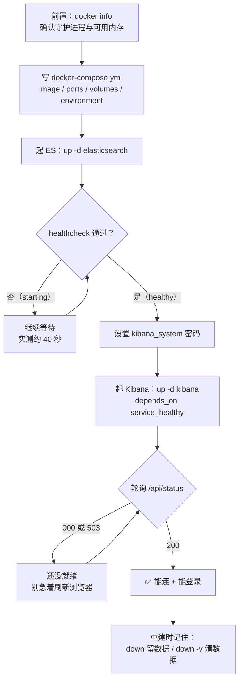

# 课 2：把 ELK 跑起来

> 一句话：用 Docker Compose 把 Elasticsearch + Kibana 立起来，并搞定 9.x 默认开启的安全配置——**跑起来只是开始，"能连、能登录、能重建"才算真会**。
> 阶段 1 · 第 2 课 ｜ 知识点：Compose 编排四件套 / 首次启动的安全配置 / 容器环境的观测与重建
> 状态：✅ 已交付（2026-09-06）｜ 版本基线：Elastic Stack **9.5.3** ｜ 环境：macOS arm64 + Docker Compose

---

## 🎯 本课目标

学完本课，你应该能：

1. 读懂一份 `docker-compose.yml` 的服务定义（`image` / `ports` / `volumes` / `environment`），并说清 **`depends_on` + `healthcheck` 为什么是"串行启动"的钥匙**
2. 搞定首次启动的**安全配置三件套**：`elastic` 超管密码、`kibana_system` 专用账号密码、HTTP 层 TLS 的取舍
3. 用 `docker compose logs` / `exec` / `ps` 观测容器，说清 **`down` 与 `down -v` 的差别**，并对"起不来"有基本排查思路

> **本课命令全部在本机真跑过**（macOS arm64 / Docker Desktop 29.4.1）。文中所有输出都是真实结果，不是抄文档。
> 配套文件：[`playground/01-minimal-stack/docker-compose.yml`](../../../playground/01-minimal-stack/docker-compose.yml)

## 📌 知识点导航

| # | 知识点 | 关键点 | 状态 |
|---|--------|--------|------|
| 1 | 2.1 Compose 编排四件套 | 服务定义（image / ports / volumes / environment）/ `depends_on` 与健康检查 / 容器网络与按服务名互访 | ✅ 已完成 |
| 2 | 2.2 首次启动的安全配置 | `elastic` 超级用户密码 / `kibana_system` 专用账号密码（与 enrollment token 两种方式的取舍）/ HTTP 层 TLS 的开关与代价 | ✅ 已完成 |
| 3 | 2.3 容器环境怎么观测与重建 | `logs` / `exec` / `ps` 各看什么 / `down` 与 `down -v` 的**实测对照** / 起不来时的排查路径 | ✅ 已完成 |

## 📖 本课在故事主线中的情节定位

第一幕推进到"**布阵**"：课 1 你已经知道"该往哪儿去"，但承接日志的全套设备还不存在。本课不再空谈——用一份 `docker-compose.yml` 把"**存储检索仓库 + 可视化展厅**"原地立起，让这条链路第一次有了能动手碰的实体。

**为什么本课只起两件、不是四件？** 因为 Logstash 和 Filebeat 要等"仓库"站住之后再接——**先让存储与界面可用，再接采集与处理，出问题时你才能一眼定位是哪一段坏了**。那两件在课 3《端到端走一遍》登场。

---

# 正文

## 🏛️ 第一幕 · 起源与场景引入

### 从"手工装机"到"一份文件"

早几年搭 ELK 是什么体验？先装 JDK，再挨个下载 ES / Logstash / Kibana 的压缩包，各自解压到不同目录，改各自的配置文件，按正确顺序启动，还得记住谁依赖谁——**换台机器就得重来一遍，且每一步都可能和上次不一样**。

容器把它压成了两件事：**镜像**把"装好的软件"打包带走，**编排文件**把"这几个东西怎么一起跑"写成配置。于是搭环境从"手工装机"变成了"**跑一条命令**"。

### 你兴冲冲打开终端

课 1 结束时，你（在想象中）已经有了 5 台机器和一次凌晨两点的告警。现在你决定动手了，于是熟练地敲下：

```bash
docker compose up -d
```

然后——**你以为这就完了？** 我们往下看。

## ❓ 第二幕 · 认知冲突

**你以为**：起个容器不就 `up -d` 一下，等它跑起来就能用了。

**真相有两个**，而且第二更隐蔽：

### 真相一：9.x 的安全是**默认开着**的

我第一次启动完 ES，满怀期待地敲下这句：

```bash
curl http://localhost:9200
```

得到的不是那个熟悉的 `"You Know, for Search"`，而是：

```json
{
  "error": {
    "root_cause": [{
      "type": "security_exception",
      "reason": "missing authentication credentials for REST request [/]",
      "header": { "WWW-Authenticate": ["Basic realm=\"security\", charset=\"UTF-8\"", "ApiKey"] }
    }],
    "type": "security_exception",
    "reason": "missing authentication credentials for REST request [/]",
    "header": { "WWW-Authenticate": ["Basic realm=\"security\", charset=\"UTF-8\"", "ApiKey"] }
  },
  "status": 401
}
```

**HTTP 401**。从 8.0 起，Elastic Stack 的安全功能（身份认证、TLS、权限控制）就是**默认启用**的。你没配凭据 → 一律拒之门外。

带上用户名密码再试：

```bash
curl -u elastic:ELKlearn2026 http://localhost:9200
```

```json
{
  "name" : "2d02d405bf00",
  "cluster_name" : "docker-cluster",
  "cluster_uuid" : "HLWTshVSRzGg6pQtmHdZSw",
  "version" : {
    "number" : "9.5.3",
    "build_flavor" : "default",
    "build_type" : "docker",
    "build_date" : "2026-09-01T16:11:59.322249404Z",
    "build_snapshot" : false,
    "lucene_version" : "10.5.1",
    "minimum_wire_compatibility_version" : "8.19.0",
    "minimum_index_compatibility_version" : "8.0.0"
  },
  "tagline" : "You Know, for Search"
}
```

**HTTP 200**。注意 `number: 9.5.3` —— 这就是我们的版本基线，从真实响应里读出来的，不是我写的。

### 真相二（更隐蔽）：容器"启动了" ≠ 服务"能用"

我起 Kibana 的时候，终端输出是这样的：

```text
Container elk-es Waiting
Container elk-es Healthy
Container elk-kibana Starting
Container elk-kibana Started
```

然后我轮询 Kibana 的状态端点：

```text
[10s] /api/status HTTP=000
[20s] /api/status HTTP=503
[30s] /api/status HTTP=200
```

三个数字代表三件事：**000 = 端口还没监听**（进程在初始化）、**503 = 服务起来了但还没就绪**（还在连 ES、建索引）、**200 = 真正可用**。

如果 Kibana 不等 ES 就绪就启动，它会在那儿连不上、重试、报错，浪费好几分钟。**"启动顺序"和"就绪顺序"是两件事**——这正是本课要讲的第一个知识点。

## 🔍 第三幕 · 层层揭示

---

### 知识点 2.1 · Compose 编排四件套

**一句话定义**
Docker Compose 用一个 YAML 文件描述"**几个容器怎么一起跑**"：用什么镜像、开哪些端口、数据存哪、传什么环境变量、以及**谁要等谁**。

**直觉建立（类比）**
把 `docker-compose.yml` 想成**一份餐厅开业清单**：

| 清单条目 | Compose 字段 | 干什么的 |
|---------|-------------|---------|
| 请哪位厨师、什么水平 | `image` | 用哪个镜像、哪个版本 |
| 店开在几号门牌 | `ports` | 容器端口映射到宿主机哪个端口 |
| 食材仓库在哪、要不要持久 | `volumes` | 数据存哪，删容器时数据留不留 |
| 这位厨师的个性化要求 | `environment` | 环境变量（密码、堆大小、各种开关） |
| 凉菜师傅到位了热菜才能开工 | `depends_on` + `healthcheck` | 启动依赖与就绪判定 |

**类比失效的边界**：餐厅的人会互相喊话，容器之间**默认互相看不见**——Compose 会给这组容器建一个**专用网络**，同一网络内的容器靠**服务名**互相解析（下面有实测）。另外餐厅歇业后厨师还在，容器停了进程就没了，只有**卷**里的数据留得下来。

**核心原理 · 四个关键字段**

看本课配套文件里的 ES 服务定义（有删减，完整版见 [`docker-compose.yml`](../../../playground/01-minimal-stack/docker-compose.yml)）：

```yaml
services:
  elasticsearch:
    image: docker.elastic.co/elasticsearch/elasticsearch:9.5.3   # ① 镜像 + 版本钉死
    container_name: elk-es
    environment:                                                  # ④ 环境变量
      - discovery.type=single-node        # 单节点模式，跳过集群选举
      - ELASTIC_PASSWORD=ELKlearn2026     # elastic 超管密码，9.x 必须显式给
      - ES_JAVA_OPTS=-Xms1g -Xmx1g        # 限制 JVM 堆，别把 Docker 的内存吃光
      - xpack.security.http.ssl.enabled=false   # 学习环境关掉 HTTP 层 TLS
    ports:
      - "9200:9200"                                               # ② 端口映射
    volumes:
      - es-data:/usr/share/elasticsearch/data                     # ③ 命名卷
    healthcheck:                                                  # ⑤ 健康检查
      test: ["CMD-SHELL", "curl -s -u elastic:ELKlearn2026 http://localhost:9200/_cluster/health | grep -qE '\"status\":\"(green|yellow)\"'"]
      interval: 10s
      timeout: 10s
      retries: 30
      start_period: 30s
```

逐个说清楚：

**① `image` —— 版本一定要钉死**
`elasticsearch:9.5.3` 而不是 `elasticsearch:latest`。**ELK 四件套的版本必须一致**（大版本不一致会报兼容性错误），`latest` 会让你在某次重启后莫名其妙升到新版。

开工前先确认这个镜像**真的存在、且支持你的芯片架构**。我本机是 Apple 芯片（arm64），实测：

```bash
docker manifest inspect docker.elastic.co/elasticsearch/elasticsearch:9.5.3
```

```json
{
   "schemaVersion": 2,
   "mediaType": "application/vnd.docker.distribution.manifest.list.v2+json",
   "manifests": [
      { "mediaType": "...", "digest": "sha256:7b69d47de...",
        "platform": { "architecture": "amd64", "os": "linux" } },
      { "mediaType": "...", "digest": "sha256:39ab4eab40...",
        "platform": { "architecture": "arm64", "os": "linux" } }
   ]
}
```

输出里同时有 `amd64` 和 `arm64` —— **官方镜像提供了 arm64 版本**，Docker 会自动挑匹配你芯片的那个。这一步值得养成习惯：**版本存不存在、架构支不支持，查 manifest 比猜快得多**。

**② `ports` —— 只有映射出来的端口才在宿主机可访问**
`"9200:9200"` 是"宿主机 9200 → 容器 9200"。Kibana 访问 ES 用的是**容器网络内部的 9200**，跟这个映射无关；映射是给你本机浏览器和 `curl` 用的。

**③ `volumes` —— 数据活在哪**
`es-data:/usr/share/elasticsearch/data` 用的是**命名卷**（在文件底部 `volumes:` 里声明）。命名卷由 Docker 管理，容器删了它还在。**这是后面 `down` 与 `down -v` 差别的根源**。

**④ `environment` —— 四个变量各有讲究**
- `discovery.type=single-node`：跳过集群选举和法定人数检查。**学习环境必备**，否则单节点集群会一直等"同伴"
- `ELASTIC_PASSWORD`：**9.x 不给密码 ES 拒绝启动**，这是硬性要求
- `ES_JAVA_OPTS=-Xms1g -Xmx1g`：我本机 Docker Desktop 分配了 **8.2GB**（`docker info` 实测 `MemTotal=8216915968`），给 ES 1GB 堆够用也不浪费
- `xpack.security.http.ssl.enabled=false`：学习环境关掉 HTTP 层 TLS，省掉自签证书这一步（**注意：关的是传输加密，账号密码认证依然开着**）。生产环境必须开回来，见知识点 2.2

**⑤ `healthcheck` + `depends_on` —— "启动了"和"能用了"的分界线**

这是本知识点**最值钱的一条**。看 Kibana 那边怎么写：

```yaml
  kibana:
    depends_on:
      elasticsearch:
        condition: service_healthy     # ← 关键在这行
```

`depends_on` 有两种写法，效果天差地别：

| 写法 | 含义 | 够用吗 |
|------|------|--------|
| `depends_on: [elasticsearch]`（短语法） | 只保证 **ES 容器先被创建并启动** | ❌ 不够。ES 启动到能服务要几十秒，Kibana 会在那之前就开始连接、失败、重试 |
| `depends_on: {elasticsearch: {condition: service_healthy}}` | 等到 ES 的 **healthcheck 真的通过**才启动 Kibana | ✅ 这才对 |

而 `condition: service_healthy` 能生效，前提是 ES **真的定义了 healthcheck**（上面 ⑤ 那段）。两者是配套的：**没有 healthcheck，`service_healthy` 无从谈起**。

我实测启动 Kibana 时的输出，就是这条链路的实证：

```text
Container elk-es Waiting        ← Compose 在等 ES
Container elk-es Healthy        ← healthcheck 通过
Container elk-kibana Starting   ← 这时才启动 Kibana
Container elk-kibana Started
```

**核心原理 · 容器网络：靠"服务名"互访**

同一份 compose 文件里的所有服务，会被放进一个**专用网络**，彼此用**服务名**当主机名互访。Kibana 配置里写的就是：

```yaml
      - ELASTICSEARCH_HOSTS=http://elasticsearch:9200     # 服务名，不是 IP，也不是 localhost
```

这是真能解析的，实测（从 Kibana 容器里查 ES 的地址）：

```bash
docker compose exec kibana getent hosts elasticsearch
```

```text
172.20.0.2      elasticsearch
```

⚠️ **这里有个高频坑**：在 Kibana 容器里写 `localhost:9200` 是连不到 ES 的——**容器里的 `localhost` 是它自己**。必须用服务名。

**常见误区**
- ❌ 用 `latest` 标签 —— 某次重启后版本变了，四件套版本还可能互不相容
- ❌ 以为 `depends_on` 短语法就能保证依赖就绪 —— 它只保证"先启动"，不保证"能用"
- ❌ 在容器里写 `localhost` 访问其他服务 —— 容器的 localhost 是它自己

**一句话记住**
Compose 管四件事：**用什么镜像（image）、开哪个门（ports）、数据存哪（volumes）、谁等谁（depends_on + healthcheck）**；而"谁等谁"能不能生效，**取决于你有没有定义 healthcheck**。

📚 官方文档：[Elasticsearch Docker 部署](https://www.elastic.co/docs/deploy-manage/deploy/self-managed/install-elasticsearch-with-docker) ｜ [Kibana Docker 部署](https://www.elastic.co/docs/deploy-manage/deploy/self-managed/install-kibana-with-docker)

---

### 知识点 2.2 · 首次启动的安全配置

**一句话定义**
9.x 的 Elastic Stack **默认开启安全**，首次启动要处理三样东西：**`elastic` 超管密码**、**Kibana 连接 ES 用的专用账号凭据**、以及**HTTP 层是否启用 TLS**。

**直觉建立（类比）**
把这套安全配置想成**新公司入职第一天**：

| 安全配置 | 类比 |
|---------|------|
| `elastic` 超管密码 | **总经理的门禁卡**：能去任何地方，但不能谁都拿着 |
| `kibana_system` 账号 | **前台的专用工牌**：只够开门和查系统，权限刚好够干活，丢了损失可控 |
| HTTP 层 TLS | **公司到地铁口的班车**：现在是内部道路（本机）可以走路，但只要是公网就必须上车（加密） |

**类比失效的边界**：门禁卡丢了可以挂失，**凭据泄露的代价是"数据全泄"**，所以生产环境密码必须进密钥管理。另外关掉 TLS 不等于关掉安全——**认证和授权还开着**，只是通信内容不加密。

**核心原理 · 三件事逐个落地**

**① `elastic` 超级用户密码**

9.x 里这是**硬性要求**：不设密码，ES 容器直接拒绝启动。在 compose 里就是一行：

```yaml
      - ELASTIC_PASSWORD=ELKlearn2026
```

这个 `elastic` 用户拥有**全部权限**，是我们后续所有操作的入口（创建索引、设其他用户密码、在 Kibana 登录）。

> ⚠️ **关于本课出现的明文密码**：`ELKlearn2026` / `KibanaSys2026` 是**学习环境的固定密码**，明文写在配套 compose 文件里，只为让你能**逐字复制粘贴就跑通**。生产环境请务必用 Docker secret / Vault / K8s Secret 管理，**切勿照抄**。

**② Kibana 靠什么连 ES：两种方式**

| 方式 | 怎么做 | 前提 | 适用 |
|------|--------|------|------|
| **enrollment token**（官方引导流程） | ES 生成一次性令牌 → Kibana 启动时带上它，自动完成连接配置 | **要求 ES 开启 HTTPS** | 官方推荐的生产/标准流程 |
| **`kibana_system` 账号密码**（本课用这种） | 手动给内置账号 `kibana_system` 设密码 → 写进 Kibana 的环境变量 | 无特殊要求 | 简单直接，学习环境首选 |

**本课用第二种**，理由很实在：我们在 compose 里关掉了 HTTP 层 TLS（`xpack.security.http.ssl.enabled=false`），而 **enrollment token 的交换过程依赖 TLS 保护**，没有 HTTPS 就走不通这条路。

设置命令（ES 起来之后执行）：

```bash
curl -u elastic:ELKlearn2026 -X POST "http://localhost:9200/_security/user/kibana_system/_password" \
  -H 'Content-Type: application/json' \
  -d '{"password":"KibanaSys2026"}'
```

```text
{}
[HTTP 200]
```

返回空对象 `{}` 就是成功。然后 Kibana 这边配上：

```yaml
      - ELASTICSEARCH_USERNAME=kibana_system
      - ELASTICSEARCH_PASSWORD=KibanaSys2026
```

**为什么不让 Kibana 直接用 `elastic` 超管账号？** 因为**最小权限原则**：`kibana_system` 是 ES 内置的服务账号，权限刚好够 Kibana 干活；`elastic` 能干任何事。用超管账号跑日常服务，等于把总经理门禁卡插在门上不拔。

> ⏳ **置信度说明**：enrollment token 的具体命令（`elasticsearch-create-enrollment-token`）与"依赖 HTTPS"这一前提，依据官方文档描述，**本课未实测**（因为本环境关闭了 HTTP TLS）。阶段 4 涉及完整安全配置时会补实机验证。

**③ HTTP 层 TLS：我们关了它，但要清楚代价**

```yaml
      - xpack.security.http.ssl.enabled=false
```

关掉之后：`curl` 可以直接打 HTTP，不用处理自签证书（否则 macOS 的 curl 会因为证书校验失败报 `(60) SSL certificate problem`，还得加 `-k` 或指定 CA）。

**但必须清楚这关掉的是什么**：

| 能力 | 关掉 `http.ssl` 后 |
|------|-------------------|
| 身份认证（账号密码） | ✅ **依然开启**（前面 401 就是证据） |
| 权限控制（RBAC） | ✅ 依然开启 |
| **传输内容加密** | ❌ **明文传输** |

本机学习环境里，数据不出你的电脑，明文无所谓。**任何跨网络的部署都必须把 TLS 开回来**——否则密码和数据都在网络上裸奔。

**示例演示**：见第四幕（完整走一遍）。

**常见误区**
- ❌ "我起了 ES 就能连上" —— 9.x 默认要凭据，没配就是 401
- ❌ "关了 TLS 就是关了安全" —— 认证与授权都还在，只是通信不加密
- ❌ 让 Kibana 用 `elastic` 超管账号连 ES —— 违反最小权限原则
- ❌ 把 `ELASTIC_PASSWORD` 这类配置提交进代码仓库 —— 生产环境必须走密钥管理

**一句话记住**
9.x 的安全是**默认开着**的：`elastic` 是超管入口（9.x 不设密码不让启动）、Kibana 该用 `kibana_system` 专用账号、TLS 学习环境可关但**生产必须开**。

📚 官方文档：[Elasticsearch Docker 部署](https://www.elastic.co/docs/deploy-manage/deploy/self-managed/install-elasticsearch-with-docker)

---

### 知识点 2.3 · 容器环境怎么观测与重建

**一句话定义**
容器里的一切都要"隔空"观察：`logs` 看它在说什么、`exec` 进去看它有什么、`ps` 看它活着没；而"重建"的关键是搞清楚**哪些东西在容器外（卷）**，删的时候**删到哪一层**。

**直觉建立（类比）**
把容器想成**一辆房车**：

- `logs` = **行车记录仪**：它一路说了什么、抱怨了什么，都在里面
- `exec` = **上车查看**：开个门进去翻翻抽屉
- `ps` = **仪表盘**：现在在不在跑、状态正不正常
- 卷（volume）= **车外挂的储物箱**：车（容器）报废了，箱子还在

**类比失效的边界**：房车的储物箱要手动挂上去；**Compose 的卷是自动挂载的**，但也正因为自动，很多人压根不知道它的存在，于是"删了容器以为数据也没了"（其实还在）或者"想清数据却清不掉"（因为没删卷）。

**核心原理 · 观测三件套**

```bash
# ① 看日志：排障的第一现场
docker compose logs -f elasticsearch        # -f = 跟随（实时滚动）
docker compose logs --tail=2 elasticsearch  # 只看最后几行

# ② 进容器：看它内部到底有什么
docker compose exec elasticsearch pwd
docker compose exec elasticsearch ls /usr/share/elasticsearch/data

# ③ 看状态：谁在跑、健康检查过没过
docker compose ps
```

我实测的输出：

```bash
docker compose exec elasticsearch ls /usr/share/elasticsearch/data
```

```text
_state
indices
node.lock
nodes
snapshot_cache
```

看，`indices` 在这儿——**你的数据在这堆目录里**，而它们位于**卷**中，不在容器里。

`docker compose ps` 的输出长这样：

```text
NAME         IMAGE                                                 COMMAND                  SERVICE         CREATED          STATUS                    PORTS
elk-es       docker.elastic.co/elasticsearch/elasticsearch:9.5.3   "/bin/tini -- /usr/l…"   elasticsearch   14 minutes ago   Up 14 minutes (healthy)   0.0.0.0:9200->9200/tcp, [::]:9200->9200/tcp
elk-kibana   docker.elastic.co/kibana/kibana:9.5.3                 "/bin/tini -- /usr/l…"   kibana          22 seconds ago   Up 21 seconds             0.0.0.0:5601->5601/tcp, [::]:5601->5601/tcp
```

注意 ES 那一行的 `(healthy)` —— 这是 healthcheck 通过的标志。**Kibana 那行没有**，因为我们没给它定义 healthcheck（它的就绪状态要自己用 `/api/status` 探测，见第二幕）。

**核心原理 · `down` 与 `down -v`：删到哪一层**

这两个命令只差一个 `-v`，后果天差地别。我做了一组对照实验，先看结果：

| 命令 | 删掉什么 | 卷还在吗 | 数据还在吗 |
|------|---------|---------|-----------|
| `docker compose down` | 容器 + 网络 | ✅ 在 | ✅ 在 |
| `docker compose down -v` | 容器 + 网络 **+ 卷** | ❌ 没了 | ❌ 没了 |

**实测过程（这是本课最有价值的一组证据）**

先写一条测试文档当"标记物"：

```bash
curl -u elastic:ELKlearn2026 -X POST "http://localhost:9200/elk-lesson02-test/_doc/1" \
  -H 'Content-Type: application/json' \
  -d '{"message":"这条文档用来验证 down 与 down -v 的差别","lesson":"lesson-02"}'
```

```json
{"_index":"elk-lesson02-test","_id":"1","_version":1,"result":"created","_shards":{"total":2,"successful":1,"failed":0},"_seq_no":0,"_primary_term":1}
[HTTP 201]
```

**第一轮：`down`（不带 -v）**

```bash
docker compose down
```

```text
Container elk-es Stopping
Container elk-es Stopped
Container elk-es Removing
Container elk-es Removed
Network 01-minimal-stack_default Removing
Network 01-minimal-stack_default Removed
```

注意输出里**没有 "Volume ... Removing"**。查一下卷：

```bash
docker volume ls | grep 01-minimal-stack
```

```text
local     01-minimal-stack_es-data      ← 卷还在
```

重新启动后查那条文档：

```text
{"_index":"elk-lesson02-test","_id":"1","_version":1,"_seq_no":0,"_primary_term":1,"found":true,"_source":{"message":"这条文档用来验证 down 与 down -v 的差别","lesson":"lesson-02"}}
[HTTP 200]
```

**`found: true`** —— 数据完好无损。

**第二轮：`down -v`**

```bash
docker compose down -v
```

```text
Container elk-es Stopping
Container elk-es Stopped
Container elk-es Removing
Container elk-es Removed
Network 01-minimal-stack_default Removing
Volume 01-minimal-stack_es-data Removing      ← 多了这两行
Volume 01-minimal-stack_es-data Removed
Network 01-minimal-stack_default Removed
```

再查卷：**空**（已被删除）。重新启动后查文档：

```json
{
  "error": {
    "root_cause": [{
      "type": "index_not_found_exception",
      "reason": "no such index [elk-lesson02-test]",
      "resource.type": "index_or_alias",
      "resource.id": "elk-lesson02-test",
      "index_uuid": "_na_",
      "index": "elk-lesson02-test"
    }],
    "type": "index_not_found_exception",
    "reason": "no such index [elk-lesson02-test]",
    "resource.type": "index_or_alias",
    "resource.id": "elk-lesson02-test",
    "index_uuid": "_na_",
    "index": "elk-lesson02-test"
  },
  "status": 404
}
```

**HTTP 404，索引没了。**

**⚠️ 一个连带后果（很容易被忽略）**：用户账号信息也存在 ES 里，所以卷一删，**你之前设的 `kibana_system` 密码也一起没了**。实测：

```bash
curl -u kibana_system:KibanaSys2026 -o /dev/null -w "HTTP %{http_code}\n" http://localhost:9200
```

```text
HTTP 401
```

**所以 `down -v` 重建之后，必须重新设置 `kibana_system` 密码**，否则 Kibana 连不上 ES。这时候 ES 日志里会出现这样的内容（实测原文）：

```json
{"@timestamp":"2026-09-06T06:45:57.920Z","log.level": "INFO","message":"Authentication of [kibana_system] was terminated by realm [reserved] - failed to authenticate user [kibana_system]", ...}
```

看到这条，根因就清楚了：**不是 Kibana 坏了，是凭据失效了**。

**核心原理 · 起不来时的排查路径**

先看状态，再看日志，最后进去看：

```bash
docker compose ps                          # 谁没起来？STATUS 那列写的什么？
docker compose logs --tail=50 <服务名>      # 它最后说了什么？
docker compose exec <服务名> <命令>          # 进去看配置/目录对不对
```

关于 **macOS 上"容器反复重启"**这个常见症状，我要**如实说明一件我没做到的事**：

> ⏳ **诚实标注**：我试图在本机复现"Docker 内存不足导致 ES 被 OOM kill"这个经典场景——给容器设 **1GB 内存上限**、JVM 堆设 **900MB**。结果 **没能触发**：ES 9.5.3 正常启动、集群变 GREEN、`docker inspect` 显示 `OOMKilled=false`（容器最后是被我的超时命令终止，退出码 143，不是 OOM）。
>
> 更极端的参数（容器 1GB + 堆 1500MB）我**没有完成实测**。
>
> 所以下面给的是**排查方法**（可靠），而不是"我复现出来的报错原文"（未复现，不编造）：

排查思路（按这个顺序）：

1. **先确认是不是 OOM**：`docker inspect <容器名> --format 'ExitCode={{.State.ExitCode}} OOMKilled={{.State.OOMKilled}}'`
   - `OOMKilled=true` 或 `ExitCode=137`（137 = 128 + SIGKILL 9）→ 内存不够被杀
   - 其他退出码 → 不是内存问题，回去看日志
2. **看 Docker Desktop 分了多少内存**：`docker info --format '{{.MemTotal}}'`（我本机是 `8216915968`，约 8.2GB）
3. **两条解法**：① 在 Docker Desktop → Settings → Resources 里调大内存；② 把 `ES_JAVA_OPTS` 的 `-Xmx` 调小（建议不超过 Docker 总内存的一半）

**常见误区**
- ❌ `docker compose down` 之后以为数据清了 —— **清数据要 `-v`**
- ❌ 反过来，想重置环境却忘了 `-v`，结果旧数据阴魂不散
- ❌ 容器起不来就瞎改配置 —— **先看日志**，`logs` 里基本都写了原因
- ❌ `down -v` 重建后 Kibana 连不上，以为是网络问题 —— 其实是 **`kibana_system` 密码被一起删了**

**一句话记住**
`logs` 看它说了什么、`exec` 进去看它有什么、`ps` 看它活着没；**`down` 只删容器，`down -v` 连数据一起删**（密码也会没，重建后要重设）。

---

## 🛠️ 第四幕 · 实操验证

下面是从零到"能连能登录"的完整流程，**每一步我都真跑过**。

**准备**：完整文件在 [`playground/01-minimal-stack/docker-compose.yml`](../../../playground/01-minimal-stack/docker-compose.yml)，直接复制即可。

### 第 0 步 · 确认 Docker 守护进程活着

macOS 上 Docker Desktop 默认不开机自启，这是最容易被忽略的前置：

```bash
docker info --format '{{.ServerVersion}}'
```

如果报 `failed to connect to the docker API at unix:///Users/.../docker.sock`，说明守护进程没起来。打开 Docker Desktop（也可以 `open -a Docker`），等它就绪。我本机：

```text
ServerVersion=29.4.1 OS=linux Arch=aarch64 MemTotal=8216915968
```

记下 `MemTotal`——**这决定了你后面能给 ES 分多少堆**。

### 第 1 步 · 只起 ES，等它 healthy

```bash
cd playground/01-minimal-stack
docker compose up -d elasticsearch
```

```text
Network 01-minimal-stack_default Creating
Network 01-minimal-stack_default Created
Volume 01-minimal-stack_es-data Creating
Volume 01-minimal-stack_es-data Created
Container elk-es Creating
Container elk-es Created
Container elk-es Starting
Container elk-es Started
```

**注意：这时它还没好。** 等健康检查：

```bash
docker inspect --format '{{.State.Health.Status}}' elk-es
```

实测每 10 秒查一次的结果：

```text
[10s] health=starting
[20s] health=starting
[30s] health=starting
[40s] health=healthy      ← 40 秒才真正可用
```

### 第 2 步 · 验证安全是开着的（认知冲突的现场）

```bash
curl http://localhost:9200                        # 不带凭据
curl -u elastic:ELKlearn2026 http://localhost:9200   # 带凭据
```

第一条 **HTTP 401**（`missing authentication credentials for REST request [/]`），第二条 **HTTP 200** 返回版本信息。这就是 9.x 的默认安全。

顺手确认集群状态：

```bash
curl -u elastic:ELKlearn2026 "http://localhost:9200/_cluster/health?pretty"
```

```json
{
  "cluster_name" : "docker-cluster",
  "status" : "green",
  "number_of_nodes" : 1,
  "active_primary_shards" : 3,
  "active_shards" : 3,
  "unassigned_shards" : 0,
  "active_shards_percent_as_number" : 100.0
}
```

### 第 3 步 · 给 Kibana 准备专用账号

```bash
curl -u elastic:ELKlearn2026 -X POST "http://localhost:9200/_security/user/kibana_system/_password" \
  -H 'Content-Type: application/json' \
  -d '{"password":"KibanaSys2026"}'
```

```text
{}
[HTTP 200]
```

### 第 4 步 · 起 Kibana，看"等待依赖"的真实过程

```bash
docker compose up -d kibana
```

```text
Container elk-es Waiting          ← 在等 ES
Container elk-es Healthy          ← healthcheck 通过
Container elk-kibana Starting     ← 这时才启动
Container elk-kibana Started
```

这段输出就是 `condition: service_healthy` 的实证。

### 第 5 步 · 等 Kibana 真正就绪（000 → 503 → 200）

```bash
curl -s -o /dev/null -w "%{http_code}\n" http://localhost:5601/api/status
```

```text
[10s] HTTP 000     ← 端口还没监听
[20s] HTTP 503     ← 进程起来了，但还没就绪
[30s] HTTP 200     ← 可用了
```

**别在 503 阶段就去浏览器刷新**，那时候它还在初始化。

### 第 6 步 · 验证 Kibana 登录

```bash
curl -s -o /dev/null -w "HTTP %{http_code}\n" "http://localhost:5601/api/spaces/space" -H 'kbn-xsrf: true'
curl -s -u elastic:ELKlearn2026 "http://localhost:5601/api/spaces/space" -H 'kbn-xsrf: true'
```

第一条 **HTTP 401**（没凭据），第二条 **HTTP 200**：

```json
[{"id":"default","name":"Default","description":"This is your default space!","color":"#00bfb3","disabledFeatures":[],"_reserved":true}]
```

**Kibana 能认证、能返回数据** —— 到这一步，"跑起来"才算真的完成。

> 💡 顺带一个实测细节：`kbn-xsrf` 这个头是 Kibana 的 CSRF 防护要求，**写操作（POST/PUT/DELETE）必须带**，本次 GET 实测不带也返回 200。

### 第 7 步 · 亲手验证 `down` 与 `down -v` 的差别

按知识点 2.3 那套走一遍：写文档 → `down` → 重启 → 文档还在 → `down -v` → 重启 → 文档没了 + `kibana_system` 401。

**这是本课最值得亲手做的一步**——做过一次，你就再也不会搞混这两个命令。

## 🧭 第五幕 · 体系收束

### 一图收束：从一条命令到一个能用的栈



### 三句话记住本课

1. **`depends_on` 只保证"先启动"，`condition: service_healthy` 才保证"能用"** —— 而后者要靠 `healthcheck` 支撑
2. 9.x 的安全**默认开着**：`elastic` 是超管入口，Kibana 该用 `kibana_system` 专用账号，**TLS 学习环境可关、生产必须开**
3. **`down` 只删容器，`down -v` 连卷带数据一起删**（密码也会没，重建后要重设）

### 拿到的"底图"（课 3 要用）

| 项目 | 值 |
|------|-----|
| Elasticsearch | `http://localhost:9200`，超管 `elastic` / `ELKlearn2026` |
| Kibana | `http://localhost:5601`，用 `elastic` 登录 |
| 数据卷 | `01-minimal-stack_es-data` |
| 配置文件 | [`playground/01-minimal-stack/docker-compose.yml`](../../../playground/01-minimal-stack/docker-compose.yml) |

### 埋下的伏笔

| 本课留下的疑问 | 在哪一课回答 |
|---------------|-------------|
| 数据怎么从日志文件进到 ES？ | **课 3《端到端走一遍》**（加 Filebeat） |
| Logstash 什么时候登场？ | 课 3 先跳过，阶段 3 系统讲 |
| 9.x 完整的 TLS 与 enrollment token 怎么配？ | 阶段 4（生产落地部分） |
| 这俩容器的日志我怎么看、出问题怎么查？ | 阶段 4 课 12 + 收尾的排障手册 |

---

## 🐞 常见误区

1. **"起个容器不就 `up -d` 一下"** —— 9.x 默认开安全，没配凭据就是 401；而且"启动了"不等于"能用"（Kibana 要 20-30 秒才就绪）
2. **用 `latest` 标签** —— 某次重启后版本悄悄变了，四件套还可能版本不兼容。**版本钉死**
3. **以为 `depends_on` 能保证依赖就绪** —— 短语法只保证"先启动"，要 `condition: service_healthy` + `healthcheck` 配套
4. **在容器里用 `localhost` 访问其他服务** —— 容器的 localhost 是它自己，要用**服务名**
5. **`docker compose down` 后以为数据清了** —— 卷还在。真要清数据用 `down -v`
6. **`down -v` 重建后 Kibana 连不上，以为是网络故障** —— 其实是 `kibana_system` 密码被一起删了，重设即可
7. **让 Kibana 用 `elastic` 超管账号连 ES** —— 违反最小权限原则，应该用 `kibana_system`
8. **关了 `http.ssl` 就以为"安全关了"** —— 认证与授权都还在，只是传输不加密。本机无所谓，**跨网络必须开回来**

## 📋 命令速查卡

| 命令 | 作用 | 坑 |
|------|------|-----|
| `docker info --format '{{.MemTotal}}'` | 看 Docker 可用内存 | macOS 上守护进程默认不开机自启，先 `open -a Docker` |
| `docker manifest inspect <镜像:版本>` | 确认镜像存在 + 支持哪些架构 | 输出是 JSON，字段带空格，别用简单 grep 抓 `architecture` |
| `docker compose up -d <服务名>` | 后台起指定服务 | 只写服务名可"分步起"，便于观察依赖顺序 |
| `docker inspect --format '{{.State.Health.Status}}' <容器名>` | 查健康检查状态 | `starting` → `healthy` 要等几十秒，别以为卡住了 |
| `docker compose ps` | 看各服务状态与端口 | `(healthy)` 后缀只在定义了 healthcheck 的服务上出现 |
| `docker compose logs -f <服务名>` | 跟随日志（排障第一现场） | `--tail=N` 只看最后 N 行，日志是 JSON 格式很长 |
| `docker compose exec <服务名> <命令>` | 进容器执行命令 | 服务名 ≠ 容器名；`exec` 的是**服务** |
| `docker compose exec kibana getent hosts elasticsearch` | 验证容器网络按服务名解析 | 容器里 `localhost` 是自己，访问别的服务必须用服务名 |
| `curl -u elastic:<密码> http://localhost:9200` | 带凭据访问 ES | 9.x 不带凭据一律 401 |
| `docker compose down` | 停并删容器 + 网络（**保留卷**） | 数据还在 |
| `docker compose down -v` | 停并删容器 + 网络 + **卷** | ⚠️ 数据全没，**密码也一起没**，重建后要重设 |
| `docker inspect <容器> --format '{{.State.OOMKilled}} {{.State.ExitCode}}'` | 判断是否被 OOM 杀掉 | `OOMKilled=true` 或 `ExitCode=137` 才是内存问题 |

## ✅ 自检三问

<details>
<summary><b>问题 1</b>：compose 里写了 <code>depends_on: [elasticsearch]</code>，Kibana 有时能起来有时连不上 ES，为什么？怎么改？</summary>

**因为短语法的 `depends_on` 只保证"ES 容器先被创建并启动"，不保证"ES 已经能提供服务"。**

ES 从进程启动到能响应请求要几十秒（我实测 40 秒才 healthy）。Kibana 在这之前就启动的话，会连不上、重试、报错，运气好最后能连上，运气不好就一直转圈。

**改法两步，缺一不可：**

```yaml
  elasticsearch:
    # 第一步：给 ES 定义 healthcheck（告诉别人"怎样算我好了"）
    healthcheck:
      test: ["CMD-SHELL", "curl -s -u elastic:<密码> http://localhost:9200/_cluster/health | grep -qE '\"status\":\"(green|yellow)\"'"]
      interval: 10s
      timeout: 10s
      retries: 30

  kibana:
    # 第二步：用长语法声明"等到 healthy 才启动我"
    depends_on:
      elasticsearch:
        condition: service_healthy
```

**只写第二步不写第一步是没用的**——`service_healthy` 依赖 healthcheck 的结果，没有 healthcheck 这个条件永远不成立。

</details>

<details>
<summary><b>问题 2</b>：你执行了 <code>docker compose down -v</code> 然后重新 <code>up -d</code>，ES 起来了但 Kibana 一直连不上。列出排查步骤。</summary>

**先看一个高概率根因：卷被删了，你之前设的 `kibana_system` 密码也没了。**

用户账号信息存在 ES 里（也就是在卷里），卷一删，密码回到未设置状态。实测此时用旧密码访问 ES 返回 **HTTP 401**，ES 日志里会写：

```text
Authentication of [kibana_system] was terminated by realm [reserved] - failed to authenticate user [kibana_system]
```

**排查步骤（按这个顺序）：**

1. `docker compose ps` —— 两个容器都在跑吗？ES 是 `(healthy)` 吗？
2. `docker compose logs --tail=50 kibana` —— Kibana 自己说连不上还是别的错？
3. `docker compose logs --tail=50 elasticsearch | grep kibana_system` —— **有没有认证失败的日志？**有就确认是凭据问题
4. 用旧密码直接打 ES 验证：`curl -u kibana_system:<旧密码> -o /dev/null -w "%{http_code}\n" http://localhost:9200` —— **401 就坐实了**
5. **修复**：重新设置密码，再重启 Kibana

```bash
curl -u elastic:ELKlearn2026 -X POST "http://localhost:9200/_security/user/kibana_system/_password" \
  -H 'Content-Type: application/json' -d '{"password":"KibanaSys2026"}'
docker compose up -d kibana
```

**这道题的教训**：`down -v` 不只是"删数据"，它把**安全配置一起删了**。重建环境时，"重设服务账号密码"是必做的一步。

</details>

<details>
<summary><b>问题 3</b>：判断正误——"我把 <code>xpack.security.http.ssl.enabled</code> 设成 false，就等于把 ES 的安全关了，本机学习环境这样最省事。"</summary>

**前半句错，后半句对。**

**错在哪**：这个开关只关掉 **HTTP 层的传输加密（TLS）**，**不影响身份认证与权限控制**。实测证据就是——关掉之后不带凭据访问 ES，照样返回 **HTTP 401** `missing authentication credentials for REST request [/]`。认证好端端地开着。

**对在哪**：本机学习环境确实可以这样省事——不用处理自签证书，macOS 的 curl 不会因为证书校验失败而报 `(60) SSL certificate problem`，命令能直接复制粘贴跑通。

**正确的说法是**：

| 能力 | 关掉 http.ssl 之后 |
|------|-------------------|
| 身份认证（账号密码） | ✅ 依然开启 |
| 权限控制（RBAC） | ✅ 依然开启 |
| 传输内容加密 | ❌ 明文 |

**所以**：数据不出本机 → 可以这样省事；**任何跨网络访问 → 必须把 TLS 开回来**，否则密码和数据在网络上裸奔。

</details>

## 🚀 下一批接力提示词

> 学完本课后，**复制下面这段文字发给 AI**，即可无缝进入下一课（无需重新描述上下文）：

```text
继续学 ELK。我的学习档案在 elasticsearch/elk/00-学习档案.md，
刚学完阶段 1《全景与起步》课 2《把 ELK 跑起来》
（知识点：Compose 编排四件套 / 首次启动的安全配置 / 容器环境的观测与重建），
请按大纲继续讲解下一课：课 3《端到端走一遍》
（知识点：最小链路亲手跑通 / 一条数据长什么样 / 组件间的契约）。

要求：
- 按五幕结构 + 知识点六要素写正文，填进既有骨架文件
- 版本基线 Elastic Stack 9.5.3，命令用 macOS + Docker Compose 写法
- 本课要在课 2 的两件套基础上加 Filebeat，跑通"日志文件 → Filebeat → ES → Kibana"最小链路
- 每条命令必须真跑一遍再写进讲义
- 写完过事实核查闸门 + 双视角评审，P0 清零后勾选评审清单对应条目

本机现状：ES http://localhost:9200（elastic/ELKlearn2026）、Kibana http://localhost:5601，
配套文件在 elasticsearch/elk/playground/01-minimal-stack/docker-compose.yml。
```

## 🧭 课程导航

| 上一课 | 本课 | 下一课 |
|--------|------|--------|
| [课 1 · 一条日志的旅程](lesson-01-一条日志的旅程.md) | **课 2 把 ELK 跑起来** | [课 3 · 端到端走一遍](lesson-03-端到端走一遍.md) |

- **本阶段**：[阶段 1 概览](../overview.md) ｜ **阶段路径图**：[stage-1-path.svg](../assets/stage-1-path.svg)
- **配套文件**：[`playground/01-minimal-stack/docker-compose.yml`](../../../playground/01-minimal-stack/docker-compose.yml)
- **返回目录**：[ELK 课程目录](../../../02-课程目录.md)
- **衔接 ES 主课**：[ES 主课 13《三大主战场》](../../../../stages/5-生产与选型/lessons/lesson-13-三大主战场.md)（安全与权限）

> 📌 **本课数据来源**：2026-09-06 于 macOS arm64 / Docker Desktop 29.4.1（VM 8.2GB）实测。全部命令与输出均真实执行获得；**唯一未能复现的是"内存不足导致 OOM"场景**（1GB 上限 + 900MB 堆下 ES 正常启动，`OOMKilled=false`），相关部分已如实标注为"排查方法"而非实测报错。
